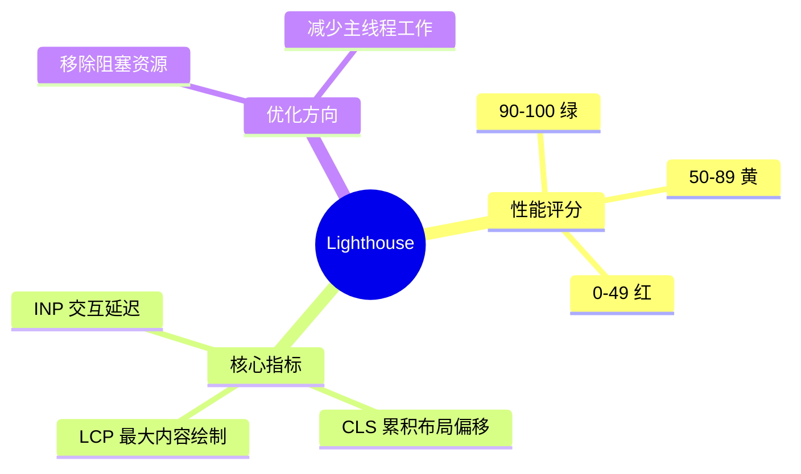

# 性能指标与诊断

## 1. Lighthouse 性能评分

**Lighthouse 评分体系：**



**Lighthouse 评分体系：**

**Lighthouse 评分体系：**


| 评分 | 等级 | 说明 |
|------|------|------|
| 90-100 | 绿 | 优秀 |
| 50-89 | 黄 | 需要改进 |
| 0-49 | 红 | 差 |

```javascript
// Lighthouse 使用：
// 1. Chrome DevTools → Lighthouse面板
// 2. `npx lighthouse https://example.com --output html`
// 3. PageSpeed Insights（Google在线工具）
// 4. Chrome插件：Lighthouse Checker

// 优化建议：
// 1. 移除阻塞渲染的资源
// 2. 减少主线程工作（JS执行时间）
// 3. 优化图片（格式/大小/懒加载）
// 4. 减少未使用的JS/CSS
// 5. 使用现代图片格式（WebP/AVIF）
```

## 2. Core Web Vitals

**核心网页指标：**

| 指标 | 名称 | 达标标准 | 说明 |
|------|------|---------|------|
| LCP | 最大内容绘制 | ≤2.5s | 首屏加载体验 |
| CLS | 累积布局偏移 | ≤0.1 | 视觉稳定性 |
| INP | 交互延迟 | ≤200ms | 响应速度（新TTI） |
| FID | 首次输入延迟 | ≤100ms | 旧指标（被INP替代） |
| FCP | 首次内容绘制 | ≤1.8s | 页面开始显示 |
| TTFB | 首字节时间 | ≤0.8s | 服务器响应速度 |
| TTI | 可交互时间 | ≤3.8s | 完全可交互 |
| TBT | 总阻塞时间 | ≤200ms | JS阻塞主线程时间 |

```javascript
// FID → INP：
// - FID只测量第一次交互的延迟
// - INP（Interaction to Next Paint）测量整个页面生命周期中所有交互
// - INP = 从用户交互到下一帧渲染的最大延迟

// 如何优化CLS（布局偏移）：
// 1. 为图片/视频指定宽高（aspect-ratio）
// 2. 不要在内容上方动态插入广告/弹窗
// 3. font-display: optional（字体不阻塞，FOIT/FOUT减少）
// 4. 避免iframe
// 5. 使用CSS transform做动画（不触发重排）

// 如何优化LCP：
// 1. 优化关键内容（通常是hero图片或首屏大文本）
// 2. preload最大的LCP资源（<link rel="preload">）
// 3. 使用现代图片格式（WebP/AVIF）
// 4. 使用content-visibility: auto（跳过屏外渲染）
// 5. 服务端渲染（SSR）

// 如何优化INP：
// 1. 减少主线程阻塞（代码分割、web worker）
// 2. 长任务拆分（requestIdleCallback）
// 3. 避免大layout thrashing（批量DOM读写）
// 4. 减少reflow/repaint
```

## 3. 性能瓶颈定位

```javascript
// 性能监控工具：
// 1. Performance API（浏览器原生）
const observer = new PerformanceObserver((list) => {
  list.getEntries().forEach(entry => {
    console.log(`${entry.name}: ${entry.duration}ms`);
  });
});
observer.observe({ entryTypes: ['measure', 'paint', 'resource'] });

// 获取关键指标：
const paintEntries = performance.getEntriesByType('paint');
const lcpEntry = performance.getEntriesByName('largest-contentful-paint')[0];

// 2. Chrome DevTools Performance面板
// 录制页面操作 → 查看火焰图 → 找到长任务/重排/重绘

// 3. Chrome DevTools Network面板
// 瀑布图分析：请求排队、TTFB、下载时间

// 4. Lighthouse（自动评分+建议）
// DevTools → Lighthouse → Generate report

// 5. Web Vitals库（收集真实用户数据）
import { onCLS, onLCP, onINP, onFCP, onTTFB } from 'web-vitals';
onLCP(metric => sendToAnalytics({ name: metric.name, value: metric.value }));

// 常见瓶颈及解决：
// 1. 长任务（Long Task）> 50ms
//   解决：代码分割、web worker、requestIdleCallback

// 2. 大DOM重排（Reflow）
//   解决：批量DOM操作、transform替代top/left、使用will-change

// 3. 重复计算（Layout Thrashing）
//   解决：读写分离，不要在读里面写
function badPattern() {
  for (const el of elements) {
    const w = el.offsetWidth;     // 读（触发reflow）
    el.style.width = w + 'px';    // 写
  }
}
function goodPattern() {
  const widths = elements.map(el => el.offsetWidth); // 读
  elements.forEach((el, i) => {      // 写
    el.style.width = widths[i] + 'px';
  });
}

// 4. 大图片未压缩
//   解决：WebP + 懒加载 + 响应式srcset

// 5. JS阻塞解析
//   解决：defer/async/动态import
```

## 深入阅读与参考

!!! tip "怎么用这些资料"
    先读「官方文档与规范」建立准确的概念，再读「源码与示例」核对细节，最后用「教程、书籍与视频」换一种讲法加深理解。每条都写明了读哪一节、带着什么问题读。

### 官方文档与规范

| 资源 | 为什么读 | 怎么读 |
|---|---|---|
| [Core Web Vitals](https://web.dev/articles/vitals) | LCP/INP/CLS 的官方定义与阈值，是全部优化动作的判定基准。 | 先读三项指标的阈值表与测量时机，再对照自站实测值判断优劣。 |
| [Web Vitals 现场测量最佳实践](https://web.dev/articles/vitals-field-measurement-best-practices) | 把指标从实验室搬到真实用户，避免只盯着 Lighthouse 分数。 | 带着“我的上报是否覆盖真实用户”去读，逐条核对自己的采集方案。 |
| [MDN 性能指南](https://developer.mozilla.org/en-US/docs/Web/Performance) | 补齐指标之外的加载与运行时性能基础概念。 | 浏览加载与运行时两章标题，挑不熟悉的小节精读并做笔记。 |
| [Lighthouse 文档](https://developer.chrome.com/docs/lighthouse/overview) | 搞清各评分项的来源，才不会把分数本身当成优化目标。 | 读评分计算与性能审计章节，把每条审计映射成一个具体优化动作。 |
| [Lighthouse CI](https://github.com/GoogleChrome/lighthouse-ci) | 把性能预算写进 CI，防止优化成果被后续提交回退。 | 读断言配置与示例工作流，为项目加一条最低分数断言。 |
| [MDN Web 性能](https://developer.mozilla.org/zh-CN/docs/Web/Performance) | 中文梳理性能概念与优化手段，适合系统补齐背景知识。 | 按目录选读加载、渲染、运行时三部分，遇陌生术语回查原文。 |

### 源码与示例

| 资源 | 为什么读 | 怎么读 |
|---|---|---|
| [web-vitals 库](https://github.com/GoogleChrome/web-vitals) | 官方采集库，归因构建能指出是哪个元素拖慢了指标。 | 读 README 的用法与 attribution 构建两节，接入页面并核对上报数据。 |
| [MDN Performance API](https://developer.mozilla.org/zh-CN/docs/Web/API/Performance_API) | Performance API 是手动定位各阶段耗时的最直接入口。 | 照文档写脚本打印 navigation 与 resource 计时，找出最慢的资源。 |
| [PerformanceObserver](https://developer.mozilla.org/en-US/docs/Web/API/PerformanceObserver) | 订阅 LCP 等条目，可在真实环境定位拖慢指标的具体元素。 | 复制示例订阅 largest-contentful-paint，打印 element 与 startTime 定位。 |

### 教程、书籍与视频

| 资源 | 为什么读 | 怎么读 |
|---|---|---|
| [HTTP Archive Web Almanac 2024 性能章](https://almanac.httparchive.org/en/2024/performance) | 用行业真实数据判断自己站点的指标处于什么分位。 | 读 Core Web Vitals 数据章节，记下各分位数值与自站数据对比。 |
| [DebugBear 博客](https://www.debugbear.com/blog) | 把 Lighthouse 分数与真实用户指标讲得透彻的解读文章。 | 挑 Lighthouse 与 CrUX 对比的几篇，读完用自己站点跑一遍验证。 |
| [Web Almanac 2022 性能章（中文）](https://almanac.httparchive.org/zh-CN/2022/performance) | 中文数据报告，方便对照自己站点所处的分位。 | 读性能章的核心结论与图表，记下低于中位数的指标作为改进项。 |
| [performance.now()](https://perfnow.nl/) | 大会演讲视频，能看到真实站点定位瓶颈的完整过程。 | 挑 Core Web Vitals 与性能调试场次，看完复现其中一个案例。 |

## 应用与行业实践

### 应用场景地图

| 场景 | 用到本页哪个知识点 | 典型技术选型 | 注意事项 |
| --- | --- | --- | --- |
| 后台管理的万行表格排序 | 性能瓶颈定位 | Worker 排序 + 虚拟滚动 | 长任务要拆到帧内，重点看排序期间的 INP |
| 低端安卓的电商首屏加载 | LCP、Lighthouse 移动端评分 | 响应式图片 + 关键资源预加载 | 用节流网络与中低端设备复现，不要用开发机结论 |
| 多人协作白板的拖拽同步 | INP、长任务分析 | WebSocket + 画布分片 | 输入延迟对观感的影响大于首屏时间 |
| 营销落地页的 A/B 实验 | CLS、Core Web Vitals | 服务端渲染 + 图片占位 | 广告位与横幅要预留高度，否则实验组偏移更大 |
| 新闻站点的图片瀑布流 | LCP、Lighthouse 性能评分 | srcset + 优先级提示 | 首屏首图不要懒加载 |
| 单页应用的路由切换 | 性能瓶颈定位、INP | 路由级代码分割 | 记录切换前后的长任务，区分数据请求与渲染耗时 |
| 内嵌 WebView 的 H5 活动页 | Core Web Vitals、Lighthouse | 离线包 + 预加载 WebView | 拿不到 CrUX 数据时，用自己的 RUM 兜底 |
| 在线视频的首帧起播 | 性能瓶颈定位 | 预连接 + 播放器元数据预加载 | LCP 只统计内容渲染，不覆盖起播耗时 |
| 视频会议的控制面板 | 长任务分析、INP | Worker 处理信令 | 主线程被占会同时影响画面与控制响应 |

### 三个场景拆解

#### 场景 1：后台管理的万行表格排序

**业务背景**：运营后台一次渲染数万行日志，点击列头排序后页面失去响应，用户以为系统崩溃并重复点击。规模量级是单表行数在万级到十万级、列数在十到二十之间，可复现的测量方式是打开 Performance 面板录制一次排序操作。

**怎么用本页知识解决**：先用 Performance 面板定位耗时落在数据处理还是 DOM 渲染，再把排序挪出主线程、只渲染可视区。下面的代码把一次排序拆成可度量的区间。

```js
// 记录排序开始时间，作为一次交互的起点
performance.mark('sort-start');

// 在 Worker 里排序，主线程只负责发起与接收
const worker = new Worker('./sort-worker.js');
worker.postMessage(rows);
worker.onmessage = (e) => {
  // 收到结果后打结束标记
  performance.mark('sort-end');
  // 生成命名测量，便于在 Performance 面板里直接定位
  performance.measure('sort', 'sort-start', 'sort-end');
  // 只渲染可视区的行，其余交给虚拟滚动
  renderVisibleRows(e.data);
};
```

- `performance.mark` 与 `performance.measure` 会把区间画到 Performance 面板的 User Timing 轨道，省去人工比对火焰图。
- 排序放进 Worker 后，主线程只承担消息传递和渲染，长任务的来源就从两边变成一边。
- 虚拟滚动把单次渲染的 DOM 节点数压到几十个，行数增长不再线性抬高渲染耗时。
- 命名测量还能上报到 RUM，把"排序耗时"变成可长期跟踪的业务指标。

**怎么度量收益**：看排序操作的 INP（web-vitals 上报）、主线程长任务的数量与总时长（PerformanceObserver 监听 longtask）、`sort` 这条 performance.measure 的时长。测量方法是用 DevTools Performance 面板录制同一账号的同一操作，改动前后各录一轮。

**什么时候不该用**：表格只有几百行时，引入 Worker 与虚拟滚动的代码复杂度高于收益，直接渲染即可。后台只在内网使用、活跃用户数量很少时，把 INP 压到阈值以内不属于当前优先级，先把数据正确性做对。排序依赖 DOM 布局信息时，Worker 方案不成立。

#### 场景 2：低端安卓的电商首屏加载

**业务背景**：移动端首页在 4G 下首屏图片出现时间明显晚于顶部导航，用户在下拉之前就离开。首屏需要加载的图片在八到十五张之间，可复现的测量方式是用 Lighthouse 移动端配置加节流网络跑三次取中位数。

**怎么用本页知识解决**：思路是先把真实用户的 LCP 采集起来，再判断瓶颈是资源发现晚还是主线程忙。下面的代码采集三项 Core Web Vitals 并回传。

```js
// 引入 web-vitals 的采集函数
import { onLCP, onINP, onCLS } from 'web-vitals';

// 统一回传函数，一次请求送出一项指标
function report(metric) {
  const body = JSON.stringify({
    name: metric.name,       // 指标名，例如 LCP
    value: metric.value,     // 指标值，毫秒或无量纲
    id: metric.id,           // 本次页面加载的唯一标识
    navigationType: metric.navigationType, // 区分硬导航与往返缓存
  });
  // 用 sendBeacon 保证页面卸载时也能发出
  navigator.sendBeacon('/rum', body);
}

onLCP(report);  // 页面加载结束后回调
onINP(report);  // 交互结束后回调，页面隐藏时也会触发
onCLS(report);  // 累计布局偏移，页面卸载前回调
```

- 用 `sendBeacon` 而不是同步请求，避免上报动作本身拖慢卸载。
- `metric.id` 是页面加载的唯一标识，便于去重和关联同一次访问的三项指标。
- `navigationType` 用来把往返缓存命中的访问单独归组，否则这部分数据会把 p75 拉低。
- 官方文档给出的判定阈值是 LCP 不超过 2.5 秒、INP 不超过 200 毫秒、CLS 不超过 0.1，具体以官方文档当前版本为准。

**怎么度量收益**：看三项指标各自的 p75，而不是平均值。工具有 PageSpeed Insights（展示 CrUX 中该 origin 的移动端 p75）、自己的 RUM 上报、Lighthouse 移动端模拟节流下的 LCP。CrUX 按 origin 聚合，页面级数据需要自己上报。

**什么时候不该用**：登录后页面与需要授权的路径不在 CrUX 公开数据里，不能用 CrUX 衡量这类页面。本地开发服务器带热更新，Lighthouse 分数不能与线上对比。三项指标都在阈值内但转化没有变化时，应转向接口返回时间与支付流程，继续压 LCP 不会带来收益。

#### 场景 3：多人协作白板

**业务背景**：白板同时在线人数在三十到五十之间，一人拖拽图形时其他人看到更新的延迟偏高，绘制过程中工具栏按钮点击无响应。可复现的测量方式是开两个浏览器窗口，一个持续拖拽、另一个观察并录制。

**怎么用本页知识解决**：思路是把"拖拽输入延迟"和"远端同步延迟"分开测，前者看主线程，后者看广播链路。下面的代码同时统计长任务与掉帧。

```js
// 收集拖拽期间超过 50ms 的长任务
const longTasks = [];
new PerformanceObserver((list) => {
  for (const entry of list.getEntries()) {
    // duration 是任务占用主线程的毫秒数
    longTasks.push(entry.duration);
  }
}).observe({ entryTypes: ['longtask'] });

// 统计掉帧次数
let droppedFrames = 0;
let last = performance.now();
function tick(now) {
  const frame = now - last;      // 与上一帧的间隔
  if (frame > 50) droppedFrames++; // 超过 50ms 记一次掉帧
  last = now;
  requestAnimationFrame(tick);   // 递归注册下一帧
}
requestAnimationFrame(tick);
```

- Long Tasks API 以 50 毫秒为阈值定义长任务，这是个可直接引用的判断依据，不需要自定标准。
- 帧间隔用 `requestAnimationFrame` 采样，比看平均帧率更容易发现偶发的卡顿点。
- 拖拽期间把远端同步回调做节流，避免每次指针移动都触发一次广播与重绘。
- 长任务列表要连同时刻一起上报，单看总时长无法判断卡顿发生在拖拽开始还是结束。

**怎么度量收益**：看 INP 的 p75（RUM 上报）、拖拽期间的单帧耗时分布（DevTools Performance 面板的 Frames 轨道）、长任务总时长。远端同步延迟需要单独打点上报，前端指标覆盖不到。

**什么时候不该用**：白板只有两三个人使用且都在同一内网时，先不要做 Worker 拆分与画布分片。掉帧来自超大画布的合成限制时，改 JavaScript 不会改变结果，应转向分片渲染或降低画布分辨率。服务端广播本身耗时高于前端渲染耗时时，前端优化对"其他人看到的延迟"没有作用。

### 行业先进实践

- Core Web Vitals 作为统一衡量口径（出处：web.dev 官方文档）
  它把加载、交互、视觉稳定性收敛成三个可采集的指标，并提供判定阈值与采集方法。有效的原因是三方与自家数据可以用同一套定义对齐。借鉴方式是在需求评审时就写明目标指标，而不是上线后补测。

- Lighthouse CI 在集成流水线里做性能断言（出处：开源项目 GoogleChrome/lighthouse-ci）
  它对指定 URL 跑 Lighthouse，按配置的断言与预算阈值给出通过或失败。有效的原因是性能回归在合并前暴露，成本低于上线后定位。借鉴方式是先只对首页与核心流程页设断言，先用告警级别跑，稳定后再改为阻断。

- web-vitals 采集真实用户数据（出处：开源项目 GoogleChrome/web-vitals）
  它在页面上回调 LCP、INP、CLS 等指标，处理了指标可用的时机差异。有效的原因是把实验室数据与真实用户数据分开，不靠单机结论下判断。借鉴方式是上报时带上设备类型与网络类型，先看 p75 分布。

- CrUX 公开数据集做行业基准（出处：Chrome UX Report 公开数据集 / PageSpeed Insights 官方文档）
  它按 origin 汇总真实 Chrome 用户的指标分布，可按设备类型查询。有效的原因是给出对手方同一口径的对照。借鉴方式是先对比自家 origin 与同类站在移动端的 p75 差距，再定目标值。

- RAIL 模型拆分交互响应目标（出处：web.dev 官方文档）
  它把用户交互拆成响应、动画、空闲、加载四段，并给出各段的时间目标，例如响应控制在 100 毫秒以内，具体数值以官方文档当前版本为准。有效的原因是它把"卡不卡"换成可以逐段验证的预算。借鉴方式是把每个交互对应到其中一段，再决定优化主线程还是优化网络。

### 从学到用：落地路线

1. 试点：选一个页面接入 Lighthouse CI 与 web-vitals 上报，先只覆盖单个 URL。验收标准是该页面在流水线里有 LCP、INP、CLS 三项数值，且 RUM 端能看到同一时间段的 p75。
2. 验证：针对该页面做一项改动，例如补图片尺寸或预加载关键资源，用同一套指标对比改动前后。验收标准是同一账号、同一网络条件下各采集一轮，指标变化方向一致且可复现。
3. 推广：把指标、阈值与负责人扩展到核心页面与移动端设备类型。验收标准是每个核心页面都有明确的阈值、负责人与查看入口。
4. 防回退：把阈值写进流水线断言，超限时阻断或告警，并保留例外审批记录。验收标准是出现超限时构建会失败或触发通知，且每条例外都能追到审批人。

### 动手作业

**目标**：为一个真实页面建立"测量、优化、验证、防回退"的完整闭环，并写出可复核的结论。

**步骤**：

1. 选定一个可公开访问或可本地复现的页面，写明它的业务目标与主要用户设备。
2. 用 Lighthouse 移动端配置跑三次，记录 LCP、INP、CLS 三项数值与测试环境。
3. 用 web-vitals 接入上报，确认能在浏览器控制台看到三项指标回调。
4. 用 DevTools Performance 面板录制一次主要交互，找出耗时位居前列的长任务及其来源函数。
5. 只做一项优化，例如给图片补尺寸、把重计算移入 Worker、或对某段逻辑做代码分割。
6. 在同一环境重跑第 2 步与第 4 步，对比改动前后的数值与主线程火焰图。
7. 把阈值写成一条可执行的断言或检查脚本，说明超限时如何处理。

**验收标准**：

- 交付物里同时包含改动前的基线数值与改动后的数值，且写明测量工具、设备类型、网络条件。
- 每个指标都给出 p75 或三次取中位数的口径，不使用单次结果下结论。
- 至少有一条长任务能被定位到具体函数，并说明它是否在改动后消失或缩短。
- 断言脚本能在指标超限时给出失败或告警，且有对应的处理说明。
- 结论里写明本次优化覆盖不到的指标，以及下一步要测的内容。

