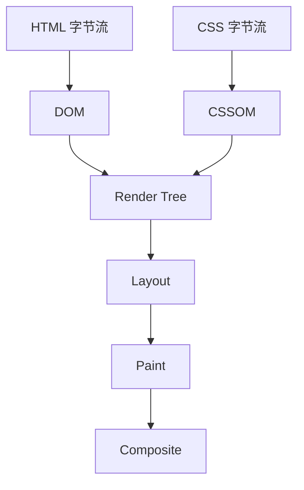
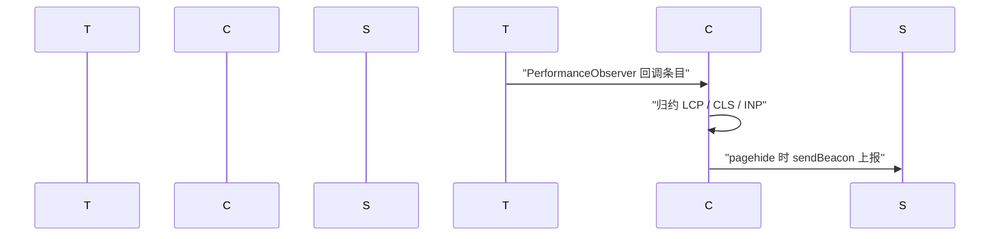

# Web 性能：MDN 精读

!!! abstract "核心结论"
    - Web 性能包含两部分：可客观测量的数据（加载耗时、FPS、可交互时间）与用户的主观感知（"感觉多快"）。MDN 明确指出，后者往往比毫秒数字更重要。
    - 关键渲染路径（Critical Rendering Path）是把 HTML、CSS、JavaScript 转成屏幕像素的那一串步骤，MDN 明确列出其包含 DOM、CSSOM、render tree 与 layout。优化 CRP 就是在缩短这条链。
    - 性能测量的底座是 Performance API：统一的高精度时间戳类型 DOMHighResTimeStamp、单调递增的时钟、以及以 performance.timeOrigin 为基准的时间原点。
    - 采集应该优先走 PerformanceObserver 而不是轮询查询，并注意条目缓冲区有上限（MDN 指出 long-animation-frame 的缓冲上限为 200 条，超出后新条目会被丢弃）。
    - 懒加载的本质是把非关键资源移出 CRP；资源提示与投机加载则是在用户真正需要之前提前做 DNS、拉取甚至渲染。

## 1. 性能的两种测量：客观数据与感知

### 1.1 定义与两个维度

MDN 对 Web 性能的定义是：**客观测量值**加上**感知到的用户体验**。客观测量包括加载时间、每秒帧数（FPS）、变为可交互所需的时间；主观体验则是"内容感觉上花了多久才出现"。

MDN 同时给出了一个非常工程化的判断：站点响应越慢，放弃的用户越多。因此要做两件事：

1. 缩短加载与响应时间；
2. 通过"让体验尽早可用、尽早可交互，同时异步加载长尾部分"来掩盖延迟（conceal latency）。

第 2 点正是"感知性能"（perceived performance）的落点：不是绝对值变快，而是让用户更早看到有意义的东西。

### 1.2 MDN 给出的时间经验值

MDN 的《Recommended Web Performance Timings: How long is too long?》给了若干参考线。这些不是规范强制值，而是经验阈值。

| 场景 | 参考时间 | 含义 |
| --- | --- | --- |
| 提示内容即将加载 | 1 秒 | 超过后用户开始怀疑站点是否还活着 |
| 空闲任务 | 50 毫秒 | 低于此量级的任务通常不打断交互感 |
| 动画帧 | 16.7 毫秒 | 对应约 60 FPS 的每帧预算 |
| 响应用户输入 | 50 至 200 毫秒 | 超出后交互被感知为卡顿 |
| 长动画帧（LoAF） | 超过 50 毫秒 | MDN 定义：渲染更新被延迟到超过 50ms |
| INP 建议响应时间 | 200 毫秒 | MDN 转述 Google INP 的建议值 |

另外 MDN 在讲长动画帧时给了一个换算：要跑到流畅的 60 FPS，每帧大约要在 16ms 内渲染完（1000/60）。

## 2. 关键渲染路径

### 2.1 从字节到像素

MDN 把关键渲染路径定义为：浏览器把 HTML、CSS、JavaScript 转换成屏幕像素所经历的一串步骤，并明确其包含 DOM、CSS Object Model（CSSOM）、render tree 与 layout。



工程含义很直接：这条链上的每一个环节，只要有一个资源没到齐，后面的环节就全部推迟。所以"缩短 CRP"通常等价于"把不必须的资源从这条链上摘出去"，这也是 MDN 讲懒加载时的原话逻辑：懒加载把资源标记为非关键（non-critical），只在需要时加载，从而缩短关键渲染路径，降低页面加载时间。

需要强调：阻塞行为的具体细节（解析器何时被同步脚本暂停、样式何时阻塞渲染等）属于浏览器实现与 HTML 规范范畴，本页不展开断言，细节以 MDN《Populating the page: how browsers work》与《Critical rendering path》为准。

### 2.2 手写实现：CRP 关键路径分析器

这段代码要解决的问题：给定一组关键资源及其依赖关系与耗时，算出**最长加权依赖链**。因为并行资源会被最长链吸收，页面首个可绘制时刻由最长链决定，而不是所有耗时的总和。

```js
// 运行环境：Node.js。只使用 node:assert，无浏览器依赖。
// 文件名：crp.js

const assert = require('node:assert');

// 第 1 段：用邻接表描述关键渲染路径上的资源依赖。
// duration 表示"依赖全部就绪后，自身还需要多久可用"。
const graph = {
  html: { duration: 20, deps: [] },
  css: { duration: 30, deps: ['html'] },
  js: { duration: 40, deps: ['html', 'css'] },
  font: { duration: 25, deps: ['css'] },
  img: { duration: 10, deps: ['html'] },
};

// 第 2 段：带记忆化的 DFS，求最长加权路径。
// 关键点：比较的是"依赖的完成时间"，不是"依赖的自身耗时"。
function criticalPath(nodes) {
  const memo = new Map();      // 节点名 -> 最早完成时间
  const pathMemo = new Map();  // 节点名 -> 达到该完成时间的路径
  const visiting = new Set();  // 用于检测环，避免 DFS 栈溢出

  function finishOf(name) {
    if (memo.has(name)) return memo.get(name);
    if (visiting.has(name)) throw new Error('cycle detected at ' + name);

    const node = nodes[name];
    if (!node) throw new Error('unknown resource: ' + name);

    visiting.add(name);
    let bestDepFinish = 0;
    let bestPath = [];
    for (const dep of node.deps) {
      const depFinish = finishOf(dep);
      if (depFinish > bestDepFinish) {
        bestDepFinish = depFinish;
        bestPath = pathMemo.get(dep);
      }
    }
    visiting.delete(name);

    const finish = bestDepFinish + node.duration;
    memo.set(name, finish);
    pathMemo.set(name, bestPath.concat(name));
    return finish;
  }

  let best = { total: -1, path: [] };
  for (const name of Object.keys(nodes)) {
    const finish = finishOf(name);
    if (finish > best.total) best = { total: finish, path: pathMemo.get(name) };
  }
  return best;
}

// 第 3 段：验证标准
const result = criticalPath(graph);
assert.strictEqual(result.total, 90, '关键路径总耗时应为 90ms');
assert.deepStrictEqual(result.path, ['html', 'css', 'js']);
assert.throws(
  () => criticalPath({ a: { duration: 1, deps: ['b'] }, b: { duration: 1, deps: ['a'] } }),
  /cycle detected/,
  '存在循环依赖必须抛错'
);
console.log('criticalPath:', result.total, result.path.join(' -> '));
// 预期输出：criticalPath: 90 html -> css -> js
```

1. 数据流：`graph` 是输入 DAG；`finishOf` 自底向上把每个节点的完成时间算出来并缓存；最后对所有节点取最大值，得到整条 CRP 的最早完成时间。
2. 为什么是"最长"而不是"求和"：`font` 与 `js` 都依赖 `css`，两者可以并行。求和得到 125，实际是错的；最长链是 html(20) -> css(50) -> js(90)。
3. 设计取舍：用普通对象而不是 Map 存图，是为了让示例肉眼可读；生产代码里资源名可能重复或含特殊字符，用 Map 更稳。
4. 易错点：递归里如果用 `node.duration` 而不是 `depFinish` 去比较，会得到错误的关键路径；环检测必须放在记忆化命中之后，否则递归成环时 `visiting` 判断永远轮不到。

## 3. 感知性能

### 3.1 为什么 1 秒和 100 毫秒不一样

MDN 的表述是：比毫秒级的真实速度更重要的是用户感知到的速度。感知由四件事决定：真实加载时间、空闲状态、对交互的响应性、滚动与动画的平滑度。

由此推出三条可操作原则：

1. 尽早给出"内容即将出现"的信号（对应 1 秒经验值）；
2. 保持主线程有足够的空闲时间（对应 50 毫秒经验值）；
3. 把长任务切碎，避免超过单帧预算（对应 16.7 毫秒经验值）。

### 3.2 手写实现：主线程分片调度器

这段代码要解决的问题：把一批渲染任务切成每片不超过一帧预算的分片。分片让浏览器在两片之间有机会处理输入与绘制，这是"掩盖延迟"里最硬核的一步。

```js
// 运行环境：Node.js
// 文件名：slice.js
const assert = require('node:assert');

// 第 1 段：cost 表示该任务独占主线程的毫秒数。
const items = Array.from({ length: 10 }, (_, i) => ({ id: i, cost: 6 + (i % 3) * 4 }));

// 第 2 段：贪心分片。单个任务超过预算时也必须单独成片，
// 否则它会被无限推迟（饥饿），这比超预算更糟。
function slice(items, budget) {
  if (!(budget > 0)) throw new RangeError('budget must be > 0');
  const chunks = [];
  let current = { ids: [], cost: 0 };

  for (const item of items) {
    if (item.cost > budget) {
      if (current.ids.length > 0) chunks.push(current);
      chunks.push({ ids: [item.id], cost: item.cost });
      current = { ids: [], cost: 0 };
      continue;
    }
    if (current.cost + item.cost > budget) {
      chunks.push(current);
      current = { ids: [item.id], cost: item.cost };
    } else {
      current.ids.push(item.id);
      current.cost += item.cost;
    }
  }
  if (current.ids.length > 0) chunks.push(current);
  return chunks;
}

// 第 3 段：验证标准
const chunks = slice(items, 20);
assert.strictEqual(chunks.length, 6);
assert.deepStrictEqual(chunks.map((c) => c.ids), [[0, 1], [2, 3], [4], [5, 6], [7], [8, 9]]);
assert.deepStrictEqual(chunks.map((c) => c.cost), [16, 20, 10, 20, 10, 20]);
assert.ok(chunks.every((c) => c.cost <= 20 || c.ids.length === 1), '只有单任务片允许超预算');
assert.deepStrictEqual(slice([{ id: 0, cost: 50 }], 20), [{ ids: [0], cost: 50 }]);
assert.deepStrictEqual(chunks.flatMap((c) => c.ids), [0, 1, 2, 3, 4, 5, 6, 7, 8, 9], '任务不可丢不可重复');

console.log(JSON.stringify(chunks));
// 预期输出：
// [{"ids":[0,1],"cost":16},{"ids":[2,3],"cost":20},{"ids":[4],"cost":10},{"ids":[5,6],"cost":20},{"ids":[7],"cost":10},{"ids":[8,9],"cost":20}]
```

1. 数据流：输入任务数组与预算，输出分片数组，每片带 `ids` 与累计 `cost`。
2. 算法选择：这是一维装箱的贪心解法，不保证最少分片数；但分片调度关心的是"每片不超预算"，不是"片数最少"，贪心足够且 O(n)。
3. 易错点一：`current` 是可变对象，被 `push` 进数组后又被复用会造成别名 bug。这里每次 `push` 后立刻重新赋值 `current`，避免了别名。
4. 易错点二：`flatMap` 校验完整性很重要。分片算法最容易出的 bug 是边界丢任务或重复任务，而不是分片长度不理想。
5. 真实环境映射：浏览器里分片的调度器是 `requestIdleCallback` 或基于 `scheduler.postTask` 的优先级队列，本页不展开其规范细节，用法以 MDN 对应页面为准。

## 4. 指标与高精度计时

### 4.1 指标清单

MDN 的 Performance API 参考列表给出了可采集的条目类型族。下表按"它测什么"归类；接口名与阈值以 MDN 官方页面为准。

| 指标族 | 代表接口 | 测什么 |
| --- | --- | --- |
| 最大内容绘制 | LargestContentfulPaint | viewport 内最大图片或文本块的渲染时间，从页面开始加载算起 |
| 布局稳定性 | LayoutShift / LayoutShiftAttribution | 页面元素移动带来的布局不稳定程度，以及是哪些元素在动 |
| 交互延迟 | EventTiming（对应 INP） | 事件与 INP 的延迟 |
| 长动画帧 | LongAnimationFrameTiming / PerformanceScriptTiming | 占用渲染并阻塞其他任务的长动画帧及其成因脚本 |
| 长任务 | PerformanceLongTaskTiming | 单独占用主线程的长任务 |
| 导航耗时 | PerformanceNavigationTiming | 文档级导航事件，如加载、卸载、DOM 构建完成的时间 |
| 资源耗时 | PerformanceResourceTiming | 图片、脚本、CSS、fetch 等资源的网络时序 |
| 元素渲染 | PerformanceElementTiming | 特定元素的渲染时间戳 |
| 自定义打点 | PerformanceMark / PerformanceMeasure | 业务自定义的时间标记与区间测量 |
| 服务端指标 | PerformanceServerTiming | 通过 HTTP 响应头带下来的服务端指标 |
| 可见性变化 | PerformanceVisibilityStateTiming | 标签页前后台切换的时序 |
| bfcache 阻止原因 | bfcache 相关条目 | 当前文档为何没能进入 back/forward cache |

MDN 还提到列表中存在一类"测量页面构建期间渲染操作"的条目（对应首次绘制指标）。其接口名与阈值请以官方页面为准。

### 4.2 performance.now() 与 Date.now()

MDN 用一张表直接对比了两者，这是性能测量最容易犯错的地方：

| 维度 | performance.now() | Date.now() |
| --- | --- | --- |
| 分辨率 | 亚毫秒级 | 毫秒级 |
| 时间原点 | performance.timeOrigin | Unix Epoch（1970-01-01 UTC） |
| 是否受系统时钟调整影响 | 否 | 是 |
| 是否单调递增 | 是 | 否 |

MDN 明确指出：`Date` 的主要用途是向用户展示时间日期，操作系统常驻进程会定期同步时间，可能导致时钟每小时被微调若干毫秒。而 `DOMHighResTimeStamp` 保证单调递增，不会小于上一次读取的值。

单位方面，MDN 说明 `DOMHighResTimeStamp` 的单位是毫秒，且**应当**精确到 5 微秒（microseconds）；如果浏览器受硬件、软件或安全隐私约束无法达到，可以退化为毫秒精度。

时间原点方面，MDN 给出两个版本的差异：

```js
// Level 1（存在时钟变更风险）
currentTime = performance.timing.navigationStart + performance.now();

// Level 2（无时钟变更风险）
currentTime = performance.timeOrigin + performance.now();
```

MDN 说明 Window 上下文中 timeOrigin 是导航开始的时间，Worker 上下文中是 worker 运行的时间。跨上下文比较时间戳时，需要用各自的时间原点做换算，示例见 MDN 的 `performance.timeOrigin` 页面。

### 4.3 计时精度为什么被限制

MDN 说明，为了对抗计时攻击（timing attacks）与指纹识别（fingerprinting），`DOMHighResTimeStamp` 的精度会按站点隔离状态被粗化：

- 隔离上下文（isolated）：5 微秒
- 非隔离上下文：100 微秒

要获得跨源隔离，MDN 给出的是 COOP 与 COEP 两个响应头：

```http
Cross-Origin-Opener-Policy: same-origin
Cross-Origin-Embedder-Policy: require-corp
```

工程含义：如果你的性能采集脚本在高精度计时下结果异常粗糙，先检查这两个响应头，而不是怀疑自己的计时逻辑。

## 5. Performance API 三条主线

### 5.1 时间线与性能条目

MDN 把每个性能指标抽象成一个 performance entry：它有 `name`、`duration`、`startTime`、`type`（在条目对象上体现为 `entryType`）。所有条目继承自 `PerformanceEntry`。绝大多数条目是浏览器自动记录的，可以通过 `performance.getEntries*` 系列方法读取，MDN 更推荐通过 PerformanceObserver 获取。

PerformanceObserver 的作用是**在条目被记录时回调**，而不是事后查询。这一点非常关键，因为缓冲区有上限：MDN 明确写出 `long-animation-frame` 条目类型的最大缓冲是 200 条，超过后新条目会被丢弃，因此推荐使用 PerformanceObserver。

### 5.2 Navigation Timing 与 Resource Timing 的区别

MDN 的表述是：两者暴露同一组只读属性，但量纲不同。

| 维度 | Navigation Timing | Resource Timing |
| --- | --- | --- |
| 测量对象 | 主文档的导航事件 | 主文档及资源自身请求到的所有资源 |
| 覆盖范围 | 一次导航一份数据 | 每个资源一份数据 |
| 典型问题 | 卸载、DNS、TCP、TTFB、DOM 构建完成、load 完成 | 哪个资源慢、哪个资源体积大、是否命中缓存 |

### 5.3 手写实现：Navigation Timing 分解器

这段代码要解决的问题：把 PerformanceNavigationTiming 的绝对时间戳换算成人能读懂的分阶段耗时。

```js
// 运行环境：Node.js。用桩对象替代浏览器返回的 PerformanceNavigationTiming 实例。
// 文件名：nav-timing.js
const assert = require('node:assert');

// 第 1 段：只抽取做分解需要的字段。字段全集以 MDN
// PerformanceNavigationTiming 页面为准。
const navEntry = {
  name: 'https://example.test/',
  entryType: 'navigation',
  startTime: 0,
  redirectStart: 2,
  redirectEnd: 6,
  fetchStart: 6,
  domainLookupStart: 6,
  domainLookupEnd: 16,
  connectStart: 16,
  connectEnd: 36,
  requestStart: 38,
  responseStart: 88,
  responseEnd: 118,
  domInteractive: 200,
  domContentLoadedEventStart: 205,
  domContentLoadedEventEnd: 208,
  domComplete: 300,
  loadEventStart: 300,
  loadEventEnd: 320,
};

// 第 2 段：所有时间戳都是相对 performance.timeOrigin 的毫秒值，
// 因此同一份条目内部做减法就能得到阶段耗时。
function summarizeNavigation(e) {
  const sub = (a, b) => Math.round(e[a] - e[b]);
  return {
    redirect: sub('redirectEnd', 'redirectStart'),
    dns: sub('domainLookupEnd', 'domainLookupStart'),
    connect: sub('connectEnd', 'connectStart'),
    ttfb: sub('responseStart', 'requestStart'),
    download: sub('responseEnd', 'responseStart'),
    domContentLoaded: sub('domContentLoadedEventEnd', 'domContentLoadedEventStart'),
    loadEvent: sub('loadEventEnd', 'loadEventStart'),
    total: sub('loadEventEnd', 'startTime'),
  };
}

// 第 3 段：验证标准
assert.deepStrictEqual(summarizeNavigation(navEntry), {
  redirect: 4,
  dns: 10,
  connect: 20,
  ttfb: 50,
  download: 30,
  domContentLoaded: 3,
  loadEvent: 20,
  total: 320,
});
console.log(summarizeNavigation(navEntry));
// 预期输出：
// { redirect: 4, dns: 10, connect: 20, ttfb: 50, download: 30,
//   domContentLoaded: 3, loadEvent: 20, total: 320 }
```

1. 数据流：输入一个条目对象，输出阶段耗时对象。每项都是两个时间戳相减。
2. 为什么用 `Math.round`：MDN 说明 `DOMHighResTimeStamp` 分辨率可达微秒级，相减后会出现大量小数位。展示层做一次取整可以避免噪声，但做预算判断时应保留原值。
3. 设计取舍：`ttfb` 用 `responseStart - requestStart`，衡量的是"请求发出到首个响应字节到达"。想衡量"导航开始到首个字节"就换成 `responseStart - startTime`，两种口径都合理，但必须在报表里说清楚是哪一种。
4. 易错点：`connectEnd - connectStart` 在复用连接时可能为 0；这不是 bug，而是没有新建连接。数据管道要能接受 0，不要用 0 当"缺失"处理。

### 5.4 手写实现：Resource Timing 分析器

这段代码要解决的问题：从一批资源时序条目中找出最慢的资源、统计传输体积、估算缓存命中比例与压缩率。

```js
// 运行环境：Node.js。用桩数组替代 performance.getEntriesByType('resource')。
// 文件名：resource-timing.js
const assert = require('node:assert');

// 第 1 段：资源时序样本。
// transferSize 是网络上实际传输的字节数（含响应头开销）。
// 它为 0 通常表示没有发生网络传输；但跨源资源在缺少
// Timing-Allow-Origin 时数据也会被裁剪，判定口径以 MDN Resource Timing 页面为准。
const resources = [
  { name: 'https://cdn.test/app.js', initiatorType: 'script', startTime: 120, duration: 210, transferSize: 48000, encodedBodySize: 47000, decodedBodySize: 150000 },
  { name: 'https://cdn.test/hero.webp', initiatorType: 'img', startTime: 100, duration: 400, transferSize: 220000, encodedBodySize: 219000, decodedBodySize: 220000 },
  { name: 'https://cdn.test/app.js', initiatorType: 'link', startTime: 500, duration: 0, transferSize: 0, encodedBodySize: 0, decodedBodySize: 0 },
];

// 第 2 段：聚合分析。所有计算都是单次线性扫描加上一次排序。
function analyzeResources(entries, topN = 2) {
  const totalTransfer = entries.reduce((sum, e) => sum + e.transferSize, 0);
  const networkCount = entries.filter((e) => e.transferSize > 0).length;
  const cacheRatio = entries.length === 0 ? 0 : (entries.length - networkCount) / entries.length;

  const slowest = [...entries]
    .sort((a, b) => b.duration - a.duration)
    .slice(0, topN)
    .map((e) => ({ name: e.name, duration: e.duration }));

  const byType = {};
  for (const e of entries) {
    if (!byType[e.initiatorType]) {
      byType[e.initiatorType] = { count: 0, transferSize: 0, duration: 0 };
    }
    const bucket = byType[e.initiatorType];
    bucket.count += 1;
    bucket.transferSize += e.transferSize;
    bucket.duration += e.duration;
  }

  const compression = entries
    .filter((e) => e.decodedBodySize > 0)
    .map((e) => ({
      name: e.name,
      ratio: Number((e.encodedBodySize / e.decodedBodySize).toFixed(3)),
    }));

  return { totalTransfer, networkCount, cacheRatio, slowest, byType, compression };
}

// 第 3 段：验证标准
const report = analyzeResources(resources, 2);
assert.strictEqual(report.totalTransfer, 268000);
assert.strictEqual(report.networkCount, 2);
assert.ok(Math.abs(report.cacheRatio - 1 / 3) < 1e-9, '缓存命中比例约 0.333');
assert.deepStrictEqual(report.slowest, [
  { name: 'https://cdn.test/hero.webp', duration: 400 },
  { name: 'https://cdn.test/app.js', duration: 210 },
]);
assert.deepStrictEqual(report.byType.script, { count: 1, transferSize: 48000, duration: 210 });
assert.deepStrictEqual(report.byType.link, { count: 1, transferSize: 0, duration: 0 });
assert.deepStrictEqual(
  report.compression.map((c) => c.ratio),
  [0.313, 0.995]
);
console.log(JSON.stringify(report.slowest), JSON.stringify(report.compression));
// 预期输出：
// [{"name":"https://cdn.test/hero.webp","duration":400},{"name":"https://cdn.test/app.js","duration":210}]
// [{"name":"https://cdn.test/app.js","ratio":0.313},{"name":"https://cdn.test/hero.webp","ratio":0.995}]
```

1. 数据流：输入条目数组，输出总传输量、联网条数、缓存比例、最慢 TopN、按 initiatorType 聚合、压缩率。
2. 为什么先拷贝再排序：`[...entries]` 避免原地排序污染调用方数组。这是分析类函数最常见的副作用 bug。
3. 压缩率口径：`encodedBodySize / decodedBodySize`，越接近 1 说明压缩几乎没有收益。脚本压缩效果好（0.313），本身已压缩的 WebP 收益很小（0.995），这与直觉一致。
4. 易错点一：把 `transferSize === 0` 直接判定为"该资源不存在"或"没下载过"。它也可能表示走了缓存或数据被裁剪，必须结合 `encodedBodySize` 与上下文判断。
5. 易错点二：`initiatorType` 的取值是浏览器给出的分类（如 `script`、`img`、`link`、`fetch`），不要自己臆造分类名做字符串比较，取值集合以 MDN 页面为准。
6. 真实环境映射：生产里通常把 `slowest` 与 `byType.transferSize` 一起看，前者定位性能，后者定位体积预算。

## 6. 手写 Web Vitals 采集器

### 6.1 归约层：可在 Node 中测试的纯函数

这段代码要解决的问题：把浏览器陆续抛来的条目归约成单一指标值。把归约逻辑写成纯函数，是为了在没有浏览器环境的 CI 里也能回归测试。

**规范细节声明：官方对 LCP 候选的最终确定、CLS 的会话窗口聚合、INP 的百分位选择都有更精确的定义，本实现是教学用简化版，细节需核对官方文档。**

```js
// 运行环境：Node.js
// 文件名：vitals-reduce.js
const assert = require('node:assert');

// 第 1 段：LCP 归约。
// 浏览器会在时间线上多次上报候选条目，这里简化地取 startTime 最大的一条。
function reduceLCP(candidates) {
  let winner = null;
  for (const c of candidates) {
    if (winner === null || c.startTime >= winner.startTime) winner = c;
  }
  return winner === null ? null : { name: winner.name, startTime: winner.startTime };
}

// 第 2 段：CLS 归约（简化版）。
// 只累加"没有紧随用户输入"的位移：hadRecentInput 为 true 表示
// 这次位移是可预期的用户操作结果，不计入。
function reduceCLS(shifts) {
  let sum = 0;
  for (const s of shifts) {
    if (!s.hadRecentInput) sum += s.value;
  }
  return sum;
}

// 第 3 段：INP 归约（简化版）。
// interactionId 为 0 的条目不对应一次交互，先过滤；
// 再取最大 duration 作为最差交互延迟。
function reduceINP(events) {
  let worst = 0;
  for (const e of events) {
    if (!e.interactionId) continue;
    if (e.duration > worst) worst = e.duration;
  }
  return worst;
}

// 第 4 段：验证标准
const lcp = reduceLCP([
  { name: 'p.hero', startTime: 100, size: 1000 },
  { name: 'img.hero', startTime: 400, size: 20000 },
  { name: 'p.sub', startTime: 250, size: 5000 },
]);
assert.deepStrictEqual(lcp, { name: 'img.hero', startTime: 400 });

const cls = reduceCLS([
  { value: 0.02, hadRecentInput: false },
  { value: 0.3, hadRecentInput: true },
  { value: 0.05, hadRecentInput: false },
]);
assert.ok(Math.abs(cls - 0.07) < 1e-9, '期望 CLS 约等于 0.07');

const inp = reduceINP([
  { name: 'click', duration: 80, interactionId: 1 },
  { name: 'keydown', duration: 240, interactionId: 2 },
  { name: 'mousemove', duration: 500, interactionId: 0 },
]);
assert.strictEqual(inp, 240);

console.log('LCP', lcp.name, lcp.startTime, '| CLS', cls.toFixed(2), '| INP', inp);
// 预期输出：LCP img.hero 400 | CLS 0.07 | INP 240
```

1. 数据流：三个独立纯函数，各自接收数组、返回标量或简单对象，彼此无状态耦合，便于单独回归。
2. 为什么用 `Math.abs(cls - 0.07) < 1e-9` 而不是 `strictEqual`：`0.02 + 0.05` 在 IEEE 754 双精度下等于 `0.07000000000000001`，浮点等值比较必然失败。所有浮点指标断言都必须用容差。
3. 设计取舍：`reduceINP` 返回最差一次交互的延迟，实现简单且能反映"最痛的体验"；官方 INP 的统计口径更复杂，需核对官方文档。
4. 易错点：`if (!e.interactionId) continue` 会同时过滤 `0`、`undefined`、`null`。这在 `interactionId` 语义下是正确的（0 表示非交互），但换成其他数值型字段时就会误杀合法的 0 值。

### 6.2 采集层：浏览器端 PerformanceObserver 接线

这段代码要解决的问题：把归约逻辑挂到真实的时间线上，并在文档离开时可靠上报。**运行环境：浏览器。** 条目类型字符串以 MDN 支持的类型列表为准。

```html
<!-- 运行环境：浏览器。建议放在 </body> 之前，或用 type="module" 让脚本延后执行。 -->
<script>
  // 第 1 段：能力检测。supportedEntryTypes 列出当前浏览器可观察的类型，
  // 不支持的浏览器必须降级，不能 observe 之后直接崩。
  const supported = (t) => PerformanceObserver.supportedEntryTypes.includes(t);

  // 第 2 段：统一采集状态与观察器登记。
  const vitals = { lcp: null, cls: 0, inp: 0 };
  const observers = [];

  function safeObserve(type, cb) {
    if (!supported(type)) return null;
    const observer = new PerformanceObserver((list) => cb(list.getEntries()));
    // buffered: true 会把 observe 之前已记录的条目一并回调，
    // 对晚注入的采集脚本是必需的。
    observer.observe({ type, buffered: true });
    observers.push(observer);
    return observer;
  }

  // 第 3 段：三个指标的接线。
  safeObserve('largest-contentful-paint', (entries) => {
    const last = entries[entries.length - 1];
    if (last) vitals.lcp = { name: last.name, startTime: last.startTime };
  });

  safeObserve('layout-shift', (entries) => {
    for (const entry of entries) {
      if (!entry.hadRecentInput) vitals.cls += entry.value;
    }
  });

  safeObserve('event', (entries) => {
    for (const entry of entries) {
      if (entry.interactionId && entry.duration > vitals.inp) vitals.inp = entry.duration;
    }
  });

  // 第 4 段：离开页面时上报。
  // pagehide 比 unload 更可靠；visibilitychange 到 hidden 作为兜底，
  // 两个入口都要做幂等保护。
  let reported = false;
  function report() {
    if (reported) return;
    reported = true;
    const payload = JSON.stringify(vitals);
    if (navigator.sendBeacon) navigator.sendBeacon('/rum', payload);
    else fetch('/rum', { method: 'POST', body: payload, keepalive: true });
  }

  addEventListener('pagehide', report, { once: true });
  document.addEventListener('visibilitychange', () => {
    if (document.visibilityState === 'hidden') report();
  });
</script>
```



1. 数据流：浏览器记录条目，观察器回调拿到条目，写进 `vitals`，页面隐藏时序列化上报。
2. 为什么必须先做 `supportedEntryTypes` 检测：`observe` 传入不支持的类型会抛异常，一旦抛在顶层就会中断后续所有观察器的注册。用 `safeObserve` 包一层，让不支持的指标静默降级。
3. 为什么 `buffered: true` 不能省：采集脚本往往在页面较晚时机才注入，早期条目已经写入缓冲区，不申请 buffered 会永久丢失。
4. 幂等保护的必要性：`pagehide` 与 `visibilitychange` 可能先后触发，没有 `reported` 标志就会重复上报，导致指标被重复计数。
5. 上报通道选择：`sendBeacon` 在页面卸载后仍会尽力发送；`fetch` 加 `keepalive` 是备选。二者取舍的浏览器兼容性细节以 MDN 对应页面为准。
6. 长动画帧采集：MDN 给出的是 `observe({ type: 'long-animation-frame', buffered: true })`，并提醒该类型的缓冲上限是 200 条，超出后新条目被丢弃，所以必须用观察器而不是事后查询。

## 7. 懒加载、资源提示与投机加载

### 7.1 三种策略的定位

MDN 的区分很清晰：懒加载把资源标记为非关键、只在需要时加载，用于**缩短关键渲染路径**；投机加载（speculative loading）是在用户真正访问之前就执行导航相关动作（DNS 解析、拉取资源、渲染文档），基于"用户最可能访问哪些页面"的预测。

| 策略 | 触发时机 | 主要收益 | 主要风险 |
| --- | --- | --- | --- |
| 懒加载 | 资源进入视口或即将需要 | 减少首屏字节数，缩短 CRP | 首屏误判为非关键会造成可见的延迟 |
| dns-prefetch | 页面解析时，早于请求 | 省掉 DNS 解析的往返时间 | 预取过多域名，占用带宽与连接 |
| 投机加载 | 预测用户下一步行为 | 后续导航接近瞬时 | 预测错误会浪费带宽、电量与服务器资源 |

MDN 对 dns-prefetch 的定义是：在资源被请求之前尝试解析域名，对象可能是稍后加载的文件，也可能是用户将要访问的链接目标。

### 7.2 手写实现：可见性判定与资源提示规划

这段代码要解决的问题：把 IntersectionObserver 的核心几何判定抽成纯函数以便测试，并据此给每个元素分配加载策略、给关键资源配置资源提示。

**说明：`preconnect`/`preload`/`prefetch` 等链接类型的语义与取值以 MDN 对应页面为准，本页只演示规划逻辑。**

```js
// 运行环境：Node.js。IntersectionObserver 只在浏览器可用，
// 这里抽出其判定逻辑的等价实现。
// 文件名：lazy.js
const assert = require('node:assert');

// 第 1 段：几何相交判定。
// rootMargin 向上下两个方向扩张视口，用于"提前一点开始加载"。
function isIntersecting(el, viewport, rootMargin = 0) {
  const top = viewport.top - rootMargin;
  const bottom = viewport.bottom + rootMargin;
  return el.bottom > top && el.top < bottom;
}

// 第 2 段：分配加载策略。已进入（扩张后的）视口用 eager，其余用 lazy。
function assignStrategy(elements, viewport, rootMargin) {
  return elements.map((el) => ({
    id: el.id,
    loading: isIntersecting(el, viewport, rootMargin) ? 'eager' : 'lazy',
  }));
}

// 第 3 段：根据 URL 推断 as 值，只覆盖最常见的几类，
// 兜底为 fetch。取值集合以 MDN 页面为准。
function guessAs(url) {
  if (/\.js($|\?)/.test(url)) return 'script';
  if (/\.css($|\?)/.test(url)) return 'style';
  if (/\.(webp|png|jpe?g|avif)($|\?)/.test(url)) return 'image';
  return 'fetch';
}

// 第 4 段：规划资源提示。
// 关键资源用 preload，第三方域名用 dns-prefetch，后续页面才用的资源用 prefetch。
function planHints({ criticalUrls, thirdPartyOrigins, futureUrls }) {
  const hints = [];
  for (const url of criticalUrls) hints.push({ rel: 'preload', href: url, as: guessAs(url) });
  for (const origin of thirdPartyOrigins) {
    const usedOnCriticalPath = criticalUrls.some((u) => u.startsWith(origin));
    if (usedOnCriticalPath) hints.push({ rel: 'dns-prefetch', href: origin });
  }
  for (const url of futureUrls) hints.push({ rel: 'prefetch', href: url });
  return hints;
}

// 第 5 段：验证标准
const viewport = { top: 0, bottom: 800 };
assert.strictEqual(isIntersecting({ top: 100, bottom: 300 }, viewport), true);
assert.strictEqual(isIntersecting({ top: 900, bottom: 1000 }, viewport), false);
assert.strictEqual(isIntersecting({ top: 900, bottom: 1000 }, viewport, 200), true, 'rootMargin 应能提前触发');
assert.strictEqual(isIntersecting({ top: -50, bottom: 10 }, viewport), true, '部分露出也算相交');
assert.strictEqual(isIntersecting({ top: 800, bottom: 900 }, viewport), false, '紧贴下边界不算相交');

assert.deepStrictEqual(
  assignStrategy(
    [{ id: 'hero', top: 0, bottom: 400 }, { id: 'below', top: 1200, bottom: 1400 }],
    viewport,
    0
  ),
  [{ id: 'hero', loading: 'eager' }, { id: 'below', loading: 'lazy' }]
);

assert.deepStrictEqual(
  planHints({
    criticalUrls: ['https://cdn.test/hero.webp', 'https://cdn.test/app.js'],
    thirdPartyOrigins: ['https://cdn.test', 'https://unused.test'],
    futureUrls: ['https://example.test/next-page.json'],
  }),
  [
    { rel: 'preload', href: 'https://cdn.test/hero.webp', as: 'image' },
    { rel: 'preload', href: 'https://cdn.test/app.js', as: 'script' },
    { rel: 'dns-prefetch', href: 'https://cdn.test' },
    { rel: 'prefetch', href: 'https://example.test/next-page.json' },
  ]
);
console.log('lazy/资源提示规划断言全部通过');
// 预期输出：lazy/资源提示规划断言全部通过
```

1. 数据流：`isIntersecting` 是最底层判定，`assignStrategy` 在其上做策略映射，`planHints` 独立处理资源提示规划。
2. 边界语义：`el.bottom > top && el.top < bottom` 用的是开区间，因为元素与视口恰好边界贴合时不应该触发加载。这条判定直接决定了会不会"多加载一张图"，也直接决定首屏图片会不会被错误地 lazy。
3. 设计取舍：真实场景中 `rootMargin` 常用正值提前触发加载，正是为了解决"进入视口才开始下载太晚"的问题。但 `rootMargin` 过大就等于放弃懒加载，需要按预算权衡。
4. 易错点一：首屏图片使用 `loading="lazy"` 会推迟 LCP。首屏关键图应该是 eager，并且可以配合更高的抓取优先级。
5. 易错点二：`dns-prefetch` 只解析域名。MDN 的定义就是"在资源被请求之前解析域名"，它不建立连接、不下载资源。把它当成预下载是常见误解。
6. 易错点三：对未使用的第三方域名做 `dns-prefetch`，只花钱不收益。第 4 段用 `usedOnCriticalPath` 过滤掉了这类域名。

## 8. 常见陷阱

1. 用 `Date.now()` 测性能。它不单调，系统同步时钟时可能被向前或向后调整，导致出现负数耗时。测性能一律用 `performance.now()`。
2. 用 Level 1 的时间基准做跨页面比较。MDN 明确指出 Level 1 的 `performance.timing.navigationStart` 方案存在时钟变更风险，应该改用 `performance.timeOrigin`。
3. 忘记 `buffered: true`。晚注入的采集脚本会丢掉早于 `observe` 调用产生的条目，LCP 这类早期指标会直接缺失。
4. 用 `getEntriesByType` 轮询代替 PerformanceObserver。轮询会漏掉两次轮询之间产生并被缓冲区淘汰的条目；MDN 指出 `long-animation-frame` 缓冲上限只有 200 条。
5. 把 `transferSize === 0` 当成"资源没加载"。可能是缓存命中或跨源数据被裁剪，需要结合其他字段判断。
6. 把 `hadRecentInput` 为 true 的布局位移也算进 CLS。用户点开菜单导致内容下移是可预期的，计入会污染指标。
7. 把 `interactionId` 为 0 的事件条目当成一次交互。它不代表交互，需要过滤。
8. 只上报平均值。平均 TTFB 正常不代表没有用户遇到灾难性体验，必须同时看分位数。
9. 期望在非隔离上下文拿到 5 微秒精度。MDN 说明非隔离上下文是 100 微秒，需要 COOP 与 COEP 才能获得更高精度。
10. 用 `unload` 上报。`pagehide` 与 `visibilitychange` 更可靠；另外 MDN 提供了监控 bfcache 阻止原因的能力，部分监听器或 API 使用方式可能导致页面无法进入 bfcache，具体原因与修复方式以 MDN 对应章节为准。
11. 把懒加载无差别套在所有图片上。首屏关键图像的懒加载会推迟 LCP，属于负优化。
12. 空谈"感知性能"而不给指标。感知性能不是玄学，它对应实在的经验阈值：1 秒、50 毫秒、16.7 毫秒、50 至 200 毫秒。

## 9. 面试题与答题要点

### 9.1 performance.now() 与 Date.now() 有什么区别？为什么测性能必须用前者？

要点：分辨率不同（亚毫秒对毫秒）；时间原点不同（`performance.timeOrigin` 对 Unix Epoch）；`Date` 受系统时钟调整影响且不单调，`performance.now()` 单调递增；MDN 明确说明 `Date` 的主要用途是展示时间日期，操作系统会定期同步时间，时钟每小时可能被微调若干毫秒。补一句时间原点的版本演进：Level 1 相对 `navigationStart`，Level 2 相对 `timeOrigin`。

### 9.2 关键渲染路径包含哪些阶段？如何缩短？

要点：MDN 明确列出 DOM、CSSOM、render tree、layout。缩短的手段是减少这条链上的必达资源与链长：把非关键资源改为懒加载（MDN 对懒加载的定义就是"标记为非关键、只在需要时加载，从而缩短 CRP"）、减少渲染阻塞资源、把长任务切碎以免占用主线程。不要展开讲解析器阻塞的细节断言，说明以 MDN《Critical rendering path》与《How browsers work》为准。

### 9.3 Navigation Timing 与 Resource Timing 的区别是什么？

要点：MDN 的表述是二者暴露同一组只读属性，但 Navigation Timing 测的是主文档的导航事件，Resource Timing 测的是主文档及其资源所请求到的所有资源的网络时序。Navigation 的典型用途是卸载、加载、DOM 构建完成的耗时；Resource 的典型用途是找出哪个资源慢、哪个体积大、是否命中缓存。对应接口分别是 PerformanceNavigationTiming 与 PerformanceResourceTiming。

### 9.4 LCP 与 CLS 分别衡量什么？采集时要注意什么？

要点：LCP 衡量 viewport 内最大图片或文本块的渲染时间，从页面开始加载算起；CLS 衡量布局稳定性，并可通过 LayoutShiftAttribution 定位是哪些元素在移动。采集要点：用 PerformanceObserver 加 `buffered: true`；CLS 必须过滤 `hadRecentInput` 为 true 的位移；具体候选确定与会话窗口聚合规则需核对官方文档。

### 9.5 INP 是什么？和长动画帧有什么关系？

要点：INP 对应 EventTiming，衡量事件与交互的延迟；MDN 转述其建议是页面应在 200 毫秒内响应交互。长动画帧是渲染更新被延迟超过 50 毫秒的帧，它会直接损害响应性；MDN 建议用 PerformanceObserver 观察 `long-animation-frame`，并可通过条目的 `scripts` 数组定位到具体是哪个脚本、哪个函数造成了阻塞。注意该类型缓冲上限 200 条。60 FPS 的每帧预算约 16 毫秒。

### 9.6 PerformanceObserver 和 performance.getEntriesByType 如何取舍？

要点：PerformanceObserver 在条目被记录时回调，不会漏条目；查询方法只能拿到缓冲区中尚未被淘汰的条目，且 `long-animation-frame` 缓冲上限为 200，MDN 因此推荐观察器方案。查询方法适合初始化时读一次已存在的条目或调试，不适合长周期采集。使用观察器时必须考虑 `buffered: true` 与能力检测（`supportedEntryTypes`）。

### 9.7 懒加载和投机加载的区别是什么？各自的风险？

要点：懒加载把资源标记为非关键、按需加载，目标是缩短关键渲染路径；投机加载是在用户真正访问之前就基于预测执行导航相关动作（DNS 解析、拉取资源、渲染文档），目标是让下一步导航接近瞬时。风险：懒加载若误判首屏为可延迟会推迟 LCP；投机加载若预测错误会浪费带宽、电量与服务端资源。顺带说明 `dns-prefetch` 只解析域名，不建连也不下载。

### 9.8 RUM 与合成监控（synthetic monitoring）怎么选？

要点：MDN 的定位是二者提供不同视角。RUM 更适合理解长期趋势；合成监控非常适合回归测试，以及在开发期缓解短期性能问题。两者不是替代关系：合成监控提供稳定可控的对比基线，RUM 提供真实用户分布与长尾问题。

### 9.9 感知性能和客观指标冲突时怎么办？有没有可引用的经验值？

要点：MDN 明确说"比毫秒级的真实速度更重要的是用户感知到的速度"，感知由真实加载时间、空闲状态、交互响应性、滚动与动画平滑度共同决定。可引用的经验值：1 秒内应提示内容即将加载，空闲任务参考 50 毫秒，动画帧参考 16.7 毫秒，用户输入响应参考 50 至 200 毫秒。手段是尽早给出可交互信号，并把长尾异步加载。

### 9.10 为什么高精度计时会被限制？如何获得更高精度？

要点：MDN 说明这是为了对抗计时攻击与指纹识别。隔离上下文的精度是 5 微秒，非隔离上下文是 100 微秒。要获得跨源隔离需要设置 COOP 与 COEP 响应头（`Cross-Origin-Opener-Policy: same-origin`、`Cross-Origin-Embedder-Policy: require-corp`），它们会让顶层文档不与跨源文档共享浏览上下文组，从而阻止一类被称为 XS-Leaks 的跨源攻击。同时要记得 `DOMHighResTimeStamp` 单位是毫秒，浏览器在硬件或安全约束下可能退化为毫秒精度。

## 深入阅读与参考

!!! tip "怎么用这些资料"
    先读「官方文档与规范」建立准确的概念，再读「源码与示例」核对细节，最后用「教程、书籍与视频」换一种讲法加深理解。每条都写明了读哪一节、带着什么问题读。

### 官方文档与规范

| 资源 | 为什么读 | 怎么读 |
|---|---|---|
| [User timing](https://developer.mozilla.org/en-US/docs/Web/API/Performance_API/User_timing) | User Timing 是自写采集器手动打点测量的规范依据。 | 读 mark/measure 小节，在用户交互处打点，导出 measure 结果验证耗时。 |
| [Long animation frame timing](https://developer.mozilla.org/en-US/docs/Web/API/Performance_API/Long_animation_frame_timing) | 长动画帧是定位卡顿与 INP 问题的关键指标。 | 读长帧归因字段，采集一次慢交互，按脚本、样式、布局分类归因。 |
| [Navigation timing](https://developer.mozilla.org/en-US/docs/Web/API/Performance_API/Navigation_timing) | 导航计时是首屏客观数据的权威来源。 | 读各阶段时间戳定义，写脚本输出 TTFB、DOMContentLoaded 等派生指标。 |
| [High precision timing](https://developer.mozilla.org/en-US/docs/Web/API/Performance_API/High_precision_timing) | 解释单调时钟与精度限制，是计时可靠性的基础。 | 读时钟源与精度说明，验证 performance.now 与 Date.now 的差异及安全精度。 |
| [Resource timing](https://developer.mozilla.org/en-US/docs/Web/API/Performance_API/Resource_timing) | 资源计时用于评估资源提示与懒加载的真实收益。 | 读 initiatorType、transferSize 字段，筛选图片脚本条目，比较 preload 前后耗时。 |
| [Monitoring bfcache blocking reasons](https://developer.mozilla.org/en-US/docs/Web/API/Performance_API/Monitoring_bfcache_blocking_reasons) | bfcache 被阻止是常被忽略的性能陷阱。 | 读阻止原因上报示例，在页面注册报告，排查并移除 unload 监听。 |

### 源码与示例

| 资源 | 为什么读 | 怎么读 |
|---|---|---|
| [MDN Performance API](https://developer.mozilla.org/zh-CN/docs/Web/API/Performance_API) | 直接对照示例读取导航与资源计时，是最快的上手方式。 | 按示例写脚本打印 navigation 与 resource 计时，再与 DevTools 网络面板对照核验。 |
| [MDN Performance API](https://developer.mozilla.org/en-US/docs/Web/API/Performance_API) | 采集 LCP 与长任务正是自写 Web Vitals 采集器的核心。 | 读 PerformanceObserver 示例，改成记录 LCP、longtask 并上报，验证阈值与回调时机。 |
| [MDN 使用 Web Workers](https://developer.mozilla.org/en-US/docs/Web/API/Web_Workers_API/Using_web_workers) | 用 Worker 演示长任务如何拖慢交互，呼应主线程阻塞与 INP。 | 把耗时循环移入 Worker，用 Performance 面板对比前后主线程阻塞时长。 |
| [MDN Intersection Observer](https://developer.mozilla.org/en-US/docs/Web/API/Intersection_Observer_API) | 懒加载的标准实现，替代易掉帧的 scroll 监听。 | 照示例实现图片懒加载，再用 Performance 面板对比 scroll 方案的帧率差异。 |

### 教程、书籍与视频

| 资源 | 为什么读 | 怎么读 |
|---|---|---|
| [MDN 性能指南](https://developer.mozilla.org/en-US/docs/Web/Performance) | 先建立加载与运行时性能的整体框架，再看具体指标。 | 通读加载与运行时两节，列出各阶段可优化点，带着问题回到指标章节。 |
| [MDN Web 性能](https://developer.mozilla.org/zh-CN/docs/Web/Performance) | 中文梳理性能概念与优化手段，适合作为入门前置阅读。 | 读概览与优化清单，标出与关键渲染路径、指标相关的条目，当作本页索引。 |
| [MDN：浏览器如何工作](https://developer.mozilla.org/en-US/docs/Web/Performance/Guides/How_browsers_work) | 简版渲染流程模型，为关键渲染路径打地基。 | 读解析、渲染、绘制流程，手画 HTML 到像素的路径，再读 CRP 章节对照。 |

## 应用与行业实践

### 应用场景地图

| 场景 | 用到本页哪个知识点 | 典型技术选型 | 注意事项 |
| --- | --- | --- | --- |
| 后台管理的万行表格滚动 | long-animation-frame 条目与缓冲上限 | PerformanceObserver 加虚拟滚动 | 缓冲上限 200 条，采集先落盘再聚合 |
| 低端安卓机上的电商首屏 | 关键渲染路径、懒加载、资源提示 | preconnect、preload、loading="lazy" | preload 过量会抢占首屏带宽 |
| 30 人协作白板的远端光标 | DOMHighResTimeStamp、单调时钟 | performance.now() 与 mark/measure | 高频打点自带开销，需要采样 |
| 移动端新闻信息流无限滚动 | 懒加载把资源移出 CRP | IntersectionObserver 加 loading="lazy" | 提前量过大会退化成不懒加载 |
| 在线会议页的房间切换 | 投机加载 | Speculation Rules 预渲染 | 预渲染占内存，按设备与网络条件开关 |
| 营销落地页的首屏主图 | CRP 与资源提示 | fetchpriority="high" 与 preload | 主图与首屏文字争带宽时先保文字 |
| 企业内网 SPA 的前进后退 | 感知性能与指标 | bfcache | 注册 unload 会让页面失去 bfcache 资格 |
| 在线课程页的长文目录跳转 | 感知性能、CRP | content-visibility 加骨架占位 | 跳转后需实测屏幕阅读器行为 |

### 三个场景拆解

#### 场景 1：后台管理的万行表格

**业务背景**：后台要在一页里展示上万行订单，列可排序可筛选，滚动时主线程被占满。团队只收到「卡」的反馈，不知道是哪段脚本造成。

行数从千级涨到万级时问题出现，用同一份数据在本地就能复现。

**怎么用本页知识解决**：先用 PerformanceObserver 订阅长动画帧，拿到阻塞时长和脚本归属，再决定改渲染还是改数据。

```js
// 订阅长动画帧，buffered 取回缓冲区已有条目
const po = new PerformanceObserver((list) => {
  for (const entry of list.getEntries()) {
    if (entry.blockingDuration < 100) continue; // 只上报阻塞明显的帧
    for (const s of entry.scripts) {            // scripts 给出脚本级归属
      report({
        frame: entry.duration,            // 整帧耗时
        blocking: entry.blockingDuration, // 主线程被阻塞时长
        url: s.sourceURL,                 // 脚本地址
        fn: s.sourceFunctionName,         // 函数名
      });
    }
  }
});
po.observe({ type: 'long-animation-frame', buffered: true });
```

- `buffered: true` 取回缓冲区已有条目，但缓冲上限为 200 条，超出后被丢弃，所以回调要尽快上报。
- 用 `blockingDuration` 判断问题，它反映主线程被阻塞的时长，与整帧耗时不是同一个量。
- `sourceURL` 与 `sourceFunctionName` 把卡顿指到具体函数，省掉逐段注释二分的排查。
- 采集回调本身要轻，聚合与上报放到空闲回调或批处理里。
- 定位到归属后再上虚拟滚动，只渲染视口内的行，并给行高固定值。

**怎么度量收益**：看 INP（web-vitals 库或 Chrome DevTools Performance 面板）、long-animation-frame 条目的 `blockingDuration` 分位数、滚动时 Frames 轨道的丢帧情况。

**什么时候不该用**：

- 表格行数固定在视口容量的 3 倍以内时，虚拟滚动的代码成本换不到可测收益。
- 服务端分页能把单页行数压到百级时，先做分页。
- 整表导出或整表客户端排序是硬需求时，虚拟滚动解决不了排序本身的重排开销。

#### 场景 2：低端安卓的首屏加载

**业务背景**：首屏主图是转化入口，在中低端安卓机上出现得晚，LCP 落在图片解码之后。跳出集中在首屏加载的几秒内。

用同一台中低端机型加限速网络，可以稳定复现。

**怎么用本页知识解决**：把首屏必需资源放进 CRP 前段并标优先级，把首屏之外的资源全部移出 CRP。

```html
<!-- 预连接图片 CDN：省掉 DNS、TCP、TLS 三段往返 -->
<link rel="preconnect" href="https://cdn.example.test" crossorigin>
<!-- 首屏主图提前拉取，并标为高优先级 -->
<link rel="preload" as="image" href="/hero.webp" fetchpriority="high">
<!-- 主图给出宽高，预留占位，减少加载完成后的偏移 -->

<!-- 首屏之外的图：进入视口附近才拉，解码不阻塞渲染 -->

```

- `preconnect` 只建立连接不拉字节，放在 `<head>` 最早处。
- `preload as="image"` 让主图在解析到 `` 之前就开始下载，缩短 CRP。
- `width` 与 `height` 预留占位，主图落地时布局不跳。
- `loading="lazy"` 把首屏之外的图移出关键渲染路径，减少首屏并发请求数。
- `decoding="async"` 让图片解码不阻塞渲染。

**怎么度量收益**：看 LCP 与 CLS（web-vitals 库、Chrome DevTools Performance 面板），以及首屏图片请求的开始时间（Network 面板的 Request 列或 Resource Timing 条目）。

**什么时候不该用**：

- 页面与图片 CDN 同源时，`preconnect` 是多余的连接。
- 首屏只有一张小图且 HTML 体积很小的时候，`preload` 增加一次资源调度，收益不稳定。
- 用户会连续翻看同一页里的大图（图集详情）时，全部 `loading="lazy"` 会让每次翻页都等新请求。

#### 场景 3：多人协作白板的远端光标

**业务背景**：白板上同时有 30 个光标在移动，远端光标会出现位置跳跃。开发原先用 `Date.now()` 算延迟，遇到系统校时得到负数。

用两台设备同开一个房间，就能复现时间戳异常。

**怎么用本页知识解决**：时间基准换成 `performance.now()` 的单调时钟，用 mark 与 measure 把绘制耗时打成可观测条目。

```js
// 收到远端光标消息：用单调时钟记录到达时刻
const arrivedAt = performance.now();
// 绘制前后各打一个 mark，measure 自动算差值
performance.mark('cursor-paint-start');
paintRemoteCursor(msg.x, msg.y); // 只改 transform，不触发 layout
performance.mark('cursor-paint-end');
performance.measure('cursor-paint', 'cursor-paint-start', 'cursor-paint-end');
// timeOrigin 加上 now() 得到 Unix 毫秒，可与服务端时间戳相减
const localUnix = performance.timeOrigin + arrivedAt;
```

- `performance.now()` 单调递增，系统时间被校准也不会回退。
- `performance.timeOrigin` 是导航开始时刻的 Unix 毫秒，与 `now()` 相加可对齐服务端时间戳。
- `measure` 产出 `measure` 类型条目，可被 PerformanceObserver 订阅后批量上报。
- 不要对每个光标点都上报，按秒聚合后再取分位数。
- 远端光标位置用插值补齐，插值的时间基准同样用单调时钟。

**怎么度量收益**：看 INP（web-vitals 库），`cursor-paint` 条目的 p75 与 p95（PerformanceObserver 订阅 `measure` 后聚合），以及 Performance 面板里的绘制阶段耗时。

**什么时候不该用**：

- 光标更新频率低于每秒 5 次时，插值带来的状态管理成本高于观感收益。
- 需要跨标签页对齐绝对时间时，单调时钟不能替代 Unix 时间戳，必须显式换算。
- 采集调用超过每秒数百次时，打点开销会累积，应改为抽样。

### 行业先进实践

**web-vitals 库统一采集 Core Web Vitals（出处：GoogleChrome/web-vitals 开源项目）**

库把 LCP、CLS、INP 等指标的采集细节与兼容分支封装成回调，团队不必各自实现一遍。它按指标拆成独立入口，可以只引入需要的部分，控制自身开销。借鉴方式：先接入库拿到基线，再按本页的 PerformanceObserver 写法补充自定义维度。

**bfcache 与 Page Lifecycle（出处：web.dev 的 back/forward cache 文档）**

浏览器在前进后退时保留整页状态，跳过重建与重新请求，用户看到的是瞬时恢复。页面注册 `unload`、持有打开的 IndexedDB 事务等会让它失去资格。借鉴方式：先清理 `unload` 监听，再用 Chrome DevTools Application 面板的 Back/forward cache 区做验证。

**Priority Hints 的 fetchpriority（出处：MDN HTML 属性参考中的 fetchpriority）**

给关键图片、脚本、字体显式标注 `high` 或 `low`，改变浏览器默认的排队顺序。默认优先级常与业务重要性不一致，LCP 图片被首屏广告图挤到后面就是这种结果。借鉴方式：先看 DevTools Network 面板的 Priority 列，再按首屏实际需要调整属性。

**Speculation Rules API 做预渲染（出处：MDN Speculation Rules API 文档）**

在 JSON 里声明候选 URL 与触发条件，浏览器在空闲时预取或预渲染下一页。用户点击时页面已经在准备中，感知上的等待被削掉。借鉴方式：只对确定会去的少数链接开启，按内存与网络条件设置门槛。需核对官方文档：目标浏览器对 prerender 的支持范围与限制。

**Long Animation Frames API 定位主线程阻塞（出处：MDN PerformanceLongAnimationFrameTiming 文档与 W3C Long Animation Frames 规范）**

条目携带 `blockingDuration` 与脚本级 attribution，把卡顿指到具体函数与调用来源。在真实用户监控里按 `sourceURL` 聚合，可以先修出现频次靠前的脚本。需核对官方文档：各浏览器对 `long-animation-frame` 的支持范围，以及条目缓冲上限的具体数值。

### 从学到用：落地路线

1. **试点**：选一个访问集中、团队能直接改代码的页面，只接采集，不动业务逻辑。验收标准：一周内拿到该页面 1 万个以上 RUM 会话的 LCP、INP、CLS 分位数，且采集脚本自身不产生超过 50ms 的阻塞帧。
2. **验证**：在试点页只改一处 CRP 或懒加载，单独上线并留出对照窗口。验收标准：改动前后各有不少于 3 天、同等流量的数据，分位数差异方向一致。
3. **推广**：把采集脚本抽成内部包，其余页面按标签引入。验收标准：接入页面不少于 3 个，每个页面都能在监控看板按页面维度筛出三项指标。
4. **防回退**：把性能预算写进 CI，超预算的合并请求直接失败。验收标准：连续 4 周里每一次指标劣化都能追到某个合并请求或某次发布。

### 动手作业

**目标**：写一个不依赖第三方库的页面采集器，订阅 LCP、CLS、INP、长动画帧四类条目，把数据存进本地数组并算分位数。

**步骤**：

1. 准备一个静态页：一张首屏大图、一段长文本、一个会跑同步循环的按钮。
2. 用 `PerformanceObserver` 订阅 `largest-contentful-paint`，记录 `startTime` 与 `element`。
3. 用 `PerformanceObserver` 订阅 `layout-shift`，跳过 `hadRecentInput` 为真的条目后累加。
4. 用 `PerformanceObserver` 订阅 `event` 条目，记录 `duration`，并写清会话窗口的划分口径（口径需核对 web-vitals 库实现）。
5. 用 `PerformanceObserver` 订阅 `long-animation-frame`，只保留 `blockingDuration` 超过 50ms 的条目。
6. 把四类结果写进一个数组，输出 p50 与 p75。
7. 故意回退一次：去掉 `loading="lazy"`，把同步循环从 100ms 拉到 500ms，重跑并对比两次输出。

**验收标准**：

- 四类订阅都能在控制台看到条目，条目里能找到时间戳与实际元素或脚本。
- 分位数由脚本自己算出，不是肉眼估计。
- 第 7 步的两次输出中，至少两项指标出现方向一致的变化。
- 采集代码不引入第三方库，且上报逻辑放在空闲回调里。
- 用 DevTools Performance 面板录制一次，采集结果与面板显示的量级对得上。

