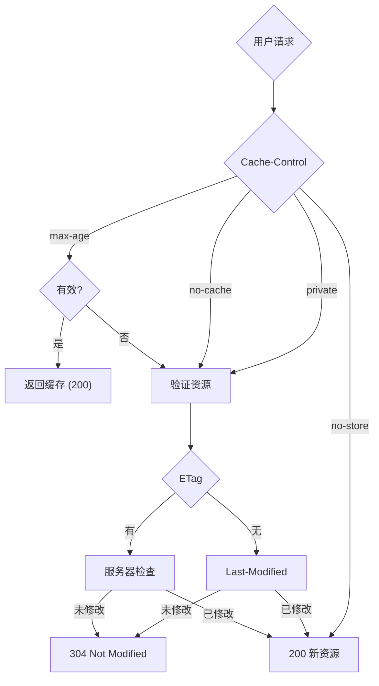

# 加载优化

## 1. 首屏优化方案

### 1.1 代码分割与懒加载

```javascript
// webpack/vite 配置：
// webpack: 动态import() → 自动code split
// vite: import() → 自动code split

// 路由懒加载（React）：
import React, { Suspense, lazy } from 'react';
const Home = lazy(() => import('./pages/Home'));
const About = lazy(() => import('./pages/About'));

function App() {
  return (
    <Suspense fallback={<Loading />}>
      <Routes>
        <Route path="/" element={<Home} />
        <Route path="/about" element={<About} />
      </Routes>
    </Suspense>
  );
}

// 组件级懒加载：
const HeavyChart = lazy(() => import('./HeavyChart'));

// webpack手动分割：
// webpack.config.js
new webpack.optimize.SplitChunksPlugin({
  chunks: 'all',
  cacheGroups: {
    vendor: {
      test: /[\\/]node_modules[\\/]/,
      name: 'vendors',
      priority: 10
    },
    common: {
      minChunks: 2,
      name: 'common',
      reuseExistingChunk: true
    }
  }
});

// CSS代码分割：mini-css-extract-plugin
```

### 1.2 CDN 部署

```javascript
// CDN工作原理：
// 用户请求 → 就近CDN节点（缓存） → 无缓存则回源站
// 优势：减少延迟、提高可用性、减轻源站压力

// 静态资源走CDN：
// 1. JS/CSS/图片/font等静态文件
// 2. npm包（webpack DLL / vite.optimize.deps.include）

// 缓存策略：
// index.html：不缓存或短缓存（no-cache/s-maxage=600）
// 静态资源：长缓存（max-age=31536000） + 内容hash命名
// webpack配置output.filename = '[name].[contenthash].js'

// 动态内容：CDN缓存（Cache-Control: private/no-store）
```

### 1.3 预加载

```html
<!-- 预加载关键资源：-->
<!-- 预加载当前页面一定需要的资源（立即下载）-->
<link rel="preload" href="main.js" as="script">
<link rel="preload" href="font.woff2" as="font" crossorigin>
<link rel="preload" href="critical.css" as="style">

<!-- 预获取（未来可能需要，闲时下载）-->
<!-- 预获取下一个路由的JS -->
<link rel="prefetch" href="/about.js">
<!-- 预获取下一个页面 -->
<link rel="prerender" href="https://example.com/next-page">

<!-- DNS预解析（减少DNS解析时间）-->
<link rel="dns-prefetch" href="https://cdn.example.com">

<!-- 预连接（建立TCP/TLS连接）-->
<link rel="preconnect" href="https://cdn.example.com" crossorigin>

<!-- 预渲染（同域名下页面整页渲染）-->
<link rel="prerender" href="/landing">

<!-- JS预加载：-->
// 手动预加载
const link = document.createElement('link');
link.rel = 'preload';
link.href = '/big.js';
link.as = 'script';
document.head.appendChild(link);

// 或使用 webpack 的 preload 注释
// import(/* webpackPreload: true */ 'HeavyComponent');

// prefetch：空闲时下载，优先级低（用于下一个路由）
// preload：当前导航需要，优先级高（用于当前页关键资源）
```

### 1.4 HTTP 缓存策略

**缓存判断流程：**



**Cache-Control 常见值：**

| 值 | 说明 |
|---|---|
| no-cache | 每次验证后使用（可用本地缓存，但需验证） |
| no-store | 禁止缓存 |
| private | 只允许浏览器缓存（CDN不可缓存） |
| public | CDN也可以缓存 |
| max-age=3600 | 缓存有效期（秒） |
| must-revalidate | 过期后必须验证 |

**最佳实践：**

1. HTML：`Cache-Control: no-cache`（确保更新能及时下发）
2. 静态资源（JS/CSS/图片）：`max-age=31536000` + 内容hash
   （文件名带hash，改变URL即可更新，浏览器自动重新缓存）
3. CDN：设置`s-maxage`，CDN节点缓存，浏览器不缓存（`private`）

## 2. 白屏时间优化

```javascript
// 白屏原因：
// 1. HTML下载慢
// 2. CSS阻塞渲染（没有内联关键CSS）
// 3. JS阻塞解析（没有defer/async）

// 优化方案1：内联关键CSS
// 把首屏需要的关键CSS直接写在<style>标签内
// <link rel="stylesheet" href="non-critical.css" onload="this.rel='stylesheet'">

// 优化方案2：骨架屏（Skeleton）
// 在内容加载前显示占位图，用户感知更快
// React Skeleton / Vue Skeleton

// 优化方案3：SSR（服务端渲染）
// HTML在服务端生成，首屏HTML包含内容
// 无需等待JS下载执行才知道页面内容

// 优化方案4：预渲染/静态生成（SSG）
// 预构建HTML，服务端直接返回
// Next.js / Nuxt.js 支持

// 优化方案5：减少阻塞渲染的资源
// <script async> 异步加载，不阻塞解析
// <script defer> 解析完HTML后执行，不阻塞解析
// CSS<link rel="preload"> + link.onload 延迟加载

// 优化方案6：HTTP/2 + 服务器推送
// 服务器主动推送关键资源（不再依赖HTML中声明）
```

## 3. SSR 与性能

```javascript
// 为什么SSR提升性能：
// 1. 首屏HTML包含内容，无需等待JS
// 2. 减少HTTP请求（HTML + 关键资源）
// 3. 更好的SEO（搜索引擎直接读取内容）
// 4. 水合（hydration）后变为SPA

// Next.js SSR 示例：
// pages/index.tsx
export async function getServerSideProps() {
  const data = await fetchData(); // 服务端获取数据
  return { props: { data } };
}

// SSR vs SSG vs ISR：
// SSR：每次请求实时渲染（适合频繁更新的数据）
// SSG：构建时生成静态HTML（适合内容固定的页面）
// ISR：混合策略（静态 + 按需重新渲染）
// Next.js: getStaticProps + revalidate: 60（每60秒增量生成）

// 流式SSR（Streaming SSR）：
// React 18 Suspense + stream：
// 服务端逐步输出HTML，用户更快看到内容
function Page() {
  return (
    <div>
      <h1>Title</h1>
      <Suspense fallback={<Skeleton />}>
        <Comments />  {/* 后加载的内容 */}
      </Suspense>
    </div>
  );
}

// RSC（React Server Components）：
// 服务端组件直接渲染，不需要hydration
// 大幅减少客户端JS体积
```

## 深入阅读与参考

!!! tip "怎么用这些资料"
    先读「官方文档与规范」建立准确的概念，再读「源码与示例」核对细节，最后用「教程、书籍与视频」换一种讲法加深理解。每条都写明了读哪一节、带着什么问题读。

### 官方文档与规范

| 资源 | 为什么读 | 怎么读 |
|---|---|---|
| [Vue SSR 指南](https://vuejs.org/guide/scaling-up/ssr.html) | 官方讲清 SSR 前提与 hydration 失配原因，概念权威。 | 读 hydration 与客户端激活一节，带着何时白屏的疑问读，整理检查清单。 |
| [Next.js 文档](https://nextjs.org/docs) | 官方覆盖 App Router 的 SSR/SSG/流式渲染，首屏策略权威。 | 读 Rendering 与 Data Fetching 章节，对比 SSR/SSG/ISR 对首屏的影响。 |
| [Server-Side Rendering (SSR)](https://vite.dev/guide/ssr) | SSR 总览，梳理服务端渲染流程与性能收益的官方说明。 | 通读全文，重点看渲染流程图，标注与首屏和 hydration 相关的环节。 |
| [SSR Options](https://vite.dev/config/ssr-options) | 官方配置项说明，调优 SSR 模式直接影响首屏与白屏。 | 逐项读配置含义，结合项目选模式，改配置后对比首屏时间。 |
| [Hydration Bugs _(and how to avoid them)_](https://book.leptos.dev/ssr/24_hydration_bugs.html) | 官方列举 hydration bug 及规避法，减少首屏交互失败。 | 按清单核对项目中的动态内容，逐条修复并回归验证首屏。 |
| [The Life of a Page Load](https://book.leptos.dev/ssr/22_life_cycle.html) | 拆解一次页面加载各阶段，定位白屏耗时的关键依据。 | 对照时间线读，标记白屏区间，再用工具测量自己页面的对应阶段。 |
| [Async Rendering and SSR “Modes”](https://book.leptos.dev/ssr/23_ssr_modes.html) | 讲清异步渲染与各 SSR 模式，指导流式输出优化首屏。 | 读各模式对比表，思考项目能否改流式，选定模式后实测首屏。 |

### 源码与示例

| 资源 | 为什么读 | 怎么读 |
|---|---|---|
| [Vite：SSR 指南](https://vite.dev/guide/ssr.html) | 手把手搭建最小 SSR 示例，直观看清服务端与客户端入口。 | 按文档搭最小服务，观察 HTML 返回到 hydrate 之间的白屏阶段。 |

### 教程、书籍与视频

| 资源 | 为什么读 | 怎么读 |
|---|---|---|
| [Josh Comeau：The Perils of Rehydration](https://www.joshwcomeau.com/react/the-perils-of-rehydration/) | 生动剖析 rehydration 的性能与体验问题，案例透彻。 | 读文中复现步骤，在自己的 SSR 项目重现 mismatch，再按方案修复。 |

## 应用与行业实践

### 应用场景地图

| 场景 | 用到本页哪个知识点 | 典型技术选型 | 注意事项 |
| --- | --- | --- | --- |
| 后台管理系统的万行表格 | 动态 import() 自动 code split | 路由懒加载 + 虚拟滚动 + 导出模块异步加载 | 列元数据请求会和 chunk 请求串行，先渲染骨架 |
| 低端安卓机上的电商首页 | 首屏优化方案、白屏时间优化 | 路由级分割 + prefetch 按网络状况开关 | prefetch 抢带宽会推迟首屏，弱网必须关掉 |
| 多人协作白板 | 动态 import() 与首屏分离 | 画布核心同步加载，图形识别按需加载 | 协作消息到达前画布必须已可绘制 |
| 内容站点的文章页 | SSR 与性能 | 服务端渲染 + 客户端注水 + 评论组件异步 | 注水失败要能降级成可读的静态内容 |
| 跨境多语言站点 | 路由分割 + 按语言切包 | 语言包按 locale 拆成独立 chunk | 首屏文案缺失会闪，关键文案内联进 HTML |
| 投放用 H5 活动页 | 白屏时间优化 | 单页静态化 + 首屏 CSS 内联 | 埋点脚本阻塞渲染就改成异步加载 |
| 大屏数据看板 | 动态 import() 与大包拆分 | 图表库按图表类型拆 chunk | 轮询请求与 chunk 解析会争主线程 |
| Electron 桌面客户端 | 首屏优化方案 | 主窗口先渲染壳，业务模块按需 require | 冷启动磁盘 IO 与 chunk 读取互相排队 |

### 三个场景拆解

#### 场景 1：后台管理的万行表格

**业务背景**：运营后台列表页默认分页展示，切到"全部"后一次渲染上万行，滚动掉帧、点进页面先是空白。规模量级可以用 Performance 面板统计的主线程长任务条数，以及从导航到表格出现可交互的时间来界定。

**怎么用本页知识解决**：先把"表格渲染、导出、列元数据"从首屏主包里拆出去，首屏只留路由壳与骨架；重活挂到交互事件或浏览器空闲时段。

```js
// 路由级：进入列表页时才下载表格相关 chunk
const ListPage = () => import(/* webpackChunkName: "list-page" */ './ListPage');

// 交互级：点击"导出 Excel"再拉体积大的 xlsx
exportBtn.addEventListener('click', async () => {
  const { exportXlsx } = await import(/* webpackChunkName: "xlsx" */ './export-xlsx');
  exportXlsx(rows); // 打包器据此切成独立 chunk
});

// 列元数据在浏览器空闲时再取，避开首屏渲染
requestIdleCallback(() => loadColumns());

// 首帧先渲染骨架，用户看到结构而不是空白
render('table-skeleton');
```

- 路由级 import 让列表页代码只在进入该路由时下载，主包不含表格组件。
- 导出功能放在点击事件里，首屏下载量不包含 xlsx 这类大体量库。
- 列元数据走空闲回调，避免与首屏渲染抢主线程。
- 骨架先于数据出现，白屏时间按"出现骨架"这一刻计算。

**怎么度量收益**：用 Chrome DevTools Performance 面板取 LCP、FCP、TBT；用 Coverage 面板看主包 JS 的未使用比例；用 webpack-bundle-analyzer 对比拆分前后的 chunk 体积；Lighthouse 桌面与移动预设各跑一轮。

**什么时候不该用**：
- 该页首屏唯一内容就是表格，用户进来只看表，拆出去的模块必然立刻加载，白白多一次请求。
- 首屏就要同步调用导出 API（脚本化批量任务），异步模块拿不到同步返回值。
- 内网环境带宽充裕且包体本来就小，拆包带来的请求开销会盖过收益。

#### 场景 2：低端安卓的首屏加载

**业务背景**：投放来的落地页在低端安卓机上白屏时间长，主包偏大，CPU 解压与解析占了首屏的大头。可以用 DevTools 的 CPU 降速（4 倍、6 倍）配合 Slow 4G 在本地复现同一现象。

**怎么用本页知识解决**：思路是把路由切成边界，首屏关键路径保持静态 import，次要路由用 prefetch 在空闲时拉取，并按网络状况决定是否预取。

```js
// 首屏关键模块保持静态 import，参与主包
import './critical.css'; // 关键样式内联或随主包一起下发

// 路由级分割：首页与"我的"分属不同 chunk
const Home = () => import(/* webpackChunkName: "home" */ './home');

// 次要路由加 prefetch，浏览器空闲时下载
const prefetchProfile = () => import(/* webpackPrefetch: true */ './profile');

// 弱网下关闭预取，把带宽留给首屏
if (navigator.connection?.effectiveType !== '2g') prefetchProfile();
```

- 关键模块走静态 import，首屏不会出现请求串联的瀑布。
- 关键 CSS 内联后，首屏不再等样式文件往返。
- prefetch 只对用户下一步常访问的路由开启。
- 用 navigator.connection 判断网络，弱网关闭预取，保首屏带宽。

**怎么度量收益**：Lighthouse 移动预设取的 FCP、LCP、TBT；用 web-vitals 库把 LCP、CLS、INP 上报到自有端点；用 performance.getEntriesByType('navigation') 取 responseEnd 到 domContentLoaded 的差值做自定义打点。

**什么时候不该用**：
- 页面本身就是单屏、只有一处交互，拆出来的 chunk 都要加载，等于多一次往返。
- 离线首屏是硬需求（Service Worker 预缓存全部资源），拆包与全量预缓存的目标冲突，要先定策略。
- 首屏文案随语言变化且不能闪，此时按 locale 切包会引入二次渲染，应先内联默认语言文案。

#### 场景 3：多人协作白板

**业务背景**：白板页要同时装载画布渲染、协同通信、图形识别、导出四块能力，而用户进房间后第一件事是看到能画的画布。画布迟迟不出现，用户会反复刷新，房间里的协同通道被重复建立。

**怎么用本页知识解决**：把画布定为唯一关键路径，其余三块分别挂到工具栏事件、socket 打开事件和导出按钮上。

```js
// 画布核心同步加载，保证进房间即可绘制
import { createBoard } from './board-core';

// 图形识别挂到工具栏交互，不用就不下载
toolbar.on('shape-recognize', async () => {
  const { recognize } = await import(/* webpackChunkName: "shape-ai" */ './shape-recognize');
  recognize(canvas.snapshot());
});

// 协同编解码等 socket 打开后再加载，不占首屏
socket.on('open', () => import('./sync-codec').then((m) => m.bind(socket)));

// 导出属于低频操作，单独成 chunk
window.exportBoard = () => import('./exporter').then((m) => m.run(board));
```

- 画布核心走静态 import，进入房间即可绘制。
- 图形识别挂在工具栏事件上，不触发就不下载。
- 协同编解码等 socket 打开后再加载，首屏不等它。
- 导出独立成 chunk，低频操作不占首屏预算。

**怎么度量收益**：用 performance.mark 与 performance.measure 打点"进入路由到画布可绘制"；Performance 面板统计长任务条数与总阻塞时间；在房间内用 performance.now() 差值测量一次本地操作到远端可见的往返时长。

**什么时候不该用**：
- 业务要求进房间立刻恢复上一位用户留下的识别结果，识别模块属于关键路径，不能拆。
- 验收流程固定为"先导出再编辑"，导出变成第一步，异步加载会让流程变成两段等待。
- 白板是离线可用的单机工具，没有 socket 事件可挂，得换用可见性或空闲回调触发。

### 行业先进实践

路由级代码分割（出处：React 官方文档 Code-Splitting）
React.lazy 配合 Suspense 把路由组件变成独立 chunk，加载态交给 fallback。它的作用是把首屏下载范围收敛到当前路由，主包体积与解析时间随之下降。借鉴做法是把顶层路由作为分割边界，fallback 用骨架结构而不是空白占位。

magic comments 的预取与预加载（出处：webpack 官方文档 Code Splitting 与 Magic Comments）
webpackPrefetch 让浏览器在空闲时下载，webpackPreload 与父 chunk 并行下载。前者把"下次点击要用的代码"提前搬走，点击时无需等待。借鉴做法是对用户下一步常访问的路由加 prefetch，对首屏渲染必需但体积大的 chunk 用 preload。需核对官方文档：当前 webpack 版本对两条注释的支持范围与默认行为。

流式 SSR 与选择性注水（出处：React 官方文档 renderToPipeableStream 与 Selective Hydration）
服务端先吐出外壳，慢数据区域用 Suspense 边界延后，客户端按交互优先级注水。它的作用是把首字节到首屏之间不再等待最慢的数据源。借鉴做法是给评论、推荐位这类慢接口单独包 Suspense 边界。需核对官方文档：所用 React 版本是否包含该 API 及对应的 Suspense 行为。

模板级延迟加载（出处：Angular 官方文档 @defer）
在模板里声明依赖块与触发条件（可见、交互、空闲、定时），由框架决定何时下载。它的作用是把加载时机写成声明，省掉手写 IntersectionObserver 的胶水代码。借鉴做法是把首屏外的重组件交给框架的 defer 原语，触发条件优先选可见或交互。需核对官方文档：项目所用 Angular 版本中该语法是否已进入稳定版。

性能预算与 CI 门禁（出处：web.dev Performance Budgets 与 Lighthouse CI 官方文档）
给 chunk 体积、LCP、TBT 设阈值，超阈值让流水线失败。它的作用是把性能从上线后观测提前到合并前拦截。借鉴做法是先只对首屏 chunk 体积与 LCP 设阈值，阈值取当前基线往上留余量，稳定后再收紧。

### 从学到用：落地路线

第 1 步，选一个路由清晰、首屏包体可测的页面做试点，只在该页做路由级分割。
验收标准：webpack-bundle-analyzer 能指出该页对应的 chunk，主包体积有改动前基线记录。

第 2 步，在固定设备与固定网络条件下录制前后对照数据。
验收标准：同一降速与网络条件下各录三次，形成 LCP、FCP、TBT 的记录表，差异能对应到 chunk 变化。

第 3 步，把分割规则写成团队约定并进入代码评审清单。
验收标准：约定覆盖路由边界、第三方大依赖、低频交互模块三类；新页面默认按此拆分，评审清单含对应检查项。

第 4 步，把首屏 chunk 体积与 LCP 阈值接入 CI 做门禁。
验收标准：故意引入一个大依赖的测试分支能被 CI 拦下并给出超阈值提示。

### 动手作业

**目标**：给一个已有的单页应用（或教程示例仓库）完成首屏分割，并用自己测出的数据说明改动效果。

**步骤**：
1. 用 webpack-bundle-analyzer 或构建产物体积报告，记录当前主包与首屏路由 chunk 的体积。
2. 打开 Performance 面板，用 Slow 4G 加 4 倍 CPU 降速录制首屏，导出 LCP、FCP、TBT 三个指标。
3. 把首屏之外的路由改成动态 import()，给每个 chunk 写可读命名（webpackChunkName 或构建工具等价写法）。
4. 把低频交互模块（导出、图表、富文本编辑器）改成点击后再 import。
5. 对用户下一步常访问的路由加 prefetch，并用 navigator.connection 做弱网开关。
6. 重复第 1、2 步，得到相同条件下的前后对照数据。
7. 写一份 README，说明拆分边界、触发时机、测量方法与结论。

**验收标准**：
- 产物报告能列出每个 chunk 的体积与触发时机，主包与首屏 chunk 有前后对比。
- 性能录制在相同降速与网络条件下各做三次，记录表含原始数值。
- 代码里每个动态 import 都有一行中文注释写明触发条件。
- 弱网模拟下骨架先于业务内容出现，且骨架不依赖业务 chunk。
- README 列出至少两条"不该拆"的反例并说明理由。

