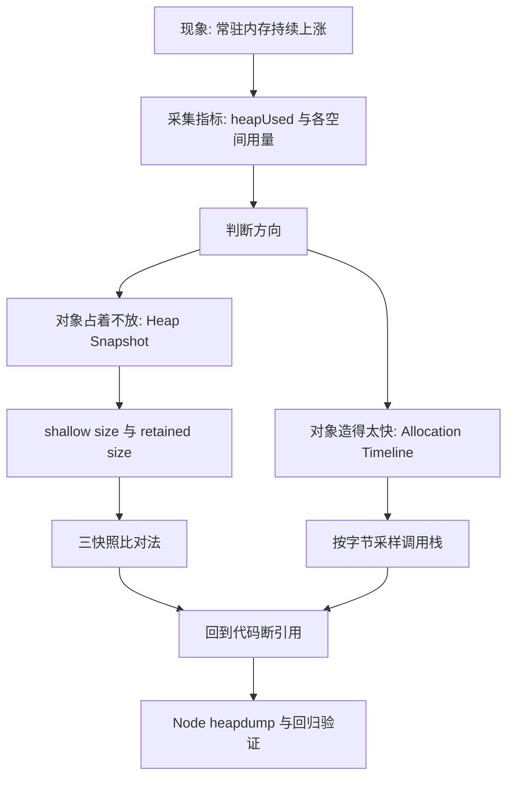
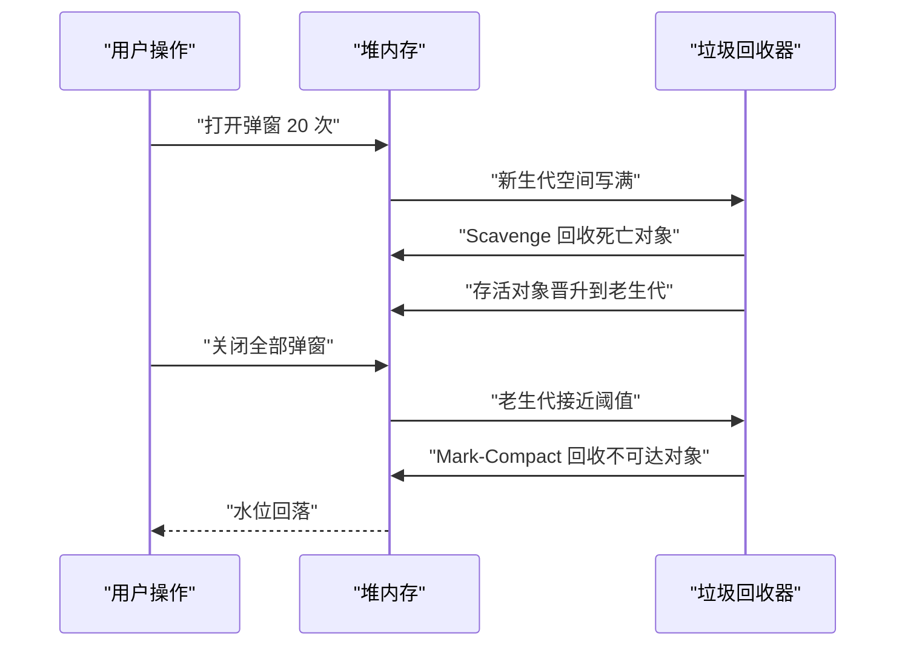
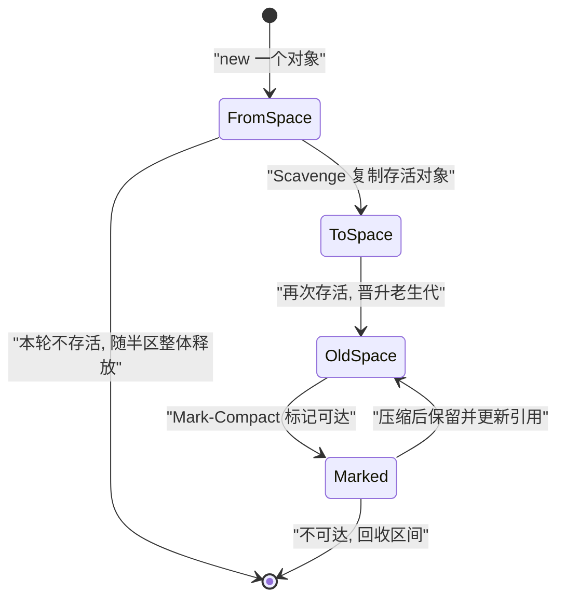
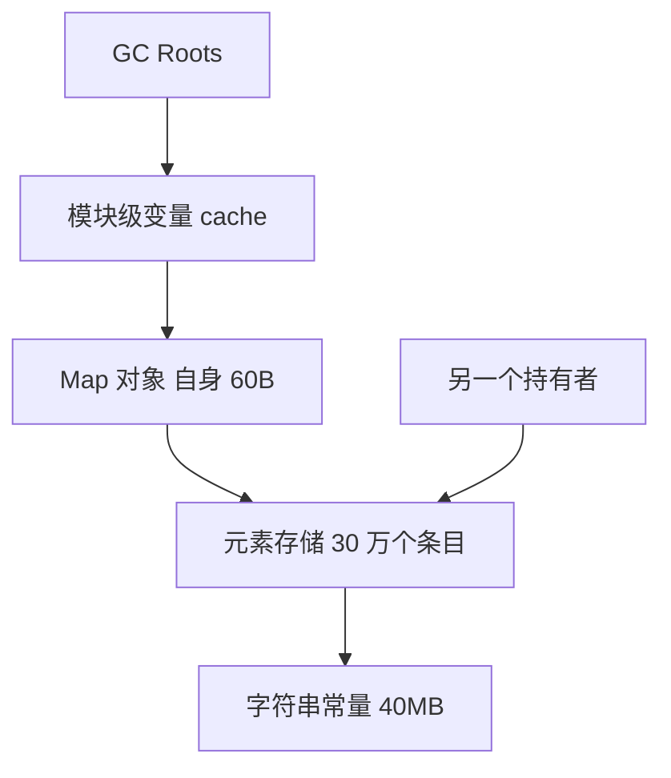
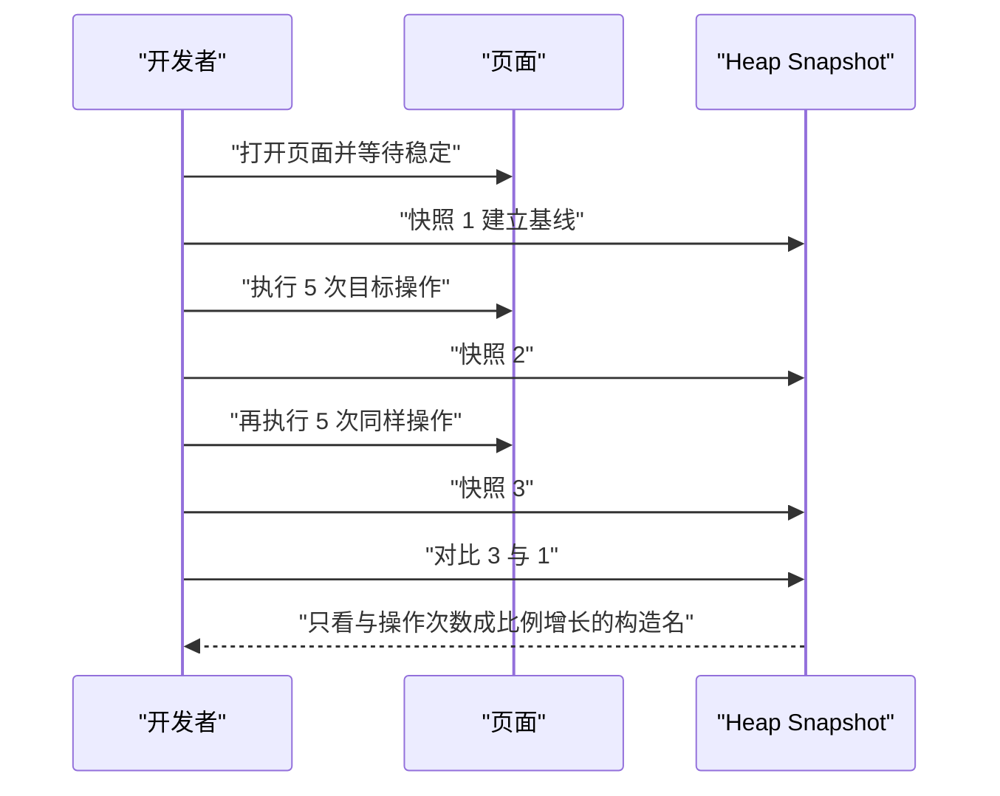
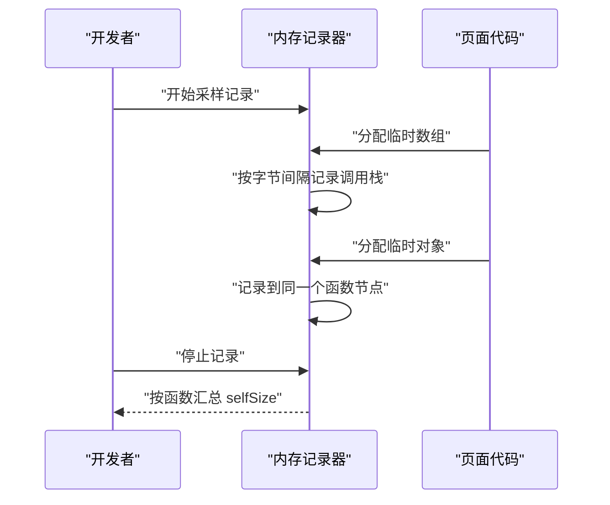
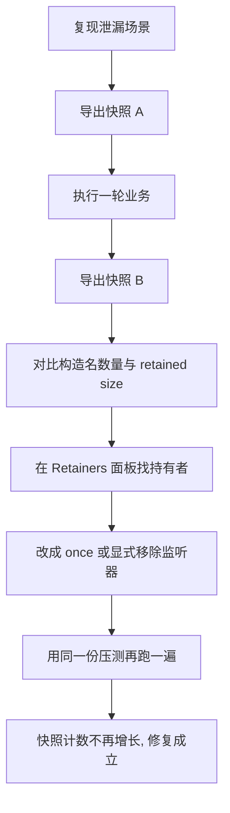

# 内存分析：Heap Snapshot、分配时间线与泄漏定位

!!! abstract "学完这一页你能"

    - 用 `process.memoryUsage()` 与 `v8.getHeapSpaceStatistics()` 判断内存是波动还是持续上涨。
    - 说清 V8 新生代与老生代的分工，以及 Scavenge 与 Mark-Compact 各自回收什么。
    - 在 Heap Snapshot 里区分 shallow size 与 retained size，并从 Retainers 面板找到持有者。
    - 用三快照比对法写出可复现的泄漏结论，并用 Node 脚本验证修复结果。

## 0. 知识地图



建议这样读：先看第 1 节和第 2 节，把判断标准和堆结构打牢。
再看第 3 节与第 4 节，学会读快照里的两个数字与做差分。
最后看第 5 节和第 6 节，处理掉帧类问题与真实泄漏定位。

## 1. 起点：内存是真在涨，还是只在高水位波动

**先想一个问题**

你做的后台管理页跑了 40 分钟，系统监视器显示 900MB，刷新后掉回 120MB。
这时你需要回答：900MB 是正常峰值，还是每次操作都留下了一部分没释放？

**心智模型**

!!! tip "心智模型"

    把堆内存看成一个水池：泄漏的判断标准是涨上去后回不回得来，不是水位绝对值。
    日常类比：浴缸放水后水位应回到原线，如果每次都高一点点，说明排水口被堵。
    类比不成立处：GC 不是定时排水，它在分配失败或到达阈值时才启动，所以水位会先冲到某个高度再回落。

!!! note "术语：堆（heap）"

    V8 用来存放 JS 对象的区域，可用 `process.memoryUsage().heapUsed` 读到当前活跃对象占用的字节数。
    例：一个只加载了框架的空 Node 进程，heapUsed 在 3MB 到 6MB 之间浮动，具体值用脚本读取。

**图解**



图里每一步的含义：

1. 用户每次操作都会分配对象与数据，这部分是正常开销。
2. 新生代写满后触发 Scavenge，短命对象在这里被回收。
3. 活过两轮回收的对象晋升到老生代。
4. 老生代接近阈值时触发 Mark-Compact，回收不可达对象。
5. 如果关闭弹窗后水位不回落，说明有对象仍然可达。

**一步一步来**

第一步：采集三个时间点的 heapUsed。这里要拿到对象还可达时的水位，以及断开引用后的水位。

```js
// 运行: node --expose-gc baseline.js
'use strict';
const MB = (n) => n / 1024 / 1024;             // 字节换算成 MB

function read() {
  globalThis.gc();                              // 手动触发一次全量回收
  return MB(process.memoryUsage().heapUsed);    // 只读仍在堆上的对象占用
}

const base = read();                            // 基线: 什么都没做
const list = [];
for (let i = 0; i < 100000; i += 1) {
  list.push({ id: i, buf: new Array(20).fill(i) }); // 造 10 万个对象
}
const peak = read();                            // 峰值: 对象仍然可达
list.length = 0;                                // 断开引用, 对象变为不可达
const back = read();                            // 回落值: 应接近基线

console.log('base/peak/back', base.toFixed(1), peak.toFixed(1), back.toFixed(1));
```

**这段代码在做什么**

- `read()` 先调用 `globalThis.gc()`，把已死亡的垃圾清掉，只留下真正活着的对象。
- `list` 是模块级数组，它可达时那 10 万个对象就不能被回收。
- `list.length = 0` 清空数组，10 万个对象失去唯一引用。
- 再读一次 heapUsed，差值就是这段数据结构被释放的字节数。

运行结果（数值随机器与 Node 版本变化，趋势一致）：

```text
base/peak/back 4.2 24.8 4.4
```

第二步：确认这个回落来自 GC，而不是操作系统释放。缺少手动回收时读数会虚高。

```js
// 运行: node --expose-gc baseline2.js
'use strict';
const MB = (n) => n / 1024 / 1024;

const big = new Array(300000).fill(null).map((_, i) => ({ i })); // 长期持有的数据

const withoutGc = MB(process.memoryUsage().heapUsed); // 不手动回收, 读数混着上一轮垃圾
globalThis.gc();                                      // 清掉可回收对象
const withGc = MB(process.memoryUsage().heapUsed);    // 只剩当前活着的对象

console.log('withoutGc/withGc', withoutGc.toFixed(1), withGc.toFixed(1));
```

**这段代码在做什么**

- `big` 在两次读数里都可达，因此它的占用被算进两次结果。
- 两次的差值来自之前遗留、尚未被自动回收的垃圾对象。
- 结论：采样点必须先 `gc()`，否则趋势判断会被上一次实验干扰。
- 这也解释了为什么同一个页面刷新前后内存数字差得远。

运行结果：

```text
withoutGc/withGc 22.6 20.1
```

**动手验证**

```js
// 运行: node --expose-gc leak-check.js
'use strict';
const assert = require('node:assert');

const MB = (n) => n / 1024 / 1024;
const read = () => { globalThis.gc(); return MB(process.memoryUsage().heapUsed); };

const base = read();

// 第一段: 每次操作都把结果留在数组里, 模拟常量级泄漏
const leaked = [];
for (let round = 0; round < 5; round += 1) {
  leaked.push(new Array(20000).fill(0).map((_, i) => ({ round, i, buf: new Array(20).fill(i) })));
}
const afterLeak = read();
assert.ok(afterLeak - base > 10, '泄漏后应上涨超过 10MB');
assert.ok(afterLeak - base < 200, '正常机器上不应超过 200MB');

// 第二段: 断开引用, 水位应回落
leaked.length = 0;
const afterFix = read();
assert.ok(afterLeak - afterFix > 10, '断开引用后应释放超过 10MB');
assert.ok(afterFix - base < 5, '修复后应回到基线 5MB 以内');

console.log('base', base.toFixed(1), 'afterLeak', afterLeak.toFixed(1), 'afterFix', afterFix.toFixed(1));
console.log('all assertions passed');
```

预期输出：

```text
base 4.3 afterLeak 29.1 afterFix 4.5
all assertions passed
```

**常见坑**

| 现象 | 原因 | 怎么修 |
| --- | --- | --- |
| heapUsed 一路涨，手动 gc 后不回落 | 对象仍被引用，如全局数组、闭包、未摘除的监听器 | 按第 6 节流程抓快照，在 Retainers 面板找持有者 |
| 每次读数都不同，看不出趋势 | 采样点太少，且没区分 gc 前后 | 固定采样点，先 gc 再读，至少记录 5 次 |
| 用 heapTotal 判断泄漏 | heapTotal 是 V8 向系统申请的量，不随对象死亡立即下降 | 用 heapUsed 判断活跃对象，heapTotal 只看上限 |

**小结**

- 泄漏的判断标准是涨上去能不能回来，不是内存绝对值。
- 采样前先手动 GC，读数才指向真正存活的对象。
- 三份读数就够定性：基线、峰值、释放后的回落值。

## 2. V8 的堆：新生代、老生代与两种回收算法

**先想一个问题**

同样是创建 10 万个对象，为什么创建完就丢的操作几乎不影响帧率，而放进全局缓存的操作会让内存一直往上？

**心智模型**

!!! tip "心智模型"

    新生代是短命对象的候车厅，老生代是长期住户的仓库；活过两轮回收的对象会被搬进仓库。
    日常类比：候车厅座位少、周转快，每趟车把还坐着的人搬到另一半座位区。
    类比不成立处：搬运时 V8 会改写所有指向这些对象的引用，对象地址会变，所以不能拿地址当身份。

!!! note "术语：Scavenge"

    V8 回收新生代用的复制式算法，把存活对象从 from-space 复制到 to-space。
    例：新生代两个半区各占 1MB 时，一次 Scavenge 之后 from-space 被整体清空。

!!! note "术语：Mark-Compact"

    V8 回收老生代用的标记加压缩算法，先标记可达对象，再把它们移动到一起。
    例：老生代里 100MB 对象只剩下 20MB 可达时，压缩会把存活对象挤到一端。

**图解**



图里每一步的含义：

1. 新对象先在新生代的 `FromSpace` 分配。
2. Scavenge 把存活对象复制到 `ToSpace`，`FromSpace` 整体清空。
3. 两次 Scavenge 都活下来的对象晋升到老生代。
4. 老生代用 Mark-Compact 标记可达对象，并把存活对象压缩到一起。
5. 不可达对象的区间被回收，交给后续分配使用。

**一步一步来**

第一步：打印 V8 划分的各个内存空间。这里是确认新生代与老生代实际大小的入口。

```js
// 运行: node spaces.js
'use strict';
const v8 = require('node:v8');
const MB = (n) => (n / 1024 / 1024).toFixed(1);

for (const s of v8.getHeapSpaceStatistics()) {
  console.log(
    s.space_name.padEnd(20),       // 空间名称: new_space 或 old_space
    'size', MB(s.space_size),      // V8 为该空间保留的字节数
    'used', MB(s.space_used_size)  // 该空间当前已用字节数
  );
}
```

**这段代码在做什么**

- `getHeapSpaceStatistics()` 返回各个内存空间的数组，每项含名称、保留大小、已用大小。
- `space_size` 是保留量，`space_used_size` 是活跃对象占用，两者要分开看。
- `new_space` 对应新生代，`old_space` 对应老生代，`code_space` 存放编译后的代码。
- 这些数字随负载变化，不要背，用脚本读当前值。

运行结果（字段固定，行数与数值随进程变化）：

```text
new_space            size 1.0 used 0.1
old_space            size 2.6 used 0.8
code_space           size 0.5 used 0.2
map_space            size 0.1 used 0.0
large_object_space   size 0.0 used 0.0
```

第二步：用 `--trace-gc` 看到真实的回收日志，区分两种回收。

```js
// 运行: node --trace-gc trace-demo.js
'use strict';
const keep = [];                        // 长期持有, 会进入老生代
for (let i = 0; i < 20; i += 1) {
  const temp = new Array(50000).fill(i); // 短命大数组, 用来写满新生代
  keep.push(temp.slice(0, 10));          // 只保留 10 个元素, 其余变垃圾
}
console.log('kept', keep.length);
```

**这段代码在做什么**

- `temp` 在每次循环结束后立刻不可达，用来把新生代写满。
- `temp.slice(0, 10)` 生成的小数组被 `keep` 持有，会晋升到老生代。
- `--trace-gc` 让 V8 每完成一次回收就打印一行日志。
- 日志出现 `Scavenge` 表示回收新生代，出现 `Mark-Compact` 表示回收老生代。

运行结果（截取，字段含义需核对官方文档中 `--trace-gc` 的说明）：

```text
[12345:0x0] 12 ms: Scavenge 2.4 (3.0) -> 0.3 (3.0) MB, 0.8 / 0.0 ms
[12345:0x0] 41 ms: Scavenge 2.7 (3.2) -> 0.6 (3.4) MB, 0.9 / 0.0 ms
[12345:0x0] 96 ms: Mark-Compact 5.1 (8.0) -> 3.2 (8.0) MB, 2.1 / 0.0 ms
kept 20
```

**动手验证**

```js
// 运行: node --expose-gc spaces-check.js
'use strict';
const assert = require('node:assert');
const v8 = require('node:v8');

const used = (name) => v8.getHeapSpaceStatistics()
  .find((x) => x.space_name === name).space_used_size;

globalThis.gc();
const oldBefore = used('old_space');

// 一次性创建 20 万个对象并长期持有, 回收后它们进入老生代
const keep = new Array(200000).fill(null).map((_, i) => ({ i, pad: i * 2 }));
globalThis.gc();
const oldAfter = used('old_space');

assert.ok(oldBefore > 0, '老生代已被使用');
assert.ok(oldAfter - oldBefore > 4 * 1024 * 1024, '20 万对象应让老生代增长超过 4MB');
assert.ok(keep.length === 200000, '对象确实被持有');

console.log('old_space 增量 MB', ((oldAfter - oldBefore) / 1024 / 1024).toFixed(1));
console.log('all assertions passed');
```

预期输出：

```text
old_space 增量 MB 8.1
all assertions passed
```

**常见坑**

| 现象 | 原因 | 怎么修 |
| --- | --- | --- |
| 大数组一次 Scavenge 后就进老生代 | 超过新生代半区容量的对象走大对象空间 | 用 `large_object_space` 指标确认，避免循环里反复造大数组 |
| 老生代增长但 heapUsed 回落 | 存活对象晋升本身会占用老生代，属于正常现象 | 比较多次操作后的增量，单次增长不作为泄漏证据 |
| `--trace-gc` 刷屏且压测变慢 | 每次 GC 都往 stdout 写一行 | 只在定位阶段开启，压测与线上关闭 |

**小结**

- 新生代用 Scavenge 复制存活对象，成本与存活对象数量相关。
- 老生代用 Mark-Compact 标记并压缩，配合 Mark-Sweep 处理碎片。
- 对象活得越久越可能进老生代，长期缓存要按需清理。

## 3. Heap Snapshot 的两个数字：shallow size 与 retained size

**先想一个问题**

快照里一个 `Map` 自身只显示 60 字节，但它挂着 30 万个缓存条目。
你想知道删掉这个 `Map` 能省多少内存，该看哪个数字？

**心智模型**

!!! tip "心智模型"

    shallow size 是行李自己的重量，retained size 是把它搬走后腾出的整块空间。
    日常类比：房间里的货架只占 2 平方米，但货架搬走时，上面 200 箱货也一起走了。
    类比不成立处：两个对象共享同一段数据时，这段数据只算给支配树上最近的支配者，不会重复计入。

!!! note "术语：shallow size"

    对象自身占用的字节数，不含它引用的其他对象。
    例：`new Array(1000000).fill(1)` 的数组对象 shallow size 在几十字节量级，元素存放在单独的元素存储区。

!!! note "术语：retained size"

    断开该对象的引用后，能被垃圾回收释放的字节总数。
    例：一个只被全局变量持有的数组，它的 retained size 等于数组对象加元素存储区的大小。

**图解**



图里每一步的含义：

1. GC Roots 是判断可达的起点，包含全局对象与当前调用栈。
2. 模块级变量 `cache` 在根上，因此它一直可达。
3. `Map` 对象自身只占几十字节，这就是 shallow size。
4. 从 `Map` 往下到字符串，这段总量是它的 retained size。
5. 如果 `D` 还被另一个持有者引用，断开 `B` 时这段内存不会释放。

**一步一步来**

第一步：用 GC 实验测出 retained size 的真实值。这是最直接的验证方式，不依赖任何工具。

```js
// 运行: node --expose-gc retained.js
'use strict';
const MB = (n) => n / 1024 / 1024;
const read = () => { globalThis.gc(); return MB(process.memoryUsage().heapUsed); };

const holder = { data: new Array(300000).fill(0).map((_, i) => ({ i })) };
globalThis.__cache = holder;   // 唯一引用挂在全局对象上
const before = read();         // 持有时的水位

globalThis.__cache = null;     // 断开唯一引用
const after = read();          // 回收后的水位

console.log('retained MB', (before - after).toFixed(1));
```

**这段代码在做什么**

- `holder` 只被 `globalThis.__cache` 引用，没有第二个持有者。
- `before` 是对象可达时的堆占用，`after` 是断开引用后的堆占用。
- 两者之差就是这段数据结构的 retained size，由 GC 实测得到。
- 如果再加一个持有者，这个差值会接近 0。

运行结果：

```text
retained MB 12.4
```

第二步：验证共享引用如何影响 retained size。这里要看到只断开一个持有者时内存不动。

```js
// 运行: node --expose-gc shared.js
'use strict';
const MB = (n) => n / 1024 / 1024;
const read = () => { globalThis.gc(); return MB(process.memoryUsage().heapUsed); };

const shared = new Array(200000).fill(0).map((_, i) => ({ i }));
globalThis.a = { shared };   // 持有者 A
globalThis.b = { shared };   // 持有者 B, 与 A 共享同一份数据
const both = read();

globalThis.a = null;         // 只断开 A
const oneLeft = read();      // 期待: 水位几乎不动

globalThis.b = null;         // 断开 B, 数据才不可达
const noneLeft = read();

console.log('both/oneLeft/noneLeft', both.toFixed(1), oneLeft.toFixed(1), noneLeft.toFixed(1));
```

**这段代码在做什么**

- `shared` 同时被 `a` 与 `b` 引用，两个持有者自身都很小。
- 只断开 `a` 时 `shared` 依然可达，所以水位几乎不动。
- 断开 `b` 后 `shared` 才不可达，水位明显下降。
- 结论：retained size 由最后一个持有者断开时才兑现。

运行结果：

```text
both/oneLeft/noneLeft 18.3 18.2 6.1
```

**动手验证**

```js
// 运行: node --expose-gc retained-check.js
'use strict';
const assert = require('node:assert');
const MB = (n) => n / 1024 / 1024;
const read = () => { globalThis.gc(); return MB(process.memoryUsage().heapUsed); };

const shared = new Array(300000).fill(0).map((_, i) => ({ i }));
globalThis.a = { shared };
globalThis.b = { shared };
const both = read();

globalThis.a = null;
const oneLeft = read();
assert.ok(both - oneLeft < 2, '只断开一个持有者时不应释放');

globalThis.b = null;
const noneLeft = read();
assert.ok(both - noneLeft > 8, '断开全部持有者后应释放超过 8MB');
assert.ok(noneLeft < both, '释放后水位必须下降');

console.log('both', both.toFixed(1), 'oneLeft', oneLeft.toFixed(1), 'noneLeft', noneLeft.toFixed(1));
console.log('all assertions passed');
```

预期输出：

```text
both 18.6 oneLeft 18.5 noneLeft 6.2
all assertions passed
```

**常见坑**

| 现象 | 原因 | 怎么修 |
| --- | --- | --- |
| 删掉一个大对象后内存没降 | 还有第二个持有者，例如缓存表与定时器各持一份 | 在 Retainers 面板看全部持有者，逐个断开 |
| 快照里数组的 shallow size 只有几十字节 | 元素存放在单独的元素存储区，不计入数组对象自身 | 展开它的子节点，看元素存储区的大小 |
| 按 self size 排序找不到泄漏源头 | 泄漏根源常是持有者，而不是占用最多的对象 | 同时看 retained size 与该对象的 Retainers |

**小结**

- shallow size 是对象自身开销，retained size 是断开它能释放的总量。
- retained size 受共享引用影响，只有最后一个持有者断开才兑现。
- 找泄漏先看 retained size 大的对象，再看谁持有它。

## 4. 三快照比对法：把增长的对象锁出来

**先想一个问题**

快照里有 20 万个对象，你怎么知道哪个是本次操作新产生的？
只拍一张快照，任何存量对象都可能是嫌疑人。

**心智模型**

!!! tip "心智模型"

    用差值代替绝对值：先拍基线快照，做一次操作，再拍一张，重复一次，最后比较第三张与第一张。
    日常类比：想知道仓库多了哪些货，就盘两次点，看两次数量的差额，而不是盯着总数。
    类比不成立处：对象会批量死亡，第一张与第三张之间也会出现减少的行，减少不代表修复成功。

!!! note "术语：Heap Snapshot"

    V8 把某一时刻的完整对象图序列化成的文件，Node 里用 `v8.writeHeapSnapshot()` 生成。
    例：一个空 Node 进程的快照文件在几十 MB 量级，导出时进程会短暂暂停。

**图解**



图里每一步的含义：

1. 页面稳定后再拍，避免把初始化对象算进增量。
2. 快照 2 用来确认增长不是一次性初始化造成的。
3. 同样操作做两轮，只有线性增长的构造名值得怀疑。
4. 对比时排除 `System` 与编译产物这类引擎自身节点。

**一步一步来**

第一步：在 Node 里导出快照文件。先拿到文件，后面的分析工具才能接手。

```js
// 运行: node export-snapshot.js
'use strict';
const v8 = require('node:v8');
const path = require('node:path');

const file = path.resolve(process.cwd(), 'baseline.heapsnapshot');
v8.writeHeapSnapshot(file);   // 把当前堆写成快照文件
console.log('written', file); // 生成的文件可直接拖进 DevTools
```

**这段代码在做什么**

- `writeHeapSnapshot` 是 Node 内置能力，不需要第三方包。
- 传绝对路径，避免文件落到意料之外的目录。
- 生成的文件是 JSON 文本，可以被脚本解析。
- 导出期间进程会短暂暂停，堆越大暂停越久。

运行结果：

```text
written /path/to/baseline.heapsnapshot
```

第二步：解析快照并按构造名做差分。这是把比对法自动化的核心。

```js
// 运行: node diff-snapshot.js a.heapsnapshot b.heapsnapshot
'use strict';
const fs = require('node:fs');

function diffByName(fileA, fileB) {
  const load = (f) => JSON.parse(fs.readFileSync(f, 'utf8'));
  const a = load(fileA);
  const b = load(fileB);
  const fields = b.snapshot.meta.node_fields;  // 节点字段顺序表
  const stride = fields.length;                // 每个节点占几个数字
  const iName = fields.indexOf('name');        // name 字段在数组中的位置
  const count = (raw) => {
    const m = new Map();
    for (let i = 0; i < raw.snapshot.node_count; i += 1) {
      const idx = raw.nodes[i * stride + iName];       // 取出名称下标
      const name = raw.strings[idx] || 'unknown';      // 到字符串池取真实名称
      m.set(name, (m.get(name) || 0) + 1);             // 按名称累计节点数
    }
    return m;
  };
  const before = count(a);
  const after = count(b);
  const rows = [];
  for (const [name, n] of after) {
    const grew = n - (before.get(name) || 0);
    if (grew > 0) rows.push([name, grew]);             // 只保留增长的行
  }
  return rows.sort((x, y) => y[1] - x[1]).slice(0, 10);
}

for (const [name, grew] of diffByName(process.argv[2], process.argv[3])) {
  console.log(grew, name);
}
```

**这段代码在做什么**

- `nodes` 是一维数字数组，每 `stride` 个数字描述一个节点。
- `name` 字段存的是字符串池下标，需要到 `strings` 里取真实名称。
- `node_count` 给出节点总数，作为循环边界。
- 只保留增长的行，并按增长量倒序取前 10 行。

运行结果（示例，名称与数值随程序变化）：

```text
2000 LeakyPayload
2000 Object
3 Array
```

**动手验证**

```js
// 运行: node --expose-gc snapshot-diff.js
'use strict';
const assert = require('node:assert');
const fs = require('node:fs');
const os = require('node:os');
const path = require('node:path');
const v8 = require('node:v8');

class LeakyPayload {                       // 有名字的构造函数, 便于在快照里识别
  constructor(i) { this.i = i; this.buf = new Array(30).fill(i); }
}

const leaks = new Set();                   // 模块级引用, 让对象一直可达
const snap = (n) => { const f = path.join(os.tmpdir(), n); v8.writeHeapSnapshot(f); return f; };
const grow = (n, from) => { for (let i = 0; i < n; i += 1) leaks.add(new LeakyPayload(from + i)); };

function countOf(file, ctor) {
  const raw = JSON.parse(fs.readFileSync(file, 'utf8'));
  const fields = raw.snapshot.meta.node_fields;
  const stride = fields.length;
  const idx = fields.indexOf('name');
  let n = 0;
  for (let i = 0; i < raw.snapshot.node_count; i += 1) {
    if (raw.strings[raw.nodes[i * stride + idx]] === ctor) n += 1;
  }
  return n;
}

const f1 = snap('mem-s1.heapsnapshot');   // 基线
grow(1000, 0);                            // 第一轮泄漏
const f2 = snap('mem-s2.heapsnapshot');
grow(1000, 1000);                         // 第二轮同样操作
const f3 = snap('mem-s3.heapsnapshot');

const first = countOf(f1, 'LeakyPayload');
const second = countOf(f2, 'LeakyPayload');
const third = countOf(f3, 'LeakyPayload');

assert.strictEqual(second - first, 1000, '第一轮应新增 1000 个');
assert.strictEqual(third - second, 1000, '第二轮应新增 1000 个');
assert.strictEqual(leaks.size, 2000, '模块级集合确实持有 2000 个对象');

console.log('first/second/third', first, second, third);
console.log('all assertions passed');
```

预期输出：

```text
first/second/third 0 1000 2000
all assertions passed
```

**常见坑**

| 现象 | 原因 | 怎么修 |
| --- | --- | --- |
| 快照文件几十 MB，打开很慢 | 快照包含整个堆的节点表 | 只在稳定状态导出，分析时优先用 Comparison 视图 |
| 对比结果里 `System` 节点在增长 | 引擎自身对象与编译产物 | 过滤 `System` 与编译产物前缀的节点 |
| 每轮增量与操作次数对不上 | 操作里的异步任务还没结束 | 操作后等任务队列清空，再做下一轮快照 |
| 把数量增长直接当泄漏证据 | 正常缓存也会增长 | 结合 retained size 与是否回落一起判断 |

**小结**

- 三张快照给出增量，增量与操作次数成比例才值得怀疑。
- Node 用 `v8.writeHeapSnapshot` 导出，脚本可按构造名做差分。
- 差分只做筛查，确认泄漏还要看 Retainers 面板。

## 5. 分配时间线：看清谁在不停造对象

**先想一个问题**

页面滚动时掉帧，但快照显示内存总量没有上涨。
这种情况快照帮不上忙，因为对象刚造出来就被回收了，你想知道是谁在造。

**心智模型**

!!! tip "心智模型"

    快照是照片，时间线是录像；照片里看不到已经离场的分配。
    日常类比：查食堂浪费，照片只看得到餐桌上的剩菜，录像才能看到后厨每秒倒掉多少。
    类比不成立处：时间线按固定字节间隔采样，寿命短于采样节奏的分配可能一次都没被采到。

!!! note "术语：分配采样（Allocation sampling）"

    按固定字节间隔对分配做采样，只记录被采中的那一次分配的调用栈。
    例：采样间隔 4096 字节时，一次分配 4096 字节恰好命中一次。

**图解**



图里每一步的含义：

1. 记录器按固定字节间隔采样，不记录每一次分配。
2. 每条采样带上调用栈，用来指认是哪个函数在分配。
3. 停止记录后得到函数树，`selfSize` 是该函数直接分配且仍然存活的字节数。
4. 采样字节数持续偏高而总量不涨，说明短命对象造成了 GC 压力。

**一步一步来**

第一步：在 Node 里启动采样并执行目标代码。这里要让对象在停止采样前仍然存活，才会出现在结果里。

```js
// 运行: node alloc-profile.js
'use strict';
const inspector = require('node:inspector');

const session = new inspector.Session();
session.connect();                        // 连接当前进程的调试协议
const run = (m, p) => new Promise((res, rej) => session.post(m, p || {}, (e, o) => (e ? rej(e) : res(o))));

const pool = [];                          // 让被采样的对象在停止采样前保持存活

function buildSampledData() {
  for (let i = 0; i < 3000; i += 1) {
    pool.push(new Array(64).fill(i));     // 每次分配约 512 字节
  }
}

async function main() {
  await run('HeapProfiler.startSampling', { samplingInterval: 4096 }); // 每 4096 字节采样一次
  buildSampledData();
  const { profile } = await run('HeapProfiler.stopSampling');          // 得到分配树
  console.log('head selfSize', profile.head.selfSize, 'pool', pool.length);
}

main().catch((e) => { console.error(e); process.exit(1); });
```

**这段代码在做什么**

- `inspector.Session` 连接当前进程的调试协议，不占用网络端口。
- `samplingInterval` 的单位是字节，越小采样越密、开销越高。
- 采样期间发生的分配会按调用栈聚合到返回的树上。
- 采样只统计停止时刻仍然存活的对象，所以要用 `pool` 把它们留住。

运行结果：

```text
head selfSize 144 pool 3000
```

第二步：遍历分配树，按函数名汇总字节数。这一步回答谁在分配。

```js
// 把这几个函数加在上一步的 main 里, stopSampling 之后调用
function walk(node, out) {
  const name = node.callFrame.functionName || '(anonymous)'; // 匿名函数归到一组
  out.set(name, (out.get(name) || 0) + node.selfSize);       // 累加该函数直接分配的字节
  for (const child of node.children || []) walk(child, out); // 递归处理子树
  return out;
}

async function report(profile) {
  const totals = walk(profile.head, new Map());
  const top = [...totals].sort((a, b) => b[1] - a[1]).slice(0, 5); // 按字节数倒序
  for (const [name, bytes] of top) console.log(bytes, name);
}
```

**这段代码在做什么**

- `callFrame` 提供函数名、文件与行号，是定位分配点的关键字段。
- 递归把每棵子树的 `selfSize` 累加到对应函数上。
- 按字节数倒序输出前 5 个函数，就是分配大户。
- `selfSize` 指该函数直接分配并存活的对象，不含子函数分配的。

运行结果：

```text
1552384 buildSampledData
4096 main
```

**动手验证**

```js
// 运行: node alloc-sampling-check.js
'use strict';
const assert = require('node:assert');
const inspector = require('node:inspector');

const session = new inspector.Session();
session.connect();
const run = (m, p) => new Promise((res, rej) => session.post(m, p || {}, (e, o) => (e ? rej(e) : res(o))));

const pool = [];                          // 采样期间保持对象存活
function heavyAllocator() {
  for (let i = 0; i < 4000; i += 1) pool.push(new Array(64).fill(i)); // 约 2MB
}

function walk(node, out) {
  const name = node.callFrame.functionName || '(anonymous)';
  out.set(name, (out.get(name) || 0) + node.selfSize);
  for (const child of node.children || []) walk(child, out);
  return out;
}

async function main() {
  await run('HeapProfiler.startSampling', { samplingInterval: 4096 });
  heavyAllocator();
  const { profile } = await run('HeapProfiler.stopSampling');

  const totals = walk(profile.head, new Map());
  const bytes = totals.get('heavyAllocator') || 0;
  assert.ok(bytes > 1024 * 1024, '采样应记录到 heavyAllocator 的分配');
  assert.ok(bytes % 4096 === 0, '采样结果应是采样间隔的整数倍');
  assert.strictEqual(pool.length, 4000, '对象在停止采样前保持存活');

  console.log('sampled bytes for heavyAllocator', bytes);
  console.log('all assertions passed');
}

main().catch((e) => { console.error(e); process.exit(1); });
```

预期输出：

```text
sampled bytes for heavyAllocator 2088960
all assertions passed
```

**常见坑**

| 现象 | 原因 | 怎么修 |
| --- | --- | --- |
| 时间线里看不到刚创建就丢掉的对象 | 采样只统计停止时刻仍然存活的分配 | 先用 `--trace-gc` 判断 GC 频率，再判断是否为短命分配 |
| 结果里函数名是 `(anonymous)` | 分配发生在匿名回调里 | 给回调命名，或看调用栈的上一层函数 |
| selfSize 与实际分配量差得多 | 采样按字节间隔抽样，结果有偏差 | 看不同函数之间的比例，不看绝对字节数 |
| 浏览器与 Node 的数值差得多 | 采样间隔与堆规模不同 | 只在同一环境里对比前后两次记录 |

**小结**

- 快照回答谁占着内存，采样回答谁在不停造对象。
- 分配采样按字节间隔抽样，只统计采样期间仍然存活的分配。
- 采样适合定位 GC 压力与掉帧，不能当作泄漏证据。

## 6. Node 里的 heapdump 与一次完整泄漏定位

**先想一个问题**

线上服务每处理 1000 个请求，常驻内存涨 20MB，重启后恢复。
你希望不改代码就能拿到那一刻的堆内容，应该怎么做？

**心智模型**

!!! tip "心智模型"

    把 heapdump 看成进程在某一秒拍下的照片，可以在不同时刻按下快门，事后做对比。
    日常类比：监控录像要看时间戳，堆快照也要在明确的业务节点拍，才好把增长对齐到操作。
    类比不成立处：写快照会让进程暂停，堆越大暂停越久，所以它只能作为定位手段，不能一直开着。

!!! note "术语：heapdump"

    把进程当前的堆序列化成文件的动作。Node 内置 `v8.writeHeapSnapshot()`，启动参数 `--heapsnapshot-signal=SIGUSR2` 可在收到信号时导出，`--heapsnapshot-near-heap-limit=3` 在接近堆上限时导出。

**图解**



图里每一步的含义：

1. 复现必须稳定，否则快照差里混着初始化对象。
2. 两张快照分别对应一轮业务的前后。
3. 对比构造名数量与 retained size，锁定可疑类型。
4. Retainers 面板回答谁在引用它，这是修复的入口。
5. 修复后用同一份压测复跑，用数字确认。

**一步一步来**

第一步：写一个带监听器泄漏的最小模块。这里要看到监听器数量随请求数增长。

```js
// 运行: node leak-demo.js
'use strict';
const { EventEmitter } = require('node:events');

const bus = new EventEmitter();    // 长期存活的事件总线

class Session {
  constructor(id) { this.id = id; this.data = new Array(2000).fill(id); } // 每次请求一份数据
}

function handleRequest(id) {
  const session = new Session(id);          // 本次请求的会话对象
  bus.on('done', () => session.data.length); // 闭包引用 session, 监听器不摘除
  bus.emit('done');                          // 同步处理完成
}

for (let i = 0; i < 500; i += 1) handleRequest(i);
console.log('listeners', bus.listenerCount('done'));
```

**这段代码在做什么**

- `bus` 是模块级对象，一直在 GC Roots 上。
- 每次请求都用 `bus.on` 注册新监听器，闭包捕获了 `session`。
- `bus` 持有监听器，监听器持有 `session`，`session` 因此不可回收。
- `listenerCount` 能直接读出泄漏规模，不需要快照。

运行结果：

```text
listeners 500
```

第二步：用快照确认 `Session` 实例仍可达。这里在导出前不要手动 GC，要保留真实现场。

```js
// 运行: node leak-snapshot.js
'use strict';
const { EventEmitter } = require('node:events');
const v8 = require('node:v8');
const path = require('node:path');

const bus = new EventEmitter();

class Session {
  constructor(id) { this.id = id; this.data = new Array(2000).fill(id); }
}

for (let i = 0; i < 500; i += 1) {
  const session = new Session(i);
  bus.on('done', () => session.data.length); // 泄漏点: 监听器一直挂着
  bus.emit('done');
}

const file = path.resolve(process.cwd(), 'leak.heapsnapshot');
v8.writeHeapSnapshot(file);                  // 500 个 Session 仍在快照里
bus.listenerCount('done') && console.log('written', file, 'listeners', bus.listenerCount('done'));
```

**这段代码在做什么**

- `session` 只被监听器闭包引用，没有其他引用，属于典型泄漏形态。
- 导出前不调用 GC，保证快照反映真实现场。
- 把 `.heapsnapshot` 拖进 DevTools，Summary 视图里搜 `Session` 就能看到实例数。
- 选中一个实例展开 Retainers，会看到闭包与 `EventEmitter` 的持有链。

运行结果：

```text
written /path/to/leak.heapsnapshot listeners 500
```

第三步：把 `on` 换成 `once`。这一步让监听器在触发后自动摘除，闭包随之下线。

```js
// 修复版: 运行 node leak-fixed.js
'use strict';
const { EventEmitter } = require('node:events');
const bus = new EventEmitter();

class Session {
  constructor(id) { this.id = id; this.data = new Array(2000).fill(id); }
}

for (let i = 0; i < 500; i += 1) {
  const session = new Session(i);
  bus.once('done', () => session.data.length); // 触发一次后自动移除
  bus.emit('done');
}

console.log('listeners', bus.listenerCount('done'));
```

**这段代码在做什么**

- `once` 注册的监听器在第一次触发后自动移除，闭包随之失去持有者。
- 循环结束时会话对象不可达，下一次 GC 就能回收。
- 业务语义确实是只处理一次时，`once` 是零成本的修复方式。
- 如果业务需要长期监听，就保存监听器引用并显式 `removeListener`。

运行结果：

```text
listeners 0
```

**动手验证**

```js
// 运行: node --expose-gc leak-full-check.js
'use strict';
const assert = require('node:assert');
const fs = require('node:fs');
const os = require('node:os');
const path = require('node:path');
const v8 = require('node:v8');
const { EventEmitter } = require('node:events');

const MB = (n) => n / 1024 / 1024;
const read = () => { globalThis.gc(); return MB(process.memoryUsage().heapUsed); };

class Session {
  constructor(id) { this.id = id; this.data = new Array(4000).fill(id); } // 每份约 32KB
}

function runLeaky(rounds) {
  const bus = new EventEmitter();
  for (let i = 0; i < rounds; i += 1) {
    const session = new Session(i);
    bus.on('done', () => session.data.length);   // 泄漏点
    bus.emit('done');
  }
  return bus;
}

function runFixed(rounds) {
  const bus = new EventEmitter();
  for (let i = 0; i < rounds; i += 1) {
    const session = new Session(i);
    bus.once('done', () => session.data.length); // 修复点
    bus.emit('done');
  }
  return bus;
}

function countSessions(file) {
  const raw = JSON.parse(fs.readFileSync(file, 'utf8'));
  const fields = raw.snapshot.meta.node_fields;
  const stride = fields.length;
  const idx = fields.indexOf('name');
  let n = 0;
  for (let i = 0; i < raw.snapshot.node_count; i += 1) {
    if (raw.strings[raw.nodes[i * stride + idx]] === 'Session') n += 1;
  }
  return n;
}

const before = read();
const leaky = runLeaky(500);                   // 模块级引用, 保证扣住不释放
const afterLeak = read();
const fileA = path.join(os.tmpdir(), 'leak-a.heapsnapshot');
v8.writeHeapSnapshot(fileA);
const sessionsA = countSessions(fileA);

const fixed = runFixed(500);
const afterFixed = read();
const fileB = path.join(os.tmpdir(), 'leak-b.heapsnapshot');
v8.writeHeapSnapshot(fileB);
const sessionsB = countSessions(fileB);

assert.ok(afterLeak - before > 8, '泄漏应占用超过 8MB');
assert.ok(afterFixed - afterLeak < 6, '修复后不应继续增长');
assert.strictEqual(leaky.listenerCount('done'), 500, 'on 方式应留下 500 个监听器');
assert.strictEqual(fixed.listenerCount('done'), 0, 'once 方式应留下 0 个监听器');
assert.strictEqual(sessionsB, sessionsA, '修复后快照里的 Session 数量不应增加');

console.log('leakMB', (afterLeak - before).toFixed(1), 'fixedMB', (afterFixed - afterLeak).toFixed(1));
console.log('sessions', sessionsA, sessionsB);
console.log('all assertions passed');
```

预期输出：

```text
leakMB 17.2 fixedMB 0.1
sessions 501 501
all assertions passed
```

**常见坑**

| 现象 | 原因 | 怎么修 |
| --- | --- | --- |
| 写快照时进程卡住一秒以上 | 快照需要遍历整个堆，会暂停执行 | 在低峰期导出，或用 `--heapsnapshot-near-heap-limit` 只在接近上限时导出 |
| 快照里 `Session` 数量比请求数少 | 对象已不可达，被上一轮 GC 回收 | 导出前不要手动 GC，确认泄漏对象仍被引用 |
| 只用 `listenerCount` 判断就够了 | 它只看监听器数量，看不到被扣住的数据规模 | 用快照确认监听器背后的对象图大小 |
| 修复后内存仍然上涨 | 还有第二个持有者，例如定时器或全局缓存 | 再抓一次快照，看 Retainers 里还有谁 |

**小结**

- `v8.writeHeapSnapshot()` 是 Node 内置的 heapdump 方式，第三方 `heapdump` 包在选型前需核对官方文档确认与当前 Node 版本的兼容性。
- 监听器泄漏的根因是闭包捕获了大对象，而监听器一直没有被摘除。
- 修复验证要用同一份压测脚本加上快照计数对比。

## 综合对比

先对比两种回收算法，再对比几种分析手段。

| 维度 | Scavenge | Mark-Compact |
| --- | --- | --- |
| 作用区域 | 新生代 | 老生代 |
| 算法类型 | 复制式 | 标记加压缩 |
| 是否移动对象 | 是，复制到另一半区 | 是，压缩时移动存活对象 |
| 成本与什么相关 | 存活对象数量 | 堆中存活对象总量 |
| 停顿特点 | 单次短，发生频率高 | 单次长，发生频率低 |

| 手段 | 回答的问题 | 数据来源 | 开销 | 适用场景 | 不适用场景 |
| --- | --- | --- | --- | --- | --- |
| Heap Snapshot | 谁占着内存 | 某一时刻的完整对象图 | 高，导出时暂停进程 | 常驻内存持续上涨 | 短命对象造成的掉帧 |
| 三快照比对法 | 哪类对象在增长 | 两份快照的差分 | 中，需要三份快照 | 可稳定复现的操作路径 | 无法稳定复现的问题 |
| 分配时间线与分配采样 | 谁在不停分配 | 按字节间隔抽样的调用栈 | 低 | 掉帧与 GC 压力 | 判定泄漏归属 |
| `process.memoryUsage()` | 内存总量趋势 | 进程计数器 | 低 | 快速判断是否异常 | 定位到具体对象 |
| `--trace-gc` | 回收频率与类型 | V8 回收日志 | 低 | 判断 GC 是否过于频繁 | 定位持有者 |
| `v8.getHeapSpaceStatistics()` | 分层使用情况 | V8 空间统计 | 低 | 观察晋升与老生代增长 | 定位到具体对象 |

## 应用与行业实践

前面几节讲的是怎么读内存数据。这一节讲这些读法落在哪些具体活儿上，以及团队里怎么把它变成固定动作。

### 应用场景地图

| 场景 | 用到本页哪个知识点 | 典型技术选型 | 注意事项 |
| --- | --- | --- | --- |
| 后台管理系统的万行表格，滚动后内存不回落到基线 | 分配时间线、三快照比对法、Retainers 面板 | Chrome DevTools Memory 面板 | 比对前先点垃圾桶图标强制 GC，否则等待回收的垃圾会混进读数 |
| 低端安卓机上的 H5 首屏加载 | 新生代 Scavenge、波动与上涨的区分 | Chrome 远程调试 | 低内存设备上限低，要按目标机型的可用内存判断，不能拿开发机读数下结论 |
| 多人协作白板，房间连续编辑数小时 | retained size、Retainers 面板 | DevTools、`queryObjects` | 撤销栈与历史笔迹属于业务要留的数据，先确认保留路径再判定泄漏 |
| 常驻 Node.js 接口层（BFF），跑几天后 OOM 重启 | `process.memoryUsage()`、`v8.getHeapSpaceStatistics()`、`v8.writeHeapSnapshot()` | `node --inspect`、`--heapsnapshot-signal` | 单点读数没有意义，按小时看老生代的斜率 |
| Electron 桌面端 IM 客户端挂后台一整夜 | 三快照比对法 | DevTools、`v8.writeHeapSnapshot()` | 窗口隐藏后渲染进程被降频，采样节奏要跟着业务节奏走 |
| 构建工具的 watch 模式守护进程 | 分配时间线、老生代持续增长 | `node --trace-gc` | 泄漏可能只在第 N 次重建后暴露，要跑够次数 |
| 服务端渲染（SSR）服务 | 新生代与老生代的分工、Scavenge 回收什么 | Node.js、Chrome DevTools | 每次请求都造大量临时对象，先确认新生代能收掉，再查老生代 |
| 每天跑一次的长批处理脚本 | shallow size 与 retained size 的区别 | `--max-old-space-size`、快照落盘 | 跑完就退出的任务没有排查价值，只有单次窗口内涨到超限才值得查 |

### 三个场景拆解

#### 场景 1：后台管理的万行表格滚动后内存不回落到基线

**业务背景**：表格一次渲染上万行，用户滚到底再滚回顶部，占用停在滚动过程中的高水位。刷新页面就恢复，团队难以判断这是缓存设计还是引用没释放。

**怎么用本页知识解决**：先量趋势，用强制 GC 后的读数把波动和上涨分开；再用 `queryObjects` 数实例，把结论从“堆大了”推进到“哪个类的实例没被回收”。

```js
// 1. 已用 JS 堆读数（performance.memory 是 Chrome 的非标准接口，数值经过量化）
const mb = () => performance.memory.usedJSHeapSize / 1048576;
// 2. 先在 Memory 面板点垃圾桶图标强制一次 GC，再取基线
const base = mb();
// 3. 手动重复 5 次“滚到底再回顶部”，再读一次
const after = mb();
console.log('基线', base.toFixed(1), '操作后', after.toFixed(1));
// 4. 再强制一次 GC，若仍高于基线，说明对象被引用着没释放
const afterGc = mb();
console.log('GC 后', afterGc.toFixed(1));
// 5. 数一数行数据实例还剩多少个（RowModel 换成你的行数据类，只在 DevTools Console 可用）
console.log('存活行数', queryObjects(RowModel).length);
```

- 为什么先强制 GC：不强制的读数里混着等待回收的垃圾，会把正常波动误判成泄漏。
- 为什么固定动作重复 5 次：单次增长可能来自缓存预热，重复后仍线性增长才值得继续查。
- 为什么用 `queryObjects`：它直接回答“行数据实例还剩多少个”，比总堆大小离结论近一步。
- 下一步做什么：实例数不降时，去 Heap Snapshot 的 Retainers 面板看谁持有它，再看这个持有者的 retained size。

**怎么度量收益**：看强制 GC 后的 `usedJSHeapSize` 与基线之差，以及 `queryObjects(RowModel).length` 与表格可视行数之差。测量方法是用 DevTools Memory 面板拍三张快照，在 Comparison 视图看 `# New` 与 `Size Delta`。

**什么时候不该用**：

- 表格数据本身要求常驻（离线编辑草稿），引用不释放是功能需求，方向应该是按需重建而不是找泄漏。
- 只在开发机上观察，没在目标低内存机型复现，读数差异不能代表线上表现。
- 单次操作的增量落在 GC 噪声内，小于一次新生代回收量，继续查的收益低。

#### 场景 2：常驻 Node.js 接口层的内存每小时上涨

**业务背景**：BFF 服务处理请求并维护本地缓存，运行几天后 RSS 涨到触发容器 OOM 重启。单次请求耗时正常，问题只在长时间运行后出现。

**怎么用本页知识解决**：先在进程内加低频采样，把堆内、堆外、老生代三个数分开看，确认是老生代在涨；再隔足够长时间落两份快照做比对。

```js
const v8 = require('v8');

// 每分钟打一行，看趋势不看单点
setInterval(() => {
  const m = process.memoryUsage();
  const old = v8.getHeapSpaceStatistics()
    .find(s => s.space_name === 'old_space');            // 老生代空间
  console.log(JSON.stringify({
    heapUsedMB: +(m.heapUsed / 1048576).toFixed(1),      // 堆内已用
    oldUsedMB: +(old.space_used_size / 1048576).toFixed(1), // 老生代已用
    rssMB: +(m.rss / 1048576).toFixed(1),                // 进程总占用
    extMB: +(m.external / 1048576).toFixed(1),           // 堆外内存
  }));
  // 超过阈值时落一份快照，阈值按容器 limit 自行设定
  if (m.heapUsed > LIMIT_BYTES) {
    console.log('snapshot', v8.writeHeapSnapshot());
  }
}, 60_000);
```

- 分开看 `heapUsed` 与 `rss`：堆不大而 rss 在涨，方向要转向 Buffer、ArrayBuffer 这类外部内存。
- 分开看 `old_space` 与 `heapUsed`：老生代持续涨，说明对象熬过了 Scavenge，嫌疑在缓存和全局引用。
- 为什么两份快照要隔 5 分钟以上：短间隔的差异主要来自请求噪声，长时间隔才能把稳定持有的对象放大出来。
- 为什么用 `v8.writeHeapSnapshot()`：Node 内置，不需要额外依赖，产出文件能直接在 DevTools 里打开。

**怎么度量收益**：看 `process.memoryUsage().heapUsed`、`rss` 和 `v8.getHeapSpaceStatistics()` 中 `old_space.space_used_size` 的每小时斜率，以及快照 Comparison 视图里的 retained size 增量。测量方法是用 `node --inspect` 接 DevTools，生产上用 `--heapsnapshot-signal` 触发落盘后离线分析，配合 `--trace-gc` 看回收频率。

**什么时候不该用**：

- 服务依赖 OOM 重启做兜底，且重启周期远大于排障周期时，先解决稳定性再谈泄漏。
- 内存增长来自业务量增长（缓存条目随活跃用户线性增加），这时要调容量模型，不是找泄漏。
- 增长来自原生插件持有的堆外内存时，堆快照看不到这部分。

#### 场景 3：多人协作白板，长时间编辑后画布卡顿

**业务背景**：白板用 Canvas 画多人笔迹，一个房间连续编辑数小时后，笔迹对象和历史栈把内存顶高，帧率下降。房间不关闭，占用会一直累积。

**怎么用本页知识解决**：先用 `queryObjects` 数实例，确认数量是否随编辑时长上升；再用 Retainers 面板区分“业务要留的引用”和“忘记清理的引用”。

```js
// 以下命令在 Chrome DevTools Console 执行，Stroke 换成你项目里的笔迹类
const strokes = queryObjects(Stroke);
console.log('存活笔迹', strokes.length);        // 数量是否随编辑时长上升

// 按房间归并，确认增长集中在哪个房间
const byRoom = new Map();
for (const s of strokes) {
  byRoom.set(s.roomId, (byRoom.get(s.roomId) || 0) + 1);
}
console.table([...byRoom].map(([roomId, n]) => ({ roomId, n })));

// 离屏画布是否被旧引用拖住
console.log('存活 canvas', queryObjects(HTMLCanvasElement).length);
```

- 先区分保留是否必要：撤销栈与历史笔迹属于业务数据，看的是有没有超过设定上限。
- `queryObjects` 回答数量问题，Retainers 面板回答“谁在持有”的问题，两者配合才能落到具体代码。
- 离屏 canvas 数量是一个好信号：房间关闭或组件卸载后仍存在，说明卸载逻辑漏了清理。
- 分配时间线适合看速率：每次鼠标移动都新建大数组时，先做对象复用，再谈泄漏。

**怎么度量收益**：看 `queryObjects(Stroke).length` 与房间内实际笔迹数之差，以及 Performance 面板录制里的 JS Heap 曲线和 FPS。测量方法是把“移动鼠标绘制 10 秒”作为固定动作，比较两次录制中的分配总量。

**什么时候不该用**：

- 笔迹数据要整段保留用于回放，对象必须常驻，方向是压缩存储与分页加载。
- 只在一台高配机器上录制，内存和帧率都健康，不能据此认为低端设备没问题。
- 卡顿来自 Canvas 重绘量而不是内存压力时，先看绘制次数。

### 行业先进实践

**`--heapsnapshot-signal` 抓生产现场（出处：Node.js 官方文档的 Command-line options 与 Diagnostics 章节）**
启动时带上这个参数，进程收到指定信号就会把堆快照写到临时目录，不需要重启服务。有效的原因是保留了现场，重启后再复现要等同样长的时间。你的项目可以给预发环境的常驻服务加上该参数，并把收到的快照归档。

**DevTools 的 Allocation instrumentation on timeline（出处：Chrome DevTools 官方文档 Fix memory problems）**
它按时间轴记录分配栈，能看到哪个函数在持续造对象，而不是只看某个时刻的存量。有效的原因是存量快照难以区分“一直有”和“不断新增”。你的项目可以把“录制一段固定操作”写进排查手册，让不同人得到可比的记录。

**Orinoco 回收器的公开说明（出处：V8 官方博客 Trash talk: the Orinoco garbage collector）**
文章讲清了新生代 Scavenge 与老生代 Mark-Compact 的分工，以及并发标记的作用。有效的原因是它解释了为什么长期存活的对象最终会推高老生代水位。你的项目在排查前可以先确认对象的存活时间跨度，再决定看哪个空间。

**Clinic.js 的 heapprofiler 与 doctor（出处：Clinic.js 开源项目，NearForm 维护）**
它把堆采样和事件循环指标放在同一份报告里，适合在压测阶段按时间轴看内存变化。有效的原因是定位泄漏需要同时看内存和吞吐，单独看堆容易误判。你的项目可以在压测脚本里接入，把内存曲线作为压测报告的固定一栏。

**`v8.writeHeapSnapshot()`（出处：Node.js 官方文档 v8 模块）**
Node 内置的快照写入接口，可以在阈值触发或信号触发时落盘，产出文件能直接在 DevTools 中打开。有效的原因是省掉第三方依赖和额外的安装步骤。你的项目可以把它封装成一个按需触发的脚本，而不是长期挂在模块顶层。

**容器内存与堆上限的关系（需核对官方文档：核对 Node.js 官方文档中 `--max-old-space-size` 的默认值如何受容器 cgroup 内存限制影响，以及该选项与 RSS 的关系）**
核对清楚之后，再把堆上限写进部署配置，避免默认值超过容器 limit 导致被 OOM 杀掉。

### 从学到用：落地路线

1. 试点：选一个常驻时间长、能复现问题的服务或页面，加入每分钟一次的内存采样。验收标准是连续 24 小时的日志里能画出 `heapUsed` 与 `old_space` 的时间曲线。
2. 验证：按三快照比对法写出一份结论，包含具体构造函数、保留路径、每次操作的增长量。验收标准是同事按文档重复同样操作，能命中同一组增长对象。
3. 推广：把采样脚本、快照命名规范、结论模板放进团队仓库，接入压测流程。验收标准是压测报告里固定包含内存增长一栏。
4. 防回退：把内存阈值写进发布前检查，超阈值阻断发布。验收标准是连续 5 次发布没有出现未经解释的内存增长。

### 动手作业

**目标**：写一个能复现并定位一次泄漏的 Node 小项目，全程只用 Node 内置模块。

**步骤**：

1. 写一个 HTTP 服务，用一个全局数组缓存每次请求结果，不设上限。
2. 加入每分钟一次的 `process.memoryUsage()` 与 `v8.getHeapSpaceStatistics()` 采样日志，只打堆内已用、老生代已用、RSS。
3. 用压测工具（`autocannon` 或 `ab`）持续发 10 分钟请求，保存日志。
4. 在堆内已用超过设定阈值时调用 `v8.writeHeapSnapshot()` 落盘，两份快照间隔 5 分钟以上。
5. 用 Chrome DevTools 打开这两份快照，在 Comparison 视图里找出正的 Delta 与它的持有者。
6. 把缓存改成有上限的实现（LRU 或定时清理），重复第 3 步。
7. 把修复前后两次的日志曲线放进同一份报告。

**验收标准**：

- 修复前的日志里，`old_space.space_used_size` 随时间单调上升。
- 两份快照的 Comparison 视图能指出至少一个持续增长的构造函数，并能说出它的保留路径。
- 修复后的日志里老生代在高水位附近波动，压测结束后回落到接近基线的位置。
- 报告里包含可复现的操作步骤、采集命令、快照文件名。
- 采集与分析过程不使用第三方堆分析包。

## 深入阅读与参考

!!! tip "怎么用这些资料"
    先读「官方文档与规范」建立准确的概念，再读「源码与示例」核对细节，最后用「教程、书籍与视频」换一种讲法加深理解。每条都写明了读哪一节、带着什么问题读。

### 官方文档与规范

| 资源 | 为什么读 | 怎么读 |
|---|---|---|
| [Node APIs](https://docs.deno.com/runtime/reference/node_apis/) | 系统列出运行时提供的 Node API，可当诊断接口的索引用。 | 带着「有哪些内存与性能相关 API」的问题浏览目录，标记待读项。 |
| [Node and npm Compatibility](https://docs.deno.com/runtime/fundamentals/node/) | 搞清 Node 与 npm 版本兼容边界，先排除环境差异。 | 对照排查环境的版本读兼容说明，排除版本因素后再谈泄漏。 |
| [Map.prototype.size](https://developer.mozilla.org/en-US/docs/Web/JavaScript/Reference/Global_Objects/Map/size) | 区分元素个数与内存占用，避免把 size 当成 shallow size。 | 读 size 定义与只读说明，写代码对比集合元素数与堆快照占用。 |

### 源码与示例

| 资源 | 为什么读 | 怎么读 |
|---|---|---|
| [Node.js 贡献文档](https://github.com/nodejs/node/blob/main/doc/contributing) | 想深入 V8 堆与 GC，先学会 Node 源码的目录结构与构建方式。 | 读目录结构与构建章节，定位 deps/v8 与 src 位置，再对照 heapdump 调用链。 |
| [vite](https://github.com/vitejs/vite) | 可读的真实 TS 源码，练习从入口追踪运行逻辑的读法。 | 只读 server/index.ts 的启动与插件装配，画出调用链，先不追细节。 |

### 教程、书籍与视频

| 资源 | 为什么读 | 怎么读 |
|---|---|---|
| [Vue DevTools 文档](https://devtools.vuejs.org/) | 时间线式排查工具，可体验随时间观察状态变化的思路。 | 用时间线与组件检查器定位一次状态异常，类比分配时间线的读法。 |

## 自测题

??? question "heapUsed 与 heapTotal 的区别是什么，判断泄漏该看哪个？"

    `heapUsed` 是当前活跃对象占用的字节数，对象死亡并回收后就会下降。
    `heapTotal` 是 V8 向系统申请的堆容量，回收后不一定马上还给系统。
    判断泄漏看 `heapUsed` 在手动 GC 之后能否回落。
    `heapTotal` 只用来看容量上限与是否触发扩容。

??? question "为什么新生代的回收比老生代快？"

    新生代用复制式算法，只扫描并复制存活对象，成本与存活数量相关。
    新生代空间小，一次处理的字节数有限，单次停顿短。
    老生代要标记整个堆的可达对象，还要在压缩时移动对象并改写引用。
    老生代本身容量大，所以单次停顿时间长，但发生频率低。

??? question "shallow size 与 retained size 分别回答什么问题？"

    shallow size 回答这个对象自身占多少字节，不含它引用的对象。
    retained size 回答断开这个对象的引用后能释放多少字节。
    同一个对象的 retained size 会随持有者数量变化，共享引用会把它摊薄。
    找泄漏先看 retained size，再看 Retainers 面板里的持有者。

??? question "三快照比对法为什么要比较第一张和第三张？"

    第一张是基线，第二张用来判断增长是否与操作次数相关。
    第三张与第一张的差值是两轮操作的总增量，更能反映线性趋势。
    只比第二张与第三张，无法区分一次性初始化与持续增长。
    对比时要把增量除以操作轮数，看是否每轮增加同样的量。

??? question "对象什么时候从新生代晋升到老生代？"

    对象在一次 Scavenge 中存活后会被复制到另一半区。
    在下一次 Scavenge 中仍然存活的对象会晋升到老生代。
    超过新生代半区容量的对象会走大对象空间，直接进入老生代相关区域。
    具体阈值由 `--max-semi-space-size` 影响，需核对官方文档确认默认值。

??? question "分配采样为什么看不到刚创建就丢掉的对象？"

    采样只记录停止时刻仍然存活的对象，被回收的采样会从结果里移除。
    采样按固定字节间隔抽样，寿命短的分配可能一次都没被采中。
    想确认这类短命分配，要看 `--trace-gc` 里 Scavenge 的发生频率。
    掉帧问题通常由短命分配引起，采样结果里的 `selfSize` 只作参考。

??? question "在生产环境用 v8.writeHeapSnapshot 要注意什么？"

    导出快照会暂停进程，堆越大停顿越久，要在低峰期执行。
    快照文件会占用磁盘，几十 MB 起步，需要预留空间与清理策略。
    用 `--heapsnapshot-signal=SIGUSR2` 可以在需要时按信号导出。
    用 `--heapsnapshot-near-heap-limit=3` 可以在接近上限时自动导出若干份。
    快照包含业务数据，导出与传输要按数据安全规范处理。

??? question "怎么用三个数字验证一个监听器泄漏修复成功？"

    第一个数字是 `emitter.listenerCount('done')`，修复前等于请求数，修复后回到 0。
    第二个数字是手动 GC 后的 `heapUsed` 增量，修复后不再随请求数上升。
    第三个数字是快照里目标构造函数的实例数，修复后不再逐轮增加。
    三个数字要来自同一份压测脚本，请求数与执行轮数保持一致。

## 延伸阅读

- V8 官方博客：Trash talk: the Orinoco garbage collector
- V8 官方博客：Getting garbage collection for free
- Chrome DevTools 官方文档：Memory 面板下的 Memory terminology
- Chrome DevTools 官方文档：Memory 面板下的 Record heap snapshots
- Chrome DevTools 官方文档：Memory 面板下的 Allocation timeline 与 Allocation sampling
- Chrome DevTools 官方文档：Heap snapshots 视图中的 Comparison 与 Retainers
- Node.js 官方文档：`v8` 模块的 `writeHeapSnapshot()`、`getHeapStatistics()`、`getHeapSpaceStatistics()`
- Node.js 官方文档：命令行选项的 `--heapsnapshot-signal`、`--heapsnapshot-near-heap-limit`、`--trace-gc`、`--max-semi-space-size`、`--max-old-space-size`、`--expose-gc`
- Node.js 官方文档：`inspector` 模块的 `HeapProfiler.startSampling` 与 `HeapProfiler.stopSampling`
