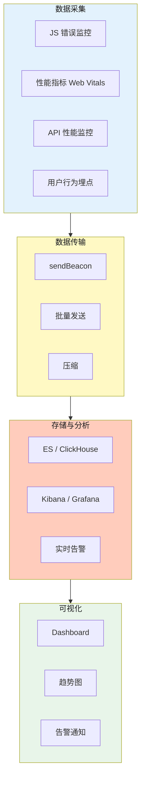

# 前端监控

## 1. 前端监控

**前端监控体系：**



**错误监控：**

```javascript
// JS错误捕获
window.onerror = (msg, src, line, col, error) => {
  sendToServer({ type: 'error', msg, line, col, stack: error?.stack });
  return false; // 不执行默认错误处理
};

// Promise异常捕获
window.addEventListener('unhandledrejection', e => {
  sendToServer({ type: 'unhandledrejection', reason: e.reason });
});

// Vue错误捕获
Vue.config.errorHandler = (err, vm, info) => {};

// React错误边界
class ErrorBoundary extends React.Component {
  componentDidCatch(error, info) {
    sendToServer(...);
  }
}
```

**性能监控（Web Vitals）：**

```javascript
import { onCLS, onLCP, onINP, onFCP, onTTFB } from 'web-vitals';

function sendToAnalytics({ name, value, id }) {
  // 发送到监控平台（不阻塞页面卸载）
  navigator.sendBeacon('/analytics', JSON.stringify({ name, value, id }));
}

onLCP(sendToAnalytics);
onCLS(sendToAnalytics);
onINP(sendToAnalytics);
```

**API性能监控：**

```javascript
// 第 1 段：保存原生 fetch 并接管全局引用
// 先把原生实现存进闭包变量 origFetch：包装函数内部必须调用"真身"，
// 否则会调用到被替换后的 window.fetch，形成无限递归并很快栈溢出。
const origFetch = window.fetch;
// 用包装函数覆盖全局 fetch，属于 monkey patch：业务方一行代码都不用改，
// 所有同页面发起的请求就自动被纳入监控；代价是覆盖时机必须早于业务发请求。
window.fetch = async (...args) => {
  // 第 2 段：计时起点与请求发起
  // 计时用 performance.now()（单调时钟，不受系统时间被校正/回拨影响），
  // 比 Date.now() 更适合测耗时；起点放在真正发起请求之前，才包含网络全链路时间。
  const start = performance.now();
  // ...args 原样透传，保证 fetch 的签名（url + options，或 Request 对象）不被破坏；
  // 这也是能做无侵入代理的关键——不解析、不重建参数，避免丢失 signal、body 等字段。
  try {
    // await 只等"响应头到达"，不等 body 读完，所以 duration 语义是 TTFR 而非完整下载耗时；
    // 若后面调用 res.json()/arrayBuffer() 耗时很久，不会计入本次上报。
    const res = await origFetch(...args);
    // 第 3 段：成功路径上报
    // 注意 HTTP 错误（4xx/5xx）不会走 catch，所以这里仍算"成功"，
    // 区分请求失败要看 status；args[0] 可能是 Request 对象，非字符串，后端需容忍。
    sendToServer({
      type: 'api',
      url: args[0],
      duration: performance.now() - start,
      status: res.status
    });
    // 必须把原始 Response 原样返回，否则调用方的 res.ok / res.json() 全部失效；
    // 同时返回同一对象引用而非副本，避免 body 流被重复消费。
    return res;
  } catch (err) {
    // 第 4 段：失败路径上报并重新抛出
    // 只在网络层/中断类异常（断网、CORS、AbortError）时进入此处，没有可用的 status；
    // duration 这里同样取当前时刻，保证上报字段结构在两种路径下完全一致，便于后端聚合。
    sendToServer({
      type: 'api',
      url: args[0],
      duration: performance.now() - start,
      error: true
    });
    // 吞掉异常会篡改程序语义（调用方的 try/catch 和重试逻辑都会失效），
    // 因此上报后必须原样 rethrow，让监控对业务保持"完全透明"。
    throw err;
  }
};
```
**埋点系统：**

```javascript
function track(event, properties = {}) {
  sendToServer({
    event,
    properties: { ...properties, timestamp: Date.now(), url: location.href }
  });
}
// 或者用navigator.sendBeacon（不阻塞页面卸载）
navigator.sendBeacon('/track', JSON.stringify({ event: 'page_view' }));
```

**常用监控平台：**

| 平台 | 特点 |
|------|------|
| Sentry | 错误监控，JS/Vue/React/RN |
| 阿里云ARMS | 前端监控 |
| 腾讯云前端性能监控 | 端到端 |
| Datadog / New Relic | 全链路 |
| 自建 | ClickHouse + Grafana |

**日志系统设计：**

```mermaid
flowchart LR
    subgraph frontend["前端"]
        js["JS 错误"]
        perf["性能数据"]
        api["API 监控"]
        custom["自定义事件"]
    end
    
    subgraph sdk["SDK 采集"]
        auto["自动采集"]
        manual["手动埋点"]
    end
    
    subgraph send["数据发送"]
        beacon["navigator.sendBeacon"]
        batch["批量聚合"]
        retry["失败重试"]
    end
    
    subgraph backend["后端处理"]
        collect["采集服务"]
        queue["消息队列"]
        storage["存储"]
    end
    
    frontend --> sdk --> send --> backend
    
    style frontend fill:#e3f2fd,color:#1d1d1f
    style sdk fill:#fff9c4,color:#1d1d1f
    style send fill:#ffccbc,color:#1d1d1f
    style backend fill:#e8f5e9,color:#1d1d1f
```



| 环节 | 技术选型 |
|------|---------|
| 采集 | SDK（自动+手动） |
| 发送 | sendBeacon + 批量 |
| 存储 | ES / ClickHouse |
| 查询 | Kibana / Grafana |
| 告警 | 阈值触发 |

## 应用与行业实践

### 应用场景地图

| 场景 | 用到本页哪个知识点 | 典型技术选型 | 注意事项 |
| --- | --- | --- | --- |
| 后台管理的万行表格滚动 | 长任务采集、交互延迟 | `PerformanceObserver` 订阅 `longtask`、`web-vitals` 的 `onINP` | 上报与列表请求错峰，队列设上限 |
| 低端安卓机的首屏加载 | 首屏渲染指标、设备分组 | `web-vitals` 的 `onLCP`、`navigator.deviceMemory` | 分级只做粗粒度，不拼成用户画像 |
| 多人协作白板 | 自定义打点、连接类错误 | `performance.mark`、`WebSocket` 事件监听 | 按房间聚合，避免上报量随人数线性上涨 |
| App 内嵌 H5 白屏 | 全局错误捕获、资源加载失败 | `window.onerror`、`unhandledrejection`、Resource Timing | 记录 UA 与 WebView 内核版本 |
| 电商大促落地页 | 资源时序、接口耗时 | Resource Timing、`fetch` 包装 | 上报通道与业务接口分离，防止占满连接 |
| 单页应用路由切换 | 路由打点、错误边界 | `history` API 监听、`PerformanceObserver` | 首次加载与后续切换分开统计 |
| 弱网下的表单提交 | 接口监控、失败归因 | XHR/`fetch` 包装、`sendBeacon` | 记录错误类型，不能只记次数 |
| 微前端子应用加载 | 子应用超时与失败捕获 | 资源错误监听、超时定时器 | 上报里带子应用名，便于定责 |
| 直播播放页 | 首帧打点、卡顿计数 | `video` 事件、自定义打点 | 播放指标与网络指标分开上报 |

### 三个场景拆解

#### 场景 1：后台管理的万行表格滚动

- **业务背景**：运维后台默认分页 200 行，用户点"显示全部"后单页渲染上万行，滚动时输入框出现可感知延迟。前端没有采集数据，只能靠用户口头描述复现。
- **怎么用本页知识解决**：思路是先抓住"主线程被谁占住"这类证据，用长任务采集记录阻塞的起始时间与时长，再在页面进入后台时批量上报，避开业务请求高峰。

```js
// 采集长任务：主线程被占用超过 50ms 的任务
const longTasks = [];
new PerformanceObserver((list) => {
  for (const entry of list.getEntries()) {
    // 记录起始时间与时长，便于和用户操作时间对齐
    longTasks.push({ start: entry.startTime, dur: entry.duration });
  }
}).observe({ type: 'longtask', buffered: true });

document.addEventListener('visibilitychange', () => {
  if (document.visibilityState === 'hidden' && longTasks.length) {
    // 进入后台时用 sendBeacon 上报，不阻塞页面卸载
    navigator.sendBeacon('/monitor/longtask', JSON.stringify(longTasks));
    longTasks.length = 0; // 清空队列，避免重复上报
  }
});
```

- 先只采长任务，不采每次滚动事件，上报体积可控。
- `buffered: true` 能拿到脚本执行前已经发生的长任务。
- 上报点放在 `visibilitychange`，卸载页面时也有机会送出。
- 上报成功后清空队列，否则同一条数据会被送多次。
- 把长任务时间和"点击显示全部"的自定义打点对齐，就能确认是不是渲染导致。

- **怎么度量收益**：看 `web-vitals` 的 `onINP` 第 75 百分位，以及长任务总时长。测量方法是在 Chrome DevTools Performance 面板录制滚动 10 秒，对比改动前后的 `Long Task` 条数与 `Total Blocking Time`。
- **什么时候不该用**：如果卡顿来自合成层问题（大量 `box-shadow` 或滤镜），长任务采集抓不到，该用 DevTools 的 Rendering 面板看绘制耗时。如果页面只在桌面内网使用且没有交互延迟诉求，接入这套采集只会增加维护成本。

#### 场景 2：低端安卓机的首屏加载

- **业务背景**：同一个活动页在不同机型上的首屏体验差距大，团队只在高配机型上验收通过。需要在真实设备上拿到按设备能力分组的首屏数据，而不是只看实验室结果。

- **怎么用本页知识解决**：思路是把首屏指标和运行环境一起上报，让"低端机"成为可查询的维度。上报时只带能力分级，不带可识别个人的信息。

```js
import { onLCP } from 'web-vitals'; // web-vitals 为官方库，接入前核对当前版本 API

onLCP((metric) => {
  // 按设备内存做粗粒度分级，0 表示浏览器未提供该字段
  const mem = navigator.deviceMemory || 0;
  const tier = mem <= 2 ? 'low' : mem <= 4 ? 'mid' : 'high';
  const conn = navigator.connection?.effectiveType || 'unknown';
  const body = JSON.stringify({
    name: metric.name,   // 指标名，这里是 LCP
    value: metric.value, // 指标值，单位毫秒
    rating: metric.rating, // 官方库给出的好/待改进/差
    tier, conn,          // 环境维度，用于分组查询
    path: location.pathname,
  });
  // 上报不阻塞页面，避免采集本身影响首屏
  navigator.sendBeacon('/monitor/vitals', body);
});
```

- 只上报分级和网络类型，不上报完整 UA，减少数据合规负担。
- `effectiveType` 在部分浏览器为空，用 `unknown` 兜底而不是丢弃整条数据。
- 指标按 `path` 分开统计，活动页与主站首页的基线不能混用。
- 采集代码本身要异步加载，否则它就成了首屏的一部分。

- **怎么度量收益**：看 LCP 在 `low` 分组的第 75 百分位，以及该分组的上报样本量。测量方法是在 Chrome DevTools 里开启 4 倍或 6 倍 CPU 降速配合网络限速，复现低端机条件做对比，再用 CI 中的 Lighthouse 审计防止回归。
- **什么时候不该用**：单页应用路由切换不会重置 LCP，用它衡量切换后的页面渲染会得到错误结论。首屏用骨架屏加懒加载图片时，LCP 元素可能不是内容主体，需要先核对指标语义再决定是否采信。

#### 场景 3：多人协作白板

- **业务背景**：白板房间内多人同时编辑，偶发连接断开后画面停留在旧状态，用户以为内容丢了。团队需要知道断连发生在哪个阶段，以及重新连上要花多久。

- **怎么用本页知识解决**：思路是把"连接生命周期"变成自定义打点，和全局错误一起上报。采样按房间维度做，不按操作次数做，避免上报量随协作者数量上涨。

```js
const marks = {}; // 记录白板关键阶段的时间戳

// 自定义打点：首帧绘制完成
requestAnimationFrame(() => {
  marks.firstPaint = performance.now();
});

let reconnects = 0; // 重连次数，用于判断连接稳定性
socket.addEventListener('close', () => {
  reconnects += 1;
  marks.lastClose = performance.now(); // 记录断连时刻，便于算恢复耗时
});

window.addEventListener('pagehide', () => {
  // 会话结束时统一上报，按房间聚合成一条
  navigator.sendBeacon('/monitor/whiteboard', JSON.stringify({
    marks, reconnects, roomSize: peers.size,
  }));
});
```

- 打点用 `performance.now()`，与长任务、资源时序在同一时间轴上。
- 断连次数和断连时刻一起传，才能算恢复耗时。
- 上报粒度按会话，不按每次笔迹操作，流量可控。
- `pagehide` 比 `unload` 在移动端更容易触发，适合做收尾上报。
- 房间人数只传数量，不传成员标识。

- **怎么度量收益**：看断连率（有 `close` 事件的会话占比）、重连成功耗时中位数、长任务总时长。测量方法是用 Chrome DevTools 的 Network 面板切换到离线再恢复，对照看板上这两项指标是否变化。
- **什么时候不该用**：10 秒以内的短会话样本波动大，拿它做结论不可靠。如果白板在离屏 Canvas 或 Worker 里渲染，主线程长任务采集不到对应开销，需要换用 Worker 侧的打点方案。

### 行业先进实践

**Core Web Vitals 与 web-vitals 库（出处：web.dev 官方文档 / Chrome 官方文档）**
该规范定义了 LCP、INP、CLS 三项字段指标，官方库负责在合适的时机触发回调并按页面维度上报。它有效是因为指标口径统一，不同团队的看板可以互相比较。借鉴方式是先把这三项接入，再决定加自定义指标。

**OpenTelemetry 浏览器插桩（出处：OpenTelemetry 官方文档）**
它用 W3C Trace Context 把前端请求与后端 trace 串成一条链路。有效的原因是"接口慢"这个结论无法区分网络耗时与服务端耗时。借鉴方式是让前端上报的请求带上 trace 标识，由后端接受同一套上下文。

**Sentry 的错误与性能采样配置（出处：Sentry 官方文档）**
错误采样率与追踪采样率分开配置，会话回放再单独采样。有效的原因是错误数据量小但不能丢，性能数据量大但可抽样。借鉴方式是把三类数据的采样策略拆开，不要共用一个开关。

**Lighthouse CI（出处：Lighthouse 开源项目官方文档）**
在 CI 中对每次提交跑 Lighthouse，并用 budgets 拦住资源体积与指标回归。有效的原因是性能退化发生在合并前，等上线后再查成本更高。借鉴方式是先只对首屏页面设阈值，逐步扩展到关键路由。

**Chrome UX Report（出处：Chrome 官方文档）**
它提供满足收录条件的站点在真实用户环境下的指标分位数，可作为外部基线。需核对官方文档：核对收录门槛、数据更新周期与查询维度，确认自身页面是否在覆盖范围内，再决定能否引用。

### 从学到用：落地路线

**第 1 步：选一个页面试点。** 选用户量稳定、指标口径清楚的一个入口页，只接错误捕获与 LCP。验收标准是页面上线后采集看板能看到当天数据。
**第 2 步：用可复现实验验证数据可信。** 在 DevTools 里制造一次接口失败和一次 CPU 降速，确认两者都能在看板上被查到。验收标准是人工制造的问题在 5 分钟内可检索到。
**第 3 步：沉淀接入规范再推广。** 把初始化代码、上报字段、采样策略写成模板，其它页面按模板接入。验收标准是新增页面接入时不需要改动采集 SDK 源码。
**第 4 步：用 CI 与看板告警防止回退。** 把指标阈值放进 CI，把错误率放进告警。验收标准是连续两周内回退在合并前被拦住至少一次，或被值班同学在当天发现。

### 动手作业

**目标**：为一个本地页面搭一套最小可用的采集端，覆盖脚本错误、首屏指标与接口失败三类数据。

**步骤**：
1. 起一个静态页面和两个本地接口，一个正常返回，一个返回 500。
2. 监听 `window.onerror` 与 `unhandledrejection`，把消息、文件、行号、时间写入本地队列。
3. 用 `web-vitals` 的 `onLCP` 采集首屏指标，接入前核对当前版本的 API 名称。
4. 包装 `fetch`，记录每个请求的 URL、耗时、状态码与错误类型。
5. 在 `visibilitychange` 进入 hidden 时用 `sendBeacon` 把队列送到本地接收服务。
6. 给队列加上限与去重，超过上限丢弃最旧的数据并计数。
7. 做一个接收端把数据落盘成 JSONL，写 5 行脚本统计每类数据的条数。

**验收标准**：
- 页面主动抛出一个错误后，接收端能查到该错误的文件与行号。
- 断网后触发接口失败，恢复网络再关闭页面，失败记录仍被送出。
- LCP 上报里能看到数值、分级与页面路径三个字段。
- 连续触发 200 次错误后，接收端收到的条数不超过队列上限。
- 关闭页面时不会出现同步阻塞请求，可用 DevTools 的网络面板确认。

