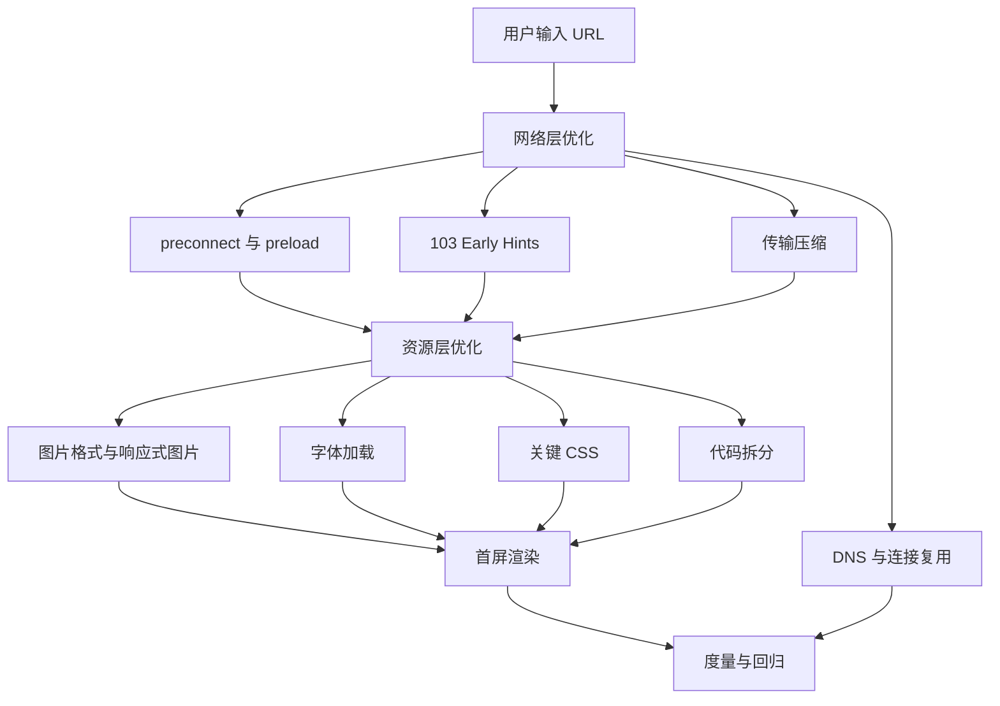
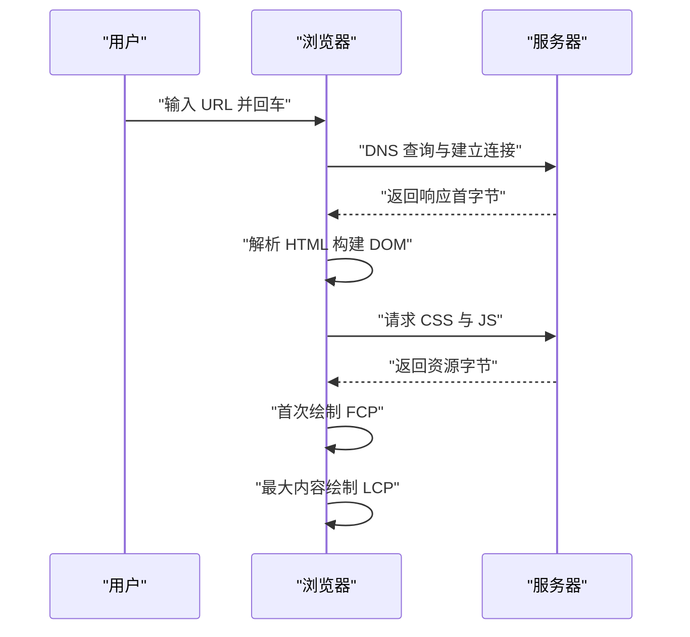
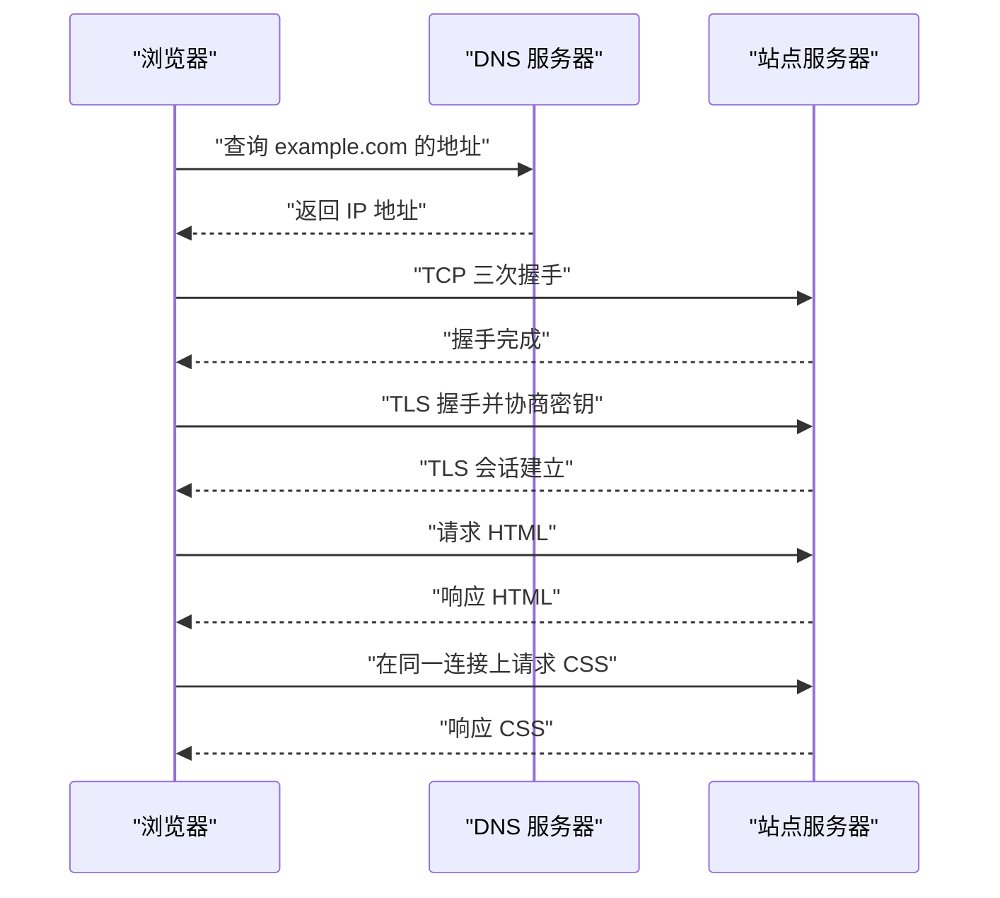
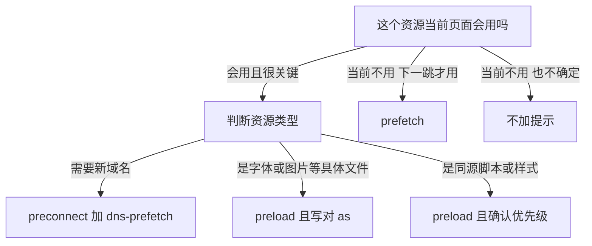
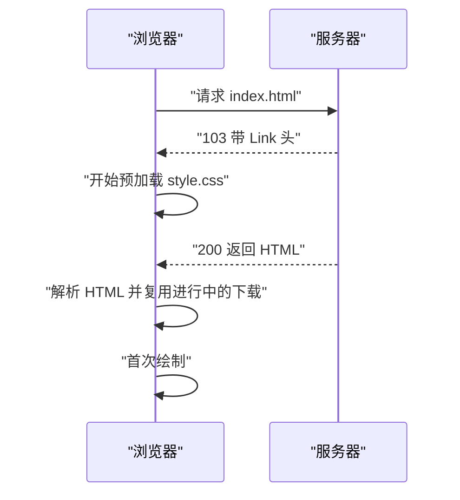
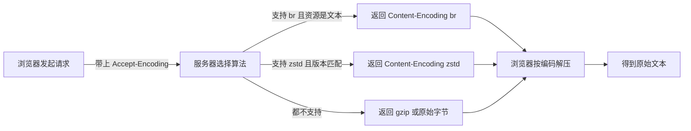
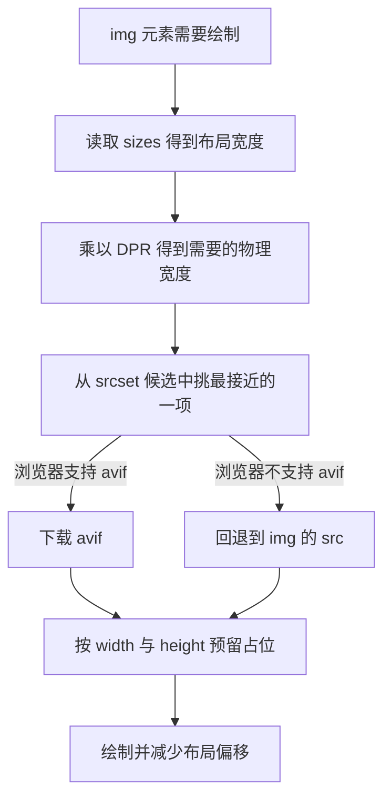
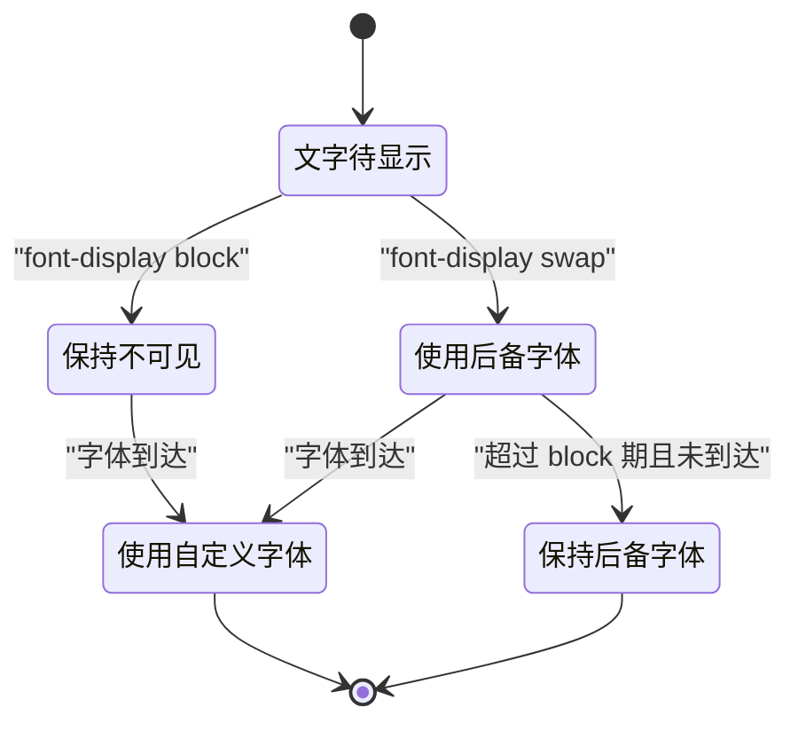
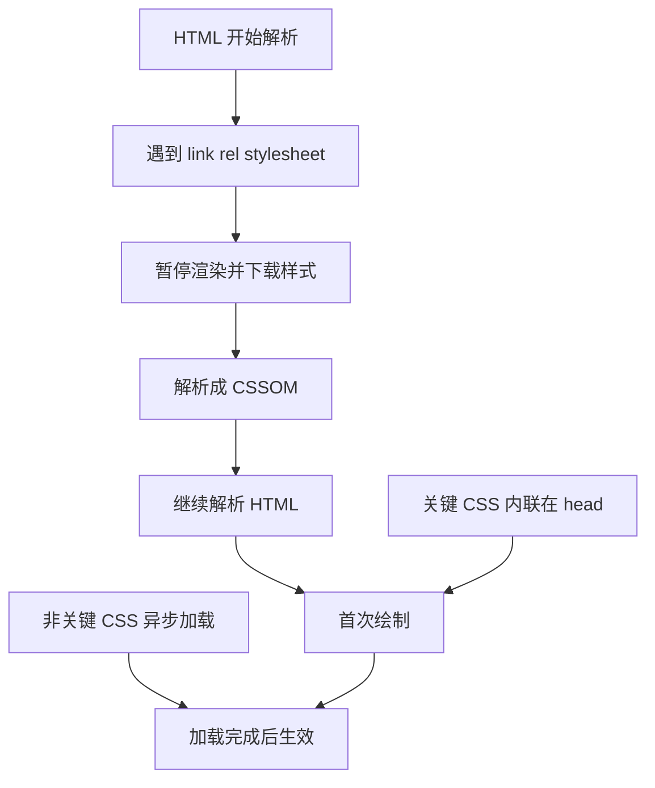
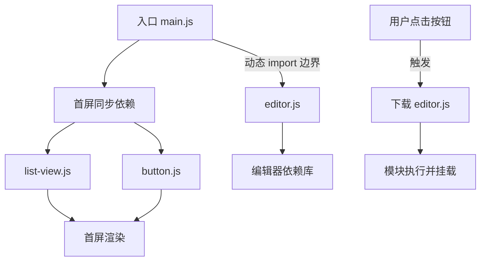

# 加载性能优化：从请求到首屏

!!! abstract "学完这一页你能"
    - 用 Performance 接口把首屏耗时拆成可命名的阶段，并对每一段给出数字。
    - 写出 preconnect、preload、prefetch 三类 link 标签，并说清各自在什么条件下才有收益。
    - 用 fetchpriority 与 103 Early Hints 干预浏览器对关键资源的调度顺序。
    - 读懂压缩、图片、字体、关键 CSS、代码拆分各自的收益来源，并用脚本验证结论。

## 0. 知识地图



建议先读第 1 节，把首屏耗时变成一本有时间戳的账。
再按第 2 到第 4 节处理网络层，按第 5 到第 9 节处理资源层。
每节末尾的动手验证都能单独运行，用来确认你抓住了收益来源。

## 1. 首屏账本：把耗时拆成阶段

**先想一个问题**
你在本地打开公司首页，Network 面板显示总耗时 2.1 秒。
产品经理问这 2.1 秒花在哪里，你回答网络慢。
这句话不能落地，因为它没有指出该改哪一行代码。

!!! tip "心智模型"
    一句话模型：首屏耗时是一本账，每一笔都要有开始时间和结束时间。
    日常类比：寄快递的耗时可以拆成下单、揽收、运输、派送、签收。
    类比不成立的地方：快递阶段串行执行，浏览器会并行下载多个资源，账本要按资源分别记。

!!! note "术语：TTFB"
    TTFB（Time To First Byte，首字节时间）指从发起导航请求到收到第一个响应字节的时间。
    例：你在 0 ms 发起请求，320 ms 收到响应头第一个字节，TTFB 就是 320 ms。

!!! note "术语：FCP"
    FCP（First Contentful Paint，首次内容绘制）指页面第一块内容像素被画出的时刻。
    例：标题文字第一次出现在屏幕上的时间就是 FCP。

!!! note "术语：LCP"
    LCP（Largest Contentful Paint，最大内容绘制）指视口内面积最大的内容元素绘制完成的时刻。
    例：首屏大图绘制完成的时间常被当作 LCP。

**图解**



1. 用户回车后，浏览器先做 DNS 查询，把域名换成 IP 地址。
2. 接着建立连接，HTTPS 还要完成 TLS 握手。
3. 服务器返回第一个字节，这一段就是 TTFB。
4. 浏览器边收 HTML 边构建 DOM，遇到 CSS 与 JS 会暂停或延后渲染。
5. 第一块像素画出来记作 FCP。
6. 视口内面积最大的内容画完记作 LCP。

**一步一步来**

第 1 步：先确认浏览器暴露了哪些时间戳。

```js
// 取导航计时对象，页面加载完成后可读
const nav = performance.getEntriesByType("navigation")[0];
// 域名查询耗时
const dns = nav.domainLookupEnd - nav.domainLookupStart;
// 连接建立耗时，含 TCP 与 TLS
const connect = nav.connectEnd - nav.connectStart;
// 请求到首字节，即 TTFB
const ttfb = nav.responseStart - nav.startTime;
console.log({ dns, connect, ttfb });
```

**这段代码在做什么**
- `getEntriesByType("navigation")` 拿到当前页面的导航计时条目。
- `domainLookupEnd` 减 `domainLookupStart` 得到 DNS 查询耗时。
- `connectEnd` 减 `connectStart` 覆盖 TCP 与 TLS 两段握手。
- `responseStart` 减 `startTime` 得到 TTFB。
- 输出对象里的三个数字单位都是毫秒。

运行结果（示例，数字随网络变化）：
`{ dns: 12, connect: 86, ttfb: 318 }`

第 2 步：把绘制时间戳也算进账本。

```js
// 首次绘制与首次内容绘制
const paint = performance.getEntriesByType("paint");
// 找到 FCP 那一条
const fcp = paint.find((e) => e.name === "first-contentful-paint");
// 最大内容绘制需要订阅，元素画出时才触发
new PerformanceObserver((list) => {
  const last = list.getEntries().at(-1);
  console.log("LCP", last.startTime.toFixed(0));
}).observe({ type: "largest-contentful-paint", buffered: true });
// 打印 FCP
console.log("FCP", fcp ? fcp.startTime.toFixed(0) : "无");
```

**这段代码在做什么**
- `getEntriesByType("paint")` 返回 first-paint 与 first-contentful-paint 两条记录。
- `find` 按 name 挑出 FCP 记录。
- `PerformanceObserver` 在 LCP 元素出现时回调，`buffered: true` 能拿到订阅前的记录。
- `list.getEntries().at(-1)` 取当前为止的最后一个 LCP 候选。
- 输出的两个数字相对导航开始计时，单位毫秒。

运行结果（示例）：
`FCP 620`
`LCP 1480`

第 3 步：把各段耗时写成计算函数，方便在脚本里断言。

```js
// 传入导航计时对象，返回一个阶段字典
function splitTiming(nav) {
  return {
    // 重定向耗时
    redirect: nav.redirectEnd - nav.redirectStart,
    // 域名查询耗时
    dns: nav.domainLookupEnd - nav.domainLookupStart,
    // 建连耗时
    connect: nav.connectEnd - nav.connectStart,
    // 服务器处理与排队耗时
    wait: nav.responseStart - nav.requestStart,
    // 收响应体耗时
    download: nav.responseEnd - nav.responseStart,
  };
}
// 用一份手工时间戳验证计算
const fake = {
  redirectStart: 0, redirectEnd: 0,
  domainLookupStart: 0, domainLookupEnd: 12,
  connectStart: 12, connectEnd: 98,
  requestStart: 98, responseStart: 318, responseEnd: 400,
};
console.log(splitTiming(fake));
```

**这段代码在做什么**
- `splitTiming` 把导航计时差值集中到一个函数，便于复用。
- `redirect` 覆盖从导航开始到重定向结束。
- `wait` 是 `responseStart` 减 `requestStart`，也就是服务器处理加排队。
- `download` 是 `responseEnd` 减 `responseStart`，也就是收完响应体的时间。
- 用 `fake` 对象可以在没有浏览器的情况下验证差值逻辑。

运行结果：
`{ redirect: 0, dns: 12, connect: 86, wait: 220, download: 82 }`

**动手验证**

下面脚本不依赖网络，用一份手工时间戳验证账本函数的正确性。
依赖：无，只用 Node 内置模块。

```js
// 文件：timing-ledger.mjs
import assert from "node:assert/strict";

// 把导航计时字段拆成可读的阶段
function splitTiming(nav) {
  return {
    dns: nav.domainLookupEnd - nav.domainLookupStart,
    connect: nav.connectEnd - nav.connectStart,
    wait: nav.responseStart - nav.requestStart,
    download: nav.responseEnd - nav.responseStart,
  };
}

const fake = {
  domainLookupStart: 0, domainLookupEnd: 12,
  connectStart: 12, connectEnd: 98,
  requestStart: 98, responseStart: 318, responseEnd: 400,
};

const t = splitTiming(fake);
assert.equal(t.dns, 12);
assert.equal(t.connect, 86);
assert.equal(t.wait, 220);
assert.equal(t.download, 82);
// 各阶段相加应等于 responseEnd
assert.equal(t.dns + t.connect + t.wait + t.download, 400);
console.log("账本校验通过", t);
```

预期输出：
`账本校验通过 { dns: 12, connect: 86, wait: 220, download: 82 }`

**常见坑**

| 现象 | 原因 | 怎么修 |
| --- | --- | --- |
| 本地 TTFB 只有 30 ms，线上 600 ms | 本地到服务器距离近且没有排队 | 用线上数据或在网络限速下测 |
| `domainLookupEnd` 为 0 | 命中了 DNS 缓存，没有真正查询 | 结合 `nextHopProtocol` 判断连接是否复用 |
| 同一阶段数字对不上 | 用了已废弃的 `performance.timing` | 改用 `PerformanceNavigationTiming` 字段 |
| LCP 只报 0 | 元素在 iframe 内，或页面已隐藏 | 在真实标签页测，并确认元素类型 |

**小结**
- 首屏耗时是一本账，先拿到 TTFB、FCP、LCP 三个数字。
- 阶段拆分的价值在于定位，不在于好看。
- 线上数据与本地数据可能差一个数量级，结论以线上为准。

## 2. DNS、TCP、TLS 与连接复用

**先想一个问题**
同一个站点，第一次打开花了 1.6 秒，第二次只花 0.9 秒。
你没改任何代码，差别来自 DNS 缓存和连接复用。
如果不清楚这两件事，你会误以为优化只能靠删代码。

!!! tip "心智模型"
    一句话模型：建连接是每次访问都要交的固定成本，复用连接就是把这笔成本摊薄。
    日常类比：打电话先查号码再拨号，挂断后重拨要重新查号。
    类比不成立的地方：TLS 会话票据让重连可以跳过部分计算，成本不是恒定值。

!!! note "术语：DNS"
    DNS（Domain Name System，域名系统）把域名解析成 IP 地址。
    例：浏览器把 example.com 解析成某个 IP 后才有目标地址。

!!! note "术语：TCP"
    TCP（Transmission Control Protocol，传输控制协议）在网络上提供可靠、有序的字节流。
    例：HTTP/1.1 的一次请求响应跑在一条 TCP 连接上。

!!! note "术语：TLS"
    TLS（Transport Layer Security，传输层安全协议）负责在不可信网络上加密并校验数据。
    例：地址栏出现锁图标，说明 HTTPS 用的是 TLS 加密通道。

!!! note "术语：连接复用"
    连接复用指在同一个 TCP 连接上依次发送多个请求。
    例：同一主机的 HTML、CSS、JS 三个请求可以共用一条连接。

**图解**



1. 浏览器先向 DNS 服务器查询域名对应的 IP 地址。
2. 拿到地址后做 TCP 三次握手，确认双方都能收发。
3. HTTPS 还要做 TLS 握手，协商加密算法并校验证书。
4. 前三次交互都没有业务数据，所以它们都是固定成本。
5. 复用连接时，第 11 步的 CSS 请求不再重复第 1 到第 3 步。

**一步一步来**

第 1 步：在 Node 里观察连接什么时候真正建立。

```js
// 引入 http 用于起本地服务并观察连接
import http from "node:http";
// 起一个本地服务器，避免依赖外网
const server = http.createServer((req, res) => res.end("ok"));
await new Promise((r) => server.listen(0, "127.0.0.1", r));
const port = server.address().port;
// 创建开启 keepAlive 的 agent，maxSockets 设为 1 便于观察复用
const agent = new http.Agent({ keepAlive: true, maxSockets: 1 });
let connections = 0;
// 每次新建 socket 时计数
server.on("connection", () => { connections += 1; });
console.log("端口", port);
```

**这段代码在做什么**
- `http.createServer` 起一个只回 ok 的本地服务。
- `server.listen(0, "127.0.0.1")` 里的 0 表示让系统选空闲端口。
- `http.Agent` 的 `keepAlive: true` 会让 socket 在请求结束后保留。
- `maxSockets: 1` 限制同一主机只用一条连接，便于观察复用。
- `server.on("connection")` 统计 TCP 连接建立次数。

第 2 步：发两次请求，数一数建立了几条连接。

```js
// 用同一个 agent 发两次请求
const get = () =>
  new Promise((resolve, reject) => {
    // path 用根路径即可
    const req = http.get({ host: "127.0.0.1", port, path: "/", agent }, (res) => {
      // 读完响应体再结算
      res.resume();
      res.on("end", () => resolve(res.statusCode));
    });
    req.on("error", reject);
  });
await get();
await get();
console.log("连接数", connections);
// 关闭连接池与服务器，保证脚本能退出
agent.destroy();
server.close();
```

**这段代码在做什么**
- `get` 返回一个 Promise，在响应体读完时 resolve。
- `res.resume()` 消费响应流，不消费则 end 事件不触发。
- 两次 `await get()` 用同一个 agent，也就是同一个连接池。
- `agent.destroy()` 释放空闲 socket，避免脚本挂住。
- `connections` 的值就是 TCP 连接建立次数。

运行结果：
`连接数 1`

**动手验证**

下面脚本在本地起服务，用开启与关闭 keepAlive 的两种 agent 各发两次请求。
依赖：无，只用 Node 内置模块。

```js
// 文件：keepalive-check.mjs
import http from "node:http";
import assert from "node:assert/strict";

const server = http.createServer((req, res) => res.end("ok"));
await new Promise((r) => server.listen(0, "127.0.0.1", r));
const port = server.address().port;

let connections = 0;
server.on("connection", () => { connections += 1; });

function get(agent) {
  return new Promise((resolve, reject) => {
    const req = http.get({ host: "127.0.0.1", port, path: "/", agent }, (res) => {
      res.resume();
      res.on("end", () => resolve(res.statusCode));
    });
    req.on("error", reject);
  });
}

const keep = new http.Agent({ keepAlive: true, maxSockets: 1 });
await get(keep);
await get(keep);
assert.equal(connections, 1, "开启复用后应只建 1 条连接");

const noKeep = new http.Agent({ keepAlive: false });
await get(noKeep);
await get(noKeep);
assert.equal(connections, 3, "关闭复用后两次请求各建 1 条连接");

keep.destroy();
noKeep.destroy();
server.close();
console.log("连接复用校验通过，总连接数", connections);
```

预期输出：
`连接复用校验通过，总连接数 3`

**常见坑**

| 现象 | 原因 | 怎么修 |
| --- | --- | --- |
| 每个请求都新建连接 | 客户端未开启 keepAlive | 在 HTTP 客户端显式配置连接池 |
| 首屏加了大量 dns-prefetch 但无收益 | 域名已缓存，或整个会话只访问一次 | 只对确实会用到的新域名加 |
| HTTPS 偶发 400 ms 抖动 | 会话票据缺失导致完整 TLS 握手 | 检查服务端会话缓存与会话票据配置 |
| HTTP/2 下连接数仍是多个 | 入口分散在多个主机 | 合并入口域名，让同源请求共用一条连接 |

**小结**
- DNS、TCP、TLS 是每次新连接的固定成本，复用能直接省掉。
- 度量方法是在客户端统计新建连接次数，而不是凭感觉。
- 域名拆分省下的并行度，常被新增握手成本抵消，要用数字决策。

## 3. preconnect、preload、prefetch

**先想一个问题**
你的首页要调一个第三方统计域名，还要加载一个 180 KB 的主图。
用户看到标题的时间是 1.4 秒，你想提前把这两件事的成本降下来。
问题在于：这两个资源该用同一种提示方式吗。

!!! tip "心智模型"
    一句话模型：三种提示对应三档确定性，确定性越高就提示得越早越具体。
    日常类比：确定今晚吃饭就提前买菜，确定明天吃饭就提前备料，不确定就只记住店名。
    类比不成立的地方：预连接会占用连接与内存，用多了会挤掉真正关键的下载。

!!! note "术语：preconnect"
    preconnect 提示浏览器提前完成 DNS、TCP 与 TLS，得到一条可用连接。
    例：`link rel="preconnect" href="https://cdn.example.com"`。

!!! note "术语：preload"
    preload 提示浏览器以指定类型提前下载当前页面马上要用的资源。
    例：`link rel="preload" as="font" href="/f.woff2"`。

!!! note "术语：prefetch"
    prefetch 提示浏览器在空闲时下载将来导航可能用到的资源。
    例：`link rel="prefetch" href="/next-page.js"`。

**图解**



1. 第一个判断是资源在本次导航里是否真的会被使用。
2. 当前不用、下一跳确定要用，就选 prefetch。
3. 当前不用且不确定，不加提示，避免浪费带宽。
4. 需要连接新域名时，加 preconnect，并配一个 dns-prefetch 兜底。
5. 是具体文件时用 preload，`as` 必须与资源类型一致。
6. 同源脚本与样式要确认优先级，避免 preload 抢占关键资源。

**一步一步来**

第 1 步：给第三方域名加预连接，并预加载首屏字体。

```html
<!-- dns-prefetch 在不支持 preconnect 的浏览器上兜底 -->
<link rel="dns-prefetch" href="https://cdn.example.com">
<!-- preconnect 提前完成 DNS、TCP 与 TLS -->
<link rel="preconnect" href="https://cdn.example.com" crossorigin>
<!-- 字体跨域时必须带 crossorigin，否则会下载两次 -->
<link rel="preload" as="font" type="font/woff2"
      href="/fonts/main.woff2" crossorigin>
```

**这段代码在做什么**
- `dns-prefetch` 只做域名解析，成本低，作为降级方案。
- `preconnect` 多做 TCP 与 TLS 两段，收益取决于连接建立耗时。
- `crossorigin` 是字体预加载的必要属性，缺失会导致重复下载。
- `as="font"` 告诉浏览器按字体的优先级和缓存规则处理。
- `type` 帮助浏览器跳过不支持的格式。

第 2 步：验证页面里的 preload 是否都写了 as。

```js
// 用正则扫出所有 preload 的 link 标签
function findPreloads(html) {
  return [...html.matchAll(/<link\b[^>]*rel="preload"[^>]*>/g)].map((m) => m[0]);
}
// 判断标签里是否含 as 属性
function hasAs(tag) {
  return /\bas="[^"]+"/.test(tag);
}
const html = '<link rel="preload" href="/a.css" as="style">' +
             '<link rel="preload" href="/b.js">';
const tags = findPreloads(html);
console.log(tags.map(hasAs));
```

**这段代码在做什么**
- `matchAll` 返回所有匹配项，展开成字符串数组。
- 正则里的 `\b` 避免匹配到 `data-rel="preload"` 这类误命中。
- `hasAs` 只检查是否存在带值的 `as` 属性。
- 输出数组里的 `false` 表示该标签缺少 `as`。
- 缺少 `as` 时浏览器按低优先级下载，并可能出现重复请求。

运行结果：
`[ true, false ]`

**动手验证**

下面脚本给出一段 HTML，检查所有 preload 与 preconnect 是否合规。
依赖：无，只用 Node 内置模块。

```js
// 文件：hints-check.mjs
import assert from "node:assert/strict";

function findTags(html, rel) {
  const re = new RegExp('<link\\b[^>]*rel="' + rel + '"[^>]*>', "g");
  return [...html.matchAll(re)].map((m) => m[0]);
}

function hasAttr(tag, name) {
  return new RegExp("\\b" + name + '="[^"]+"').test(tag);
}

const html = [
  '<link rel="preload" as="font" type="font/woff2" href="/f.woff2" crossorigin>',
  '<link rel="preconnect" href="https://cdn.example.com" crossorigin>',
  '<link rel="preload" href="/bad.js">',
].join("");

const preloads = findTags(html, "preload");
const missingAs = preloads.filter((t) => !hasAttr(t, "as"));
assert.equal(preloads.length, 2);
assert.equal(missingAs.length, 1, "应检出 1 个缺少 as 的 preload");

const preconnects = findTags(html, "preconnect");
assert.ok(preconnects.every((t) => hasAttr(t, "href")));
console.log("提示检查通过，缺少 as 的标签数", missingAs.length);
```

预期输出：
`提示检查通过，缺少 as 的标签数 1`

**常见坑**

| 现象 | 原因 | 怎么修 |
| --- | --- | --- |
| 字体被下载两次 | preload 标签缺少 crossorigin | 加上与 @font-face 一致的身份属性 |
| 控制台警告资源未被使用 | 该资源在本次导航没有用到 | 移除该 preload 或改用 prefetch |
| preconnect 数量多到没有收益 | 每条预连接都占用连接与内存 | 只保留首屏确实会连的域名 |
| prefetch 抢了首屏带宽 | prefetch 与关键请求同时进行 | 依赖空闲调度，或延后到 load 之后 |

**小结**
- 三种提示对应三档确定性：当前必用、下一跳会用、不确定。
- preload 的 `as` 与 `crossorigin` 决定它是否真的生效。
- 每条提示都要能说出它省掉了哪一段耗时。

## 4. fetchpriority 与 103 Early Hints

**先想一个问题**
你的首屏主图在 HTML 靠后的位置，但它是最先被用户看到的内容。
浏览器默认按发现顺序排队，主图可能排在几个次要脚本之后。
你要在不改 HTML 顺序的前提下，把主图的下载提前。

!!! tip "心智模型"
    一句话模型：一类提示调整同一批请求的相对顺序，另一类让请求更早被发现。
    日常类比：机场安检的两个动作，一是给行李贴优先标签，二是提前广播开闸时间。
    类比不成立的地方：优先级只是相对排序，带宽饱和时它不能让新请求凭空插队。

!!! note "术语：fetchpriority"
    fetchpriority 是一个提示属性，取值 high、low 或 auto，用来调整元素的网络优先级。
    例：`img src="/hero.avif" fetchpriority="high"`。

!!! note "术语：103 Early Hints"
    103 Early Hints 是一个临时响应状态码，服务器在最终响应前先发 Link 头，让浏览器提前预加载。
    例：服务器先回 103 并带 `Link: </a.css>; rel=preload; as=style`，再回 200。

**图解**



1. 浏览器先发 HTML 请求，此时还不知道页面里有哪些资源。
2. 服务器先回一个 103，附带 Link 头，说明哪些资源关键。
3. 浏览器收到 103 后立刻开始预加载列出的资源。
4. 服务器再回 200 与完整 HTML。
5. 浏览器解析 HTML 时发现同一个资源，直接复用进行中的下载。
6. 关键资源因此从 HTML 解析后开始，提前到 HTML 到达前开始。

**一步一步来**

第 1 步：用 fetchpriority 给首屏主图与次要脚本贴标签。

```html
<!-- 首屏主图标记为高优先级 -->

<!-- 非首屏图片降低优先级，给首屏让出带宽 -->

<!-- 次要脚本也降优先级，避免与主图抢带宽 -->
<script src="/analytics.js" fetchpriority="low" defer></script>
```

**这段代码在做什么**
- 第一行用 `fetchpriority="high"` 把主图提到该批次请求的前面。
- `width` 与 `height` 同时给出，用于计算占位面积并减少布局偏移。
- 第二行把页脚图片标为 low，减少它对首屏的竞争。
- 第三行对分析脚本降优先级，它不影响首屏内容。
- 优先级提示不改下载体积，只改同一时间窗口里的排序。

第 2 步：让服务器在 HTML 之前发 103。

```js
// 引入 http 用于创建服务
import http from "node:http";
const server = http.createServer((req, res) => {
  // 先发 103 并带上关键资源
  res.writeEarlyHints({
    link: '</main.css>; rel=preload; as=style',
  });
  // 再发正式的 200 响应
  res.writeHead(200, { "content-type": "text/html" });
  res.end("<h1>你好</h1>");
});
server.listen(0, "127.0.0.1", () => {
  console.log("端口", server.address().port);
});
```

**这段代码在做什么**
- `res.writeEarlyHints` 发送 103 临时响应，参数是 Link 头的内容。
- 一个 103 可以带多条用逗号分隔的 Link，减少往返次数。
- 之后 `writeHead(200)` 发正式响应，两个响应用同一个连接。
- 103 只是提示，浏览器可以忽略，所以服务端逻辑不需要额外容错。
- 需核对官方文档：Node 的 `writeEarlyHints` 从哪个版本可用，以及 HTTP/2 下的行为。

第 3 步：用原始 socket 读第一行，确认 103 出现在 200 之前。

```js
// 用 net 读取原始响应字节，避免客户端库吞掉 103
import net from "node:net";
const port = server.address().port;
const raw = await new Promise((resolve) => {
  const sock = net.connect(port, "127.0.0.1", () => {
    // 发一个最小请求
    sock.write("GET / HTTP/1.1\r\nHost: x\r\nConnection: close\r\n\r\n");
  });
  let buf = "";
  sock.on("data", (d) => { buf += d.toString(); });
  sock.on("end", () => resolve(buf));
});
// 只取前 200 个字符看状态行顺序
console.log(raw.slice(0, 200));
server.close();
```

**这段代码在做什么**
- `net.connect` 建立 TCP 连接，不使用 HTTP 客户端，避免 103 被丢弃。
- 请求头里带 `Connection: close`，让服务器响应后关闭，方便拿到 end 事件。
- 把收到的数据拼成字符串，等待连接结束。
- `slice(0, 200)` 只看前 200 个字符，用来确认状态行顺序。
- 输出里第一行应是 103 Early Hints，之后才是 200。

运行结果（节选）：
`HTTP/1.1 103 Early Hints ... HTTP/1.1 200 OK`

**动手验证**

下面脚本起一个本地服务，发送 103 与 200，并用原始 socket 验证顺序。
依赖：无，只用 Node 内置模块。

```js
// 文件：early-hints.mjs
import http from "node:http";
import net from "node:net";
import assert from "node:assert/strict";

const server = http.createServer((req, res) => {
  res.writeEarlyHints({ link: '</main.css>; rel=preload; as=style' });
  res.writeHead(200, { "content-type": "text/html" });
  res.end("<h1>hi</h1>");
});
await new Promise((r) => server.listen(0, "127.0.0.1", r));

const port = server.address().port;
const raw = await new Promise((resolve) => {
  const sock = net.connect(port, "127.0.0.1", () => {
    sock.write("GET / HTTP/1.1\r\nHost: x\r\nConnection: close\r\n\r\n");
  });
  let buf = "";
  sock.on("data", (d) => { buf += d.toString(); });
  sock.on("end", () => resolve(buf));
});

assert.ok(raw.includes("103 Early Hints"), "应包含 103");
assert.ok(raw.indexOf("103") < raw.indexOf("200"), "103 应在 200 之前");
assert.ok(raw.includes("rel=preload"), "应带 Link 头");
server.close();
console.log("103 顺序校验通过");
```

预期输出：
`103 顺序校验通过`

**常见坑**

| 现象 | 原因 | 怎么修 |
| --- | --- | --- |
| 抓不到 103 | 中间代理或客户端库丢弃临时响应 | 用原始连接或抓包确认 |
| fetchpriority 没有变化 | 网络已空闲，排序不影响总耗时 | 在网络受限场景下测，观察 LCP |
| 所有图片都设 high | 优先级通胀，等于没设 | 只给首屏最大元素设 high |
| 103 的 Link 指向次屏资源 | 提示资源过多，抢占首屏带宽 | 只列首屏关键 CSS 与字体 |

**小结**
- fetchpriority 改的是同批次请求的相对顺序，不改体积。
- 103 让资源在 HTML 到达前就被发现，缩短发现到开始的间隔。
- 两个手段都要用 LCP 与资源开始时间验证，而不是只看配置。

## 5. 传输压缩：brotli 与 zstd

**先想一个问题**
你的主包 320 KB，用户弱网下载要 1.2 秒。
包里有大段重复的标识符与空白字符，压缩后能降到原来的三分之一。
问题变成：用哪种压缩，以及在哪里压。

!!! tip "心智模型"
    一句话模型：压缩是用 CPU 换字节，级别越高省下的字节越多，服务端花的 CPU 也越多。
    日常类比：把羽绒服抽真空再装箱，箱子变小，但抽气要花时间。
    类比不成立的地方：已经压缩过的图片与视频再压几乎没有收益，甚至变大。

!!! note "术语：Brotli"
    Brotli 是一种通用无损压缩算法，在 HTTP 里对应的内容编码名是 br。
    例：`Content-Encoding: br` 表示响应体用 Brotli 压缩。

!!! note "术语：Zstandard"
    Zstandard（缩写 zstd）是一种通用无损压缩算法，压缩与解压速度可按等级调节。
    例：`Content-Encoding: zstd` 表示响应体用 zstd 压缩。

需核对官方文档：Node 内置模块是否已提供 zstd 压缩接口，以及从哪个版本开始。

**图解**



1. 浏览器在请求头里用 Accept-Encoding 声明支持的算法与顺序。
2. 服务器按声明顺序和自己的配置挑一个算法。
3. 文本类资源用 br 或 zstd，图片与视频保持原格式。
4. 响应头里用 Content-Encoding 说明实际用了哪个算法。
5. 浏览器按该编码解压，再交给解析器。
6. 若响应体是预压缩好的静态文件，服务器不需要现场压缩。

**一步一步来**

第 1 步：对同一份文本分别做 gzip 与 brotli 压缩并比较字节数。

```js
// 引入 zlib 的同步压缩函数
import { gzipSync, brotliCompressSync, constants } from "node:zlib";
// 造一段重复度高的文本，模拟打包后的 JS
const text = 'export const name = "demo";\n'.repeat(2000);
const raw = Buffer.from(text);
// gzip 使用默认等级
const gz = gzipSync(raw);
// brotli 使用最高质量参数
const br = brotliCompressSync(raw, {
  params: { [constants.BROTLI_PARAM_QUALITY]: 11 },
});
console.log({ raw: raw.length, gzip: gz.length, brotli: br.length });
```

**这段代码在做什么**
- `repeat(2000)` 生成重复度高的输入，便于观察压缩比。
- `gzipSync` 用默认等级压缩，得到 gzip 字节数。
- `BROTLI_PARAM_QUALITY` 取值 0 到 11，11 是最高等级。
- 最高等级压缩耗时长，适合构建期预压缩，不适合请求时现场压。
- 输出三个数字越大表示体积越大。

运行结果（示例，随 Node 版本变化）：
`{ raw: 58000, gzip: 233, brotli: 106 }`

第 2 步：解压回来，确认内容一致。

```js
// 引入解压函数
import { gunzipSync, brotliDecompressSync } from "node:zlib";
// 解压 gzip 结果并转成字符串
const back1 = gunzipSync(gz).toString();
// 解压 brotli 结果
const back2 = brotliDecompressSync(br).toString();
// 两个结果都要与原文完全相等
console.log(back1 === text, back2 === text);
```

**这段代码在做什么**
- `gunzipSync` 与 `brotliDecompressSync` 是各自压缩函数的逆操作。
- `toString()` 默认按 UTF-8 解码，与构造输入时一致。
- 两次比较都为 true 才说明压缩是无损的。
- 若比较为 false，通常是编码不一致或流式写入未结束。
- 无损是压缩能用于脚本与样式的前提。

运行结果：
`true true`

第 3 步：服务端按 Accept-Encoding 协商。

```js
// 按客户端声明挑编码
function pickEncoding(accept) {
  // 按声明顺序找 br，再找 gzip
  if (accept.includes("br")) return "br";
  if (accept.includes("gzip")) return "gzip";
  return "identity";
}
// 已经预压缩好的字节与编码一一对应
const store = { br, gzip: gz };
console.log(pickEncoding("gzip, deflate, br"));
console.log(pickEncoding("gzip, deflate"));
```

**这段代码在做什么**
- `pickEncoding` 只做字符串匹配，真实实现要解析 q 值权重。
- 返回 `identity` 表示不压缩，直接发原始字节。
- `store` 保存预压缩结果，请求时查表，省掉现场压缩的 CPU。
- 预压缩的代价是构建期多产出一份文件。
- 响应头必须同时设置 `Content-Encoding` 与 `Vary: Accept-Encoding`。

运行结果：
`br`
`gzip`

**动手验证**

下面脚本比较同一文本在 gzip 与 brotli 下的字节数，并验证可无损还原。
依赖：无，只用 Node 内置模块。

```js
// 文件：compress-check.mjs
import { gzipSync, brotliCompressSync, gunzipSync, brotliDecompressSync, constants } from "node:zlib";
import assert from "node:assert/strict";

const text = 'export const name = "demo";\n'.repeat(2000);
const raw = Buffer.from(text);

const gz = gzipSync(raw);
const br = brotliCompressSync(raw, {
  params: { [constants.BROTLI_PARAM_QUALITY]: 11 },
});

assert.ok(gz.length < raw.length, "gzip 应小于原文");
assert.ok(br.length < gz.length, "brotli 应小于 gzip");
assert.equal(gunzipSync(gz).toString(), text);
assert.equal(brotliDecompressSync(br).toString(), text);

function pickEncoding(accept) {
  if (accept.includes("br")) return "br";
  if (accept.includes("gzip")) return "gzip";
  return "identity";
}
assert.equal(pickEncoding("gzip, deflate, br"), "br");
assert.equal(pickEncoding("gzip"), "gzip");

console.log("压缩校验通过", { raw: raw.length, gzip: gz.length, brotli: br.length });
```

预期输出（数字随 Node 版本变化）：
`压缩校验通过 { raw: 58000, gzip: 233, brotli: 106 }`

**常见坑**

| 现象 | 原因 | 怎么修 |
| --- | --- | --- |
| 响应体比源文件更大 | 对已压缩格式再次压缩 | 只对文本类资源开启压缩 |
| 首字节时间上升 | 请求时用高等级 brotli 现场压 | 构建期预压缩，请求时直接发 |
| 代理返回错误内容 | 未设置 Vary: Accept-Encoding | 加上 Vary 让缓存按编码分桶 |
| Content-Length 与响应体不符 | 压缩后长度写成了原始长度 | 用压缩后的字节长度，或改用分块传输 |

**小结**
- 压缩的收益来源是减少传输字节，代价是服务端 CPU。
- 文本资源受益，图片与视频不受益。
- 预压缩加上内容编码协商，可以同时拿到省字节与低延迟。

## 6. 图片格式与响应式图片

**先想一个问题**
同一张主图，桌面端展示宽度 1200 像素，手机端展示宽度 375 像素。
你给两端发同一个 2400 像素宽的 PNG，手机端下载了用不上的那部分像素。
问题是怎么让浏览器自己挑合适的文件，而且不产生布局抖动。

!!! tip "心智模型"
    一句话模型：把选图权交给浏览器，你只提供候选清单和挑选规则。
    日常类比：衣柜按季节分格，早上按天气拿那一格。
    类比不成立的地方：浏览器还要考虑 DPR 与保存数据偏好，规则不完全由你控制。

!!! note "术语：响应式图片"
    响应式图片指同一张图准备多个尺寸或格式的候选，由浏览器按条件挑选其中一个。
    例：手机取 400 宽的 avif，桌面取 1200 宽的 avif。

!!! note "术语：DPR"
    DPR（Device Pixel Ratio，设备像素比）指物理像素与 CSS 像素的比值。
    例：DPR 为 2 时，1 CSS 像素对应 2 乘 2 个物理像素。

!!! note "术语：srcset"
    srcset 是 img 或 source 上的属性，列出候选图片及其宽度或像素密度描述符。
    例：`srcset="/a-400.avif 400w, /a-800.avif 800w"`。

**图解**



1. 浏览器先按 `sizes` 描述的规则算出图片的布局宽度。
2. 用布局宽度乘以当前 DPR，得到实际需要的物理宽度。
3. 在 `srcset` 候选中挑选不小于该宽度且最接近的一项。
4. 如果用了 picture，先看浏览器支持的第一个 source 类型。
5. 都不支持时回退到 `img` 的 `src`。
6. `width` 与 `height` 让浏览器在下载前就留出占位，减少布局偏移。

**一步一步来**

第 1 步：写出带格式回退的 picture 结构。

```html
<picture>
  <!-- 支持 avif 时优先使用 -->
  <source type="image/avif"
          srcset="/hero-400.avif 400w, /hero-800.avif 800w, /hero-1200.avif 1200w"
          sizes="(max-width: 600px) 100vw, 1200px">
  <!-- 支持 webp 时作为第二选择 -->
  <source type="image/webp"
          srcset="/hero-400.webp 400w, /hero-800.webp 800w, /hero-1200.webp 1200w"
          sizes="(max-width: 600px) 100vw, 1200px">
  <!-- 最终回退，必须保留 alt 与尺寸 -->
  
</picture>
```

**这段代码在做什么**
- 浏览器按 source 的顺序挑选第一个支持的类型。
- `srcset` 里的 `w` 描述符声明每个候选的实际像素宽度。
- `sizes` 的 `100vw` 表示小屏时图片占满视口宽度。
- 最后一个 `img` 是所有情况下的回退，也是可访问性信息的载体。
- `width` 与 `height` 的比值决定占位高度，用来减少布局偏移。

第 2 步：用函数复现浏览器的挑选逻辑。

```js
// 解析 srcset 字符串为候选数组
function parseSrcset(input) {
  return input.split(",").map((part) => {
    // 去掉首尾空格再按空格切分
    const [url, desc] = part.trim().split(/\s+/);
    // w 描述符取数字部分
    return { url, w: Number(desc.replace("w", "")) };
  });
}
// 按需要的物理宽度挑选不小于它且最小的候选
function pick(candidates, need) {
  const sorted = [...candidates].sort((a, b) => a.w - b.w);
  return (sorted.find((c) => c.w >= need) ?? sorted.at(-1)).url;
}
```

**这段代码在做什么**
- `parseSrcset` 用逗号切分候选，再用空格切出描述符。
- `desc.replace("w", "")` 只处理宽度描述符，像素密度描述符要另写分支。
- `pick` 先按宽度升序排序，保证挑选结果稳定。
- `find` 返回第一个不小于需求的候选，即够用的最小项。
- 全部候选都不够时用 `at(-1)` 取最大的一项作为兜底。

第 3 步：用几个典型屏幕参数验证挑选结果。

```js
// 三个候选宽度
const set = "/a-400.avif 400w, /a-800.avif 800w, /a-1200.avif 1200w";
const candidates = parseSrcset(set);
// 手机：布局宽 375，DPR 3
console.log("手机", pick(candidates, 375 * 3));
// 桌面：布局宽 1200，DPR 1
console.log("桌面", pick(candidates, 1200 * 1));
```

**这段代码在做什么**
- 手机算出的需求宽度是 1125，候选里 1200 是第一个够用的。
- 桌面算出的需求宽度是 1200，正好命中最大候选。
- 挑选逻辑只用宽度，格式协商由 picture 完成。
- 这两个结果说明同一份 srcset 能覆盖两种屏幕。
- 真实浏览器还会考虑保存数据偏好，结果可能不同。

运行结果：
`手机 /a-1200.avif`
`桌面 /a-1200.avif`

**动手验证**

下面脚本实现 srcset 挑选逻辑，并对四种需求宽度断言。
依赖：无，只用 Node 内置模块。

```js
// 文件：srcset-pick.mjs
import assert from "node:assert/strict";

function parseSrcset(input) {
  return input.split(",").map((part) => {
    const [url, desc] = part.trim().split(/\s+/);
    return { url, w: Number(desc.replace("w", "")) };
  });
}

function pick(candidates, need) {
  const sorted = [...candidates].sort((a, b) => a.w - b.w);
  return (sorted.find((c) => c.w >= need) ?? sorted.at(-1)).url;
}

const candidates = parseSrcset("/a-400.avif 400w, /a-800.avif 800w, /a-1200.avif 1200w");

assert.equal(pick(candidates, 375), "/a-400.avif");
assert.equal(pick(candidates, 800), "/a-800.avif");
assert.equal(pick(candidates, 1400), "/a-1200.avif", "超出最大候选时用最大项");
assert.equal(pick(candidates, 750), "/a-800.avif");
console.log("srcset 挑选校验通过");
```

预期输出：
`srcset 挑选校验通过`

**常见坑**

| 现象 | 原因 | 怎么修 |
| --- | --- | --- |
| 手机仍下载大图 | 只写了 srcset 没写 sizes | 显式写 sizes 描述布局宽度 |
| 加载时内容跳动 | img 缺少 width 与 height | 补上宽高或用 aspect-ratio |
| avif 与 jpg 都被下载 | picture 里 source 顺序写反或类型写错 | 把新格式放前面并检查 type |
| 收益无法度量 | 只看图片目录总大小 | 用 PerformanceResourceTiming 看 transferSize |

**小结**
- 图片优化的收益来源是减少传输字节与解码工作量。
- 响应式图片把选图权交给浏览器，你负责候选与规则。
- 度量要看每张图的 transferSize 与 LCP 元素的具体 URL。

## 7. 字体加载

**先想一个问题**
你的品牌字体是一个 220 KB 的 woff2 文件。
浏览器在字体到达前要么不显示文字，要么先用系统字体再替换。
这两种行为对应不同的体验问题，需要显式选择。

!!! tip "心智模型"
    一句话模型：字体是首屏的最后一个变量，用一条显示策略决定它在未到达时怎么表现。
    日常类比：宴席上一道菜还没上，你可以先上空盘，也可以先上替补菜。
    类比不成立的地方：替补菜与正菜的字宽不同，替换时会引起重排。

!!! note "术语：font-display"
    font-display 是 @font-face 里的描述符，控制字体下载期间的显示行为，取值包括 auto、block、swap、fallback、optional。
    例：`font-display: swap` 表示先用后备字体显示，字体到达后替换。

!!! note "术语：FOIT 与 FOUT"
    FOIT（Flash of Invisible Text，不可见文本闪烁）指字体未到达时文字不显示。
    FOUT（Flash of Unstyled Text，无样式文本闪烁）指先用后备字体显示，字体到达后替换。

**图解**



1. 文字在等待渲染时有两个分支：先显示后备字体，或先保持不可见。
2. `swap` 走先显示后备字体的分支，用户能立刻读内容。
3. `block` 走保持不可见的分支，最多等一个较短的时间窗口。
4. 无论哪个分支，字体到达后都会切到自定义字体。
5. 若在 block 窗口内字体没到，浏览器也会改用后备字体。
6. 两条路径的差别是首屏可读性与品牌一致性的取舍。

**一步一步来**

第 1 步：写一个带 swap 与子集范围的 @font-face。

```css
/* 声明字体文件与显示策略 */
@font-face {
  font-family: "BrandSans";
  /* woff2 体积小于 ttf，现代浏览器都支持 */
  src: url("/fonts/brand-sans.woff2") format("woff2");
  font-weight: 400;
  font-style: normal;
  /* 字体到达前先用后备字体显示 */
  font-display: swap;
  /* 只在这个 Unicode 范围内使用该字体 */
  unicode-range: U+4E00-9FFF;
}
/* 后备字体栈要与自定义字体度量接近 */
body { font-family: "BrandSans", system-ui, sans-serif; }
```

**这段代码在做什么**
- `@font-face` 定义字体名与文件地址，`format("woff2")` 帮助浏览器判断是否需要下载。
- `font-display: swap` 让文字立刻以后备字体显示。
- `unicode-range` 限定生效字符范围，范围外的字符不触发下载。
- 后备字体栈里放系统字体，减少等待期的观感差异。
- 需核对官方文档：`size-adjust` 等度量覆盖描述符的浏览器支持范围。

第 2 步：预加载字体，并保证属性一致。

```html
<!-- 只预加载首屏真的会用到的那个字重 -->
<link rel="preload" href="/fonts/brand-sans.woff2"
      as="font" type="font/woff2" crossorigin>
<!-- 首屏标题先用后备字体，减少切换时的重排 -->
<style>
  h1 { font-family: "BrandSans", system-ui, sans-serif; }
</style>
```

**这段代码在做什么**
- `as="font"` 让预加载按字体规则参与缓存与优先级。
- `crossorigin` 必须与 CSS 请求字体时的身份属性一致，否则会重复下载。
- 只预加载首屏用到的字重，多个字重会互相竞争带宽。
- 内联的后备字体栈让标题在字体到达前也能定型。
- 预加载不等于立即使用，是否采用取决于 CSS 是否引用。

第 3 步：用脚本检查 CSS 里每个 @font-face 是否都写了策略。

```js
// 从 CSS 里取出所有 @font-face 块的 font-display 值
function displays(css) {
  return [...css.matchAll(/@font-face\s*\{[^}]*\}/g)]
    .map((m) => (m[0].match(/font-display:\s*(\w+)/) || [])[1] || "auto");
}
// 集合检查：是否所有声明都显式写了 font-display
console.log(displays(cssText));
```

**这段代码在做什么**
- 正则匹配每个 `@font-face` 块的完整文本。
- 块内再匹配 `font-display` 的取值，缺失时记作 `auto`。
- 输出数组里出现 `auto`，表示该字体没有显式策略。
- `auto` 的行为由浏览器决定，通常接近 block。
- 检查目的是让每个字体文件的等待行为都可预测。

运行结果：
`[ 'swap' ]`

**动手验证**

下面脚本检查 CSS 中每个 @font-face 都写了 font-display，并报告缺失项。
依赖：无，只用 Node 内置模块。

```js
// 文件：font-check.mjs
import assert from "node:assert/strict";

function fontFaces(css) {
  return [...css.matchAll(/@font-face\s*\{[^}]*\}/g)].map((m) => m[0]);
}

function displays(css) {
  return fontFaces(css).map(
    (block) => (block.match(/font-display:\s*(\w+)/) || [])[1] || "auto"
  );
}

const css = '@font-face{font-family:"A";src:url(/a.woff2) format("woff2");font-display:swap}'
  + '@font-face{font-family:"B";src:url(/b.woff2) format("woff2")}';

const found = displays(css);
assert.equal(fontFaces(css).length, 2);
assert.equal(found[0], "swap");
assert.equal(found[1], "auto", "缺少 font-display 时应记为 auto");

const missing = found.filter((v) => v === "auto");
assert.equal(missing.length, 1, "应检出 1 个未显式设置策略的字体");
console.log("字体策略校验通过", found);
```

预期输出：
`字体策略校验通过 [ 'swap', 'auto' ]`

**常见坑**

| 现象 | 原因 | 怎么修 |
| --- | --- | --- |
| 首屏文字空白数百毫秒 | 字体未设 font-display，走默认 block | 显式设 swap 或 optional |
| 字体被下载两次 | preload 缺少 crossorigin | 让 HTML 与 CSS 的身份属性一致 |
| 切换时整段文字重排 | 后备字体与自定义字体度量差得远 | 选度量接近的后备字体，或核对 size-adjust 支持情况 |
| 子集未生效 | unicode-range 写错范围 | 用构建工具按实际用字生成子集 |

**小结**
- 字体加载的核心决策是等待期显示什么。
- 收益来源是减少首屏不可见文本的时间，代价是可能重排。
- 度量看首屏文字出现时间与字体文件的实际字节数。

## 8. 关键 CSS 与渲染阻塞

**先想一个问题**
你的 HTML 里引用了三个 CSS 文件，其中两个只服务于页脚与弹窗。
浏览器解析 HTML 时，遇到样式表会暂停渲染，等样式表下载并解析。
这两个次要样式表把首屏绘制推迟了 180 毫秒。

!!! tip "心智模型"
    一句话模型：渲染阻塞的样式表是首屏的必经关卡，把非必经的样式挪到关卡之外。
    日常类比：进门前要检查随身物品，只把随身物品过机，寄存物放到后面查。
    类比不成立的地方：内联的 CSS 会进入每个 HTML 响应，无法单独缓存，重复访问成本上升。

!!! note "术语：关键 CSS"
    关键 CSS（Critical CSS）指渲染首屏可见区域所必需的那部分样式。
    例：首屏头部与主图容器的样式属于关键 CSS，页脚与弹窗样式不属于。

!!! note "术语：CSSOM"
    CSSOM（CSS Object Model，CSS 对象模型）是浏览器解析样式表后得到的树形结构，DOM 与它结合才能计算样式。
    例：浏览器拿到 CSSOM 后才能确定每个元素的最终颜色与尺寸。

**图解**



1. 解析 HTML 时遇到普通样式表链接，渲染会暂停。
2. 浏览器下载样式表，下载时长取决于连接与体积。
3. 样式表解析成 CSSOM，DOM 与 CSSOM 结合才能计算样式。
4. 关键 CSS 直接内联在 head，第 2 到第 3 步没有额外往返。
5. 非关键 CSS 用异步方式加载，不进入首屏的必经路径。
6. 非关键样式到达后生效，用于页脚与交互组件。

**一步一步来**

第 1 步：把关键 CSS 内联到 head。

```html
<head>
  <!-- 内联关键 CSS，省掉一次阻塞往返 -->
  <style>
    /* 首屏容器的最小样式 */
    body { margin: 0; font-family: system-ui, sans-serif; }
    .hero { min-height: 320px; background: #f2f2f2; }
  </style>
  <!-- 非关键 CSS 用 preload 加 onload 异步应用 -->
  <link rel="preload" as="style" href="/non-critical.css"
        onload="this.rel='stylesheet'">
  <!-- 脚本被禁用时用 noscript 兜底 -->
  <noscript><link rel="stylesheet" href="/non-critical.css"></noscript>
</head>
```

**这段代码在做什么**
- 内联 `<style>` 里的规则随 HTML 一起到达，不增加请求。
- `rel="preload" as="style"` 让非关键样式以低优先级下载。
- `onload` 在下载完成后把 rel 改成 stylesheet，此时才会应用样式。
- `noscript` 保证脚本不可用时仍有样式，避免页面没有样式。
- 内联内容会随每次 HTML 响应重复传输，所以只放最小集。

第 2 步：用构建脚本把关键样式从外部文件内联进 HTML。

```js
// 把 CSS 内容替换进 HTML 的占位标记
function inlineCritical(html, cssText) {
  // 第二个参数用函数形式，避免样式里的 $ 被当成替换模式
  return html.replace("/* critical */", () => cssText);
}
// 输入 HTML 带占位注释
const html = '<style>/* critical */</style><p>hi</p>';
// 展开的样式文本
const css = ".hero{min-height:320px}";
console.log(inlineCritical(html, css));
```

**这段代码在做什么**
- `replace` 的第二个参数用函数形式，避免 `$` 在样式里被当成替换模式。
- 占位注释放在 `<style>` 里，替换后就是合法的内联样式。
- 真实构建工具会先计算首屏用到的规则，再输出这段文本。
- 计算方式需要真实浏览器渲染，纯静态分析可能漏掉动态样式。
- 内联后要检查 HTML 体积，超过阈值就该改回外链。

运行结果：
`<style>.hero{min-height:320px}</style><p>hi</p>`

第 3 步：度量阻塞时间。

```js
// 取导航计时对象
const nav = performance.getEntriesByType("navigation")[0];
// 样式表阻塞会让绘制起点晚于 HTML 到达
console.log("HTML 到达", nav.responseEnd.toFixed(0));
// 第一条 paint 记录表示首次绘制像素的时间
const paint = performance.getEntriesByType("paint")[0];
console.log("首次绘制", paint.startTime.toFixed(0));
```

**这段代码在做什么**
- `navigation` 条目给出 HTML 响应结束的时间。
- `paint` 条目的第一条是 first-paint，表示首次绘制像素的时间。
- 两个时间差值包含解析、样式与布局，不全是样式表造成。
- 对比改动前后的这两个数字，才能确认内联是否有效。
- 逐条归因要看 Lighthouse 的消除渲染阻塞资源审计。

运行结果（示例）：
`HTML 到达 400`
`首次绘制 620`

**动手验证**

下面脚本模拟构建期内联关键 CSS，并断言产出正确。
依赖：无，只用 Node 内置模块。

```js
// 文件：inline-critical.mjs
import assert from "node:assert/strict";

function inlineCritical(html, cssText) {
  return html.replace("/* critical */", () => cssText);
}

const html = '<head><style>/* critical */</style>'
  + '<link rel="preload" as="style" href="/rest.css" onload="this.rel=\'stylesheet\'">'
  + '</head>';
const css = ".hero{min-height:320px}body{margin:0}";

const out = inlineCritical(html, css);
assert.ok(out.includes(".hero{min-height:320px}"), "关键样式应内联");
assert.ok(!out.includes("/* critical */"), "占位标记应被替换");
assert.ok(out.includes('rel="preload"'), "非关键样式应保持异步");

// 内联后 HTML 变大，超过阈值时应改回外链
const growth = Buffer.byteLength(out) - Buffer.byteLength(html);
assert.ok(growth > 0);
console.log("关键 CSS 内联校验通过");
```

预期输出：
`关键 CSS 内联校验通过`

**常见坑**

| 现象 | 原因 | 怎么修 |
| --- | --- | --- |
| 内联后 HTML 体积过大 | 把全部 CSS 都内联了 | 只内联首屏用到的规则，其余外链 |
| 页面短暂没有样式 | 异步样式生效晚于首次绘制 | 保证关键规则已内联，或给容器预留尺寸 |
| onload 不触发 | 资源从缓存命中且事件已过去 | 改用成熟的 preload 加脚本切换方案 |
| 改动后指标没有变化 | 阻塞的不是样式表而是同步脚本 | 用性能面板确认阻塞来源再改 |

**小结**
- 渲染阻塞的收益来源是缩短首屏必经的等待链条。
- 关键 CSS 内联把一次往返变成零次，代价是 HTML 变大。
- 度量看首次绘制时间与 HTML 传输字节的平衡。

## 9. 代码拆分与首屏包

**先想一个问题**
你的入口包 480 KB，其中 300 KB 属于打开弹窗才用到的编辑器组件。
首屏只需要一个列表和一个按钮，用户却下载了编辑器。
问题是怎么让浏览器只在需要时下载那 300 KB。

!!! tip "心智模型"
    一句话模型：把一个大文件切成多个小文件，然后决定每块的加载时机。
    日常类比：搬家时按房间装箱，进门先用到的箱子先搬。
    类比不成立的地方：模块之间有依赖，拆得太碎会变成大量小请求，请求开销不可忽略。

!!! note "术语：代码拆分"
    代码拆分（Code Splitting）指把打包产物切成多个文件，按需加载其中一部分。
    例：把编辑器组件拆成单独文件，点击按钮时才 `import()`。

!!! note "术语：动态 import"
    动态 import 是返回 Promise 的 import 调用，可以在运行时决定加载哪个模块。
    例：`const mod = await import("./editor.js")`。

**图解**



1. 入口文件只保留首屏必须同步执行的依赖。
2. 列表与按钮进入首屏包，参与首屏渲染。
3. 编辑器被动态 import 划出边界，不进入首屏包。
4. 用户点击按钮时，浏览器才去下载编辑器文件。
5. 编辑器文件下载并执行完成后，模块挂载到页面上。
6. 拆分的判断标准是这段代码在首屏是否一定执行。

**一步一步来**

第 1 步：把大组件改成动态 import。

```js
// 按钮点击后才加载编辑器
const btn = document.querySelector("#open-editor");
btn.addEventListener("click", async () => {
  // 动态 import 返回 Promise
  const { mountEditor } = await import("./editor.js");
  // 编辑器模块加载完成后再挂载
  mountEditor(document.querySelector("#panel"));
});
// 用户可能马上点击，用空闲时间预热
requestIdleCallback(() => { import("./editor.js"); });
```

**这段代码在做什么**
- `addEventListener` 里用 `async` 回调，便于等待模块加载。
- `await import("./editor.js")` 在运行时下载并执行模块。
- 解构拿到模块导出的 `mountEditor` 函数再调用。
- `requestIdleCallback` 在浏览器空闲时预热，减少点击后的等待。
- 需核对官方文档：`requestIdleCallback` 在目标浏览器集合里的支持情况。

第 2 步：在 Node 里验证按需加载的时序。

```js
// 用一个全局标记记录模块是否已执行
globalThis.__loaded = false;
// 写出一个临时模块，导入时把标记置为 true
await writeFile(new URL("./mod.mjs", import.meta.url),
  "globalThis.__loaded = true; export const v = 1;");
// 加载前标记应为 false
console.log("加载前", globalThis.__loaded);
// 动态导入后才执行模块体
const mod = await import("./mod.mjs");
console.log("加载后", globalThis.__loaded, mod.v);
```

**这段代码在做什么**
- 临时模块在被导入时执行顶层语句，把标记改为 true。
- 第一个输出证明模块体在 `import()` 之前没有执行。
- `await import()` 完成后模块体执行，标记变为 true。
- `mod.v` 是模块导出的值，说明导出可用。
- 这个实验说明了拆分的收益来源：不导入就不下载也不执行。

运行结果：
`加载前 false`
`加载后 true 1`

第 3 步：度量拆分的实际效果。

```js
// 计算首屏所有脚本资源的总字节数
function scriptBytes() {
  return performance.getEntriesByType("resource")
    .filter((e) => e.initiatorType === "script")
    .reduce((sum, e) => sum + (e.transferSize || 0), 0);
}
// 首屏结束后统计一次
window.addEventListener("load", () => {
  console.log("首屏脚本字节", scriptBytes());
});
```

**这段代码在做什么**
- `getEntriesByType("resource")` 返回本页所有资源计时条目。
- `initiatorType === "script"` 过滤出由脚本发起的请求。
- `transferSize` 是压缩后的网络字节，缓存命中时可能为 0。
- 只用首屏阶段的数据，改动后再统计一次做对比。
- 更细的归因要看构建产物的模块图与覆盖率报告。

运行结果（示例）：
`首屏脚本字节 148000`

**动手验证**

下面脚本用临时模块验证动态 import 的按需执行与缓存行为。
依赖：Node 内置模块 node:fs/promises、node:os、node:path、node:url、node:assert。

```js
// 文件：split-check.mjs
import assert from "node:assert/strict";
import { mkdtemp, writeFile } from "node:fs/promises";
import { tmpdir } from "node:os";
import { join } from "node:path";
import { pathToFileURL } from "node:url";

const dir = await mkdtemp(join(tmpdir(), "split-"));
const modPath = join(dir, "lazy.mjs");
await writeFile(modPath, "globalThis.__hits = (globalThis.__hits || 0) + 1; export const v = 42;");

globalThis.__hits = 0;
assert.equal(globalThis.__hits, 0, "导入前模块体不应执行");

const mod = await import(pathToFileURL(modPath).href);
assert.equal(mod.v, 42);
assert.equal(globalThis.__hits, 1, "导入后模块体执行一次");

// 重复导入同一路径命中模块缓存，不再执行
const again = await import(pathToFileURL(modPath).href);
assert.equal(again.v, 42);
assert.equal(globalThis.__hits, 1, "重复导入应命中缓存");
console.log("代码拆分校验通过，模块执行次数", globalThis.__hits);
```

预期输出：
`代码拆分校验通过，模块执行次数 1`

**常见坑**

| 现象 | 原因 | 怎么修 |
| --- | --- | --- |
| 拆分后首屏没有变小 | 被拆的模块仍被同步 import | 检查入口的静态导入链 |
| 点击后等待 400 ms | 冷缓存下首次下载大块 | 用空闲时间预热或按路由预取 |
| 请求数量暴涨 | 拆得过细，每块都很小 | 按路由与交互边界合并拆点 |
| 重复下载同一模块 | 多个路径解析到不同 URL | 统一模块说明符与打包配置 |

**小结**
- 代码拆分的收益来源是减少首屏必须下载与执行的字节。
- 拆分边界按首屏是否一定执行来划。
- 度量看首屏脚本字节与交互后的可响应时间。

## 综合对比

| 手段 | 主要收益来源 | 度量方法 | 主要代价 | 适用条件 |
| --- | --- | --- | --- | --- |
| DNS 与连接复用 | 省掉建连固定成本 | 新建连接次数、TTFB | 连接占用内存 | 同域名有多次请求 |
| preconnect 与 preload | 把发现到开始的时间提前 | 资源开始时间、LCP | 占用带宽与连接 | 资源确定且关键 |
| prefetch | 提前准备下一跳资源 | 下一跳的 TTFB | 与首屏争带宽 | 导航路径可预测 |
| fetchpriority | 调整同批请求相对顺序 | LCP 元素的时间 | 优先级通胀 | 首屏存在大元素 |
| 103 Early Hints | HTML 到达前启动预加载 | 关键资源开始时间 | 服务端改动 | 服务端可控且用 HTTP/1.1 以上 |
| brotli 与 zstd | 减少传输字节 | transferSize、TTFB | 压缩 CPU | 文本类资源 |
| 响应式图片与格式 | 减少图片字节与解码 | 每图 transferSize、LCP | 构建产出多份文件 | 图片是主要内容 |
| 字体策略 | 减少不可见文本时间 | 首屏文字出现时间 | 可能重排 | 使用自定义字体 |
| 关键 CSS | 缩短渲染阻塞链 | 首次绘制时间 | HTML 变大 | 样式表阻塞首屏 |
| 代码拆分 | 减少首屏脚本字节 | 首屏脚本字节、交互延迟 | 请求数量与构建复杂度 | 存在非首屏大模块 |

## 应用与行业实践

### 应用场景地图

| 场景 | 用到本页哪个知识点 | 典型技术选型 | 注意事项 |
| --- | --- | --- | --- |
| 低端安卓机上的商品详情页，首屏是主图与购买按钮 | 首屏账本、fetchpriority、响应式图片 | `img srcset/sizes`、AVIF 与 WebP、LCP 图加 `fetchpriority="high"`、`PerformanceObserver` 采集 LCP | `sizes` 写错会让窄屏取到大图；首屏外图片不要给高优先级 |
| 后台管理的万行表格，登录后要看到表头与前 20 行 | 代码拆分、关键 CSS、prefetch | 路由级 `import()`、虚拟滚动、空闲时 `prefetch` 详情页 chunk | 图表库不进首屏包；拆分后要检查 chunk 请求瀑布是否串行 |
| 多人协作白板，进房后要尽快画出第一帧 | preconnect、首屏账本打点 | `preconnect` 连协作域、`performance.mark/measure` 记录画布首帧与通道就绪 | `preconnect` 只在跨域且有 TLS 握手时才有收益，空闲连接会被回收 |
| 新闻文章页，首屏 1 张主图加正文排版 | 响应式图片、字体加载、关键 CSS | 主图 `srcset`、正文图 `loading="lazy"`、字体子集自托管加 `font-display: swap` | 首屏主图不能懒加载，否则 LCP 被推迟 |
| SaaS 控制台登录页，首屏要出登录框与品牌字体 | 字体加载、关键 CSS | 字体子集化加 `preload`、内联关键 CSS | `preload` 字体必须带 `crossorigin`，否则触发重复下载 |
| 投放用营销落地页，从站外点击进入 | preconnect、preload、传输压缩 | CDN 域与视频域 `preconnect`、封面图 `preload`、静态文本资源 Brotli 预压缩 | 压缩只对文本资源生效，图片与视频不要再压一遍 |
| 在线教育课程页，首屏是封面与播放器外壳 | 代码拆分、fetchpriority、prefetch | 播放器 SDK 按需 `import()`、封面高优先级、下一课 `prefetch` | 播放器 SDK 体积大，同步引入会顶掉封面请求 |
| H5 活动页，服务端模板渲染，首屏含轮播与倒计时 | 关键 CSS、103 Early Hints、图片格式 | 源站先发 `103` 带 `Link` 头再吐 HTML，倒计时逻辑内联 | 只有源站与 CDN 链路支持 103 时才生效，必须保留降级路径 |

### 三个场景拆解

#### 场景 1：低端安卓上的商品详情页首屏

**业务背景**

进店流量里中低端安卓机占多数，首屏主图出现前用户只能看到白底加价格文字。

在 DevTools 把网络设为 Slow 4G、CPU 降速 4 倍，可复现主图出现远晚于 HTML 到达的现象。

**怎么用本页知识解决**

思路是先让浏览器尽早发现主图，再用响应式声明让它只下载当前视口需要的那一档。

```html
<!-- 1. 首屏主图所在域：提前建连 -->
<link rel="preconnect" href="https://img.example.test" crossorigin>
<!-- 2. 兜底 DNS 预解析，不认 preconnect 的浏览器仍能受益 -->
<link rel="dns-prefetch" href="https://img.example.test">

<!-- 3. 主图是 LCP 候选，要在 HTML 解析早期就被发现 -->
<link rel="preload" as="image" fetchpriority="high"
      href="/hero-800.avif"
      imagesrcset="/hero-400.avif 400w, /hero-800.avif 800w"
      imagesizes="100vw">

<!-- 4. 正文同一张图：响应式加固定宽高比，避免位移 -->

```

- `preconnect` 只在跨域且需要 TLS 握手时省掉一个往返，同域页面没有增益。
- `imagesrcset` 与 `imagesizes` 必须和 `img` 上写的一致，否则窄屏仍会取 800w。
- `width` 与 `height` 提供固有比例，图片解码前就占住位置，主图不会引起位移。
- `fetchpriority="high"` 只标首屏第一张图，标两张以上等于没有标。

**怎么度量收益**

看 LCP、TTFB、主图请求开始时间三个指标。

方法是用 DevTools Performance 面板看网络瀑布，用 `web-vitals` 上报 LCP，用 Lighthouse 移动端模拟跑固定版本对比。

**什么时候不该用**

- 首屏主内容是文字、没有大图时，preload 图片会抢走 HTML 与 CSS 的带宽。
- 图片 CDN 与页面同源、连接本来就复用时，preconnect 收益为零。
- 首屏是轮播且有三张以上候选大图时，全部 preload 会让请求互相竞争。

#### 场景 2：后台管理的万行表格

**业务背景**

列表页默认拉取一万行数据，首屏却要等图表库和导出模块一起下载完才渲染。

在网络面板按 JS 过滤，可复现首屏请求里包含与首屏无关的弹层代码。

**怎么用本页知识解决**

思路是把首屏渲染路径缩到表格外壳与首屏列，其余模块在用户触发时再下载。

```jsx
// 1. 图表库改成按需加载，打开弹层时才下载
import { lazy, Suspense } from 'react';
const ChartPanel = lazy(() => import('./ChartPanel'));

function ListPage() {
  return (
    <>
      <TableHead />
      <Suspense fallback={<Skeleton rows={20} />}>
        <VirtualRows />          {/* 只渲染可视区的行 */}
      </Suspense>
      <ChartPanel />             {/* 弹层打开时才拉 chunk */}
    </>
  );
}

// 2. 空闲时预热用户下一步最可能打开的详情页
requestIdleCallback(() => import('./DetailPage'));
```

- 动态导入配合 `Suspense` 骨架屏，拆包后首屏不会出现空白。
- 虚拟滚动把 DOM 节点数从万级降到几十级，布局与绘制耗时随之下降。
- `requestIdleCallback` 在主线程空闲时执行，忙时会自动推迟，不会拖慢首屏。
- 首屏脚本不需要改优先级，用 `<link rel="prefetch">` 预热后续页面更稳妥。

**怎么度量收益**

看首屏 JS 体积、可交互时间、长任务总时长。

方法是用 `performance.mark` 加 `performance.measure` 量出表格可交互时刻，用 DevTools Performance 面板统计长任务，用 Lighthouse 的 unused JavaScript 审计定位未使用代码。

**什么时候不该用**

- 页面首屏本来只有表格、不含图表代码时，拆包只会增加请求数。
- 数据量在 200 行以内时，虚拟滚动的空白风险大于它省下的渲染时间。
- 内网带宽充足时，额外请求的往返开销可能抵消体积收益。

#### 场景 3：多人协作白板

**业务背景**

用户点开分享链接进房，期望先看到画布，再等协作通道就绪。

在 DevTools 把网络延迟设为 100ms，可复现画布首帧与 WebSocket 连接就绪之间的时间差。

**怎么用本页知识解决**

思路是把画布首帧和协作通道拆成两条路径，各自建连、各自打点。

```html
<!-- 1. 协作域提前建连：跨域且有 TLS 握手时才有收益 -->
<link rel="preconnect" href="https://collab.example.test" crossorigin>
<!-- 2. 画布所需脚本提前取，避免在解析后才发现 -->
<link rel="preload" as="script" href="/whiteboard-canvas.js">

<canvas id="board"></canvas>
<script type="module">
  // 3. 先渲染可交互的空画布，不等协作通道
  performance.mark('canvas-init-start');
  const board = await import('/whiteboard-canvas.js');
  board.mount(document.getElementById('board'));
  performance.measure('canvas-init', 'canvas-init-start');

  // 4. 协作通道单独量一段，从握手到可编辑
  performance.mark('ws-connect-start');
  board.connect().then(() => performance.measure('ws-connect', 'ws-connect-start'));
</script>
```

- `performance.mark` 加 `measure` 属于 User Timing，两条路径的耗时可以分别上报与告警。
- 协作同步引擎放进 `connect()` 内部加载，首屏包里不出现它的代码。
- 画布首帧不依赖远端数据时，可先用本地缓存渲染，收到远端操作后再合并。
- 同域部署的协作通道不需要 `preconnect`，浏览器本来就复用连接。

**怎么度量收益**

看 `canvas-init` 与 `ws-connect` 两个 measure、长任务数量、白屏帧数。

方法是用 DevTools Performance 面板核对两段 measure 的位置，用 `PerformanceObserver` 订阅 measure 类型上报字段数据，网络面板勾选 Disable cache 后复测三次取中位数。

**什么时候不该用**

- 画布尺寸必须等房间初始数据才能确定时，先画空画布会引起重排。
- 协作通道与页面同源时，预建连接不产生额外收益。
- 房间人数很少且走轮询而非长连接时，预建连接的收益接近零。

### 行业先进实践

**Fetch Priority 标记首屏关键请求（出处：web.dev 官方文章 Optimize resource loading with the Fetch Priority API / Chrome 开发者文档）**

该做法是在 LCP 候选的图片或脚本上写 `fetchpriority="high"`，给轮播的非首帧图写 `low`，让浏览器按业务意图排序。

它生效的原因是浏览器默认按资源类型和文档位置排序，并不知道哪张图才是首屏内容。

借鉴方式：先只改首屏第一张图，做单变量对照，看 LCP 分布是否整体左移。

**103 Early Hints 预连接与预加载（出处：RFC 8297 / Cloudflare 官方博客的 Early Hints 说明 / web.dev 文章）**

该做法是源站或 CDN 在最终响应前先发一段状态码 103 带 `Link` 头，浏览器据此提前建连或取资源。

它生效的原因是建连与资源发现都提前到了服务端生成 HTML 的这段时间里。

借鉴方式：只在 CDN 支持时启用，并保留不带 103 的普通响应路径，避免链路不支持时请求被卡住。

**内联关键 CSS，其余样式异步加载（出处：web.dev 文章 Extract critical CSS / Lighthouse 审计 Eliminate render-blocking resources）**

该做法是把首屏可见区域所需的样式内联进 head，其余样式用 preload 加 `onload` 或按媒体条件异步加载。

它生效的原因是去掉了一次阻塞渲染的样式请求往返，HTML 到达即可开始排版。

借鉴方式：用构建插件从真实页面提取关键样式，并把内联体积纳入 CI 阈值。

**字体子集化加自托管（出处：web.dev 文章 Best practices for fonts / Next.js 官方文档的 next/font）**

该做法是构建期把字体下载到自有域名，按字符集做子集，并生成 `@font-face` 与尺寸调整规则。

它生效的原因是去掉了第三方字体域的 DNS 与 TLS 开销，同时减小字体文件体积。

借鉴方式：不用 Next.js 时也可以手动子集化后自托管，并在 `preload` 上保留 `crossorigin` 属性。

**用 PerformanceObserver 采集字段指标（出处：web.dev 文章的 Core Web Vitals / Chrome 官方文档的 Largest Contentful Paint API）**

该做法是在真实用户端订阅 LCP、资源计时与自定义 measure，把数据按机型、网络、页面版本分桶上报。

它生效的原因是实验室环境无法覆盖真实设备与网络的分布。

借鉴方式：从单个页面起步，先确认数据缺失率可控，再扩大采集范围。

**zstd 传输压缩的可用性（出处：RFC 8878 定义了 Zstandard 压缩算法；是否可作为 HTTP 内容编码使用，需核对官方文档：核对 Chrome 与 Firefox 对 `Content-Encoding: zstd` 的支持说明，以及你所使用 CDN 的压缩配置文档）**

该做法是在静态资源上同时保留 Brotli 与 zstd 两套预压缩产物，按请求头协商返回。

是否能落地取决于客户端与链路的支持情况，不要在未核对前直接替换现有压缩配置。

### 从学到用：落地路线

**第 1 步：选点试点**

选一个每周都有发布、可快速回滚的落地页或列表页，接入 `PerformanceObserver` 采集 LCP 与自定义阶段 mark。

验收标准：连续 7 天的字段数据能按页面版本分组，缺失率低于 5%。

**第 2 步：单变量验证**

在试点页一次只改一项，例如只给首屏主图加 `fetchpriority`，用实验组与对照组的 LCP 分位数对比。

验收标准：同一网络与机型分桶下，P75 LCP 的变化方向能被独立复现两次。

**第 3 步：写进模板推广**

把验证过的规则做进页面脚手架或构建配置，例如首屏图的 `preload` 由模板自动生成。

验收标准：新建页面默认带上该规则，人工漏配的次数为 0。

**第 4 步：预算防回退**

把 LCP、首屏包体积、首屏关键请求数纳入 CI 预算，超过阈值让构建失败。

验收标准：预算检查在合并前运行，失败信息能定位到具体页面与具体资源。

### 动手作业

**目标**

给你手上任意一个页面的首屏做一次可复现的测量，再完成一次单变量改动并给出结论。

**步骤**

1. 选定页面，在 DevTools 里把网络设为 Slow 4G、CPU 降速 4 倍，禁用缓存，记录 LCP、首屏请求数、主包体积。
2. 用 `PerformanceObserver` 订阅 `largest-contentful-paint` 与 `resource`，把导航到 LCP 的时间拆成 TTFB、资源发现、下载三段并各给一个数字。
3. 找出首屏最大的一张图，加上 `fetchpriority="high"`，确认首屏外的图片改为 `loading="lazy"`。
4. 为跨域关键域加 `preconnect`，在 Network 面板核对连接是否被复用。
5. 给首屏图补上 `srcset` 与 `sizes`，分别在 360px 与 1440px 视口下确认浏览器取到不同文件。
6. 改动前后各跑三次，记录中位数与测试条件。
7. 写一页结论：改了什么、测到什么、在什么条件下无效。

**验收标准**

- 能给出改动前后 LCP 的中位数，并注明测量时的网络与 CPU 条件。
- 能在 Network 面板指出被复用的连接，或说明它为什么没有被复用。
- 能在两种视口宽度下分别指出浏览器实际下载的图片文件名。
- 能写出至少一条“这个改动在我的场景无效”的具体条件。
- 测量脚本与操作步骤可被他人按文档完整复现。

## 深入阅读与参考

!!! tip "怎么用这些资料"
    先读「官方文档与规范」建立准确的概念，再读「源码与示例」核对细节，最后用「教程、书籍与视频」换一种讲法加深理解。每条都写明了读哪一节、带着什么问题读。

### 源码与示例

| 资源 | 为什么读 | 怎么读 |
|---|---|---|
| [预加载关键资源](https://web.dev/articles/preload-critical-assets) | 直接动手给首屏字体和图片加 preload，观察瀑布图变化。 | 按示例加 preload，用 DevTools 对比加前加后的瀑布图，确认关键资源提前。 |
| [fe-interview（haizlin）](https://github.com/haizlin/fe-interview) | 按分类自测 JS、CSS、浏览器基础，查漏补缺巩固加载性能知识。 | 各取 10 题限时自测，标记错题，回头复习对应章节。 |

### 教程、书籍与视频

| 资源 | 为什么读 | 怎么读 |
|---|---|---|
| [How DNS Works](https://howdns.works/) | 用漫画直观解释递归解析，帮助理解 DNS 查询在首屏中的耗时。 | 先读漫画建立流程，再用 dig +trace 验证一次查询，记录各层耗时。 |
| [TLS 1.2 逐字节图解](https://tls12.xargs.org/) | 逐字节图解 TLS 1.2 握手，对比 TLS 1.3 可看清往返次数差异。 | 读握手流程，用 openssl s_client 或 Wireshark 观察 TLS 1.3 握手，数清 RTT。 |
| [HTTP/3 explained](https://http3-explained.haxx.se/) | 深入 QUIC 与 HTTP/3，理解连接迁移和丢包恢复对加载的影响。 | 读连接建立与迁移章节，对比 TCP 队头阻塞，思考何时启用 HTTP/3。 |
| [Harry Roberts：CSS Wizardry](https://csswizardry.com/) | Harry Roberts 的性能文章深入渲染阻塞与资源提示，实战性强。 | 选读 critical CSS 与 resource hints 文章，用文中清单检查自己的页面。 |
| [CSS 与网络性能](https://csswizardry.com/2018/11/css-and-network-performance/) | 手把手教检查哪些 CSS 阻塞渲染，直接对应关键 CSS 章节。 | 照文中方法用 DevTools 找阻塞 CSS，尝试内联关键样式并异步加载其余。 |
| [Cloudflare 博客](https://blog.cloudflare.com/) | Cloudflare 工程博客有大量 HTTP/3、TLS 与性能优化的实测数据。 | 选读 HTTP/3 与 TLS 性能文章，关注其测量方法，思考能否用于自己的项目。 |

## 自测题

??? question "1. 首屏耗时应该拆成哪几段，用什么接口取数？"
    - 用 `PerformanceNavigationTiming` 字段差值拆出 DNS、建连、等待、下载四段。
    - 加上 `paint` 类型的 FCP 与 `largest-contentful-paint` 的 LCP。
    - 不要用已废弃的 `performance.timing`。
    - 线上数据与本地数据差异可能很大，结论以线上为准。
    - 各段相加应等于 `responseEnd`，可以用来校验。

??? question "2. 为什么第二次打开同一个站点会变快？"
    - DNS 结果与 TLS 会话票据可能被缓存。
    - 连接池里的 socket 可以复用，省掉 TCP 与 TLS 握手。
    - 静态资源可能命中强缓存或协商缓存。
    - 度量方法是统计新建连接次数与 TTFB。
    - 清缓存或换网络后，速度会退回第一次的水平。

??? question "3. preload 与 prefetch 的区别是什么？"
    - preload 面向当前页面马上要用的资源。
    - prefetch 面向将来导航可能用到的资源，在空闲时进行。
    - preload 必须写对 `as`，否则会低优先级下载并可能重复请求。
    - 字体等跨域资源要用 `crossorigin` 匹配身份属性。
    - 两者都会占带宽，数量要能说明收益。

??? question "4. fetchpriority 能改变什么，不能改变什么？"
    - 能改变同一批次请求之间的相对排序。
    - 不能改变资源的下载体积。
    - 带宽饱和时，提示只能让关键资源早点拿到，不能让总量变小。
    - 全部资源都设 high 等于没有提示。
    - 用 LCP 元素对应的资源开始时间验证。

??? question "5. 103 Early Hints 解决了什么问题？"
    - 浏览器在收到 HTML 前不知道页面有哪些资源。
    - 服务器先回 103 与 Link 头，让浏览器提前开始预加载。
    - 关键资源从 HTML 解析后开始，提前到 HTML 到达前开始。
    - 103 是临时响应，浏览器可以忽略，所以不影响正确性。
    - 需核对官方文档：Node 的 `writeEarlyHints` 版本支持与 HTTP/2 行为。

??? question "6. brotli 与 gzip 该怎么选，什么时候不该压缩？"
    - 同一文本在相同输入下 brotli 的字节数通常小于 gzip。
    - brotli 高等级压缩慢，适合构建期预压缩。
    - 响应头要设 `Content-Encoding` 与 `Vary: Accept-Encoding`。
    - 图片、视频、压缩包等已压缩格式不应再压。
    - zstd 的 Node 支持范围需核对官方文档。

??? question "7. 响应式图片为什么能减少流量，怎么度量？"
    - `srcset` 给出候选宽度，`sizes` 描述布局宽度，浏览器自己挑。
    - 小屏不会下载只为大屏准备的像素。
    - `picture` 配合 `type` 可以对不支持新格式的浏览器回退。
    - `width` 与 `height` 用于预留占位，减少布局偏移。
    - 度量用每张图的 `transferSize` 与 LCP 元素的实际 URL。

??? question "8. 代码拆分的边界应该怎么划？"
    - 判断标准是这段代码在首屏是否一定执行。
    - 首屏必执行的进同步包，交互后才用的用动态 import。
    - 拆得过细会产生大量小请求，收益被请求开销抵消。
    - 可以在空闲时间预热下一屏或下一个交互用到的模块。
    - 度量看首屏脚本字节与交互后的可响应时间。

## 延伸阅读

- MDN Web Docs，章节：Performance API 下的 PerformanceNavigationTiming 与 PerformanceResourceTiming
- MDN Web Docs，章节：HTML 属性 rel 的取值列表，含 preconnect、preload、prefetch、dns-prefetch
- MDN Web Docs，章节：HTTP 标头 Content-Encoding、Accept-Encoding、Vary
- MDN Web Docs，章节：img 元素的 srcset 与 sizes，以及 picture 元素
- MDN Web Docs，章节：CSS @font-face 与 font-display 描述符
- MDN Web Docs，章节：PerformanceObserver 与 largest-contentful-paint 条目类型
- web.dev，章节：Preload critical assets to improve loading speed
- web.dev，章节：Use Early Hints to speed up page loads
- web.dev，章节：Serve images in modern formats
- web.dev，章节：Reduce the scope and complexity of style calculations
- Node.js 官方文档，章节：HTTP 模块的 response.writeEarlyHints
- Node.js 官方文档，章节：Zlib 模块的压缩与解压函数
- RFC 8297，章节：An HTTP Status Code for Indicating Hints
- RFC 7932，章节：Brotli Compressed Data Format
- RFC 8878，章节：Zstandard Compression and the application/zstd Media Type
