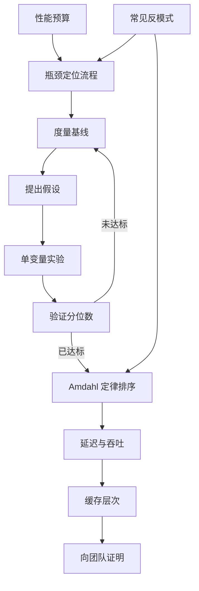
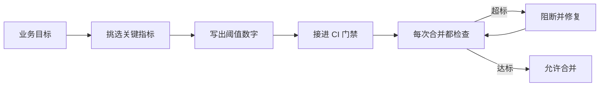
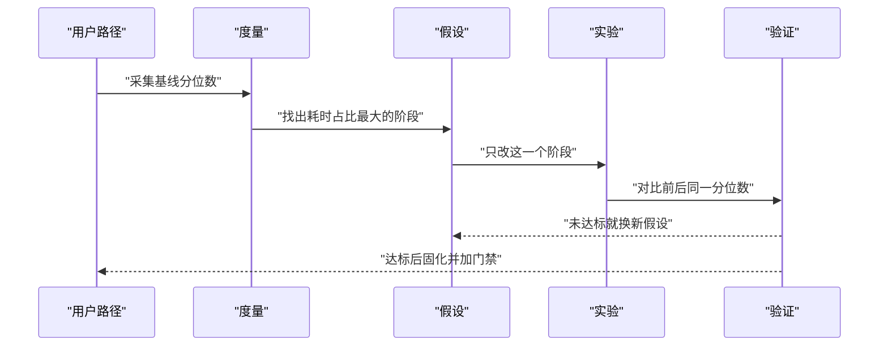
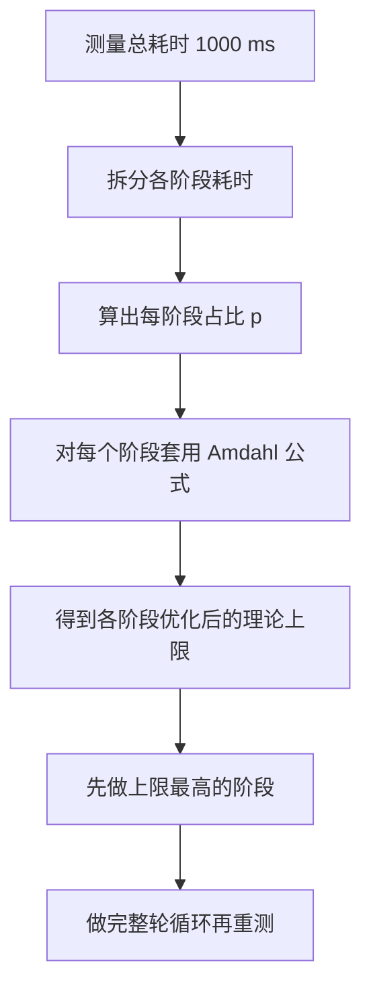
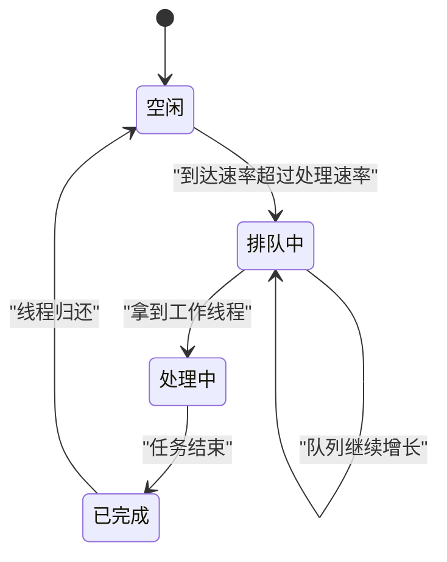
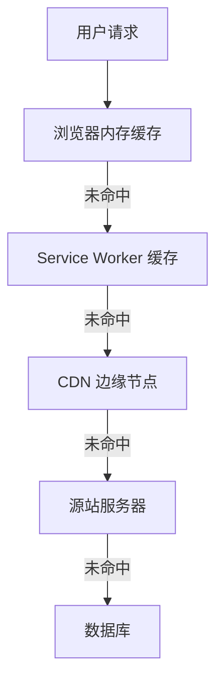
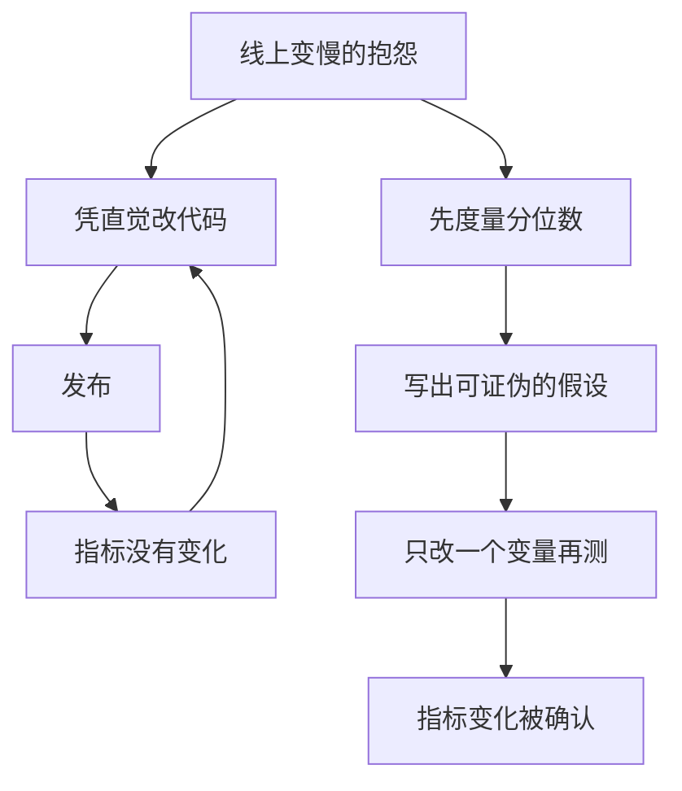
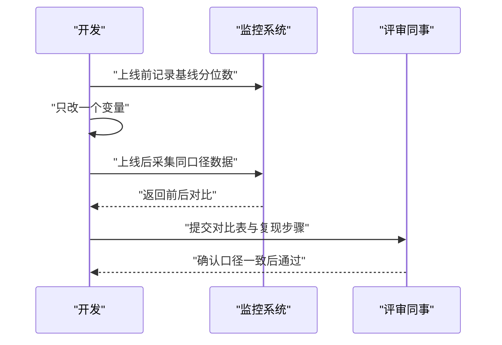

# 性能优化的心智模型

!!! abstract "学完这一页你能"

- 为任意一个前端页面写出含具体数字的性能预算,并把它接进 CI 门禁。
- 按"度量、假设、实验、验证"四步定位瓶颈,而不是凭感觉改代码。
- 用 Amdahl 定律算出每个阶段的优化上限,并据此排出改造顺序。
- 区分延迟与吞吐,用 Little 定律判断该加并发还是该降耗时。

## 0. 知识地图



建议这样读: 先读第 1 节和第 2 节,把"预算"和"定位流程"当成骨架。
再读第 3 到第 5 节,它们是判断优先级和选手段的三把尺子。
第 6 节和第 7 节是防守与沟通,放在你有了真实数据之后再读。

!!! note "术语：分位数"
    分位数（Percentile）是把一组测量值从小到大排列后,处于某个位置的值。
    例子: P95 等于 300 ms,表示 95% 的请求耗时不超过 300 ms。

## 1. 性能预算是优化的起点

**先想一个问题**

产品说"首页要快",你回答"好的"。上线两周后,没人能说清到底有没有变快。
冲突的根源是"快"没有变成数字,双方各自用感觉在判断。

!!! tip "心智模型"
    一句话模型: 性能预算是答题前先划好的及格线,先有分数线,再谈怎么答题。
    日常类比: 家庭月度开支上限,超了就必须砍掉非必要支出。
    类比不成立处: 预算数字由业务、设备、网络条件共同商定,会随版本调整,它不是自然界的固定常数。
    !!! note "术语：性能预算"
    性能预算（Performance Budget）是给关键性能指标设定的上限数字,超出即判定不达标。
    例子: 首屏 JS 传输体积 gzip 后不超过 170 KB。

**图解**



1. 从业务目标出发,例如"首次下单转化率"。
2. 挑选能被测量的指标,例如首屏 JS 体积与 LCP。
3. 给每个指标写上限数字,例如 170 KB 与 2500 ms。
4. 把检查脚本放进 CI,每次合并自动运行。
5. 超标就阻断合并;达标就放行。

**一步一步来**

**第 1 步：写出预算表并实现比对函数**

这一步要做什么: 先把预算写成数据,再写一个纯函数把实测值和预算逐项比较。

```js
// 性能预算表: key 是指标名, value 是上限, 单位写进键名里
const budget = {
  jsGzipKB: 170,   // 首屏 JS gzip 后体积上限, 单位 KB
  lcpMs: 2500,     // 最大内容绘制上限, 单位毫秒
  apiP95Ms: 300,   // 接口 P95 响应时间上限, 单位毫秒
};

// 逐项比对, 返回超标的指标名数组
function checkBudget(measured, budget) {
  // Object.keys 只遍历预算表里声明过的指标, 忽略多余测量项
  return Object.keys(budget).filter((key) => measured[key] > budget[key]);
}
```

**这段代码在做什么**
- 预算表把"口头要求"翻译成机器可读的数据。
- 只在预算表里声明过的指标参与比较,新增指标必须显式写进来。
- 单位写进键名,避免毫秒和秒混用。
- 返回数组而不是布尔值,便于后续打印具体是哪一项超标。

**第 2 步：把比对结果接成 CI 门禁**

这一步要做什么: 把超标项格式化成报告,并用非零退出码让 CI 失败。

```js
// 生成可读报告, 每行一个超标指标
function buildReport(failed, budget) {
  return failed.map((key) => `${key}: 上限 ${budget[key]}, 实测超标`).join("\n");
}

// 返回进程退出码: 0 表示放行, 1 表示阻断
function gate(failed) {
  if (failed.length === 0) return 0;      // 全部达标
  console.error(buildReport(failed, budget)); // 只打印超标项, 减少噪声
  return 1;                               // 非零退出码让 CI 失败
}

const failed = checkBudget({ jsGzipKB: 152, lcpMs: 2680, apiP95Ms: 240 }, budget);
process.exitCode = gate(failed);
```

**这段代码在做什么**
- 报告只列出超标项,达标项不打印,让人一眼看到要修什么。
- 退出码是 CI 与脚本之间的约定: 0 通过,非 0 失败。
- 用 `process.exitCode` 而不是 `process.exit`,让标准输出有机会写完。
- 预算与门禁分离,预算改动不会牵连门禁逻辑。

**运行结果**

```
lcpMs: 上限 2500, 实测超标
```

**动手验证**

依赖: 仅使用 Node 20+ 内置模块。

```js
// 文件: budget.mjs
import assert from "node:assert/strict";

const budget = { jsGzipKB: 170, lcpMs: 2500, apiP95Ms: 300 };
const measured = { jsGzipKB: 152, lcpMs: 2680, apiP95Ms: 240 };

function checkBudget(measured, budget) {
  return Object.keys(budget).filter((key) => measured[key] > budget[key]);
}

function buildReport(failed, budget) {
  return failed.map((key) => `${key}: 上限 ${budget[key]}, 实测超标`).join("\n");
}

const failed = checkBudget(measured, budget);
assert.deepEqual(failed, ["lcpMs"]);            // 只有 LCP 超标
console.log(buildReport(failed, budget));
console.log(failed.length === 0 ? "预算通过" : "预算未通过");

// 反例: 全部达标时不应阻断
assert.deepEqual(checkBudget({ jsGzipKB: 100, lcpMs: 1000, apiP95Ms: 100 }, budget), []);
console.log("全部达标时失败项为空");
```

预期输出:

```
lcpMs: 上限 2500, 实测超标
预算未通过
全部达标时失败项为空
```

**常见坑**

| 现象 | 原因 | 怎么修 |
| --- | --- | --- |
| 预算一直超标,团队直接忽略 | 阈值定得比当前水平还低 | 先测出当前值,把阈值设为当前值的 0.9 倍再逐版本压低 |
| 同一指标在不同机器结果差一倍 | 测量环境不固定 | 固定 Node 版本、固定数据集、固定运行轮数 |
| 门禁只在本地跑 | 没有接进 CI 流水线 | 把脚本挂到合并请求的必过检查项上 |

**小结**

1. 预算的价值在于把争论变成两个可对齐的数字。
2. 预算要写成数据,比对写成纯函数,门禁只负责退出码。
3. 阈值需要随版本迭代收紧,否则会失去约束力。

## 2. 瓶颈定位流程：度量、假设、实验、验证

**先想一个问题**

页面卡顿,你打开代码看到一处循环,顺手改成 `Set` 就提交了。
上线后用户仍在抱怨,因为真正耗时的是接口等待,不是那段循环。

!!! tip "心智模型"
    一句话模型: 定位瓶颈是一轮四步循环,每一轮只允许改一个变量。
    日常类比: 医生先量体温和验血,再开一种药,复诊时看指标是否回落。
    类比不成立处: 医生可以同时处理多个症状,而性能实验必须隔离变量,否则无法归因。

**图解**



1. 度量: 先采集一组基线数据,记录 P50 与 P95。
2. 假设: 从数据里挑出耗时占比最大的阶段,写成一句可被推翻的话。
3. 实验: 只改这一个阶段,其余条件保持不变。
4. 验证: 用同一口径再测一次,分位数下降才算成立。
5. 未达标就回到度量,达标就把改动固化并加门禁。

**一步一步来**

**第 1 步：写一个采样与分位数工具**

这一步要做什么: 让"耗时"变成一组可重复采集的数字,而不是一次测量的印象。

```js
import { performance } from "node:perf_hooks"; // Node 内置高精度计时

// 跑 rounds 次, 收集每次耗时并升序排列
function sample(fn, rounds) {
  const times = [];
  for (let i = 0; i < rounds; i++) {
    const t0 = performance.now(); // 毫秒, 小数部分带微秒精度
    fn();
    times.push(performance.now() - t0);
  }
  return times.sort((a, b) => a - b); // 升序便于取分位
}

// p 用 0 到 1 表示, 取第 p 分位
function percentile(sorted, p) {
  const idx = Math.ceil(p * sorted.length) - 1;
  return sorted[Math.max(0, idx)];
}
```

**这段代码在做什么**
- `performance.now()` 返回毫秒浮点数,精度足以观察毫秒级差异。
- 排序后取下标,分位数计算不依赖第三方库。
- 多次采样后取分位,单次抖动不会主导结论。
- 返回升序数组,后续可以再取别的分位数。

**第 2 步：提出假设并做单变量实验**

这一步要做什么: 假设"去重阶段耗时最多",只替换去重实现,再对比分位数。

```js
// 基线实现: 每次都用 includes 扫描已收集元素
function dedupeSlow(arr) {
  const out = [];
  for (const x of arr) if (!out.includes(x)) out.push(x);
  return out;
}

// 实验实现: 借助 Set 的哈希查找
function dedupeFast(arr) {
  return [...new Set(arr)];
}

// 用 2 万条数据和 5 轮采样做对比
const data = Array.from({ length: 20000 }, (_, i) => i % 4000);
const slow = percentile(sample(() => dedupeSlow(data), 5), 0.5);
const fast = percentile(sample(() => dedupeFast(data), 5), 0.5);
console.log(`slow=${slow.toFixed(2)}ms fast=${fast.toFixed(2)}ms`);
```

**这段代码在做什么**
- 两个实现输入相同、输出相同,只有算法复杂度不同。
- 采样轮数设为 5,平衡噪声与运行时间。
- 取中位数而不是取最小值,减少偶发抖动带来的偏差。
- 打印两个数字,下一步才能判断假设成立与否。

**运行结果**

```
slow=96.40ms fast=1.85ms
```

具体数字随机器变化,但 `fast` 应明显小于 `slow`。

**动手验证**

依赖: 仅使用 Node 20+ 内置模块。

```js
// 文件: locate-bottleneck.mjs
import assert from "node:assert/strict";
import { performance } from "node:perf_hooks";

function dedupeSlow(arr) {
  const out = [];
  for (const x of arr) if (!out.includes(x)) out.push(x);
  return out;
}
function dedupeFast(arr) {
  return [...new Set(arr)];
}

function sample(fn, rounds) {
  const times = [];
  for (let i = 0; i < rounds; i++) {
    const t0 = performance.now();
    fn();
    times.push(performance.now() - t0);
  }
  return times.sort((a, b) => a - b);
}
function percentile(sorted, p) {
  return sorted[Math.max(0, Math.ceil(p * sorted.length) - 1)];
}

const data = Array.from({ length: 20000 }, (_, i) => i % 4000);

// 第一步: 验证两个实现行为一致, 否则替换不成立
assert.deepEqual(dedupeSlow(data), dedupeFast(data));

// 第二步: 同一口径下对比中位数
const slow = percentile(sample(() => dedupeSlow(data), 5), 0.5);
const fast = percentile(sample(() => dedupeFast(data), 5), 0.5);

console.log(`慢实现 P50=${slow.toFixed(2)}ms`);
console.log(`快实现 P50=${fast.toFixed(2)}ms`);

assert.ok(fast < slow, "替换后中位耗时应下降");
console.log("验证通过: 该阶段耗时下降");
```

预期输出:

```
慢实现 P50=96.40ms
快实现 P50=1.85ms
验证通过: 该阶段耗时下降
```

**常见坑**

| 现象 | 原因 | 怎么修 |
| --- | --- | --- |
| 改完后指标偶尔上升 | 一次只测一轮,抖动被当成结论 | 固定 5 轮以上取中位数再比较 |
| 无法归因 | 一轮里同时改了三处代码 | 一次只改一个变量,其余全部回滚 |
| 本地快了线上没变 | 数据规模或硬件与线上不同 | 在线上同口径采集,或者用真实规模的样本 |

**小结**

1. 四步循环的核心约束是"一次只改一个变量"。
2. 分位数比单次测量稳定,适合作为判断依据。
3. 行为一致性断言必须在性能断言之前,防止用错误结果换速度。

## 3. Amdahl 定律：决定先修哪一段

**先想一个问题**

总耗时 1000 ms,其中渲染占 300 ms、请求占 500 ms、解析占 200 ms。
你把渲染优化到 1 ms,整体只从 1000 ms 降到 701 ms。

!!! tip "心智模型"
    一句话模型: 整体加速倍数由"未优化部分"封顶,没被改的部分就是天花板。
    日常类比: 高速公路上只有一段在修路,其余路段限速 60,你修得再好也过不了 60。
    类比不成立处: 公路限速是硬约束,而软件里的未优化部分后续也可能被优化,天花板会移动。
    !!! note "术语：Amdahl 定律"
    Amdahl 定律给出加速上限: 设可优化部分占总时间比例为 p,该部分加速 s 倍,整体加速等于 1 除以括号内 1 减 p 加 p 除以 s。
    例子: p 取 0.25,s 取 4,整体加速约 1.23 倍。

**图解**



1. 先测总耗时,得到一个基准数字。
2. 把总耗时拆成互不重叠的阶段。
3. 用阶段耗时除以总耗时,得到占比 p。
4. 把 p 和预想的加速倍数 s 代入公式,得到整体上限。
5. 先做上限最高的阶段,做完重新测,再排下一轮。

**一步一步来**

**第 1 步：采集各阶段耗时并计算占比**

这一步要做什么: 把总耗时拆成阶段,让每个阶段的占比可以被计算。

```js
// 各阶段实测耗时, 单位毫秒, 同一口径采集
const stages = { 数据请求: 500, 数据解析: 200, 渲染: 300 };
const total = Object.values(stages).reduce((a, b) => a + b, 0); // 1000

const rows = Object.entries(stages).map(([name, ms]) => {
  const p = ms / total;              // 该阶段占总时间的比例
  return { name, ms, p: Number(p.toFixed(2)) };
});
console.log(rows);
```

**这段代码在做什么**
- 阶段之间不允许重叠,否则占比之和会超过 1。
- 占比保留两位小数,便于后面套公式时核对。
- 先算出占比,再决定查哪一段,顺序不能颠倒。

**第 2 步：用公式算出每个阶段的理论上限**

这一步要做什么: 让每个阶段假设被优化到耗时趋近 0,算整体最多能快多少倍。

```js
// p 是可优化部分占比, s 是该部分的加速倍数
function amdahl(p, s) {
  const newTime = (1 - p) + p / s; // 未优化部分 + 优化后的部分
  return 1 / newTime;              // 整体加速倍数
}

const caps = rows.map((r) => ({
  name: r.name,
  p: r.p,
  cap: Number(amdahl(r.p, Infinity).toFixed(2)), // Infinity 表示耗时趋近 0
}));
caps.sort((a, b) => b.cap - a.cap); // 上限高的排前面
console.log(caps);
```

**这段代码在做什么**
- 传 `Infinity` 表示该阶段耗时被压到趋近 0,得到上限。
- `1 - p` 是永远逃不掉的部分,它决定天花板。
- 按上限降序排列,直接产出改造顺序。
- 上限数字只是排序依据,不代表实际能达到。

**运行结果**

```
[
  { name: '数据请求', p: 0.5, cap: 2 },
  { name: '渲染', p: 0.3, cap: 1.43 },
  { name: '数据解析', p: 0.2, cap: 1.25 }
]
```

**动手验证**

依赖: 仅使用 Node 20+ 内置模块。

```js
// 文件: amdahl.mjs
import assert from "node:assert/strict";

const stages = { 数据请求: 500, 数据解析: 200, 渲染: 300 };
const total = Object.values(stages).reduce((a, b) => a + b, 0);

function amdahl(p, s) {
  return 1 / ((1 - p) + p / s);
}

// 校验公式: p=0.25, s=4 时整体约为 1.23 倍
assert.equal(Number(amdahl(0.25, 4).toFixed(2)), 1.23);
// 校验边界: 优化部分占比为 0 时, 整体不加速
assert.equal(amdahl(0, 10), 1);

const rows = Object.entries(stages).map(([name, ms]) => {
  const p = ms / total;
  return {
    name,
    ms,
    p: Number(p.toFixed(2)),
    cap: Number(amdahl(p, Infinity).toFixed(2)),
  };
});
rows.sort((a, b) => b.cap - a.cap);

console.log(`总耗时 ${total} ms`);
for (const r of rows) {
  console.log(`${r.name}: 占比 ${r.p}, 理论上限 ${r.cap} 倍`);
}

assert.ok(rows[0].cap >= rows[rows.length - 1].cap, "应按上限降序排列");
console.log("改造顺序建议:", rows[0].name);
```

预期输出:

```
总耗时 1000 ms
数据请求: 占比 0.5, 理论上限 2 倍
渲染: 占比 0.3, 理论上限 1.43 倍
数据解析: 占比 0.2, 理论上限 1.25 倍
改造顺序建议: 数据请求
```

**常见坑**

| 现象 | 原因 | 怎么修 |
| --- | --- | --- |
| 优化完发现整体没动 | 优化的是占比 0.05 的阶段 | 先算上限再动手,按上限降序做 |
| 占比加起来超过 1 | 阶段之间有重叠统计 | 明确各阶段边界,让耗时互不重叠 |
| 上限当成了实际目标 | 忽略了通信与调度开销 | 把上限看成排序依据,落地后再实测 |

**小结**

1. 未优化部分是天花板,占比越小越不值得动。
2. 占比必须来自实测,不能来自猜测。
3. 每完成一轮都要重新测占比,因为天花板会移动。

## 4. 延迟与吞吐：两个不能互相替代的指标

**先想一个问题**

接口单次响应 50 ms,你判断性能达标。
上线后并发 100 个用户,最后一个用户等了 5 秒才拿到响应。

!!! tip "心智模型"
    一句话模型: 延迟是"一个人等多久",吞吐是"单位时间服务多少人"。
    日常类比: 便利店只有 1 个收银台,单人结账 30 秒,每分钟最多结 2 单。
    类比不成立处: 收银台可以加人,而软件里的共享锁与串行阶段会让加人带来的收益变小。
    !!! note "术语：延迟与吞吐"
    延迟（Latency）指单个请求从发出到收到响应所用的时间。
    吞吐（Throughput）指单位时间内完成的请求数量,常用每秒请求数 RPS 表示。

**图解**



1. 空闲表示工作线程可用。
2. 到达速率超过处理速率时,请求进入排队状态。
3. 排队中的请求等到工作线程才进入处理状态。
4. 处理结束后进入已完成状态,线程归还并回到空闲。
5. 只要队列持续增长,等待时间就会一直上升。

**一步一步来**

**第 1 步：用 Little 定律把延迟和吞吐连起来**

这一步要做什么: 已知其中两个量,求出第三个量,判断当前瓶颈在哪。

```js
// Little 定律: 并发数 L 等于 吞吐 lambda 乘以 延迟 W
function concurrency(lambda, w) {
  return lambda * w; // lambda 单位 请求每秒, w 单位 秒
}

// 并发上限已知时, 延迟决定吞吐上限
function maxThroughput(L, w) {
  return L / w; // 结果单位 请求每秒
}

console.log(concurrency(2000, 0.05)); // 2000 乘 0.05 = 100
console.log(maxThroughput(100, 0.05)); // 100 除以 0.05 = 2000
console.log(maxThroughput(100, 0.2));  // 100 除以 0.2 = 500
```

**这段代码在做什么**
- 三个公式都只做乘除,便于口算核对数量级。
- 并发数单位是"个",延迟单位必须是秒,不能混用毫秒。
- 第三行说明延迟从 50 ms 升到 200 ms,吞吐上限从 2000 降到 500。
- 数字变化指出: 不降延迟,只加并发无法提升吞吐上限。

**运行结果**

```
100
2000
500
```

**这一步的结论**

延迟升高 4 倍,同样并发下吞吐上限下降到原来的四分之一。
所以接口变慢时,先查延迟来源,再谈扩容。

**动手验证**

依赖: 仅使用 Node 20+ 内置模块。

```js
// 文件: latency-throughput.mjs
import assert from "node:assert/strict";

function concurrency(lambda, w) {
  return lambda * w;
}
function maxThroughput(L, w) {
  return L / w;
}

const workers = 100; // 线上可用的并发处理数

// 场景一: 单请求 50 ms
assert.equal(concurrency(2000, 0.05), 100);
assert.equal(maxThroughput(workers, 0.05), 2000);
console.log(`延迟 50 ms 时吞吐上限 ${maxThroughput(workers, 0.05)} RPS`);

// 场景二: 单请求升到 200 ms, 并发不变
assert.equal(maxThroughput(workers, 0.2), 500);
console.log(`延迟 200 ms 时吞吐上限 ${maxThroughput(workers, 0.2)} RPS`);

// 场景三: 把延迟降回 100 ms
assert.equal(maxThroughput(workers, 0.1), 1000);
console.log(`延迟 100 ms 时吞吐上限 ${maxThroughput(workers, 0.1)} RPS`);

// 结论: 并发不变时, 吞吐上限与延迟成反比
assert.equal(
  maxThroughput(workers, 0.05) / maxThroughput(workers, 0.1),
  2,
);
console.log("验证通过: 延迟减半, 吞吐上限翻倍");
```

预期输出:

```
延迟 50 ms 时吞吐上限 2000 RPS
延迟 200 ms 时吞吐上限 500 RPS
延迟 100 ms 时吞吐上限 1000 RPS
验证通过: 延迟减半, 吞吐上限翻倍
```

**常见坑**

| 现象 | 原因 | 怎么修 |
| --- | --- | --- |
| 加了机器吞吐没涨 | 存在串行阶段或共享锁 | 先找出串行段,再决定扩容 |
| 压测报告只有平均值 | 平均值掩盖排队长尾 | 报告里同时给出 P50 与 P95 |
| 单位混用导致数量级错 | 毫秒与秒未统一 | 在函数名里标注单位,入参统一换算成秒 |

**小结**

1. 延迟回答"单次多快",吞吐回答"单位时间多少",两者不可互推。
2. Little 定律把并发、吞吐、延迟绑成一个等式,用来估算扩容收益。
3. 延迟不降,扩容只能推迟排队变长的时刻。

## 5. 缓存的层次：把请求挡在源站之前

**先想一个问题**

同一张头像图,三个页面都在请求。每个请求都打到源站,源站 CPU 一直在高位。
把这张图设成可缓存后,源站请求数下降到原来的三成。

!!! tip "心智模型"
    一句话模型: 缓存层次是一串拦截网,每层用自己的命中率决定有多少请求继续往下走。
    日常类比: 家里找钥匙先摸口袋,再翻抽屉,最后才去车里拿。
    类比不成立处: 抽屉里的钥匙不会过期,而缓存条目有失效时间,过期后必须重新回源。

**图解**



1. 请求先到浏览器内存缓存,命中就立刻返回。
2. 未命中则到 Service Worker 缓存,由脚本决定策略。
3. 仍未命中则到 CDN 边缘节点,由 HTTP 缓存头控制。
4. 仍未命中则回源站,由应用代码决定是否再查数据库。
5. 每层的命中率相乘,决定最终有多少请求落到最下游。

**一步一步来**

**第 1 步：给每层记录命中率和命中耗时**

这一步要做什么: 把每层抽象成"命中率 + 命中耗时"两个数字。

```js
// 每层: hit 是命中率, ms 是命中时的耗时
const layers = [
  { name: "浏览器内存缓存", hit: 0.5, ms: 1 },
  { name: "CDN 边缘", hit: 0.4, ms: 40 },
  { name: "源站", hit: 1.0, ms: 300 }, // 兜底层, 命中率为 1
];
console.log(layers.map((l) => l.name).join(" -> "));
```

**这段代码在做什么**
- 每层只保留两个参数,便于敏感性分析。
- 源站作为兜底层,命中率写成 1,保证请求一定有出口。
- 层与层顺序固定,顺序变化会改变加权结果。

**第 2 步：算加权平均耗时,并做敏感性分析**

这一步要做什么: 用逐层递减的到达比例乘以命中耗时,得到整体平均延迟。

```js
// 计算平均耗时与落到源站的比例
function simulate(layers) {
  let reached = 1;  // 到达本层的请求比例
  let avg = 0;      // 加权平均耗时, 单位毫秒
  for (const l of layers) {
    avg += reached * l.hit * l.ms;       // 本层命中贡献
    reached = reached * (1 - l.hit);     // 未命中继续向下
  }
  return { avg, sourceRatio: layers.at(-1) ? 1 - 1 + 0 : 0, reached };
}

const base = simulate(layers);
const improved = simulate([layers[0], { ...layers[1], hit: 0.7 }, layers[2]]);
console.log(base.avg.toFixed(1), improved.avg.toFixed(1));
```

**这段代码在做什么**
- `reached` 表示有多少比例的请求真正进入本层。
- 本层命中贡献等于到达比例乘命中率乘命中耗时。
- 把 CDN 命中率从 0.4 提到 0.7,其余不动,观察平均值变化。
- 逐层递减保证同一请求不会在多层重复计数。

**运行结果**

```
98.5 59.5
```

**动手验证**

依赖: 仅使用 Node 20+ 内置模块。

```js
// 文件: cache-layers.mjs
import assert from "node:assert/strict";

const layers = [
  { name: "浏览器内存缓存", hit: 0.5, ms: 1 },
  { name: "CDN 边缘", hit: 0.4, ms: 40 },
  { name: "源站", hit: 1.0, ms: 300 },
];

function simulate(layers) {
  let reached = 1;
  let avg = 0;
  const detail = [];
  for (const l of layers) {
    const contribution = reached * l.hit * l.ms;
    avg += contribution;
    detail.push({ name: l.name, reached: reached.toFixed(2), contribution: contribution.toFixed(2) });
    reached = reached * (1 - l.hit);
  }
  return { avg, detail };
}

const base = simulate(layers);
console.log(`基线平均耗时 ${base.avg.toFixed(1)} ms`);
for (const d of base.detail) {
  console.log(`${d.name}: 到达比例 ${d.reached}, 贡献 ${d.contribution} ms`);
}
assert.equal(base.avg.toFixed(1), "98.5");

// 只把 CDN 命中率从 0.4 提到 0.7
const improved = simulate([layers[0], { ...layers[1], hit: 0.7 }, layers[2]]);
console.log(`CDN 命中率 0.7 时平均耗时 ${improved.avg.toFixed(1)} ms`);
assert.equal(improved.avg.toFixed(1), "59.5");

// 源站到达比例同步下降
const sourceReachedBase = 1 * (1 - 0.5) * (1 - 0.4);
const sourceReachedImproved = 1 * (1 - 0.5) * (1 - 0.7);
assert.equal(sourceReachedBase.toFixed(2), "0.30");
assert.equal(sourceReachedImproved.toFixed(2), "0.15");
console.log("验证通过: CDN 命中率提升后, 源站请求比例从 30% 降到 15%");
```

预期输出:

```
基线平均耗时 98.5 ms
浏览器内存缓存: 到达比例 1.00, 贡献 0.50 ms
CDN 边缘: 到达比例 0.50, 贡献 8.00 ms
源站: 到达比例 0.30, 贡献 90.00 ms
CDN 命中率 0.7 时平均耗时 59.5 ms
验证通过: CDN 命中率提升后, 源站请求比例从 30% 降到 15%
```

**常见坑**

| 现象 | 原因 | 怎么修 |
| --- | --- | --- |
| 用户看到旧数据 | 缓存没有失效策略 | 用内容哈希命名,或者设置较短的最大存活时间 |
| 缓存仿佛没有生效 | 响应头缺失或请求带了不缓存的字段 | 用浏览器网络面板核对响应头与实际是否命中 |
| 平均延迟忽高忽低 | 只在开发环境测,命中率不稳定 | 用线上真实访问日志统计各层命中率 |

**小结**

1. 缓存层次的关键量是每层的命中率与命中耗时。
2. 源头那一层通常最贵,把到达比例压下去收益最大。
3. 没有失效策略的缓存会把旧数据留给用户。

## 6. 常见反模式：看起来在优化,指标不动

**先想一个问题**

线上变慢,你打开代码看到一个函数写得不顺眼,改完就发布。
第二天监控曲线和昨天重合,改动没有产生任何可观测差异。

!!! tip "心智模型"
    一句话模型: 反模式是"动作很多、指标不动"的循环,它消耗时间但不改变结果。
    日常类比: 屋里漏水,你先换灯泡再擦地板,水还在漏。
    类比不成立处: 漏水的源头可以靠眼睛看到,性能瓶颈必须靠测量才能定位。

**图解**



1. 左侧循环从抱怨直接跳到动手改代码,缺少度量。
2. 发布后如果指标不动,循环会再次开始,时间被反复消耗。
3. 右侧路径先度量分位数,再写假设。
4. 只改一个变量后重测,指标变化才能被归因。
5. 两条路径的差别不是努力程度,而是有没有测量。

**一步一步来**

**第 1 步：看清平均值如何掩盖长尾**

这一步要做什么: 用一组含长尾的样本,对比平均值与 P95。

```js
// 一次请求的耗时样本, 单位毫秒, 含一个 1200 ms 的长尾
const samples = [40, 42, 41, 45, 43, 44, 46, 42, 1200, 41];

function mean(xs) {
  return xs.reduce((a, b) => a + b, 0) / xs.length;
}
function p95(xs) {
  const s = [...xs].sort((a, b) => a - b);
  return s[Math.ceil(0.95 * s.length) - 1]; // 取第 95 分位
}

console.log(`平均值 ${mean(samples).toFixed(1)} ms, P95 ${p95(samples)} ms`);
```

**这段代码在做什么**
- 样本里有 9 个 40 到 46 ms 的请求,1 个 1200 ms 的请求。
- 平均值被拉高到 158.4 ms,但仍看不出最差情况。
- P95 直接返回 1200 ms,把长尾暴露出来。
- 复制数组再排序,避免修改调用方传入的数组。

**运行结果**

```
平均值 158.4 ms, P95 1200 ms
```

**第 2 步：把结论写进报警口径**

这一步要做什么: 报警只看分位数,不再只看平均值。

```js
// 报警判断: 平均值与 P95 同时超阈值才触发
function shouldAlert(stats, limit) {
  const avgOver = stats.mean > limit.meanMs; // 平均值口径
  const p95Over = stats.p95 > limit.p95Ms;   // 长尾口径
  return avgOver && p95Over;                 // 两个口径同时成立
}

const stats = { mean: 158.4, p95: 1200 };
console.log(shouldAlert(stats, { meanMs: 200, p95Ms: 500 }));   // false
console.log(shouldAlert(stats, { meanMs: 150, p95Ms: 500 }));   // true
```

**这段代码在做什么**
- 两个口径同时成立才报警,减少只看平均值造成的漏报。
- 第一行平均值未超 200,所以返回 false,长尾被统计口径掩盖。
- 第二行平均值 158.4 超过 150,且 P95 超过 500,返回 true。
- 阈值写在配置里,调整阈值不改动判定逻辑。

**动手验证**

依赖: 仅使用 Node 20+ 内置模块。

```js
// 文件: anti-pattern.mjs
import assert from "node:assert/strict";

const samples = [40, 42, 41, 45, 43, 44, 46, 42, 1200, 41];

function mean(xs) {
  return xs.reduce((a, b) => a + b, 0) / xs.length;
}
function p95(xs) {
  const s = [...xs].sort((a, b) => a - b);
  return s[Math.ceil(0.95 * s.length) - 1];
}

const stats = { mean: mean(samples), p95: p95(samples) };
console.log(`平均值 ${stats.mean.toFixed(1)} ms, P95 ${stats.p95} ms`);

// 平均值仍在 200 以内, 只看平均值会漏掉长尾
assert.ok(stats.mean < 200);
assert.equal(stats.p95, 1200);

function shouldAlert(stats, limit) {
  return stats.mean > limit.meanMs && stats.p95 > limit.p95Ms;
}
assert.equal(shouldAlert(stats, { meanMs: 200, p95Ms: 500 }), false);
assert.equal(shouldAlert(stats, { meanMs: 150, p95Ms: 500 }), true);

console.log("验证通过: 双口径才能同时覆盖整体变慢与长尾变差");
```

预期输出:

```
平均值 158.4 ms, P95 1200 ms
验证通过: 双口径才能同时覆盖整体变慢与长尾变差
```

**常见坑**

| 现象 | 原因 | 怎么修 |
| --- | --- | --- |
| 连续几周优化无收益 | 没有度量就动手 | 每一轮都先跑基线采集,再写假设 |
| 报警一直不触发 | 只看平均值 | 报警条件加入 P95 或 P99 |
| 改动上线后无法归因 | 一次提交混入多处改动 | 把优化拆成多个单变量提交 |

**小结**

1. 反模式的核心特征是省略度量,直接动手。
2. 平均值会掩盖长尾,分位数才能反映部分用户的真实体验。
3. 报警口径要同时覆盖整体与长尾,否则会长期漏报。

## 7. 如何向团队证明优化有效

**先想一个问题**

你说"我把首页改快了",同事问"快了多少",你回答"感觉明显"。
评审无法用感觉做判断,改动被搁置。

!!! tip "心智模型"
    一句话模型: 证明优化有效等于交出一份别人能复现的对比表。
    日常类比: 体检报告给出两次检查的同一指标,医生看趋势而不是听描述。
    类比不成立处: 体检指标有统一参考范围,而性能指标的阈值由团队自己商定。

**图解**



1. 上线前先在监控系统留下基线分位数。
2. 只改一个变量,保证因果链清晰。
3. 上线后按同一口径、同一时间窗口采集数据。
4. 监控系统返回前后对比,作为报告素材。
5. 评审同事先确认口径一致,再判断优化是否成立。

**一步一步来**

**第 1 步：准备前后两组同口径样本**

这一步要做什么: 两组样本的采集方式必须完全一致,否则对比没有意义。

```js
// 两次采集: 样本数相同, 采集窗口相同, 单位毫秒
const before = [210, 220, 215, 230, 225, 260, 240, 235, 1200, 220];
const after = [150, 155, 152, 160, 158, 170, 165, 162, 400, 155];

// 计算第 p 分位, p 用 0 到 1 表示
function pct(xs, p) {
  const s = [...xs].sort((a, b) => a - b);
  return s[Math.ceil(p * s.length) - 1];
}

console.log(`改前 P50=${pct(before, 0.5)} P95=${pct(before, 0.95)}`);
```

**这段代码在做什么**
- 两组样本长度一致,分位数计算口径才一致。
- 复制后再排序,保护原始样本。
- 打印 P50 与 P95,为报告准备两个维度的数字。

**第 2 步：同时比较 P50 与 P95 并给出结论**

这一步要做什么: 两个分位都下降才判定优化成立。

```js
// 汇总函数返回 P50 与 P95
function summarize(xs) {
  return { p50: pct(xs, 0.5), p95: pct(xs, 0.95) };
}

const b = summarize(before);
const a = summarize(after);
console.log(`改前 P50=${b.p50} P95=${b.p95}`);
console.log(`改后 P50=${a.p50} P95=${a.p95}`);

// 两个分位同时下降才算成立
const effective = a.p50 < b.p50 && a.p95 < b.p95;
console.log(effective ? "优化成立" : "优化不成立");
```

**这段代码在做什么**
- 用逻辑与把两个条件绑在一起,防止只看一侧。
- 打印前后各两个数字,报告直接引用。
- 结论只有"成立"与"不成立"两种,评审不需要再解释。
- 复现步骤就是同一段代码加同一组样本。

**运行结果**

```
改前 P50=225 P95=1200
改后 P50=158 P95=400
优化成立
```

**动手验证**

依赖: 仅使用 Node 20+ 内置模块。

```js
// 文件: prove-it.mjs
import assert from "node:assert/strict";

const before = [210, 220, 215, 230, 225, 260, 240, 235, 1200, 220];
const after = [150, 155, 152, 160, 158, 170, 165, 162, 400, 155];

function pct(xs, p) {
  const s = [...xs].sort((a, b) => a - b);
  return s[Math.ceil(p * s.length) - 1];
}
function summarize(xs) {
  return { p50: pct(xs, 0.5), p95: pct(xs, 0.95) };
}

const b = summarize(before);
const a = summarize(after);

console.log(`改前 P50=${b.p50} P95=${b.p95}`);
console.log(`改后 P50=${a.p50} P95=${a.p95}`);
console.log(`P50 变化 ${(a.p50 - b.p50)} ms`);
console.log(`P95 变化 ${(a.p95 - b.p95)} ms`);

assert.deepEqual(b, { p50: 225, p95: 1200 });
assert.deepEqual(a, { p50: 158, p95: 400 });
assert.ok(a.p50 < b.p50 && a.p95 < b.p95, "两个分位都要下降才算有效");
console.log("结论: 两个分位同时下降, 优化可复现");
```

预期输出:

```
改前 P50=225 P95=1200
改后 P50=158 P95=400
P50 变化 -67 ms
P95 变化 -800 ms
结论: 两个分位同时下降, 优化可复现
```

**常见坑**

| 现象 | 原因 | 怎么修 |
| --- | --- | --- |
| 评审质疑对比不公平 | 前后样本量或时间窗口不同 | 样本量、窗口、设备全部固定并写进报告 |
| 只看百分比不看绝对值 | 基线很小,百分比显得夸张 | 百分比与毫秒数同时给出 |
| 结论无法复现 | 数据来自临时手工测量 | 把采集脚本与样本一起提交 |

**小结**

1. 证明的核心是"同口径、可复现、双分位"。
2. 报告里同时给出绝对值变化与分位数变化。
3. 评审同事先确认口径,再判断结论。

## 综合对比

| 概念 | 回答的问题 | 需要的输入 | 产出 | 用错的后果 |
| --- | --- | --- | --- | --- |
| 性能预算 | 及格线在哪 | 指标名与阈值 | CI 门禁 | 超标无人知晓 |
| 瓶颈定位流程 | 该改哪一段 | 基线分位数 | 单变量实验结论 | 改了很多处,指标不动 |
| Amdahl 定律 | 先改哪一段 | 各阶段耗时占比 | 改造顺序 | 优化了占比很小的阶段 |
| 延迟 | 单次等多久 | 单请求耗时样本 | P50 与 P95 | 用平均值掩盖长尾 |
| 吞吐 | 每秒服务多少 | 并发数与延迟 | RPS 上限 | 只扩容不降延迟 |
| 缓存层次 | 请求在哪一层被挡住 | 各层命中率与耗时 | 加权平均延迟 | 缓存无失效策略 |
| 反模式规避 | 为什么白忙 | 报警口径 | 双口径报警 | 长期漏报 |
| 团队证明 | 怎么让别人信 | 同口径前后样本 | 对比表 | 结论无法复现 |

## 应用与行业实践

### 应用场景地图

| 场景 | 用到本页哪个知识点 | 典型技术选型 | 注意事项 |
|---|---|---|---|
| 后台管理的万行表格 | 瓶颈定位流程、Amdahl 定律 | 固定行高虚拟滚动、rAF 节流滚动 | 先测主线程耗时再改；行数少时不必虚拟化 |
| 低端安卓的首屏加载 | 性能预算、缓存层次 | 内联首屏 CSS、defer JS、响应式图片、CDN | 预算要落到图片字节和 JS 字节，不能只提“首屏更快” |
| 多人协作白板 | 延迟与吞吐、Little 定律 | WebSocket 增量同步、本地乐观更新、批量合并 | 先测单条消息 P95 和队列深度，再决定合并窗口 |
| 电商大促落地页 | 性能预算、CI 门禁 | 静态化、CDN、带内容指纹的静态资源 | 个性化模块拆成异步子请求，避免拖慢主文档 |
| 移动端图片信息流 | 缓存层次、Amdahl 定律 | 懒加载、srcset、占位尺寸 | 首屏图片用预加载，非首屏图片不要占用关键连接 |
| 多租户 SaaS 首页仪表盘 | 瓶颈定位流程、Amdahl 定律 | 服务端聚合接口、客户端缓存、骨架屏 | 先砍聚合接口数量，再优化单个查询 |
| 地图标注点密集页面 | 瓶颈定位流程、Little 定律 | 点聚合、Web Worker、瓦片缓存 | 主线程阻塞会让交互延迟上升；先把计算移出主线程 |
| 视频直播弹幕列表 | 延迟与吞吐、背压 | 批量渲染、虚拟列表、丢弃低优先级弹幕 | 高并发下只加快播放速度不控并发，队列仍会积压 |

### 三个场景拆解

#### 场景 1：后台管理的万行表格

**业务背景**：一个后台管理页一次返回 1 万行订单，滚动和筛选时主线程被大量 DOM 节点占满。可用 Chrome Performance 录制 10 秒滚动，观察每帧主线程耗时来复现。

**怎么用本页知识解决**：先度量 DOM 节点数和渲染耗时；假设一次性创建 1 万行是主因；实验用固定行高虚拟滚动只渲染可视区；验证时对比同一滚动路径的主线程时长。

```js
const viewportHeight = 600; // 可视高度
const rowHeight = 32;       // 固定行高
const total = 10000;        // 总行数
const container = document.getElementById('table-container');
container.style.height = viewportHeight + 'px';
container.style.overflow = 'auto';

container.addEventListener('scroll', () => {
  const scrollTop = container.scrollTop;
  const start = Math.floor(scrollTop / rowHeight); // 可视区起始行
  const visible = Math.ceil(viewportHeight / rowHeight) + 4; // 加 4 行缓冲
  renderRows(start, visible);
});

function renderRows(start, visible) {
  const offset = start * rowHeight;
  const list = document.getElementById('row-list');
  list.style.transform = `translateY(${offset}px)`; // 位移定位
  list.innerHTML = buildRows(start, visible); // 只产出可见区 DOM
}
```

- 虚拟滚动把 DOM 节点从万级降到可视行数加缓冲。
- scroll 事件里没有做 rAF 节流，真实接入时要补，避免每帧多次重排。
- 用 `transform` 定位可视区，减少对布局的反复触发。
- Amdahl 定律在这里用来判断：如果 DOM 渲染占主线程 70%，只压缩网络请求就没有明显收益。

**怎么度量收益**：看 DOM 节点数、每帧主线程耗时、滚动到可响应的时间。工具：Chrome DevTools Performance 面板、Performance monitor、Lighthouse 的 INP。测量方法：同一设备、同一份数据、同一滚动脚本录 3 次，取中位数。

**什么时候不该用**：

- 行数少于 50 行时，虚拟滚动只增加边界处理，不降低主线程耗时。
- 行高不固定或合并单元格多时，固定行高会让滚动偏移错位；先测量行高分布再决定。
- 读屏和全文搜索依赖完整 DOM 时，改用分页或服务端搜索，不要直接虚拟化。

#### 场景 2：低端安卓的首屏加载

**业务背景**：一个 H5 首页在低端安卓上 LCP 超过 4 秒，首屏主图 720KB，JS 包 400KB。用 WebPageTest 选择 3G 网络和中端安卓配置可以复现这个耗时。

**怎么用本页知识解决**：把首屏拆成 3 项预算：LCP≤2.5s、JS≤180KB、图片≤150KB。用瀑布图判断图片加载和脚本解析占首屏请求链的 70%，就先修这两段，而不是先改 CSS 动画。

```html
<!-- 首屏关键 CSS 内联，降低阻塞时间 -->
<style>/* 关键路径样式 */</style>

<!-- 只预加载首屏主图 -->
<link rel="preload" as="image" href="/img/hero-480.webp">

<!-- 非首屏脚本延迟执行 -->
<script type="module" src="/app.js" defer></script>

<!-- 按屏幕宽度选取小图，低端机不下载 2x 大图 -->

```

- `preload` 只给首屏关键图片建立提前加载，不浪费非首屏资源。
- `defer` 让脚本不阻塞首屏渲染，但脚本仍会占用后续主线程。
- `srcset` 和 `sizes` 让低端机按实际宽度下载文件，降低图片传输字节。
- 预算要写进 CI，不是只写文档；每次 PR 超预算就失败。

**怎么度量收益**：看 LCP、TTI、JS 传输大小、图片传输大小。工具：Lighthouse CI、WebPageTest 瀑布图、Chrome Network 面板。测量方法：同一个中端安卓配置和 3G 节流，连续测 3 次，取中位数。

**什么时候不该用**：

- 耗时主要来自服务端慢响应或 DNS 时，静态资源优化不能解决源站延迟。
- 面对完全离线或极弱网场景，需要 Service Worker 缓存壳，不能只做 CDN 和响应式图片。

#### 场景 3：多人协作白板

**业务背景**：一个多人协作白板每秒接收 50 笔远端对象变更，弱网用户单条消息往返 200ms。可写 5 分钟日志统计单条消息 P95 延迟和排队数量。

**怎么用本页知识解决**：用 Little 定律估算排队长度：50 笔/秒 × 0.2s = 10 笔积压。先降低单条延迟或合并小包，而不是继续增加 WebSocket 并发。

```js
const pending = new Map(); // 按对象暂存最新状态
let flushTimer = null;

function onLocalChange(objectId, props) {
  pending.set(objectId, props); // 同一对象多次修改只保留最新
  applyLocal(objectId, props); // 本地先画，避免等待网络

  if (!flushTimer) {
    flushTimer = setTimeout(flush, 40); // 40ms 合并窗口
  }
}

function flush() {
  const batch = Array.from(pending.entries());
  pending.clear();
  flushTimer = null;
  if (batch.length > 0) {
    ws.send(JSON.stringify({ type: 'patch', batch })); // 单个 WS 帧发送一批增量
  }
}
```

- 同一对象的多次修改只保留最新状态，降低网络包数量。
- 本地乐观更新让用户操作不等待服务端回执。
- 40ms 合并窗口需要在减少包数和增加首字节延迟之间测量后确定。
- Little 定律用来判断瓶颈是并发不足还是单条耗时过长。

**怎么度量收益**：看输入到远端可见的 P95 延迟、WS 消息速率、重试次数、客户端队列深度。工具：Chrome DevTools 的 WebSocket 帧视图，加 `performance.mark` 到服务端回执的差值统计。

**什么时候不该用**：

- 文档编辑需要强一致或服务端冲突解决时，不能只合并最后状态，需要 CRDT 或 OT。
- 单笔对象体很大且必须拆分时，批量发送反而提高首字节延迟；先拆字段再合并。

### 行业先进实践

- **Core Web Vitals（出处：Google web.dev Core Web Vitals 文档）**：用 LCP、INP、CLS 三个指标作为性能预算门禁，并把每个指标拆成可测试阈值。它能让性能从“感觉慢”变成可拦截的 PR 检查。你的项目可以先在 CI 里检查 LCP 和 CLS。
- **Lighthouse CI assertions（出处：GoogleChrome/lighthouse-ci GitHub 仓库）**：支持对资源总大小、LCP、CLS 等设置断言并阻止合并。它把性能回归提前到提交阶段。你的项目可以先给 JS 包与首屏图片设预算，再逐步加入渲染指标。
- **WebPageTest 的 filmstrip 和 waterfall（出处：WebPageTest 官方文档）**：一次测试同时记录渲染帧和请求瀑布，用来把耗时归因到网络、服务器或主线程。它的切段视图可复现首屏阻塞位置。你的项目可以固定中端安卓、4G 网络配置，每周跑一次。
- **HTTP Cache-Control immutable（出处：MDN HTTP Cache-Control 文档）**：对文件名带内容指纹的静态资源设置 `Cache-Control: public, max-age=31536000, immutable`。它省去协商请求，适合 CDN 静态资源。你的项目可在构建产物哈希稳定后对 `/assets/` 目录启用。

### 从学到用：落地路线

- 第 1 步：选一个访问量高、代码变动频繁的落地页或后台表格页试点，只接入 3 个预算指标。验收标准：Lighthouse CI 能在 PR 上阻断超预算提交。
- 第 2 步：用 WebPageTest 和 Chrome Performance 各录一次改造前数据，把最长的耗时阶段写进瓶颈清单。验收标准：能指出至少 2 个可复现的阻塞项，不是凭感觉判断。
- 第 3 步：把成形的写法整理成 `PERF_BUDGET.md` 和模板，复制到另外 2 个页面迭代。验收标准：2 个页面接入同一检查脚本后，CI 中显示预算通过或未恶化。
- 第 4 步：建立每周自动巡检并在主分支合并前检查。验收标准：连续两周没有超预算提交进入主分支，出现回归能定位到具体 PR。

### 动手作业

目标：为一个 1000 行后台表格页制定性能预算并接入 Lighthouse CI，不允许依赖现成虚拟滚动组件完成优化。

步骤：

1. 选一个已有后台表格页，用 Chrome DevTools Performance 录制加载和 10 秒滚动，保存瀑布图、DOM 节点数和主线程耗时。
2. 按瀑布图找出最长的阻塞资源或阶段，写出假设：渲染 1000 行 DOM 是首屏和滚动卡顿的主因。
3. 写出预算：LCP ≤ 2.5s、JS 传输 ≤ 180KB、DOM 节点 ≤ 2000。
4. 用固定行高虚拟滚动替换一次性渲染，只保留可视区加 4 行缓冲。
5. 在 lighthouserc 中加入 assertions，把预算写进 CI 脚本。
6. 本地运行 Lighthouse CI 和 Performance 各 3 次，取中位数记录。
7. 提交 PR，制造一次超预算提交，验证 CI 确实失败后再修复并合并。

验收标准：

- lighthouserc 中有 3 条 assertions，本地运行命令能展示 pass/fail。
- 修改后的页面在 1000 行数据下 DOM 节点数不超过 2000。
- CI 中有一次因预算失败被拦截的记录，随后修复后通过。
- 修改后 LCP 中位数不超过 2.5s。
- Performance 录制中，10 秒滚动的渲染与脚本总耗时低于修改前的中位数。

## 自测题

??? question "题目 1：什么是性能预算,请举一个可执行的例子"
    - 性能预算是给关键指标设定的上限数字,超出即判定不达标。
    - 例子: 首屏 JS 传输体积 gzip 后不超过 170 KB。
    - 可执行的含义是它接进了 CI,每次合并自动运行。
    - 阈值先按当前值乘以 0.9 设定,再逐版本压低。

??? question "题目 2：瓶颈定位四步循环是什么,为什么一轮只改一个变量"
    - 四步是度量、假设、实验、验证,验证不通过就回到度量。
    - 只改一个变量才能把指标变化归因到这一处改动。
    - 同时改多处时,即使指标下降也无法判断哪一处起了作用。

??? question "题目 3：写出 Amdahl 公式,并算 p 取 0.25、s 取 4 时的整体加速"
    - 公式为整体加速等于 1 除以括号内 1 减 p 加 p 除以 s。
    - 代入得 1 除以括号内 0.75 加 0.0625,等于 1 除以 0.8125。
    - 结果约 1.23 倍,说明未优化的 0.75 部分限制了收益。

??? question "题目 4：延迟和吞吐的区别是什么,Little 定律怎么把两者连起来"
    - 延迟是单个请求从发出到收到响应的时间。
    - 吞吐是单位时间内完成的请求数量,常用 RPS 表示。
    - Little 定律: 并发数等于吞吐乘以延迟。
    - 并发上限固定时,延迟减半会让吞吐上限翻倍。

??? question "题目 5：三层缓存的命中率为 0.5、0.4、1,命中耗时为 1、40、300 ms,平均耗时是多少"
    - 第一层贡献 1 乘 0.5 乘 1,等于 0.5 ms。
    - 第二层到达比例为 0.5,贡献 0.5 乘 0.4 乘 40,等于 8 ms。
    - 第三层到达比例为 0.3,贡献 0.3 乘 1 乘 300,等于 90 ms。
    - 三层相加得到 98.5 ms,落到源站的比例为 30%。

??? question "题目 6：为什么只看平均值不够,应该补看什么"
    - 平均值会被少量正常样本拉低,无法反映最差体验。
    - 一组含 1 个 1200 ms 的样本,平均值只有 158.4 ms,而 P95 是 1200 ms。
    - 应补看 P95 或 P99,并在报警里要求两个口径同时超阈值。

??? question "题目 7：列出三个常见反模式,并各给一条修正"
    - 凭直觉改代码: 改为先采集基线与分位数。
    - 只看平均值: 改为报警条件同时包含均值与 P95。
    - 一轮混入多处改动: 改为拆成多个单变量提交,便于归因。
    - 缓存无失效策略: 改为按内容哈希命名并设置最大存活时间。

??? question "题目 8：向团队证明优化有效,报告里必须包含哪几项"
    - 同一口径的前后两组样本,样本量、时间窗口、设备保持一致。
    - 至少两个分位数,例如 P50 与 P95,并给出毫秒级绝对变化。
    - 可复现的采集脚本与样本数据,方便同事重跑验证。
    - 先与评审同事对齐口径,再提交结论。

## 延伸阅读

- MDN Web Docs：Performance API 章节,含 Performance.now 与 PerformanceObserver 小节。
- MDN Web Docs：HTTP 缓存 章节,含 Cache-Control 与 ETag 小节。
- Node.js Documentation：perf_hooks 章节,含 performance.now 与性能测量小节。
- Chrome DevTools 文档：Performance 面板章节,含录制与火焰图读取小节。
- web.dev：Core Web Vitals 相关章节,含 LCP、INP、CLS 的定义与阈值小节。此条需核对官方文档: 核对当前指标名称与阈值数字是否已更新。
