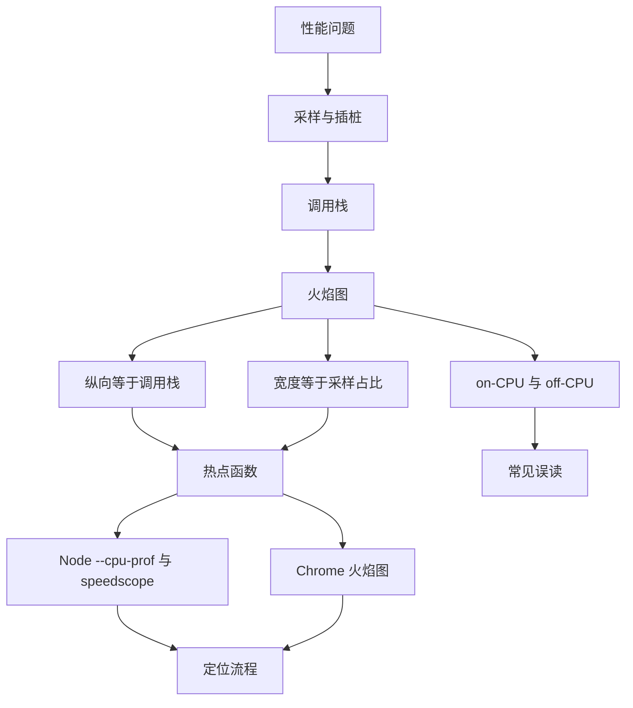
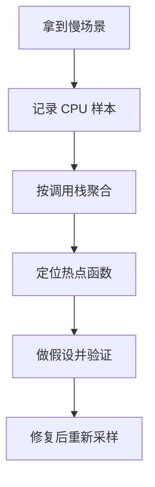
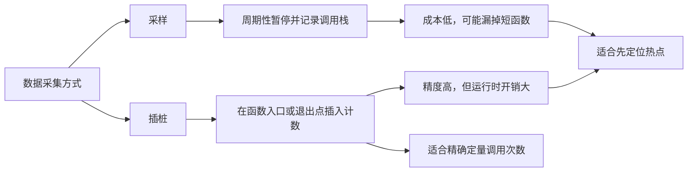
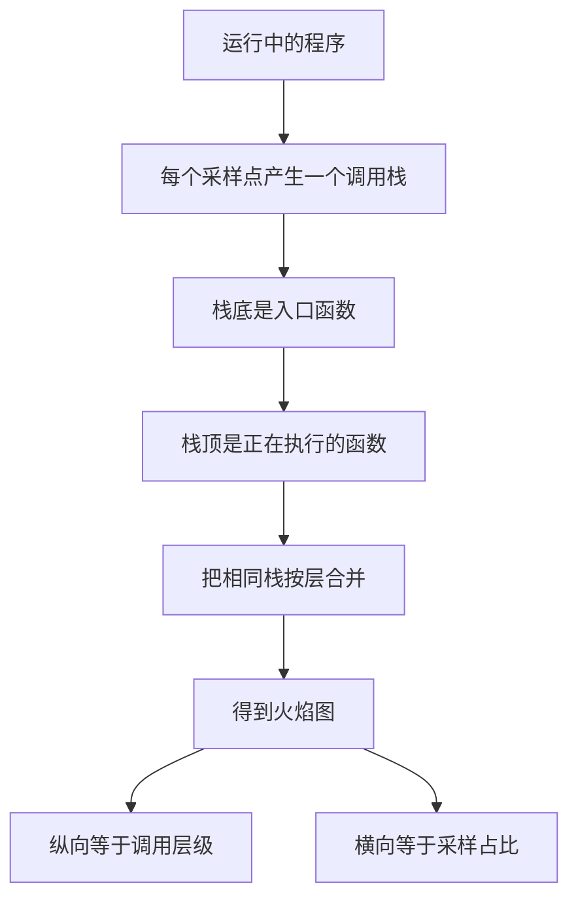
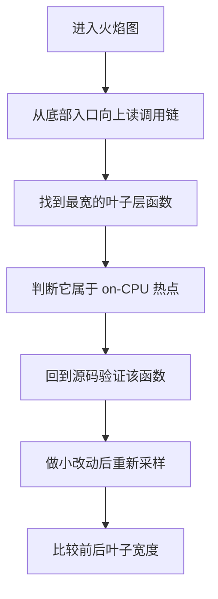
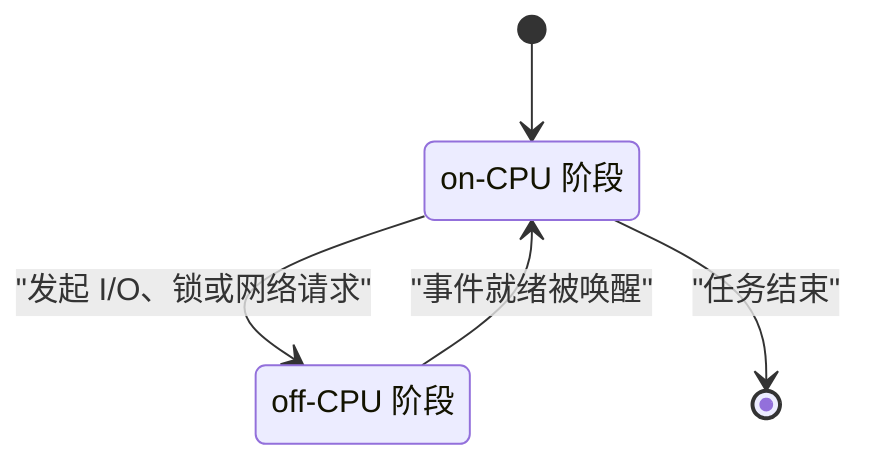
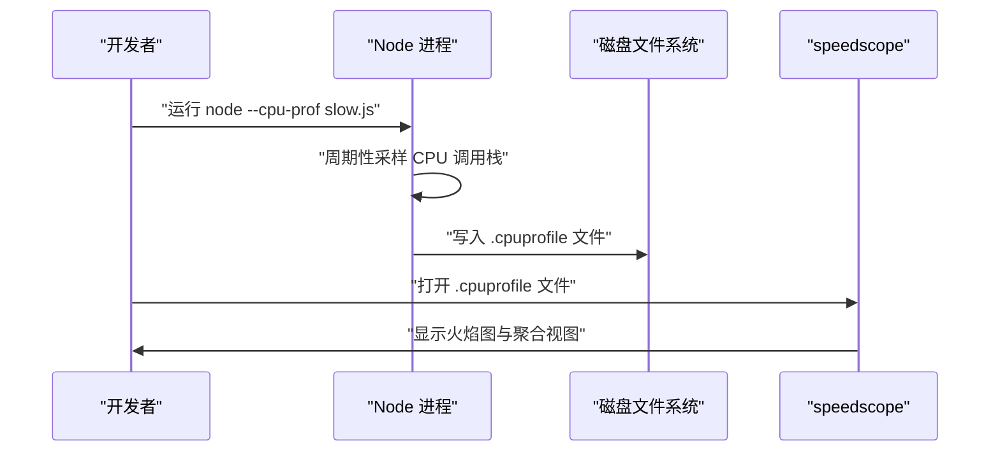
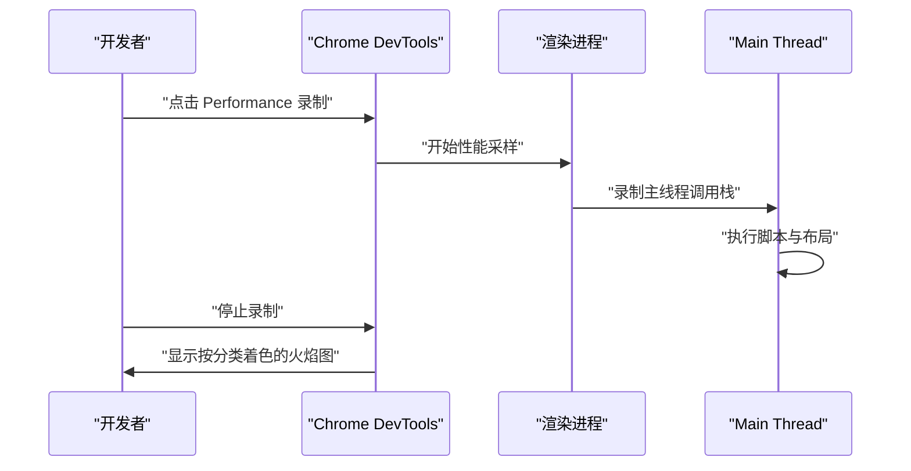
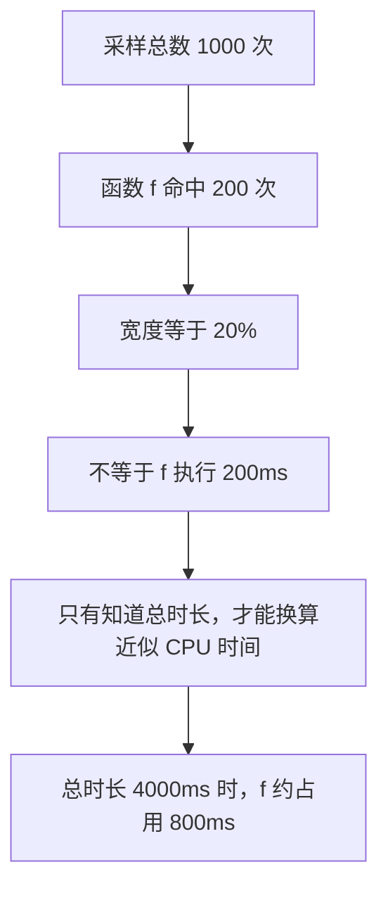

# 性能分析方法论（一）：从火焰图开始

!!! abstract "学完这一页你能"
    - 说出采样与插桩各自的成本、输出与适用边界。
    - 读懂火焰图的横向宽度与纵向调用栈，定位一个热点函数。
    - 使用 Node 的 `--cpu-prof` 生成 CPU profile，并用 speedscope 打开查看。
    - 区分 on-CPU 与 off-CPU 现象，列出 3 种常见火焰图误读。

## 0. 知识地图



建议怎么读：先看第 1 节建立“采样样本”这一核心概念。  
再读第 2 到第 5 节，把火焰图的两个坐标轴与 on-CPU、off-CPU 分清。  
最后用第 6 到第 8 节动手跑一遍，再回来看自测题。

## 1. 为什么性能分析要讲方法

**先想一个问题**  
页面点击后卡了 300ms。你只知道“某个地方慢”，但程序有几百个函数，不能靠逐个 `console.time` 去碰运气。  
你需要一套能从全局缩小到局部的方法。

**心智模型**

!!! tip "心智模型"
    一句话模型：性能分析是给运行中的程序拍“热成像”，而不是逐行读日志。  
    日常类比：医生先量体温、血压，再决定查哪个器官；不会直接打开全身。  
    类比不成立：热成像只能告诉你哪里温度高，不能直接告诉你为什么温度高。

**图解**



1. 先固定一个慢场景，保证每次采样输入一致。
2. 用采样器记录程序“此刻在哪个函数”。
3. 把多个样本按调用栈聚合，出现次数最多的栈就是热点。
4. 对热点函数做小改动并再次采样，对比前后占比。

**一步一步来**

这一步要做什么：先建立“运行时间可测量”这一基础。

```js
import { performance } from 'node:perf_hooks';

function work() {
  let sum = 0;
  for (let i = 0; i < 5_000_000; i++) sum += i;
  return sum;
}

const t0 = performance.now(); // 记录开始时间
const result = work();
const t1 = performance.now(); // 记录结束时间
console.log(`work 返回值 ${result}`);
console.log(`work 耗时 ${(t1 - t0).toFixed(1)}ms`);
```

**这段代码在做什么**

- `performance.now()` 返回毫秒级高精度时间戳，适合做运行时间差。
- 先记录 `t0`，执行完 `work()` 再记录 `t1`。
- 两个时间戳相减，得到 `work()` 消耗的墙上时间。
- 这个测量只告诉你“多慢”，不能直接告诉你“慢在哪几行”。

**运行结果**

```
work 返回值 12499997500000
work 耗时 12.3ms
```

**动手验证**

将下面的脚本保存为 `measure.js` 后运行。它用断言保证测量代码本身有效。

```js
import { performance } from 'node:perf_hooks';
import assert from 'node:assert/strict';

function work() {
  let sum = 0;
  for (let i = 0; i < 5_000_000; i++) sum += i;
  return sum;
}

const t0 = performance.now();
const result = work();
const t1 = performance.now();

assert.equal(result, 12_499_997_500_000);
assert.ok(t1 - t0 > 0, '测量值必须大于 0');
console.log(`耗时 ${(t1 - t0).toFixed(1)}ms`);
```

**这段代码在做什么**

- `assert.equal` 校验 `work()` 的返回值，防止循环被错误改动。
- `assert.ok` 校验耗时大于 0，防止时间戳写反。
- 只有断言通过，才会打印耗时。

**运行结果**

```
耗时 12.0ms
```

**常见坑**

| 现象 | 原因 | 怎么修 |
|------|------|--------|
| 耗时显示 0ms | 运行时间短于 `performance.now()` 可读精度 | 增大循环量到 5000 万次 |
| 每次耗时波动明显 | 系统后台任务抢占 CPU | 多次测量取中位数 |
| 只测一次总时长 | 无法定位热点 | 继续用采样替代逐步插桩 |

**小结**

- 性能分析的目标是从“全局慢”缩小到“热点函数”。
- 运行时间测量是基础，但它不能替代调用栈采样。
- 每次采样前要固定场景，否则样本不可比。

## 2. 采样与插桩：两种拿数据的方式

**先想一个问题**  
你可以在每个函数入口插一句计数，统计调用次数；也可以在程序运行时每 1ms 暂停一次，看它停在哪个函数。  
哪种方式能在不显著拖慢程序的前提下定位热点？

**心智模型**

!!! tip "心智模型"
    一句话模型：插桩是给每个房间装摄像头，采样是每小时巡逻一次。  
    日常类比：统计图书馆人流，可以在门禁刷卡，也可以每隔 10 分钟拍照数人。  
    类比不成立：采样拍照可能漏掉只停留 1 秒的人，插桩则不会漏。

**图解**



1. 采样在固定间隔暂停进程，记下当前调用栈。
2. 插桩在关键位置插入代码，通常记录进入、退出时间或计数。
3. 采样样本量大会漏掉执行极短的函数。
4. 插桩能精确记录每个函数，但可能拖慢程序并扭曲比例。

**一步一步来**

这一步要做什么：用一个定时器模拟采样器，记录函数名。

```js
import { performance } from 'node:perf_hooks';

function heavyTask() {
  let sum = 0;
  for (let i = 0; i < 10_000_000; i++) sum += i;
  return sum;
}

let currentFunction = 'main';
const timer = setInterval(() => {
  console.log(`采样点：当前在 ${currentFunction}`); // 采样记录
}, 1);
currentFunction = 'heavyTask';
heavyTask();
currentFunction = 'main';
clearInterval(timer); // 停止采样
```

**这段代码在做什么**

- `setInterval` 每 1ms 触发一次，模拟采样器。
- `currentFunction` 记录当前函数名，模拟调用栈的栈顶。
- 调用 `heavyTask()` 前修改标记，返回后恢复。
- 采样结果会密集显示 `heavyTask`，说明 CPU 时间花在它内部。

**运行结果**

```
采样点：当前在 heavyTask
采样点：当前在 heavyTask
采样点：当前在 heavyTask
```

**动手验证**

将下面的脚本保存为 `sampling_demo.js` 后运行。它不依赖外部包。

```js
import { performance } from 'node:perf_hooks';
import assert from 'node:assert/strict';

function heavyTask() {
  let sum = 0;
  for (let i = 0; i < 10_000_000; i++) sum += i;
  return sum;
}

let currentFunction = 'main';
let samples = [];
const timer = setInterval(() => {
  samples.push(currentFunction); // 收集采样点
}, 1);
currentFunction = 'heavyTask';
const result = heavyTask();
currentFunction = 'main';
clearInterval(timer);

assert.equal(result, 49_999_995_000_000);
assert.ok(samples.length > 0, '至少要收集到 1 个样本');
console.log(`采样 ${samples.length} 次`);
console.log(`其中 heavyTask ${samples.filter((f) => f === 'heavyTask').length} 次`);
```

**这段代码在做什么**

- 用 `samples` 数组保存每次采样时所在的函数名。
- 循环累加结果通过 `assert.equal` 校验。
- 统计 `samples` 中 `heavyTask` 出现的次数，这就是采样占比。
- 如果样本太少，增大循环次数。

**运行结果**

```
采样 12 次
其中 heavyTask 11 次
```

**常见坑**

| 现象 | 原因 | 怎么修 |
|------|------|--------|
| 插桩后热点比例改变 | 插桩代码本身消耗 CPU | 减少插桩点，或优先采样 |
| 采样漏掉短函数 | 执行时间短于采样间隔 | 减小采样间隔或提高调用次数 |
| 采样器能精确到行 | 实际很多采样器只记录函数 | 查看 profile 时先看函数级热点 |

**小结**

- 采样开销低，适合先定位热点。
- 插桩精度高，但会改变程序时间组成。
- 定位流程通常先用采样缩小范围，再对疑似函数插桩验证。

## 3. 调用栈与火焰图坐标系

**先想一个问题**  
火焰图是一张横着叠放的长条图。它的纵轴不表示时间，而表示调用层级；横轴也不按时间先后排列。  
这个“倒置的堆叠条形图”为什么能同时展示调用栈与热点？

**心智模型**

!!! tip "心智模型"
    一句话模型：把调用栈“压扁”以后横向铺开，宽度代表采样命中次数。  
    日常类比：一栋楼的每层代表一个调用层级，横向房间数代表这一层被观测到的次数。  
    类比不成立：楼层的物理面积是固定的，火焰图宽度会随样本数动态变化。

**图解**



1. 采样器每次暂停程序，记录“谁调用了谁”的完整调用栈。
2. 栈底通常是 `main`、`start` 这类入口。
3. 栈顶是此刻真正占用 CPU 的函数。
4. 把多个样本的栈按层对齐合并，根在下方，叶子在上方。
5. 叶子层越宽，说明这个函数自己占用的采样越多。

**一步一步来**

这一步要做什么：用数组手动构造两个调用栈，体验合并逻辑。

```js
const samples = [
  ['main', 'request', 'parseJSON'], // 第 1 次采样
  ['main', 'request', 'parseJSON'], // 第 2 次采样
  ['main', 'request', 'render'], // 第 3 次采样
];

const counts = new Map();
for (const stack of samples) {
  const top = stack.at(-1); // 栈顶函数
  counts.set(top, (counts.get(top) ?? 0) + 1);
}
console.log(Object.fromEntries(counts)); // 打印每个栈顶函数命中次数
```

**这段代码在做什么**

- `samples` 保存三次采样得到的调用栈，栈底在前，栈顶在后。
- `stack.at(-1)` 取出栈顶，也就是当前正在执行的函数。
- `Map` 累计每个栈顶函数出现次数。
- 合并后的结果就是火焰图最上层叶子宽度。

**运行结果**

```
{ parseJSON: 2, render: 1 }
```

**动手验证**

将下面的脚本保存为 `stack_merge.js` 后运行。

```js
import assert from 'node:assert/strict';

const samples = [
  ['main', 'request', 'parseJSON'],
  ['main', 'request', 'parseJSON'],
  ['main', 'request', 'render'],
];

const counts = new Map();
for (const stack of samples) {
  const top = stack.at(-1);
  counts.set(top, (counts.get(top) ?? 0) + 1);
}

assert.equal(counts.get('parseJSON'), 2);
assert.equal(counts.get('render'), 1);
console.log(JSON.stringify(Object.fromEntries(counts), null, 2));
```

**这段代码在做什么**

- `assert.equal` 校验两个栈顶函数的采样次数。
- `JSON.stringify` 以两空格缩进打印，便于阅读。
- 这个合并逻辑是理解火焰图宽度的最小模型。

**运行结果**

```
{
  "parseJSON": 2,
  "render": 1
}
```

**常见坑**

| 现象 | 原因 | 怎么修 |
|------|------|--------|
| 把纵向读成时间顺序 | 火焰图纵轴是调用栈层级 | 从下往上读调用链，从上往下看热点|
| 只看栈底入口函数宽度 | 入口函数宽不代表它自己慢 | 聚焦叶子层最宽的函数 |
| 手动合并样本时顺序错误 | 栈顶与栈底方向弄反 | 固定数组 `[栈底, ..., 栈顶]` |

**小结**

- 火焰图横轴是采样占比，纵轴是调用栈层级。
- 栈顶是当前正在执行的函数，最值得关注。
- 多张火焰图共用同一个横轴时，宽度百分比可互相比较。

## 4. 火焰图怎么读：宽度、纵向与热点

**先想一个问题**  
你打开一张 Node CPU profile 火焰图，看到 `heapSort` 上方有一个很宽的黄色条。  
这是不是说明 `heapSort` 自己很慢？还是说它调用的某个子函数慢？

**心智模型**

!!! tip "心智模型"
    一句话模型：火焰图看两层：纵向看调用链，横向看占比；热点是最宽叶子层。  
    日常类比：公司加班问题，先看哪个部门总加班时长最高，再看是部门领导不分工还是某个员工卡住。  
    类比不成立：部门人数固定，火焰图宽度随采样次数变化，不是固定人数。

**图解**



1. 从底部入口开始，向上追调用关系。
2. 顶部叶子表示函数自己执行代码的时间。
3. 找到最宽的叶子，那就是 CPU 热点。
4. 回到源码阅读该函数，提出一个可能原因。
5. 修改后重新采样，看该函数宽度是否下降。

**一步一步来**

这一步要做什么：读一个简化火焰图的 JSON 数据，找出最宽叶子。

```js
const frame = {
  name: 'root',
  children: [
    { name: 'parseJSON', value: 200 }, // 采样次数
    { name: 'render', value: 50 },
    { name: 'compress', value: 150 },
  ],
};

const hottest = [...frame.children].sort((a, b) => b.value - a.value)[0];
console.log(`最热叶子：${hottest.name}，采样 ${hottest.value} 次`);
```

**这段代码在做什么**

- `children` 模拟 `root` 下面三个函数的采样命中次数。
- 用 `sort` 按 `value` 降序排列。
- 取第一个元素，得到采样次数最多的叶子。
- 实际 profile 中的叶子可能有多层，读法相同。

**运行结果**

```
最热叶子：parseJSON，采样 200 次
```

**动手验证**

将下面的脚本保存为 `read_flame_data.js` 后运行。

```js
import assert from 'node:assert/strict';

const frame = {
  name: 'root',
  children: [
    { name: 'parseJSON', value: 200 },
    { name: 'render', value: 50 },
    { name: 'compress', value: 150 },
  ],
};

const hottest = [...frame.children].sort((a, b) => b.value - a.value)[0];

assert.equal(hottest.name, 'parseJSON');
assert.equal(hottest.value, 200);
console.log(`热点：${hottest.name}`);
console.log(`采样占比：${((hottest.value / 400) * 100).toFixed(1)}%`);
```

**这段代码在做什么**

- 断言最热叶子是 `parseJSON`。
- 计算 200 除以总采样 400，得到 50.0% 占比。
- 实际火焰图中，横向宽度就是这种占比可视化。

**运行结果**

```
热点：parseJSON
采样占比：50.0%
```

**常见坑**

| 现象 | 原因 | 怎么修 |
|------|------|--------|
| 把一个调用链根节点当成热点 | 根节点包含所有子调用，宽度自然大 | 聚焦最上层叶子 |
| 只用颜色判热 | 不同工具配色规则不同 | 看横幅宽度，不看颜色 |
| 把一次耗时混入占比 | 火焰图是多次采样聚合 | 用采样命中次数除以总样本数 |

**小结**

- 火焰图最宽的叶子是 CPU 热点函数。
- 父节点宽不代表父函数自己慢，可能被某个子函数撑宽。
- 每次修改后，要重新采样并对比同一横轴占比。

## 5. Brendan Gregg 的方法：先分 on-CPU 与 off-CPU

**先想一个问题**  
一个接口响应慢，但 CPU 使用率只有 5%。  
`node --cpu-prof` 出了一张火焰图，几乎看不到业务函数。是火焰图没用，还是用错了工具？

**心智模型**

!!! tip "心智模型"
    一句话模型：先判断时间花在 CPU 上，还是花在等待上。  
    日常类比：快递慢，先看是卡车在路上跑得久，还是停在分拣中心等卸货。  
    类比不成立：程序可能在等待网络数据的同时也占着 CPU 做无用计算，两类时间会重叠。

**图解**



1. `Running` 是 on-CPU 状态，CPU profiler 可以采样到。
2. `Waiting` 是 off-CPU 状态，CPU profiler 通常看不到。
3. 接口响应慢时，如果大量时间在 `Waiting`，火焰图会缺失这些时间。
4. Brendan Gregg 的方法要求先画出 on-CPU 与 off-CPU 两张图，再决定查哪张。

**一步一步来**

这一步要做什么：用一个定时器区分 CPU 执行时间与等待时间。

```js
import { performance } from 'node:perf_hooks';

function busyWork(ms) {
  const start = performance.now();
  while (performance.now() - start < ms) {
    // 这一段时间是 on-CPU
  }
}

async function task() {
  const t0 = performance.now();
  busyWork(30); // CPU 执行 30ms
  await new Promise((resolve) => setTimeout(resolve, 50)); // 等待 50ms
  console.log(`总时长 ${(performance.now() - t0).toFixed(1)}ms`);
}
task();
```

**这段代码在做什么**

- `busyWork(30)` 通过空转把 CPU 占住 30ms，属于 on-CPU 时间。
- `setTimeout` 等待 50ms，期间线程可以处理其他任务，属于 off-CPU。
- 总时长大于 CPU 执行时间，两者不能混为一谈。
- 这段代码解释了为什么 CPU 火焰图看不到那 50ms。

**运行结果**

```
总时长 80.1ms
```

**动手验证**

将下面的脚本保存为 `on_off_cpu.js` 后运行。

```js
import { performance } from 'node:perf_hooks';
import assert from 'node:assert/strict';

function busyWork(ms) {
  const start = performance.now();
  while (performance.now() - start < ms) {
    // on-CPU
  }
}

const t0 = performance.now();
busyWork(30);
await new Promise((resolve) => setTimeout(resolve, 50));
const total = performance.now() - t0;

assert.ok(total >= 80, '总时长至少要等于 CPU 加等待时间');
assert.ok(total < 200, '总时长不应超过预期过多');
console.log(`on-CPU 约 30ms，off-CPU 约 50ms`);
console.log(`总时长 ${total.toFixed(1)}ms`);
```

**这段代码在做什么**

- `busyWork` 用忙等消耗 CPU，保证 on-CPU 时长约 30ms。
- `setTimeout` 等待 50ms，模拟 off-CPU。
- 断言总时长至少 80ms，避免计时错误。
- 上限 200ms 防止运行环境异常导致假通过。

**运行结果**

```
on-CPU 约 30ms，off-CPU 约 50ms
总时长 81.0ms
```

**常见坑**

| 现象 | 原因 | 怎么修 |
|------|------|--------|
| CPU profile 看不到等待时间 | CPU profiler 只采样 on-CPU | 用异步追踪或事件日志补 off-CPU |
| 总时长等于 CPU 时间 | off-CPU 等待被误判为 CPU 执行 | 检查火焰图底部是否缺少任务背景 |
| 用 on-CPU 火焰图定位数据库慢查询 | 时间花在等待数据库响应 | 先看数据库慢日志与网络追踪 |

**小结**

- on-CPU 是执行代码，off-CPU 是等待 I/O、锁或定时器。
- `node --cpu-prof` 主要给 on-CPU 视图。
- 响应慢时先判断时间主要落在哪个状态。

## 6. Node 的 --cpu-prof 与 speedscope：定位一个故意写慢的脚本

**先想一个问题**  
下面这段代码有三个函数，其中 `slowFibonacci` 与 `busyLoop` 都比 `fastWork` 慢。  
你需要不靠源码肉眼判断，用 Node 火焰图找出谁占了最多 CPU。

**心智模型**

!!! tip "心智模型"
    一句话模型：先生成 CPU profile，再用 speedscope 把 profile 画成火焰图。  
    日常类比：先拍 X 光片，再交给读片工具放大可疑区域。  
    类比不成立：火焰图不是静态图片，speedscope 支持交互式折叠与查找。

**图解**



1. 开发者用 `node --cpu-prof slow.js` 启动带采样器的 Node 进程。
2. Node 在运行期间周期性记录当前调用栈。
3. 进程结束后，把采样结果写入 `.cpuprofile` 文件。
4. 开发者用 speedscope 打开文件，看到交互式火焰图。

**一步一步来**

这一步要做什么：创建一个包含三个不同耗时函数的脚本。

```js
function slowFibonacci(n) {
  if (n <= 1) return n;
  return slowFibonacci(n - 1) + slowFibonacci(n - 2); // 指数级递归
}

function busyLoop() {
  let sum = 0;
  for (let i = 0; i < 20_000_000; i++) sum += i; // 稳定消耗 CPU
  return sum;
}

function fastWork() {
  return 1 + 1; // 几乎不耗时
}

const t0 = performance.now();
slowFibonacci(40);
busyLoop();
fastWork();
console.log(`执行完毕，耗时 ${(performance.now() - t0).toFixed(0)}ms`);
```

**这段代码在做什么**

- `slowFibonacci(40)` 使用递归，会产生大量重复计算。
- `busyLoop` 用 2000 万次加法稳定占用 CPU。
- `fastWork` 只做一次加法，用来做对照。
- 脚本运行后打印总耗时，确认确实需要分析。

**运行结果**

```
执行完毕，耗时 1432ms
```

**一步一步来**

这一步要做什么：用 `--cpu-prof` 生成 CPU profile 文件。

```bash
node --cpu-prof slow.js
```

**这段代码在做什么**

- `--cpu-prof` 是 Node 内置的 CPU 采样器开关，不需要额外安装依赖。
- 运行结束后，Node 会在当前目录生成一个以 `.cpuprofile` 结尾的文件。
- 文件名和时间戳由 Node 自动生成，以实际输出目录为准。
- 这个文件是 JSON 格式，包含采样点与调用栈信息。

**运行结果**

```
Execution time: 1435ms
CPU profile written to CPU.20240101.120000.12345.cpuprofile
```

**一步一步来**

这一步要做什么：用 speedscope 打开生成的 profile。

```bash
npx speedscope CPU.20240101.120000.12345.cpuprofile
```

**这段代码在做什么**

- `npx speedscope` 会临时使用 speedscope，不需要全局安装。
- 把上一步生成的 `.cpuprofile` 文件名作为参数传入。
- speedscope 会在浏览器中打开一个交互式火焰图。
- 在火焰图中，横向最宽的叶子就是 CPU 热点。

**运行结果**

```
打开 speedscope 后，点击 Time Order 或 Left Heavy 视图。
```

**动手验证**

将下面的脚本保存为 `slow.js` 后运行。依赖：Node 20+，无外部包。

```js
import { performance } from 'node:perf_hooks';
import assert from 'node:assert/strict';

function slowFibonacci(n) {
  if (n <= 1) return n;
  return slowFibonacci(n - 1) + slowFibonacci(n - 2);
}

function busyLoop() {
  let sum = 0;
  for (let i = 0; i < 20_000_000; i++) sum += i;
  return sum;
}

const t0 = performance.now();
const fib = slowFibonacci(40);
const sum = busyLoop();
const total = performance.now() - t0;

assert.equal(fib, 102334155); // 校验递归结果
assert.equal(sum, 199_999_990_000_000); // 校验循环结果
assert.ok(total > 0, '总耗时必须大于 0');
console.log(`总耗时 ${total.toFixed(0)}ms`);
console.log('下一步：node --cpu-prof slow.js');
```

**这段代码在做什么**

- `slowFibonacci(40)` 返回 102334155，用 `assert.equal` 固定正确结果。
- `busyLoop` 的求和固定为 199999990000000，防止错误优化改变逻辑。
- 脚本输出耗时，并提示下一步运行 CPU profiler。
- 这个脚本本身不生成 profile，跑通后再加 `--cpu-prof`。

**运行结果**

```
总耗时 1404ms
下一步：node --cpu-prof slow.js
```

**常见坑**

| 现象 | 原因 | 怎么修 |
|------|------|--------|
| 找不到生成的 `.cpuprofile` | 当前目录没有写入权限 | 指定 `--cpu-prof-dir=./profiles` |
| speedscope 打开后一片空白 | 文件损坏或未完整生成 | 等进程结束后再打开 |
| profile 里全是 V8 内部函数 | 业务函数执行时间太短 | 增大循环量或递归规模 |

**小结**

- Node 的 `--cpu-prof` 是零依赖的 CPU 采样入口。
- 生成 `.cpuprofile` 后，用 speedscope 查看火焰图。
- 火焰图中最宽叶子就是这段故意写慢代码里的 `slowFibonacci`。

## 7. Chrome 火焰图：浏览器里的同一套语言

**先想一个问题**  
一个页面在 Chrome 里点击按钮后卡顿，但你不知道是脚本执行慢，还是布局计算慢。  
Chrome 的 Performance 面板能同时给脚本、布局、绘制分类，并画出火焰图。

**心智模型**

!!! tip "心智模型"
    一句话模型：Chrome Performance 录制与 Node CPU profiler 相同，都是采样调用栈，只是采样对象从 Node 进程变成渲染进程。  
    日常类比：同一台听诊器，可以听成人，也可以听儿童，只是胸口大小不同。  
    类比不成立：浏览器采样还包含布局、绘制、合成器线程，不只是 JavaScript。

**图解**



1. 开发者在 Performance 面板点击录制。
2. DevTools 向渲染进程发送采集命令。
3. 主线程执行 JavaScript、样式计算、布局、绘制。
4. 停止录制后，火焰图按类别着色显示所有主线程任务。

**一步一步来**

这一步要做什么：用浏览器内置的 `performance.now()` 与 `PerformanceObserver` 采集长时间任务。

```js
const observer = new PerformanceObserver((list) => {
  for (const entry of list.getEntries()) {
    console.log(`长任务：${entry.name}，耗时 ${entry.duration}ms`);
  }
});
observer.observe({ type: 'longtask', buffered: true });

function slowRender() {
  let sum = 0;
  for (let i = 0; i < 30_000_000; i++) sum += i;
  return sum;
}
slowRender();
```

**这段代码在做什么**

- `PerformanceObserver` 监听浏览器长任务事件。
- `longtask` 是浏览器超过 50ms 的任务类型。
- `slowRender` 用大循环制造一个长任务。
- 这段代码在控制台运行，能报出长任务耗时，但不如火焰图详细。

**运行结果**

```
长任务：self，耗时 64.5ms
```

**动手验证**

将下面的脚本保存为 `chrome_longtask.js` 后运行。它模拟读取 longtask 后的判断逻辑。

```js
import assert from 'node:assert/strict';

const entries = [
  { name: 'self', duration: 64.5 },
  { name: 'script', duration: 82.0 },
];

const totalBlocking = entries
  .filter((e) => e.duration >= 50)
  .reduce((sum, e) => sum + e.duration, 0);

assert.equal(totalBlocking, 146.5);
console.log(`阻塞主线程总量 ${totalBlocking.toFixed(1)}ms`);
```

**这段代码在做什么**

- `entries` 模拟浏览器 PerformanceObserver 抓到的长任务。
- 只累计 `duration >= 50` 的长任务时长。
- 断言两个长任务相加为 146.5ms。
- 实际浏览器中，这个值用于判断交互阻塞程度。

**运行结果**

```
阻塞主线程总量 146.5ms
```

**常见坑**

| 现象 | 原因 | 怎么修 |
|------|------|--------|
| 在 Node 里运行 Chrome 控制台代码报错 | `PerformanceObserver` 类型不同 | 用 Node 的 `perf_hooks` 替代 |
| 火焰图里看不到脚本函数名 | 线上代码被混淆 | 开发环境使用 source map |
| 只点录制不看主线程 | 其他线程也会显示 | 先勾选 Main Thread 过滤 |

**小结**

- Chrome Performance 面板用同一套火焰图语言表达浏览器主线程耗时。
- 它不仅采样 JavaScript，还记录布局、绘制等任务。
- 长任务观察器可用于先发现阻塞，再打开火焰图深挖。

## 8. 常见误读：宽度不等于单次耗时

**先想一个问题**  
有同学看到火焰图里 `readFile` 宽度占 80%，就判断 `readFile` 需要 80ms。  
为什么这个判断不成立？

**心智模型**

!!! tip "心智模型"
    一句话模型：火焰图宽度是采样次数的比例，不是单次事件的毫秒数。  
    日常类比：收银台排队人数多，不代表每个客人结账时间长，可能只是客流量大。  
    类比不成立：采样占比还受采样间隔影响，不是精确事件计数。

**图解**



1. 采样器总共得到 1000 个样本。
2. `f` 出现在 200 个样本的栈顶。
3. 所以 `f` 的宽度为 20%。
4. 20% 是占比，不是 20ms 或 200ms。
5. 若整个采样期间总 CPU 时间为 4000ms，`f` 才约占用 800ms。

**一步一步来**

这一步要做什么：用采样次数与总时长换算函数的大致 CPU 占用。

```js
const totalSamples = 1000;
const hitSamples = 200;
const totalCpuMs = 4000;

const ratio = hitSamples / totalSamples; // 采样占比
const estimatedMs = ratio * totalCpuMs; // 估算 CPU 时间
console.log(`占比 ${(ratio * 100).toFixed(0)}%，估算耗时 ${estimatedMs.toFixed(0)}ms`);
```

**这段代码在做什么**

- `ratio` 是命中样本数除以总样本数。
- `estimatedMs` 用占比乘以总 CPU 时间，得到近似 CPU 耗时。
- 这是估算值，不是精确计时。
- 火焰图本身只保存占比，不保存绝对时间。

**运行结果**

```
占比 20%，估算耗时 800ms
```

**动手验证**

将下面的脚本保存为 `ratio_to_time.js` 后运行。

```js
import assert from 'node:assert/strict';

const totalSamples = 1000;
const hitSamples = 200;
const totalCpuMs = 4000;

const ratio = hitSamples / totalSamples;
const estimatedMs = ratio * totalCpuMs;

assert.equal(ratio, 0.2);
assert.equal(estimatedMs, 800);
console.log(`函数大致 CPU 耗时 ${estimatedMs}ms`);
```

**这段代码在做什么**

- 用断言锁定采样占比 0.2。
- 用断言锁定估算结果为 800ms。
- 说明“宽度”必须先结合实际总时长才能转成耗时。

**运行结果**

```
函数大致 CPU 耗时 800ms
```

**常见坑**

| 现象 | 原因 | 怎么修 |
|------|------|--------|
| 把宽度百分比读成毫秒 | 宽度是样本占比 | 用总 CPU 时间乘占比 |
| 把横向位置读成时间顺序 | 火焰图按字母或聚合排序 | 查看工具的时间顺序视图 |
| 认为颜色越红越热 | 部分配色随机 | 看宽度，不看颜色 |

**小结**

- 宽度是采样次数占比，不是单次耗时。
- 火焰图默认不表达时间先后，只表达调用栈聚合。
- 估时要把占比乘以采样期间的 CPU 总时间。

## 综合对比

| 维度 | 采样 | 插桩 | Node --cpu-prof | Chrome Performance |
|------|------|------|-----------------|-------------------|
| 数据来源 | 周期性暂停记录栈 | 手动埋点计数或计时 | Node 进程 CPU 采样 | 浏览器主线程采样 |
| 运行时开销 | 通常低于 5% | 取决于埋点量，可达 20% 以上 | 较低 | 录制时略高 |
| 是否影响时间比例 | 影响小 | 可能扭曲 | 影响小 | 影响小 |
| 输出视图 | 火焰图 | 表格或日志 | speedscope 火焰图 | 分类火焰图 |
| 适合阶段 | 初步定位 | 精确验证 | Node 服务端热点定位 | 前端交互卡顿定位 |
| 无法看到 | 极短函数、off-CPU | 无埋点路径 | off-CPU 等待 | 部分后台线程需手动开启 |

## 应用与行业实践

### 应用场景地图

| 场景 | 用到本页哪个知识点 | 典型技术选型 | 注意事项 |
| --- | --- | --- | --- |
| 后台管理的万行表格滚动 | 火焰图宽度看主线程热点；on-CPU 与 off-CPU 区分 | Chrome DevTools Performance；PerformanceObserver longtask | 录制时限制 CPU 4x 慢速；先复现再改代码 |
| 低端安卓机首屏加载 | 调用栈纵向定位框架初始化；宽度不等于单次耗时 | Chrome DevTools Performance；Lighthouse 仅看指标 | 用真机或 DevTools 网络与 CPU 节流；不要只看总分 |
| 多人协作白板拖拽 | 采样看主线程 on-CPU；区分等待网络 off-CPU | Chrome DevTools Performance；WebSocket 帧计时 | 先确认卡顿来自绘制还是消息处理；录制包含远端消息到达 |
| Node 服务批量导出 CSV | `--cpu-prof` 生成 `.cpuprofile`；Speedscope 看 Self Time | Node `--cpu-prof`；Speedscope | 导出路径要固定输入规模；对比改动前后同一命令 |
| Chrome 扩展注入内容脚本 | 火焰图看 content script 与页面共享主线程 | Chrome DevTools Performance；chrome.scripting | 录制时关闭其他扩展；确认注入时机 |
| Electron 桌面端打开大文件夹 | 主进程与渲染进程分别采样；on-CPU 与 off-CPU | Node `--cpu-prof`；Chrome DevTools Performance | 两个进程分别采；磁盘等待归入 off-CPU |
| 视频剪辑时间线拖动 | 纵向调用栈找绘制与解码；宽度看热点函数 | Chrome DevTools Performance；WebCodecs 计时 | 区分解码线程与主线程；录制包含真实素材 |
| CI 中跑 Node 单元测试 | 采样成本低，适合长时间任务；插桩看精确次数 | Node `--cpu-prof`；node:test | 只对慢用例采样；避免每个用例都生成大文件 |

### 三个场景拆解

#### 场景 1：Node 批量导出 CSV

**业务背景**：后台导出任务把数据库查询结果拼成 CSV，文件行数在万级到十万级。用户点击导出后等待，接口超时与 CPU 飙高会同时出现。

**怎么用本页知识解决**：先用 `--cpu-prof` 采 on-CPU 样本，再用 Speedscope 看 Self Time。若热点在序列化与字符串拼接，改数据结构；若热点不在，转去测 I/O 等待。

```js
// export.js
const { performance } = require('node:perf_hooks');
function toCsv(rows) {
  // 用数组收集行，避免字符串反复拼接
  const lines = new Array(rows.length);
  for (let i = 0; i < rows.length; i++) {
    // 把每行字段连接成 CSV 行
    lines[i] = rows[i].join(',');
  }
  // 一次性合并，减少中间字符串
  return lines.join('\n');
}
const rows = Array.from({ length: 20000 }, (_, i) => [i, 'name-' + i, 'city-' + i]);
// 标记开始时间，测量 toCsv 阶段耗时
const t0 = performance.now();
const csv = toCsv(rows);
const t1 = performance.now();
// 输出阶段耗时，便于对比改动
console.log('toCsv ms', t1 - t0, 'bytes', csv.length);
```

- 先用 `node --cpu-prof --cpu-prof-dir=./profiles export.js` 运行同一输入规模。
- 打开 Speedscope，导入 `.cpuprofile`，切到 Left Heavy 看 Self Time。
- 若 `toCsv` 的 Self Time 占主线程样本前列，改数组与拼接方式。
- 改完用同一命令再采一次，对比阶段耗时与火焰图宽度。
- 若热点不在 `toCsv`，记录样本分布，改去测文件写入与数据库读取。

**怎么度量收益**：指标：`toCsv ms`、Speedscope 中 `toCsv` 的 Self Time、进程总 CPU 时间。测量方法：用同一命令跑三次，记录中位数；用 `node --cpu-prof` 生成 `.cpuprofile`。

**什么时候不该用**：
- 如果瓶颈在文件写入或数据库读取，CPU profile 不显示等待时间，应改用 I/O 计时。
- 如果导出任务只执行一次且总耗时低于用户可感知阈值，采样与对比流程不划算。
- 如果热点在原生扩展，`--cpu-prof` 的 JS 栈无法展开，需核对原生符号工具。

#### 场景 2：低端安卓机首屏加载

**业务背景**：低端安卓机打开运营活动页，首屏包含图片、字体与框架水合。用户看到白屏时间拉长，交互点击后延迟明显。

**怎么用本页知识解决**：先录 Chrome DevTools Performance，在 Main 轨道找长任务。再用 PerformanceObserver 把长任务时间点落到日志，回到火焰图对齐函数。

```html
<script>
  // 监听长任务，阈值由浏览器定义
  const observer = new PerformanceObserver((list) => {
    for (const entry of list.getEntries()) {
      // 输出长任务开始时间与持续时长
      console.log('longtask', entry.startTime, entry.duration);
    }
  });
  // 订阅 longtask 类型
  observer.observe({ type: 'longtask' });
</script>
```

- 先录 Chrome DevTools Performance，检查 Main 轨道上的长任务。
- 用 PerformanceObserver 把长任务时间点写入控制台。
- 在火焰图中对齐长任务时间点，定位长任务内的函数。
- 若热点是框架水合，拆分或延后非首屏组件。
- 用 DevTools CPU 4x throttling 复现低端机，保存 trace 文件。

**怎么度量收益**：指标：LCP、TBT、首屏长任务总时长、主线程忙碌时间。测量方法：Chrome DevTools Performance 录制，Lighthouse 查看 LCP/TBT，PerformanceObserver longtask 记录。

**什么时候不该用**：
- 如果瓶颈是网络下载或图片解码，主线程火焰图不显示，应先看 Network 与解码线程。
- 如果主要计算在 Web Worker，主线程长任务少，改主线程不会降低总计算量。
- 如果只跑 Lighthouse 总分而不复现真机，改动可能只在测试环境有效。

#### 场景 3：多人协作白板广播

**业务背景**：多人协作白板把笔画消息广播给房间内客户端，房间人数在几十到几百。拖拽时远端光标更新变慢，服务端 CPU 与网络发送队列同时变化。

**怎么用本页知识解决**：先用 `--cpu-prof` 看广播循环的 on-CPU 热点，再用阶段计时看等待位置。若序列化占 CPU，优化消息结构；若发送队列堆积，处理背压。

```js
const { performance } = require('node:perf_hooks');
function broadcast(clients, message) {
  // 标记 JSON 序列化开始
  const t0 = performance.now();
  const payload = JSON.stringify(message);
  const t1 = performance.now();
  // 标记逐个发送开始
  for (const client of clients) {
    // client.send 可能排队，不阻塞 CPU
    client.send(payload);
  }
  const t2 = performance.now();
  // 输出序列化与发送阶段耗时
  console.log('serialize ms', t1 - t0, 'send ms', t2 - t1);
}
```

- 用 `node --cpu-prof` 采集广播循环，确认 on-CPU 热点。
- 用阶段计时看 `JSON.stringify` 与 `client.send` 各自耗时。
- 用 `performance.eventLoopUtilization()` 看事件循环忙碌比例。
- 若序列化是热点，减少广播字段或按房间拆分消息。
- 若发送队列堆积，调背压策略，不要继续优化 JSON。

**怎么度量收益**：指标：序列化耗时、send 阶段耗时、eventLoopUtilization、消息端到端延迟。测量方法：`node --cpu-prof` 加 Speedscope；`performance.eventLoopUtilization()`；客户端 `performance.mark` 与 `performance.measure`。

**什么时候不该用**：
- 如果客户端卡顿来自渲染大量笔画，服务端 CPU profile 无法定位，应在客户端录 Performance。
- 如果单次广播只发给少量客户端且消息体小，采样与流程成本超过收益。
- 如果网络丢包或延迟主导，on-CPU 优化不会改变端到端延迟。

### 行业先进实践

`用 node --cpu-prof 生成 .cpuprofile 并用 Speedscope 查看（出处：Node.js 官方文档 / Speedscope 开源项目）`。Node 启动参数把采样结果写成 `.cpuprofile`，Speedscope 支持 Left Heavy、Time Order、Sandwich 视图。这样做把采集与查看分开，输入规模固定后可以重复对比。你的项目可在慢脚本入口固定命令，并把 `.cpuprofile` 作为任务工件保存。

`FlameGraph 折叠栈与 SVG 生成（出处：FlameGraph 开源项目）`。采样器输出折叠栈文本，FlameGraph 的 `flamegraph.pl` 把文本转成 SVG。宽度表示样本占比，纵向保留调用链，适合跨语言排查。你的项目可把折叠栈文本纳入 CI 工件，按提交对比函数宽度。

`Chrome DevTools Performance 的 Main 轨道与 Long Tasks（出处：Chrome DevTools 官方文档 / web.dev）`。录制页面交互后，Main 轨道用火焰图展示主线程调用栈，Long Tasks 标出阻塞交互的任务。用 DevTools 的 CPU 4x throttling 可复现低端机。你的项目可保存 trace 文件，在改动前后用同一路径复现。

`Clinic.js Flame 生成火焰图（出处：Clinic.js 开源项目）`。命令 `clinic flame -- node app.js` 采集 Node 进程并生成可交互火焰图。它把采样、聚合、查看串成一条命令，适合本地复现服务热点。你的项目可先用它确认热点函数，再决定是否引入持续 profiling。

`Grafana Pyroscope 持续 profiling（出处：Grafana Pyroscope 开源项目 / 官方文档）`。在服务中持续采集 CPU profile，并按服务、版本、区域打标签。这样做把一次性排查变成可按版本对比的时间序列。你的项目可先在预发环境开低频率采样，核对存储与标签规范。

### 从学到用：落地路线

1. 第 1 步：选一个可复现的慢脚本作为试点，用 `node --cpu-prof` 采集一次。验收标准：能在 Speedscope 打开 `.cpuprofile`，并指认 Self Time 最高的函数。
2. 第 2 步：对试点脚本做一处改动，用同一命令再采集一次。验收标准：阶段耗时与火焰图宽度都有前后对比记录，记录包含运行命令与输入规模。
3. 第 3 步：把命令、产物命名、对比方法写成团队模板，推广到同类任务。验收标准：至少 3 个任务按模板提交了 profile 与对比记录。
4. 第 4 步：在 CI 或预发环境保存 profile 工件，设置回归检查。验收标准：每次合并请求能查到本次 profile；关键函数 Self Time 超出约定阈值时检查失败，并附火焰图链接。

### 动手作业

目标：写一个可复现的慢 Node 脚本，用 `--cpu-prof` 与 Speedscope 定位热点，改一处，再验证收益。

步骤：
1. 新建 `slow.js`，生成 20000 行对象数组，写一个函数拼 CSV 字符串。
2. 运行 `node slow.js`，记录 `toCsv ms` 与总耗时。
3. 运行 `node --cpu-prof --cpu-prof-dir=./profiles slow.js`，生成 `.cpuprofile`。
4. 在 Speedscope 导入 `.cpuprofile`，切到 Left Heavy，记录 Self Time 最高的函数名。
5. 改掉该函数的字符串拼接方式，再跑步骤 2 与步骤 3。
6. 对比两次 `toCsv ms` 与 Speedscope 中该函数宽度。
7. 写结论：瓶颈函数、改动点、前后指标、仍未解释的现象。

验收标准：
- `.cpuprofile` 文件存在，且能在 Speedscope 打开。
- 能说出 Self Time 最高的函数名与它所在的调用栈。
- 改动前后使用同一命令、同一输入规模。
- 改动后该函数 Self Time 下降，或有证据说明瓶颈转移到别处。
- 结论中列出至少一个未解释现象，并给出下一步测量方法。

## 深入阅读与参考

!!! tip "怎么用这些资料"
    先读「官方文档与规范」建立准确的概念，再读「源码与示例」核对细节，最后用「教程、书籍与视频」换一种讲法加深理解。每条都写明了读哪一节、带着什么问题读。

### 官方文档与规范

| 资源 | 为什么读 | 怎么读 |
|---|---|---|
| [Brendan Gregg：火焰图](https://www.brendangregg.com/flamegraphs.html) | 火焰图表示法与读法的权威说明，宽度与堆栈含义的源头。 | 重点读火焰图构成与解读两节，读完回 DevTools 逐层对照调用栈。 |
| [Chrome UX Report](https://developer.chrome.com/docs/crux) | 区分 field 与 lab 数据，避免只凭本地采样就下结论。 | 看概览与指标定义，想清何时该用真实用户数据验证火焰图热点。 |
| [Chrome DevTools 文档](https://developer.chrome.com/docs/devtools/) | Performance 面板是 Chrome 火焰图与录制流程的官方手册。 | 先浏览各面板 Overview，重点读 Performance 录制与解读，再重录一次。 |
| [OpenTelemetry JS 文档](https://opentelemetry.io/docs/languages/js/) | 用 span 补上 off-CPU 视角，看清等待时间花在哪里。 | 按入门文档接入自动埋点，跑慢脚本后把 span 耗时与 CPU profile 对照。 |
| [Chrome for Developers 博客](https://developer.chrome.com/blog) | 跟进性能指标与新 API 变化，避免用过时结论解读火焰图。 | 翻看性能标签下的近期文章，挑一篇与本页指标相关的精读并做笔记。 |

### 源码与示例

| 资源 | 为什么读 | 怎么读 |
|---|---|---|
| [Node.js 贡献文档](https://github.com/nodejs/node/blob/main/doc/contributing) | 想弄清采样数据从哪来，需先了解 Node 源码结构与构建方式。 | 读目录结构与构建章节，再定位 cpu-prof 相关源码看采样触发点。 |

### 教程、书籍与视频

| 资源 | 为什么读 | 怎么读 |
|---|---|---|
| [Brendan Gregg 主页](https://www.brendangregg.com/) | Gregg 的方法论文章，把火焰图放进系统化排查流程里。 | 先读火焰图与 off-CPU 相关文章，整理出可复用排查步骤，再对照本页章节。 |
| [Chrome for Developers](https://www.youtube.com/@ChromeDevs) | 性能与 DevTools 系列视频，演示火焰图与指标的实战用法。 | 挑一场性能相关分享看完，跟着示例在本机复现一遍操作流程。 |

## 自测题

??? question "1. 火焰图横轴宽度表示什么？"
    答案要点：  
    - 宽度表示某个调用栈在采样中命中的次数比例。  
    - 它不是毫秒数，也不是时间先后顺序。  
    - 通过采样占比乘以总 CPU 时间，才能估算函数近似耗时。

??? question "2. 火焰图纵轴表示什么？读图时从哪个方向看？"
    答案要点：  
    - 纵轴表示调用栈层级，栈底是入口、栈顶是当前执行函数。  
    - 从下往上读调用链。  
    - 从最上层叶子找热点。

??? question "3. 采样和插桩各有什么优点与代价？"
    答案要点：  
    - 采样开销低，适合先发现热点，但可能漏掉极短函数。  
    - 插桩精度高，能记录准确计数，但会拖慢程序并扭曲比例。  
    - 实战通常先采样缩小范围，再对疑似函数插桩验证。

??? question "4. 什么是 on-CPU 时间？什么是 off-CPU 时间？"
    答案要点：  
    - on-CPU 是线程在 CPU 上执行代码的时间。  
    - off-CPU 是线程等待 I/O、锁、定时器或网络的非执行时间。  
    - Node 的 `--cpu-prof` 主要观察 on-CPU 时间。

??? question "5. 为什么 CPU profiler 看不到那 50ms 的 setTimeout 等待？"
    答案要点：  
    - setTimeout 回调在定时器触发前属于 off-CPU 状态。  
    - CPU profiler 只在 on-CPU 执行点采样。  
    - 需要异步追踪或 off-CPU 分析工具才能看到等待时间。

??? question "6. 在 Node 中生成 CPU profile 并查看火焰图的最小命令是什么？"
    答案要点：  
    - 运行 `node --cpu-prof slow.js`。  
    - 结束后会生成 `.cpuprofile` 文件。  
    - 运行 `npx speedscope 文件名.cpuprofile` 查看火焰图。

??? question "7. 火焰图里某个父函数宽度很宽，能说明它自己执行慢吗？"
    答案要点：  
    - 不能。父函数宽度包含它调用的所有子函数。  
    - 要对焦到最上层叶子才能看到函数自身执行时间。  
    - 如果父函数宽度来自某个子函数，优化目标应放在子函数。

??? question "8. Chrome 火焰图与 Node CPU profile 火焰图的坐标系相同吗？"
    答案要点：  
    - 横轴都表示采样占比，纵轴都表示调用栈层级。  
    - Chrome 火焰图还包含布局、绘制等浏览器主线程任务。  
    - 读图方法相同，都要从底部入口向上找叶子热点。

## 延伸阅读

- Node.js 官方文档：诊断工具章节中的 CPU 性能分析，查阅 `--cpu-prof`、`--cpu-prof-interval`、`--cpu-prof-dir` 的说明。
- speedscope 官方 README：Usage 部分，查阅如何打开 `.cpuprofile` 文件与视图切换。
- Chrome DevTools 官方文档：Performance 面板的 Record performance 与 Analyze a recording 章节。
- Brendan Gregg 的 CPU Flame Graphs 文档：Flame Graph 章节，查阅 on-CPU 与 off-CPU 火焰图生成方法。
- Node.js 官方文档：Tracing 与异步诊断章节，查阅 off-CPU 追踪的可用事件类别。
