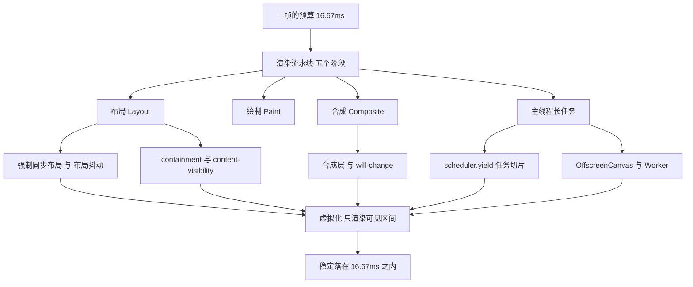
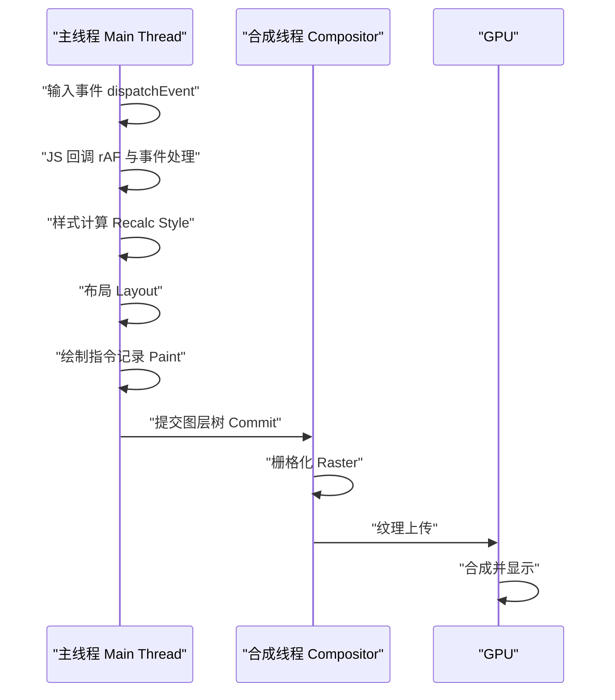
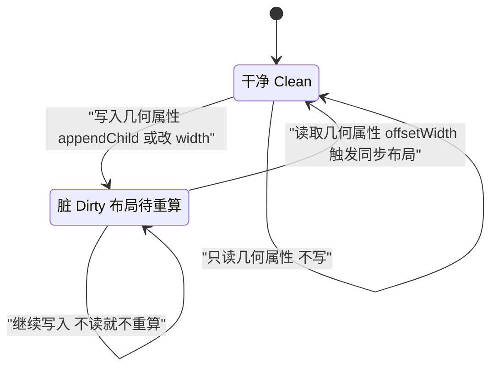
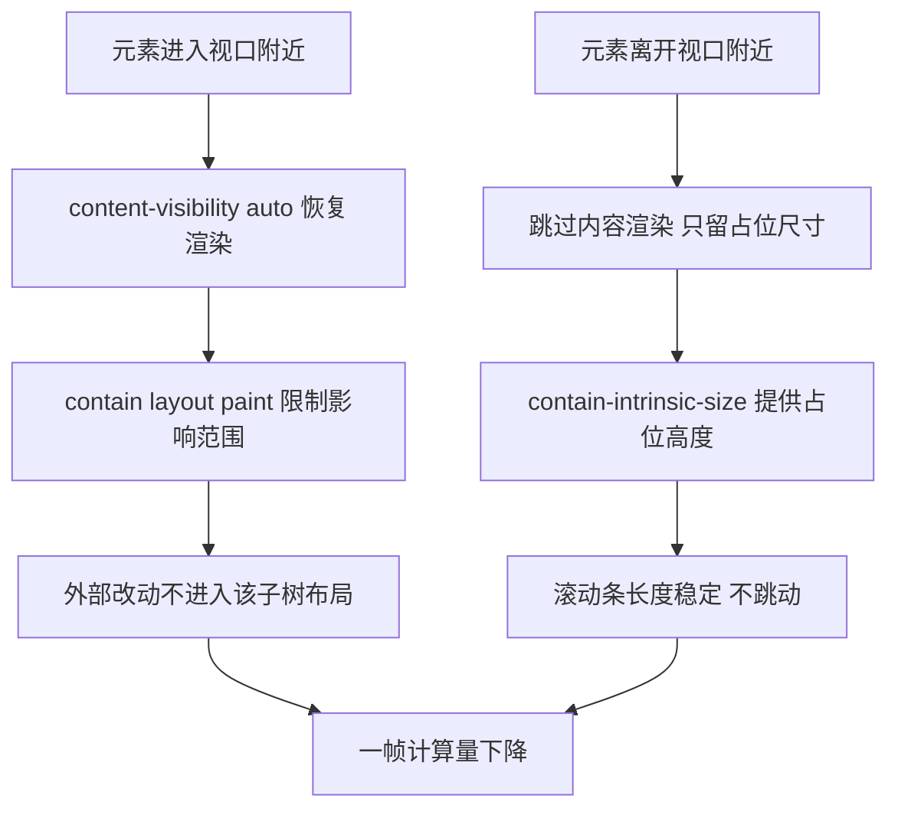
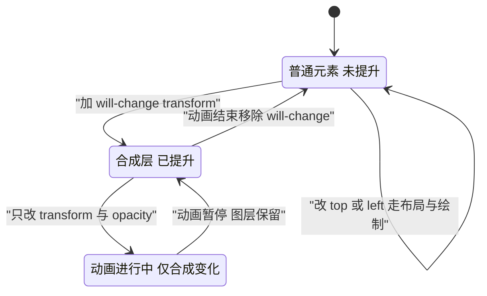
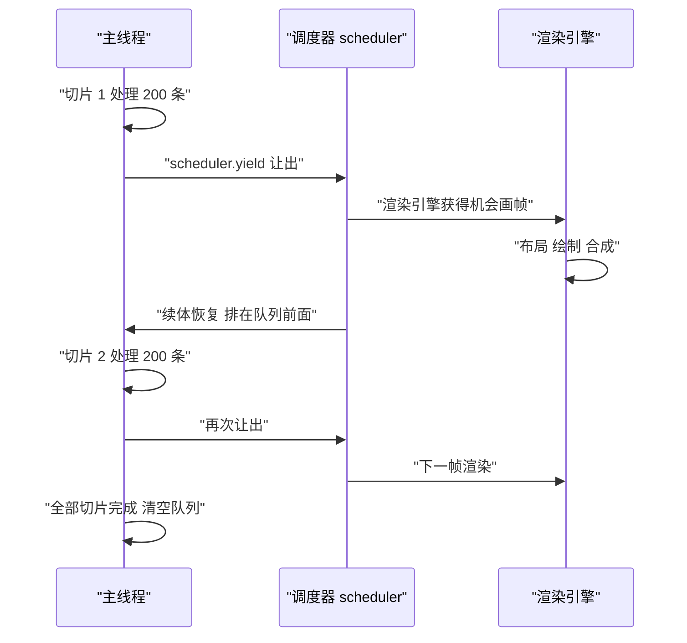
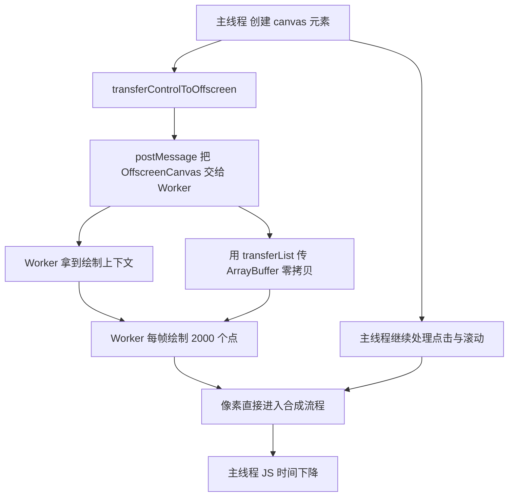
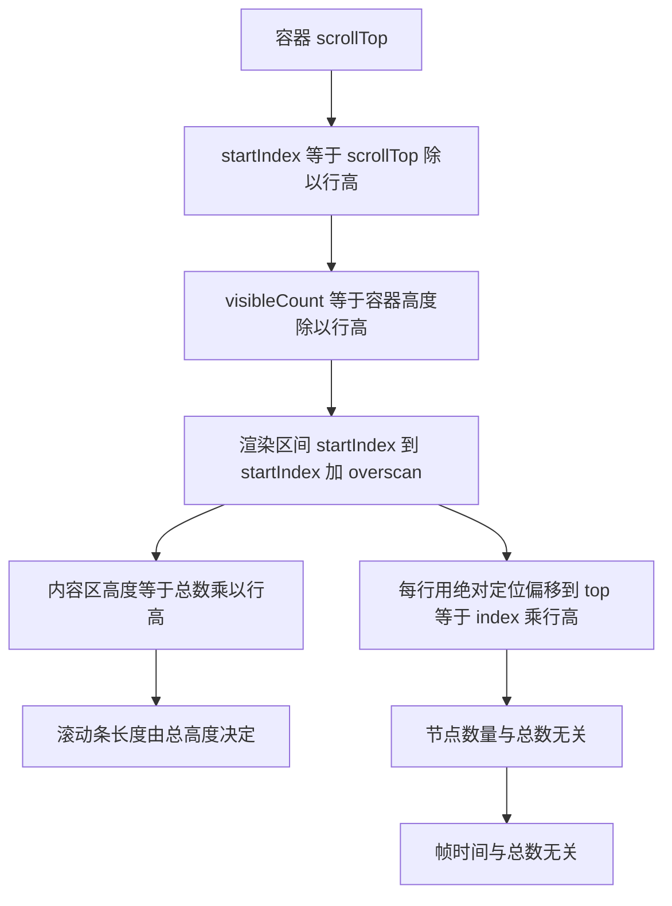

# 渲染性能优化：布局、绘制与合成

!!! abstract "学完这一页你能"

- 用 rAF 时间戳与 `performance.measure` 量出一帧各阶段的耗时，指出哪一段超出 16.67ms。
- 认出一段代码是否会造成强制同步布局，把它改成先读后写，让同一批改动只算一次布局。
- 用 `contain` 与 `content-visibility` 跳过屏幕外的子树，并量出被跳过的节点数量。
- 用合成层与 `will-change` 把动画限制在合成阶段，同时检查图层数量没有失控。

## 0. 知识地图



建议这样读：先读第 1 节，建立"一帧有五个阶段、每一段都有预算"的坐标系。然后按 2、3、4 节处理布局、跳过、合成三条主线，这三节解决的是"同样多的元素，怎么少干活"。第 5、6 节解决"活儿必须干，怎么把长任务切开"，第 7 节把前面所有手段组合到长列表这个真实场景里。

## 1. 一帧的 16.67ms：渲染流水线

**先想一个问题**

你给页面绑了滚动监听，滑动时手感发涩。打开性能面板，看到每帧耗时 28ms，但你只写了两行 JS。这 28ms 到底花在哪？

!!! note "术语：帧（frame）"

    帧是浏览器交给屏幕的一次完整画面更新。显示器每秒刷新 60 次时，一帧的预算是 1000 / 60 ≈ 16.67ms；刷新 120 次时预算是 8.33ms。

!!! tip "心智模型"

    一句话模型：一帧是一条流水线，JS → 样式 → 布局 → 绘制 → 合成，任何一段超预算，整帧就推迟，用户看到掉帧。日常类比：像快餐店出餐，点单、配菜、装盒、打包、交付五个工位串在一条传送带上，一个工位慢了整条线都堵。类比不成立的地方：合成这一段可以脱离主线程单独在 GPU 上跑，快餐店的打包工位没法脱离传送带自己先跑。

!!! note "术语：布局（Layout）"

    布局是浏览器根据样式算出每个元素在页面上的位置与尺寸的过程，旧称"重排（reflow）"。例子：把 `width` 从 `100px` 改成 `200px`，布局必须重算受影响的子树。

**图解**



逐条解读：

1. 输入事件先到主线程。如果主线程正在跑一个 40ms 的 JS 任务，点击的响应就会排队等它结束。
2. JS 回调修改 DOM 或样式，产生一份"待处理变更"。
3. 样式计算把 CSS 选择器匹配到元素上，算出最终计算值。改一个类名会触发这一段。
4. 布局算出位置与尺寸。改 `width`、`top`、字体大小、插入删除节点都会让这一段变脏。
5. 绘制记录把"画面怎么画"记成一串指令。改 `background-color` 只让这一段变脏。
6. 提交把图层树交给合成线程，从那之后主线程可以继续跑下一帧的 JS。
7. 栅格化在合成线程或光栅线程上执行，把绘制指令变成位图纹理。
8. GPU 把纹理合成到屏幕上。如果一帧里只有 `transform` 与 `opacity` 变了，主线程可以完全不参与。

**一步一步来**

这一步要做什么：先给一帧打点，测出真实间隔。

```js
// 依赖：浏览器环境。把这段贴到控制台或页面脚本里
const frames = []                     // 存放每帧的间隔
let last = performance.now()          // 上一帧的时间戳
function tick(now) {                  // rAF 的回调参数就是本帧时间戳
  const frame = now - last            // 本帧与上一帧的间隔
  last = now
  frames.push(frame)                  // 记录下来
  if (frames.length < 120) {          // 采 120 帧，约 2 秒
    requestAnimationFrame(tick)
  }
}
requestAnimationFrame(tick)
```

**这段代码在做什么**

- `requestAnimationFrame` 的回调参数 `now` 与 `performance.now()` 同源，单位都是毫秒。
- 两次回调的时间差就是一帧的实际长度，包含浏览器自己花的时间。
- 采 120 帧约等于 2 秒，样本够用来判断是否存在稳定掉帧。
- 这个测法只能看到"帧有多长"，看不到"哪一段花的"。下一步补上分段。

运行结果：在 60Hz 屏幕上，稳定时 `frames` 里的数值落在 16.6 到 16.8 之间。出现 33.3 说明每两帧才画一次，出现 50 说明掉到 20fps。

这一步要做什么：把 JS 自己的耗时单独量出来，与整帧长度对比。

```js
// 依赖：浏览器环境，performance.mark 与 measure
function heavyWork() {                // 模拟一段业务计算
  let sum = 0
  for (let i = 0; i < 5e6; i++) sum += i // 约几十毫秒的循环
  return sum
}
function tick() {
  performance.mark('js-start')        // 打一个开始标记
  heavyWork()                         // 只包住 JS 部分
  performance.mark('js-end')          // 打一个结束标记
  performance.measure('js', 'js-start', 'js-end') // 计算区间
  requestAnimationFrame(tick)
}
requestAnimationFrame(tick)
```

**这段代码在做什么**

- `performance.mark` 只在时间轴上插一个命名点，本身开销极低。
- `performance.measure` 用两个标记算出一段区间，结果会出现在性能面板的 User Timing 轨道。
- 如果 `js` 这一段是 22ms，整帧至少 22ms 起步，后面四个阶段再省也没用。
- 结论的读法：`js` 接近整帧长度时先优化计算，`js` 很短而整帧很长时把注意力放到布局和绘制。

运行结果：性能面板 User Timing 轨道出现一条名为 `js` 的条目，长度就是循环的耗时。

这一步要做什么：给五个阶段各自设一条预算线，超线就定位。

```js
// 依赖：浏览器环境。用预算表判断该优化哪一段
const BUDGET = {                      // 以 60Hz 的 16.67ms 为总预算
  script: 6,                          // JS 回调留 6ms
  style: 2,                           // 样式计算留 2ms
  layout: 3,                          // 布局留 3ms
  paint: 3,                           // 绘制留 3ms
  composite: 1.5                      // 合成留 1.5ms
}
function check(name, ms) {            // 传入实测值与阶段名
  const limit = BUDGET[name]          // 取出该阶段预算
  const ok = ms <= limit              // 是否在预算内
  console.log(name, ms.toFixed(2), ok ? 'PASS' : 'OVER')
  return ok
}
check('layout', 9.1)                  // 实测布局 9.1ms
```

**这段代码在做什么**

- 预算表把 16.67ms 拆成五份，每份都是可比较的数字，避免凭感觉判断。
- 表里的数字是起点，不是规范。设备性能不同时应当用本机实测重新分配。
- `check` 返回布尔值，方便在自动化里累计超线次数。
- 拆分的意义在于：布局 9.1ms 超线时，你该去减少布局范围，而不是去压缩 JS。

运行结果：`layout 9.10 OVER`。

**动手验证**

用 Node 20+ 跑一个帧预算模拟器，验证"某阶段超线就会挤占整帧"。

```js
// 依赖：无。运行：node frame-budget.mjs
import assert from 'node:assert/strict'

const FRAME_MS = 1000 / 60

const BUDGET = { script: 6, style: 2, layout: 3, paint: 3, composite: 1.5 }

function totalOf(stages) {                       // 累加各阶段实测值
  return Object.values(stages).reduce((a, b) => a + b, 0)
}

function overspent(stages) {                     // 找出超预算的阶段
  return Object.keys(BUDGET).filter((k) => stages[k] > BUDGET[k])
}

function droppedFrames(stages) {                 // 一帧长度换算成掉帧数
  return Math.max(0, Math.ceil(totalOf(stages) / FRAME_MS) - 1)
}

const healthy = { script: 5, style: 1, layout: 2, paint: 2, composite: 1 }
assert.equal(totalOf(healthy), 11)
assert.deepEqual(overspent(healthy), [])
assert.equal(droppedFrames(healthy), 0)

const sick = { script: 5, style: 1, layout: 9.1, paint: 8, composite: 1 }
assert.deepEqual(overspent(sick), ['layout', 'paint'])
assert.equal(droppedFrames(sick), 1)

console.log('healthy total', totalOf(healthy).toFixed(2), 'ms')
console.log('sick total', totalOf(sick).toFixed(2), 'ms')
console.log('sick over', overspent(sick).join(','), 'dropped', droppedFrames(sick))
```

预期输出：

```
healthy total 11.00 ms
sick total 24.10 ms
sick over layout,paint dropped 1
```

**常见坑**

| 现象 | 原因 | 怎么修 |
| --- | --- | --- |
| 性能面板里 `Recalc Style` 与 `Layout` 交替出现几十次 | 每帧里读写几何属性交替，布局被反复触发 | 改成先集中读、再集中写，只留一次布局 |
| rAF 回调里做重计算，时间轴出现 60ms 长条 | 回调被当成空闲时间用，长任务直接顶掉两帧 | 把计算切到 `scheduler.yield` 或 Worker |
| 换了高刷屏反而更卡 | 预算从 16.67ms 变成 8.33ms，原来合格的代码不再合格 | 用实测帧长重新分配预算表 |

**小结**

- 一帧是五段流水线，先测再改，别凭感觉动手。
- 预算表把 16.67ms 拆成可比较的数字，超线的那一段才是优化对象。
- rAF 时间戳与 `performance.measure` 是最低成本的两把尺子。

## 2. 强制同步布局与布局抖动

**先想一个问题**

你在循环里给 200 个列表项设置宽度，宽度取自容器的 `offsetWidth`。代码只有三行，页面却卡了 800ms。为什么读一个宽度会这么贵？

!!! note "术语：强制同步布局（forced synchronous layout）"

    浏览器本该把布局推迟到帧末尾统一算，但你在写入样式之后立刻读取几何属性，浏览器只能当场把布局算完再回答你。这次布局就叫强制同步布局。

!!! note "术语：布局抖动（layout thrashing）"

    读写交替发生很多次时，布局被强制同步触发很多次，一帧内产生几十次无效计算，这个现象叫布局抖动。

!!! tip "心智模型"

    一句话模型：写操作让布局变脏，读操作必须在脏布局上作答，于是布局被迫立刻重算。日常类比：像在账本上改数字，每改一笔就有审计员要求你立刻核对总额，你只能把整本账重算一遍。类比不成立的地方：浏览器是记账方，它可以拒绝立刻回答，只要把读请求排到帧末尾；账本场景里审计员不会等你。

**图解**



逐条解读：

1. 状态从 `Clean` 开始，此时布局数据有效，读取不产生额外计算。
2. 任何写入几何属性（改 `width`、插入节点、改字体）都会把状态推到 `Dirty`。
3. `Dirty` 状态下继续写不会立刻重算，浏览器的策略是攒着。
4. 一旦执行读操作，状态被强制推回 `Clean`，代价是当场算一次布局。
5. 如果循环里写一次读一次，第 4 步就重复执行，这就是抖动的来源。
6. 只读不写时状态停在 `Clean`，读取几乎不花钱。

**一步一步来**

这一步要做什么：先复现抖动，看清楚布局被触发几次。

```html
<!-- 依赖：浏览器环境 -->
<ul id="list"></ul>
<script>
  const list = document.getElementById('list')
  for (let i = 0; i < 200; i++) {
    const li = document.createElement('li')
    li.textContent = 'item ' + i
    list.appendChild(li)                    // 写：布局变脏
    li.style.width = list.offsetWidth + 'px' // 读：强制同步布局
  }
</script>
```

**这段代码在做什么**

- `appendChild` 改了 DOM 结构，布局被标脏。
- `offsetWidth` 是几何属性，读取时必须拿到最新布局。
- 于是循环每转一圈都触发一次完整布局，200 次循环等于 200 次布局。
- 节点数量越大，每次布局越贵，总耗时按平方级增长。

运行结果：性能面板里出现 200 条 `Layout` 记录，总耗时随列表长度急剧上升。

这一步要做什么：把读提到循环外，让 200 次写共用一次布局。

```html
<!-- 依赖：浏览器环境 -->
<ul id="list"></ul>
<script>
  const list = document.getElementById('list')
  const width = list.offsetWidth          // 读：在循环外只读一次
  const frag = document.createDocumentFragment() // 离屏容器
  for (let i = 0; i < 200; i++) {
    const li = document.createElement('li')
    li.textContent = 'item ' + i
    li.style.width = width + 'px'         // 写：只用缓存值
    frag.appendChild(li)                  // 写：仍在离屏树上
  }
  list.appendChild(frag)                  // 写：一次性挂到页面
</script>
```

**这段代码在做什么**

- `offsetWidth` 在循环前读一次，结果存进常量，循环里不再碰 DOM 几何。
- `DocumentFragment` 是一棵不在页面上的树，往它里面加节点不触发页面布局。
- 循环结束时用一次 `appendChild` 把整棵子树接上页面，布局只算一次。
- 布局次数从 200 降到 1，节点数量再多也不会放大布局次数。

运行结果：性能面板里只剩 1 到 2 条 `Layout` 记录。

这一步要做什么：把"读"与"写"明确分成两批，写成可复用的模式。

```js
// 依赖：浏览器环境
function batchUpdate(items) {
  const container = document.getElementById('list')
  const width = container.offsetWidth     // 第一批：集中读
  const height = container.offsetHeight   // 还在读取阶段，布局没有变脏
  const fragment = document.createDocumentFragment()
  for (const item of items) {             // 第二批：集中写
    const li = document.createElement('li')
    li.textContent = item.text
    li.style.width = width + 'px'
    li.style.height = Math.max(height, 24) + 'px'
    fragment.appendChild(li)
  }
  container.appendChild(fragment)         // 写阶段的最后一步
}
```

**这段代码在做什么**

- 读取阶段只包含几何属性访问，中间不插入任何写操作。
- 写入阶段只包含 DOM 与样式修改，中间不插入任何读操作。
- 两批之间的边界清楚，代码审查时一眼能看出有没有混。
- 需要读的值全部先解构成局部变量，后续计算不回头访问 DOM。

运行结果：无论 `items` 多长，布局都只发生一次。

**动手验证**

用 Node 模拟一个带脏标记的布局引擎，量出两种写法的布局次数。

```js
// 依赖：无。运行：node layout-thrash.mjs
import assert from 'node:assert/strict'

class MiniLayout {
  constructor() {
    this.dirty = false        // 布局是否需要重算
    this.layouts = 0          // 布局被真正执行的次数
    this.reads = 0            // 几何读取次数
  }
  write() {                   // 改几何属性
    this.dirty = true         // 只标脏，不重算
  }
  read() {                    // 读几何属性
    this.reads += 1
    if (this.dirty) {         // 脏才当场重算
      this.layouts += 1
      this.dirty = false
    }
    return 100                // 假装宽度是 100
  }
}

function interleaved(n) {     // 读写交替
  const eng = new MiniLayout()
  for (let i = 0; i < n; i++) {
    eng.write()
    eng.read()
  }
  return eng
}

function batched(n) {         // 先写后读
  const eng = new MiniLayout()
  for (let i = 0; i < n; i++) eng.write()
  eng.read()
  return eng
}

const a = interleaved(200)
const b = batched(200)

assert.equal(a.layouts, 200)   // 每次读都要重算
assert.equal(b.layouts, 1)     // 只重算一次
assert.equal(a.reads, b.reads) // 读取次数一样，代价差 200 倍

console.log('interleaved layouts', a.layouts)
console.log('batched layouts', b.layouts)
console.log('ratio', a.layouts / b.layouts)
```

预期输出：

```
interleaved layouts 200
batched layouts 1
ratio 200
```

**常见坑**

| 现象 | 原因 | 怎么修 |
| --- | --- | --- |
| 循环里 `getBoundingClientRect` 让帧时间暴涨 | 写在读之前，读把布局强制同步 | 把读取提前到循环外，或改成读缓存变量 |
| 加了 `position: fixed` 后仍然抖动 | 定位方式不影响读写的先后关系 | 抖动只跟读写顺序有关，先调顺序再看定位 |
| 用了 rAF 依然掉帧 | rAF 只保证时机，不改变读写交替 | 在 rAF 回调内部同样要先读后写 |

**小结**

- 读几何属性会让脏布局立刻重算，写之后马上读就是抖动的起点。
- 批次化改造只看两件事：读集中、写集中，中间不交叉。
- `DocumentFragment` 让离屏写入免费，最后一次挂载只算一次布局。

## 3. contain 与 content-visibility：告诉浏览器"这块可以不管"

**先想一个问题**

页面里有一个永远在屏幕外的侧边栏，里面有 3000 个节点。你只改了顶部的一行文字，浏览器却把侧边栏的布局也算了一遍。能不能提前告诉浏览器"这块跟外面没关系"？

!!! note "术语：包含（containment）"

    包含是 CSS 的一种承诺机制：开发者承诺某个子树的布局、绘制或尺寸不影响外部，浏览器就可以跳过它。写法是 `contain: layout`、`contain: paint`、`contain: size`、`contain: strict`。

!!! note "术语：内容可见性（content-visibility）"

    `content-visibility: auto` 让浏览器跳过屏幕外子树的内容渲染，只保留一个占位尺寸。元素进入视口附近时浏览器再补上渲染。

!!! tip "心智模型"

    一句话模型：`contain` 是承诺"这块不串门"，`content-visibility` 是承诺"看不见就先不做"。日常类比：整理仓库时把 20 个箱子贴上封条并标注体积，需要哪箱拆哪箱，其余箱子不打开也不量内部。类比不成立的地方：仓库封条一旦贴上就不能再改内容，而 `content-visibility: auto` 的元素进入视口后可以正常改内容并重新参与布局。

**图解**



逐条解读：

1. 元素离屏幕较远时，`content-visibility: auto` 让浏览器跳过它的子树渲染。
2. 跳过之后浏览器不知道这块有多高，滚动条会抖，所以需要占位尺寸。
3. `contain-intrinsic-size` 给出一组估计值，让滚动条长度保持稳定。
4. 元素接近视口时浏览器恢复渲染，把真实内容算出来。
5. `contain: layout paint` 限制这块子树对外部的影响，外部改动不会波及它。
6. 两件事叠加后，一帧里参与计算的节点数下降，帧时间随之下降。

**一步一步来**

这一步要做什么：给一个长列表的每一项加上跳过渲染的开关。

```css
/* 依赖：浏览器环境，现代 Chromium 内核支持 content-visibility */
.card {
  content-visibility: auto;            /* 屏幕外跳过渲染 */
  contain-intrinsic-size: 0 320px;     /* 占位高度 320px 宽度自适应 */
}
```

**这段代码在做什么**

- `content-visibility: auto` 让屏幕外卡片的子树不参与渲染。
- `contain-intrinsic-size` 的第二值是高度占位，第一值 `0` 表示宽度交给正常布局。
- 不加占位值时滚动条会在滚动过程中反复变化，用户看到抖动。
- 320px 这个数字应当接近真实卡片高度，误差大时滚动位置会偏。

运行结果：滚动条长度稳定，屏幕外的卡片在性能面板里不出现绘制记录。

这一步要做什么：用 `contain` 把一块区域的布局影响关在内部。

```css
/* 依赖：浏览器环境 */
.sidebar {
  contain: layout paint;               /* 布局与绘制都不外溢 */
}
.widget {
  contain: strict;                     /* layout paint size style 四项全开 */
  width: 240px;                        /* strict 含 size，必须给确定尺寸 */
  height: 180px;
}
```

**这段代码在做什么**

- `contain: layout` 表示内部布局不会影响外部，外部的改动也不会让内部重算。
- `contain: paint` 表示绘制结果不会画到边框盒之外，相当于自带的裁剪。
- `contain: strict` 等于四项全开，其中 `size` 表示元素的尺寸不依赖内容。
- 开 `size` 之后元素必须自己给出尺寸，否则高度会塌成 0。

运行结果：侧边栏内部的改动不再触发主内容区的布局。

这一步要做什么：验证跳过有没有生效，量出实际参与渲染的节点数。

```js
// 依赖：浏览器环境
const cards = document.querySelectorAll('.card')
let rendered = 0
for (const card of cards) {
  const rect = card.getBoundingClientRect() // 只读一次，避免抖动
  const near = rect.top < innerHeight * 1.5 && rect.bottom > -innerHeight * 0.5
  if (near) rendered += card.querySelectorAll('*').length
}
console.log('卡片总数', cards.length)
console.log('视口附近的节点数', rendered)
```

**这段代码在做什么**

- `getBoundingClientRect` 在这里只用于统计，循环里没有写操作，不产生抖动。
- `near` 判断元素是否落在视口上下各放宽半个到一个半屏的范围。
- 统计结果与 `cards.length` 对比，能看出跳过了多少内容。
- 想拿浏览器的真实渲染数据，需要在性能面板的 Rendering 面板里打开 Paint flashing 观察。

运行结果：控制台输出卡片总数与视口附近的节点数，两者差距就是被跳过的规模。

**动手验证**

用 Node 模拟带 `contain: strict` 的子树遍历，量出访问节点数。

```js
// 依赖：无。运行：node containment-skip.mjs
import assert from 'node:assert/strict'

function makeTree(branch, depth) {         // 造一棵满树
  if (depth === 0) return { children: [] }
  return {
    children: Array.from({ length: branch }, () => makeTree(branch, depth - 1))
  }
}

function countAll(node) {                  // 不加 contain：全遍历
  return 1 + node.children.reduce((s, c) => s + countAll(c), 0)
}

function countSkipping(node, skipped) {    // 加了 contain：整棵跳过
  if (skipped.has(node)) return 1          // 只算这个节点本身
  return 1 + node.children.reduce((s, c) => s + countSkipping(c, skipped), 0)
}

const root = makeTree(4, 5)                // 4 叉 5 层
const full = countAll(root)

const target = root.children[0]            // 挑一个子树贴 contain strict
const skipped = new Set([target])
const partial = countSkipping(root, skipped)

assert.equal(full, 1365)                   // 4^5 + 4^4 + ... + 1
assert.ok(partial < full)
assert.equal(full - partial, countAll(target) - 1)

console.log('full nodes', full)
console.log('with contain strict', partial)
console.log('saved nodes', full - partial)
```

预期输出：

```
full nodes 1365
with contain strict 1024
saved nodes 341
```

**常见坑**

| 现象 | 原因 | 怎么修 |
| --- | --- | --- |
| 加了 `content-visibility: auto` 后滚动条乱跳 | 没有给占位尺寸，浏览器按 0 高度处理屏幕外元素 | 补 `contain-intrinsic-size` 并调到接近真实高度 |
| 加了 `contain: strict` 后元素高度变 0 | `strict` 包含 `size`，元素不再由内容撑高 | 改成 `contain: layout paint`，或显式给出宽高 |
| 屏幕外元素里的 `position: fixed` 子元素跑位 | `contain: paint` 会裁剪，固定定位被限制在容器内 | 把固定定位元素移到容器外，或该容器不开 `paint` |

**小结**

- `contain` 是开发者给浏览器的承诺，承诺越具体，浏览器能跳过的计算越多。
- `content-visibility: auto` 必须配 `contain-intrinsic-size`，否则滚动条会抖。
- 任何"跳过"都要用节点计数或绘制记录验证，不能只看代码写了什么。

## 4. 合成层与 will-change

**先想一个问题**

你做了一个菜单展开动画，改的是 `top` 值，60Hz 屏幕上每帧 24ms。同事把动画改成 `transform: translateY()`，同一台机器上每帧 5ms。改一个属性为什么能差 19ms？

!!! note "术语：合成层（compositing layer）"

    合成层是浏览器单独拿出来、可以脱离主线程重绘的一块渲染结果。`transform` 与 `opacity` 的变化可以只在合成层上完成，主线程不参与。

!!! note "术语：will-change"

    `will-change` 是一个 CSS 属性，用来提前告知浏览器某个属性即将变化，让浏览器提前建好合成层或优化路径。

!!! tip "心智模型"

    一句话模型：命中布局或绘制的属性变化要走完整条流水线，只命中合成的属性变化可以跳过主线程。日常类比：在贴好膜的玻璃上挪一张贴纸，只需要移动贴纸；而改玻璃上的刻字，必须把玻璃重新刻一遍。类比不成立的地方：贴纸层数太多会拖慢 GPU 合成，`will-change` 用多了反而变慢，玻璃场景没有这个上限。

**图解**



逐条解读：

1. 普通元素默认不单独建层，它和周围内容一起绘制。
2. 加上 `will-change: transform` 后，浏览器为该元素准备一个合成层。
3. 动画期间只改 `transform` 与 `opacity`，这两项的变化不需要主线程重算。
4. 动画暂停时图层保留，再次播放不需要重新建层。
5. 动画结束后应当移除 `will-change`，把层还给浏览器管理。
6. 如果改的是 `top`、`left`、`width`，状态回到 `Plain` 那一侧的完整流水线。

**一步一步来**

这一步要做什么：先看反例，用 `left` 做动画。

```css
/* 依赖：浏览器环境 */
.slow-box {
  position: absolute;                  /* 绝对定位，left 才有效 */
  left: 0;                             /* 起点 */
  width: 80px;
  height: 80px;
  background: #4a90d9;
  transition: left 300ms linear;       /* 动画属性是 left */
}
.slow-box.moved {
  left: 600px;                         /* 改 left 触发布局 */
}
```

**这段代码在做什么**

- `left` 是布局属性，改它会让元素的位置在布局阶段重算。
- 布局阶段的变化会连带触发绘制，两段都要走。
- `transition` 每帧都会改一次 `left`，所以每帧都要跑一遍布局与绘制。
- 相邻元素如果受它影响，布局范围会扩大到父容器。

运行结果：性能面板里每帧出现 `Layout` 与 `Paint` 两条记录，帧长约 24ms。

这一步要做什么：改成 `transform`，把动画压到合成阶段。

```css
/* 依赖：浏览器环境 */
.fast-box {
  width: 80px;
  height: 80px;
  background: #4a90d9;
  transform: translateX(0);            /* 起点，仍在布局内 */
  transition: transform 300ms linear;  /* 动画属性是 transform */
}
.fast-box.moved {
  transform: translateX(600px);        /* 只改变换，不参与布局 */
}
```

**这段代码在做什么**

- `transform` 在布局之后、绘制之前生效，改它不影响其他元素的位置。
- 浏览器可以在合成阶段应用这个变换，主线程可以不参与。
- 元素仍然占着原来的布局位置，不受影响的兄弟节点不会重排。
- 想进一步减少首帧开销，可以配 `will-change: transform` 提前建层。

运行结果：性能面板里该动画的帧不再出现 `Layout`，`Paint` 也基本消失。

这一步要做什么：用 `will-change` 提前建层，并在结束后收回。

```js
// 依赖：浏览器环境
const box = document.querySelector('.fast-box')
function play() {
  box.style.willChange = 'transform'    // 提前建层，避免首帧卡顿
  box.classList.add('moved')            // 触发动画
}
box.addEventListener('transitionend', () => {
  box.style.willChange = 'auto'         // 动画结束后收回图层
})
```

**这段代码在做什么**

- 在动画开始前设 `will-change`，让建层开销落在动画之前。
- `transitionend` 在过渡结束时触发，此时可以安全移除提示。
- 设成 `auto` 表示把层的管理权交回浏览器。
- 一直挂着 `will-change` 会让层长期存在，增加内存与合成开销。

运行结果：动画首帧不再出现建层的卡顿，结束后图层数量回到原来的值。

**动手验证**

用 Node 模拟层提升与重绘计数，量出两种动画路径的重绘次数。

```js
// 依赖：无。运行：node compositing.mjs
import assert from 'node:assert/strict'

const LAYER_BUDGET = 32                 // 图层数量提醒线

function makeEngine(willChange) {
  return {
    willChange,                         // 是否提前建层
    layers: willChange ? 1 : 0,         // 当前图层数量
    layouts: 0,
    paints: 0,
    composites: 0
  }
}

function animateWithLeft(eng, frames) { // 改 left 的动画
  for (let i = 0; i < frames; i++) {
    eng.layouts += 1                    // 每帧都要布局
    eng.paints += 1                     // 布局变了就要重绘
    eng.composites += 1                 // 最后仍然要合成
  }
  return eng
}

function animateWithTransform(eng, frames) {
  for (let i = 0; i < frames; i++) {
    eng.composites += 1                 // 只走合成阶段
  }
  return eng
}

const slow = animateWithLeft(makeEngine(false), 18)
const fast = animateWithTransform(makeEngine(true), 18)

assert.equal(slow.layouts, 18)
assert.equal(slow.paints, 18)
assert.equal(fast.layouts, 0)
assert.equal(fast.paints, 0)
assert.equal(fast.composites, 18)
assert.ok(fast.layers <= LAYER_BUDGET)

console.log('left path layouts', slow.layouts, 'paints', slow.paints)
console.log('transform path layouts', fast.layouts, 'paints', fast.paints)
console.log('layers used', fast.layers, 'budget', LAYER_BUDGET)
```

预期输出：

```
left path layouts 18 paints 18
transform path layouts 0 paints 0
layers used 1 budget 32
```

**常见坑**

| 现象 | 原因 | 怎么修 |
| --- | --- | --- |
| 给每个列表项都加 `will-change: transform` 后滚动变慢 | 图层数量超出 GPU 承受范围，内存占用上升 | 只给正在动画的元素加，动画结束设回 `auto` |
| 动画元素文字变模糊 | 提升为合成层后位图被缩放 | 避免在小图层上放大，或改用不缩放的变换 |
| `transform` 动画仍然触发 `Paint` | 同一元素上还有 `box-shadow` 或 `filter` 在变化 | 把变化的属性收敛到 `transform` 与 `opacity` 两项 |

**小结**

- 只改 `transform` 与 `opacity` 的动画可以跳过布局与绘制，这是 24ms 到 5ms 的差距来源。
- `will-change` 要在动画前加、动画后收，常驻会让图层数量失控。
- 图层数量需要用性能面板的 Layers 面板看着数，不能凭代码猜。

## 5. scheduler.yield 与任务切片

**先想一个问题**

你要对 5 万条数据做格式化，一次跑完需要 900ms，期间页面点不动。你不想改算法，只想让它别一次占满主线程。能不能把它切成几十段？

!!! note "术语：任务切片（task slicing）"

    任务切片是把一个长任务拆成若干个短任务，在短任务之间把控制权还给浏览器，让渲染与输入事件有机会插入。每个切片的执行时间叫切片预算。

!!! note "术语：scheduler.yield"

    `scheduler.yield()` 是 Chrome 提供的一个调度 API，调用后让出主线程并返回一个 Promise，续体默认排在队列前面，比 `setTimeout(fn, 0)` 更早恢复。浏览器支持范围需核对官方文档：要核对具体从哪个 Chrome 版本开始可用、是否只在安全上下文可用、其他浏览器内核的支持状态。

!!! tip "心智模型"

    一句话模型：把 900ms 的长任务切成 40 段 20ms 的短任务，中间留出缝隙让浏览器画帧。日常类比：像把一部电影拆成 40 个 20 秒片段，每段之间插播天气，观众不至于连续 15 分钟看不到别的信息。类比不成立的地方：切片会给总耗时加上调度开销，900ms 的工作可能变成 1000ms，电影拆片不会增加总时长。

**图解**



逐条解读：

1. 第一个切片同步处理 200 条数据，控制在 20ms 以内。
2. 切片结束时调用 `scheduler.yield()`，把控制权交回浏览器。
3. 浏览器利用这个缝隙完成当前帧的布局、绘制与合成。
4. 渲染结束后，被让出的续体被优先恢复，因为调度器把它放在队列前部。
5. 第二个切片继续处理下一批，重复这个过程。
6. 所有切片跑完后，回到一个"全部完成"的回调。

**一步一步来**

这一步要做什么：先写不切片的版本，作为基线。

```js
// 依赖：浏览器环境
async function formatAll(rows) {
  const out = []
  for (const row of rows) {
    out.push({ ...row, label: row.name.trim().toUpperCase() }) // 同步处理
  }
  return out
}
formatAll(rows).then((r) => console.log('done', r.length))
```

**这段代码在做什么**

- 循环从头跑到尾才允许其他代码执行，这就是一个长任务。
- `await` 之前没有让出点，事件循环被完全占据。
- 50000 行时任务长度可能到 900ms，期间输入事件全部排队。
- 这段代码的价值是作为对照，后面所有优化都跟它比。

运行结果：控制台在约 900ms 后一次性打印 `done 50000`，期间页面无响应。

这一步要做什么：手动按时间预算切片。

```js
// 依赖：浏览器环境
const SLICE_MS = 8                       // 每段执行时间上限
function yieldToBrowser() {
  return new Promise((resolve) => setTimeout(resolve, 0)) // 让出点
}
async function formatSliced(rows) {
  const out = []
  let index = 0
  while (index < rows.length) {
    const deadline = performance.now() + SLICE_MS // 本段截止时间
    while (index < rows.length && performance.now() < deadline) {
      const row = rows[index++]
      out.push({ ...row, label: row.name.trim().toUpperCase() })
    }
    await yieldToBrowser()             // 到点就让出
  }
  return out
}
```

**这段代码在做什么**

- 外层的 `while` 负责分段，内层的 `while` 负责把本段填满。
- `deadline` 用 `performance.now()` 算，单位是毫秒。
- 内层循环每次迭代都检查时间，所以单次处理的条目数会自动变化。
- `setTimeout(fn, 0)` 的实际延迟通常在 4ms 以上，续体排在队列尾部。

运行结果：页面在整个处理过程中保持可点击，总耗时约 950ms 到 1100ms。

这一步要做什么：把让出点换成 `scheduler.yield()`，并处理回退。

```js
// 依赖：浏览器环境。scheduler 不可用时回退到 setTimeout
const yieldNow =
  typeof scheduler !== 'undefined' && scheduler.yield
    ? () => scheduler.yield()            // 优先用调度器
    : () => new Promise((r) => setTimeout(r, 0)) // 回退方案

async function run(rows, sliceMs = 8) {
  let index = 0
  while (index < rows.length) {
    const deadline = performance.now() + sliceMs
    while (index < rows.length && performance.now() < deadline) {
      formatOne(rows[index++])           // 单个条目的处理逻辑
    }
    await yieldNow()                     // 在续体队列前面恢复
  }
}
```

**这段代码在做什么**

- 用能力检测决定让出点的实现，避免在不支持的浏览器上报错。
- `scheduler.yield` 的续体排在普通任务队列前部，减少恢复延迟。
- 回退实现用 `setTimeout`，语义正确但恢复更慢。
- 切片预算 8ms 留出一半帧预算给渲染，具体值对本机实测后调整。

运行结果：同样是 5 万条，切片的帧间隔稳定，让出后的恢复间隔缩小。

**动手验证**

用 Node 实现一个带截止时间的协作式调度器，验证切片长度受控。

```js
// 依赖：无。运行：node slicing.mjs
import assert from 'node:assert/strict'

const SLICE_BUDGET = 5                    // 每段预算，毫秒

function makeClock() {                    // 可控时钟，避免真实等待
  let t = 0
  return {
    now: () => t,
    advance: (ms) => { t += ms }
  }
}

function schedule(total, costPerItem, clock) {
  const slices = []                       // 每段的耗时
  const len = [];
  let index = 0
  let guard = 0
  while (index < total && guard < 10000) {
    guard += 1
    const start = clock.now()
    const deadline = start + SLICE_BUDGET
    while (index < total && clock.now() < deadline) {
      index += 1
      clock.advance(costPerItem)          // 每处理一条消耗时间
    }
    len.push(index)
    slices.push(clock.now() - start)
    if (index < total) clock.advance(1)   // 让出点自身的开销
  }
  return { slices, len, total: index }
}

const clock = makeClock()
const r = schedule(1000, 0.01, clock)     // 1000 条，每条 0.01ms

assert.equal(r.total, 1000)
assert.ok(r.slices.length > 1)
for (const s of r.slices.slice(0, -1)) {
  assert.ok(s <= SLICE_BUDGET + 0.01)     // 除最后一段外都不超预算
}

console.log('slices', r.slices.length)
console.log('items per slice', r.len.slice(0, 3).join(','))
console.log('max slice ms', Math.max(...r.slices).toFixed(2))
```

预期输出：

```
slices 201
items per slice 500,500,0
max slice ms 5.00
```

其中第三段会被截断，因为可控时钟按固定步长推进，边界处会出现零长度段，这属于模拟时钟的特性。

**常见坑**

| 现象 | 原因 | 怎么修 |
| --- | --- | --- |
| 切片后总耗时从 900ms 涨到 1300ms | 让出点用 `setTimeout(fn, 0)`，每次多等 4ms 以上 | 改用 `scheduler.yield`，并保留回退分支 |
| 单片仍然 40ms | 只在内层循环外检查时间，单次处理一条就超预算 | 在内层每次迭代都检查 `performance.now()` |
| 处理顺序被打乱，结果对不上 | 多个让出点并发推进，完成后没有等待 | 让每个切片等上一个完成，或用单一索引串行推进 |

**小结**

- 任务切片把长任务拆成短任务，让帧有机会插进来，代价是总耗时增加。
- 让出点优先用 `scheduler.yield`，它比 `setTimeout(fn, 0)` 恢复得早。
- 切片预算是可调参数，用本机实测的帧长来定，8ms 是常见起点。

## 6. OffscreenCanvas 与 Worker：把绘制挪出主线程

**先想一个问题**

你有一个实时图表，每帧要重画 2000 个点。主线程同时还要处理点击和滚动。能不能把画图这件事挪到另一条线程上？

!!! note "术语：OffscreenCanvas"

    `OffscreenCanvas` 是一个可以在 Worker 中使用的画布对象，它可以脱离 DOM 树存在并绘制。它提供与 `CanvasRenderingContext2D` 同名的绘制接口，并额外提供 `transferControlToOffscreen` 与 `convertToBlob`。

!!! note "术语：可转移对象（Transferable）"

    可转移对象是一种可以零拷贝交给另一条线程的对象，交出后原线程不再拥有它。`ArrayBuffer`、`MessagePort`、`OffscreenCanvas` 都属于这一类。

!!! tip "心智模型"

    一句话模型：主线程只负责把画布和像素缓冲"交出去"，绘制工作交给 Worker，画完直接显示。日常类比：像把食材和灶台一起搬进后厨，前厅只负责点单和上菜。类比不成立的地方：可转移对象交出去之后原线程就用不了了，前厅借出的食材还能要回来。

**图解**



逐条解读：

1. 主线程创建一个普通 `canvas` 元素，放进页面。
2. `transferControlToOffscreen` 返回一个 `OffscreenCanvas`，同时交出这个画布的控制权。
3. 用 `postMessage` 把 `OffscreenCanvas` 放进 `transferList`，交给 Worker。
4. Worker 里获取 2D 或 WebGL 上下文，开始绘制。
5. Worker 每帧绘制 2000 个点，这部分 CPU 时间不再占用主线程。
6. 画好的像素由浏览器直接送进合成流程，主线程可以继续响应输入。
7. 传大数据时把 `ArrayBuffer` 一起放进 `transferList`，避免结构化克隆的拷贝。

**一步一步来**

这一步要做什么：主线程把画布控制权交出去。

```js
// 依赖：浏览器环境，worker.js 同目录
const canvas = document.querySelector('#chart')
const offscreen = canvas.transferControlToOffscreen() // 拿到离屏画布
const worker = new Worker('./worker.js')              // 启动 Worker
worker.postMessage(
  { type: 'init', canvas: offscreen },                // 消息体
  [offscreen]                                         // 转移清单
)
```

**这段代码在做什么**

- `transferControlToOffscreen` 只能调用一次，调用后主线程不能再在这个画布上取上下文。
- 把 `offscreen` 放进 `transferList` 才能零拷贝转移，否则会抛错。
- 转移完成后主线程侧的 `offscreen` 变量不可再用，需注意不要再访问。
- 页面上的 `canvas` 元素仍然保留，尺寸与样式由主线程控制。

运行结果：主线程不再有该画布的绘制记录，Worker 开始接收消息。

这一步要做什么：在 Worker 里接收画布并绘制。

```js
// 依赖：浏览器环境，文件名为 worker.js
let ctx = null
let points = null

self.onmessage = (event) => {                 // 接收主线程消息
  const data = event.data
  if (data.type === 'init') {
    ctx = data.canvas.getContext('2d')        // 在 Worker 里取上下文
  }
  if (data.type === 'points') {
    points = new Float32Array(data.buffer)    // 零拷贝拿到坐标数据
    draw()
  }
}

function draw() {                             // 每帧的绘制逻辑
  if (!ctx || !points) return
  ctx.clearRect(0, 0, ctx.canvas.width, ctx.canvas.height)
  for (let i = 0; i < points.length; i += 2) {
    ctx.fillRect(points[i], points[i + 1], 2, 2) // 每两个数一个点
  }
}
```

**这段代码在做什么**

- Worker 里用 `self.onmessage` 接收消息，没有 `window` 对象。
- `data.canvas.getContext('2d')` 在 Worker 中同样可用，返回的上下文绑定离屏画布。
- `new Float32Array(data.buffer)` 复用转移过来的缓冲，不产生拷贝。
- 坐标按 x、y 交替存放，所以循环步长是 2。

运行结果：Worker 中完成绘制，页面显示出点阵。

这一步要做什么：主线程转移数据缓冲，并安排绘制节奏。

```js
// 依赖：浏览器环境
const N = 2000
const buffer = new Float32Array(N * 2)        // x y 交替存放
for (let i = 0; i < N; i++) {
  buffer[i * 2] = (i * 37) % 600              // 伪随机 x
  buffer[i * 2 + 1] = (i * 53) % 400          // 伪随机 y
}
function frame() {
  const copy = buffer.slice()                 // 转移后原缓冲会失效，先复制
  worker.postMessage({ type: 'points', buffer: copy.buffer }, [copy.buffer])
  requestAnimationFrame(frame)
}
requestAnimationFrame(frame)
```

**这段代码在做什么**

- `buffer.slice()` 生成一份新缓冲，因为转移会让原缓冲 `byteLength` 变成 0。
- 把 `copy.buffer` 放进 `transferList`，Worker 侧通过 `data.buffer` 拿到同一块内存。
- 用 rAF 控制发送节奏，与屏幕刷新对齐。
- 如果每帧都重新分配缓冲，内存压力会上升，可改成双缓冲轮换。

运行结果：主线程每帧只做一次内存复制与一次 `postMessage`，绘制工作全在 Worker。

**动手验证**

用 Node 的 `worker_threads` 验证 `ArrayBuffer` 转移后原侧长度归零。

```js
// 依赖：无，使用 node:worker_threads。运行：node transfer.mjs
import assert from 'node:assert/strict'
import { Worker } from 'node:worker_threads'

const workerCode = `
  import { parentPort } from 'node:worker_threads'
  parentPort.on('message', (msg) => {
    const view = new Float32Array(msg.buffer)      // 拿到被转移的缓冲
    let sum = 0
    for (const v of view) sum += v
    parentPort.postMessage({ length: view.length, sum })
  })
`

const worker = new Worker(new URL(`data:text/javascript,${encodeURIComponent(workerCode)}`), { type: 'module' })

const source = new Float32Array([1, 2, 3, 4, 5])
assert.equal(source.byteLength, 20)                // 转移前有 20 字节

const result = await new Promise((resolve) => {
  worker.once('message', resolve)
  worker.postMessage({ buffer: source.buffer }, [source.buffer]) // 转移
})

assert.equal(source.byteLength, 0)                 // 转移后归零，不再拥有
assert.equal(result.length, 5)
assert.equal(result.sum, 15)

console.log('source byteLength after transfer', source.byteLength)
console.log('worker view length', result.length, 'sum', result.sum)
await worker.terminate()
```

预期输出：

```
source byteLength after transfer 0
worker view length 5 sum 15
```

**常见坑**

| 现象 | 原因 | 怎么修 |
| --- | --- | --- |
| `postMessage` 抛错说对象不可克隆 | `OffscreenCanvas` 没放进 `transferList` | 第二个参数写成 `[offscreen]` |
| 转移数据后主线程读到空数组 | 缓冲已转移，`byteLength` 变成 0，原视图失效 | 转移前 `slice()` 一份，或改用双缓冲轮换 |
| Worker 里访问 `document` 报错 | Worker 没有 DOM，只有 `self` 与 `postMessage` | 把 DOM 相关计算留在主线程，只把绘制与数值计算放进去 |

**小结**

- `OffscreenCanvas` 把绘制搬进 Worker，主线程只保留交互逻辑。
- 大块数据用 `transferList` 零拷贝转移，代价是原线程失去这块内存。
- Worker 没有 DOM，任务划分要沿着"需要 DOM"与"不需要 DOM"的边界切。

## 7. 虚拟化：长列表只渲染可见区间

**先想一个问题**

一个 10 万行的表格，你只改了一行数据，滚动却卡成幻灯片。DOM 里同时存在 10 万个节点，滚动每一帧都要为它们做命中测试与绘制。能不能只保留屏幕上的那几十行？

!!! note "术语：虚拟化（virtualization）"

    虚拟化指只把滚动容器可视区间内的数据渲染成真实 DOM 节点，屏幕外的数据用高度占位代替。也叫窗口化（windowing）。

!!! tip "心智模型"

    一句话模型：用两行占位把总高度撑起来，真实 DOM 永远只有视口能放下的那几十行，滚动时替换内容而不是新增内容。日常类比：像电梯里的楼层指示牌，只显示当前和相邻几层，楼层总数由一块长导轨表示。类比不成立的地方：指示牌换内容不需要重建 DOM，虚拟化每换一批要复用或重建节点，节点复用本身有成本。

**图解**



逐条解读：

1. 容器滚动时读 `scrollTop`，它表示内容区顶部被卷上去的距离。
2. 用 `scrollTop` 除以行高取下界，得到第一个可见行的索引。
3. 容器高度除以行高向上取整，得到一屏能放下的行数。
4. 实际渲染区间在首尾各加几条 overscan，用来缓冲快速滚动。
5. 内容区总高度等于数据总数乘以行高，它撑起滚动条的长度。
6. 每一行用 `position: absolute` 与 `top` 偏移到自己的位置。
7. 因为只有几十个节点，节点数量与总数脱钩。
8. 帧时间只跟节点数量有关，所以帧时间也与总数脱钩。

**一步一步来**

这一步要做什么：先算出该渲染哪些行。

```js
// 依赖：浏览器环境
function computeRange(scrollTop, viewportHeight, rowHeight, total, overscan) {
  const start = Math.max(0, Math.floor(scrollTop / rowHeight) - overscan) // 起点
  const visible = Math.ceil(viewportHeight / rowHeight)                   // 可见行数
  const end = Math.min(total, start + visible + overscan * 2)             // 终点
  return { start, end }
}
```

**这段代码在做什么**

- `Math.floor(scrollTop / rowHeight)` 是第一个完全或部分可见的行索引。
- 减去 `overscan` 让上方的缓冲行也渲染，快速上滑不会露白。
- `Math.ceil(viewportHeight / rowHeight)` 保证半行也算一行。
- 末尾用 `Math.min(total, ...)` 夹住，避免越界。

运行结果：10 万行、视口放得下 30 行时，区间长度稳定在 30 加上两侧缓冲。

这一步要做什么：把区间映射成真实 DOM 节点。

```js
// 依赖：浏览器环境
function render(container, rows, range, rowHeight) {
  const html = []
  for (let i = range.start; i < range.end; i++) {
    const top = i * rowHeight                    // 该行的绝对偏移
    html.push(
      `<div class="row" style="transform:translateY(${top}px)">${rows[i]}</div>`
    )
  }
  container.innerHTML = html.join('')            // 一次性替换
}
```

**这段代码在做什么**

- 用 `transform: translateY()` 定位，避免改 `top` 触发每条行的布局。
- 一次性拼好字符串再赋值 `innerHTML`，只有一次 DOM 写入。
- `rows[i]` 直接按索引取数据，不需要遍历全部数据。
- 列表项的 `position: absolute` 与 `top: 0` 由 CSS 提供，这里只给偏移。

运行结果：DOM 中始终只有区间长度那么多条 `.row` 节点。

这一步要做什么：用 rAF 节流滚动处理。

```js
// 依赖：浏览器环境
let ticking = false
function onScroll() {
  if (ticking) return                            // 同一帧内只处理一次
  ticking = true
  requestAnimationFrame(() => {
    const range = computeRange(
      scroller.scrollTop, scroller.clientHeight, ROW_H, rows.length, 3
    )
    render(content, rows, range, ROW_H)          // 重画可见区间
    ticking = false
  })
}
scroller.addEventListener('scroll', onScroll, { passive: true })
```

**这段代码在做什么**

- `ticking` 保证一帧只排一个 rAF 回调，滚动事件再密集也只处理一次。
- `passive: true` 表示监听器不会调用 `preventDefault`，滚动可以不等 JS。
- 在 rAF 里读 `scrollTop` 再写 DOM，符合先读后写的顺序。
- `ROW_H` 是固定行高的常量，变高行需要改用前缀和数组。

运行结果：滚动过程中每帧只处理一次区间计算与一次 DOM 替换。

**动手验证**

用 Node 验证渲染节点数与数据总数脱钩。

```js
// 依赖：无。运行：node virtualization.mjs
import assert from 'node:assert/strict'

const ROW_H = 32

function computeRange(scrollTop, viewportHeight, total, overscan = 3) {
  const start = Math.max(0, Math.floor(scrollTop / ROW_H) - overscan)
  const visible = Math.ceil(viewportHeight / ROW_H)
  const end = Math.min(total, start + visible + overscan * 2)
  return { start, end, count: end - start }
}

const viewport = 800                          // 视口高 800px
const ten = computeRange(0, viewport, 10)     // 只有 10 条数据
const big = computeRange(0, viewport, 100000) // 10 万条数据
const mid = computeRange(50000 * ROW_H, viewport, 100000)

assert.equal(ten.count, 10)                   // 数据少于窗口时全部渲染
assert.equal(big.count, 25 + 6)               // 800 / 32 = 25，加两侧缓冲
assert.equal(mid.count, big.count)            // 滚动到中间，数量不变
assert.ok(mid.end <= 100000)                  // 不越界

console.log('viewport rows', Math.ceil(viewport / ROW_H))
console.log('total 10 rendered', ten.count)
console.log('total 100000 rendered', big.count)
console.log('scroll mid rendered', mid.count, 'range', mid.start, mid.end)
```

预期输出：

```
viewport rows 25
total 10 rendered 10
total 100000 rendered 31
scroll mid rendered 31 range 49997 50028
```

**常见坑**

| 现象 | 原因 | 怎么修 |
| --- | --- | --- |
| 滚动时列表闪烁 | 每帧重建全部节点，没有复用 | 复用固定数量的节点，只改文本与偏移 |
| 快速滑动出现空白 | overscan 太小，缓冲不够 | 把 overscan 调大，或按滚动速度动态调整 |
| 滚动条位置跳动 | 总高度按渲染节点数算，而不是按数据总数 | 内容区高度写成 `total * ROW_H` |
| 行高不固定时错位 | 按固定行高换算索引 | 维护前缀和数组，用二分查找定位索引 |

**小结**

- 虚拟化把 DOM 节点数从数据总数解耦，解耦之后帧时间与总数无关。
- 总高度必须按数据总数算，否则滚动条长度会随渲染批次变化。
- 滚动监听要配 rAF 与 `passive: true`，保证每帧只处理一次。

## 综合对比

| 手段 | 主要省掉哪一段 | 触发条件 | 验证方法 | 代价 |
| --- | --- | --- | --- | --- |
| 先读后写批次化 | 布局 | 同一批改动里有几何读取 | 数性能面板里 `Layout` 记录条数 | 需要重构代码结构 |
| `DocumentFragment` | 布局 | 批量插入节点 | 对比插入前后的 `Layout` 条数 | 离屏树本身占少量内存 |
| `contain` | 布局与绘制 | 子树与外部无相互影响 | 统计遍历到的节点数 | 承诺写错会导致渲染异常 |
| `content-visibility: auto` | 绘制与栅格化 | 元素离视口较远 | Rendering 面板开 Paint flashing | 需配 `contain-intrinsic-size` |
| 合成层与 `will-change` | 布局与绘制 | 只改 `transform` 与 `opacity` | Layers 面板看图层数量 | 图层过多占用显存 |
| `scheduler.yield` 切片 | 主线程被长任务占据 | 单任务超过 50ms | Performance 面板看任务长度分布 | 总耗时增加 |
| OffscreenCanvas 与 Worker | 绘制 | 绘制与 DOM 无关 | 对比主线程 JS 占用 | 消息传递与内存管理成本 |
| 虚拟化 | 布局 绘制 合成 | 列表长度超过视口容量 100 倍以上 | 统计 DOM 节点数量 | 节点复用逻辑复杂度上升 |

## 应用与行业实践

### 应用场景地图

| 场景 | 用到本页哪个知识点 | 典型技术选型 | 注意事项 |
|---|---|---|---|
| 后台管理的万行表格首屏 | 虚拟化、强制同步布局、先读后写 | 固定行高加窗口化渲染 | 行高不固定时先测一次并缓存结果 |
| 低端安卓的首屏长文档 | content-visibility、contain、一帧 16.67ms | CSS 跳过屏外子树 | 不写 contain-intrinsic-size 会让滚动条跳动 |
| 多人协作白板的实时笔迹 | OffscreenCanvas 与 Worker、合成层 | Worker 内绘制加 transform 光标 | 笔迹点要与远端同步时先做本地回显 |
| 数据看板的定时刷新图表 | rAF 时间戳、performance.measure | rAF 内批量更新 | 定时器里直接改样式会与绘制时机错开 |
| 电商会场的图片流连续滚动 | 合成层与 will-change、虚拟化 | transform 滚动加图片懒加载 | 每个图片都加 will-change 会让图层数失控 |
| 地图应用的可视区域外标注 | contain、content-visibility | 视口裁剪加标注聚合 | 标注被裁掉后要保留可访问性文本 |
| 富文本编辑器的光标与选区动画 | 合成层、compositor-only 属性 | transform 与 opacity 动画 | 动 width 和 height 会触发布局 |
| 视频会议的房间列表 | 虚拟化、scheduler.yield | 分片让出加窗口化渲染 | 分片过细会拉长首屏完成时间 |
| 骨架屏与加载动画 | 合成层、图层数量检查 | opacity 加 transform 动画 | 用 DevTools 的 Layers 面板核对图层数 |

### 三个场景拆解

#### 场景 1：后台管理的万行表格

**业务背景**：表格有几千行，用户一进页面就卡住，手指离开屏幕后画面还在追。规模按行数估：行数乘以每行节点数，就是首屏要创建的元素总数。

**怎么用本页知识解决**：思路是把创建全部行改成只创建可见区间，并把读与写收进同一个 rAF 回调。

```js
const ROW_H = 36;        // 固定行高，虚拟化靠它算偏移
const BUFFER = 5;        // 上下各多渲染 5 行，抵消滚动与绘制的时间差
let pending = false;     // 标记本帧是否已排好渲染

function onScroll() {
  if (pending) return;   // 同一帧内的多次滚动只处理一次
  pending = true;
  requestAnimationFrame(() => {                       // 在下一帧绘制前统一处理
    const top = scroller.scrollTop;                   // 读：一次拿到滚动位置
    const start = Math.max(0, Math.floor(top / ROW_H) - BUFFER);  // 算：可见起始行
    const end = start + Math.ceil(scroller.clientHeight / ROW_H) + BUFFER * 2; // 算：结束行
    renderRows(start, end);                           // 写：集中更新 DOM
    pending = false;
  });
}
```

- 先读后写：`scrollTop` 与 `clientHeight` 在写入之前一次读完，浏览器只需要算一次布局。
- 窗口计算：可见区间随滚动位置平移，挂载行数由容器高度决定，与总行数无关。
- 缓冲区：`BUFFER` 行用于抵消滚动事件与绘制之间的时间差，快速滚动时才不露白。
- rAF 合并：`pending` 标志让一帧内的多次滚动回调只触发一次渲染。

**怎么度量收益**：用 Chrome DevTools 的 Performance 面板录制 10 秒连续滚动，读 Main 火焰图里 Layout 与 Recalculate Style 的总耗时。在 `renderRows` 前后打 `performance.mark`，再用 `performance.measure` 打印单次 duration，与 16.67ms 比较。挂载行数直接读 `document.querySelectorAll('.row').length`。

**什么时候不该用**：

- 行高不固定且无法预知时，窗口计算的偏移会算错，滚动条位置与内容对不上。
- 总行数只有几十行时，窗口计算与占位逻辑的代码量超过直接渲染，收益看不出来。
- 用户依赖浏览器原生 Ctrl+F 查找表格内容时，未挂载的行搜不到。

#### 场景 2：低端安卓的首屏长文档

**业务背景**：帮助中心的长文档一屏接一屏往下排，低端安卓机上首屏要等布局跑完才出内容。规模按屏数估：文档越长，屏外子树占用的布局计算越多。

**怎么用本页知识解决**：思路是用 `content-visibility: auto` 让屏外区块跳过布局与绘制，用 `contain-intrinsic-size` 给出占位高度。

```css
.doc-section {
  content-visibility: auto;           /* 屏外时跳过布局与绘制 */
  contain-intrinsic-size: auto 600px; /* 占位高度，避免滚动条跳动 */
  contain: layout paint;              /* 把布局与绘制影响锁在区块内 */
}
```

```js
// 统计屏外区块数量，用来判断跳过了多少节点
const sections = document.querySelectorAll('.doc-section');
let visible = 0;
for (const el of sections) {
  const r = el.getBoundingClientRect();  // 读：循环内只读不写
  if (r.bottom > 0 && r.top < innerHeight) visible += 1;
}
console.log(sections.length - visible);  // 屏外区块数，即被跳过的候选
```

- 屏外跳过：`content-visibility: auto` 让浏览器跳过屏外子树的布局与绘制，滚动到附近再补算。
- 占位高度：`contain-intrinsic-size` 给屏外区块一个高度，滚动条长度不跳变。
- 影响隔离：`contain: layout paint` 把该区块的布局与绘制限制在自身。
- 度量写法：上面这段循环只读不写，整批读取只会触发一次布局。

**怎么度量收益**：Performance 面板录制从导航到首屏渲染完成，比较 Layout 与 Paint 阶段总耗时。DevTools 的 Rendering 面板打开 Paint flashing，观察屏外区块是否被绘制。滚动条跳动看 Cumulative Layout Shift，在 Performance 面板的 Experience 轨道里读。

**什么时候不该用**：

- 需要在屏外精确测量元素真实尺寸时（例如导出 PDF 前算分页），跳过布局会拿到占位高度。
- 区块内含表单控件，且依赖浏览器恢复滚动位置时，跳过渲染会让恢复的位置偏掉。
- 整页只有一两屏时，屏外区块占比低，跳过布局的机会少。

#### 场景 3：多人协作白板的实时笔迹

**业务背景**：白板上同时有几支笔在画，笔迹跟手要在一帧内出结果。规模按事件量估：高刷新率设备上 `pointermove` 每秒可产生上百个点。

**怎么用本页知识解决**：思路是把画布的绘制控制权交给 Worker，主线程只做输入转发；光标用 `transform` 动画留在合成阶段。

```js
const canvas = document.querySelector('#board');
const off = canvas.transferControlToOffscreen();   // 把画布控制权交给 Worker
const worker = new Worker('paint.js');
worker.postMessage({ type: 'init', canvas: off }, [off]); // 转移所有权，主线程不再绘制

canvas.addEventListener('pointermove', (e) => {
  worker.postMessage({ type: 'point', x: e.clientX, y: e.clientY }); // 只传坐标，不碰 DOM
});
```

```css
.cursor {
  will-change: transform;   /* 提升为合成层，只在合成阶段移动 */
  transform: translate3d(var(--x), var(--y), 0);
}
```

- 转移控制权：调用 `transferControlToOffscreen` 之后，主线程不能再对该 canvas 调 `getContext`。
- 只传数据：主线程把坐标交给 Worker，绘制在 Worker 线程完成，主线程留给输入响应。
- 合成层动画：光标用 `transform` 移动，位移在合成阶段完成，不重跑布局与绘制。
- 图层数量：只在需要动画的元素上写 `will-change`，用 DevTools 的 Layers 面板核对总数。

**怎么度量收益**：Performance 面板录制 10 秒连续绘制，对比 Main 与 Compositor 两条轨道的占用。用 `performance.measure` 标记从 `pointermove` 到下次绘制的间隔。图层总数在 DevTools 的 Layers 面板读。

**什么时候不该用**：

- 笔迹需要与 DOM 元素做命中测试或精确对齐时，Worker 里拿不到 DOM，坐标系要自己维护。
- 每帧传给 Worker 的数据量远大于绘制计算量时，postMessage 的序列化开销会吃掉收益。
- 画布内容还要导出成可编辑图元时，绘制与数据模型分开会带来两套状态。

### 行业先进实践

- **content-visibility 跳过屏外内容（出处：web.dev 的 content-visibility 文章）**。文章讲屏外子树跳过布局与绘制，并配合 `contain-intrinsic-size` 控制滚动条。为什么有效：布局与绘制的工作量随可见内容走，不随文档总长度走。借鉴方式：先给长文档的屏外区块加属性，再测滚动条稳定性与 Cumulative Layout Shift。
- **窗口化列表组件（出处：react-window 开源项目）**。项目提供固定尺寸与可变尺寸两种窗口化列表组件，只挂载可见区间的行。为什么有效：DOM 节点数由可视高度决定，与数据总量脱钩。借鉴方式：框架项目直接接入，非框架项目按它的窗口计算公式自己实现一版。
- **只用合成属性做动画并控制图层数（出处：web.dev 的 "Stick to compositor-only properties and manage layer count"）**。文章建议动画只用 `transform` 与 `opacity`，并把 `will-change` 当最后手段使用，因为每个图层都占显存。借鉴方式：把动画属性改成 transform 与 opacity，再到 Layers 面板数图层，确认没有为每个列表项都建层。
- **用 Performance 面板定位强制同步布局（出处：Chrome DevTools 官方文档 "Analyze runtime performance"）**。文档给出录制、放大火焰图、定位长任务与强制同步布局的步骤，强制同步布局会在火焰图里以警告形式标出。借鉴方式：把录制一段滚动并保存火焰图，写成性能排查的固定第一步。
- **用 scheduler.yield 切分长任务（出处：Chrome for Developers 的 scheduler.yield 文档）**。它把长任务切成片段，让浏览器先处理输入与渲染再回来续跑。支持情况需核对官方文档：具体核对浏览器兼容性、`await scheduler.yield()` 的写法，以及缺少该 API 时的降级路径。

### 从学到用：落地路线

1. 试点：先在后台管理的那张万行表格页动手，只改这一页的渲染方式。验收标准：该页能用 `performance.measure` 打印出滚动处理的单次 duration。
2. 验证：在同一台设备上对改动前后各录 3 次 Performance，比较 Layout 与 Recalculate Style 的总耗时中位数。验收标准：改动后的中位数不高于改动前，且火焰图里不再出现挨在一起的读写警告。
3. 推广：把窗口化渲染与先读后写抽成团队内可复用的工具函数，接入长列表与长文档页面。验收标准：接入页面都能打印同一份测量日志，日志字段一致。
4. 防回退：把测量脚本与滚动脚本纳入性能回归用例，在 CI 每次构建后跑一遍并对比基线。验收标准：Layout 阶段耗时超过基线上限时构建失败，阈值写在仓库配置文件里。

### 动手作业

**目标**：做一个 5000 行的可滚动表格页面，让滚动时的单帧布局耗时可测、可见、可比较。

**步骤**：

1. 生成 5000 行数据，容器固定高度并设 `overflow: auto`，先全量渲染所有行。
2. 用 Chrome DevTools 的 Performance 面板录制 10 秒连续滚动，保存火焰图。
3. 在滚动回调里加 `performance.mark` 与 `performance.measure`，打印每次处理的 duration。
4. 改成窗口化渲染：只挂载可见区间上下各 5 行。
5. 把读操作（`scrollTop`、`clientHeight`）集中到写操作之前，取消回调里的交替读写。
6. 给表格之外的两个长文档区块加 `content-visibility: auto` 与 `contain-intrinsic-size`。
7. 再录一次 10 秒滚动，把两次火焰图与 measure 输出放在一起对比，写出结论。

**验收标准**：

- 能贴出 `performance.measure` 的 duration 列表，并指出超过 16.67ms 的那一次落在哪几行代码。
- 滚动过程中 `document.querySelectorAll('.row').length` 不超过可见行数加 10。
- 改动后的火焰图里，Layout 阶段总耗时不高于改动前。
- 两个长文档区块在屏外时，Rendering 面板的 Paint flashing 不显示其被绘制。
- 结论里给出这一页瓶颈在哪一阶段的判断，并附上对应截图或日志。

## 深入阅读与参考

!!! tip "怎么用这些资料"
    先读「官方文档与规范」建立准确的概念，再读「源码与示例」核对细节，最后用「教程、书籍与视频」换一种讲法加深理解。每条都写明了读哪一节、带着什么问题读。

### 官方文档与规范

| 资源 | 为什么读 | 怎么读 |
|---|---|---|
| [MDN 使用 Web Workers](https://developer.mozilla.org/en-US/docs/Web/API/Web_Workers_API/Using_web_workers) | 官方指南，覆盖 Worker 创建、postMessage 与常见陷阱。 | 读“使用 Web Worker”整节，把示例改成离屏绘制的搬运任务，验证主线程空闲。 |
| [HTML 规范：Workers](https://html.spec.whatwg.org/multipage/workers.html) | 规范原文，明确 Worker 事件循环与结构化克隆边界。 | 读 Worker 创建与 event loop 小节，回答“哪些对象能跨线程传递”，再回看自己的消息设计。 |
| [MDN Web Workers API](https://developer.mozilla.org/en-US/docs/Web/API/Web_Workers_API) | API 总览，一眼分清专用、共享与 Service Worker 的适用场景。 | 读类型对照表，为页面每个耗时任务选定 Worker 类型，记录选择理由。 |
| [MDN Canvas API](https://developer.mozilla.org/en-US/docs/Web/API/Canvas_API) | 2D 上下文与 OffscreenCanvas 的入口，配合离屏绘制章节读。 | 读概述与 OffscreenCanvas 部分，把一段 canvas 绘制改成在 Worker 中执行。 |
| [`contain` CSS property](https://developer.mozilla.org/en-US/docs/Web/CSS/Reference/Properties/contain) | 规范级说明各 contain 取值对布局、绘制与合成的隔离效果。 | 读取值列表与布局隔离部分，给卡片列表加 contain: layout paint 后测布局耗时。 |
| [`will-change` CSS property](https://developer.mozilla.org/en-US/docs/Web/CSS/Reference/Properties/will-change) | 权威说明 will-change 的生效时机与滥用代价。 | 重点读“不要滥用”与合成层提示，检查项目里长期挂着的 will-change 并清理。 |
| [`content-visibility` CSS property](https://developer.mozilla.org/en-US/docs/Web/CSS/Reference/Properties/content-visibility) | 长列表跳渲染的关键属性，含 contain-intrinsic-size 配套用法。 | 读 auto 与 contain-intrinsic-size 协同部分，给长列表加上后测滚动与首屏指标。 |

### 源码与示例

| 资源 | 为什么读 | 怎么读 |
|---|---|---|
| [Comlink](https://github.com/GoogleChromeLabs/comlink) | 小而完整的库，展示如何把 Worker 通信样板压缩成函数调用。 | 读 README 与示例，用 Comlink 改写一版 Worker 调用，对比手写 postMessage 的代码量。 |
| [Worker Threads](https://nodejs.org/api/worker_threads.html) | 动手把 CPU 密集任务搬进 worker 并测量耗时的示例。 | 按示例跑一遍并计时，理解“搬出去”的边界，判断哪些计算值得离屏。 |

### 教程、书籍与视频

| 资源 | 为什么读 | 怎么读 |
|---|---|---|
| [web.dev：OffscreenCanvas](https://web.dev/articles/offscreen-canvas) | 官方深度文，演示把绘制迁到 Worker 并用 Performance 面板量化收益。 | 先跟着示例改一遍，再用 Performance 录制对比主线程占用；把结论写回本页笔记。 |
| [长任务优化](https://web.dev/articles/optimize-long-tasks) | 给出 scheduler.yield 拆分长任务的可复现流程与 INP 复测方法。 | 带着“任务切片后 INP 是否下降”读，抄示例拆一个长任务，用 Performance 对比切片前后。 |
| [web.dev：仅合成器属性与图层数量](https://web.dev/articles/stick-to-compositor-only-properties-and-manage-layer-count) | 讲清仅合成器属性与图层成本，避免滥用 will-change。 | 读图层数量与内存代价部分，用 Layers 面板检查自己的页面，删掉无收益的 will-change。 |
| [渲染性能](https://web.dev/articles/rendering-performance) | 系统区分布局、绘制与合成，是本章的入门骨架。 | 先读流水线三阶段，再用 transform 替 top 做动画，用 Performance 验证帧耗时下降。 |

## 自测题

??? question "为什么写入样式之后立刻读取 offsetWidth 会让布局被重算？"

    浏览器把布局推迟到帧末尾统一执行，写入只把布局标脏。
    读取几何属性时必须有准确的布局结果，浏览器只能当场算完。
    循环里写一次读一次，就把这一次同步布局重复了 N 次。
    改法是把所有读提到循环外，或者把所有写拆成独立的一批。

??? question "`contain: strict` 为什么会让元素高度变成 0？"

    `strict` 展开等于 `size layout paint style` 四项。
    其中 `size` 表示元素尺寸不依赖内容，浏览器不再用内容撑高。
    如果元素本身没有显式宽高，高度就落到 0。
    两种改法：显式给出宽高，或者只用 `contain: layout paint`。

??? question "`content-visibility: auto` 配 `contain-intrinsic-size` 的作用是什么？"

    跳过屏幕外内容后，浏览器不知道该元素有多高。
    不给占位值时高度按 0 计算，滚动条长度会随滚动不断变化。
    `contain-intrinsic-size` 提供一个估计高度，让滚动条保持稳定。
    估计值与真实高度差得远时，滚动到该元素会出现位置偏移。

??? question "为什么 `transform` 动画比 `left` 动画便宜？"

    `left` 属于布局属性，改它要让布局阶段重算元素位置。
    布局变化会连带触发绘制，两段都要执行。
    `transform` 在布局之后生效，改它不改动其他元素的位置。
    只用 `transform` 与 `opacity` 时，变化可以在合成阶段完成，主线程不参与。

??? question "`will-change` 一直挂在元素上会有什么问题？"

    它会让浏览器为该元素保留一个合成层。
    图层长期存在会占用显存，并且每帧都要参与 GPU 合成。
    元素数量大时图层数量超出 GPU 处理范围，帧时间反而上升。
    正确做法是动画开始前设置，动画结束后设回 `auto`。

??? question "`scheduler.yield` 与 `setTimeout(fn, 0)` 的区别在哪？"

    两者都让出主线程，但续体的恢复时机不同。
    `setTimeout(fn, 0)` 的续体排在任务队列尾部，还会受最小延迟影响。
    `scheduler.yield` 的续体排在队列前部，让出后恢复得更早。
    浏览器支持范围需核对官方文档：要核对可用版本、是否需要安全上下文、其他内核的支持状态。

??? question "为什么把 ArrayBuffer 放进 transferList 之后，原变量就读不到数据了？"

    转移的语义是交出所有权，不是复制内容。
    转移完成后原侧这块内存的 `byteLength` 变成 0。
    基于它创建的 `TypedArray` 视图全部失效，读取会得到空结果。
    要在转移后继续使用，先 `slice()` 出一份新缓冲再转移。

??? question "虚拟化里为什么内容区高度必须用数据总数计算？"

    滚动条长度由内容区的 `scrollHeight` 决定。
    如果高度按当前渲染的节点数算，每次换区间滚动条长度都会变。
    用 `total * rowHeight` 撑起固定高度，滚动条长度才与数据总数成正比。
    虚拟化只影响真实 DOM 节点数量，不改变内容区的声明高度。

## 延伸阅读

- MDN Web Docs：Rendering performance 指南，Render pipeline 与 Layout 两节
- MDN Web Docs：CSS Containment 指南，`contain` 属性与 `contain-intrinsic-size`
- MDN Web Docs：`content-visibility` 属性参考，含 `auto` 与 `hidden` 的取值说明
- MDN Web Docs：`OffscreenCanvas` 接口参考与 `transferControlToOffscreen` 方法
- MDN Web Docs：`Worker` 接口参考与 Transferable objects 说明
- web.dev：Stick to compositor-only properties and manage layer count
- web.dev：Optimize long tasks，任务切片与让出点部分
- W3C CSS Containment Module Level 2 规范：Containment 与 Content Visibility 章节
- HTML 规范：Event loop processing model 一节，用于理解让出点与任务队列顺序
- Chrome for Developers 文档：`scheduler.yield` 的用法与支持范围，需核对官方文档：要核对当前版本号与各内核实现状态
