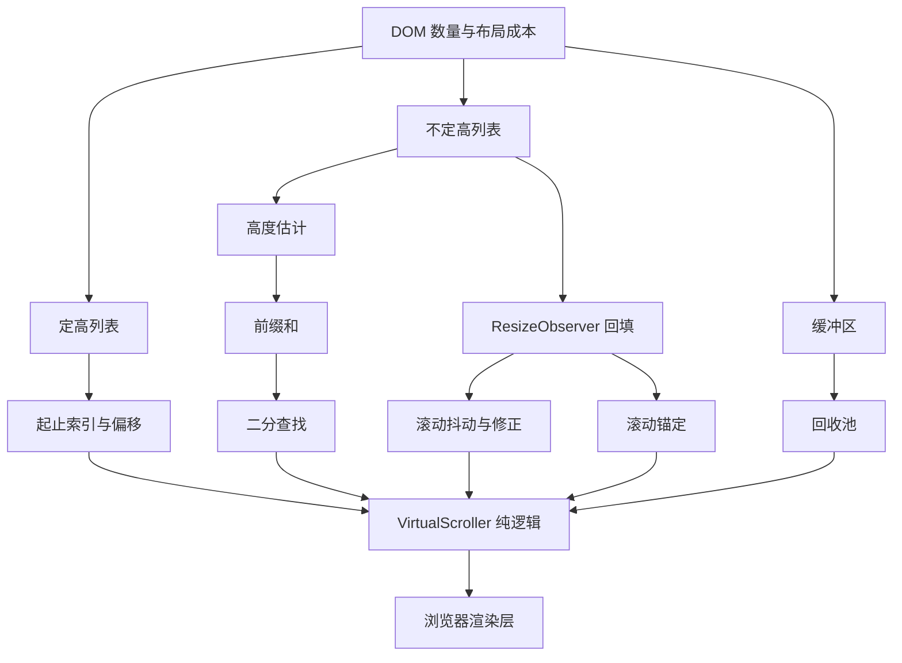
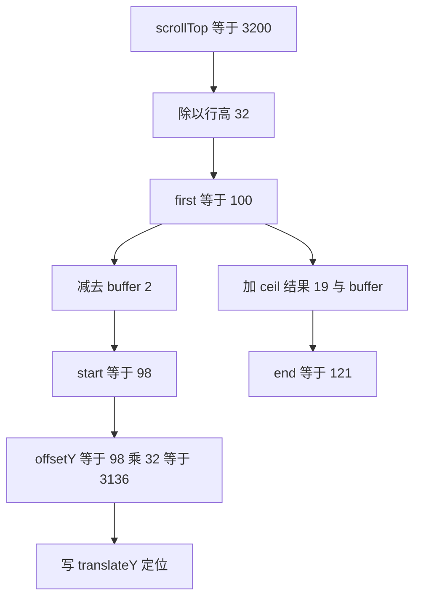
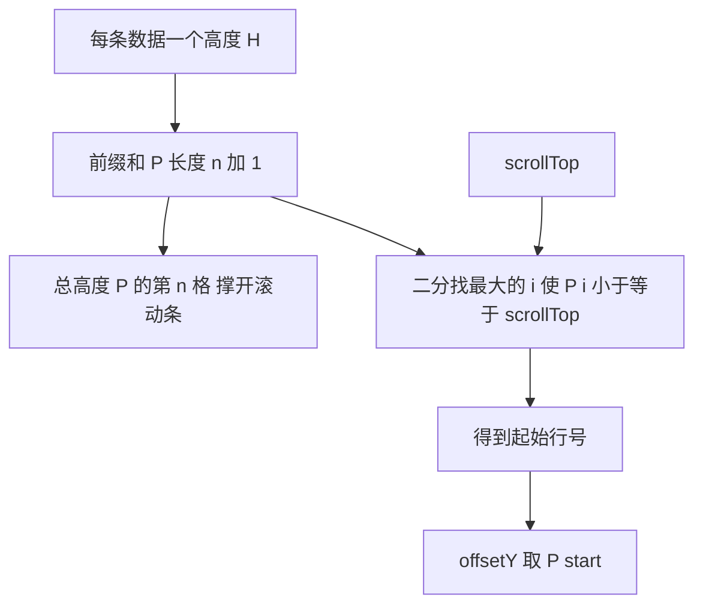
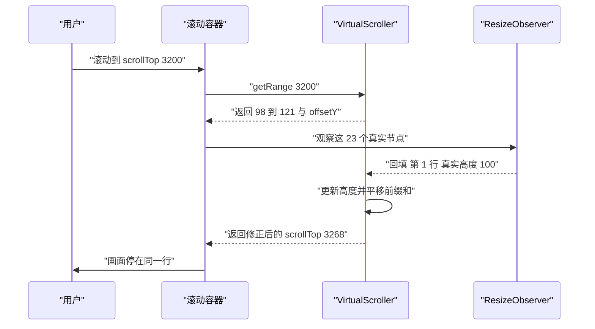
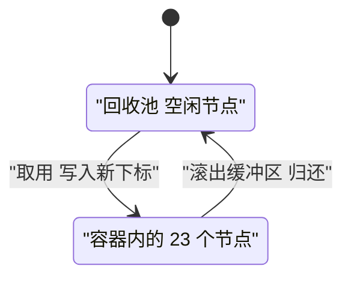
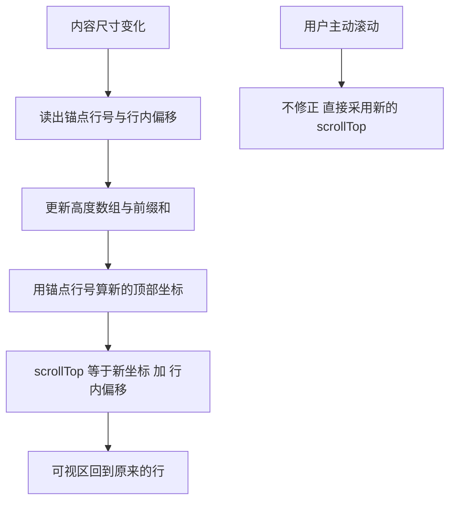
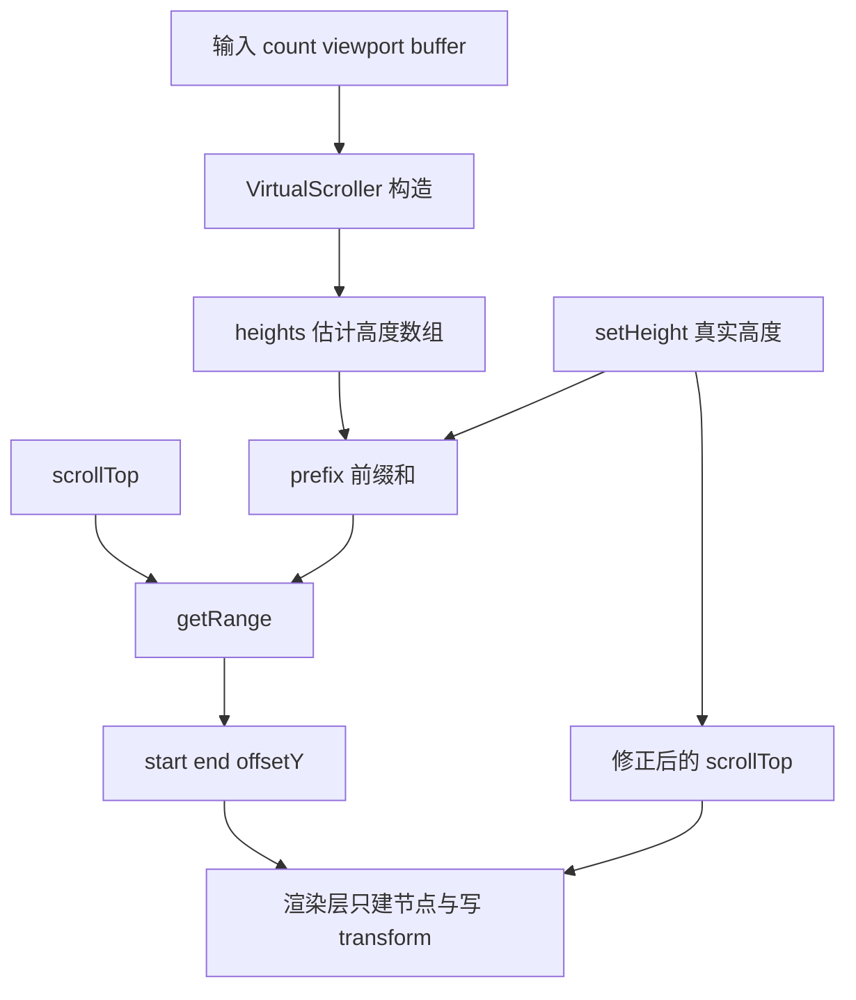
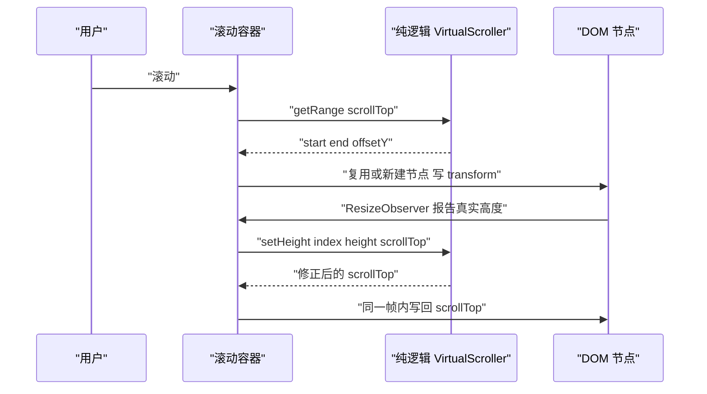

# 虚拟列表：定高、动态高度与回收池的手写实现

!!! abstract "学完这一页你能"

- 用 `performance.now()` 和 `offsetHeight` 测出 DOM 节点数量与布局耗时的关系，并说出 10 万条数据为什么必须做虚拟化。
- 写出定高列表的起止索引与偏移公式，并逐项解释每个变量。
- 用高度估计、前缀和与二分查找实现不定高列表，把定位成本压到 O(log n)。
- 用 `ResizeObserver` 回填真实高度、用回收池复用 DOM，并修正滚动抖动与锚定偏移。

## 0. 知识地图



建议按两条线读：先读第 1 到第 6 节，弄懂每个公式为什么长这样；再读第 7 和第 8 节，把公式拼成一个能跑的项目。

如果你只有 30 分钟，读第 1、2、3、7 节，跳过第 4 到第 6 节，先把定高列表跑起来。

第 4 到第 6 节只有在数据高度不统一时才必须读，读的时候手边开着第 7 节的测试文件。

## 1. DOM 数量与布局成本的关系

**先想一个问题**

后端一次返回 10 万条日志，你把它们全部渲染成 `li`。用户拖一次滚动条，页面要等接近两秒才动一下。

先怀疑数据太大，还是节点太多？

**心智模型**

!!! tip "心智模型"
    一句话模型：一次重排要处理的元素数量，等于你插进文档的节点数量。
    日常类比：在 10 万张卡片的盒子里翻找一张，和在 23 张卡片的盒子里翻找，动作一样，时间差约 4300 倍。
    类比不成立的地方：重排耗时不是严格线性，样式复杂度与是否进入合成层都会改变斜率。

!!! note "术语：虚拟列表"
    只渲染视口覆盖的那几行数据，靠一个撑高的空元素维持滚动条长度。例：10 万条数据只保留 23 个节点在文档里。

**图解**


1. 数据先变成节点，这一步发生在 `appendChild` 时。
2. 节点进入文档后，浏览器为每个节点计算样式。
3. 布局阶段为每个节点算出位置与尺寸，成本跟着节点数上升。
4. 绘制阶段生成像素指令，节点越多指令条数越多。
5. 合成阶段把这些层交给显卡，产出最终画面。
6. 整条链路走完，用户才能滚动与点击。

**一步一步来**

第 1 步：在浏览器里测出三个数量级的布局耗时。

```js
// 打开任意页面，在 DevTools 控制台粘贴执行
function measure(n) {
  const ul = document.createElement("ul");   // 每轮新建容器，避免复用上一轮节点
  for (let i = 0; i < n; i++) {
    const li = document.createElement("li"); // 一条数据一个节点
    li.textContent = "item-" + i;            // 写入文本，样式计算有活干
    ul.appendChild(li);                      // 挂入容器，此时还在内存里
  }
  document.body.appendChild(ul);             // 进入文档，触发首次布局
  const t0 = performance.now();              // 记录起点
  const h = ul.offsetHeight;                 // 读取尺寸，强制同步布局
  const t1 = performance.now();              // 记录终点
  ul.remove();                               // 清理，避免影响下一轮
  return { n, h, ms: Number((t1 - t0).toFixed(2)) };
}
console.table([measure(1000), measure(10000), measure(100000)]);
```

**这段代码在做什么**
- `ul` 在内存中组装，`appendChild` 到 `document.body` 之前不参与布局。
- `performance.now()` 返回毫秒浮点数，精度高于 `Date.now()`。
- 读取 `offsetHeight` 会强制浏览器立刻完成布局，被测对象是这一步。
- `ul.remove()` 把节点移出文档，下一轮不受上一轮影响。
- 结果对象交给 `console.table`，三行数字并排可读。

运行结果：控制台打印三行表格。`n` 从 1000 涨到 100000 时，`ms` 列应有明显上升。

若三行数值接近，先检查页面是否处于后台标签被节流，再检查是否把 `measure` 调用结果缓存了。

第 2 步：算出虚拟列表真正需要的节点数。

```js
// 固定行高下同时存在的节点数量
const ROW_HEIGHT = 32;       // 每行高度，单位像素
const VIEWPORT_HEIGHT = 600; // 滚动容器可视高度，单位像素
const BUFFER = 2;            // 视口上下各多渲染的行数

const visibleCount = Math.ceil(VIEWPORT_HEIGHT / ROW_HEIGHT); // 19
const renderedCount = visibleCount + BUFFER * 2;              // 23

console.log({ visibleCount, renderedCount });
console.log("节点数下降倍数", Math.round(100000 / renderedCount)); // 4348
```

**这段代码在做什么**
- `Math.ceil` 让部分露出的那一行也算进可视行，否则底部会缺一条。
- `BUFFER * 2` 是因为视口上方与下方各留 `BUFFER` 行。
- 结果是 23 个节点，与 10 万相比少了 4348 倍。
- 这两个数字是全页所有公式的基准。

运行结果：`{ visibleCount: 19, renderedCount: 23 }` 与 `节点数下降倍数 4348`。

**动手验证**

```js
// file: node-count.mjs
// 依赖：无（只用 Node 内置模块），Node 20 及以上
import assert from "node:assert/strict";

const ROW_HEIGHT = 32; // 每行高度
const BUFFER = 2;      // 上下各留的缓冲行数

// 固定行高下需要真实存在的节点数
function renderedCount(viewportHeight) {
  const visible = Math.ceil(viewportHeight / ROW_HEIGHT); // 至少覆盖视口
  return visible + BUFFER * 2;                            // 加上上下缓冲
}

// 朴素渲染的节点数
function naiveCount(total) {
  return total; // 每条数据一个节点
}

const total = 100000;
assert.equal(renderedCount(600), 23);   // 19 可见 加 4 缓冲
assert.equal(renderedCount(32), 5);     // 1 可见 加 4 缓冲
assert.equal(renderedCount(640), 24);   // 20 可见 加 4 缓冲
assert.equal(naiveCount(total), 100000);
assert.ok(renderedCount(600) * 400 < naiveCount(total)); // 相差 400 倍以上

console.log("viewport 600 ->", renderedCount(600), "个节点");
console.log("viewport 640 ->", renderedCount(640), "个节点");
console.log("全部渲染 ->", naiveCount(total), "个节点");
console.log("断言全部通过");
```

预期输出：

```
viewport 600 -> 23 个节点
viewport 640 -> 24 个节点
全部渲染 -> 100000 个节点
断言全部通过
```

**常见坑**

| 现象 | 原因 | 怎么修 |
| --- | --- | --- |
| 测出的 ms 接近 0 | 容器没进文档，没有触发布局 | 先 `appendChild` 再读 `offsetHeight` |
| 第二轮比第一轮快很多 | 上一轮节点还留在文档里 | 每轮结束调用 `ul.remove()` |
| 数字每次都跳 | 首次执行要编译代码 | 先跑一次 `measure(1000)` 丢弃结果 |
| 100 万条时高度异常 | 单个元素最高高度有上限，需核对官方文档：CSS 规范与各浏览器对块级元素高度的上限 | 降低行高或分段挂载 |

**小结**

1. 布局成本跟着 DOM 节点数量走，虚拟化的目标是把节点数压到视口覆盖的行数。
2. 600 像素视口、32 像素行高、上下各 2 行缓冲，只需要 23 个节点。
3. 测量时容器必须先进入文档，否则读到的布局耗时没有意义。

## 2. 定高列表：起止索引与偏移

**先想一个问题**

每条数据高度都固定是 32 像素，用户把容器的 `scrollTop` 拖到 3200。第一个该渲染的是第几条？

**心智模型**

!!! tip "心智模型"
    一句话模型：整块内容是一把等距的尺子，`scrollTop` 除以行高就得到当前行号。
    日常类比：电梯按钮等间距排列，你报出 3200 毫米，对方立刻知道是第 100 个按钮。
    类比不成立的地方：行高不等距时除法直接失效，必须换成前缀和加二分查找。

!!! note "术语：scrollTop"
    元素内容向上滚出的像素数。例：内容总高 3200000 像素、视口高 600 像素时，滚到底的 `scrollTop` 是 3199400。

**图解**



1. `scrollTop` 表示已经滚出去的距离。
2. 除以 32 向下取整，得到完全滚过去的第一行号 100。
3. 减去 2 行缓冲，实际渲染起点是 98。
4. 视口 600 像素覆盖 19 行，加 2 行缓冲，终点是 121。
5. 偏移量等于起点行号乘行高，结果是 3136 像素。

**一步一步来**

第 1 步：写一个纯函数算区间。

```js
// 定高列表的区间计算，输入全是数字，可以在 Node 里测
function getFixedRange({ scrollTop, viewportHeight, rowHeight, rowCount, buffer }) {
  const visible = Math.ceil(viewportHeight / rowHeight);     // 视口覆盖多少行
  const first = Math.floor(scrollTop / rowHeight);           // 完全滚过去的第一行
  const start = Math.max(0, first - buffer);                 // 向上留缓冲，别越界
  const end = Math.min(rowCount, first + visible + buffer);  // 向下留缓冲，别越界
  return { start, end, offsetY: start * rowHeight };         // offsetY 用于整体平移
}
```

**这段代码在做什么**
- `Math.floor(scrollTop / rowHeight)` 把像素位置换成行号。
- `Math.max(0, ...)` 保证顶部不出现负索引。
- `Math.min(rowCount, ...)` 保证底部不越界。
- `end` 是开区间，实际渲染范围是 `[start, end)`。
- `offsetY` 是这一批节点相对内容顶部的距离。

运行结果：`{ start: 98, end: 121, offsetY: 3136 }`。

第 2 步：把节点放进撑高的容器。

```js
// 只做布局，不做数据绑定
const totalHeight = rowCount * rowHeight;                 // 100000 乘 32 等于 3200000
spacer.style.height = totalHeight + "px";                 // 撑出滚动条
for (let i = start; i < end; i++) {
  const row = document.createElement("div");
  row.className = "row";
  row.style.transform = "translateY(" + (i * rowHeight) + "px)"; // 单行绝对定位
  row.textContent = String(i);                            // 先用行号占位
  spacer.appendChild(row);
}
```

**这段代码在做什么**
- `spacer` 是 `position: relative` 的高容器，负责提供正确的滚动高度。
- 每行用 `position: absolute` 脱离文档流，靠 `transform` 定位。
- 用 `transform` 而不是 `top`，因为 `top` 改动触发布局，`transform` 只触发合成。
- 单行 `translateY` 用绝对行号乘行高，与当前批次的顺序无关。

**动手验证**

```js
// file: fixed-range.mjs
// 依赖：无（只用 Node 内置模块），Node 20 及以上
import assert from "node:assert/strict";

function getFixedRange({ scrollTop, viewportHeight, rowHeight, rowCount, buffer }) {
  const visible = Math.ceil(viewportHeight / rowHeight);
  const first = Math.floor(scrollTop / rowHeight);
  const start = Math.max(0, first - buffer);
  const end = Math.min(rowCount, first + visible + buffer);
  return { start, end, offsetY: start * rowHeight };
}

const base = { viewportHeight: 600, rowHeight: 32, rowCount: 100000, buffer: 2 };
const total = base.rowCount * base.rowHeight;

assert.deepEqual(getFixedRange({ ...base, scrollTop: 0 }), { start: 0, end: 21, offsetY: 0 });
assert.deepEqual(getFixedRange({ ...base, scrollTop: 3200 }), { start: 98, end: 121, offsetY: 3136 });
assert.deepEqual(getFixedRange({ ...base, scrollTop: 3199400 }), { start: 99979, end: 100000, offsetY: 3199328 });

assert.equal(total, 3200000);
assert.equal(total - base.viewportHeight, 3199400); // 滚到底时的 scrollTop

console.log(getFixedRange({ ...base, scrollTop: 3200 }));
console.log("总高度", total, "最大 scrollTop", total - base.viewportHeight);
console.log("断言全部通过");
```

预期输出：

```
{ start: 98, end: 121, offsetY: 3136 }
总高度 3200000 最大 scrollTop 3199400
断言全部通过
```

**常见坑**

| 现象 | 原因 | 怎么修 |
| --- | --- | --- |
| 底部露出一条空白 | `visible` 用了 `floor`，露出的半行没算 | 改成 `Math.ceil` |
| 顶部出现负索引 | 没做下界夹取 | 起点写 `Math.max(0, ...)` |
| 滚动条长度不对 | `spacer` 高度没设成 `rowCount * rowHeight` | 同时设置高度与定位父级 |
| 滚动时画面闪 | 每帧新建节点触发布局 | 复用节点，只改 `transform` |

**小结**

1. 定高的全部计算就是两次除法加两次夹取。
2. 渲染区间用开区间 `[start, end)`，少一处加减错误。
3. `offsetY` 等于起点行号乘行高，用于整批节点的平移。

## 3. 不定高：高度估计、前缀和与二分查找

**先想一个问题**

聊天记录里的气泡有长有短，一条 28 像素，一条 210 像素。用户拖到中间时，你怎么知道当前是第几条？

**心智模型**

!!! tip "心智模型"
    一句话模型：给每条数据记一个高度，把高度累加成前缀和数组，定位就变成在有序数组里找位置。
    日常类比：书架的每层高度不同，你在侧面刻上每层底边的刻度，找书时对着刻度看。
    类比不成立的地方：书架刻度刻好不用改，这里的高度要等真实渲染后回填，刻度会变。

!!! note "术语：前缀和"
    数组 `H` 的前缀和 `P` 满足 `P[0] = 0` 且 `P[i+1] = P[i] + H[i]`，于是第 `i` 项的顶部坐标就是 `P[i]`。例：`H = [28, 210, 40]`，得到 `P = [0, 28, 238, 278]`。

!!! note "术语：二分查找"
    在有序数组里每次砍掉一半区间的查找方法，比较次数约等于 log2(n)。例：n 为 100000 时最多 17 次比较。

**图解**



1. 初始时每条数据都用估计高度填进高度数组 `H`。
2. 把 `H` 累加成 `P`，`P[i]` 是第 `i` 项的顶部坐标。
3. `P[n]` 是内容总高度，用来设置撑高元素的 `height`。
4. 滚动时用 `scrollTop` 在 `P` 里二分，找到最后一个满足 `P[i] <= scrollTop` 的 `i`。
5. `offsetY` 不再乘行高，直接读 `P[start]`。

**一步一步来**

第 1 步：构建前缀和。

```js
// heights 是每条数据的高度，初始全部填估计值
function buildPrefix(heights) {
  const n = heights.length;                // 数据条数
  const prefix = new Float64Array(n + 1);  // 多留一格给 P[0] 等于 0
  for (let i = 0; i < n; i++) {
    prefix[i + 1] = prefix[i] + heights[i]; // 累加得到下一格
  }
  return prefix;                           // prefix[n] 就是总高度
}
```

**这段代码在做什么**
- `Float64Array` 是定长浮点数组，长度在创建时确定，读取不走哈希表。
- 长度取 `n + 1` 是为了留一个值为 0 的哨兵位置。
- `prefix[n]` 等于所有高度之和，直接拿来当容器高度。
- 循环是 O(n)，只在初始化或大范围回填时跑。

运行结果：`heights = [28, 210, 40]` 时，`prefix` 为 `[0, 28, 238, 278]`。

第 2 步：二分查找定位。

```js
// 返回最后一个满足 prefix[i] <= y 的下标，结果落在 0 到 count-1
function findIndex(prefix, count, y) {
  let lo = 0, hi = count;                 // 在闭区间 lo 到 hi 里找
  while (lo < hi) {
    const mid = (lo + hi + 1) >> 1;       // 向上取整的中点，保证 lo 会前进
    if (prefix[mid] <= y) lo = mid;       // mid 还在滚动位置之上，向右缩
    else hi = mid - 1;                    // mid 已经在滚动位置之下，向左缩
  }
  return Math.min(lo, count - 1);         // 夹住滚动到底部的越界
}
```

**这段代码在做什么**
- `(lo + hi + 1) >> 1` 是向上取整的中点，配合 `lo = mid` 不会死循环。
- `prefix[mid] <= y` 说明第 `mid` 项顶部还在滚动位置之上，答案在右半边。
- 循环结束时 `lo` 就是最后一个满足条件的位置。
- `Math.min(lo, count - 1)` 处理 `y` 超过总高度的情况。

运行结果：`prefix = [0, 28, 238, 278]`、`count = 3`、`y = 100` 时返回 1。

第 3 步：算渲染区间。

```js
// 不定高列表的区间计算
function getRange(prefix, { count, scrollTop, viewportHeight, buffer }) {
  const first = findIndex(prefix, count, scrollTop);                 // 顶部行号
  const last = findIndex(prefix, count, scrollTop + viewportHeight); // 底部行号
  const start = Math.max(0, first - buffer);                         // 向上留缓冲
  const end = Math.min(count, last + 1 + buffer);                    // 向下留缓冲
  return { start, end, offsetY: prefix[start] };                     // 偏移读前缀和
}
```

**这段代码在做什么**
- 两次二分，一次定顶部，一次定底部，各 O(log n)。
- `last + 1` 把闭区间的 `last` 换成开区间的 `end`。
- `offsetY` 直接读 `prefix[start]`，不需要乘法。
- 缓冲用行数表达，与定高版本保持一致。

运行结果：`scrollTop = 3200`、`viewportHeight = 600`、全部高度 32 时返回 `{ start: 98, end: 121, offsetY: 3136 }`。

**动手验证**

```js
// file: dynamic-range.mjs
// 依赖：无（只用 Node 内置模块），Node 20 及以上
import assert from "node:assert/strict";

function buildPrefix(heights) {
  const n = heights.length;
  const prefix = new Float64Array(n + 1);
  for (let i = 0; i < n; i++) prefix[i + 1] = prefix[i] + heights[i];
  return prefix;
}

function findIndex(prefix, count, y, counter) {
  let lo = 0, hi = count;
  while (lo < hi) {
    if (counter) counter.n += 1;                 // 统计比较次数
    const mid = (lo + hi + 1) >> 1;
    if (prefix[mid] <= y) lo = mid; else hi = mid - 1;
  }
  return Math.min(lo, count - 1);
}

function getRange(prefix, { count, scrollTop, viewportHeight, buffer }) {
  const first = findIndex(prefix, count, scrollTop);
  const last = findIndex(prefix, count, scrollTop + viewportHeight);
  const start = Math.max(0, first - buffer);
  const end = Math.min(count, last + 1 + buffer);
  return { start, end, offsetY: prefix[start] };
}

const count = 100000;
const prefix = buildPrefix(new Array(count).fill(32));
const view = { count, viewportHeight: 600, buffer: 2 };

assert.equal(prefix[count], 3200000);
assert.equal(findIndex(prefix, count, 0), 0);
assert.equal(findIndex(prefix, count, 31.9), 0);
assert.equal(findIndex(prefix, count, 32), 1);
assert.equal(findIndex(prefix, count, 3200), 100);
assert.equal(findIndex(prefix, count, 3200000), 99999);
assert.deepEqual(getRange(prefix, { ...view, scrollTop: 3200 }), { start: 98, end: 121, offsetY: 3136 });

const counter = { n: 0 };
findIndex(prefix, count, 3200, counter);
assert.ok(counter.n <= 17, "10 万条定位比较次数应在 17 以内，实测 " + counter.n);

console.log("定位到的行号", findIndex(prefix, count, 3200));
console.log("比较次数", counter.n);
console.log("断言全部通过");
```

预期输出：

```
定位到的行号 100
比较次数 17
断言全部通过
```

**常见坑**

| 现象 | 原因 | 怎么修 |
| --- | --- | --- |
| 滚到底部空白 | 二分返回值没夹到 `count - 1` | 返回前用 `Math.min` 夹取 |
| 二分进入死循环 | 中点向下取整还写 `lo = mid` | 中点改用 `(lo + hi + 1) >> 1` |
| 位置算出来偏上 | 前缀和长度用了 `n` 而不是 `n + 1` | 预留 `P[0] = 0` |
| 回填一次卡几十毫秒 | 前缀和点更新要重算到末尾 | 换成树状数组，把更新降到 O(log n) |

**小结**

1. 不定高的核心是把高度存成前缀和，定位变成在有序数组里二分。
2. 比较次数是 log2(n)，10 万条对应 17 次。
3. 前缀和的点更新是 O(n)，这是后面回填优化的重点。

## 4. ResizeObserver 回填与滚动抖动

**先想一个问题**

你估的高度是 32，真实渲染出来是 100。用户往下滚了三屏之后，上面那些行的高度全变大了，内容顶部整体下移。

用户看到的内容会跳到哪里？

**心智模型**

!!! tip "心智模型"
    一句话模型：回填改变的是内容坐标系，必须同时修正 `scrollTop`，让用户盯着的那一行留在原地。
    日常类比：你在读书，前面被人塞进 5 页，你把书签往后挪同样多的页数，才能停在同一句话上。
    类比不成立的地方：书签只挪一次，而滚动每帧都在变，修正必须在回填的同一帧内完成。

!!! note "术语：ResizeObserver"
    浏览器提供的接口，用来观察元素尺寸变化。例：`new ResizeObserver(cb).observe(el)`，元素每次尺寸变化都会调用 `cb`。

!!! note "术语：滚动抖动"
    滚动过程中内容位置反复上下跳动，视觉上表现为闪烁或回弹。

**图解**



1. 用户滚动，容器抛出 `scroll` 事件。
2. 纯逻辑层算出要渲染的区间与偏移。
3. 渲染层把这批节点插进 DOM，并交给 `ResizeObserver` 观察。
4. 某个节点布局完成，`ResizeObserver` 报告真实高度。
5. 纯逻辑层把新高度写进高度数组，重算受影响的那一段前缀和。
6. 如果被改的行在锚点上方，`scrollTop` 加上高度差，画面保持稳定。

**一步一步来**

第 1 步：接住真实高度并回填。

```js
// 回填真实高度，返回需要写给容器的 scrollTop
setHeight(index, height, scrollTop) {
  if (this.measured[index]) return scrollTop;      // 已经量过，幂等返回
  const anchor = this.findIndex(scrollTop);        // 先记住当前锚点行号
  const delta = height - this.heights[index];      // 高度变化量，可能是负数
  this.heights[index] = height;                    // 写入真实高度
  this.measured[index] = 1;                        // 打标记，避免重复回填
  this.rebuild(index, this.count);                 // 这一项之后的前缀和整体平移
  return index < anchor ? scrollTop + delta : scrollTop; // 在锚点上方就补回差值
}
```

**这段代码在做什么**
- `measured` 是 `Uint8Array`，用 0 和 1 表示是否量过，比对象数组省内存。
- `anchor` 必须在写入高度之前算出来，否则行号会漂。
- `delta` 可能是负数，说明真实高度小于估计高度。
- `index < anchor` 时才需要补 `scrollTop`，改动在锚点下方不影响可视区。
- `rebuild` 只重算 `index` 之后的格子，前面的格子不受影响。

运行结果：`index = 0`、`height = 100`、原高度 32、`scrollTop = 3200` 时返回 `3268`。

第 2 步：在渲染层挂上观察器。

```js
// rows 是当前渲染的节点集合，dataset.index 是数据下标
const observer = new ResizeObserver((entries) => {
  for (const entry of entries) {
    const index = Number(entry.target.dataset.index);           // 读回数据下标
    const height = entry.target.getBoundingClientRect().height; // 真实渲染高度
    const next = scroller.setHeight(index, height, viewport.scrollTop);
    if (next !== viewport.scrollTop) viewport.scrollTop = next; // 只在需要时写回
  }
});
```

**这段代码在做什么**
- `dataset.index` 把 DOM 节点和纯逻辑层的数组下标对上。
- `getBoundingClientRect().height` 取的是布局之后的真实高度。
- `if (next !== viewport.scrollTop)` 避免无意义地写 `scrollTop`，写入会触发新的 `scroll` 事件。
- `ResizeObserver` 回调在布局之后、绘制之前执行，修正发生在同一帧内。

第 3 步：确认修正后锚点不变。

```js
// 修正前锚点应是 100，修正后还应是 100
const before = scroller.findIndex(3200);   // 用旧前缀和查，得到 100
const fixed = scroller.setHeight(0, 100, 3200); // 第 1 行从 32 变成 100
const after = scroller.findIndex(fixed);   // 用修正后的 scrollTop 再查
console.log({ before, fixed, after });
```

**这段代码在做什么**
- 修正前用旧前缀和查到锚点行号。
- 回填第 0 行，高度从 32 变成 100，差值 68。
- 用修正后的 `scrollTop = 3268` 再查一次，行号保持 100。
- 行号不变说明用户看到的内容没有跳。

运行结果：`{ before: 100, fixed: 3268, after: 100 }`。

**动手验证**

```js
// file: anchor-fix.mjs
// 依赖：无（只用 Node 内置模块），Node 20 及以上
import assert from "node:assert/strict";

class HeightModel {
  constructor(count, estimate) {
    this.count = count;
    this.heights = new Float64Array(count).fill(estimate);
    this.prefix = new Float64Array(count + 1);
    this.measured = new Uint8Array(count);
    this.rebuild(0, count);
  }
  rebuild(from, to) {
    let sum = this.prefix[from];
    for (let i = from; i < to; i++) { sum += this.heights[i]; this.prefix[i + 1] = sum; }
  }
  findIndex(y) {
    let lo = 0, hi = this.count;
    while (lo < hi) {
      const mid = (lo + hi + 1) >> 1;
      if (this.prefix[mid] <= y) lo = mid; else hi = mid - 1;
    }
    return Math.min(lo, this.count - 1);
  }
  setHeight(index, height, scrollTop) {
    if (this.measured[index]) return scrollTop;
    const anchor = this.findIndex(scrollTop);
    const delta = height - this.heights[index];
    this.heights[index] = height;
    this.measured[index] = 1;
    this.rebuild(index, this.count);
    return index < anchor ? scrollTop + delta : scrollTop;
  }
}

const m = new HeightModel(100000, 32);
const anchorBefore = m.findIndex(3200);
const fixed = m.setHeight(0, 100, 3200);
const anchorAfter = m.findIndex(fixed);

assert.equal(anchorBefore, 100);
assert.equal(fixed, 3268);
assert.equal(anchorAfter, 100);
assert.equal(m.setHeight(0, 999, fixed), fixed); // 重复回填被忽略

const m2 = new HeightModel(100000, 32);
assert.equal(m2.setHeight(500, 100, 3200), 3200); // 改动在锚点下方，不动

console.log({ anchorBefore, fixed, anchorAfter });
console.log("断言全部通过");
```

预期输出：

```
{ anchorBefore: 100, fixed: 3268, anchorAfter: 100 }
断言全部通过
```

**常见坑**

| 现象 | 原因 | 怎么修 |
| --- | --- | --- |
| 滚动时上下跳动 | 回填后没同步修正 `scrollTop` | 在锚点上方改动时给 `scrollTop` 加 `delta` |
| 页面陷入循环 | 写 `scrollTop` 触发 `scroll` 又触发回填 | 用 `measured` 标记，只在值变化时写入 |
| 高度反复变化 | 观察了会随滚动改变尺寸的元素 | 只观察行容器本身 |
| 首屏瞬间跳动 | 估计高度与真实高度差太大 | 用首批真实高度更新估计值 |

**小结**

1. 回填改的是内容坐标，用户认的是视觉位置，两者靠 `scrollTop` 对齐。
2. 修正公式是：改动发生在锚点上方时，`scrollTop` 加上高度差。
3. `measured` 标记是防重入的关键，没有它会出现无限回填。

## 5. 缓冲区与回收池

**先想一个问题**

滚动到底部时，你需要新建 23 个节点吗？上一帧滚出去的那些节点，为什么不能直接拿来用？

**心智模型**

!!! tip "心智模型"
    一句话模型：缓冲区决定提前渲染几行，回收池决定这些行用新建节点还是复用节点。
    日常类比：餐厅备餐台上固定摆 23 个盘子，客人走了就洗一洗放回去，不必每次重买。
    类比不成立的地方：盘子复用不用处理状态，DOM 节点带着文本与事件监听器，复用前要清理。

!!! note "术语：缓冲区"
    在可视区上下额外渲染的行数。例：可视 19 行加缓冲 4 行，一共 23 行。

!!! note "术语：回收池"
    一块存放已经滚出视口、可以再次使用的 DOM 节点的内存区。

**图解**



1. 初始时池子是空的。
2. 首屏要 23 个节点，池子给不出，于是新建 23 个。
3. 滚动后下标变化，容器里已有的节点直接改文本与 `transform`，池子不参与。
4. 数据量小于节点数时，多出来的节点摘下来放进池子。
5. 池子有货就不再新建，`document.createElement` 的调用次数停在 23。

**一步一步来**

第 1 步：维护一张下标到节点的表。

```js
// rendered 是 index 到节点的映射，pool 是闲置节点数组
function sync(nextIndexes, renderItem, offsetOf) {
  const next = new Set(nextIndexes);              // 这一帧要显示的下标
  for (const [index, el] of rendered) {
    if (!next.has(index)) {                       // 已经滚出区间
      el.remove();                                // 从容器摘下来
      pool.push(el);                              // 放回池子
      rendered.delete(index);                     // 表里删掉
    }
  }
  for (const index of next) {
    let el = rendered.get(index);
    if (!el) {
      el = pool.pop() || document.createElement("div"); // 优先复用
      el.style.transform = "translateY(" + offsetOf(index) + "px)";
      renderItem(index, el);                      // 写入这一条的数据
      rendered.set(index, el);
    }
  }
}
```

**这段代码在做什么**
- `next` 是这一帧的目标下标集合，`rendered` 是上一帧的结果。
- 差集分两趟处理：先回收多出来的，再补齐缺少的。
- `pool.pop() || document.createElement("div")` 优先复用，池子空了才新建。
- `rendered` 用 `Map` 而不是数组，查找是 O(1)。
- 复用节点时只改 `transform` 与内容，不用重新插入。

第 2 步：给缓冲区一个数值依据。

```js
// 快速滑动时，一帧滚过的距离决定缓冲区要留几行
const FLING_SPEED = 3000;                            // 像素每秒，快速滑动量级
const FRAME_MS = 16;                                 // 一帧约 16 毫秒
const ROW_HEIGHT = 32;                               // 每行高度
const perFrame = (FLING_SPEED * FRAME_MS) / 1000;    // 一帧滚过 48 像素
const rowsToCover = Math.ceil(perFrame / ROW_HEIGHT); // 等于 2 行
console.log({ perFrame, rowsToCover });
```

**这段代码在做什么**
- 快速滑动每帧滚过 48 像素，视口外的下一行要提前备好。
- 48 像素对应 2 行，所以上下各留 2 行能覆盖一帧的位移。
- 缓冲留得越多，首屏渲染越重；2 行是速度与节点数之间的起点。
- 具体数值要按你项目里的实际滑动速度测一遍。

运行结果：`{ perFrame: 48, rowsToCover: 2 }`。

**动手验证**

```js
// file: pool-sync.mjs
// 依赖：无（只用 Node 内置模块），Node 20 及以上
import assert from "node:assert/strict";

class Pool {
  constructor() { this.idle = []; this.created = 0; this.reused = 0; }
  get() {
    if (this.idle.length > 0) { this.reused += 1; return "node-" + this.reused; } // 复用
    this.created += 1;                                                            // 新建
    return "node-new-" + this.created;
  }
  release(node) { this.idle.push(node); }
}

function sync(rendered, pool, nextIndexes) {
  const next = new Set(nextIndexes);
  for (const [index, node] of [...rendered]) {
    if (!next.has(index)) { rendered.delete(index); pool.release(node); }
  }
  for (const index of next) if (!rendered.has(index)) rendered.set(index, pool.get());
}

const pool = new Pool();
const rendered = new Map();

sync(rendered, pool, [0, 1, 2, 3, 4]);
assert.equal(rendered.size, 5);
assert.equal(pool.created, 5);
assert.equal(pool.reused, 0);

sync(rendered, pool, [2, 3, 4, 5, 6]);
assert.equal(rendered.size, 5);
assert.equal(pool.created, 5);   // 没有新建
assert.equal(pool.reused, 2);    // 下标 5 与 6 复用了 0 与 1

sync(rendered, pool, [100, 101, 102, 103, 104]);
assert.equal(rendered.size, 5);
assert.equal(pool.created, 5);   // 仍然是 5 个节点
assert.equal(pool.reused, 7);
assert.deepEqual([...rendered.keys()].sort((a, b) => a - b), [100, 101, 102, 103, 104]);

console.log("新建节点次数", pool.created, "复用次数", pool.reused);
console.log("断言全部通过");
```

预期输出：

```
新建节点次数 5 复用次数 7
断言全部通过
```

**常见坑**

| 现象 | 原因 | 怎么修 |
| --- | --- | --- |
| 节点数缓慢上涨 | 归还时忘了从 `rendered` 删除 | 回收与删除成对出现 |
| 复用的节点显示上一条数据 | 只改了 `transform` 没改内容 | 复用后立刻重写文本与状态 |
| 快速滑动露出白边 | 缓冲区小于一帧的滚过行数 | 用 速度 乘 16 除以行高 算缓冲 |
| 滚动条长度跳变 | 池中节点还留在容器里占位置 | 归还前先调用 `remove()` |

**小结**

1. 缓冲区让内容提前准备好，回收池让节点数量停在视口行数。
2. 节点数量稳定后，`document.createElement` 的调用次数不再增长。
3. 复用节点必须重写内容，否则会看到上一条数据。

## 6. 滚动锚定

**先想一个问题**

用户正在看第 500 行，你在第 500 行上方插入了 200 像素高的内容。如果不做处理，用户会看到内容突然往下窜一屏。

**心智模型**

!!! tip "心智模型"
    一句话模型：锚定就是先记住用户盯着哪一行，内容坐标变化后把这一行拉回原来的屏幕位置。
    日常类比：你在书里夹了书签，前面插入一整页，你把书签往后顺延一页，眼睛不用重找。
    类比不成立的地方：用户主动滚动时锚点应该跟着换，只有内容引起的偏移才需要修正。

!!! note "术语：滚动锚定"
    在内容尺寸变化时保持可视区域位置不跳的处理方式。

**图解**



1. 尺寸变化发生时，先记录锚点行号与它在行内的偏移。
2. 更新高度与前缀和，此时内容坐标系已经变了。
3. 用同一个行号在新前缀和里查它的顶部坐标。
4. 新的 `scrollTop` 等于新坐标加上行内偏移。
5. 用户主动滚动时不走这套逻辑，避免跟手指抢方向盘。

**一步一步来**

第 1 步：记录锚点。

```js
// 记录用户当前盯着哪一行，以及行内偏移
function captureAnchor(prefix, count, scrollTop) {
  const index = findIndex(prefix, count, scrollTop); // 锚点行号
  const top = prefix[index];                         // 这一行的顶部坐标
  return { index, innerOffset: scrollTop - top };    // 行内偏移，单位像素
}
```

**这段代码在做什么**
- `findIndex` 复用上一节的二分，成本 O(log n)。
- `innerOffset` 是锚点行内部已经滚过了多少像素。
- 存行号加行内偏移，而不存绝对像素，因为绝对像素在回填后会失真。
- 返回对象只包含两个数字，方便在 Node 里做深度比较。

第 2 步：用锚点还原位置。

```js
// 高度更新完成后，用锚点算回新的 scrollTop
function restoreAnchor(prefix, anchor) {
  const top = prefix[anchor.index];  // 新的顶部坐标
  return top + anchor.innerOffset;   // 加回行内偏移
}
```

**这段代码在做什么**
- `prefix` 已经是最新值，同一个行号拿到的是新坐标。
- 加回 `innerOffset`，屏幕上的内容不会上下平移。
- 函数只读不写，方便直接断言。
- 把修正拆成读与写两步，是因为写 `scrollTop` 会触发事件。

第 3 步：区分两种滚动来源。

```js
// 记录程序写入 scrollTop 的时间窗口
let programmaticUntil = 0;
function onScroll() {
  if (performance.now() < programmaticUntil) return; // 程序触发的，跳过
  render(viewport.scrollTop);                        // 真实用户位置
}
function setScrollTop(value) {
  programmaticUntil = performance.now() + 50;        // 50 毫秒窗口
  viewport.scrollTop = value;
}
```

**这段代码在做什么**
- 程序写 `scrollTop` 也会触发 `scroll` 事件，不标记会形成回环。
- 用时间窗口而不是布尔量，因为一次写入可能触发多次事件。
- 50 毫秒覆盖同一帧的事件派发，具体数值按实测调整。
- 用户滚动路径只更新状态，不触发锚定修正。

**动手验证**

```js
// file: anchor.mjs
// 依赖：无（只用 Node 内置模块），Node 20 及以上
import assert from "node:assert/strict";

function buildPrefix(heights) {
  const prefix = new Float64Array(heights.length + 1);
  for (let i = 0; i < heights.length; i++) prefix[i + 1] = prefix[i] + heights[i];
  return prefix;
}
function findIndex(prefix, count, y) {
  let lo = 0, hi = count;
  while (lo < hi) {
    const mid = (lo + hi + 1) >> 1;
    if (prefix[mid] <= y) lo = mid; else hi = mid - 1;
  }
  return Math.min(lo, count - 1);
}
function captureAnchor(prefix, count, scrollTop) {
  const index = findIndex(prefix, count, scrollTop);
  return { index, innerOffset: scrollTop - prefix[index] };
}
function restoreAnchor(prefix, anchor) {
  return prefix[anchor.index] + anchor.innerOffset;
}

const heights = new Array(1000).fill(32);
let prefix = buildPrefix(heights);
const anchor = captureAnchor(prefix, 1000, 1600);
assert.deepEqual(anchor, { index: 50, innerOffset: 0 });

heights[10] = 232;                                 // 第 10 行多出 200 像素
prefix = buildPrefix(heights);
assert.equal(restoreAnchor(prefix, anchor), 1800); // scrollTop 顺延 200
assert.equal(restoreAnchor(prefix, { index: 50, innerOffset: 17 }), 1817);

console.log("锚点", anchor, "修正后", restoreAnchor(prefix, anchor));
console.log("断言全部通过");
```

预期输出：

```
锚点 { index: 50, innerOffset: 0 } 修正后 1800
断言全部通过
```

**常见坑**

| 现象 | 原因 | 怎么修 |
| --- | --- | --- |
| 页面反复抖动 | 程序写 `scrollTop` 触发的 `scroll` 也走了锚定 | 用时间窗口标记程序写入 |
| 用户下滚却被拽回去 | 用户滚动也走了锚定修正 | 只在内容尺寸变化时修正 |
| 锚点漂移几像素 | 只存了行号没存行内偏移 | 同时存 `innerOffset` |
| 修正后仍跳一屏 | 锚点用了绝对像素 | 锚点改用行号加行内偏移 |

**小结**

1. 锚点用行号加行内偏移表示，不用绝对像素。
2. 内容变化后新的 `scrollTop` 等于新顶部坐标加行内偏移。
3. 程序写 `scrollTop` 必须打标记，否则会形成滚动回环。

## 7. 手写 VirtualScroller：纯逻辑与 Node 测试

**先想一个问题**

把区间计算、前缀和、二分、回填、锚定拆成类方法之后，你怎样在不开浏览器的情况下确认它们都对？

**心智模型**

!!! tip "心智模型"
    一句话模型：把所有与 DOM 无关的计算装进一个类，输入数字、输出数字，就能在 Node 里跑断言。
    日常类比：计算器不必接上打印机也能算出结果，打印机只负责把结果印出来。
    类比不成立的地方：真实高度来自浏览器布局，Node 里只能用模拟高度数组代替。

**图解**



1. 构造函数接收条数、估计高度、视口高度、缓冲行数。
2. 构造时把估计高度填满 `heights`，再算一次前缀和。
3. `getRange` 只读，返回 `start`、`end`、`offsetY`。
4. `setHeight` 写高度，并把修正后的 `scrollTop` 交给调用方。
5. 渲染层从 `getRange` 拿区间，从 `setHeight` 拿修正值。

**一步一步来**

第 1 步：类骨架与前缀和重建。

```js
// 纯逻辑层，不含任何 DOM API
class VirtualScroller {
  constructor({ count, estimateHeight = 32, viewportHeight, buffer = 2 }) {
    this.count = count;                          // 总条数
    this.viewportHeight = viewportHeight;        // 视口高度
    this.buffer = buffer;                        // 上下缓冲行数
    this.heights = new Float64Array(count).fill(estimateHeight); // 每条高度
    this.prefix = new Float64Array(count + 1);   // 前缀和，多一格哨兵
    this.measured = new Uint8Array(count);       // 是否量过真实高度
    this.probes = 0;                             // 二分比较次数，方便测试
    this.rebuild(0, count);                      // 首次全量重建
  }
  rebuild(from, to) {
    let sum = this.prefix[from];                 // 从区间左端的累计值起算
    for (let i = from; i < to; i++) {
      sum += this.heights[i];                    // 累加当前项
      this.prefix[i + 1] = sum;                  // 写入下一格
    }
  }
}
```

**这段代码在做什么**
- `Float64Array` 定长，长度在构造时确定，读取不走哈希表。
- `prefix` 长度是 `count + 1`，因为 `prefix[0]` 固定为 0。
- `rebuild(from, to)` 支持局部重建，回填时只跑一段。
- `probes` 记录二分比较次数，测试用它验证 O(log n)。
- 类里没有 `document`、`window`，所以能直接在 Node 里导入。

第 2 步：二分与区间。

```js
  findIndex(y) {
    let lo = 0, hi = this.count;             // 搜索区间
    while (lo < hi) {
      this.probes += 1;                      // 记一次比较
      const mid = (lo + hi + 1) >> 1;        // 向上取整的中点
      if (this.prefix[mid] <= y) lo = mid;   // 位置在 mid 之下，往右
      else hi = mid - 1;                     // 位置在 mid 之上，往左
    }
    return Math.min(lo, this.count - 1);     // 夹住底部越界
  }
  getRange(scrollTop) {
    const first = this.findIndex(scrollTop);                    // 顶部行
    const last = this.findIndex(scrollTop + this.viewportHeight); // 底部行
    const start = Math.max(0, first - this.buffer);             // 上缓冲
    const end = Math.min(this.count, last + 1 + this.buffer);   // 下缓冲
    return { start, end, offsetY: this.prefix[start] };         // 偏移读前缀和
  }
```

**这段代码在做什么**
- 两次二分调用各消耗一次比较计数。
- `findIndex` 返回闭区间行号，`getRange` 转成开区间的 `end`。
- `Math.max` 与 `Math.min` 保证区间落在 0 到 `count` 之间。
- `offsetY` 是这一批节点的平移起点。

运行结果：`scrollTop = 3200`、`viewportHeight = 600`、`buffer = 2`、全部高度 32 时返回 `{ start: 98, end: 121, offsetY: 3136 }`。

第 3 步：回填与总高度。

```js
  setHeight(index, height, scrollTop) {
    if (this.measured[index]) return scrollTop;      // 已量过，幂等返回
    const anchor = this.findIndex(scrollTop);        // 改之前先记锚点
    const delta = height - this.heights[index];      // 高度差
    this.heights[index] = height;                    // 写入真实值
    this.measured[index] = 1;                        // 打标记
    this.rebuild(index, this.count);                 // 后续前缀和整体平移
    return index < anchor ? scrollTop + delta : scrollTop; // 上方改动才补
  }
  get totalHeight() {
    return this.prefix[this.count];                  // 总高度交给容器
  }
```

**这段代码在做什么**
- `measured[index]` 为 1 时直接返回，同一行第二次回填不再改数据。
- `anchor` 必须在写入之前算，否则行号会漂。
- `rebuild(index, this.count)` 让 `prefix[index]` 保持不变，之后的格子整体加 `delta`。
- `totalHeight` 用 getter 暴露，每次读到都是最新值。

**动手验证**

```js
// file: virtual-scroller.mjs
// 依赖：无（只用 Node 内置模块），Node 20 及以上
import assert from "node:assert/strict";

class VirtualScroller {
  constructor({ count, estimateHeight = 32, viewportHeight, buffer = 2 }) {
    this.count = count;
    this.viewportHeight = viewportHeight;
    this.buffer = buffer;
    this.heights = new Float64Array(count).fill(estimateHeight);
    this.prefix = new Float64Array(count + 1);
    this.measured = new Uint8Array(count);
    this.probes = 0;
    this.rebuild(0, count);
  }
  rebuild(from, to) {
    let sum = this.prefix[from];
    for (let i = from; i < to; i++) { sum += this.heights[i]; this.prefix[i + 1] = sum; }
  }
  findIndex(y) {
    let lo = 0, hi = this.count;
    while (lo < hi) {
      this.probes += 1;
      const mid = (lo + hi + 1) >> 1;
      if (this.prefix[mid] <= y) lo = mid; else hi = mid - 1;
    }
    return Math.min(lo, this.count - 1);
  }
  getRange(scrollTop) {
    const first = this.findIndex(scrollTop);
    const last = this.findIndex(scrollTop + this.viewportHeight);
    const start = Math.max(0, first - this.buffer);
    const end = Math.min(this.count, last + 1 + this.buffer);
    return { start, end, offsetY: this.prefix[start] };
  }
  setHeight(index, height, scrollTop) {
    if (this.measured[index]) return scrollTop;
    const anchor = this.findIndex(scrollTop);
    const delta = height - this.heights[index];
    this.heights[index] = height;
    this.measured[index] = 1;
    this.rebuild(index, this.count);
    return index < anchor ? scrollTop + delta : scrollTop;
  }
  get totalHeight() { return this.prefix[this.count]; }
}

const count = 100000;
const vs = new VirtualScroller({ count, viewportHeight: 600, buffer: 2 });

assert.equal(vs.totalHeight, 3200000);

vs.probes = 0;
assert.equal(vs.findIndex(3200), 100);
const probesForOneLookup = vs.probes;
assert.ok(probesForOneLookup <= 17, "10 万条定位应在 17 次以内，实测 " + probesForOneLookup);

assert.deepEqual(vs.getRange(0), { start: 0, end: 21, offsetY: 0 });
assert.deepEqual(vs.getRange(3200), { start: 98, end: 121, offsetY: 3136 });
assert.deepEqual(vs.getRange(3199400), { start: 99979, end: 100000, offsetY: 3199328 });

const fixed = vs.setHeight(0, 100, 3200);
assert.equal(fixed, 3268);
assert.equal(vs.findIndex(fixed), 100);
assert.equal(vs.setHeight(0, 500, fixed), fixed); // 重复回填幂等
assert.equal(vs.totalHeight, 3200068);

for (let i = 1; i < 200; i++) vs.setHeight(i, 40, 3200); // 批量回填
for (let i = 1; i <= count; i++) assert.ok(vs.prefix[i] >= vs.prefix[i - 1]);

const t0 = performance.now();
vs.findIndex(1500000);
const t1 = performance.now();
assert.equal(vs.totalHeight, 3201660);

console.log("定位一次耗时", (t1 - t0).toFixed(4), "毫秒（机型相关）");
console.log("10 万条一次定位比较次数", probesForOneLookup);
console.log("总高度", vs.totalHeight);
console.log("断言全部通过");
```

预期输出：

```
定位一次耗时 0.0x 毫秒（机型相关）
10 万条一次定位比较次数 17
总高度 3201660
断言全部通过
```

**常见坑**

| 现象 | 原因 | 怎么修 |
| --- | --- | --- |
| 定位退化成线性 | 用线性扫描代替二分 | 用二分，并把 `probes` 写进断言 |
| 回填 200 次就卡 | `rebuild` 每次都跑到 `count`，复杂度 O(n) | 换树状数组，点更新降到 O(log n) |
| 前缀和单调性被破坏 | 局部重建把 `prefix[from]` 也改了 | `rebuild` 从 `prefix[from]` 起算 |
| 断言数值对不上 | 浮点累加误差 | 高度用整数，比较用 `assert.deepEqual` |

**小结**

1. 纯逻辑层不碰 DOM，才能在 Node 里用断言覆盖每条公式。
2. `probes` 这类计数器让复杂度结论可以被测试验证，而不是靠感觉。
3. 前缀和的点更新是 O(n)，数据量大时需要换数据结构。

## 8. 浏览器渲染层：完整 HTML

**先想一个问题**

纯逻辑算出了 `{ start: 98, end: 121, offsetY: 3136 }` 和一个修正后的 `scrollTop`。剩下的事浏览器怎么做才不闪烁？

**心智模型**

!!! tip "心智模型"
    一句话模型：渲染层只做三件事，把节点挂上去、把位置写成 transform、把真实高度报回去。
    日常类比：舞台调度只管把演员放到指定位置，剧本与台词由编剧决定。
    类比不成立的地方：演员不会因为站位改变身高，DOM 节点会因为内容换行而改变高度。

!!! note "术语：合成层"
    浏览器把一部分元素单独成层交给显卡绘制的机制。例：写 `will-change: transform` 会让元素提前进入独立层。

**图解**



1. 用户滚动触发 `scroll` 事件。
2. 容器把 `scrollTop` 交给纯逻辑层。
3. 纯逻辑层返回区间与偏移。
4. 渲染层把这一批节点定位到 `offsetY` 与单行前缀和决定的位置。
5. `ResizeObserver` 报告每行真实高度。
6. 纯逻辑层算出修正值，渲染层在同一帧写回 `scrollTop`。

**一步一步来**

第 1 步：搭骨架与样式。

```html
<style>
  #viewport { height: 600px; overflow-y: auto; position: relative; }
  #spacer { position: relative; width: 100%; }
  .row { position: absolute; left: 0; right: 0; box-sizing: border-box;
         padding: 6px 10px; border-bottom: 1px solid #eee; will-change: transform; }
</style>
<div id="viewport"><div id="spacer"></div></div>
```

**这段代码在做什么**
- `#viewport` 是滚动容器，`overflow-y: auto` 决定滚动条出现在它身上。
- `#spacer` 用 `position: relative` 建立定位上下文，高度由脚本设置。
- `.row` 绝对定位后脱离文档流，不再影响兄弟节点的位置计算。
- `will-change: transform` 提示浏览器把这一层提前交给合成。

第 2 步：装配数据与逻辑层。

```js
const COUNT = 100000;                 // 总条数
const viewport = document.getElementById("viewport");
const spacer = document.getElementById("spacer");
const scroller = new VirtualScroller({
  count: COUNT,
  estimateHeight: 32,                 // 初始估计高度
  viewportHeight: viewport.clientHeight, // 可见高度，不含边框
  buffer: 2                           // 上下各留 2 行
});
spacer.style.height = scroller.totalHeight + "px"; // 撑出滚动条
```

**这段代码在做什么**
- `viewport.clientHeight` 取的是容器可见高度，不含边框。
- `scroller.totalHeight` 是前缀和数组的最后一格，等于全部高度之和。
- 撑高元素的高度在每次回填后都要重设一次。
- `VirtualScroller` 来自上一节的类，两个文件之间没有耦合到 DOM。

第 3 步：同步节点并接住高度报告。

```js
const rendered = new Map(); // 下标到节点的映射
const pool = [];            // 回收池
const observer = new ResizeObserver((entries) => {
  let next = viewport.scrollTop;
  let changed = false;
  for (const entry of entries) {
    const index = Number(entry.target.dataset.index);
    const height = entry.target.getBoundingClientRect().height;
    const fixed = scroller.setHeight(index, height, next);
    if (fixed !== next) { next = fixed; changed = true; } // 锚点上方改动
  }
  if (changed) viewport.scrollTop = next; // 同一帧写回
});
```

**这段代码在做什么**
- `dataset.index` 是节点与数据下标之间的唯一联系。
- `getBoundingClientRect().height` 取布局后的真实高度。
- 多个条目的修正值依次累加，最后只写一次 `scrollTop`。
- `changed` 为假时不写，避免无意义地触发新的 `scroll` 事件。

**动手验证**

```js
// file: emit-html.mjs
// 依赖：无（只用 Node 内置模块），Node 20 及以上，运行后生成 virtual-list.html
import assert from "node:assert/strict";
import { writeFileSync } from "node:fs";

const LOGIC = `
class VirtualScroller {
  constructor({ count, estimateHeight = 32, viewportHeight, buffer = 2 }) {
    this.count = count; this.viewportHeight = viewportHeight; this.buffer = buffer;
    this.heights = new Float64Array(count).fill(estimateHeight);
    this.prefix = new Float64Array(count + 1);
    this.measured = new Uint8Array(count);
    this.rebuild(0, count);
  }
  rebuild(from, to) { let sum = this.prefix[from];
    for (let i = from; i < to; i++) { sum += this.heights[i]; this.prefix[i + 1] = sum; } }
  findIndex(y) { let lo = 0, hi = this.count;
    while (lo < hi) { const mid = (lo + hi + 1) >> 1;
      if (this.prefix[mid] <= y) lo = mid; else hi = mid - 1; }
    return Math.min(lo, this.count - 1); }
  getRange(scrollTop) {
    const first = this.findIndex(scrollTop);
    const last = this.findIndex(scrollTop + this.viewportHeight);
    const start = Math.max(0, first - this.buffer);
    const end = Math.min(this.count, last + 1 + this.buffer);
    return { start, end, offsetY: this.prefix[start] }; }
  setHeight(index, height, scrollTop) {
    if (this.measured[index]) return scrollTop;
    const anchor = this.findIndex(scrollTop);
    const delta = height - this.heights[index];
    this.heights[index] = height; this.measured[index] = 1;
    this.rebuild(index, this.count);
    return index < anchor ? scrollTop + delta : scrollTop; }
  get totalHeight() { return this.prefix[this.count]; }
}
`;

const RUNTIME = `
const COUNT = 100000;
const viewport = document.getElementById("viewport");
const spacer = document.getElementById("spacer");
const scroller = new VirtualScroller({
  count: COUNT, estimateHeight: 32,
  viewportHeight: viewport.clientHeight, buffer: 2 });
spacer.style.height = scroller.totalHeight + "px";

const rendered = new Map();
const pool = [];
const observer = new ResizeObserver((entries) => {
  let next = viewport.scrollTop;
  let changed = false;
  for (const entry of entries) {
    const index = Number(entry.target.dataset.index);
    const height = entry.target.getBoundingClientRect().height;
    const fixed = scroller.setHeight(index, height, next);
    if (fixed !== next) { next = fixed; changed = true; }
  }
  if (changed) viewport.scrollTop = next;
});

function render() {
  const { start, end } = scroller.getRange(viewport.scrollTop);
  const next = new Set();
  for (let i = start; i < end; i++) next.add(i);
  for (const [index, el] of rendered) {
    if (!next.has(index)) { el.remove(); pool.push(el); rendered.delete(index); }
  }
  for (const index of next) {
    let el = rendered.get(index);
    if (!el) {
      el = pool.pop() || document.createElement("div");
      el.className = "row";
      el.dataset.index = String(index);
      observer.observe(el);
      spacer.appendChild(el);
      rendered.set(index, el);
    }
    el.style.transform = "translateY(" + scroller.prefix[index] + "px)";
    el.textContent = "第 " + index + " 条 数据-" + index;
  }
  spacer.style.height = scroller.totalHeight + "px";
}

viewport.addEventListener("scroll", render, { passive: true });
render();
`;

const HTML = `<!doctype html>
<html lang="zh-CN">
<head>
<meta charset="utf-8">
<title>虚拟列表</title>
<style>
  #viewport { height: 600px; overflow-y: auto; position: relative; border: 1px solid #ccc; }
  #spacer { position: relative; width: 100%; }
  .row { position: absolute; left: 0; right: 0; box-sizing: border-box;
         padding: 6px 10px; border-bottom: 1px solid #eee; will-change: transform; }
</style>
</head>
<body>
<div id="viewport"><div id="spacer"></div></div>
<script>${LOGIC}${RUNTIME}</script>
</body>
</html>
`;

assert.ok(HTML.includes("ResizeObserver"));   // 高度回填已经接上
assert.ok(HTML.includes("position: absolute")); // 单行绝对定位
assert.ok(HTML.includes("translateY("));      // 位置用 transform 写
assert.ok(HTML.includes("getRange"));         // 区间来自纯逻辑层
assert.equal((HTML.match(/<div/g) || []).length, 2); // 只有两个 div 骨架

writeFileSync("virtual-list.html", HTML, "utf8");
console.log("已写出 virtual-list.html，字节数", HTML.length);
console.log("用浏览器打开后滚动，页面上始终只有 23 个 .row 节点");
console.log("断言全部通过");
```

预期输出：

```
已写出 virtual-list.html，字节数 3xxx
用浏览器打开后滚动，页面上始终只有 23 个 .row 节点
断言全部通过
```

**常见坑**

| 现象 | 原因 | 怎么修 |
| --- | --- | --- |
| 滚动条不出现 | `spacer` 高度没设或读到的高度为 0 | 先设 `spacer.style.height`，再用 `clientHeight` |
| 首屏空白 | 忘了首次调用 `render()` | DOM 就绪后立刻调用一次 |
| 滚动事件过密 | 每像素都触发处理函数 | 用 `requestAnimationFrame` 合并成每帧一次 |
| 节点位置偏一行 | `offsetY` 与单行前缀和重复相加 | 单行位置只用 `prefix[index]` |

**小结**

1. 渲染层的职责是建节点、写 `transform`、报高度三件事。
2. 用 `Map` 记录下标到节点，用数组当回收池，节点数量保持稳定。
3. `ResizeObserver` 的报告要同步回写 `scrollTop`，修正发生在同一帧。

## 综合对比

| 维度 | 手写 VirtualScroller | react-window | react-virtuoso | TanStack Virtual |
| --- | --- | --- | --- | --- |
| 定位方式 | 前缀和加二分 | 定高用乘法，可变高用数组加二分 | 内部测量列表 | 测量缓存加二分 |
| 定位复杂度 | O(log n) | 定高 O(1)，可变高 O(log n) | O(log n) | O(log n) |
| 高度测量来源 | 自己接 `ResizeObserver` | 需核对官方文档：可变高度的测量回调名称 | 内置测量 | 内置 measurement 相关配置 |
| 回填后的前缀维护 | 前缀和 O(n)，可换树状数组 | 需核对官方文档：重算范围 | 内部处理 | 内部处理 |
| 滚动锚定 | 自己实现，行号加行内偏移 | 需核对官方文档 | 需核对官方文档 | 需核对官方文档 |
| 依赖框架 | 无 | React | React | React Vue Solid |
| 包体积 | 由你的实现决定 | 需核对官方文档 | 需核对官方文档 | 需核对官方文档 |
| 适合场景 | 想完全掌控公式与测试 | 以定高列表为主 | 高度差异大的聊天类界面 | 多框架共用同一套选项 |

表中标注需核对官方文档的格子，请在选型前用对应官方文档确认，本页不对这些项下结论。

## 应用与行业实践

### 应用场景地图

| 场景 | 用到本页哪个知识点 | 典型技术选型 | 注意事项 |
|---|---|---|---|
| 后台管理的万行表格 | 定高列表的起止索引与偏移 | 手写 VirtualScroller 或 TanStack Virtual | 排序、筛选后要重置 scrollTop 并重算索引 |
| 低端安卓机的消息流首屏 | 高度估计、前缀和、二分查找 | 自研 + ResizeObserver | 图片和视频必须预留占位高度，否则回填频繁 |
| 多人协作白板的历史操作面板 | 缓冲区与回收池 | 自研回收池 | 协作者插入新操作会改变其后所有行的前缀和 |
| 日志检索平台的实时日志窗口 | 尾部追加与滚动锚定 | 自研 + 定高行 | 只在用户停在底部时才自动跟随，否则会打断阅读 |
| 代码仓库的 Git diff 大文件页 | 不定高、前缀和分段重算 | 自研测量 + 二分定位 | 折叠与展开会让该行之后的高度全部失效 |
| 电商商品瀑布流 | 高度估计与二分定位 | 自研 | 卡片要写死宽高比占位，避免图片加载后跳动 |
| 聊天软件的会话历史向上翻页 | 滚动锚定与缓冲区 | 自研 | 头部插入后必须补偿 scrollTop，否则画面跳走 |
| 十万行电子表格 | DOM 数量与布局成本的测量 | 自研回收池 + 固定行高 | 每格内联样式会成倍放大布局成本 |

### 三个场景拆解

#### 场景 1：后台管理的万行表格

**业务背景**：运营后台要把十万行订单一次拉到前端，做本地排序和筛选，分页查询会让筛选结果不完整。用户滚动时若整表挂在 DOM 里，每次滚动都触发全量样式重算与布局。

**怎么用本页知识解决**：先把行高固定成常量，只渲染视口内的行，用 translateY 把内容整体推到正确位置。再在视口上下各留缓冲行，减少快速滚动时的白屏。

```js
const ROW = 36;                      // 每行固定高度，单位 px
const BUFFER = 6;                    // 上下各多渲染 6 行做缓冲
function slice(scrollTop, viewH, total) {
  const start = Math.max(0, Math.floor(scrollTop / ROW) - BUFFER);
  const visible = Math.ceil(viewH / ROW) + 2;   // 视口能容纳的行数，多算 2 行
  const end = Math.min(total, start + visible + BUFFER * 2);
  const offsetY = start * ROW;       // 首行在内容坐标系里的 y
  return { start, end, offsetY };
}
```

- `start` 由 `scrollTop / ROW` 取整再减缓冲区得到，向下取整保证不露白。
- `end` 用 `start` 加可见行数加两侧缓冲，再用 `total` 截断，防止越界。
- `offsetY` 是占位容器的高度参照，把它写到 `transform: translateY()` 上，避免改 `top` 触发布局。
- 总高度用 `total * ROW` 撑开滚动条，滚动条长度才和真实内容一致。
- 排序或筛选后要重新计算 `total`，并把 `scrollTop` 归零，否则索引与数据错位。

**怎么度量收益**：在 Chrome DevTools Performance 面板录制一次"从第一行滚到第 5000 行"，看 Layout 与 Recalculate Style 的累计耗时；再用 Elements 面板底部的节点计数或 `document.getElementsByTagName('*').length` 对比虚拟化前后的 DOM 节点数。把总行数从一万改成十万，重复同一次操作，比较两次录制的差值。

**什么时候不该用**：总行数不超过视口可容纳行数的两倍时，直接渲染更省事，虚拟化只是增加一层索引换算。需要用户用浏览器 Ctrl+F 查找任意一行、或要整表复制粘贴时，未挂载的行搜不到也复制不到。

#### 场景 2：低端安卓机的消息流首屏

**业务背景**：消息流每条高度由文本行数和图片决定，首屏只能先按估计高度占位。低端安卓机上，首屏一次性插入上千条消息会让主线程长时间忙于布局，用户看到的是长时间白屏。

**怎么用本页知识解决**：按估计高度初始化 `heights`，用前缀和算出每条的累计偏移，用二分查找把滚动位置映射回行号。真实高度由 ResizeObserver 回填，只重算受影响的后缀。

```js
const heights = new Array(total).fill(60);    // 先按 60px 估计高度占位
const prefix = new Float64Array(total + 1);   // prefix[i] 是第 i 行之前的累计高度
function rebuild(from) {                      // 只重算 from 之后的前缀和
  for (let i = from; i < total; i++) prefix[i + 1] = prefix[i] + heights[i];
}
function indexAt(y) {                         // 二分：求 y 落在第几行
  let lo = 0, hi = total;
  while (lo < hi) {
    const mid = (lo + hi) >> 1;
    if (prefix[mid + 1] <= y) lo = mid + 1; else hi = mid;
  }
  return lo;
}
const ro = new ResizeObserver((entries) => {  // 回填真实高度
  for (const e of entries) {
    const i = Number(e.target.dataset.index); // 行号写在 data-index 上
    const h = e.target.offsetHeight;
    if (Math.abs(h - heights[i]) < 1) continue; // 变化小于 1px 视为抖动
    heights[i] = h; rebuild(i);
  }
});
```

- 估计高度决定首屏滚动条长度，估计值偏小会让滚动条在回填后变长。
- 回填只改一行，但前缀和要从该行重算到末尾，批量回填时用 requestAnimationFrame 合并。
- 二分查找把定位成本压到 O(log n)，十万行也只需约 17 次比较。
- 回调里用 `Math.abs(h - heights[i]) < 1` 过滤亚像素抖动，否则会反复触发重算。
- 真实高度和估计高度差值累积过大时，要按锚点行补偿 `scrollTop`，否则画面会跳。

**怎么度量收益**：用 `performance.now()` 在插入首屏数据前后打点，记录首屏渲染耗时；用 PerformanceObserver 订阅 `longtask`，统计主线程长任务的数量与时长；再用 DevTools 的 Network 面板选 Slow 4G、Performance 面板开 CPU 4x throttling 复现低端机条件。

**什么时候不该用**：内容高度依赖图片异步加载，且图片没有写死宽高比时，回填会反复推翻滚动位置。文档型页面需要浏览器原生查找命中全部内容时，未挂载的节点不在查找范围内。

#### 场景 3：聊天记录的向上翻页

**业务背景**：聊天窗口默认停在最新消息上，用户向上滚动时按游标加载更早的一页。若直接把旧消息插到头部，内容总高变大，浏览器会保持 `scrollTop` 的值不变，画面瞬间跳到别处。

**怎么用本页知识解决**：插入前后各记一次 `scrollHeight`，把高度差补偿到 `scrollTop` 上，让视口内容保持原位。滚动阈值内提前预取上一页，避免用户滑到顶部才加载。

```js
const box = document.getElementById('list');  // 滚动容器
const GAP = 240;                              // 距顶部小于 240px 就取上一页
let loading = false;
box.addEventListener('scroll', async () => {
  if (box.scrollTop > GAP || loading) return; // 没到阈值或正在加载就返回
  loading = true;
  prependOlder(await fetchOlder());           // 取更早一页再插入
  loading = false;
});
function prependOlder(older) {
  const beforeH = box.scrollHeight;           // 插入前内容总高
  const beforeTop = box.scrollTop;            // 插入前滚动位置
  renderHead(older);                          // 把更早的一页插到头部
  box.scrollTop = beforeTop + (box.scrollHeight - beforeH); // 抵消新增高度
}
```

- 补偿量取插入后的 `scrollHeight` 减插入前，正好等于头部新增的高度。
- 必须在插入并完成布局后立刻改 `scrollTop`，中间不要留 await。
- `loading` 标志防止滚动事件连续触发同一页请求，造成重复插入。
- 头部插入后要重建该页行的索引映射，回收池里已有的节点可以复用，只改内容。
- 若容器开了 `scroll-snap-type`，改 `scrollTop` 可能被吸附回原位，此时先临时关掉吸附。

**怎么度量收益**：用 DevTools Performance 面板录制"连续上翻五页"，看有没有单帧内出现插入与恢复两段布局；用 `performance.mark()` 与 `performance.measure()` 量出每次插入到位置恢复完成的耗时；再用 Performance 面板的 Layout Shift 区域确认没有可见的跳位。

**什么时候不该用**：消息总数不超过容器一次能装下的条数时，不需要预取和锚定。后端只支持一次性全量返回历史消息时，头部插入的补偿救不了内存，先改成游标分页。

### 行业先进实践

**RecyclerView 的 RecycledViewPool 与 ViewHolder 复用（出处：Android 官方文档 RecyclerView）**：把离开屏幕的 itemView 按 viewType 放回池子，滚动到新位置时直接取出改内容，不做重新创建。有效的原因是省掉了视图创建与测量的固定开销。你在 Web 端可以照这个思路维护一个 DOM 节点池，滚动时只改文本和类名。

**CdkVirtualScrollViewport（出处：Angular CDK 官方文档 Scrolling 模块）**：把视口、总高度、渲染区间拆成独立输入，支持固定尺寸与自动测量两种模式。有效的原因是渲染区间与数据源解耦，数据源换了不影响滚动逻辑。可以借鉴它的输入划分方式，把手写的虚拟滚动器也拆成"尺寸策略 + 渲染区间"两层。

**TanStack Virtual 的 measureElement（出处：TanStack Virtual 开源项目文档）**：给每个已渲染元素挂测量回调，元素尺寸变化时回填到内部尺寸表并重算偏移。有效的原因是测量与渲染绑定在一起，不会漏掉异步变化。可以借鉴它把回填收敛到一个函数入口，方便测试时替换成假测量。

**content-visibility: auto 配合 contain-intrinsic-size（出处：MDN Web Docs 的 content-visibility 条目）**：浏览器跳过屏外子树的渲染，`contain-intrinsic-size` 给出占位尺寸以免滚动条乱跳。有效的原因是渲染跳过发生在浏览器内部，不需要你写索引换算。需要核对官方文档：`content-visibility` 在各目标浏览器的支持范围，以及 `contain-intrinsic-size` 该填单值还是宽高两个值。

**用 IntersectionObserver 触发分页（出处：MDN Web Docs 的 IntersectionObserver 条目）**：把列表顶端或底端的哨兵元素交给观察器，进入视口时再取下一页，避免在 scroll 回调里做判断。有效的原因是观察回调不占用滚动帧的主线程时间。可以借鉴它来替换手写的 `scrollTop` 阈值判断，滚动回调只负责位置换算。

### 从学到用：落地路线

第 1 步，选一个行数过万、结构最规整的列表做试点，通常是后台表格，验收标准是能在测试环境复现虚拟化前的滚动卡顿录屏。

第 2 步，按定高公式实现起止索引与偏移，用 Node 侧的纯逻辑测试覆盖边界，验收标准是首行、末行、越界滚动位置三类用例全部通过。

第 3 步，抽出尺寸策略与渲染区间两层接口，把试点列表换成新实现，验收标准是排序、筛选、点击行跳转三条链路在测试环境全部走通。

第 4 步，把 DOM 节点数、Layout 耗时、长任务数量接进持续集成的性能基线，验收标准是合并请求里这三项超出基线时流水线给出告警。

### 动手作业

**目标**：手写一个支持定高与不定高两种模式的虚拟列表，用同一套测试跑通两种模式，并给出 DOM 节点数与布局耗时的对比记录。

**步骤**：

1. 准备 10 万条假数据，字段包含 id、标题、一段长度随机的正文，把正文渲染进列表。
2. 实现定高模式：写出 `slice(scrollTop, viewH, total)`，把 `start`、`end`、`offsetY` 打印到页面上。
3. 实现不定高模式：按估计高度初始化 `heights`，用前缀和与二分查找做 `indexAt(y)`。
4. 在每行挂 ResizeObserver，回填 `offsetHeight`，过滤小于 1px 的变化，并补偿 `scrollTop`。
5. 加一个渲染节点池，节点离开视口后不销毁，改为改内容后复用。
6. 用 `performance.mark()` 与 `performance.measure()` 记录一次"从顶滚到底"的耗时，并读取 `document.getElementsByTagName('*').length`。
7. 写一份对比记录，分别跑定高模式、不定高模式、无虚拟化的直出模式，记录三项指标。

**验收标准**：

- 定高模式与不定高模式在 10 万条数据下，渲染出来的行节点数都不超过视口行数加两侧缓冲区之和。
- 快速拖动滚动条到任意位置，停止后视口内不出现空白行，也不出现行内容与行号错位。
- 二分查找的返回行号，与遍历前缀和得到的行号在 200 个随机滚动位置上全部一致。
- 一份 scrollTop 补偿的测试用例证明：头部插入一页后，视口内首行的内容与插入前相同。
- 对比记录里三项指标齐全，且能复现：同一份数据、同一浏览器、同一操作步骤各跑一次得到的结论一致。

## 深入阅读与参考

!!! tip "怎么用这些资料"
    先读「官方文档与规范」建立准确的概念，再读「源码与示例」核对细节，最后用「教程、书籍与视频」换一种讲法加深理解。每条都写明了读哪一节、带着什么问题读。

### 官方文档与规范

| 资源 | 为什么读 | 怎么读 |
|---|---|---|
| [HTML 规范：事件循环](https://html.spec.whatwg.org/multipage/webappapis.html#event-loops) | 规范定义渲染时机，解释滚动事件与绘制帧的关系。 | 读“处理模型”渲染步骤，带着“滚动何时触发渲染”的问题，画出事件循环与帧的时序。 |
| [Node.js 内置测试运行器](https://nodejs.org/api/test.html) | 用内置测试运行器为虚拟列表纯逻辑写无依赖测试。 | 读 `node:test` 与 `assert` 部分，为计算起止索引与偏移的函数写用例。 |
| [Vue 渲染机制](https://cn.vuejs.org/guide/extras/rendering-mechanism.html) | 虚拟 DOM 与编译优化对比，帮助权衡手写列表的取舍。 | 读虚拟 DOM 与静态提升小节，思考虚拟列表能否复用类似优化。 |
| [Author fast-loading HTML pages](https://developer.mozilla.org/en-US/docs/Web/HTML/How_to/Author_fast-loading_HTML_pages) | 从页面性能角度说明 DOM 规模与布局代价。 | 读减少 DOM 数量与避免同步布局部分，列出三条可应用规则。 |
| ['Manipulating the DOM with Refs'](https://react.dev/learn/manipulating-the-dom-with-refs) | 展示如何绕过框架直接读写 DOM，定位依赖此能力。 | 读 ref 回调与 flushSync 示例，练习用 ref 读 scrollTop 并设 translateY。 |
| [Use data attributes](https://developer.mozilla.org/en-US/docs/Web/HTML/How_to/Use_data_attributes) | 用 data-* 在复用节点上标记列表项索引，便于回收池对应。 | 读用法与 dataset 部分，在示例中用 data-index 标记回收节点。 |

### 源码与示例

| 资源 | 为什么读 | 怎么读 |
|---|---|---|
| [petite-vue](https://github.com/vuejs/petite-vue) | 极简源码展示如何直接操作 DOM 与局部更新。 | 读 `src/index.ts` 的 `effect` 与 `mount`，思考如何用相似方式手写列表渲染。 |
| [rrweb](https://github.com/rrweb-io/rrweb) | DOM 序列化与增量快照思路可迁移到列表项回收。 | 读 README 原理与 mutation 观察器，对比回收池的节点复用策略。 |

### 教程、书籍与视频

| 资源 | 为什么读 | 怎么读 |
|---|---|---|
| [关键渲染路径](https://web.dev/articles/critical-rendering-path) | 讲清 DOM、样式、布局、绘制成本，支撑布局成本章节。 | 读完画出从 HTML 到像素的流程，标出重排与重绘的触发点。 |
| [BigFrontEnd.dev 题目列表](https://bigfrontend.dev/problem) | 通过 DOM 类题目练习滚动、元素测量与事件处理。 | 按 DOM 标签完成 5 题，重点做滚动与元素尺寸测量相关题。 |

## 自测题

??? question "1. 600 像素视口、32 像素行高、上下各 2 行缓冲，需要几个 DOM 节点？写出算式。"
    算式是 `Math.ceil(600 / 32) + 2 * 2`。
    第一步算出可视行 `ceil(18.75)` 等于 19。
    第二步加上下缓冲共 4 行，得到 23。
    结论是 23 个节点，与 10 万条数据相差 4348 倍。

??? question "2. 定高列表 scrollTop 为 3200、行高 32、视口 600、缓冲 2，求 start、end、offsetY。"
    `first = floor(3200 / 32)` 等于 100。
    `start = max(0, 100 - 2)` 等于 98。
    `end = min(100000, 100 + ceil(600/32) + 2)` 等于 121。
    `offsetY = 98 * 32` 等于 3136。
    渲染范围是开区间 `[98, 121)`。

??? question "3. 前缀和 P 的定义是什么，P[0] 为什么是 0？"
    定义是 `P[0] = 0` 且 `P[i+1] = P[i] + H[i]`。
    这样 `P[i]` 正好是第 `i` 项的顶部坐标。
    `P[0]` 取 0 表示第一项的顶部在内容原点。
    `P[n]` 就是内容总高度，直接用来设置撑高元素。
    例子：`H = [28, 210, 40]` 得到 `P = [0, 28, 238, 278]`。

??? question "4. 二分查找为什么写 (lo + hi + 1) >> 1 而不是 (lo + hi) >> 1？"
    循环里有一句 `lo = mid`，需要中点偏右才能让 `lo` 前进。
    若用 `(lo + hi) >> 1`，当 `hi` 等于 `lo + 1` 时 `mid` 等于 `lo`，`lo` 不动，进入死循环。
    加 1 之后再右移，`mid` 至少等于 `lo + 1`，区间一定会缩小。
    右移一位等价于除以 2 向下取整，不引入浮点。

??? question "5. 回填时为什么要在写高度之前算锚点？修正公式是什么？"
    写入高度会立刻改变前缀和，同一 `scrollTop` 查出的行号会变。
    所以必须在写入之前先记住锚点行号与行内偏移。
    修正公式是：改动行号小于锚点行号时，`scrollTop` 加上高度差 `delta`。
    改动发生在锚点下方时 `scrollTop` 不动。
    例：第 0 行从 32 变成 100，`scrollTop` 从 3200 变成 3268。

??? question "6. 缓冲区大小怎么定？给出计算过程。"
    先量出快速滑动速度，取 3000 像素每秒。
    一帧按 16 毫秒算，每帧滚过 `3000 * 16 / 1000` 等于 48 像素。
    除以行高 32，得到 2 行。
    所以上下各留 2 行可以覆盖一帧的位移。
    速度更快的场景要按同样算式重新算。

??? question "7. 回收池接管之后，createElement 的调用次数是多少？为什么？"
    调用次数停在视口覆盖的行数，本例是 23。
    首屏池子为空，23 次新建填满视口。
    之后滚出去的节点归还进池子，新进入的节点从池子取。
    只有池子为空时才新建，所以次数不再增长。
    复用节点时必须重写文本，否则会显示上一条数据。

??? question "8. 前缀和的点更新复杂度是多少？数据量大时换什么结构？"
    前缀和非末尾位置的高度变化，会让该位置之后的每一格都平移，复杂度 O(n)。
    10 万条数据回填一次要写约 10 万格。
    连续回填 200 次就是约 2000 万次写入。
    换树状数组（Fenwick tree）可以把点更新降到 O(log n)，前缀查询同样是 O(log n)。
    代价是代码复杂度和定位时多几次循环。

## 延伸阅读

- MDN Web Docs：`ResizeObserver` 接口章节
- MDN Web Docs：`Element.scrollTop` 属性章节
- MDN Web Docs：`Element.getBoundingClientRect` 方法章节
- MDN Web Docs：CSS `transform` 属性章节
- react-window 官方 README：FixedSizeList 与 VariableSizeList 章节
- react-virtuoso 官方 README：高度测量与 itemSize 相关章节
- TanStack Virtual 官方文档：Virtualizer options 与 measureElement 章节
- 维基百科：Fenwick tree 词条
