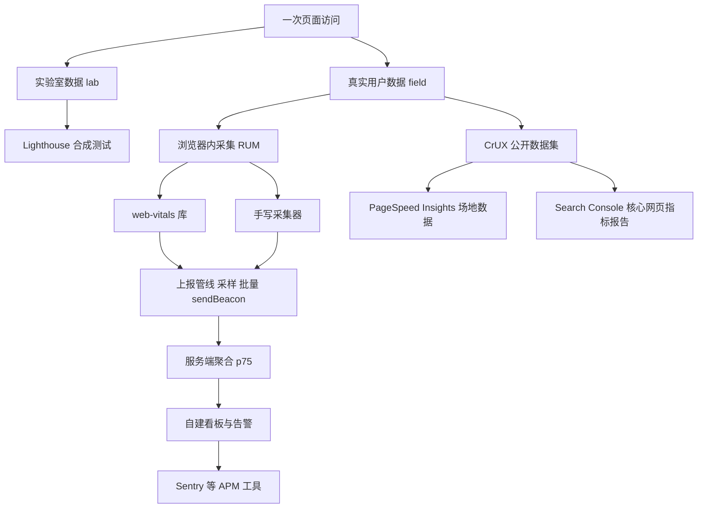
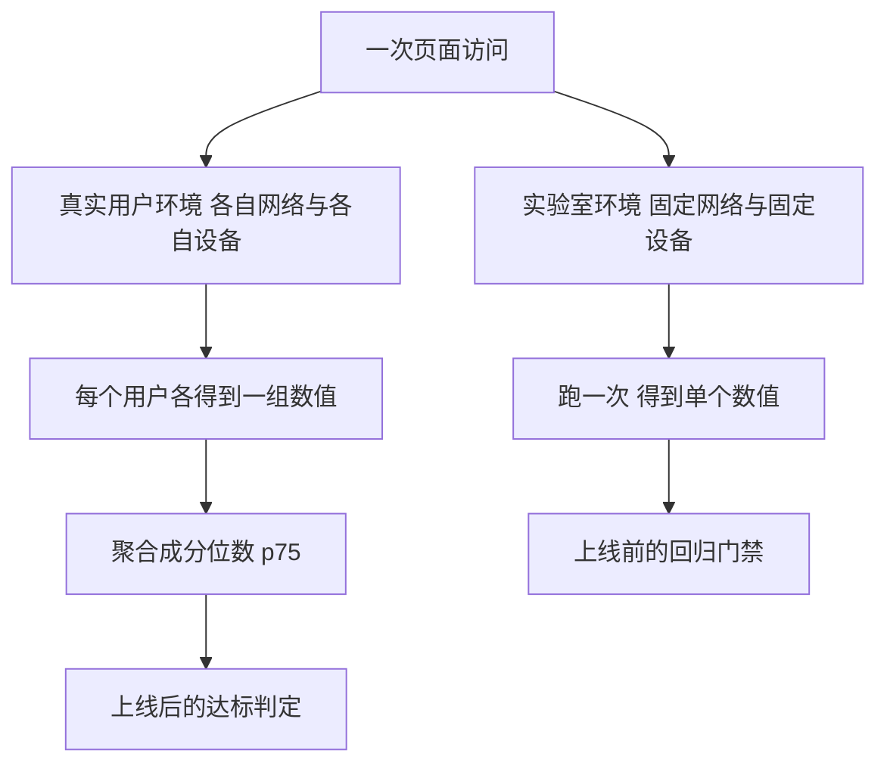
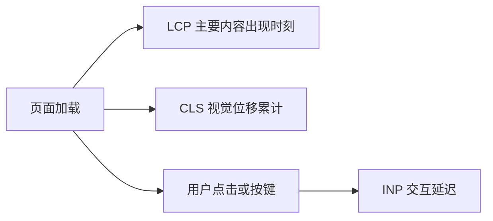
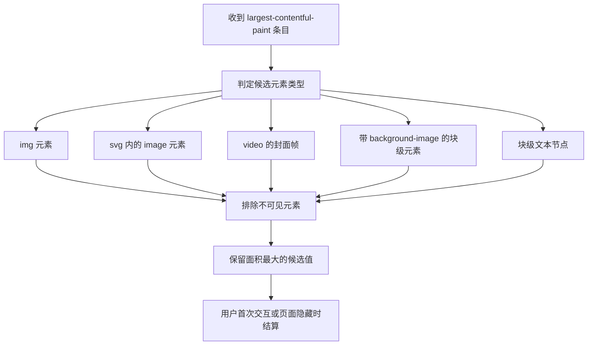
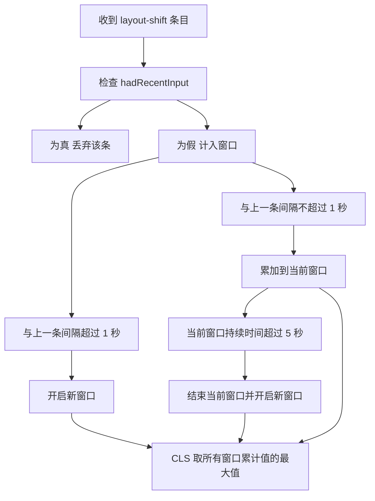
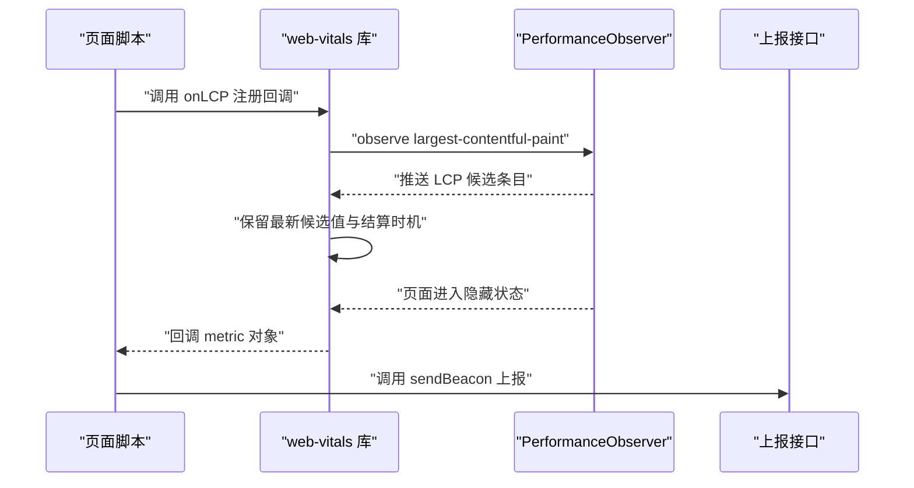
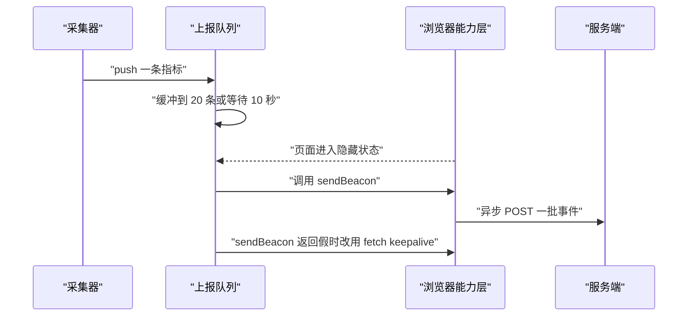
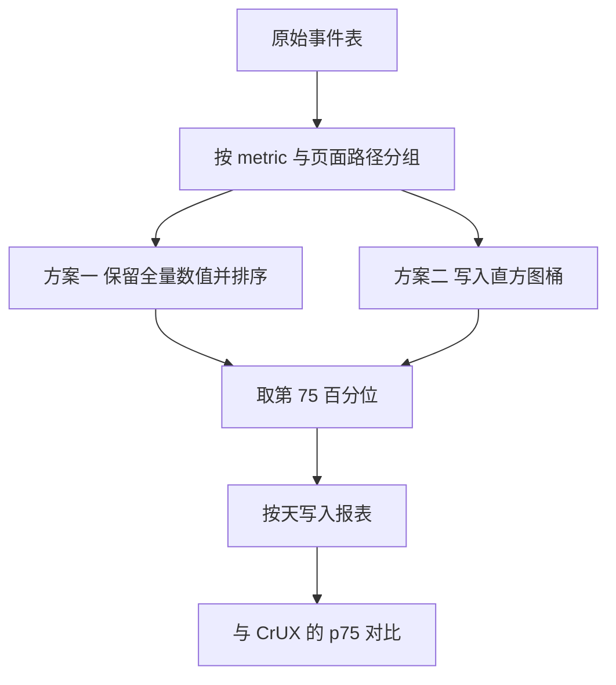
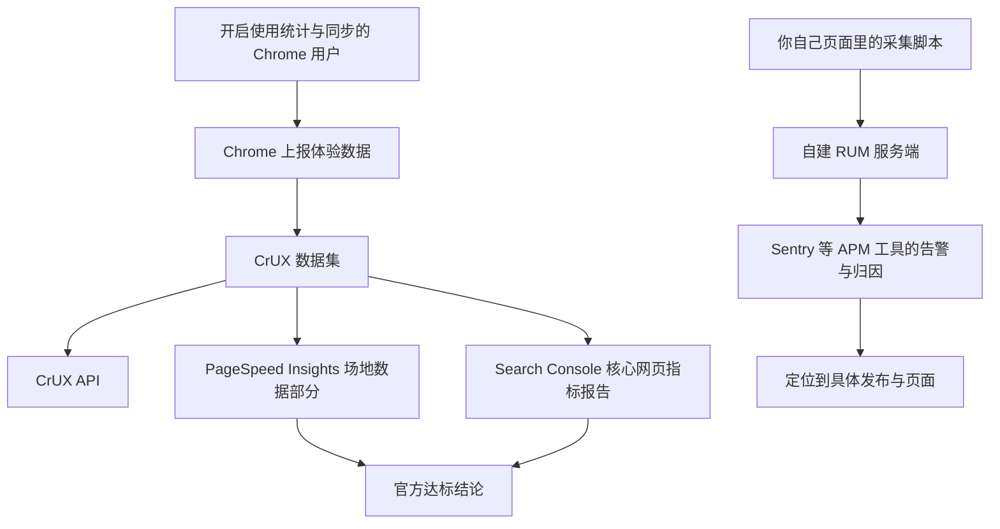

# Web Vitals 与线上监控：实验室数据与真实用户数据

!!! abstract "学完这一页你能"
    - 说出 LCP、INP、CLS 各自的测量对象，以及官方 good 阈值的具体数字。
    - 区分实验室数据与真实用户数据，并说明两者各自能回答什么问题。
    - 用 web-vitals 库采集三个指标，再手写一个不依赖该库的最小采集器。
    - 设计一条 RUM 上报管线：采样、批量、sendBeacon、服务端 p75 聚合。

## 0. 知识地图



建议的读法：先读第 1 节和第 2 节，把"两套数据"和"三个指标"分清。

然后读第 3 节到第 5 节，这一组是采集侧的实现，代码可以直接跑。

最后读第 6 节到第 8 节，这一组是上报、聚合与外部数据源，决定报表数字能不能信。

## 1. 实验室数据与真实用户数据的差别

**先想一个问题**

你在手边的笔记本上跑 Lighthouse，得到 LCP 0.9 秒、总分 98。上线一周后，客服转来 12 条"首页打不开"的反馈。

这两个结论谁在说谎？答案是都没说谎，它们测的不是同一件事。

!!! note "术语：实验室数据"
    实验室数据（lab data）指在受控环境下重复执行一次页面加载得到的数值。
    例子：Lighthouse 在你的机器上用固定的网络限速跑一次首页。

!!! note "术语：真实用户数据"
    真实用户数据（field data）指在真实用户设备与真实网络上采集到的数值。
    例子：某个用户在 4G 网络下的手机上打开首页，脚本记录到 LCP 为 3100 毫秒。

**心智模型**

!!! tip "心智模型"
    实验室数据是在同一条赛道上跑一次得到的成绩；真实用户数据是把所有真实用户的成绩收集起来，取第 75 名。
    日常类比：实验室数据是驾校考场成绩，真实用户数据是一个月内所有司机的行车记录。
    类比不成立的地方：考场成绩可以重跑到满意为止，真实用户数据不能重跑，删掉慢的那批样本就等于改成绩。

**图解**



1. 一次页面访问可以同时进入两条观测路径，两条路径互不干扰。
2. 实验室路径把网络与设备固定住，所以连续跑两次得到的数字接近。
3. 真实用户路径保留每个用户自己的网络与设备，个体数值分散得很开。
4. 分散的个体数值必须聚合成 p75 之类的分位数，才能和官方阈值比较。
5. 实验室数值适合放在持续集成里做门禁，场地数值适合做线上达标判定。

!!! note "术语：p75"
    p75 是第 75 百分位，表示把数值升序排列后，有 75% 的样本小于等于这个值。
    例子：100 个用户的 LCP 排序后第 75 个是 2600 毫秒，那么 p75 就是 2600 毫秒。

!!! note "术语：RUM"
    RUM 是 Real User Monitoring 的缩写，中文叫真实用户监控。
    它指在用户浏览器里运行采集脚本，把指标回传到你的服务端。

**一步一步来**

**第 1 步：把两套数据各写成一份数组**

这一步要做的是先把"数据长什么样"定下来，后面所有计算都建立在这个形状上。

```js
// 实验室数据：同一台机器、同一网络，重复跑 3 次得到的 LCP 毫秒值
const labSamples = [900, 880, 940];

// 真实用户数据：一个采集窗口内的 LCP 毫秒值，个体差异明显
const fieldSamples = [1200, 2600, 1800, 4200, 3100, 1500, 9800, 2200];

// 计算分位数：先按数值升序排列，再按位置取下标
function percentile(values, p) {
  const sorted = [...values].sort((a, b) => a - b); // 复制后排序，避免改动入参
  const index = Math.ceil((p / 100) * sorted.length) - 1; // 最近秩方法确定下标
  return sorted[Math.max(0, index)]; // 下标不得小于 0
}

console.log(percentile(labSamples, 75));   // 实验室 p75
console.log(percentile(fieldSamples, 75)); // 场地 p75
```

**这段代码在做什么**

- `labSamples` 三个数字接近，因为环境被固定住了。
- `fieldSamples` 里最大值 9800，它来自一台慢设备或一次弱网。
- `percentile` 先复制数组再排序，原始数组不会被改动。
- 下标用 `Math.ceil(p / 100 * length) - 1` 得到，这是最近秩方法的一种写法。
- 最近秩只是众多分位数口径之一，CrUX 用哪种口径需核对官方文档：核对官方对分位数计算的说明。

运行结果：

```text
940
3100
```

**第 2 步：用同一个阈值给两套数据打分**

这一步要做的是把数值和官方阈值放在一起，看结论会不会分叉。

```js
// 复用上面的 percentile 函数
const labP75 = percentile(labSamples, 75);     // 实验室 p75
const fieldP75 = percentile(fieldSamples, 75); // 场地 p75

// LCP 的 good 阈值是 2500 毫秒，具体口径以官方文档为准
const GOOD_LCP_MS = 2500;

console.log({
  labP75,                             // 实验室 p75
  fieldP75,                           // 场地 p75
  labPass: labP75 <= GOOD_LCP_MS,     // 实验室是否达标
  fieldPass: fieldP75 <= GOOD_LCP_MS, // 场地是否达标
  gapMs: fieldP75 - labP75,           // 两套口径的差值
});
```

**这段代码在做什么**

- 两个 p75 用同一个阈值判断，所以结论的差别只来自数据本身。
- `labPass` 为真，说明实验室环境达标。
- `fieldPass` 为假，说明场地环境不达标。
- `gapMs` 把差距量化成 2160 毫秒，方便写进复盘文档。
- 给老板汇报时，达标结论要用场地数据，不能用实验室数据。

运行结果：

```text
{ labP75: 940, fieldP75: 3100, labPass: true, fieldPass: false, gapMs: 2160 }
```

**动手验证**

把前面两步合成一个脚本，加断言固定住结论。

```js
// 依赖：无，Node 20 及以上直接运行 node lab-vs-field.mjs
import assert from 'node:assert/strict';

const labSamples = [900, 880, 940];
const fieldSamples = [1200, 2600, 1800, 4200, 3100, 1500, 9800, 2200];

function percentile(values, p) {
  const sorted = [...values].sort((a, b) => a - b);
  const index = Math.ceil((p / 100) * sorted.length) - 1;
  return sorted[Math.max(0, index)];
}

const GOOD_LCP_MS = 2500;

assert.equal(percentile(labSamples, 75), 940);
assert.equal(percentile(fieldSamples, 75), 3100);
assert.equal(percentile(fieldSamples, 75) > GOOD_LCP_MS, true);
assert.equal(percentile(fieldSamples, 75) - percentile(labSamples, 75), 2160);

console.log('全部断言通过');
```

预期输出：

```text
全部断言通过
```

**常见坑**

| 现象 | 原因 | 怎么修 |
| --- | --- | --- |
| 本地分数 98，线上 p75 超标 | 实验室只跑了你的设备与你的网络 | 用场地数据做达标判定，用实验室数据做门禁 |
| 场地数据忽高忽低 | 样本量太小，某天只收到 30 条 | 保证每个聚合分组至少几百条再出报表 |
| 删除慢样本后指标转好 | 把差数据当成脏数据处理掉了 | 用固定规则过滤，规则写进代码并做评审 |
| 两套数据对不上就差 200 毫秒 | 分位数口径与时间窗不同 | 先对齐时间窗与分位算法，再比较数字 |

**小结**

1. 实验室数据回答"这次改动有没有变慢"，真实用户数据回答"用户实际体验如何"。
2. 两套数据不能互相替代，只能互相印证。
3. 场地数据必须聚合成分位数之后才能和阈值比较，单个用户的数值没有判定意义。

## 2. LCP、INP、CLS 的测量对象与阈值

**先想一个问题**

用户投诉"页面慢"，产品经理让你给一个能被验收的数字。你要给哪个数字？

"加载慢""点了没反应""自己乱跳"是三件不同的事，需要用三个指标分别量化。

!!! note "术语：Core Web Vitals"
    Core Web Vitals 是 Google 定义的一组页面体验指标，当前包含 LCP、INP、CLS 三个。
    例子：一个页面 LCP 达标、CLS 达标但 INP 超标，它仍然不算三项全达标。

**心智模型**

!!! tip "心智模型"
    三个指标分别回答三个问题：主要内容多久出现、点了之后多久有反应、页面自己抖了多少。
    日常类比：进餐厅看菜上桌要多久，按了服务铃后服务员多久回应，桌上的餐具自己晃不晃。
    类比不成立的地方：餐厅里的时间是连续测量的，这三个指标只在特定时机结算一次。

**图解**



1. 页面加载阶段产生 LCP 与 CLS 两类观测数据。
2. LCP 记录的是视口内最大内容元素的出现时刻。
3. CLS 记录的是页面生命周期内视觉位移的累计值，用户输入附近的位移被排除。
4. 用户产生点击或按键之后，才可能产生 INP 数据。
5. 三个指标的取值范围与单位都不同，必须分开存储和展示。

**一步一步来**

**第 1 步：把阈值写成代码里的常量表**

这一步要做的是把官方阈值固化到代码里，避免每次手写数字写错。

```js
// 阈值表：LCP 与 INP 单位是毫秒，CLS 是无量纲数值
const THRESHOLDS = {
  LCP: { good: 2500, poor: 4000 }, // 大于 4000 毫秒算 poor
  INP: { good: 200, poor: 500 },   // 大于 500 毫秒算 poor
  CLS: { good: 0.1, poor: 0.25 },  // 大于 0.25 算 poor
};

// 把一次测量值映射成 good 或 needs-improvement 或 poor
function rate(name, value) {
  const { good, poor } = THRESHOLDS[name]; // 取出该指标的上下界
  if (value <= good) return 'good';        // 小于等于上界为 good
  if (value <= poor) return 'needs-improvement'; // 介于两界之间
  return 'poor';                           // 超过下界为 poor
}

console.log(rate('LCP', 2400), rate('LCP', 3000), rate('LCP', 5200));
```

**这段代码在做什么**

- `THRESHOLDS` 把三项指标的四个边界数字集中在一个对象里。
- 判断用的是小于等于，所以 2500 毫秒本身算 good。
- `rate` 只依赖指标名与数值，可以单独测试。
- 阈值属于会变更的配置，写在一处便于审计变更历史。
- FCP 与 TTFB 也各有阈值，但当前不在这三个核心指标内，取值需核对官方文档。

运行结果：

```text
good needs-improvement poor
```

**第 2 步：给一批样本打分并算达标率**

这一步要做的是把单点判断扩展成分组统计，得到可以放进报表的数字。

```js
// 一批场地 LCP 样本，单位毫秒
const samples = [1800, 2400, 2900, 3300, 2100, 4600, 2500, 2200];

const rated = samples.map((v) => rate('LCP', v)); // 逐个分档
const goodCount = rated.filter((r) => r === 'good').length; // 统计达标条数
const goodRatio = goodCount / rated.length;                 // 达标占比

console.log(goodCount, rated.length, goodRatio); // 达标条数 总条数 达标占比
```

**这段代码在做什么**

- `map` 把每个数值换成分档字符串，得到与样本等长的数组。
- `filter` 统计 `good` 的条数。
- 达标占比用于看趋势，达标判定仍然看 p75。
- 占比与 p75 是两种口径，报表里要标明用的是哪一种。
- 如果把占比当成达标结论，样本分布偏斜时会给出错误信号。

运行结果：

```text
4 8 0.5
```

**动手验证**

合成一个脚本，固定住分档函数的边界行为。

```js
// 依赖：无，Node 20 及以上直接运行 node rate.mjs
import assert from 'node:assert/strict';

const THRESHOLDS = {
  LCP: { good: 2500, poor: 4000 },
  INP: { good: 200, poor: 500 },
  CLS: { good: 0.1, poor: 0.25 },
};

function rate(name, value) {
  const { good, poor } = THRESHOLDS[name];
  if (value <= good) return 'good';
  if (value <= poor) return 'needs-improvement';
  return 'poor';
}

assert.equal(rate('LCP', 2500), 'good');
assert.equal(rate('LCP', 2501), 'needs-improvement');
assert.equal(rate('LCP', 4000), 'needs-improvement');
assert.equal(rate('LCP', 4001), 'poor');
assert.equal(rate('INP', 200), 'good');
assert.equal(rate('CLS', 0.25), 'needs-improvement');
assert.equal(rate('CLS', 0.26), 'poor');

console.log('全部断言通过');
```

预期输出：

```text
全部断言通过
```

**常见坑**

| 现象 | 原因 | 怎么修 |
| --- | --- | --- |
| 同一个值被判成两档 | 阈值写成了小于而不是小于等于 | 统一用小于等于上界判断 good |
| CLS 报出 1.4 这种大数 | 把单次位移分数当成了 CLS | 必须按会话窗口累加后再取最大值 |
| INP 一直是 0 | 页面在采集窗口内没有任何交互 | 无交互时不上报 INP，或用 null 表示缺失 |
| 报表里三项指标混在一个均值里 | 三项单位与量级不同 | 三项分开存储、分开展示、分开设阈值 |

**小结**

1. LCP 阈值是 good 2500 毫秒、poor 4000 毫秒，以官方文档为准。
2. INP 阈值是 good 200 毫秒、poor 500 毫秒，以官方文档为准。
3. CLS 阈值是 good 0.1、poor 0.25，它是无量纲数值，不与毫秒混算。

## 3. 计算规则：LCP 候选元素、CLS 会话窗口、INP 交互延迟

**先想一个问题**

页面加载了 12 张图片，还渲染了两段大标题。哪一张图或者哪一段文字算 LCP？

浏览器在加载过程中会不断上报候选元素，最后一次上报的那个数值才是 LCP。

!!! note "术语：LCP"
    LCP 是 Largest Contentful Paint 的缩写，中文叫最大内容绘制。
    它记录视口内面积最大的那次内容渲染出现的时刻，单位是毫秒。

**心智模型**

!!! tip "心智模型"
    三个指标各自只认一种"最值"：LCP 认最后一次最大渲染，CLS 认最大的会话窗口累计，INP 认最长的那次交互。
    日常类比：跳远比赛只记最远的一次，但要求这一跳必须发生在上场后的前 5 秒内。
    类比不成立的地方：跳远的成绩是单次成绩，CLS 是一个窗口内多次位移的和。

**图解**



1. 浏览器在加载过程中持续上报候选，每个候选都有自己的出现时刻。
2. 候选元素类型有图片、SVG 中的图片、视频封面帧、背景图元素、块级文本节点。
3. 不可见元素、透明度为 0 的元素、铺满整个视口的图片会被排除。
4. 面积最大的候选值被记录下来，后续更小的候选不会覆盖它。
5. 结算时机是用户首次交互或页面进入隐藏状态，之后不再更新。

!!! note "术语：会话窗口"
    会话窗口（session window）是 CLS 计算用的一种分组方式，把时间上接近的位移归到一组。
    例子：1000 毫秒、1400 毫秒两次位移归到一个窗口，7200 毫秒的那次单独成组。



1. `hadRecentInput` 为真的位移会被丢弃，因为它发生在用户操作之后。
2. 时间上与上一条间隔超过 1 秒时，开启新的会话窗口。
3. 当前窗口从第一条位移算起持续超过 5 秒时，也必须开启新窗口。
4. 每个窗口内部把位移分数相加。
5. CLS 取所有窗口累计值里的最大值，不是总和。

**一步一步来**

**第 1 步：从位移条目算出 CLS**

这一步要做的是把会话窗口的两条规则写成代码。

```js
// layout-shift 条目：value 是位移分数，hadRecentInput 表示 500 毫秒内有过输入
const entries = [
  { startTime: 1000, value: 0.05, hadRecentInput: false },
  { startTime: 1400, value: 0.03, hadRecentInput: false },
  { startTime: 5000, value: 0.20, hadRecentInput: true },
  { startTime: 7200, value: 0.04, hadRecentInput: false },
];

function clsFromEntries(list) {
  let max = 0;          // 所有会话窗口累计值中的最大值
  let current = 0;      // 当前窗口的累计值
  let windowStart = 0;  // 当前窗口起始时间
  let lastTime = 0;     // 上一条被计入的条目的时间
  for (const entry of list) {
    if (entry.hadRecentInput) continue; // 有近期输入的位移不计入
    const gapTooBig = entry.startTime - lastTime > 1000;        // 间隔超过 1 秒
    const windowTooLong = entry.startTime - windowStart > 5000; // 窗口超过 5 秒
    if (current === 0 || gapTooBig || windowTooLong) {
      windowStart = entry.startTime; // 开启新窗口
      current = 0;                   // 新窗口累计清零
    }
    current += entry.value;          // 累加本次位移分数
    lastTime = entry.startTime;      // 记住本条时间
    max = Math.max(max, current);    // 更新最大值
  }
  return max;
}

console.log(clsFromEntries(entries));
```

**这段代码在做什么**

- `hadRecentInput` 为真的第 3 条被跳过，0.20 不参与计算。
- 第 1 条触发新窗口，`current` 从 0.05 开始。
- 第 2 条与第 1 条间隔 400 毫秒，累加到 0.08。
- 第 4 条与第 2 条间隔 5800 毫秒，超过 1 秒，开启新窗口。
- 返回的 0.08 是单个窗口的累计值，不是四条的和。

运行结果：

```text
0.08
```

**第 2 步：把交互条目按交互编号分组**

这一步要做的是算出每次用户交互各自的延迟。

```js
// event 条目：interactionId 相同的条目属于同一次用户交互
const eventEntries = [
  { interactionId: 11, duration: 40, startTime: 100 },
  { interactionId: 11, duration: 96, startTime: 130 },
  { interactionId: 12, duration: 240, startTime: 900 },
];

// 按 interactionId 分组，每组取最长时长
function interactionLatencies(list) {
  const byId = new Map();          // 交互编号到最长时长的映射
  for (const entry of list) {
    if (!entry.interactionId) continue; // 没有编号的条目不参与
    const prev = byId.get(entry.interactionId) ?? 0; // 已有值默认 0
    byId.set(entry.interactionId, Math.max(prev, entry.duration)); // 保留更长者
  }
  return [...byId.values()];       // 返回每次交互的延迟列表
}

console.log(interactionLatencies(eventEntries));
```

**这段代码在做什么**

- 一次点击可能触发多个事件条目，它们共享同一个 `interactionId`。
- 分组后每组只保留最长时长，这对应交互延迟的口径。
- 编号为 0 或缺失的条目不参与，它们不属于交互。
- 返回的列表用于后续取长尾值，得到 INP。
- INP 最终取值的分位口径需核对官方文档：核对 web-vitals 源码里 INP 使用的分位常量。

运行结果：

```text
[ 96, 240 ]
```

**动手验证**

把 CLS 与交互分组合成一个脚本，断言两个计算结果。

```js
// 依赖：无，Node 20 及以上直接运行 node metrics.mjs
import assert from 'node:assert/strict';

const shiftEntries = [
  { startTime: 1000, value: 0.05, hadRecentInput: false },
  { startTime: 1400, value: 0.03, hadRecentInput: false },
  { startTime: 5000, value: 0.20, hadRecentInput: true },
  { startTime: 7200, value: 0.04, hadRecentInput: false },
];

function clsFromEntries(list) {
  let max = 0, current = 0, windowStart = 0, lastTime = 0;
  for (const entry of list) {
    if (entry.hadRecentInput) continue;
    const gapTooBig = entry.startTime - lastTime > 1000;
    const windowTooLong = entry.startTime - windowStart > 5000;
    if (current === 0 || gapTooBig || windowTooLong) {
      windowStart = entry.startTime;
      current = 0;
    }
    current += entry.value;
    lastTime = entry.startTime;
    max = Math.max(max, current);
  }
  return max;
}

function worstInteraction(list) {
  const byId = new Map();
  for (const entry of list) {
    if (!entry.interactionId) continue;
    const prev = byId.get(entry.interactionId) ?? 0;
    byId.set(entry.interactionId, Math.max(prev, entry.duration));
  }
  return Math.max(0, ...byId.values());
}

assert.equal(clsFromEntries(shiftEntries), 0.08);
assert.equal(worstInteraction([{ interactionId: 11, duration: 96 }, { interactionId: 12, duration: 240 }]), 240);
assert.equal(worstInteraction([]), 0);

console.log('全部断言通过');
```

预期输出：

```text
全部断言通过
```

**常见坑**

| 现象 | 原因 | 怎么修 |
| --- | --- | --- |
| CLS 被算成所有位移之和 | 忘记按会话窗口分组 | 按 1 秒间隔与 5 秒窗口两条规则分组 |
| 用户点击后的位移也被计入 | 没有检查 hadRecentInput | 为真的条目直接跳过 |
| 一次点击被算成三次交互 | 没有按 interactionId 合并 | 相同编号取最长时长 |
| LCP 比 FCP 还小 | 把候选值当成了可覆盖值反复改写 | 只保留最大值，且结算后不再更新 |

**小结**

1. CLS 的两条窗口规则是间隔超过 1 秒、窗口持续超过 5 秒。
2. CLS 只认没有用户输入参与的位移。
3. INP 需要按 interactionId 先合并，再取长尾值。

## 4. 用 web-vitals 库采集指标

**先想一个问题**

LCP 候选会切换，页面可能从往返缓存恢复，用户可能在结算前就关闭标签页。

这些边界你自己实现要写多少行？官方维护的 web-vitals 库把这些都处理了。

!!! note "术语：web-vitals 库"
    web-vitals 是 Chrome 团队维护的 npm 包，把浏览器原始性能条目换算成符合官方定义的指标值。
    例子：它导出 onLCP、onINP、onCLS 三个函数，你在页面里注册回调即可。

**心智模型**

!!! tip "心智模型"
    这个库是官方口径的换算器：你提供回调，它负责判候选、算窗口、决定结算时机。
    日常类比：你只管把体温计塞给护士，读数和判断发烧都由护士完成。
    类比不成立的地方：护士会给你建议，这个库只给你数字和分档字符串。

**图解**



1. 页面脚本调用 `onLCP`，把处理函数交给库。
2. 库内部注册 `PerformanceObserver`，监听 LCP 相关条目。
3. 浏览器持续推送候选条目，库负责挑选与保留。
4. 页面进入隐藏状态时，库触发结算。
5. 库把 `metric` 对象回调给页面脚本，脚本负责上报。

**一步一步来**

**第 1 步：注册三个指标的回调**

这一步要做的是引入库并挂上统一的处理函数。

```js
// 依赖：npm install web-vitals
import { onLCP, onINP, onCLS } from 'web-vitals';

// 三个指标共用同一个处理函数
function handleMetric(metric) {
  // name 是指标名，value 是数值，rating 是分档字符串
  console.log(metric.name, metric.value, metric.rating);
}

onLCP(handleMetric); // 注册 LCP 回调
onINP(handleMetric); // 注册 INP 回调
onCLS(handleMetric); // 注册 CLS 回调
```

**这段代码在做什么**

- 导入的三个函数名与指标一一对应。
- `handleMetric` 接收一个 `metric` 对象，三个指标共用。
- `metric.name` 用于区分是哪一项指标。
- `metric.value` 的单位随指标变化，LCP 是毫秒，CLS 是无量纲。
- 如果要看中间过程，可以传第二个参数 `{ reportAllChanges: true }`，具体选项需核对官方文档。

运行结果：

```text
LCP 2100 good
CLS 0.04 good
INP 320 needs-improvement
```

**第 2 步：把 metric 转成上报载荷**

这一步要做的是把库的输出接上你自己的后端字段。

```js
// 与后端约定的一份最小载荷
function toPayload(metric, context) {
  return {
    name: metric.name,                     // 指标名
    value: metric.value,                   // 本次数值
    rating: metric.rating,                 // 官方分档
    id: metric.id,                         // 同一次页面访问内稳定的标识
    navigationType: metric.navigationType, // 导航类型
    path: context.path,                    // 页面路径
    ts: Date.now(),                        // 客户端采集时间
  };
}

console.log(toPayload(
  { name: 'LCP', value: 2100, rating: 'good', id: 'v3-1', navigationType: 'navigate' },
  { path: '/home' },
));
```

**这段代码在做什么**

- `id` 用于在服务端识别同一次页面访问的多条指标。
- `navigationType` 常见取值为 `navigate`、`reload`、`back-forward-cache`、`prerender`。
- 从往返缓存恢复时的 `navigationType` 不是 `navigate`，报表里要能筛出来。
- `path` 与采集时间用于后续分组聚合。
- `metric.delta` 表示与上一次回调的增量，需要做实时看板时才用，需要核对官方文档：核对 delta 的语义。

运行结果：

```text
{ name: 'LCP', value: 2100, rating: 'good', id: 'v3-1', navigationType: 'navigate', path: '/home', ts: 1730000000000 }
```

**动手验证**

这个脚本不安装 web-vitals，而是用形状一致的对象验证上报层。

```js
// 依赖：无，Node 20 及以上直接运行 node payload.mjs
// 说明：库本身依赖浏览器 API，这里只验证载荷组装逻辑
import assert from 'node:assert/strict';

function toPayload(metric, context) {
  return {
    name: metric.name,
    value: metric.value,
    rating: metric.rating,
    id: metric.id,
    navigationType: metric.navigationType,
    path: context.path,
    ts: typeof context.now === 'number' ? context.now : Date.now(),
  };
}

const payload = toPayload(
  { name: 'LCP', value: 2100, rating: 'good', id: 'v3-1', navigationType: 'navigate' },
  { path: '/home', now: 1730000000000 },
);

assert.equal(payload.name, 'LCP');
assert.equal(payload.rating, 'good');
assert.equal(payload.navigationType, 'navigate');
assert.equal(payload.path, '/home');
assert.equal(payload.ts, 1730000000000);
assert.equal(Object.keys(payload).length, 7);

console.log('全部断言通过');
```

预期输出：

```text
全部断言通过
```

**常见坑**

| 现象 | 原因 | 怎么修 |
| --- | --- | --- |
| 页面卸载时上报丢失 | 卸载阶段发普通 fetch 会被中断 | 改用 sendBeacon 或 fetch 的 keepalive 选项 |
| 同一个指标上报了两次 | 隐藏与卸载两个时机各结算一次 | 用 metric.id 去重，或用上报队列只冲刷一次 |
| 从往返缓存返回后指标偏大 | 把恢复当成了一次新导航 | 按 navigationType 分别统计 |
| 只在页面加载时注册回调 | 单页应用路由切换后没有重新采集 | 在路由变化时按需重新注册并归零缓冲 |

**小结**

1. web-vitals 库负责候选判定、窗口计算与结算时机，你只写回调。
2. 上报前要把 metric 转成后端能识别的稳定字段。
3. navigationType 与 id 是排查重复与混淆的两个关键字段。

## 5. 手写一个最小采集器

**先想一个问题**

如果团队不允许引入第三方脚本，你还能拿到 LCP 数据吗？

能。三个指标的核心逻辑都在前一节写过，把它们拼起来加上结算时机即可。

**心智模型**

!!! tip "心智模型"
    手写采集器是三步：注册观察者、累积条目、在页面隐藏时结算一次。
    日常类比：你可以买成品体温计，也可以自己拿温度计测三次取最高值。
    类比不成立的地方：自己测要处理边界，成品已经替你处理过。

**图解**


1. 页面启动阶段注册三个观察者，分别监听 LCP、位移、交互。
2. 每个回调只做一件事：把条目写进内存缓冲。
3. 页面进入隐藏状态时触发结算，这是 LCP 与 INP 的口径边界。
4. 结算时算出三个数值，组装成一条 event。
5. 这条 event 交给上报队列，队列负责批量与重试。

**一步一步来**

**第 1 步：定义状态并注册 LCP 与位移观察者**

这一步要做的是把状态结构定下来，再挂上前两个观察者。

```js
// 采集状态：只保存结算时需要的最小字段
const state = {
  lcp: 0,             // 当前最大的 LCP 候选出现时刻
  cls: 0,             // 所有会话窗口累计值中的最大值
  clsWindow: 0,       // 当前窗口累计值
  clsWindowStart: 0,  // 当前窗口起始时间
  clsLastTime: 0,     // 上一条有效位移的时间
  interactions: new Map(), // 交互编号到最长时长
};

// 按会话窗口规则累加一次位移
function addShift(entry) {
  if (entry.hadRecentInput) return; // 有近期输入的位移不计入
  const gapTooBig = entry.startTime - state.clsLastTime > 1000;
  const windowTooLong = entry.startTime - state.clsWindowStart > 5000;
  if (state.clsWindow === 0 || gapTooBig || windowTooLong) {
    state.clsWindowStart = entry.startTime; // 开启新窗口
    state.clsWindow = 0;                    // 新窗口清零
  }
  state.clsWindow += entry.value;           // 累加本次位移
  state.clsLastTime = entry.startTime;      // 记录本条时间
  state.cls = Math.max(state.cls, state.clsWindow); // 更新最大值
}

function onLcpEntry(entry) {
  state.lcp = Math.max(state.lcp, entry.startTime); // 只保留最大值
}
```

**这段代码在做什么**

- `state` 把三个指标需要的字段集中在一个对象里。
- `addShift` 的两条判断与前一节完全一致。
- `cls` 保存的是历史窗口最大值，不会被新窗口覆盖成更小的值。
- `onLcpEntry` 只保留更大的出现时刻。
- 状态放在模块作用域，回调只修改状态，不做计算之外的事。

**第 2 步：注册三个观察者**

这一步要做的是把浏览器事件接到状态更新函数上。

```js
// 注册 LCP 观察者
function observeLcp() {
  const observer = new PerformanceObserver((list) => {
    for (const entry of list.getEntries()) onLcpEntry(entry); // 逐个处理条目
  });
  observer.observe({ type: 'largest-contentful-paint', buffered: true }); // 取回已发生条目
}

// 注册位移观察者
function observeCls() {
  const observer = new PerformanceObserver((list) => {
    for (const entry of list.getEntries()) addShift(entry);
  });
  observer.observe({ type: 'layout-shift', buffered: true });
}

// 注册交互观察者
function observeInp() {
  const observer = new PerformanceObserver((list) => {
    for (const entry of list.getEntries()) addInteraction(entry); // 见下一段
  });
  observer.observe({ type: 'event', buffered: true, durationThreshold: 40 });
}

function addInteraction(entry) {
  if (!entry.interactionId) return; // 没有编号的条目不参与
  const prev = state.interactions.get(entry.interactionId) ?? 0;
  state.interactions.set(entry.interactionId, Math.max(prev, entry.duration));
}
```

**这段代码在做什么**

- `buffered: true` 让观察者拿到注册之前已经发生的条目。
- `durationThreshold: 40` 过滤掉过短的交互事件，具体默认值需核对官方文档。
- 三个观察者互不依赖，任一类型不支持时其余两个仍可工作。
- `addInteraction` 按编号合并，保留更长时长。
- 浏览器不支持某个条目类型时，`observe` 会抛错，需要加 try 包裹。

**第 3 步：结算并派发**

这一步要做的是在页面隐藏时算出三个数值并交给上报层。

```js
// 取最长一次交互延迟，没有交互时返回 null
function worstInteraction(map) {
  if (map.size === 0) return null;            // 无交互数据
  return Math.max(...map.values());           // 取最大值
}

// 结算：页面隐藏时调用，这是 LCP 与 INP 的口径边界
function settle() {
  const payload = {
    lcp: state.lcp,                            // 最终 LCP
    cls: Number(state.cls.toFixed(4)),         // 保留 4 位小数
    inp: worstInteraction(state.interactions), // 最长一次交互延迟
  };
  console.log('settled', JSON.stringify(payload)); // 真实项目里改为入队
  return payload;
}

document.addEventListener('visibilitychange', () => {
  if (document.visibilityState === 'hidden') settle(); // 页面离开时结算
});
```

**这段代码在做什么**

- `worstInteraction` 在没有交互时返回 `null`，而不是 0。
- 返回 `null` 是因为"没有交互"和"交互延迟为 0"是两种含义。
- `toFixed(4)` 把 CLS 的小数位固定，减小上报体积。
- 结算时机绑定在 `visibilitychange` 上，而不是 `unload`。
- 真实项目里 `console.log` 换成入队调用。

**动手验证**

用 Node 里的假观察者驱动完整采集流程。

```js
// 依赖：无，Node 20 及以上直接运行 node collector.mjs
import assert from 'node:assert/strict';

class FakeObserver { // 用最小的假观察者替代浏览器实现
  static callbacks = [];
  constructor(cb) { this.cb = cb; }
  observe() { FakeObserver.callbacks.push(this.cb); }
  static emit(entries) { for (const cb of FakeObserver.callbacks) cb({ getEntries: () => entries }); }
}
globalThis.PerformanceObserver = FakeObserver;

const state = { lcp: 0, cls: 0, clsWindow: 0, clsWindowStart: 0, clsLastTime: 0, interactions: new Map() };

function addShift(entry) {
  if (entry.hadRecentInput) return;
  const gapTooBig = entry.startTime - state.clsLastTime > 1000;
  const windowTooLong = entry.startTime - state.clsWindowStart > 5000;
  if (state.clsWindow === 0 || gapTooBig || windowTooLong) {
    state.clsWindowStart = entry.startTime;
    state.clsWindow = 0;
  }
  state.clsWindow += entry.value;
  state.clsLastTime = entry.startTime;
  state.cls = Math.max(state.cls, state.clsWindow);
}

new FakeObserver((list) => {
  for (const entry of list.getEntries()) state.lcp = Math.max(state.lcp, entry.startTime);
}).observe({ type: 'largest-contentful-paint', buffered: true });

new FakeObserver((list) => {
  for (const entry of list.getEntries()) addShift(entry);
}).observe({ type: 'layout-shift', buffered: true });

new FakeObserver((list) => {
  for (const entry of list.getEntries()) {
    if (!entry.interactionId) continue;
    const prev = state.interactions.get(entry.interactionId) ?? 0;
    state.interactions.set(entry.interactionId, Math.max(prev, entry.duration));
  }
}).observe({ type: 'event', buffered: true, durationThreshold: 40 });

FakeObserver.emit([{ startTime: 1800 }]);
FakeObserver.emit([{ startTime: 1000, value: 0.05, hadRecentInput: false }]);
FakeObserver.emit([{ startTime: 1400, value: 0.03, hadRecentInput: false }]);
FakeObserver.emit([{ interactionId: 7, duration: 96 }, { interactionId: 7, duration: 40 }]);

const payload = {
  lcp: state.lcp,
  cls: Number(state.cls.toFixed(4)),
  inp: Math.max(...state.interactions.values()),
};

assert.deepEqual(payload, { lcp: 1800, cls: 0.08, inp: 96 });
console.log('全部断言通过', JSON.stringify(payload));
```

预期输出：

```text
全部断言通过 {"lcp":1800,"cls":0.08,"inp":96}
```

**常见坑**

| 现象 | 原因 | 怎么修 |
| --- | --- | --- |
| 采集脚本报错后整页脚本停止 | 不支持 event 类型时 observe 抛错 | 用 try 包裹每个 observe 调用 |
| INP 恒为 0 | 无交互时把 null 换成了 0 | 无交互时上报 null 或不上报该字段 |
| 往返缓存恢复后数据重复 | 页面恢复后状态没重置 | 监听 pageshow 事件并重置采集状态 |
| CLS 只有最后一次窗口的值 | 用赋值而不是取最大值 | 每次窗口结束都和历史最大值比较 |

**小结**

1. 手写采集器由三部分组成：状态、观察者、结算。
2. 结算时机绑定页面隐藏，这是 LCP 与 INP 的口径边界。
3. 缺失值与 0 要区分开，否则报表里的分位数会被拉低。

## 6. 上报管线：采样、批量与低优先级发送

**先想一个问题**

一个页面每天有 100 万次访问，如果每次访问发 3 条上报请求，你的接口要承受多少流量？

300 万次请求。所以上报必须经过采样与批量两层收敛。

!!! note "术语：采样率"
    采样率是放行并上报的用户比例。
    例子：采样率 0.1 表示每 100 个用户里放行 10 个，上报量降到十分之一。

**心智模型**

!!! tip "心智模型"
    上报管线是漏斗：先按比例抽样，再在客户端缓冲成批，最后走低优先级通道发出去。
    日常类比：先把散客按比例放行，再凑够一车人发一班车，最后一班车走货运通道。
    类比不成立的地方：抽样必须随机，抽样不能和指标值相关，否则分位数会被扭曲。

**图解**



1. 采集器把单条指标推入队列，不直接发请求。
2. 队列同时受条数上限与等待时间两个条件约束。
3. 页面进入隐藏状态时强制冲刷一次，避免丢数据。
4. 发送优先走 `navigator.sendBeacon`，它在卸载阶段仍会发出请求。
5. `sendBeacon` 返回假或不可用时，回退到带 `keepalive` 的 `fetch`。

**一步一步来**

**第 1 步：实现采样器与缓冲队列**

这一步要做的是把漏斗的前两层写出来。

```js
// 采样器：按固定比例放行，返回布尔值
function makeSampler(rate) {
  return () => Math.random() < rate; // rate 为 0.1 表示放行十分之一
}

// 缓冲队列：凑够 batchSize 条或超过 maxWaitMs 毫秒就冲刷
function makeQueue({ batchSize, maxWaitMs, flush }) {
  let buffer = [];   // 待上报条目
  let timer = null;  // 延迟冲刷定时器
  return {
    push(item) {
      buffer.push(item);
      if (buffer.length >= batchSize) return this.flushNow(); // 达到上限立即冲刷
      if (!timer) timer = setTimeout(() => this.flushNow(), maxWaitMs); // 启动定时器
    },
    flushNow() {
      clearTimeout(timer);
      timer = null;
      if (buffer.length === 0) return;
      const batch = buffer;
      buffer = [];
      flush(batch);    // 交给发送函数
    },
    size() { return buffer.length; }, // 便于测试
  };
}

const sampler = makeSampler(1); // 测试时采样率设为 1
console.log(sampler(), sampler());
```

**这段代码在做什么**

- `makeSampler` 返回一个闭包，比例被固定在闭包里。
- `push` 在达到条数上限时立即冲刷，不等定时器。
- 定时器只在第一次入队时启动，避免每个条都建一个定时器。
- `flushNow` 先清空缓冲再调用发送函数，防止发送过程中又被写入。
- `size` 方法只用于测试断言。

运行结果：

```text
true true
```

**第 2 步：实现发送函数**

这一步要做的是把批量数据交给浏览器提供的低优先级通道。

```js
// 优先使用 sendBeacon，回退到带 keepalive 的 fetch
function makeSender(endpoint) {
  return (batch) => {
    const body = JSON.stringify({ events: batch }); // 一条请求携带一批事件
    if (typeof navigator !== 'undefined' && navigator.sendBeacon) {
      const blob = new Blob([body], { type: 'application/json' }); // 指定内容类型
      const ok = navigator.sendBeacon(endpoint, blob);             // 返回布尔值
      if (ok) return 'beacon';                                     // 发送成功
    }
    fetch(endpoint, {
      method: 'POST',
      body,
      keepalive: true, // 允许请求在页面卸载后继续
      headers: { 'content-type': 'application/json' },
    });
    return 'fetch';
  };
}

console.log(makeSender('/rum')([{ name: 'LCP', value: 2100 }]));
```

**这段代码在做什么**

- `sendBeacon` 返回布尔值，返回假时说明浏览器拒绝排队。
- 用 `Blob` 而不是字符串，是为了显式指定内容类型。
- `keepalive: true` 让请求在页面卸载后继续，代价是有体积上限。
- 具体体积上限数值需核对官方文档：核对 fetch keepalive 的请求体上限。
- 返回 `'beacon'` 或 `'fetch'` 便于在测试里断言走了哪条分支。

运行结果：

```text
beacon
```

**动手验证**

用假计时器之外的简单方式验证队列行为，不依赖真实等待。

```js
// 依赖：无，Node 20 及以上直接运行 node report-queue.mjs
import assert from 'node:assert/strict';

function makeQueue({ batchSize, maxWaitMs, flush }) {
  let buffer = [];
  let timer = null;
  return {
    push(item) {
      buffer.push(item);
      if (buffer.length >= batchSize) return this.flushNow();
      if (!timer) timer = setTimeout(() => this.flushNow(), maxWaitMs);
    },
    flushNow() {
      clearTimeout(timer);
      timer = null;
      if (buffer.length === 0) return;
      const batch = buffer;
      buffer = [];
      flush(batch);
    },
    size() { return buffer.length; },
  };
}

function makeSampler(rate) {
  return () => Math.random() < rate;
}

const sent = [];
const queue = makeQueue({ batchSize: 3, maxWaitMs: 10000, flush: (b) => sent.push(b) });

queue.push({ name: 'LCP' });
queue.push({ name: 'CLS' });
assert.equal(queue.size(), 2);
assert.equal(sent.length, 0);

queue.push({ name: 'INP' });          // 第 3 条触发立即冲刷
assert.equal(sent.length, 1);
assert.equal(sent[0].length, 3);
assert.equal(queue.size(), 0);

queue.flushNow();                     // 空队列不应产生新批次
assert.equal(sent.length, 1);

assert.equal(makeSampler(1)(), true); // 采样率为 1 时必定放行
assert.equal(makeSampler(0)(), false); // 采样率为 0 时必定拦截

console.log('全部断言通过');
```

预期输出：

```text
全部断言通过
```

**常见坑**

| 现象 | 原因 | 怎么修 |
| --- | --- | --- |
| 上报量随流量线性增长 | 只做了批量没做采样 | 先按比例采样，再批量发送 |
| 高流量时请求量突然翻倍 | 采样率配置被改回 1 | 采样率进配置中心并做变更记录 |
| 页面关闭时丢最后一批 | 只在定时器到期时冲刷 | 在 visibilitychange 与 pagehide 时强制冲刷 |
| 分位数比实际偏好 | 采样与指标值相关，堵住了慢用户 | 用与指标无关的随机采样 |

**小结**

1. 采样与批量是两个独立环节，缺少任一个都会让请求量失控。
2. `sendBeacon` 是卸载阶段上报的首选通道，`fetch` 加 `keepalive` 是回退。
3. 冲刷时机要覆盖页面隐藏与页面卸载两个事件。

## 7. 服务端聚合：从原始事件到 p75

**先想一个问题**

你收到 10 万条 LCP 数值，写进周报时该报哪个数？

报平均值会被少数极端值拉走。官方口径用 p75，所以聚合成 p75 才有可比性。

**心智模型**

!!! tip "心智模型"
    聚合是把一条条事件压成分位数的过程，存储方案可以全量也可以直方图近似。
    日常类比：统计一个班的身高，你可以记住每个人的身高，也可以只记每个身高区间的几个人。
    类比不成立的地方：身高是静态数据，性能指标会随时间窗滚动，过期数据必须清理。

**图解**



1. 原始事件先按指标名与页面路径分组，不同指标不能混算。
2. 方案一保留全量数值，排序后直接取第 75 百分位。
3. 方案二把数值映射到固定边界的分桶里，只存每个桶的计数。
4. 方案二的存储量与样本量无关，代价是分位数只能得到近似值。
5. 聚合结果按天写入报表，并与 CrUX 的 p75 做交叉检查。

**一步一步来**

**第 1 步：实现全量口径的 p75**

这一步要做的是得到一个可以当作参照的精确值。

```js
// 全量口径：样本量可控时直接排序取分位
function p75(values) {
  if (values.length === 0) return 0;                // 空集合返回 0
  const sorted = [...values].sort((a, b) => a - b); // 升序排列副本
  const rank = Math.ceil(0.75 * sorted.length) - 1; // 最近秩下标
  return sorted[Math.max(0, rank)];                 // 防止负下标
}

const values = [1800, 2400, 2900, 3300, 2100, 4600, 2500, 2200];
console.log(p75(values));
```

**这段代码在做什么**

- 排序前复制数组，原始数据不被改动。
- `Math.ceil(0.75 * 8) - 1` 得到下标 5。
- 排序后第 6 个元素是 2900。
- 最近秩是分位数的一种口径，其他口径会得到不同数字。
- 空集合返回 0 只是兜底，报表里应展示"无数据"。

运行结果：

```text
2900
```

**第 2 步：用直方图桶近似 p75**

这一步要做的是在不能不存全量的场景下得到近似分位数。

```js
// 直方图：桶边界固定，只存每个桶的计数
const BUCKETS = [0, 500, 1000, 1500, 2000, 2500, 4000, 6000, Infinity];

function bucketIndex(value) {
  for (let i = BUCKETS.length - 1; i >= 0; i -= 1) {
    if (value >= BUCKETS[i]) return i; // 落在以该边界开头的桶
  }
  return 0; // 兜底，只有负值会走到这里
}

function toHistogram(values) {
  const counts = new Array(BUCKETS.length).fill(0); // 每个桶一个计数
  for (const v of values) counts[bucketIndex(v)] += 1; // 累加计数
  return counts;
}

// 从桶计数还原近似 p75，取桶下界作为代表值
function approxP75(counts, total) {
  const target = Math.ceil(0.75 * total); // 需要累计到第几名
  let acc = 0;
  for (let i = 0; i < counts.length; i += 1) {
    acc += counts[i];
    if (acc >= target) return BUCKETS[i]; // 落在该桶就用桶下界
  }
  return BUCKETS[BUCKETS.length - 1];
}

const counts = toHistogram(values);
console.log(counts, approxP75(counts, values.length));
```

**这段代码在做什么**

- `BUCKETS` 的每个元素是一个桶的下界，最后一个用 `Infinity`。
- `bucketIndex` 从大到小找第一个不大于数值的边界。
- `toHistogram` 的存储量只与桶数量有关，与样本量无关。
- `approxP75` 返回桶下界，所以结果会偏小。
- 需要更精确时可以用桶中点值，具体桶边界需核对官方文档。

运行结果：

```text
[0, 0, 0, 0, 1, 1, 2, 3, 1] 2500
```

**动手验证**

对比精确值与近似值，断言误差在预期范围内。

```js
// 依赖：无，Node 20 及以上直接运行 node aggregate.mjs
import assert from 'node:assert/strict';

const BUCKETS = [0, 500, 1000, 1500, 2000, 2500, 4000, 6000, Infinity];

function p75(values) {
  if (values.length === 0) return 0;
  const sorted = [...values].sort((a, b) => a - b);
  const rank = Math.ceil(0.75 * sorted.length) - 1;
  return sorted[Math.max(0, rank)];
}

function bucketIndex(value) {
  for (let i = BUCKETS.length - 1; i >= 0; i -= 1) {
    if (value >= BUCKETS[i]) return i;
  }
  return 0;
}

function toHistogram(values) {
  const counts = new Array(BUCKETS.length).fill(0);
  for (const v of values) counts[bucketIndex(v)] += 1;
  return counts;
}

function approxP75(counts, total) {
  const target = Math.ceil(0.75 * total);
  let acc = 0;
  for (let i = 0; i < counts.length; i += 1) {
    acc += counts[i];
    if (acc >= target) return BUCKETS[i];
  }
  return BUCKETS[BUCKETS.length - 1];
}

const values = [1800, 2400, 2900, 3300, 2100, 4600, 2500, 2200];
const exact = p75(values);
const approx = approxP75(toHistogram(values), values.length);

assert.equal(exact, 2900);
assert.equal(approx, 2500);
assert.ok(exact - approx >= 0 && exact - approx <= 500, '近似误差应落在一个桶宽之内');

console.log('全部断言通过', { exact, approx });
```

预期输出：

```text
全部断言通过 { exact: 2900, approx: 2500 }
```

**常见坑**

| 现象 | 原因 | 怎么修 |
| --- | --- | --- |
| 报表数字和 CrUX 差 400 毫秒 | 分位算法与时间窗都不同 | 先对齐时间窗，再对齐分位口径 |
| 近似 p75 系统性偏小 | 用桶下界作为代表值 | 改用桶中点值，或标明这是下界 |
| 分组过多导致每组样本太少 | 按完整 URL 分组 | 按路径模板分组，去掉查询参数 |
| 历史数据越存越多 | 没有过期清理策略 | 原始事件设保留天数，报表只留聚合结果 |

**小结**

1. 聚合的最小单位是"指标名加页面分组"，不同指标不能合并计算。
2. 全量排序得到精确分位，直方图桶得到近似分位，两者都要写明口径。
3. 聚合结果必须能和 CrUX 做交叉检查，否则无法判断采集是否失真。

## 8. CrUX、PageSpeed Insights 与 Sentry 的分工

**先想一个问题**

老板问"我们站的 Core Web Vitals 达标了吗"。你去哪里找官方数字？

答案在 CrUX。它是 Chrome 官方发布的场地数据汇总，可以按来源或页面查询。

!!! note "术语：CrUX"
    CrUX 是 Chrome User Experience Report 的缩写，中文叫 Chrome 用户体验报告。
    它汇总开启使用统计与同步的 Chrome 用户上报的体验数据，按 28 天滚动窗口聚合。

**心智模型**

!!! tip "心智模型"
    CrUX 是"别人的场地数据"，自建 RUM 是"你的场地数据"，Sentry 是把你的数据接进告警与归因的工具。
    日常类比：CrUX 是官方发布的城市空气质量月报，自建 RUM 是你自己在楼下装的传感器。
    类比不成立的地方：传感器可以装在任意位置，CrUX 只覆盖符合条件的那部分 Chrome 用户。

**图解**



1. CrUX 的数据来源只是开启了使用统计与同步的那部分 Chrome 用户。
2. 汇总结果通过 CrUX API、PageSpeed Insights、Search Console 三个入口对外提供。
3. PageSpeed Insights 同时展示实验室数据与 CrUX 场地数据，两栏要分开读。
4. 自建 RUM 的数据来自你自己页面里的脚本，覆盖浏览器与人群更广。
5. Sentry 这类 APM 工具消费你的自建数据，提供告警、发布关联与错误归因。

**一步一步来**

**第 1 步：从 CrUX 响应里读出 p75**

这一步要做的是把 CrUX 返回的结构解析成可比较的数字。

```js
// CrUX 风格的响应：metrics 的键是指标名，值里包含 percentiles
const record = {
  metrics: {
    largest_contentful_paint: { percentiles: { p75: 2380 } },
    cumulative_layout_shift: { percentiles: { p75: 0.06 } },
  },
};

// 读取某个指标的 p75，缺失时返回 null
function readP75(data, metricName) {
  const metric = data.metrics?.[metricName]; // 指标不存在时返回 undefined
  if (!metric) return null;                  // 说明该分组样本不足
  return metric.percentiles?.p75 ?? null;    // 缺少 p75 字段时同样返回 null
}

console.log(readP75(record, 'largest_contentful_paint'));
console.log(readP75(record, 'interaction_to_next_paint'));
```

**这段代码在做什么**

- `metrics` 是一个以指标名为键的对象，不是数组。
- 指标不存在返回 `null`，表示该分组没有足够样本。
- CrUX 的指标命名与 web-vitals 的命名不同，需要一张映射表。
- LCP 对应 `largest_contentful_paint`，CLS 对应 `cumulative_layout_shift`。
- INP 的字段名与可用指标清单需核对官方文档：核对 CrUX API 的指标名称与请求参数。

运行结果：

```text
2380
null
```

**第 2 步：把两套数据的口径差异列成核对清单**

这一步要做的是在解释数字差异之前，先把差异来源逐项列出。

```js
// 把自建 RUM 与 CrUX 的口径差异逐项列出
function diffChecklist(mine, crux) {
  return [
    { 维度: '人群', 自建: '执行了采集脚本的用户', CrUX: '开启使用统计的 Chrome 用户' },
    { 维度: '设备拆分', 自建: mine.device, CrUX: crux.device },
    { 维度: '时间窗', 自建: mine.window, CrUX: crux.window },
    { 维度: '分位口径', 自建: mine.percentileMethod, CrUX: crus.percentileMethod },
    { 维度: 'p75 取值', 自建: mine.p75, CrUX: crux.p75 },
  ];
}

console.table(diffChecklist(
  { device: '全部设备合并', window: '最近 24 小时', percentileMethod: '最近秩', p75: 2650 },
  { device: '手机与桌面分开', window: '滚动 28 天', percentileMethod: '需核对官方文档', p75: 2380 },
));
```

**这段代码在做什么**

- 清单把五个可能造成差异的维度固定下来。
- 人群不同：CrUX 只覆盖符合条件的 Chrome 用户。
- 时间窗不同：24 小时与 28 天滚动窗口必然给出不同数字。
- 设备拆分不同：合并计算与分开计算不能直接比较。
- 分位算法差异需要核对官方文档说明之后再下结论。

运行结果（表格结构）：

| (index) | 维度 | 自建 | CrUX |
| --- | --- | --- | --- |
| 0 | '人群' | '执行脚本的用户' | '开启统计的 Chrome' |

**动手验证**

合成一个脚本，验证解析逻辑与核对清单长度。

```js
// 依赖：无，Node 20 及以上直接运行 node crux.mjs
import assert from 'node:assert/strict';

const record = {
  metrics: {
    largest_contentful_paint: { percentiles: { p75: 2380 } },
    cumulative_layout_shift: { percentiles: { p75: 0.06 } },
  },
};

function readP75(data, metricName) {
  const metric = data.metrics?.[metricName];
  if (!metric) return null;
  return metric.percentiles?.p75 ?? null;
}

function diffChecklist(mine, crux) {
  return [
    { 维度: '人群', 自建: mine.audience, CrUX: crux.audience },
    { 维度: '设备拆分', 自建: mine.device, CrUX: crux.device },
    { 维度: '时间窗', 自建: mine.window, CrUX: crux.window },
    { 维度: '分位口径', 自建: mine.percentileMethod, CrUX: crux.percentileMethod },
    { 维度: 'p75 取值', 自建: mine.p75, CrUX: crux.p75 },
  ];
}

assert.equal(readP75(record, 'largest_contentful_paint'), 2380);
assert.equal(readP75(record, 'cumulative_layout_shift'), 0.06);
assert.equal(readP75(record, 'interaction_to_next_paint'), null);

const checklist = diffChecklist(
  { audience: '执行脚本的用户', device: '合并', window: '24 小时', percentileMethod: '最近秩', p75: 2650 },
  { audience: '开启统计的 Chrome', device: '分开', window: '28 天', percentileMethod: '待核对', p75: 2380 },
);

assert.equal(checklist.length, 5);
assert.equal(checklist[4]['自建'], 2650);
assert.equal(checklist[4]['CrUX'], 2380);

console.log('全部断言通过，差异维度共', checklist.length, '项');
```

预期输出：

```text
全部断言通过，差异维度共 5 项
```

**常见坑**

| 现象 | 原因 | 怎么修 |
| --- | --- | --- |
| 小流量页面在 CrUX 里查不到 | CrUX 对样本量有下限要求 | 按来源查询而不是按完整 URL 查询 |
| PageSpeed Insights 两栏数字打架 | 一栏是实验室数据一栏是场地数据 | 展示时标注数据来源与时间窗 |
| Sentry 里的 INP 与自建报表不同 | 采样率与结算时机不同 | 对齐采样率与结算时机，或只保留一个口径 |
| 把 Search Console 的结论当成实时数据 | 该报告基于 28 天滚动窗口 | 用自建 RUM 看短期变化，用 CrUX 看官方结论 |

**小结**

1. CrUX 是官方场地数据来源，覆盖范围仅限符合条件的 Chrome 用户。
2. PageSpeed Insights 和 Search Console 是 CrUX 的两个展示入口，时间窗固定。
3. Sentry 这类 APM 工具消费你的自建数据，负责告警与归因，不改变指标口径。

## 综合对比

| 维度 | 实验室数据 | 自建 RUM 场地数据 | CrUX | APM 工具（Sentry 类） |
| --- | --- | --- | --- | --- |
| 数据来源 | 受控环境单次运行 | 你页面里的采集脚本 | 开启统计的 Chrome 用户 | 你的自建数据 |
| 样本量 | 一次运行 | 由流量与采样率决定 | 需达到最低样本量才展示 | 与你上报的数据量相同 |
| 设备与网络 | 固定并限速 | 用户真实环境 | 用户真实环境 | 与你上报的数据量相同 |
| 时间窗 | 运行时刻 | 由你决定，从小时到天 | 28 天滚动 | 由你决定 |
| 分位口径 | 直接读数值 | 由你的聚合实现决定 | 需核对官方文档 | 与你的聚合实现一致 |
| 能否复现问题 | 可以重复运行 | 不能复现，只能定位 | 不能复现 | 不能复现 |
| 能否做上线门禁 | 适合 | 不适合 | 不适合 | 不适合 |
| 典型用途 | 回归与预检 | 达标判定与排查 | 官方达标结论 | 告警、发布关联、错误归因 |
| 数据延迟 | 无 | 秒级到分钟级 | 天级 | 秒级到分钟级 |
| 成本 | 本地算力 | 接口与存储 | 需申请 API 凭据 | 按事件量计费 |

## 应用与行业实践

### 应用场景地图

| 场景 | 用到本页哪个知识点 | 典型技术选型 | 注意事项 |
| --- | --- | --- | --- |
| 后台管理的万行表格筛选 | CLS 会话窗口与偏移计算 | web-vitals attribution、固定高度占位 | 异步插入结果会重复触发行偏移 |
| 低端安卓机的首屏加载 | LCP 候选元素与四段拆解 | onLCP attribution、Lighthouse 移动端预设 | 候选元素会随视口尺寸改变 |
| 多人协作白板的拖拽 | INP 交互延迟三段 | onINP attribution、LoAF | 跨源 iframe 内的脚本不可见 |
| 公网电商大促落地页 | CrUX 与 RUM 的差别、p75 聚合 | CrUX History API、自建上报管线 | CrUX 只覆盖达到流量门槛的页面 |
| 文档站搜索下拉联想 | INP 输入延迟 | PerformanceObserver 的 event 条目 | 输入法组合期间的事件要单独处理 |
| 营销页图片轮播 | CLS 偏移规则 | 固定宽高比的占位容器 | 图片切换不改布局就不计偏移 |
| 单页应用的客户端路由切换 | LCP 候选元素、手写采集器 | PerformanceObserver、sendBeacon | 软导航不在标准 LCP 口径内 |
| 在线协同表格的光标跟随 | INP 处理时长 | LoAF、requestAnimationFrame 分片 | 分片要保证每次让出主线程 |

### 三个场景拆解

#### 场景 1：后台管理的万行表格筛选

**业务背景**：运营后台的订单表格单页渲染上万行，点击筛选后结果分两批异步返回。表格区域在返回瞬间重排，用户刚点到的行号位置被顶走。

**怎么用本页知识解决**：先用 CLS 的会话窗口判断偏移是否成簇，再用归因字段定位最大偏移的元素。拿到元素后，用固定高度占位或把异步结果追加到列表底部来消掉偏移。

```js
import { onCLS } from 'web-vitals/attribution';   // 引入带归因字段的构建

onCLS((metric) => {                                // 回调拿到 CLS 结果对象
  const { value, attribution } = metric;           // value 是会话窗口的 CLS 值
  navigator.sendBeacon('/rum', JSON.stringify({    // 用 sendBeacon 低优先级发送
    name: 'CLS',
    value: value,                                  // 上报值，服务端按 p75 聚合
    target: attribution.largestShiftTarget,        // 最大偏移的元素选择器
    time: attribution.largestShiftTime,            // 该次偏移发生的时间点
  }));
}, { reportAllChanges: true });                    // 每次偏移都回调，便于定位
```

- `reportAllChanges: true` 让每次偏移都触发回调，只看会话结束时的值无法定位单次偏移。
- `largestShiftTarget` 给出选择器，可以直接在代码里搜到对应节点。
- 上报体只带必要字段，避免 beacon 体积超出浏览器限制被丢弃。
- 服务端按 `target` 分组算 p75，能看出偏移集中在哪一类组件。
- 若偏移来自字体替换，`target` 往往指向整块文本容器，需要另外查字体声明。

**怎么度量收益**：看自建 RUM 里该页面路径的 CLS p75 与偏移次数，查询走上报管线的聚合表。实验室侧用 DevTools Performance 面板的 Layout Shift 轨道和 Lighthouse 的 CLS 数值做对照。

**什么时候不该用**：
- 页面首屏之后结构完全静态、没有异步插入元素，CLS 长期为 0，做归因上报只增加采集成本。
- 团队还没有 RUM 后端，只有几个人手工验证，先用 DevTools 逐次复现，不要先搭完整管线。

#### 场景 2：低端安卓机的首屏加载

**业务背景**：活动页在入门安卓机上首屏出图慢，用户滚到一半才看到主图。流量集中在少数几款低端机型，桌面端表现正常。

**怎么用本页知识解决**：先把 LCP 按四段拆开，判断时间是花在服务端、资源发现、下载还是绘制。再按机型分组看 p75，确认瓶颈是否只出现在低端设备。

```js
import { onLCP } from 'web-vitals/attribution';    // 引入带归因字段的构建

onLCP((metric) => {                                 // 回调在页面生命周期结束时触发
  const { value, attribution, id } = metric;        // id 用于同一次访问内去重
  const parts = {                                   // 把 LCP 拆成四段定位瓶颈
    ttfb: attribution.timeToFirstByte,              // 首字节时间，属于网络与服务端
    loadDelay: attribution.resourceLoadDelay,       // 资源被发现之前的等待
    loadTime: attribution.resourceLoadDuration,     // 资源本身的下载耗时
    render: attribution.elementRenderDelay,         // 资源就绪到完成绘制
  };
  navigator.sendBeacon('/rum', JSON.stringify({     // 上报原始分段值，不做本地判断
    name: 'LCP', value, id,
    element: attribution.element,                   // 候选元素的选择器
    url: attribution.url,                           // 候选资源地址
    parts,                                          // 四段耗时随同上报
  }));
});
```

- 四段相加接近 LCP 总耗时，哪一段占比最高就先改哪一段。
- `element` 与 `url` 一起看，能确认候选元素是主图还是标题文字。
- 只上报原始分段值，聚合口径留在服务端，方便日后改阈值。
- 按机型分组需要额外的维度字段，可在初始化时采集一次设备信息。
- 分段字段会随库更新调整，升级前先核对官方文档的字段说明。

**怎么度量收益**：看 LCP p75 按机型分组的曲线，数据来自自建 RUM。公网部分对照 CrUX 的 LCP p75，实验室侧用 Lighthouse 移动端预设复测同一 URL。

**什么时候不该用**：
- 站点流量没达到 CrUX 的纳入门槛，拿不到 CrUX 数据，只能靠自建 RUM，别把 CrUX 当成唯一口径。
- LCP 元素由第三方广告位决定，站点无法控制其加载顺序，先谈清责任边界再投入优化。

#### 场景 3：多人协作白板

**业务背景**：白板在十几个人同时拖拽图形时，本地画笔出现跟手延迟。协作方越多，主线程收到的远端操作消息越密。

**怎么用本页知识解决**：先用 INP 归因看交互延迟落在输入、处理还是呈现哪一段。再用长动画帧记录找出占用主线程的具体脚本。

```js
const po = new PerformanceObserver((list) => {      // 观察长动画帧条目
  for (const entry of list.getEntries()) {          // 逐个处理本次回调的条目
    if (entry.duration < 50) continue;              // 低于 50 毫秒的帧不记录
    navigator.sendBeacon('/rum', JSON.stringify({   // 上报造成延迟的帧
      name: 'LoAF',
      duration: entry.duration,                     // 帧总时长，单位毫秒
      blocking: entry.blockingDuration,             // 其中阻塞主线程的时长
      scripts: entry.scripts.map((s) => s.sourceURL), // 参与执行的脚本地址
    }));
  }
});
po.observe({ type: 'long-animation-frame', buffered: true }); // 补收观察前已发生的帧
```

- `blockingDuration` 比 `duration` 更能说明用户等待了多久。
- `scripts` 里的地址可以按模块聚合，排序后先改占用最高的模块。
- `buffered: true` 保证在观察器创建之前发生的帧也会被收到。
- 拖拽过程应把几何计算与渲染分开，几何计算不用每帧都跑。
- 远端消息合批处理，能减少每帧需要执行的脚本数量。

**怎么度量收益**：看 INP p75 按交互类型分组的结果，数据来自自建 RUM。配合 DevTools Performance 面板的长动画帧记录定位脚本，公网版本再对照 CrUX 的 INP p75。

**什么时候不该用**：
- 白板嵌在跨源 iframe 里，归因字段拿不到内部脚本，需核对官方文档：PerformanceObserver 的 event 条目在跨源 iframe 中可见的字段范围。
- 页面以阅读为主、点击次数少，INP 样本量不足以支撑 p75，别把 INP 设成硬性门槛。

### 行业先进实践

**按时间序列对比 CrUX 的 p75（出处：Chrome UX Report 官方文档）**
CrUX 的 History API 按周和按月返回某个 origin 或 URL 的 p75 序列，样本来自真实用户。它适合判断一次上线是否带来趋势变化，而不是只看上线当天的值。借鉴做法：改动前后各取同一口径的序列做对照。需核对官方文档：纳入门槛与查询维度按 URL 还是按 origin。

**用 web-vitals 的 attribution 构建做归因（出处：web-vitals 开源项目）**
这个构建在回调里额外给出 LCP 的四段耗时、CLS 的最大偏移元素、INP 的交互目标与三段耗时。它把“指标是多少”变成“指标由谁造成”。借鉴做法：上报时带上归因字段，服务端按元素或资源地址分组，找出反复出问题的模块。

**用 Long Animation Frames API 定位阻塞脚本（出处：Chrome for Developers 文档）**
它把超过 50 毫秒的帧拆出阻塞时长和参与执行的脚本地址。与只记录 INP 数值相比，它能指到具体脚本。借鉴做法：把长动画帧条目与 INP 归因的交互目标放在同一条上报里，按页面路径聚合后排序。

**把性能预算写进 CI（出处：Lighthouse CI 开源项目）**
Lighthouse CI 支持用断言配置给指标设阈值，不达阈值时让流水线失败。它把性能回退挡在合并之前。借鉴做法：先给 CLS 和 LCP 设一个与当前 p75 持平的阈值，稳定后再逐步收紧。

**在 Search Console 里按 URL 组看 Core Web Vitals（出处：Search Console 官方文档）**
报告把站点 URL 按指标状态分组，能看出哪些页面模板整体不达标。它省掉了自建看板的前期成本。借鉴做法：把它当作发现问题的入口，再回到自建 RUM 里定位具体元素。

### 从学到用：落地路线

1. **试点**：选一个可改代码、流量稳定的页面模板接入 web-vitals，只上报 p75 需要的字段。
   验收标准：抽样核对 20 条上报记录与 DevTools 里的指标值是否一致。
2. **验证**：把自建 RUM 的 p75 与 CrUX 或 Lighthouse 在同一时间窗内对照，找出采集口径差异。
   验收标准：同一页面上自建 RUM 与 CrUX 的数值差距能逐条解释清楚（采样、可见性、口径）。
3. **推广**：按页面模板批量接入上报，采样率按流量分级，聚合任务统一算 p75 与分段分布。
   验收标准：接入模板清单可查，每个模板都有近 7 天的 p75 数据。
4. **防止回退**：把指标阈值写进 CI，并在发布流程里保留一条回退判定。
   验收标准：连续 4 次发布中不达标时流水线按预期拦截，可用一次人为改动验证。

### 动手作业

**目标**：给你负责的一个页面搭一条最小 RUM 链路，从采集到 p75 聚合，并用它定位一次真实的布局偏移或交互延迟。

**步骤**：
1. 选一个页面模板，用 DevTools Performance 面板录制一次典型操作，记下当前的 CLS 与 INP 数值。
2. 用 web-vitals 的 attribution 构建接入三个指标，回调里打印数值与归因字段。
3. 写一个最小上报函数：攒够 10 条或页面进入隐藏状态时用 sendBeacon 发送。
4. 在服务端写聚合脚本，按天和页面路径算 p75，同时保留 LCP 的四段耗时分布。
5. 制造一次可复现的偏移，比如先渲染列表再插入图片，确认归因字段指向该元素。
6. 修掉这次偏移，重复步骤 1 的录制，对比前后数值。
7. 把结论写成一页说明：指标、归因、改动内容、前后对比。

**验收标准**：
- 服务端能查出所选页面最近一天的 LCP、INP、CLS p75，查询语句可复现。
- 页面隐藏时批量能发完，DevTools Network 面板能看到一次 beacon 请求。
- 人为制造的布局偏移能在归因字段里定位到具体元素。
- 修复后用 DevTools 复测，CLS 数值下降，相邻两次录制的结果接近。
- 说明页里的数字都标注了来源，没有未标注来源的数值。

## 深入阅读与参考

!!! tip "怎么用这些资料"
    先读「官方文档与规范」建立准确的概念，再读「源码与示例」核对细节，最后用「教程、书籍与视频」换一种讲法加深理解。每条都写明了读哪一节、带着什么问题读。

### 官方文档与规范

| 资源 | 为什么读 | 怎么读 |
|---|---|---|
| [Core Web Vitals](https://web.dev/articles/vitals) | 阈值与指标定义的权威来源，一切讨论的基准。 | 先读三项指标的定义与阈值表，对照本文计算规则，读完给团队写一页指标口径。 |
| [PageSpeed Insights](https://pagespeed.web.dev/) | 一次输入即可同时对比实验室与真实用户数据。 | 用自己站点跑一次，切到体验页对比 field 与 lab 差异，记录分歧原因。 |
| [Web Vitals 现场测量最佳实践](https://web.dev/articles/vitals-field-measurement-best-practices) | 现场采集的官方建议，覆盖采样与上报的细节。 | 对照本文上报管线逐条检查自己的方案，列出缺采样或重复上报的问题。 |
| [MDN Performance API](https://developer.mozilla.org/en-US/docs/Web/API/Performance_API) | PerformanceObserver 采集与上报的标准 API 文档。 | 读 observe 与 entry 类型两节，照着把 LCP 与长任务打到控制台。 |

### 源码与示例

| 资源 | 为什么读 | 怎么读 |
|---|---|---|
| [web-vitals 库](https://github.com/GoogleChrome/web-vitals) | 官方采集库，可直接看到指标计算与归因的实现。 | 读 README 与归因构建章节，再翻 onLCP、onINP 源码，对照本文最小采集器。 |

### 教程、书籍与视频

| 资源 | 为什么读 | 怎么读 |
|---|---|---|
| [HTTP Archive Web Almanac 2024 性能章](https://almanac.httparchive.org/en/2024/performance) | 行业整体指标分布，可判断自己站点所处水位。 | 读 Core Web Vitals 数据章节，记下 p75 与通过率，再对比自站数据。 |
| [Web Almanac 2022 性能章（中文）](https://almanac.httparchive.org/zh-CN/2022/performance) | 中文版行业数据报告，便于对照分位与自身站点。 | 读性能章的分位图表，记录三项指标所在分位，作为优化目标基线。 |

## 自测题

??? question "题目 1：LCP 的 good 阈值与 poor 阈值分别是多少？"
    - good 上界是 2500 毫秒，poor 下界是 4000 毫秒。
    - 2500 毫秒本身算 good，4000 毫秒本身算 needs-improvement。
    - 单位是毫秒，不是秒。
    - 具体数值以官方文档为准，阈值会随官方口径调整。
    - 场地判定看 p75，不看单次数值。

??? question "题目 2：为什么 Lighthouse 分数是 98，线上 p75 却超标？"
    - Lighthouse 用固定网络与固定设备跑一次，属于实验室数据。
    - 线上 p75 来自所有用户的真实设备与真实网络。
    - 实验室数据反映的是同一台机器上的相对变化。
    - 达标判定要用场地数据，实验室数据用于上线门禁。
    - 两套数据出现差异是正常现象，不是采集错误。

??? question 3：CLS 的会话窗口有哪两条规则？
    - 与上一条有效位移的间隔超过 1 秒时，开启新窗口。
    - 当前窗口从第一条位移算起持续超过 5 秒时，也必须开启新窗口。
    - 窗口内把位移分数相加。
    - CLS 取所有窗口累计值中的最大值，不是总和。
    - hadRecentInput 为真的位移直接跳过，不参与分组。

??? question "题目 4：hadRecentInput 为真的位移为什么不计入 CLS？"
    - 用户输入之后的位移属于用户操作引起的预期变化。
    - 例如点击展开折叠面板会改变布局，这不算页面体验问题。
    - 该标记表示 500 毫秒内发生过输入，具体时间窗需核对官方文档。
    - 排除之后，CLS 更接近"页面自己抖动"的程度。
    - 计算时需要显式检查这个字段，否则数值会偏大。

??? question "题目 5：metric 对象里的 id 与 navigationType 各有什么用？"
    - id 在一次页面访问内稳定，用于服务端识别同一次访问的多条指标。
    - navigationType 区分首次导航、重新加载、往返缓存恢复等情况。
    - 从往返缓存恢复时数值含义不同，报表里要能筛出来。
    - 常见取值包括 navigate、reload、back-forward-cache、prerender。
    - 完整取值清单需核对官方文档。

??? question "题目 6：上报为什么要用 sendBeacon 或 fetch 的 keepalive？"
    - 页面卸载阶段发起的普通请求会被浏览器中断。
    - sendBeacon 会把请求交给浏览器排队，即使页面已卸载也会发出。
    - sendBeacon 返回布尔值，返回假时说明浏览器拒绝排队。
    - fetch 加 keepalive 是回退方案，有请求体体积上限。
    - 体积上限的具体数值需核对官方文档。

??? question "题目 7：为什么报表用 p75 而不是平均值？"
    - 平均值会被少数极大值拉高，掩盖大多数用户的体验。
    - p75 表示有 75% 的样本小于等于该值，能反映群体体验。
    - 官方达标判定使用第 75 百分位，用平均值无法与官方结论对应。
    - 采样与分位口径必须一致，否则两期数据无法比较。
    - 报表里必须写明用的是哪种分位口径。

??? question "题目 8：CrUX 与自建 RUM 的 p75 不一致，先核对哪几项？"
    - 人群范围：CrUX 只覆盖开启使用统计与同步的 Chrome 用户。
    - 设备拆分：合并计算与按手机桌面分开计算不能直接比较。
    - 时间窗：CrUX 使用 28 天滚动窗口，自建通常更短。
    - 分位算法：最近秩与其他口径会给出不同数字。
    - 以上四项对齐之后，再看是否还存在无法解释的差异。

## 延伸阅读

- web.dev《Web Vitals》的总览章节与三项指标的指标页
- web.dev 的《Optimize Largest Contentful Paint》《Optimize INP》《Optimize Cumulative Layout Shift》
- web.dev 的《Core Web Vitals》阈值与评估章节
- Chrome 开发者文档《Chrome User Experience Report》概览章节
- Chrome 开发者文档 CrUX API 的请求与响应字段章节
- PageSpeed Insights 文档中关于实验室数据与场地数据的说明章节
- W3C《Event Timing API》规范中的交互延迟定义章节
- W3C《Layout Instability API》规范中的位移分数与会话窗口章节
- MDN《PerformanceObserver》与《PerformanceObserverEntryList》条目类型章节
- web-vitals 库 README 的导出函数与回调参数章节
- Sentry 文档的 Performance 与 Web Vitals 章节
