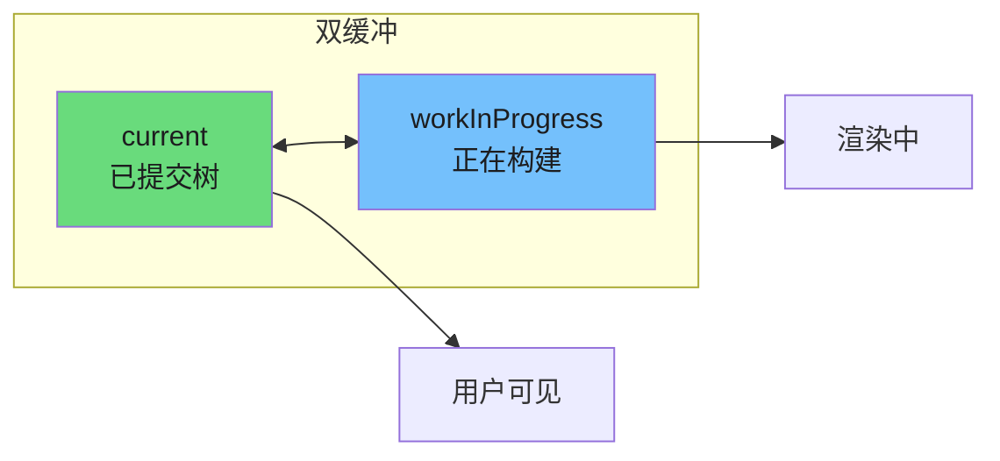
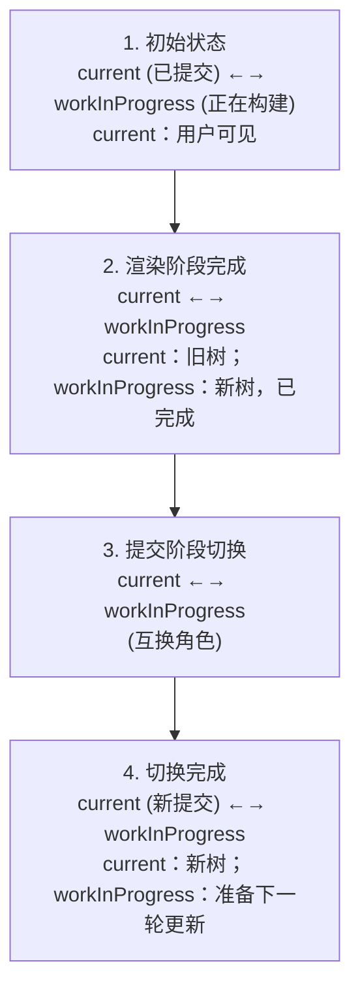
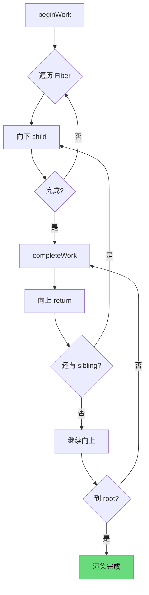
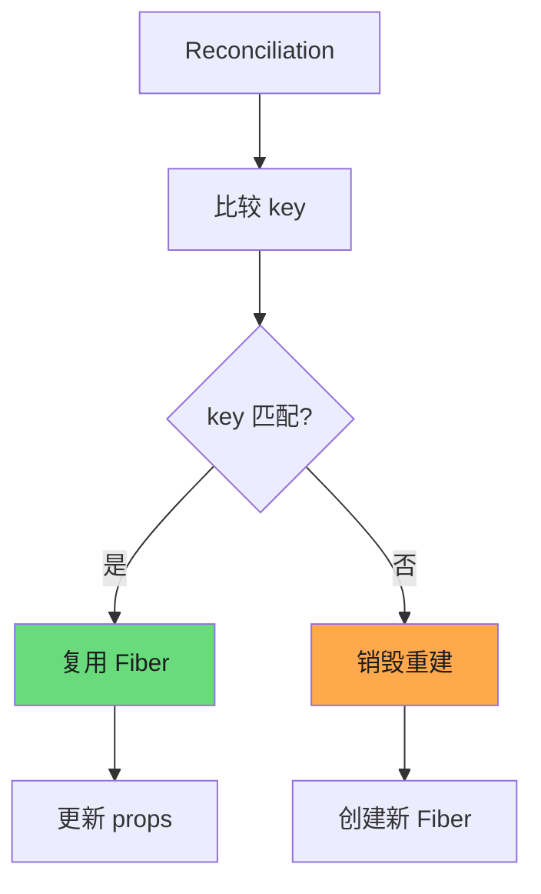
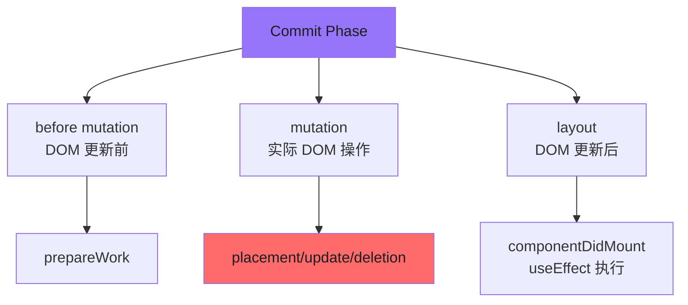
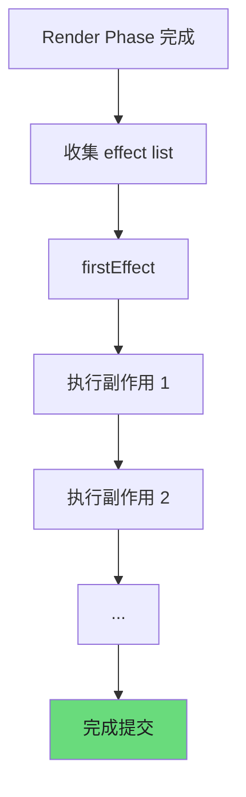
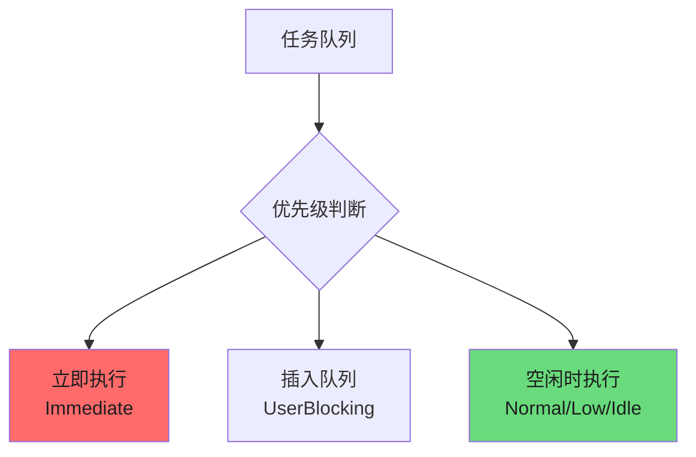
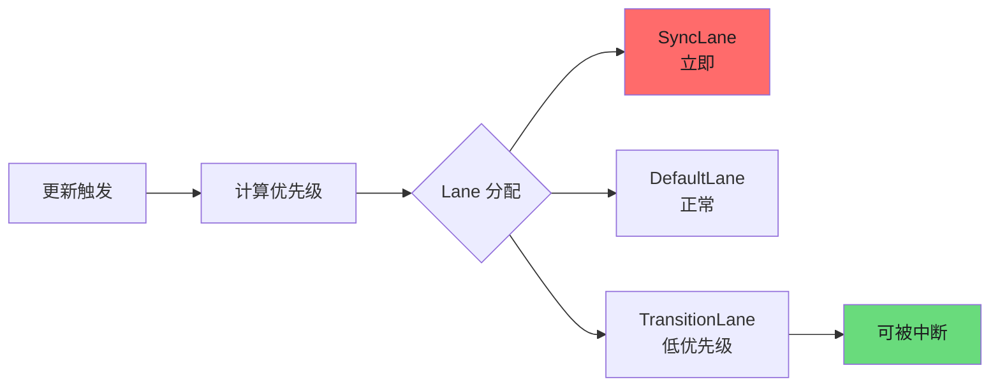

# Fiber 架构

React Fiber 是 React 16 引入的核心架构重构，它解决了 React 15 同步渲染模型固有的局限性，为 React 带来了异步渲染和精确优先级调度能力。

---

## 1. 为什么需要 Fiber

### 1.1 React 15 的问题：同步渲染无法中断

在 React 15 及之前的版本中，渲染过程是同步的。当组件树层级较深或节点较多时，一次性完成所有虚拟 DOM 计算可能导致主线程长时间阻塞。

```javascript
// React 15 的渲染流程
function render(element) {
  // 一旦开始，必须完成
  // 无法中断，无法让出主线程
  const fiber = reconcile(root, element);
  commitRoot(fiber);
}
```

### 1.2 掉帧原因分析

浏览器的刷新频率为 60fps，即每帧预算约 **16.67ms**：

| 阶段 | 预算时间 |
|------|----------|
| JavaScript 执行 | ~10ms |
| 样式计算 | ~4ms |
| 布局 | ~4ms |
| 绘制 | ~4ms |

当 React 的调和（Reconciliation）过程超过 16.67ms 时，就会错失帧，导致界面卡顿。

### 1.3 Fiber 的设计目标

Fiber 架构的设计目标可以概括为三个核心能力：

1. **可中断渲染**：将渲染工作拆分为小单元，支持暂停和恢复
2. **任务优先级调度**：优先处理高优先级任务（如用户输入），延迟低优先级任务
3. **时间片轮转**：在浏览器空闲时执行后台工作，保证交互流畅

---

## 2. Fiber 数据结构

Fiber 节点是 React 内部维护的最小工作单元，每个 React 元素都会创建一个对应的 Fiber 节点。

### 2.1 核心属性说明

```javascript
const fiber = {
  // ===== 标识信息 =====
  tag: WorkTags,           // Fiber 类型标签（HostRoot、ClassComponent、FunctionComponent 等）
  key: null | string,      // 列表元素的 key，用于优化 diff 算法
  type: any,              // 对应 React 元素的 type（组件类型或 HTML 标签名）

  // ===== 链表结构（Fiber 树的核心） =====
  return: Fiber | null,    // 父 Fiber 指针
  child: Fiber | null,     // 第一个子 Fiber 指针
  sibling: Fiber | null,   // 下一个兄弟 Fiber 指针

  // ===== 状态管理 =====
  stateNode: any,          // 真实 DOM 节点或组件实例
  memoizedState: any,      // 上一次渲染后的 state
  memoizedProps: any,      // 上一次渲染后的 props

  // ===== 更新队列 =====
  updateQueue: UpdateQueue<any> | null,  // 待处理的更新任务队列

  // ===== 副作用标记 =====
  effectTag: SideEffectTag,      // 标记该 Fiber 需要执行的副作用类型
  nextEffect: Fiber | null,     // 下一个需要执行的副作用节点

  // ===== 调度相关 =====
  lanes: Lanes,             // 当前 Fiber 的更新优先级 lanes
  childLanes: Lanes,        // 子树更新的优先级 lanes

  // ===== 双缓冲机制 =====
  alternate: Fiber | null, // 指向另一棵树的对应 Fiber
};
```

### 2.2 Fiber 链表示意图

```
        ┌─────────────────────────────────────────────┐
        │                   ROOT                       │
        │  (return: null, child: App)                 │
        └──────────────────┬──────────────────────────┘
                           │
                           ▼ child
        ┌─────────────────────────────────────────────┐
        │                    APP                      │
        │  (return: Root, child: Container)           │
        └──────────────────┬──────────────────────────┘
                           │
                           ▼ child
        ┌─────────────────────────────────────────────┐
        │                 CONTAINER                   │
        │  (return: App, child: List)                  │
        └──────────────────┬──────────────────────────┘
                           │
                ┌─────────┴──────────┐
                ▼ child              ▼ sibling
        ┌───────────────┐     ┌───────────────┐
        │    LIST       │────▶│   DETAIL      │
        │(return: App)  │     │(return: App)  │
        └───────┬───────┘     └───────────────┘
                │
        ┌───────┴───────┐
        ▼ child         ▼ sibling
   ┌──────────┐    ┌──────────┐
   │  ITEM 1  │───▶│  ITEM 2  │
   └──────────┘    └──────────┘
```

### 2.3 WorkTags 类型枚举

```javascript
const WorkTags = {
  FunctionComponent: 0,    // 函数组件
  ClassComponent: 1,       // 类组件
  HostRoot:3,              // 根节点
  HostComponent: 5,        // HTML 标签（如 div、span）
  HostText: 6,             // 文本节点
  Fragment: 7,             // Fragment
  Portal: 8,               // Portal
  SuspenseComponent: 13,   // Suspense
  SuspenseListComponent: 19, // SuspenseList
  MemoComponent: 14,       // memo 包装的组件
  SimpleMemoComponent: 15, // 简单 memo 组件
};
```

---

## 3. 双缓冲与 WIP（Work In Progress）

### 3.1 双缓存架构

Fiber 采用双缓冲（Double Buffering）技术，同时维护两棵 Fiber 树：



### 3.2 alternate 指针切换



### 3.3 内存优化策略

1. **复用 Fiber 节点**：通过 `createWorkInProgressLane()` 复用已有 Fiber
2. **共享状态**：同属一个 workInProgress 树的 Fiber 共享 `memoizedState`
3. **最小化复制**：只创建变化的 Fiber，其余复用现有节点

```javascript
// Fiber 复用逻辑
function createWorkInProgressLane(current, pendingProps) {
  let workInProgress = current.alternate;

  if (workInProgress === null) {
    // 首次渲染，创建新的 workInProgress
    workInProgress = createFiber(
      current.tag,
      pendingProps,
      current.key,
      current.mode
    );
    workInProgress.type = current.type;
    workInProgress.stateNode = current.stateNode;

    // 建立双向链接
    current.alternate = workInProgress;
    workInProgress.alternate = current;
  } else {
    // 复用已有节点，更新属性
    workInProgress.pendingProps = pendingProps;
    workInProgress.effectTag = NoEffect;
    workInProgress.nextEffect = null;
    workInProgress.firstEffect = null;
    workInProgress.lastEffect = null;
  }

  return workInProgress;
}
```

---

## 4. 渲染阶段（Render Phase）

渲染阶段是**可中断的**，React 会遍历 Fiber 树构建 workInProgress 树，收集所有需要执行的副作用。

### 4.1 遍历流程



### 4.2 beginWork 阶段

`beginWork` 是向下遍历的入口，根据 Fiber 类型执行不同的渲染逻辑：

```javascript
// 第 1 段：入参归一化——把「本 fiber 身上挂着的更新」收敛成「本次真正要渲染的最高优先级 lane」
// beginWork 是 render 阶段「递」(begin) 的入口：它拿旧树 current 和构建中的 workInProgress，为优先级足够的
// 路径产出下一个工作单元(子 fiber)。renderLanes 是本次渲染的全局时间片预算，只有二者的交集才值得处理，
// 这样高优先级更新才能打断/跳过低优先级更新，这是 React 并发渲染调度的基石。
function beginWork(current, workInProgressLane, renderLanes) {
  // 更新优先级
  // 取交并挑最高优先级：若结果为 NoLanes，说明这棵子树本轮无事可做，下面各 updateXxx 会走 bailout，
  // 直接克隆 current 的子节点复用，从而把 diff 成本降到 O(1)（这也是易错点：别在此处耗散掉 lane 信息）。
  workInProgressLane = getMostRecentLaneWithHigherPriority(
    workInProgressLane,
    renderLanes
  );

  // 第 2 段：按 fiber.tag 分派——fiber 是「统一工作单元」抽象，tag 决定它走哪条更新算法
  // 用 switch 而非 if-else 链，是把「类型判断」与「具体更新策略」解耦：每个 case 只负责一件事——
  // 返回下一个要处理的子 fiber；返回 null 表示这条支链已到底，控制权交给 completeUnitOfWork 向上回溯。
  switch (workInProgress.tag) {
    // 第 3 段：函数组件——关键在于先把 defaultProps 解析进 props，再交给 Hooks 渲染路径
    case FunctionComponent: {
      const Component = workInProgress.type;
      const unresolvedProps = workInProgress.pendingProps;
      // resolveDefaultProps 仅在组件声明了 defaultProps 时才做一次浅合并；其返回值引用稳定，
      // 后续 memo / 浅比较才能命中缓存，避免同一份 props 被判定为「变了」而触发多余重渲染。
      const resolvedProps = resolveDefaultProps(Component, unresolvedProps);
      // 注意数据流：向下传的必须是 resolvedProps 而非 pendingProps，否则 render 阶段读到的 props
      // 与实际参与 diff 的 props 不一致，会出现「首帧渲染和后续更新取值不同」的诡异 bug。
      return updateFunctionComponent(
        current,
        workInProgress,
        Component,
        resolvedProps,
        renderLanes
      );
    }

    // 第 4 段：类组件——生命周期最重的一条路径，因此签名只带 current/self/lanes
    // 类组件要处理 instance 创建、getDerivedStateFromProps、shouldComponentUpdate 等，
    // 这些都能从 workInProgress 上自取（type、stateNode），所以无需额外透传 Component 与 props。
    case ClassComponent: {
      return updateClassComponent(
        current,
        workInProgress,
        renderLanes
      );
    }

    // 第 5 段：HostRoot——调和「根上的 element 更新」，是每次 render 的真正起点
    // 对根而言，变化来自 ReactDOM.createRoot(...).render(el) 或 root 上的 setState，
    // updateHostRoot 会重新计算根 state 里的 element，再 reconcile 出子 fiber。
    case HostRoot: {
      return updateHostRoot(current, workInProgress, renderLanes);
    }

    // 第 6 段：HostComponent——真实宿主节点（浏览器里即 DOM 元素），既要 diff 属性也要 diff 子节点
    // 这条分支里会算 props 差量（更新 attributes/style/事件），再对 children 做 reconcileChildren，
    // 是「虚拟 DOM 落到真实 DOM」的主要接缝，也是性能热点所在。
    case HostComponent: {
      return updateHostComponent(current, workInProgress, renderLanes);
    }

    // 第 7 段：HostText——文本叶子节点，无需子树调和，故参数比上面几条少一个 renderLanes
    // 文本节点没有 children，只需比较新旧 string 决定是否打更新标记；签名差异正体现了「无子节点」
    // 这一边界条件（复杂度 O(1)），也是读源码时容易疑惑「参数为何不一致」的地方。
    case HostText: {
      return updateHostText(current, workInProgress);
    }

    // 第 8 段：其余类型与兜底
    // 完整实现还包含 SuspenseComponent / Offscreen / Mode / Portal / ContextProvider 等分支；
    // 真实源码 switch 末尾有 default 分支抛错，防止新增 tag 时漏写实现而静默走入死循环或返回 undefined。
    // ... 其他类型
  }
}
```

### 4.3 completeWork 阶段

`completeWork` 是向上回溯的入口，处理当前 Fiber 的副作用和 DOM 更新：

```javascript
function completeWork(current, workInProgress, renderLanes) {
  const newProps = workInProgress.pendingProps;

  switch (workInProgress.tag) {
    case HostComponent: {
      // 1. 创建或更新 DOM 节点
      if (current === null) {
        // 首次挂载，创建 DOM 节点
        const instance = createInstance(
          workInProgress.type,
          newProps,
          rootContainerInstance,
          hostContext,
          internalInstanceHandle
        );
        // 追加所有子节点
        appendAllChildren(instance, workInProgress, false, false);
        workInProgress.stateNode = instance;
      } else {
        // 更新已有节点
        const instance = workInProgress.stateNode;
        updateFiberFromRootComponentAndVendor(
          current,
          workInProgress,
          instance,
          newProps,
          rootContainerInstance,
          hostContext
        );
      }

      // 2. 标记需要更新 props 的子节点
      markUpdate(workInProgress);
      break;
    }

    case HostText: {
      // 处理文本节点
      if (current && !includesSomeLane(renderLanes, updateLanes)) {
        // 无需更新，复用
        workInProgress.effectTag = NoEffect;
      }
      break;
    }
  }

  // 收集副作用链表
  if (workInProgress.effectTag !== NoEffect) {
    insertEffectFiberIntoEffectList(workInProgress, finishedWork);
  }
}
```

### 4.4 调和算法（Reconciliation）

React 的调和算法遵循以下规则：

1. **不同类型的元素产生不同的树**：如果元素类型改变，React 会销毁旧树并重建新树
2. **通过 key 优化列表渲染**：同层级同类型的元素通过 key 判断是否可复用



---

## 5. 提交阶段（Commit Phase）

提交阶段是**同步且不可中断的**，它将渲染阶段收集的副作用一次性执行。

### 5.1 三个子阶段



### 5.2 before mutation 阶段

此阶段执行 DOM 更新前的准备工作：

```javascript
function commitBeforeMutationRoot(current, finishedWork) {
  switch (finishedWork.tag) {
    case ClassComponent: {
      // 暂停类组件的副作用
      if (finishedWork.effectTag & ShouldCapture) {
        // 处理 Suspense / ErrorBoundary
        const error = thrownValue;
        const getDerivedFromError = finishedWork.type.getDerivedFromError;

        if (typeof getDerivedFromError === 'function') {
          try {
            const errorInfo = { componentStack: '' };
            const error = getDerivedFromError(() => error, errorInfo);
            finishedWork.memoizedState = hookIndexes.some(
              i => error !== null
            );
          } catch (error) {
            // 错误重定向到最近的 ErrorBoundary
          }
        }
      }
      break;
    }

    case SuspenseComponent: {
      // 处理 Suspense 边界
      break;
    }
  }
}
```

### 5.3 mutation 阶段

此阶段执行实际的 DOM 增删改操作：

```javascript
function commitMutationRoot(current, finishedWork) {
  const flags = finishedWork.effectTag;

  // 处理 ref 卸载
  if (flags & Ref) {
    commitDetachRef(current);
  }

  // 处理 placement（新增）
  if (flags & Placement) {
    commitPlacement(finishedWork);
  }

  // 处理更新
  if (flags & Update) {
    commitUpdate(
      finishedWork.stateNode,
      finishedWork.memoizedProps,
      finishedWork.memoizedState
    );
  }

  // 处理 deletion（删除）
  if (flags & Deletion) {
    commitDeletion(finishedWork, root);
  }

  // 处理 Hydration（SSR 水合）
  if (flags & Hydrating) {
    enterHydrationState(finishedWork);
  }
}
```

### 5.4 layout 阶段

此阶段在 DOM 更新后执行，主要任务包括：

1. **执行 `componentDidMount` / `componentDidUpdate` 生命周期**
2. **执行 `useEffect` 回调**（异步调度）
3. **更新 `ref`**
4. **读取布局信息**（如 `getBoundingClientRect`）

```javascript
function commitLayoutMount(root, finishedWork) {
  switch (finishedWork.tag) {
    case FunctionComponent: {
      // 执行 useEffect 的 layout 回调
      commitHookEffectListMount(HookLayout | HookHasEffect, finishedWork);
      break;
    }

    case ClassComponent: {
      // 执行 componentDidMount
      if (!finishedWork.callbackList) {
        instance.componentDidMount();
      }
      // 执行 setState 回调
      processUpdateQueue(finishedWork, instance);
      break;
    }
  }
}
```

### 5.5 副作用链表执行顺序



---

## 6. 调度器（Scheduler）

React 16.5+ 集成了 `scheduler` 包实现任务调度，将渲染工作拆分为可中断的小单元。

### 6.1 任务优先级

```javascript
const ImmediatePriority = 1;      // 立即优先级（同步执行）
const UserBlockingPriority = 2;   // 用户阻塞优先级（~250ms）
const NormalPriority = 3;         // 正常优先级（~5s）
const LowPriority = 4;             // 低优先级（~10s）
const IdlePriority = 5;            // 空闲优先级（无限期）
```

### 6.2 过期时间计算

每种优先级都有对应的过期时间阈值：

```javascript
function ceiling(num, precision) {
  return Math.ceil(num / precision) * precision;
}

function computeExpirationTime(
  fiberTime,
  mode,
  currentTime
) {
  const syncLanes = getSyncLanes(mode);

  if (syncLanes !== NoLanes) {
    // 同步任务立即过期
    return -1;
  }

  const transitionLanes = getTransitionLanes(fiberTime);
  const pendingLanes = pendingLanes & ~transitionLanes;

  // 计算当前时间戳对应的 lane 过期时间
  return computeLaneExpiration(
    fiberTime,
    getHighestPriorityLanes(pendingLanes),
    currentTime
  );
}
```

### 6.3 时间片分配

Scheduler 使用 **scheduler.unstable_runWithPriority** 包装任务，确保高优先级任务能够插队：



### 6.4 Lane 模型（React 18+）

React 18 引入的 Lane 模型提供了更精细的优先级控制：

```javascript
const lanes = {
  SyncLane:              0b0000000000000000000000000000001,  // 同步
  InputContinuousLane:   0b0000000000000000000000000001000,  // 连续输入（拖拽）
  DefaultLanes:          0b0000000000000000000000000011000,  // 默认
  TransitionLanes:       0b0000000000000000000011110000000,  // 过渡
  IdleLane:              0b0000000000000000100000000000000,  // 空闲
  OffscreenLane:         0b0000000000000001000000000000000,  // 离屏
};
```

### 6.5 调度流程示意



---

## 7. 总结

React Fiber 架构通过以下核心机制实现了可中断的异步渲染：

| 机制 | 作用 |
|------|------|
| **Fiber 链表结构** | 将树形结构转为链表，支持深度优先遍历中断和恢复 |
| **双缓冲技术** | 通过 alternate 指针实现无感知的树切换 |
| **Render Phase 可中断** | 将构建 workInProgress 树的过程拆分为小单元 |
| **Commit Phase 同步** | DOM 更新必须在一次微任务中完成，避免布局抖动 |
| **Lane 优先级模型** | 精细化区分任务优先级，确保用户体验优先 |

这套架构为 React 18 的 Concurrent Mode 奠定了基础，使得 Suspense、Server Components、Automatic Batching 等特性成为可能。

---

## 8. 延伸阅读

- [React 源码分析系列](https://github.com/reactwg/react-18/discussions)
- [Fiber 架构深度解析](https://github.com/acdlite/react-fiber-architecture)
- [React Reconciliation](https://reactjs.org/docs/reconciliation.html)

## 深入阅读与参考

!!! tip "怎么用这些资料"
    先读「官方文档与规范」建立准确的概念，再读「源码与示例」核对细节，最后用「教程、书籍与视频」换一种讲法加深理解。每条都写明了读哪一节、带着什么问题读。

### 官方文档与规范

| 资源 | 为什么读 | 怎么读 |
|---|---|---|
| [Render and Commit](https://react.dev/learn/render-and-commit) | 官方文档清晰划分 render 与 commit 两阶段职责，是理解双阶段的基准。 | 先看两阶段流程图，带着“哪些工作可中断”的问题读，再对照本页渲染/提交小节。 |

### 源码与示例

| 资源 | 为什么读 | 怎么读 |
|---|---|---|
| [React Scheduler](https://github.com/facebook/react/tree/main/packages/scheduler) | 调度器主入口，看任务如何入队、按过期时间排序并被逐个执行。 | 从 scheduleCallback 读起，追 requestHostCallback 与 workLoop，画出调用链。 |
| [index.js](https://github.com/facebook/react/blob/main/packages/scheduler/index.js) | 包导出入口，快速确认调度器对外暴露了哪些 API。 | 浏览 export 列表，带着“React 实际用到哪些”的问题读，整理一份导出清单。 |
| [README.md](https://github.com/facebook/react/blob/main/packages/scheduler/README.md) | 官方对 Scheduler 定位、优先级与用法的概述，先读能少走弯路。 | 先通读，记下优先级常量与 MessageChannel、postTask 的取舍，再进源码。 |
| [SchedulerMinHeap.js](https://github.com/facebook/react/blob/main/packages/scheduler/src/SchedulerMinHeap.js) | 小顶堆实现任务队列，是理解到期时间排序的关键数据结构。 | 看 push/peek/pop 三个方法，思考为何插入复杂度对高频调度很重要。 |
| [SchedulerPriorities.js](https://github.com/facebook/react/blob/main/packages/scheduler/src/SchedulerPriorities.js) | 定义各优先级常量，可对照 React 的 Lane 模型理解优先级映射。 | 读常量取值与注释，带着“紧急更新如何插队”的问题找调度器使用处。 |
| [SchedulerFeatureFlags.js](https://github.com/facebook/react/blob/main/packages/scheduler/src/SchedulerFeatureFlags.js) | 一串开关决定启用哪些调度特性，解释不同构建下的行为差异。 | 逐个查看 flag 默认值，读后说明同一份源码为何在浏览器与测试环境表现不同。 |
| [SchedulerProfiling.js](https://github.com/facebook/react/blob/main/packages/scheduler/src/SchedulerProfiling.js) | 展示如何为调度任务打点，理解性能测量与调试手段。 | 看 markTaskRun 等打点位置，读完在 DevTools Performance 里验证一次。 |
| [SchedulerMock.js](https://github.com/facebook/react/blob/main/packages/scheduler/src/forks/SchedulerMock.js) | 测试用 fork，剥离宿主环境依赖，便于在 Node 中观察调度行为。 | 对照主实现看差异，读完本地跑一次测试，记录任务执行顺序。 |
| [unstable_post_task.js](https://github.com/facebook/react/blob/main/packages/scheduler/unstable_post_task.js) | 基于浏览器 postTask 的调度分支，可与 MessageChannel 方案对比。 | 只读它与主实现的差异，带着“什么条件下切到 postTask”的问题思考。 |

### 教程、书籍与视频

| 资源 | 为什么读 | 怎么读 |
|---|---|---|
| [React Fiber 架构笔记](https://github.com/acdlite/react-fiber-architecture) | 中文梳理 Fiber 与 work loop，适合作为读源码前的概念导览。 | 先通读建立整体印象，再对照 Build Your Own React 的 Fiber 章节画出 work loop 流程图。 |
| [Build Your Own React](https://pomb.us/build-your-own-react/) | 用极简代码手写 Fiber，把 workLoop、performUnitOfWork 变成可运行程序。 | 按章节顺序敲一遍，重点看 reconcile 与 commit 如何拆分，读完试加一个优先级。 |
| [How Browsers Work（Tali Garsiel）](https://www.html5rocks.com/en/tutorials/internals/howbrowserswork/) | 了解浏览器渲染流水线，明白为何要把渲染工作切片让出主线程。 | 只精读解析与渲染树构建两节，注意成文较早，细节以现行规范为准。 |

## 应用与行业实践

### 应用场景地图

| 场景 | 用到本页哪个知识点 | 典型技术选型 | 注意事项 |
|---|---|---|---|
| 后台管理的万行表格筛选与排序 | 渲染阶段可中断、优先级调度 | `useDeferredValue` + 固定行高虚拟滚动 | 行高固定才能算准可视区；筛选结果回填要防抖 |
| 低端安卓机的首屏加载 | 渲染阶段分片、提交阶段一次性落地 | `createRoot` + 路由级 `React.lazy` + `Suspense` | hydration 本身同步不可中断，拆包才是主手段 |
| 多人协作白板的拖动与光标同步 | 双缓冲与 WIP、Render/Commit 分离 | `useSyncExternalStore` + Canvas 绘制 | 远端推送要合并到每帧一次，避免每帧多次写入 |
| 聊天窗口持续到达的新消息 | 优先级调度（Transition） | `startTransition` + 虚拟列表 | 输入框受控更新不能被降级，否则会掉字 |
| 大促商品列表的骨架屏切换 | Suspense 边界、提交阶段挂载 | `React.lazy` + `Suspense` + 错误边界 | 回退态切换会卸载子树，未提交的表单状态会丢 |
| 代码编辑器里的实时语法高亮 | 渲染阶段可被更高优先级打断 | `useDeferredValue` + Web Worker 计算 | Worker 结果要按最新输入取用，过期结果直接丢弃 |
| 数据大屏多图表联动刷新 | 时间切片、自动批处理 | React 事件内多次 `setState` 合并 | 自动批处理不覆盖定时器回调，需手动合并 |
| 长列表滚动中的图片懒加载 | Commit 阶段副作用与清理 | `IntersectionObserver` + `useLayoutEffect` 测量 | 布局测量放 `useLayoutEffect`，否则首帧会闪烁 |

### 三个场景拆解

#### 场景 1：后台管理的万行表格筛选

**业务背景**
表格有 1 万行以上、12 列，每列都能筛选。用户在筛选框里连续输入时，一次全量重渲染会占满一次点击的响应预算，输入框开始掉字。

**怎么用本页知识解决**
思路：输入框的值走默认优先级，筛选结果的渲染走低优先级。这样按键先回显，表格随后追上来。

```jsx
function DataTable({ rows }) {
  const [keyword, setKeyword] = useState('');
  const deferredKeyword = useDeferredValue(keyword); // 输入值先行，筛选结果延后
  const isStale = keyword !== deferredKeyword;       // 用来显示"筛选中"提示

  const result = useMemo(
    () => rows.filter(r => r.name.includes(deferredKeyword)), // 重算只跟降级值走
    [rows, deferredKeyword]
  );

  return (
    <>
      <input value={keyword} onChange={e => setKeyword(e.target.value)} />
      {/* 表格属于渲染阶段，可被打断；输入框的更新优先级更高 */}
      <RowList rows={result} dimmed={isStale} />
    </>
  );
}
```

- `useDeferredValue` 先返回旧值，第二次渲染才返回新值，中间那次渲染可以被更高优先级的更新打断。
- 输入框的 `setState` 保持默认优先级，按键不会被表格的渲染排在后面。
- `useMemo` 的依赖是降级值，避免每次按键都跑一遍全量 `filter`。
- 虚拟滚动减少提交阶段要插入的 DOM 节点数，提交阶段本身不可中断，只能减少它的工作量。
- 行高必须固定，否则筛选后滚动位置会在提交完成时跳动。

**怎么度量收益**
在 Chrome DevTools 的 Performance 面板录制"输入 10 个字符"这一段，看 Long Tasks 的数量与最长任务时长。在 React DevTools 的 Profiler 里看每次 commit 的耗时和 commit 次数。在真实用户侧用 web-vitals 上报 INP（Interaction to Next Paint）。三组数据按同一操作脚本采集。

**什么时候不该用**

- 表格只有几十行，降级带来的额外一次渲染比直接渲染还贵。
- 表单需要逐字校验并即时给出错误提示，降级会让提示滞后于输入。

#### 场景 2：低端安卓机的首屏加载

**业务背景**
在中低端安卓机上，首屏 JS 的解析执行加上 hydration 会长时间占住主线程。用户看到的是白屏，且首屏可交互的时间被推迟到数秒之后。

**怎么用本页知识解决**
思路：减少首屏必须同步完成的工作。用路由级代码分割缩小首屏包，用 `Suspense` 承接还未加载的部分，用 `useTransition` 让旧界面在切换期间保持可交互。

```jsx
const Detail = React.lazy(() => import('./Detail')); // 非首屏代码单独成包

function App() {
  const [route, setRoute] = useState('home');
  const [isPending, startTransition] = useTransition(); // 切换渲染可被中断

  return (
    <>
      <Nav onClick={r => startTransition(() => setRoute(r))} />
      {isPending && <ProgressBar />} {/* 顶部进度条替代整屏骨架 */}
      <Suspense fallback={<Skeleton />}> {/* 回退态在提交阶段挂载 */}
        {route === 'home' ? <Home /> : <Detail />}
      </Suspense>
    </>
  );
}
```

- `React.lazy` 把模块请求推迟到路由真正切换时，首屏包只覆盖当前路由。
- `Suspense` 的回退态切换发生在提交阶段，不会留下渲染到一半的界面。
- `useTransition` 的 `isPending` 让旧界面继续响应点击，取代整屏 loading。
- hydration 在 React 18 中是同步、不可中断的，所以首屏的主要手段是拆包而不是切片。
- 如果服务端具备条件，用流式渲染让 HTML 先到、hydration 分段进行。

**怎么度量收益**
用 Lighthouse 的移动端预设（开启 CPU 与网络节流）看 TBT（Total Blocking Time）与 FCP。用 Chrome DevTools 的 Performance 面板确认主线程长任务的位置。用真机开 CPU 4x 节流复现一次，对照拆包前后的水瀑图。

**什么时候不该用**

- 首屏只有一个体量很小的页面，多拆一个包带来的额外往返会抵消收益，需要先测量。
- 需要在 hydration 之前就保证完全可交互的静态营销页，直接输出静态 HTML 即可。

#### 场景 3：多人协作白板的拖动与光标同步

**业务背景**
白板上有几十到几百个图形元素，其他参与者的光标与位置通过长连接持续推送。推送频率高于屏幕刷新率，如果每次推送都触发 React 渲染，画面会抖动。

**怎么用本页知识解决**
思路：把远端状态放在 React 之外，用 `useSyncExternalStore` 订阅；把高频推送合并到每帧一次；渲染阶段只做计算，提交阶段一次写 DOM。

```jsx
// 外部存储：不走 setState，避免每次推送都排队进渲染
const store = createStore(); // 自实现 subscribe / getSnapshot 两个方法
// selector 只取当前视图关心的切片，返回稳定引用
const cursors = useSyncExternalStore(store.subscribe, () => store.getCursors());

// 长连接推送合并到一帧：一帧只写入一次 store
let pending = null;
let rafId = 0;
socket.onmessage = e => {
  pending = JSON.parse(e.data);
  if (!rafId) {
    rafId = requestAnimationFrame(() => { // 下一帧统一写入
      store.set(pending);
      rafId = 0;
    });
  }
};
```

- `useSyncExternalStore` 把外部数据源变成渲染输入，并发渲染下读到的快照一致，不会撕裂。
- selector 必须返回稳定引用，否则每次快照比较都会判定为变化，导致无谓重渲染。
- `requestAnimationFrame` 合并把 N 次推送压成每帧一次，提交阶段的工作量随之下降。
- 渲染阶段可以被中断，光标这类高频更新即使被延迟，用户感知也是滞后而不是卡死。
- 给每个图形稳定的 `key`，重排时复用 DOM 节点，减少提交阶段的插入与删除。

**怎么度量收益**
用 Chrome DevTools 的 Performance 面板看帧率与长任务分布。用 React DevTools 的 Profiler 看每秒 commit 次数与每次 commit 时长。另加一个自定义计数：每秒收到的推送条数与每秒 commit 次数之比，理想情况接近"每帧一次"。

**什么时候不该用**

- 白板只有本地绘制、没有远端推送，不需要引入外部 store。
- 需要亚帧级实时反馈的辅助线吸附提示，直接把计算与绘制放到 Canvas 或 WebGL，不经过 React。

### 行业先进实践

`useDeferredValue 拆分输入与结果渲染（出处：React 官方文档 Hooks 参考页）`
文档说明这个 Hook 返回一个可延迟的值，并在后台渲染新结果。它的作用是把高优先级的输入与低优先级的结果分成两次渲染。借鉴方式：列表筛选与搜索建议先套用它，再评估是否需要虚拟滚动。

`useTransition 标记非紧急更新（出处：React 官方文档 useTransition 参考页）`
把路由切换、Tab 切换这类更新标记为 transition，浏览器在此期间保持旧界面可交互。借鉴方式是把这类调用集中在少数入口组件，避免在业务组件里到处包一层而难以排查。

`createRoot 与自动批处理（出处：react.dev 的 React 18 升级指南）`
只有用 `createRoot` 挂载才会启用并发渲染；React 事件与微任务中的多次 `setState` 会被合并。借鉴方式是先升级根 API，再逐页开启 transition，两步分开验证。

`Profiler 火焰图区分 render 与 commit（出处：React 官方文档 React Developer Tools 页面）`
Profiler 记录每次提交里各组件的耗时，并把渲染与提交分开呈现。借鉴方式是把 Profiler 录制纳入改动前后的固定流程，每次性能相关改动都留一份对比记录。

`Suspense 与流式服务端渲染的配合（出处：react.dev 的 renderToPipeableStream 文档）`
需核对官方文档：核对 fallback 边界与 hydration 时机的对应关系、以及错误边界在同一边界内的行为。核对清楚之前不要在关键路径上开启流式渲染。

### 从学到用：落地路线

1. 试点：挑一个渲染最重的列表页，只把筛选或搜索这条链路接到 `useDeferredValue`。验收标准：改动只涉及一个组件文件，原有交互回归用例全部通过。
2. 验证：用 React DevTools Profiler 和 Performance 面板，按同一操作脚本录制改动前后的 commit 时长与最长任务时长。验收标准：脚本化操作下最长任务时长下降，输入框不再掉字。
3. 推广：把 transition 的入口收敛到路由层与列表容器层，业务组件保持不动。验收标准：全站 transition 入口可以逐个列举，集中在少数几个文件里。
4. 防回退：在 CI 中加入 web-vitals 指标上报或脚本化的 Performance 录制。验收标准：给定操作脚本下 INP 或 TBT 超过阈值时，构建流程给出告警。

### 动手作业

**目标**
做一个 1 万行数据的筛选表格，用同一操作脚本对比三种实现的提交耗时：直接渲染、加 `useDeferredValue`、加降级再加虚拟滚动。

**步骤**

1. 用你熟悉的构建工具建一个 React 项目，确认用 `createRoot` 挂载根节点。
2. 生成 1 万行模拟数据，每行 8 个字段，其中一个是名称字段。
3. 写一个受控输入框加一张普通表格，记录基线数据。
4. 只改筛选链路，接入 `useDeferredValue`，并给表格加"筛选中"的视觉提示。
5. 给表格加固定行高的虚拟滚动，只渲染可视区内的行。
6. 三次改动都用同一个操作脚本：在输入框里连续输入 10 个字符，然后清空。
7. 每次都在 React DevTools Profiler 里录制，并把结果填进一张对比表。

**验收标准**

- 对比表包含三组数据，每组都有 commit 次数、commit 总时长、最长任务时长。
- 连续输入 10 个字符时，输入框显示的字与按键一致，不出现丢字。
- 虚拟滚动版本在第 5000 行位置触发筛选后，滚动条能回到顶部且不出现空白区。
- 全项目里 transition 或降级相关的入口不超过 2 处，且都在列表容器层。
- 提交记录里包含基线数据与改动后数据的原始截图或导出文件，可被他人复现。

