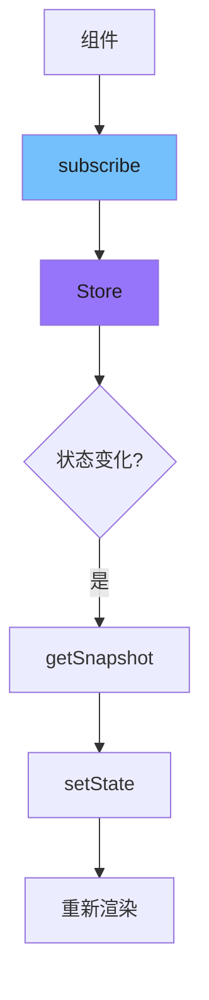
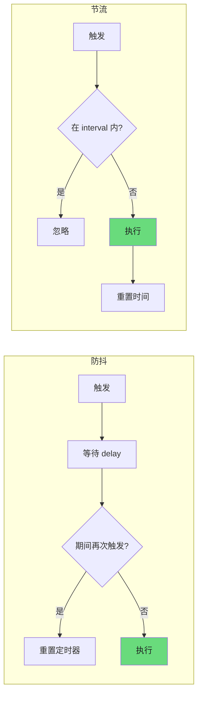
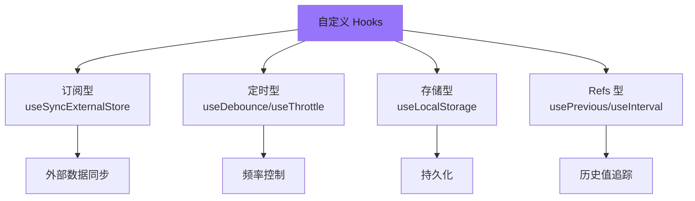

# 手写自定义 Hooks

> 本章节继续深入探讨 React 高级自定义 Hooks 的手写实现，涵盖状态同步、定时器、外部事件处理等核心模式。

---

## 1. 实现 useSyncExternalStore

`useSyncExternalStore` 是 React 18 引入的核心 Hook，用于安全地订阅外部数据源（如 Redux、Zustand、MobX 等状态管理器）。

### 1.1 基本实现

```javascript
/**
 * useSyncExternalStore - React 18 新增 Hook
 *
 * @param {Function} subscribe - 订阅函数，返回取消订阅的函数
 * @param {Function} getSnapshot - 获取当前状态的快照
 * @param {Function} getServerSnapshot - 服务端渲染时的快照获取函数
 * @returns {T} 返回的快照状态
 */
function useSyncExternalStore(subscribe, getSnapshot, getServerSnapshot) {
  // 1. 获取初始快照
  // useRef 用于存储最新的快照值，避免不必要的重新渲染
  const instRef = useRef(null);
  let inst;

  // 2. 判断是否为服务端渲染
  if (!useSyncExternalStore.isHydrating) {
    // 客户端：获取当前快照
    inst = getSnapshot();
  }

  // 3. 初始化 ref（仅首次渲染）
  if (instRef.current === null) {
    // 服务端渲染时使用专门的快照函数
    instRef.current = useSyncExternalStore.isHydrating
      ? getServerSnapshot?.() ?? inst
      : inst;
  }

  // 4. 使用 useState 管理状态更新
  // forceUpdate 用于触发组件重新渲染
  const [{ inst: value }, forceUpdate] = useState({ inst: instRef.current });

  // 5. 订阅外部 store 变化
  useEffect(() => {
    // 检查快照是否变化
    let prevSnapshot = instRef.current;
    let maybeSnapshot = getSnapshot();

    // 如果快照值发生变化，触发更新
    if (!Object.is(prevSnapshot, maybeSnapshot)) {
      instRef.current = maybeSnapshot;
      forceUpdate({ inst: maybeSnapshot });
    }

    // 订阅 store
    const callbackStore = subscribe((onStoreChange) => {
      // 每次 store 变化时，重新获取快照
      maybeSnapshot = getSnapshot();

      if (!Object.is(prevSnapshot, maybeSnapshot)) {
        prevSnapshot = maybeSnapshot;
        instRef.current = maybeSnapshot;
        // 批量更新
        flushSync(() => {
          forceUpdate({ inst: maybeSnapshot });
        });
      }
    });

    // 返回清理函数
    return () => callbackStore();
  }, [subscribe, getSnapshot]);

  // 6. 服务端渲染时验证快照一致性
  if (!useSyncExternalStore.isHydrating) {
    // 客户端 hydration 完成后检查一致性
    const snapshot = getSnapshot();
    if (!Object.is(value, snapshot)) {
      forceUpdate({ inst: snapshot });
    }
  }

  return value;
}

// 标记是否为 hydration 阶段
useSyncExternalStore.isHydrating = false;
```

### 1.2 简化版本

```javascript
// 简化版实现（适合面试）
function useSyncExternalStore(subscribe, getSnapshot) {
  const [state, setState] = useState(() => getSnapshot());

  useEffect(() => {
    // 订阅 store 变化
    const unsubscribe = subscribe(() => {
      // 获取新快照并更新状态
      const nextSnapshot = getSnapshot();
      setState(nextSnapshot);
    });

    return unsubscribe;
  }, [subscribe, getSnapshot]);

  return state;
}
```

### 1.3 常见使用场景

```javascript
// 第 1 段：引入依赖并给出两个对照场景的入口
// 这里同时演示两条路径：一条是真实 Redux store，一条是手写的极简 store，
// 它们最终都通过 useSyncExternalStore 接入 React，便于对比"React 到底要求外部数据源提供什么"。
// 场景1：订阅 Redux Store
import { useDispatch, useSelector } from 'react-redux';

// 第 2 段：把 Redux store 适配成 useSyncExternalStore 需要的"订阅函数 + 快照函数"
// useSyncExternalStore 的契约是：第一个参数接收一个 callback 并返回 unsubscribe，
// 第二个参数同步返回当前快照。subscribe 写在模块作用域而非组件内，是为了保证引用稳定——
// 若在组件里定义，每次渲染都是新函数，React 会先取消订阅再重新订阅，造成无谓开销甚至丢事件。
// 底层实现
const selectCount = (state) => state.counter.count;
const subscribe = (callback) => {
  // store.subscribe(callback) 本身返回 unsubscribe，直接透传即可，无需再包一层逻辑；
  // 这种"返回清理函数"的形态与 useEffect 的返回值语义一致，方便 React 在卸载时清理。
  const unsubscribe = store.subscribe(callback);
  return unsubscribe;
};

// 第 3 段：Counter 组件——在渲染期读取外部快照并订阅其变化
// React 会在 subscribe 通知到达时重新调用 selectCount 取快照，并用 Object.is 与旧值比较，
// 只有真的变化才重渲染，所以快照函数应该返回"原始值或稳定引用"；若每次返回新对象会造成无限循环。
// 易错点：未提供第三个参数 getServerSnapshot，因此在 SSR 环境下会抛错；此处仅适用于纯客户端渲染。
function Counter() {
  const count = useSyncExternalStore(subscribe, selectCount);
  return <div>{count}</div>;
}

// 第 4 段：手写一个极简可订阅 store，实现 useSyncExternalStore 所需的最小接口
// 用闭包保存 state、用 Set 保存监听者：Set 天然去重且删除 O(1)，避免同一函数重复注册导致一次更新多次通知。
// 关键词是"不可变更新"——setState 用对象展开生成新对象，保证 getSnapshot 返回的引用在真正变化时才变。
// 场景2：订阅自定义状态
const createStore = (initialState) => {
  let state = initialState;
  const listeners = new Set();

  return {
    getState: () => state,
    setState: (partial) => {
      // 先更新 state 再通知监听者，顺序不能颠倒：否则通知期间各订阅者读到的仍是旧值。
      state = { ...state, ...partial };
      // 遍历时若监听者在回调里取消订阅，Set 的迭代行为是安全的（新加入者不会在本轮被调用）。
      listeners.forEach(listener => listener());
    },
    subscribe: (listener) => {
      listeners.add(listener);
      // 返回取消订阅函数，正好满足 useSyncExternalStore 对 subscribe 返回值的约定。
      return () => listeners.delete(listener);
    }
  };
};

// 第 5 段：创建单例 store 并在 App 中与 React 打通
// store 定义在模块作用域，保证整个应用共享同一份状态，也让下面传给 useSyncExternalStore 的
// 两个箭头函数（订阅/取快照）在多次渲染间保持同一引用，避免重复订阅。
const store = createStore({ count: 0 });

function App() {
  // 第二个参数必须是纯函数且返回值稳定：这里 getState() 直接返回内部 state 引用，
  // 配合 setState 的不可变更新，React 才能用 Object.is 正确判断"是否真的变了"。
  const state = useSyncExternalStore(
    (cb) => store.subscribe(cb),
    () => store.getState()
  );

  // 点击时基于当前快照计算下一个值属于"读-改-写"，在并发渲染下若与其他更新交错可能丢失更新；
  // 生产级代码应改用 setState(prev => ...) 形式的函数式更新，这里为保持示例简洁而直接展开。
  return (
    <div>
      <p>Count: {state.count}</p>
      <button onClick={() => store.setState({ count: state.count + 1 })}>
        Increment
      </button>
    </div>
  );
}
```

### 1.4 设计原理图



---

## 2. 实现 useDebounce

防抖 Hook 用于延迟更新，常用于搜索输入、窗口调整等高频场景。

### 2.1 完整实现

```javascript
/**
 * useDebounce - 防抖 Hook
 *
 * @param {T} value - 需要防抖的值
 * @param {number} delay - 延迟时间（毫秒）
 * @returns {T} 防抖后的值
 *
 * 使用场景：
 * - 搜索框输入（等待用户停止输入后才搜索）
 * - 表单验证
 * - 窗口调整完成后再处理
 */
function useDebounce(value, delay = 500) {
  // 1. 使用 useState 存储防抖后的值
  const [debouncedValue, setDebouncedValue] = useState(value);

  // 2. 使用 useEffect 处理防抖逻辑
  useEffect(() => {
    // 3. 创建定时器
    const handler = setTimeout(() => {
      // 4. 延迟更新值
      setDebouncedValue(value);
    }, delay);

    // 5. 清理函数：value 或 delay 变化时清除旧定时器
    return () => {
      clearTimeout(handler);
    };
  }, [value, delay]); // 依赖项

  // 6. 返回防抖后的值
  return debouncedValue;
}
```

### 2.2 高级版本（带 loading 状态）

```javascript
/**
 * useDebounce - 高级版防抖 Hook
 *
 * 特点：
 * - 返回防抖值和防抖中状态
 * - 支持立即执行选项
 */
function useDebounce(value, options = {}) {
  const { delay = 500, immediate = false } = options;

  const [debouncedValue, setDebouncedValue] = useState(value);
  const [isDebouncing, setIsDebouncing] = useState(false);
  const timerRef = useRef(null);

  useEffect(() => {
    if (immediate) {
      // 立即模式：立即执行，然后防抖
      setIsDebouncing(true);
    }

    // 清除旧定时器
    if (timerRef.current) {
      clearTimeout(timerRef.current);
    }

    // 设置新定时器
    timerRef.current = setTimeout(() => {
      setDebouncedValue(value);
      setIsDebouncing(false);
    }, delay);

    // 清理
    return () => {
      if (timerRef.current) {
        clearTimeout(timerRef.current);
      }
    };
  }, [value, delay, immediate]);

  return {
    debouncedValue,
    isDebouncing
  };
}
```

### 2.3 使用示例

```javascript
function SearchComponent() {
  const [query, setQuery] = useState('');
  // 基础版
  const debouncedQuery = useDebounce(query, 300);

  // 高级版
  const { debouncedValue, isDebouncing } = useDebounce(query, { delay: 300 });

  // 搜索逻辑
  useEffect(() => {
    if (debouncedQuery) {
      fetchSearchResults(debouncedQuery);
    }
  }, [debouncedQuery]);

  return (
    <div>
      <input
        value={query}
        onChange={(e) => setQuery(e.target.value)}
        placeholder="搜索..."
      />
      {isDebouncing && <LoadingSpinner />}
    </div>
  );
}
```

---

## 3. 实现 useThrottle

节流 Hook 用于限制函数执行频率，常用于滚动事件、按钮防重复点击等场景。

### 3.1 完整实现

```javascript
/**
 * useThrottle - 节流 Hook
 *
 * @param {T} value - 需要节流的值
 * @param {number} interval - 节流间隔（毫秒）
 * @returns {T} 节流后的值
 *
 * 使用场景：
 * - 滚动事件处理
 * - 按钮防重复点击
 * - 窗口 resize 事件
 */
function useThrottle(value, interval = 100) {
  // 1. 使用 ref 存储上次更新的时间戳
  const lastUpdate = useRef(Date.now());

  // 2. 使用 ref 存储最新的值（立即可用）
  const valueRef = useRef(value);

  // 3. 更新 ref（每次 value 变化都立即更新）
  valueRef.current = value;

  // 4. 使用 useState 存储节流后的值
  const [throttledValue, setThrottledValue] = useState(value);

  useEffect(() => {
    // 5. 计算距离上次更新的时间
    const now = Date.now();
    const timeSinceLastUpdate = now - lastUpdate.current;

    if (timeSinceLastUpdate >= interval) {
      // 6. 间隔足够，直接更新
      lastUpdate.current = now;
      setThrottledValue(valueRef.current);
    } else {
      // 7. 间隔不够，设置定时器在合适时间更新
      const timerId = setTimeout(() => {
        lastUpdate.current = Date.now();
        setThrottledValue(valueRef.current);
      }, interval - timeSinceLastUpdate);

      // 8. 清理定时器
      return () => clearTimeout(timerId);
    }
  }, [value, interval]);

  return throttledValue;
}
```

### 3.2 简化版本

```javascript
// 经典节流实现
// 第 1 段：建立"节流值 + 上次提交时间"这两个状态基准（决定整个 hook 的数据源）
// throttledValue 放入 state 是为了驱动组件重渲染，调用方只看到它，而不是每次都变的 value；
// lastRan 放入 ref 是因为它只是内部记账：改它不该触发渲染，也避免把它写进 deps 造成自我循环。
function useThrottle(value, interval) {
  const [throttledValue, setThrottledValue] = useState(value); // 初值直接用 value，避免首帧返回 undefined 造成闪烁
  const lastRan = useRef(Date.now()); // 记录"上一次真正提交给 UI 的时刻"，Date.now() 在渲染期求值，后续只作基准

  // 第 2 段：用定时器把"高频变化"收敛为"每 interval 最多提交一次"（节流的核心调度）
  // 关键点：延迟量不是写死的 interval，而是 interval - 已流逝时间，使定时器正好落在"距离上次提交满 interval"的那一刻；
  // 这样连续变化时不会每次重置整个窗口，从而在高频输入下仍能保证约 interval 一次的提交频率（复杂度 O(1)/次变化）。
  // 易错点：必须把 value、interval 放进依赖，否则读到的永远是旧 value；而 lastRan 是 ref，不需要也不能放进依赖。
  useEffect(() => {
    const handler = setTimeout(() => {
      // 第 3 段：定时器回调里的"最终闸门"——二次校验是否真的满足节流间隔
      // 之所以要再判断一次：定时器可能因 interval 变化被重排、或实际触发时间早于预期，光靠延迟量不足以保证间隔；
      // 边界条件：当 interval - 已流逝时间 <= 0 时，setTimeout 会按 0 处理立即执行，此时该条件成立，直接提交，行为仍然正确。
      if (Date.now() - lastRan.current >= interval) {
        setThrottledValue(value); // 提交当前 value（闭包捕获的是本次 effect 对应的那个 value）
        lastRan.current = Date.now(); // 推进时间基准，作为下一次节流的起算点
      }
    }, interval - (Date.now() - lastRan.current)); // 负数由 setTimeout 归一为 0，等价于"立刻检查"

    // 第 4 段：清理——每次 value/interval 变化或组件卸载前，取消尚未执行的旧定时器
    // 不清理会有两类事故：旧定时器提交过期值（覆盖新值）、卸载后 setState 触发警告/内存泄漏。
    return () => clearTimeout(handler);
  }, [value, interval]);

  // 第 5 段：对外只暴露节流后的值
  // 在同一节流窗口内引用保持不变，调用方可安全地用它做依赖比较或派生计算。
  return throttledValue;
}
```

### 3.3 使用示例

```javascript
function ScrollComponent() {
  const [scrollY, setScrollY] = useState(0);

  // 使用节流限制滚动事件频率
  const throttledScrollY = useThrottle(scrollY, 100);

  useEffect(() => {
    const handleScroll = () => {
      setScrollY(window.scrollY);
    };

    window.addEventListener('scroll', handleScroll);
    return () => window.removeEventListener('scroll', handleScroll);
  }, []);

  return (
    <div>
      <p>当前滚动位置: {throttledScrollY}</p>
    </div>
  );
}

function SubmitButton() {
  const [isThrottled, setIsThrottled] = useState(false);
  const lastClick = useRef(0);

  const handleClick = () => {
    const now = Date.now();
    if (now - lastClick.current > 1000) { // 1秒防抖
      lastClick.current = now;
      // 执行提交逻辑
      submitForm();
    }
  };

  return <button onClick={handleClick}>提交</button>;
}
```

### 3.4 防抖 vs 节流 对比



---

## 4. 实现 useLocalStorage

`useLocalStorage` Hook 实现 localStorage 与 React 状态的同步。

### 4.1 完整实现

```javascript
/**
 * useLocalStorage - localStorage 同步 Hook
 *
 * @param {string} key - localStorage 的键名
 * @param {T} initialValue - 初始值
 * @returns {[T, Function]} [值, 更新函数]
 *
 * 特点：
 * - 跨标签页同步
 * - 序列化支持（支持对象、数组等）
 * - SSR 兼容
 */
function useLocalStorage(key, initialValue) {
  // 1. 获取初始值的工厂函数
  const initializer = useRef((key) => {
    try {
      const item = window.localStorage.getItem(key);
      // 2. 解析 JSON，失败则返回初始值
      return item ? JSON.parse(item) : initialValue;
    } catch (error) {
      console.warn(`Error reading localStorage key "${key}":`, error);
      return initialValue;
    }
  });

  // 3. 使用 useState 存储状态
  // 惰性初始化避免 SSR 问题
  const [storedValue, setStoredValue] = useState(() =>
    initializer.current(key)
  );

  // 4. 封装的更新函数
  const setValue = useCallback(
    (value) => {
      try {
        // 5. 支持函数式更新
        const valueToStore = value instanceof Function
          ? value(storedValue)
          : value;

        // 6. 保存到 state
        setStoredValue(valueToStore);

        // 7. 保存到 localStorage
        // null/undefined 时移除键
        if (valueToStore === null || valueToStore === undefined) {
          window.localStorage.removeItem(key);
        } else {
          window.localStorage.setItem(key, JSON.stringify(valueToStore));
        }
      } catch (error) {
        console.warn(`Error setting localStorage key "${key}":`, error);
      }
    },
    [key, storedValue]
  );

  // 8. 跨标签页同步
  useEffect(() => {
    const handleStorageChange = (e) => {
      // 忽略同标签页的修改
      if (e.key !== key || e.storageArea !== window.localStorage) {
        return;
      }

      try {
        const newValue = e.newValue
          ? JSON.parse(e.newValue)
          : initialValue;
        setStoredValue(newValue);
      } catch (error) {
        console.warn(`Error parsing localStorage change:`, error);
      }
    };

    window.addEventListener('storage', handleStorageChange);
    return () => window.removeEventListener('storage', handleStorageChange);
  }, [key, initialValue]);

  return [storedValue, setValue];
}
```

### 4.2 简化和 SSR 安全版本

```javascript
// SSR 兼容版本
function useLocalStorage(key, initialValue) {
  // 状态初始化
  const [state, setState] = useState(() => {
    if (typeof window === 'undefined') {
      // 服务端渲染：返回初始值
      return initialValue;
    }
    try {
      const item = window.localStorage.getItem(key);
      return item ? JSON.parse(item) : initialValue;
    } catch {
      return initialValue;
    }
  });

  // 更新函数
  const setValue = useCallback(
    (value) => {
      const valueToStore = value instanceof Function ? value(state) : value;
      setState(valueToStore);

      if (typeof window !== 'undefined') {
        if (valueToStore === null) {
          window.localStorage.removeItem(key);
        } else {
          window.localStorage.setItem(key, JSON.stringify(valueToStore));
        }
      }
    },
    [key, state]
  );

  return [state, setValue];
}
```

### 4.3 使用示例

```javascript
// 第 1 段：基础用法（把单值 state 持久化到 localStorage，并渲染一个切换按钮）
// useLocalStorage 是 useState 的持久化替代品：首次挂载时若 localStorage 中没有该 key，
// 就用第二个参数作兜底初始值；此后每次 setState 都会把新值写回存储，所以刷新页面 theme 不丢失。
function ThemeToggle() {
  const [theme, setTheme] = useLocalStorage('theme', 'light'); // 'light' 只是"无历史记录"时的初始快照，不覆盖已有值

  // 第 2 段：事件处理——把一次点击映射成枚举翻转
  // 用函数式更新 t => ... 而不是直接读外层的 theme，是为了拿到 React 保证的最新 state，
  // 避免闭包捕获旧值：连续快速点击时直接读 theme 可能基于过期快照计算出错误结果。
  return (
    <button onClick={() => setTheme(t => t === 'light' ? 'dark' : 'light')}>
      Current: {theme}
    </button>
  );
}

// 第 3 段：复杂数据结构（持久化一个对象 state，演示多字段偏好设置的读写）
// 第二个参数是对象字面量，每次渲染都会重新创建，但持久化 Hook 只在首次挂载时读取它，
// 因此它只充当"初始快照"，不会覆盖用户已保存的偏好设置。
// 另需注意：该对象会被 JSON 序列化后写入 localStorage，字段必须可序列化（不要放函数、Date、Map 等）。
function UserPreferences() {
  const [preferences, setPreferences] = useLocalStorage('preferences', {
    fontSize: 14,
    language: 'zh-CN',
    notifications: true
  });

  // 第 4 段：受控输入 + 不可变的局部字段更新
  // 只改 fontSize 一个字段，必须用 { ...p, fontSize: ... } 生成新对象：React 依赖引用比较判断是否重渲染，
  // 原地修改 p.fontSize 既不会触发更新，又污染了旧快照（这也是"不可变更新"的核心原因）。
  // Number(...) 不可省略：<input type="number"> 的 e.target.value 始终是字符串，
  // 不转换会让该字段从数字退化为字符串，破坏后续数值比较/运算；边界情况是清空输入时 value 为 ''，
  // Number('') === 0，会静默变成 0，若需要"允许空值"应在此处额外做判空处理。
  return (
    <div>
      <input
        type="number"
        value={preferences.fontSize}
        onChange={(e) =>
          setPreferences(p => ({ ...p, fontSize: Number(e.target.value) }))
        }
      />
    </div>
  );
}
```

---

## 5. 实现 usePrevious

`usePrevious` Hook 用于获取上一个渲染周期的值，常用于动画、比较值变化等场景。

### 5.1 核心实现

```javascript
/**
 * usePrevious - 获取上一个渲染周期的值
 *
 * @param {T} value - 当前值
 * @returns {T | undefined} 上一个值（首次渲染返回 undefined）
 *
 * 实现原理：
 * 使用 useRef 存储值，因为 ref 的更新不会触发重新渲染
 */
function usePrevious(value) {
  // 1. 创建 ref 存储上一个值
  const ref = useRef();

  // 2. 每次渲染后更新 ref
  // useLayoutEffect 确保在 DOM 更新后同步执行
  useLayoutEffect(() => {
    // 将当前值存入 ref
    ref.current = value;
  }, [value]); // 依赖项：value 变化时更新

  // 3. 返回上一个渲染周期的值
  return ref.current;
}
```

### 5.2 带初始值的版本

```javascript
/**
 * usePrevious - 支持初始值的版本
 */
function usePrevious(value, initialValue = undefined) {
  const ref = useRef(initialValue);
  const prevRef = useRef();

  // useLayoutEffect 在 DOM 更新后、浏览器绘制前同步执行
  useLayoutEffect(() => {
    prevRef.current = ref.current;
    ref.current = value;
  }, [value]);

  return prevRef.current;
}
```

### 5.3 进阶版本（带变化检测）

```javascript
/**
 * usePrevious - 进阶版，包含变化信息
 */
function usePrevious(value) {
  const prevRef = useRef();
  const isFirstRender = useRef(true);

  useLayoutEffect(() => {
    if (isFirstRender.current) {
      // 首次渲染：不更新 prevRef
      isFirstRender.current = false;
    } else {
      // 后续渲染：保存上一个值
      prevRef.current = value;
    }
  });

  // 另一种方式：立即返回当前值，同时更新 ref
  const currentRef = useRef(value);
  if (currentRef.current !== value) {
    prevRef.current = currentRef.current;
    currentRef.current = value;
  }

  return {
    previous: prevRef.current,
    current: value,
    changed: prevRef.current !== value,
    // 获取上 N 个值
    getPrevious: (n = 1) => {
      // 可以扩展为历史记录
    }
  };
}
```

### 5.4 使用示例

```javascript
// 场景1：检测值变化
function AnimatedNumber({ value }) {
  const prevValue = usePrevious(value);
  const [direction, setDirection] = useState('none');

  useEffect(() => {
    if (value > prevValue) setDirection('up');
    else if (value < prevValue) setDirection('down');
  }, [value, prevValue]);

  return (
    <div className={`number-animate-${direction}`}>
      {value}
    </div>
  );
}

// 场景2：条件 effect
function DataFetcher({ fetchId }) {
  const prevFetchId = usePrevious(fetchId);

  useEffect(() => {
    // 只在 fetchId 真正变化时请求
    if (fetchId !== prevFetchId) {
      fetchData(fetchId);
    }
  }, [fetchId, prevFetchId]);

  // ...
}

// 场景3：动画过渡
function TransitionWrapper({ isVisible }) {
  const wasVisible = usePrevious(isVisible);

  return (
    <div
      className={`transition ${isVisible ? 'enter' : 'leave'}`}
      style={{
        opacity: isVisible ? 1 : 0,
        transform: isVisible ? 'scale(1)' : 'scale(0.9)'
      }}
    >
      {isVisible && <Content />}
    </div>
  );
}
```

---

## 6. 实现 useInterval

`useInterval` Hook 提供一个稳定的定时器，自动处理清理逻辑。

### 6.1 核心实现

```javascript
/**
 * useInterval - 稳定的 setInterval Hook
 *
 * @param {Function} callback - 定时执行的回调函数
 * @param {number | null} delay - 间隔时间（毫秒），null 时暂停
 *
 * 特点：
 * - 回调函数变化时自动更新定时器
 * - delay 为 null/0 时暂停
 * - 组件卸载时自动清理
 */
function useInterval(callback, delay) {
  // 1. 使用 ref 存储最新的回调函数
  // 避免闭包陷阱：每次渲染回调函数可能变化
  const savedCallback = useRef(callback);

  // 2. 更新 ref（渲染完成后立即执行）
  useLayoutEffect(() => {
    savedCallback.current = callback;
  });

  // 3. 设置定时器
  useEffect(() => {
    // 如果 delay 为 null，不启动定时器
    if (delay === null || delay === undefined) {
      return;
    }

    // 4. 创建定时器
    const id = setInterval(() => {
      savedCallback.current();
    }, delay);

    // 5. 返回清理函数
    return () => clearInterval(id);
  }, [delay]); // delay 变化时重新创建定时器
}
```

### 6.2 动态delay版本

```javascript
/**
 * useInterval - 支持动态 delay
 */
// 第 1 段：用 ref 把最新回调"装盒"，解开「回调身份」与「定时器生命周期」的耦合
// 若直接把 callback 写进下面 effect 的依赖，父组件每次渲染传入新的内联箭头函数
// 都会触发一次 clearInterval + setInterval，定时器被反复重置、节奏被拖慢甚至永不触发。
// ref 的 .current 跨渲染保持同一引用，天然适合存放"不该触发副作用的可变值"。
function useInterval(callback, delay) {
  const savedCallback = useRef(callback); // 用初始 callback 填充，避免首次 tick 前读到 undefined

// 第 2 段：每次提交后同步 ref，保证定时器永远调用到最新闭包
// 刻意不写依赖数组：缺省即"每次 commit 都跑"，成本仅一次赋值，却让保存的回调始终新鲜。
// 选 useLayoutEffect 而非 useEffect，是为了在浏览器绘制前、且在下面定时器 effect 之前完成写入，
// 消除"旧回调抢先执行一次"的竞态。
  useLayoutEffect(() => {
    savedCallback.current = callback;
  });

// 第 3 段：真正管理定时器，仅当 delay 变化时才重建
// 依赖数组只放 [delay]，把"重启定时器"的触发条件收窄到 delay 本身。
// null/undefined 作为"暂停"哨兵（这里必须显式判断，写成 !delay 会让 delay=0 被误判为暂停）。
// 返回的清理函数会在 delay 变化或组件卸载时销毁旧定时器，防止重复计时与内存泄漏。
  useEffect(() => {
    if (delay === null || delay === undefined) {
      return; // 返回 undefined 表示无清理逻辑，等价于停表
    }

    const tick = () => {
      savedCallback.current(); // 经 ref 间接调用，永远命中最新回调
    };

    const id = setInterval(tick, delay);
    return () => clearInterval(id);
  }, [delay]);
}
```

### 6.3 带暂停/恢复功能

```javascript
    /**
 * useInterval - 完整版
 */
// 第 1 段：用 ref 保存最新回调，把「回调身份」和「定时器生命周期」解耦
// 定时器一旦创建，其闭包里的 callback 就固定为创建那一刻的函数；若把 callback 放进
// useEffect 依赖里，父组件每次渲染产生的新函数都会导致 clearInterval + setInterval，
// 于是计时被反复重置（表现为「永远不触发」）。用 ref 持有最新回调可避免重建定时器。
function useInterval(callback, delay) {
  const savedCallback = useRef(callback);

  // 第 2 段：建立开关状态（isRunning）与 delay 的可变引用
  // useState 的初值只在首次挂载时求值一次，之后 delay 变化不会回溯改写 isRunning，
  // 因此这个布尔量表示的是「用户意图」，而不是对 delay 的实时派生值。
  const [isRunning, setIsRunning] = useState(delay !== null);

  // 保存 delay 引用
  // 预留的 ref：原意是让外部无需重建定时器即可改间隔，但本实现未消费它——
  // 动态改间隔在这里仍会走 effect 重建，属于遗留代码，不要误以为它已生效。
  const delayRef = useRef(delay);

  // 第 3 段：每次渲染后同步最新 callback 到 ref
  // 特意不写依赖数组：每个 commit 都刷新 ref；又选用 useLayoutEffect 而非 useEffect，
  // 是为了在浏览器绘制前完成赋值，避免上一次被动 effect 与已到期定时器之间的竞态，
  // 使定时器回调永远拿到本次渲染最新的闭包（state、props 都是新的）。
  useLayoutEffect(() => {
    savedCallback.current = callback;
  });

  // 第 4 段：核心调度——真正创建/销毁定时器的唯一位置
  // 依赖只有 [isRunning, delay]：callback 变化被刻意排除在外，这正是上面 savedCallback 的价值。
  // 边界：delay === null 时不建定时器（约定 null 表示暂停），即使 isRunning 为 true 也直接返回；
  // 若 delay 为 0/负数会被浏览器钳制为 ~0ms，等于高频空转，调用方需自行兜底。
  // 复杂度：每次依赖变化 O(1) 次 setInterval；清理函数保证同一时刻至多一个存活定时器，
  // 从而杜绝快速 toggle（如 React 18 严格模式的双调用）造成的定时器泄漏或重复计时。
  useEffect(() => {
    if (!isRunning || delay === null) {
      return;
    }

    const id = setInterval(() => {
      savedCallback.current();
    }, delay);

    return () => clearInterval(id);
  }, [isRunning, delay]);

  // 第 5 段：对外暴露的控制函数，全部用 useCallback 锁定身份
  // 依赖为空数组 → 三个函数在整个生命周期内引用恒定，可安全作为下游 useEffect/子组件的 props，
  // 不会因为父组件重渲染而产生新的依赖进而触发多余副作用。
  // toggle 使用函数式更新 s => !s，规避闭包里 isRunning 过期的经典陷阱。
  const start = useCallback(() => setIsRunning(true), []);
  const stop = useCallback(() => setIsRunning(false), []);
  const toggle = useCallback(() => setIsRunning(s => !s), []);

  // 第 6 段：以对象形式返回命令式 API
  // 注意该对象每次渲染都是新引用，若被当作依赖使用需由调用方 memo 或解构出具体方法。
  return { start, stop, toggle };
}

// 或者返回控制函数
// 第 1 段：另一种形态——不借助 state，直接命令式地持有定时器句柄
// 与上一个实现的取舍：本版本不触发重渲染（性能更好、不会引起整棵子树更新），
// 代价是「是否在运行」这一状态无法参与渲染，UI 需另行维护；同时 delay 变化时不会自动重启。
function useIntervalControl(callback, delay) {
  const savedCallback = useRef(callback);
  const intervalRef = useRef(null);

  // 第 2 段：同样的 ref 同步策略，保证 interval 内始终调用最新 callback
  // 若改用 useEffect，极端情况下定时器可能在 ref 刷新前触发一次旧闭包，故此处仍用 layout 时机。
  useLayoutEffect(() => {
    savedCallback.current = callback;
  });

  // 第 3 段：start——幂等启动
  // 先判断 intervalRef.current 是否存在，已存在则直接返回，避免重复点击/重复调用叠加出多个定时器
  // （多个定时器会共享同一个 ref，stop 只能清掉最后一个，其余成为无法回收的幽灵计时器）。
  // 依赖 [delay]：delay 变化会重建 start 函数，但已在跑的定时器不会自动套用新间隔，需先 stop 再 start。
  // 边界：delay 为 null/undefined 时 setInterval 会退化为 ~0ms 高频触发，本函数未做防护，调用方需自律。
  const start = useCallback(() => {
    if (intervalRef.current) return;
    intervalRef.current = setInterval(() => {
      savedCallback.current();
    }, delay);
  }, [delay]);

  // 第 4 段：stop——幂等清理
  // clearInterval 后必须把 ref 复位为 null，否则残留的真值句柄会让后续 start 误判为「仍在运行」而拒绝启动。
  // 依赖为空，函数身份恒定，便于作为 effect 依赖与事件处理器复用。
  const stop = useCallback(() => {
    if (intervalRef.current) {
      clearInterval(intervalRef.current);
      intervalRef.current = null;
    }
  }, []);

  // 组件卸载时清理
  // 第 5 段：卸载兜底
  // 该 effect 只用于返回清理函数：卸载时调用 stop，防止定时器持续触发已卸载组件的 setState（内存泄漏 + 警告）。
  // 依赖 [stop] 因其身份恒定而等价于仅在挂载/卸载时执行一次；不包含 delay，故 delay 变化不会打断运行中的定时器。
  useEffect(() => {
    return () => stop();
  }, [stop]);

  // 第 6 段：返回命令式句柄
  // 与 useInterval 的 start/stop/toggle 不同，这里没有 toggle——因为运行状态不在 React 状态树里，
  // 外部无法可靠地推导出「下一步该启动还是停止」。
  return { start, stop };
}
```

### 6.4 使用示例

```javascript
// 倒计时组件
// 第 1 段：把传入的 duration 冻结为初始剩余秒数
// 用 state 而非直接读 duration，是为了让倒计时能被自身的 tick 推进；
// duration 只在挂载时决定起点，之后父组件再传新值也不会重置（需留意的边界行为）。
function Countdown({ startTime, duration }) {
  const [remaining, setRemaining] = useState(duration);

  // 第 2 段：挂一个「可暂停」的定时器，每秒把剩余秒数减 1
  // 把延迟写成 remaining > 0 ? 1000 : null 是 useInterval 的约定：null 表示暂停。
  // 这样归零后自动停表，无需在 effect 内再做条件分支，也绕开了 setInterval 闭包读到旧值的老问题。
  useInterval(() => {
    // 函数式更新拿最新的 r，避免闭包捕获过期的 remaining
    setRemaining((r) => {
      if (r <= 1) return 0; // 夹断到 0，防止递减出负数
      return r - 1;
    });
  }, remaining > 0 ? 1000 : null);

  // 第 3 段：渲染当前剩余秒数
  // startTime 在当前实现里未参与计算（预留的挂起点）；状态更新触发重渲染从而刷新文案。
  return <div>{remaining} 秒</div>;
}

// 轮播组件
// 第 1 段：只记录当前展示的下标
// 存索引而不存图片本身，渲染时用 images[currentIndex] 取图，
// 这样数组内容替换时索引语义保持一致，也便于做取模循环。
function Carousel({ images, autoPlay = true }) {
  const [currentIndex, setCurrentIndex] = useState(0);

  // 第 2 段：按固定节奏推进下标，并支持关闭自动播放
  // autoPlay 为 false 时延迟传 null，useInterval 直接不启动定时器，
  // 语义是「暂停」而不是「跳过」，所以下次开启仍从当前图继续。
  useInterval(() => {
    // (i + 1) % images.length 实现首尾相接：到达末张后回到 0，天然防越界
    setCurrentIndex((i) => (i + 1) % images.length);
  }, autoPlay ? 3000 : null);

  // 第 3 段：根据下标渲染当前图片
  // 边界：若 images 为空数组，images[0] 为 undefined，img 会渲染成空 src；
  // 生产代码通常需要在这里补一层空数组兜底。
  return (
    <div>
      
    </div>
  );
}

// 动画帧控制
// 第 1 段：用 ref 保存「请求 id」与「上一帧时间戳」两份跨渲染的可变数据
// 它们不需要触发重渲染，因此用 useRef 而非 useState；
// requestRef 供卸载时取消动画，previousTimeRef 供计算帧间隔。
function useAnimationFrame(callback) {
  const requestRef = useRef();
  const previousTimeRef = useRef();

  // 第 2 段：启动 rAF 循环，并返回清理函数
  // effect 依赖 callback：其身份变化会取消旧循环、重启新循环，
  // 所以调用方必须用 useCallback 稳定它，否则每渲染一次都会重建动画循环。
  useEffect(() => {
    const animate = (time) => {
      // 首帧没有「上一帧」可减，跳过回调，只记录时间戳
      if (previousTimeRef.current !== undefined) {
        const deltaTime = time - previousTimeRef.current;
        callback(deltaTime); // 把帧间隔交给调用方，便于做与帧率无关的运动
      }
      previousTimeRef.current = time;
      // 递归排下一帧；time 由浏览器注入，是自页面加载起的高精度毫秒数
      requestRef.current = requestAnimationFrame(animate);
    };

    requestRef.current = requestAnimationFrame(animate);
    // 卸载（或依赖变更）时取消「最近一次」排队的帧，避免循环泄漏
    return () => cancelAnimationFrame(requestRef.current);
  }, [callback]);
}
```

---

## 7. 实现 useOnClickOutside

`useOnClickOutside` Hook 用于检测点击元素外部的事件，常用于下拉菜单、模态框、工具提示等场景。

### 7.1 核心实现

```javascript
/**
 * useOnClickOutside - 检测点击外部事件
 *
 * @param {RefObject} ref - 目标元素的 ref
 * @param {Function} handler - 点击外部时执行的回调函数
 * @param {Object} options - 配置选项
 * @param {string[]} options.enabled - 是否启用监听
 *
 * 实现原理：
 * 1. 给 document 添加 click 事件监听
 * 2. 当事件目标不在 ref 指向的元素内时触发 handler
 */
function useOnClickOutside(ref, handler, options = {}) {
  const { enabled = true } = options;

  useEffect(() => {
    // 如果没有 ref 或未启用，不添加监听
    if (!enabled || !ref.current) {
      return;
    }

    // 事件处理函数
    const listener = (event) => {
      // 如果点击目标不在目标元素内
      if (!ref.current || ref.current.contains(event.target)) {
        return;
      }

      // 执行回调
      handler(event);
    };

    // 使用 capture 阶段确保早期拦截
    document.addEventListener('mousedown', listener, { capture: true });
    document.addEventListener('touchstart', listener, { capture: true });

    // 清理
    return () => {
      document.removeEventListener('mousedown', listener, { capture: true });
      document.removeEventListener('touchstart', listener, { capture: true });
    };
  }, [ref, handler, enabled]);
}
```

### 7.2 带忽略元素列表的版本

```javascript
/**
 * useOnClickOutside - 增强版
 */
function useOnClickOutside(ref, handler, options = {}) {
  const { enabled = true, ignoreList = [] } = options;

  useEffect(() => {
    if (!enabled || !ref.current) return;

    const listener = (event) => {
      const target = event.target;

      // 检查是否在目标元素内
      if (ref.current && ref.current.contains(target)) {
        return;
      }

      // 检查是否在忽略列表内
      for (const ignoreRef of ignoreList) {
        if (ignoreRef.current?.contains(target)) {
          return;
        }
      }

      handler(event);
    };

    document.addEventListener('mousedown', listener, { capture: true });
    document.addEventListener('touchstart', listener, { capture: true });

    return () => {
      document.removeEventListener('mousedown', listener, { capture: true });
      document.removeEventListener('touchstart', listener, { capture: true });
    };
  }, [ref, handler, enabled, ignoreList]);
}
```

### 7.3 移动端兼容版本

```javascript
/**
 * useOnClickOutside - 移动端版本
 */
function useOnClickOutside(ref, handler) {
  useEffect(() => {
    if (!ref.current) return;

    const listener = (event) => {
      // 同时支持 mouse 和 touch 事件
      const isClickOutside =
        event.type === 'mousedown'
          ? !ref.current.contains(event.target)
          : // 对于 touch 事件，检查所有触摸点
            Array.from(event.changedTouches).every(
              (touch) => !ref.current.contains(touch.target)
            );

      if (isClickOutside) {
        handler(event);
      }
    };

    document.addEventListener('mousedown', listener, true);
    document.addEventListener('touchstart', listener, true);

    return () => {
      document.removeEventListener('mousedown', listener, true);
      document.removeEventListener('touchstart', listener, true);
    };
  }, [ref, handler]);
}
```

### 7.4 使用示例

```javascript
// ===== 下拉菜单 =====
// 第 1 段：初始化受控状态与 DOM 引用
// useState 托管菜单的显隐，而"点击外部关闭"必须拿到真实 DOM 节点来判定点击范围，
// 所以用 useRef 承载根容器引用。注意 ref 的赋值只在渲染后生效，不能在函数体内直接读。
function Dropdown() {
  const [isOpen, setIsOpen] = useState(false);
  const menuRef = useRef();

  // 第 2 段：注册全局点击监听，实现"点到外面就收起"
  // 该 hook 内部通常在 document 上监听 mousedown/click，用 menuRef 判断事件目标是否越界。
  // 因为 ref 覆盖了按钮与菜单，点击按钮切换时不会被误判为"外部"点击，本次切换不会被自己撤销。
  useOnClickOutside(menuRef, () => setIsOpen(false));

  // 第 3 段：渲染触发器与按需挂载的菜单
  // 菜单用 isOpen && (...) 条件渲染而非 CSS 隐藏：关闭时列表从 DOM 移除，
  // 省去无谓的节点与监听开销，代价是每次展开都重新创建节点（此处列表极短，可接受）。
  return (
    <div ref={menuRef}>
      <button onClick={() => setIsOpen(!isOpen)}>菜单</button>
      {isOpen && (
        <ul className="dropdown-menu">
          <li>选项1</li>
          <li>选项2</li>
        </ul>
      )}
    </div>
  );
}

// ===== 模态框 =====
// 第 4 段：引用遮罩内的内容容器 + 注册外部点击
// Modal 是"受控"组件，显隐由父级传入的 isOpen 决定，自身不持有状态，便于父级统一调度。
// useOnClickOutside 必须放在任何 return 之前调用——Hooks 的调用顺序在多次渲染间必须一致，
// 若把它挪到 if (!isOpen) 之后，关闭态会少调用一次 Hook，触发顺序错乱错误。
function Modal({ isOpen, onClose, children }) {
  const modalRef = useRef();

  useOnClickOutside(modalRef, onClose);

  // 第 5 段：关闭态直接短路返回
  // 提前 return null 让关闭时整个子树不挂载，比用 display:none 更干净，
  // 同时避免遮罩层残留拦截页面其它点击。
  if (!isOpen) return null;

  // 第 6 段：渲染遮罩 + 内容
  // ref 绑在 modal-content 上而非 overlay 上：点击遮罩（内容之外）会被判定为"外部"，
  // 从而触发 onClose，实现"点遮罩关闭"；点击内容区则在范围内，不会误关。
  // 易错点：这里未监听 Esc 键、也未做 focus 陷阱与滚动锁定，无障碍与体验上仍有缺口。
  return (
    <div className="modal-overlay">
      <div ref={modalRef} className="modal-content">
        {children}
      </div>
    </div>
  );
}

// ===== Popover 组件 =====
// 第 7 段：状态与双 ref 准备
// 与 Dropdown 不同，触发元素和浮层内容是兄弟节点，浮层定位/外部判定需要分开的引用，
// 因此这里额外保留 triggerRef；但下方只把 popoverRef 传给了外部点击 hook。
function Popover({ content, children }) {
  const [isOpen, setIsOpen] = useState(false);
  const popoverRef = useRef();
  const triggerRef = useRef();

  // 第 8 段：点击浮层外部即关闭
  // 判据只覆盖 popoverRef，也就是只认浮层内部为"内"。
  // 易错点：点击 trigger 时它既在 popoverRef 之外、又会触发 toggle，
  // 于是"先关后开/先开后关"两次状态变更相互抵消，表现为点击触发器无法正常开合；
  // 常见修法是把 triggerRef 一并纳入 hook 的忽略范围，或改用已开启时不再翻转。
  useOnClickOutside(popoverRef, () => setIsOpen(false));

  // 第 9 段：渲染触发器与浮层
  // 用 Fragment 包裹是因为触发器和浮层需作为同级兄弟输出，不能多套一层 DOM 破坏布局。
  // triggerRef 被赋给了 span，但当前没有任何逻辑消费它，属于为后续扩展预留的引用。
  return (
    <>
      <span ref={triggerRef} onClick={() => setIsOpen(!isOpen)}>
        {children}
      </span>
      {isOpen && (
        <div ref={popoverRef} className="popover">
          {content}
        </div>
      )}
    </>
  );
}
```

---

## 8. 实现 useEventListener

`useEventListener` Hook 提供统一的事件监听管理，自动处理清理逻辑。

### 8.1 核心实现

```javascript
/**
 * useEventListener - 事件监听 Hook
 *
 * @param {string} event - 事件名称
 * @param {Function} handler - 事件处理函数
 * @param {Object} options - addEventListener 选项
 * @param {Element} options.target - 监听目标，默认 window
 * @param {boolean} options.enabled - 是否启用
 *
 * 特点：
 * - 自动清理
 * - 支持多种目标（window, document, 自定义元素）
 * - useRef 避免闭包问题
 */
function useEventListener(event, handler, options = {}) {
  const {
    target = typeof window !== 'undefined' ? window : null,
    enabled = true,
    ...listenerOptions
  } = options;

  // 使用 ref 存储最新的 handler
  const savedHandler = useRef(handler);

  // 每次渲染更新 ref
  useLayoutEffect(() => {
    savedHandler.current = handler;
  }, [handler]);

  useEffect(() => {
    // 如果未启用或没有目标，不添加监听
    if (!enabled || !target) {
      return;
    }

    // 确保目标支持 addEventListener
    if (!target.addEventListener) {
      console.warn(`Target does not support addEventListener:`, target);
      return;
    }

    // 创建事件监听器
    const listener = (event) => {
      savedHandler.current(event);
    };

    // 添加监听
    target.addEventListener(event, listener, listenerOptions);

    // 清理
    return () => {
      target.removeEventListener(event, listener, listenerOptions);
    };
  }, [event, target, enabled, listenerOptions.capture, listenerOptions.once, listenerOptions.passive]);
}
```

### 8.2 完整版本（支持更多事件类型）

```javascript
/**
 * useEventListener - 完整版
 */
// 第 1 段：参数解构与配置归一化（把 options 里的可选项一次性摊平，后面只用裸变量）
// 默认值体系是这套 API 的"契约"：enabled=true 让调用方可以只用一个开关就临时停用监听，
// 而 capture/once/passive 三个默认 false 与 addEventListener 的默认行为保持一致，避免隐式改变语义。
// 注意此处用 options = {} 兜底，是为了支持 useEventListener('click', fn) 这种省略第三参的写法。
function useEventListener(event, handler, options = {}) {
  const {
    target,
    enabled = true,
    capture = false,
    once = false,
    passive = false
  } = options;

  // 第 2 段：用 ref 存放"最新 handler"，切断 handler 身份与订阅生命周期的耦合
  // 如果不这样做，把 handler 放进下面的依赖数组会导致每次渲染生成的新函数都触发"退订+重订"，
  // 高频渲染场景下既有性能开销，又会打断 once 的语义（监听器被反复换掉，永远等不到触发那一刻）。
  const savedHandler = useRef(handler);

  // 第 3 段：在布局阶段同步刷新 ref，保证订阅时读到的是本次渲染的 handler
  // 用 useLayoutEffect 而非 useEffect，是因为它在浏览器绘制前、且在后续的被动 effect 之前执行，
  // 这样下面 useEffect 注册监听器时 savedHandler.current 已经是新的，不会出现"晚一帧的旧回调"。
  useLayoutEffect(() => {
    savedHandler.current = handler;
  }, [handler]);

  useEffect(() => {
    // 第 4 段：开关短路——enabled 为假时直接不订阅
    // 这里 return undefined（而非清理函数）是刻意的：没有建立任何资源，自然也无须回收。
    if (!enabled) return;

    // 解析目标元素
    // 第 5 段：target 的多态归一化，统一收敛成"一个可用的 EventTarget 或 null"
    // 三种形态分别对应：CSS 选择器字符串 / 缺省（挂到 window）/ 直接传入的 DOM 节点或自定义 EventTarget。
    // 边界条件：typeof window !== 'undefined' 是为了兼容 SSR——服务端没有 window，返回 null 走下面的静默退出；
    // 易错点：querySelector 找不到元素时返回 null（不抛错），所以必须保留后面的 falsy 判断。
    let targetElement;
    if (typeof target === 'string') {
      targetElement = document.querySelector(target); // 选择器写法：每次重订阅都会重新查询 DOM
    } else if (target === null || target === undefined) {
      targetElement = typeof window !== 'undefined' ? window : null; // 缺省目标：全局事件
    } else {
      targetElement = target; // 已解析的 EventTarget，直接使用
    }

    // 第 6 段：拿不到宿主就静默返回（SSR、选择器未命中、ref 尚未挂载都属于这一支）
    // 不抛异常是有意为之：调用方可能先渲染再等到 ref 就绪，此时安静跳过比崩溃更符合组件化直觉。
    if (!targetElement) {
      return;
    }

    // 第 7 段：用稳定引用的包装函数承接事件，间接转发到 ref 上的最新 handler
    // 关键数据流：DOM 事件 → listener（身份在整个 effect 生命周期内不变）→ savedHandler.current（始终最新）。
    // 易错点：这里的形参 event 遮蔽了外层的 event（事件名字符串），是巧合但可读性差；
    // 逻辑上无碍，因为 addEventListener 那行在 listener 之外，取的仍是外层的事件名。
    const listener = (event) => {
      savedHandler.current(event);
    };

    // 第 8 段：显式构造 options 对象并注册监听
    // 必须用对象形式而不能用布尔值，否则 capture 之外的 once/passive 会被丢弃；
    // 复用同一个 eventOptions 引用给 add 与 remove，是为了让浏览器按"捕获阶段+事件类型+回调+选项"精确匹配到同一个监听记录。
    const eventOptions = { capture, once, passive };

    targetElement.addEventListener(event, listener, eventOptions);

    // 第 9 段：清理函数——退订顺序与订阅严格对称，防止闭包与 DOM 节点泄漏
    // 即使 once=true 已让浏览器自动移除，重复 removeEventListener 也是安全的空操作（幂等），
    // 而 targetElement 被闭包捕获，正是保证"卸载时移除的是当初注册的那个宿主"的关键。
    return () => {
      targetElement.removeEventListener(event, listener, eventOptions);
    };

    // 第 10 段：依赖数组——只有"订阅身份"相关的量变了才值得退订重订
    // handler 被刻意排除在外（靠 ref 转发），这是本 Hook 的核心设计；
    // enabled 在依赖里用来实现运行期开关；复杂度上每次订阅/退订都是 O(1)，
    // 唯一的非线性成本是选择器查询 document.querySelector，代价为 O(文档节点数)。
  }, [event, target, enabled, capture, once, passive]);
}
```

### 8.3 自定义事件版本

```javascript
/**
 * useCustomEvent - 自定义事件 Hook
 */
function useCustomEvent(eventName, handler) {
  const savedHandler = useRef(handler);

  useLayoutEffect(() => {
    savedHandler.current = handler;
  }, [handler]);

  useEffect(() => {
    const listener = (event) => {
      savedHandler.current(event.detail);
    };

    window.addEventListener(eventName, listener);
    return () => window.removeEventListener(eventName, listener);
  }, [eventName]);

  // 返回发送函数
  const dispatch = useCallback(
    (data) => {
      window.dispatchEvent(new CustomEvent(eventName, { detail: data }));
    },
    [eventName]
  );

  return dispatch;
}
```

### 8.4 使用示例

```javascript
// 键盘事件
function KeyboardHandler() {
  const [key, setKey] = useState('');

  useEventListener('keydown', (event) => {
    setKey(event.key);
  });

  return <div>按下的键: {key}</div>;
}

// 窗口尺寸变化
function WindowSize() {
  const [size, setSize] = useState({
    width: window.innerWidth,
    height: window.innerHeight
  });

  useEventListener('resize', () => {
    setSize({
      width: window.innerWidth,
      height: window.innerHeight
    });
  });

  return (
    <div>
      窗口尺寸: {size.width} x {size.height}
    </div>
  );
}

// 滚动事件
function ScrollIndicator() {
  const [scrollPercent, setScrollPercent] = useState(0);

  useEventListener('scroll', () => {
    const scrollTop = window.scrollY;
    const docHeight = document.documentElement.scrollHeight - window.innerHeight;
    setScrollPercent(Math.round((scrollTop / docHeight) * 100));
  }, { target: window });

  return <progress value={scrollPercent} max={100} />;
}

// 条件性监听
function ConditionalListener() {
  const [enabled, setEnabled] = useState(true);

  useEventListener('mousemove', (e) => {
    console.log('Mouse position:', e.clientX, e.clientY);
  }, { enabled });

  return (
    <button onClick={() => setEnabled(!enabled)}>
      {enabled ? '禁用' : '启用'} 监听
    </button>
  );
}
```

---

## 9. 常见自定义 Hooks 模式总结



---

## 10. 面试要点总结

### 10.1 核心原理

| Hook | 核心原理 | 关键点 |
|------|----------|--------|
| `useSyncExternalStore` | 订阅外部 store，强制更新 | 服务端渲染兼容，snapshot 比较 |
| `useDebounce` | setTimeout 延迟更新 | 清理旧定时器，依赖数组 |
| `useThrottle` | 时间窗口控制频率 | 利用 setTimeout 或时间戳比较 |
| `useLocalStorage` | state + localStorage 同步 | JSON 序列化，跨标签页同步 |
| `usePrevious` | useRef 存储旧值 | useLayoutEffect 同步更新 |
| `useInterval` | useRef 存储回调，setInterval | 自动清理，delay 为 null 暂停 |
| `useOnClickOutside` | document 事件监听 + contains 检查 | capture 阶段，移动端 touch |
| `useEventListener` | 统一事件管理 | 自动清理，ref 避免闭包 |

### 10.2 常见陷阱

1. **闭包陷阱**：回调函数变化时定时器/监听器仍使用旧函数
   - 解决：使用 `useRef` 存储最新回调

2. **清理遗漏**：组件卸载时定时器/监听器未清理
   - 解决：务必在 `useEffect` 中返回清理函数

3. **依赖数组错误**：遗漏必要的依赖项
   - 解决：明确哪些变量变化需要重建定时器/监听器

4. **SSR 兼容**：`window`/`document` 在服务端不存在
   - 解决：使用条件判断或 `typeof` 检查

---

## 11. 扩展练习

1. 实现 `useMediaQuery` - 响应式媒体查询 Hook
2. 实现 `useHover` - 检测鼠标悬停状态
3. 实现 `useCopyToClipboard` - 复制到剪贴板 Hook
4. 实现 `useAsync` - 异步操作状态管理 Hook
5. 实现 `useClickToggle` - 点击切换状态 Hook

## 深入阅读与参考

!!! tip "怎么用这些资料"
    先读「官方文档与规范」建立准确的概念，再读「源码与示例」核对细节，最后用「教程、书籍与视频」换一种讲法加深理解。每条都写明了读哪一节、带着什么问题读。

### 官方文档与规范

| 资源 | 为什么读 | 怎么读 |
|---|---|---|
| [useSyncExternalStore](https://react.dev/reference/react/useSyncExternalStore) | 本页 useSyncExternalStore 的权威依据，含订阅与快照规则 | 精读 Usage 与 Troubleshooting 两节，再照示例实现一次订阅外部 store 的 hook |
| ['Reusing Logic with Custom Hooks'](https://react.dev/learn/reusing-logic-with-custom-hooks) | 官方专章讲自定义 Hooks 的抽取思路与复用原则 | 重点读 Extracting your own custom Hook 一节，按同样步骤把页内重复逻辑抽成 hook |
| [Built-in React Hooks](https://react.dev/reference/react/hooks) | 内置 Hooks 总览，是自写 hook 命名与职责划分的参照 | 扫一遍目录，为本章每个 hook 找到最接近的内置 hook 作对照 |
| ['Custom Hooks'](https://yew.rs/docs/concepts/function-components/hooks/custom-hooks) | 系统整理自定义 Hooks 写法与常见示例，可作清单核对 | 对照示例清单，挑两三个改写为 TypeScript 并补上清理逻辑 |
| [Built-in React DOM Hooks](https://react.dev/reference/react-dom/hooks) | 分清哪些能力已有内置 DOM hook，避免重复造轮子 | 通读页面索引，对照本章八个 hook，标出可被内置能力替代的部分 |
| [React Working Group 与 RFC](https://github.com/reactjs/rfcs) | 从 RFC 看 Hooks 的设计动机与限制从何而来 | 读 Hooks RFC 的 Motivation 一节，回答“为何依赖数组要手写”，写一段摘要 |

### 源码与示例

| 资源 | 为什么读 | 怎么读 |
|---|---|---|
| [React TypeScript Cheatsheet](https://react-typescript-cheatsheet.netlify.app/) | 现成的 Hooks 与事件类型写法，可直接照着套 | 读 Hooks、事件两节，为 useLocalStorage、useEventListener 补全类型定义 |

### 教程、书籍与视频

| 资源 | 为什么读 | 怎么读 |
|---|---|---|
| [patterns.dev：React 模式](https://www.patterns.dev/react/) | 用模式视角看清 Hooks 与其他逻辑复用方案的分工 | 读 Hooks 模式一节，带着“为何不用 HOC”的问题，为 useDebounce 写复用说明 |
| [React in Action（Manning）](https://www.manning.com/books/react-in-action) | 经典 React 书，帮你把 Hooks 放回组件演化脉络中理解 | 挑状态与副作用两章，读完后用 Hooks 重写书中一个类组件示例 |

## 应用与行业实践

### 应用场景地图

| 场景 | 用到本页哪个知识点 | 典型技术选型 | 注意事项 |
| --- | --- | --- | --- |
| 后台管理的万行表格，输入框即时搜索 | useDebounce | 虚拟滚动组件 + 手写 useDebounce | 防抖只压住触发频率，旧请求仍要 AbortController 取消 |
| 多人协作白板的光标位置广播 | useThrottle | WebSocket / WebRTC DataChannel | 节流窗口按网络往返时间定，窗口过长会让对方光标出现停顿感 |
| 移动端商品流的滚动埋点 | useEventListener + useThrottle | passive 事件监听 | 回调里不要读 offsetTop、scrollHeight，会强制同步布局 |
| 编辑器草稿自动保存 | useDebounce + useLocalStorage | localStorage | 写入包 try/catch，隐私模式或超配额会抛异常 |
| 深浅色主题跨标签同步 | useLocalStorage + storage 事件 | localStorage + storage 事件 | storage 事件只在其它标签页触发，本页要单独更新状态 |
| 轮播图与验证码倒计时 | useInterval | 手写 useInterval | 回调放 ref，否则父组件每次渲染都会重建定时器 |
| 下拉菜单与抽屉点击外部关闭 | useOnClickOutside | 手写 useOnClickOutside | 监听 pointerdown 而非 click，并排除 iframe 与 Shadow DOM |
| 首屏图片懒加载触发 | useSyncExternalStore | IntersectionObserver | 能用 IntersectionObserver 就不挂滚动监听，回调在渲染线程外触发 |
| 表格列宽与筛选条件记忆 | useLocalStorage | JSON 序列化 | 反序列化失败要回退默认值，不要让页面白屏 |
| 撤销重做面板的状态对比 | usePrevious | 手写 usePrevious | 值在渲染提交后才更新，事件处理器里读到的是上一次的值 |

### 三个场景拆解

#### 场景 1：后台管理的万行表格搜索

**业务背景**：后台表格支持按关键词过滤订单，用户习惯连续敲字。数据量在万行级别，表格本身已经用虚拟滚动扛住了渲染。

痛点是每敲一个字符就发一次请求，服务端被打满，列表还会闪回旧结果。

**怎么用本页知识解决**：思路是让输入框保持即时响应，把"发请求"这个动作推到用户停手之后。用 useDebounce 把关键词延后 300ms，再用 Effect 里的清理函数取消上一次请求。

```tsx
function SearchBar({ onSearch }: { onSearch: (q: string, s: AbortSignal) => void }) {
  const [keyword, setKeyword] = useState('');
  const [page, setPage] = useState(1);
  const debounced = useDebounce(keyword, 300); // 停手 300ms 后才更新

  useEffect(() => {
    setPage(1); // 关键词变了就回第一页，避免停在空页
  }, [debounced]);

  useEffect(() => {
    const ac = new AbortController(); // 每次发请求前先备好取消器
    onSearch(debounced, ac.signal);
    return () => ac.abort(); // 关键词再变时取消上一次请求
  }, [debounced, onSearch]);

  return <input value={keyword} onChange={(e) => setKeyword(e.target.value)} />;
}
```

- input 的 value 绑定原始 keyword，光标与输入法组合不受延迟影响。
- 依赖数组放 debounced，Effect 只在停手后重跑，请求次数跟着下降。
- cleanup 里 abort，防止慢响应后到、覆盖掉新关键词的结果。
- setPage 单独一个 Effect，职责拆开，改分页逻辑时不会碰到请求代码。
- 父组件传入的 onSearch 必须用 useCallback 包好，否则每次渲染都会重发请求。

**怎么度量收益**：打开 Chrome DevTools 的 Network 面板，勾选 Fetch/XHR，在搜索框连续敲 20 个字符后清空筛选。看请求条数与最后一次响应的返回顺序。再用 React DevTools Profiler 录一次输入过程，看 SearchBar 的渲染次数与 Commit 时长。

**什么时候不该用**：数据在浏览器内存里，只有几千条且过滤是纯函数，防抖会让输入出现可见延迟，应直接同步过滤或改用 useDeferredValue。输入框旁边有实时字数校验、校验本身不贵时，延迟更新会让校验结果和输入框不同步。需要记录用户每一次按键行为的输入法统计，也不能防抖。

#### 场景 2：多人协作白板的光标同步

**业务背景**：白板支持多人在同一画布上标注，光标位置实时显示。在线人数在十人量级，pointermove 在快速移动时每秒可以触发上百次。

痛点是每个人都在广播原始坐标，带宽和主线程都被占满，自己的光标也跟着卡。

**怎么用本页知识解决**：思路是分开两条路径。自己的光标走本地状态，立刻渲染，不等网络。广播走 useThrottle 之后的坐标，远端状态用 useSyncExternalStore 订阅。

```tsx
function CursorLayer({ socket }: { socket: WebSocket }) {
  const cursors = useSyncExternalStore(subscribe, getSnapshot); // 订阅远端光标表
  const [pos, setPos] = useState({ x: 0, y: 0 });
  const sent = useThrottle(pos, 50); // 50ms 窗口内只取一个点

  useEventListener(window, 'pointermove', (e) => {
    setPos({ x: e.clientX, y: e.clientY }); // 本地立刻画出自己的光标
  }, { passive: true });

  useEffect(() => {
    socket.send(JSON.stringify({ t: 'cursor', ...sent })); // 只广播节流后的坐标
  }, [sent, socket]);

  return <>{/* 按 cursors 渲染其他人的光标 */}</>;
}
```

- getSnapshot 必须返回同一个对象引用，否则 React 会判定快照变化并进入重渲染循环。
- subscribe 返回取消订阅函数，socket 断开时在 cleanup 里调用。
- pointermove 用 passive，浏览器不会因为回调里没调 preventDefault 而等待它。
- 本地 setPos 不节流，用户自己的光标始终跟手。
- 节流窗口取值要参考服务端广播间隔，两边都节流时窗口取小的一侧。

**怎么度量收益**：在 Network 面板的 WS 标签里看一段时间内发送帧数，在白板上快速画 5 秒做对比。Performance 面板录同一段操作，看 Long Tasks 条数与主线程占用。用 rAF 计数器统计每秒实际绘制帧数。

**什么时候不该用**：单机本地画板没有远端订阅者，节流只增加自身延迟。手写签名这类需要逐点还原笔迹的场景，节流会丢采样点，应改成攒批发送。光标位置已经在 requestAnimationFrame 里合批更新时，再叠一层节流会让位移出现阶梯。

#### 场景 3：低端安卓的首屏轮询与后台暂停

**业务背景**：电商 H5 首屏要轮询订单状态角标，页面还会监听可见性。低端安卓机上，定时器和滚动监听一起压主线程，滑动时出现掉帧。

痛点是用户切到别的 App 后轮询还在跑，回到前台又同时触发监听回调。

**怎么用本页知识解决**：思路是把定时器的生命周期挂在页面可见性上。可见才建定时器，不可见就清掉。回调放 ref，避免父组件渲染时重建定时器。

```tsx
function useVisiblePolling(cb: () => void, delay: number) {
  const saved = useRef(cb);
  useEffect(() => { saved.current = cb; }); // 每次提交后刷新 ref，定时器不重建
  const [visible, setVisible] = useState(!document.hidden);

  useEventListener(document, 'visibilitychange', () => {
    setVisible(!document.hidden); // 切后台就停，回前台再开
  });

  useEffect(() => {
    if (!visible) return; // 不可见时不建定时器
    const id = setInterval(() => saved.current(), delay);
    return () => clearInterval(id);
  }, [visible, delay]);
}
```

- 刷新 ref 的 Effect 不写依赖数组，保证拿到最新回调。
- 依赖数组只放 visible 和 delay，定时器不会因为父组件渲染而重建。
- cleanup 清定时器，组件卸载和切后台走同一条路径。
- visibilitychange 监听挂在 document 上，不在 window 上重复挂。
- 首屏还可以用 useThrottle 包住滚动埋点，减少上报次数。

**怎么度量收益**：Performance 面板录 10 秒滑动，看 Long Tasks 条数与 FPS 曲线。Network 面板切到后台 30 秒，看轮询请求是否归零。Lighthouse 移动端模拟跑一次，记录 TBT 与主线程工作时长。

**什么时候不该用**：库存秒杀这类要求强实时的数据，停止轮询会让用户看到过期库存，应换 SSE 或 WebSocket。页面运行在不可切后台的内嵌 WebView 里，加可见性判断只多一层状态。轮询间隔本来就在秒级以上、数据量极小，切后台省下的开销可以忽略，不值得引入额外状态。

### 行业先进实践

**用 useSyncExternalStore 订阅外部数据源（出处：React 官方文档 useSyncExternalStore 页面）**。React 18 引入这个 Hook，用来在并发渲染下读取浏览器或状态库里的数据，避免撕裂。React Redux v8 的 useSelector 就改用它接入 store。你的项目可以把全局单例 store 的订阅包一层，组件只调自己写的 Hook，不直接碰 subscribe。

**把 setInterval 声明式化（出处：overreacted.io 上 Dan Abramov 的文章 Making setInterval Declarative with React Hooks）**。文章提出把 delay 变成依赖，让定时器跟着渲染重建，回调放 ref 保持最新。这样组件卸载和 delay 变化都走同一套清理逻辑。你的 useInterval 可以按这个结构写，并把 ref 刷新单独放一个 Effect。

**复用社区 Hook 库的实现与测试（出处：开源项目 usehooks-ts、react-use）**。这两个项目维护 useLocalStorage、useEventListener、useOnClickOutside 等实现，带 TypeScript 类型、SSR 判断和副作用清理分支。自研之前先读它们的源码与测试用例，尤其是 JSON 解析失败、服务端渲染、监听目标为 null 这些边界。你的内部 hooks 包可以用它们当验收清单。

**监听 storage 事件做跨标签同步（出处：MDN Web Docs 的 Window: storage event 页面）**。同源其它标签页改动 localStorage 时会触发 storage 事件，改动页自身不触发。浏览器替你广播变更，不用轮询。你的 useLocalStorage 可以在内部订阅这个事件，并对本页单独走一次状态更新。

**先判断是否真的需要 Effect（出处：React 官方文档 You Might Not Need an Effect）**。文档指出能在事件处理器里算出来的派生值不必放进 Effect，省掉一次渲染与提交。落到本页知识上，本地数组过滤不需要防抖，也不需要 Effect，直接写在 onChange 里即可。

**useEffectEvent 的可用范围（出处：需核对官方文档：React 官方文档中 useEffectEvent 在你们锁定的 React 版本里是否已导出、是否仍标为实验性）**。它解决的问题是在不重建订阅的前提下读取最新的 props 与 state。若不可用，就用本页场景 3 里的 ref 刷新写法替代。核对清楚再写进团队规范，避免升级 React 时返工。

### 从学到用：落地路线

**第 1 步：试点**。挑后台管理里一个只有输入框和列表的筛选页，把手写的 useDebounce 接进去，替换掉原来的库函数调用。验收标准：该页面只剩一处防抖实现，输入框连续敲字时请求不再逐字符发出。

**第 2 步：验证**。给这个 Hook 补单元测试，覆盖连续调用、组件卸载、delay 中途变更三种情况，再用 Profiler 录一次输入过程。验收标准：测试全绿，Profiler 里该组件的渲染次数与 Network 里的请求条数都有记录可查。

**第 3 步：推广**。把 Hook 移入团队内部的 hooks 包，配上 README、类型定义和使用示例，评审清单里加上"自研 Hook 是否返回清理函数"一条。验收标准：包内每个 Hook 都有对应测试文件，新代码从包内引用而非复制粘贴。

**第 4 步：防回退**。在 CI 里加校验，禁止组件内直接写裸 setInterval 和裸 addEventListener，改用本页 Hook。验收标准：CI 拦下裸写的提交并给出替换建议，历史遗留的例外在文件头写明原因与负责人。

### 动手作业

**目标**：做一个可以离线使用的任务清单，把本页的 useLocalStorage、useDebounce、useOnClickOutside、useInterval、usePrevious 串起来，并支持两个标签页之间同步。

**步骤**：

1. 用 useLocalStorage 存任务数组，key 取 `tasks.v1`，初始值为空数组，读取失败时回退到空数组。
2. 标题输入框先更新本地 state，再用 useDebounce 延迟 500ms 写回 localStorage。
3. 在 useLocalStorage 内部订阅 window 的 storage 事件，收到其它标签页的写入时更新本地状态。
4. 编辑弹层用 useOnClickOutside 关闭，监听目标挂到弹层容器上，同时排除触发按钮。
5. 用 useInterval 每 30 秒刷新一次"距离上次编辑的时间"，回调放进 ref。
6. 用 usePrevious 记录上一次的任务数量，数量变化时在页面顶部显示一行提示。
7. 写一份 README，说明每个 Hook 的依赖数组写了什么、cleanup 做了什么。

**验收标准**：

- 关闭页面再打开，任务内容与顺序保持不变。
- 同时开两个标签页，在 A 页新增任务，B 页不刷新即可看到。
- 连续输入标题 1 秒后停下，在 Application 面板里确认对应 key 只被写了一次。
- 点击弹层外部关闭、点击弹层内部不关闭，两处都用手动点击验证。
- 卸载页面后，Performance 面板的 Listeners 里不再有该组件的 pointerdown 与 timer。

