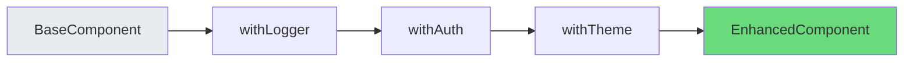
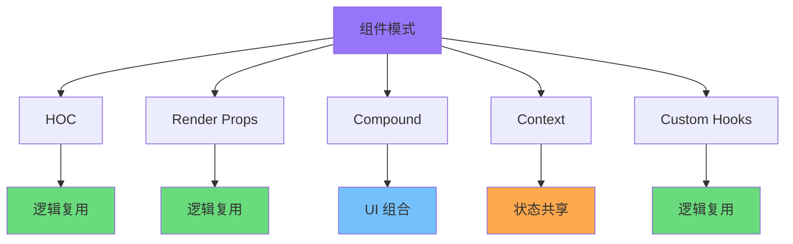

# React 组件模式大全

React 组件模式是构建可复用、可维护 UI 的核心手段。本文全面介绍九大组件模式，辅以图表和代码示例，帮助你构建健壮的 React 应用。

---

## 1. 高阶组件 (HOC)

高阶组件是接收组件并返回新组件的函数，用于逻辑复用和属性增强。

```javascript
// 高阶组件基础模式
function withSubscription(WrappedComponent, selectData) {
  return function(props) {
    const data = useDataSource(selectData);
    return <WrappedComponent {...props} data={data} />;
  };
}

// 使用示例
const CommentListWithSubscription = withSubscription(CommentList, (data) =>
  data.filter(comment => comment.isVisible)
);
```

### 装饰者模式

HOC 本质是装饰者模式的应用，在不修改原组件的前提下增强功能。

```javascript
// 日志注入 HOC
function withLogger(WrappedComponent) {
  return function(props) {
    useEffect(() => {
      console.log(`${WrappedComponent.name} mounted`);
      return () => console.log(`${WrappedComponent.name} unmounted`);
    }, []);
    return <WrappedComponent {...props} />;
  };
}
```

### 属性代理 vs 继承提升

**属性代理 (Props Proxy)**：操作传入组件的 props

```javascript
function withDefaultProps(WrappedComponent, defaultProps) {
  return function(props) {
    return <WrappedComponent {...defaultProps} {...props} />;
  };
}
```

**继承提升 (Inheritance Inversion)**：操作生命周期和渲染逻辑

```javascript
function withAuthentication(WrappedComponent) {
  return class extends WrappedComponent {
    componentDidMount() {
      if (!this.props.user) {
        this.props.history.push('/login');
      }
    }
    render() {
      return super.render();
    }
  };
}
```

### 链式调用

多个 HOC 可链式组合，形成功能管道。



```javascript
// 链式调用示例
const EnhancedComponent = withTheme(withAuth(withLogger(BaseComponent)));

// 推荐：使用 compose 工具
import { compose } from 'redux';
const EnhancedComponent = compose(withTheme, withAuth, withLogger)(BaseComponent);
```

### HOC 注意事项

- 不要在 render 方法中使用 HOC，会导致子组件每次渲染都重新挂载
- 务必复制静态方法：`hoist-non-react-statics`
- Refs 不会传递，需使用 `forwardRef`

---

## 2. 渲染属性 (Render Props)

渲染属性是一种通过 prop 传递函数来共享逻辑的技术。

```javascript
// 基础渲染属性模式
class MouseTracker extends React.Component {
  state = { x: 0, y: 0 };

  handleMouseMove = (e) => {
    this.setState({ x: e.clientX, y: e.clientY });
  };

  render() {
    return (
      <div onMouseMove={this.handleMouseMove}>
        {this.props.render(this.state)}
      </div>
    );
  }
}

// 使用
<MouseTracker render={mouse => (
  <p>鼠标位置: {mouse.x}, {mouse.y}</p>
)} />
```

### children as function

将 render prop 放在 children 位置，使调用更自然。

```javascript
// children 作为函数
<MouseTracker>
  {(mouse) => (
    <>
      <h1>移动鼠标</h1>
      <div>坐标: {mouse.x}, {mouse.y}</div>
      <Cat mouse={mouse} />
    </>
  )}
</MouseTracker>
```

### 逻辑复用模式

渲染属性将逻辑与 UI 分离，实现关注点分离。

```javascript
// 数据获取渲染属性
class DataFetcher extends React.Component {
  state = { data: null, loading: true, error: null };

  async componentDidMount() {
    try {
      const data = await fetch(this.props.source);
      this.setState({ data, loading: false });
    } catch (error) {
      this.setState({ error, loading: false });
    }
  }

  render() {
    return this.props.children(this.state);
  }
}

// 使用
<DataFetcher source="/api/user">
  {({ data, loading, error }) => {
    if (loading) return <Loading />;
    if (error) return <Error error={error} />;
    return <UserProfile user={data} />;
  }}
</DataFetcher>
```

### Render Props vs HOC

| 特性 | HOC | Render Props |
|------|-----|--------------|
| 灵活性 | 中等 | 高 |
| Props 冲突 | 容易 | 不易 |
| 组合方式 | 链式 | 嵌套 |
| 调试难度 | 较高 | 较低 |

---

## 3. 组合模式

组合是 React 的核心哲学，通过组件嵌套和 props 传递实现灵活架构。

### Slot/Outlet 模式

类似 Vue 的插槽，React 通过 props 实现内容分发。

```javascript
// 基础 Slot
function Card({ title, children }) {
  return (
    <div className="card">
      <div className="card-header">{title}</div>
      <div className="card-body">{children}</div>
    </div>
  );
}

// 多个 Slot
function Layout({ header, main, footer }) {
  return (
    <div className="layout">
      <header>{header}</header>
      <main>{main}</main>
      <footer>{footer}</footer>
    </div>
  );
}

<Layout
  header={<Logo />}
  main={<Content />}
  footer={<Footer />}
/>
```

### 复合组件 (Compound Components)

多个组件协同工作，共享隐式状态。

```javascript
// 复合组件示例 - Select
const SelectContext = createContext();

function Select({ children, value, onChange }) {
  const [isOpen, setIsOpen] = useState(false);

  return (
    <SelectContext.Provider value={{ value, onChange, isOpen, setIsOpen }}>
      <div className="select">{children}</div>
    </SelectContext.Provider>
  );
}

function Option({ value, children }) {
  const { onChange, setIsOpen } = useContext(SelectContext);

  return (
    <div onClick={() => { onChange(value); setIsOpen(false); }}>
      {children}
    </div>
  );
}

// 使用
<Select value={selected} onChange={setSelected}>
  <Option value="a">选项 A</Option>
  <Option value="b">选项 B</Option>
</Select>
```

### Context 共享状态

使用 Context 在组件树间共享数据。

```javascript
// Theme Context
const ThemeContext = createContext({ theme: 'light', toggle: () => {} });

function ThemeProvider({ children }) {
  const [theme, setTheme] = useState('light');

  const toggle = () => setTheme(t => t === 'light' ? 'dark' : 'light');

  return (
    <ThemeContext.Provider value={{ theme, toggle }}>
      {children}
    </ThemeContext.Provider>
  );
}

// 消费 Context
function Button() {
  const { theme } = useContext(ThemeContext);
  return <button className={theme}>点击</button>;
}
```

---

## 4. 受控与非受控组件

理解两种组件模式是掌握 React 表单的基础。

### 受控组件 (Controlled Components)

表单数据由 React 状态驱动的组件。

```javascript
// 受控输入组件
function ControlledInput() {
  const [value, setValue] = useState('');

  return (
    <input
      type="text"
      value={value}
      onChange={(e) => setValue(e.target.value)}
    />
  );
}

// 受控 Select
function ControlledSelect() {
  const [selected, setSelected] = useState('');

  return (
    <select value={selected} onChange={(e) => setSelected(e.target.value)}>
      <option value="">请选择</option>
      <option value="a">选项 A</option>
      <option value="b">选项 B</option>
    </select>
  );
}

// 受控 Checkbox
function ControlledCheckbox() {
  const [checked, setChecked] = useState(false);

  return (
    <input
      type="checkbox"
      checked={checked}
      onChange={(e) => setChecked(e.target.checked)}
    />
  );
}
```

### 非受控组件 (Uncontrolled Components)

表单数据由 DOM 自身管理，通过 ref 获取值。

```javascript
// 非受控输入组件
function UncontrolledInput() {
  const inputRef = useRef();

  const handleSubmit = () => {
    alert(`输入值: ${inputRef.current.value}`);
  };

  return (
    <div>
      <input type="text" ref={inputRef} defaultValue="默认值" />
      <button onClick={handleSubmit}>提交</button>
    </div>
  );
}

// 非受控文件输入
function FileInput() {
  const fileRef = useRef();

  const handleSubmit = (e) => {
    e.preventDefault();
    alert(`文件名: ${fileRef.current.files[0].name}`);
  };

  return (
    <form onSubmit={handleSubmit}>
      <input type="file" ref={fileRef} />
      <button type="submit">上传</button>
    </form>
  );
}
```

### ref 的使用

`useRef` 用于访问 DOM 元素或存储可变的跨渲染持久值。

```javascript
// 访问 DOM
function FocusInput() {
  const inputRef = useRef();

  useEffect(() => {
    inputRef.current.focus();
  }, []);

  return <input ref={inputRef} />;
}

// 存储可变值
function Timer() {
  const intervalRef = useRef(null);
  const [count, setCount] = useState(0);

  useEffect(() => {
    intervalRef.current = setInterval(() => {
      setCount(c => c + 1);
    }, 1000);

    return () => clearInterval(intervalRef.current);
  }, []);

  return <div>计数: {count}</div>;
}
```

### 默认值处理

| 场景 | 受控 | 非受控 |
|------|------|--------|
| 初始值固定 | `value=""` | `defaultValue=""` |
| 实时验证 | 受控 | 需配合 |
| 动态初始值 | `useEffect` | ref + 手动 |

---

## 5. 惰性组件 (Lazy Components)

延迟加载非首屏组件，优化应用性能。

### React.lazy

```javascript
// 基础惰性加载
const OtherComponent = React.lazy(() => import('./OtherComponent'));

// Suspense 配合
function MyComponent() {
  return (
    <div>
      <Suspense fallback={<LoadingSpinner />}>
        <OtherComponent />
      </Suspense>
    </div>
  );
}
```

### 错误边界配合

错误边界捕获子组件的 JavaScript 错误，防止整应用崩溃。

```javascript
// 错误边界组件
class ErrorBoundary extends React.Component {
  state = { hasError: false, error: null };

  static getDerivedStateFromError(error) {
    return { hasError: true, error };
  }

  componentDidCatch(error, errorInfo) {
    console.error('Error:', error, errorInfo);
    logErrorToService(error, errorInfo);
  }

  render() {
    if (this.state.hasError) {
      return this.props.fallback || <ErrorMessage error={this.state.error} />;
    }
    return this.props.children;
  }
}

// 使用
<ErrorBoundary fallback={<SomethingWentWrong />}>
  <LazyComponent />
</ErrorBoundary>
```

### Suspense 配置

Suspense 定义懒加载组件的加载状态。

```javascript
// 多组件惰性加载
const Dashboard = React.lazy(() => import('./Dashboard'));
const Settings = React.lazy(() => import('./Settings'));
const Profile = React.lazy(() => import('./Profile'));

function App() {
  return (
    <Suspense fallback={<div>加载中...</div>}>
      <Routes>
        <Route path="/dashboard" component={Dashboard} />
        <Route path="/settings" component={Settings} />
        <Route path="/profile" component={Profile} />
      </Routes>
    </Suspense>
  );
}
```

### 预加载策略

```javascript
// 鼠标悬停预加载
function LazyLink({ importFn, children }) {
  const [shouldLoad, setShouldLoad] = useState(false);

  return (
    <div
      onMouseEnter={() => !shouldLoad && setShouldLoad(true)}
      onClick={() => importFn().then(module => module.default())}
    >
      {children}
    </div>
  );
}

// 路由预加载
const preloadRoute = (path) => {
  if (path === '/dashboard') import('./Dashboard');
};

function NavigationLink({ path, children }) {
  return (
    <Link to={path} onMouseEnter={() => preloadRoute(path)}>
      {children}
    </Link>
  );
}
```

---

## 6. 提供者模式 (Provider Pattern)

Provider 模式通过 Context 实现全局状态和配置的注入与消费。

### Context Provider

```javascript
// 创建 Context
const AuthContext = createContext(null);

// Provider 组件
function AuthProvider({ children }) {
  const [user, setUser] = useState(null);
  const [token, setToken] = useState(null);

  const login = async (credentials) => {
    const { user, token } = await authService.login(credentials);
    setUser(user);
    setToken(token);
    return { user, token };
  };

  const logout = () => {
    setUser(null);
    setToken(null);
  };

  const value = { user, token, login, logout };

  return (
    <AuthContext.Provider value={value}>
      {children}
    </AuthContext.Provider>
  );
}
```

### Provider 嵌套

多个 Provider 可嵌套组合，形成作用域链。

```javascript
// 主题 + 语言 Provider
function AppProviders({ children }) {
  return (
    <ThemeProvider>
      <LanguageProvider>
        <AuthProvider>
          {children}
        </AuthProvider>
      </LanguageProvider>
    </ThemeProvider>
  );
}

// 或使用组合函数
const withProviders = (...providers) => (component) =>
  providers.reduce((acc, Provider) =>
    <Provider><Acc /></Provider>,
    component
  );
```

### Hooks 获取 Context

使用 Hooks 简化 Context 消费。

```javascript
// useAuth Hook
function useAuth() {
  const context = useContext(AuthContext);
  if (!context) {
    throw new Error('useAuth must be used within AuthProvider');
  }
  return context;
}

// 使用
function LoginButton() {
  const { user, login, logout } = useAuth();

  return user ? (
    <button onClick={logout}>退出</button>
  ) : (
    <button onClick={() => login({ username: 'demo' })}>登录</button>
  );
}
```

### Provider 性能优化

```javascript
// 拆分 Context 避免不必要的重渲染
const UserContext = createContext({ user: null });
const ThemeContext = createContext({ theme: 'light' });

// 使用 useMemo 稳定 Provider value
function AuthProvider({ children }) {
  const [user, setUser] = useState(null);

  const value = useMemo(() => ({
    user,
    setUser,
  }), [user]);

  return (
    <UserContext.Provider value={value}>
      {children}
    </UserContext.Provider>
  );
}
```

---

## 7. 容器/展示组件分离

容器组件负责数据获取和业务逻辑，展示组件负责 UI 渲染。

### Container 与 Presentational

```javascript
// 展示组件 - 仅接收 props，无副作用
function UserList({ users, onSelect }) {
  return (
    <ul>
      {users.map(user => (
        <li key={user.id} onClick={() => onSelect(user)}>
          <Avatar src={user.avatar} />
          <span>{user.name}</span>
        </li>
      ))}
    </ul>
  );
}

// 容器组件 - 数据获取和状态管理
function UserListContainer() {
  const [users, setUsers] = useState([]);
  const [loading, setLoading] = useState(true);

  useEffect(() => {
    fetchUsers().then(data => {
      setUsers(data);
      setLoading(false);
    });
  }, []);

  if (loading) return <Loading />;

  return <UserList users={users} onSelect={handleSelect} />;
}
```

### 关注点分离

| 方面 | 容器组件 | 展示组件 |
|------|----------|----------|
| 职责 | 数据获取、状态管理 | UI 渲染 |
| 对 Redux 依赖 | 是 | 否 |
| 副作用 | 有 | 无 |
| 测试 | Mock 数据 | 直接测试 |

### HOC 实现分离

```javascript
// 数据获取 HOC
function withData(fetchFn, mapDataToProps) {
  return function(WrappedComponent) {
    return function(props) {
      const [data, setData] = useState(null);

      useEffect(() => {
        fetchFn().then(setData);
      }, []);

      const mappedProps = mapDataToProps(data);
      return <WrappedComponent {...props} {...mappedProps} />;
    };
  };
}

// 使用
const UserListWithData = withData(
  () => fetchUsers(),
  (users) => ({ users })
)(UserList);
```

---

## 8. 状态组件 vs 函数组件

React 17 后，函数组件 + Hooks 成为主流方案。

### Class vs Function

```javascript
// Class 组件
class Counter extends React.Component {
  state = { count: 0 };

  handleClick = () => {
    this.setState(prev => ({ count: prev.count + 1 }));
  };

  render() {
    return <button onClick={this.handleClick}>{this.state.count}</button>;
  }
}

// Function 组件 + Hooks
function Counter() {
  const [count, setCount] = useState(0);

  return <button onClick={() => setCount(c => c + 1)}>{count}</button>;
}
```

### Hooks 统一方案

```javascript
// 状态 Hook
function useCounter(initialValue = 0) {
  const [count, setCount] = useState(initialValue);
  const increment = useCallback(() => setCount(c => c + 1), []);
  const decrement = useCallback(() => setCount(c => c - 1), []);
  const reset = useCallback(() => setCount(initialValue), [initialValue]);

  return { count, increment, decrement, reset };
}

// 副作用 Hook
function useDataFetching(url) {
  const [data, setData] = useState(null);
  const [loading, setLoading] = useState(true);
  const [error, setError] = useState(null);

  useEffect(() => {
    let cancelled = false;

    async function fetchData() {
      try {
        const response = await fetch(url);
        const result = await response.json();
        if (!cancelled) {
          setData(result);
          setLoading(false);
        }
      } catch (err) {
        if (!cancelled) {
          setError(err);
          setLoading(false);
        }
      }
    }

    fetchData();
    return () => { cancelled = true; };
  }, [url]);

  return { data, loading, error };
}
```

### Hooks 规则

```javascript
// 1. 仅在顶层调用 Hooks
function BrokenComponent() {
  if (condition) {
    const [state, setState] = useState(0); // 违反规则！
  }
}

// 正确做法：拆分组件或使用条件提前 return
function CorrectComponent({ shouldShow }) {
  if (shouldShow) {
    return <WithState />;
  }
  return <WithoutState />;
}

// 2. 仅在 React 函数中调用
// 可以在:
// - 函数组件
// - 自定义 Hooks

// 不能在:
// - 普通函数
// - Class 组件
```

---

## 9. 样式模式

React 组件有多种样式方案，各有权衡。

### CSS-in-JS

```javascript
// styled-components 示例
import styled from 'styled-components';

const Button = styled.button`
  background: ${props => props.primary ? '#007bff' : '#6c757d'};
  color: white;
  padding: 8px 16px;
  border-radius: 4px;

  &:hover {
    opacity: 0.9;
  }
`;

// Emotion 示例
import { css } from '@emotion/react';

const cardStyle = css`
  padding: 16px;
  border-radius: 8px;
  box-shadow: 0 2px 4px rgba(0,0,0,0.1);
`;

function Card({ children }) {
  return <div css={cardStyle}>{children}</div>;
}
```

### CSS Modules

```css
/* Button.module.css */
.button {
  background: #007bff;
  color: white;
  padding: 8px 16px;
  border-radius: 4px;
}

.primary {
  background: #28a745;
}
```

```javascript
/* Button.jsx */
import styles from './Button.module.css';

function Button({ primary, children }) {
  return (
    <button className={`${styles.button} ${primary ? styles.primary : ''}`}>
      {children}
    </button>
  );
}
```

### Tailwind CSS

```javascript
// 原子化 CSS 方案
function Card({ title, description }) {
  return (
    <div className="bg-white rounded-lg shadow-md p-6 max-w-sm">
      <h3 className="text-xl font-bold mb-2">{title}</h3>
      <p className="text-gray-600">{description}</p>
      <button className="mt-4 bg-blue-500 text-white px-4 py-2 rounded hover:bg-blue-600 transition">
        了解更多
      </button>
    </div>
  );
}
```

### 样式方案对比

| 方案 | 优势 | 劣势 |
|------|------|------|
| CSS Modules | 原生支持、性能好 | 动态样式不便 |
| styled-components | 组件封装、主题支持 | 运行时开销 |
| Tailwind CSS | 快速开发、无类名冲突 | 学习曲线、HTML 冗长 |
| CSS-in-JS | 逻辑复用、动态样式 | 包体积增加 |

---

## 组件模式关系图



---

## 最佳实践

### 模式选择指南

1. **逻辑复用**：优先使用自定义 Hooks，次选 Render Props，最后考虑 HOC
2. **状态管理**：简单状态用 useState，共享状态用 Context，复杂状态用状态管理库
3. **性能优化**：先测量再优化，避免过早优化
4. **代码组织**：相关逻辑放在一起，保持组件职责单一

### 常见陷阱

- **HOC 嵌套过深**：使用命名工具如 `displayName` 便于调试
- **Render Props 地狱**：提取为自定义 Hooks 简化
- **Context 滥用**：按需拆分 Provider，避免全局单例过多
- **Props 层层传递**：使用 Context 或状态管理库

### 调试技巧

```javascript
// 添加调试 displayName
function withLogger(WrappedComponent) {
  function WithLogger(props) {
    return <WrappedComponent {...props} />;
  }
  WithLogger.displayName = `WithLogger(${getDisplayName(WrappedComponent)})`;
  return WithLogger;
}

function getDisplayName(WrappedComponent) {
  return WrappedComponent.displayName || WrappedComponent.name || 'Component';
}
```

---

## 总结

React 组件模式并非相互排斥，而是可以组合使用：

- **HOC** 适合横切关注点
- **Render Props** 适合逻辑复用
- **复合组件** 适合构建 UI 组件库
- **Provider** 适合全局状态
- **Hook** 是现代 React 的核心

掌握这些模式，根据实际场景选择最合适的方案，才能构建出可维护、可扩展的 React 应用。