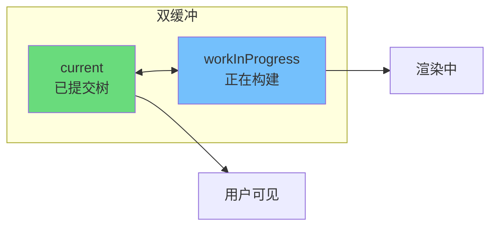
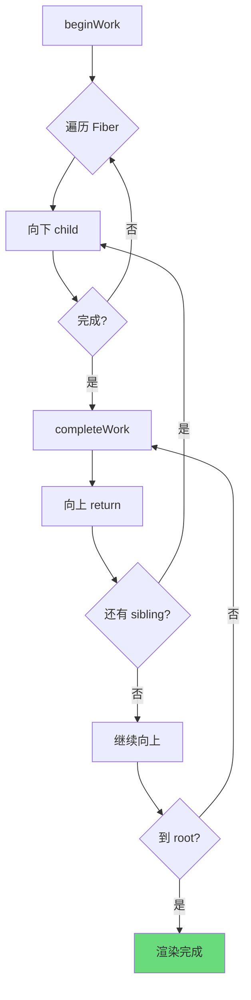
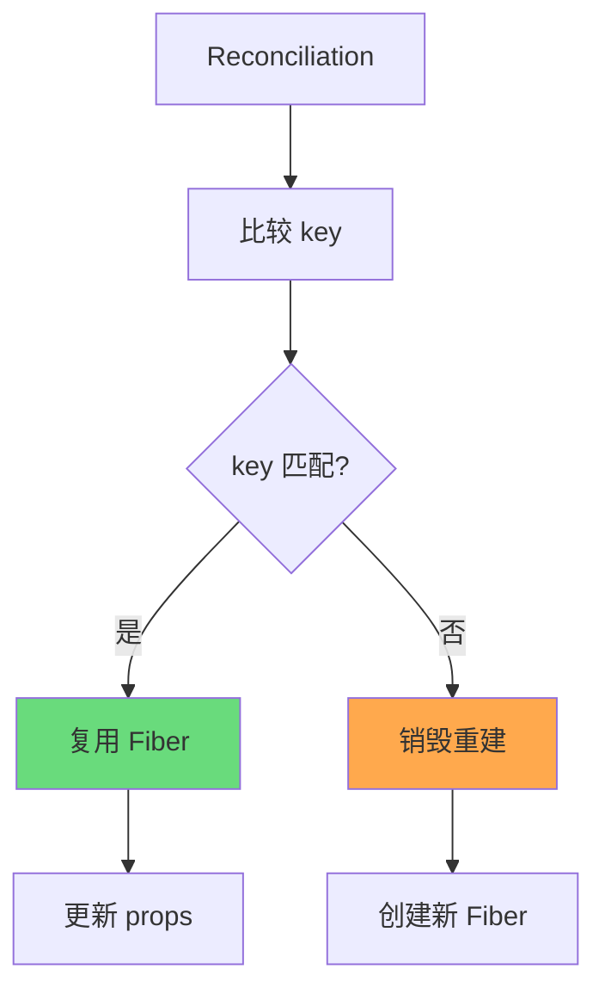
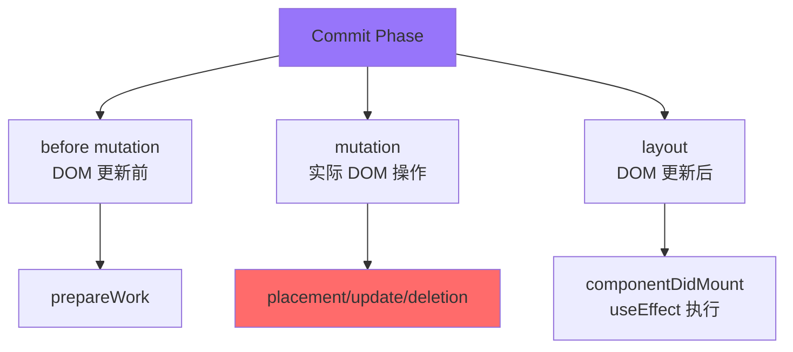
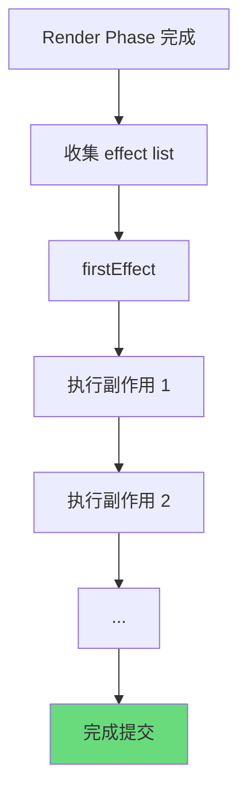
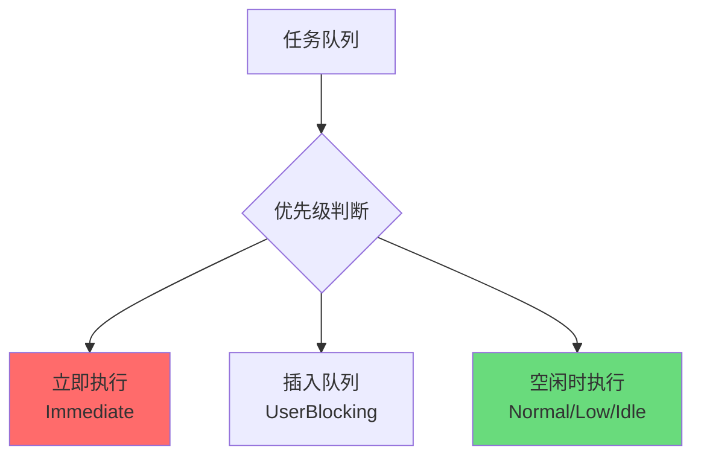
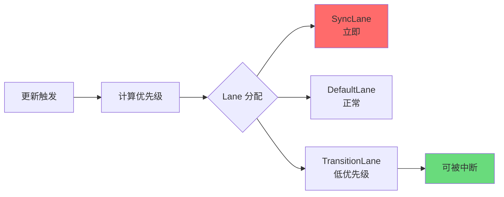

# React Fiber 架构

React Fiber 是 React 16 引入的核心架构重构，它解决了 React 15 同步渲染模型固有的局限性，为 React 带来了异步渲染和精确优先级调度能力。

---

## 1. 为什么需要 Fiber

### React 15 的问题：同步渲染无法中断

在 React 15 及之前的版本中，渲染过程是同步的。当组件树层级较深或节点较多时，一次性完成所有虚拟 DOM 计算可能导致主线程长时间阻塞。

```javascript
// React 15 的渲染流程
function render(element) {
  // 一旦开始，必须完成
  // 无法中断，无法让出主线程
  const fiber = reconcile(root, element);
  commitRoot(fiber);
}
```

### 掉帧原因分析

浏览器的刷新频率为 60fps，即每帧预算约 **16.67ms**：

| 阶段 | 预算时间 |
|------|----------|
| JavaScript 执行 | ~10ms |
| 样式计算 | ~4ms |
| 布局 | ~4ms |
| 绘制 | ~4ms |

当 React 的调和（Reconciliation）过程超过 16.67ms 时，就会错失帧，导致界面卡顿。

### Fiber 的设计目标

Fiber 架构的设计目标可以概括为三个核心能力：

1. **可中断渲染**：将渲染工作拆分为小单元，支持暂停和恢复
2. **任务优先级调度**：优先处理高优先级任务（如用户输入），延迟低优先级任务
3. **时间片轮转**：在浏览器空闲时执行后台工作，保证交互流畅

---

## 2. Fiber 数据结构

Fiber 节点是 React 内部维护的最小工作单元，每个 React 元素都会创建一个对应的 Fiber 节点。

### 核心属性说明

```javascript
const fiber = {
  // ===== 标识信息 =====
  tag: WorkTags,           // Fiber 类型标签（HostRoot、ClassComponent、FunctionComponent 等）
  key: null | string,      // 列表元素的 key，用于优化 diff 算法
  type: any,              // 对应 React 元素的 type（组件类型或 HTML 标签名）

  // ===== 链表结构（Fiber 树的核心） =====
  return: Fiber | null,    // 父 Fiber 指针
  child: Fiber | null,     // 第一个子 Fiber 指针
  sibling: Fiber | null,   // 下一个兄弟 Fiber 指针

  // ===== 状态管理 =====
  stateNode: any,          // 真实 DOM 节点或组件实例
  memoizedState: any,      // 上一次渲染后的 state
  memoizedProps: any,      // 上一次渲染后的 props

  // ===== 更新队列 =====
  updateQueue: UpdateQueue<any> | null,  // 待处理的更新任务队列

  // ===== 副作用标记 =====
  effectTag: SideEffectTag,      // 标记该 Fiber 需要执行的副作用类型
  nextEffect: Fiber | null,     // 下一个需要执行的副作用节点

  // ===== 调度相关 =====
  lanes: Lanes,             // 当前 Fiber 的更新优先级 lanes
  childLanes: Lanes,        // 子树更新的优先级 lanes

  // ===== 双缓冲机制 =====
  alternate: Fiber | null, // 指向另一棵树的对应 Fiber
};
```

### Fiber 链表示意图

```
        ┌─────────────────────────────────────────────┐
        │                   ROOT                       │
        │  (return: null, child: App)                 │
        └──────────────────┬──────────────────────────┘
                           │
                           ▼ child
        ┌─────────────────────────────────────────────┐
        │                    APP                      │
        │  (return: Root, child: Container)           │
        └──────────────────┬──────────────────────────┘
                           │
                           ▼ child
        ┌─────────────────────────────────────────────┐
        │                 CONTAINER                   │
        │  (return: App, child: List)                  │
        └──────────────────┬──────────────────────────┘
                           │
                ┌─────────┴──────────┐
                ▼ child              ▼ sibling
        ┌───────────────┐     ┌───────────────┐
        │    LIST       │────▶│   DETAIL      │
        │(return: App)  │     │(return: App)  │
        └───────┬───────┘     └───────────────┘
                │
        ┌───────┴───────┐
        ▼ child         ▼ sibling
   ┌──────────┐    ┌──────────┐
   │  ITEM 1  │───▶│  ITEM 2  │
   └──────────┘    └──────────┘
```

### WorkTags 类型枚举

```javascript
const WorkTags = {
  FunctionComponent: 0,    // 函数组件
  ClassComponent: 1,       // 类组件
  HostRoot:3,              // 根节点
  HostComponent: 5,        // HTML 标签（如 div、span）
  HostText: 6,             // 文本节点
  Fragment: 7,             // Fragment
  Portal: 8,               // Portal
  SuspenseComponent: 13,   // Suspense
  SuspenseListComponent: 19, // SuspenseList
  MemoComponent: 14,       // memo 包装的组件
  SimpleMemoComponent: 15, // 简单 memo 组件
};
```

---

## 3. 双缓冲与 WIP（Work In Progress）

### 双缓存架构

Fiber 采用双缓冲（Double Buffering）技术，同时维护两棵 Fiber 树：



### alternate 指针切换

```
状态转换过程：

1. 初始状态：
   ┌─────────────────────────────────────────┐
   │  current (已提交)  ←→  workInProgress   │
   │  (用户可见)         (正在构建)           │
   └─────────────────────────────────────────┘

2. 渲染阶段完成：
   ┌─────────────────────────────────────────┐
   │  current         ←→  workInProgress     │
   │  (旧树)            (新树，已完成)        │
   └─────────────────────────────────────────┘

3. 提交阶段切换：
   ┌─────────────────────────────────────────┐
   │  current ←→ workInProgress             │
   │  (互换角色)                             │
   └─────────────────────────────────────────┘

4. 切换完成：
   ┌─────────────────────────────────────────┐
   │  current (新提交) ←→ workInProgress     │
   │  (新树)           (准备下一轮更新)       │
   └─────────────────────────────────────────┘
```

### 内存优化策略

1. **复用 Fiber 节点**：通过 `createWorkInProgressLane()` 复用已有 Fiber
2. **共享状态**：同属一个 workInProgress 树的 Fiber 共享 `memoizedState`
3. **最小化复制**：只创建变化的 Fiber，其余复用现有节点

```javascript
// Fiber 复用逻辑
function createWorkInProgressLane(current, pendingProps) {
  let workInProgress = current.alternate;

  if (workInProgress === null) {
    // 首次渲染，创建新的 workInProgress
    workInProgress = createFiber(
      current.tag,
      pendingProps,
      current.key,
      current.mode
    );
    workInProgress.type = current.type;
    workInProgress.stateNode = current.stateNode;

    // 建立双向链接
    current.alternate = workInProgress;
    workInProgress.alternate = current;
  } else {
    // 复用已有节点，更新属性
    workInProgress.pendingProps = pendingProps;
    workInProgress.effectTag = NoEffect;
    workInProgress.nextEffect = null;
    workInProgress.firstEffect = null;
    workInProgress.lastEffect = null;
  }

  return workInProgress;
}
```

---

## 4. 渲染阶段（Render Phase）

渲染阶段是**可中断的**，React 会遍历 Fiber 树构建 workInProgress 树，收集所有需要执行的副作用。

### 遍历流程



### beginWork 阶段

`beginWork` 是向下遍历的入口，根据 Fiber 类型执行不同的渲染逻辑：

```javascript
function beginWork(current, workInProgressLane, renderLanes) {
  // 更新优先级
  workInProgressLane = getMostRecentLaneWithHigherPriority(
    workInProgressLane,
    renderLanes
  );

  switch (workInProgress.tag) {
    case FunctionComponent: {
      const Component = workInProgress.type;
      const unresolvedProps = workInProgress.pendingProps;
      const resolvedProps = resolveDefaultProps(Component, unresolvedProps);
      return updateFunctionComponent(
        current,
        workInProgress,
        Component,
        resolvedProps,
        renderLanes
      );
    }

    case ClassComponent: {
      return updateClassComponent(
        current,
        workInProgress,
        renderLanes
      );
    }

    case HostRoot: {
      return updateHostRoot(current, workInProgress, renderLanes);
    }

    case HostComponent: {
      return updateHostComponent(current, workInProgress, renderLanes);
    }

    case HostText: {
      return updateHostText(current, workInProgress);
    }

    // ... 其他类型
  }
}
```

### completeWork 阶段

`completeWork` 是向上回溯的入口，处理当前 Fiber 的副作用和 DOM 更新：

```javascript
function completeWork(current, workInProgress, renderLanes) {
  const newProps = workInProgress.pendingProps;

  switch (workInProgress.tag) {
    case HostComponent: {
      // 1. 创建或更新 DOM 节点
      if (current === null) {
        // 首次挂载，创建 DOM 节点
        const instance = createInstance(
          workInProgress.type,
          newProps,
          rootContainerInstance,
          hostContext,
          internalInstanceHandle
        );
        // 追加所有子节点
        appendAllChildren(instance, workInProgress, false, false);
        workInProgress.stateNode = instance;
      } else {
        // 更新已有节点
        const instance = workInProgress.stateNode;
        updateFiberFromRootComponentAndVendor(
          current,
          workInProgress,
          instance,
          newProps,
          rootContainerInstance,
          hostContext
        );
      }

      // 2. 标记需要更新 props 的子节点
      markUpdate(workInProgress);
      break;
    }

    case HostText: {
      // 处理文本节点
      if (current && !includesSomeLane(renderLanes, updateLanes)) {
        // 无需更新，复用
        workInProgress.effectTag = NoEffect;
      }
      break;
    }
  }

  // 收集副作用链表
  if (workInProgress.effectTag !== NoEffect) {
    insertEffectFiberIntoEffectList(workInProgress, finishedWork);
  }
}
```

### 调和算法（Reconciliation）

React 的调和算法遵循以下规则：

1. **不同类型的元素产生不同的树**：如果元素类型改变，React 会销毁旧树并重建新树
2. **通过 key 优化列表渲染**：同层级同类型的元素通过 key 判断是否可复用



---

## 5. 提交阶段（Commit Phase）

提交阶段是**同步且不可中断的**，它将渲染阶段收集的副作用一次性执行。

### 三个子阶段



### before mutation 阶段

此阶段执行 DOM 更新前的准备工作：

```javascript
function commitBeforeMutationRoot(current, finishedWork) {
  switch (finishedWork.tag) {
    case ClassComponent: {
      // 暂停类组件的副作用
      if (finishedWork.effectTag & ShouldCapture) {
        // 处理 Suspense / ErrorBoundary
        const error = thrownValue;
        const getDerivedFromError = finishedWork.type.getDerivedFromError;

        if (typeof getDerivedFromError === 'function') {
          try {
            const errorInfo = { componentStack: '' };
            const error = getDerivedFromError(() => error, errorInfo);
            finishedWork.memoizedState = hookIndexes.some(
              i => error !== null
            );
          } catch (error) {
            // 错误重定向到最近的 ErrorBoundary
          }
        }
      }
      break;
    }

    case SuspenseComponent: {
      // 处理 Suspense 边界
      break;
    }
  }
}
```

### mutation 阶段

此阶段执行实际的 DOM 增删改操作：

```javascript
function commitMutationRoot(current, finishedWork) {
  const flags = finishedWork.effectTag;

  // 处理 ref 卸载
  if (flags & Ref) {
    commitDetachRef(current);
  }

  // 处理 placement（新增）
  if (flags & Placement) {
    commitPlacement(finishedWork);
  }

  // 处理更新
  if (flags & Update) {
    commitUpdate(
      finishedWork.stateNode,
      finishedWork.memoizedProps,
      finishedWork.memoizedState
    );
  }

  // 处理 deletion（删除）
  if (flags & Deletion) {
    commitDeletion(finishedWork, root);
  }

  // 处理 Hydration（SSR 水合）
  if (flags & Hydrating) {
    enterHydrationState(finishedWork);
  }
}
```

### layout 阶段

此阶段在 DOM 更新后执行，主要任务包括：

1. **执行 `componentDidMount` / `componentDidUpdate` 生命周期**
2. **执行 `useEffect` 回调**（异步调度）
3. **更新 `ref`**
4. **读取布局信息**（如 `getBoundingClientRect`）

```javascript
function commitLayoutMount(root, finishedWork) {
  switch (finishedWork.tag) {
    case FunctionComponent: {
      // 执行 useEffect 的 layout 回调
      commitHookEffectListMount(HookLayout | HookHasEffect, finishedWork);
      break;
    }

    case ClassComponent: {
      // 执行 componentDidMount
      if (!finishedWork.callbackList) {
        instance.componentDidMount();
      }
      // 执行 setState 回调
      processUpdateQueue(finishedWork, instance);
      break;
    }
  }
}
```

### 副作用链表执行顺序



---

## 6. 调度器（Scheduler）

React 16.5+ 集成了 `scheduler` 包实现任务调度，将渲染工作拆分为可中断的小单元。

### 任务优先级

```javascript
const ImmediatePriority = 1;      // 立即优先级（同步执行）
const UserBlockingPriority = 2;   // 用户阻塞优先级（~250ms）
const NormalPriority = 3;         // 正常优先级（~5s）
const LowPriority = 4;             // 低优先级（~10s）
const IdlePriority = 5;            // 空闲优先级（无限期）
```

### 过期时间计算

每种优先级都有对应的过期时间阈值：

```javascript
function ceiling(num, precision) {
  return Math.ceil(num / precision) * precision;
}

function computeExpirationTime(
  fiberTime,
  mode,
  currentTime
) {
  const syncLanes = getSyncLanes(mode);

  if (syncLanes !== NoLanes) {
    // 同步任务立即过期
    return -1;
  }

  const transitionLanes = getTransitionLanes(fiberTime);
  const pendingLanes = pendingLanes & ~transitionLanes;

  // 计算当前时间戳对应的 lane 过期时间
  return computeLaneExpiration(
    fiberTime,
    getHighestPriorityLanes(pendingLanes),
    currentTime
  );
}
```

### 时间片分配

Scheduler 使用 **scheduler.unstable_runWithPriority** 包装任务，确保高优先级任务能够插队：



### Lane 模型（React 18+）

React 18 引入的 Lane 模型提供了更精细的优先级控制：

```javascript
const lanes = {
  SyncLane:              0b0000000000000000000000000000001,  // 同步
  InputContinuousLane:   0b0000000000000000000000000001000,  // 连续输入（拖拽）
  DefaultLanes:          0b0000000000000000000000000011000,  // 默认
  TransitionLanes:       0b0000000000000000000011110000000,  // 过渡
  IdleLane:              0b0000000000000000100000000000000,  // 空闲
  OffscreenLane:         0b0000000000000001000000000000000,  // 离屏
};
```

### 调度流程示意



---

## 总结

React Fiber 架构通过以下核心机制实现了可中断的异步渲染：

| 机制 | 作用 |
|------|------|
| **Fiber 链表结构** | 将树形结构转为链表，支持深度优先遍历中断和恢复 |
| **双缓冲技术** | 通过 alternate 指针实现无感知的树切换 |
| **Render Phase 可中断** | 将构建 workInProgress 树的过程拆分为小单元 |
| **Commit Phase 同步** | DOM 更新必须在一次微任务中完成，避免布局抖动 |
| **Lane 优先级模型** | 精细化区分任务优先级，确保用户体验优先 |

这套架构为 React 18 的 Concurrent Mode 奠定了基础，使得 Suspense、Server Components、Automatic Batching 等特性成为可能。

---

## 延伸阅读

- [React 源码分析系列](https://github.com/reactwg/react-18/discussions)
- [Fiber 架构深度解析](https://github.com/acdlite/react-fiber-architecture)
- [React Reconciliation](https://reactjs.org/docs/reconciliation.html)