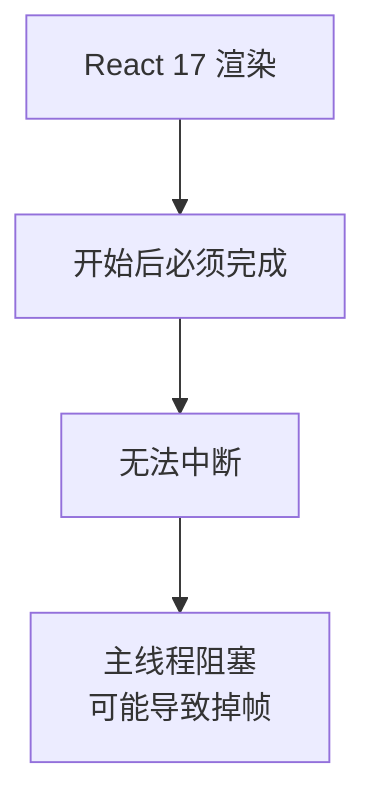
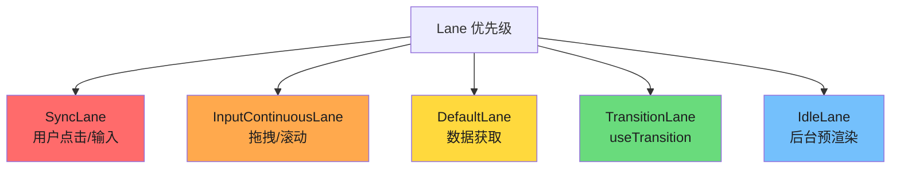
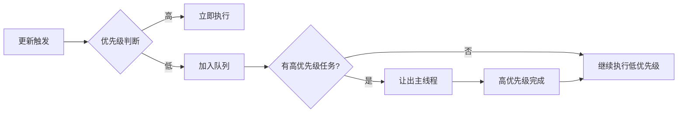
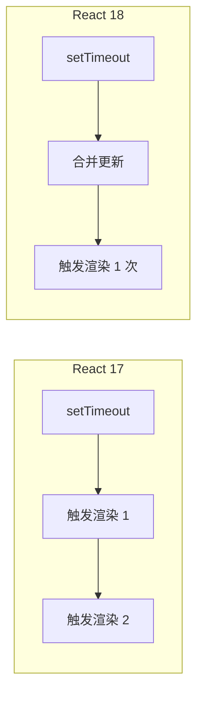
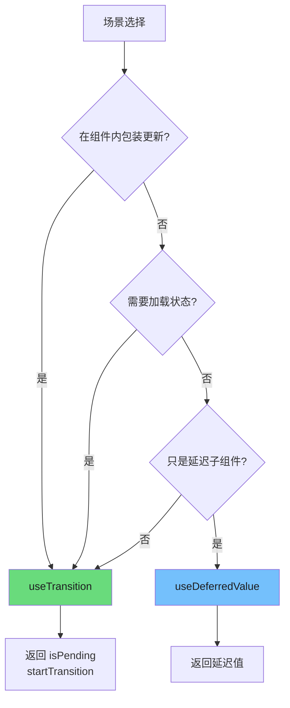
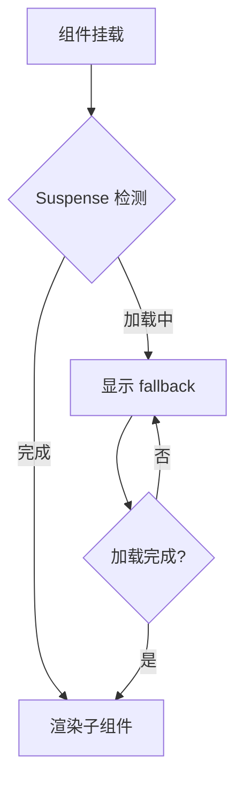
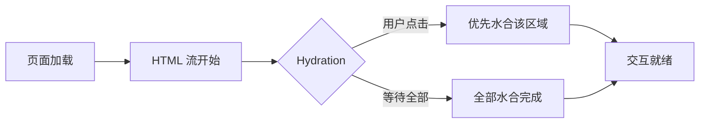
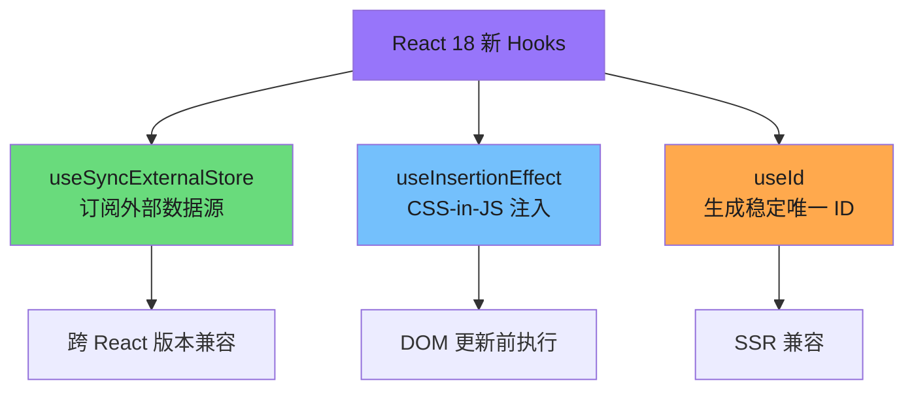

# React 18 核心概念

React 18 是 React 架构演进的重要里程碑，引入了并发渲染（Concurrent Rendering）这一核心能力，重新定义了 React 应用的工作模式。本文档深入剖析 React 18 的核心机制，帮助读者从原理层面理解这一代 React 的设计哲学。

---

## 1. 并发渲染 (Concurrent Rendering)

### 1.1 从阻塞式到可中断

在 React 18 之前，渲染过程是**阻塞式**的。一旦 React 开始处理一次更新，它必须一次性完成所有工作，中途无法让出主线程。这种模式在大型应用中会导致严重的卡顿问题。



### 1.2 React 18 之前的同步渲染问题

```javascript
// React 17 的渲染模型：一旦开始，必须完成
function render() {
  // 假设有 10000 个组件需要更新
  // 这会导致主线程阻塞 200-300ms
  // 用户点击无响应，动画卡顿
  const element = <LargeComponentTree />;
  root.render(element);
}
```

### 1.3 并发渲染的解决方案

React 18 引入了**并发模式**，允许渲染可以被中断和恢复：

```javascript
// React 18 的并发渲染
// React 可以根据优先级打断渲染，优先处理用户交互
function App() {
  const [count, setCount] = useState(0);

  return (
    <>
      <ExpensiveTree />  {/* 可以被打断 */}
      <button onClick={() => setCount(c => c + 1)}>
        Clicked {count} times
      </button>
    </>
  );
}
```

### 1.4 Lane 模型：优先级调度

React 18 使用 **Lane 模型**（也称 `lanes` 或 `fiberLanes`）来实现精确的优先级调度。Lane 是一种位掩码（Bitmask）数据结构，允许高效地表示和操作多个优先级。



**Lane 优先级映射表：**

| Lane 常量 | 用途 | 优先级 |
|-----------|------|--------|
| `SyncLane` | 用户点击、键盘输入 | 最高 |
| `InputContinuousLane` | 拖拽、滚动 | 高 |
| `DefaultLane` | 数据获取、渲染 | 中 |
| `TransitionLane` | `useTransition` 标记的更新 | 低 |
| `IdleLane` | 后台预渲染 | 最低 |

```javascript
// Lane 的位运算示例
import { SyncLane, InputContinuousLane, DefaultLane } from 'react-reconciler';

const lanes = SyncLane | DefaultLane;  // 组合多个 Lane

// 检查是否包含某个 Lane
if (lanes & SyncLane) {
  // 这是高优先级更新
}

// 移除某个 Lane
const remainingLanes = lanes & ~DefaultLane;
```

### 1.5 并发调度流程



---

## 2. Automatic Batching (自动批处理)

### 2.1 什么是 Batching？

Batching（批处理）是指 React 将多个状态更新合并为一次渲染的过程。这避免了不必要的重新渲染，提高了性能。

```javascript
// 没有 Batching：每次 setState 都触发一次渲染
setCount(1);  // 渲染 1 次
setCount(2);  // 渲染 2 次
setCount(3);  // 渲染 3 次

// 有 Batching：合并为一次渲染
setCount(1);  // 合并
setCount(2);  // 合并
setCount(3);  // 合并 → 最终只渲染 1 次
```

### 2.2 React 17 的批处理限制

React 17 只在**事件处理函数内部**自动批处理：

```javascript
// React 17：事件处理函数中自动批处理
function handleClick() {
  setCount(c => c + 1);  // 批处理
  setFlag(f => !f);      // 批处理
  // 最终只触发一次渲染 ✓
}

// React 17：setTimeout 中不批处理
setTimeout(() => {
  setCount(c => c + 1);  // 触发渲染
  setFlag(f => !f);      // 再触发一次渲染
  // 触发两次渲染 ✗
}, 0);

// React 17：Promise 中不批处理
fetch('/api').then(() => {
  setCount(c => c + 1);  // 触发渲染
  setFlag(f => !f);      // 再触发一次渲染
  // 触发两次渲染 ✗
});

// React 17：原生事件中不批处理
element.addEventListener('click', () => {
  setCount(c => c + 1);  // 触发渲染
  setFlag(f => !f);      // 再触发一次渲染
  // 触发两次渲染 ✗
});
```

### 2.3 React 18 的全面批处理

React 18 将 Automatic Batching 扩展到**所有场景**，包括 `setTimeout`、`Promise`、`原生事件处理器` 等：

```javascript
// React 18：所有场景自动批处理

// setTimeout 中也批处理
setTimeout(() => {
  setCount(c => c + 1);  // 批处理
  setFlag(f => !f);      // 批处理
  // 最终只触发一次渲染 ✓
}, 0);

// Promise 中也批处理
fetch('/api').then(() => {
  setCount(c => c + 1);  // 批处理
  setFlag(f => !f);      // 批处理
  // 最终只触发一次渲染 ✓
});

// 原生事件中也批处理
element.addEventListener('click', () => {
  setCount(c => c + 1);  // 批处理
  setFlag(f => !f);      // 批处理
  // 最终只触发一次渲染 ✓
});
```

### 2.4 批处理对比总结



### 2.5 禁用批处理 (flushSync)

如果确实需要立即执行（不批处理），可以使用 `ReactDOM.flushSync`：

```javascript
import { flushSync } from 'react-dom';

function handleClick() {
  flushSync(() => {
    setCount(c => c + 1);  // 立即触发渲染
  });

  flushSync(() => {
    setFlag(f => !f);  // 再触发一次渲染
  });
  // 触发两次渲染
}
```

> 注意：`flushSync` 应该谨慎使用，它会打断并发特性，通常是必要的 DOM 操作（如测量布局）才需要使用。

---

## 3. useTransition vs useDeferredValue

### 3.1 useTransition：标记低优先级更新

`useTransition` 是一个 Hook，用于将某些更新标记为**非阻塞的**（低优先级），使 UI 能够保持响应。

```javascript
// 第 1 段：引入并发特性 Hook（这一段准备 React 18 的并发渲染能力）
// useTransition 是 React 18 并发特性的一部分，旧版本（<18）不存在，导入即报错；
// 它的作用是让"非紧急更新"可被中断、可被延后，从而不阻塞用户输入这类紧急交互。
import { useState, useTransition } from 'react';

function App() {
  // 第 2 段：声明"过渡状态"与两个数据状态（这一段搭好组件的运行时状态骨架）
  // useTransition() 返回 [是否处于过渡期, 启动过渡的函数]，isPending 由 React 内部调度器驱动，
  // 它代表"存在尚未提交的低优先级更新"，而不是"异步请求正在进行"，这是最常见的理解误区。
  const [isPending, startTransition] = useTransition();
  // query 必须走普通 setState（紧急更新），否则输入框回显会随过渡一起被延迟，出现打字卡顿/丢字。
  const [query, setQuery] = useState('');
  // results 走过渡更新：它体积大、渲染代价高，允许被更紧急的渲染打断后丢弃重算。
  const [results, setResults] = useState([]);

  // 第 3 段：搜索输入的事件处理（这一段把一次输入拆成"紧急"与"非紧急"两类更新）
  // 关键数据流：用户按键 → 同步更新 query（下一次渲染立刻反映到 input）→ startTransition 内计算并设置 results。
  // 注意 handleSearch 本身仍是同步执行的：startTransition 的回调会被立即同步调用，只是其内部的 setState 被标记为低优先级，
  // 因此在回调里读取 e.target.value 是安全的（React 18 已取消事件对象池化，不存在被回收后取到 null 的问题）。
  function handleSearch(e) {
    setQuery(e.target.value);

    // 将搜索结果更新标记为低优先级
    // startTransition 只影响"状态的更新优先级"，不会让 searchResults 变成异步或并发执行，
    // 所以 searchResults 必须是纯同步函数；若它本身耗时很长，仍需靠防抖/节流或 Worker 等手段解决，
    // 过渡只是把"渲染与提交"的代价降级，并不能消除计算本身的耗时。
    // 边界提醒：这里两次读取 e.target.value，若中间逻辑可能改动输入值就会读到不一致的字符串，稳妥做法是先 const value = e.target.value。
    startTransition(() => {
      setResults(searchResults(e.target.value));
    });
  }

  // 第 4 段：渲染与 pending 反馈（这一段决定用户"看到什么"）
  // 用 Fragment 包裹，避免引入多余 DOM 层级；input 的 value 受控于 query，保证紧急更新的回显不被过渡拖慢。
  // isPending 为 true 时显示 Spinner：因为过渡更新可被打断并丢弃，旧的 results 与新的正在计算的 results 之间需要视觉过渡，
  // 否则用户会看到"输入没变、结果也没变"的假死状态。注意首次挂载（无过渡进行中）时 isPending 恒为 false。
  return (
    <>
      <input value={query} onChange={handleSearch} />
      {isPending ? <Spinner /> : <Results data={results} />}
    </>
  );
}
```
**关键点：**

- `startTransition(callback)` 内部的更新被标记为低优先级
- `isPending` 表示过渡是否正在进行（可用于显示加载状态）
- 高优先级更新（如输入）可以打断低优先级更新（如搜索结果）

### 3.2 useDeferredValue：延迟非紧急更新

`useDeferredValue` 是另一个实现相同目标的 Hook，适用于**子组件**需要延迟更新的场景：

```javascript
import { useState, useDeferredValue } from 'react';

function App() {
  const [query, setQuery] = useState('');

  // 创建一个延迟版本的状态
  const deferredQuery = useDeferredValue(query);

  return (
    <>
      <input value={query} onChange={e => setQuery(e.target.value)} />
      <SlowResults query={deferredQuery} />
    </>
  );
}

// SlowResults 组件接收延迟的值
function SlowResults({ query }) {
  // 当 query 快速变化时，deferredQuery 会滞后
  // 这让输入框保持流畅
  return <div>{/* 渲染耗时操作 */}</div>;
}
```

### 3.3 使用场景对比



**选择指南：**

| 场景 | 推荐 Hook | 原因 |
|------|-----------|------|
| 在组件内包装状态更新 | `useTransition` | 更直接的控制 |
| 需要显示加载状态 | `useTransition` | 有 `isPending` |
| 只想让子组件延迟 | `useDeferredValue` | 不需要改父组件 |
| props 传递链过长 | `useDeferredValue` | 中间组件无需改动 |
| 多个组件需要同一延迟值 | `useDeferredValue` | 可以共享 |

### 3.4 实际应用示例：搜索输入

```javascript
import { useState, useTransition } from 'react';

function SearchApp() {
  const [inputValue, setInputValue] = useState('');
  const [query, setQuery] = useState('');
  const [results, setResults] = useState([]);
  const [isPending, startTransition] = useTransition();

  function handleInputChange(e) {
    setInputValue(e.target.value);

    // 输入框更新是高优先级，立即渲染
    // 搜索结果是低优先级，可以被打断
    startTransition(() => {
      setQuery(e.target.value);
      setResults(performSearch(e.target.value));
    });
  }

  return (
    <div>
      {/* 这个输入永远是响应的 */}
      <input
        value={inputValue}
        onChange={handleInputChange}
        placeholder="搜索..."
      />

      {/* 搜索结果区域可以被高优先级打断 */}
      {isPending ? (
        <div className="loading">搜索中...</div>
      ) : (
        <ul>
          {results.map(r => (
            <li key={r.id}>{r.name}</li>
          ))}
        </ul>
      )}
    </div>
  );
}
```

---

## 4. Suspense 与 Streaming SSR

### 4.1 Suspense 原理

`Suspense` 是 React 用于**声明式**处理异步加载的组件。当子组件正在加载时，Suspense 会显示 fallback UI；加载完成后自动切换到实际内容。

```javascript
// 第 1 段：导入 Suspense 组件（建立并发渲染的“等待边界”）
// Suspense 是 React 的内置具名导出，不是默认导出，因此必须按名导入。
// 它本身不发起数据请求，只提供“子树未就绪时暂停并显示降级 UI”的能力。
import { Suspense } from 'react';

// 第 2 段：定义 App 根组件（决定 Suspense 边界的作用范围）
// App 作为函数组件返回 JSX 树；把边界放在根组件，意味着 Profile、Settings、Dashboard 共享同一个 Loading 兜底。
// 边界条件：Loading、Profile、Settings、Dashboard 未在本文件定义，需由外部模块提供，否则代码无法运行。
function App() {
  return (
    // 第 3 段：用 Suspense 包裹三个兄弟组件（统一处理加载态并路由到 fallback）
    // fallback 是 React 元素；当任意子组件“挂起”（内部抛出 Promise）时，React 会暂存整段子树并展示 <Loading />。
    // 关键数据流：子组件异步就绪 -> React 重试渲染 -> 用真实内容替换 fallback；易错点是一个边界内多个子组件会同时等待，想局部降级需分别包 Suspense。
    // 复杂度：切换由 React 调度，业务代码无需手写 isLoading；但 fallback 粒度越粗，被整体替换的 UI 范围越大。
    <Suspense fallback={<Loading />}>
      <Profile />
      <Settings />
      <Dashboard />
    </Suspense>
  );
}
```
**工作流程：**



### 4.2 Streaming SSR

React 18 引入了服务端渲染的流式传输能力，使用 `renderToPipeableStream`（Node.js）或 `renderToReadableStream`（Edge）：

**传统的 SSR（阻塞式）：**
```javascript
// React 17
import { renderToString } from 'react-dom/server';

const html = renderToString(<App />);
// 必须等整个 App 渲染完成才能发送
res.send(html);
```

**React 18 Streaming SSR：**
```javascript
import { renderToPipeableStream } from 'react-dom/server';

app.get('/', (req, res) => {
  const { pipe } = renderToPipeableStream(<App />, {
    bootstrapScripts: ['/main.js'],

    // 流式发送 HTML
    onShellReady() {
      res.statusCode = 200;
      res.setHeader('Content-Type', 'text/html');
      pipe(res);  // 开始流式发送
    },

    onShellError() {
      res.statusCode = 500;
      res.send('Error');
    },

    // 对于 Suspense 的内容，分块发送
    onAllReady() {
      // 所有内容准备完成
    }
  });
});
```

### 4.3 Selective Hydration

React 18 的 Selective Hydration 允许在用户交互时优先水合特定区域，而不是等待整个页面加载完成：

```javascript
// 页面中有多个 Suspense 边界
function Page() {
  return (
    <div>
      <Suspense fallback={<NavSkeleton />}>
        <Nav />
      </Suspense>

      <Suspense fallback={<ContentSkeleton />}>
        <Content />  {/* 可能加载较慢 */}
      </Suspense>

      <Suspense fallback={<CommentsSkeleton />}>
        <Comments />
      </Suspense>
    </div>
  );
}

// 用户点击评论区域时，优先水合该区域
document.getElementById('comments').addEventListener('click', () => {
  startHydration(document.getElementById('comments'));
}, { once: true });
```

**流程图：**



---

## 5. 新增 Hooks

### 5.1 useSyncExternalStore

`useSyncExternalStore` 是用于订阅外部数据源的 Hook，特别适用于**跨 React 版本兼容**的场景，以及与状态管理库（如 Redux、Zustand）集成。

**基本用法：**

```javascript
import { useSyncExternalStore } from 'react';

// 简单用法
function useTheme() {
  return useSyncExternalStore(
    (callback) => {
      // 订阅回调，返回取消订阅函数
      window.addEventListener('storage', callback);
      return () => window.removeEventListener('storage', callback);
    },
    () => getSnapshot(),      // 服务端 snapshot
    () => getServerSnapshot()  // 客户端 snapshot（可选）
  );
}
```

**完整示例：**

```javascript
import { useSyncExternalStore, useState } from 'react';

// 创建一个 useOnlineStatus Hook
function useOnlineStatus() {
  const isOnline = useSyncExternalStore(
    (callback) => {
      window.addEventListener('online', callback);
      window.addEventListener('offline', callback);

      return () => {
        window.removeEventListener('online', callback);
        window.removeEventListener('offline', callback);
      };
    },
    () => navigator.onLine,          // 客户端 snapshot
    () => true                       // 服务端 snapshot（默认 true）
  );

  return isOnline;
}

// 使用
function StatusBar() {
  const isOnline = useOnlineStatus();

  return (
    <div>
      {isOnline ? '在线' : '离线'}
    </div>
  );
}
```

### 5.2 useInsertionEffect

`useInsertionEffect` 是在 DOM 变更前同步执行的 Effect，专门用于**CSS-in-JS 库**注入样式。

**为什么需要 useInsertionEffect？**

```javascript
// 问题：useEffect 执行时样式可能还未注入
function Component() {
  useEffect(() => {
    // 此时 DOM 还没有对应的 style 标签
    // 可能导致样式闪烁
  }, []);

  return <div className="styled" />;
}

// 解决方案：useInsertionEffect
function StyledComponent() {
  useInsertionEffect(() => {
    // 在 DOM 更新前执行
    // 注入 <style> 标签
    const style = document.createElement('style');
    style.textContent = `.styled { color: blue; }`;
    document.head.appendChild(style);

    return () => {
      document.head.removeChild(style);
    };
  }, []);

  return <div className="styled">Styled Content</div>;
}
```

**执行时机对比：**

| 钩子 | 执行时机 | 用途 |
|------|---------|------|
| `useLayoutEffect` | DOM 变更前同步 | 布局测量、DOM 操作 |
| `useInsertionEffect` | DOM 变更前同步 | 动态样式注入 |
| `useEffect` | DOM 变更后异步 | 数据获取、订阅、事件监听 |

### 5.3 useId

`useId` 用于生成稳定的唯一 ID，适用于**可访问性（a11y）** 属性，如 `aria-labelledby`、`aria-describedby` 等。

**基本用法：**

```javascript
import { useId } from 'react';

function PasswordField() {
  const passwordHintId = useId();

  return (
    <div>
      <label>
        密码：
        <input type="password" aria-describedby={passwordHintId} />
      </label>
      <p id={passwordHintId}>
        密码必须包含至少 8 个字符
      </p>
    </div>
  );
}
```

**列表中的使用：**

```javascript
// 第 1 段：把数组数据映射成列表结构（数据 → 视图的渲染层）
// 用 map 而不是手写循环，是为了让"每个 item 对应一个 <li>"这层一对一映射显式化；
// 代价是父组件每次重渲染都会重建整条数组，n 个元素即 O(n)，所以此处刻意只做纯展示、不放重计算。
function ItemList({ items }) {
  return (
    <ul>
      {items.map(item => (
        // key 必须挂在 map 直接返回的最外层元素上，否则 React 会告警；
        // 用 item.id 而不是数组下标：下标在插入/删除/排序时会漂移，会让 React 复用错节点，导致输入框内容"串位"这类隐蔽 bug。
        <li key={item.id}>
          <ItemWithDetails item={item} />
        </li>
      ))}
    </ul>
  );
}

// 第 2 段：单条目组件，为"复选框 + 描述文本"这一对元素建立无障碍关联
// useId 在渲染期生成一个在本渲染树内稳定唯一的 ID；相比模块级自增计数器或 Math.random，
// 它的关键价值是与 SSR/hydration 保持一致，不会出现服务端与客户端 ID 不一致的警告。
// 注意返回值形如 ":r0:"（React 18）含冒号，只放进 id/aria-* 这类属性是安全的，但直接拼进 CSS 选择器或 querySelector 需要转义。
function ItemWithDetails({ item }) {
  const detailsId = useId();

  return (
    // 第 3 段：用同一份 ID 的"根值 + 派生值"把两个孤立元素在语义上绑定
    // 复选框没有可见 label，靠 aria-describedby 指向描述文本，读屏聚焦时会朗读 description；
    // 若误用 aria-labelledby，语义会从"补充说明"变成"控件名称"，读起来像是把整句描述当成了勾选项的名字。
    // 边界：若 item.description 为空，describedby 会指向空元素，读屏念不出内容——上游应对空描述做兜底。
    <>
      <input
        id={detailsId}
        type="checkbox"
        aria-describedby={`${detailsId}-desc`}
      />
      <span id={`${detailsId}-desc`}>
        {item.description}
      </span>
    </>
  );
}
```
**与 SSR 的兼容性：**

```javascript
// useId 确保 SSR 和 CSR 生成相同的 ID
// 避免水合不匹配

function Form() {
  const fieldId = useId();  // 服务端和客户端生成相同 ID

  return (
    <div>
      <label htmlFor={fieldId}>用户名</label>
      <input id={fieldId} type="text" />
    </div>
  );
}

// 服务端渲染: id="useId-0"
// 客户端水合: id="useId-0" ✓ 匹配
```

### 5.4 新增 Hooks 总览



---

## 6. 总结：React 18 核心价值

React 18 的核心升级围绕**用户体验**展开：

| 能力 |解决的问题 | 场景 |
|------|----------|------|
| **并发渲染** | 大型应用卡顿 | 复杂表单、长列表 |
| **Automatic Batching** | 过多渲染触发 | 所有状态更新 |
| **useTransition** | 输入响应慢 | 搜索、过滤、排序 |
| **Streaming SSR** | 首屏加载慢 | 内容型网站 |
| **Selective Hydration** | 水合阻塞交互 | 复杂页面 |
| **新 Hooks** | 外部状态同步 | 状态库、样式库 |

掌握这些核心概念，是深入理解 React 未来演进的基石。

## 深入阅读与参考

!!! tip "怎么用这些资料"
    先读「官方文档与规范」建立准确的概念，再读「源码与示例」核对细节，最后用「教程、书籍与视频」换一种讲法加深理解。每条都写明了读哪一节、带着什么问题读。

### 官方文档与规范

| 资源 | 为什么读 | 怎么读 |
|---|---|---|
| [useTransition](https://react.dev/reference/react/useTransition) | 官方 API 定义，写清 transition 何时生效与 Caveats。 | 读 Parameters 与 Caveats，看 isPending 用法；给筛选列表加 transition，对比输入流畅度。 |
| [useDeferredValue](https://react.dev/reference/react/useDeferredValue) | 官方说明延迟值与 transition 的差别及适用边界。 | 对照 useTransition 页读，记下两者各自场景；给大列表搜索加 deferredValue 实测。 |
| [<Suspense>](https://react.dev/reference/react/Suspense) | Suspense 参考，含 fallback 与流式渲染行为说明。 | 读 Caveats 与内容显示一节；用 Suspense 包裹懒加载组件，验证 fallback 出现与消失。 |
| [Built-in React Hooks](https://react.dev/reference/react/hooks) | 内置 Hooks 总览，可快速定位 18 新增 Hook。 | 翻到 useId、useSyncExternalStore 条目，列出一份 18 之前没有的 Hook 清单。 |
| [Server-Side Rendering (SSR)](https://vite.dev/guide/ssr) | SSR 官方指南，讲清 hydration 与流式传输基础。 | 读 hydration 与 streaming 两节，问首屏为何更早出现；画出请求到渲染的时序图。 |
| [Async Rendering and SSR “Modes”](https://book.leptos.dev/ssr/23_ssr_modes.html) | SSR 模式文档，解释 streaming 的取舍与边界。 | 读各模式对比，为项目选一种并写明为何不用另外两种模式。 |
| [Server React DOM APIs](https://react.dev/reference/react-dom/server) | renderToPipeableStream 等流式 API 的官方签名与用法。 | 读 renderToPipeableStream 与 onShellReady 部分，把项目 SSR 改成流式输出并验证。 |
| [useId](https://react.dev/reference/react/useId) | React 18 新增 Hook，hydration 场景的官方解法。 | 读用法与 Caveats，把随机 id 换成 useId，验证服务端与客户端输出一致。 |

### 源码与示例

| 资源 | 为什么读 | 怎么读 |
|---|---|---|
| [React 源码仓库](https://github.com/facebook/react) | 并发渲染核心源码入口，可断点调试。 | 从 react-reconciler 的 beginWork/completeWork 打断点，观察可中断的 work loop。 |

### 教程、书籍与视频

| 资源 | 为什么读 | 怎么读 |
|---|---|---|
| [Josh Comeau：The Perils of Rehydration](https://www.joshwcomeau.com/react/the-perils-of-rehydration/) | 用真实案例讲 hydration mismatch，SSR 必踩的坑。 | 照文中例子在自己项目复现 mismatch，按方案修复并写下触发原因。 |
| [React Fiber 架构笔记](https://github.com/acdlite/react-fiber-architecture) | 讲清 Fiber 与并发渲染的可中断调度原理。 | 读完后对照 Build Your Own React 画 work loop 流程图，标出时间切片发生处。 |
| [Overreacted：React as a UI Runtime](https://overreacted.io/react-as-a-ui-runtime/) | 从运行时视角解释渲染模型，理解并发的由来。 | 分节读，每节用一句话复述 React 做了什么，再回看并发渲染章节。 |

## 应用与行业实践

前面几节讲的是机制。这一节讲这些机制落在哪类页面、哪类设备上，以及怎么判断改动是否划算。

### 应用场景地图

| 场景 | 用到本页哪个知识点 | 典型技术选型 | 注意事项 |
| --- | --- | --- | --- |
| 后台管理的万行表格：筛选框每敲一个字符就重算整表 | useDeferredValue、useTransition | React 18 + TanStack Table + 虚拟滚动 | 输入框读即时值，列表读延迟值；两套值不要混用 |
| 低端安卓手机上的内容站首屏，正文先出、推荐位后到 | Suspense 与 Streaming SSR | renderToPipeableStream + hydrateRoot | 反向代理或 CDN 若缓冲整个响应，分块不会到达浏览器 |
| 多人协作白板：多人同时拖拽图元与光标 | 并发渲染的中断能力、useTransition | React + Canvas、CRDT 同步库 | 光标这类每秒数十次的更新放在 React 之外绘制 |
| 电商筛选结果页：切筛选条件时列表不能白屏 | useTransition 的 isPending | React Router 的过渡状态 | 保留旧列表并给出 pending 提示，不要清空列表 |
| 数据大屏：WebSocket 一次推送触发多个 setState | Automatic Batching | React + WebSocket 客户端 | 同一回调内的多次更新会合并为一次渲染 |
| 复杂表单联动：一个字段变化带动校验与联动禁用 | Automatic Batching | React Hook Form 或受控组件 | 需要读取最新 DOM 布局时用 flushSync，其余位置不用 |
| 搜索联想输入框 | useDeferredValue | React + 请求取消方案 | deferred 不减少请求次数，请求侧仍需防抖或取消 |
| 长列表无限滚动：加载下一页时不能卡住滚动 | useTransition | React + IntersectionObserver | transition 内不要同步读取布局属性 |
| 内容站 SEO 首屏 | Suspense 与 Streaming SSR | Next.js App Router 或 Remix | 先用 curl 确认爬虫拿到的是完整 HTML |

### 三个场景拆解

#### 场景 1：后台管理的万行表格筛选

**业务背景**：表格约一万行，筛选框每输入一个字符就重新过滤并重渲染整张表，输入框出现明显掉帧。规模量级可以用固定数据集加固定输入序列复现：在 4 倍 CPU 降速下录制一次连续输入，观察提交耗时。

**怎么用本页知识解决**：思路是把状态拆成快慢两份。输入框这类必须跟手的状态保持即时更新，过滤结果这类渲染成本高的状态读延迟值。

```jsx
function Table({ rows }) {
  const [keyword, setKeyword] = useState('');
  // 输入框读即时值，不受列表渲染阻塞
  const deferredKeyword = useDeferredValue(keyword);
  // 列表读延迟值，过滤与渲染可被打断
  const visible = useMemo(
    () => rows.filter((r) => r.name.includes(deferredKeyword)),
    [rows, deferredKeyword]
  );
  const stale = keyword !== deferredKeyword;
  return (
    <>
      <input value={keyword} onChange={(e) => setKeyword(e.target.value)} />
      {/* 落后时降低不透明度，给用户落后提示 */}
      <div style={{ opacity: stale ? 0.6 : 1 }}>
        <Rows data={visible} />
      </div>
    </>
  );
}
```

- `keyword` 走同步更新，按键回显不排队。
- `deferredKeyword` 由 React 在空闲时追平，追平过程中可以被新的按键打断。
- `stale` 是两个值的直接比较，不需要额外状态。
- 过滤函数放在 `useMemo` 里，依赖里同时包含行数据和延迟关键字。
- 视觉提示是必须的，否则用户会以为输入丢了。

**怎么度量收益**：用 React DevTools Profiler 录制同一段输入序列，对比最长一次 commit 的耗时。用 Chrome DevTools Performance 面板在 4 倍 CPU 降速下录制，看 Long Task 数量与 input 事件到下一次 paint 的间隔。上线后用 web-vitals 的 INP 观察真实交互。

**什么时候不该用**：行数在几十行以内、单次渲染耗时可忽略时，多一次渲染只增加状态复杂度。过滤本身要发请求时，deferred value 不会减少请求次数，应该做请求取消或防抖。

#### 场景 2：低端安卓手机上的内容站首屏

**业务背景**：首屏由正文和推荐位组成，推荐位依赖一个响应偏慢的数据接口，整页 HTML 要等接口返回才发出。可以用 curl 分别给正文接口和推荐接口计时，比较两者差值。

**怎么用本页知识解决**：思路是让外壳先到浏览器，慢的部分后补。服务端用 renderToPipeableStream 在 onShellReady 时就开始写响应，正文先渲染；推荐位包在 Suspense 里，数据就绪后再把内容流入同一份 HTML。

```jsx
import { renderToPipeableStream } from 'react-dom/server';

app.get('/', (req, res) => {
  const { pipe } = renderToPipeableStream(
    <App />, // App 内用 Suspense 包住推荐位
    {
      onShellReady() {
        // 外壳就绪就开始发送，不等推荐位数据
        res.setHeader('content-type', 'text/html');
        pipe(res);
      },
      onError(err) {
        // 记录错误，同时让 React 继续尝试渲染
        console.error(err);
      },
    }
  );
});
```

- `onShellReady` 是分界点，早于它发出响应就等于退回流式之前的做法。
- 需要降级时用 `onShellError` 返回完整的状态码与备用 HTML。
- 客户端用 `hydrateRoot` 接管，推荐位的代码可以配 `lazy` 延后加载。
- 服务端渲染期间触发的 Suspense 边界会输出占位内容，随后被真实内容替换。
- 部署时要确认中间层不缓冲响应，否则分块到不了浏览器。

**怎么度量收益**：用 web-vitals 采集 LCP 与 TTFB，按设备类型分组对比。用 Lighthouse 在 Slow 4G 加 4 倍 CPU 降速下跑首屏。服务端记录 onShellReady 到响应结束之间的时间。用 `curl --no-buffer` 观察分块到达顺序，确认正文先于推荐位。

**什么时候不该用**：页面没有慢数据依赖时，流式只增加部署与调试成本。纯前端渲染的后台页面不看首屏 SEO，收益为零。CDN 或网关会聚合完整响应时，先改配置再谈流式。

#### 场景 3：多人协作白板的光标与图元更新

**业务背景**：多人同时编辑时，光标位置每秒变化数十次，远端图元增删也在持续到达。全部塞进 React 状态后，主线程被占满，拖动出现明显延迟。测量方法是录一段 10 秒的协作过程，看帧间隔分布与长任务。

**怎么用本页知识解决**：思路是按更新来源分优先级。远端同步过来的变化标记为过渡更新，可以被本地拖动打断；本地拖动保持在同步更新里；光标这类高频数据完全绕开 React 渲染。

```jsx
function Board({ remoteShapes }) {
  const [localShapes, setLocalShapes] = useState([]);
  const [isPending, startTransition] = useTransition();
  useEffect(() => {
    // 远端增删标记为过渡更新，可被本地拖动打断
    startTransition(() => {
      setLocalShapes((prev) => mergeShapes(prev, remoteShapes));
    });
  }, [remoteShapes]);
  // 本地拖动走同步更新，保证手指跟手
  const onDrag = (id, pos) => setLocalShapes((prev) => moveShape(prev, id, pos));
  return <Canvas shapes={localShapes} pending={isPending} />;
}
```

- 远端数据变化频繁，合并逻辑放进 transition 后不会阻塞手势。
- 本地拖动用普通 setState，保证同一帧内响应。
- `isPending` 可以驱动一个同步状态角标，提示远端数据尚未合并。
- 光标位置存在 ref 或 canvas 绘制上下文里，不进入 React 状态树。
- 合并函数要处理冲突，例如以本地未提交的拖动为优先。

**怎么度量收益**：用 Chrome DevTools Performance 面板的 Frames 与 Long Tasks 统计掉帧。用 requestAnimationFrame 记录帧间隔并算 p95。协作延迟用回声测试测量，本地操作到远端回显的时间。用 isPending 为真时长的占比判断远端合并是否长期落后。

**什么时候不该用**：单人使用的绘图工具没有优先级冲突，transition 只增加状态分支。图元数量少、单帧渲染耗时可忽略时，收益无法在测量中体现。渲染成本主要来自 React 外的绘制逻辑时，应该优化绘制而不是加 transition。

### 行业先进实践

用延迟值区分快慢状态（出处：React 官方文档 useDeferredValue 页面）。官方文档给出的做法是让输入框读即时值、结果列表读延迟值，并在两者不一致时给出视觉反馈。它有效的理由是慢的那部分渲染可以被新的输入打断。你的项目可以先把筛选或搜索这类"快输入慢输出"的组件按这个结构改造。

流式渲染配合 Suspense 边界（出处：React 官方文档 renderToPipeableStream 与 hydrateRoot 条目）。官方文档说明外壳就绪即可开始发送，Suspense 边界内的内容随后流入。它有效的理由是浏览器可以提前解析并渲染已到达的 HTML。借鉴方式是先找出首屏里最慢的数据依赖，把它单独包一层边界。

用 INP 作为交互响应指标（出处：web-vitals 开源库与 web.dev 的 INP 文档）。web-vitals 提供 onINP 回调，可在真实用户环境采集交互到下一次绘制的间隔。它有效的理由是实验室数据无法覆盖真实设备。借鉴方式是在 production 构建里接入该回调，按路由和设备分组上报。

路由级 Suspense 与流式输出（出处：Next.js 官方文档）。官方文档说明在 App Router 中可用 Suspense 边界与 loading 约定配合流式输出。它有效的理由是页面骨架先到达，慢区块后填充。借鉴方式是在迁移前先确认部署环境支持流式响应。

并发特性在移动端的支持范围（需核对官方文档：React Native 官方文档中关于新架构渲染器对 useTransition 与 Suspense 的支持状态与已知限制）。核对后再决定是否在移动端复用同一套优先级策略。

### 从学到用：落地路线

第 1 步：选一个交互响应可以量化、改动范围局限在单个组件的页面做试点，例如后台的筛选表格。验收标准是试点范围写清楚，包含页面路径与组件名。

第 2 步：在改动前后用同一数据集、同一输入序列、同一降速倍率各录制一次 Profiler 与 Performance。验收标准是两组录制文件与指标数值都留档。

第 3 步：把试点里验证过的写法整理成团队内可复制的模式，包含代码片段与度量脚本，应用到第 2 个页面。验收标准是第 2 个页面的指标记录同样齐全，且不需要原作者介入。

第 4 步：把度量脚本接入持续集成或发版前检查，对关键路由设定指标阈值。验收标准是阈值被写进配置，超标时构建或发版流程给出提示。

### 动手作业

**目标**：在一个 React 18 项目里做出可中断的万行表格筛选，并留下改动前后的指标记录。

**步骤**

1. 用 Vite 建 React 18 项目，生成一万行本地数据，字段包含名称、状态、更新时间。
2. 写第一版：单个 useState 存关键字，每次输入直接过滤并渲染全部行。
3. 在 4 倍 CPU 降速下用 DevTools Performance 录制固定的十次连续输入，记录最长提交耗时与 input 到 paint 的间隔。
4. 改成 useDeferredValue 版本，输入框读即时值，列表读延迟值。
5. 为落后状态加上视觉提示，并加一个按钮可以切换提示的开关，用来对比有提示与无提示的差异。
6. 把筛选结果区包进 Suspense，详情面板用 lazy 加载，观察边界内外的加载顺序。
7. 用同样的输入序列再录一次，把两组数据写进 README 的表格里，写明录制条件。

**验收标准**

- 在同一台机器、同一降速倍率下，改动后的最长提交耗时低于改动前，且两组录制文件都保留。
- 连续快速输入时，输入框显示的值与按键顺序一致，不回退、不丢字符。
- 列表落后于输入框时，页面存在可见的落后提示。
- README 中记录的每组数据都写明数据集行数、CPU 降速倍率、浏览器版本。
- 代码中没有把延迟值写回输入框的受控属性。

