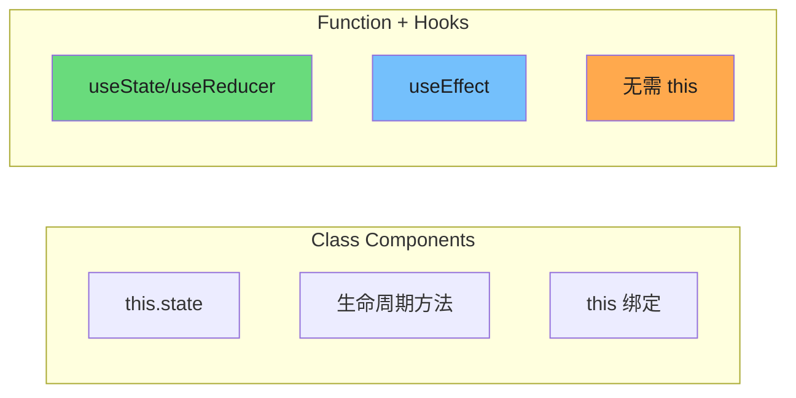
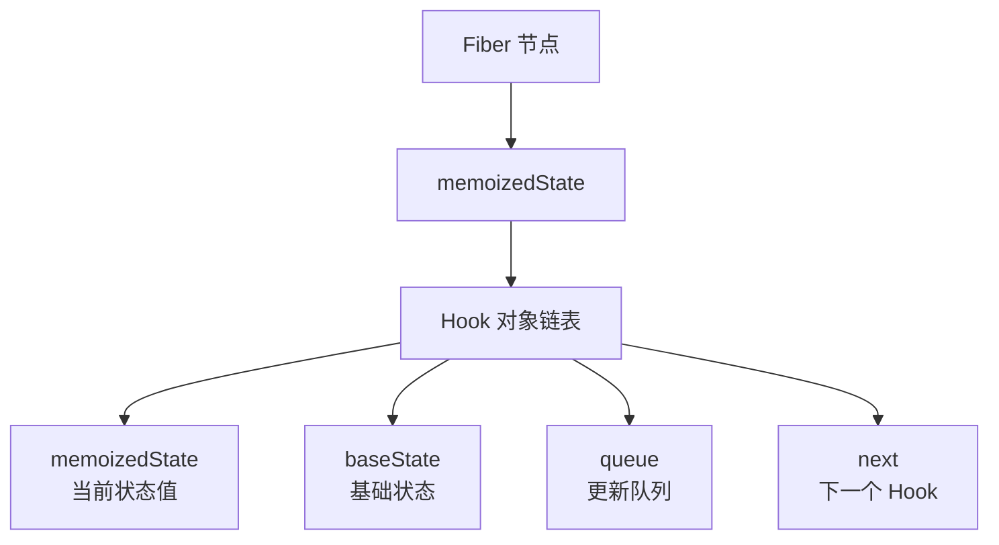
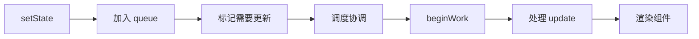
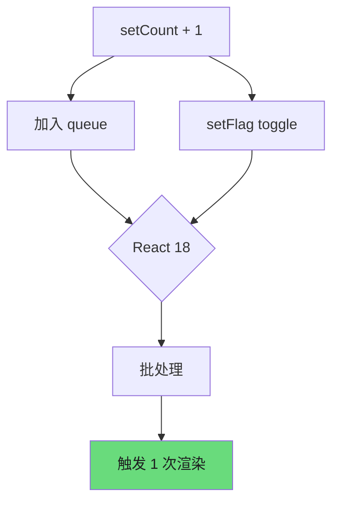
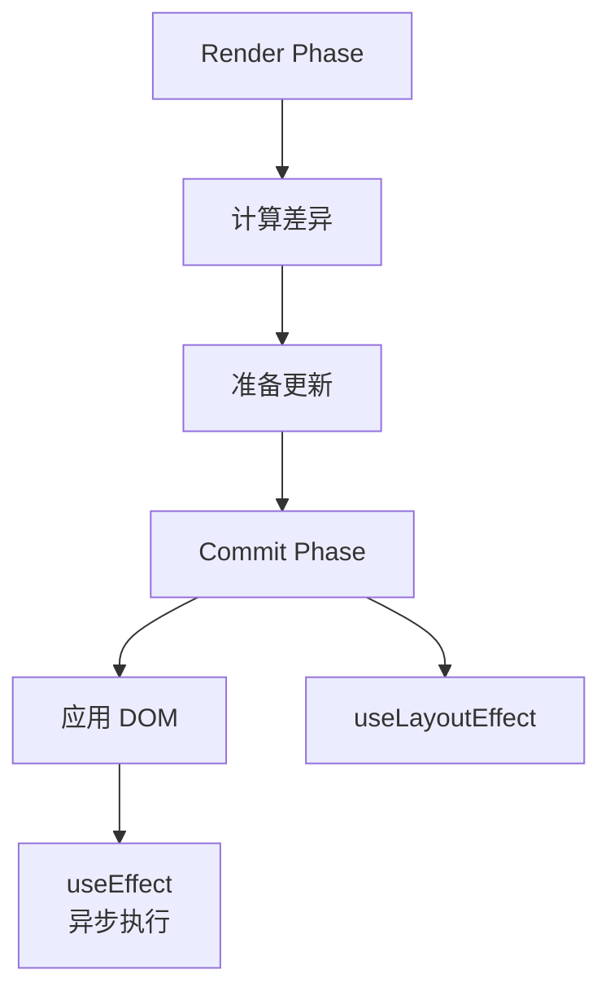
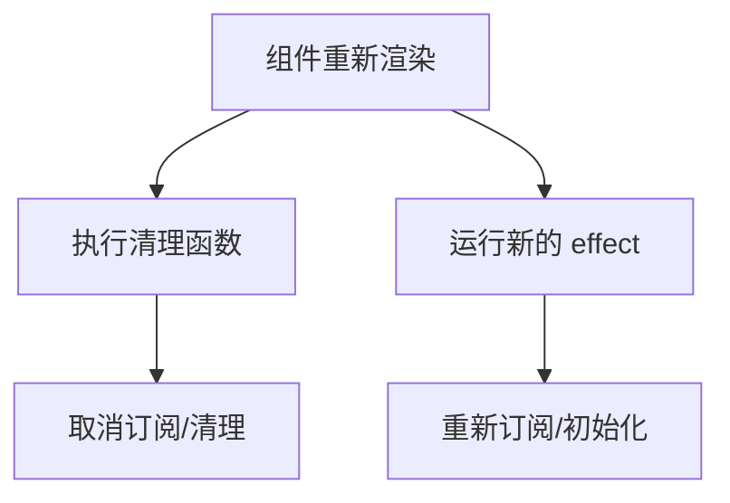
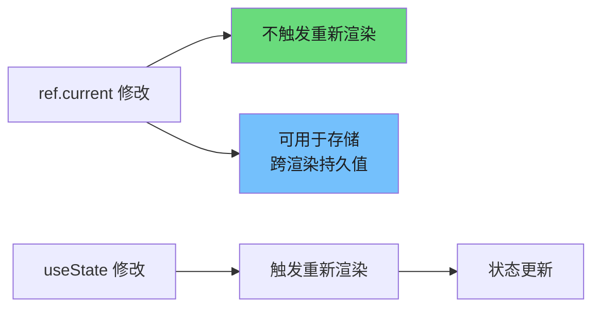
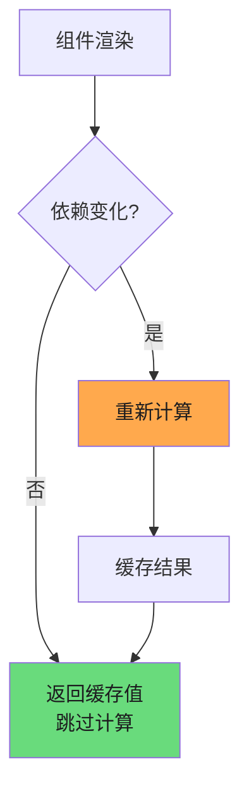
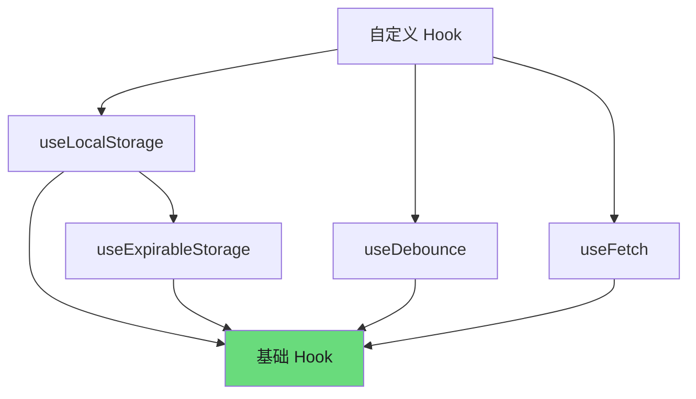
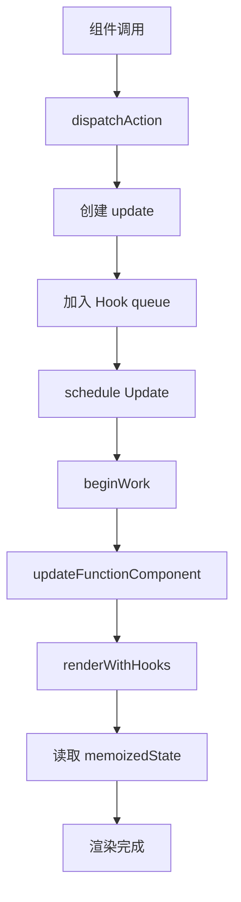

# Hooks 深入原理

Hooks 是 React 16.8 引入的核心特性，它让我们在函数组件中使用状态和其他 React 特性成为可能。本文档深入剖析 Hooks 的内部实现原理，帮助你理解其工作机制，从而编写更高效的代码。

---

## 1. Hooks 设计理念

### 1.1 为什么引入 Hooks

在 Hooks 出现之前，组件逻辑复用主要依靠 render props 和高阶组件（Higher-Order Components）。这两种方式虽然有效，但存在明显的局限性：

| 模式 | 问题 |
|------|------|
| Render Props | 导致嵌套过深（Wrapper Hell） |
| HOC | 难以理解 props 来源，prop 命名冲突 |
| Class Components | 难以拆分级小的逻辑单元，难以测试 |

Hooks 的引入解决了以下核心问题：

1. **逻辑复用困境** — 告别嵌套地狱，用自定义 Hook 自由组合逻辑
2. **关注点分离** — 相关逻辑可以放在同一个地方，而非散落在多个生命周期方法中
3. **更简洁的代码** — 避免 Class 组件的 this 绑定、构造函数等样板代码

### 1.2 Hooks vs Class Components



**核心差异对比：**

| 维度 | Class Component | Function Component + Hooks |
|------|-----------------|---------------------------|
| 状态管理 | `this.state` | `useState` / `useReducer` |
| 副作用 | 生命周期方法 | `useEffect` |
| 性能优化 | `shouldComponentUpdate` | `React.memo` |
| 代码量 | 较多样板代码 | 简洁直观 |
| this 绑定 | 需要手动处理 | 无需处理 |

### 1.3 Hooks 规则与最佳实践

Hooks 的使用必须遵循两条核心规则，否则会导致不可预测的行为：

**规则一：只在顶层调用 Hooks**

不要在循环、条件语句或嵌套函数中调用 Hooks。这是因为 React 依赖 Hooks 的调用顺序来匹配 state 和对应的更新逻辑：

```javascript
// 错误：在条件语句中调用
function Example({ isLoggedIn }) {
    if (isLoggedIn) {
        const [name, setName] = useState('user'); // 可能导致 bug
    }
    const [age, setAge] = useState(25);
}

// 正确：将条件逻辑移到 Hook 内部
function Example({ isLoggedIn }) {
    const [name, setName] = useState(isLoggedIn ? 'user' : 'guest');
    const [age, setAge] = useState(25);
}
```

**规则二：只在 React 函数中调用 Hooks**

- 允许: 在函数组件中调用
- 允许: 在自定义 Hooks 中调用
- 禁止: 不要在普通 JavaScript 函数中调用

**最佳实践：**

```javascript
// 使用有意义的命名
const [userName, setUserName] = useState('');
const [isLoading, setIsLoading] = useState(true);

// 合理拆分自定义 Hook
function useUserProfile(userId) {
    const [profile, setProfile] = useState(null);
    const [loading, setLoading] = useState(true);

    useEffect(() => {
        fetchUser(userId).then(setProfile).finally(() => setLoading(false));
    }, [userId]);

    return { profile, loading };
}

// 依赖数组要完整
useEffect(() => {
    document.title = `${count} items`;
}, [count]); // 包含 count
```

---

## 2. useState 与 useReducer 原理

### 2.1 函数组件状态存储位置（Fiber.memoizedState）

在 React 内部，每个组件都对应一个 Fiber 节点。Fiber 是 React 16 引入的新协调引擎，它将渲染工作拆分为可中断的小单元。

函数组件的状态存储在 Fiber 节点的 `memoizedState` 属性中：



**Hook 对象的结构：**

```typescript
interface Hook {
    memoizedState: any;      // 当前状态值
    baseState: any;          // 基础状态
    baseQueue: Update<any> | null;  // _pending queue
    queue: UpdateQueue<any>; // 待执行的更新队列
    next: Hook | null;       // 链表下一项
}
```

**状态更新的调用链路：**



### 2.2 批量更新机制

React 18 引入了**自动批处理（Automatic Batching）**特性，将多个状态更新合并为一次渲染。这意味着即使在异步回调（如 setTimeout、Promise）或原生事件处理器中触发多个 setState，React 也只会触发一次重新渲染。

```javascript
function Counter() {
    const [count, setCount] = useState(0);
    const [flag, setFlag] = useState(true);

    const handleClick = () => {
        // React 18: 批量更新，只会触发一次渲染
        setTimeout(() => {
            setCount(c => c + 1);  // +1
            setFlag(f => !f);      // toggle
        }, 0);
    };

    return <button onClick={handleClick}>Click</button>;
}
```

**批量更新的原理：**



### 2.3 函数式更新 vs 普通更新

```javascript
// 普通更新：直接传入新值
setCount(count + 1);

// 函数式更新：传入更新函数
setCount(prevCount => prevCount + 1);
```

**为什么需要函数式更新？**

当新状态依赖于前一个状态时，函数式更新可以确保获取到最新的状态值：

```javascript
// 普通更新可能产生 stale 数据
const handleClick = () => {
    setCount(count + 1);  // count 在闭包中是旧值
    setCount(count + 1);  // count 仍是旧值，结果只加了 1
};

// 函数式更新始终基于最新状态
const handleClick = () => {
    setCount(prev => prev + 1);  // prev 是最新值
    setCount(prev => prev + 1);  // prev 是上一步的新值，结果加了 2
};
```

**useReducer 是更优的选择** — 当状态逻辑复杂或存在多个子值时，`useReducer` 提供了更可预测的状态管理方式：

```javascript
const initialState = { count: 0 };

function reducer(state, action) {
    switch (action.type) {
        case 'increment':
            return { ...state, count: state.count + 1 };
        case 'decrement':
            return { ...state, count: state.count - 1 };
        case 'reset':
            return initialState;
        default:
            return state;
    }
}

function Counter() {
    const [state, dispatch] = useReducer(reducer, initialState);

    return (
        <div>
            <span>{state.count}</span>
            <button onClick={() => dispatch({ type: 'increment' })}>+</button>
            <button onClick={() => dispatch({ type: 'decrement' })}>-</button>
        </div>
    );
}
```

### 2.4 状态结构设计

良好的状态结构设计能显著提升应用性能和可维护性：

**原则一：保持状态扁平化**

```javascript
// 深层嵌套
const [form, setForm] = useState({
    user: {
        profile: {
            name: '',
            email: ''
        }
    }
});

// 扁平化设计
const [userName, setUserName] = useState('');
const [userEmail, setUserEmail] = useState('');

// 或者使用 useReducer 按领域分组
const [formState, dispatch] = useReducer(formReducer, {
    user: { name: '', email: '' },
    settings: { theme: 'light' }
});
```

**原则二：避免冗余状态**

```javascript
// 冗余：从 list 和 total 可计算
const [list, setList] = useState([1, 2, 3]);
const [total, setTotal] = useState(6);

// 单一来源：只存储 list，total 通过 useMemo 计算
const [list, setList] = useState([1, 2, 3]);
const total = useMemo(() => list.reduce((a, b) => a + b, 0), [list]);
```

---

## 3. useEffect 深度解析

### 3.1 执行时机：commit 阶段后

React 的渲染过程分为三个阶段：

1. **Render 阶段** — 计算差异，准备更新
2. **Commit 阶段** — 将变化应用到 DOM
3. **Commit 阶段后** — 执行 useEffect 和 useLayoutEffect



### 3.2 依赖检测：Object.is 比较

useEffect 通过浅比较来检测依赖是否变化。React 使用 `Object.is()` 进行比较：

```javascript
// Object.is 的行为
Object.is(1, 1);           // true
Object.is({}, {});          // false（引用不同）
Object.is([], []);          // false（引用不同）
Object.is(null, undefined); // false
Object.is(undefined, undefined); // true
```

**常见陷阱：**

```javascript
const [data, setData] = useState({ value: 0 });

// 每次渲染都触发 effect（新对象引用）
useEffect(() => {
    console.log(data);
}, [data]); // data 对象始终是新引用

// 使用函数式更新，或确保对象稳定
useEffect(() => {
    console.log(data.value);
}, [data.value]); // 只依赖具体值
```

### 3.3 清理函数机制

```javascript
useEffect(() => {
    const subscription = subscribeToData(id, (newData) => {
        setData(newData);
    });

    // 返回清理函数
    return () => {
        subscription.unsubscribe();
    };
}, [id]);
```

**清理函数的执行时机：**



### 3.4 依赖数组为空的特殊情况

```javascript
useEffect(() => {
    // 只在组件挂载时执行一次
    console.log('组件已挂载');

    return () => {
        console.log('组件即将卸载');
    };
}, []); // 空数组 = 挂载时执行，卸载时清理
```

**等价于 Class 组件的 componentDidMount 和 componentWillUnmount：**

```javascript
class Example extends React.Component {
    componentDidMount() {
        console.log('组件已挂载');
    }

    componentWillUnmount() {
        console.log('组件即将卸载');
    }
}
```

### 3.5 useLayoutEffect vs useEffect

| 特性 | useEffect | useLayoutEffect |
|------|-----------|-----------------|
| 执行时机 | 异步（在浏览器绘制后） | 同步（在 DOM 变更后，浏览器绘制前） |
| 阻塞渲染 | 否 | 是 |
| 使用场景 | 数据获取、订阅等副作用 | 需立即读取/修改 DOM（如测量元素尺寸） |
| 性能影响 | 较小 | 可能影响性能 |

```javascript
function Tooltip() {
    const [position, setPosition] = useState({ x: 0, y: 0 });
    const ref = useRef(null);

    useLayoutEffect(() => {
        // 同步执行，确保 tooltip 位置在视觉更新前计算好
        const rect = ref.current.getBoundingClientRect();
        setPosition(calculatePosition(rect));
    }, [dependency]);

    return <div ref={ref}>Tooltip</div>;
}
```

---

## 4. useRef 原理与应用

### 4.1 ref 的生命周期

useRef 返回一个可变的 ref 对象，其 .current 属性可以持有任意值。与 useState 不同，**修改 ref 不会触发组件重新渲染**。

```javascript
const Container = () => {
    const countRef = useRef(0);

    // 修改 ref 不触发重新渲染
    const handleClick = () => {
        countRef.current += 1;  // 只更新 ref，不更新 UI
        console.log(countRef.current);
    };

    return <button onClick={handleClick}>点击次数（不显示）</button>;
};
```

### 4.2 ref 与 render 的关系



### 4.3 ref 回调函数

当需要动态引用多个 DOM 元素时，ref 回调函数非常有用：

```javascript
// 第 1 段：组件入口与 ref 容器——用一个跨渲染稳定的数组收集所有输入框的 DOM 节点
function MultiInput() {
    const inputRefs = useRef([]); // 用 useRef 而不是 useState：写 ref 不触发重渲染，正好匹配"存放 DOM 引用"这种纯副作用；[] 只初始化一次，后续渲染不会重置

    // 第 2 段：ref 工厂——为每个下标生成一个独立的回调 ref
    // 关键点：若写成 ref={inputRefs.current[i]}，渲染期间求值时节点还没挂载，拿不到值；
    // 回调 ref 由 React 在挂载/卸载时以节点或 null 主动调用。工厂用闭包把 index "焊死"，
    // 否则 map 里的 i 被共享，所有 ref 槽会互相覆盖、最终都指向最后一个 input。
    const setRef = (index) => (element) => {
        inputRefs.current[index] = element; // element 挂载时是 DOM 节点、卸载时是 null；直接覆盖即可，天然支持节点重建
    };

    // 第 3 段：挂载后自动聚焦第一个输入框
    useEffect(() => {
        // 聚焦第一个输入框
        inputRefs.current[0]?.focus(); // 可选链兜底：首帧 commit 时若该 ref 未就绪就跳过，避免 undefined.focus() 抛错；依赖数组为空 => 整个生命周期只执行一次
    }, []);

    // 第 4 段：渲染三个输入框并把它们的 DOM 注册进 ref 数组（O(3) 固定规模，与输入框数量线性相关）
    return (
        <div>
            {[0, 1, 2].map((i) => (
                <input key={i} ref={setRef(i)} /> // key 用 i 保证同序节点被复用；ref 每次渲染都是新函数，React 会先用 null 调旧函数、再用节点调新函数，等于反复解绑/绑定，此处无清理逻辑所以安全
            ))}
        </div>
    );
}
```
### 4.4 forwardRef 与 useImperativeHandle

**forwardRef** 允许组件接收 ref 并传递给子组件：

```javascript
// 默认情况下函数组件不接受 ref
const Input = ({ value, onChange }) => (
    <input value={value} onChange={onChange} />
);

// 使用 forwardRef 转发 ref
const Input = forwardRef(({ value, onChange }, ref) => (
    <input ref={ref} value={value} onChange={onChange} />
));

const Parent = () => {
    const inputRef = useRef();
    return <Input ref={inputRef} />;
};
```

**useImperativeHandle** 限制暴露给父组件的属性和方法：

```javascript
const CustomInput = forwardRef(({ value, onChange }, ref) => {
    // 第 1 段：创建内部 DOM 引用
    // 用 useRef 单独持有真实 <input> 节点，它只在本组件闭包内可见；useRef 返回的对象跨渲染保持不变，
    // 所以下面的 focus/select 可以放心地延迟读取 .current，而不会拿到过期的节点。
    const inputRef = useRef();

    // 第 2 段：定义对外暴露的命令式接口
    // 只暴露 focus 方法，不暴露整个 input 元素
    // 这里才是 forwardRef 的真正意义：转发进来的 ref 会被 useImperativeHandle "接管"，
    // 父组件拿到的 ref.current 不再是 DOM 节点，而是一个白名单 API 对象，
    // 从而把 DOM 细节（value、style、事件、parentNode 等）全部封装起来。
    // 依赖数组传 []：只在挂载时构造一次该对象，之后不再重建，避免每次渲染都触发父组件的 ref 回调。
    useImperativeHandle(ref, () => ({
        focus: () => {
            inputRef.current.focus(); // 走原生 DOM API，等价于用户点击输入框获得焦点
        },
        select: () => {
            inputRef.current.select(); // 全选文本，常用于"复制/替换"类交互，比手写 setSelectionRange 更省事
        }
    }), []);

    // 第 3 段：渲染受控输入框
    // value 由父组件传入、变化靠 onChange 回传，本组件不持有任何 state，是典型的"受控组件"；
    // 边界条件：父组件必须提供 onChange，否则 React 会把它当成只读输入框并输出告警。
    return <input ref={inputRef} value={value} onChange={onChange} />;
});
```
---

## 5. useCallback 与 useMemo

### 5.1 缓存策略



### 5.2 依赖数组的作用

```javascript
const memoizedCallback = useCallback(() => {
    doSomething(a, b);
}, [a, b]);

const memoizedValue = useMemo(() => computeExpensiveValue(a, b), [a, b]);
```

**工作原理：**

- 首次渲染时，执行函数并缓存结果
- 后续渲染时，比较依赖数组中的每个值
- 如果所有依赖都未变化，返回缓存的结果
- 如果依赖变化，重新计算并缓存新结果

### 5.3 过度使用的陷阱

**不是所有值都需要 memoization：**

```javascript
// 过度优化：简单计算不需要 memo
const a = useMemo(() => 1 + 1, []);          // 无意义
const handleClick = useCallback(() => doX(), []);  // 简单函数无需缓存

// 过度优化：基础类型不需要 memo
const name = useMemo(() => 'John', []);      // 直接用常量即可
```

**何时使用：**

| 场景 | 推荐方案 |
|------|----------|
| 传递给子组件的回调函数 | useCallback |
| 昂贵的计算（大量数据排序、复杂计算） | useMemo |
| 引用类型的基础值 | useMemo |
| useEffect 的依赖 | useCallback |
| React.memo 的子组件 props | useCallback |

### 5.4 memo 与 useMemo 的区别

| API | 作用对象 | 作用 |
|-----|----------|------|
| `React.memo` | 组件 | 包装组件，props 不变时跳过渲染 |
| `useMemo` | 值 | 缓存计算结果 |
| `useCallback` | 函数 | useMemo 的特例，专门缓存函数 |

```javascript
// memo 包装组件
const Button = memo(({ onClick, label }) => (
    <button onClick={onClick}>{label}</button>
));

// useMemo 缓存计算结果
const sortedList = useMemo(
    () => [...items].sort(comparator),
    [items]
);

// useCallback 缓存函数（等价于 useMemo 缓存函数）
const handleSubmit = useCallback(
    (data) => dispatch({ type: 'SUBMIT', payload: data }),
    [dispatch]
);
```

---

## 6. 自定义 Hooks 设计模式

### 6.1 提取逻辑为 Hooks

自定义 Hook 是一个以 `use` 开头的函数，内部可以调用其他 Hooks：

```javascript
// 提取数据获取逻辑
function useUser(userId) {
    const [user, setUser] = useState(null);
    const [loading, setLoading] = useState(true);
    const [error, setError] = useState(null);

    useEffect(() => {
        setLoading(true);
        fetchUser(userId)
            .then(setUser)
            .catch(setError)
            .finally(() => setLoading(false));
    }, [userId]);

    return { user, loading, error };
}

// 使用自定义 Hook
function ProfilePage({ userId }) {
    const { user, loading, error } = useUser(userId);

    if (loading) return <Spinner />;
    if (error) return <Error message={error} />;
    return <UserCard user={user} />;
}
```

### 6.2 Hooks 组合模式

自定义 Hook 可以组合使用，实现更复杂的功能：



**组合示例：**

```javascript
// 基础 Hook：localStorage 同步
// 第 1 段：惰性初始化 state——把"读本地存储"这件事推迟到首次渲染时执行一次
// 这里必须用函数式初始值 useState(() => ...)，而不是 useState(JSON.parse(...))：
// 直接写在参数里会导致每次渲染都真的去读一次 localStorage 并解析 JSON，白白浪费 IO。
// 易错点：getItem 返回 null 与返回字符串 "null"/"false" 含义不同，所以用 stored ? 判断存在性而非真值内容。
function useLocalStorage(key, initialValue) {
    const [value, setValue] = useState(() => {
        const stored = localStorage.getItem(key);
        return stored ? JSON.parse(stored) : initialValue;
    });

    // 第 2 段：对外暴露的写入函数——先更新 React 状态驱动 UI，再落盘保证一致性
    // useCallback 依赖 [key]：key 变化时必须换一个新函数，否则闭包里的 key 是旧的，会写到错误的键上。
    // 易错点：setValue 来自 useState，本身支持函数式更新（setValue(prev => ...)），
    // 但这里同步把 newValue 交给 JSON.stringify，若传入函数会被序列化成 undefined 而丢数据，属于隐性边界情况。
    const setItem = useCallback((newValue) => {
        setValue(newValue);
        localStorage.setItem(key, JSON.stringify(newValue));
    }, [key]);

    // 第 3 段：返回与 useState 相似的 [值, 写入器] 元组，方便调用方像用原生 state 一样替换
    // 注意第二个元素不是原始 setState，而是被包装过的 setItem，因此不提供函数式更新语义。
    return [value, setItem];
}

// 组合 Hook：带过期时间的 localStorage
// 第 4 段：复用基础 Hook 存储"信封结构"，把用户数据与过期时间一起持久化
// 存储形态被改造成 { value, expiresAt }，因此读取方必须解包（见末尾 return），
// 这也意味着 useExpirableStorage 与 useLocalStorage 写入的数据格式不兼容，混用会读到错层。
function useExpirableStorage(key, initialValue, ttl) {
    const [value, setValue] = useLocalStorage(key, initialValue);

    // 第 5 段：过期校验副作用——每次信封变化时判断是否已超时，超时则回退到初始值
    // 放在 useEffect 而非渲染期，是为了避免在渲染过程中触发 setState 造成额外重渲染或死循环。
    // 复杂度 O(1)；边界：若初始值本身没有 expiresAt 字段，此处永远不触发，
    // 且 setValue(initialValue) 写入的是"裸值"而非信封，会与后续写入格式不一致。
    // 依赖数组里的 ttl 实际未被本副作用使用（仅由外部闭包捕获），保留它只是为了让 ttl 变化时重新评估。
    useEffect(() => {
        const now = Date.now();
        const expiresAt = value?.expiresAt;

        if (expiresAt && now > expiresAt) {
            setValue(initialValue);
        }
    }, [value, initialValue, ttl]);

    // 第 6 段：带过期时间的写入器——写入时把当前时间戳加 ttl 算出绝对过期时刻
    // 存绝对时间而非剩余时长，好处是页面刷新/关闭后计时依然连续，不依赖任何内存状态。
    // 易错点：依赖数组只写了 [ttl]，setValue 未列入；好在 useLocalStorage 的 setItem 按 [key] 记忆，
    // 同一 key 下引用稳定，所以这里不会产生明显的陈旧闭包问题，但换 key 时需留意。
    const setValueWithExpiry = useCallback((newValue) => {
        setValue({
            value: newValue,
            expiresAt: Date.now() + ttl
        });
    }, [ttl]);

    // 第 7 段：解包信封，只把真实业务数据暴露给调用方，并返回自定义写入器
    // 使用可选链 value?.value 是为了兜住"空存储 / 已被重置为裸值"的情况，避免直接抛错。
    return [value?.value, setValueWithExpiry];
}
```
### 6.3 常见自定义 Hooks 示例

**useDebounce — 防抖值：**

```javascript
// 第 1 段：为「防抖后的值」建立独立 state，并把初始值直接对齐传入的 value
// 为什么要独立 state：value 是外部高频变化的输入源，而组件真正需要的是一个"节奏被压低"的副本；
// 用一个 state 承载它，才能在延迟到期时通过 setState 触发重渲染，把新值向下游传播。
function useDebounce(value, delay = 500) {
    const [debouncedValue, setDebouncedValue] = useState(value); // 初始值取首个 value（而非 undefined），避免首次渲染拿到空值造成"闪烁/误判"；delay 给默认值 500 是为了调用方可以只关心 value

    // 第 2 段：每次 value 或 delay 变化都重置一次计时器，只有"最后一次变更"能存活到计时结束
    // 关键数据流：value 变化 → 清理上一个定时器 → 重新计时 → 到期后 setDebouncedValue(value) 固化该次取值。
    // 返回的清理函数是本 hook 的核心：若省略它，旧的定时器仍会触发并把陈旧的 value 写回 state（竞态/值回退），
    // 组件卸载时也会对已卸载组件 setState 造成泄漏；这也顺带覆盖了 delay 动态变化的边界。
    useEffect(() => {
        const timer = setTimeout(() => setDebouncedValue(value), delay);
        return () => clearTimeout(timer);
    }, [value, delay]); // 依赖必须同时包含 value 与 delay：少写 delay 会导致运行时改 delay 不生效（闭包捕获旧值）

    // 第 3 段：把"高频输入"输出为"低频信号"，hook 只负责节奏控制，不关心下游拿它做什么
    // 复杂度：单次调度 O(1)，但每次 value 抖动都会创建/销毁一个定时器，抖动极频繁时主要开销在定时器分配上。
    return debouncedValue;
}

// 使用场景：搜索输入
// 第 4 段：真实使用场景——搜索框。输入每次按键都改 state，请求则必须等用户停手后再发。
function Search() {
    const [query, setQuery] = useState(''); // query 是"即时值"：每次按键都变，用来驱动受控输入框的回显
    const debouncedQuery = useDebounce(query, 300); // 这里 300ms 覆盖了 hook 默认的 500ms：搜索场景下 300ms 是"手感不卡、请求不炸"的折中值

    // 第 5 段：以"防抖后的值"为依赖发请求，从而把 N 次按键压缩成 1 次网络调用
    // 为什么依赖数组只写 debouncedQuery：searchAPI 是模块级函数、setResults 是 React 保证引用稳定的 setter，
    // 二者不随渲染变化，故无需入依赖；若把它们写成组件内联函数，就会每次渲染都重发请求（易错点）。
    useEffect(() => {
        if (debouncedQuery) { // 空串短路：初始挂载时 query 为 ''，被防抖成 '' 也会触发本 effect，不加判断就会发出一次无意义请求
            searchAPI(debouncedQuery).then(setResults); // 只在"用户真正输入了内容"时才请求；注意这里未做竞态防护，若接口返回乱序，旧响应可能覆盖新结果
        }
    }, [debouncedQuery]);

    // 第 6 段：受控输入框。onChange 每次按键都写 query（高频），但下游请求已被防抖限流，
    // 因此 UI 依然即时响应，网络侧却只按"停顿 300ms"的节奏触发。
    return <input onChange={(e) => setQuery(e.target.value)} />;
}
```
**useToggle — 切换状态：**

```javascript
function useToggle(initialValue = false) {
    const [value, setValue] = useState(initialValue);

    const toggle = useCallback(() => setValue(v => !v), []);
    const setTrue = useCallback(() => setValue(true), []);
    const setFalse = useCallback(() => setValue(false), []);

    return { value, toggle, setTrue, setFalse };
}
```

**usePrevious — 上一个值：**

```javascript
function usePrevious(value) {
    const ref = useRef();

    useEffect(() => {
        ref.current = value;
    }, [value]);

    return ref.current;
}

// 使用场景：检测值变化
function Counter() {
    const [count, setCount] = useState(0);
    const previousCount = usePrevious(count);

    return (
        <div>
            <p>当前: {count}</p>
            <p>上一个: {previousCount}</p>
            <button onClick={() => setCount(c => c + 1)}>增加</button>
        </div>
    );
}
```

**useAsync — 异步操作状态管理：**

```javascript
function useAsync(asyncCallback, immediate = true) {
    // 第 1 段：状态机初始化 —— 用三个独立 state 描述一次异步请求的完整生命周期
    // status 是"状态机"的核心，取值 idle | pending | success | error；value 与 error 是互斥的结果槽位，
    // 拆成三个 state 而非一个对象，是为了让组件只在真正相关的字段变化时重渲染，也避免每次 set 都要手动浅合并。
    const [status, setStatus] = useState('idle'); // idle | pending | success | error
    const [value, setValue] = useState(null);
    const [error, setError] = useState(null);

    // 第 2 段：把异步执行封装成可复用的 execute —— 每次调用前先"重置"，再进入 pending
    // 依赖数组只放 asyncCallback：useState 的 setter 身份恒定，放进依赖反而无意义；
    // 而 asyncCallback 一变，execute 就换新引用，这会驱动第 3 段的 useEffect 自动重跑（这是本 hook 的联动关键）。
    const execute = useCallback(async (...args) => {
        // 先清空上一轮结果再置 pending：防止 UI 在新请求进行时误显示旧数据，也确保成功/失败状态不会残留。
        setStatus('pending');
        setValue(null);
        setError(null);

        // 用 try/catch 把 rejection 收敛成状态，而不是向外抛出：
        // 这样调用方无需到处写 .catch，也能拿到统一的 error 字段。注意 catch 里不做 rethrow，异常被"吞掉"了。
        try {
            const response = await asyncCallback(...args);
            // 顺序上先写 value 再置 success，保证组件在 status 变为 success 的那次渲染里一定能读到数据。
            setValue(response);
            setStatus('success');
        } catch (e) {
            setError(e);
            setStatus('error');
        }
    }, [asyncCallback]);

    // 第 3 段：首次挂载（或 execute 变化）时自动触发一次 —— 对应 immediate 选项
    // execute 因 useCallback 而稳定，所以 effect 实际只在 asyncCallback 更换或 immediate 翻转时重跑；
    // 易错点：此处故意不传 args 也不返回取消函数，故存在"卸载后 setState"与"竞态覆盖"的隐患。
    useEffect(() => {
        if (immediate) {
            execute();
        }
    }, [execute, immediate]);

    // 第 4 段：对外返回的稳定契约 —— execute 供手动/传参调用，三个状态供渲染与分支判断
    // 返回普通对象而非 memo 化对象，调用方若把它放进依赖数组会每次渲染都变，需用解构取值来规避。
    return { execute, status, value, error };
}
```
---

## 7. 附录：Hooks 调用链路总览



---

**参考资料：**

- [React 官方文档 - Hooks](https://react.dev/reference/react)
- [React Hooks 规则](https://react.dev/reference/rules/rules-of-hooks)
- [Deep Dive: React Fiber Architecture](https://github.com/acdlite/react-fiber-architecture)
- [Inside React: Understanding the Reconciliation Process](https://react.dev/learn/preserving-and-resetting-state)

## 深入阅读与参考

!!! tip "怎么用这些资料"
    先读「官方文档与规范」建立准确的概念，再读「源码与示例」核对细节，最后用「教程、书籍与视频」换一种讲法加深理解。每条都写明了读哪一节、带着什么问题读。

### 官方文档与规范

| 资源 | 为什么读 | 怎么读 |
|---|---|---|
| [Built-in React Hooks](https://react.dev/reference/react/hooks) | 全量 Hooks 索引，适合作为调用链总览的骨架。 | 通读目录，标记每个 Hook 的触发时机，画出本页附录的调用链路图。 |
| [useState](https://react.dev/reference/react/useState) | 理解状态如何按调用顺序与 fiber 关联。 | 读参考与陷阱一节，带着“更新为何异步”的疑问，改写一个计数器。 |
| [useReducer](https://react.dev/reference/react/useReducer) | 与 useState 同源，看更新如何被 reducer 统一处理。 | 读参数与 dispatch 部分，实现 useReducer 版计数器并与 useState 版对比。 |
| [useEffect](https://react.dev/reference/react/useEffect) | 官方对依赖数组与清理语义的第一手说明。 | 重点读依赖与清理小节，列出自己项目所有 effect 的依赖遗漏。 |
| [useRef](https://react.dev/reference/react/useRef) | 区分渲染间持久值与 DOM 引用的关键。 | 读“避免重复创建 ref”示例，实现一个保存定时器 id 的 ref。 |
| [useCallback](https://react.dev/reference/react/useCallback) | 搞清缓存函数与依赖数组的边界条件。 | 读使用场景与陷阱两节，判断项目中回调是否真的需要缓存。 |
| [useMemo](https://react.dev/reference/react/useMemo) | 与 useCallback 同源，理解依赖比较机制。 | 读缓存与不缓存的对比，用 Profiler 验证一次缓存收益。 |
| ['Reusing Logic with Custom Hooks'](https://react.dev/learn/reusing-logic-with-custom-hooks) | 官方自定义 Hook 的命名与复用原则。 | 读完按文中示例抽一个 useOnlineStatus，套用到自己的项目。 |
| [React Working Group 与 RFC](https://github.com/reactjs/rfcs) | Hooks 设计动机的第一手资料。 | 只读 Motivation 一节，回答“Hooks 解决了 HOC 的什么问题”并写摘要。 |

### 源码与示例

| 资源 | 为什么读 | 怎么读 |
|---|---|---|
| [patterns.dev：React 模式](https://www.patterns.dev/react/) | Hooks 与复合组件的实战模式集。 | 挑 Hooks 模式一节，写一个最小示例并说明其状态归属。 |

### 教程、书籍与视频

| 资源 | 为什么读 | 怎么读 |
|---|---|---|
| [Overreacted：useEffect 完整指南](https://overreacted.io/a-complete-guide-to-useeffect/) | 把闭包与依赖数组讲透的经典长文。 | 复现 setInterval 计数示例，观察过期闭包，再改用函数式更新修复。 |
| [You Might Not Need an Effect](https://react.dev/learn/you-might-not-need-an-effect) | 判断哪些 effect 本就不该存在。 | 带着自己代码逐条对照，把派生值与事件逻辑移出 effect。 |
| [Kent：useMemo 与 useCallback](https://kentcdodds.com/blog/usememo-and-usecallback) | 用实测数据说明缓存何时才有收益。 | 用 Profiler 跑文中案例，记录加与不加 memo 的渲染次数。 |

## 应用与行业实践

### 应用场景地图

| 场景 | 用到本页哪个知识点 | 典型技术选型 | 注意事项 |
|:--|:--|:--|:--|
| 后台管理的万行表格（过滤 + 排序 + 行内勾选） | useMemo 缓存派生数据、useCallback 稳定事件处理器 | TanStack Table、react-window | 依赖数组要覆盖排序字段与过滤条件；行内编辑状态放在行组件内部 |
| 低端安卓机的首屏加载 | useState 惰性初始化、useEffect 执行时机 | React.lazy + Suspense、路由级代码分割 | 首屏不要同步读 localStorage 再决定渲染；Effect 里的请求要带取消标记 |
| 多人协作白板（同时在线几十人） | useRef 持有连接与画布上下文、useEffect 清理订阅 | Yjs、Socket.IO、Canvas 2D | 消息回调经 ref 转发，否则每次渲染都会重连 |
| 实时聊天消息流（上滑加载历史） | useEffect 依赖与清理、useRef 保存滚动锚点 | WebSocket、react-virtuoso | 依赖数组放会话 ID，切换会话时必须关闭旧订阅 |
| 富文本编辑器（输入即格式化） | useRef 持有编辑器实例、useCallback 稳定命令回调 | ProseMirror、Slate、Tiptap | 编辑器实例不能放进 state，否则触发实例重建 |
| 无限滚动信息流 | useEffect 绑定 IntersectionObserver、useCallback 处理加载 | IntersectionObserver、TanStack Query | 清理函数里要 disconnect；页码用 ref 保存 |
| 多级联动表单（省市区 + 校验规则） | useState 分组、useMemo 计算禁用与校验规则 | React Hook Form、Zod | 校验规则放进 useMemo，依赖到具体字段值 |
| 埋点上报与停留时长统计 | useRef 记录时间戳、useEffect 清理时上报 | 自研 SDK、navigator.sendBeacon | 清理函数里读 ref 的最终值；上报失败不要阻塞渲染 |
| SSR 首屏水合报错排查 | useEffect 只在客户端运行、useState 初始值 | Next.js、Remix | 依赖 window 的渲染放进 Effect，别放进渲染函数体 |

### 三个场景拆解

#### 场景 1：后台管理的万行表格

**业务背景**：表格要支持关键字过滤、行内勾选和点列头排序，行数到一万量级。此时在搜索框每敲一个字符都会触发整表重渲染，输入出现可感知延迟；用一万条模拟数据加 Chrome DevTools 的 CPU 4 倍降速即可在本地复现。

**怎么用本页知识解决**：思路是把"计算"和"渲染"分开处理。过滤结果用 useMemo 按输入缓存，行组件用 React.memo 切断无关重渲染，勾选回调用 useCallback 保持引用稳定，三个条件缺一个都无效。

```jsx
import React, { useMemo, useCallback } from 'react';

const Row = React.memo(function Row({ row, onToggle }) {
  return (
    <tr>
      <td>{row.name}</td>
      {/* onToggle 来自上层 useCallback，引用稳定时 memo 才会跳过渲染 */}
      <td><input type="checkbox" onChange={() => onToggle(row.id)} /></td>
    </tr>
  );
});

function Table({ rows, keyword, onSelect }) {
  // 过滤结果按 rows 与 keyword 缓存，敲字时不重算全量过滤
  const visible = useMemo(
    () => rows.filter(r => r.name.includes(keyword)),
    [rows, keyword]
  );
  // 上层传下来的 onSelect 也需用 useCallback 包裹，这里的引用才稳定
  const toggle = useCallback(id => onSelect(id), [onSelect]);
  return <tbody>{visible.map(r => <Row key={r.id} row={r} onToggle={toggle} />)}</tbody>;
}
```

- React.memo 只做浅比较，row 对象引用变化时仍会渲染，所以更新单行要用不可变方式替换该行对象。
- useMemo 的依赖必须包含 keyword，漏掉就会出现"输入了但列表不动"的现象。
- toggle 的依赖是 onSelect，上层若传内联箭头函数，这里的引用每次都变，memo 直接失效。
- 一万行全部挂载到 DOM 仍然会卡，过滤与缓存解决的是计算量，挂载量要靠虚拟滚动处理。

**怎么度量收益**：用 React DevTools Profiler 录制同一次输入，看每次 commit 的 actual duration（提交耗时）和参与渲染的组件数。再用 Chrome DevTools Performance 面板看 Scripting 时间与 Long Task 数量，用 PerformanceObserver 订阅 `event` 类型的 duration 取输入事件 P95。测量方法是固定一万条数据、连续输入 10 个字符、重复 5 次取中位数。

**什么时候不该用**：

- 行数在几百以内且单行结构简单时，memo 的浅比较开销可能超过渲染开销。
- 勾选状态要跨行频繁联动（例如全选后逐行改写）时，row 对象引用反复变化，memo 命中率接近零，此时应把状态外置或改用虚拟滚动。

#### 场景 2：低端安卓机的首屏加载

**业务背景**：首屏要先读本地主题配置，再请求用户信息，两步串行时白屏时间被拉长。用 Chrome DevTools 的 CPU 6 倍降速配合 Slow 4G 网络节流即可复现，机型越弱等待越明显。

**怎么用本页知识解决**：把只在首次渲染需要的读取放进 useState 的惰性初始化函数，让解析只发生一次。数据请求放进 useEffect，并在清理函数里设置取消标记，避免旧请求回来覆盖新状态。

```jsx
import { useState, useEffect } from 'react';

function App() {
  // 惰性初始化：函数只在首次渲染执行，解析 localStorage 不重复发生
  const [theme, setTheme] = useState(() => localStorage.getItem('theme') ?? 'light');
  return <Shell theme={theme} onToggle={() => setTheme(t => t === 'light' ? 'dark' : 'light')} />;
}

function useUser(id) {
  const [state, setState] = useState({ status: 'idle', data: null });
  useEffect(() => {
    let cancelled = false; // 取消标记随本次 Effect 创建
    setState({ status: 'loading', data: null });
    fetch('/api/user/' + id).then(r => r.json()).then(data => {
      if (!cancelled) setState({ status: 'done', data }); // 卸载后不再写状态
    });
    return () => { cancelled = true; }; // 依赖变化或卸载时执行
  }, [id]); // 只在 id 变化时重新请求
  return state;
}
```

- `useState(() => ...)` 传函数时才是惰性初始化，写成 `useState(localStorage.getItem('theme'))` 每次渲染都会执行读取。
- Effect 的清理函数在依赖变化前执行，这里保证快速切换 id 时旧响应不会写进状态。
- 取消标记是闭包变量，不是 state，改动它不会触发渲染，这正是需要的行为。
- 若把请求写在组件函数体里，每次渲染都会发起新请求，需靠 Effect 或事件触发来收口。

**怎么度量收益**：跑 Lighthouse 移动端预设，记录 LCP 与 TBT（Total Blocking Time）；用 Chrome DevTools Performance 面板看 Long Task 的起始时间与数量。测量条件是同一台设备开 CPU 6 倍降速、Slow 4G，重复 5 次取中位数。

**什么时候不该用**：

- 首屏数据本来就随 HTML 一起下发时，把渲染推迟到 Effect 只会让内容出现得更晚。
- 服务端渲染场景下用惰性初始化读 localStorage，服务端取不到值、客户端取到值，会触发水合不一致。

#### 场景 3：多人协作白板

**业务背景**：白板要支持几十人同时在线，笔迹与光标实时同步。常见故障是切房间后旧连接没关，以及订阅回调闭包捕获了旧的绘图状态，导致远端笔迹画在错误图层上。

**怎么用本页知识解决**：连接对象和最新回调都放进 useRef，让 Effect 的依赖数组只保留 roomId。这样切换房间才重建连接，普通渲染不会重连；回调经 ref 转发后始终读到最新逻辑。

```jsx
import { useRef, useEffect, useCallback } from 'react';

function useCollab(roomId, onRemoteDraw) {
  const socketRef = useRef(null);
  const handlerRef = useRef(onRemoteDraw);
  // 每次渲染后刷新 ref，回调里读到的始终是最新逻辑
  useEffect(() => { handlerRef.current = onRemoteDraw; });

  useEffect(() => {
    const socket = new WebSocket('/ws/' + roomId);
    socketRef.current = socket; // 连接对象放 ref，不进 state
    socket.onmessage = e => handlerRef.current(JSON.parse(e.data)); // 经 ref 转发
    return () => { socket.close(); socketRef.current = null; }; // 切房间时关旧连接
  }, [roomId]);

  // 发送函数引用稳定，可安全传给子组件或订阅列表
  return useCallback(p => socketRef.current?.send(JSON.stringify(p)), []);
}
```

- 依赖数组只有 roomId，onRemoteDraw 变化不会触发重连，这是用 ref 转发换来的。
- 没有依赖数组的 Effect 每次渲染都执行，这里只做 ref 赋值，开销可控。
- 清理函数里把 socketRef 置空，防止组件卸载后仍调用已关闭的连接。
- WebSocket 的 onmessage 参数是字符串，需自行做 JSON 解析与字段校验，不要直接信任对端数据。

**怎么度量收益**：Chrome DevTools Network 面板的 WS 标签，看连接建立次数与消息帧数量，切一次房间应当只出现一次连接。Performance 面板看 Long Task，确认解析大消息没有造成明显卡顿。自建指标用 `performance.now()` 在发送处打时间戳、收到对端确认后相减，取往返时延 P95。

**什么时候不该用**：

- 单机使用、没有并发编辑需求时引入协同库只增加包体积和调试复杂度。
- 需要强一致、可审计的操作日志时，客户端同步方案不能替代服务端校验与权限控制。

### 行业先进实践

- 在 lint 阶段开启 eslint-plugin-react-hooks 的 exhaustive-deps 规则（出处：React 官方文档 Rules of Hooks / 开源项目 eslint-plugin-react-hooks）。这条规则会在构建期报出依赖数组的缺项，而缺项正是闭包读到旧值的主要来源。借鉴方式是把规则等级设为 error 而不是 warn，让 CI 阻断合并。
- 用自定义 Hook 复用状态逻辑，并以 use 开头命名（出处：React 官方文档 Reusing Logic with Custom Hooks）。Hook 之间共享的是逻辑而不是状态，每次调用都会得到独立副本。借鉴方式是把请求、订阅、表单拆成 useXxx，让组件只承担渲染与布局。
- 用 useSyncExternalStore 订阅 React 之外的数据源（出处：React 官方文档 useSyncExternalStore）。它保证并发渲染下读取到一致快照，规避撕裂问题。借鉴方式是自研全局 store 时用它替代 useEffect + setState 的手写订阅。
- 用 React DevTools Profiler 录制交互并按 commit 定位热点（出处：React 官方文档 Profiler / React DevTools）。可以看到每次提交的耗时和参与渲染的组件列表。借鉴方式是改动前后各录一段相同操作，对比提交耗时与渲染组件数。
- 用记忆化选择器减少派生计算（出处：Redux 官方文档 Deriving Data with Selectors）。createSelector 会缓存输入，输入不变就返回旧引用，配合引用比较跳过渲染。借鉴方式是把过滤、排序、聚合结果统一抽成选择器。

### 从学到用：落地路线

1. 试点：选一个交互最重、改动最频繁的页面（例如后台表格页），只在该页面开启 Profiler 录制并打开 exhaustive-deps 规则。验收标准：该页面依赖数组告警清零，且留有一份改动前的提交耗时基线记录。
2. 验证：用固定数据集在该页面重复同一交互，做前后对照。验收标准：Profiler 的提交耗时或渲染组件数出现可复现变化，或者明确记录为"无变化并写明原因"。
3. 推广：把验证有效的写法固化成仓库内的自定义 Hook 与评审清单，新页面优先复用。验收标准：评审清单含 Hook 依赖检查与订阅清理两项，新页面不再出现内联的 useEffect + setState 订阅。
4. 防回退：把 exhaustive-deps 设为 CI 的 error 级规则，并加一条性能冒烟脚本。验收标准：依赖缺项时 CI 失败，冒烟脚本在提交耗时超过基线阈值时输出告警。

### 动手作业

**目标**：做一个"可搜索、可勾选、可清理"的万行列表，把 useState、useEffect、useRef、useMemo、useCallback 与自定义 Hook 串起来，并用工具量化每一步改动的效果。

**步骤**：

1. 用 Array.from 生成 10000 条 `{ id, name, done }` 数据，固定随机种子，保证每次运行的数据一致。
2. 写"朴素版"：useState 保存全量数据与搜索词，渲染时直接 filter 再 map，不加 memo。
3. 用 React DevTools Profiler 录制从空输入连续敲 10 个字符的过程，导出该段的提交耗时与渲染组件数，作为基线。
4. 抽出 useRows 自定义 Hook：用 useMemo 缓存过滤结果，用 useCallback 稳定勾选回调，行组件用 React.memo 包裹。
5. 再加 useOnlineStatus 自定义 Hook，用 useSyncExternalStore 订阅 navigator.onLine 与 online/offline 事件。
6. 用第 3 步相同的输入节奏重复录制一次，与基线逐项对照。
7. 写一份说明：列出哪些改动带来了可测量的差异、哪些改动测不出差异，并附测量方式。

**验收标准**：

- 同样输入 10 个字符，改动后单次提交渲染的组件数少于改动前，且能贴出两次录制的数据或截图。
- 全仓库运行 eslint 后，exhaustive-deps 的报错数量为 0。
- 列表页卸载后，Performance 面板中不再有持续的过滤计算或未移除的事件监听。
- 手动切换一次在线与离线状态，界面文案随之变化，控制台无报错。
- 说明文档中至少写出一条"改动未产生可测量差异"的结论，并给出对应的测量证据。

