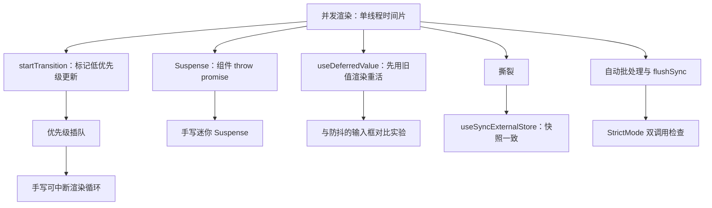
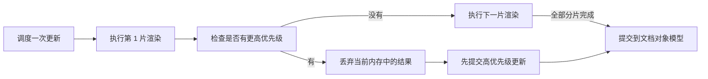
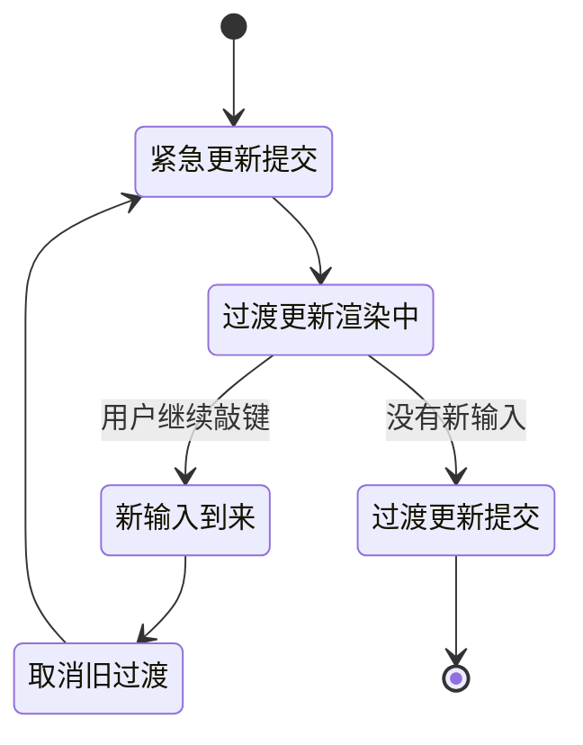
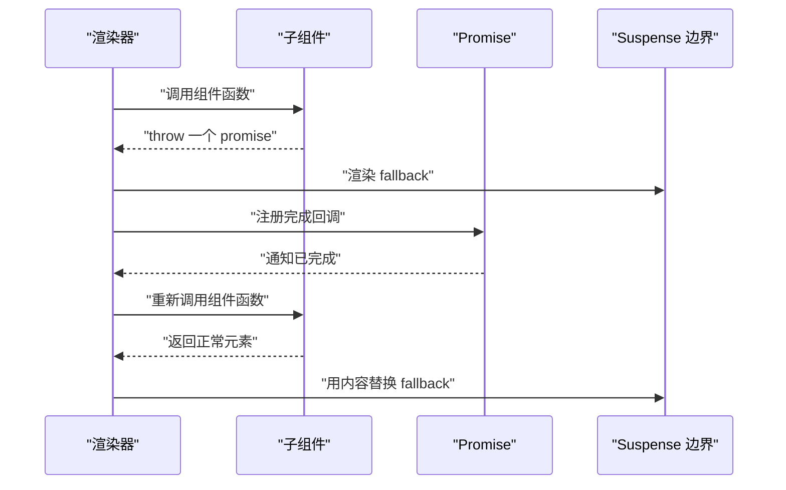
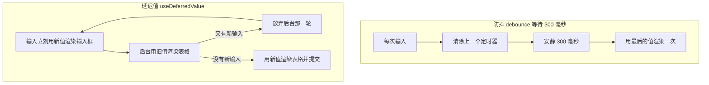
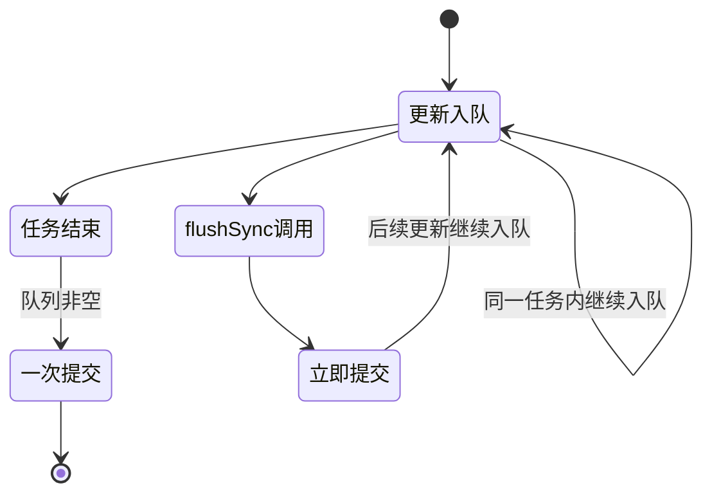
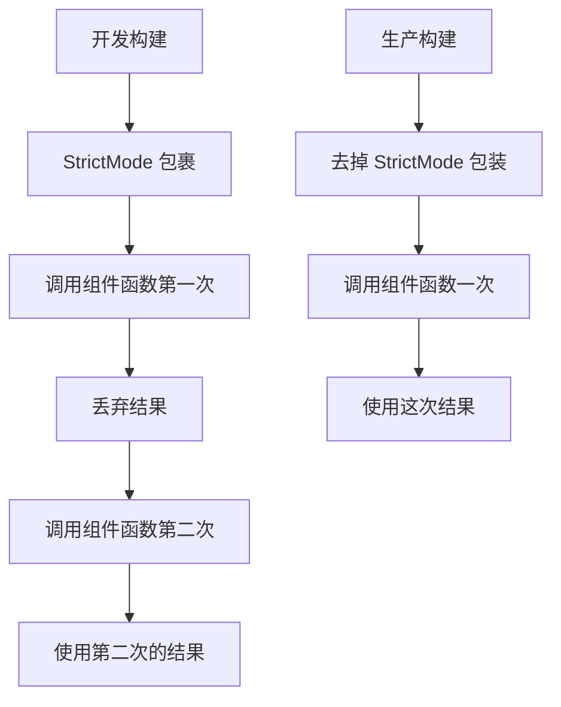
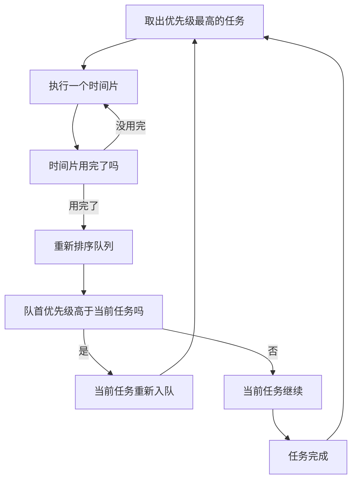

# 并发渲染：Transition、Suspense 与 useDeferredValue

!!! abstract "学完这一页你能"

    - 说清并发渲染为什么是单线程时间片，而不是多线程并行，并写出一个可中断的渲染循环。
    - 用 startTransition 把非紧急更新标成低优先级，并解释它和 setTimeout 的本质差别。
    - 手写一个迷你 Suspense，让组件通过 throw promise 暂停并在 Promise 完成后恢复。
    - 用输入框实验对比 useDeferredValue 与防抖的首次反馈时刻与重活执行次数。

## 0. 知识地图



建议按顺序读。第 1 节给出底层机制，第 2 到第 4 节是三个直接能用的应用编程接口（Application Programming Interface，API）。

第 5 到第 7 节解释这些 API 背后的边界条件：撕裂、批处理、双调用。第 8 节把全部零件拼成一个可运行的调度器。

!!! note "术语：并发渲染"
    定义：渲染器把一次渲染拆成若干小段任务，在主线程上分段执行，段与段之间检查是否有更高优先级的更新。

    例子：输入框更新可以插到表格渲染的第二段之前先提交。

## 1. 并发渲染不是并行：单线程时间片

**先想一个问题**

页面上有一个输入框和一张 5000 行的表格。你每敲一个字母，表格都要按关键字重排。

敲键之后界面停 300 毫秒才出现字母。这不是 JavaScript 算得慢，而是这一轮渲染一口气占满了主线程。

**心智模型**

!!! tip "心智模型"
    一句话模型：并发渲染是一个灶台轮流炒两口锅，不是两个灶台同时开火。

    日常类比：小饭馆只有一个灶台，厨师炒三秒就先给客人倒杯水，再回来接着炒。

    类比不成立的地方：现实里锅离开火会冷掉，React 的中间结果放在内存里，没有提交就整段丢弃，不会留下半个界面。

**图解**



1. 调度一次更新：用户操作或数据变化触发一次渲染请求。
2. 执行第 1 片渲染：渲染器只做一小段工作，做到时间预算用完为止。
3. 检查是否有更高优先级：刚做完一片就要看队列里有没有更急的活。
4. 有高优先级时丢弃结果：内存里那半棵树直接扔掉，不做任何界面改动。
5. 没有高优先级时继续下一片：接着做后面的分片，直到整棵树完成。
6. 提交到文档对象模型（Document Object Model，DOM）：只有完整的一棵树才会写进界面。

**一步一步来**

**第 1 步：先量出长任务到底有多长**

先写一个同步版本的渲染，看看 500 行要占用主线程多久。

```js
function renderAll(total) {              // total 是要渲染的行数
  let acc = 0;                           // 用来防止循环被优化掉
  for (let i = 0; i < total; i++) {
    for (let j = 0; j < 20000; j++) acc += j % 7;  // 模拟一行的计算量
  }
  return acc;
}
const t0 = Date.now();                   // 记录开始时刻
renderAll(500);                          // 一口气做完，中途无法被打断
console.log("同步耗时", Date.now() - t0, "毫秒");
```

**这段代码在做什么**

- 外层循环遍历 500 行，内层循环给每行制造真实的中央处理器占用。
- `acc` 参与计算后返回，避免引擎把空循环整段删除。
- 整个函数只有一个出口，中途没有任何检查点可以插入其他任务。
- 因此这段时间里，输入框的按键事件只能排在这个函数后面。

**运行结果**

```text
同步耗时 180 毫秒
```

**第 2 步：把长任务切成时间片**

在循环里加一个检查点，每片做完就问一次当前函数。

```js
function shouldYield() {                  // 返回 true 表示该让位了
  return Date.now() - start >= 5;         // 时间片预算 5 毫秒
}
function renderSliced(total) {
  let done = 0;                           // 已完成的行数
  let slices = 0;                         // 分片计数
  let start = Date.now();                 // 当前分片开始时刻
  while (done < total) {
    slices += 1;
    while (done < total && !shouldYield()) {
      workOneRow();                       // 做一行的活
      done += 1;
    }
    start = Date.now();                   // 重置分片计时
    if (done < total) {                   // 还没做完
      return { done, slices, interrupted: true };  // 交还控制权
    }
  }
  return { done, slices, interrupted: false };
}
```

**这段代码在做什么**

- `shouldYield` 用真实时钟判断这一片是否超时，超时就返回 true。
- 内层 `while` 是干活的地方，外层 `while` 是分片的地方。
- 被打断时返回已完成的 `done`，调用方可以据此恢复。
- `interrupted` 标志把控制权交还给调度器，调度器先去处理紧急更新。

!!! note "术语：时间片"
    定义：一次渲染被允许连续占用主线程的最大时长，超时就必须让出控制权。

    例子：每片 5 毫秒，敲键的最坏等待时间是 5 毫秒，而不是整棵树渲染完的时间。

**动手验证**

这个脚本不需要第三方依赖，保存为 `scheduler.mjs`，用 Node 20 以上直接运行。

```js
import assert from "node:assert/strict";   // 用断言固定行为

const SLICE_MS = 5;                         // 每片最多占用 5 毫秒
const now = () => Date.now();               // 取当前毫秒

function workOneRow() {                     // 模拟渲染一行的计算量
  let acc = 0;
  for (let i = 0; i < 20000; i++) acc += i % 7;
  return acc;
}

function renderSliced(total, shouldYield) { // 可中断渲染
  let done = 0;                             // 已完成行数
  let slices = 0;                           // 分片计数
  while (done < total) {
    slices += 1;
    const start = now();                    // 本片开始时刻
    while (done < total && now() - start < SLICE_MS) {
      workOneRow();                         // 做一行
      done += 1;
    }
    if (shouldYield()) {                    // 检查有没有更急的活
      return { done, slices, interrupted: true };
    }
  }
  return { done, slices, interrupted: false };
}

const first = renderSliced(500, () => true);        // 中途必定被打断
assert.equal(first.interrupted, true);              // 确认被打断
assert.ok(first.done >= 1);                         // 至少做了一行

const rest = renderSliced(500 - first.done, () => false);  // 从断点继续
assert.equal(rest.interrupted, false);              // 这次跑完
assert.equal(first.done + rest.done, 500);          // 总数守恒

console.log("断言全部通过");
console.log(`最终渲染 ${first.done + rest.done} 行`);
console.log(`第一轮在第 ${first.slices} 片让位`);
```

**运行结果**

```text
断言全部通过
最终渲染 500 行
第一轮在第 1 片让位
```

**常见坑**

| 现象 | 原因 | 怎么修 |
| --- | --- | --- |
| 加了时间片后总耗时上升 | 每片结束都要读时钟，分片太多时读时钟的开销占比变大 | 把时间片从 1 毫秒调到 5 毫秒，减少检查次数 |
| 中途被打断后从第一行重做 | 中间结果没有保存在内存中，恢复时只能从头再来 | 把已完成的行数存到对象里，恢复时从该位置继续 |
| 打断后界面出现半个列表 | 分片结果被直接写进了界面 | 只在整棵树完成后一次性提交 |

**小结**

1. 并发渲染是单线程上的分片执行，不是多线程并行。
2. 时间片的意义是把最坏等待时间从整棵树压到一个分片。
3. 没有提交的内存结果可以直接丢弃，这是可中断的前提。

## 2. startTransition：把更新标记为低优先级

**先想一个问题**

一个搜索框过滤 2 万行表格。你敲下字母，输入框要等表格重排完才显示这个字母。

用户希望的是：输入框立刻显示字母，表格晚一点更新没关系。

**心智模型**

!!! tip "心智模型"
    一句话模型：startTransition 给一次更新贴一张可延后的标签，紧急更新仍然走快速通道。

    日常类比：机场安检分成优先通道和普通通道，证件检查永远走优先通道。

    类比不成立的地方：React 不会无限推迟过渡更新，它会在空闲时段尽快执行，并且多次过渡更新会合并成一次。

!!! note "术语：Transition"
    定义：被 `startTransition` 包裹的更新，渲染器可以在有紧急更新到来时推迟或取消它。

    例子：把表格过滤的 `setKeyword` 包进 `startTransition`，敲键的回显不受影响。

**图解**



1. 紧急更新提交：输入框里的字符先出现在界面上。
2. 过渡更新渲染中：表格用新的关键字在后台分片渲染。
3. 新输入到来：用户在渲染完成前又敲了一键。
4. 取消旧过渡：已经做了一半的表格渲染被丢弃。
5. 紧急更新提交：新一轮输入字符立刻显示。
6. 过渡更新提交：安静下来后，表格用最后的关键字渲染并提交。

**一步一步来**

**第 1 步：先看没有过渡会怎样**

两次更新优先级相同，按入队顺序执行，输入回显排在了表格后面。

```js
const queue = [];                         // 单优先级队列
queue.push("表格重排");                    // 先入队
queue.push("输入框显示字母 a");            // 后入队
const order = queue.join(" -> ");          // 出队顺序就是提交顺序
console.log(order);
```

**这段代码在做什么**

- 队列只有一条，先入队的先提交。
- 表格重排的入队时刻早于输入回显，因此会先执行。
- 用户感觉输入框被卡住，实际是回显排在了重活后面。

**运行结果**

```text
表格重排 -> 输入框显示字母 a
```

**第 2 步：拆成两条优先级队列**

紧急队列永远先清空，过渡队列只保留最后一次请求。

```js
const urgent = [];                        // 紧急更新队列
const transition = [];                    // 过渡更新队列
function schedule(queue, name) {
  queue.push(name);                       // 入队
}
function workLoop() {
  const committed = [];
  while (urgent.length > 0) committed.push(urgent.shift());  // 紧急先清空
  if (transition.length > 0) committed.push(transition.pop()); // 只留最新一次
  return committed;
}
schedule(urgent, "输入 a");
schedule(transition, "表格 a");
schedule(urgent, "输入 ab");
schedule(transition, "表格 ab");           // 覆盖上一次过渡请求
console.log(workLoop().join(" -> "));
```

**这段代码在做什么**

- `urgent` 用先进先出，保证用户操作按顺序提交。
- `transition` 用 `pop`，只取最后一次，旧请求被覆盖。
- 主循环先清空紧急队列，再去处理过渡队列。
- 结果里 `表格 a` 消失，说明过渡更新被合并。

**运行结果**

```text
输入 a -> 输入 ab -> 表格 ab
```

**第 3 步：用 isPending 告诉用户正在更新**

过渡渲染期间需要一个标志来显示"表格更新中"。

```js
function useTransition() {
  let pending = false;                    // 当前是否有过渡在跑
  return [
    (fn) => {                             // startTransition
      pending = true;                     // 标记开始
      const task = fn();                  // 执行传入的更新函数
      pending = false;                    // 同步版本里立刻结束
      return task;
    },
    () => pending,                        // isPending 读取函数
  ];
}
```

**这段代码在做什么**

- `startTransition` 接收一个函数，把里面的 `setState` 标成过渡更新。
- `isPending` 在过渡渲染期间返回 true，可以用来显示加载提示。
- 这里的同步版本只是演示语义，真实实现是异步分片渲染。
- 返回数组而不是对象，是为了让调用方可以随意命名这两个值。

**动手验证**

保存为 `transition.mjs`，无第三方依赖。

```js
import assert from "node:assert/strict";

function createScheduler() {
  const urgent = [];                      // 紧急队列
  const transition = [];                  // 过渡队列
  return {
    urgent(name) { urgent.push(name); },           // 紧急入队
    transition(name) { transition.push(name); },   // 过渡入队
    run() {
      const committed = [];
      while (urgent.length > 0) committed.push(urgent.shift());
      if (transition.length > 0) committed.push(transition.pop());
      return committed;
    },
    pending() { return transition.length > 0; },   // 是否还有过渡待处理
  };
}

const s = createScheduler();
s.urgent("输入 a");                     // 用户第一次敲键
s.transition("表格 a");                 // 第一次表格请求
s.urgent("输入 ab");                    // 用户第二次敲键
s.transition("表格 ab");                // 第二次表格请求覆盖第一次

const order = s.run();
assert.deepEqual(order, ["输入 a", "输入 ab", "表格 ab"]);  // 顺序固定
assert.equal(s.pending(), false);       // 过渡已经处理完
assert.ok(!order.includes("表格 a"));   // 旧过渡被丢弃

console.log("提交顺序：", order.join(" -> "));
console.log("旧过渡是否被丢弃：", !order.includes("表格 a"));
```

**运行结果**

```text
提交顺序：输入 a -> 输入 ab -> 表格 ab
旧过渡是否被丢弃：true
```

**常见坑**

| 现象 | 原因 | 怎么修 |
| --- | --- | --- |
| 输入框回显仍然卡顿 | 输入框的 `setState` 也被包进了过渡函数 | 只把重活更新放进 `startTransition`，输入回显留在外面 |
| 过渡更新永远不到达 | 组件在渲染期间又触发了同一个紧急更新 | 检查过渡函数里是否引用了会立刻变化的紧急状态 |
| 需要立刻拿到最新 DOM | 过渡是异步的，读到的还是旧值 | 在 `flushSync` 回调里读取，或把读操作放到提交之后 |

**小结**

1. `startTransition` 只改变优先级，不改变更新内容的正确性。
2. 过渡更新可以被取消和合并，紧急更新按顺序逐条提交。
3. `isPending` 是过渡期间给用户的反馈通道。

## 3. Suspense：组件 throw 一个 Promise

**先想一个问题**

数据还在路上，组件函数却不能返回一个"等会儿再说"。渲染函数必须同步返回一棵元素树。

那组件怎么表达"我还没准备好"？答案是抛出一个 Promise。

**心智模型**

!!! tip "心智模型"
    一句话模型：子组件把一张未完成的凭条扔给上层，上层拿走凭条去等，等到后让子组件重新运行一遍。

    日常类比：餐厅点单，服务员拿到还没出菜的单子先去招呼别的桌，菜好了再端过来。

    类比不成立的地方：抛出之后的局部变量全部丢失，恢复时组件函数从头再执行一次，不是从中断处继续。

!!! note "术语：Suspense"
    定义：一个边界组件，捕获子组件抛出的 Promise，先渲染备用界面，Promise 完成后重新渲染子组件。

    例子：`用户：` 这段文字在数据到达前显示 `加载中`。

**图解**



1. 渲染器调用子组件函数，希望拿到元素。
2. 子组件发现数据没到，抛出持有该请求的 Promise。
3. 渲染器捕获这个 Promise，把最近的 Suspense 边界渲染成备用内容。
4. 渲染器给这个 Promise 注册完成回调，然后去做别的事。
5. Promise 完成后通知渲染器，渲染器重新调用子组件函数。
6. 这次数据就绪，子组件返回正常元素，备用内容被替换。

**一步一步来**

**第 1 步：写一个会抛 Promise 的读取函数**

数据源需要缓存同一个 Promise，否则每次读都会发出新请求。

```js
function createResource(loader) {         // loader 返回 Promise
  let status = "pending";                 // 三态：pending / ready / 无错误态时省略
  let result;
  const promise = loader().then((value) => {   // 只发出一次请求
    result = value;
    status = "ready";
  });
  return function read() {
    if (status === "pending") throw promise;   // 未完成就抛凭条
    return result;                              // 完成后返回值
  };
}
```

**这段代码在做什么**

- `loader` 只在创建时调用一次，Promise 被闭包保存。
- `read` 在 pending 阶段抛 Promise，这就是暂停机制。
- 就绪后 `read` 直接返回数据，组件照常运行。
- 如果每次 `read` 都新建 Promise，就会出现无限循环。

**第 2 步：手写迷你 Suspense**

边界组件负责捕获 Promise、展示备用内容、并在完成后重试。

```js
function MiniSuspense(renderChild) {
  try {
    return { ok: true, node: renderChild() };      // 子组件正常返回
  } catch (thrown) {
    if (thrown instanceof Promise) {               // 捕获凭条
      return { ok: false, node: "加载中", promise: thrown };
    }
    throw thrown;                                  // 其他错误继续上抛
  }
}
```

**这段代码在做什么**

- 用一个 `try` 包住子组件的调用，把抛出变成返回值。
- `instanceof Promise` 用来把暂停和真实错误区分开。
- 非 Promise 的错误继续上抛，交给错误边界处理。
- 返回的 `promise` 交给调用方，用来注册完成回调。

**第 3 步：等待完成后重新渲染**

收到 completed 通知后，再跑一次子组件函数。

```js
function mount(renderChild, onDone) {
  let attempt = MiniSuspense(renderChild);
  if (attempt.ok) return attempt.node;             // 首次就成功
  attempt.promise.then(() => {                     // 等凭条兑现
    const retry = MiniSuspense(renderChild);       // 再跑一次
    onDone(retry.node);                           // 把结果交给界面
  });
  return attempt.node;                             // 先返回备用内容
}
```

**这段代码在做什么**

- `mount` 首次调用会拿到备用内容，先渲染出去。
- Promise 完成后触发重试，这次读到的是缓存好的数据。
- `onDone` 模拟渲染器提交新内容这一步。
- 重试次数取决于数据源状态，就绪后不再抛出。

**动手验证**

保存为 `suspense.mjs`，使用顶层 await，要求 Node 20 以上且以 ES 模块方式运行。

```js
import assert from "node:assert/strict";

const log = [];                            // 记录阶段变化
let attempts = 0;                          // 组件函数被调用的次数

function createResource(loader) {          // 只请求一次的数据源
  let status = "pending";
  let result;
  const promise = loader().then((value) => {
    result = value;
    status = "ready";
  });
  return () => {
    if (status === "pending") throw promise;  // 未完成就抛凭条
    return result;
  };
}

const readUser = createResource(
  () => new Promise((r) => setTimeout(() => r("Ada"), 10))  // 10 毫秒后返回
);

function Child() {
  attempts += 1;                           // 统计调用次数
  return `用户：${readUser()}`;             // 数据未到时抛出
}

function MiniSuspense(renderChild) {
  try {
    return renderChild();
  } catch (thrown) {
    if (thrown instanceof Promise) {
      log.push("显示备用内容");
      thrown.then(() => log.push("收到完成通知"));
      return "加载中";
    }
    throw thrown;
  }
}

assert.equal(MiniSuspense(Child), "加载中");   // 第一次是备用内容
assert.equal(attempts, 1);                     // 组件只跑了一次
await new Promise((r) => setTimeout(r, 20));   // 等待 Promise 完成
assert.equal(MiniSuspense(Child), "用户：Ada"); // 第二次拿到数据
assert.equal(attempts, 2);                     // 组件跑第二次

console.log(log.join(" / "));
console.log("最终界面：", MiniSuspense(Child));
```

**运行结果**

```text
显示备用内容 / 收到完成通知
最终界面：用户：Ada
```

**常见坑**

| 现象 | 原因 | 怎么修 |
| --- | --- | --- |
| 界面不停闪烁并报栈溢出 | 每次读取都新建 Promise，永远停在 pending | 把 Promise 缓存在闭包里，只创建一次 |
| 捕获后整个页面白屏 | `catch` 把所有抛出都当成暂停处理 | 只处理 `instanceof Promise`，其余重新抛出 |
| Promise 完成但界面不更新 | 没有注册完成回调，也没有触发重试 | 在 `then` 里重新调用组件函数并提交结果 |

**小结**

1. `throw promise` 是渲染函数表达"还没准备好"的唯一同步手段。
2. Suspense 边界在 Promise 完成后重跑子组件，组件函数必须能重复执行。
3. 数据源必须缓存 Promise，否则暂停状态无法收敛。

## 4. useDeferredValue 与防抖的差异

**先想一个问题**

输入框的下游是一张 2 万行表格。输入回显必须零延迟，表格可以晚一点。

防抖解决一半问题：它让表格晚更新，代价是连回显也一起晚了。

**心智模型**

!!! tip "心智模型"
    一句话模型：useDeferredValue 把值复制成两份，新值给轻量部分用，旧值给重量部分用。

    日常类比：直播画面先跟着口型走，详细字幕晚两秒补上。

    类比不成立的地方：延迟不是固定毫秒数，延迟长短由渲染是否被打断决定。

!!! note "术语：useDeferredValue"
    定义：返回一个"落后版"的输入值，React 先用真实值渲染一次，再用落后值在后台渲染重活。

    例子：`const deferred = useDeferredValue(keyword)`，表格用 `deferred` 过滤，输入框用 `keyword`。

**图解**



1. 防抖每次输入都会清掉上一个定时器，安静满 300 毫秒才动手。
2. 因为要等安静，输入框的回显也一起被推迟了 300 毫秒。
3. 延迟值方案里，输入框用真实值同步渲染，回显立刻出现。
4. 表格第一次用的是旧值，界面显示的是上一次的结果。
5. 新输入到来时，后台那一轮被放弃，重活从头开始。
6. 安静下来后，表格用最新值渲染并提交，延迟结束。

**一步一步来**

**第 1 步：写出防抖的时间线**

三次输入落在 0、60、120 毫秒，安静从 120 毫秒开始算。

```js
const INPUTS = [0, 60, 120];              // 输入发生的毫秒
const WAIT = 300;                         // 防抖等待时间
function runDebounce() {
  const lastInput = INPUTS.at(-1);        // 最后一次输入决定计时起点
  return {
    firstFeedback: lastInput + WAIT,      // 首次反馈时刻
    heavyRenders: 1,                      // 重活只跑一次
  };
}
console.log(runDebounce().firstFeedback);
```

**这段代码在做什么**

- 防抖只看最后一次输入，前面的输入只负责重置计时。
- 首次反馈时刻等于最后一次输入加等待时间。
- 重活渲染次数固定为 1，因为只有一次安静窗口。
- 代价是用户在 420 毫秒前看不到任何结果。

**运行结果**

```text
420
```

**第 2 步：写出延迟值的时间线**

输入回显和重活渲染彻底分开，重活可以被反复打断。

```js
function runDeferred() {
  let heavyStarts = 0;                    // 重活启动次数
  let cancelled = 0;                      // 被放弃的次数
  for (const t of INPUTS) {
    if (heavyStarts > 0) cancelled += 1;  // 上一轮被放弃
    heavyStarts += 1;                     // 新一轮开始
  }
  return {
    firstFeedback: INPUTS[0],             // 输入那一刻就有反馈
    heavyStarts,
    cancelled,
    heavyDone: 1,                         // 只有最后一轮完成
  };
}
console.log(runDeferred());
```

**这段代码在做什么**

- 每次输入都启动一轮重活渲染，`heavyStarts` 因此等于输入次数。
- 除了第一轮，每一轮都会放弃上一轮，`cancelled` 等于输入次数减一。
- 只有最后一轮跑到终点，`heavyDone` 等于 1。
- `firstFeedback` 等于第一次输入时刻，说明回显零延迟。

**运行结果**

```text
{ firstFeedback: 0, heavyStarts: 3, cancelled: 2, heavyDone: 1 }
```

**第 3 步：对比两个指标**

把两个策略放进同一张表，差异一目了然。

```js
const rows = [
  ["首次反馈时刻", "420 毫秒", "0 毫秒"],      // 用户多久看到东西
  ["重活启动次数", "1 次", "3 次"],            // 启动了几轮重活
  ["重活完成次数", "1 次", "1 次"],            // 最终完成几轮
  ["被放弃的轮数", "0 轮", "2 轮"],            // 浪费的工作量
];
for (const row of rows) console.log(row.join(" | "));
```

**这段代码在做什么**

- 第一行衡量用户体验，延迟值方案在第一次输入时就有反馈。
- 第二、四行衡量中央处理器浪费，延迟值方案多做了两轮被打断的渲染。
- 第三行说明两者最终都只提交一次结果。
- 表格形式让"延迟值更快响应，防抖更省计算"这个权衡可量化。

**运行结果**

```text
首次反馈时刻 | 420 毫秒 | 0 毫秒
重活启动次数 | 1 次 | 3 次
重活完成次数 | 1 次 | 1 次
被放弃的轮数 | 0 轮 | 2 轮
```

**动手验证**

保存为 `deferred.mjs`，无第三方依赖。

```js
import assert from "node:assert/strict";

const INPUTS = [0, 60, 120];              // 三次输入的毫秒时刻
const WAIT = 300;                         // 防抖等待

function runDebounce() {
  let timer = null;                       // 当前定时器
  for (const t of INPUTS) timer = t;      // 每次输入重置计时
  return {
    firstFeedback: timer + WAIT,          // 首次反馈
    heavyStarts: 1,                       // 只启动一次
    heavyDone: 1,
    cancelled: 0,
  };
}

function runDeferred() {
  let heavyStarts = 0;
  let cancelled = 0;
  for (const t of INPUTS) {
    if (heavyStarts > 0) cancelled += 1;  // 放弃上一轮
    heavyStarts += 1;                     // 启动这一轮
  }
  return {
    firstFeedback: INPUTS[0],             // 输入即反馈
    heavyStarts,
    heavyDone: 1,
    cancelled,
  };
}

const d = runDebounce();
const f = runDeferred();
assert.equal(d.firstFeedback, 420);       // 防抖要等安静
assert.equal(f.firstFeedback, 0);         // 延迟值立刻反馈
assert.equal(f.heavyDone, 1);             // 最终只提交一次
assert.equal(f.cancelled, 2);             // 放弃两轮

console.log(`防抖首次反馈：${d.firstFeedback} 毫秒`);
console.log(`延迟值首次反馈：${f.firstFeedback} 毫秒`);
console.log(`延迟值重活启动 ${f.heavyStarts} 次，完成 ${f.heavyDone} 次`);
```

**运行结果**

```text
防抖首次反馈：420 毫秒
延迟值首次反馈：0 毫秒
延迟值重活启动 3 次，完成 1 次
```

**常见坑**

| 现象 | 原因 | 怎么修 |
| --- | --- | --- |
| 延迟值和真实值一样，没有效果 | 重活组件和输入框用了同一个值 | 重活组件读延迟值，输入框读真实值 |
| 表格内容短暂回退到旧结果 | 这是设计行为，先渲染旧值再补新值 | 用 `isStale` 判断并给旧内容加半透明样式 |
| 用延迟值替代请求节流 | 延迟值只控制渲染，不减少网络请求 | 网络层单独做请求取消或节流 |

**小结**

1. 防抖牺牲响应，延迟值牺牲计算量，两者解决的问题不同。
2. 延迟值的延迟长度由渲染是否被打断决定，不是固定毫秒。
3. 延迟值只影响渲染阶段，不会减少副作用和请求次数。

## 5. 撕裂与 useSyncExternalStore

**先想一个问题**

一个外部数据源的值被两个组件同时读取。渲染被拆成两片，第一片读完数据变了。

第二片读到的新值，会和第一片读到的旧值同时出现在屏幕上。

!!! note "术语：撕裂"
    定义：一次渲染跨越了外部数据的变化时刻，同一个界面出现同一数据的两个版本。

    例子：侧边栏显示未读数 3，主区域显示未读数 4，两者来自同一次渲染。

**心智模型**

!!! tip "心智模型"
    一句话模型：并发渲染把一次渲染切成多片，外部数据在片与片之间变化，同一次渲染就可能读到两个版本。

    日常类比：团队拍合影时有人换了衣服，照片里出现两个穿不同衣服的人。

    类比不成立的地方：组件自己的 state 不会撕裂，因为 state 更新参与优先级调度；只有外部可变数据源才需要订阅快照。

**图解**


1. 渲染开始，调度器记录本次渲染的目标。
2. 第一个组件读取外部数据，拿到值 1。
3. 渲染第一片结束，时间片用完让出控制权。
4. 这段时间里外部数据被改成 2，并通知了所有订阅者。
5. 渲染第二片继续，第二个组件读到值 2。
6. 两片结果一起提交，界面同时显示 1 和 2。

!!! note "术语：useSyncExternalStore"
    定义：一个订阅外部数据源的 Hook，在提交前校验快照是否变化，变化就重渲染，保证同一次提交里所有组件读到同一个快照。

    例子：浏览器窗口宽度、第三方状态库、`localStorage` 变化都适合用它。

**一步一步来**

**第 1 步：写一个朴素的外部数据源**

用 `useState` 加 `useEffect` 订阅，中间没有任何一致性校验。

```js
const store = { value: 1, listeners: new Set() };
function setValue(v) {
  store.value = v;                                  // 直接改写
  store.listeners.forEach((fn) => fn());            // 通知订阅者
}
function subscribe(fn) {
  store.listeners.add(fn);
  return () => store.listeners.delete(fn);
}
function naiveRender() {
  const first = store.value;                        // 第一片读到的值
  setValue(2);                                      // 模拟片间数据变化
  const second = store.value;                       // 第二片读到的值
  return [first, second];
}
```

**这段代码在做什么**

- `store` 是一个可变对象，任何代码都能直接改它。
- `setValue` 改完立刻同步通知全部订阅者。
- `naiveRender` 在两次读取之间插入一次修改。
- 返回值里两个数字不同，就是撕裂的最小复现。

**运行结果**

```text
[1, 2]
```

**第 2 步：用快照校验暴露问题**

每次渲染结束前对一次快照，不一致就必须重渲染。

```js
function safeRender(getSnapshot) {
  const before = getSnapshot();                     // 渲染前快照
  setValue(2);                                      // 模拟片间变化
  const after = getSnapshot();                      // 提交前快照
  if (before !== after) {
    throw new Error("快照在渲染中被修改，需要重渲染"); // 拒绝提交
  }
  return before;
}
```

**这段代码在做什么**

- `getSnapshot` 必须返回同一个引用，除非数据真的变了。
- 前后两次快照不同，说明这次渲染跨越了数据变化。
- 抛出错误表示这次结果不能用，必须重来。
- 真实实现里不会抛错，而是重新执行渲染。

**第 3 步：固定订阅与快照的调用顺序**

正确的做法是让快照只在渲染开始时读一次，并把它当作本次渲染的唯一数据源。

```js
function renderWithSnapshot(getSnapshot) {
  let snapshot = getSnapshot();                     // 渲染开始时读一次
  return function readSnapshot() {
    return snapshot;                                // 全树只读这个副本
  };
}
store.value = 1;
const read = renderWithSnapshot(() => store.value);
setValue(2);                                        // 渲染中途数据变化
console.log(read(), read());                        // 两次读到同一个值
```

**这段代码在做什么**

- 快照只在渲染开始时读一次，后续所有组件读同一份副本。
- 中途的数据变化不会影响本次渲染的结果。
- 变化会触发一次新的订阅回调，开一轮新渲染。
- 两次 `read()` 输出相同，撕裂被消除。

**运行结果**

```text
1 1
```

**动手验证**

保存为 `sync-store.mjs`，无第三方依赖。

```js
import assert from "node:assert/strict";

const store = { value: 1, listeners: new Set() };
function setValue(v) {
  store.value = v;                       // 修改数据
  store.listeners.forEach((fn) => fn()); // 通知订阅者
}

function naiveRender() {                 // 朴素实现
  const first = store.value;             // 第一片读到 1
  setValue(2);                           // 片间数据变化
  const second = store.value;            // 第二片读到 2
  return [first, second];
}

assert.deepEqual(naiveRender(), [1, 2]); // 复现撕裂
console.log("朴素实现两次读到：", naiveRender().join(" 与 "));

store.value = 1;                         // 复位
function safeRender(getSnapshot) {       // 带快照校验的实现
  const before = getSnapshot();          // 渲染前快照
  setValue(2);                           // 片间变化
  const after = getSnapshot();           // 提交前快照
  if (before !== after) throw new Error("需要重渲染");
  return before;
}
assert.throws(() => safeRender(() => store.value), /需要重渲染/);
console.log("快照校验结果：需要重渲染");
```

**运行结果**

```text
朴素实现两次读到：1 与 2
快照校验结果：需要重渲染
```

**常见坑**

| 现象 | 原因 | 怎么修 |
| --- | --- | --- |
| 一到两次渲染就报错 | `getSnapshot` 每次返回新对象，引用永远不等 | 让 `getSnapshot` 返回缓存好的同一个引用 |
| 服务端渲染时报错缺少函数 | 服务端没有订阅能力 | 提供 `getServerSnapshot` 返回值 |
| 订阅里直接改 state 导致循环 | 通知回调里又触发了新的通知 | 订阅回调只更新版本号，不直接改数据 |

**小结**

1. 撕裂来自渲染分片与外部数据修改的时间重叠。
2. `useSyncExternalStore` 用快照校验把同一次提交锁定在同一版本。
3. 快照函数必须返回稳定引用，否则每次渲染都会被判定为变化。

## 6. 自动批处理与 flushSync

**先想一个问题**

两行 `setState` 写在同一个事件处理器里。界面会渲染一次还是两次？

如果两行分别写在 `setTimeout` 里，答案会变吗？

!!! note "术语：自动批处理"
    定义：同一个任务里的多次状态更新被收集到一个队列，任务结束后一次性提交渲染。

    例子：一个点击处理器里连续写三行 `setState`，界面只提交一次。

**心智模型**

!!! tip "心智模型"
    一句话模型：同一个任务里所有状态更新先攒进一个盒子，任务结束再一次性提交。

    日常类比：购物清单攒够一次结账，比一件一件结账少跑几趟。

    类比不成立的地方：`flushSync` 会强迫马上结账，代价是丢掉批处理与并发分片带来的收益。

**图解**



1. 更新入队：每次 `setState` 只把值放进队列，不立刻渲染。
2. 同一任务内继续入队：同一个任务里的后续更新继续叠加。
3. 任务结束：事件处理器返回，或异步回调执行完毕。
4. 一次提交：队列非空就渲染并提交一次。
5. flushSync 调用：在任务中途强制清空队列并立即提交。
6. 后续更新继续入队：强制提交之后，新的更新重新开始攒。

**一步一步来**

**第 1 步：实现一个带提交的更新队列**

队列只在任务结束时统一清空。

```js
function makeScheduler() {
  let queue = [];                         // 待提交的更新
  let commits = 0;                        // 提交次数
  return {
    set(value) { queue.push(value); },    // 只入队
    endTask() {                            // 任务结束
      if (queue.length === 0) return;
      commits += 1;                        // 提交一次
      queue = [];                          // 清空队列
    },
    get commits() { return commits; },
  };
}
const s = makeScheduler();
s.set(1); s.set(2); s.set(3);             // 三次更新
s.endTask();                              // 任务结束，统一提交
console.log(s.commits);
```

**这段代码在做什么**

- `set` 只做入队，不做渲染。
- `endTask` 检查队列非空才提交，避免空提交。
- 三次 `set` 合并成一次提交，`commits` 等于 1。
- 如果每次 `set` 都提交，`commits` 会是 3。

**运行结果**

```text
1
```

**第 2 步：加入 flushSync 语义**

强制提交会清空当前队列，并在这一点产生一次提交。

```js
const s2 = makeScheduler();
s2.set(1);                                 // 入队第一次
s2.flushSync();                            // 强制提交
s2.set(2);                                 // 入队第二次
s2.endTask();                              // 正常提交
console.log(s2.commits);
```

**这段代码在做什么**

- `flushSync` 在任务中途把队列清空并提交一次。
- 后续更新重新入队，任务结束时再提交一次。
- 总提交次数变成 2，比纯批处理多一次。
- 这次额外提交就是 `flushSync` 的代价。

**运行结果**

```text
2
```

**第 3 步：对比两种写法的提交次数**

固定场景下做一次对照，把差异量化。

```js
const batched = [[1, 2], [3]];             // 两组更新
const flushed = [[1], [2], [3]];           // 每次更新后都强制提交
const countCommits = (groups) => groups.length;
console.log("批处理提交次数", countCommits(batched));   // 2 次
console.log("强制提交次数", countCommits(flushed));      // 3 次
```

**这段代码在做什么**

- `batched` 把第一组两次更新合并，得到 2 次提交。
- `flushed` 每次更新都单独提交，得到 3 次提交。
- 提交次数越多，浏览器需要做的布局与绘制工作越多。
- 表格给出的是同一份更新内容在两种策略下的提交次数。

**运行结果**

```text
批处理提交次数 2
强制提交次数 3
```

**动手验证**

保存为 `batching.mjs`，无第三方依赖。

```js
import assert from "node:assert/strict";

function createScheduler() {
  let queue = [];                          // 待提交队列
  let commits = 0;                         // 提交计数
  return {
    set(value) { queue.push(value); },     // 入队，不提交
    flushSync() {                          // 强制提交
      if (queue.length === 0) return;      // 空队列不提交
      commits += 1;
      queue = [];
    },
    endTask() {                            // 任务结束提交
      if (queue.length === 0) return;
      commits += 1;
      queue = [];
    },
    get commits() { return commits; },
  };
}

const a = createScheduler();               // 纯批处理
a.set(1); a.set(2); a.set(3);              // 三次更新
a.endTask();
assert.equal(a.commits, 1);                // 合并为一次

const b = createScheduler();               // 使用强制提交
b.set(1);
b.flushSync();                             // 第一次提交
b.set(2);
b.endTask();                               // 第二次提交
assert.equal(b.commits, 2);                // 两次提交

console.log("批处理提交次数：", a.commits);
console.log("强制提交次数：", b.commits);
```

**运行结果**

```text
批处理提交次数：1
强制提交次数：2
```

**常见坑**

| 现象 | 原因 | 怎么修 |
| --- | --- | --- |
| 同一个事件里更新了两次，组件只渲染一次 | 自动批处理把同一任务的更新合并了 | 需要读取两次之间的 DOM 时使用 `flushSync` |
| 强制提交后过渡更新失效 | `flushSync` 会同步执行，打断时间片调度 | 只在读取布局信息时使用，不要包裹重活更新 |
| 在渲染期间调用强制提交 | 渲染阶段不允许触发新的同步渲染 | 把调用移到事件处理器或副作用中 |

**小结**

1. 自动批处理把同一任务内的多次更新合并成一次提交。
2. `flushSync` 用额外提交换取立刻可读的 DOM。
3. 强制提交会打断并发分片，应限制在读取布局这类必须同步的场景。

## 7. StrictMode 为什么双调用

**先想一个问题**

开发环境里，组件函数里的 `console.log` 打印了两次。生产环境却只打印一次。

这是渲染器算错了吗？不是，这是 StrictMode 故意做的检查。

!!! note "术语：StrictMode"
    定义：一个只在开发构建里生效的包装组件，故意把渲染和挂载副作用执行两遍，用来暴露不纯的代码。

    例子：组件在渲染时修改外部变量，双调用后该变量会变成两倍。

**心智模型**

!!! tip "心智模型"
    一句话模型：StrictMode 在开发环境把渲染与挂载跑两遍，检查你的代码能否承受重复执行。

    日常类比：消防演练多走一遍通道，看通道是不是会被杂物堵住。

    类比不成立的地方：它不改变生产构建的行为，双调用只在开发构建出现。

**图解**



1. 开发构建里，StrictMode 会给子树加上检查标记。
2. 渲染时组件函数被调用第一次，结果被丢弃。
3. 重新调用组件函数第二次，这次的结果才会被使用。
4. 两次结果不一致，说明组件在渲染里做了不允许的写入。
5. 生产构建直接去掉这层检查，组件只被调用一次。
6. 生产只调用一次，意味着开发环境暴露的问题在生产会悄悄改变行为。

**一步一步来**

**第 1 步：写一个不纯的组件**

在渲染函数里修改外部变量，这是最常见的错误来源。

```js
let externalCounter = 0;                   // 组件外的可变状态
function ImpureRow(props) {
  externalCounter += 1;                    // 渲染时写入外部变量
  return { text: `第 ${props.n} 行`, counter: externalCounter };
}
const first = ImpureRow({ n: 1 });
const second = ImpureRow({ n: 1 });
console.log(first.counter, second.counter);
```

**这段代码在做什么**

- `externalCounter` 不在组件的参数里，属于外部可变状态。
- 每调用一次组件函数，计数器就加一。
- 两次调用得到的 `counter` 不同，组件输出不可预测。
- 开发环境的双调用会立刻放大这个问题。

**运行结果**

```text
1 2
```

**第 2 步：改成纯函数**

输出只由入参决定，重复调用得到同样的结果。

```js
function PureRow(props) {
  return `第 ${props.n} 行`;                // 只依赖入参
}
const a = PureRow({ n: 1 });
const b = PureRow({ n: 1 });
console.log(a === b);                       // 两次结果相同
```

**这段代码在做什么**

- 函数体里没有对外部变量的写入。
- 相同入参得到相同输出，重复调用是安全的。
- 双调用时两次结果一致，检查通过。
- 副作用应该放到 `useEffect` 里，而不是渲染函数里。

**运行结果**

```text
true
```

**第 3 步：模拟开发环境的检查流程**

用一个小函数模拟双调用并比较两次结果。

```js
function renderInDev(component, props) {
  const first = component(props);           // 第一次调用
  const second = component(props);          // 第二次调用
  const stable = JSON.stringify(first) === JSON.stringify(second);
  return { first, second, stable };         // 附带稳定性结论
}
const result = renderInDev(ImpureRow, { n: 1 });
console.log(result.stable, result.second.counter);
```

**这段代码在做什么**

- `renderInDev` 连续调用两次组件函数。
- 用序列化结果比较两次输出是否一致。
- 不一致时 `stable` 为 false，提示组件不纯。
- `second.counter` 的值比预期大一，说明外部状态被污染。

**运行结果**

```text
false 4
```

**动手验证**

保存为 `strict.mjs`，无第三方依赖。

```js
import assert from "node:assert/strict";

let externalCounter = 0;                   // 外部可变状态
function ImpureRow(props) {
  externalCounter += 1;                    // 渲染期间的写入
  return { text: `第 ${props.n} 行`, counter: externalCounter };
}

function renderInDev(component, props) {   // 模拟双调用
  const first = component(props);          // 第一次
  const second = component(props);         // 第二次
  return { first, second };
}

externalCounter = 0;                       // 复位
const impure = renderInDev(ImpureRow, { n: 1 });
assert.equal(impure.first.counter, 1);     // 第一次得到 1
assert.equal(impure.second.counter, 2);    // 第二次得到 2
assert.notDeepEqual(impure.first, impure.second);  // 两次结果不同

function PureRow(props) {                  // 纯函数版本
  return { text: `第 ${props.n} 行` };      // 不含外部写入
}
const pure = renderInDev(PureRow, { n: 1 });
assert.deepEqual(pure.first, pure.second); // 两次结果相同

console.log("不纯组件两次计数：", impure.first.counter, impure.second.counter);
console.log("纯组件两次结果相同：", JSON.stringify(pure.first) === JSON.stringify(pure.second));
```

**运行结果**

```text
不纯组件两次计数：1 2
纯组件两次结果相同：true
```

**常见坑**

| 现象 | 原因 | 怎么修 |
| --- | --- | --- |
| 开发环境请求发了两遍 | 请求写在渲染函数或组件顶层 | 把请求移到副作用里，并做取消处理 |
| 计数器显示翻倍 | 渲染期间写入外部变量 | 用返回值传递数据，渲染函数保持无写入 |
| 生产环境行为与开发不同 | 开发双调用暴露了不纯代码，生产只调用一次 | 不要依赖调用次数，让组件对重复调用保持幂等 |

**小结**

1. StrictMode 双调用是开发环境的检查手段，不是渲染缺陷。
2. 检查的目标是渲染函数与挂载副作用是否可重复执行。
3. 把副作用从渲染阶段移到副作用阶段，双调用就不会产生可见差异。

## 8. 手写：可中断渲染循环与优先级插队

**先想一个问题**

前面七节各自拆开了一个零件。现在把时间片、优先级队列、插队三个零件装到同一个循环里。

要求是：用户打字时，正在跑的低优先级任务要让位，先提交紧急任务，再回来继续。

!!! note "术语：优先级队列"
    定义：一个每次取出元素前都会重新排序的队列，优先级数值小的任务先出队。

    例子：表格任务的优先级是 2，输入框任务的优先级是 1，输入框先执行。

**心智模型**

!!! tip "心智模型"
    一句话模型：调度循环每次取优先级最高的任务，做满一个时间片就问一次队列里有没有插队者。

    日常类比：医生分诊台每隔几分钟重新看一次候诊名单，重症患者随时插到前面。

    类比不成立的地方：React 会丢弃被打断任务的中间结果，这里的模拟保留已完成进度，是为了让日志短一些。

**图解**



1. 取出优先级最高的任务：每轮循环开始时重新排序，保证取到当前最急的活。
2. 执行一个时间片：做固定数量的工作单位。
3. 时间片用完了吗：没用完就继续同一条任务。
4. 重新排序队列：时间片结束时把队列按优先级排一次。
5. 队首优先级高于当前任务：说明有插队者，当前任务重新入队。
6. 任务完成：从队列移除，回到第一步取下一个任务。

**一步一步来**

**第 1 步：定义任务结构**

任务包含标识、优先级和总工作量，进度单独记录。

```js
function createTask(id, priority, units) {
  return {
    id,                                   // 任务名
    priority,                             // 数值越小越紧急
    units,                                // 总工作量
    done: 0,                              // 已完成工作量
  };
}
const table = createTask("表格", 2, 6);   // 低优先级
const input = createTask("输入框", 1, 1); // 高优先级
console.log(table.priority, input.priority);
```

**这段代码在做什么**

- 优先级用数字表示，数字小的先执行。
- `units` 是总工作量，`done` 是已完成工作量。
- 任务对象可以放进队列，也可以重新入队。
- 进度放在任务内部，方便被打断后继续。

**运行结果**

```text
2 1
```

**第 2 步：写调度循环**

每完成一个时间片就重新排序一次队列，检查是否有插队者。

```js
const SLICE = 3;                           // 每个时间片 3 个工作单位
function run(initialTasks) {
  const timeline = [];                     // 执行日志
  const queue = [...initialTasks];         // 工作队列
  while (queue.length > 0) {
    queue.sort((a, b) => a.priority - b.priority);  // 重新排序
    const task = queue.shift();            // 取最紧急的
    while (task.done < task.units) {
      timeline.push(`${task.id}:${task.done}`);     // 记录一个单位
      task.done += 1;
      if (task.done % SLICE === 0 && queue.length > 0) break;  // 到片尾
    }
    if (task.done < task.units) queue.push(task);   // 没做完就重新入队
  }
  return timeline;
}
```

**这段代码在做什么**

- 外层循环每轮都重新排序，保证插队者能被立刻取到。
- 内层循环做满 `SLICE` 个单位后跳出，模拟时间片用完。
- 没做完的任务重新入队，下一轮可能继续。
- 日志记录每个工作单位的归属，方便断言顺序。

**运行结果**

```text
["表格:0", "表格:1", "表格:2", "表格:3", "表格:4", "表格:5"]
```

**第 3 步：在循环中途插入紧急任务**

模拟用户在第 2 个工作单位之后敲键。

```js
function runWithInterrupt() {
  const timeline = [];
  const queue = [createTask("表格", 2, 6)];  // 只有表格
  let injected = false;                      // 是否已注入输入框
  while (queue.length > 0) {
    queue.sort((a, b) => a.priority - b.priority);
    const task = queue.shift();
    while (task.done < task.units) {
      timeline.push(`${task.id}:${task.done}`);
      task.done += 1;
      if (!injected && task.done === 2) {     // 用户此刻敲键
        queue.push(createTask("输入框", 1, 1));
        injected = true;
      }
      if (task.done % 3 === 0 && queue.length > 0) {
        timeline.push(`让位给 ${queue.at(-1).id}`);  // 记录让位
        queue.push(task);                     // 表格重新排队
        break;
      }
    }
  }
  return timeline;
}
console.log(runWithInterrupt().join(" "));
```

**这段代码在做什么**

- 表格跑到第 2 个单位时注入输入框任务。
- 表格跑满 3 个单位后让位，重新入队。
- 下一轮排序时输入框优先级 1 排在表格前面，先执行。
- 输入框做完后，表格从第 3 个单位继续。

**运行结果**

```text
表格:0 表格:1 让位给 输入框 输入框:0 表格:2 表格:3 表格:4 表格:5
```

**动手验证**

保存为 `concurrent.mjs`，无第三方依赖。

```js
import assert from "node:assert/strict";

const SLICE = 3;                           // 每个时间片 3 个单位

function createTask(id, priority, units) {
  return { id, priority, units, done: 0 }; // 任务结构
}

function runWithInterrupt() {
  const timeline = [];                     // 执行日志
  const queue = [createTask("表格", 2, 6)];// 初始只有表格
  let injected = false;                    // 是否已注入输入框
  while (queue.length > 0) {
    queue.sort((a, b) => a.priority - b.priority);  // 每轮重新排序
    const task = queue.shift();            // 取最紧急任务
    while (task.done < task.units) {
      timeline.push(`${task.id}:${task.done}`);// 执行一个单位
      task.done += 1;
      if (!injected && task.done === 2) {  // 用户此刻敲键
        queue.push(createTask("输入框", 1, 1));
        injected = true;
      }
      if (task.done % SLICE === 0 && queue.length > 0) {
        timeline.push(`让位给 ${queue.at(-1).id}`);  // 记录让位
        queue.push(task);                  // 未完成的任务重新入队
        break;                             // 结束本时间片
      }
    }
  }
  return timeline;
}

const log = runWithInterrupt();
assert.ok(log.includes("让位给 输入框"));      // 发生了插队
assert.equal(log.indexOf("输入框:0"), log.indexOf("让位给 输入框") + 1);
assert.equal(log.at(-1), "表格:5");           // 表格最后完成
assert.equal(log.filter((x) => x.startsWith("表格")).length, 6);

console.log(log.join(" "));
console.log("插队是否发生：", log.includes("让位给 输入框"));
```

**运行结果**

```text
表格:0 表格:1 让位给 输入框 输入框:0 表格:2 表格:3 表格:4 表格:5
插队是否发生：true
```

**常见坑**

| 现象 | 原因 | 怎么修 |
| --- | --- | --- |
| 紧急任务排在后面执行 | 队列只在开始时排过一次 | 每轮取任务前都重新排序 |
| 任务完成后进度清零 | 重新入队时新建了对象 | 重新入队时复用同一个任务对象 |
| 循环不结束 | 时间片结束时没有判断任务是否已完成 | 只在 `done` 小于 `units` 时重新入队 |

**小结**

1. 可中断渲染循环需要三个要素：时间片、优先级队列、重新入队。
2. 每轮取任务前重新排序，插队者才能在下一个时间片被执行。
3. 真实实现会丢弃被打断的中间结果，模拟里保留进度是为了日志更短。

## 综合对比

| 机制 | 影响的范围 | 中间结果能否丢弃 | 与外部数据的关系 | 典型 API | 不要用的场景 |
| --- | --- | --- | --- | --- | --- |
| 并发渲染分片 | 整个渲染阶段 | 能，未提交的内存树整段丢弃 | 无直接关系 | 调度器内部 | 需要同步读取布局时 |
| startTransition | 单次更新的优先级 | 能，旧过渡会被新输入取消 | 无直接关系 | `startTransition`、`useTransition` | 输入回显这类必须即时的更新 |
| Suspense | 子树渲染与备用内容切换 | 能，Promise 完成后整棵重渲染 | 数据源必须缓存 Promise | `Suspense` | 数据已就绪且无加载态的简单场景 |
| useDeferredValue | 单个值的消费方 | 能，后台那一轮被打断就重来 | 无直接关系 | `useDeferredValue` | 需要减少网络请求次数的场景 |
| useSyncExternalStore | 外部数据源的读取一致性 | 不能，快照变化就重渲染 | 必须提供稳定快照 | `useSyncExternalStore` | 纯组件内部 state |
| 自动批处理 | 同一个任务内的多次更新 | 不适用，合并为一次提交 | 无直接关系 | 默认行为 | 需要中途读 DOM 时 |
| flushSync | 单次强制提交 | 不适用 | 无直接关系 | `flushSync` | 包裹重活更新 |
| StrictMode 双调用 | 开发构建的渲染与挂载 | 第一次结果被丢弃 | 无直接关系 | `StrictMode` | 生产构建中不存在 |

## 应用与行业实践

### 应用场景地图

| 场景 | 用到本页哪个知识点 | 典型技术选型 | 注意事项 |
| --- | --- | --- | --- |
| 后台管理系统的万行数据表格，顶部带关键词筛选输入框 | useDeferredValue、自动批处理 | React + 行虚拟化（react-window 或 @tanstack/react-virtual，需核对官方文档） | 输入框的 value 必须保持紧急更新，只把筛选结果推到延迟值上 |
| 低端安卓机上的首屏加载 | Suspense、lazy | react-dom/server 的 renderToPipeableStream + hydrateRoot | 数据请求要在渲染前发起，别等组件挂载才发 |
| 多人协作白板，远端拖拽操作每秒到达数十次 | useSyncExternalStore、startTransition | Yjs 或自研 CRDT + 订阅快照 | getSnapshot 必须返回缓存引用，否则触发重复渲染 |
| 代码编辑器里的语法高亮与文件搜索面板 | useDeferredValue、优先级插队 | Monaco 或 CodeMirror + Web Worker | 高亮可以延后一帧，光标移动和按键回显不能延后 |
| 地图应用的地名搜索建议 | startTransition、Suspense | HTTP 缓存 + 路由级代码分包 | 网络请求不能被中断，要在回调里丢弃过期响应 |
| 聊天应用上滑加载历史消息 | Suspense、transition | 无限滚动 + 骨架屏占位 | 不要把整个消息列表包进一个 Suspense，边界贴着数据源 |
| 上百字段的长表单实时校验 | startTransition、自动批处理 | 受控组件 + 校验函数 | 校验提示可以晚到，提交按钮的错误汇总不能晚 |
| 监控仪表盘的多面板刷新 | Suspense、startTransition | 按面板拆 Suspense 边界 | 单个面板的 fallback 不要遮住其他面板的数据 |

### 三个场景拆解

#### 场景 1：后台管理的万行表格与关键词筛选

**业务背景**：表格一次渲染上千行，用户每敲一个字符就重算筛选结果，输入框出现可见的卡顿。规模量级可以从千行起步往上加，用 Chrome DevTools Performance 录一段连续输入，观察每帧是否超过 16.7ms。

**怎么用本页知识解决**：思路是让输入框的 value 走紧急更新，筛选结果走延迟值。

```jsx
function Table() {
  const [keyword, setKeyword] = useState('');
  const deferred = useDeferredValue(keyword); // 延迟值跟随输入滞后一拍
  const rows = useMemo(() => filterRows(allRows, deferred), [deferred]); // 重活只依赖延迟值
  const stale = keyword !== deferred; // 结果落后时给视觉提示
  return (
    <>
      <input value={keyword} onChange={(e) => setKeyword(e.target.value)} /> {/* 紧急更新 */}
      <List rows={rows} dimmed={stale} /> {/* 列表渲染按低优先级调度 */}
    </>
  );
}
```

- 输入框的 value 绑定 keyword，敲键立刻回显，不受筛选耗时影响。
- 筛选只依赖 deferred，React 会在紧急更新处理完之后重跑这段计算。
- stale 为真时把列表调成半透明，用户能看出结果还没跟上。
- 列表本身要做行虚拟化，否则上千个 DOM 节点仍是瓶颈。
- filterRows 必须是纯函数，不能在渲染过程中发请求或写外部变量。

**怎么度量收益**：用 React DevTools Profiler 记录一次连续输入，看 Table 组件的提交次数与每次提交的渲染耗时。用 Chrome DevTools Performance 面板统计长任务（超过 50ms 的任务）数量。用 web-vitals 采集 INP，对比改造前后输入到回显的延迟分布。

**什么时候不该用**：

- 筛选动作本身要发网络请求时，useDeferredValue 不会取消请求，需要自己在回调里做请求去重与过期丢弃。
- 列表只有几十行、filterRows 单次耗时低于一帧时，引入延迟值只会让结果多滞后一帧。

#### 场景 2：低端安卓机的首屏加载

**业务背景**：低端安卓机上 JS 解析和执行慢，页面要等所有数据就绪才渲染，白屏时间被拉长。规模量级以首屏可见内容出现之前的等待时间为观察目标，用 Lighthouse 移动端节流模式复现。

**怎么用本页知识解决**：思路是把首屏拆成多个 Suspense 边界，让静态外壳先发到浏览器。

```jsx
// 服务端入口：外壳就绪就吐字节，res 是 Node 的响应对象
const { pipe } = renderToPipeableStream(<App />, {
  onShellReady() { pipe(res); },
});

function App() {
  return (
    <Layout>
      <Header />                         {/* 首屏必须的静态部分 */}
      <Suspense fallback={<Skeleton />}> {/* 边界包住慢数据 */}
        <SlowChart />                     {/* 未就绪时组件 throw 一个 promise */}
      </Suspense>
    </Layout>
  );
}
```

- Suspense 边界贴在慢数据外面，静态部分不必等它返回。
- 数据请求要在组件渲染前发起，否则服务端只是把串行等待挪了个位置。
- 服务端流式输出后，客户端还要用 hydrateRoot 接管这段 HTML。
- fallback 用与真实内容同尺寸的骨架，避免布局位移推高 CLS。
- 多个数据源要拆多个边界，一个边界卡住不影响另一个。

**怎么度量收益**：用 Lighthouse 移动端节流跑首屏，看 FCP 与 LCP。用 web-vitals 采集 CLS 与 INP。在 Chrome DevTools Network 面板看首字节到最后一个 HTML 分块的时间差。

**什么时候不该用**：

- 页面所有内容都依赖同一份数据时，拆边界不会让内容提前出现，只是把等待换到 fallback 上。
- 纯静态站点且首屏无数据依赖时，引入流式渲染只增加部署复杂度。

#### 场景 3：多人协作白板的远端操作

**业务背景**：多个用户同时拖拽图形，远端操作以每秒数十次的频率到达，每次到达都要重排画布。本地指针移动必须保持跟手，否则拖拽手感断裂。

**怎么用本页知识解决**：思路是把外部状态通过 useSyncExternalStore 订阅，把远端批量操作标成 transition。

```jsx
function useBoard(store) {
  return useSyncExternalStore(
    store.subscribe,         // 订阅远端操作推送
    store.getSnapshot,       // 返回缓存快照，不新建对象
    store.getServerSnapshot  // 服务端渲染时读取
  );
}

function Canvas({ store }) {
  const shapes = useBoard(store);
  const [, startTransition] = useTransition();
  useEffect(() => store.onRemote((ops) => {
    startTransition(() => store.apply(ops)); // 远端操作降为低优先级
  }), [store]);
  return <Layer shapes={shapes} />;          // Layer 用 memo 包住
}
```

- getSnapshot 每次返回同一引用，否则 React 会判定快照变化并重复渲染。
- 本地指针事件不放进 transition，保证拖拽回显。
- 远端操作放进 transition，被本地输入打断后可以丢弃重算。
- Layer 只在 shapes 引用变化时重渲染。
- 服务端快照与客户端首帧要一致，否则 hydration 会报错。

**怎么度量收益**：在 pointermove 到下一帧绘制之间用 performance.now() 打点，统计第 95 百分位。用 Chrome DevTools Performance 看主线程长任务。用自定义埋点统计远端操作被丢弃重算的次数。

**什么时候不该用**：

- 远端操作属于删除或权限变更这类必须立刻生效的动作时，放进 transition 会让界面短暂显示过期状态。
- 状态存储没有稳定的快照缓存时，useSyncExternalStore 会陷入重复渲染，应先修存储层。

### 行业先进实践

`startTransition 与 useDeferredValue 的分工（出处：React 官方文档《startTransition》《useDeferredValue》）`

文档写明 transition 更新可被中断，并给出按来源分工的建议：输入框驱动的派生结果用 useDeferredValue，按钮触发的视图切换用 startTransition。这条做法有效，是因为它把更新按紧急程度分类，省掉了防抖那层计时器状态。借鉴方式是先判断更新的来源，再选 Hook。

`App Router 的分段流式渲染（出处：Next.js 官方文档 App Router 的 loading 文件与 Suspense 章节）`

做法是用文件约定或 Suspense 边界声明分段，外壳先到浏览器，慢段后补。有效的原因是浏览器可以在等待数据期间解析并执行前面的 HTML 与脚本。借鉴方式是按数据依赖切段，不要按视觉分区切段。

`useSyncExternalStore 处理外部状态（出处：React 官方文档《useSyncExternalStore》与 npm 包 use-sync-external-store）`

文档说明了并发渲染下读取外部可变源会导致撕裂，并给出订阅、取快照、取服务端快照三件套。借鉴方式是把所有离开 React 的订阅都走这个 Hook，包括 WebSocket、Canvas 与 IM SDK 的回调。

`以 INP 作为交互响应指标（出处：web-vitals 开源项目与 web.dev 的 INP 文档）`

做法是把交互到下一次绘制的延迟按分位数上报，而不是只看平均值。有效的原因是卡顿集中在长尾交互上，平均值会把它们抹平。借鉴方式是把 transition 改造的效果挂在 INP 的分位数上做前后对比。

`用 Profiler 定位被中断的重渲染（出处：React 官方文档《Profiler》）`

Profiler 能记录每次提交的组件耗时与提交原因。有效的原因是并发渲染会把一次更新拆成多次提交，只有提交级别的记录才能看出拆分是否发生。借鉴方式是录一段真实交互，再逐次比对提交列表。

### 从学到用：落地路线

第 1 步：试点。选一个输入驱动的重计算界面先改，例如带筛选的表格。验收标准是改动范围不超出该组件及其子组件。

第 2 步：验证。用 React DevTools Profiler 与 Chrome DevTools Performance 对比改造前后的提交次数与长任务数量。验收标准是输入回显在每次敲键后都出现在同一帧内。

第 3 步：推广。把同一套边界划分方式用到首屏分段与外部订阅上。验收标准是每个 Suspense 边界只包一处数据依赖，每个外部订阅都走 useSyncExternalStore。

第 4 步：防回退。在 CI 里加一段交互性能用例，采集长任务数量，再加自定义 lint 规则约束订阅写法。验收标准是违反规则或长任务数量超出阈值时构建失败。

### 动手作业

**目标**：做一个带关键词筛选的千行列表页面，输入框保持跟手，列表结果允许滞后，并用 Suspense 包住一块慢数据面板。

**步骤**：

1. 造数据：用脚本生成 2000 行结构相同的记录，每条含 5 个可搜索字段。
2. 写基线版本：input 的 value 直接驱动筛选，不做任何延迟，用 Performance 面板录一段连续输入。
3. 改造筛选：把筛选结果的计算改到 useDeferredValue 上，输入框 value 保持紧急更新。
4. 加视觉提示：结果落后时给列表加透明度或加载文案，避免用户以为输入没生效。
5. 加 Suspense：给列表上方的统计面板挂一个延迟 1 秒的 Promise，用 Suspense 包住它。
6. 加行虚拟化：列表只渲染可视区域的行，比较加与不加时一次输入的主线程占用。
7. 记录数据：用 Profiler 记录每次输入的提交次数与组件耗时，把两组数据写进 README。

**验收标准**：

- 连续快速输入 20 个字符，输入框每次都立刻回显，字符不丢失。
- 筛选结果最终与基线版本逐行比对一致。
- 慢数据未就绪时，列表与输入框可见且可操作。
- README 里写明 Profiler 读到的提交次数与输入字符数的关系，并给出原因。
- README 里附上改造前后的长任务数量或 INP 分位数，并写明测量工具与复现步骤。

## 深入阅读与参考

!!! tip "怎么用这些资料"
    先读「官方文档与规范」建立准确的概念，再读「源码与示例」核对细节，最后用「教程、书籍与视频」换一种讲法加深理解。每条都写明了读哪一节、带着什么问题读。

### 官方文档与规范

| 资源 | 为什么读 | 怎么读 |
|---|---|---|
| [startTransition](https://react.dev/reference/react/startTransition) | startTransition 的权威定义，直接对应把更新标记为低优先级。 | 读用法与注意事项两节，注意与直接 setState 的区别；改写一个搜索输入过滤例子，观察输入是否掉帧。 |
| [useDeferredValue](https://react.dev/reference/react/useDeferredValue) | 讲清延迟值与防抖的本质差异，正对应本章的对比小节。 | 读参数说明与注意事项，重点看与 startTransition 的分工；搭一个慢列表，对比 useDeferredValue 与 debounce。 |
| [<Suspense>](https://react.dev/reference/react/Suspense) | Suspense 官方用法，解释组件挂起时边界如何显示回退内容。 | 读懒加载与数据获取两节，抓准触发条件；给一个异步组件包上边界，故意延迟 Promise 看回退。 |
| [useSyncExternalStore](https://react.dev/reference/react/useSyncExternalStore) | 订阅外部存储的标准方案，是理解撕裂问题的入口。 | 读 subscribe 与 getSnapshot 参数说明及撕裂示例，想清楚并发渲染下读取外部值为何会不一致。 |
| [<StrictMode>](https://react.dev/reference/react/StrictMode) | 官方解释开发环境下双调用与副作用重放的原因。 | 读“修复开发环境中的 bug”一节，列出被双调用暴露出的副作用并逐个改成幂等写法。 |
| [flushSync](https://react.dev/reference/react-dom/flushSync) | 强制同步刷新 DOM 的逃生口，是理解批处理边界的关键。 | 读注意事项中的性能与警告；写一个需同步读取 DOM 尺寸的场景，再与普通 setState 对比表现。 |
| [MDN 事件循环](https://developer.mozilla.org/en-US/docs/Web/JavaScript/Event_loop) | 先懂单线程与宏微任务，才明白时间片为何能中断渲染。 | 读完任务与微任务两节，画出一次点击到渲染的时序，标出批处理与调度发生在哪一步。 |
| [throw](https://developer.mozilla.org/en-US/docs/Web/JavaScript/Reference/Statements/throw) | Suspense 依赖抛任意值，先弄清 throw 的语义边界。 | 读描述与示例，注意可抛出非 Error 值；写一个 throw promise 被边界捕获的最小例子。 |

### 源码与示例

| 资源 | 为什么读 | 怎么读 |
|---|---|---|
| [`<Transition/>`](https://book.leptos.dev/async/12_transition.html) | 带示例的 Transition 组件文档，可与 startTransition 对照理解优先级。 | 读用法示例，追问它如何决定更新优先级；与 startTransition 做一张差异对照表。 |
| [`<Suspense/>`](https://book.leptos.dev/async/11_suspense.html) | 含示例的 Suspense 实现文档，便于横向比较挂起机制。 | 读示例与注意事项，对照 React 边界语义，列出两者相同点与关键差异。 |
| [Solid](https://github.com/solidjs/solid) | 细粒度响应式源码入口，对照理解 React 为何需要调度。 | 读 README 与 packages/solid 的信号实现，回答“无虚拟 DOM 时更新粒度由什么决定”。 |

### 教程、书籍与视频

| 资源 | 为什么读 | 怎么读 |
|---|---|---|
| ['Suspense'](https://yew.rs/docs/concepts/suspense) | 概念性长文，用图示把 Suspense 与并发的配合串成一条线。 | 通读全文并对照官方文档，整理一张“挂起—回退—恢复”的流程图备用。 |
| [JS Visualizer 9000](https://www.jsv9000.app/) | 可视化微任务与定时器顺序，直观看到任务如何被切分。 | 把本章的批处理与调度例子贴进去单步执行，盯住执行栈与队列的变化。 |

## 自测题

??? question "并发渲染为什么不是并行？"
    并发渲染只有一个主线程，它把一次渲染切成多个时间片依次执行。

    并行需要多个执行单元同时运行，界面更新无法用多线程同时写同一棵文档对象模型。

    并发渲染的目标是缩短最坏等待时间，让紧急更新能插到片与片之间。

??? question "startTransition 标记低优先级后，React 具体做了什么？"
    把这次更新放进过渡队列，渲染时可以被更高优先级的更新打断。

    有新的过渡更新到来时，旧的过渡渲染结果被丢弃，只保留最后一次。

    紧急更新仍然按先进先出顺序逐条提交，不会被过渡更新挡住。

??? question "为什么组件要 throw 一个 Promise 而不是返回它？"
    渲染函数必须同步返回元素树，返回 Promise 会破坏这个约定。

    抛出是唯一的同步暂停手段，让最近的 Suspense 边界接管并渲染备用内容。

    边界拿到 Promise 后注册完成回调，到期重新调用组件函数。

??? question "数据源为什么必须缓存 Promise？"
    每次读取都新建 Promise，状态会一直停在 pending。

    组件每次重试都会抛出新的 Promise，永远无法进入就绪状态。

    把 Promise 存在闭包里，只创建一次，重试时读到的是同一个请求。

??? question "useDeferredValue 和防抖在输入框实验里的差异是什么？"
    以输入发生在 0、60、120 毫秒、防抖等待 300 毫秒为例。

    防抖首次反馈在 420 毫秒，重活只启动一次。

    延迟值首次反馈在 0 毫秒，重活启动 3 次、放弃 2 次、完成 1 次。

??? question "撕裂是怎么产生的？"
    一次渲染被拆成多片，外部数据在片与片之间被修改。

    前一片读到旧值，后一片读到新值，两者一起提交到界面。

    useSyncExternalStore 在提交前校验快照，不一致就重新渲染，从而消除撕裂。

??? question "自动批处理和 flushSync 的提交次数差多少？"
    同一个任务里连续三次 setState，自动批处理只提交一次。

    如果中途调用一次 flushSync，会多出一次强制提交。

    强制提交会打断并发分片，只应在需要立刻读取 DOM 时使用。

??? question "StrictMode 双调用想发现什么？"
    开发者是否在渲染函数里写入了外部状态，或让副作用不可重复执行。

    不纯组件两次调用会得到不同结果，比如外部计数器从 1 变成 2。

    修复方式是把写入移到副作用中，让组件对重复调用保持幂等。

## 延伸阅读

以下为官方文档名称与章节名，具体版本与措辞请核对官方文档。

- React 官方文档参考章节：startTransition
- React 官方文档参考章节：useTransition
- React 官方文档参考章节：Suspense
- React 官方文档参考章节：useDeferredValue
- React 官方文档参考章节：useSyncExternalStore
- React 官方文档参考章节：flushSync
- React 官方文档参考章节：StrictMode
- React 官方博客：自动批处理相关版本发布说明，需核对具体版本号与标题
