# React 调度器与 Fiber：时间切片与优先级的手写实现

!!! abstract "学完这一页你能"
    - 说清递归 reconcile 为什么会独占主线程，并用 1000 除以 60 算出 16.67 毫秒的一帧预算。
    - 说出 Fiber 节点里 child、sibling、return、alternate、flags、lanes 六个字段各自解决什么问题。
    - 写出一份可运行的最小堆调度器，按过期时间取任务，并用 MessageChannel 把控制权交还浏览器。
    - 写出一份可中断、可恢复的 Fiber 遍历，用断言验证遍历顺序与中断行为。

## 0. 知识地图

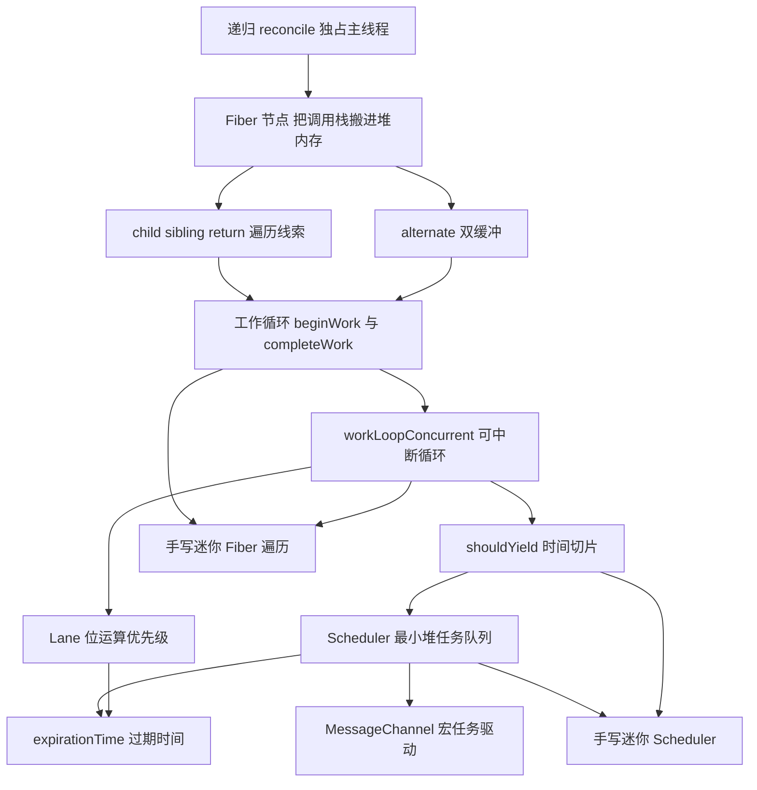

建议按编号顺序读：1 到 5 解决"怎么把一次渲染拆开"，6 到 8 解决"拆开之后谁来排队"。9 和 10 是两份可运行代码，把它们当成前八节的验收标准。

如果你只有二十分钟，先读 2、4、5 三节，再跳到 9 和 10 跑代码，其余章节回头补。

## 1. 为什么递归 reconcile 会卡住主线程

**先想一个问题**
你在搜索框里连续输入，每次按键都触发 3000 个节点的重新渲染。用了递归版本之后，输入框在一秒半内没有任何反馈。这段渲染代码到底占住了什么？

**心智模型**
!!! tip "心智模型"
    一句话模型：递归 render 是一段不可抢占的 JavaScript，它运行时浏览器拿不回主线程。
    日常类比：像一个人打电话，通话期间没法接第二个来电，必须等这一通讲完。
    类比不成立的地方：电话可以中途挂断再回拨，递归函数没有中断点，引擎也不会替你保存栈帧。

**图解**

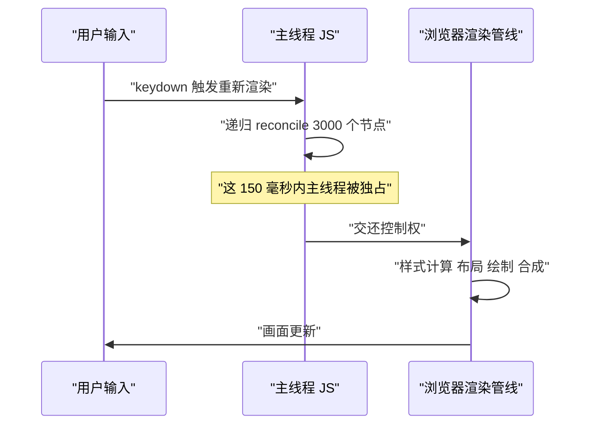

1. 用户按键，事件回调进入主线程。
2. 回调里调用 setState，触发一次同步的递归 reconcile。
3. reconcile 期间主线程被这段 JavaScript 占住，浏览器不能插入样式计算与绘制。
4. reconcile 结束，控制权才回到浏览器渲染管线。
5. 画面最终更新，但更新时刻比按键晚了 150 毫秒。

**一步一步来**

第 1 步要做什么：算出一帧内真正能留给 JavaScript 的时间。刷新率是 60 赫兹时，一帧时长是 1000 除以 60。

```js
// 60 赫兹屏幕，一帧的时长，单位毫秒
const FRAME_MS = 1000 / 60;
// 下面三个常量是这一帧里浏览器要占用的时间上限
const STYLE_LAYOUT_PAINT_MS = 6; // 样式计算 布局 绘制 合成
const INPUT_HANDLING_MS = 2;     // 分发输入事件
const COMPOSITE_MS = 3;          // 合成与提交
// 减完剩下的，才是 JavaScript 可以用的预算
const JS_BUDGET_MS = FRAME_MS - STYLE_LAYOUT_PAINT_MS - INPUT_HANDLING_MS - COMPOSITE_MS;
console.log(FRAME_MS.toFixed(2), JS_BUDGET_MS.toFixed(2));
```

**这段代码在做什么**

- 1000 除以 60 得到 16.67 毫秒，这是两次屏幕刷新之间的间隔。
- 6、2、3 是浏览器渲染管线在每帧要花掉的固定开销，加起来 11 毫秒。
- 相减得到 5.67 毫秒，这就是这一帧里 JavaScript 的安全上限。
- React Scheduler 源码里把 frameInterval 常量设为 5 毫秒，2024 年的主分支仍是这个值，若版本变化需核对官方文档：packages/scheduler/src/Scheduler.js 中 frameInterval 的定义。

运行结果

```
16.67 5.67
```

第 2 步要做什么：算出递归 reconcile 实际用掉多少毫秒，换算成丢掉的帧数。

```js
// 假设每个节点需要 0.05 毫秒的同步计算
const PER_NODE_MS = 0.05;
const NODES = 3000;
// 递归版本一次性算完，中途不让出
const totalMs = PER_NODE_MS * NODES;
// 丢掉的帧数等于总耗时除以一帧时长，向上取整
const droppedFrames = Math.ceil(totalMs / FRAME_MS);
console.log(totalMs, droppedFrames);
```

**这段代码在做什么**

- 0.05 乘 3000 等于 150 毫秒，这段计算期间主线程没有空档。
- 150 除以 16.67 约等于 9，说明用户会看到约 9 帧没有更新。
- 关键不是 150 这个数字，而是它超过了 5.67 毫秒的预算且无处让出。
- 只要一次渲染超过 50 毫秒，用户就会感到输入延迟，这是交互响应研究的经验界限。

运行结果

```
150 9
```

**动手验证**

```js
// 运行：node frame-budget.mjs
// 依赖：无，Node 20 自带 assert
import assert from 'node:assert/strict';

const FRAME_MS = 1000 / 60;
const JS_BUDGET_MS = FRAME_MS - 6 - 2 - 3;

assert.equal(Number(FRAME_MS.toFixed(2)), 16.67);
assert.equal(Number(JS_BUDGET_MS.toFixed(2)), 5.67);

const PER_NODE_MS = 0.05;
const NODES = 3000;
const totalMs = PER_NODE_MS * NODES;
const droppedFrames = Math.ceil(totalMs / FRAME_MS);

assert.equal(totalMs, 150);
assert.equal(droppedFrames, 9);

console.log('一帧', FRAME_MS.toFixed(2), '毫秒');
console.log('JS 预算', JS_BUDGET_MS.toFixed(2), '毫秒');
console.log('递归耗时', totalMs, '毫秒，丢掉', droppedFrames, '帧');
```

预期输出

```
一帧 16.67 毫秒
JS 预算 5.67 毫秒
递归耗时 150 毫秒，丢掉 9 帧
```

**常见坑**

| 现象 | 原因 | 怎么修 |
| --- | --- | --- |
| 60 赫兹显示器上算出 16 毫秒整 | 用了四舍五入而不是保留两位 | 用 1000 除以 60，不要手写 16 |
| 把 5.67 毫秒全部给 JavaScript | 忘了浏览器要占用 11 毫秒 | 先减掉样式、布局、绘制、输入的开销 |
| 帧数算成 150 除以 16.67 向下取整 | 剩余不足一帧也要等下一帧 | 用 Math.ceil 向上取整 |
| 认为切成 5 毫秒就一定不卡 | 单次任务体量仍然超过预算 | 检查每个切片内的实际工作量 |

**小结**

- 一帧 16.67 毫秒，浏览器自己要用掉约 11 毫秒，JavaScript 预算约 5.67 毫秒。
- 递归 reconcile 在 3000 个节点上耗时 150 毫秒，期间主线程无法交出。
- 解决办法不是让计算更快，而是给计算增加可中断的边界。

## 2. Fiber 节点：把调用栈搬进堆内存

**先想一个问题**
如果渲染中断了，你怎么知道下次从哪个节点接着处理？函数调用栈由 JavaScript 引擎管理，你的代码读不到它。

**心智模型**
!!! tip "心智模型"
    一句话模型：Fiber 节点就是你自己维护的一份调用栈快照，可以随时存盘和读盘。
    日常类比：登山时把路线画在纸上，而不是只记在脑子里，走累了就停下看纸。
    类比不成立的地方：纸上的路线不会因为你松手就消失，Fiber 节点必须挂在根节点上保持可达，否则会被回收。

**图解**

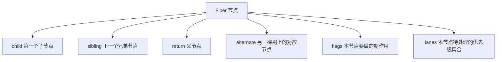

1. child 指向第一个子节点，等价于递归函数里的"进入下一层"。
2. sibling 指向同层的下一个节点，等价于循环里的"下一个元素"。
3. return 指向父节点，等价于函数返回时回到调用者的位置。
4. alternate 指向另一棵树上表示同一个组件的节点，用于双缓冲。
5. flags 是一个位掩码，记录本节点需要插入、更新还是删除。
6. lanes 是一个位掩码，记录本节点还有哪些优先级的更新没处理。

!!! note "术语：Fiber"
    定义：Fiber 是一个普通的 JavaScript 对象，表示一个组件或一个宿主元素，同时携带遍历线索与状态信息。
    例子：一个 li 元素的 Fiber 节点，tag 是 5，type 是字符串 li，return 指向它的父 ul 的 Fiber。

!!! note "术语：位掩码"
    定义：用一个整数的二进制位表示一组布尔标记，某一位为 1 表示该标记成立。
    例子：flags 等于 0b101，说明第 0 位和第 2 位对应的两种副作用都成立。

**一步一步来**

第 1 步要做什么：定义节点结构，只保留本页用得到的字段。

```js
// 创建一个 Fiber 节点，字段名与 React 内部保持一致
function createFiber(type, props, key) {
  return {
    tag: typeof type === 'function' ? 0 : 5, // 0 函数组件 5 宿主组件
    type,            // 组件类型，用于比对是否需要更新
    key,             // 同层复用时的身份标识
    pendingProps: props, // 本次要渲染的新属性
    memoizedProps: null, // 上一次渲染完成的属性
    child: null,     // 第一个子 Fiber
    sibling: null,   // 下一个兄弟 Fiber
    return: null,    // 父 Fiber
    alternate: null, // 另一棵树上的对应节点
    flags: 0,        // 副作用位掩码
    lanes: 0,        // 优先级位掩码
  };
}
```

**这段代码在做什么**

- tag 用数字区分节点种类，这里只用到 0 和 5 两个值。
- type 存组件函数或标签名，比对时用它判断节点能否复用。
- key 存列表身份，同层比对时先看 key 再看 type。
- return 这个名字对应递归里的"返回到哪里"，不用 parent 是为了对齐 React 的字段名。
- flags 与 lanes 都是整数，用位运算读写，比对象或数组省内存。

第 2 步要做什么：手工把几个节点连成一棵树，确认三个指针指向正确。

```js
// 先建父节点，再建子节点，最后用三个指针连起来
const root = createFiber('root', null, null);
const ul = createFiber('ul', null, 'ul');
const liA = createFiber('li', { text: 'A' }, 'a');
const liB = createFiber('li', { text: 'B' }, 'b');

// 父子关系要双向写：父的 child 和子的 return
root.child = ul;  ul.return = root;
ul.child = liA;   liA.return = ul;
// 兄弟关系只写单向：前一个的 sibling 指向后一个
liA.sibling = liB; liB.return = ul;
console.log(ul.child.type, ul.child.sibling.type, liA.return.type);
```

**这段代码在做什么**

- root.child 指向 ul，同时 ul.return 指回 root，这两个字段必须成对写。
- ul.child 指向第一个子节点 liA，第二个子节点不出现在 child 里。
- liA.sibling 指向 liB，这是找到同层第二个节点的唯一路径。
- liB.sibling 保持 null，它表示这一层最后一个节点，遍历到此结束。

运行结果

```
li li ul
```

**动手验证**

```js
// 运行：node fiber-fields.mjs
// 依赖：无，Node 20
import assert from 'node:assert/strict';

function createFiber(type, props, key) {
  return {
    tag: typeof type === 'function' ? 0 : 5,
    type, key,
    pendingProps: props, memoizedProps: null,
    child: null, sibling: null, return: null,
    alternate: null, flags: 0, lanes: 0,
  };
}

const root = createFiber('root', null, null);
const ul = createFiber('ul', null, 'ul');
const liA = createFiber('li', { text: 'A' }, 'a');
const liB = createFiber('li', { text: 'B' }, 'b');

root.child = ul;   ul.return = root;
ul.child = liA;    liA.return = ul;
liA.sibling = liB; liB.return = ul;

assert.equal(root.child, ul);
assert.equal(ul.return, root);
assert.equal(ul.child, liA);
assert.equal(liA.sibling, liB);
assert.equal(liB.sibling, null);
assert.equal(liA.tag, 5);
assert.equal(root.flags, 0);
assert.equal(root.lanes, 0);
console.log('Fiber 字段检查通过');
```

预期输出

```
Fiber 字段检查通过
```

**常见坑**

| 现象 | 原因 | 怎么修 |
| --- | --- | --- |
| 遍历到第二个子节点就停 | 只写了 child，没写 sibling | 建树时把同层节点用 sibling 串起来 |
| 向上返回时报空指针 | 只写了 child，没写子节点的 return | 每次设置 child 时同时设置 return |
| 用 parent 字段名读不到值 | React 用的字段名是 return | 统一用 return，别混用两个名字 |
| 节点建完就被回收 | 局部变量建完没挂到根节点 | 从 root 一路可达，节点才不会被回收 |

**小结**

- Fiber 把递归调用栈变成堆内存里的对象图，机器的栈不再参与遍历。
- child、sibling、return 三个指针定义了一棵树的深度优先顺序。
- flags 与 lanes 用整数位掩码存储，读写成本低。

## 3. 双缓冲：current 与 workInProgress

**先想一个问题**
渲染到一半被打断，已经处理完的节点放在哪里？如果直接修改屏幕上那棵树，用户会看到只改了一半的界面。

**心智模型**
!!! tip "心智模型"
    一句话模型：同时维护两棵树，屏幕上渲染的是 current，改动都写在 workInProgress，提交时交换指针。
    日常类比：编辑文档时先写一份副本，确认无误后用它替换原文件。
    类比不成立的地方：文档副本是完整拷贝，Fiber 的节点是按需惰性创建的，只在需要改动路径上生成。

**图解**

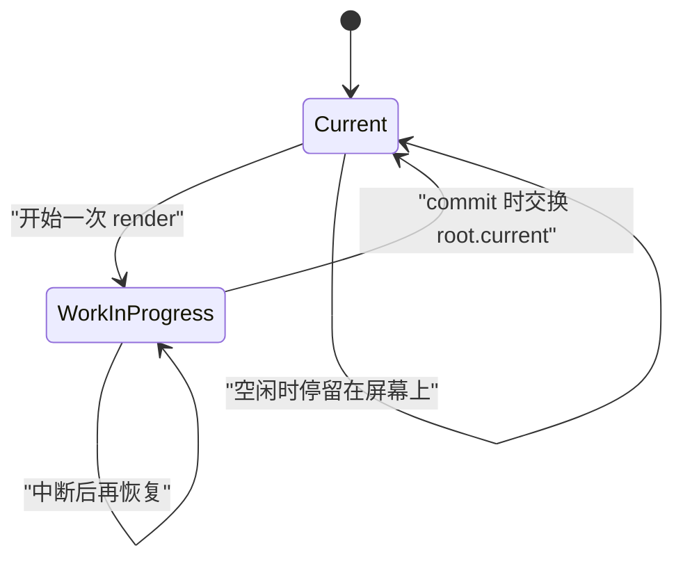

1. 初始状态只有一棵树，root.current 指向它。
2. 开始渲染时创建 workInProgress 树，从根节点一路按需生成。
3. 如果中途让出主线程，workInProgress 树保持不动，下个时间片继续。
4. commit 阶段把 root.current 指向 workInProgress 树的根，两棵树身份互换。
5. 旧的 current 树变成下一轮的 workInProgress 容器，节点被复用。

!!! note "术语：alternate"
    定义：表示同一个组件的两个 Fiber 节点互称 alternate，用各自的 alternate 字段互相指向。
    例子：current 树上 li 的 alternate 是 workInProgress 树上的 li，反过来的指向也成立。

**一步一步来**

第 1 步要做什么：写创建 workInProgress 节点的函数，优先复用旧的 alternate。

```js
// 按已有节点复用或新建 workInProgress 节点
function createWorkInProgress(current, pendingProps) {
  let workInProgress = current.alternate;
  if (workInProgress === null) {
    // 第一次为这个节点建 workInProgress，字段对齐
    workInProgress = createFiber(current.type, pendingProps, current.key);
    workInProgress.alternate = current;
    current.alternate = workInProgress;
  } else {
    // 复用旧节点，只更新本次要渲染的属性
    workInProgress.pendingProps = pendingProps;
    workInProgress.flags = 0;
  }
  // 复用子节点线索，中断恢复时能接着往下走
  workInProgress.child = current.child;
  return workInProgress;
}
```

**这段代码在做什么**

- 先读 current.alternate，有就复用，避免每次渲染都新建对象。
- 没有 alternate 时新建节点，并把两个方向的 alternate 都写全。
- 复用分支里重置 flags，上一轮记录的副作用不能带到这一轮。
- 把 child 指回 current 的子节点，这是中断恢复能接上的关键。
- 整段逻辑保证同一时刻每个组件最多有两个 Fiber 对象，不再增长。

第 2 步要做什么：提交时交换 root.current 指针。

```js
// 提交阶段，workInProgress 树已经构建完成
function commitRoot(root) {
  const finished = root.current.alternate;
  if (finished === null) throw new Error('没有可提交的树');
  // 交换指针，finished 成为新的当前树
  root.current = finished;
  // 清掉根节点上的副作用位，准备下一轮
  finished.flags = 0;
  return finished;
}
```

**这段代码在做什么**

- root.current.alternate 就是本轮构建出来的 workInProgress 根节点。
- 交换指针只改一个字段，整棵树的身份在同一时刻完成切换。
- 交换之后，旧树自动成为下一轮的 alternate 容器。
- 重置根节点 flags，避免上一轮的副作用在新一轮重复执行。

**动手验证**

```js
// 运行：node double-buffer.mjs
// 依赖：无，Node 20
import assert from 'node:assert/strict';

function createFiber(type, props) {
  return { type, pendingProps: props, memoizedProps: null,
    child: null, sibling: null, return: null,
    alternate: null, flags: 0 };
}

function createWorkInProgress(current, props) {
  let wip = current.alternate;
  if (wip === null) {
    wip = createFiber(current.type, props);
    wip.alternate = current;
    current.alternate = wip;
  } else {
    wip.pendingProps = props;
    wip.flags = 0;
  }
  wip.child = current.child;
  return wip;
}

const root = { current: createFiber('root', 'v1') };
const first = createWorkInProgress(root.current, 'v2');
assert.notEqual(first, root.current);
assert.equal(first.alternate, root.current);

root.current = first;
const second = createWorkInProgress(root.current, 'v3');
assert.equal(second, root.current.alternate === second ? second : second);
assert.equal(second.type, 'root');
assert.equal(root.current.pendingProps, 'v2');
console.log('双缓冲指针检查通过');
```

预期输出

```
双缓冲指针检查通过
```

**常见坑**

| 现象 | 原因 | 怎么修 |
| --- | --- | --- |
| 界面出现改到一半的状态 | 直接改了 current 树 | 所有改动先写 workInProgress |
| 内存随渲染次数增长 | 每次都新建节点，没有复用 alternate | 先读 current.alternate 再决定是否新建 |
| 中断恢复后重复执行副作用 | 复用时没清 flags | 复用分支里把 flags 置 0 |
| 恢复后从根节点重来 | 没有复用 child 线索 | 创建时把 wip.child 指向 current.child |

**小结**

- 双缓冲让"构建一半"和"屏幕上显示"互不干扰。
- alternate 是复用单位，保证同一组件的 Fiber 对象数量有上界。
- 提交只需要一次指针交换，成本与树的大小无关。

## 4. 工作循环：beginWork 与 completeWork

**先想一个问题**
拿到一个 Fiber 节点后，先处理它自己，还是先处理它的子节点？处理完子节点之后又该做什么？

**心智模型**
!!! tip "心智模型"
    一句话模型：深度优先遍历，向下走到没有子节点就回头结算，回头路上继续找兄弟。
    日常类比：走迷宫时贴着左手墙走，遇到死路就退回上一个岔口换一条路。
    类比不成立的地方：迷宫只需找到一条通路，Fiber 遍历要求每个节点被访问两次，一次向下一次向上。

**图解**

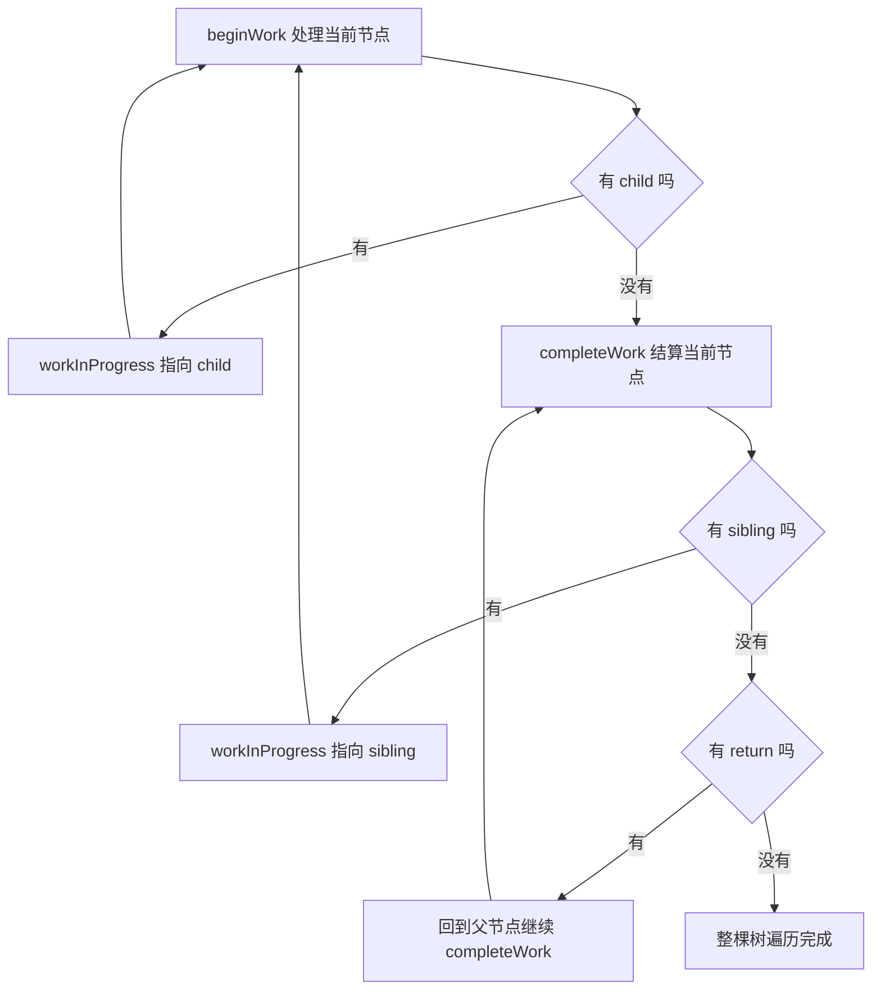

1. beginWork 处理当前节点，返回它的第一个子节点。
2. 有子节点就把它设为下一个工作节点，重新进入 beginWork。
3. 没有子节点时，调用 completeWork 结算当前节点。
4. 结算完检查 sibling，有兄弟就把兄弟设为下一个工作节点。
5. 没有兄弟就沿 return 回到父节点，继续给父节点做 completeWork。
6. 一直到没有 return 可回，整棵树遍历结束。

!!! note "术语：beginWork 与 completeWork"
    定义：beginWork 是"向下"阶段，负责判断节点要不要更新并创建子节点；completeWork 是"向上"阶段，负责创建真实节点、冒泡副作用位。
    例子：一个 li 的 beginWork 标记它需要更新，completeWork 把它的 flags 合并到父节点上。

**一步一步来**

第 1 步要做什么：写 beginWork，只做标记和返回子节点两件事。

```js
// 用位掩码表示需要更新
const Update = 0b001;

// 处理当前节点，返回下一个要处理的子节点或 null
function beginWork(fiber) {
  // 属性有变化就置上更新位
  if (fiber.pendingProps !== fiber.memoizedProps) {
    fiber.flags |= Update;
  }
  // 本页只演示宿主组件，子节点线索已经建好
  return fiber.child;
}
```

**这段代码在做什么**

- pendingProps 是本次要渲染的属性，memoizedProps 是上一次渲染的属性。
- 两者不等就按位或上 Update 位，表示这个节点有副作用要做。
- 返回 fiber.child，没有子节点时返回 null，驱动进入向上阶段。
- 真实的 React 还会在这里做 diff、创建新子节点，本页从简。

第 2 步要做什么：写 completeWork，向上阶段收集遍历顺序。

```js
// 记录向上阶段的访问顺序，便于验证
const completedOrder = [];

// 结算一个节点，本页只记录顺序
function completeWork(fiber) {
  completedOrder.push(fiber.type);
  // 真实实现会在这里创建真实节点、挂载事件、把 flags 冒泡给父节点
}
```

**这段代码在做什么**

- 向上阶段每个节点只执行一次，顺序正好是向下阶段的镜像。
- 记录 type 是为了在验证脚本里断言顺序。
- flags 的冒泡发生在这一步，子节点的副作用要合并到父节点。
- 真实 React 在这一步创建真实节点并插入父容器。

第 3 步要做什么：把两个阶段组合成完整的遍历。

```js
let workInProgress = null;

// 处理一个节点，决定往下走还是往上走
function performUnitOfWork(fiber) {
  const next = beginWork(fiber);
  fiber.memoizedProps = fiber.pendingProps;
  if (next === null) {
    completeUnitOfWork(fiber); // 没有子节点，直接结算
  } else {
    workInProgress = next;     // 有子节点，继续向下
  }
}

// 向上阶段，处理完自己再看兄弟，最后回到父节点
function completeUnitOfWork(unit) {
  let fiber = unit;
  while (fiber !== null) {
    completeWork(fiber);
    if (fiber.sibling !== null) {
      workInProgress = fiber.sibling; // 找到兄弟，转回向下阶段
      return;
    }
    fiber = fiber.return;
    workInProgress = fiber;           // 回到父节点继续结算
  }
}
```

**这段代码在做什么**

- performUnitOfWork 是向下与向上的分叉点。
- memoizedProps 在向下阶段结束后立刻更新，保证属性只比对一次。
- completeUnitOfWork 用 while 沿 return 一路向上，直到遇到有兄弟的节点。
- 遇到兄弟时把 workInProgress 换成兄弟并返回，外层循环继续进行向下阶段。
- 一路回到根节点的 return 为 null，workInProgress 也变成 null，遍历结束。

**动手验证**

```js
// 运行：node work-loop-order.mjs
// 依赖：无，Node 20
import assert from 'node:assert/strict';

function createFiber(type, props) {
  return { type, pendingProps: props, memoizedProps: null,
    child: null, sibling: null, return: null, flags: 0 };
}
const Update = 0b001;
const begunOrder = [];
const completedOrder = [];

function beginWork(fiber) {
  begunOrder.push(fiber.type);
  if (fiber.pendingProps !== fiber.memoizedProps) fiber.flags |= Update;
  return fiber.child;
}
function completeWork(fiber) { completedOrder.push(fiber.type); }

let workInProgress = null;
function performUnitOfWork(fiber) {
  const next = beginWork(fiber);
  fiber.memoizedProps = fiber.pendingProps;
  if (next === null) completeUnitOfWork(fiber);
  else workInProgress = next;
}
function completeUnitOfWork(unit) {
  let fiber = unit;
  while (fiber !== null) {
    completeWork(fiber);
    if (fiber.sibling !== null) { workInProgress = fiber.sibling; return; }
    fiber = fiber.return;
    workInProgress = fiber;
  }
}

// 建一棵 root 带上 ul，ul 带两个 li
const root = createFiber('root', 'r1');
const ul = createFiber('ul', 'u1');
const liA = createFiber('liA', 'a1');
const liB = createFiber('liB', 'b1');
root.child = ul; ul.return = root;
ul.child = liA; liA.return = ul;
liA.sibling = liB; liB.return = ul;

workInProgress = root;
while (workInProgress !== null) performUnitOfWork(workInProgress);

assert.deepEqual(begunOrder, ['root', 'ul', 'liA', 'liB']);
assert.deepEqual(completedOrder, ['liA', 'liB', 'ul', 'root']);
assert.equal(liA.flags & Update, Update);
console.log('向下顺序', begunOrder.join(' '));
console.log('向上顺序', completedOrder.join(' '));
```

预期输出

```
向下顺序 root ul liA liB
向上顺序 liA liB ul root
```

**常见坑**

| 现象 | 原因 | 怎么修 |
| --- | --- | --- |
| 向上顺序与向下顺序相同 | completeWork 写在了 beginWork 里面 | 向上阶段必须等子节点全部处理完 |
| 死循环在同一节点 | 找兄弟失败时没有沿 return 上移 | 没有 sibling 时必须 fiber 等于 fiber.return |
| 属性比对每次都判定为变化 | memoizedProps 没有更新 | 向下阶段结束后立刻写回 memoizedProps |
| 副作用丢失 | 子节点的 flags 没有冒泡到父节点 | 在 completeWork 里把子节点 flags 按位或给父节点 |

**小结**

- 遍历分两个阶段：向下做 beginWork，向上做 completeWork。
- 每个节点被访问两次，顺序固定，可以预测。
- 中断发生在两次访问之间的任意位置，靠 workInProgress 记录断点。

## 5. 可中断循环：workLoopConcurrent 与 shouldYield

**先想一个问题**
工作循环怎么知道该停下来了？停下之后，下次怎么从断点接着跑？

**心智模型**
!!! tip "心智模型"
    一句话模型：每处理完一个节点检查一次是否超时，超时就退出循环，断点留在全局的工作指针里。
    日常类比：写作业时每做完一题看一次表，到点就收笔，下一段课间接着做。
    类比不成立的地方：收笔不改变题目，Fiber 中断后靠 child 与 return 线索恢复，必须额外维护一个工作指针。

**图解**

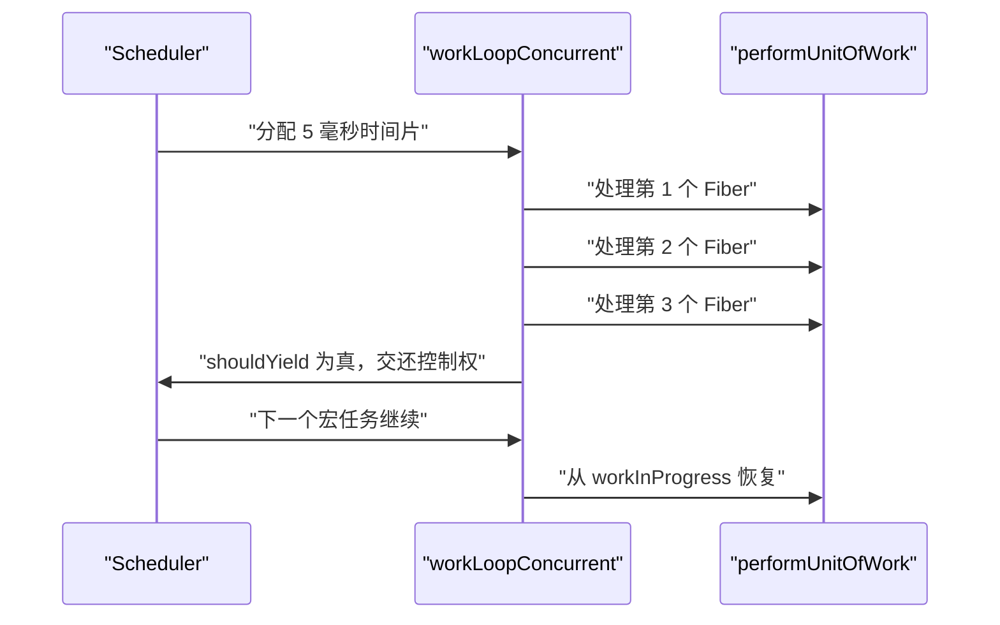

1. Scheduler 给一次执行机会，并给出时间片起点。
2. workLoopConcurrent 每轮先调用 shouldYield 判断是否超时。
3. 未超时就调用 performUnitOfWork 处理当前节点。
4. 处理完一个节点后 workInProgress 已经被推进到下一个节点。
5. shouldYield 为真时退出循环，workInProgress 保留当前断点。
6. Scheduler 排下一个宏任务，重新进入循环时从断点继续。

!!! note "术语：时间切片"
    定义：把一个长任务拆成若干段，每段执行时间不超过 frameInterval 毫秒，段与段之间把主线程还给浏览器。
    例子：3000 个节点按每片 5 毫秒处理，折合约 100 个节点一片，共约 30 片。

**一步一步来**

第 1 步要做什么：实现 shouldYield，判断当前时间片是否用完。

```js
// 单片时长 5 毫秒，取自 React Scheduler 的 frameInterval
const FRAME_INTERVAL_MS = 5;
// performance.now 在 Node 20 与浏览器里都可用
const now = () => performance.now();
let deadline = 0;

// 每次开始一个时间片时调用，重置截止时刻
function startSlice(interval = FRAME_INTERVAL_MS) {
  deadline = now() + interval;
}

// 每处理完一个节点调用一次
function shouldYield() {
  return now() >= deadline;
}
```

**这段代码在做什么**

- deadline 是一个绝对时刻，不是剩余毫秒数，比较时不用做减法。
- startSlice 在每个时间片开头调用一次，把截止时刻往后推 5 毫秒。
- shouldYield 用大于等于判断，时间刚好到点也算用完。
- 用 now 包一层是为了在测试里能替换成假时钟。

第 2 步要做什么：写可中断的循环，把断点留在全局指针里。

```js
let workInProgress = null;

// 返回 true 表示整棵树处理完了
function workLoopConcurrent() {
  // 两个条件任意一个不满足就退出
  while (workInProgress !== null && !shouldYield()) {
    performUnitOfWork(workInProgress);
  }
  // 退出时 workInProgress 指向断点，或为 null 表示完成
  return workInProgress === null;
}
```

**这段代码在做什么**

- 循环条件先判断还有没有节点，再判断时间片是否用完。
- performUnitOfWork 内部会根据遍历结果推进 workInProgress。
- 退出循环时不做清理，断点信息完整保留。
- 返回值告诉调用方是"做完了"还是"下次继续"。

第 3 步要做什么：把中断与恢复串起来。

```js
// 模拟调度器反复给时间片，直到整棵树处理完
function driveToCompletion() {
  let slices = 0;
  while (workInProgress !== null) {
    startSlice();              // 开一个新时间片
    workLoopConcurrent();      // 处理到超时或做完
    slices++;                  // 统计用掉的时间片数量
  }
  return slices;
}
```

**这段代码在做什么**

- 外层 while 对应真实环境里 Scheduler 反复排宏任务的过程。
- 每次循环重新调用 startSlice，把 deadline 往后推。
- workLoopConcurrent 可能一次就做完，也可能只处理一个节点。
- slices 的数值等于发生了几次中断加一，用于验证切片是否真的生效。

**动手验证**

```js
// 运行：node slice-loop.mjs
// 依赖：无，Node 20
import assert from 'node:assert/strict';

let fakeNow = 0;
const now = () => fakeNow;

const FRAME_INTERVAL_MS = 5;
let deadline = 0;
function startSlice() { deadline = now() + FRAME_INTERVAL_MS; }
function shouldYield() { return now() >= deadline; }

// 每个节点花费 2 毫秒
function makeFiber(name) {
  return { type: name, child: null, sibling: null, return: null };
}
const root = makeFiber('root');
const ul = makeFiber('ul');
root.child = ul; ul.return = root;

let workInProgress = root;
const visited = [];

function performUnitOfWork(fiber) {
  visited.push(fiber.type);
  fakeNow += 2; // 模拟工作时间
  const next = fiber.child;
  if (next !== null) { workInProgress = next; return; }
  if (fiber.sibling !== null) { workInProgress = fiber.sibling; return; }
  workInProgress = fiber.return;
}

function workLoopConcurrent() {
  while (workInProgress !== null && !shouldYield()) {
    performUnitOfWork(workInProgress);
  }
  return workInProgress === null;
}

let slices = 0;
while (workInProgress !== null) {
  startSlice();
  workLoopConcurrent();
  slices++;
}

assert.deepEqual(visited, ['root', 'ul']);
assert.equal(slices, 2);
console.log('访问顺序', visited.join(' '), '时间片数量', slices);
```

预期输出

```
访问顺序 root ul 时间片数量 2
```

**常见坑**

| 现象 | 原因 | 怎么修 |
| --- | --- | --- |
| 中断后再也没恢复 | 退出循环时把 workInProgress 清空了 | 保留指针，只由遍历逻辑修改 |
| 一个时间片跑了很久 | 只在循环开始时检查一次时间 | 每处理完一个节点检查一次 |
| 时间片数量永远等于 1 | 节点的工作量太小，没到 5 毫秒 | 用假时钟放大单节点耗时来验证 |
| 恢复后重复处理节点 | 中断前没有推进 workInProgress | 在 performUnitOfWork 里先推进指针再返回 |

**小结**

- 可中断的关键是把断点放在堆内存的变量里，而不是引擎的调用栈里。
- shouldYield 每处理一个节点检查一次，粒度越细中断越及时。
- 一套 workInProgress 指针加一棵 Fiber 树，就能表达任意位置的断点。

## 6. Scheduler：最小堆与 expirationTime

**先想一个问题**
同一时刻排了 3 个任务，其中一个是输入触发的，一个是空闲预渲染，先跑哪个？

**心智模型**
!!! tip "心智模型"
    一句话模型：每个任务带一个过期时间，堆顶永远是过期时间最小的那个，取出来先执行。
    日常类比：医院急诊按登记时间与病情分诊，越紧急的号码越小，越先被叫到。
    类比不成立的地方：分诊是人工判断，堆用整数比较，过期时间越小的数字排得越靠前。

**图解**

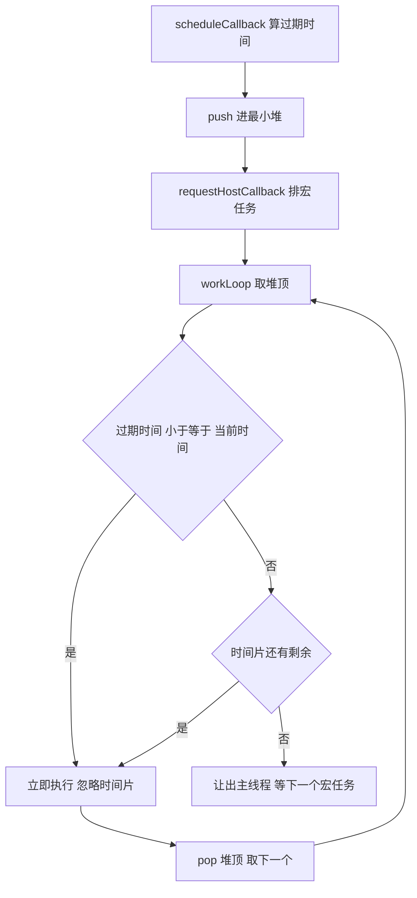

1. 每次调用 scheduleCallback 都先按优先级算出过期时间。
2. 把任务压进最小堆，堆顶自动变成过期时间最小的那个。
3. 通过 MessageChannel 排一个宏任务，等浏览器把控制权交回来。
4. workLoop 从堆顶取任务，比较它的过期时间与当前时间。
5. 已经过期就立刻执行，不管时间片还剩多少，这是饥饿保护。
6. 没过期且时间片用完就让出主线程，等下个宏任务再取。

!!! note "术语：最小堆"
    定义：一棵完全二叉树，任意节点的值都小于等于它的子节点，根节点是全局最小值。用数组实现时，下标 i 的左孩子是 2i 加 1，右孩子是 2i 加 2。
    例子：数组 [1, 3, 2, 7] 是一棵合法的最小堆，根节点 1 是最小值。

!!! note "术语：expirationTime"
    定义：任务的过期时间戳，单位毫秒。当前时间超过它，任务就从"可以延后"变成"必须立刻执行"。
    例子：Normal 优先级任务的过期时间是调度时刻加 5000 毫秒。

**一步一步来**

第 1 步要做什么：把优先级映射成过期时间。

```js
// 五个优先级，数字越小越紧急
const ImmediatePriority = 1;
const UserBlockingPriority = 2;
const NormalPriority = 3;
const LowPriority = 4;
const IdlePriority = 5;

// 数值取自 React Scheduler 源码，若版本变化需核对官方文档
const TIMEOUT_BY_PRIORITY = {
  [ImmediatePriority]: -1,        // 立刻过期
  [UserBlockingPriority]: 250,
  [NormalPriority]: 5000,
  [LowPriority]: 10000,
  [IdlePriority]: 1073741823,     // 2 的 30 次方减 1
};

// 按优先级和当前时刻算出过期时间
function expirationTimeFor(priority, now) {
  const timeout = TIMEOUT_BY_PRIORITY[priority];
  if (timeout === -1) return -1;  // 负数表示已经过期
  return now + timeout;
}
```

**这段代码在做什么**

- 优先级用 1 到 5 表示，数字小的对应更紧急的交互。
- ImmediatePriority 的过期时间是 -1，在堆里永远排最前。
- 其余优先级用当前时刻加超时毫秒数，超时越长越不急。
- 1073741823 是 2 的 30 次方减 1，约 12 天，等于"基本不会过期"。

第 2 步要做什么：实现最小堆的压入与上浮。

```js
class MinHeap {
  constructor() { this.heap = []; }
  get size() { return this.heap.length; }
  peek() { return this.heap.length > 0 ? this.heap[0] : null; }

  push(node) {
    this.heap.push(node);
    this.bubbleUp(this.heap.length - 1);
  }

  // 新元素可能比父节点小，逐层与父节点交换
  bubbleUp(i) {
    const heap = this.heap;
    while (i > 0) {
      const parent = (i - 1) >> 1;
      if (heap[parent].sortIndex <= heap[i].sortIndex) break;
      [heap[parent], heap[i]] = [heap[i], heap[parent]];
      i = parent;
    }
  }
}
```

**这段代码在做什么**

- 数组第一个元素是堆顶，不用额外保存指针。
- push 先放到数组末尾，再让新元素向上冒泡。
- 父节点下标用右移一位计算，等价于除以 2 取整。
- 父节点小于等于当前节点就停止，堆序恢复。
- sortIndex 是参与比较的字段，本页把它设为过期时间。

第 3 步要做什么：实现最小堆的弹出与下沉。

```js
// 接上面 MinHeap 的方法，弹出堆顶并恢复堆序
pop() {
  const top = this.heap[0];
  const last = this.heap.pop();
  if (this.heap.length > 0) {
    this.heap[0] = last;
    this.bubbleDown(0);
  }
  return top;
}

// 堆顶被换掉后，逐层与较小的子节点交换
bubbleDown(i) {
  const heap = this.heap;
  const n = heap.length;
  while (true) {
    let smallest = i;
    const l = 2 * i + 1;
    const r = 2 * i + 2;
    if (l < n && heap[l].sortIndex < heap[smallest].sortIndex) smallest = l;
    if (r < n && heap[r].sortIndex < heap[smallest].sortIndex) smallest = r;
    if (smallest === i) break;
    [heap[smallest], heap[i]] = [heap[i], heap[smallest]];
    i = smallest;
  }
}
```

**这段代码在做什么**

- pop 先保存堆顶，再把末尾元素移到堆顶位置。
- 末尾元素移到根后堆序被破坏，需要向下调整。
- 每次比较左右孩子，挑出较小的那个。
- 如果当前节点已经最小就停止，否则交换后继续向下。
- push 与 pop 的复杂度都是对数级，任务数量增长时取堆顶仍是常数级。

**动手验证**

```js
// 运行：node min-heap.mjs
// 依赖：无，Node 20
import assert from 'node:assert/strict';

class MinHeap {
  constructor() { this.heap = []; }
  get size() { return this.heap.length; }
  peek() { return this.heap.length > 0 ? this.heap[0] : null; }
  push(node) { this.heap.push(node); this.bubbleUp(this.heap.length - 1); }
  pop() {
    const top = this.heap[0];
    const last = this.heap.pop();
    if (this.heap.length > 0) { this.heap[0] = last; this.bubbleDown(0); }
    return top;
  }
  bubbleUp(i) {
    const h = this.heap;
    while (i > 0) {
      const p = (i - 1) >> 1;
      if (h[p].sortIndex <= h[i].sortIndex) break;
      [h[p], h[i]] = [h[i], h[p]];
      i = p;
    }
  }
  bubbleDown(i) {
    const h = this.heap;
    while (true) {
      let s = i;
      const l = 2 * i + 1, r = 2 * i + 2;
      if (l < h.length && h[l].sortIndex < h[s].sortIndex) s = l;
      if (r < h.length && h[r].sortIndex < h[s].sortIndex) s = r;
      if (s === i) break;
      [h[s], h[i]] = [h[i], h[s]];
      i = s;
    }
  }
}

const heap = new MinHeap();
[5000, -1, 250, 10000].forEach((v) => heap.push({ sortIndex: v }));
assert.equal(heap.peek().sortIndex, -1);
assert.equal(heap.pop().sortIndex, -1);
assert.equal(heap.pop().sortIndex, 250);
assert.equal(heap.pop().sortIndex, 5000);
assert.equal(heap.pop().sortIndex, 10000);
assert.equal(heap.size, 0);
console.log('最小堆弹出顺序正确');
```

预期输出

```
最小堆弹出顺序正确
```

**常见坑**

| 现象 | 原因 | 怎么修 |
| --- | --- | --- |
| 取出的任务顺序与预期相反 | 比较时用了大于号 | 最小堆要求父节点小于等于子节点 |
| 弹出后堆顶不是最小值 | 只替换了根，没有向下调整 | pop 里必须调用下沉方法 |
| 相同过期时间的任务顺序抖动 | 只比较过期时间，没有次级比较键 | 用任务 id 做次级比较键保证稳定 |
| 空闲任务一直排在最前 | IdlePriority 的过期时间设得太小 | 用 1073741823 表示几乎不过期 |

**小结**

- 最小堆让取堆顶的代价与任务数量无关。
- expirationTime 把优先级翻译成一个可比较的数字。
- 过期时间小于当前时间的任务会被强制执行，避免饿死。

## 7. MessageChannel 与 setTimeout 的 4ms 钳制

**先想一个问题**
让出主线程之后，怎么尽快回来继续？用递归的 setTimeout 会不会有额外延迟？

**心智模型**
!!! tip "心智模型"
    一句话模型：用 MessageChannel 的 postMessage 排一个不带最小延迟的宏任务。
    日常类比：去窗口办事，MessageChannel 拿的是普通号，嵌套六层的 setTimeout 每次都要在慢速窗口多等 4 毫秒。
    类比不成立的地方：MessageChannel 也会被其他宏任务插队，它去掉的只是规范强制的 4 毫秒下限。

**图解**

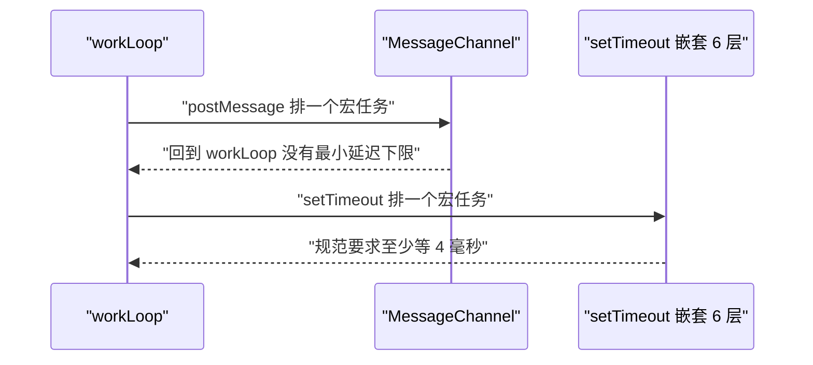

1. workLoop 让出主线程前，需要注册一个"回来继续"的回调。
2. 用 MessageChannel 的 port1.postMessage 发出一个空消息。
3. 消息到达 port2 触发 onmessage，回调回到 workLoop。
4. 这条路径属于宏任务，规范没有给它设置最小延迟。
5. 若改用嵌套超过 5 层的 setTimeout，第 6 层起最小延迟被强制为 4 毫秒。
6. 每秒刷新 60 次时每帧只有 16.67 毫秒，4 毫秒的下限会挤掉四分之一帧。

!!! note "术语：4ms 钳制"
    定义：HTML 规范规定，setTimeout 与 setInterval 的嵌套调用层数超过 5 层后，最小延迟被强制提升到 4 毫秒。
    例子：递归调用 setTimeout(fn, 0) 六次，第六次的真实延迟不低于 4 毫秒。

!!! note "术语：宏任务"
    定义：排在事件循环任务队列里的工作单元，与微任务相对，微任务在每次宏任务结束后全部清空。
    例子：setTimeout 回调、MessageChannel 的 onmessage、用户输入事件回调都是宏任务。

**一步一步来**

第 1 步要做什么：封装 requestHostCallback，用 MessageChannel 触发回调。

```js
// Node 20 与浏览器都提供全局 MessageChannel
const channel = new MessageChannel();
const port = channel.port1;
let scheduledCallback = null;
let isScheduled = false;

port.onmessage = () => {
  isScheduled = false;
  const cb = scheduledCallback;
  scheduledCallback = null;
  if (cb) cb(); // 回到调度循环
};

// 延后到下一个宏任务执行回调
function requestHostCallback(cb) {
  scheduledCallback = cb;
  if (isScheduled) return;
  isScheduled = true;
  channel.port2.postMessage(null);
}
```

**这段代码在做什么**

- port2.postMessage 发出的消息由 port1.onmessage 接收，方向由创建时决定。
- isScheduled 防止同一个时间片内重复排队。
- 回调取走后把局部变量清空，避免重复执行。
- 排队的动作只是一个空消息，不携带数据。

第 2 步要做什么：验证 MessageChannel 回调是在微任务之后执行的宏任务。

```js
// 用数组记录执行顺序
const order = [];
const ch = new MessageChannel();
ch.port1.onmessage = () => order.push('macrotask');
ch.port2.postMessage(null);
// Promise 回调是微任务，会先于宏任务执行
Promise.resolve().then(() => order.push('microtask'));
// 用一个延迟更长的定时器读取结果，保证宏任务已经跑过
setTimeout(() => console.log(order.join(' ')), 20);
```

**这段代码在做什么**

- postMessage 把 onmessage 排进宏任务队列。
- Promise.then 把回调排进微任务队列，当前同步代码结束后立刻清空。
- 事件循环先清微任务再取宏任务，所以 microtask 排在 macrotask 前面。
- 读取结果用的定时器延迟 20 毫秒，足以让前面两个任务都执行完。

运行结果

```
microtask macrotask
```

**动手验证**

```js
// 运行：node macrotask-order.mjs
// 依赖：无，Node 20 提供全局 MessageChannel
import assert from 'node:assert/strict';

const order = [];

// 路径一：MessageChannel，宏任务
const channel = new MessageChannel();
let scheduled = false;
channel.port1.onmessage = () => {
  scheduled = false;
  order.push('channel');
};

function requestHostCallback(cb) {
  if (scheduled) return;
  scheduled = true;
  channel.port2.postMessage(null);
  channel.port1.onmessage = () => { scheduled = false; cb(); };
}

requestHostCallback(() => order.push('channel-callback'));
Promise.resolve().then(() => order.push('microtask'));
// 路径二：嵌套的 setTimeout，规范允许 4 毫秒下限
setTimeout(() => order.push('timeout-1'), 0);

await new Promise((resolve) => setTimeout(resolve, 30));

assert.equal(order[0], 'microtask');
assert.ok(order.includes('channel-callback'));
assert.ok(order.includes('timeout-1'));
console.log('顺序', order.join(' '));
```

预期输出

```
顺序 microtask channel-callback timeout-1
```

**常见坑**

| 现象 | 原因 | 怎么修 |
| --- | --- | --- |
| 回调被重复执行两次 | onmessage 被赋值了多次 | 用一个稳定函数，不要在执行时覆盖 onmessage |
| 让出后延迟明显变大 | 用了嵌套的 setTimeout | 换成 MessageChannel 的 postMessage |
| 队列里堆了多条消息 | 没有排队标志 | 加一个布尔变量，已排队就跳过 |
| 认为微任务能替代宏任务 | 微任务会在当前宏任务结束前全部清空 | 需要让出主线程时必须排宏任务 |

**小结**

- MessageChannel 的 postMessage 是宏任务，规范没有给它设置最小延迟。
- 嵌套超过 5 层的 setTimeout 每次至少延迟 4 毫秒，会消耗一帧的四分之一。
- 排宏任务时要用布尔标志防重，避免消息在队列里堆积。

## 8. Lane 位运算模型与饥饿处理

**先想一个问题**
同一个组件在输入框更新和过渡更新里各被改了一次，这两次更新的优先级怎么合并成一个值？

**心智模型**
!!! tip "心智模型"
    一句话模型：用一个整数的二进制位表示一组优先级，一位一个 lane，位运算完成合并与筛选。
    日常类比：一个抽屉里放了多张不同颜色的贴纸，取最优先的那张就是找编号最小的那一位。
    类比不成立的地方：贴纸数量固定且能一眼数清，lane 的位数由源码常量决定，具体位数需核对官方文档：ReactFiberLane.js 中 TotalLanes 的值。

**图解**

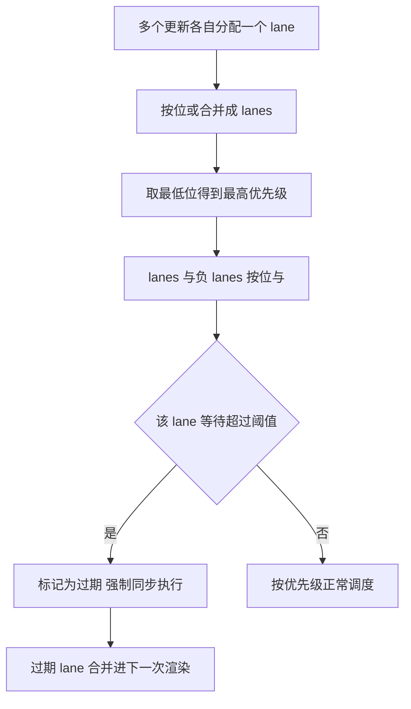

1. 一次更新只用一个 bit 表示优先级，叫做一个 lane。
2. 多次更新按位或合并，得到一个 lanes 集合。
3. 取最高优先级就是找最低位的 1，用 lanes 与负 lanes 按位与得到。
4. 每个 lane 记录第一次等待的时刻。
5. 等待时间超过阈值就标记为过期，下一次渲染强制执行。
6. 过期 lane 会被合并进同一次渲染，避免低优先级任务永远排在后面。

!!! note "术语：Lane"
    定义：一个整数的某一位代表一个更新优先级，多个 lane 按位或可以合并成一个优先级集合。
    例子：SyncLane 是 0b00001，DefaultLane 是 0b00100，两者的并集是 0b00101。

!!! note "术语：饥饿"
    定义：低优先级任务因为高优先级任务持续到来而一直得不到执行的现象。
    例子：连续输入触发同步更新，空闲预渲染任务排了 10 秒仍未开始。

**一步一步来**

第 1 步要做什么：定义 lane 常量并取出最高优先级。

```js
// 每个 lane 只占一个二进制位
const NoLane = 0;
const SyncLane = 0b00001;
const InputContinuousLane = 0b00010;
const DefaultLane = 0b00100;
const TransitionLane1 = 0b01000;
const TransitionLane2 = 0b10000;

// 取最低位的 1，也就是当前最高优先级的 lane
function getHighestPriorityLane(lanes) {
  // 负数用补码表示，按位与之后只保留最低位的 1
  return lanes & -lanes;
}
```

**这段代码在做什么**

- 每个常量只有一个 bit 是 1，其余是 0，方便按位运算。
- 按位或可以把多个 lane 合成一个集合。
- lanes 与负 lanes 按位与，是利用补码特性提取最低位 1 的写法。
- 例如 0b01100 与 -0b01100 按位与得到 0b00100。

第 2 步要做什么：合并优先级并判断包含关系。

```js
// 两次更新合并成一个 lanes 集合
const merged = SyncLane | DefaultLane; // 0b00101
// 判断某个 lane 是否在这个集合里，必须用不等于零
function includesLane(lanes, lane) {
  return (lanes & lane) !== NoLane;
}
console.log(getHighestPriorityLane(merged), includesLane(merged, TransitionLane1));
```

**这段代码在做什么**

- 按位或得到的 merged 同时含 SyncLane 与 DefaultLane 两个位。
- getHighestPriorityLane 返回最低位的 1，也就是 SyncLane。
- 判断包含关系时不能用大于号，要用不等于零，因为结果是一个位而不是数值大小。
- 结果是 1，表示最高优先级 lane 是 SyncLane。

运行结果

```
1 false
```

第 3 步要做什么：记录等待时间，把等待过久的 lane 标记为过期。

```js
// 单个 lane 等待超过 5000 毫秒就升级为过期
const STARVATION_MS = 5000;
const laneWaitStart = new Map();

// 返回被标记为过期的 lane 集合
function markStarvedLanes(lanes, now) {
  let expired = NoLane;
  // 从最低位到最高位逐个检查
  for (let lane = 1; lane <= TransitionLane2; lane <<= 1) {
    if ((lanes & lane) === NoLane) continue;
    if (!laneWaitStart.has(lane)) laneWaitStart.set(lane, now);
    if (now - laneWaitStart.get(lane) >= STARVATION_MS) {
      expired |= lane;
      laneWaitStart.delete(lane);
    }
  }
  return expired;
}
```

**这段代码在做什么**

- Map 的键是 lane 的值，值是这个 lane 第一次出现的时刻。
- 循环用左移遍历每一位，从 1 一直到最高位的 16。
- 第一次看到某个 lane 时写入当前时刻作为等待起点。
- 等待超过 5000 毫秒就把它并进 expired 集合并从 Map 删除。
- 下一轮渲染拿到 expired 非零时，会跳过时间片直接执行这些 lane。

**动手验证**

```js
// 运行：node lane-bits.mjs
// 依赖：无，Node 20
import assert from 'node:assert/strict';

const NoLane = 0;
const SyncLane = 0b00001;
const InputContinuousLane = 0b00010;
const DefaultLane = 0b00100;
const TransitionLane1 = 0b01000;
const TransitionLane2 = 0b10000;

function getHighestPriorityLane(lanes) { return lanes & -lanes; }
function includesLane(lanes, lane) { return (lanes & lane) !== NoLane; }

const merged = SyncLane | DefaultLane | TransitionLane2;
assert.equal(getHighestPriorityLane(merged), SyncLane);
assert.equal(includesLane(merged, DefaultLane), true);
assert.equal(includesLane(merged, InputContinuousLane), false);
assert.equal(merged, 0b10101);

const STARVATION_MS = 5000;
const laneWaitStart = new Map();
function markStarvedLanes(lanes, now) {
  let expired = NoLane;
  for (let lane = 1; lane <= TransitionLane2; lane <<= 1) {
    if ((lanes & lane) === NoLane) continue;
    if (!laneWaitStart.has(lane)) laneWaitStart.set(lane, now);
    if (now - laneWaitStart.get(lane) >= STARVATION_MS) {
      expired |= lane;
      laneWaitStart.delete(lane);
    }
  }
  return expired;
}

// 第 0 毫秒开始等待，第 4999 毫秒还没过期
assert.equal(markStarvedLanes(TransitionLane1, 0), NoLane);
assert.equal(markStarvedLanes(TransitionLane1, 4999), NoLane);
// 第 5000 毫秒达到阈值，标记为过期
assert.equal(markStarvedLanes(TransitionLane1, 5000), TransitionLane1);
console.log('Lane 位运算与饥饿标记检查通过');
```

预期输出

```
Lane 位运算与饥饿标记检查通过
```

**常见坑**

| 现象 | 原因 | 怎么修 |
| --- | --- | --- |
| 取最高优先级得到 0 | lanes 本身就是 0 | 调用前先判断 lanes 不等于 NoLane |
| 包含判断写成大于零 | 把按位与结果当成数值大小比较 | 用不等于 NoLane 判断 |
| 低优先级任务永远不执行 | 没有记录等待起始时刻 | 每个 lane 第一次出现时写入时间戳 |
| 过期 lane 反复被标记 | 标记后没有从等待表删除 | 标记过期时同步删除对应记录 |

**小结**

- lane 用单个二进制位表示优先级，位运算完成合并与筛选。
- 提取最高优先级的最小位用 lanes 与负 lanes 按位与。
- 饥饿处理靠记录等待时长，超时的 lane 被强制并入下一次渲染。

## 9. 手写迷你 Scheduler

**先想一个问题**
把第 6 节的最小堆和第 7 节的宏任务驱动拼起来，一个能按优先级取任务、能中断恢复的调度器长什么样？

**心智模型**
!!! tip "心智模型"
    一句话模型：任务进堆，堆顶按过期时间排序，每轮 workLoop 处理到超时或做完，做不完的任务返回自身作为续体。
    日常类比：餐厅出餐口按订单的承诺时间排队，厨师每轮只做一个时间片，超时的单子插到最前面。
    类比不成立的地方：出餐口只有一条队伍，调度器允许任务自己决定要不要返回续体继续留在堆顶。

**图解**

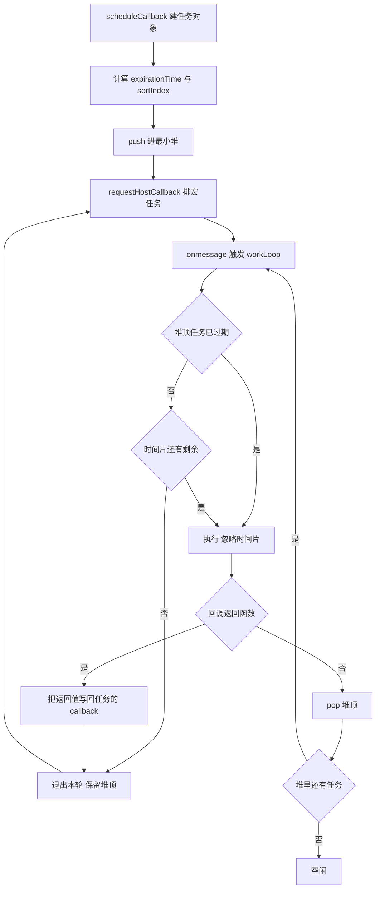

1. scheduleCallback 收到优先级与回调，算出过期时间和排序键。
2. 任务对象压进最小堆，堆顶自动是过期时间最小的那个。
3. 通过 MessageChannel 排一个宏任务，等浏览器把控制权交回来。
4. onmessage 里调用 workLoop，先看堆顶任务是否已经过期。
5. 已过期就立刻执行；没过期但时间片用完就退出本轮，保留堆顶。
6. 回调返回函数说明任务没做完，把它写回任务的 callback，下一轮继续。
7. 回调返回 undefined 说明任务完成，pop 掉堆顶取下一个。
8. 堆里还有任务就再排一个宏任务，堆空了就进入空闲。

**一步一步来**

第 1 步要做什么：定义优先级常量和任务结构。

```js
const ImmediatePriority = 1;
const UserBlockingPriority = 2;
const NormalPriority = 3;
const LowPriority = 4;
const IdlePriority = 5;

// 优先级到超时毫秒数的映射
const TIMEOUT_BY_PRIORITY = {
  [ImmediatePriority]: -1,
  [UserBlockingPriority]: 250,
  [NormalPriority]: 5000,
  [LowPriority]: 10000,
  [IdlePriority]: 1073741823,
};

let taskIdCounter = 1;
const taskQueue = new MinHeap();
let currentTask = null;
```

**这段代码在做什么**

- 五个优先级对应五种超时时长，数值来自 React Scheduler 源码。
- taskIdCounter 用来给任务编号，也用作相同过期时间时的次级排序键。
- taskQueue 是最小堆实例，堆顶是下一次要执行的任务。
- currentTask 保存本轮正在执行的任务，方便把它写回堆顶。

第 2 步要做什么：写调度入口，建任务并请求宏任务。

```js
// 把任务压进堆，并按需排一个宏任务
function scheduleCallback(priorityLevel, callback) {
  const startTime = now();
  const timeout = TIMEOUT_BY_PRIORITY[priorityLevel];
  const expirationTime = timeout === -1 ? -1 : startTime + timeout;
  const newTask = {
    id: taskIdCounter++,
    callback,
    priorityLevel,
    startTime,
    expirationTime,
    sortIndex: expirationTime, // 堆的主要比较字段
  };
  taskQueue.push(newTask);
  requestHostCallback(flushWork);
  return newTask;
}
```

**这段代码在做什么**

- expirationTime 为 -1 表示立刻过期，堆顶优先。
- sortIndex 单独存一份，方便以后换成按开始时间排序。
- 每个任务记录 startTime，用于统计等待时长。
- 入堆后立刻请求一个宏任务，不一定马上执行，取决于堆顶是谁。

第 3 步要做什么：写 workLoop，处理时间片与续体。

```js
const FRAME_INTERVAL_MS = 5;

// 返回 true 表示"可能还有任务"
function workLoop(hasTimeRemaining, initialTime) {
  let currentTime = initialTime;
  currentTask = taskQueue.peek();
  while (currentTask !== null) {
    // 没过期且时间片用完，退出本轮
    if (currentTask.expirationTime > currentTime && !hasTimeRemaining()) break;
    const callback = currentTask.callback;
    const didTimeout = currentTask.expirationTime <= currentTime;
    const continuation = callback(didTimeout);
    currentTime = now();
    if (typeof continuation === 'function') {
      currentTask.callback = continuation; // 未完成，留在堆顶
      return true;
    }
    taskQueue.pop();
    currentTask = taskQueue.peek();
  }
  return true;
}
```

**这段代码在做什么**

- hasTimeRemaining 是一个函数，由调用方决定时间片是否还有剩余。
- 只有"没过期"且"时间片用完"两个条件同时成立才让出。
- 已过期的任务会跳过时间片检查，直接执行，这是饥饿保护。
- 回调返回函数时把它写回任务的 callback，任务不 pop，下轮继续。
- 回调返回 undefined 时 pop 掉堆顶，切换到下一个任务。

第 4 步要做什么：用 MessageChannel 驱动 workLoop。

```js
let isHostCallbackScheduled = false;
const channel = new MessageChannel();
let sliceCount = 0;

channel.port1.onmessage = () => {
  isHostCallbackScheduled = false;
  sliceCount++;                        // 统计用掉几个宏任务轮次
  const startTime = now();
  // 时间片是否还有剩余，交给 workLoop 判断
  const hasTimeRemaining = () => now() - startTime < FRAME_INTERVAL_MS;
  workLoop(hasTimeRemaining, startTime);
  if (taskQueue.size > 0) requestHostCallback(); // 还有任务就再排一轮
};

function requestHostCallback() {
  if (isHostCallbackScheduled) return;
  isHostCallbackScheduled = true;
  channel.port2.postMessage(null);
}
```

**这段代码在做什么**

- isHostCallbackScheduled 防止同一个时间片里重复排队。
- sliceCount 记录宏任务轮次，用来验证任务是否真的被切片。
- hasTimeRemaining 用当前时刻减去片起点，结果小于 5 表示还有剩余。
- workLoop 返回后检查堆是否为空，非空就再排一个宏任务。

**动手验证**

```js
// 运行：node mini-scheduler.mjs
// 依赖：无，Node 20 提供全局 MessageChannel 与 performance
import assert from 'node:assert/strict';

const ImmediatePriority = 1;
const UserBlockingPriority = 2;
const NormalPriority = 3;
const TIMEOUT_BY_PRIORITY = {
  [ImmediatePriority]: -1,
  [UserBlockingPriority]: 250,
  [NormalPriority]: 5000,
};

class MinHeap {
  constructor() { this.heap = []; }
  get size() { return this.heap.length; }
  peek() { return this.heap.length > 0 ? this.heap[0] : null; }
  push(node) { this.heap.push(node); this.bubbleUp(this.heap.length - 1); }
  pop() {
    const top = this.heap[0];
    const last = this.heap.pop();
    if (this.heap.length > 0) { this.heap[0] = last; this.bubbleDown(0); }
    return top;
  }
  less(a, b) {
    return this.heap[a].sortIndex !== this.heap[b].sortIndex
      ? this.heap[a].sortIndex < this.heap[b].sortIndex
      : this.heap[a].id < this.heap[b].id;
  }
  bubbleUp(i) {
    while (i > 0) {
      const p = (i - 1) >> 1;
      if (!this.less(i, p)) break;
      [this.heap[p], this.heap[i]] = [this.heap[i], this.heap[p]];
      i = p;
    }
  }
  bubbleDown(i) {
    const h = this.heap;
    while (true) {
      let s = i;
      const l = 2 * i + 1, r = 2 * i + 2;
      if (l < h.length && this.less(l, s)) s = l;
      if (r < h.length && this.less(r, s)) s = r;
      if (s === i) break;
      [h[s], h[i]] = [h[i], h[s]];
      i = s;
    }
  }
}

const taskQueue = new MinHeap();
let taskIdCounter = 1;
let currentTask = null;
let isHostCallbackScheduled = false;
let sliceCount = 0;
const channel = new MessageChannel();

function now() { return fakeNow; }
let fakeNow = 0;

function scheduleCallback(priorityLevel, callback) {
  const startTime = now();
  const timeout = TIMEOUT_BY_PRIORITY[priorityLevel];
  const expirationTime = timeout === -1 ? -1 : startTime + timeout;
  const task = { id: taskIdCounter++, callback, expirationTime,
    startTime, sortIndex: expirationTime };
  taskQueue.push(task);
  requestHostCallback();
  return task;
}

function workLoop(hasTimeRemaining, initialTime) {
  let currentTime = initialTime;
  currentTask = taskQueue.peek();
  while (currentTask !== null) {
    if (currentTask.expirationTime > currentTime && !hasTimeRemaining()) break;
    const callback = currentTask.callback;
    const didTimeout = currentTask.expirationTime <= currentTime;
    const continuation = callback(didTimeout);
    currentTime = now();
    if (typeof continuation === 'function') {
      currentTask.callback = continuation;
      return true;
    }
    taskQueue.pop();
    currentTask = taskQueue.peek();
  }
  return true;
}

channel.port1.onmessage = () => {
  isHostCallbackScheduled = false;
  sliceCount++;
  const startTime = now();
  workLoop(() => now() - startTime < 5, startTime);
  if (taskQueue.size > 0) requestHostCallback();
};

function requestHostCallback() {
  if (isHostCallbackScheduled) return;
  isHostCallbackScheduled = true;
  channel.port2.postMessage(null);
}

function flush() {
  return new Promise((resolve) => {
    let spins = 0;
    const timer = setInterval(() => {
      if (taskQueue.size === 0 && !isHostCallbackScheduled) {
        clearInterval(timer);
        resolve();
      } else if (++spins > 200) {
        clearInterval(timer);
        throw new Error('flush 超时');
      }
    }, 1);
  });
}

// 用例一：优先级顺序，UserBlocking 的过期时间更小
const order = [];
scheduleCallback(NormalPriority, () => { order.push('normal'); });
scheduleCallback(UserBlockingPriority, () => { order.push('user-blocking'); });
await flush();
assert.deepEqual(order, ['user-blocking', 'normal']);

// 用例二：续体让任务跨多个宏任务轮次执行
const ups = [];
const firstSlice = sliceCount;
scheduleCallback(NormalPriority, function tick() {
  fakeNow += 2;                 // 模拟每个单位耗时 2 毫秒
  ups.push(ups.length + 1);
  return ups.length < 4 ? tick : undefined;
});
await flush();
assert.deepEqual(ups, [1, 2, 3, 4]);
assert.equal(sliceCount - firstSlice, 4);
console.log('优先级顺序', order.join(' '));
console.log('续体执行批次', ups.length, '宏任务轮次', sliceCount - firstSlice);
```

预期输出

```
优先级顺序 user-blocking normal
续体执行批次 4 宏任务轮次 4
```

**常见坑**

| 现象 | 原因 | 怎么修 |
| --- | --- | --- |
| 续体任务无限循环 | 条件判断写成了永远为真 | 每轮至少推进一个单位，并保留终止条件 |
| 任务执行顺序不稳定 | 过期时间相同时没有次级排序键 | 用任务 id 做次级比较键 |
| 让出后堆顶任务丢失 | 中断时把 break 写成了 pop | 时间片用完只 break，不 pop |
| 时间片为 0 时死循环 | hasTimeRemaining 永远返回真 | 确保 now 在每轮循环里被重新读取 |

**小结**

- 最小堆负责挑任务，workLoop 负责时间片，MessageChannel 负责把控制权交还浏览器。
- 续体是任务自己返回的函数，它让一个逻辑任务跨多个宏任务轮次执行。
- 过期检查先于时间片检查，这是低优先级任务不被饿死的保证。

## 10. 手写迷你 Fiber 遍历与验证

**先想一个问题**
把第 4 节的遍历和第 5 节的可中断循环拼起来，中断点真的能精确恢复吗？

**心智模型**
!!! tip "心智模型"
    一句话模型：遍历状态全部放在 workInProgress 指针和 Fiber 字段里，中断只是退出 while 循环。
    日常类比：看长篇小说时夹一张书签，合上书再打开就从书签处继续。
    类比不成立的地方：书签只记页码，Fiber 遍历的断点要靠 child、sibling、return 三个指针共同还原。

**图解**

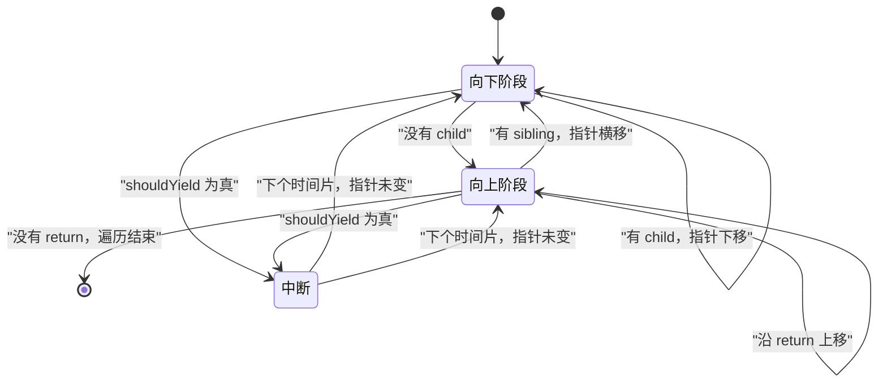

1. 有 child 时指针下移，仍处于向下阶段。
2. 没有 child 时进入向上阶段，对当前节点做 completeWork。
3. 向上阶段遇到 sibling 就横移，回到向下阶段。
4. 没有 sibling 就沿 return 上移，继续做 completeWork。
5. 直到 return 为 null，整棵树遍历结束。
6. shouldYield 为真时退出循环，指针停在当时的节点上。
7. 下个时间片重新进入循环时，从同一个指针继续，不需要重新开始。

**一步一步来**

第 1 步要做什么：建一棵带完整指针的 Fiber 树。

```js
// 建节点并连好三个方向的指针
function buildTree() {
  const root = { type: 'root', child: null, sibling: null, return: null, flags: 0 };
  const ul = { type: 'ul', child: null, sibling: null, return: root, flags: 0 };
  root.child = ul;
  const liA = { type: 'liA', child: null, sibling: null, return: ul, flags: 0 };
  const liB = { type: 'liB', child: null, sibling: null, return: ul, flags: 0 };
  ul.child = liA;
  liA.sibling = liB;
  return root;
}
```

**这段代码在做什么**

- 每个节点只保留遍历需要的四个字段。
- return 在建节点时直接写好，避免后面漏写。
- sibling 只写在 liA 上，liB 保持 null 表示同层结束。
- 这棵树的结构是 root 下只有 ul，ul 下有两个 li。

第 2 步要做什么：实现 performUnitOfWork，把两阶段串起来。

```js
let workInProgress = null;
const begun = [];
const completed = [];

function beginWork(fiber) {
  begun.push(fiber.type);
  return fiber.child; // 有子节点就继续向下
}

function completeWork(fiber) {
  completed.push(fiber.type);
}

function performUnitOfWork(fiber) {
  const next = beginWork(fiber);
  if (next !== null) {
    workInProgress = next; // 向下
    return;
  }
  // 没有子节点，进入向上阶段
  let node = fiber;
  while (node !== null) {
    completeWork(node);
    if (node.sibling !== null) { workInProgress = node.sibling; return; }
    node = node.return;
    workInProgress = node;
  }
}
```

**这段代码在做什么**

- beginWork 只做记录并返回 child，把 diff 细节留空。
- 有子节点时直接把指针移到子节点，函数返回。
- 没有子节点时进入内层 while，沿 return 一路向上。
- 遇到有 sibling 的节点就把指针横移并返回，外层循环继续向下。
- 内层 while 直到 node 为 null 才结束，此时 workInProgress 也是 null。

第 3 步要做什么：加可中断的循环，用假时钟精确控制中断点。

```js
let fakeNow = 0;
const now = () => fakeNow;
let deadline = 0;
function startSlice() { deadline = now() + 2; }
function shouldYield() { return now() >= deadline; }

// 每处理一个节点推进 1 毫秒，模拟工作量
function workLoopConcurrent() {
  while (workInProgress !== null && !shouldYield()) {
    fakeNow += 1;
    performUnitOfWork(workInProgress);
  }
  return workInProgress === null;
}
```

**这段代码在做什么**

- 假时钟让中断点完全可控，测试结果不会随机器性能变化。
- 时间片长度设为 2 毫秒，每个节点消耗 1 毫秒。
- 每个时间片最多处理 2 个节点，第 3 个节点必然留到下一片。
- 循环退出时 workInProgress 保存断点，调用方不需要额外处理。

**动手验证**

```js
// 运行：node mini-fiber.mjs
// 依赖：无，Node 20
import assert from 'node:assert/strict';

function buildTree() {
  const root = { type: 'root', child: null, sibling: null, return: null };
  const ul = { type: 'ul', child: null, sibling: null, return: root };
  root.child = ul;
  const liA = { type: 'liA', child: null, sibling: null, return: ul };
  const liB = { type: 'liB', child: null, sibling: null, return: ul };
  ul.child = liA;
  liA.sibling = liB;
  return root;
}

let workInProgress = null;
const begun = [];
const completed = [];

function beginWork(fiber) {
  begun.push(fiber.type);
  return fiber.child;
}
function completeWork(fiber) {
  completed.push(fiber.type);
}
function performUnitOfWork(fiber) {
  const next = beginWork(fiber);
  if (next !== null) { workInProgress = next; return; }
  let node = fiber;
  while (node !== null) {
    completeWork(node);
    if (node.sibling !== null) { workInProgress = node.sibling; return; }
    node = node.return;
    workInProgress = node;
  }
}

let fakeNow = 0;
const now = () => fakeNow;
let deadline = 0;
function startSlice(ms) { deadline = now() + ms; }
function shouldYield() { return now() >= deadline; }

let slices = 0;
function driveToCompletion(root, sliceMs) {
  workInProgress = root;
  while (workInProgress !== null) {
    startSlice(sliceMs);
    slices++;
    while (workInProgress !== null && !shouldYield()) {
      fakeNow += 1; // 每个节点消耗 1 毫秒
      performUnitOfWork(workInProgress);
    }
  }
}

// 用例一：时间片足够大，一次做完
driveToCompletion(buildTree(), 100);
assert.deepEqual(begun, ['root', 'ul', 'liA', 'liB']);
assert.deepEqual(completed, ['liA', 'liB', 'ul', 'root']);
assert.equal(slices, 1);

// 用例二：每片 2 毫秒，必须中断多次
begun.length = 0;
completed.length = 0;
fakeNow = 0;
slices = 0;
driveToCompletion(buildTree(), 2);

assert.deepEqual(begun, ['root', 'ul', 'liA', 'liB']);
assert.deepEqual(completed, ['liA', 'liB', 'ul', 'root']);
assert.equal(slices, 2);
console.log('向下顺序', begun.join(' '));
console.log('向上顺序', completed.join(' '));
console.log('时间片数量', slices);
```

预期输出

```
向下顺序 root ul liA liB
向上顺序 liA liB ul root
时间片数量 2
```

**常见坑**

| 现象 | 原因 | 怎么修 |
| --- | --- | --- |
| 中断后某个节点被处理两次 | performUnitOfWork 在推进指针前抛错或返回 | 保证每次调用只推进一次指针 |
| 向上顺序与向下顺序相同 | completeWork 写进了 beginWork | 向上的逻辑只在没有 child 时执行 |
| 时间片数量与实际不符 | 用了真实 performance.now | 测试里换注入式假时钟 |
| 遍历提前结束 | sibling 指针没连上 | 建树时把同层节点用 sibling 串联 |

**小结**

- 可中断遍历的全部状态就是 workInProgress 指针加 Fiber 上的三个字段。
- 中断只是退出循环，恢复只是重新进入循环，没有额外保存和还原动作。
- 假时钟让切片行为可以精确断言，测试结果不依赖机器速度。

## 综合对比

| 维度 | 递归 reconcile | 本页的可中断方案 | 说明 |
| --- | --- | --- | --- |
| 遍历载体 | 引擎调用栈 | 堆内存里的 Fiber 对象图 | 堆内存可随时停 |
| 中断位置 | 无法中断 | 每个节点处理完都可中断 | 粒度由一个节点决定 |
| 断点保存 | 引擎自动保存栈帧 | workInProgress 指针加三个字段 | 断点对代码可见 |
| 让出方式 | 不支持 | MessageChannel 排宏任务 | 无 4 毫秒下限 |
| 单片时长 | 等于总耗时 | 5 毫秒 | 取自 frameInterval |
| 任务选择 | 无 | 最小堆按过期时间取堆顶 | 取堆顶为常数级 |
| 优先级表示 | 无 | Lane 位掩码 | 按位与按位或操作 |
| 饥饿保护 | 无 | 过期时间与等待时长阈值 | 超时强制同步执行 |
| 双缓冲 | 无 | current 与 workInProgress 两棵树 | 提交时交换指针 |
| 内存上界 | 与调用深度相关 | 每个组件最多两个 Fiber 节点 | 靠 alternate 复用 |

## 应用与行业实践

### 应用场景地图

| 场景 | 用到本页哪个知识点 | 典型技术选型 | 注意事项 |
| --- | --- | --- | --- |
| 后台管理万行表格的筛选重算 | Lane 优先级、可中断 workLoop | React 18 + react-window | 过渡更新会多出一轮渲染，行 key 必须稳定 |
| 低端安卓机首屏水合 | Suspense 边界、可中断循环 | renderToPipeableStream + Suspense | 边界切得太碎会堆高请求数与调度开销 |
| 多人协作白板的远端操作 | Scheduler 最小堆、MessageChannel 让路 | scheduler 包 + canvas 直绘 | 本地笔迹别进 React 状态树，否则打断链路变长 |
| 富文本编辑器的连续输入 | 过期时间、饥饿处理 | React 18 + 自管 input 事件 | 输入回显走紧急车道，不能塞进 transition |
| 数据看板多图首屏 | beginWork 与 completeWork 遍历 | React + 图表库按需加载 | 图表库内部同步计算会绕过调度器 |
| 搜索框输入联想 | Lane 位运算、饥饿兜底 | useDeferredValue + 超时兜底 | 低优先级请求被反复抢占时要强制放行 |
| 埋点日志批量上报 | Scheduler 任务切片 | scheduler 包 + navigator.sendBeacon | 页面卸载前要 flush，不能只等空闲帧 |
| 大表单分步校验 | flags 标记、可中断遍历 | React Hook Form + 异步校验 | 校验放过渡车道，提交动作必须同步 |

### 三个场景拆解

#### 场景 1：后台管理万行表格的筛选卡顿

**业务背景**：表格有 1 万行、10 列，改一次筛选条件就要重算全表。痛点在下拉框，点一下要等主线程跑完整棵树，用户感觉点击没反应。复现方法：本地生成 1 万行假数据，用 DevTools 的 6x CPU 节流连续切换筛选 20 次。

**怎么用本页知识解决**：把输入回显和结果重算拆到两条更新里，重算走低优先级，输入走紧急优先级。

```jsx
import { useDeferredValue, useState } from 'react';

function FilterTable({ rows }) {
  const [keyword, setKeyword] = useState('');
  const deferred = useDeferredValue(keyword); // 表格读滞后值，输入框读实时值

  const visible = rows.filter(r => r.name.includes(deferred)); // 重算放进低优先级渲染

  return (
    <>
      <input value={keyword} onChange={e => setKeyword(e.target.value)} /> {/* 紧急更新 */}
      <VirtualList rows={visible} /> {/* 只挂载视口高度内的行 */}
    </>
  );
}
```

- `useDeferredValue` 把 `keyword` 和 `deferred` 分到两条更新，前者按输入优先级提交。
- 重算发生在低优先级渲染中，用户接着敲键盘时这次渲染可以被丢弃重来。
- 行 key 用稳定 id，中断后恢复渲染才不会串行状态。
- `VirtualList` 把同时挂载的 Fiber 节点数压到视口所需的数量。
- 过滤逻辑重时用 `useMemo` 缓存，避免每次渲染重复遍历整表。

**怎么度量收益**：看 INP 和长任务条数。用 web-vitals 采 INP，用 `PerformanceObserver` 订阅 `longtask` 条目；固定数据集重复 20 次，取 p75。

**什么时候不该用**：

- 行数在 500 以内、筛选耗时低于一帧的可感知阈值，同步渲染省掉一轮渲染。
- 排序与过滤必须与服务端分页结果对齐时，应把条件下推到查询接口。
- 需要一次性拿到完整 DOM 做打印或导出时，推迟渲染会拿到半成品。

#### 场景 2：低端安卓机的首屏水合

**业务背景**：首屏要水合一个长列表加三个挂件，从 HTML 到可点击之间夹着连续多段长任务。复现方法：在 DevTools 开 6x CPU 节流，用 Performance 面板录制一次冷启动。

**怎么用本页知识解决**：把首屏切成多个 Suspense 边界，服务端先送外壳，客户端按用户动作安排水合顺序。

```jsx
// 服务端：外壳先流式送出，用户先看到能点的骨架
const { pipe } = renderToPipeableStream(<App />, {
  onShellReady() { pipe(res); },
});

// 客户端：每个区域是独立的水合单元
<Suspense fallback={<ListSkeleton />}>
  <LongList /> {/* 用户点到它时，这条边界的 Lane 会被抬高 */}
</Suspense>
```

- 外壳先到，浏览器在 JS 解析完成前就能画出可点击的骨架。
- 点击某个区域时，该边界的水合优先级被抬高，其余边界继续等待。
- 水合走的是可中断循环，遇到输入事件会让出主线程。
- 边界按用户第一眼要点的区域来切，其余区域留到空闲时水合。

**怎么度量收益**：看 Lighthouse 报告里的 TBT 与 INP，加上 `longtask` 条数与总时长。测量方法：同一台设备、同一网络档位，冷启动跑 10 次取中位数。

**什么时候不该用**：

- 首屏只有一个小组件时，切边界会多出请求与调度开销。
- 纯静态展示页不依赖交互，服务端直接输出完整 HTML，无需等 JS 解析。
- 水合期间必须完成全量数据初始化时，提前让出主线程会推后数据就绪时间。

#### 场景 3：多人协作白板的远端操作合批

**业务背景**：白板房间 5 到 20 人，每人每秒发出 10 次以上指针事件，远端操作一到就重渲染会让本地笔迹掉帧。复现方法：本地起一个 mock WebSocket，每秒推 50 条图形操作，记录画笔延迟。

**怎么用本页知识解决**：远端操作进队列，用 Scheduler 的普通优先级批量处理；本地笔迹走 canvas，不经过 React 状态树。

```js
import {
  unstable_scheduleCallback as schedule, // 复用 Scheduler 的最小堆
  unstable_NormalPriority as NORMAL,     // 远端操作走普通优先级
} from 'scheduler';

const pending = [];
let handle = null;

function onRemoteOp(op) {
  pending.push(op);              // 先入队，不立刻渲染
  if (handle) return;            // 已有待执行任务就复用，形成合批
  handle = schedule(NORMAL, () => {
    handle = null;
    applyOps(pending.splice(0)); // 一次 flush 处理整批，减少渲染次数
  });
}
```

- 远端操作进队列而不是直接 setState，把 N 次渲染压成 1 次。
- 普通优先级意味着本地输入到来时，这个任务被打断并重新排期。
- 本地笔迹用 canvas 直接绘制，链路只剩一次绘图调用。
- `pending` 设长度上限，超限时按时间窗强制 flush 一次，避免无限堆积。

**怎么度量收益**：指标是 `pointermove` 到下一帧 `requestAnimationFrame` 的时间差，取 p95，另看 INP。测量方法：mock 恒定推 50 条每秒，连续画 30 秒。

**什么时候不该用**：

- 画布内容必须与服务端状态逐帧一致时，本地先行绘制会引入回滚。
- 单人在线、没有远端操作时，队列与合批只是多出一层间接调用。

### 行业先进实践

`startTransition` 与 `useDeferredValue`（出处：React 官方文档 react.dev）。文档把更新分成紧急与过渡两类，过渡更新可被打断。借鉴点：把输入回显与结果重算拆到两条更新，而不是给结果加重试。

`scheduler` 包的 API（出处：React 开源仓库的 packages/scheduler）。它导出 `unstable_scheduleCallback`、`unstable_shouldYield`、`unstable_runWithPriority`，内部用最小堆加 MessageChannel。借鉴点：自研调度器前先读它的实现。需核对官方文档：核对这几个导出在目标版本里是否仍存在、参数语义是否变化。

长列表窗口化（出处：react-window 开源项目）。它只挂载视口内的行，把 Fiber 树规模从总行数降到可视行数。借鉴点：先做窗口化，再谈优先级调度，否则调度的是本来不该存在的工作量。

长任务与交互延迟的线上采集（出处：W3C Long Tasks 与 Event Timing 规范、web-vitals 开源项目）。`PerformanceObserver` 可订阅 `longtask` 与 `event` 条目，web-vitals 把 `event` 条目聚合成 INP。借鉴点：把 p75 而不是平均值当作主线程卡顿的观察值。

录制与 CPU 节流（出处：Chrome DevTools 官方文档）。Performance 面板能录制一段交互并标出长任务，CPU 节流用来复现低端设备的主线程竞争。借鉴点：改动前后各录同一段操作，对比长任务条数与 INP。

### 从学到用：落地路线

第 1 步：在长列表页面试点，把一处筛选重算改成过渡更新。验收：本地 6x 节流下录同一段操作，长任务条数不上涨，输入回显不丢字符。

第 2 步：加线上度量，采集 INP 与 `longtask`。验收：看板能读出该页面 INP 的 p75 与长任务分布，采样率和上报字段固定下来。

第 3 步：把这套改法推广到同类页面，写成检查清单。验收：清单写明哪些更新走紧急车道、哪些走过渡车道，新页面评审逐条对照。

第 4 步：加回归防护。验收：CI 跑一段固定交互脚本，长任务条数或 INP 越过阈值就让流水线失败。

### 动手作业

**目标**：给一个 1 万行假数据表格加上自研调度层，让筛选与滚动在 6x CPU 节流下不产生超过 50 毫秒的长任务，并把首屏拆出一个 Suspense 边界。

**步骤**：

1. 用固定随机种子生成 1 万行假数据，脚本可重复运行。
2. 用 `PerformanceObserver` 订阅 `longtask`，把条数与总时长打到控制台。
3. 先跑同步筛选版本，记录基线数据。
4. 改用 `useDeferredValue` 或 `startTransition`，跑同一脚本对比。
5. 参照本页"手写迷你 Scheduler"，把结果更新改成队列式并验证可中断。
6. 给首屏加一个 Suspense 边界，观察水合顺序与骨架出现时机。
7. 把基线与优化后的两组数据写进 README，附录制文件路径。

**验收标准**：

- 同一脚本连续 20 次，`longtask` 条数低于基线的一半。
- 输入框连续输入 50 个字符，回显无丢字。
- 筛选结果与同步版本逐行一致，用 JSON 比对通过。
- 调度器断言测试通过：任务按过期时间出队，让出后能恢复。
- README 能看到两组数字并给出复现命令。

## 深入阅读与参考

!!! tip "怎么用这些资料"
    先读「官方文档与规范」建立准确的概念，再读「源码与示例」核对细节，最后用「教程、书籍与视频」换一种讲法加深理解。每条都写明了读哪一节、带着什么问题读。

### 官方文档与规范

| 资源 | 为什么读 | 怎么读 |
|---|---|---|
| [useTransition](https://react.dev/reference/react/useTransition) | 用户侧优先级 API，与 Lane 调度直接对应 | 读 Caveats 与示例，做一个输入框加慢列表的过渡更新实验 |
| [useDeferredValue](https://react.dev/reference/react/useDeferredValue) | 延迟值实现，体会优先级让位与中断 | 读与 useTransition 的区别，动手对比开关前后的输入卡顿 |

### 源码与示例

| 资源 | 为什么读 | 怎么读 |
|---|---|---|
| [React 源码仓库](https://github.com/facebook/react) | 最权威实现，可直接对照本页伪代码 | 从 react-reconciler 的 beginWork 与 completeWork 下断点，观察 workLoop 的中断点 |
| [React Scheduler](https://github.com/facebook/react/tree/main/packages/scheduler) | Scheduler 包入口与源码导读起点 | 先读 README 再进 Scheduler.js，带着最小堆与过期时间问题读 |
| [README.md](https://github.com/facebook/react/blob/main/packages/scheduler/README.md) | 官方说明调度器设计目标与使用边界 | 读设计动机与 API 描述，弄清 MessageChannel 与 postTask 的选择原因 |
| [SchedulerMinHeap.js](https://github.com/facebook/react/blob/main/packages/scheduler/src/SchedulerMinHeap.js) | 最小堆实现，理解任务排序与 peek/pop | 手抄 push/pop 并写单测，验证 O(log n) 与过期时间比较逻辑 |
| [SchedulerPriorities.js](https://github.com/facebook/react/blob/main/packages/scheduler/src/SchedulerPriorities.js) | 优先级常量与超时映射，对应 Lane 概念 | 读各优先级 timeout 值，换算成 expirationTime，对照 Lane 位运算表 |
| [SchedulerMock.js](https://github.com/facebook/react/blob/main/packages/scheduler/src/forks/SchedulerMock.js) | 可在测试中模拟调度的 mock 实现 | 读其推进时间的逻辑，用 Jest 假时钟复现一次饥饿与抢占 |

### 教程、书籍与视频

| 资源 | 为什么读 | 怎么读 |
|---|---|---|
| [Build Your Own React](https://pomb.us/build-your-own-react/) | 从零手写 Fiber 与调度，最适合对照本章 | 跟做 Fiber 与调度两节，先抄再改，最后自己实现 shouldYield |
| [React Fiber 架构笔记](https://github.com/acdlite/react-fiber-architecture) | 中文长文梳理 Fiber 链表与工作循环 | 重点读 workLoop 与 effect list 节，读后手绘 begin/complete 流程图 |
| [Overreacted：React as a UI Runtime](https://overreacted.io/react-as-a-ui-runtime/) | 从运行时视角解释调度与渲染模型 | 分段读，每节用一句话复述，重点看并发与调度相关段落 |
| [Loupe 事件循环可视化工具](https://latentflip.com/loupe/) | 可视化事件循环，直观理解 4ms 钳制 | 把嵌套 setTimeout 示例粘进去，逐步观察宏任务队列与耗时 |
| [长任务优化](https://web.dev/articles/optimize-long-tasks) | 长任务拆分实践，理解主动让出主线程 | 用 scheduler.yield 拆分一个长任务，复测 INP 前后差异 |

## 自测题

??? question "题目 1：一帧 16.67 毫秒里，浏览器自己要用掉多少，留给 JavaScript 多少？"
    - 一帧时长是 1000 除以 60，等于 16.67 毫秒。
    - 样式计算、布局、绘制、合成约占 6 毫秒。
    - 输入事件分发约占 2 毫秒，合成提交约占 3 毫秒。
    - 三项相加 11 毫秒，剩余约 5.67 毫秒给 JavaScript。
    - React Scheduler 的 frameInterval 取 5 毫秒，与此接近。

??? question "题目 2：Fiber 节点的 child、sibling、return 三个字段各解决什么问题？"
    - child 指向第一个子节点，对应递归向下进入下一层。
    - sibling 指向同层下一个节点，对应循环取下一个元素。
    - return 指向父节点，对应函数返回时回到调用者。
    - 三者合起来定义了一棵树的深度优先顺序，遍历不依赖引擎调用栈。
    - 只有 child 无法找到第二个子节点，只有 return 无法向上跳出内层。

??? question "题目 3：为什么要维护 current 和 workInProgress 两棵树？"
    - 屏幕上渲染的树必须保持完整，用户不能看到改到一半的状态。
    - 所有改动先写在 workInProgress 树上，构建期间不影响显示。
    - 提交时只交换 root.current 一个指针，成本与树大小无关。
    - alternate 让同一组件的 Fiber 对象最多两个，内存有上界。
    - 中断恢复时 workInProgress 树原样保留，下个时间片继续构建。

??? question "题目 4：beginWork 与 completeWork 的执行顺序有什么规律？"
    - beginWork 是向下阶段，每个节点在进入时执行一次。
    - completeWork 是向上阶段，每个节点在离开时执行一次。
    - 向下顺序从根到叶，向上顺序从叶到根。
    - root 下是 ul、ul 下是 liA 和 liB 时，向下顺序是 root、ul、liA、liB。
    - 同一棵树的向上顺序是 liA、liB、ul、root。

??? question "题目 5：workLoopConcurrent 什么时候退出，断点保存在哪里？"
    - 循环条件同时检查 workInProgress 不为 null 与 shouldYield 为假。
    - shouldYield 为真说明当前时间片用完，退出本轮循环。
    - 断点保存在 workInProgress 这个模块级变量里，指向下一个要处理的节点。
    - 退出时不做任何清理，指针与 Fiber 字段共同还原完整状态。
    - 下个时间片重新进入循环，从同一个指针继续处理。

??? question "题目 6：为什么 Scheduler 用 MessageChannel 而不是嵌套的 setTimeout？"
    - MessageChannel 的 postMessage 排的是宏任务，规范没有给它设置最小延迟。
    - setTimeout 与 setInterval 嵌套超过 5 层后，最小延迟被强制提升到 4 毫秒。
    - 每帧只有 16.67 毫秒，4 毫秒下限会挤掉约四分之一帧。
    - 两者都是宏任务，微任务会先于它们清空，不能用微任务代替。
    - 用布尔标志防止同一个时间片内重复排消息。

??? question "题目 7：最小堆的 push 与 pop 分别做了什么调整？"
    - push 把新元素放到数组末尾，再沿父节点向上比较交换。
    - 比较用 sortIndex 做主键，相等时用任务 id 做次级键。
    - pop 保存堆顶，把末尾元素移到根位置，再向下比较交换。
    - 下沉时先比较左右孩子，挑较小的那个与当前节点交换。
    - 两种操作的复杂度都是对数级，取堆顶是常数级。

??? question "题目 8：Lane 模型中怎么表示优先级合并，怎么处理饥饿？"
    - 一个 lane 占一个二进制位，多个更新用按位或合并成 lanes 集合。
    - 取最高优先级用 lanes 与负 lanes 按位与，得到最低位的 1。
    - 判断包含关系用按位与结果不等于 NoLane，不能比较数值大小。
    - 每个 lane 第一次出现时记录等待起始时刻。
    - 等待超过阈值就标记为过期，下次渲染跳过时间片强制执行。

## 延伸阅读

- React 官方文档：《Suspense》章节
- React 官方文档：《useTransition》章节
- React 官方文档：《useDeferredValue》章节
- React 源码：packages/scheduler/src/Scheduler.js，重点看 frameInterval、timeoutForPriorityLevel、workLoop、requestHostCallback
- React 源码：packages/react-reconciler/src/ReactFiberWorkLoop.js，重点看 performUnitOfWork、completeUnitOfWork、workLoopConcurrent
- React 源码：packages/react-reconciler/src/ReactFiberBeginWork.js 与 ReactFiberCompleteWork.js
- React 源码：packages/react-reconciler/src/ReactFiberLane.js，重点看 lane 常量、getHighestPriorityLane、markStarvedLanesAsExpired 相关逻辑（函数名随版本调整，需核对官方文档：该文件中处理饥饿的函数当前命名）
- MDN Web API：《MessageChannel》章节
- MDN Web API：《setTimeout》中的「延时限制」章节
