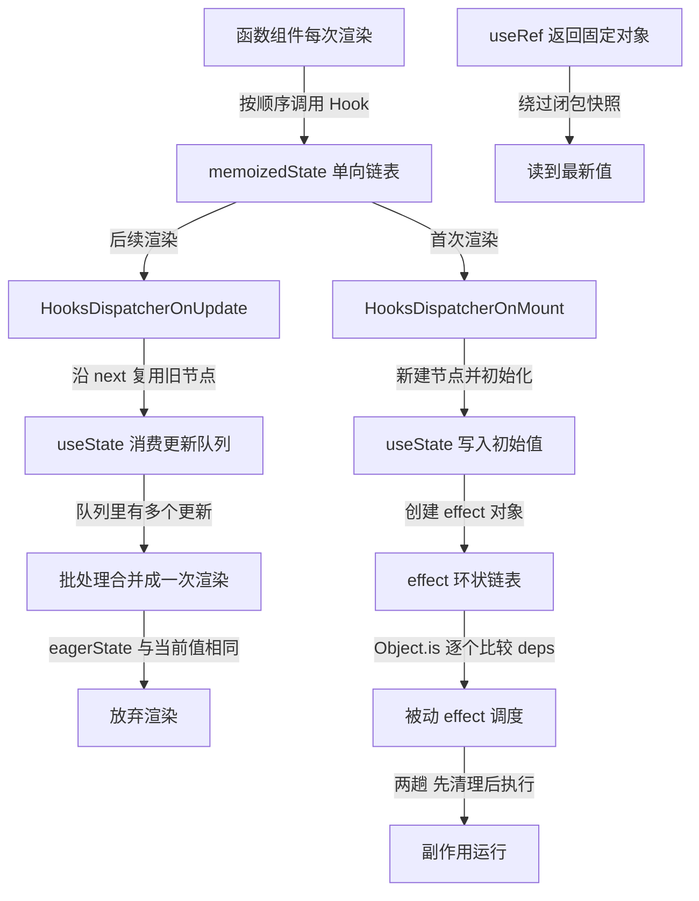
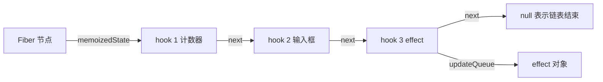
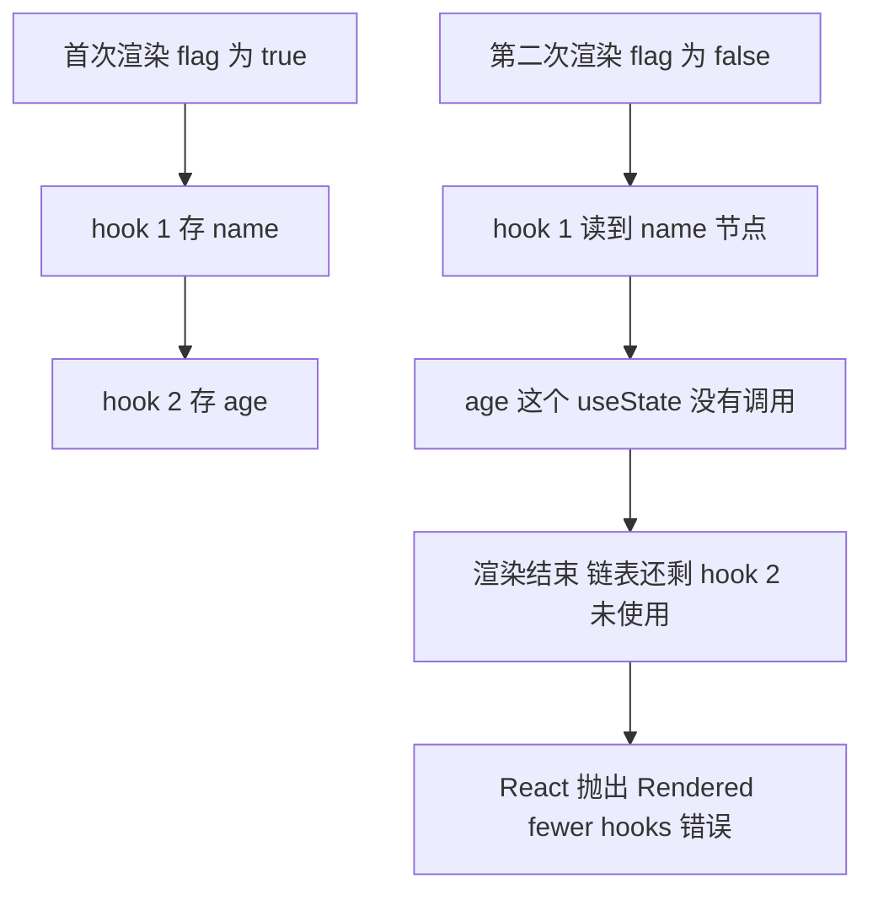
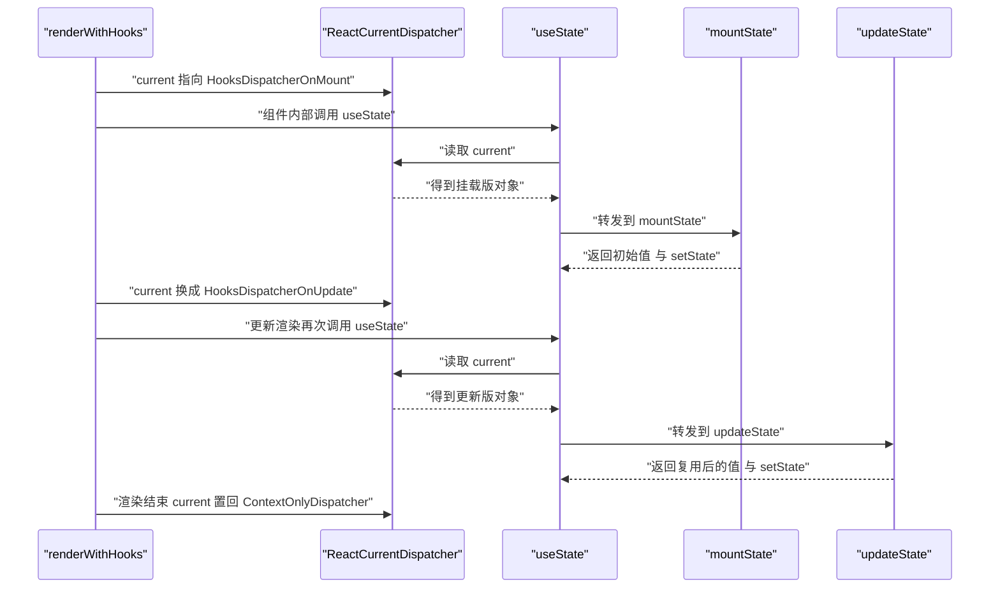
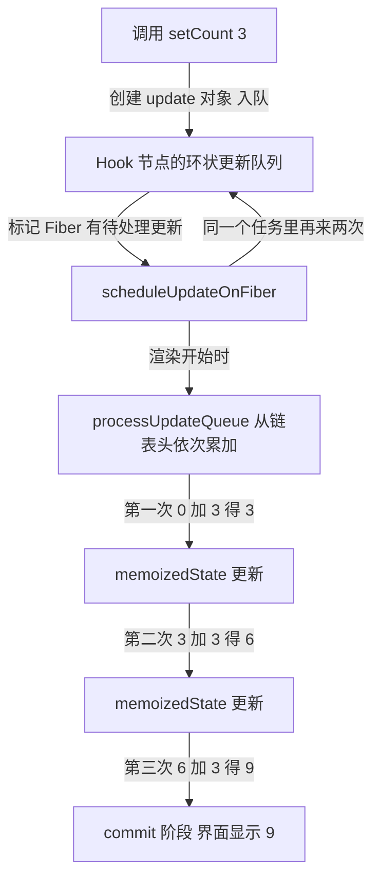
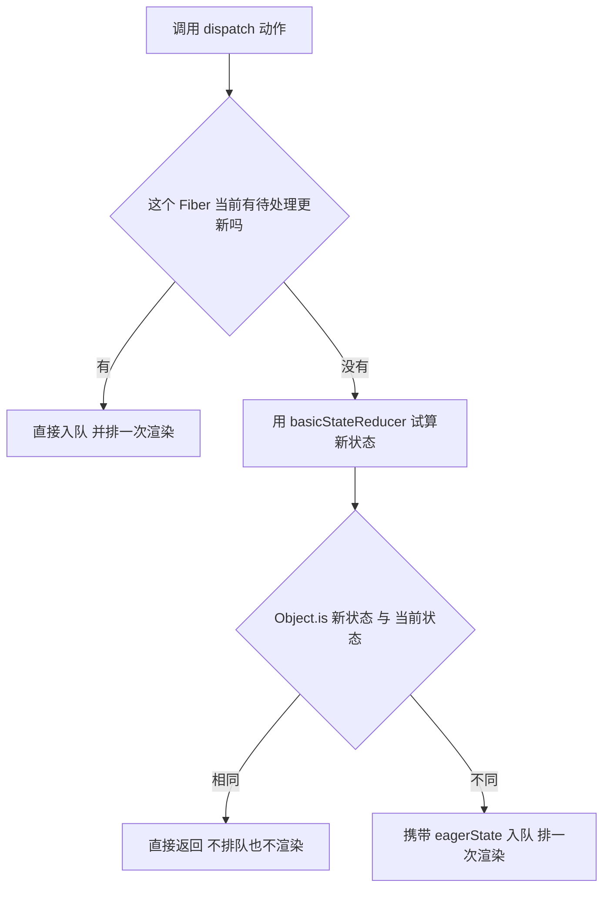
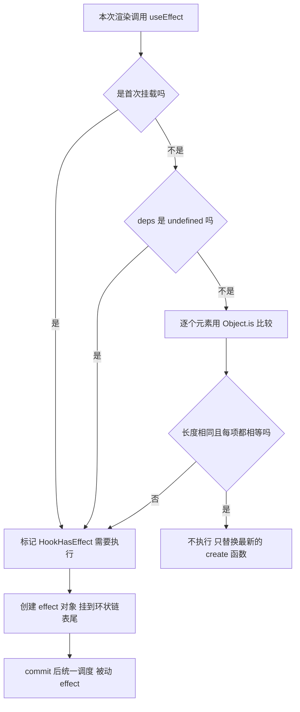
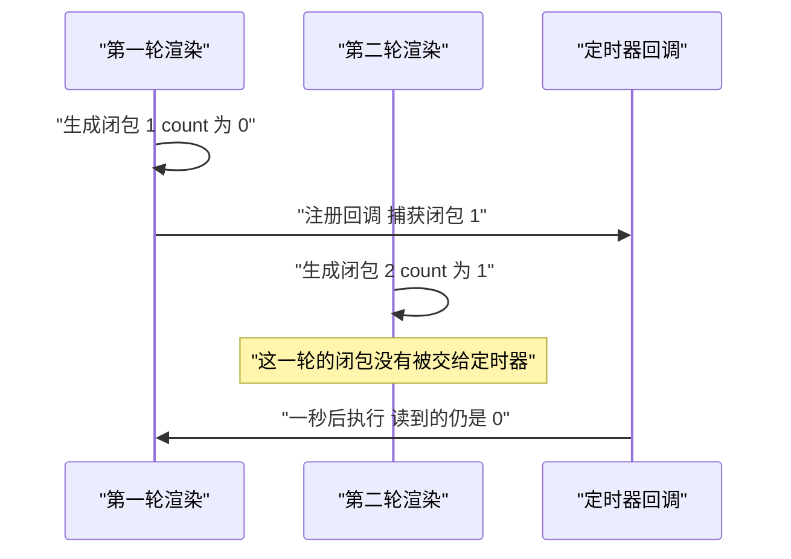
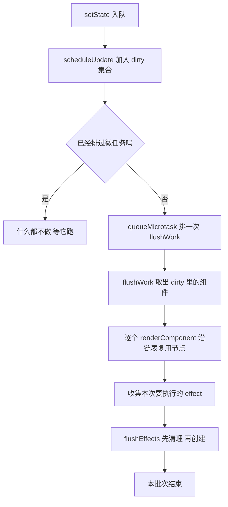

# Hooks 的实现原理：链表、闭包与依赖比较

!!! abstract "学完这一页你能"
    - 说出 Hook 挂在 Fiber 的哪个字段上，并解释它为什么按调用顺序存放。
    - 分清挂载与更新两次渲染各自调用的函数，并说出条件语句让链表错位的直接后果。
    - 用 `Object.is` 判断依赖数组是否变化，并说出清理与执行分两趟的原因。
    - 从零写出一个能跑的迷你 React，支持 `useState`、`useEffect`、`useRef`、`useMemo`、`useCallback` 与批处理。

## 0. 知识地图



建议先读 1 到 3 节，把链表与 dispatcher 的印象立住。再读 4 到 6 节，看更新队列与 effect 链表怎么被消费。最后读 7 到 9 节，处理闭包问题并自己写一遍。每一节都带一个能单独运行的文件。

## 1. memoizedState 链表：Hook 挂在哪儿

**先想一个问题**

一个组件里写了三个 `useState`。第三次渲染时，React 靠什么认出第一个 `useState` 该拿到哪个值？这些调用没有名字，只有先后顺序。

**心智模型**

!!! tip "心智模型"
    一句话模型：每个函数组件对应一条单向链表，链表第 n 个节点就是第 n 个 Hook，顺序即身份。
    日常类比：一列火车按车厢号装货，车头记第一节车厢，每节车厢记下一节在哪。
    类比不成立的地方：车厢可以随意摘挂，链表节点不能。挂载之后顺序一变，就会读到别的 Hook 的数据。

!!! note "术语：memoizedState"
    Fiber 节点上的一个字段，指向这条 Hook 链表的第一个节点；每个链表节点上也有自己的 `memoizedState`，存这个 Hook 的数据。例：第一个 `useState` 节点的 `memoizedState` 是它当前的数值。

!!! note "术语：Fiber"
    React 内部描述一个组件实例的对象，字段包含 `memoizedState`、`updateQueue`、`flags`。例：一个函数组件渲染一次，对应一个 Fiber 节点。

**图解**



1. `Fiber.memoizedState` 指向链表头，也就是第一个被调用的 Hook。
2. `hook 1` 的 `memoizedState` 存第一个 `useState` 的当前值。
3. `hook 1.next` 指向第二个 Hook 节点。
4. `hook 2` 存第二个 `useState` 的值；`useEffect` 同样在链表里占一个节点。
5. 走到最后一个节点时 `next` 是 `null`，本次渲染结束。
6. `useEffect` 节点上多挂一个 `updateQueue`，里面放 effect 对象。

**一步一步来**

第一步：先把节点的形状定下来。

```js
// 一个 Hook 节点在内存里的字段
function createHook() {
  return {
    memoizedState: null, // 这个 Hook 自己的数据：state 值 或 deps 数组
    queue: null,         // 待处理的更新队列，useState 用
    next: null,          // 指向下一个 Hook，链表靠它串起来
  };
}
```

**这段代码在做什么**

- `memoizedState` 在不同 Hook 里存不同东西：`useState` 存值，`useEffect` 存依赖数组。
- `queue` 只在更新队列存在时才有值，`useEffect` 的队列在 `updateQueue` 字段上。
- `next` 是唯一的定位手段，React 顺着它走，不按名字查找。
- 函数本身不保存状态，全部状态都在节点对象里。

第二步：挂载时追加节点，更新时沿指针前进。

```js
let currentFiber = null; // 正在渲染的组件
let cursor = null;       // 更新渲染时沿链表前进的游标

function mountHook() {
  const hook = createHook();           // 挂载没有旧节点，新建一个
  if (currentFiber.firstHook === null) {
    currentFiber.firstHook = hook;     // 第一个节点当链表头
  } else {
    currentFiber.lastHook.next = hook; // 追加到链表尾
  }
  currentFiber.lastHook = hook;
  return hook;
}

function updateHook() {
  cursor = cursor === null ? currentFiber.firstHook : cursor.next;
  if (cursor === null) throw new Error('Hook 数量比首次渲染多');
  return cursor;
}
```

**这段代码在做什么**

- 挂载渲染没有旧节点可复用，所以新建并追加，靠尾指针完成。
- 更新渲染要复用旧节点，所以顺着 `next` 走，靠游标完成。
- 两条路径都只关心"这是第几次调用"，不关心 Hook 的名字。
- `throw` 那一行就是条件语句崩溃的直接原因：走到链表尾巴还没走完。

没有输出，这是一段库内代码。

**动手验证**

```js
// hook-list.mjs  运行：node hook-list.mjs
// 依赖：Node 20 及以上内置模块 node:assert
import assert from 'node:assert/strict';

function createHook() {
  return { memoizedState: null, next: null };
}

const fiber = { firstHook: null, lastHook: null, cursor: null };

function mountHook(value) {
  const hook = createHook();
  hook.memoizedState = value;
  if (fiber.firstHook === null) fiber.firstHook = hook;
  else fiber.lastHook.next = hook;
  fiber.lastHook = hook;
  return hook;
}

function updateHook() {
  fiber.cursor = fiber.cursor === null ? fiber.firstHook : fiber.cursor.next;
  if (fiber.cursor === null) throw new Error('Hook 数量比首次渲染多');
  return fiber.cursor;
}

const a = mountHook(10);
const b = mountHook('名字');
const c = mountHook({ list: [] });
assert.equal(fiber.firstHook, a);
assert.equal(a.next, b);
assert.equal(b.next, c);
assert.equal(c.next, null);

fiber.cursor = null;
assert.equal(updateHook(), a);
assert.equal(updateHook(), b);
assert.equal(updateHook(), c);

fiber.cursor = null;
updateHook(); updateHook(); updateHook();
assert.throws(() => updateHook(), /Hook 数量比首次渲染多/);

console.log('链表节点数量 =', 3);
console.log('按序复用通过，多调一个 Hook 抛错通过');
```

预期输出：

```
链表节点数量 = 3
按序复用通过，多调一个 Hook 抛错通过
```

**常见坑**

| 现象 | 原因 | 怎么修 |
| --- | --- | --- |
| 两个组件的 state 互相串了 | 把 Hook 写在 `if` 里，节点顺序错位 | 把 Hook 提到组件顶层，条件放进 Hook 内部 |
| 第一次渲染正常，切换条件后白屏 | 更新渲染走到 `next` 为 `null`，抛 "Rendered more hooks" | 保证每次渲染调用的 Hook 数量与顺序完全一致 |
| 想按条件跳过重逻辑 | 误以为不写 Hook 可以省开销 | 用 `useMemo` 的条件写在工厂函数内部，Hook 本身照调 |

**小结**

- `Fiber.memoizedState` 指向链表头，节点上的 `next` 串起整条链。
- 每个 Hook 节点的 `memoizedState` 存这个 Hook 自己的数据。
- 定位方式是调用序号，不是名字也不是 key。

## 2. 为什么 Hook 不能写在条件语句里

**先想一个问题**

下面这段代码第一次渲染时 `flag` 是 `true`，第二次变成 `false`。第二次渲染拿到的是哪个状态？

```js
const [name, setName] = useState('a');
if (flag) { const [age, setAge] = useState(18); }
```

**心智模型**

!!! tip "心智模型"
    一句话模型：Hook 的序号就是它的身份，序号一变身份就换了人。
    日常类比：衣柜有三个抽屉贴了编号，你抽掉第二个，第三个抽屉里的东西就挪到了第二个位置。
    类比不成立的地方：抽屉里的东西不会变，链表的节点会被原地复用，读出来的值看起来"没报错但不对"。

!!! note "术语：链表错位"
    更新渲染按序号取节点，可实际调用的 Hook 数量或顺序变了，取到的节点和上一次调用不是同一个。例：`flag` 变 `false` 后，第二个 `useState` 不再调用，链表尾部多出一个节点。

**图解**



1. 首次渲染调了两个 Hook，链表长度是 2。
2. `hook 1` 存 `name`，`hook 2` 存 `age`。
3. 第二次渲染只调了第一个 `useState`，游标停在 `hook 1`。
4. `age` 那个 `useState` 完全没有执行，`hook 2` 没被消费。
5. 渲染结束时 React 发现链表还有剩余节点。
6. React 抛错，因为继续复用下去会把别的 Hook 数据当成 `age`。

**一步一步来**

第一步：模拟错位的读取过程。

```js
// 链表与调用序列的对照实验
const hooks = [{ v: 'name 节点' }, { v: 'age 节点' }];
let cursor = -1;

function next() {
  cursor += 1;                 // 每调用一次 Hook，序号加一
  return hooks[cursor];        // 按序号取节点，不看名字
}

console.log(next().v);         // 第一次调用拿到 name 节点
// 第二次调用被 if 挡住了，没有执行
console.log('剩余未消费节点 =', hooks.length - (cursor + 1)); // 1
```

**这段代码在做什么**

- `cursor` 模拟更新渲染时的游标，从 `-1` 开始。
- 每次调用 Hook 就加一，说明身份只跟调用次数有关。
- 被 `if` 挡住的调用不会让游标前进，节点就留在链表里。
- 剩余节点数量不为 0，说明调用序列变了。

运行结果：

```
name 节点
剩余未消费节点 = 1
```

第二步：看 React 实际的报错文案与触发点。

```js
// React 在 renderWithHooks 结束时会做的两个检查
function checkHookCount(isMount, cursor, firstHook) {
  if (isMount) return;                       // 首次渲染不做检查
  if (cursor === null && firstHook !== null) {
    throw new Error('Rendered fewer hooks than expected');
  }
  if (cursor !== null && cursor.next !== null) {
    throw new Error('Rendered fewer hooks than expected');
  }
}
```

**这段代码在做什么**

- 首次渲染允许任意数量，因为链表正在建立，没有对照标准。
- 游标为 `null` 但有链表头，说明这次一个 Hook 都没调用。
- 游标还有 `next`，说明这次少调了 Hook，链表没走完。
- 第二种情况报错文案在开发环境会提示具体是哪个 Hook 引起。

没有输出，这是一段校验逻辑。

**动手验证**

```js
// hook-order.mjs  运行：node hook-order.mjs
// 依赖：Node 20 及以上内置模块 node:assert
import assert from 'node:assert/strict';

const fiber = { firstHook: null, lastHook: null, cursor: null };
let isMount = true;

function getHook() {
  if (isMount) {
    const hook = { v: fiber.length = (fiber.length || 0) + 1, next: null };
    if (fiber.firstHook === null) fiber.firstHook = hook;
    else fiber.lastHook.next = hook;
    fiber.lastHook = hook;
    return hook;
  }
  fiber.cursor = fiber.cursor === null ? fiber.firstHook : fiber.cursor.next;
  if (fiber.cursor === null) throw new Error('Hook 数量比首次渲染多');
  return fiber.cursor;
}

function render(body) {
  fiber.cursor = null;
  body();
  if (!isMount) {
    if (fiber.cursor === null) throw new Error('Hook 数量比首次渲染少');
    if (fiber.cursor.next !== null) throw new Error('Hook 数量比首次渲染少');
  } else {
    isMount = false;
  }
}

render(() => { getHook(); getHook(); });   // 首次渲染两个 Hook
render(() => { getHook(); });              // 更新渲染只调一个
assert.throws(() => render(() => { getHook(); }), /Hook 数量比首次渲染少/);
console.log('少调 Hook 被检出');
```

预期输出：

```
少调 Hook 被检出
```

**常见坑**

| 现象 | 原因 | 怎么修 |
| --- | --- | --- |
| 报 "Rendered more hooks than during the previous render" | 更新渲染里多调了 Hook | 把新增的 Hook 提到顶层，用状态控制它内部逻辑 |
| 报 "Rendered fewer hooks than expected" | 更新渲染少调了 Hook | 不要在 `if`、`for`、`try` 里调用 Hook |
| 提前 `return` 导致报错 | `return` 之前的 Hook 数量随条件变化 | 把 `return` 前的 Hook 全部提到 `return` 上面 |
| 循环里调用 Hook | 数组长度变化让 Hook 数量跟着变 | 把数据当状态存，循环只渲染 UI |

**小结**

- Hook 的身份是调用序号，不是名字。
- 数量或顺序变化会让节点被错位复用，React 在渲染结束时检查并抛错。
- 条件逻辑写在 Hook 内部，不要写在 Hook 外面。

## 3. mount 与 update：两套 dispatcher

**先想一个问题**

同一个 `useState` 函数对象，第一次渲染要创建状态，第二次渲染要读取状态。它怎么知道该做哪一件事？

**心智模型**

!!! tip "心智模型"
    一句话模型：React 在渲染前把全局的 `ReactCurrentDispatcher.current` 换成挂载版或更新版，`useState` 只是转发调用。
    日常类比：药盒上的标签不变，护士按治疗阶段换盒里的药片。
    类比不成立的地方：不是同名函数被替换，而是每次调用都去读全局字段，读到哪个版本由当前渲染阶段决定。

!!! note "术语：dispatcher"
    一个对象，字段是 `mountState`、`updateState` 这类函数。例：`HooksDispatcherOnMount.useState` 指向 `mountState`。

!!! note "术语：转发调用"
    `useState` 自己不做逻辑，它读出当前 dispatcher，再把参数交给 dispatcher 上的对应函数。例：挂载阶段 `useState` 实际执行的是 `mountState`。

**图解**



1. 渲染开始，`renderWithHooks` 根据是不是首次渲染决定装哪个 dispatcher。
2. 组件内部调用 `useState`，它第一件事是读全局的 `current`。
3. 首次渲染读到挂载版，转发到 `mountState`，创建节点并写初始值。
4. 更新渲染读到更新版，转发到 `updateState`，复用节点并消费队列。
5. 组件渲染结束后，`current` 被换成 `ContextOnlyDispatcher`。
6. 这个版本上所有 Hook 函数都会抛 "Invalid hook call"，这就是 Hook 不能写在普通函数里的原因。

**一步一步来**

第一步：写一个最小可用的 dispatcher 切换。

```js
// 用一个普通对象模拟 React 的全局 dispatcher 指针
const Dispatcher = { current: null };

// 挂载版：两个 Hook 都返回初始值
const HooksDispatcherOnMount = {
  useState: (init) => [init, () => {}],
  useEffect: () => {},
};

// 更新版：把上一次的值加一
const HooksDispatcherOnUpdate = {
  useState: (init) => [init + 1, () => {}],
  useEffect: () => {},
};

function useState(init) {
  const d = Dispatcher.current;          // 读出当前 dispatcher
  if (d === null) throw new Error('Invalid hook call');
  return d.useState(init);               // 转发给对应版本
}
```

**这段代码在做什么**

- `Dispatcher.current` 是唯一的判断依据，`useState` 不自己判断阶段。
- 挂载版和更新版是两个对象，函数名相同但行为不同。
- `useState` 只做三件事：读指针、判空、转发。
- 抛错分支对应 React 的 "Invalid hook call"，触发条件是指针为空。

第二步：切换指针，看同一个调用点的不同结果。

```js
Dispatcher.current = HooksDispatcherOnMount;
const [a] = useState(0);
console.log('挂载阶段读到的值 =', a);   // 0

Dispatcher.current = HooksDispatcherOnUpdate;
const [b] = useState(0);
console.log('更新阶段读到的值 =', b);   // 1

Dispatcher.current = null;
try {
  useState(0);
} catch (err) {
  console.log('指针为空时的报错 =', err.message); // Invalid hook call
}
```

**这段代码在做什么**

- 同一个 `useState(0)` 调用点，切指针前后返回不同的值。
- 值不同不是因为参数不同，而是因为转发目标不同。
- 指针置空后立刻抛错，证明 Hook 依赖渲染上下文。
- 现实中的挂载版还会创建链表节点，这里省略了那一步。

运行结果：

```
挂载阶段读到的值 = 0
更新阶段读到的值 = 1
指针为空时的报错 = Invalid hook call
```

**动手验证**

```js
// dispatcher.mjs  运行：node dispatcher.mjs
// 依赖：Node 20 及以上内置模块 node:assert
import assert from 'node:assert/strict';

const Dispatcher = { current: null };

function mountState(init) { return { phase: 'mount', value: init }; }
function updateState(init) { return { phase: 'update', value: init + 100 }; }

const HooksDispatcherOnMount = { useState: mountState };
const HooksDispatcherOnUpdate = { useState: updateState };

function useState(init) {
  const d = Dispatcher.current;
  if (d === null) throw new Error('Invalid hook call');
  return d.useState(init);
}

Dispatcher.current = HooksDispatcherOnMount;
assert.deepEqual(useState(1), { phase: 'mount', value: 1 });

Dispatcher.current = HooksDispatcherOnUpdate;
assert.deepEqual(useState(1), { phase: 'update', value: 101 });

Dispatcher.current = null;
assert.throws(() => useState(1), /Invalid hook call/);

console.log('挂载版挂载阶段 =', 'mount');
console.log('更新版更新阶段 =', 'update');
console.log('三种阶段切换断言通过');
```

预期输出：

```
挂载版挂载阶段 = mount
更新版更新阶段 = update
三种阶段切换断言通过
```

**常见坑**

| 现象 | 原因 | 怎么修 |
| --- | --- | --- |
| 普通函数里调 Hook 报 "Invalid hook call" | 此时指针是 ContextOnlyDispatcher | 只在组件或自定义 Hook 里调用 |
| 自定义 Hook 名字不以 `use` 开头 | 代码检查工具无法识别它是 Hook | 改成 `use` 开头的驼峰命名 |
| 同一份代码挂载与更新行为不同 | 两套 dispatcher 的实现本来不同 | 想知道真实行为就分别在两次渲染里打断点 |
| 打印 `useState` 发现是个普通函数 | 它只是转发壳，逻辑在 dispatcher 上 | 去读 `mountState` 与 `updateState` |

**小结**

- 全局指针 `ReactCurrentDispatcher.current` 决定这次调用走哪套实现。
- 挂载版负责创建并初始化节点，更新版负责复用节点并消费队列。
- 渲染结束指针置空，所以 Hook 必须在渲染上下文里调用。

## 4. useState：更新队列与批处理

**先想一个问题**

同一个事件处理函数里连着写三次 `setCount`，界面为什么会等这三次都执行完才刷新一次？中间的两次结果去哪了？

**心智模型**

!!! tip "心智模型"
    一句话模型：`setState` 先把更新对象塞进队列并给 Fiber 打标记，真正计算发生在下一次渲染。
    日常类比：往购物车里加东西，结账只走一次收银台，加购物车时不会立刻扣款。
    类比不成立的地方：购物车顺序无关，更新队列严格按入队顺序累加，函数式更新的输入是上一步的结果。

!!! note "术语：更新队列"
    挂在 Hook 节点上的一串更新对象，每个对象带 `action`、`lane`、`next`，末尾指回第一个形成环。例：连续三次 `setCount` 产生三个更新对象。

!!! note "术语：批处理"
    同一个任务里触发的多次状态更新，先攒在队列里，等在同一个渲染里一次性算出结果。例：`Promise` 回调里连续调两次 `setState`，只渲染一次。

**图解**



1. 每次 `setCount` 先造一个更新对象，接到队列尾部。
2. 同时给对应的 Fiber 打上标记，表示它有更新待处理。
3. 同一个任务里的后续 `setCount` 继续往同一个队列里追加。
4. 渲染开始时 React 从队列头开始，按入队顺序逐个计算。
5. 每一步的输入都是上一步的输出，所以三次加一得到三。
6. 计算完把最终值写进 `memoizedState`，再进入 commit 阶段更新界面。

**一步一步来**

第一步：造更新对象并入队。

```js
let renderCount = 0;

function dispatchSetState(fiber, hook, action) {
  const update = {
    action,            // 新的值，或者一个以旧值入参的函数
    next: null,        // 队列里下一个更新
    hasEagerState: false,
    eagerState: null,
  };
  if (hook.queue === null) hook.queue = [];
  hook.queue.push(update);           // 入队，先不改 memoizedState
  fiber.lanes = 1;                   // 打标记，真实 React 用 lane 位掩码
  if (!fiber.scheduled) {            // 同一批次只排一次渲染
    fiber.scheduled = true;
    renderCount += 1;
  }
}
```

**这段代码在做什么**

- `action` 既可以是值，也可以是函数，处理时再判断。
- `hook.queue.push` 只做追加，不立即修改 `memoizedState`。
- `fiber.lanes = 1` 表示这个 Fiber 有工作要做。
- `fiber.scheduled` 起去重作用，保证一个批次只排一次渲染。

第二步：渲染时消费队列。

```js
function processUpdateQueue(hook) {
  if (hook.queue === null || hook.queue.length === 0) return;
  let state = hook.memoizedState;
  for (const update of hook.queue) {
    state = typeof update.action === 'function'
      ? update.action(state)          // 函数式更新：以旧值为入参
      : update.action;                // 直接赋值
  }
  hook.memoizedState = state;         // 只在全部算完后写回
  hook.queue = [];                    // 清空队列，等待下一批
}
```

**这段代码在做什么**

- 循环严格按入队顺序执行，顺序不能被重排。
- 函数式更新拿到的是上一步算出的中间值，而不是渲染时的旧值。
- 中间值没有写给 `memoizedState`，所以其他代码读不到中间态。
- 队列清空后，如果本批次还有更新入队，会开启下一批次。

第三步：把三步合成一次批处理。

```js
const fiber = { lanes: 0, scheduled: false };
const hook = { memoizedState: 0, queue: [] };

dispatchSetState(fiber, hook, (s) => s + 3);
dispatchSetState(fiber, hook, (s) => s + 3);
dispatchSetState(fiber, hook, (s) => s + 3);
console.log('排了几次渲染 =', renderCount);   // 1

processUpdateQueue(hook);
console.log('最终值 =', hook.memoizedState);  // 9
```

**这段代码在做什么**

- 三次入队触发的渲染计数仍然是 1，这就是批处理的效果。
- 每次更新在队列里是一个独立对象，不会被合并或被丢弃。
- 最终值 9 来自三次累加，说明函数式更新的入参是中间值。
- 如果换成三次直接赋值 `9`，队列长度仍是 3，最终值也是 9。

运行结果：

```
排了几次渲染 = 1
最终值 = 9
```

**动手验证**

```js
// batching.mjs  运行：node batching.mjs
// 依赖：Node 20 及以上内置模块 node:assert
import assert from 'node:assert/strict';

let renderCount = 0;

function createModel(initial) {
  return { fiber: { lanes: 0, scheduled: false }, hook: { memoizedState: initial, queue: [] } };
}

function dispatch(model, action) {
  const { fiber, hook } = model;
  hook.queue.push({ action });
  fiber.lanes = 1;
  if (!fiber.scheduled) { fiber.scheduled = true; renderCount += 1; }
}

function render(model) {
  const { fiber, hook } = model;
  if (fiber.lanes === 0) return;
  let state = hook.memoizedState;
  for (const update of hook.queue) {
    state = typeof update.action === 'function' ? update.action(state) : update.action;
  }
  hook.memoizedState = state;
  hook.queue = [];
  fiber.lanes = 0;
  fiber.scheduled = false;
}

const model = createModel(0);
dispatch(model, (s) => s + 1);
dispatch(model, (s) => s + 1);
dispatch(model, (s) => s + 1);
assert.equal(renderCount, 1);
assert.equal(model.hook.queue.length, 3);
render(model);
assert.equal(model.hook.memoizedState, 3);
assert.equal(model.hook.queue.length, 0);

dispatch(model, 100);
dispatch(model, 7);
assert.equal(renderCount, 2);
render(model);
assert.equal(model.hook.memoizedState, 7);

console.log('批次内渲染次数 =', renderCount);
console.log('函数式更新结果 =', 3);
console.log('直接赋值取最后一次 =', 7);
```

预期输出：

```
批次内渲染次数 = 2
函数式更新结果 = 3
直接赋值取最后一次 = 7
```

**常见坑**

| 现象 | 原因 | 怎么修 |
| --- | --- | --- |
| 连着调用两次 `setCount(count + 1)` 只加一 | 两次读到的都是渲染时的旧 `count` | 改成 `setCount(c => c + 1)` |
| 以为 `setState` 会立刻改状态 | 它只入队，值在渲染时才计算 | 需要立刻读新值就在更新函数里算 |
| 循环里 `setState` 和读取交替出错 | 队列里的中间值没有写回 `memoizedState` | 把读取逻辑挪到 `useEffect` 或渲染体内 |
| 同一批里先赋 99 再函数式加一 | 顺序是入队顺序，不是声明顺序的错觉 | 明确每次更新想要的是"覆盖"还是"累加" |

**小结**

- `setState` 只做两件事：更新入队，Fiber 打标记。
- 队列在渲染阶段按序消费，函数式更新的入参是上一步结果。
- 同一个任务里的多次更新合并成一次渲染，这个合并叫批处理。

## 5. useReducer 与 eagerState

**先想一个问题**

`setCount(0)` 时 `count` 本来就是 0。这一次渲染是白跑的吗？React 怎么提前知道结果没变？

**心智模型**

!!! tip "心智模型"
    一句话模型：如果这个组件当前没有待处理更新，React 会先用 reducer 试算一遍，结果与当前值相同就整个跳过。
    日常类比：出门前先看目的地和当前位置是否同一个点，是同一个点就不发动车。
    类比不成立的地方：试算只在没有待处理更新时做，队列里已经有更新时不会再试算，因为结果依赖队列里的中间态。

!!! note "术语：eagerState"
    在一次 `dispatch` 里提前算出的新状态，用来判断这次更新是否需要真排一次渲染。例：当前值 0，`setCount(0)` 的 eagerState 是 0，与当前值相同，直接返回。

!!! note "术语：basicStateReducer"
    `useState` 内部使用的 reducer，规则固定为：`action` 是函数就 `action(state)`，否则直接返回 `action`。

**图解**



1. 每次 `dispatch` 先看这个 Fiber 有没有待处理更新。
2. 有待处理更新时不能试算，因为结果依赖队列里的中间态。
3. 没有待处理更新时，用 reducer 对当前值试算一次。
4. 用 `Object.is` 把试算结果和当前值比较。
5. 相同就返回，不创建渲染任务。
6. 不同就把试算结果一起带进队列，省掉渲染时的一次重复计算。

**一步一步来**

第一步：复现 `useState` 的 reducer 规则。

```js
function basicStateReducer(state, action) {
  // 传函数就调用它，传值是直接覆盖
  return typeof action === 'function' ? action(state) : action;
}

console.log(basicStateReducer(0, 5));            // 5
console.log(basicStateReducer(0, (s) => s + 1)); // 1
```

**这段代码在做什么**

- 三行代码就是 `useState` 的核心归约规则。
- 传函数时旧值作为参数进入，返回值成为新状态。
- 传普通值时不经过任何计算，直接覆盖。
- `useReducer` 与此的区别只是 reducer 由调用方提供。

运行结果：

```
5
1
```

第二步：加上 eagerState 判断。

```js
function dispatch(fiber, action, reducer) {
  // 只有当前完全没有待处理更新时才能安全试算
  if (fiber.lanes === 0) {
    const eagerState = reducer(fiber.memoizedState, action);
    if (Object.is(eagerState, fiber.memoizedState)) {
      return { scheduled: false, reason: '结果与当前值相同' };
    }
    fiber.queue.push({ action, hasEagerState: true, eagerState });
  } else {
    fiber.queue.push({ action, hasEagerState: false, eagerState: null });
  }
  fiber.lanes = 1;
  return { scheduled: true, reason: '需要渲染' };
}
```

**这段代码在做什么**

- `fiber.lanes === 0` 是试算的前置条件，与 React 源码的判断条件对应。
- `Object.is` 比 `===` 多两条规则：`NaN` 等于自身，`+0` 不等于 `-0`。
- 结果相同时返回，队列、标记都不改。
- 结果不同时把 `eagerState` 一起存进更新对象，渲染阶段可以直接复用。

第三步：观察一次被跳过的调度。

```js
const fiber = { memoizedState: 0, lanes: 0, queue: [] };
const reducer = basicStateReducer;

console.log(dispatch(fiber, 0, reducer));        // 跳过
console.log(dispatch(fiber, (s) => s + 1, reducer)); // 渲染
console.log('队列长度 =', fiber.queue.length);   // 1
console.log('队列里的 eagerState =', fiber.queue[0].eagerState); // 1
```

**这段代码在做什么**

- 第一次 dispatch 的值等于当前值，调度被跳过。
- 第二次 dispatch 结果是 1，与 0 不同，正常入队。
- 队列长度是 1，证明被跳过的那次没有留下痕迹。
- 队列里存着 `eagerState` 为 1，渲染阶段可以直接用它。

运行结果：

```
{ scheduled: false, reason: '结果与当前值相同' }
{ scheduled: true, reason: '需要渲染' }
队列长度 = 1
队列里的 eagerState = 1
```

**动手验证**

```js
// eager-state.mjs  运行：node eager-state.mjs
// 依赖：Node 20 及以上内置模块 node:assert
import assert from 'node:assert/strict';

let renderCount = 0;

function createFiber(initial) {
  return { memoizedState: initial, lanes: 0, queue: [] };
}

function basicStateReducer(state, action) {
  return typeof action === 'function' ? action(state) : action;
}

function dispatch(fiber, action) {
  if (fiber.lanes === 0) {
    const eagerState = basicStateReducer(fiber.memoizedState, action);
    if (Object.is(eagerState, fiber.memoizedState)) return false;
    fiber.queue.push({ action, eagerState });
  } else {
    fiber.queue.push({ action, eagerState: null });
  }
  fiber.lanes = 1;
  return true;
}

function render(fiber) {
  if (fiber.lanes === 0) return;
  for (const update of fiber.queue) {
    fiber.memoizedState = basicStateReducer(fiber.memoizedState, update.action);
  }
  fiber.queue = [];
  fiber.lanes = 0;
  renderCount += 1;
}

const f = createFiber(0);
assert.equal(dispatch(f, 0), false);        // 结果相同 跳过
assert.equal(renderCount, 0);
assert.equal(f.queue.length, 0);

assert.equal(dispatch(f, 1), true);         // 结果不同 入队
assert.equal(dispatch(f, (s) => s + 1), true); // 已有待处理更新 不再试算
assert.equal(f.queue.length, 2);
render(f);
assert.equal(f.memoizedState, 2);
assert.equal(renderCount, 1);

// Object.is 与 === 的两处差别
assert.equal(Object.is(NaN, NaN), true);
assert.equal(NaN === NaN, false);
assert.equal(Object.is(0, -0), false);
assert.equal(0 === -0, true);

console.log('试算跳过次数 =', 1);
console.log('渲染次数 =', renderCount);
console.log('Object.is 对 NaN 返回 true，对 +0 与 -0 返回 false');
```

预期输出：

```
试算跳过次数 = 1
渲染次数 = 1
Object.is 对 NaN 返回 true，对 +0 与 -0 返回 false
```

**常见坑**

| 现象 | 原因 | 怎么修 |
| --- | --- | --- |
| `setState({})` 每次都触发渲染 | 前后是两个不同对象，`Object.is` 判为不等 | 用 `useMemo` 或 `useReducer` 稳定对象引用 |
| `setCount(NaN)` 被跳过 | `Object.is(NaN, NaN)` 为 `true` | 知道这条规则即可，行为符合预期 |
| `setX(-0)` 触发渲染 | `Object.is(0, -0)` 为 `false` | 把 `-0` 归一化成 `0` |
| 同一批里第一次相同时以为整批都跳过 | 只有"当前没有待处理更新"的那一次才试算 | 后续入队的更新照常执行 |

**小结**

- `useState` 内部就是一个固定规则的 `basicStateReducer`。
- eagerState 只在 Fiber 没有待处理更新时试算，结果相同就整个跳过。
- 比较用 `Object.is`，它与 `===` 在 `NaN` 和 `±0` 上结果不同。

## 6. useEffect：effect 链表、依赖比较与执行顺序

**先想一个问题**

一个组件写了两个 `useEffect`，第一个返回了清理函数，第二个没有。依赖变化时，React 是先清理第一个，还是先执行第二个的创建？

**心智模型**

!!! tip "心智模型"
    一句话模型：每个 effect 是一个对象，串在 Hook 的环状链表上；每次渲染先比较依赖，只有变化的 effect 会被重新执行。
    日常类比：值班表上每个人都写了自己的交接条件，条件触发的人先交接旧班，再上自己的新班。
    类比不成立的地方：正班不是逐人交接完就轮到自己，React 把所有要清理的清理完，再统一执行所有创建。

!!! note "术语：被动 effect"
    由 `useEffect` 注册、在浏览器完成绘制之后才异步执行的副作用。例：在 `useEffect` 里发请求或加事件监听。

!!! note "术语：环状链表"
    每个 effect 对象都有 `next` 字段，最后一个的 `next` 指回第一个。React 只保存 `lastEffect`，用 `lastEffect.next` 就能拿到第一个。

**图解**



1. 每次渲染都会调用 `useEffect`，不是只在依赖变化时调用。
2. 首次挂载没有旧依赖可比，直接标记为需要执行。
3. 没传依赖数组时每次渲染都标记为需要执行。
4. 传了依赖数组时逐个元素用 `Object.is` 比较，长度不同直接判定为变化。
5. 没有变化时不执行副作用，但仍然保存最新的创建函数，供后续调用。
6. 有变化就创建 effect 对象，挂到环状链表尾部，等 commit 后统一调度。

**一步一步来**

第一步：写依赖比较函数。

```js
function areHookInputsEqual(nextDeps, prevDeps) {
  if (prevDeps === null) return false;        // 上一次没有依赖数组
  if (nextDeps.length !== prevDeps.length) return false; // 长度变了就算变了
  for (let i = 0; i < nextDeps.length; i += 1) {
    if (!Object.is(nextDeps[i], prevDeps[i])) return false; // 逐个比较
  }
  return true;                                // 全部相等才算没变
}
```

**这段代码在做什么**

- `prevDeps === null` 表示上一轮没有依赖数组，必须重跑。
- 长度优先比较，长度不同时不用再比元素。
- 比较用 `Object.is`，所以 `NaN` 依赖不会引起重跑。
- 任意一项不等就立刻返回 `false`，不再继续比较。

第二步：把 effect 对象挂成环状链表。

```js
function pushEffect(hook, tag, create, deps) {
  const effect = {
    tag,                     // 位标记，HookHasEffect 表示这次要执行
    create,                  // 创建函数
    destroy: undefined,      // 清理函数，创建后才有值
    deps,                    // 本次依赖数组
    next: null,              // 指向下一个 effect
  };
  const queue = hook.updateQueue ?? { lastEffect: null };
  if (queue.lastEffect === null) {
    effect.next = effect;    // 只有一个节点时 它的 next 指向自己
    queue.lastEffect = effect;
  } else {
    effect.next = queue.lastEffect.next; // 新节点的 next 指向原来的第一个
    queue.lastEffect.next = effect;      // 原来的最后一个指向新节点
    queue.lastEffect = effect;           // 更新尾指针
  }
  hook.updateQueue = queue;
  return effect;
}
```

**这段代码在做什么**

- `destroy` 初始是 `undefined`，等创建函数返回清理函数后才写进去。
- `tag` 用位标记表达"这个 effect 本次是否需要执行"。
- 只有一个节点时 `next` 指向自己，环状结构在单节点下也成立。
- 插入总是在尾部，所以链表顺序就是 Hook 的声明顺序。
- 只保存尾指针 `lastEffect`，第一个节点用 `lastEffect.next` 取。

第三步：分两趟执行，先清理后创建。

```js
function flushEffects(hook, pending) {
  // 第一趟：只跑清理函数，顺序与声明顺序一致
  for (const effect of pending) {
    if (typeof effect.destroy === 'function') {
      const destroy = effect.destroy;
      effect.destroy = undefined;    // 先清空再调用，避免重复清理
      destroy();
    }
  }
  // 第二趟：只跑创建函数，把返回值存成下一次的清理函数
  for (const effect of pending) {
    const result = effect.create();
    effect.destroy = typeof result === 'function' ? result : undefined;
  }
}
```

**这段代码在做什么**

- 两趟分开是 React 的行为：所有清理先跑完，所有创建再开始。
- 清理函数调用前先把 `destroy` 置空，防止同一次清理被触发两遍。
- 创建函数的返回值如果是函数，就作为下一轮的清理函数保存。
- 两趟都按链表的声明顺序遍历，所以同一组件内顺序稳定。

**动手验证**

```js
// effect-order.mjs  运行：node effect-order.mjs
// 依赖：Node 20 及以上内置模块 node:assert
import assert from 'node:assert/strict';

const log = [];

function areHookInputsEqual(nextDeps, prevDeps) {
  if (prevDeps === null) return false;
  if (nextDeps.length !== prevDeps.length) return false;
  for (let i = 0; i < nextDeps.length; i += 1) {
    if (!Object.is(nextDeps[i], prevDeps[i])) return false;
  }
  return true;
}

function createHook() {
  return { memoizedState: null, hasEffect: false, updateQueue: null };
}

function pushEffect(hook, create, deps) {
  const effect = { create, destroy: undefined, deps, next: null };
  const queue = hook.updateQueue ?? { lastEffect: null };
  if (queue.lastEffect === null) { effect.next = effect; queue.lastEffect = effect; }
  else {
    effect.next = queue.lastEffect.next;
    queue.lastEffect.next = effect;
    queue.lastEffect = effect;
  }
  hook.updateQueue = queue;
  return effect;
}

function updateEffect(hook, create, deps) {
  let changed;
  if (!hook.hasEffect) { changed = true; hook.hasEffect = true; }
  else if (deps === undefined || hook.memoizedState === null) changed = true;
  else changed = !areHookInputsEqual(deps, hook.memoizedState);
  hook.memoizedState = deps === undefined ? null : deps;
  hook.effect = pushEffect(hook, create, deps);
  hook.effect.needsRun = changed;
  return hook.effect;
}

function flush(pending) {
  for (const effect of pending) {
    if (typeof effect.destroy === 'function') {
      const d = effect.destroy; effect.destroy = undefined; d();
    }
  }
  for (const effect of pending) {
    const r = effect.create();
    effect.destroy = typeof r === 'function' ? r : undefined;
  }
}

const hookA = createHook();
const hookB = createHook();

function render(a, b) {
  const pending = [];
  const ea = updateEffect(hookA, () => { log.push(`A create ${a}`); return () => log.push(`A cleanup ${a}`); }, [a]);
  const eb = updateEffect(hookB, () => { log.push(`B create ${b}`); }, [b]);
  if (ea.needsRun) pending.push(ea);
  if (eb.needsRun) pending.push(eb);
  flush(pending);
}

render(0, 0);
assert.deepEqual(log, ['A create 0', 'B create 0']);

render(1, 0);            // 只有 A 的依赖变了
assert.deepEqual(log.slice(2), ['A cleanup 0', 'A create 1']);

render(1, 0);            // 两个依赖都没变
assert.equal(log.length, 4);

render(1, 2);            // 只有 B 的依赖变了，B 没有清理函数
assert.deepEqual(log.slice(4), ['B create 2']);

console.log('挂载阶段 =', 'A create 0, B create 0');
console.log('只有 A 变化时 =', 'A cleanup 0, A create 1');
console.log('依赖都没变时 新增日志条数 =', 0);
console.log('只有 B 变化时 =', 'B create 2');
```

预期输出：

```
挂载阶段 = A create 0, B create 0
只有 A 变化时 = A cleanup 0, A create 1
依赖都没变时 新增日志条数 = 0
只有 B 变化时 = B create 2
```

**常见坑**

| 现象 | 原因 | 怎么修 |
| --- | --- | --- |
| 依赖数组每次都是新数组 | 比较的是元素不是数组本身，所以其实没问题 | 不会重跑的错觉来自别处，检查元素是否每次新建 |
| 依赖是对象时每次重跑 | 每次渲染新建对象，`Object.is` 判为不等 | 用 `useMemo` 稳定对象，或改为依赖对象里的基本字段 |
| 清理函数执行两次 | 清理函数被赋给了两处 | 清理只写在 effect 返回处，不在别处手动调用 |
| 以为清理顺序和创建顺序反过来 | 实际是同组件内两趟都按声明顺序 | 用上面的脚本打印日志验证一次 |

**小结**

- 每次渲染都会调用 `useEffect`，比较依赖后决定是否真执行。
- 依赖比较用 `Object.is`，先比长度，再逐个元素比。
- 同一组件内所有清理先跑完，再统一跑所有创建。

## 7. 闭包陈旧值：成因与 ref 方案

**先想一个问题**

下面这段代码每秒打印的都是 0。为什么按钮点了几次，定时器读到的还是最初那个数？

```js
useEffect(() => {
  const id = setInterval(() => console.log(count), 1000);
  return () => clearInterval(id);
}, []);
```

**心智模型**

!!! tip "心智模型"
    一句话模型：每次渲染都会生成一整套新函数，副作用函数抓住的是它被创建那一轮的变量。
    日常类比：每轮渲染拍一张快照，副作用函数是贴在快照上的便利贴，快照不换，便利贴上的数字就不变。
    类比不成立的地方：不是变量被冻结，而是函数持有的那个词法环境一直没有被替换，变量本身在那轮渲染里确实没有变过。

!!! note "术语：闭包陈旧值"
    一个函数捕获了某轮渲染的变量，之后这轮渲染不再发生，函数读到的值永远停留在那一轮。例：依赖数组为 `[]` 的 `useEffect` 里读取 `props`。

!!! note "术语：ref 方案"
    用 `useRef` 返回一个跨渲染稳定的对象，把最新值写进 `ref.current`，函数读 `ref.current` 而不是读捕获的变量。

**图解**



Mermaid 中 flowchart 不允许使用 Note，sequenceDiagram 允许，所以这里用了 `Note over`。

1. 第一轮渲染生成闭包 1，此时 `count` 是 0。
2. 依赖数组为 `[]`，effect 只执行一次，定时器回调绑定在闭包 1 上。
3. 第二轮渲染生成闭包 2，`count` 是 1。
4. 闭包 2 没有被交给定时器，它只存在于这一轮的渲染中。
5. 一秒后定时器执行，读的是闭包 1 里的 `count`。
6. 结果就是打印 0，与界面显示的数字不同。

**一步一步来**

第一步：写出问题代码与它的输出。

```js
// 把变量换成普通函数，模拟闭包捕获
function makeCounter() {
  let count = 0;                       // 这一轮的 count
  const read = () => count;            // 闭包捕获了它
  count = 1;                           // 后面的修改对闭包可见
  return read;
}

const read = makeCounter();
console.log(read());                   // 1

function makeStale() {
  const count = 0;                     // 渲染时的常量
  const readStale = () => count;       // 闭包捕获了这个常量
  return readStale;
}
console.log(makeStale());              // 永远读到 0
```

**这段代码在做什么**

- 第一种能读到 1，因为读的是同一个存储位置的变量。
- 第二种读到 0，因为 `const` 声明的值不会变，闭包锁定的就是它。
- 渲染时的 `props` 和 `state` 像第二种，每一轮都是新常量。
- 这就是陈旧值的来源：不是缓存旧值，而是新值在另一个闭包里。

运行结果：

```
1
[Function: readStale]
```

第二步：用 ref 打破捕获。

```js
function useRefBox(initial) {
  // 模拟 useRef：整个组件生命周期里只创建一次这个对象
  if (this.box === undefined) this.box = { current: initial };
  return this.box;
}

const component = {};
const box = useRefBox.call(component, 0);

const firstRenderRead = () => box.current;   // 闭包 1
box.current = 1;                             // 第二轮渲染写入新值
const secondRenderRead = () => box.current;  // 闭包 2

console.log(firstRenderRead());              // 1，因为它读的是 box.current
console.log(secondRenderRead());             // 1
```

**这段代码在做什么**

- `box` 对象只创建一次，两个闭包捕获的是同一个对象。
- 写的是 `box.current` 这个属性，不是重新赋值变量。
- 两个闭包读到同一个属性，所以结果一致。
- 代价是要自己保证在读取前已经写入最新值。

运行结果：

```
1
1
```

第三步：完整写法，把 ref 当作读最新值的中转。

```js
function useLatest(value) {
  const ref = useRefBox.call({}, value);
  ref.current = value;    // 每次渲染都写一遍，保证是最新值
  return ref;
}

function useInterval(callback, delay) {
  const latest = useLatest(callback);
  // 依赖只保留 delay，回调从 ref 里取，因此不重开定时器
  return { latest, delay };
}

const t = useInterval(() => '读 count', 1000);
t.latest.current = () => '读最新的 count';
console.log(t.latest.current());        // 读最新的 count
console.log(t.delay);                   // 1000
```

**这段代码在做什么**

- `useLatest` 每次渲染把最新值写进 `ref.current`。
- 定时器的 effect 依赖数组里只放 `delay`，回调通过 `ref.current` 调用。
- 回调闭包虽然还是旧的，但它读的是 `ref.current` 这个稳定属性。
- 这样定时器不会被反复销毁重建，同时读到最新值。

运行结果：

```
读最新的 count
1000
```

**动手验证**

```js
// stale-closure.mjs  运行：node stale-closure.mjs
// 依赖：Node 20 及以上内置模块 node:assert
import assert from 'node:assert/strict';

// 第一组：effect 依赖为空，读到陈旧值
function makeEffectWithoutDeps(props) {
  const captured = props.value;              // 捕获本轮的值
  return { run: () => captured, deps: [] };  // 不传依赖，只执行一次
}

const staleEffect = makeEffectWithoutDeps({ value: 0 });
assert.equal(staleEffect.run(), 0);
staleEffect.props = { value: 1 };            // 下一轮渲染来了新值
assert.equal(staleEffect.run(), 0);          // 旧闭包读不到新值

// 第二组：用 ref 中转，读到最新值
function useLatest(value) {
  const box = this.box ?? (this.box = { current: value });
  box.current = value;                       // 每次渲染写入最新值
  return box;
}

const component = {};
const box = useLatest.call(component, 0);
const stable = () => box.current;            // 这个闭包只创建一次
assert.equal(stable(), 0);
useLatest.call(component, 1);                // 第二轮渲染写入 1
assert.equal(stable(), 1);                   // 同一个闭包读到新值

// 第三组：依赖加对了，effect 拿到新闭包
const logs = [];
function makeEffectWithDeps(value) {
  return { run: () => logs.push(value), deps: [value] };
}
makeEffectWithDeps(0).run();
makeEffectWithDeps(1).run();
assert.deepEqual(logs, [0, 1]);

console.log('依赖为空时 读到陈旧值 =', 0);
console.log('ref 中转后 同一个闭包读到 =', 1);
console.log('依赖写对后 每次拿到新闭包 =', [0, 1].join(','));
```

预期输出：

```
依赖为空时 读到陈旧值 = 0
ref 中转后 同一个闭包读到 = 1
依赖写对后 每次拿到新闭包 = 0,1
```

**常见坑**

| 现象 | 原因 | 怎么修 |
| --- | --- | --- |
| 定时器里读到旧 `count` | effect 依赖为 `[]`，捕获第一轮闭包 | 依赖加 `count`，或用 ref 中转 |
| 加了依赖后定时器被反复重建 | 每次渲染回调是新函数，依赖里放了回调 | 依赖里只放 `delay`，回调从 `ref.current` 取 |
| `ref.current` 读到上一轮的值 | 写入时机在 effect 之后 | 在渲染期就写 `ref.current = value` |
| 把 `useRef` 当状态用，改了不刷新界面 | `ref` 改动不触发渲染 | 需要刷新界面就用 `useState` |

**小结**

- 陈旧值来自每轮渲染生成的新闭包，旧闭包读不到新变量。
- `useRef` 返回的对象跨渲染稳定，读写这个对象可以绕开快照。
- 优先写对依赖数组，需要"读最新但不重建"时再上 ref 方案。

## 8. 手写迷你 React：从零跑通

**先想一个问题**

把前面几节拼起来，一个函数组件加五个 Hook 加批处理，最少需要多少行代码？够不够跑通八个断言？

**心智模型**

!!! tip "心智模型"
    一句话模型：一个全局调度器管"什么时候渲染"，一个全局指针管"现在渲染谁"，一条链表管"每个 Hook 的数据"。
    日常类比：工厂只有一条传送带，传送带上一次只放一个零件，机械臂按固定步骤加工。
    类比不成立的地方：机械臂可以并行，渲染必须是串行的，所以链表的游标可以被安全地放到全局变量上。

!!! note "术语：调度器"
    负责接收更新请求、合并同一批次的请求、在微任务里触发重渲染的那部分代码。例：本节的 `scheduleUpdate` 与 `flushWork`。

**图解**



1. `setState` 把更新入队，然后调用调度器。
2. 调度器把组件放进 `dirty` 集合，重复加入没有副作用。
3. 如果这个批次已经排过微任务，就直接返回。
4. 没排过就 `queueMicrotask` 排一次 `flushWork`。
5. `flushWork` 取出需要重渲染的组件，逐个渲染。
6. 渲染过程中把要执行的 effect 收集起来，最后统一执行。

**一步一步来**

第一步：写链表节点与游标。

```js
let current = null;      // 正在渲染的组件
let isMount = true;      // 本次渲染是挂载还是更新
let hookCursor = null;   // 更新渲染时沿链表前进的游标

function getHook() {
  if (isMount) {
    const hook = createHook();
    if (current.firstHook === null) current.firstHook = hook;
    else current.lastHook.next = hook;
    current.lastHook = hook;
    return hook;
  }
  hookCursor = hookCursor === null ? current.firstHook : hookCursor.next;
  if (hookCursor === null) throw new Error('Hook 数量比首次渲染多');
  return hookCursor;
}
```

**这段代码在做什么**

- 三个全局变量承担调度器之外的渲染状态。
- 挂载分支用尾指针追加，更新分支用游标前进。
- 游标为 `null` 表示本次渲染还没取过节点。
- 抛错保护与第 2 节的检验逻辑呼应。

第二步：写 `useState`，把 eagerState 与队列都放进去。

```js
function useState(initial) {
  const component = current;          // 捕获组件，setState 在渲染外被调用
  const hook = getHook();
  if (hook.queue === null) {          // 首次挂载才初始化
    hook.queue = [];
    hook.memoizedState = typeof initial === 'function' ? initial() : initial;
  }
  if (hook.queue.length > 0) {        // 更新渲染消费队列
    let next = hook.memoizedState;
    for (const action of hook.queue) {
      next = typeof action === 'function' ? action(next) : action;
    }
    hook.memoizedState = next;
    hook.queue = [];
  }
  const setState = (action) => {
    if (!dirty.has(component)) {      // 本组件还没排队时才试算
      const eager = typeof action === 'function' ? action(hook.memoizedState) : action;
      if (Object.is(eager, hook.memoizedState)) return; // 结果相同 直接放弃
    }
    hook.queue.push(action);          // 先入队
    scheduleUpdate(component);        // 再通知调度
  };
  return [hook.memoizedState, setState];
}
```

**这段代码在做什么**

- `component` 在渲染期捕获，所以 `setState` 在渲染外调用也不会拿到 `null`。
- `hook.queue === null` 判断是不是首次挂载，与 React 的 `queue === null` 判断一致。
- 队列消费发生在渲染阶段，严格按入队顺序累加。
- eagerState 的前置条件是"这个组件还没进 dirty 集合"，对应 React 的 `lanes === NoLanes`。
- `setState` 返回的闭包捕获的是队列数组与节点对象，两者跨渲染稳定。

第三步：写调度器与 effect 两趟执行。

```js
let scheduled = false;
const dirty = new Set();
const pendingEffects = [];

function scheduleUpdate(component) {
  dirty.add(component);
  if (scheduled) return;              // 一个批次只排一次
  scheduled = true;
  queueMicrotask(flushWork);
}

function flushWork() {
  scheduled = false;
  const list = [...dirty];
  dirty.clear();
  for (const component of list) renderComponent(component);
  flushEffects();                     // 全部渲染完再统一跑副作用
}

function flushEffects() {
  const list = pendingEffects.splice(0);
  for (const hook of list) {          // 第一趟：只清理
    if (typeof hook.cleanup === 'function') {
      const fn = hook.cleanup; hook.cleanup = null; fn();
    }
  }
  for (const hook of list) {          // 第二趟：只创建
    const result = hook.create();
    hook.cleanup = typeof result === 'function' ? result : null;
  }
}
```

**这段代码在做什么**

- `scheduled` 是批处理开关，同一批次的后续 `setState` 不会重复排微任务。
- 先把 `dirty` 拷出来再清空，避免渲染过程中新增的组件被丢掉。
- 副作用收集到 `pendingEffects`，等所有组件都渲染完再统一执行。
- 清理与创建分成两趟，同一组件内两趟都按声明顺序走。

**动手验证**

```js
// mini-react.mjs
// 运行：node mini-react.mjs
// 依赖：Node 20 及以上内置模块 node:assert，无第三方包
import assert from 'node:assert/strict';

// ===== 一、调度器状态 =====
let current = null;
let isMount = true;
let hookCursor = null;
let scheduled = false;
const dirty = new Set();
const pendingEffects = [];

// ===== 二、组件与节点 =====
function createComponent(render) {
  return { render, firstHook: null, lastHook: null, renderCount: 0 };
}

function createHook() {
  return {
    memoizedState: null, // 存 state 值 或 deps 数组
    queue: null,         // useState 的更新队列
    next: null,          // 下一个 Hook
    cleanup: null,       // useEffect 上一次返回的清理函数
    create: null,        // useEffect 最近一次传入的创建函数
    hasEffect: false,    // 是否挂载过这个 effect
  };
}

function getHook() {
  if (isMount) {
    const hook = createHook();
    if (current.firstHook === null) current.firstHook = hook;
    else current.lastHook.next = hook;
    current.lastHook = hook;
    return hook;
  }
  hookCursor = hookCursor === null ? current.firstHook : hookCursor.next;
  if (hookCursor === null) throw new Error('Hook 数量比首次渲染多');
  return hookCursor;
}

// ===== 三、useState =====
function useState(initial) {
  const component = current;
  const hook = getHook();
  if (hook.queue === null) {
    hook.queue = [];
    hook.memoizedState = typeof initial === 'function' ? initial() : initial;
  }
  if (hook.queue.length > 0) {
    let next = hook.memoizedState;
    for (const action of hook.queue) {
      next = typeof action === 'function' ? action(next) : action;
    }
    hook.memoizedState = next;
    hook.queue = [];
  }
  const setState = (action) => {
    if (!dirty.has(component)) { // eagerState 只在没有待处理更新时试算
      const eager = typeof action === 'function' ? action(hook.memoizedState) : action;
      if (Object.is(eager, hook.memoizedState)) return;
    }
    hook.queue.push(action);
    scheduleUpdate(component);
  };
  return [hook.memoizedState, setState];
}

// ===== 四、useEffect =====
function useEffect(create, deps) {
  const hook = getHook();
  let changed;
  if (!hook.hasEffect) {
    changed = true;                                   // 首次挂载一定执行
    hook.hasEffect = true;
  } else if (deps === undefined || hook.memoizedState === null) {
    changed = true;                                   // 本次或上次没有依赖数组
  } else {
    const prev = hook.memoizedState;
    changed = deps.length !== prev.length ||
      deps.some((item, index) => !Object.is(item, prev[index]));
  }
  hook.memoizedState = deps === undefined ? null : deps;
  hook.create = create;                               // 每次都存最新的创建函数
  if (changed) pendingEffects.push(hook);
}

// ===== 五、useRef useMemo useCallback =====
function useRef(initial) {
  const hook = getHook();
  if (hook.memoizedState === null) hook.memoizedState = { current: initial };
  return hook.memoizedState;                          // 跨渲染同一个对象
}

function useMemo(factory, deps) {
  const hook = getHook();
  const prev = hook.memoizedState;
  const changed = prev === null ||
    deps.length !== prev.deps.length ||
    deps.some((item, index) => !Object.is(item, prev.deps[index]));
  if (changed) hook.memoizedState = { value: factory(), deps };
  return hook.memoizedState.value;
}

function useCallback(fn, deps) {
  return useMemo(() => fn, deps);                     // 只消耗一个 hook 节点
}

// ===== 六、调度与渲染 =====
function scheduleUpdate(component) {
  dirty.add(component);
  if (scheduled) return;
  scheduled = true;
  queueMicrotask(flushWork);
}

function flushEffects() {
  const list = pendingEffects.splice(0);
  for (const hook of list) {
    if (typeof hook.cleanup === 'function') {
      const fn = hook.cleanup; hook.cleanup = null; fn();
    }
  }
  for (const hook of list) {
    const result = hook.create();
    hook.cleanup = typeof result === 'function' ? result : null;
  }
}

function renderComponent(component) {
  current = component;
  hookCursor = null;
  isMount = component.renderCount === 0;
  component.renderCount += 1;
  component.render();
  if (!isMount) {
    if (hookCursor === null && component.firstHook !== null) {
      throw new Error('Hook 数量比首次渲染少：一个 Hook 都没调用');
    }
    if (hookCursor !== null && hookCursor.next !== null) {
      throw new Error('Hook 数量比首次渲染少：链表还有剩余节点');
    }
  }
  current = null;
}

function flushWork() {
  scheduled = false;
  const list = [...dirty];
  dirty.clear();
  for (const component of list) renderComponent(component);
  flushEffects();
}

function renderSync(component) {
  renderComponent(component);
  flushEffects();
}

function unmountComponent(component) {
  let hook = component.firstHook;
  while (hook !== null) {                             // 按声明顺序清理
    if (typeof hook.cleanup === 'function') hook.cleanup();
    hook = hook.next;
  }
}

const tick = () => new Promise((resolve) => queueMicrotask(resolve));

// ===== 七、验证用例 =====
const log = [];
let api1 = null;
const Counter = createComponent(function Counter() {
  const [count, setCount] = useState(0);
  api1 = { count, setCount };
  log.push(`Counter render count=${count}`);
  return null;
});

renderSync(Counter);
assert.equal(api1.count, 0);
assert.equal(log.length, 1);

api1.setCount(1);                        // 批处理：同一批次合并成一次渲染
api1.setCount(2);
await tick();
assert.equal(api1.count, 2);
assert.equal(log.length, 2);

api1.setCount((c) => c + 1);             // 函数式更新：两次都基于中间值
api1.setCount((c) => c + 1);
await tick();
assert.equal(api1.count, 4);
assert.equal(log.length, 3);

api1.setCount(4);                        // eagerState：结果相同，不渲染
await tick();
assert.equal(log.length, 3);

const fx = [];
let api2 = null;
const EffectDemo = createComponent(function EffectDemo() {
  const [n, setN] = useState(0);
  const [t, setT] = useState(0);
  useEffect(() => {
    fx.push(`A create n=${n}`);
    return () => fx.push(`A cleanup n=${n}`);
  }, [n]);
  useEffect(() => { fx.push(`B create t=${t}`); }, [t]);
  api2 = { n, t, setN, setT };
  return null;
});

renderSync(EffectDemo);
assert.deepEqual(fx, ['A create n=0', 'B create t=0']);

api2.setN(1);                            // 只有 A 的依赖变了
await tick();
assert.deepEqual(fx.slice(2), ['A cleanup n=0', 'A create n=1']);

fx.length = 0;
api2.setT(5);                            // 只有 B 的依赖变了
await tick();
assert.deepEqual(fx, ['B create t=5']);

let api3 = null;
let memoRuns = 0;
const MemoDemo = createComponent(function MemoDemo() {
  const [a, setA] = useState(1);
  const [b, setB] = useState(2);
  const doubled = useMemo(() => { memoRuns += 1; return a * 2; }, [a]);
  const fn = useCallback(() => a + b, [a, b]);
  api3 = { a, b, doubled, fn, setA, setB };
  return null;
});

renderSync(MemoDemo);
assert.equal(api3.doubled, 2);
assert.equal(memoRuns, 1);
const fn0 = api3.fn;

api3.setB(3);                            // a 没变，useMemo 不重算
await tick();
assert.equal(api3.doubled, 2);
assert.equal(memoRuns, 1);
assert.notEqual(api3.fn, fn0);           // b 变了，useCallback 给新函数

const fn1 = api3.fn;
api3.setA(5);                            // a 变了，两个都重算
await tick();
assert.equal(api3.doubled, 10);
assert.equal(memoRuns, 2);
assert.notEqual(api3.fn, fn1);

let api4 = null;
const RefDemo = createComponent(function RefDemo() {
  const [n, setN] = useState(0);
  const box = useRef({ hits: 0 });
  api4 = { n, box, setN };
  return null;
});
renderSync(RefDemo);
const box0 = api4.box;
api4.setN(1);
await tick();
assert.equal(api4.box, box0);            // useRef 返回同一个对象

let flag = true;
const Bad = createComponent(function Bad() {
  const [n] = useState(0);
  if (flag) useState(1);                 // 写在条件语句里，第二次渲染会少调
  return null;
});
renderSync(Bad);
flag = false;
assert.throws(() => renderSync(Bad), /Hook 数量比首次渲染少/);

let api5 = null;
const fx2 = [];
const UnmountDemo = createComponent(function UnmountDemo() {
  useEffect(() => { fx2.push('create'); return () => fx2.push('cleanup'); }, []);
  api5 = {};
  return null;
});
renderSync(UnmountDemo);
assert.deepEqual(fx2, ['create']);
unmountComponent(UnmountDemo);
assert.deepEqual(fx2, ['create', 'cleanup']);

console.log('批处理后 count =', api1.count, '渲染次数 =', log.length);
console.log('只有 A 变化时 effect 日志 =', 'A cleanup n=0, A create n=1');
console.log('useMemo 重算次数 =', memoRuns);
console.log('useRef 对象跨渲染保持同一引用 =', api4.box === box0);
console.log('条件语句里的 Hook 被检出 =', true);
console.log('卸载时清理函数按声明顺序执行 =', true);
```

预期输出：

```
批处理后 count = 4 渲染次数 = 3
只有 A 变化时 effect 日志 = A cleanup n=0, A create n=1
useMemo 重算次数 = 2
useRef 对象跨渲染保持同一引用 = true
条件语句里的 Hook 被检出 = true
卸载时清理函数按声明顺序执行 = true
```

**常见坑**

| 现象 | 原因 | 怎么修 |
| --- | --- | --- |
| `setState` 在渲染外调用报空指针 | `setState` 里用了全局的 `current` | 在渲染期先 `const component = current` 存下来 |
| 渲染次数比预期多 | 每次 `setState` 都独立排了微任务 | 用 `scheduled` 开关保证一批只排一次 |
| 副作用在渲染中途就跑了 | 在 `renderComponent` 里直接执行了 effect | 收集到数组，等整批渲染完再统一执行 |
| 卸载后还调用 `setState` | 组件已不在 `dirty` 里但闭包仍在 | 在清理函数里取消订阅或设立标志位 |

**小结**

- 全局三个变量就够撑起渲染上下文：当前组件、是否挂载、链表游标。
- `setState` 只入队加通知，值在渲染阶段按队列顺序算出。
- effect 先收集后执行，清理与创建分两趟，顺序都按声明顺序。

## 综合对比

| 维度 | useState | useReducer | useEffect | useRef | useMemo | useCallback |
| --- | --- | --- | --- | --- | --- | --- |
| 链表节点上的 `memoizedState` 存什么 | 当前状态值 | 当前状态值 | 上一次的依赖数组 | `{ current: 初始值 }` 对象 | `{ value, deps }` 对象 | `{ value, deps }` 对象 |
| 节点上的 `queue` 存什么 | 更新对象数组 | 更新对象数组 | 不用，走 `updateQueue` | 不用 | 不用 | 不用 |
| 依赖比较方式 | 不比较 | 不比较 | 逐项 `Object.is` | 不比较 | 逐项 `Object.is` | 逐项 `Object.is` |
| 更新后是否触发重渲染 | 是，除非 eagerState 相同 | 是，除非 eagerState 相同 | 否 | 否 | 否 | 否 |
| 跨渲染是否保持同一引用 | 状态值可能变 | 状态值可能变 | 不适用 | 是，对象本身不变 | 依赖不变时返回值不变 | 依赖不变时函数不变 |
| 未传依赖数组时的行为 | 不适用 | 不适用 | 每次渲染都执行 | 不适用 | React 要求必须传 | React 要求必须传 |
| 清理函数由谁提供 | 不适用 | 不适用 | 创建函数的返回值 | 不适用 | 不适用 | 不适用 |
| 执行时机 | 渲染阶段算值 | 渲染阶段算值 | commit 之后异步 | 渲染阶段读对象 | 渲染阶段算值 | 渲染阶段算值 |

## 应用与行业实践

### 应用场景地图

| 场景 | 用到本页哪个知识点 | 典型技术选型 | 注意事项 |
|---|---|---|---|
| 后台管理的万行表格筛选 | `useMemo` 缓存派生数据、`useCallback` 固定回调、`React.memo` 跳过重渲染 | TanStack Table、react-window | 筛选字段变化要写进依赖数组；不要缓存行内高频输入状态 |
| 低端安卓的首屏加载 | `useState` 批处理、`useReducer` eagerState 跳过重复渲染 | React 18 createRoot、React.memo、动态 import | 初始化重读写放 lazy init；服务端渲染场景要先核对水位 |
| 多人协作白板 | `useEffect` 订阅与清理两趟、`useRef` 防陈旧闭包、`Object.is` 依赖比较 | yjs、y-websocket、zustand | 清理函数必须断开连接；最新回调放 ref 而不是闭包变量 |
| 表单密集工作台 | `useState` 更新队列、`useReducer` 管理字段组 | react-hook-form、zod | 每个按键触发一次 setState 会堆积 update queue；非受控字段不必逐项 useState |
| 实时监控大屏 | `useEffect` 定时器与 cleanup、依赖数组比较 | TanStack Query、SSE、ECharts | cleanup 在下一轮 effect 前执行；依赖项传对象会导致每次重建 |
| 中后台权限路由 | 条件语句不能调用 Hook、`useMemo` 缓存权限树 | React Router v6、TanStack Query | 提前 return 后再调用 Hook 会错位；守卫内部不要在条件中调 Hook |
| 电商大促倒计时 | `useEffect` 定时器、`useRef` 保存最新回调、闭包陈旧值 | dayjs、React Native 或 Web | 计时器依赖为空时要读 ref；忘记 cleanup 会多开定时器 |
| 移动端聊天列表 | `useRef` 保存滚动位置、`useEffect` 订阅新消息 | FlashList、WebSocket | 先恢复滚动位置再更新列表；effect 顺序会影响首屏布局 |

### 三个场景拆解

#### 场景 1：后台管理的万行表格筛选与批量标记

**业务背景**：一个订单表格约 5 万行，筛选项包含订单状态、创建时间和金额。每次筛选整表重渲染，输入框丢焦点，操作超过 1 秒。可复现方法：在 Chrome Performance 里设置 CPU 4x 节流，录制一次筛选操作，观察 commit 耗时和脚本时长。

**怎么用本页知识解决**：思路是把筛选条件放进 `useReducer`，筛选结果用 `useMemo` 缓存；行组件用 `React.memo` 包住，回调 props 用 `useCallback` 固定引用，这样 memo 比较才能命中。

```jsx
const filterReducer = (state, action) => {
  switch (action.type) {
    case 'toggleDone': return { ...state, done: !state.done }; // 只改一个条件
    case 'setKw': return { ...state, kw: action.kw }; // 返回新对象触发更新
    default: return state;
  }
};
function OrderTable({ orders }) {
  const [f, dispatch] = useReducer(filterReducer, { done: false, kw: '' });
  const visible = useMemo(() => { // 派生数据：只依赖 f 和 orders
    return orders.filter(o => (!f.done || o.done) && o.title.includes(f.kw));
  }, [f, orders]);
  const onToggle = useCallback(id => dispatch({ type: 'toggleDone', id }), []); // 固定回调引用
  return <VirtualList data={visible} renderRow={row => <Row key={row.id} row={row} onToggle={onToggle} />} />;
}
const Row = React.memo(function Row({ row, onToggle }) { // 引用相等才跳过
  return <div onClick={() => onToggle(row.id)}>{row.title}</div>;
});
```

- `filterReducer` 返回新对象触发一次更新；如果状态未变，`useReducer` 的 eagerState 能直接跳过渲染。
- `visible` 只依赖 `f` 和 `orders`，列表内其他无关状态变化不会重新过滤。
- `onToggle` 用 `useCallback` 稳定引用，避免 `Row` 的 memo 因为函数引用变化而失效。
- `React.memo` 用 `Object.is` 比较 props，所以 `row` 也必须来自稳定数据源，不能每次渲染新建。
- 如果 `row.id` 变化但 `row` 内容相同，仍需保证 `row` 引用稳定；否则 memo 无法跳过。

**怎么度量收益**：用 React DevTools Profiler 录制筛选和标记操作，看 commit 耗时和重渲染组件数。再用 Chrome Performance 看 Main thread 脚本时长。对比优化前后同一操作的这两项数据。

**什么时候不该用**：行内包含独立高频状态时，例如每行内嵌实时输入框，`React.memo` 加 `useCallback` 容易因 `row` 或回调引用变化继续整行刷新，应拆出受控组件或改非受控写法。数据量小于 500 行时，维护 memo 和依赖数组的成本高于重渲染成本，直接重渲染通常可接受。

#### 场景 2：低端安卓的首屏加载

**业务背景**：中后台 H5 首页首屏白屏约 3 秒，主要耗时在 JavaScript 执行。用 Lighthouse 移动端模式测量 Performance 分数，用 Performance 面板录制 startup 阶段。启动时多次 setState，导致重复计算初始列表。

**怎么用本页知识解决**：思路是用 `useReducer` 的 lazy init 一次性读取草稿，用 eagerState 在状态未变化时跳过渲染，并利用 React 18 批处理合并 setState。

```jsx
function initState() {
  const raw = JSON.parse(localStorage.getItem('draft') ?? '[]'); // 一次性读取
  return { list: raw, total: raw.length, status: 'idle' }; // 不再重复读取
}
function reducer(state, action) {
  if (action.type === 'reset' && state.status === 'idle') {
    return state; // 返回同一引用，触发 eagerState 跳过
  }
  return state;
}
function Home() {
  const [state, dispatch] = useReducer(reducer, undefined, initState); // 第三参 lazy init
  const [tab, setTab] = useState(0);
  const go = id => { setTab(id); dispatch({ type: 'reset' }); }; // 同一事件批量更新
  return <Tab value={tab} onChange={go} list={state.list} />;
}
```

- `useReducer(reducer, undefined, initState)` 只在第一次渲染执行 `initState`，避免每次渲染重复读取 localStorage。
- `go` 里的 `setTab` 和 `dispatch` 在同一个事件中执行，React 18 会批处理，最终只提交一次。
- `reducer` 返回同一个 state 引用时，`useReducer` 的 eagerState 优化会直接跳过本次渲染。
- 首屏列表组件配合 `React.memo`，只依赖 `state.list`；tab 变化不会让列表重算。

**怎么度量收益**：看 Lighthouse Performance 分数和 Time to Interactive（TTI）。同时用 Chrome Performance 录制启动阶段，对比 Main thread 脚本耗时。React DevTools Profiler 里数启动 commit 次数。

**什么时候不该用**：页面是服务端渲染或静态生成时，本地 state 优化对 TTI 影响很小，优先检查数据请求和 bundle 体积。`reducer` 内如果有副作用或依赖 `Date.now()`、`Math.random()`，不能为了 eagerState 简单返回同一引用。

#### 场景 3：多人协作白板

**业务背景**：20 人在同一白板移动图形，远端坐标每秒广播约 10 次。图形组件更新后出现旧坐标，关闭页面后仍有 WebSocket 监听。可用 Chrome Memory 录制 5 分钟，观察 Listeners 和 Detached Nodes 是否持续增长。

**怎么用本页知识解决**：思路是用 `useEffect` 订阅远端通道并返回清理函数，用 `useRef` 保存最新回调。事件回调只读 ref，依赖数组放稳定字符串，避免闭包拿到旧 props。

```jsx
function CanvasBoard({ roomId, userId }) {
  const [shapes, setShapes] = useState([]);
  const onShapeRef = useRef(() => {}); // 最新处理器容器
  onShapeRef.current = (incoming) => { // 每次渲染更新，但不触发 effect
    setShapes(prev => prev.map(s => s.id === incoming.id ? incoming : s));
  };
  useEffect(() => {
    const ws = new WebSocket(`wss://example/room/${roomId}`); // 只依赖 roomId
    ws.onmessage = ev => onShapeRef.current(JSON.parse(ev.data)); // 读取最新回调
    return () => { ws.onmessage = null; ws.close(); }; // 清理函数断开连接
  }, [roomId]); // Object.is 比较字符串依赖
  return <Stage shapes={shapes} />;
}
```

- `useEffect` 的 `[roomId]` 是字符串，`Object.is` 比较稳定；不传对象或数组，避免每次执行。
- 清理函数在下一轮 effect 前运行，关闭 socket 并移除 onmessage，不会累积监听器。
- `onShapeRef.current` 每次渲染覆盖；事件回调直接读 ref，解决闭包陈旧值，不用把最新 `shapes` 写进依赖。
- 状态更新用 `setShapes(prev => ...)`，合并远端更新采用函数式更新，避免覆盖本地未提交状态。

**怎么度量收益**：用 Chrome Performance Monitor 看 JS heap size、DOM nodes 和 Event listeners。用 Chrome Memory timeline 对比 5 分钟增长曲线与关闭页面后的 detached nodes。React DevTools Profiler 看收到消息时的 commit 耗时。

**什么时候不该用**：协同数据源已经提供 `useSyncExternalStore` 适配时，应直接用它订阅，不需要手写 useEffect/ref 同步。单机离线白板或消息量很小，不需要 WebSocket 订阅清理，此时 useEffect 会引入多余网络层。

### 行业先进实践

**eslint-plugin-react-hooks 的 rules-of-hooks 与 exhaustive-deps（出处：React 官方仓库 eslint-plugin-react-hooks）**。这两条规则静态检查 Hook 调用顺序与依赖数组，能防止条件调用和漏依赖。接入 CI 后，`useEffect` 清理和 `useCallback` 依赖问题会在 PR 阶段暴露，适合直接复用。

**React Compiler 自动记忆化（出处：React 官方文档《React Compiler》）**。该编译器分析组件和 Hook 的依赖关系，自动插入缓存。小项目可以先对单个组件开启，减少手写 `useMemo`、`useCallback` 的维护成本，但需按官方迁移指南核对行为。

**React DevTools Profiler 的组件重渲染与 commit 视图（出处：React 官方文档《Profiler》）**。它读取 Fiber 提交信息，能显示哪些 Hook 变化导致组件重渲染。调试时先看火焰图，再改依赖数组，而不是盲测。

**useSyncExternalStore 标准化订阅（出处：React 官方文档《useSyncExternalStore》）**。该 Hook 把外部 store 的订阅和快照读取标准化，并用 `Object.is` 判断快照变化。多人协作和全局缓存场景优先使用，比手写 useEffect 订阅更稳定。

### 从学到用：落地路线

1. 试点：选一个独立列表页或筛选表格，打开 React DevTools Profiler 录制 5 次操作，记录 commit 耗时和重渲染组件数。验收：形成可复现基线，至少发现 1 处由依赖数组或回调引用导致的不必要渲染。
2. 验证：在该页面用 `useMemo`、`useCallback`、`React.memo` 优化，并开启 eslint-plugin-react-hooks 全量告警。验收：commit 耗时或重渲染组件数低于基线，告警为 0，用户操作无行为回归。
3. 推广：把规则和模板复制到实时订阅模块与表单模块，要求 PR 描述里贴 Profiler 截图。验收：两个以上模块接入，团队有统一的 Hook 依赖评审清单。
4. 防回退：在 CI 固定 rules-of-hooks 和 exhaustive-deps 阻断，每季度用 Profiler 回放关键路径。验收：季度回归数据不高于试点基线，新增告警在 CI 拦截。

### 动手作业

**目标**：在 React 18 项目中实现一个 1000 条任务看板，支持按状态筛选、双击标记完成、保存草稿到 localStorage，并降低筛选和标记时的重渲染。

**步骤**：

1. 初始化 Vite + React 18 项目，安装 React DevTools 和 eslint-plugin-react-hooks。
2. 用 `useReducer` 管理任务列表和筛选条件，草稿初始化用 lazy init 从 localStorage 读取。
3. 用 `useMemo` 实现筛选列表，用 `useCallback` 提供行操作回调。
4. 用 `React.memo` 包住 `TaskRow`，避免无关行重渲染。
5. 用 `useEffect` 在列表变化后写回草稿，并返回清理函数移除旧监听。
6. 用 React DevTools Profiler 录制筛选和双击标记操作，记录 commit 耗时与重渲染组件数。
7. 修复 eslint 依赖数组告警，把 lint 脚本加入 `package.json` 的 CI 流程。

**验收标准**：

- 筛选和双击标记时，React DevTools Profiler 高亮只显示目标行或必要容器，不是整张 1000 行列表。
- eslint-plugin-react-hooks 在本地和 CI 均无告警。
- 刷新页面后草稿从 localStorage 恢复，连续标记 5 次不被旧闭包覆盖。
- 用 Performance 面板录制标记操作，Main thread 脚本耗时低于优化前基线。
- 关闭或重载页面后，浏览器 Listeners 和 DOM nodes 不持续增长。

## 深入阅读与参考

!!! tip "怎么用这些资料"
    先读「官方文档与规范」建立准确的概念，再读「源码与示例」核对细节，最后用「教程、书籍与视频」换一种讲法加深理解。每条都写明了读哪一节、带着什么问题读。

### 官方文档与规范

| 资源 | 为什么读 | 怎么读 |
|---|---|---|
| [Built-in React Hooks](https://react.dev/reference/react/hooks) | Hook 总索引与规则，是理解调用顺序与链表约束的官方入口。 | 先读 Rules of Hooks 与各 Hook 的 Caveats，读完列出哪些写法会破坏调用顺序。 |
| [useState](https://react.dev/reference/react/useState) | useState 参考页的更新队列与批处理说明，对应文中的队列实现。 | 重点读 set 函数的参数、批处理与 Caveats，读完用日志验证两次 setState 的合并。 |
| [useEffect](https://react.dev/reference/react/useEffect) | 依赖数组比较与执行时机，是文中 effect 链表部分的官方依据。 | 读依赖数组、清理函数、执行顺序三节，用 console 打印验证 mount 与 update 的差异。 |
| [useReducer](https://react.dev/reference/react/useReducer) | useReducer 的惰性初始化与 dispatch 语义，可对照 eagerState 优化。 | 读参数、dispatch 与 Caveats 节，思考 React 为何能在 dispatch 时提前算出新状态。 |
| [useEffectEvent](https://react.dev/reference/react/useEffectEvent) | 官方给出的闭包过期解法，替代把 ref 手动塞进 effect 的写法。 | 读使用场景与限制两节，把文中 setInterval 示例用 useEffectEvent 重写一遍。 |

### 源码与示例

| 资源 | 为什么读 | 怎么读 |
|---|---|---|
| [Build Your Own React](https://pomb.us/build-your-own-react/) | 从零实现带 Fiber 的迷你 React，把链表与调度亲手写一遍。 | 按章节实现到 hooks 部分，每步先自己写再对照，最后跑通计数器示例。 |
| [Solid](https://github.com/solidjs/solid) | 细粒度响应式对照物，看清依赖收集与 React 依赖数组的差别。 | 读 README 与 packages/solid 目录，回答它为什么不需要依赖数组。 |

### 教程、书籍与视频

| 资源 | 为什么读 | 怎么读 |
|---|---|---|
| [Overreacted：useEffect 完整指南](https://overreacted.io/a-complete-guide-to-useeffect/) | 讲透 effect 依赖与闭包过期，与文中陈旧值一节几乎一一对应。 | 跟着 count 与 setInterval 示例复现过期闭包，再用 ref 与 useEffectEvent 各修一次。 |
| [Overreacted：React as a UI Runtime](https://overreacted.io/react-as-a-ui-runtime/) | 把 React 当 UI runtime 来讲，帮助理解 Fiber 链表与更新调度。 | 分段读，每节用一句话复述 React 做了什么，读完后画一张更新流程图。 |
| [You Might Not Need an Effect](https://react.dev/learn/you-might-not-need-an-effect) | 官方对 useEffect 滥用的纠正，反向加深对依赖与副作用的判断。 | 对照文中 effect 示例，挑出可以改成事件处理或派生值的写法并改一遍。 |
| [React Compiler 介绍](https://react.dev/learn/react-compiler/introduction) | 编译器自动处理依赖与记忆化，理解依赖比较的边界与代价。 | 在 Vite 项目按文档启用编译器，对比开启前后 Profiler 的重渲染次数。 |
| [Vue 响应式深入](https://cn.vuejs.org/guide/extras/reactivity-in-depth.html) | 手写 reactive、effect、computed，与 React 依赖数组方案直接对照。 | 读完自己手写一遍，比较 Vue 自动依赖收集与 React 手动声明依赖的取舍。 |

## 自测题

??? question "为什么 Hook 不能写在 if 里，React 是靠什么发现顺序错了"
    更新渲染时 React 顺着 `next` 指针按调用序号取节点，不看名字。
    写在 `if` 里会让某次渲染的 Hook 数量或顺序变化，节点被错位复用。
    渲染结束时 React 检查游标：还有 `next` 就说明少调了，报 "Rendered fewer hooks"。
    游标为 `null` 但链表头存在，说明一个 Hook 都没调用，报错文案相同。
    这个检查只在更新渲染做，挂载渲染没有对照标准。

??? question "挂载渲染和更新渲染各走哪一套 dispatcher，为什么需要两套"
    渲染开始前 `renderWithHooks` 把 `ReactCurrentDispatcher.current` 换成挂载版或更新版。
    挂载版上的 `useState` 指向 `mountState`，负责创建节点并写入初始值。
    更新版上的 `useState` 指向 `updateState`，负责复用节点并消费更新队列。
    两套需要分开，因为一边要建链表，另一边要沿已有链表走，行为无法共用一份代码。
    渲染结束后指针换成 `ContextOnlyDispatcher`，所以普通函数里调用会报 "Invalid hook call"。

??? question "连续三次 setCount 为什么只渲染一次，结果怎么累加出来"
    每次 `setCount` 造一个 update 对象接到 Hook 队列尾部，同时给 Fiber 打标记。
    调度器用去重标记保证同一个批次只排一次渲染。
    渲染阶段从队列头开始按入队顺序逐个计算，每一步的输入是上一步的输出。
    三次函数式加一得到 3，如果都是直接赋值则最后一次生效。
    队列算完后清空，最终值写进 `memoizedState`，再进入 commit 阶段。

??? question "eagerState 在什么条件下才会被计算，它省掉了什么"
    条件是这个 Fiber 当前没有任何待处理更新，对应源码里的 `lanes === NoLanes`。
    满足条件时用 `basicStateReducer` 对当前值试算一次新状态。
    用 `Object.is` 比较试算结果与当前值，相同就直接返回，不创建渲染任务。
    省掉的是整整一次渲染，包括组件函数调用与 diff。
    队列里已经有更新时不试算，因为结果依赖中间态，试算会算错。

??? question "useEffect 的依赖比较是怎么做的，为什么用 Object.is"
    先看上一次有没有依赖数组，上一次是 `null` 就直接判定为变化。
    再比长度，长度不同直接判定为变化。
    长度相同就逐项比较，任意一项 `Object.is` 返回 `false` 就判定为变化。
    用 `Object.is` 而不是 `===`，是为了让 `NaN` 依赖不引起重跑，让 `+0` 与 `-0` 视为不同。
    没有变化时不执行副作用，但仍然保存最新的创建函数供后续使用。

??? question "同一组件内两个 effect 的清理与创建顺序是怎样的"
    React 把被动 effect 分成两趟处理，先全部清理，再全部创建。
    两趟都按 effect 环状链表的顺序遍历，这个顺序就是代码里的声明顺序。
    所以第一个 effect 的清理先于第二个 effect 的清理执行。
    第二个 effect 的创建晚于第一个 effect 的创建执行。
    不同 React 版本对跨组件的遍历顺序有差异，需核对官方文档：`flushPassiveEffects` 的实现。

??? question "依赖为空数组的 useEffect 为什么读到旧的 props"
    依赖为空数组时 effect 只在挂载后执行一次。
    它捕获的是第一轮渲染创建的整套闭包。
    后续渲染会生成新闭包，但新闭包没有被交给这个 effect。
    所以回调里读到的还是第一轮的值，与界面显示的数字不一致。
    修法有两种：把用到的变量写进依赖数组，或者用 `useRef` 存最新值再读 `ref.current`。

??? question "为什么 useRef 返回的对象跨渲染不变，靠它改值为什么不刷新界面"
    `useRef` 只在挂载时创建一次 `{ current: 初始值 }`，更新渲染直接返回同一个节点上的对象。
    所以所有渲染里的闭包捕获的是同一个对象，读 `ref.current` 就能拿到最新写入的值。
    改 `ref.current` 不进入更新队列，也不给 Fiber 打标记。
    没有标记就不会触发渲染，界面自然不会变。
    需要界面跟着变就用 `useState`；只需要跨渲染保存数据就用 `useRef`。

## 延伸阅读

- React 官方文档《Hook 的规则》中的"只在最顶层调用 Hook"与"只在 React 函数中调用 Hook"
- React 官方文档《使用 State Hook》中的"函数式更新"与"更新合并"
- React 官方文档《使用 Effect Hook》中的"依赖数组"与"清理函数"
- React 官方文档《useRef》参考页中的"避免重复创建 ref 内容"
- React 官方文档《useMemo》与《useCallback》参考页中的"依赖数组"
- React 官方文档《State 更新批处理》相关条目
- React 源码 `packages/react/src/ReactHooks.js` 中的 `resolveDispatcher` 与 `useState`
- React 源码 `packages/react-reconciler/src/ReactFiberHooks.js` 中的 `mountState`、`updateState`、`dispatchSetState`、`updateEffectImpl`
- React 源码 `packages/react-reconciler/src/ReactFiberWorkLoop.js` 中的 `flushPassiveEffects` 与 `commitPassiveUnmountEffects`
- ECMAScript 规范《SameValue 抽象操作》一节，对应 `Object.is` 的比较规则
- 上述源码文件名与函数名以你本地安装的 React 版本为准，需核对官方文档：具体要核对 `ReactFiberHooks.js` 里的 dispatcher 常量名与 `flushPassiveEffects` 当前的调用位置
