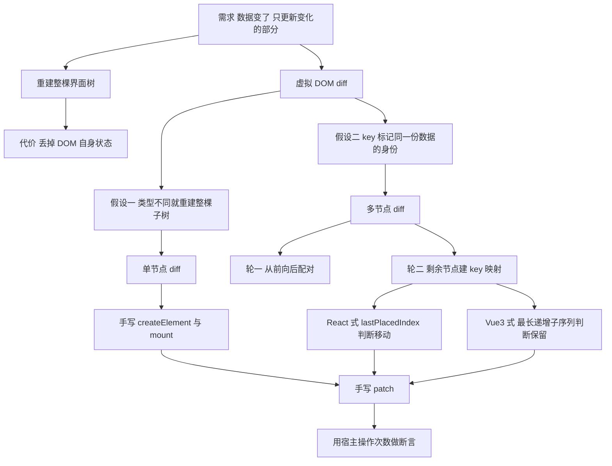
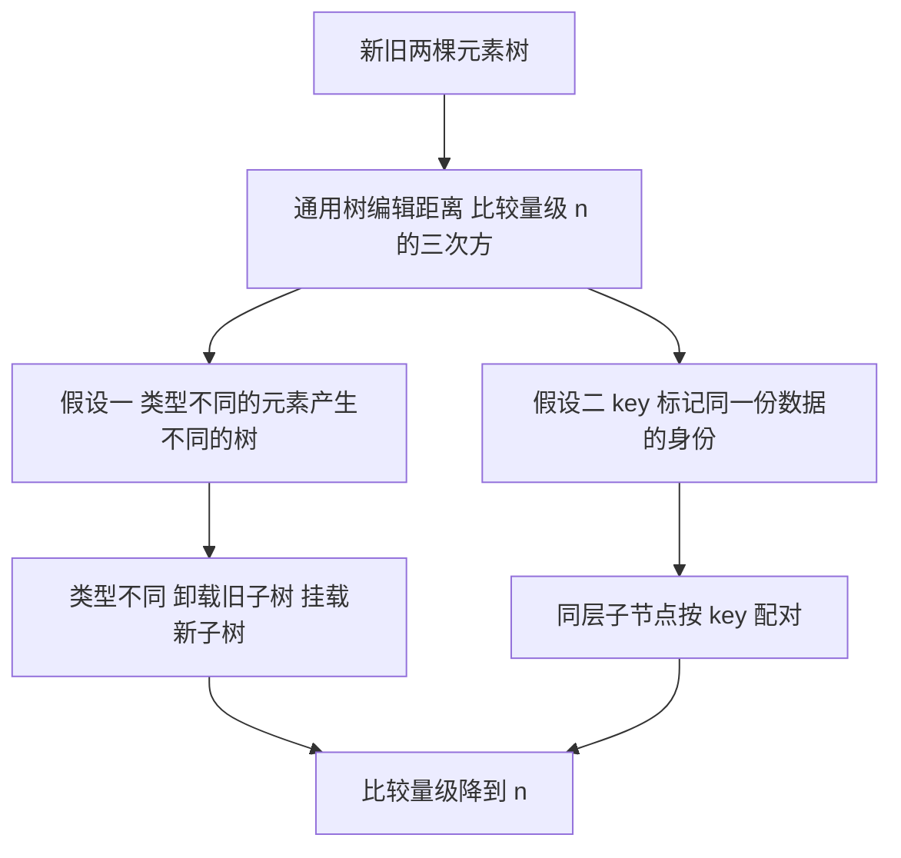
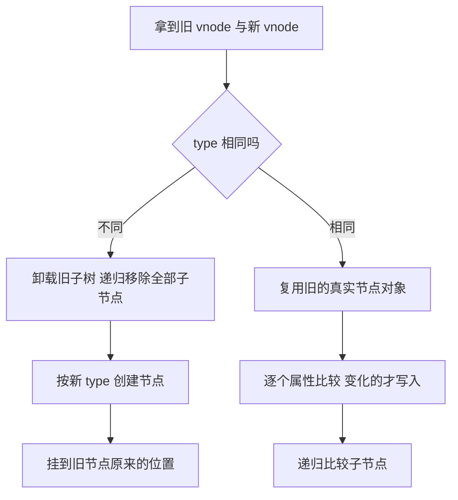
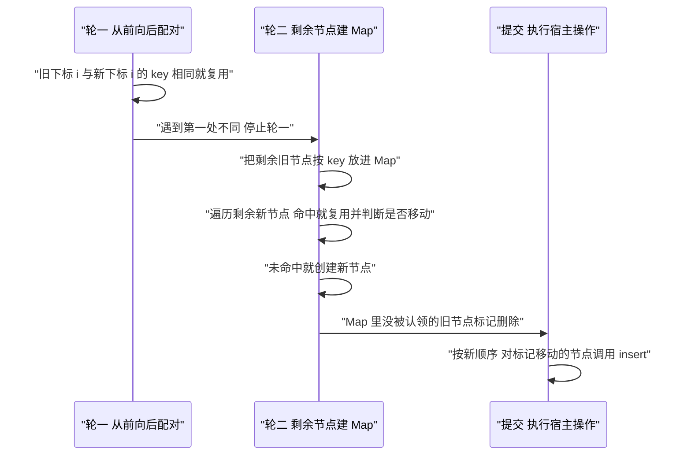
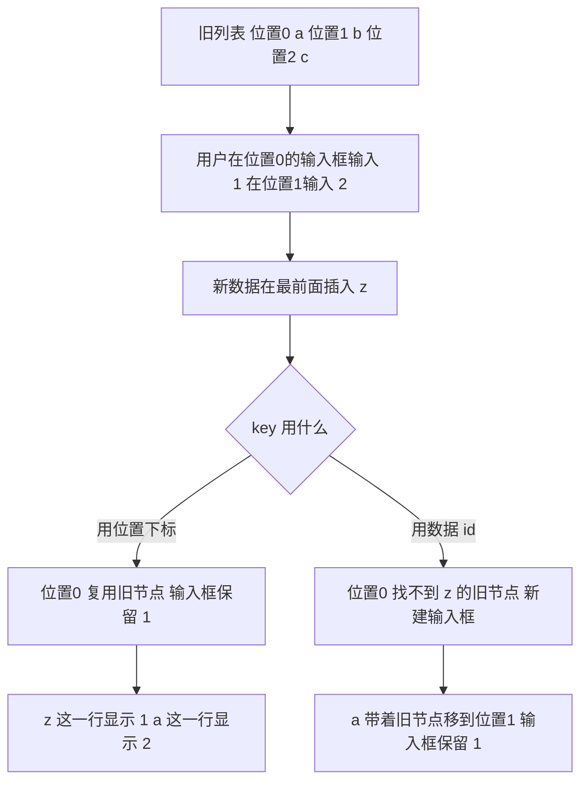
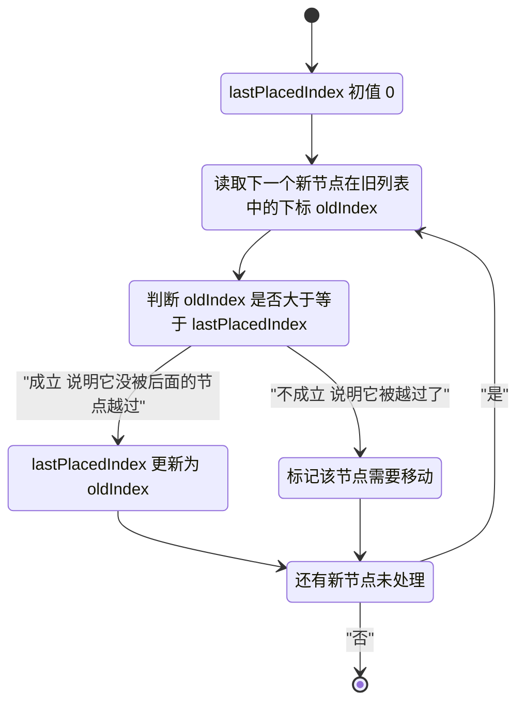
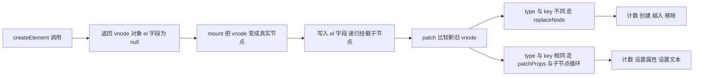
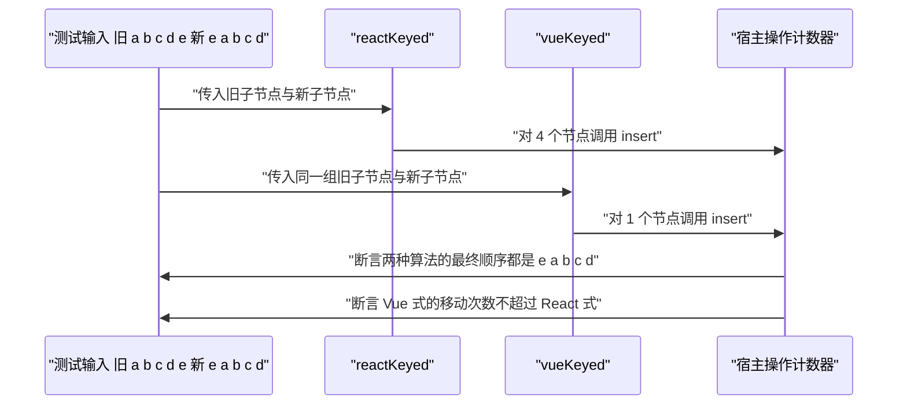

# Reconciliation 与 Diff：key 的作用与手写 patch

!!! abstract "学完这一页你能"

    - 说出虚拟 DOM diff 把比较量级从 n 的三次方降到 n 用的两个假设，并对每个假设各写一个反例输入。
    - 画出单节点 diff 与多节点 diff 的判断流程，并按顺序写出两轮遍历各自处理的节点。
    - 用一段可复现的输入输出，指出 index 作 key 时输入框内容落在哪一行。
    - 手写 createElement、mount、patch，并用宿主操作次数的断言比较 React 式与 Vue3 LIS 式 keyed children。

## 0. 知识地图



建议这样读：先看第 1 节拿到两个假设，这是后面全部判断的依据。
再看第 2、3 节，把单节点与多节点的判断顺序走一遍。
第 4、5 节解释 key 与移动判定，第 6、7 节把前五节写成能跑的代码。

## 1. 为什么要 diff：从 n 的三次方到 n 的两个假设

**先想一个问题**

列表里有 1000 条数据，只改了一条标题。如果整棵界面树重建，输入框里已经输入的文字会清空，滚动位置会回到顶部。

所以框架必须先回答：哪些节点能留，哪些节点该换。

**心智模型**

!!! tip "心智模型"
    一句话模型：diff 用两条假设换来一次同层扫描，代价是不保证操作次数最少。

    日常类比：整理书架时不把每本书和每个格子两两比对，先看位置有没有被换过。

    类比不成立的地方：书架上的书没有身份，DOM 节点有身份；被换位置的书在框架里可能被当成新书重建，输入框里的字就没了。

!!! note "术语：Reconciliation"
    精确定义：框架拿着旧的元素树与新的元素树，逐个位置比较并算出"要执行哪些宿主操作"的过程。

    例子：从 `<li>A</li><li>B</li>` 变成 `<li>A</li><li>C</li>`，协调的结果是"复用第一个 li，把第二个 li 的文本改成 C"。

**图解**



1. 起点是两棵树：旧的已经渲染到页面，新的是这次 render 算出来的。
2. 通用做法要算树编辑距离，比较量级是节点数的三次方。
3. 假设一把类型当作剪枝条件：类型不同就放弃比较整棵子树。
4. 假设二把 key 当作身份：key 相同才允许复用，于是同层只需要一次扫描。

**一步一步来**

第一步：把比较量级写成函数，用数字对比。

```js
// 通用树编辑距离的量级，n 是同层节点数与子树深度的合并估计
function naiveCost(n) {
  return n * n * n;          // 每个新节点乘每个旧节点再乘一次子树遍历
}
// 前端 diff 的同层扫描量级
function linearCost(n) {
  return n;                  // 每个新子节点最多被检查一次
}
console.log(naiveCost(100), linearCost(100));
```

**这段代码在做什么**

- `naiveCost` 用两次乘法表达"新节点数乘旧节点数"，再乘一次子树遍历。
- `linearCost` 用一次乘法表达同层扫描。
- n 取 100 时两个结果相差 10000 倍，这个比值随 n 增长。
- 两个函数只是量级模型，不做真实 DOM 操作。

运行结果：`1000000 100`

第二步：把两个假设写成判断函数。

```js
// 判断同一个位置上的旧节点能否被新节点复用
function canReuse(prevVNode, nextVNode) {
  if (prevVNode.type !== nextVNode.type) return false;  // 假设一 类型不同不复用
  if (prevVNode.key !== nextVNode.key) return false;    // 假设二 key 不同不复用
  return true;                                          // 类型与 key 都相同才复用
}
console.log(canReuse({ type: 'div', key: null }, { type: 'span', key: null })); // false
console.log(canReuse({ type: 'li', key: 'a' }, { type: 'li', key: 'a' }));      // true
console.log(canReuse({ type: 'li', key: 'a' }, { type: 'li', key: 'b' }));      // false
```

**这段代码在做什么**

- 第一行判断对应假设一：div 换成 span，两棵子树没有复用价值。
- 第二行判断对应假设二：类型相同但 key 不同，框架把它们当成两个身份。
- 第三行把两次比较都走完，返回 `true`。
- key 缺省时值是 `null`，`null` 与 `null` 相等，无 key 的兄弟节点会互相复用。

运行结果：
```
false
true
false
```

**动手验证**

```js
// 依赖：Node 20+ 内置 node:assert/strict，无第三方包
// 保存为 assumptions.mjs 后执行 node assumptions.mjs
import assert from 'node:assert/strict';

const naiveCost = (n) => n ** 3;
const linearCost = (n) => n;

assert.equal(naiveCost(10), 1000);
assert.equal(linearCost(10), 10);
assert.equal(naiveCost(100) / linearCost(100), 10000);

const canReuse = (prev, next) => prev.type === next.type && prev.key === next.key;

assert.equal(canReuse({ type: 'div', key: null }, { type: 'span', key: null }), false);
assert.equal(canReuse({ type: 'li', key: 'a' }, { type: 'li', key: 'a' }), true);
assert.equal(canReuse({ type: 'li', key: 'a' }, { type: 'li', key: 'b' }), false);

console.log('assumptions ok');
// 预期输出：assumptions ok
```

**常见坑**

| 现象 | 原因 | 怎么修 |
| --- | --- | --- |
| 换标签后输入框内容清空 | 类型不同触发整棵子树重建 | 把需要保留状态的节点放在类型稳定的外层 |
| 列表顺序变化后整段重建 | 兄弟节点没有 key | 给每个兄弟节点一个和数据 id 相同的 key |
| 记不清量级 | 把同层扫描量与整棵树编辑距离混在一起 | 分别写成 naiveCost 与 linearCost 用数字对比 |

**小结**

1. 通用树编辑距离的比较量级是 n 的三次方，前端 diff 用两个假设降到 n。
2. 假设一：类型不同就重建；假设二：key 不同就换身份。
3. 两个假设换来速度，代价是框架不保证宿主操作次数最少。

!!! note "术语：虚拟 DOM"
    精确定义：用普通 JavaScript 对象描述界面的数据结构，对象里记录类型、属性、子节点。

    例子：`{ type: 'li', key: 'a', props: {}, children: [] }` 描述一个 li 元素。

## 2. 单节点 diff：同类型更新属性，不同类型整棵重建

**先想一个问题**

旧节点是 `<div class="box">`，新节点是 `<span class="box">`。两者属性完全一样，能不能只改标签名？

**心智模型**

!!! tip "心智模型"
    一句话模型：先比类型，类型不同就整棵扔掉重来，类型相同才逐项比属性。

    日常类比：换手机壳和换手机是两件事，壳能换，机器换了就要把数据重装。

    类比不成立的地方：手机换机器时数据能迁移，DOM 不同标签之间没有迁移通道，滚动位置与输入内容都无法搬过去。

**图解**



1. 入口先读两个 vnode 的 `type` 字段。
2. `type` 不同时先从父节点移除旧节点，旧节点的整棵子树一起消失。
3. 然后按新 `type` 创建节点，插入位置取旧节点原来的位置。
4. `type` 相同时复用旧节点的真实节点对象，跳过创建与插入。
5. 接着逐个属性比较，只有值变化的属性才写入。
6. 最后递归比较子节点数组。

**一步一步来**

第一步：写出类型不同时的替换逻辑。

```js
// 类型或 key 不同：新建一棵子树，再把旧的整棵移除
function replaceNode(host, parent, oldVNode, newVNode) {
  const anchor = oldVNode.el;                 // 用旧节点作为插入锚点
  const el = mount(host, parent, newVNode, anchor);
  host.remove(parent, oldVNode.el);           // 移除旧节点，其子树一并消失
  return el;
}
```

**这段代码在做什么**

- `anchor` 保存旧节点的真实节点，插入新节点时以它为参照。
- `mount` 会递归创建新节点的全部后代，并计入宿主操作次数。
- `host.remove` 从父节点摘掉旧节点，旧节点的子节点数组随之不可达。
- 这个函数不做属性比较，因为它只在身份已经确定不同时被调用。

第二步：写出类型相同时的属性比较逻辑。

```js
// 类型与 key 都相同：只更新变化的属性，并删除旧属性
function patchProps(host, el, oldProps, newProps) {
  for (const [name, value] of Object.entries(newProps)) {
    if (name === 'key') continue;             // key 不是真实属性
    if (oldProps[name] === value) continue;   // 值没变就不写
    host.setProp(el, name, value);
  }
  for (const name of Object.keys(oldProps)) {
    if (name === 'key' || name in newProps) continue;
    host.setProp(el, name, null);             // 传 null 表示删除属性
  }
}
```

**这段代码在做什么**

- 第一个循环遍历新属性，跳过 key。
- 值相同的属性直接跳过，因此写入次数等于真正变化的属性个数。
- 第二个循环处理旧属性里被删掉的项，写入 `null`。
- 两个循环合起来保证属性集合与最新 vnode 一致。

运行结果：旧属性 `{class: 'a', title: 't'}` 与新属性 `{class: 'b'}` 比较后，写入 2 次：`class` 改为 `b`，`title` 写 `null`。

**动手验证**

```js
// 依赖：Node 20+ 内置 node:assert/strict
// 保存为 single-node.mjs 后执行 node single-node.mjs
import assert from 'node:assert/strict';

function createHost() {
  const stats = { create: 0, insert: 0, remove: 0, prop: 0 };
  return {
    stats,
    create(tag) { stats.create++; return { tag, props: {}, children: [], parent: null }; },
    setProp(el, name, value) { stats.prop++; if (value === null) delete el.props[name]; else el.props[name] = value; },
    insert(parent, node, before) {
      stats.insert++;
      const i = before == null ? parent.children.length : parent.children.indexOf(before);
      parent.children.splice(i, 0, node); node.parent = parent;
    },
    remove(parent, node) {
      stats.remove++;
      const i = parent.children.indexOf(node);
      if (i !== -1) parent.children.splice(i, 1);
    },
  };
}

function makeNode(host, tag, props) {
  const el = host.create(tag);
  for (const [k, v] of Object.entries(props)) host.setProp(el, k, v);
  return el;
}

const host = createHost();
const parent = host.create('root');
const oldEl = makeNode(host, 'div', { class: 'a', title: 't' });
host.insert(parent, oldEl, null);

// type 相同：复用同一个真实节点
const newEl = makeNode(host, 'div', { class: 'b' });
assert.equal(host.stats.create, 3);   // root + div + div
assert.equal(oldEl.tag, 'div');

// type 不同：必须重建
const span = makeNode(host, 'span', { class: 'b' });
assert.notEqual(span.tag, 'div');

console.log('single node ok', host.stats);
// 预期输出：single node ok { create: 4, insert: 1, remove: 0, prop: 3 }
```

**常见坑**

| 现象 | 原因 | 怎么修 |
| --- | --- | --- |
| 换标签后旧节点残留在页面 | 只做了创建没做移除 | 在替换分支里先挂新节点再移除旧节点 |
| 属性值没变却反复写入 | 没有比较 oldProps 与 newProps | 值相同就 continue |
| 旧属性删不掉 | 只遍历了新属性 | 再遍历一次旧属性，缺失的写 null |

**小结**

1. 单节点 diff 的第一判断是 `type`，不同就整棵重建。
2. `type` 相同时复用真实节点对象，只写入变化的属性。
3. 属性比较要走两遍：一遍看新增与修改，一遍看删除。

## 3. 多节点 diff 的两轮遍历

**先想一个问题**

旧子节点是 `[A, B, C]`，新子节点是 `[A, X, C]`。位置 0 和位置 2 完全一样，位置 1 换了。框架应该复用几个节点？

**心智模型**

!!! tip "心智模型"
    一句话模型：轮一从前往后配对，配不上就停；轮二把剩下的旧节点按 key 存进 Map，再逐个处理剩余新节点。

    日常类比：点名时先从头开始一个个对，一遇到不对的就停下来，剩下的名字拿名单册逐个查。

    类比不成立的地方：点名不关心顺序，diff 关心顺序，所以轮二里还要判断"这个节点是不是被后面的节点越过了"。

!!! note "术语：key"
    精确定义：写在兄弟节点上、用来标记数据身份的字符串或数字，同一个父节点下的 key 需要唯一。

    例子：`list.map((item) => <li key={item.id}>{item.title}</li>)` 里的 `item.id`。

**图解**



1. 轮一同时维护旧下标与新下标，两者都从 0 开始。
2. 每配上一对就同时后移，并记录这一对里旧下标的最大值。
3. 第一处配不上时立刻停止轮一，剩下的留给轮二。
4. 轮二把剩余旧节点按 key 放进 Map，值里带上它在旧列表里的下标。
5. 遍历剩余新节点，Map 命中就复用，未命中就新建。
6. 遍历结束后 Map 里剩下的旧节点在提交阶段删除。
7. 提交阶段按新顺序处理带移动标记的节点。

**一步一步来**

第一步：轮一从前向后配对，并维护 `lastPlacedIndex`。

```js
// 轮一：位置相同且 key 相同就复用，遇到第一处不同立刻停止
function syncFromStart(oldKids, newKids) {
  let i = 0;
  let lastPlacedIndex = 0;                       // 已确认位置正确的旧下标最大值
  while (i < oldKids.length && i < newKids.length) {
    if (oldKids[i].key !== newKids[i].key) break; // 配不上就停
    lastPlacedIndex = Math.max(lastPlacedIndex, i);
    i++;                                        // 旧下标与新下标同时后移
  }
  return { matched: i, lastPlacedIndex };       // matched 是复用的个数
}
```

**这段代码在做什么**

- `i` 同时充当旧下标与新下标，因为轮一两边同步后移。
- 命中时把 `i` 并入 `lastPlacedIndex`，最大值即"已经排好位置"的边界。
- 一旦 key 不同就 `break`，不再尝试后面的位置。
- 返回值里 `matched` 告诉轮二从哪里开始处理。

运行结果：旧 `[a,b,c]` 与新 `[a,x,c]` 比较，`matched` 为 1，`lastPlacedIndex` 为 0。

第二步：轮二把剩余旧节点按 key 建 Map。

```js
// 轮二准备：把还没被复用的旧节点按 key 放进 Map，值带上旧下标
function mapRemaining(oldKids, from) {
  const map = new Map();
  for (let i = from; i < oldKids.length; i++) {
    map.set(oldKids[i].key, { el: oldKids[i], index: i });
  }
  return map;
}
```

**这段代码在做什么**

- 只收集下标大于等于 `from` 的旧节点，前面的已经在轮一复用。
- Map 的键是 key，值是真实节点加旧下标。
- 旧下标用于后面判断节点是否被越过。
- 同一个父节点下 key 重复会互相覆盖，这也是坑表里的一条。

第三步：遍历剩余新节点，用 `lastPlacedIndex` 决定是否移动。

```js
// 轮二：剩余新节点去 Map 里找旧节点
function reconcileRemaining(map, newKids, from, lastPlacedIndex) {
  const marks = new Array(newKids.length).fill(false);
  for (let j = from; j < newKids.length; j++) {
    const hit = map.get(newKids[j].key);
    if (hit === undefined) {                    // 新节点，提交阶段挂载
      marks[j] = true;
      continue;
    }
    map.delete(newKids[j].key);                 // 认领后从 Map 移除
    if (hit.index < lastPlacedIndex) marks[j] = true; // 被越过了，需要移动
    else lastPlacedIndex = hit.index;           // 没被越过，位置有效
  }
  return { marks, lastPlacedIndex };
}
```

**这段代码在做什么**

- `marks[j]` 为 `true` 表示这个新节点在提交阶段要调用一次插入。
- Map 命中就把旧节点从 Map 删除，剩下的就是待删除节点。
- `hit.index` 小于 `lastPlacedIndex` 表示它前面的位置已经被别的节点占了。
- 没被越过时把 `lastPlacedIndex` 抬高到 `hit.index`。

运行结果：旧 `[a,b,c]` 与新 `[c,a,b]` 时，轮一 `matched` 为 0，轮二得到 `marks` 为 `[false, true, true]`。

**动手验证**

```js
// 依赖：Node 20+ 内置 node:assert/strict
// 保存为 two-pass.mjs 后执行 node two-pass.mjs
import assert from 'node:assert/strict';

function twoPass(oldKeys, newKeys) {
  let i = 0;
  let lastPlacedIndex = 0;
  while (i < oldKeys.length && i < newKeys.length && oldKeys[i] === newKeys[i]) {
    lastPlacedIndex = Math.max(lastPlacedIndex, i);
    i++;
  }
  const matched = i;
  const map = new Map();
  for (let k = matched; k < oldKeys.length; k++) map.set(oldKeys[k], k);
  const marks = new Array(newKeys.length).fill(false);
  for (let j = matched; j < newKeys.length; j++) {
    const hit = map.get(newKeys[j]);
    if (hit === undefined) { marks[j] = true; continue; }
    map.delete(newKeys[j]);
    if (hit < lastPlacedIndex) marks[j] = true;
    else lastPlacedIndex = hit;
  }
  return { matched, marks, removed: [...map.keys()] };
}

assert.deepEqual(twoPass(['a', 'b', 'c'], ['a', 'x', 'c']), { matched: 1, marks: [false, true, false], removed: ['b'] });
assert.deepEqual(twoPass(['a', 'b', 'c'], ['c', 'a', 'b']), { matched: 0, marks: [false, true, true], removed: [] });
assert.deepEqual(twoPass(['a', 'b', 'c'], ['a', 'b', 'c']), { matched: 3, marks: [false, false, false], removed: [] });

console.log('two pass ok');
// 预期输出：two pass ok
```

**常见坑**

| 现象 | 原因 | 怎么修 |
| --- | --- | --- |
| 本该复用的节点被重建 | 轮一没有跳过新节点，把配不上的位置也算成复用 | 轮一配不上就 break，交给轮二 |
| 该删除的节点留在页面 | Map 里认领后没有 delete | 每次 `map.get` 命中后立刻 `map.delete` |
| 移动标记多了一次 | 把 `lastPlacedIndex` 初值设成了旧列表长度 | 初值设 0，只在新节点被越过时抬高 |

**小结**

1. 轮一只处理前缀里位置与 key 都相同的那一段。
2. 轮二用 Map 把剩余旧节点按 key 索引，遍历剩余新节点逐个认领。
3. 提交阶段只对带标记的节点执行插入或删除。

## 4. key 的作用：index 作 key 与缺失 key 的状态错位

**先想一个问题**

列表渲染出一个输入框，用户在第一个输入框里输入了 `1`。现在数据在最前面插入一条新记录，第一个输入框会显示什么？

**心智模型**

!!! tip "心智模型"
    一句话模型：key 交给框架的是身份，位置交给框架的是顺序；用位置当身份，用户的输入就会留在原地。

    日常类比：宿舍按床位号贴名字，换了人但床位号没变，床上的东西就归新来的人。

    类比不成立的地方：宿舍里东西可以搬走，DOM 节点的输入内容由浏览器保存，框架的 diff 只认 key，不会自动搬家。

!!! note "术语：DOM 自身状态"
    精确定义：不由 vnode 的属性描述、由浏览器在真实节点上保存的运行时数据。

    例子：`input.value`、滚动容器的 `scrollTop`、聚焦元素、`video.currentTime`。

**图解**



1. 起点是三条数据，两条被用户输入过。
2. 新数据在最前面插入一条 `z`。
3. key 用位置下标时，位置 0 的旧节点被直接交给 `z`。
4. 于是 `z` 这一行拿到了别人输入的内容，`a` 拿到了下一位的输入。
5. key 用数据 id 时，`z` 在旧节点里查不到，必须新建输入框。
6. `a` 的旧节点整体移到位置 1，输入内容跟着身份一起走。

**一步一步来**

第一步：造出"旧列表加用户输入"的状态。

```js
// 旧列表已经渲染到页面，行里的输入框被用户改过
const oldRows = [
  { id: 'a', input: '1' },   // 用户在第一行输入了 1
  { id: 'b', input: '2' },   // 用户在第二行输入了 2
  { id: 'c', input: '' },
];
// 新数据在最前面插入一行 z
const data = [{ id: 'z' }, { id: 'a' }, { id: 'b' }, { id: 'c' }];
```

**这段代码在做什么**

- `oldRows` 的 `input` 字段代表浏览器在真实节点上保存的值。
- `data` 只有数据 id，代表这次 render 的新输入。
- 用户的输入不在 `data` 里，所以框架无法从数据端恢复它。
- 两个数组长度分别是 3 和 4。

第二步：用位置下标做 key 走一遍。

```js
// key 用位置下标：位置 i 的旧节点被直接复用
function patchWithIndexKey(oldRows, data) {
  return data.map((d, i) => {
    const reused = oldRows[i];                 // 按位置取旧节点
    return { id: d.id, input: reused ? reused.input : '' };
  });
}
```

**这段代码在做什么**

- 取旧节点的依据是 `i`，也就是新数组里的位置。
- 位置 0 取到 `a` 这条旧记录，它的 `input` 是 `1`。
- 返回值把 `input` 挂在新的 id `z` 上，错位就这样发生。
- 位置 3 没有对应旧节点，`input` 取空字符串。

运行结果：`z:1 a:2 b:- c:-`

第三步：用数据 id 做 key 走一遍，对比结果。

```js
// key 用数据 id：按身份找旧节点
function patchWithIdKey(oldRows, data) {
  const byId = new Map(oldRows.map((r) => [r.id, r]));  // 身份到旧节点的表
  return data.map((d) => {
    const reused = byId.get(d.id);             // 按 id 取旧节点
    return { id: d.id, input: reused ? reused.input : '' };
  });
}
```

**这段代码在做什么**

- 先建一张 id 到旧节点的表，查找依据变成身份而不是位置。
- `z` 在表里查不到，`input` 取空字符串。
- `a` 查到旧节点，`input` 保留 `1`，位置变了但身份没变。
- `byId` 用的是 `Map`，键可以是任意类型，查找时间是常数级。

运行结果：`z:- a:1 b:2 c:-`

**动手验证**

```js
// 依赖：Node 20+ 内置 node:assert/strict
// 保存为 key-state.mjs 后执行 node key-state.mjs
import assert from 'node:assert/strict';

const oldRows = [{ id: 'a', input: '1' }, { id: 'b', input: '2' }, { id: 'c', input: '' }];
const data = [{ id: 'z' }, { id: 'a' }, { id: 'b' }, { id: 'c' }];

function patchWithIndexKey(oldRows, data) {
  return data.map((d, i) => {
    const reused = oldRows[i];
    return { id: d.id, input: reused ? reused.input : '' };
  });
}

function patchWithIdKey(oldRows, data) {
  const byId = new Map(oldRows.map((r) => [r.id, r]));
  return data.map((d) => {
    const reused = byId.get(d.id);
    return { id: d.id, input: reused ? reused.input : '' };
  });
}

const withIndex = patchWithIndexKey(oldRows, data);
const withId = patchWithIdKey(oldRows, data);

assert.deepEqual(withIndex, [
  { id: 'z', input: '1' }, { id: 'a', input: '2' }, { id: 'b', input: '' }, { id: 'c', input: '' },
]);
assert.deepEqual(withId, [
  { id: 'z', input: '' }, { id: 'a', input: '1' }, { id: 'b', input: '2' }, { id: 'c', input: '' },
]);

const fmt = (rows) => rows.map((r) => `${r.id}:${r.input || '-'}`).join(' ');
console.log('index key', fmt(withIndex));
console.log('id key   ', fmt(withId));
// 预期输出：
// index key z:1 a:2 b:- c:-
// id key    z:- a:1 b:2 c:-
```

**常见坑**

| 现象 | 原因 | 怎么修 |
| --- | --- | --- |
| 删除中间一行后最后一行输入跑到别处 | key 用下标，删除使后面所有位置整体前移 | key 换成数据 id |
| 排序后整列表输入全部错位 | 下标与身份一一对应的前提被排序打破 | key 换成数据 id，排序只改数组顺序 |
| 用随机数当 key | 每次 render 生成新值，全部节点身份都变 | key 只能来自数据本身的稳定字段 |

**小结**

1. 缺失 key 时框架退化到按下标比较，等价于用 index 作 key。
2. index 作 key 只在列表长度不变且不求顺序变化时安全。
3. DOM 自身状态跟着真实节点走，key 决定真实节点交给谁。

## 5. 移动判定：lastPlacedIndex 与最长递增子序列

**先想一个问题**

旧列表 `[a, b, c, d, e]`，新列表 `[e, a, b, c, d]`。页面最终顺序是新的，最少要移动几个节点？

**心智模型**

!!! tip "心智模型"
    一句话模型：React 式看"这个节点的旧下标是否小于已确认的边界"，Vue3 式先算出最长的一段不用动的子序列，只移动剩下的。

    日常类比：排队时先找出已经在正确相对顺序里的那一串人，只让其他人插队重排。

    类比不成立的地方：排队要求每两个人都比较，LIS 只要求子序列下标递增，中间允许隔着别人。

!!! note "术语：最长递增子序列"
    英文：Longest Increasing Subsequence，缩写 LIS，指在原数组中下标递增、值也严格递增的最长子序列。

    例子：数组 `[5, 1, 2, 3, 4]` 的 LIS 是 `[1, 2, 3, 4]`，对应原数组下标 `[1, 2, 3, 4]`。

**图解**



1. 从 0 开始维护一个边界 `lastPlacedIndex`。
2. 按新列表顺序读每个节点在旧列表里的下标。
3. 下标大于等于边界时，说明这个节点在旧顺序里排在边界之后，不用动。
4. 此时把边界抬到这个下标。
5. 下标小于边界时，说明它前面的位置已经被后面的节点占用了，标记为需要移动。
6. 处理完所有节点后，标记过的节点在提交阶段执行一次插入。

**一步一步来**

第一步：按 React 式规则算出需要移动的节点。

```js
// React 式：oldIndex 小于 lastPlacedIndex 就需要移动
function reactMoves(oldKeys, newKeys) {
  const indexOf = new Map(oldKeys.map((k, i) => [k, i]));  // key 到旧下标
  let lastPlacedIndex = 0;
  const moves = [];
  for (const key of newKeys) {
    const oldIndex = indexOf.get(key);
    if (oldIndex < lastPlacedIndex) moves.push(key);   // 被越过了
    else lastPlacedIndex = oldIndex;                   // 边界抬高
  }
  return moves;
}
```

**这段代码在做什么**

- `indexOf` 保存每个 key 在旧列表里的下标。
- 新列表按顺序读，`e` 的旧下标是 4，边界从 0 抬到 4。
- 接下来 `a` 到 `d` 的旧下标分别是 0 到 3，都小于 4。
- 这四个节点被标记为需要移动。

运行结果：`['a', 'b', 'c', 'd']`，共 4 个。

第二步：算 `newIndexToOldIndexMap`，为 LIS 做准备。

```js
// Vue3 式：遍历旧列表，把旧下标加一写进新下标对应的位置
function buildIndexMap(oldKeys, newKeys) {
  const keyToNew = new Map(newKeys.map((k, i) => [k, i]));  // key 到新下标
  const table = new Array(newKeys.length).fill(0);           // 0 表示新节点
  let maxNewIndex = 0;
  for (let j = 0; j < oldKeys.length; j++) {
    const newIndex = keyToNew.get(oldKeys[j]);
    if (newIndex === undefined) continue;
    table[newIndex] = j + 1;                 // 存旧下标加一，留 0 给新节点
    if (newIndex >= maxNewIndex) maxNewIndex = newIndex;
  }
  return table;
}
```

**这段代码在做什么**

- 遍历的是旧列表，顺序就是旧顺序。
- `keyToNew` 给出每个 key 在新列表里的下标。
- `table[newIndex] = j + 1` 表示新位置 `newIndex` 上的节点来自旧位置 `j`。
- 加一是为了让 0 表示"新节点，没有旧位置"。
- 对 `[a,b,c,d,e]` 与 `[e,a,b,c,d]` 得到的 `table` 是 `[5, 1, 2, 3, 4]`。

第三步：求 LIS，算出不需要移动的节点。

```js
// 返回最长递增子序列在原数组中的下标
function getSequence(arr) {
  const prev = arr.map(() => -1);            // 每个位置的前驱下标
  const tails = [];                          // 各长度子序列的最小结尾下标
  for (let i = 0; i < arr.length; i++) {
    if (arr[i] === 0) continue;              // 0 是新节点，不参与
    let lo = 0, hi = tails.length;
    while (lo < hi) {
      const mid = (lo + hi) >> 1;
      if (arr[tails[mid]] < arr[i]) lo = mid + 1; else hi = mid;
    }
    prev[i] = lo > 0 ? tails[lo - 1] : -1;
    tails[lo] = i;
  }
  const seq = [];
  for (let k = tails.length - 1, cur = tails[k]; k >= 0; cur = prev[cur], k--) seq.unshift(cur);
  return seq;
}
```

**这段代码在做什么**

- `tails[k]` 保存长度为 `k + 1` 的递增子序列里最小的结尾下标。
- 二分查找把每个元素的插入位置压到对数时间，整体是 n 乘 log n。
- `prev` 记录前驱，回溯出完整下标序列。
- 对 `[5, 1, 2, 3, 4]` 返回 `[1, 2, 3, 4]`，对应 `a`、`b`、`c`、`d`。
- 这四个节点就是不需要移动的节点。

运行结果：需要移动的只有 `e`，共 1 个。

**动手验证**

```js
// 依赖：Node 20+ 内置 node:assert/strict
// 保存为 move.mjs 后执行 node move.mjs
import assert from 'node:assert/strict';

const oldKeys = ['a', 'b', 'c', 'd', 'e'];
const newKeys = ['e', 'a', 'b', 'c', 'd'];

function getSequence(arr) {
  const prev = arr.map(() => -1);
  const tails = [];
  for (let i = 0; i < arr.length; i++) {
    if (arr[i] === 0) continue;
    let lo = 0, hi = tails.length;
    while (lo < hi) { const mid = (lo + hi) >> 1; if (arr[tails[mid]] < arr[i]) lo = mid + 1; else hi = mid; }
    prev[i] = lo > 0 ? tails[lo - 1] : -1;
    tails[lo] = i;
  }
  const seq = [];
  for (let k = tails.length - 1, cur = tails[k]; k >= 0; cur = prev[cur], k--) seq.unshift(cur);
  return seq;
}

function reactMoves(oldKeys, newKeys) {
  const indexOf = new Map(oldKeys.map((k, i) => [k, i]));
  let lastPlacedIndex = 0;
  const moves = [];
  for (const key of newKeys) {
    const oldIndex = indexOf.get(key);
    if (oldIndex < lastPlacedIndex) moves.push(key);
    else lastPlacedIndex = oldIndex;
  }
  return moves;
}

function vueMoves(oldKeys, newKeys) {
  const keyToNew = new Map(newKeys.map((k, i) => [k, i]));
  const table = new Array(newKeys.length).fill(0);
  let maxNewIndex = 0;
  for (let j = 0; j < oldKeys.length; j++) {
    const newIndex = keyToNew.get(oldKeys[j]);
    if (newIndex === undefined) continue;
    table[newIndex] = j + 1;
    if (newIndex >= maxNewIndex) maxNewIndex = newIndex;
  }
  const keep = new Set(getSequence(table));
  return newKeys.filter((_, i) => !keep.has(i));
}

assert.deepEqual(reactMoves(oldKeys, newKeys), ['a', 'b', 'c', 'd']);
assert.deepEqual(vueMoves(oldKeys, newKeys), ['e']);
assert.equal(reactMoves(oldKeys, newKeys).length, 4);
assert.equal(vueMoves(oldKeys, newKeys).length, 1);

console.log('react', reactMoves(oldKeys, newKeys).length, 'vue', vueMoves(oldKeys, newKeys).length);
// 预期输出：react 4 vue 1
```

**常见坑**

| 现象 | 原因 | 怎么修 |
| --- | --- | --- |
| LIS 结果里混进了新节点 | `table` 里用 0 表示新节点，求序列时没跳过 | 循环里遇到 0 就 continue |
| 移动次数比预期多 | `lastPlacedIndex` 初值设成了最后一个下标 | 初值设 0，只在命中时抬高 |
| 尾部的节点被反复移动 | 没有做从后向前的同步 | 先做尾部同步，把尾部相同的节点排除在中间段之外 |

**小结**

1. React 式用 `lastPlacedIndex` 单趟判断，规则是旧下标小于边界就移动。
2. Vue3 式先把新下标到旧下标的映射写进数组，再求 LIS 找出不用动的节点。
3. 同一组输入 `[a,b,c,d,e]` 到 `[e,a,b,c,d]`，React 式移动 4 个，Vue3 LIS 式移动 1 个。

!!! note "术语：宿主操作"
    精确定义：框架向渲染目标发出的底层指令，浏览器环境下包括创建元素、插入节点、移除节点、设置属性。

    例子：`parent.insertBefore(child, anchor)` 就是一次宿主操作，本页用手写函数 `host.insert` 模拟它并计数。

## 6. 手写：createElement、mount 与 patch

**先想一个问题**

想知道 diff 到底做了几次操作，最直接的办法是什么？

**心智模型**

!!! tip "心智模型"
    一句话模型：把渲染目标抽象成一个只有几个方法的对象，每次调用都记一次数，diff 就能被量出来。

    日常类比：给打印机装一个计数器，每打一页加一，最后看总数就知道方案省不省纸。

    类比不成立的地方：计数器不知道哪一页有意义，所以本页区分创建、插入、移动、移除四个计数，而不是只看总数。

!!! note "术语：vnode"
    英文：virtual node，虚拟节点，指用普通对象描述一个界面单元的产物。

    例子：`{ type: 'li', key: 'a', props: {}, children: [], el: null }`，其中 `el` 在挂载后指向真实节点。

**图解**



1. `createElement` 只造对象，不做任何宿主操作。
2. `mount` 第一次把 vnode 变成真实节点，并回填 `el` 字段。
3. `patch` 在第二次及以后调用，负责比较。
4. 身份不同走替换分支，计数创建、插入、移除。
5. 身份相同走更新分支，计数设置属性与设置文本。
6. 子节点循环在更新分支里递归调用 `patch`。

**一步一步来**

第一步：写 `createElement` 与 `createText`。

```js
// 造元素 vnode：type 是标签名，key 单独存一份方便比较
function createElement(type, props = {}, ...children) {
  return {
    type,
    key: props.key === undefined ? null : props.key,  // key 缺省为 null
    props,
    children: children.flat(),   // 支持数组形式的子节点
    el: null,                    // 挂载后指向真实节点
  };
}
// 造文本 vnode：type 固定为 #text，内容放在 text 字段
function createText(text) {
  return { type: '#text', key: null, props: {}, text, children: [], el: null };
}
```

**这段代码在做什么**

- `createElement` 不接触宿主环境，只返回一个普通对象。
- `key` 从 `props` 里提出来单独存，比较时不用读 `props`。
- `children.flat()` 把嵌套数组摊平一层，配合 `map` 返回数组的写法。
- `el` 初始为 `null`，挂载后才赋值，避免重复创建真实节点。

第二步：写 `mount`，把 vnode 变成真实节点。

```js
// 递归把 vnode 挂载到 parent 的 before 之前
function mount(host, parent, vnode, before = null) {
  const el = vnode.type === '#text'       // 文本节点走另一条创建路径
    ? host.createText(vnode.text)
    : host.create(vnode.type, vnode.key);
  vnode.el = el;                          // 回填，后续 patch 复用
  host.insert(parent, el, before);        // 先插入，保证位置正确
  if (vnode.type === '#text') return el;  // 文本节点没有属性和子节点
  for (const [name, value] of Object.entries(vnode.props)) {
    if (name !== 'key') host.setProp(el, name, value);  // key 不是真实属性
  }
  for (const child of vnode.children) mount(host, el, child, null); // 递归
  return el;
}
```

**这段代码在做什么**

- 文本节点用 `createText`，元素节点用 `create`。
- `host.insert` 在创建之后立刻调用，所以父子顺序天然正确。
- 属性写入跳过 `key`，因为 HTML 上没有这个属性。
- 子节点循环传入 `el` 作为新的父节点，`before` 传 `null` 表示追加。
- 函数返回真实节点，调用方可以拿到锚点。

第三步：写 `patch`，比较新旧 vnode。

```js
// 比较新旧 vnode：身份不同就替换，相同就更新
function patch(host, parent, oldVNode, newVNode) {
  const el = oldVNode.el;
  if (oldVNode.type !== newVNode.type || oldVNode.key !== newVNode.key) {
    const next = mount(host, parent, newVNode, el);   // 以旧节点为锚点挂新的
    host.remove(parent, el);                          // 再摘掉旧的
    return next;
  }
  newVNode.el = el;                                   // 复用真实节点
  if (newVNode.type === '#text') {
    if (oldVNode.text !== newVNode.text) host.setText(el, newVNode.text);
    return el;
  }
  patchProps(host, el, oldVNode.props, newVNode.props);  // 属性比较
  const max = Math.max(oldVNode.children.length, newVNode.children.length);
  for (let i = 0; i < max; i++) {                     // 子节点按下标逐个处理
    if (!oldVNode.children[i]) mount(host, el, newVNode.children[i], null);
    else if (!newVNode.children[i]) host.remove(el, oldVNode.children[i].el);
    else patch(host, el, oldVNode.children[i], newVNode.children[i]);
  }
  return el;
}
```

**这段代码在做什么**

- 第一段比较 `type` 与 `key`，两者中有任一个不同就走替换。
- 替换时先挂新节点再移除旧节点，锚点是旧节点，所以新节点落在原位置。
- 文本节点只比较 `text` 字段，值变了才写一次。
- 属性比较交给 `patchProps`，跳过没变化的属性。
- 子节点循环按下标进行，多出的挂载，少了的移除，剩下的递归比较。
- 这个版本没有 key 匹配，正是第 7 节要替换的部分。

运行结果：旧文本 `A` 换成新文本 `B`，只产生 1 次文本写入，创建计数保持 4。

**动手验证**

```js
// 依赖：Node 20+ 内置 node:assert/strict
// 保存为 mini-dom.mjs 后执行 node mini-dom.mjs
import assert from 'node:assert/strict';

function createHost() {
  const stats = { create: 0, insert: 0, move: 0, remove: 0, prop: 0, text: 0 };
  return {
    stats,
    create(tag, key) { stats.create++; return { tag, key, props: {}, text: null, children: [], parent: null }; },
    createText(text) { stats.create++; return { tag: '#text', key: null, props: {}, text, children: [], parent: null }; },
    setProp(el, name, value) { stats.prop++; if (value === null) delete el.props[name]; else el.props[name] = value; },
    setText(el, text) { stats.text++; el.text = text; },
    insert(parent, node, before) {
      stats.insert++;
      const at = parent.children.indexOf(node);
      if (at !== -1) { stats.move++; parent.children.splice(at, 1); }
      const i = before == null ? parent.children.length : parent.children.indexOf(before);
      parent.children.splice(i, 0, node); node.parent = parent;
    },
    remove(parent, node) {
      stats.remove++;
      const i = parent.children.indexOf(node);
      if (i !== -1) parent.children.splice(i, 1);
      node.parent = null;
    },
  };
}

function createElement(type, props = {}, ...children) {
  return { type, key: props.key === undefined ? null : props.key, props, children: children.flat(), el: null };
}
function createText(text) {
  return { type: '#text', key: null, props: {}, text, children: [], el: null };
}

function mount(host, parent, vnode, before = null) {
  const el = vnode.type === '#text' ? host.createText(vnode.text) : host.create(vnode.type, vnode.key);
  vnode.el = el;
  host.insert(parent, el, before);
  if (vnode.type === '#text') return el;
  for (const [name, value] of Object.entries(vnode.props)) if (name !== 'key') host.setProp(el, name, value);
  for (const child of vnode.children) mount(host, el, child, null);
  return el;
}

function patchProps(host, el, oldProps, newProps) {
  for (const [name, value] of Object.entries(newProps)) {
    if (name === 'key' || oldProps[name] === value) continue;
    host.setProp(el, name, value);
  }
  for (const name of Object.keys(oldProps)) {
    if (name !== 'key' && !(name in newProps)) host.setProp(el, name, null);
  }
}

function patch(host, parent, oldVNode, newVNode) {
  const el = oldVNode.el;
  if (oldVNode.type !== newVNode.type || oldVNode.key !== newVNode.key) {
    const next = mount(host, parent, newVNode, el);
    host.remove(parent, el);
    return next;
  }
  newVNode.el = el;
  if (newVNode.type === '#text') {
    if (oldVNode.text !== newVNode.text) host.setText(el, newVNode.text);
    return el;
  }
  patchProps(host, el, oldVNode.props, newVNode.props);
  const max = Math.max(oldVNode.children.length, newVNode.children.length);
  for (let i = 0; i < max; i++) {
    if (!oldVNode.children[i]) mount(host, el, newVNode.children[i], null);
    else if (!newVNode.children[i]) host.remove(el, oldVNode.children[i].el);
    else patch(host, el, oldVNode.children[i], newVNode.children[i]);
  }
  return el;
}

const host = createHost();
const container = host.create('root', null);
const oldTree = createElement('ul', {}, createElement('li', {}, createText('A')));
mount(host, container, oldTree);
assert.equal(container.children[0].children[0].text, 'A');

const newTree = createElement('ul', {}, createElement('li', {}, createText('B')));
patch(host, container, oldTree, newTree);

assert.equal(container.children[0].children[0].text, 'B');
assert.equal(container.children[0].children[0], oldTree.children[0].children[0].parent.children[0]);
assert.equal(host.stats.create, 4);
assert.equal(host.stats.insert, 3);
assert.equal(host.stats.text, 1);
assert.equal(host.stats.remove, 0);

console.log('mini dom ok', host.stats);
// 预期输出：mini dom ok { create: 4, insert: 3, move: 0, remove: 0, prop: 0, text: 1 }
```

**常见坑**

| 现象 | 原因 | 怎么修 |
| --- | --- | --- |
| 节点顺序反了 | 先移除旧节点再插入新节点，锚点失效 | 用旧节点作为 `before` 先挂新的，再移除旧的 |
| `el` 字段是旧节点 | 替换分支没有回填 `newVNode.el` | 在 `mount` 里统一回填 |
| 属性重复写入 | `patchProps` 没有比较旧值 | 值相等就 continue |

**小结**

1. `createElement` 与 `createText` 只造对象，宿主操作全部推迟到 `mount`。
2. `mount` 负责创建、插值、写属性，并回填 `el` 字段。
3. `patch` 靠 `type` 与 `key` 分流到替换或更新两条路径。

## 7. keyed children 的两种算法与宿主操作次数断言

**先想一个问题**

同一组输入，两种算法得到的页面顺序一致，但宿主操作次数不同。能不能用断言把这个差异固定下来？

**心智模型**

!!! tip "心智模型"
    一句话模型：算法正确性用最终顺序断言，算法效率用移动计数断言，两个都要过。

    日常类比：快递分拣只要最终每格都对就算通过，但领导还会看搬运次数。

    类比不成立的地方：搬运次数还受仓库布局影响，本页的输入固定为 5 个节点，两次运行共用同一份计数器实现。

**图解**



1. 测试先搭出一份旧列表，顺序固定为 `a b c d e`。
2. 新列表把 `e` 提到最前面，其余顺序不变。
3. `reactKeyed` 跑完后统计移动次数。
4. `vueKeyed` 用同一组输入再跑一次，计数器是新的。
5. 两条断言都通过才算这一节验证成功。

**一步一步来**

第一步：写 React 式 keyed children。

```js
// 轮一从前向后配对，轮二用 Map 处理剩余新节点
function reactKeyed(host, parent, oldKids, newKids) {
  const byKey = new Map(oldKids.map((el, i) => [el.key, { el, index: i }]));
  const marks = new Array(newKids.length).fill(false);
  let lastPlacedIndex = 0;
  let i = 0;
  while (i < oldKids.length && i < newKids.length && oldKids[i] === newKids[i]) {  // 轮一
    byKey.delete(newKids[i].key);
    lastPlacedIndex = Math.max(lastPlacedIndex, i);
    i++;
  }
  for (let j = i; j < newKids.length; j++) {          // 轮二
    const hit = byKey.get(newKids[j].key);
    if (hit === undefined) { marks[j] = true; continue; }
    byKey.delete(newKids[j].key);
    if (hit.index < lastPlacedIndex) marks[j] = true;  // 被越过，需移动
    else lastPlacedIndex = hit.index;
  }
  for (const { el } of byKey.values()) host.remove(parent, el);  // 未被认领的删除
  for (let j = 0; j < newKids.length; j++) {                     // 提交
    if (marks[j]) host.insert(parent, newKids[j], anchorAfter(newKids, marks, j));
  }
}
```

**这段代码在做什么**

- `byKey` 保存旧子节点到旧下标的映射。
- 轮一用同一对象引用判断是否同一个节点，命中就把它从 Map 移除。
- 轮二未命中表示这是新节点，标记后交给提交阶段挂载。
- 命中且旧下标小于 `lastPlacedIndex` 时标记移动。
- Map 里剩下的旧节点已经被新列表抛弃，直接移除。
- `anchorAfter` 找的是新顺序里 `j` 之后第一个没有移动标记的节点，返回 `null` 表示追加到末尾。

第二步：写 Vue3 LIS 式 keyed children。

```js
// 前后同步，中间段用 key 映射与 LIS 决定谁留下
function vueKeyed(host, parent, oldKids, newKids) {
  let s1 = 0, e1 = oldKids.length - 1, s2 = 0, e2 = newKids.length - 1;
  while (s1 <= e1 && s2 <= e2 && oldKids[s1] === newKids[s2]) { s1++; s2++; }   // 前同步
  while (s1 <= e1 && s2 <= e2 && oldKids[e1] === newKids[e2]) { e1--; e2--; }   // 后同步
  if (s1 > e1) {                                            // 旧节点用完了
    for (let j = s2; j <= e2; j++) host.insert(parent, newKids[j], newKids[j + 1] || null);
    return;
  }
  if (s2 > e2) {                                            // 新节点用完了
    for (let j = s1; j <= e1; j++) host.remove(parent, oldKids[j]);
    return;
  }
  const keyToNew = new Map();                               // key 到新下标
  for (let j = s2; j <= e2; j++) keyToNew.set(newKids[j].key, j);
  const count = e2 - s2 + 1;
  const table = new Array(count).fill(0);                   // 0 表示新节点
  let moved = false;
  let maxNewIndex = 0;
  for (let j = s1; j <= e1; j++) {                          // 遍历旧列表
    const newIndex = keyToNew.get(oldKids[j].key);
    if (newIndex === undefined) { host.remove(parent, oldKids[j]); continue; }
    table[newIndex - s2] = j + 1;                           // 旧下标加一
    if (newIndex >= maxNewIndex) maxNewIndex = newIndex;
    else moved = true;                                      // 出现回退，可能需要移动
  }
  if (!moved) return;
  const seq = getSequence(table);                           // 不用动的下标
  let k = seq.length - 1;
  for (let j = count - 1; j >= 0; j--) {                    // 从后向前处理
    const nextIndex = s2 + j;
    const anchor = nextIndex + 1 < newKids.length ? newKids[nextIndex + 1] : null;
    if (table[j] === 0) host.insert(parent, newKids[nextIndex], anchor);
    else if (k < 0 || j !== seq[k]) host.insert(parent, newKids[nextIndex], anchor);
    else k--;                                               // 命中 LIS，原地不动
  }
}
```

**这段代码在做什么**

- 前同步与后同步各走一趟，把两端顺序一致的节点排除在中间段之外。
- `s1 > e1` 说明旧节点全部被配对完，剩下的新节点直接挂载。
- `s2 > e2` 说明新节点全部被配对完，剩下的旧节点直接移除。
- 中间段遍历旧列表，把旧下标加一写进 `table` 的新位置。
- `moved` 为 `false` 时不需要任何移动，直接返回。
- `getSequence` 求出不用动的下标集合，从后向前遍历时跳过这些位置。
- 其余位置调用一次插入，锚点是新列表里的下一个节点。

第三步：对同一输入跑两次，用计数断言比较。

```js
// 组装一份旧列表与新列表，两次运行各用一个新的 host
function setup(createHost) {
  const host = createHost();
  const parent = host.create('ul', null);
  const oldKids = ['a', 'b', 'c', 'd', 'e'].map((key) => {
    const el = host.create('li', key);
    host.insert(parent, el, null);              // 先按旧顺序挂好
    return el;
  });
  const newKids = ['e', 'a', 'b', 'c', 'd'].map((key) => oldKids.find((el) => el.key === key));
  return { host, parent, oldKids, newKids };
}
```

**这段代码在做什么**

- `newKids` 复用了旧列表里的真实节点对象，这正是复用的前提。
- 初始挂载也会计入 `insert`，但节点不在父节点里，所以不计入 `move`。
- 两次调用 `setup` 各拿到一个独立的 host 与独立的计数器。
- `parent` 是虚拟的根节点，不参与移动计数。

运行结果：React 式 `move` 为 4，Vue3 LIS 式 `move` 为 1，两者最终顺序都是 `e a b c d`。

**动手验证**

```js
// 依赖：Node 20+ 内置 node:assert/strict
// 保存为 keyed.mjs 后执行 node keyed.mjs
import assert from 'node:assert/strict';

function createHost() {
  const stats = { create: 0, insert: 0, move: 0, remove: 0 };
  return {
    stats,
    create(tag, key) { stats.create++; return { tag, key, children: [], parent: null }; },
    insert(parent, node, before) {
      stats.insert++;
      const at = parent.children.indexOf(node);
      if (at !== -1) { stats.move++; parent.children.splice(at, 1); }
      const i = before == null ? parent.children.length : parent.children.indexOf(before);
      parent.children.splice(i, 0, node); node.parent = parent;
    },
    remove(parent, node) {
      stats.remove++;
      const i = parent.children.indexOf(node);
      if (i !== -1) parent.children.splice(i, 1);
      node.parent = null;
    },
  };
}

function getSequence(arr) {
  const prev = arr.map(() => -1);
  const tails = [];
  for (let i = 0; i < arr.length; i++) {
    if (arr[i] === 0) continue;
    let lo = 0, hi = tails.length;
    while (lo < hi) { const mid = (lo + hi) >> 1; if (arr[tails[mid]] < arr[i]) lo = mid + 1; else hi = mid; }
    prev[i] = lo > 0 ? tails[lo - 1] : -1;
    tails[lo] = i;
  }
  const seq = [];
  for (let k = tails.length - 1, cur = tails[k]; k >= 0; cur = prev[cur], k--) seq.unshift(cur);
  return seq;
}

const anchorAfter = (kids, marks, j) => {
  for (let k = j + 1; k < kids.length; k++) if (!marks[k]) return kids[k];
  return null;
};

function reactKeyed(host, parent, oldKids, newKids) {
  const byKey = new Map(oldKids.map((el, i) => [el.key, { el, index: i }]));
  const marks = new Array(newKids.length).fill(false);
  let lastPlacedIndex = 0;
  let i = 0;
  while (i < oldKids.length && i < newKids.length && oldKids[i] === newKids[i]) {
    byKey.delete(newKids[i].key);
    lastPlacedIndex = Math.max(lastPlacedIndex, i);
    i++;
  }
  for (let j = i; j < newKids.length; j++) {
    const hit = byKey.get(newKids[j].key);
    if (hit === undefined) { marks[j] = true; continue; }
    byKey.delete(newKids[j].key);
    if (hit.index < lastPlacedIndex) marks[j] = true;
    else lastPlacedIndex = hit.index;
  }
  for (const { el } of byKey.values()) host.remove(parent, el);
  for (let j = 0; j < newKids.length; j++) {
    if (marks[j]) host.insert(parent, newKids[j], anchorAfter(newKids, marks, j));
  }
}

function vueKeyed(host, parent, oldKids, newKids) {
  let s1 = 0, e1 = oldKids.length - 1, s2 = 0, e2 = newKids.length - 1;
  while (s1 <= e1 && s2 <= e2 && oldKids[s1] === newKids[s2]) { s1++; s2++; }
  while (s1 <= e1 && s2 <= e2 && oldKids[e1] === newKids[e2]) { e1--; e2--; }
  if (s1 > e1) {
    for (let j = s2; j <= e2; j++) host.insert(parent, newKids[j], newKids[j + 1] || null);
    return;
  }
  if (s2 > e2) {
    for (let j = s1; j <= e1; j++) host.remove(parent, oldKids[j]);
    return;
  }
  const keyToNew = new Map();
  for (let j = s2; j <= e2; j++) keyToNew.set(newKids[j].key, j);
  const count = e2 - s2 + 1;
  const table = new Array(count).fill(0);
  let moved = false;
  let maxNewIndex = 0;
  for (let j = s1; j <= e1; j++) {
    const newIndex = keyToNew.get(oldKids[j].key);
    if (newIndex === undefined) { host.remove(parent, oldKids[j]); continue; }
    table[newIndex - s2] = j + 1;
    if (newIndex >= maxNewIndex) maxNewIndex = newIndex;
    else moved = true;
  }
  if (!moved) return;
  const seq = getSequence(table);
  let k = seq.length - 1;
  for (let j = count - 1; j >= 0; j--) {
    const nextIndex = s2 + j;
    const anchor = nextIndex + 1 < newKids.length ? newKids[nextIndex + 1] : null;
    if (table[j] === 0) host.insert(parent, newKids[nextIndex], anchor);
    else if (k < 0 || j !== seq[k]) host.insert(parent, newKids[nextIndex], anchor);
    else k--;
  }
}

function setup() {
  const host = createHost();
  const parent = host.create('ul', null);
  const oldKids = ['a', 'b', 'c', 'd', 'e'].map((key) => {
    const el = host.create('li', key);
    host.insert(parent, el, null);
    return el;
  });
  const newKids = ['e', 'a', 'b', 'c', 'd'].map((key) => oldKids.find((el) => el.key === key));
  return { host, parent, oldKids, newKids };
}

const r = setup();
reactKeyed(r.host, r.parent, r.oldKids, r.newKids);
assert.deepEqual(r.parent.children.map((el) => el.key), ['e', 'a', 'b', 'c', 'd']);
assert.equal(r.host.stats.move, 4);
assert.equal(r.host.stats.create, 6);
assert.equal(r.host.stats.remove, 0);

const v = setup();
vueKeyed(v.host, v.parent, v.oldKids, v.newKids);
assert.deepEqual(v.parent.children.map((el) => el.key), ['e', 'a', 'b', 'c', 'd']);
assert.equal(v.host.stats.move, 1);
assert.equal(v.host.stats.remove, 0);

assert.ok(v.host.stats.move <= r.host.stats.move);
console.log('react moves', r.host.stats.move, 'vue moves', v.host.stats.move);
// 预期输出：react moves 4 vue moves 1
```

**常见坑**

| 现象 | 原因 | 怎么修 |
| --- | --- | --- |
| 最终顺序正确但移动计数是 0 | 提交阶段没有真正调用插入，只改了数组 | 移动必须落到 `host.insert` 上，计数才有效 |
| `getSequence` 返回空数组 | `table` 里全是 0 或没有递增对 | 确认遍历方向是旧列表，写的是 `newIndex - s2` |
| 从后向前移动时锚点取错 | 锚点取成了前一个节点 | 锚点取 `nextIndex + 1`，从后向前时它已经在位 |

**小结**

1. React 式靠轮一、轮二与 `lastPlacedIndex` 完成配对与移动判定，一次遍历旧列表建立映射。
2. Vue3 LIS 式先做两端同步，中间段用 `newIndexToOldIndexMap` 加 LIS 求出不用动的节点。
3. 同一输入 `[a,b,c,d,e]` 到 `[e,a,b,c,d]`，React 式移动 4 次，Vue3 LIS 式移动 1 次，两者最终顺序相同。

## 综合对比

| 维度 | React 式 | Vue3 LIS 式 |
| --- | --- | --- |
| 从前向后同步 | 有，称轮一 | 有，称前同步 |
| 从后向前同步 | 无 | 有，称后同步 |
| 剩余节点建映射的方向 | 遍历旧列表建 key 到旧下标 | 遍历新列表建 key 到新下标 |
| 映射的使用方向 | 遍历剩余新节点去查旧下标 | 遍历剩余旧节点去写新下标 |
| 移动判定依据 | oldIndex 是否小于 lastPlacedIndex | 新下标是否小于已见最大新下标 |
| 是否求最少移动 | 否 | 是，用最长递增子序列 |
| 旧 `[a,b,c,d,e]` 到新 `[e,a,b,c,d]` 的移动次数 | 4 | 1 |
| 子节点配对的比较量级 | n | n |
| LIS 部分的比较量级 | 不涉及 | n 乘 log n |
| 缺失 key 时的行为 | 退化到按下标比较 | 退化到按下标比较 |
| 删除多余旧节点的时机 | 提交阶段 | 遍历旧列表时立即移除 |
| 新增节点挂载时机 | 提交阶段 | 从后向前循环中挂载 |

## 应用与行业实践

### 应用场景地图

| 场景 | 用到本页哪个知识点 | 典型技术选型 | 注意事项 |
| --- | --- | --- | --- |
| 后台管理的万行表格，行内编辑加排序 | 多节点 diff 两轮遍历、key 的作用 | React、Vue 3 Composition API | key 取后端主键，缺失 key 时输入值跟错行 |
| 低端安卓机的首屏长列表加载 | 单节点 diff 的节点复用、整棵重建的边界 | Vue 3 加 @tanstack/vue-virtual、React 加 react-window | 首屏只挂载可视区间，占位高度按总条数撑开 |
| 多人协作白板的图形元素同步 | 移动判定：lastPlacedIndex 与最长递增子序列 | 原生 DOM 加自研 patch 层 | 元素 id 在两端一致，避免整层重建 |
| 拖拽排序的看板卡片 | keyed children 两种算法、宿主操作次数断言 | React 加 dnd-kit、Vue 3 加 vuedraggable | 拖动结束时一次性提交顺序，过程中不改数据源 |
| 表单动态增删输入行 | index 作 key 的状态错位 | React Hook Form 的 useFieldArray、Vue 3 的 v-for | 每行生成稳定 id，删中间行时校验值不串行 |
| 即时通讯消息列表插入历史消息 | 多节点 diff 第一轮遍历的结束条件 | React 加 react-virtuoso | 历史消息插到顶部时先记录滚动锚点再 patch |
| 虚拟滚动窗口内的行复用 | 单节点 diff 同类型更新属性 | TanStack Virtual | 复用行必须用数据 id 当 key，否则展开态错位 |
| 小程序长列表的 setData 体积控制 | 单节点 diff 与整棵重建的边界 | Taro、uni-app 编译到小程序 | key 在编译产物的透传需核对官方文档 |

### 三个场景拆解

#### 场景 1：后台管理的万行表格，行内编辑加排序

**业务背景**：单页渲染几百到几千行，列数在十列上下，每行带输入框和开关。运维按不同列排序后继续改数据，改完统一保存。

**怎么用本页知识解决**：思路是把 key 绑到后端主键，让排序只改 children 顺序，不改节点身份。

```js
// 每行数据带后端主键 id，作为 key 的取值来源
const rows = list.map(item =>
  createElement('tr', { key: item.id }, item.title) // 主键当 key，排序时同一行复用同一节点
);

// 排序只改变 children 顺序，patch 在同一个 tbody 上比对
patch(tbody, createElement('tbody', {}, rows));

// 行内输入框的已输入文本挂在行节点上，key 不变则内容跟着行走
```

- key 的取值来自数据主键，与数组下标脱钩。
- 排序后新旧节点按 key 配对，配对上的节点只更新属性与文本。
- 没有 key 时按下标配对，第一行移动到末行会让中间所有行的输入值整体上移。
- 删除首行只卸载被删节点，其余行节点原地保留。

**怎么度量收益**：在 patch 内部对 insertBefore、removeChild、createElement 计数；用 Chrome DevTools Performance 面板看一次排序后的 Scripting 时长。

**什么时候不该用**：

- 数据每次刷新都是全量新对象、行内没有可保留状态时，key 对齐换不到收益，直接重建整块行。
- 数据源没有稳定主键时，不要用行号加时间戳拼 key，每轮渲染 key 全变，全部节点重建。

#### 场景 2：低端安卓机的首屏长列表加载

**业务背景**：首屏要展示上千条记录，设备内存小、CPU 主频低。脚本执行时间长会把首屏绘制推后。

**怎么用本页知识解决**：思路是只把可视区间加缓冲区的数据交给 patch 挂载，key 用数据 id 保证滚动时节点复用。

```js
// 占位高度按总条数撑开，滚动条长度与真实数据量一致
placeholder.style.height = total * ROW_HEIGHT + 'px'; // ROW_HEIGHT 为单行固定高度

// 只取可视区间加两端缓冲的数据参与挂载
const visible = data.slice(start, end);

// key 用数据 id，滚动时节点被复用，而不是整段卸载重建
const children = visible.map(item => createElement('li', { key: item.id }, item.text));

// patch 到同一个 ul 上，同类型 li 只更新属性与文本
patch(ul, createElement('ul', {}, children));
```

- 挂载节点数由可视区间决定，与总条数解耦。
- 缺失 key 时按下标配对，滚动一行会让每行的文本整体重写。
- 同类型节点走单节点 diff 的属性更新分支，不触发子树卸载重建。
- 缓冲区的行数决定快速滑动时出现空白条的概率。

**怎么度量收益**：Chrome DevTools Performance 面板的 Long Tasks 与 scripting 时长，Lighthouse 的 Total Blocking Time，PerformanceObserver 观测 largest-contentful-paint，另外统计 document 中 li 元素个数。

**什么时候不该用**：

- 列表总高度小于两屏时，滚动监听与区间计算换不到收益，直接全量挂载。
- 需要浏览器原生 Ctrl+F 查找全文或打印整页时，未挂载的文本不在 DOM 中，会被漏掉。

#### 场景 3：多人协作白板的图形元素同步

**业务背景**：一块画布上有几十到几百个图形元素，远端操作以新增、删除、改属性、重排的形式陆续到达。每次到达都要在本地重放成一次 patch。

**怎么用本页知识解决**：思路是元素 id 两端一致，把远端操作合并成一份新列表，再交给 patch 求最小移动集合。

```js
// 元素 id 由创建端生成，两端保持一致，作为节点 key
const nodes = elements.map(el => createElement('div', { key: el.id }, el.type));

// 远端删除的元素在新列表里消失，patch 只卸载对应节点
patch(layer, createElement('div', {}, nodes));

// 新顺序与旧顺序比对，相对顺序未变的节点不进移动队列
// 这一步对应 lastPlacedIndex 与最长递增子序列的计算
```

- 元素 id 稳定，远端重排退化成 children 顺序变化。
- 两轮遍历先用 key 建旧节点索引，再按新顺序决定复用还是新建。
- 落在最长递增子序列上的节点保持原位，只对序列外的节点调用 insertBefore。
- 缺少 key 时整层按类型重建，画布上的选中态与临时绘制状态全部丢失。

**怎么度量收益**：在 patch 内加 insertBefore 与 removeChild 计数器；用 requestAnimationFrame 记录相邻帧间隔；在 Performance 面板看 Recalculate Style 与 Layout 次数。

**什么时候不该用**：

- 元素数量在个位数时，LIS 计算与 key 对齐的代码量换不到可见收益。
- 切换房间或整页重载时旧节点全部丢弃，patch 没有可复用的对象。

### 行业先进实践

**Vue 3 keyed children 用最长递增子序列（出处：vuejs/core 开源项目的 patchKeyedChildren）**
它先同步首尾相同节点，再为新旧 key 建索引，最后用最长递增子序列标出不需要移动的节点。这样移动次数与乱序规模相关，与列表长度无关。可以在自研 patch 里对着源码逐行复现这段判定。

**列表 key 使用稳定 id（出处：React 官方文档 Rendering Lists）**
文档要求 key 在兄弟节点间唯一且稳定，并提醒不要用数组下标或渲染期生成的值。原因是 key 是 React 判断元素对应哪次渲染数据的唯一依据。可以把 key 的取值来源写进代码评审清单。

**双端比较处理子节点（出处：Snabbdom 开源项目）**
Snabbdom 的 updateChildren 从新旧数组两端各取指针，比较四种组合，命中就复用并把指针内移。头部插入与尾部追加时不需要扫描整个列表。可在自研 patch 里先处理首尾相同与尾部追加，再退回 key 索引。

**虚拟滚动只挂载可视区间（出处：TanStack Virtual 官方文档）**
该库按滚动位置计算可视区间与测量尺寸，只把区间内的项交给框架渲染。挂载节点数与总条数解耦，滚动时靠 key 复用行节点。万行表格可把挂载行数控制在一屏加缓冲的量级。

**key 在跨端编译产物的透传（需核对官方文档：核对 Taro 与 uni-app 文档中 key 的编译处理，以及 setData 的差量更新说明）**
小程序端的渲染层与逻辑层分离，key 是否透传到渲染层决定了复用范围。落地前先按文档写一个最小列表做增删与重排，观察渲染层节点是否移动。

### 从学到用：落地路线

第 1 步试点：挑一个带行内编辑的表格页面，把 index key 换成后端主键。验收标准是同一份操作序列在改造前后各跑一遍，两轮的宿主操作次数与错位现象都有记录。
第 2 步验证：给 patch 加 insertBefore、removeChild、createElement 计数，对同一序列跑 index key 与 id key 两种配置。验收标准是两种配置的次数对得上算法预期。
第 3 步推广：把 key 取值规则写进组件规范与评审清单，覆盖表格、看板、消息列表三类组件。验收标准是清单内每条规则都有一条对应测试。
第 4 步防回退：加单元测试断言删除首行后剩余行的输入值仍绑定在原数据上。验收标准是该测试在 CI 中常驻，改动 children 逻辑时必跑。

### 动手作业

**目标**：实现一个 keyed children 的 patch，用同一组输入对比 React 式两轮遍历与 Vue3 LIS 式算法在宿主操作次数上的差异。

**步骤**：

1. 写 createElement 与 mount，用数组保存真实 DOM 节点，方便断言。
2. 写 patch，覆盖同类型更新属性、不同类型整棵重建两个分支。
3. 实现 keyed children 的第一版：第一轮遍历按 key 复用，第二轮遍历用 lastPlacedIndex 判断移动。
4. 实现第二版：先同步首尾，再建 key 索引，最后求最长递增子序列决定不动节点。
5. 给宿主操作打计数桩，统计 insertBefore、removeChild、createElement 的调用次数。
6. 准备三组输入：尾部追加、头部插入、整段倒序，各跑两版算法。
7. 用表格记录每组的操作次数与最终 DOM 顺序。

**验收标准**：

- 三组输入下两版算法的最终 DOM 顺序与输入数组一致。
- 尾部追加一组中两版算法的 createElement 次数只等于新增节点数。
- 整段倒序一组中两版算法的 insertBefore 次数有可解释的差值，并能在报告中说明差值的来源。
- 删除中间一行后，剩余行的输入值仍与各自数据对应。
- 计数桩在关闭后不改变 patch 的输出结果。

## 深入阅读与参考

!!! tip "怎么用这些资料"
    先读「官方文档与规范」建立准确的概念，再读「源码与示例」核对细节，最后用「教程、书籍与视频」换一种讲法加深理解。每条都写明了读哪一节、带着什么问题读。

### 官方文档与规范

| 资源 | 为什么读 | 怎么读 |
|---|---|---|
| [Children](https://react.dev/reference/react/Children) | 官方 Children API，讲清 children 的不透明结构与遍历工具的真实语义。 | 读 Children.map、toArray 及 key 相关提示；读后思考 diff 前为何要把 children 拍平。 |
| [Projecting Children](https://book.leptos.dev/interlude_projecting_children.html) | 讲 children 如何被投影成列表，正对应多节点 diff 的数组化前提。 | 读投影与展平章节，带着「children 何时变成数组」读；读后整理出 diff 输入的数据结构。 |
| ['Children'](https://yew.rs/docs/advanced-topics/children) | 深入 children 作为 prop 的传递与渲染，帮你判断 key 该放在哪一层。 | 读 children 传递一节；读后检查自己示例中的 key 是否落在最外层数组元素上。 |
| ['Children'](https://yew.rs/docs/concepts/function-components/children) | 概念版讲清 children 的隐式传递，为理解 keyed children 打基础。 | 读 children prop 的定义部分；读后手写一个缺 key 的列表最小复现。 |
| [Component Children](https://book.leptos.dev/view/09_component_children.html) | 以组件视角看 children 的组合方式，解释列表为何常是 children 数组。 | 读组件 children 一节；读后把示例改写成带 key 的动态列表，观察渲染差异。 |
| [PATCH request method](https://developer.mozilla.org/en-US/docs/Web/HTTP/Reference/Methods/PATCH) | 讲清 patch 的「部分更新」语义，帮你辨析更新与整棵重建的边界。 | 读概述与幂等性说明，带着「为什么只改变化的部分」读；读后对照自己 patch 函数的入参。 |
| [Keyed collections](https://developer.mozilla.org/en-US/docs/Web/JavaScript/Guide/Keyed_collections) | 说明 key 的唯一性与 O(1) 查找，是 keyed children 建映射表的直觉来源。 | 读 Map/Set 与键相等性一节；读后自问 React key 为何要唯一、重复会出什么错。 |

### 源码与示例

| 资源 | 为什么读 | 怎么读 |
|---|---|---|
| [preact](https://github.com/preactjs/preact) | 最短的 vdom 实现，createElement 产出的结构一眼看懂，便于照着手写。 | 读 createElement 与 h 的实现，关注 props、children 的归一化；读后仿写自己的 createElement 并跑通。 |

## 自测题

??? question "两个启发式假设分别是什么？去掉其中一个会怎样？"
    假设一：类型不同的元素产生不同的树，直接整棵重建。
    假设二：开发者用 key 标记同一份数据的身份，key 相同才复用。
    去掉假设一，框架要尝试跨类型复用子树，比较量级回到 n 的三次方。
    去掉假设二，框架只能按下标配对，列表中间插入一条数据会让后续全部错位。

??? question "单节点 diff 在 type 不同时做了什么？为什么不尝试复用子节点？"
    先从父节点移除旧节点，旧节点的整棵子树一起消失。
    再按新 type 创建节点并插到旧节点原来的位置。
    不复用子节点的原因是：不同标签的可复用性无法从结构上保证。
    假设一直接放弃这部分比较，换取比较量级从 n 的三次方降到 n。

??? question "React 式多节点 diff 的两轮遍历分别处理什么？"
    轮一同时维护旧下标与新下标，位置相同且 key 相同就复用。
    第一处配不上时立刻 break，剩余部分交给轮二。
    轮二把剩余旧节点按 key 放进 Map，值里带上旧下标。
    然后遍历剩余新节点：命中就按 lastPlacedIndex 判断移动，未命中就新建。
    Map 里没被认领的旧节点在提交阶段删除。

??? question "为什么 index 作 key 会导致输入框内容串行？给一个可复现的输入输出。"
    输入：旧列表 `[a:1, b:2, c:]`，新数据 `[z, a, b, c]`。
    输出：index 作 key 得到 `z:1 a:2 b:- c:-`，id 作 key 得到 `z:- a:1 b:2 c:-`。
    原因是 index 作 key 时位置 0 的旧节点被直接交给 z。
    输入框的值存在真实节点上，真实节点跟着 key 走，key 是位置就跟着位置走。

??? question "lastPlacedIndex 判定移动的条件是什么？为什么是小于而不是小于等于？"
    条件是节点在旧列表里的下标小于 lastPlacedIndex。
    lastPlacedIndex 表示"已经确认位置有效的旧下标最大值"。
    等于时说明这个节点正好排在边界上，它的前面没有别的节点越过它。
    只有严格小于才说明它前面的位置已经被后面的节点占用，必须移动。

??? question "Vue3 的最长递增子序列在 diff 里解决什么问题？"
    它求的是 newIndexToOldIndexMap 的下标递增子序列。
    这些下标对应的节点在旧列表里的相对顺序与新列表一致。
    保留它们不动，只移动剩下的节点，移动次数就压到最少。
    本页例子里 LIS 长度是 4，所以只移动 1 个节点。

??? question "旧 a b c d e 新 e a b c d，两种算法各移动几次，为什么不同？"
    React 式移动 4 次，Vue3 LIS 式移动 1 次。
    React 式先把 e 的旧下标 4 抬成边界，后面 a 到 d 的旧下标都小于 4。
    于是 a、b、c、d 全部被标记移动，提交阶段各调用一次 insert。
    Vue3 LIS 式先算出 `[5,1,2,3,4]` 的 LIS 是下标 `[1,2,3,4]`。
    这四个位置的节点不动，只把 e 插到 a 前面。

??? question "手写 patch 时子节点按下标比较会带来什么后果？怎么改成按 key 比较？"
    按下标比较时，位置变化会被当成内容变化，节点身份全部重算。
    输入框、焦点、滚动位置这些 DOM 自身状态会留在原位置，出现错位。
    改成按 key 比较需要两步：轮一前缀配对，轮二用 Map 按 key 认领剩余旧节点。
    认领后按旧下标与新下标的相对关系决定是否移动，未认领的旧节点移除。

## 延伸阅读

- React 官方文档：Reconciliation 章节，重点看"启发式算法"与"用 key 提示稳定身份"两小节。
- React 官方文档：Render and Commit 章节，重点看提交阶段如何执行宿主操作。
- Vue 3 官方文档：渲染机制 章节中的"带 key 的子节点更新"。
- Vue 3 官方文档：列表渲染 章节中的"维护状态"与 key 的说明。
- React 源码：`ReactChildFiber` 里的 `reconcileChildrenArray`，具体函数名与行号需核对官方文档：核对当前主分支的函数名与 lastPlacedIndex 的初始化位置。
- Vue 源码：`renderer.ts` 里的 `patchKeyedChildren` 与 `getSequence`，需核对官方文档：核对 `maxNewIndexSoFar` 更新条件的当前写法。
