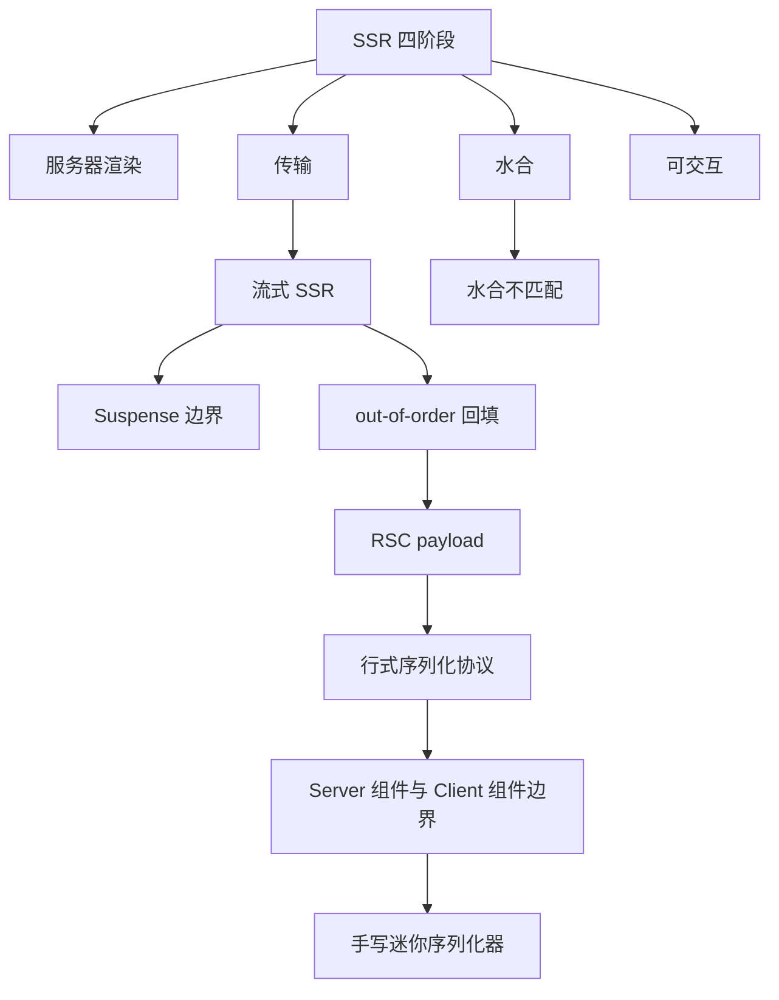
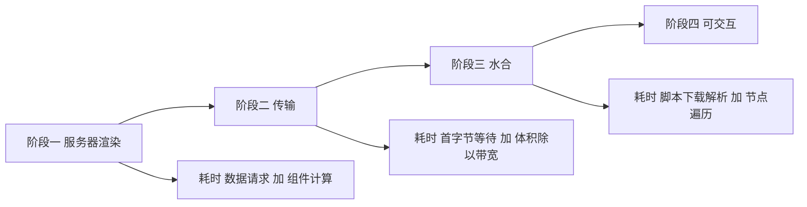
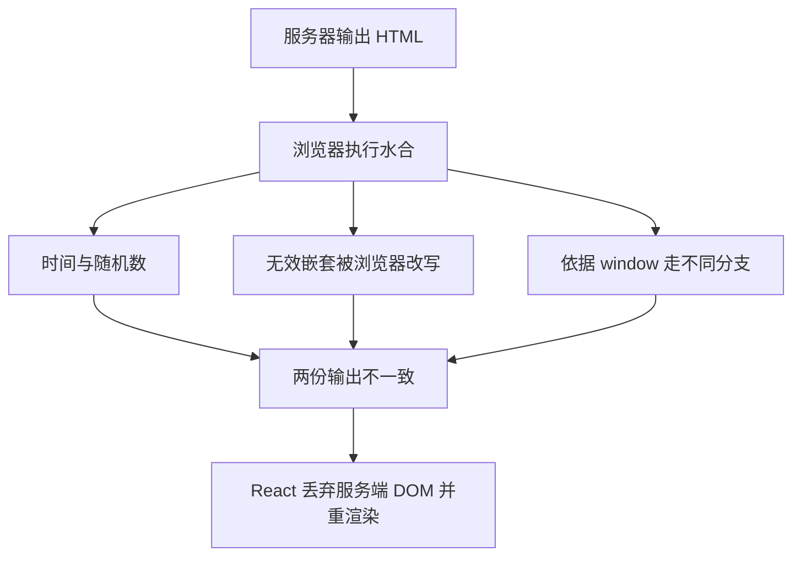
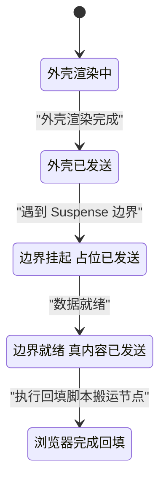
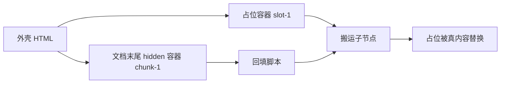
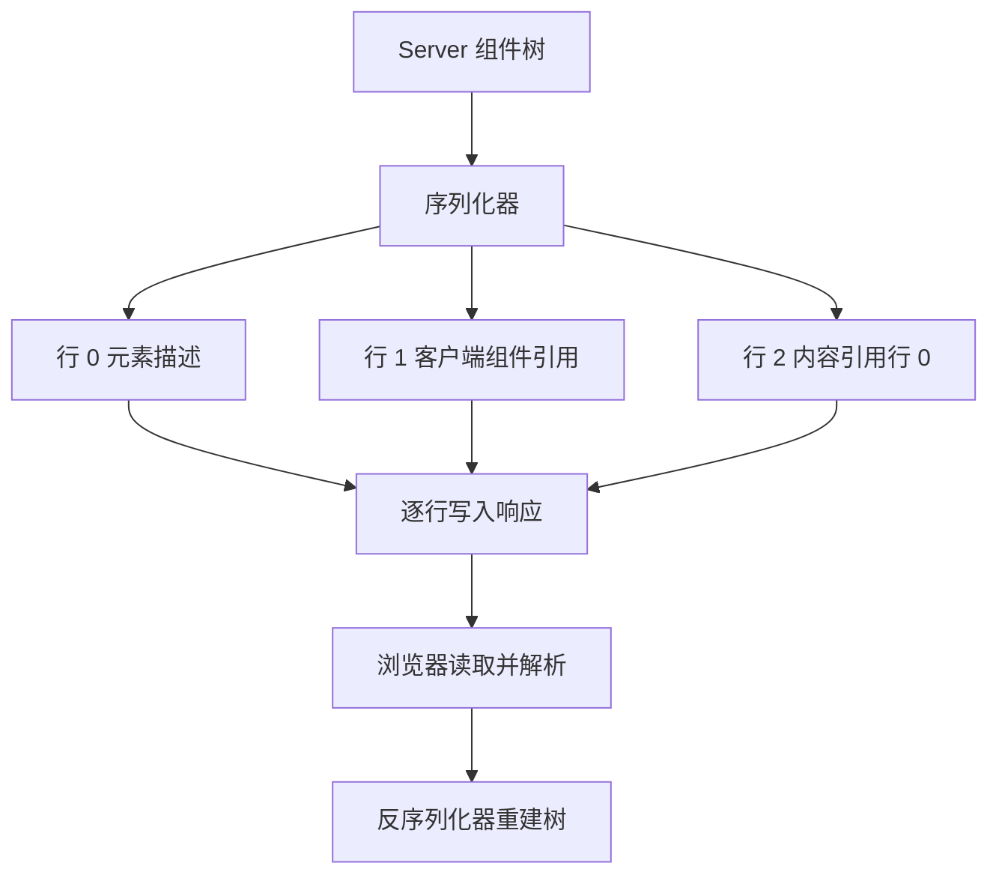
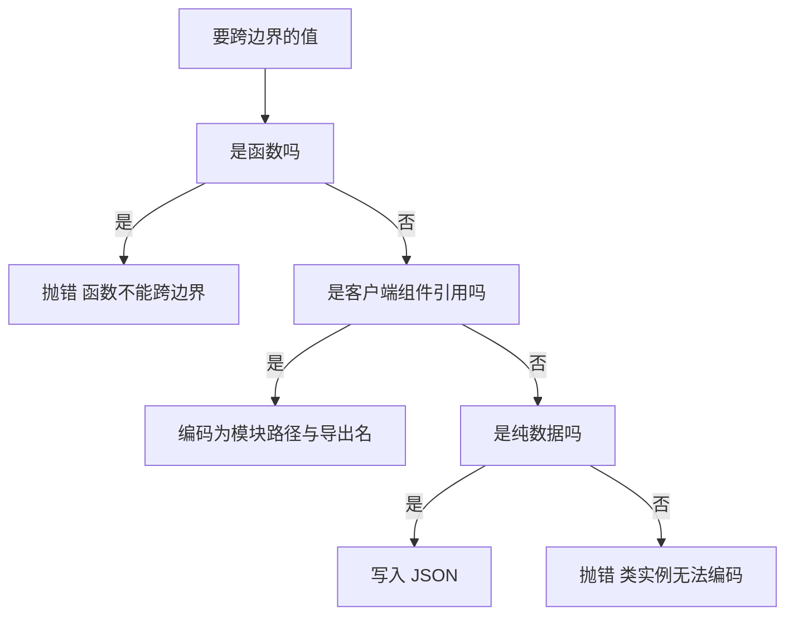
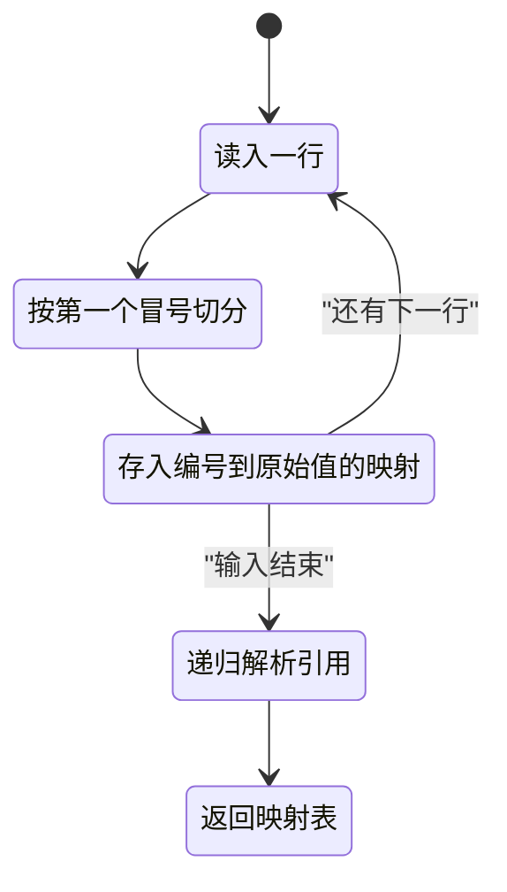

# Server Components 与流式 SSR：原理与手写协议

!!! abstract "学完这一页你能"

    - 画出 SSR 四阶段的时间线，并指出每一段的耗时来源。
    - 列出水合不匹配的三类成因，并用脚本定位第一处不一致的下标。
    - 用 node:http 写出一个分块传输的流式 HTML 服务器，解释占位与回填脚本的分工。
    - 写出一个行式 RSC 序列化器与反序列化器，并说出 Server 与 Client 的边界约束。

## 0. 知识地图



建议怎么读：第 1 节建立四阶段时间线，它是后面内容的坐标系。

第 2 到第 4 节处理传输与水合，第 4 到第 6 节处理 RSC 与组件边界。

第 7、8 节是动手章节，需要 Node 20 以上环境，边读边敲。

!!! note "术语：RSC"

    React Server Components，简称 RSC，指只在服务器执行、产出一棵描述树的组件。
    它与 SSR 的区别在于：SSR 产出 HTML 字符串，RSC 产出可被客户端继续解释的组件描述。

## 1. SSR 的四阶段：渲染、传输、水合、可交互

**先想一个问题**

你把商品页改成 SSR，首屏文字出现得很快。

但用户第一次点击加购按钮没有反应，第二次才生效。

这段时间浏览器在做什么？

!!! note "术语：服务端渲染"

    服务端渲染（Server-Side Rendering，简称 SSR）指在服务器上把组件树转成 HTML 字符串，再发给浏览器。
    例子：`renderToString(<App />)` 返回 `"<div>你好</div>"`。

**心智模型**

!!! tip "心智模型"

    - 一句话模型：SSR 把首屏拆成四段串行工作，每段各自计时。
    - 日常类比：剧院先搭布景让观众入场，演员到场后才能表演。
    - 类比在哪里不成立：水合要在浏览器里照着 HTML 重建一份组件树，重建本身要花时间。

**图解**



1. 阶段一在服务器执行组件函数，产出 HTML 字符串。
2. 阶段一的耗时来自数据请求与组件计算，两者优化手段不同。
3. 阶段二把字节推过网络，耗时来自首字节等待与 HTML 体积。
4. 阶段三浏览器下载 JavaScript，解析执行，再把事件监听挂到已有 DOM 上。
5. 阶段四事件可响应，用户点击才有结果。

**一步一步来**

**第 1 步：把四阶段写成可计时的函数**

① 这一步要做什么：用四个函数分别代表四阶段，各自返回毫秒数。

```js
// 阶段一：数据请求加上组件计算
function serverRender(dataMs, computeMs) { return dataMs + computeMs; }
// 阶段二：首字节等待加上体积除以吞吐
function transfer(ttfbMs, bytes, bytesPerMs) { return ttfbMs + bytes / bytesPerMs; }
// 阶段三：脚本下载解析加上节点遍历
function hydrate(jsBytes, bytesPerMs, nodeCount, msPerNode) {
  return jsBytes / bytesPerMs + nodeCount * msPerNode;
}
// 阶段四：四段串行，累加即为可交互时间
function interactive(...parts) { return parts.reduce((s, ms) => s + ms, 0); }
```

**这段代码在做什么**

- 每个函数只保留该阶段的耗时来源，便于单独调参。
- `serverRender` 把数据等待与组件计算分开，两者互不影响。
- `transfer` 用体积除以吞吐表示传输时间。
- `hydrate` 用节点数乘单节点耗时，代表遍历真实 DOM 的成本。
- `interactive` 做累加，因为四阶段串行。

运行结果：

```
服务器渲染 120 毫秒
传输 60 毫秒
水合 90 毫秒
可交互 270 毫秒
```

**第 2 步：只改一个参数，观察哪一段敏感**

① 这一步要做什么：固定其余参数，分别把 HTML 体积与数据等待翻倍。

```js
const base = { dataMs: 80, computeMs: 40, ttfbMs: 20, bytes: 40960, bytesPerMs: 1024 };
const bigger = { ...base, bytes: base.bytes * 2 };   // 只把 HTML 体积翻倍
const slower = { ...base, dataMs: base.dataMs * 2 }; // 只把数据等待翻倍
console.log("基线传输", transfer(base.ttfbMs, base.bytes, base.bytesPerMs));
console.log("体积翻倍传输", transfer(bigger.ttfbMs, bigger.bytes, bigger.bytesPerMs));
console.log("数据翻倍渲染", serverRender(slower.dataMs, slower.computeMs));
```

**这段代码在做什么**

- `base` 是可复现的基线，40 KiB HTML，吞吐 1 KiB/ms。
- `bigger` 只改体积，观察传输阶段的变化。
- `slower` 只改数据等待，观察渲染阶段的变化。
- 两次实验各只动一个变量，结论可归因。

运行结果：

```
基线传输 60
体积翻倍传输 100
数据翻倍渲染 200
```

**动手验证**

依赖：无，仅用 Node 20 内置模块。

```js
import assert from "node:assert/strict";

function serverRender(dataMs, computeMs) { return dataMs + computeMs; }
function transfer(ttfbMs, bytes, bytesPerMs) { return ttfbMs + bytes / bytesPerMs; }
function hydrate(jsBytes, bytesPerMs, nodeCount, msPerNode) {
  return jsBytes / bytesPerMs + nodeCount * msPerNode;
}
function interactive(...parts) { return parts.reduce((s, ms) => s + ms, 0); }

const renderMs = serverRender(80, 40);
const transferMs = transfer(20, 40960, 1024);
const hydrateMs = hydrate(122880, 2048, 300, 0.1);

assert.equal(renderMs, 120);
assert.equal(transferMs, 60);
assert.equal(hydrateMs, 90);
assert.equal(interactive(renderMs, transferMs, hydrateMs), 270);
console.log("四段合计", interactive(renderMs, transferMs, hydrateMs));
```

预期输出：

```
四段合计 270
```

**常见坑**

| 现象 | 原因 | 怎么修 |
| --- | --- | --- |
| 首屏文字快，按钮点不动 | 阶段四排在阶段三之后 | 削减脚本体积，把非关键区域改成客户端按需加载 |
| 缩减 HTML 体积后总时长不变 | 该测量点在等数据请求 | 先测服务器渲染耗时，再测传输耗时 |
| 服务器渲染耗时逐次升高 | 每个请求都重新取数据 | 给数据请求加缓存，统计命中率 |

**小结**

1. 四阶段串行，可交互时间等于四段之和。
2. 每段有独立的耗时来源，调优前先定位在哪一段。
3. 只改一个变量做实验，结论才能归因。

## 2. 水合不匹配：成因与定位

**先想一个问题**

服务器渲染出 `时间是 10:00:00`，浏览器水合时算出 `10:00:01`。

控制台出现警告，React 丢弃服务端 DOM 并重新渲染整棵树。

为什么同一份组件会产出两份不同的输出？

!!! note "术语：水合"

    水合（Hydration）指浏览器在已有 DOM 上执行组件代码，把事件监听与状态挂上去，让静态 HTML 变成可交互界面。
    例子：`hydrateRoot(container, <App />)` 不会重建 DOM，而是在现有节点上挂监听。

**心智模型**

!!! tip "心智模型"

    - 一句话模型：水合是用同一份输入重跑一次组件，并假设结果与服务端一致。
    - 日常类比：两个人按同一份菜谱各做一份菜，端上桌前要对一下是否一致。
    - 类比在哪里不成立：浏览器环境比服务器多出 window、时区、随机数，输入其实不同。

**图解**



1. 服务器产出 HTML，浏览器拿到的是这份 HTML 的 DOM。
2. 水合时组件函数重新执行，若读取了时间，就会得到新值。
3. 若 HTML 结构非法，浏览器解析时会把标签挪位，DOM 与组件预期不符。
4. 若组件依据 `window` 判断分支，服务器与浏览器走的是两条路。
5. 任何一条路径不一致，React 都会判定水合失败并重渲染。

**一步一步来**

**第 1 步：把 HTML 切成块，找出第一处不一致**

① 这一步要做什么：写一个比对器，返回两份 HTML 第一处不同的块下标。

```js
// 把 HTML 切成标签块与文本块，丢掉空白块
function tokenize(html) {
  return html.match(/<[^>]+>|[^<]+/g).filter((t) => t.trim() !== "");
}
// 返回第一处不同的下标 -1 表示一致 n 表示长度不同
function firstMismatch(a, b) {
  const ta = tokenize(a), tb = tokenize(b);
  const n = Math.min(ta.length, tb.length);
  for (let i = 0; i < n; i++) if (ta[i] !== tb[i]) return i;
  return ta.length === tb.length ? -1 : n;
}
```

**这段代码在做什么**

- `tokenize` 用正则把字符串切成开闭标签块与文本块。
- 过滤空白块，避免换行缩进造成假不一致。
- `firstMismatch` 逐块比对，返回第一处不同的下标。
- 长度不同时返回较短一方的长度，表示从这里开始缺块。

**第 2 步：用两类真实不一致来验证比对器**

① 这一步要做什么：构造文本型与结构型两份不一致，观察返回的下标。

```js
const serverHtml = "<p>时间 10:00:00</p><ul><li>甲</li></ul>";
const clientHtml = "<p>时间 10:00:01</p><ul><li>甲</li></ul>";
const structureHtml = "<p>时间 10:00:00</p><p><div>块</div></p>";
console.log("文本不匹配下标", firstMismatch(serverHtml, clientHtml));
console.log("结构不匹配下标", firstMismatch(serverHtml, structureHtml));
```

**这段代码在做什么**

- 第 1 组只改文本，第 2 块就不同，因此返回 1。
- 第 2 组改的是嵌套结构，第 4 块起不同，因此返回 3。
- `p` 里套 `div` 会被浏览器改写，这是结构型不匹配的常见来源。

运行结果：

```
文本不匹配下标 1
结构不匹配下标 3
```

**动手验证**

依赖：无。

```js
import assert from "node:assert/strict";

function tokenize(html) {
  return html.match(/<[^>]+>|[^<]+/g).filter((t) => t.trim() !== "");
}
function firstMismatch(a, b) {
  const ta = tokenize(a), tb = tokenize(b);
  const n = Math.min(ta.length, tb.length);
  for (let i = 0; i < n; i++) if (ta[i] !== tb[i]) return i;
  return ta.length === tb.length ? -1 : n;
}

const serverHtml = "<p>时间 10:00:00</p><ul><li>甲</li></ul>";
const clientHtml = "<p>时间 10:00:01</p><ul><li>甲</li></ul>";
const structureHtml = "<p>时间 10:00:00</p><p><div>块</div></p>";

assert.equal(firstMismatch(serverHtml, clientHtml), 1);
assert.equal(firstMismatch(serverHtml, structureHtml), 3);
assert.equal(firstMismatch(serverHtml, serverHtml), -1);
assert.equal(firstMismatch(serverHtml, "<p>时间 10:00:00</p>"), 2);

console.log("文本不匹配下标", firstMismatch(serverHtml, clientHtml));
console.log("结构不匹配下标", firstMismatch(serverHtml, structureHtml));
console.log("自比对结果", firstMismatch(serverHtml, serverHtml));
```

预期输出：

```
文本不匹配下标 1
结构不匹配下标 3
自比对结果 -1
```

**常见坑**

| 现象 | 原因 | 怎么修 |
| --- | --- | --- |
| 时间类警告每次刷新都出现 | 组件在渲染期读取当前时间 | 把时间作为 prop 由服务端传入，或改用 effect 渲染 |
| 表格页面结构报错 | 浏览器会给表格补 tbody 等标签 | 组件里显式写出浏览器会补的标签 |
| 只在生产环境报警 | 开发与生产分支不同 | 把环境判断移到 effect 或服务端 |

**小结**

1. 水合假设两次渲染同输入同输出，环境差异会破坏这个假设。
2. 不匹配分文本型与结构型，比对器能给出第一处不同的位置。
3. 时间、随机数、`window` 判断、非法嵌套是四类高发来源。

## 3. 流式 SSR、Suspense 边界与 out-of-order 回填

**先想一个问题**

顶部导航 5 毫秒就能渲染，中部评论要查 800 毫秒的数据库。

按传统 SSR，整份 HTML 要等这 800 毫秒才发出。

能不能先把导航发出去，评论稍后补上？

!!! note "术语：Suspense 边界"

    Suspense 边界是一段被包裹的子树。它挂起时服务器先发占位内容，数据就绪后再发真实内容。
    例子：`<Suspense fallback={<p>加载中</p>}>{comments}</Suspense>`。

**心智模型**

!!! tip "心智模型"

    - 一句话模型：把渲染结果按边界切片，渲染完一片就发一片。
    - 日常类比：餐厅先上凉菜，热菜做好后再端上桌。
    - 类比在哪里不成立：HTML 发出后不能撤回，位置错了只能靠脚本搬 DOM。

**图解**



1. 外壳先渲染完，服务器把头部与布局写进响应。
2. 遇到挂起的边界，服务器写入占位元素，不阻塞后续渲染。
3. 数据就绪后，服务器写入真实内容与回填脚本。
4. 浏览器执行回填脚本，把真实内容搬进占位元素的位置。
5. 完成搬运后，该边界与其余部分一起水合。



1. 外壳里只有占位容器 `slot-1`，用户先看到加载提示。
2. 完事的边界内容放在文档末尾的 `hidden` 容器 `chunk-1` 里。
3. 脚本读取两个容器，把 `chunk-1` 的子节点搬进 `slot-1`。
4. 搬运后删除 `chunk-1`，DOM 结构与顺序渲染的结果一致。

**一步一步来**

**第 1 步：用异步生成器表示渲染完一片就产出**

① 这一步要做什么：把"外壳"和"边界"写成两次 `yield`。

```js
// 模拟一次 400 毫秒的数据查询
function queryComments() {
  return new Promise((resolve) => setTimeout(() => resolve(["甲", "乙"]), 400));
}
// 异步生成器：先产出外壳，数据就绪后产出真实内容与脚本
async function* render() {
  yield '<h1>文章</h1><div id="slot-1">加载中</div>';  // 第一次产出
  const list = await queryComments();                  // 等待挂起的边界
  const items = list.map((c) => `<li>${c}</li>`).join(""); // 拼装真实内容
  yield `<div hidden id="chunk-1"><ul>${items}</ul></div>`; // 第二次产出
  yield '<script>$RC("slot-1","chunk-1")</script>';    // 第三次产出：回填脚本
}
```

**这段代码在做什么**

- 生成器的第一个 `yield` 就是外壳，它不等待数据。
- `await queryComments()` 代表挂起的边界，只有这一段被推迟。
- 第二次 `yield` 把真实内容放进 `hidden` 容器，不改变文档可见结构。
- 第三次 `yield` 是回填脚本，负责把节点搬到正确位置。
- 三步分开产出，服务器就能分三次写入响应。

**第 2 步：给浏览器一个最小的回填函数**

① 这一步要做什么：实现 `$RC`，把隐藏容器的子节点搬进占位容器。

```js
// 浏览器端回填函数：把 sourceId 的子节点搬进 targetId
function $RC(targetId, sourceId) {
  const target = document.getElementById(targetId); // 占位容器
  const source = document.getElementById(sourceId); // 隐藏容器
  target.replaceChildren(...source.childNodes);     // 一次性搬运
  source.remove();                                  // 移除隐藏容器
}
```

**这段代码在做什么**

- 两个参数分别是占位容器 id 与隐藏容器 id。
- `replaceChildren` 一次替换全部子节点，避免多次重排。
- 展开 `childNodes` 会移动节点本身，不是复制。
- 最后删除隐藏容器，避免留下空节点影响选择器。

**动手验证**

依赖：无。

```js
import assert from "node:assert/strict";

async function* render() {
  yield '<h1>文章</h1><div id="slot-1">加载中</div>';
  const list = await new Promise((r) => setTimeout(() => r(["甲", "乙"]), 30));
  const items = list.map((c) => `<li>${c}</li>`).join("");
  yield `<div hidden id="chunk-1"><ul>${items}</ul></div>`;
  yield '<script>$RC("slot-1","chunk-1")</script>';
}

const pieces = [];
const started = Date.now();
let firstAt = 0;
for await (const piece of render()) {
  if (pieces.length === 0) firstAt = Date.now() - started;
  pieces.push(piece);
}
const html = pieces.join("");
const total = Date.now() - started;

assert.equal(pieces.length, 3);
assert.ok(html.includes('id="slot-1"'));
assert.ok(html.indexOf("加载中") < html.indexOf("<li>甲</li>"));
assert.ok(html.includes('$RC("slot-1","chunk-1")'));
assert.ok(firstAt < 30, "首片应在数据返回前产出");
assert.ok(total >= 30, "全部产出要等数据");

console.log("产出片数", pieces.length);
console.log("首片毫秒", firstAt);
console.log("占位在真内容之前", html.indexOf("加载中") < html.indexOf("<li>甲</li>"));
```

预期输出（毫秒数受调度影响，可能为 0 到 5）：

```
产出片数 3
首片毫秒 0
占位在真内容之前 true
```

**常见坑**

| 现象 | 原因 | 怎么修 |
| --- | --- | --- |
| 占位一直不消失 | 回填脚本执行时容器还没解析出来 | 把脚本放在隐藏容器之后 |
| 真实内容跳到最后 | 隐藏容器没有 `hidden` 属性 | 给容器加上 `hidden`，避免闪现 |
| 边界内的表单失焦 | 水合前替换了节点 | 让回填在首次绘制前完成，或保留节点引用 |

**小结**

1. 流式 SSR 用 `yield` 切出外壳与边界，先发的部分先被浏览器解析。
2. 挂起的边界先发占位，数据就绪后补发真实内容。
3. out-of-order 允许后完成的边界先发出，靠脚本完成位置回填。

## 4. RSC payload：基于行的序列化协议

**先想一个问题**

Server 组件只在服务器运行，它产出的不是 HTML，而是一棵让客户端继续解释的组件描述树。

这棵树怎么变成字节流发给浏览器？

!!! note "术语：RSC payload"

    RSC payload 是服务器发回的、描述组件树与数据的行式文本流。
    Flight 是 React 内部实现该协议的模块名，真实的标签字符与字段含义需核对官方文档。

**心智模型**

!!! tip "心智模型"

    - 一句话模型：一行一个数据块，格式是 `编号:内容`，引用用编号指向别的行。
    - 日常类比：书正文里写脚注编号，脚注单独排在页尾。
    - 类比在哪里不成立：行可以边算边发，编号顺序固定但到达时间不固定。

**图解**



1. 序列化器遍历组件树，把每个节点拆成一行。
2. 每行的开头是十进制编号，冒号之后是 JSON。
3. 客户端组件的引用单独占一行，内容只有模块路径与导出名。
4. 引用别的行时写入 `$ref` 与目标编号。
5. 浏览器逐行读取，遇到一行就存一行，最后统一解引用。

!!! note "术语：chunk"

    流式传输里的一次数据片段，通常对应服务器的一次 `write` 调用。
    例子：`res.write(a)` 与 `res.write(b)` 会形成两个 chunk。

**一步一步来**

**第 1 步：写一个逐行解析器**

① 这一步要做什么：按换行切分，再用第一个冒号分开编号与 JSON。

```js
// 把 payload 文本解析成 编号 到 原始值 的映射
function parsePayload(text) {
  const raw = new Map();                     // 编号到值的映射
  for (const line of text.split("\n")) {
    if (line === "") continue;               // 跳过末尾空行
    const i = line.indexOf(":");             // 第一个冒号是分隔符
    const id = Number(line.slice(0, i));     // 冒号之前是编号
    raw.set(id, JSON.parse(line.slice(i + 1))); // 冒号之后是 JSON
  }
  return raw;
}
```

**这段代码在做什么**

- 行格式固定为 `编号:JSON`，冒号只作为分隔符出现一次。
- 编号用十进制整数，方便按顺序插入。
- 使用 `Map` 而不是对象，避免编号与对象原型属性冲突。
- 空行直接跳过，容忍末尾换行。

**第 2 步：解析引用，只允许向后引用**

① 这一步要做什么：把 `$ref` 换成目标行的实际值。

```js
// 递归解引用：$ref 指向已经解析过的行
function resolve(rows, value) {
  if (Array.isArray(value)) return value.map((v) => resolve(rows, v));
  if (value && typeof value === "object") {
    if ("$ref" in value) return rows.get(value.$ref);   // 换成目标行
    const out = {};
    for (const [k, v] of Object.entries(value)) out[k] = resolve(rows, v);
    return out;
  }
  return value;
}
```

**这段代码在做什么**

- 数组逐项递归，对象逐字段递归，基本类型直接返回。
- `$ref` 命中时取 `rows` 里已有的值，因此只能指向已发送的行。
- 只允许向后引用，保证流式场景下解析器不需要等待未来数据。
- 未解引用的对象会被复制成新对象，避免污染原始行。

**动手验证**

依赖：无。

```js
import assert from "node:assert/strict";

function parsePayload(text) {
  const raw = new Map();
  for (const line of text.split("\n")) {
    if (line === "") continue;
    const i = line.indexOf(":");
    raw.set(Number(line.slice(0, i)), JSON.parse(line.slice(i + 1)));
  }
  return raw;
}
function resolve(rows, value) {
  if (Array.isArray(value)) return value.map((v) => resolve(rows, v));
  if (value && typeof value === "object") {
    if ("$ref" in value) return rows.get(value.$ref);
    const out = {};
    for (const [k, v] of Object.entries(value)) out[k] = resolve(rows, v);
    return out;
  }
  return value;
}

const payload = '0:{"type":"ul"}\n1:{"type":"li","children":{"$ref":0}}\n';
const rows = parsePayload(payload);
assert.equal(rows.size, 2);
assert.equal(resolve(rows, rows.get(1)).children, rows.get(0));
assert.equal(rows.get(0).type, "ul");

console.log("行数", rows.size);
console.log("第 1 行解析结果", JSON.stringify(rows.get(1)));
console.log("引用解析为第 0 行", resolve(rows, rows.get(1)).children === rows.get(0));
```

预期输出：

```
行数 2
第 1 行解析结果 {"type":"li","children":{"$ref":0}}
引用解析为第 0 行 true
```

**常见坑**

| 现象 | 原因 | 怎么修 |
| --- | --- | --- |
| 解析报 JSON 语法错 | 值里出现了换行 | 发送前对字符串转义，保证一行一个 JSON |
| 引用得到 undefined | 引用了还没发送的行 | 只允许向后引用，或解析完成后再统一解引用 |
| 编号重复覆盖 | 生成器在多处重新计数 | 把编号计数器放在一次请求的作用域内 |

**小结**

1. 行协议把树拆成 `编号:JSON`，引用用编号表达。
2. 只允许向后引用，解析器不需要等待未来数据。
3. React 真实实现使用单字符标签，具体字符与含义需核对官方文档中的 Flight 协议说明。

## 5. Server 与 Client 组件边界：序列化约束

**先想一个问题**

你在 Server 组件里 import 了一个带 `onClick` 的组件，构建直接报错。

点击处理函数为什么不能跨过边界传到浏览器？

!!! note "术语：Client 组件"

    Client 组件用 `"use client"` 标注，会在浏览器执行。它跨边界时以模块说明符加导出名的形式传递，由打包器解析。
    例子：`"use client"; export function Counter() { return <button>加一</button>; }`。

**心智模型**

!!! tip "心智模型"

    - 一句话模型：边界上只能传能写进 JSON 的值，外加一种特殊的客户端组件引用。
    - 日常类比：跨境寄件只收清单上的品类，不在清单上的当场退回。
    - 类比在哪里不成立：Promise 与 Symbol 有专门编码方式，约束比 JSON 宽松。

**图解**



1. 先判断是不是函数，函数没有可序列化的表示。
2. 再判断是不是客户端组件引用，这类值带 `$client` 标记。
3. 再判断是不是纯数据：字符串、数字、布尔、null、数组、普通对象。
4. 类实例、Symbol、BigInt 落在最后一格，直接抛错。

**一步一步来**

**第 1 步：写一个边界检查函数**

① 这一步要做什么：递归遍历值，遇到不可序列化类型就抛错并给出路径。

```js
// 检查值能不能跨过 Server 与 Client 的边界
function assertSerializable(value, path = "根") {
  if (value === null) return;                                  // null 允许
  const t = typeof value;
  if (t === "string" || t === "number" || t === "boolean" || t === "undefined") return;
  if (t === "function") throw new Error(`${path} 是函数，不能跨边界`);
  if (t === "symbol") throw new Error(`${path} 是 Symbol，不能跨边界`);
  if (t === "bigint") throw new Error(`${path} 是 BigInt，不能跨边界`);
  if (Array.isArray(value)) return value.forEach((v, i) => assertSerializable(v, `${path}[${i}]`));
  if (typeof value.$client === "string") return;               // 客户端引用允许
  if (value.constructor !== Object) throw new Error(`${path} 是类实例，不能跨边界`);
  for (const [k, v] of Object.entries(value)) assertSerializable(v, `${path}.${k}`);
}
```

**这段代码在做什么**

- 基本类型直接放行，因为它们都有 JSON 表示。
- 函数、Symbol、BigInt 立刻抛错，错误信息里带路径便于定位。
- 数组逐项递归，路径里拼接下标。
- `$client` 字段表示客户端组件引用，允许通过。
- 构造函数不是 `Object` 的一律拒绝，覆盖 Date、Map、自定义类。

**第 2 步：用断言验证允许与拒绝两类输入**

① 这一步要做什么：分别对合法值与非法值调用检查函数，观察结果。

```js
assertSerializable({ a: 1, b: "x", c: [true, null] }); // 通过
assertSerializable({ btn: { $client: "Counter" } });   // 通过
try {
  assertSerializable({ onClick: () => {} });           // 抛错
} catch (e) {
  console.log("拒绝原因", e.message);
}
```

**这段代码在做什么**

- 第 1 组是纯数据，全部可写进 JSON。
- 第 2 组是客户端组件引用，编码后只留下模块名。
- 第 3 组含函数，检查函数抛错并给出字段路径。
- 捕获后打印信息，便于在实际项目里定位违反边界的字段。

运行结果：

```
拒绝原因 根.onClick 是函数，不能跨边界
```

**动手验证**

依赖：无。

```js
import assert from "node:assert/strict";

function assertSerializable(value, path = "根") {
  if (value === null) return;
  const t = typeof value;
  if (t === "string" || t === "number" || t === "boolean" || t === "undefined") return;
  if (t === "function") throw new Error(`${path} 是函数，不能跨边界`);
  if (t === "symbol") throw new Error(`${path} 是 Symbol，不能跨边界`);
  if (t === "bigint") throw new Error(`${path} 是 BigInt，不能跨边界`);
  if (Array.isArray(value)) return value.forEach((v, i) => assertSerializable(v, `${path}[${i}]`));
  if (typeof value.$client === "string") return;
  if (value.constructor !== Object) throw new Error(`${path} 是类实例，不能跨边界`);
  for (const [k, v] of Object.entries(value)) assertSerializable(v, `${path}.${k}`);
}

assert.doesNotThrow(() => assertSerializable({ a: 1, b: "x", c: [true, null] }));
assert.doesNotThrow(() => assertSerializable({ btn: { $client: "Counter" } }));
assert.throws(() => assertSerializable({ onClick: () => {} }), /函数/);
assert.throws(() => assertSerializable({ d: new Date(0) }), /类实例/);
assert.throws(() => assertSerializable({ n: 1n }), /BigInt/);

console.log("四组合法输入通过");
console.log("三组非法输入被拒绝");
```

预期输出：

```
四组合法输入通过
三组非法输入被拒绝
```

**常见坑**

| 现象 | 原因 | 怎么修 |
| --- | --- | --- |
| 传 Date 后客户端拿到字符串 | 序列化把日期转成字符串 | 传时间戳数字，在客户端重建日期 |
| 边界报错指向某字段 | 该字段是函数或类实例 | 把函数移到 Client 组件内部定义 |
| `"use client"` 写了仍报错 | 标注加在被 import 的文件首行之外 | 把标注放到文件第一行，且该文件只导出 Client 组件 |

**小结**

1. 跨边界的值必须可序列化，函数与类实例会被拒绝。
2. 客户端组件引用是唯一的例外，它编码为模块路径加导出名。
3. 检查函数带路径信息，能把报错定位到具体字段。

## 6. 手写流式 HTML 输出服务器

**先想一个问题**

你已经知道流式渲染要分片发送。

用 `node:http` 具体怎么写，浏览器怎么知道这是分块传输而不是一次性响应？

!!! note "术语：分块传输编码"

    分块传输编码（chunked transfer encoding）是 HTTP/1.1 的一种传输方式。
    服务器不给出内容长度，而是每写一段就发一段，末尾发一个零长度块表示结束。

**心智模型**

!!! tip "心智模型"

    - 一句话模型：不声明内容长度，写一段发一段。
    - 日常类比：直播把画面切片推流，而不是录完整场再上传。
    - 类比在哪里不成立：HTTP 分块有明确的结束标记，直播可以一直不结束。

**图解**


1. 请求到达后写响应头，不设置 `Content-Length`。
2. 写入外壳与占位元素，这一片立刻被浏览器解析。
3. 服务器等待数据，这段时间连接保持打开。
4. 数据就绪后写入隐藏容器与回填脚本。
5. 调用 `end` 结束响应，Node 会发送结束块。

**一步一步来**

**第 1 步：搭一个分块响应的骨架**

① 这一步要做什么：创建服务器，声明不设置内容长度，先写外壳。

```js
import http from "node:http";
// 创建服务器并在随机端口上监听
const server = http.createServer((req, res) => {
  // 不设置 Content-Length，Node 会自动使用分块传输
  res.writeHead(200, { "Content-Type": "text/html; charset=utf-8" });
  res.write("<!doctype html><html><body><h1>文章</h1>"); // 第一片
  res.write('<div id="slot-1">加载中</div>');             // 占位
  // 后续片在数据就绪后继续写入
});
```

**这段代码在做什么**

- `writeHead` 只声明内容类型，长度交给 Node 决定。
- 没有 `Content-Length` 时，Node 使用 `Transfer-Encoding: chunked`。
- 第一次 `write` 就把外壳推给浏览器，首字节时间提前。
- 占位元素让用户在等待期间看到明确反馈。

**第 2 步：写完隐藏内容与脚本并结束响应**

① 这一步要做什么：数据就绪后写第二片、第三片，再结束。

```js
// 模拟 400 毫秒的数据查询
function fetchComments() {
  return new Promise((r) => setTimeout(() => r(["甲", "乙"]), 400));
}
// 在同一个请求里续写后续分片
async function finish(res) {
  const list = await fetchComments();                    // 等待数据
  const items = list.map((c) => `<li>${c}</li>`).join(""); // 拼装列表
  res.write(`<div hidden id="chunk-1"><ul>${items}</ul></div>`); // 第二片
  res.write('<script>$RC("slot-1","chunk-1")</script>');         // 第三片
  res.end("</body></html>");                                     // 结束
}
```

**这段代码在做什么**

- `await` 期间响应保持打开，浏览器不会关闭连接。
- 隐藏容器放在文档末尾，不占用可见布局。
- 脚本紧跟在隐藏容器后面，保证执行时两个容器都已解析。
- `res.end` 发送结束块，同时补齐结束标签。

**动手验证**

依赖：无，使用 Node 20 全局 `fetch`。

```js
import http from "node:http";
import assert from "node:assert/strict";

const RUNTIME = 'function $RC(t,s){const a=document.getElementById(t);const b=document.getElementById(s);a.replaceChildren(...b.childNodes);b.remove();}';
function fetchComments() {
  return new Promise((r) => setTimeout(() => r(["甲", "乙"]), 300));
}
const server = http.createServer(async (req, res) => {
  res.writeHead(200, { "Content-Type": "text/html; charset=utf-8" });
  res.write(`<!doctype html><html><body><h1>文章</h1><div id="slot-1">加载中</div><script>${RUNTIME}</script>`);
  const list = await fetchComments();
  const items = list.map((c) => `<li>${c}</li>`).join("");
  res.write(`<div hidden id="chunk-1"><ul>${items}</ul></div>`);
  res.write('<script>$RC("slot-1","chunk-1")</script></body></html>');
  res.end();
});

await new Promise((r) => server.listen(0, r));
const { port } = server.address();
const started = Date.now();
const response = await fetch(`http://127.0.0.1:${port}/`);
const reader = response.body.getReader();
const decoder = new TextDecoder();
let html = "";
let chunks = 0;
let firstAt = 0;
while (true) {
  const { value, done } = await reader.read();
  if (done) break;
  if (chunks === 0) firstAt = Date.now() - started;
  chunks += 1;
  html += decoder.decode(value, { stream: true });
}
server.close();

assert.ok(html.includes('id="slot-1"'));
assert.equal(html.includes('$RC("slot-1","chunk-1")'), true);
assert.ok(html.indexOf("加载中") < html.indexOf("<li>甲</li>"));
assert.ok(chunks >= 2, "至少两个分片");
assert.ok(firstAt < 300, "首片早于数据返回");

console.log("分片数量", chunks);
console.log("首片毫秒", firstAt);
console.log("占位在真内容之前", html.indexOf("加载中") < html.indexOf("<li>甲</li>"));
console.log("回填脚本存在", html.includes('$RC("slot-1","chunk-1")'));
```

预期输出（毫秒数受调度影响，通常为 0 到 10）：

```
分片数量 2
首片毫秒 1
占位在真内容之前 true
回填脚本存在 true
```

**常见坑**

| 现象 | 原因 | 怎么修 |
| --- | --- | --- |
| 首片等到数据就绪才到 | 中间件或压缩层缓冲了输出 | 关闭该层的缓冲，或显式调用 flush |
| 分片数量始终为 1 | 设置了 `Content-Length` | 删除该响应头 |
| 回填脚本报找不到元素 | 脚本排在隐藏容器之前 | 让脚本紧跟隐藏容器，写在文档末尾 |

**小结**

1. 不设置 `Content-Length`，Node 就会使用分块传输。
2. 外壳与占位先写，数据就绪后再写隐藏内容与回填脚本。
3. 回填脚本必须排在隐藏容器之后，否则找不到目标节点。

## 7. 手写迷你 RSC 序列化器与反序列化器

**先想一个问题**

上一节写的是 HTML 流，这只解决一半问题。

如果服务器想发的是组件描述而不是 HTML，序列化格式该怎么定？

!!! note "术语：序列化"

    序列化是把内存中的值转成可传输文本的过程，反序列化是逆过程。
    例子：`JSON.stringify({a:1})` 得到 `'{"a":1}'`，`JSON.parse` 还原成对象。

**心智模型**

!!! tip "心智模型"

    - 一句话模型：一行一个块，块内用 JSON，跨块关系用编号表达。
    - 日常类比：把一份文件拆成若干页，页内互相引用时写"见第 3 页"。
    - 类比在哪里不成立：分页是人为切的，这里的切分点由值的大小与类型决定。

**图解**



1. 读入一行文本。
2. 用第一个冒号切开，左边是编号，右边是 JSON。
3. 把 JSON 解析结果按编号存进映射表。
4. 还有下一行就回到第 1 步，直到输入结束。
5. 输入结束后统一递归解析引用，返回映射表。

**一步一步来**

**第 1 步：写编码器，把值转成可写入 JSON 的形式**

① 这一步要做什么：递归处理值，遇到 `undefined` 与客户端引用时打标记。

```js
// 把值转成可写入 JSON 的形式
function encodeValue(value) {
  if (value === undefined) return { $u: 1 };                 // undefined 打标记
  if (Array.isArray(value)) return value.map(encodeValue);   // 数组逐项
  if (value !== null && typeof value === "object") {
    if (typeof value.$client === "string") return { $client: value.$client }; // 客户端引用
    const out = {};                                          // 普通对象逐字段
    for (const [k, v] of Object.entries(value)) out[k] = encodeValue(v);
    return out;
  }
  return value;                                              // 基本类型直接返回
}
```

**这段代码在做什么**

- `undefined` 无法写进 JSON，用 `$u` 标记，解码时还原。
- 数组逐项递归，保证嵌套结构也被处理。
- 客户端引用只保留模块名，不保留函数体。
- 普通对象逐字段递归，其余基本类型原样返回。

**第 2 步：写序列化与反序列化**

① 这一步要做什么：序列化把多个块拼成多行，反序列化分两遍解析。

```js
// 序列化：每行格式为 编号:JSON
function serialize(chunks) {
  return chunks.map((c, i) => `${i}:${JSON.stringify(encodeValue(c))}`).join("\n") + "\n";
}
// 反序列化：第一遍解析 JSON，第二遍解引用
function deserialize(text) {
  const raw = new Map();
  for (const line of text.split("\n")) {
    if (line === "") continue;
    const i = line.indexOf(":");
    raw.set(Number(line.slice(0, i)), JSON.parse(line.slice(i + 1)));
  }
  const out = new Map();
  for (const [id, value] of raw) out.set(id, decode(value, out));
  return out;
}
// 递归解码：$u 还原为 undefined，$ref 取已解析的行
function decode(value, out) {
  if (Array.isArray(value)) return value.map((v) => decode(v, out));
  if (value !== null && typeof value === "object") {
    if (value.$u === 1) return undefined;
    if ("$ref" in value) return out.get(value.$ref);
    const res = {};
    for (const [k, v] of Object.entries(value)) res[k] = decode(v, out);
    return res;
  }
  return value;
}
```

**这段代码在做什么**

- `serialize` 用下标作为编号，保证编号连续且唯一。
- `deserialize` 第一遍只做 JSON 解析，不关心引用。
- 第二遍按编号顺序解码，因此 `$ref` 只能指向编号更小的行。
- `decode` 里 `$u` 还原为 `undefined`，`$ref` 取出目标行。

**动手验证**

依赖：无。

```js
import assert from "node:assert/strict";

function encodeValue(value) {
  if (value === undefined) return { $u: 1 };
  if (Array.isArray(value)) return value.map(encodeValue);
  if (value !== null && typeof value === "object") {
    if (typeof value.$client === "string") return { $client: value.$client };
    const out = {};
    for (const [k, v] of Object.entries(value)) out[k] = encodeValue(v);
    return out;
  }
  return value;
}
function serialize(chunks) {
  return chunks.map((c, i) => `${i}:${JSON.stringify(encodeValue(c))}`).join("\n") + "\n";
}
function decode(value, out) {
  if (Array.isArray(value)) return value.map((v) => decode(v, out));
  if (value !== null && typeof value === "object") {
    if (value.$u === 1) return undefined;
    if ("$ref" in value) return out.get(value.$ref);
    const res = {};
    for (const [k, v] of Object.entries(value)) res[k] = decode(v, out);
    return res;
  }
  return value;
}
function deserialize(text) {
  const raw = new Map();
  for (const line of text.split("\n")) {
    if (line === "") continue;
    const i = line.indexOf(":");
    raw.set(Number(line.slice(0, i)), JSON.parse(line.slice(i + 1)));
  }
  const out = new Map();
  for (const [id, value] of raw) out.set(id, decode(value, out));
  return out;
}

const payload = serialize([
  { type: "ul" },
  { type: "ClientCounter", props: { step: 1, note: undefined }, ref: { $client: "Counter" } },
  { type: "li", children: { $ref: 0 } },
]);

const rows = deserialize(payload);
assert.equal(rows.size, 3);
assert.equal(rows.get(0).type, "ul");
assert.equal(rows.get(1).props.step, 1);
assert.equal(rows.get(1).props.note, undefined);
assert.deepEqual(rows.get(1).ref, { $client: "Counter" });
assert.equal(rows.get(2).children, rows.get(0));

console.log("行数", rows.size);
console.log("第一行", payload.split("\n")[0]);
console.log("引用指向同一对象", rows.get(2).children === rows.get(0));
```

预期输出：

```
行数 3
第一行 0:{"type":"ul"}
引用指向同一对象 true
```

**常见坑**

| 现象 | 原因 | 怎么修 |
| --- | --- | --- |
| 引用解析为 undefined | 引用了编号更大的行 | 只允许向后引用，或在第二遍结束后统一解引用 |
| `undefined` 变成 `null` | 直接交给 `JSON.stringify` | 先打 `$u` 标记，解码时还原 |
| 值里含换行导致行数错乱 | 字符串未转义 | 序列化时用 `JSON.stringify` 转义，编码结束后再拼行 |

**小结**

1. 行协议的编号与 JSON 分工，让引用与内容可以分开传输。
2. 反序列化分两遍：先解析 JSON，再解析引用。
3. 只允许向后引用，是流式场景下解析器能立刻工作的前提。

## 综合对比

| 维度 | CSR | SSR | SSG | ISR | RSC |
| --- | --- | --- | --- | --- | --- |
| 首字节时间 | 与静态资源相同 | 等组件渲染完成 | 与静态资源相同 | 与静态资源相同 | 等外壳渲染完成 |
| 首屏内容 | 空壳 | 完整 HTML | 完整 HTML | 完整 HTML | 外壳加流式边界 |
| 可交互时间 | 脚本执行完 | 水合完成之后 | 水合完成之后 | 水合完成之后 | 只水合客户端组件 |
| 数据新鲜度 | 请求时最新 | 请求时最新 | 构建时快照 | 按重验证时间刷新 | 请求时最新 |
| 服务器成本 | 只发静态文件 | 每次请求都渲染 | 构建时渲染一次 | 低频重新生成 | 每次请求都渲染外壳与边界 |
| 需交付的脚本 | 整站组件 | 整站组件 | 整站组件 | 整站组件 | 仅客户端组件 |
| 适用场景 | 需要登录的后台页 | 内容随请求变化 | 内容长期不变 | 内容按小时变化 | 数据密集且以展示为主 |

## 应用与行业实践

### 应用场景地图

| 场景 | 用到本页哪个知识点 | 典型技术选型 | 注意事项 |
| --- | --- | --- | --- |
| 后台管理的万行表格首屏 | SSR 四阶段时间线；服务端分块输出 | node:http 分块 + 服务端分页 | 单次下发的行数必须封顶，否则水合阶段的长任务会顶破阈值 |
| 低端安卓的电商详情页 | 水合不匹配三类成因与定位脚本 | React 水合 + 开发构建的差异报错 | 价格、倒计时这类随请求变化的值先固定成服务端值再下发 |
| 多人协作白板 | Suspense 边界与 out-of-order 回填 | React renderToPipeableStream | 画布本身是首屏主内容，不要塞进延迟边界 |
| 新闻站点首页信息流 | 流式 SSR；边界切分位置 | Next.js App Router 的 streaming | 抓取方是否执行回填脚本要单独核对 |
| 跨境电商多语言商品页 | 行式 RSC payload；序列化约束 | 自定义行式序列化器 | 货币与日期格式在两端读同一份配置 |
| 监控大屏的实时卡片 | Suspense 回填；分块传输 | 首屏流式 + 客户端 SSE 更新 | 首屏之后的刷新走客户端通道，不重复整页 SSR |
| 内容社区评论区分页 | Server 与 Client 边界；序列化约束 | RSC 行式协议 | 评论编辑器是 Client 组件，函数不进 payload |
| 企业官网的产品介绍页 | SSR 四阶段时间线（判断是否值得 SSR） | 构建期预渲染 | 内容不随请求变化时，水合开销换不到对应收益 |

### 三个场景拆解

#### 场景 1：后台管理的万行表格首屏

**业务背景**：表格接口一次能返回上万行，整页 HTML 拼完才发送，用户看到白屏的时间覆盖了取数与渲染两段。规模量级可以用行数翻倍时首屏时间是否同步增长来判定，测量在 DevTools 的 Network 与 Performance 面板完成。

**怎么用本页知识解决**：先发外壳与表头，把第一页数据放进延迟 chunk，由回填脚本挂到 tbody。后续页码走客户端请求，不再经过 SSR。

```js
import http from 'node:http';                                  // 用 Node 内置模块，不引入框架
const server = http.createServer(async (req, res) => {
  res.writeHead(200, { 'Content-Type': 'text/html; charset=utf-8' }); // 不设 Content-Length，走分块传输
  res.write('<table><thead>...</thead><tbody id="rows"></tbody></table>'); // 外壳先发，浏览器可立即排版表头
  const { rows } = await fetchPage(0);                          // 只取第一页，控制单次 chunk 体积
  res.write(`<template id="p0">${renderRows(rows)}</template>`); // 数据放进 template，不参与首次布局
  res.write('<script>document.getElementById("rows")' +
    '.appendChild(document.getElementById("p0").content)</script>'); // 回填脚本把 template 挂到 tbody
  res.end();                                                    // 外壳与第一页发完即可收尾
});
```

- 表头属于外壳，不依赖数据，所以能在数据库返回前发出。
- `template` 里的内容不会被浏览器渲染，避免回填前的重复布局。
- 回填脚本只有一行 DOM 操作，水合阶段的主线程占用集中在表格组件本身。
- 分页请求留在客户端，服务端组件不再承担滚动加载。
- 外壳出错时不要写出一半 HTML，先判断外壳是否渲染成功再 writeHead。

**怎么度量收益**：看 TTFB、FCP、LCP 与 INP。TTFB 用 DevTools 的 Network 面板读首个 HTML 字节到达时间，LCP 与 INP 用 web-vitals 上报，长任务在 Performance 面板的 Main 轨道上数。

**什么时候不该用**：一，页面内容一屏放得下，HTML 总体积小，切分只增加了请求往返。二，抓取方只读第一段 HTML 时，延迟回填的行存在不被收录的风险，需要先确认抓取行为。

#### 场景 2：低端安卓机上的电商详情页

**业务背景**：中低端安卓机的 CPU 与内存受限，首屏虽然可见，但水合期间点加购没有反应。规模量级以 CPU 降速 4 倍下的水合总时长与长任务数量判定。

**怎么用本页知识解决**：把商品信息、评价摘要做成 Server 组件，序列化成行式 payload；加购按钮所在组件留在客户端，客户端只水合这部分。

```js
function serializeRow(tag, id, payload) {                        // 每行一条记录，行内不含换行符
  return `${tag}\t${id ?? ''}\t${JSON.stringify(payload)}\n`;    // 用制表符分列，避免与 JSON 内的逗号冲突
}
function serialize(node) {                                       // 深度优先遍历，Server 组件在此展开
  if (typeof node === 'string') return serializeRow('T', null, node); // 纯文本行
  const [id, props, children] = node;                            // 元素行：模块标识、props、子节点
  return serializeRow('M', id, props) + children.map(serialize).join(''); // props 必须是可 JSON 化的值
}
```

- 行首标签决定解析分支，反序列化器遇到不认识的标签应当直接抛错，不要静默跳过。
- props 里出现函数、类实例、Symbol 时无法写入 payload，边界因此被强制划清。
- 事件处理函数只能写在 Client 组件里，Server 组件传过去的是数据而不是回调。
- `Date`、`Map` 这类值要先转成字符串或数组再序列化，两端用同一套转换约定。
- 客户端按 `\n` 切分即可逐行处理，不需要一次性把整份 payload 解析完。

**怎么度量收益**：看 Total Blocking Time、INP 与水合总时长。在 Performance 面板开 4 倍 CPU 降速录制，比较改前改后的长任务条数与主线程占用时间。

**什么时候不该用**：一，页面本身是画布或编辑器这类纯客户端状态，服务端组件边界换不到可交互时间。二，父组件需要把回调传给深层子组件时，回调无法进 payload，强行拆分会把状态抬到客户端顶层。

#### 场景 3：多人协作白板的首屏

**业务背景**：白板页初始化要拉取协作模块与画布数据，两个请求互相等待，骨架出现得晚。规模量级以 4 倍 CPU 降速下的 INP 与长任务数量判定。

**怎么用本页知识解决**：画布是 Client 组件，工具栏与协作信息放服务端，用一个 Suspense 边界包住协作模块，外壳就绪即发送。

```js
import { renderToPipeableStream } from 'react-dom/server';       // React 官方文档提供的流式渲染入口
http.createServer((req, res) => {
  const { pipe } = renderToPipeableStream(<App />, {             // App 内用 Suspense 包住协作模块
    onShellReady() {                                             // 外壳就绪就发送，先出白板骨架
      res.writeHead(200, { 'Content-Type': 'text/html; charset=utf-8' });
      pipe(res);                                                 // 边界完成时由 React 追加回填脚本
    },
    onShellError(err) {                                          // 外壳失败时不要发出半截 HTML
      res.writeHead(500); res.end('shell error');
    },
  });
});
```

- `onShellReady` 触发时，外壳里没有数据的部分对应 Suspense 的 fallback。
- 边界的完成顺序与它们在 HTML 中的位置无关，靠回填脚本按 id 定位插入点。
- 骨架只能放在非主内容的位置，画布本身放进边界会让首屏失去意义。
- 需要给爬虫完整 HTML 时用 `onAllReady`，代价是首字节时间被最慢边界拖住。
- 协作模块的初始快照要带版本号，回填顺序变化时能判断快照是否过期。

**怎么度量收益**：看 TTFB、LCP、INP 与骨架可见时间。骨架可见时间用 Performance 面板的 paint 标记或 MutationObserver 在页面里记录。

**什么时候不该用**：一，延迟边界里的内容是首屏主体，骨架占了主要版面。二，初始状态必须来自同一份快照，分块到达导致版本混杂，需要额外的一致性校验。

### 行业先进实践

- **外壳先发、边界后补（出处：React 官方文档 Server APIs 中的 renderToPipeableStream）**：外壳渲染完成即调用 pipe 发送 HTML，未完成的 Suspense 边界在后续 chunk 中回填。有效的原因是首字节时间不再被最慢的数据源决定。借鉴方式是把数据请求放进边界内部，外壳只渲染不依赖数据的部分。
- **把 Loading UI 当作传输单位（出处：Next.js 官方文档 App Router 的 Loading UI 与 Streaming）**：目录约定生成的 loading 边界会转成 Suspense fallback，框架据此切分 chunk。有效的原因是切分点由文件结构决定，团队不必手工插入占位。借鉴方式是先用框架约定划边界，出现过度切分再手工合并。
- **用可恢复性替代全量水合（出处：Qwik 开源项目文档 resumability）**：序列化事件监听与状态的可恢复信息，客户端从断点继续而不重放渲染。有效的原因是水合阶段的主线程工作量与组件树规模分开计算。借鉴方式是先找出首屏不交互的组件，把它们排除在水合范围外。
- **把个性化片段延迟生成（出处：Astro 官方文档 Server Islands）**：页面先输出可缓存的外壳，个性化区块由独立请求在返回时替换占位。有效的原因是外壳不依赖登录态，缓存命中范围扩大。借鉴方式是把与登录态相关的区块单独拆成服务端片段。
- **抓取兼容策略（出处：需核对官方文档：核对目标搜索引擎对延迟注入 HTML 的收录说明）**：不同抓取方执行脚本的程度不同，要确认回填内容是否被收录。借鉴方式是先核对文档，再决定正文是否放进外壳。

### 从学到用：落地路线

1. **试点**：选一个首屏数据依赖两个以上接口的列表页，只改这一个页面的发送方式。验收标准：该页首个 HTML 字节在数据库查询完成前到达。
2. **验证**：在 Performance 面板开 4 倍 CPU 降速，对照改前改后各录三次。验收标准：TTFB、LCP、INP 三项指标的中位数都有记录且可复现。
3. **推广**：把边界划分规则写进评审清单，新页面按同一规则设计。验收标准：清单落地后新增页面的首屏数据请求都落在边界内部。
4. **防回退**：把三项指标接入持续集成，超阈值时任务失败。验收标准：连续两周的构建都产出指标数据，出现回归时能定位到具体提交。

### 动手作业

**目标**：写一个分块输出的列表页服务器，外壳先到，第一页数据由回填脚本挂载，并给出可复现的对照测量结果。

**步骤**：

1. 用 node:http 起服务，`writeHead` 时不设 `Content-Length`，确认响应头使用分块传输。
2. 先写外壳 HTML，包含表头与空的 tbody，用 `curl -N` 观察数据是否分段到达。
3. 在第一段之后写入 `template` 元素与回填脚本，确认回填前页面不显示数据行。
4. 写一个行式序列化器与反序列化器，把第一页数据以行格式嵌进 `template` 的文本。
5. 在反序列化器里对不认识的标签抛错，用一个错误样例验证它确实抛出。
6. 用 Performance 面板在 4 倍 CPU 降速下录制，记录 TTFB、LCP、INP 各三次。
7. 把第一页换成一次性渲染整页的写法，重复录制，形成两份可对比的数据。

**验收标准**：

- `curl -N` 的输出里，表头与数据行出现在两次独立读取中。
- 回填脚本执行前，页面上的 tbody 为空；执行后行数等于第一页条数。
- 反序列化器遇到未知标签时抛出错误，并在错误信息里带上该行内容。
- 两次录制的 TTFB、LCP、INP 都有三次记录，能说明改动影响的是哪一段耗时。
- 序列化器拒绝含函数的 props，并给出指向该属性的报错。

## 深入阅读与参考

!!! tip "怎么用这些资料"
    先读「官方文档与规范」建立准确的概念，再读「源码与示例」核对细节，最后用「教程、书籍与视频」换一种讲法加深理解。每条都写明了读哪一节、带着什么问题读。

### 官方文档与规范

| 资源 | 为什么读 | 怎么读 |
|---|---|---|
| [React Server Components 参考](https://react.dev/reference/rsc/server-components) | 官方 RSC 参考，是组件边界与序列化约束的第一手依据。 | 对照 use client/use server 条目，在 App Router 里写一对组件并观察产物。 |
| [Next.js 文档](https://nextjs.org/docs) | App Router 下 RSC 与流式 SSR 的官方落地说明。 | 读 Server/Client Components 与 streaming 章节，对照本页四阶段画流程。 |
| ['use client'](https://react.dev/reference/rsc/use-client) | 客户端边界指令的官方语义与限制，界定序列化规则。 | 读注意事项一节，回答哪些值能跨边界传递，再写小例子验证。 |
| [renderToReadableStream](https://react.dev/reference/react-dom/server/renderToReadableStream) | Web Stream 环境下流式渲染的核心 API 文档。 | 读参数与 Suspense 相关说明，用来改造手写服务器的渲染入口。 |
| [renderToPipeableStream](https://react.dev/reference/react-dom/server/renderToPipeableStream) | Node 端流式渲染与 shell 优先输出的官方用法。 | 对比 onShellReady 与 onAllReady，思考首字节该在何时发出。 |
| [resume](https://react.dev/reference/react-dom/server/resume) | 官方后补渲染语义，直接对应 out-of-order 回填。 | 读使用限制与示例，记录触发条件与不可用的组件场景。 |

### 源码与示例

| 资源 | 为什么读 | 怎么读 |
|---|---|---|
| [vite](https://github.com/vitejs/vite) | 真实 dev server 源码，看流式响应与中间件如何组织。 | 只读 createServer 与中间件注册部分，照着抄一版最小骨架。 |
| [ReactDOMRoot.js](https://github.com/facebook/react/blob/main/packages/react-dom/src/client/ReactDOMRoot.js) | hydrateRoot 入口源码，暴露水合对现有 DOM 的假设。 | 搜 hydrateRoot 与 hydrateInstance，看标记比对与不匹配报错路径。 |

### 教程、书籍与视频

| 资源 | 为什么读 | 怎么读 |
|---|---|---|
| [Josh Comeau：Server Components](https://www.joshwcomeau.com/react/server-components/) | 图解式讲解，把组件边界与请求流向讲得很直观。 | 读完画一张服务端与客户端边界图，再用项目代码逐处对照。 |
| [Overreacted：The Two Reacts](https://overreacted.io/the-two-reacts/) | 从心智模型解释为何需要两类组件，适合当绪论。 | 读完后用一段话回答组件跑在哪一侧，作为本章开头笔记。 |
| [Josh Comeau：The Perils of Rehydration](https://www.joshwcomeau.com/react/the-perils-of-rehydration/) | 水合不匹配成因与排查写得最实用的教程。 | 在 SSR 项目里复现一次 mismatch，按文中方案修好并记录原因。 |
| [Vue SSR 指南](https://vuejs.org/guide/scaling-up/ssr.html) | 换框架视角看 hydration 前提与常见 mismatch 原因。 | 只读 hydration 一节，列出前提清单与本页水合章节对照。 |
| [Vite：SSR 指南](https://vite.dev/guide/ssr.html) | 手写 SSR 服务器的最小可运行范式与入口划分。 | 照文档搭一个最小 SSR 服务，再改成流式输出对比差异。 |

## 自测题

??? question "1. SSR 四阶段分别是哪四段，各自的耗时来源是什么？"

    - 渲染：数据请求等待加上组件计算。
    - 传输：首字节等待加上 HTML 体积除以带宽。
    - 水合：脚本下载解析执行，再加上遍历 DOM 节点。
    - 可交互：前三段完成之后，事件才能响应。

??? question "2. 为什么水合要求服务器与浏览器的输出一致？"

    - 水合不重建 DOM，而是在已有节点上挂监听与状态。
    - 组件函数会重新执行一次，节点顺序必须与已有 DOM 对得上。
    - 对不上时 React 会丢弃服务端 DOM，重渲染整棵子树。
    - 因此时间、随机数、window 判断都会破坏这个前提。

??? question "3. 流式 SSR 与 Suspense 边界的关系是什么？"

    - 边界是切分点，流式是发送方式。
    - 边界挂起时服务器只发占位，不阻塞外壳。
    - 数据就绪后服务器补发真实内容与回填脚本。
    - 没有边界，服务器就只能等整棵树渲染完再发送。

??? question "4. out-of-order 回填解决了什么问题？"

    - 串行发送时，后完成的边界必须先等前面的边界。
    - out-of-order 允许先完成先发送，不必保持渲染顺序。
    - 真实内容放进文档末尾的隐藏容器，脚本负责搬运。
    - 代价是搬运时机必须在水合前，否则会丢焦点或滚动位置。

??? question "5. RSC payload 的一行里包含哪些部分？"

    - 行首是十进制编号，紧接一个冒号。
    - 冒号之后是可写入 JSON 的内容。
    - 引用其他行时写入 `$ref` 与目标编号。
    - 真实实现使用单字符标签，具体字符与含义需核对官方文档。

??? question "6. 为什么只允许向后引用？"

    - 流式场景下，解析器可能在只收到一部分行时就开始工作。
    - 向后引用保证目标行已经在映射表里。
    - 若允许向前引用，解析器必须缓存未解析的占位并等待后续行。
    - 这会增加状态，也拉长首屏可用时间。

??? question "7. 哪些值不能跨过 Server 与 Client 的边界？"

    - 函数：没有可序列化的表示，事件处理要放在 Client 组件里。
    - Symbol 与 BigInt：JSON 没有对应类型，会被拒绝。
    - 类实例：构造函数不是 Object 的一律拒绝。
    - 例外是客户端组件引用，它以模块路径加导出名编码。

??? question "8. 分块传输为什么能提前首字节时间？"

    - 不设置内容长度，服务器写一段就发一段。
    - 外壳与占位先发送，浏览器立刻开始解析。
    - 慢数据只推迟它所在的那一片。
    - 代价是任意中间层做缓冲时，分片会被合并成一次响应。

## 延伸阅读

- React 官方文档：Server Components 章节
- React 官方文档：Suspense 章节
- React 官方文档：Streaming Server Rendering 章节
- React API 参考：`renderToPipeableStream`
- React API 参考：`hydrateRoot`
- React 官方文档：Hydration Mismatch 相关章节
- React Server Components 官方仓库：Flight 协议说明（需核对具体小节名与标签字符表）
- Node.js 官方文档：`http` 模块的 `response.write` 与 `response.end`
- Node.js 官方文档：`http` 模块的 `Transfer-Encoding` 处理说明
- MDN：HTTP 分块传输编码条目
