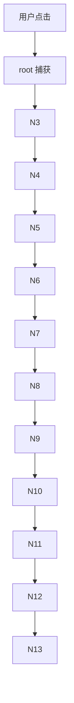

# Hooks 与更新机制

> 本页按「概念、原理、代码」逐题展开相关面试专题。

## 1. Hooks原理

### 1.1 Hooks基于Fiber链表的存储

**原理：** 每个组件的 Hooks 按调用顺序串联成链表，挂在 Fiber.memoizedState 上。

```
function MyComponent() {
  const [count, setCount] = useState(0); // Hook
  const [name, setName] = useState('');  // Hook
  useEffect(() => {}, []);                // Hook
}
```

**Fiber.memoizedState 链表：**

| Hook | 数据 |
|------|------|
| Hook 1 | state: 0 |
| Hook 2 | state: '' |
| Hook 3 | effect: fn |

**为什么不能用条件语句包裹 Hook：**
- 第一次渲染：Hooks 按顺序串联成链表
- 第二次渲染：Hooks 按相同顺序被读取，顺序被打乱会导致 state 错位

### 1.2 Mount vs Update阶段

```javascript
function useState(initialValue) {
  const hook = currentlyRenderingFiber.memoizedState;

  if (hook) {
    // UPDATE: 复用已有Hook,遍历队列计算最新状态
    let update = hook.queue.pending;
    while (update) {
      hook.memoizedState = typeof update.action === 'function'
        ? update.action(hook.memoizedState)   // setState(prev=>...)
        : update.action;                      // setState(value)
      update = update.next;
    }
    return [hook.memoizedState, dispatch];
  }

  // MOUNT: 创建新Hook节点,初始化状态
  const newHook = createHook(initialValue);
  return [initialValue, dispatch];
}
```

### 1.3 useEffect异步 vs useLayoutEffect同步

```javascript
// useEffect: 异步执行 (不阻塞paint)
useEffect(() => { /* 请求/订阅/定时器 */ }, [deps]);

// useLayoutEffect: 同步执行 (阻塞paint)
useLayoutEffect(() => { /* DOM测量/同步修改 */ }, [deps]);
```

```
执行时机:
  render() → commit(DOM mutations) → layoutEffect(同步)
    → paint(浏览器绘制) → effect(异步)

为什么useEffect是异步:
  - 不阻塞浏览器渲染,保证UI流畅
  - 多个effect可批量处理

为什么useLayoutEffect是同步:
  - DOM已更新但屏幕未绘制 → 可做同步测量
  - 修改后与paint在同帧 → 不会出现闪烁
```

## 2. Hooks为什么不能条件调用

```javascript
// 错误:
function Comp({ show }) {
  const [a, setA] = useState(0);  // Hook #1
  if (show) {
    const [b, setB] = useState('');  // Hook #2 (条件)
  }
  const [c, setC] = useState(0);  // Hook #3/#2?
  return <div>{a}{show && b}{c}</div>;
}

// show=true: Hook链表=[#1, #2, #3]
// show=false: Hook链表=[#1, #3]
// → Hook#3被错配到Hook#2的位置 → 状态错乱!

// 正确: 始终按顺序调用
function Comp({ show }) {
  const [a, setA] = useState(0);
  const [b, setB] = useState(''); // 始终调用
  const [c, setC] = useState(0);
  return <div>{a}{show && b}{c}</div>;
}
```

## 3. React批量更新与React 18自动批处理

```javascript
// React 17: 事件处理器中自动批量 ✓
handleClick() {
  this.setState({ a: 1 }); // 不立即render
  this.setState({ b: 2 }); // 合并为1次render
}

// React 17: setTimeout/Promise中不批量 ✗
setTimeout(() => {
  this.setState({ a: 1 }); // 触发render #1
  this.setState({ b: 2 }); // 触发render #2  (共2次!)
}, 0);

// React 18: 所有场景都自动批处理 ✓
setTimeout(() => {
  setState({ a: 1 });
  setState({ b: 2 });
}); // 只触发1次render!

// createRoot() 开启自动批处理 (默认)
const root = ReactDOM.createRoot(el);
root.render(<App />);
```

## 4. Concurrent Mode (React 18)

**阻塞渲染 vs 并发渲染：**

| 模式 | 说明 |
|------|------|
| 阻塞 (React 17) | Task1(500ms) → Task2(300ms) → Task3(200ms) = 总计 1000ms |
| 并发 (React 18) | Task1(500ms) \| Task2(300ms) \| Task3(200ms) = ~500ms |

**特点：** React 可在执行中暂停/恢复，不阻塞主线程

**Suspense:**

```jsx
<Suspense fallback={<Loading />}>
  <Profile />  {/* 异步加载时显示fallback */}
</Suspense>

const Profile = React.lazy(() => import('./Profile'));
// lazy原理:
// 返回Promise → 视为suspended child
// → 向上查找Suspense boundary → 显示fallback
// → Promise resolved → 重新渲染,显示实际组件
```

**useTransition:**

```jsx
function App() {
  const [isPending, startTransition] = useTransition();
  const [query, setQuery] = useState('');
  const [results, setResults] = useState([]);

  const handleSearch = (e) => {
    setQuery(e.target.value); // 高优先级 (立即响应)

    startTransition(() => {
      setResults(search(e.target.value)); // 低优先级 (可中断)
    });
  };

  return (
    <div>
      <input value={query} onChange={handleSearch} />
      {isPending ? <Spinner /> : <Results items={results} />}
    </div>
  );
}
```

## 5. React合成事件原理

**React 17+ Fiber 上的事件处理流程：**

| 步骤 | 说明 |
|------|------|
| 1 | 用户点击 button，浏览器 dispatchEvent('click') |
| 2 | React 捕获事件（挂载在 root 节点，而非 document） |
| 3 | 构建 SyntheticEvent（跨浏览器兼容） |
| 4 | 从 target fiber 向上遍历（通过 return 指针） |
| 5 | 收集所有 onClick 处理器 |
| 6 | 按 capturing → target → bubbling 顺序执行 |

**为什么用合成事件：**
1. 跨浏览器兼容（IE/Firefox/Chrome 行为一致）
2. 事件委托（减少绑定数量）
3. 对象池复用（减少 GC 压力）
4. React 17+ 根节点隔离（支持多版本 React 共存）



## 深入阅读与参考

!!! tip "怎么用这些资料"
    先读「官方文档与规范」建立准确的概念，再读「源码与示例」核对细节，最后用「教程、书籍与视频」换一种讲法加深理解。每条都写明了读哪一节、带着什么问题读。

### 官方文档与规范

| 资源 | 为什么读 | 怎么读 |
|---|---|---|
| [Built-in React Hooks](https://react.dev/reference/react/hooks) | Hooks 总览与调用规则，理解顺序与条件调用的基础。 | 读 Rules of Hooks 一节，带着“为什么顺序重要”思考，写一个条件调用错误示例。 |
| [React API 参考](https://react.dev/reference/react) | 每个 Hook 的 Caveats 解释更新时机与依赖细节。 | 查 useState/useEffect 的 Caveats，带着“何时触发重渲染”读，整理规则清单。 |
| [useState](https://react.dev/reference/react/useState) | useState 文档揭示状态更新与批处理机制。 | 读“Batch updates”与 Caveats，用计数器验证多次 setState 只渲染一次。 |
| [useTransition](https://react.dev/reference/react/useTransition) | useTransition 是并发模式的核心入口，理解优先级调度。 | 读示例，对比普通更新，在慢列表上实验中断与优先级。 |
| [act](https://react.dev/reference/react/act) | act 用于测试更新批处理，理解同步/异步批处理。 | 读 act 的用法与 Caveats，在测试中包裹连续 setState 观察渲染次数。 |
| [React DOM APIs](https://react.dev/reference/react-dom) | React DOM API 涉及根与事件系统，帮助理解合成事件。 | 读 createRoot 与事件相关 API，思考 React 事件如何挂载到 root。 |
| [React Working Group 与 RFC](https://github.com/reactjs/rfcs) | 官方 RFC 记录 Hooks 与并发特性的设计动机。 | 读 Hooks RFC 的 Motivation，回答“为什么引入调用顺序规则”。 |

### 源码与示例

| 资源 | 为什么读 | 怎么读 |
|---|---|---|
| [React 源码仓库](https://github.com/facebook/react) | 源码是理解 Hooks 链表与事件系统的最直接途径。 | 读 ReactFiberHooks 与 ReactDOMEventListener，配合断点看链表顺序与事件派发。 |

### 教程、书籍与视频

| 资源 | 为什么读 | 怎么读 |
|---|---|---|
| [React Fiber 架构笔记](https://github.com/acdlite/react-fiber-architecture) | Fiber 笔记梳理更新与工作循环，衔接并发渲染。 | 读 work loop 与优先级调度章节，画出 render 阶段流程图。 |
| [Overreacted：React as a UI Runtime](https://overreacted.io/react-as-a-ui-runtime/) | 用运行时视角解释 Hooks 与更新，适合建立心智模型。 | 分段读“Hooks”一节，每节用一句话复述，再解释条件调用为何失败。 |
| [Josh Comeau：常见初学者错误](https://www.joshwcomeau.com/react/common-beginner-mistakes/) | 初学者错误清单直接覆盖条件调用、依赖数组等陷阱。 | 对照清单检查自己代码，找出条件调用 Hooks 的写法并改正。 |
| [Kent C. Dodds 博客](https://kentcdodds.com/blog) | Kent 博客从实践角度讲解 Hooks 与事件处理。 | 挑 Hooks 与事件相关三篇，每篇写最小复现，验证事件绑定与更新。 |

## 应用与行业实践

### 应用场景地图

| 场景 | 用到本页哪个知识点 | 典型技术选型 | 注意事项 |
| --- | --- | --- | --- |
| 后台管理的万行表格筛选 | Concurrent Mode 的可中断渲染 | React 18 的 useDeferredValue 配合 TanStack Virtual | 输入框读紧急值，列表读延迟值 |
| 低端安卓的首屏加载 | Hooks 原理、Hooks 不能条件调用 | React 18 加 eslint-plugin-react-hooks | 条件返回放在全部 Hook 之后 |
| 多人协作白板的指针绘制 | 合成事件原理、自动批处理 | 原生 pointermove 监听加 useReducer | 把一次指针移动合并成一个 action |
| 实时搜索联想输入 | 自动批处理 | useTransition 加 AbortController | 请求竞态要主动丢弃过期响应 |
| 埋点上报与全局提示 | 自动批处理 | 事件队列加单次 setState | React 18 在 setTimeout、Promise 中也合批 |
| 无限滚动长列表 | 合成事件原理、批量更新 | IntersectionObserver 分批追加 | 不要在滚动回调里逐条 setState |
| 拖拽排序看板 | 自动批处理、合成事件原理 | pointer 事件加 transform | 提交后要读布局就放进 useLayoutEffect |
| 表单省市区联动 | Hooks 不能条件调用 | 受控字段或 React Hook Form | 调用顺序要稳定，分支下沉到子组件 |

### 三个场景拆解

#### 场景 1：后台管理万行表格的关键词筛选

- **业务背景**：运营后台表格有上万行记录，输入框每敲一个字就重算过滤并整表重渲染，输入回显被卡住。用 React DevTools Profiler 录制一次输入，就能看到单次 commit 超过一帧预算。

- **怎么用本页知识解决**：先分成两件事看。输入框的值是用户马上要看到的，走紧急更新；过滤后的列表是慢活，晚一帧再算不算错。用 useDeferredValue 把两者拆开，再用虚拟滚动压住节点数。

```jsx
function FilterTable({ rows }) {
  const [keyword, setKeyword] = useState('');   // 紧急更新：输入框读它
  const deferred = useDeferredValue(keyword);   // 延迟值：交给重列表使用

  const visible = useMemo(() => {               // 只在延迟值变化时重算
    const k = deferred.trim().toLowerCase();
    return k ? rows.filter(r => r.name.toLowerCase().includes(k)) : rows;
  }, [rows, deferred]);

  const stale = keyword !== deferred;           // 列表落后于输入时为 true

  return (
    <div style={{ opacity: stale ? 0.6 : 1 }}>  {/* 用透明度提示旧数据 */}
      <input
        value={keyword}                         // 受控输入始终读紧急值
        onChange={e => setKeyword(e.target.value)}
      />
      <VirtualList items={visible} />           {/* 示意组件，可换成 useVirtualizer */}
    </div>
  );
}
```

- 关键字对应输入框，延迟值对应列表，React 会在两者之间安排渲染顺序，输入不会排队等在过滤后面。
- useMemo 的依赖写成 deferred，过滤计算只在延迟值变化时发生，不会每次按键都重算一遍。
- stale 用来提示"列表还是旧的"，比冻结输入或者加全屏 loading 的体验好收拾。
- VirtualList 是示意组件，落地时替换为 TanStack Virtual 的 useVirtualizer，只渲染视口内的行。
- 如果行高可固定，就先固定行高，滚动时的可见区间计算会稳定，不会出现行高测量引发的抖动。

- **怎么度量收益**：用 React DevTools Profiler 录制"输入 5 个字符"的同一段交互，对比 commit 次数与最长 commit 耗时。用 Chrome DevTools Performance 面板看 Long Task 数量，用 web-vitals 报 INP。

- **什么时候不该用**：
  - 数据只有几十行、一次过滤耗时低于一帧时，引入延迟值只会让结果慢一拍，得不偿失。
  - 结果必须与输入严格同步的校验场景，例如金额输入后立刻判定是否超限，不要让列表落在后面。

#### 场景 2：多人协作白板的高频指针事件

- **业务背景**：白板要跟随 pointermove 实时画线，一秒内可以产生上百次事件，回调里连着改多个 state 就会在一帧里排出多次提交。打开 Performance 面板数一数每秒的 commit 次数，就能确认这件事。

- **怎么用本页知识解决**：先让状态变化变少。把"追加一个点"收成一个 reducer action，一次事件只派发一次。再确认这些派发落在哪个批次里。

```jsx
function Board() {
  const elRef = useRef(null);
  const [, dispatch] = useReducer(reducer, { points: [] });  // 一次事件一个 action

  useEffect(() => {
    const el = elRef.current;
    const onMove = (e) => {
      // 原生监听里的 dispatch 在 React 18 也自动批处理
      dispatch({ type: 'append', x: e.offsetX, y: e.offsetY });
    };
    el.addEventListener('pointermove', onMove);
    return () => el.removeEventListener('pointermove', onMove);  // 清理，避免重复绑定
  }, []);

  return <canvas ref={elRef} />;
}
```

- 用 useReducer 而不是连调多个 setState，一次指针移动只对应一次派发，提交次数先降下来。
- 监听挂在真实 DOM 节点上，事件回调走的是原生路径，不再经过合成事件的池化包装。
- React 18 起，原生事件、setTimeout、Promise 回调里的 setState 也会自动批处理；在 React 17 上等价做法是 unstable_batchedUpdates。
- 派发之后要立刻读布局（例如测画布尺寸）时，放进 useLayoutEffect，或者用 react-dom 的 flushSync 强制同步提交。flushSync 会放弃批处理，只在必要时用。
- 清理函数不能省，StrictMode 下 effect 会跑两遍，没有清理就会重复绑定监听。

- **怎么度量收益**：Chrome DevTools Performance 录制 3 秒连续绘制，看 commit 次数与 Long Task 数量。用 React DevTools Profiler 的 Commit 火焰图确认每次提交命中的组件范围。

- **什么时候不该用**：
  - 状态少、一帧只有一次提交的场景，直接 setState 就够，套 reducer 只增加一层间接。
  - 不要在 pointermove 回调里做重计算再指望批处理救场，把计算挪进 requestAnimationFrame 更直接。

#### 场景 3：低端安卓的首屏加载

- **业务背景**：首屏要等用户信息和配置接口返回，代码在 Hook 调用之前写了早退分支，接口返回时机一变就抛出 "Rendered fewer hooks than expected"。低端机上出错重挂载一次，用户看到的是白屏再来一遍。

- **怎么用本页知识解决**：Hook 的调用顺序就是它的身份，早退不能插在 Hook 之间。把所有 Hook 提到顶层，分支放到最后，或者把有条件的那部分提成独立子组件。

```jsx
function Screen({ userId }) {
  const [profile, setProfile] = useState(null);   // 全部 Hook 在顶层，无条件调用
  const [tab, setTab] = useState('home');

  useEffect(() => {
    let alive = true;                              // 标记本次请求是否还有效
    fetchProfile(userId).then(p => { if (alive) setProfile(p); });
    return () => { alive = false; };               // 快速切换账号时丢弃旧响应
  }, [userId]);

  if (!profile) return <Spinner />;                // 条件返回放在全部 Hook 之后
  return <Profile data={profile} onTab={setTab} />;
}
```

- 顺序固定，渲染次数变化时 Hook 下标不会错位，报错来源就消失了。
- 如果确实要跳过一整棵子树的 Hook，把子树提成组件，由父组件决定渲染哪一支，而不是在函数中间 return。
- effect 依赖 userId，并且带清理标记，账号快速切换时旧响应不会覆盖新状态。
- fetchProfile 是示意请求函数，实际项目替换成自己的数据层调用，并保留同一个清理约定。
- 用 eslint-plugin-react-hooks 的 rules-of-hooks 在提交前拦住条件调用，不要等线上监控报错。

- **怎么度量收益**：在错误监控里统计报错文案 "Rendered fewer hooks than expected" 和 "Rendered more hooks than during the previous render" 的 issue 数量。用 Lighthouse 移动端模式看 LCP 与 TBT，用 web-vitals 看 LCP。

- **什么时候不该用**：
  - 首屏数据已经在服务端渲染阶段注入时，不要再加一个客户端 loading 分支和第二次请求。
  - 需要整体切换身份的场景，用 key 强制重建组件，而不是在 Hook 内部拼接残留状态。

### 行业先进实践

在 CI 里启用 rules-of-hooks 与 exhaustive-deps（出处：eslint-plugin-react-hooks 开源项目）
做法是把这两条规则设为 error，在 lint 阶段拦住条件调用 Hook 和漏写依赖。有效的原因是它们靠静态分析检查调用顺序和闭包依赖，不必等运行时出错。借鉴方式是把 lint 接进合并请求门禁，存量告警先加白名单再逐文件收敛。

用 useDeferredValue 与 startTransition 区分紧急更新和可延迟更新（出处：React 官方文档的 useDeferredValue、useTransition 章节）
做法是让输入、悬停这类反馈走紧急更新，让过滤、重算这类工作走过渡更新。有效的原因是并发渲染会把可中断的更新让位给紧急更新。借鉴方式是先挑最长的那条交互路径接上，再用 Profiler 对比提交耗时。

用 useSyncExternalStore 订阅外部数据源（出处：React 官方文档的 useSyncExternalStore 章节）
做法是把订阅拆成 subscribe 与 getSnapshot 两个函数交给 React 读取。有效的原因是并发渲染下读取外部可变数据可能撕裂，这个 Hook 会让 React 在提交前确认快照一致。借鉴方式是自研 store 或浏览器 API 接入前先包一层。

用虚拟滚动只渲染视口内的行（出处：TanStack Virtual 开源项目）
做法是按滚动位置算出可见区间，只挂载落在区间内的行。有效的原因是 DOM 节点数和总行数解耦，行数涨了提交成本不跟着线性涨。借鉴方式是先确认行高能否固定，固定行高的区间计算最稳。

打开 Profiler 的渲染原因记录（出处：React DevTools 开源项目）
做法是在 Profiler 设置里勾选记录每个组件为何重渲染，录一段交互后逐条看原因和耗时。有效的原因是把"谁在重渲染"变成可回看的记录。借鉴方式是在关键页面录一份基线，改完再录一份对照。

### 从学到用：落地路线

第 1 步，在一个交互密集的页面试点，只开 Profiler 录制，不动代码。验收标准是拿出改动前的 commit 次数与最长 commit 耗时记录。

第 2 步，做一处最小改动，例如输入走紧急更新、列表走延迟更新。验收标准是用同一段交互脚本复测，最长 commit 耗时下降，且过滤结果与改动前逐行一致。

第 3 步，把 rules-of-hooks 与 exhaustive-deps 设为 error，把复测步骤写进页面性能检查清单，按页面接入。验收标准是新提交不再引入条件调用 Hook，纳入清单的页面都留有一份 Profiler 记录。

第 4 步，在 CI 跑 lint 和关键交互的基准脚本，记录 commit 次数与 INP。验收标准是连续两个版本的指标不超过设定阈值。

### 动手作业

目标是做一个万行筛选列表的小页面，把输入回显和列表渲染分开，并用 Profiler 量化前后差异。

步骤：
1. 用确定性随机种子生成 10000 行假数据，字段包含 id、name、status。
2. 写第一版：受控 input 加每次输入直接 filter，记录一次交互的提交情况。
3. 用 React DevTools Profiler 录制"输入 5 个字符"的交互，存下 commit 次数与最长 commit 耗时。
4. 写第二版：用 useDeferredValue 把过滤值和输入值分开，列表落后时给出视觉提示。
5. 写第三版：接入虚拟滚动，只渲染视口内的行，overscan 设成固定值。
6. 用同一段交互脚本重复第 3 步，把两份记录放在一起比较。
7. 在 README 里写清复现命令、两份记录的数值和结论。

验收标准：
- 列表重算期间输入框仍能逐字符回显，不丢字符。
- 同机同浏览器同数据下，第二版的最长 commit 耗时低于第一版。
- DOM 中的行数不超过可视行数加 overscan 上限。
- 第二版和第三版的过滤结果与第一版逐行一致，用同一组关键词对比。
- README 中包含复现命令和两份 Profiler 记录的数值。

