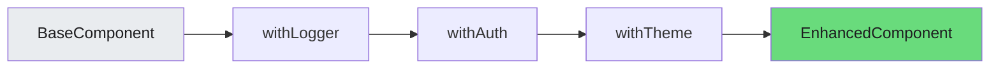
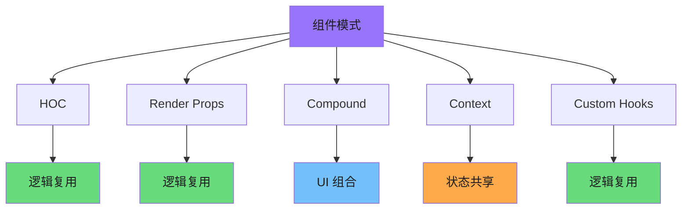

# 组件模式大全

React 组件模式是构建可复用、可维护 UI 的核心手段。本文全面介绍九大组件模式，辅以图表和代码示例，帮助你构建健壮的 React 应用。

---

## 1. 高阶组件 (HOC)

高阶组件是接收组件并返回新组件的函数，用于逻辑复用和属性增强。

```javascript
// 高阶组件基础模式
function withSubscription(WrappedComponent, selectData) {
  return function(props) {
    const data = useDataSource(selectData);
    return <WrappedComponent {...props} data={data} />;
  };
}

// 使用示例
const CommentListWithSubscription = withSubscription(CommentList, (data) =>
  data.filter(comment => comment.isVisible)
);
```

### 1.1 装饰者模式

HOC 本质是装饰者模式的应用，在不修改原组件的前提下增强功能。

```javascript
// 日志注入 HOC
function withLogger(WrappedComponent) {
  return function(props) {
    useEffect(() => {
      console.log(`${WrappedComponent.name} mounted`);
      return () => console.log(`${WrappedComponent.name} unmounted`);
    }, []);
    return <WrappedComponent {...props} />;
  };
}
```

### 1.2 属性代理 vs 继承提升

**属性代理 (Props Proxy)**：操作传入组件的 props

```javascript
function withDefaultProps(WrappedComponent, defaultProps) {
  return function(props) {
    return <WrappedComponent {...defaultProps} {...props} />;
  };
}
```

**继承提升 (Inheritance Inversion)**：操作生命周期和渲染逻辑

```javascript
function withAuthentication(WrappedComponent) {
  // 第 1 段：高阶组件入口——接收被保护组件，返回一个“继承”它的匿名类
  // 这里用 class extends WrappedComponent 而不是组合包裹，因此 WrappedComponent
  // 必须是类组件且自带 render；继承式 HOC 会覆盖父类生命周期，这是常见的易错点。
  return class extends WrappedComponent {
    // 第 2 段：挂载后鉴权——借助 componentDidMount 在首次渲染完成后检查登录态
    // 数据流：user 和 history 都来自外部注入（通常由路由或父组件传入）；
    // history.push 是命令式跳转，不会中断当前流程，所以未登录时仍可能渲染一次。
    componentDidMount() {
      if (!this.props.user) {
        // 未登录则跳转登录页；注意没有 return，边界情况是页面可能短暂渲染受保护内容
        this.props.history.push('/login');
      }
    }
    // 第 3 段：渲染代理——把渲染职责委托给被包装组件（父类）
    // super.render() 实际调用 WrappedComponent.prototype.render，且 this 指向当前实例；
    // 时间复杂度 O(1)，边界条件是 WrappedComponent 必须真的实现 render，否则会抛错。
    render() {
      return super.render();
    }
  };
}
```
### 1.3 链式调用

多个 HOC 可链式组合，形成功能管道。



```javascript
// 链式调用示例
const EnhancedComponent = withTheme(withAuth(withLogger(BaseComponent)));

// 推荐：使用 compose 工具
import { compose } from 'redux';
const EnhancedComponent = compose(withTheme, withAuth, withLogger)(BaseComponent);
```

### 1.4 HOC 注意事项

- 不要在 render 方法中使用 HOC，会导致子组件每次渲染都重新挂载
- 务必复制静态方法：`hoist-non-react-statics`
- Refs 不会传递，需使用 `forwardRef`

---

## 2. 渲染属性 (Render Props)

渲染属性是一种通过 prop 传递函数来共享逻辑的技术。

```javascript
// 基础渲染属性模式
class MouseTracker extends React.Component {
  state = { x: 0, y: 0 };

  handleMouseMove = (e) => {
    this.setState({ x: e.clientX, y: e.clientY });
  };

  render() {
    return (
      <div onMouseMove={this.handleMouseMove}>
        {this.props.render(this.state)}
      </div>
    );
  }
}

// 使用
<MouseTracker render={mouse => (
  <p>鼠标位置: {mouse.x}, {mouse.y}</p>
)} />
```

### 2.1 children as function

将 render prop 放在 children 位置，使调用更自然。

```javascript
// children 作为函数
<MouseTracker>
  {(mouse) => (
    <>
      <h1>移动鼠标</h1>
      <div>坐标: {mouse.x}, {mouse.y}</div>
      <Cat mouse={mouse} />
    </>
  )}
</MouseTracker>
```

### 2.2 逻辑复用模式

渲染属性将逻辑与 UI 分离，实现关注点分离。

```javascript
// 数据获取渲染属性
class DataFetcher extends React.Component {
  state = { data: null, loading: true, error: null };

  async componentDidMount() {
    try {
      const data = await fetch(this.props.source);
      this.setState({ data, loading: false });
    } catch (error) {
      this.setState({ error, loading: false });
    }
  }

  render() {
    return this.props.children(this.state);
  }
}

// 使用
<DataFetcher source="/api/user">
  {({ data, loading, error }) => {
    if (loading) return <Loading />;
    if (error) return <Error error={error} />;
    return <UserProfile user={data} />;
  }}
</DataFetcher>
```

### 2.3 Render Props vs HOC

| 特性 | HOC | Render Props |
|------|-----|--------------|
| 灵活性 | 中等 | 高 |
| Props 冲突 | 容易 | 不易 |
| 组合方式 | 链式 | 嵌套 |
| 调试难度 | 较高 | 较低 |

---

## 3. 组合模式

组合是 React 的核心哲学，通过组件嵌套和 props 传递实现灵活架构。

### 3.1 Slot/Outlet 模式

类似 Vue 的插槽，React 通过 props 实现内容分发。

```javascript
// 基础 Slot
function Card({ title, children }) {
  return (
    <div className="card">
      <div className="card-header">{title}</div>
      <div className="card-body">{children}</div>
    </div>
  );
}

// 多个 Slot
function Layout({ header, main, footer }) {
  return (
    <div className="layout">
      <header>{header}</header>
      <main>{main}</main>
      <footer>{footer}</footer>
    </div>
  );
}

<Layout
  header={<Logo />}
  main={<Content />}
  footer={<Footer />}
/>
```

### 3.2 复合组件 (Compound Components)

多个组件协同工作，共享隐式状态。

```javascript
// 复合组件示例 - Select
const SelectContext = createContext();

function Select({ children, value, onChange }) {
  const [isOpen, setIsOpen] = useState(false);

  return (
    <SelectContext.Provider value={{ value, onChange, isOpen, setIsOpen }}>
      <div className="select">{children}</div>
    </SelectContext.Provider>
  );
}

function Option({ value, children }) {
  const { onChange, setIsOpen } = useContext(SelectContext);

  return (
    <div onClick={() => { onChange(value); setIsOpen(false); }}>
      {children}
    </div>
  );
}

// 使用
<Select value={selected} onChange={setSelected}>
  <Option value="a">选项 A</Option>
  <Option value="b">选项 B</Option>
</Select>
```

### 3.3 Context 共享状态

使用 Context 在组件树间共享数据。

```javascript
// Theme Context
const ThemeContext = createContext({ theme: 'light', toggle: () => {} });

function ThemeProvider({ children }) {
  const [theme, setTheme] = useState('light');

  const toggle = () => setTheme(t => t === 'light' ? 'dark' : 'light');

  return (
    <ThemeContext.Provider value={{ theme, toggle }}>
      {children}
    </ThemeContext.Provider>
  );
}

// 消费 Context
function Button() {
  const { theme } = useContext(ThemeContext);
  return <button className={theme}>点击</button>;
}
```

---

## 4. 受控与非受控组件

理解两种组件模式是掌握 React 表单的基础。

### 4.1 受控组件 (Controlled Components)

表单数据由 React 状态驱动的组件。

```javascript
// 受控输入组件
function ControlledInput() {
  const [value, setValue] = useState('');

  return (
    <input
      type="text"
      value={value}
      onChange={(e) => setValue(e.target.value)}
    />
  );
}

// 受控 Select
function ControlledSelect() {
  const [selected, setSelected] = useState('');

  return (
    <select value={selected} onChange={(e) => setSelected(e.target.value)}>
      <option value="">请选择</option>
      <option value="a">选项 A</option>
      <option value="b">选项 B</option>
    </select>
  );
}

// 受控 Checkbox
function ControlledCheckbox() {
  const [checked, setChecked] = useState(false);

  return (
    <input
      type="checkbox"
      checked={checked}
      onChange={(e) => setChecked(e.target.checked)}
    />
  );
}
```

### 4.2 非受控组件 (Uncontrolled Components)

表单数据由 DOM 自身管理，通过 ref 获取值。

```javascript
// 第 1 段：非受控输入组件（值由 DOM 自己保管，React 不做逐键同步）
// 非受控的语义是：表单元素内部维护自己的 value，React 只在需要时通过 ref "伸手去读"。
// 因此这里没有 useState、也没有 onChange，用户输入不会触发本组件重渲染，天然适合低频取值的场景。
function UncontrolledInput() {
  // 第 2 段：建立指向真实 DOM 节点的引用通道
  // useRef 返回的对象在组件整个生命周期内保持同一引用，改 current 不会引起重渲染；
  // 这正是非受控模式要的效果：把"值"存放在 React 的渲染数据流之外。
  const inputRef = useRef();

  // 第 3 段：在提交这一刻才惰性读值
  // 关键数据流：inputRef.current 是原生 <input> 元素 → .value 是浏览器维护的当前文本。
  // 易错点：必须保证调用时节点已挂载；在渲染期或卸载后访问会拿到 undefined 并直接抛错。
  const handleSubmit = () => {
    alert(`输入值: ${inputRef.current.value}`);
  };

  // 第 4 段：渲染并把 ref 绑到 input 上
  // defaultValue 只在首次挂载时写入 DOM，之后完全交给用户输入接管，React 不再干预。
  // 若图省事改成 value={...} 却不配 onChange，输入框会立即变成只读——这是最常见的踩坑点。
  return (
    <div>
      <input type="text" ref={inputRef} defaultValue="默认值" />
      <button onClick={handleSubmit}>提交</button>
    </div>
  );
}

// 第 5 段：非受控文件输入（文件字段天生只能非受控）
// <input type="file"> 的 value 是只读的（浏览器出于安全不允许 JS 设值），无法用 state 受控，
// 只能靠 ref 在提交时读取；这里改用 <form> 的 onSubmit 统一接管提交，避免按钮点击与回车行为不一致。
function FileInput() {
  // 第 6 段：文件输入框的 ref
  // 与文本框不同，这里读到的不是字符串而是 FileList（类数组），真正的文件对象位于 .files[0]。
  const fileRef = useRef();

  // 第 7 段：表单提交处理（读取文件元信息）
  // e.preventDefault() 阻止浏览器的默认表单提交（整页刷新/跳转），否则 SPA 的内存状态会全部丢失。
  // 边界条件：用户未选文件时 files[0] 为 undefined，再取 .name 会抛 TypeError；
  // 真实项目应先判空或校验 files.length，这里仅为教学演示最小写法。
  const handleSubmit = (e) => {
    e.preventDefault();
    alert(`文件名: ${fileRef.current.files[0].name}`);
  };

  // 第 8 段：渲染 —— 用 submit 按钮触发表单的 onSubmit
  // button 的 type="submit" 使点击与在输入框内回车都会冒泡到 <form> 的 onSubmit，
  // 收敛到同一个处理函数；若无意中写成 type="button"，onSubmit 将永远不会触发。
  return (
    <form onSubmit={handleSubmit}>
      <input type="file" ref={fileRef} />
      <button type="submit">上传</button>
    </form>
  );
}
```
### 4.3 ref 的使用

`useRef` 用于访问 DOM 元素或存储可变的跨渲染持久值。

```javascript
// 访问 DOM
function FocusInput() {
  const inputRef = useRef();

  useEffect(() => {
    inputRef.current.focus();
  }, []);

  return <input ref={inputRef} />;
}

// 存储可变值
function Timer() {
  const intervalRef = useRef(null);
  const [count, setCount] = useState(0);

  useEffect(() => {
    intervalRef.current = setInterval(() => {
      setCount(c => c + 1);
    }, 1000);

    return () => clearInterval(intervalRef.current);
  }, []);

  return <div>计数: {count}</div>;
}
```

### 4.4 默认值处理

| 场景 | 受控 | 非受控 |
|------|------|--------|
| 初始值固定 | `value=""` | `defaultValue=""` |
| 实时验证 | 受控 | 需配合 |
| 动态初始值 | `useEffect` | ref + 手动 |

---

## 5. 惰性组件 (Lazy Components)

延迟加载非首屏组件，优化应用性能。

### 5.1 React.lazy

```javascript
// 基础惰性加载
const OtherComponent = React.lazy(() => import('./OtherComponent'));

// Suspense 配合
function MyComponent() {
  return (
    <div>
      <Suspense fallback={<LoadingSpinner />}>
        <OtherComponent />
      </Suspense>
    </div>
  );
}
```

### 5.2 错误边界配合

错误边界捕获子组件的 JavaScript 错误，防止整应用崩溃。

```javascript
// 错误边界组件
class ErrorBoundary extends React.Component {
  state = { hasError: false, error: null };

  static getDerivedStateFromError(error) {
    return { hasError: true, error };
  }

  componentDidCatch(error, errorInfo) {
    console.error('Error:', error, errorInfo);
    logErrorToService(error, errorInfo);
  }

  render() {
    if (this.state.hasError) {
      return this.props.fallback || <ErrorMessage error={this.state.error} />;
    }
    return this.props.children;
  }
}

// 使用
<ErrorBoundary fallback={<SomethingWentWrong />}>
  <LazyComponent />
</ErrorBoundary>
```

### 5.3 Suspense 配置

Suspense 定义懒加载组件的加载状态。

```javascript
// 多组件惰性加载
// 第 1 段：用 React.lazy 声明三个惰性组件（拆分打包 + 按需下载）
// 为什么这样写：React.lazy 接收一个返回 import() 的回调，只有在该组件首次被渲染时
// 才会触发动态 import，打包器（webpack/vite）据此把模块切成独立 chunk，首屏体积因此变小。
// 易错点：回调必须返回 Promise 且模块有 default 导出（export default），否则渲染时直接抛错。
const Dashboard = React.lazy(() => import('./Dashboard'));
const Settings = React.lazy(() => import('./Settings'));
const Profile = React.lazy(() => import('./Profile'));

// 第 2 段：App 组件用 Suspense 包裹路由出口，统一处理"加载中"状态
// 数据流：渲染 <Route> → 命中惰性组件 → 若对应 chunk 未就绪，React 向上冒泡到最近的
// <Suspense>，先渲染 fallback，chunk 到达后 React 用真实组件替换 fallback 并保留已提交的 UI。
// 边界条件：fallback 只在"首次加载该 chunk"期间出现，之后缓存命中就不再闪烁，所以这里不必做骨架屏时长控制。
function App() {
  return (
    <Suspense fallback={<div>加载中...</div>}>
      // 第 3 段：路由表把 URL 映射到刚声明的惰性组件
      // 关键点：Suspense 必须放在 Routes 外层——路由匹配到的元素一旦挂起，
      // 需要由外层的 Suspense 承接；若写在 <Route> 元素内部，则相当于每个路由各自兜底。
      // 易错点：这里的 component={X} 是 react-router v5 的写法，v6 需改为 element={<X />}，
      // 且 v6 中 Routes 的子元素只能是 Route，混用会在运行时报错。
      <Routes>
        <Route path="/dashboard" component={Dashboard} />
        <Route path="/settings" component={Settings} />
        <Route path="/profile" component={Profile} />
      </Routes>
    </Suspense>
  );
}
```
### 5.4 预加载策略

```javascript
// 鼠标悬停预加载
function LazyLink({ importFn, children }) {
  const [shouldLoad, setShouldLoad] = useState(false);

  return (
    <div
      onMouseEnter={() => !shouldLoad && setShouldLoad(true)}
      onClick={() => importFn().then(module => module.default())}
    >
      {children}
    </div>
  );
}

// 路由预加载
const preloadRoute = (path) => {
  if (path === '/dashboard') import('./Dashboard');
};

function NavigationLink({ path, children }) {
  return (
    <Link to={path} onMouseEnter={() => preloadRoute(path)}>
      {children}
    </Link>
  );
}
```

---

## 6. 提供者模式 (Provider Pattern)

Provider 模式通过 Context 实现全局状态和配置的注入与消费。

### 6.1 Context Provider

```javascript
// 创建 Context
const AuthContext = createContext(null);

// Provider 组件
function AuthProvider({ children }) {
  const [user, setUser] = useState(null);
  const [token, setToken] = useState(null);

  const login = async (credentials) => {
    const { user, token } = await authService.login(credentials);
    setUser(user);
    setToken(token);
    return { user, token };
  };

  const logout = () => {
    setUser(null);
    setToken(null);
  };

  const value = { user, token, login, logout };

  return (
    <AuthContext.Provider value={value}>
      {children}
    </AuthContext.Provider>
  );
}
```

### 6.2 Provider 嵌套

多个 Provider 可嵌套组合，形成作用域链。

```javascript
// 主题 + 语言 Provider
function AppProviders({ children }) {
  return (
    <ThemeProvider>
      <LanguageProvider>
        <AuthProvider>
          {children}
        </AuthProvider>
      </LanguageProvider>
    </ThemeProvider>
  );
}

// 或使用组合函数
const withProviders = (...providers) => (component) =>
  providers.reduce((acc, Provider) =>
    <Provider><Acc /></Provider>,
    component
  );
```

### 6.3 Hooks 获取 Context

使用 Hooks 简化 Context 消费。

```javascript
// useAuth Hook
function useAuth() {
  const context = useContext(AuthContext);
  if (!context) {
    throw new Error('useAuth must be used within AuthProvider');
  }
  return context;
}

// 使用
function LoginButton() {
  const { user, login, logout } = useAuth();

  return user ? (
    <button onClick={logout}>退出</button>
  ) : (
    <button onClick={() => login({ username: 'demo' })}>登录</button>
  );
}
```

### 6.4 Provider 性能优化

```javascript
// 拆分 Context 避免不必要的重渲染
const UserContext = createContext({ user: null });
const ThemeContext = createContext({ theme: 'light' });

// 使用 useMemo 稳定 Provider value
function AuthProvider({ children }) {
  const [user, setUser] = useState(null);

  const value = useMemo(() => ({
    user,
    setUser,
  }), [user]);

  return (
    <UserContext.Provider value={value}>
      {children}
    </UserContext.Provider>
  );
}
```

---

## 7. 容器/展示组件分离

容器组件负责数据获取和业务逻辑，展示组件负责 UI 渲染。

### 7.1 Container 与 Presentational

```javascript
// 展示组件 - 仅接收 props，无副作用
function UserList({ users, onSelect }) {
  return (
    <ul>
      {users.map(user => (
        <li key={user.id} onClick={() => onSelect(user)}>
          <Avatar src={user.avatar} />
          <span>{user.name}</span>
        </li>
      ))}
    </ul>
  );
}

// 容器组件 - 数据获取和状态管理
function UserListContainer() {
  const [users, setUsers] = useState([]);
  const [loading, setLoading] = useState(true);

  useEffect(() => {
    fetchUsers().then(data => {
      setUsers(data);
      setLoading(false);
    });
  }, []);

  if (loading) return <Loading />;

  return <UserList users={users} onSelect={handleSelect} />;
}
```

### 7.2 关注点分离

| 方面 | 容器组件 | 展示组件 |
|------|----------|----------|
| 职责 | 数据获取、状态管理 | UI 渲染 |
| 对 Redux 依赖 | 是 | 否 |
| 副作用 | 有 | 无 |
| 测试 | Mock 数据 | 直接测试 |

### 7.3 HOC 实现分离

```javascript
// 数据获取 HOC
function withData(fetchFn, mapDataToProps) {
  return function(WrappedComponent) {
    return function(props) {
      const [data, setData] = useState(null);

      useEffect(() => {
        fetchFn().then(setData);
      }, []);

      const mappedProps = mapDataToProps(data);
      return <WrappedComponent {...props} {...mappedProps} />;
    };
  };
}

// 使用
const UserListWithData = withData(
  () => fetchUsers(),
  (users) => ({ users })
)(UserList);
```

---

## 8. 状态组件 vs 函数组件

React 17 后，函数组件 + Hooks 成为主流方案。

### 8.1 Class vs Function

```javascript
// Class 组件
class Counter extends React.Component {
  state = { count: 0 };

  handleClick = () => {
    this.setState(prev => ({ count: prev.count + 1 }));
  };

  render() {
    return <button onClick={this.handleClick}>{this.state.count}</button>;
  }
}

// Function 组件 + Hooks
function Counter() {
  const [count, setCount] = useState(0);

  return <button onClick={() => setCount(c => c + 1)}>{count}</button>;
}
```

### 8.2 Hooks 统一方案

```javascript
// 状态 Hook
function useCounter(initialValue = 0) {
  // 第 1 段：声明计数状态（组件对外唯一的"数据源"）
  // useState 以 initialValue 作为首次渲染的初始值；之后即使 initialValue 变化也不会自动同步到 count，
  // 需要重置时必须显式调用下方 reset，这是受控状态与"派生值"的分界线。
  const [count, setCount] = useState(initialValue);

  // 第 2 段：派生三个操作函数，并用 useCallback 固化函数引用
  // 为什么要缓存：若每次渲染都生成新函数，传给 memo 化子组件会破坏其 props 相等性，导致无谓重渲染。
  // 为何用函数式更新 setCount(c => c + 1)：基于最新值计算，规避闭包捕获旧 count 的"陈旧闭包"陷阱；
  // 依赖数组刻意留空 → 函数终生稳定，只有 reset 依赖 initialValue，因为它需要读取外部传入的值。
  const increment = useCallback(() => setCount(c => c + 1), []);
  const decrement = useCallback(() => setCount(c => c - 1), []);
  const reset = useCallback(() => setCount(initialValue), [initialValue]);

  // 第 3 段：以对象形式统一返回读写接口，调用方无需接触 setCount 实现细节
  return { count, increment, decrement, reset };
}

// 副作用 Hook
function useDataFetching(url) {
  // 第 4 段：声明请求的三种状态，构成典型的异步 UI 三态（数据 / 加载中 / 错误）
  // loading 初值为 true，表示"一挂载即视为正在加载"；data 与 error 初值为 null，表示尚无结果。
  // 三者相互独立，成功或失败时需成对切换（如成功时同时写 data 与 loading=false），否则 UI 可能出现矛盾状态。
  const [data, setData] = useState(null);
  const [loading, setLoading] = useState(true);
  const [error, setError] = useState(null);

  // 第 5 段：副作用主体——url 变化时重新发起请求
  // 依赖数组只放 [url]：保证"换地址才重跑"，避免每次渲染都触发一次网络请求。
  useEffect(() => {
    let cancelled = false;

    // 第 6 段：真正的异步请求逻辑，也是"竞态防护"的核心
    // 为何用 cancelled 标志位：网络返回顺序不可控，旧请求可能晚于新请求到达，若不判断就会用过期结果覆盖新数据；
    // 组件已卸载时再 setState 也会告警。try/catch 同时覆盖网络失败与 JSON 解析失败，统一收敛到 error 分支。
    async function fetchData() {
      try {
        const response = await fetch(url);
        const result = await response.json();
        if (!cancelled) {
          setData(result);
          setLoading(false);
        }
      } catch (err) {
        if (!cancelled) {
          setError(err);
          setLoading(false);
        }
      }
    }

    // 第 7 段：立即执行请求，并注册清理函数
    // 清理函数会在 url 再次变化（重跑 effect 前）或组件卸载时调用，把 cancelled 置真，使在途响应自动失效。
    // 这是 React 官方推荐的"忽略过期异步结果"模式，不依赖 AbortController 即可避免竞态与卸载后更新。
    fetchData();
    return () => { cancelled = true; };
  }, [url]);

  // 第 8 段：对外暴露三态，供调用方根据 loading / error / data 决定渲染分支
  return { data, loading, error };
}
```
### 8.3 Hooks 规则

```javascript
// 1. 仅在顶层调用 Hooks
function BrokenComponent() {
  if (condition) {
    const [state, setState] = useState(0); // 违反规则！
  }
}

// 正确做法：拆分组件或使用条件提前 return
function CorrectComponent({ shouldShow }) {
  if (shouldShow) {
    return <WithState />;
  }
  return <WithoutState />;
}

// 2. 仅在 React 函数中调用
// 可以在:
// - 函数组件
// - 自定义 Hooks

// 不能在:
// - 普通函数
// - Class 组件
```

---

## 9. 样式模式

React 组件有多种样式方案，各有权衡。

### 9.1 CSS-in-JS

```javascript
// styled-components 示例
import styled from 'styled-components';

const Button = styled.button`
  background: ${props => props.primary ? '#007bff' : '#6c757d'};
  color: white;
  padding: 8px 16px;
  border-radius: 4px;

  &:hover {
    opacity: 0.9;
  }
`;

// Emotion 示例
import { css } from '@emotion/react';

const cardStyle = css`
  padding: 16px;
  border-radius: 8px;
  box-shadow: 0 2px 4px rgba(0,0,0,0.1);
`;

function Card({ children }) {
  return <div css={cardStyle}>{children}</div>;
}
```

### 9.2 CSS Modules

```css
/* Button.module.css */
.button {
  background: #007bff;
  color: white;
  padding: 8px 16px;
  border-radius: 4px;
}

.primary {
  background: #28a745;
}
```

```javascript
/* Button.jsx */
import styles from './Button.module.css';

function Button({ primary, children }) {
  return (
    <button className={`${styles.button} ${primary ? styles.primary : ''}`}>
      {children}
    </button>
  );
}
```

### 9.3 Tailwind CSS

```javascript
// 原子化 CSS 方案
function Card({ title, description }) {
  return (
    <div className="bg-white rounded-lg shadow-md p-6 max-w-sm">
      <h3 className="text-xl font-bold mb-2">{title}</h3>
      <p className="text-gray-600">{description}</p>
      <button className="mt-4 bg-blue-500 text-white px-4 py-2 rounded hover:bg-blue-600 transition">
        了解更多
      </button>
    </div>
  );
}
```

### 9.4 样式方案对比

| 方案 | 优势 | 劣势 |
|------|------|------|
| CSS Modules | 原生支持、性能好 | 动态样式不便 |
| styled-components | 组件封装、主题支持 | 运行时开销 |
| Tailwind CSS | 快速开发、无类名冲突 | 学习曲线、HTML 冗长 |
| CSS-in-JS | 逻辑复用、动态样式 | 包体积增加 |

---

## 10. 组件模式关系图



---

## 11. 最佳实践

### 11.1 模式选择指南

1. **逻辑复用**：优先使用自定义 Hooks，次选 Render Props，最后考虑 HOC
2. **状态管理**：简单状态用 useState，共享状态用 Context，复杂状态用状态管理库
3. **性能优化**：先测量再优化，避免过早优化
4. **代码组织**：相关逻辑放在一起，保持组件职责单一

### 11.2 常见陷阱

- **HOC 嵌套过深**：使用命名工具如 `displayName` 便于调试
- **Render Props 地狱**：提取为自定义 Hooks 简化
- **Context 滥用**：按需拆分 Provider，避免全局单例过多
- **Props 层层传递**：使用 Context 或状态管理库

### 11.3 调试技巧

```javascript
// 添加调试 displayName
function withLogger(WrappedComponent) {
  function WithLogger(props) {
    return <WrappedComponent {...props} />;
  }
  WithLogger.displayName = `WithLogger(${getDisplayName(WrappedComponent)})`;
  return WithLogger;
}

function getDisplayName(WrappedComponent) {
  return WrappedComponent.displayName || WrappedComponent.name || 'Component';
}
```

---

## 12. 总结

React 组件模式并非相互排斥，而是可以组合使用：

- **HOC** 适合横切关注点
- **Render Props** 适合逻辑复用
- **复合组件** 适合构建 UI 组件库
- **Provider** 适合全局状态
- **Hook** 是现代 React 的核心

掌握这些模式，根据实际场景选择最合适的方案，才能构建出可维护、可扩展的 React 应用。

## 深入阅读与参考

!!! tip "怎么用这些资料"
    先读「官方文档与规范」建立准确的概念，再读「源码与示例」核对细节，最后用「教程、书籍与视频」换一种讲法加深理解。每条都写明了读哪一节、带着什么问题读。

### 官方文档与规范

| 资源 | 为什么读 | 怎么读 |
|---|---|---|
| [Components and Props](https://book.leptos.dev/view/03_components.html) | 组件与 props 的官方基础，是理解组合与复用的前提。 | 读「组合组件」一节，辨析 children 与普通 props，改写一个嵌套组件示例。 |
| ['Higher Order Components'](https://yew.rs/docs/advanced-topics/struct-components/hoc) | HOC 官方说明与坑（命名、静态方法、ref）最权威。 | 读 Caveats 与横切关注点一节，自己抽一个 withLogger 并处理 ref 转发。 |
| [<input>](https://react.dev/reference/react-dom/components/input) | 受控 input 的官方定义，value/onChange 行为写得很细。 | 读「用状态变量控制输入」一节，把一个非受控表单改成受控并对比差异。 |
| [lazy](https://react.dev/reference/react/lazy) | React.lazy 与 Suspense 的官方用法，惰性组件入口。 | 读 Usage 与 Troubleshooting，给路由页加 lazy+Suspense 并观察请求时机。 |
| [Sharing State Between Components](https://react.dev/learn/sharing-state-between-components) | 状态提升与共享的官方范式，提供者模式的前置知识。 | 读 Lifting state up 两节，把兄弟组件状态上提，再与 Context 写法对比。 |
| [Passing Props to a Component](https://react.dev/learn/passing-props-to-a-component) | props 传递与 children 用法，是组合模式的语法基础。 | 读「把 JSX 作为 children 传递」一节，把一处 props 传内容的组件改成组合写法。 |
| [Keeping Components Pure](https://react.dev/learn/keeping-components-pure) | 纯函数组件是状态组件的对照面，避免渲染期副作用。 | 读 Pitfalls 与纯度检查部分，找出一处渲染期副作用并移到事件或 effect。 |

### 源码与示例

| 资源 | 为什么读 | 怎么读 |
|---|---|---|
| [patterns.dev：React 模式](https://www.patterns.dev/react/) | 把 HOC、Hooks、Compound 等模式放在同一页对照。 | 挑 HOC 与 Compound 两节，各写一个最小示例并比较可读性。 |
| [Vercel AI SDK 仓库](https://github.com/vercel/ai) | 真实仓库的 provider 抽象，看统一接口如何设计。 | 读 provider 目录与类型定义，画出它统一多家模型接口的抽象层次。 |
| [Using templates and slots](https://developer.mozilla.org/en-US/docs/Web/API/Web_components/Using_templates_and_slots) | slot 是组合模式的原生实现，理解内容分发与定制点。 | 读 template 与 slot 两节，用 slot 实现一个可替换内容的卡片组件。 |

### 教程、书籍与视频

| 资源 | 为什么读 | 怎么读 |
|---|---|---|
| [React 官方博客](https://react.dev/blog) | 了解官方对新组件模式的设计动机与演进方向。 | 翻 Server Components 与 Compiler 相关文章，记录与组件模式相关的动机。 |
| [MDN Web Components（中文）](https://developer.mozilla.org/zh-CN/docs/Web/API/Web_components) | 中文概述可快速建立自定义元素与 Shadow DOM 概念。 | 先读中文概述，再对照英文版核对术语，动手写一个自定义元素。 |

## 应用与行业实践

原理讲完，接下来看这些模式在真实项目里落在哪。下面的场景地图按“页面类型”归类，每个场景都能映射回本页前面的知识点。

### 应用场景地图

| 场景 | 用到本页哪个知识点 | 典型技术选型 | 注意事项 |
| --- | --- | --- | --- |
| 后台管理的万行订单表格 | 容器/展示组件分离、状态组件与函数组件、组合模式 | 取数用 TanStack Query，列定义与虚拟滚动用 TanStack Virtual 或 react-window | 固定行高先量一次再算总高；行内回调要用 useCallback 固定引用，否则 memo 失效 |
| 低端安卓机上打开首屏偏慢的工作台 | 惰性组件、Provider 模式 | 路由级 React.lazy + Suspense，构建侧做代码分割 | fallback 用同尺寸骨架屏，否则 CLS 上升；首屏核心组件不要懒加载，避免请求瀑布 |
| 多人协作白板的笔迹与光标 | 受控与非受控组件、状态提升的边界 | Canvas 绘制，指针数据放在 React 之外，配自建订阅或 Zustand | 每帧 setState 会让 React 渲染成为瓶颈；同步到服务端要做节流与合并 |
| 风控后台的 30 字段审批表单 | 受控与非受控组件、组合模式、渲染属性 | react-hook-form 的非受控注册 + zod 校验 | 整表放一个 state 会让每次按键重渲染全表单；字段级订阅用 useWatch 做局部更新 |
| 跨产品线共用的设计系统 | 样式模式、组合模式、提供者模式 | CSS Modules 或 Tailwind + design tokens，行为层用 Radix UI 或 React Aria | 运行时 CSS-in-JS 在长列表里开销明显；换肤走 token，不要覆盖组件内部样式 |
| 权限差异大的 SaaS 控制台 | 提供者模式、高阶组件、组合模式 | Context 提供当前用户与权限，路由级守卫用 HOC | Context 的 value 每次渲染新建对象会触发整棵子树重渲染，要用 useMemo |
| 弱网环境下的商品图片墙 | 惰性组件、容器/展示组件分离 | IntersectionObserver + 图片懒加载属性，占位块固定宽高 | 占位尺寸没写死会让 CLS 上升；首屏前三张图不要懒加载 |
| 嵌入第三方站点的客服挂件 | 组合模式、受控与非受控组件、样式模式 | 独立 React root + Shadow DOM，样式加前缀隔离 | 挂件不要依赖宿主的 Context；宿主全局样式会污染挂件内部 |

### 三个场景拆解

#### 场景 1：后台管理的万行订单表格

**业务背景**：运营后台的订单列表默认一次返回几千行，滚动时页面明显卡顿，鼠标滚轮和滚动条拖动都会延迟。用公司里较旧的办公本和主流笔记本复现，都能在滚动过程中看到掉帧。

**怎么用本页知识解决**：先按容器/展示组件拆开，容器持有滚动位置和数据源，展示组件只接收已经算好的数据。再把整表渲染换成可视区渲染，DOM 里始终只有可视行加缓冲行。

```jsx
// 展示组件：只接收算好的数据，自身不订阅 store
const Row = memo(function Row({ item, top, onSelect }) {
  return <div style={{ position: 'absolute', top }} onClick={() => onSelect(item.id)}>{item.title}</div>;
});

// 容器组件：保存滚动偏移，只渲染可视区加缓冲
function OrderList({ items, onSelect }) {
  const [scrollTop, setScrollTop] = useState(0);
  const start = Math.max(0, Math.floor(scrollTop / ROW_H) - 5); // 上方缓冲 5 行
  const end = Math.min(items.length, start + VISIBLE + 10);     // 下方缓冲 10 行
  return (
    <div style={{ height: VIEW_H, overflowY: 'auto' }}
         onScroll={(e) => setScrollTop(e.currentTarget.scrollTop)}>
      <div style={{ height: items.length * ROW_H, position: 'relative' }}>
        {items.slice(start, end).map((item, i) => (
          <Row key={item.id} item={item} top={(start + i) * ROW_H} onSelect={onSelect} />
        ))}
      </div>
    </div>
  );
}
```

- Row 用 memo 包住，只有 item、top、onSelect 变化才重渲染；onSelect 在父层用 useCallback 固定。
- 外层 div 撑出总高度，滚动条长度和真实数据量一致，用户拖动时的体感不变。
- 内层用 position: relative 做定位基准，每行用 absolute + top 摆到正确位置。
- 缓冲行的作用是滚动时不会出现空白，缓冲量按行高调，行高越大缓冲越少。
- 这个实现只覆盖固定行高；行高不固定时换成 TanStack Virtual 或 react-window，它们的测量逻辑已经处理过。

**怎么度量收益**：用 Chrome DevTools 的 Performance 面板录制 5 秒连续滚动，记录 Long Task 数量和 Scripting 时长。用 React DevTools Profiler 录制同一段操作，看每次提交里 Row 的渲染数量。DOM 行数可以直接在 Elements 面板数，或在控制台执行 `document.querySelectorAll('.row').length`。

**什么时候不该用**：

- 数据量在一屏加缓冲范围内，虚拟化只会增加代码复杂度。
- 页面需要浏览器 Ctrl+F 查找全部行，或需要一次性打印完整列表做导出，虚拟化后 DOM 里只有可视行，这两类需求都会失效。

#### 场景 2：低端安卓机上的首屏加载

**业务背景**：面向门店店员的 H5 工作台，用户机型以低端安卓为主，首屏要把含报表、设置在内的整包 JS 全部下载并执行完才可见。痛点是低频页面拖慢了高频入口。

**怎么用本页知识解决**：把路由组件改成惰性加载，用 Suspense 给每个路由挂骨架屏，首屏只加载当前路由需要的代码。

```jsx
// 路由级拆分：报表页只有真正进入时才下载对应 chunk
const ReportPage = lazy(() => import('./ReportPage'));

function App() {
  return (
    // fallback 用骨架屏占住位置，减少布局跳动
    <Suspense fallback={<Skeleton />}>
      <Routes>
        <Route path="/orders" element={<OrderList />} />
        <Route path="/report" element={<ReportPage />} />
      </Routes>
    </Suspense>
  );
}
```

- import() 在构建时生成独立 chunk，打包工具会按路由切分产物。
- Suspense 的 fallback 要和真实内容同高，否则内容出现时页面会跳。
- 路由级拆分是最小改动版本，先做这一步再考虑组件级拆分。
- 首屏路由本身不要拆，否则会出现“加载页面—再加载页面内容”的两段等待。
- 需要 SSR 时，lazy 的组件在服务端要能同步渲染，否则首屏 HTML 里缺内容。

**怎么度量收益**：Lighthouse 切到移动端模式，记录 LCP、TBT、页面总字节数。构建产物用 webpack-bundle-analyzer 或 `vite build` 的输出看 chunk 清单。线上用 web-vitals 采集 LCP 与 INP，在真机分布里对比改动前后同一分位。

**什么时候不该用**：

- 首屏就是唯一核心页面且产物体积已经很小，拆分后多出的请求往返会拖慢而不是加快。
- 依赖完整 SSR 首屏 HTML 做 SEO 的页面，懒加载会把关键内容推迟到客户端渲染。

#### 场景 3：多人协作白板的笔迹与光标

**业务背景**：白板同时在线人数在几十人量级，书写时每秒产生几十到上百个坐标点，还要广播给同房间的其他用户。每个点都进 React state，书写会明显跟不上手。

**怎么用本页知识解决**：把状态按更新频率分层。工具、颜色、选中元素这类低频状态继续用受控组件管；笔迹和指针这类高频数据放在 React 之外，用订阅加 Canvas 直接绘制。

```jsx
// 高频笔迹点放在 React 之外，避免每帧 setState
const strokes = { points: [] };
const subs = new Set();
function pushPoint(p) {
  strokes.points.push(p);            // 追加数据，不经过 React
  subs.forEach((fn) => fn());        // 通知订阅者重绘
}
const subscribe = (fn) => { subs.add(fn); return () => subs.delete(fn); };

// 低频的工具选择仍然是受控组件
function Toolbar({ tool, onToolChange }) {
  return (
    <select value={tool} onChange={(e) => onToolChange(e.target.value)}>
      <option value="pen">画笔</option>
      <option value="eraser">橡皮</option>
    </select>
  );
}

// 画布只订阅一次，回调里直接绘制，不触发 React 渲染
function Canvas() {
  const ref = useRef(null);
  useEffect(() => subscribe(() => draw(ref.current, strokes.points)), []);
  return <canvas ref={ref} />;
}
```

- 受控的边界按更新频率划：一次点击变一次的状态留给 React，一帧变多次的状态搬出去。
- 订阅回调直接调用绘制函数，React 组件树在这条路径上完全不参与。
- 撤销、重做、导出这些操作读的是同一份 strokes 数据，不需要和 React 状态做双份同步。
- 需要把笔迹存进 React 的地方只有缩略图、图层列表这类低频派生物。
- 广播到服务端时在 pushPoint 里做批量合并，减少网络消息条数。

**怎么度量收益**：Chrome DevTools Performance 录制 10 秒连续书写，看帧率曲线和 Long Task 出现次数。React DevTools Profiler 录制同一段操作，看提交次数是否与坐标点数量脱钩。线上看 web-vitals 的 INP 在移动端的分布。

**什么时候不该用**：

- 光标位置要参与 React 布局，比如带尾巴的弹层跟随光标计算位置，这时搬出去反而要手写同步逻辑。
- 绘制频率很低，比如每秒只有一两个点，直接放 state 也够用。

### 行业先进实践

组合优先于继承（出处：React 官方文档 “Composition vs Inheritance”）
做法是用 children 和具名 prop 给组件留槽位，而不是为每个变体建一层继承组件。这样变体之间互不影响，调用方在 JSX 里就能看出结构。借鉴方式是把 header、footer、actions 这类位置做成 prop，组件内部只负责布局。

受控与非受控并存的组件 API（出处：React 官方文档 “Uncontrolled Components”；react-hook-form 官方文档）
做法是组件默认走非受控，内部保存值，需要时再通过 value 加 onChange 切成受控。react-hook-form 的 register 走非受控路径，Controller 保留受控能力，两种用法可以在同一表单里混用。借鉴方式是给自研输入组件同时留 defaultXxx 和 value 两套 prop，让高频表单避开整表重渲染。

无样式组件加可访问性下沉（出处：Radix UI Primitives 官方文档；Adobe React Aria 官方文档）
做法是把焦点管理、键盘交互、ARIA 属性交给底层库，业务层只写样式和内容。Radix 的 asChild 把行为挂到调用方传入的元素上，DOM 结构由业务决定。借鉴方式是把弹层、下拉、标签页这类交互复杂组件换成无样式库打底，自研部分只保留视觉。

长列表虚拟化（出处：TanStack Virtual 官方文档；react-window 开源项目）
做法是只渲染可视区加缓冲行，滚动时复用行组件。两个库都提供固定尺寸和动态尺寸两种测量路径，动态尺寸靠 ResizeObserver 量出实际高度。借鉴方式是先量出行高的分布，再决定用哪一个，别在行高频繁变化时硬套固定尺寸。

用 Storybook 记录组件契约并跑交互测试（出处：Storybook 官方文档）
做法是把组件的每个状态写成一个 story，用 play 函数模拟点击和输入，在 CI 里跑这些交互并叠加可访问性检查。组件的行为变化会在 PR 阶段暴露，不用等到集成环境。借鉴方式是给设计系统里的组件先补 story，再把 story 的交互测试挂进流水线。

### 从学到用：落地路线

第 1 步：在一个内部后台的列表页试点，只改容器/展示拆分和虚拟滚动两件事。验收标准是该页在 Profiler 里滚动期间的提交次数有录制记录，能对比改动前。
第 2 步：用同一台设备、同一段操作分别录制改动前后的 Performance，记录 Long Task 数量和 DOM 行数。验收标准是两项数据都有前后对照，写在页面 README 里。
第 3 步：把试点结论整理成组件模板和 Storybook 示例，在团队评审会上过一遍，其他页面按模板改。验收标准是至少两个页面复用同一份模板，且模板有对应 story。
第 4 步：在 CI 里加体积预算与 Lighthouse CI 阈值，PR 模板里加“是否新增全量渲染”的勾选项。验收标准是超出预算的 PR 会失败，并且能在日志里看到触发的原因。

### 动手作业

**目标**：做一个订单列表页，包含 2000 条本地生成的模拟数据、列配置、详情面板和路由级懒加载。要求用上本页的容器/展示分离、惰性组件、提供者模式和受控/非受控取舍。

**步骤**：

1. 用脚本生成 2000 条订单数据，字段包含 id、标题、金额、状态、创建时间。
2. 写纯展示的 OrderRow，只接收 item、top、onSelect，用 memo 包住。
3. 写容器 OrderList，持有滚动偏移与筛选条件，实现固定行高的可视区渲染。
4. 用 Context 提供列显示配置，列表头读取该 Context 做勾选，行不读。
5. 把订单详情面板拆成独立文件，用 lazy 加 Suspense，点击行时才加载。
6. 筛选表单用非受控输入加一次提交读取，避免每次按键重渲染列表。
7. 用 Profiler 与 Lighthouse 各录一次，把结果写进 README。

**验收标准**：

- Elements 面板里行元素数量不超过可视行数加缓冲行数。
- Network 面板按文件名过滤，进入页面时不下载详情面板的 chunk，点击行后才出现。
- Profiler 录制滚动过程，OrderRow 的重渲染次数与滚动距离无关；录制筛选输入，列表不重渲染。
- 切换某列的显示状态后，Profiler 里只有表头组件重渲染。
- README 里同时有改动前后的 Profiler 提交次数和 Lighthouse 移动端 LCP 两组数据。

