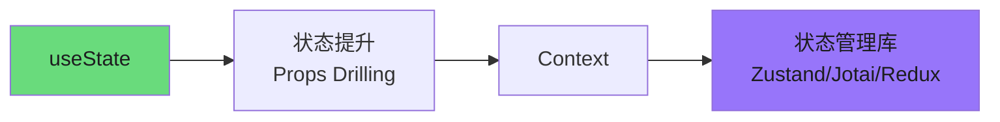
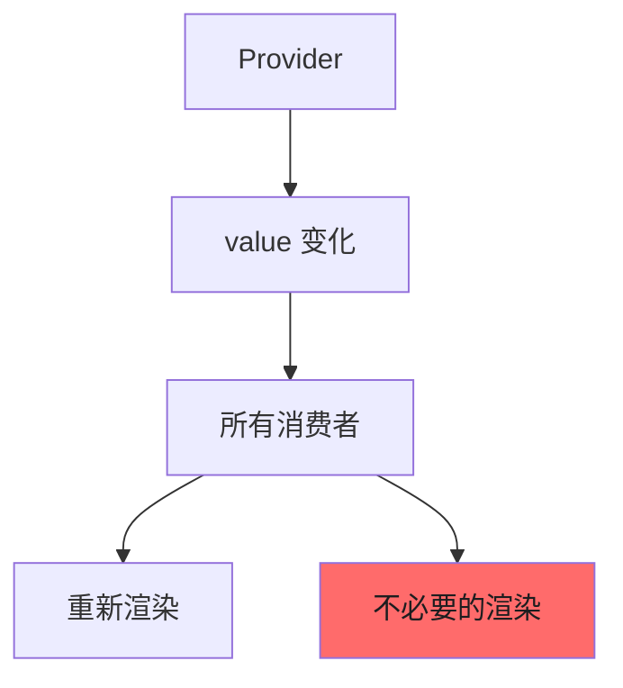
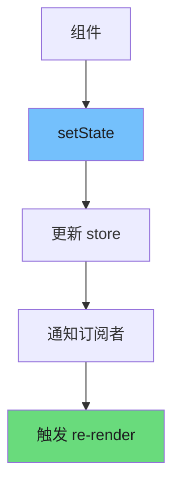
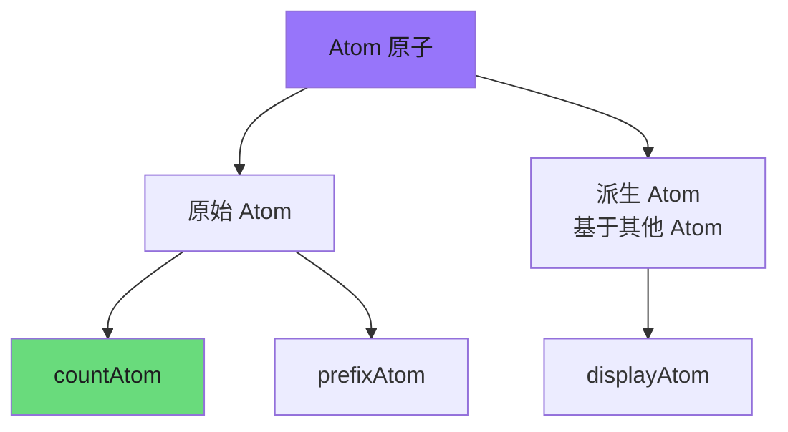
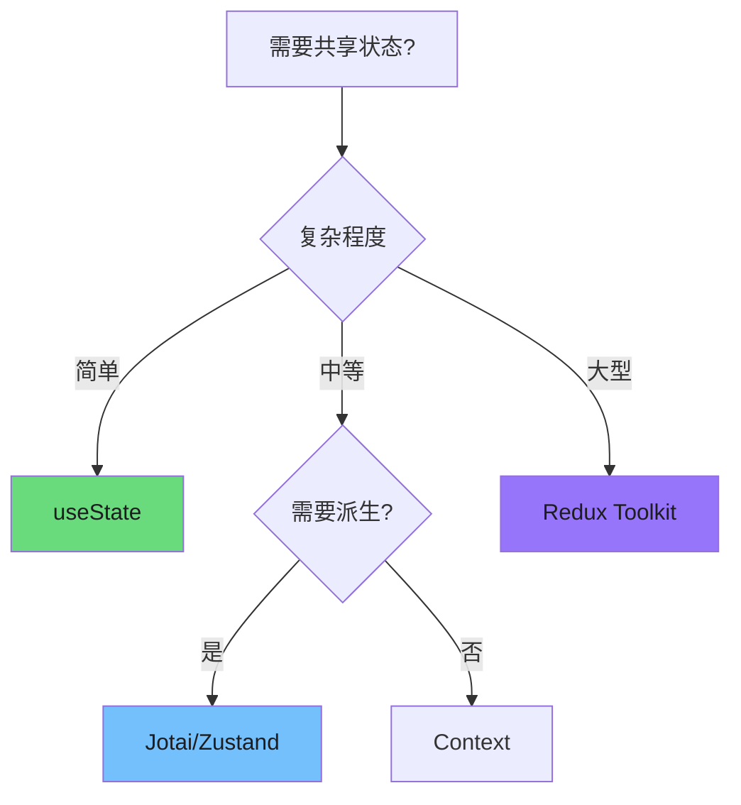

# 状态管理方案

> 状态管理是 React 应用架构的核心议题。本文系统梳理从 useState 到 Redux Toolkit 的演进路径，并提供决策框架帮助在实际项目中做出合理选择。

---

## 1. 状态管理演进

React 状态管理经历了从简单到复杂的演进过程，每个阶段都解决了特定场景下的问题：



| 阶段 | 工具 | 适用场景 | 局限性 |
|------|------|----------|--------|
| 本地状态 | `useState` | 组件私有 UI 状态 | 无法跨组件共享 |
| 状态提升 | Props Drilling | 少量组件层级 | 深层嵌套时代价高 |
| Context | `useContext` | 中等复杂度共享 | 易触发全局重渲染 |
| 状态库 | Zustand/Jotai/Redux | 复杂应用 | 引入额外依赖 |

---

## 2. useState vs useReducer vs useContext 选择

### 2.1 决策矩阵

| 场景 | 推荐方案 | 原因 |
|------|----------|------|
| 简单 UI 状态（toggle、input） | `useState` | 无额外开销，直观 |
| 复杂状态逻辑（多状态相互依赖） | `useReducer` | 状态转换清晰，测试友好 |
| 跨组件共享（主题、用户信息） | `useContext` | 避免 prop drilling |
| 跨层级共享 + 频繁更新 | Zustand/Jotai | 细粒度订阅，避免重渲染 |
| 复杂异步逻辑 + 数据获取 | Redux Toolkit / RTK Query | 内置中间件和缓存 |

### 2.2 useState 适用场景

```tsx
function Toggle() {
  const [isOn, setIsOn] = useState(false);

  return (
    <button onClick={() => setIsOn(!isOn)}>
      {isOn ? '开启' : '关闭'}
    </button>
  );
}
```

### 2.3 useReducer 适用场景

```tsx
function Counter() {
  const [state, dispatch] = useReducer(reducer, { count: 0 });

  return (
    <>
      <span>{state.count}</span>
      <button onClick={() => dispatch({ type: 'INCREMENT' })}>+1</button>
      <button onClick={() => dispatch({ type: 'DECREMENT' })}>-1</button>
    </>
  );
}

function reducer(state, action) {
  switch (action.type) {
    case 'INCREMENT':
      return { count: state.count + 1 };
    case 'DECREMENT':
      return { count: state.count - 1 };
    default:
      return state;
  }
}
```

---

## 3. Context 原理与优化

### 3.1 Context 触发重渲染的问题

Context 本质上是一个 Provider-Consumer 模式。当 Provider 的 value 变化时，**所有消费该 Context 的组件都会重新渲染**：



### 3.2 分离 Context 模式

将不同关注点的状态分离到独立的 Context，避免一处变化触发全局重渲染：

```tsx
// 主题状态（变化频繁）
const ThemeContext = createContext<ThemeState>(defaultTheme);

// 用户状态（变化较少）
const UserContext = createContext<UserState>(defaultUser);

// 将两个 Context 分离，主题变化不会影响 UserContext 消费者
```

### 3.3 useMemo 优化

对于包含对象或函数的 Context value，使用 `useMemo` 避免不必要的引用变化：

```tsx
// 第 1 段：创建 Context 容器，并用 null! 表达"默认值永不生效"这一契约
// createContext 的默认值只在"组件树中找不到 Provider"时才被读到，因此类型上必须给一个值。
// 这里传 null!（非空断言）是告诉 TS：真实取值一定由 Provider 提供，null 只是占位。
// 易错点：代价是"运行时才炸"——若消费方被放在 Provider 之外，拿到的是 null，报错发生在运行期而非编译期。
// 更稳的替代方案是默认值传 undefined，再封装 useTheme() 在其中主动 throw，把错误提前并给出友好提示。
const ThemeContext = createContext<ThemeContextType>(null!);

// 第 2 段：Provider 组件本体 + 状态定义
// Provider 是唯一持有并修改主题的地方，把 state 收拢在此处，消费方只能通过 setTheme 间接触发更新，
// 形成"单向数据流"：状态下沉到 Provider，事件回调向上传递，避免主题状态散落在多个组件里。
function ThemeProvider({ children }) {
  // light/dark 只是初始值；注意 useState('light') 推导出的是 string 而非字面量联合类型。
  // 若 ThemeContextType.theme 声明为 'light' | 'dark'，这里会与 setTheme 的类型产生不兼容，
  // 需要显式写 useState<'light' | 'dark'>('light') 或使用 as const 来收窄。
  const [theme, setTheme] = useState('light');

  // 第 3 段：用 useMemo 稳定 value 的引用，控制消费方的重渲染范围
  // React 通过 Object.is 比较 Provider 的 value；若每次渲染都新建 { theme, setTheme }，
  // 那么即使主题没变，所有 useContext 消费方也会被判定为"值变了"而白白重渲染。
  // 依赖数组只放 [theme]：setTheme 由 useState 保证引用恒定，无需列入依赖，列入也不会触发额外计算。
  // 效果：父组件因其他原因重渲染时，value 引用保持不变，消费方得以跳过更新；复杂度 O(1)。
  // 只有 theme 真正变化时才创建新对象
  const value = useMemo(() => ({
    theme,
    setTheme,
  }), [theme]);

  // 第 4 段：向下广播 value，并把 children 原样透传
  // children 由外部传入，父组件每次重渲染都会带来新的 children 引用，因此 Provider 自身仍会重渲染——
  // useMemo 保护的是 value 的引用稳定性，而不是 Provider 的渲染次数，两者不要混淆。
  // 边界条件：消费者必须位于此 Provider 子树内，否则会读到第 1 段的 null 占位值。
  return (
    <ThemeContext.Provider value={value}>
      {children}
    </ThemeContext.Provider>
  );
}
```
### 3.4 选择性订阅模式

使用 `useContext` 时配合选择器，只订阅需要的数据片段：

```tsx
// 通用选择器 hook
function useContextSelector(context, selector) {
  const contextValue = useContext(context);
  return useMemo(
    () => selector(contextValue),
    [contextValue, selector]
  );
}

// 使用示例
const isLoggedIn = useContextSelector(
  AuthContext,
  (auth) => auth.isAuthenticated
);
```

---

## 4. Zustand 设计解析

Zustand 是一个极简的状态管理库，其核心设计基于发布-订阅模式：

### 4.1 核心实现原理

```javascript
// Zustand 核心实现
// 第 1 段：工厂入口——把状态关进闭包，并返回操作它的一组方法
// create 形参 createState 是外部传入的初始化策略，本段并未调用它（真正的初始化在更外层完成），这里只负责"造壳"；
// 每次调用 create 都会产生一份互不干扰的状态，隔离性来自闭包而非类实例，这是理解全局的关键。
const create = (createState) => {
  let state;
  // 用 Set 而非数组保存订阅者：增删 O(1)，且天然去重，避免同一监听器注册多次后被重复触发。
  const listeners = new Set();

  // 第 2 段：setState——唯一写入口，串起"合并 → 变更检测 → 广播"三步数据流
  // partial 支持两种形态：对象补丁，或接收最新 state 的函数；函数形态能在异步回调里拿到不过期的值。
  const setState = (partial) => {
    const nextState = typeof partial === 'function'
      ? partial(state) // 惰性求值：只有走函数分支才执行，其副作用也只在此时发生
      : partial;

    // 易错点：此处拿 partial 的返回值与整个 state 做 Object.is，而不是逐字段 diff；
    // 因此只要返回新引用（哪怕内容完全相同）就会被判定为"变了"并触发一次广播。
    if (!Object.is(nextState, state)) {
      // 不可变更新：浅拷贝旧 state 再覆盖补丁，保证订阅者拿到的是新引用，
      // 这样依赖引用相等的选择器（React/Zustand 的 selector）才能正确感知变化。
      state = Object.assign({}, state, nextState);
      // forEach 是同步遍历，任一听众抛错都会中断后续通知（无 try/catch 兜底），监听器内部需自保。
      listeners.forEach(listener => listener(state));
    }
  };

  // 第 3 段：getState——只回传内部引用，不做任何拷贝，读取 O(1)
  // 边界：调用方拿到的是同一对象，若直接改动它会绕过 setState 的广播，造成视图与状态不一致。
  const getState = () => state;

  // 第 4 段：subscribe——注册监听，并返回"退订函数"
  // "返回即取消器"的设计让调用方无需持有 listeners 引用即可清理，可直接当作 useEffect 的返回值使用。
  const subscribe = (listener) => {
    listeners.add(listener);
    // 闭包锁住本次的 listener；同一函数重复注册会被 Set 去重，退订时也只删自己、不影响他人。
    return () => listeners.delete(listener);
  };

  // 第 5 段：destroy——清空全部订阅，用于卸载/销毁场景，防止监听器泄漏
  // 注意它只清订阅者、不清 state，销毁后 getState 仍能读到最后一帧快照。
  const destroy = () => {
    listeners.clear();
  };

  // 第 6 段：对外暴露 API——只给方法句柄，不直接暴露 state 变量
  // 读写路径全部收敛到 getState/setState，便于调试、埋点以及外层中间件做统一包装。
  return { setState, getState, subscribe, destroy };
};
```
### 4.2 状态流图



### 4.3 实际使用示例

```tsx
import { create } from 'zustand';

// 定义 Store 类型
interface CounterStore {
  count: number;
  increment: () => void;
  decrement: () => void;
  reset: () => void;
}

// 创建 Store
const useCounterStore = create<CounterStore>((set, get) => ({
  count: 0,

  increment: () => set((state) => ({ count: state.count + 1 })),

  decrement: () => set((state) => ({ count: state.count - 1 })),

  reset: () => set({ count: 0 }),
}));

// 组件中使用
function Counter() {
  const { count, increment } = useCounterStore();

  return (
    <>
      <span>计数: {count}</span>
      <button onClick={increment}>+1</button>
    </>
  );
}
```

### 4.4 性能优化：选择器模式

```tsx
// 只订阅 count 变化，increment 变化不会触发重渲染
const count = useCounterStore((state) => state.count);

// 使用 shallow 比较处理对象选择器
const { count, increment } = useCounterStore(
  (state) => ({ count: state.count, increment: state.increment }),
  shallow
);
```

---

## 5. Jotai 原子模型

Jotai 采用了与 Zustand 不同的原子（Atom）模型，借鉴了 Recoil 的设计理念：

### 5.1 基本概念



### 5.2 核心 API

```tsx
import { atom, useAtom } from 'jotai';

// 定义原始原子
const countAtom = atom(0);
const prefixAtom = atom('计数: ');

// 定义派生原子（读取其他原子）
const displayAtom = atom((get) => {
  return `${get(prefixAtom)}${get(countAtom)}`;
});

// 在组件中使用
function Counter() {
  const [count, setCount] = useAtom(countAtom);
  const [display] = useAtom(displayAtom);

  return (
    <>
      <span>{display}</span>
      <button onClick={() => setCount(c => c + 1)}>+1</button>
    </>
  );
}
```

### 5.3 Provider 机制

```tsx
import { Provider } from 'jotai';
import { counterStore } from './stores';

function App() {
  return (
    <Provider store={counterStore}>
      <Counter />
      <AnotherCounter />
    </Provider>
  );
}
```

---

## 6. Recoil 与原子图

Recoil 是 Facebook 推出的状态管理库，引入了原子图（Atom Graph）的概念：

### 6.1 Atom 与 Selector

```tsx
import { atom, selector, useRecoilState, useRecoilValue } from 'recoil';

// Atom - 状态的最小单元
const todoListState = atom({
  key: 'todoList',
  default: [],
});

// Selector - 派生状态（类似 Jotai 的 Derived Atom）
const todoListStatsState = selector({
  key: 'todoListStats',
  get: ({ get }) => {
    const todos = get(todoListState);
    return {
      total: todos.length,
      completed: todos.filter(t => t.isComplete).length,
      uncompleted: todos.filter(t => !t.isComplete).length,
    };
  },
});

function TodoList() {
  const [todos, setTodos] = useRecoilState(todoListState);
  const stats = useRecoilValue(todoListStatsState);

  return (
    <>
      <span>已完成: {stats.completed}/{stats.total}</span>
      {/* todo list rendering */}
    </>
  );
}
```

### 6.2 Data Ghosts 与异步 Selector

```tsx
// 异步 Selector 用于数据获取
const currentUserQuery = selector({
  key: 'CurrentUser',
  get: async ({ get }) => {
    const userId = get(currentUserIDState);
    const response = await fetchUser(userId);
    return response.data;
  },
});

// 在组件中使用
function UserProfile() {
  const [user, setUser] = useRecoilState(currentUserQuery);

  if (user.state === 'loading') {
    return <Loading />;
  }

  if (user.state === 'error') {
    return <Error error={user} />;
  }

  return <div>{user.data.name}</div>;
}
```

---

## 7. Redux Toolkit 现代用法

Redux Toolkit (RTK) 是 Redux 的现代替代方案，简化了传统 Redux 的样板代码：

### 7.1 createSlice

```tsx
// 第 1 段：导入依赖 —— 只取 createSlice 与 PayloadAction 两个入口
// createSlice 是 RTK 的核心工厂，它一次性生成「reducer + action creator + action type」三件套，
// 因此下面不需要手写 switch/case，也不需要手写 action type 常量表。
// PayloadAction<T> 用来标注 action 形状，从而把 payload 收窄成精确类型（它只是类型，编译后会被擦除）。
import { createSlice, PayloadAction } from '@reduxjs/toolkit';

// 第 2 段：声明 state 形状 —— 用字面量联合类型把 status 约束成有限状态机
// 写成 'idle' | 'loading' 而非 string，是为了让拼写错误在编译期就暴露。
// 注意：本文件只声明、并未在 reducer 中读写它，属于预留位，真实项目里通常配合 createAsyncThunk 才用得上。
interface CounterState {
  value: number;
  status: 'idle' | 'loading';
}

// 第 3 段：初始状态 —— 作为整棵 store 里 counter 切片的唯一真值起点
// 单独抽成常量便于测试/SSR 复用；但要留意它是引用共享的，若将来含嵌套对象，应改为工厂函数按需返回。
const initialState: CounterState = {
  value: 0,
  status: 'idle',
};

// 第 4 段：createSlice 创建切片 —— 三要素 name / initialState / reducers
// name 会成为每个 action type 的前缀（如 'counter/increment'），也是 Redux DevTools 中 action 的可读标识。
const counterSlice = createSlice({
  name: 'counter',
  initialState,
  reducers: {
    // 第 5 段：三个同步 reducer —— 表面在「直接改 state.value」，实为 Immer 的草稿代理
    // RTK 内部用 Immer 把 state 包成 draft，允许这种可变写法，最终仍生成不可变的新 state；
    // 所以千万别写 `state = {...state}`，那只是重绑定局部形参，不会生效。此外这些函数必须保持纯函数：
    // 不能发请求、不能读随机数或时间戳。
    increment: (state) => {
      state.value += 1;
    },
    decrement: (state) => {
      state.value -= 1;
    },
    // 带载荷的 reducer：PayloadAction<number> 让 action.payload 在函数体内被推断为 number，
    // 调用方误传字符串会在编译期报错。边界情况：NaN / Infinity 能通过类型检查但不会被拦截，需要校验得自己加。
    setValue: (state, action: PayloadAction<number>) => {
      state.value = action.payload;
    },
  },
});

// 第 6 段：导出 action creator 与 reducer
// counterSlice.actions 是自动生成的对象，解构出的 increment() 等是 action creator，
// 调用后返回 { type: 'counter/increment', payload? } 的形状。
// reducer 走默认导出，由 configureStore 组装进 rootReducer，负责接管所有 'counter/' 前缀的 action。
export const { increment, decrement, setValue } = counterSlice.actions;
export default counterSlice.reducer;
```
### 7.2 createAsyncThunk

```tsx
import { createAsyncThunk, createSlice } from '@reduxjs/toolkit';

// 第 1 段：定义异步 Thunk —— 把"取数据"这一副作用从组件里剥离出来
// createAsyncThunk 会自动派发 pending / fulfilled / rejected 三种 action，并在 fulfilled 时把返回值塞进 action.payload，
// rejected 时把错误塞进 action.error，因此组件侧只需 dispatch 一次、再订阅状态即可。
// 注意 action type 前缀 'users/fetchById' 是 thunk 自己的命名空间，与下面 slice 的 name 只是约定保持一致，并非强制绑定。
export const fetchUserById = createAsyncThunk(
  'users/fetchById',
  async (userId: string) => {
    // 易错点：fetch 只在网络层失败时 reject，HTTP 4xx/5xx 仍会走 fulfilled。
    // 若服务端返回 404，这里会把错误页 JSON 当成正常用户写入 store，生产代码应在此处检查 response.ok 并 throw。
    const response = await fetch(`/api/users/${userId}`);
    // 数据流：json() 返回 Promise，await 后的结果即成为 action.payload。
    // 其静态类型是 any（或 unknown，视 lib 配置），所以下面的 action.payload.id 无法被 TS 校验，这也是 User 实体形状没有被约束的原因。
    return response.json();
  }
);

// 第 2 段：声明状态形状 —— 用 Record 做 keyed 集合，天然表达"按 id 索引"的读取方式
// 这里只声明了 entities 与 loading，没有 error 字段：只能知道"失败了"，无法知道"为什么失败"，是可观测性上的取舍。
interface UserState {
  entities: Record<string, User>; // 复杂度：按 id 查询 O(1)，代价是丢失顺序与重复数据
  loading: 'idle' | 'pending' | 'succeeded' | 'failed'; // 用字面量联合替代布尔 isLoading，避免"初始态被误判为加载中"这类经典 bug
}

// 第 3 段：创建 slice —— reducers 为空，所有状态变更都交给 extraReducers 响应 thunk 的生命周期
const usersSlice = createSlice({
  name: 'users',
  // as UserState 是必要的边界断言：Record<string, User> 的 {} 本身合法，但 'idle' 会被推断为宽泛的 string，
  // 不写断言的话 loading 的字面量类型会丢失，后续赋值 'pending' 时 TS 会报错。
  initialState: { entities: {}, loading: 'idle' } as UserState,
  reducers: {}, // 该 slice 没有同步 action，故留空；RTK 会用它在组件里生成 usersSlice.actions（此处为空对象）
  extraReducers: (builder) => {
    // builder 链式写法是 RTK 1.9+ 的推荐形式：相比返回对象的旧写法，它能被 TS 完整推断 action 类型。
    builder
      // pending：不写数据，只切换状态位，用于驱动组件的 loading 占位 UI
      .addCase(fetchUserById.pending, (state) => {
        // state 是 Immer 的 draft，直接赋值即可，无需 return / 展开拷贝；
        // 但前提是 reducer 内不产生副作用，否则会破坏 Immer 的代理语义。
        state.loading = 'pending';
      })
      // fulfilled：先落状态位再写入实体，两步在同一次 dispatch 中原子完成，不会出现中间态
      .addCase(fetchUserById.fulfilled, (state, action) => {
        state.loading = 'succeeded';
        // 关键：以 payload.id 为 key 覆盖写入，天然实现"同一用户重复请求只保留最新一份"的 upsert 语义。
        // 边界条件：若 payload 缺少 id（如 404 错误体），这里会写入 entities['undefined']，属于静默的数据污染，需靠上游校验兜住。
        state.entities[action.payload.id] = action.payload;
      })
      // rejected：仅标记失败，未记录 action.error / action.payload（rejectWithValue 的载荷），
      // 等于放弃了错误详情与重试所需的上下文，是后续最可能需要扩展的一处。
      .addCase(fetchUserById.rejected, (state) => {
        state.loading = 'failed';
      });
    // 整个 slice 无返回值：Immer 通过 draft 原地变更推导新 state，因此打印 state 看到的是代理对象，调试时需用 current() 解包。
  },
});
```
### 7.3 RTK Query

RTK Query 是专为数据获取和缓存设计的 API：

```tsx
import { createApi, fetchBaseQuery } from '@reduxjs/toolkit/query/react';

// 第 1 段：引入 RTK Query 的两块基石（这一段决定后续所有 API 的形态）
// createApi 是"定义服务"的工厂函数，一个项目通常只建一个（对应唯一的 reducerPath）；
// fetchBaseQuery 是官方内置的轻量请求器，只负责发请求+序列化，不做缓存（缓存由 createApi 负责）。
// 注意必须从 .../query/react 而非 .../query/core 导入，否则不会生成 React hooks。

// 定义 API
// 第 2 段：创建 API 服务实例并进行全局配置（这一段搭建请求与缓存的骨架）
// reducerPath 是这份 API 数据在 Redux store 里的挂载点，必须与 configureStore 中的
// reducer/api.middleware 注册名完全一致，否则 hooks 取不到数据（最常见的接入错误）。
// baseUrl: '/api' 用相对路径，依赖同源部署或开发服务器 proxy；跨域场景要改绝对地址或注入 token。
const api = createApi({
  reducerPath: 'api',
  baseQuery: fetchBaseQuery({ baseUrl: '/api' }),
  // 第 3 段：声明所有端点（这一段是数据流的源头：URL/方法 → 请求 → 缓存键）
  // endpoints 是"端点名 → 请求定义"的映射，端点名会被 RTK Query 转成 PascalCase 生成 hook，
  // 所以命名要稳定且语义化；改名字会连带改掉导出的 hook。
  endpoints: (builder) => ({
    // 第 4 段：查询端点（读操作，按参数自动缓存与去重）
    // query 的返回值只写路径，baseQuery 会拼到 baseUrl 之后 → 实际请求 GET /api/users；
    // 泛型是 <返回数据类型, 参数类型>，void 表示无参数，这类端点全局共用同一份缓存。
    getUsers: builder.query<User[], void>({
      query: () => '/users',
    }),
    // 每个不同的 id 都会生成独立的缓存条目（参数即缓存键的一部分），
    // 同一 id 在多个组件里同时调用只会发一次请求（自动去重）；
    // 易错点：id 建议先 encodeURIComponent，否则含 / ? # 等字符会拼出错误的 URL。
    getUserById: builder.query<User, string>({
      query: (id) => `/users/${id}`,
    }),
    // 第 5 段：变更端点（写操作，不缓存结果，只能通过 trigger 手动触发）
    // mutation 的 query 返回对象形式，method 不写默认是 GET，写操作必须显式声明；
    // body 会被序列化为 JSON 并带上 Content-Type，无需手动 JSON.stringify；
    // 泛型 <返回数据类型, 请求体类型>，用 Partial<User> 表达"创建时字段可缺省"的意图。
    createUser: builder.mutation<User, Partial<User>>({
      query: (body) => ({
        url: '/users',
        method: 'POST',
        body,
      }),
    }),
  }),
});

// 第 6 段：导出自动生成的 hooks（这一段是组件层唯一的消费入口）
// 命名规则是 use + 端点名 + Query/Mutation，是按端点声明顺序推导出来的，不能手写错；
// Query 型 hook 立即发请求并返回 { data, isLoading, error, refetch } 等状态，
// Mutation 型返回 [trigger, result] 元组，需在事件回调里调用 trigger 才会发请求。
// 边界提醒：此处未配置 providesTags/invalidatesTags，所以 createUser 成功后列表缓存
// 不会自动刷新，需要手动 refetch 或补上 tag 机制——这是本项目最需要留意的坑；
// 另外 User 类型需在本文件外实际定义，否则只是编译期占位、运行时无任何校验。
export const {
  useGetUsersQuery,
  useGetUserByIdQuery,
  useCreateUserMutation,
} = api;
```
---

## 8. 状态管理选择决策树



### 8.1 选择指南

| 场景 | 推荐方案 | 说明 |
|------|----------|------|
| 简单表单状态 | `useState` | 无需引入额外依赖 |
| 组件内复杂状态 | `useReducer` | 状态转换逻辑清晰 |
| 主题/语言切换 | Context | 低频更新，避免 prop drilling |
| 中等复杂度共享 | Zustand | API 简洁，性能优秀 |
| 需要派生状态 | Jotai | 原子模型，声明式 |
| 大型复杂应用 | Redux Toolkit | 成熟生态，完善调试工具 |
| 服务端数据管理 | RTK Query | 内置缓存和轮询 |

---

## 9. 总结

| 方案 | 包体积 | 学习曲线 | 适用规模 | 特点 |
|------|--------|----------|----------|------|
| useState/useReducer | 0 KB | 低 | 任意 | React 内置 |
| Context | 0 KB | 中 | 中小型 | 简单共享 |
| Zustand | ~1.5 kb | 低 | 中小型 | 极简 API |
| Jotai | ~2.5 kb | 中 | 中型 | 原子模型 |
| Recoil | ~50 kb | 中 | 中型 | 原子图 |
| Redux Toolkit | ~100 kb | 中 | 大型 | 成熟生态 |

选择状态管理方案时，应优先考虑项目当前规模和团队熟悉度。随着应用复杂度提升，可以逐步从简单的 `useState` 过渡到轻量库如 Zustand，必要时再引入 Redux Toolkit 处理大型应用的复杂需求。

---

*本文档属于「前端面试全家桶」系列，深入理解 React 状态管理机制是构建高性能应用的基础。*

## 深入阅读与参考

!!! tip "怎么用这些资料"
    先读「官方文档与规范」建立准确的概念，再读「源码与示例」核对细节，最后用「教程、书籍与视频」换一种讲法加深理解。每条都写明了读哪一节、带着什么问题读。

### 官方文档与规范

| 资源 | 为什么读 | 怎么读 |
|---|---|---|
| [useState](https://react.dev/reference/react/useState) | 官方 API 参考，明确状态更新与批处理语义 | 读参数与陷阱一节，弄清函数式更新，再用计数器验证自动批处理。 |
| [useContext](https://react.dev/reference/react/useContext) | 官方参考，讲清 Provider 与消费者重渲染关系 | 读 Caveats 一节，追问 value 变化为何重渲染，写最小复现验证。 |
| [useReducer](https://react.dev/reference/react/useReducer) | 官方参考，界定 reducer 与 setState 的适用边界 | 读示例后把 useState 版表单改写成 useReducer，比较可测性。 |
| [Passing Data Deeply with Context](https://react.dev/learn/passing-data-deeply-with-context) | 官方教程，Context 的取舍讲得最清楚 | 读 Before you use context 一节，先列出深层传参痛点再决定是否引入。 |
| [Scaling Up with Reducer and Context](https://react.dev/learn/scaling-up-with-reducer-and-context) | 官方指南，演示 reducer 与 Context 组合模式 | 跟着重构任务列表，注意 Provider 拆分与 dispatch 引用稳定性。 |
| [Redux Toolkit 快速上手](https://redux-toolkit.js.org/tutorials/quick-start) | 官方快速上手，覆盖现代 Redux 写法全貌 | 照教程做出 counter，再改写成带 createAsyncThunk 的版本。 |
| [Zustand 文档](https://zustand.docs.pmnd.rs/) | 官方文档，API 极简，适合与源码对照阅读 | 用一个 store 实现购物车，再加 persist 中间件，观察订阅粒度。 |
| [Jotai 文档](https://jotai.org/docs/introduction) | 官方文档，原子模型与派生状态的最佳入口 | 用派生 atom 实现联动表单，记录哪些状态不必提升到全局。 |

### 源码与示例

| 资源 | 为什么读 | 怎么读 |
|---|---|---|
| [zustand](https://github.com/pmndrs/zustand) | 源码仅数百行，能看清订阅与选择器实现 | 从 vanilla.ts 读 createStore 与 subscribe，对照 setState 画调用链。 |
| [redux](https://github.com/reduxjs/redux) | 经典实现，理解 dispatch 与订阅的底层机制 | 读 createStore 的闭包结构，重点看 listeners 数组与 subscribe 返回值。 |
| [jotai](https://github.com/pmndrs/jotai) | 原子读写的核心实现，理解依赖图如何建立 | 读 atom 与 readAtom，追问派生 atom 怎样收集依赖并触发更新。 |

### 教程、书籍与视频

| 资源 | 为什么读 | 怎么读 |
|---|---|---|
| [Redux Essentials](https://redux.js.org/tutorials/essentials/part-1-overview-concepts) | 官方系统教程，讲透单向数据流与 RTK | 做完 Part 1 到 Part 3，画一张 action→reducer→store→view 流程图。 |

## 应用与行业实践

前面几节讲清了各方案的原理与取舍。这一节把知识落到具体页面上：哪些场景该用哪套机制，收益怎么量，什么时候不用。

### 应用场景地图

| 场景 | 用到本页哪个知识点 | 典型技术选型 | 注意事项 |
| --- | --- | --- | --- |
| 后台管理万行订单表格的排序与筛选 | Redux Toolkit 现代用法、选择器缓存 | RTK 的 createSlice + createSelector | 行数据用 id 索引表存，改动单行不要替换整个数组 |
| 表格行内编辑与批量勾选 | 状态规范化、派生数据 | RTK + createEntityAdapter | 勾选状态与行数据分开放，导出时按 id 取值 |
| 低端安卓机首屏加载 | Context 原理与优化 | Context 拆分 + useMemo + React.lazy | 首屏只挂必需 Provider，非首屏模块切出首屏包 |
| 多人协作白板的图形拖拽 | Zustand 设计解析 | zustand + 组件内临时状态 | 拖拽中间态不写全局 store，抬手时提交一次 |
| 多步表单向导的草稿填写 | useState vs useReducer vs useContext 选择 | useReducer + Context | 字段超过十个时用 useReducer 收敛更新动作 |
| 主题与语言切换 | Context 原理与优化 | Context + useMemo | Provider 的 value 引用要稳定，否则订阅组件全量重渲染 |
| 通知中心未读计数 | Jotai 原子模型 | jotai 原子 + 派生原子 | 计数从列表原子派生，不要在两处分别写入 |
| 地图与侧边筛选面板联动 | 状态管理选择决策树 | Zustand 或 Jotai | 跨面板共享的状态提升到 store，面板内部状态留在本地 |
| 实时聊天的消息分页加载 | Redux Toolkit 现代用法 | RTK Query + 归一化缓存 | 分页游标与消息实体分开放，避免插入历史消息时整列表失效 |

### 三个场景拆解

#### 场景 1：后台管理的万行表格

**业务背景**

表格要承载一万到五万行订单，用户在同一个页面里做排序、筛选、行内编辑和批量勾选。改动一次筛选条件就让整表重渲染时，滚动会出现掉帧，可以在 Chrome DevTools 的 Performance 面板录制复现。

**怎么用本页知识解决**

先把状态摊平：实体放 id 索引表，派生结果交给选择器缓存，行组件按 id 订阅自己那一行。

```js
// slice：用实体表存行，避免数组深层拷贝
const slice = createSlice({
  name: 'orders',
  initialState: { byId: {}, allIds: [], selected: {} },
  reducers: {
    // 只写入变更的那一行，其余行对象引用保持不变
    patchRow(state, action) { state.byId[action.payload.id] = action.payload },
    // 勾选状态单独存，布尔值不塞进行数据里
    toggleSelect(state, action) { state.selected[action.payload] = !state.selected[action.payload] },
  },
})

// 选择器：输入 allIds 与筛选词，输出可见 id 数组
const selectVisibleIds = createSelector(
  [(s) => s.orders.allIds, (s) => s.orders.byId, (_, kw) => kw],
  (ids, byId, kw) => ids.filter((id) => byId[id].title.includes(kw)), // 输入引用未变则直接复用上次结果
)
```

- 行数据改动只替换 `byId` 里的一个键，其余行引用不变，`memo` 包过的行组件不会重渲染。
- 可见 id 数组由 `createSelector` 缓存，筛选词和 `allIds` 都不变时不重算。
- 勾选表与行数据分离，编辑行内容不会影响已勾选集合。
- 行组件在 `useSelector` 里只接收自己的 id，不要整行对象当 props 传。

**怎么度量收益**

- React DevTools 的 Profiler 面板录制一次筛选操作，看 commit 阶段的渲染组件数与耗时。
- Chrome DevTools 的 Performance 面板录制 10 秒滚动，看长任务条数与掉帧帧数。
- 用 `performance.mark` 和 `performance.measure` 包住筛选函数，看调用耗时的 P95。
- 行组件内加 `console.count`，改一行数据后计数应只加一。

**什么时候不该用**

- 表格只有几十行且不做分页，用 `useState` 存数组即可，引入 slice 只增加样板代码。
- 数据只读、没有跨面板共享，用局部状态配合服务端缓存库就够。
- 表格完全不滚动、每次筛选都重新请求服务端时，前端缓存选择器收益接近零。

#### 场景 2：低端安卓机的首屏加载

**业务背景**

目标设备是内存 2GB 上下的安卓机，首屏要展示列表和用户信息。把 CPU 降速 4 倍、网络设为 Slow 4G 后，首屏可交互时间会被初始化阶段拖长。

**怎么用本页知识解决**

按访问频率切分全局状态：首屏路径上只挂必需的 Provider，其余状态延后创建，重模块用懒加载切出首屏包。

```jsx
// 首屏只挂主题与用户两个 Context，其余状态延后创建
const ThemeContext = React.createContext(null)
const UserContext = React.createContext(null)

function App() {
  const [theme, setTheme] = useState('light') // 首屏必需，值是小字符串
  const [user, setUser] = useState(null)      // 首屏必需，登录后填充
  const themeValue = useMemo(() => ({ theme, setTheme }), [theme]) // 稳定引用
  return (
    <ThemeContext.Provider value={themeValue}>
      <UserContext.Provider value={user}>
        <FirstScreen />
      </UserContext.Provider>
    </ThemeContext.Provider>
  )
}

// 非首屏模块用 lazy 切出首屏包
const Report = React.lazy(() => import('./Report'))
```

- `themeValue` 用 `useMemo` 包住，父组件重渲染时引用不变，订阅该 Context 的组件不跟着渲染。
- 拆成两个 Context，主题变化不会触发只读用户信息的组件重渲染。
- `React.lazy` 把报表模块移出首屏 chunk，减少需要解析和执行的脚本量。
- 首屏要用的数据尽量在骨架屏阶段取回，避免首屏展示后再触发一次全局写入。

**怎么度量收益**

- Lighthouse 移动端节流模式下看 FCP、LCP、Total Blocking Time 三项。
- 用 web-vitals 采集线上 LCP 与 INP，按设备内存分档看分位值。
- Chrome DevTools 的 Performance 面板录制冷启动，看主线程长任务时长与脚本求值耗时。
- 用 webpack-bundle-analyzer 或 rollup-plugin-visualizer 对比首屏 chunk 体积。

**什么时候不该用**

- 应用只有一层 Provider、全局状态不超过三个字段，拆 Context 只增加阅读成本。
- 后台系统运行在固定型号办公电脑上，首屏预算宽松，优先补功能而不是拆状态。
- 首屏瓶颈在接口响应而不是脚本执行时，懒加载对可交互时间没有帮助。

#### 场景 3：多人协作白板

**业务背景**

白板同时在线 10 人到 30 人，指针移动事件每秒触发 60 次到 120 次。用脚本派发 pointermove 事件即可复现：每次移动都写全局 store 时，画布和其他用户的订阅回调会被高频唤醒。

**怎么用本页知识解决**

把状态按寿命分层：拖拽中的坐标只活在组件内，抬手时才提交到全局 store，远端操作由服务端消息合并进 store。

```jsx
function useDrag(shapeId) {
  const commit = useBoardStore((s) => s.moveShape) // 只订阅动作，动作引用稳定
  const [ghost, setGhost] = useState(null)         // 拖拽中的坐标留在组件内
  const onPointerMove = (e) => {
    setGhost({ x: e.clientX, y: e.clientY })       // 高频更新只影响当前组件
  }
  const onPointerUp = (e) => {
    commit(shapeId, { x: e.clientX, y: e.clientY })// 每次拖拽只提交一次
    setGhost(null)
  }
  return { ghost, onPointerMove, onPointerUp }
}
```

- 拖拽中间态不进全局 store，其他订阅者不会收到抖动数据。
- 提交次数从每次移动一次降到每次拖拽一次，网络与广播压力同步下降。
- 远端消息按 shapeId 合并，只替换形状表里对应的键。
- 远端光标走独立通道广播，不写进形状表，避免污染撤销栈。

**怎么度量收益**

- Chrome DevTools 的 Performance 面板录制 3 秒连续拖拽，看掉帧帧数与长任务。
- React DevTools 的 Profiler 录制同一次拖拽，看画布组件渲染次数与 commit 耗时。
- 在 Network 面板统计 WebSocket 帧数，对比提交策略改动前的每秒消息条数。
- 用 `performance.now()` 记录一次拖拽的端到端耗时，统计 P95。

**什么时候不该用**

- 单用户离线编辑器没有远端订阅者，中间态放全局 store 没有额外代价。
- 需要逐步撤销每一次拖动中间态的编辑场景，合并提交会丢失撤销粒度。

### 行业先进实践

**规范化状态形状（出处：Redux 官方文档 "Normalizing State Shape"）**

文档建议把嵌套数组改写成 id 到实体的映射表，另存一份 id 顺序数组。实体引用保持稳定，选择器与 `memo` 才有缓存空间。借鉴方式：列表类数据统一用 `byId` 与 `allIds` 两层结构。

**Redux 风格指南（出处：Redux 官方文档 "Redux Style Guide"）**

官方把"一个功能一个 slice""reducer 里写看似可变的代码"列为推荐做法，由 Immer 负责生成新对象。这样减少手写展开运算符时漏层的机会。借鉴方式：新模块统一用 `createSlice`，不写手写 switch。

**状态共置与提升（出处：React 官方文档 "Managing State" 与 "Sharing State Between Components"）**

文档给出的顺序是先判断状态属于哪个组件，只有两个组件需要同一份数据时才提升到公共父组件。状态放得越低，重渲染波及的范围越小。借鉴方式：新增状态先写在用到它的组件里，出现第二个消费方时再提升。

**无头表格配合虚拟滚动（出处：TanStack Table 与 TanStack Virtual 开源项目文档）**

TanStack Table 只负责行模型（排序、筛选、分页）的计算，渲染交给虚拟列表，只挂载视口内的行。渲染量随视口高度变化，不随数据总量变化。借鉴方式：万行表格保留全量数据模型，DOM 只渲染可见行加缓冲区。

**选择器返回值的浅比较（出处：zustand 开源项目文档 "Prevent rerenders with useShallow"）**

选择器每次返回新对象时，订阅组件会判定为变化并重渲染。文档给出的做法是用 `useShallow` 包住多字段选择器。借鉴方式：选择器返回数组或对象时必须配浅比较，或者拆成多个单字段选择器。

### 从学到用：落地路线

**第 1 步：单页试点**

挑一个已经出现卡顿的列表页，把该页状态按"服务端数据、页面 UI 状态、临时交互状态"列成表，只对服务端数据引入 slice。
验收标准：表格里每条状态都有归属分类，评审时不需要口头补充说明。

**第 2 步：采集对照数据**

在试点页加渲染计数与 `performance.mark`，分别记录改动前后同一操作的耗时与渲染次数。
验收标准：同一台机器、同一浏览器、同一份模拟数据下，两份数字都有留存记录。

**第 3 步：写成模板推广**

把目录结构、slice 命名、选择器命名、订阅写法整理成模板文件，新页面按模板创建模块。
验收标准：新页面的 PR 中不出现"状态该放哪里"的讨论。

**第 4 步：CI 防回退**

在持续集成里跑 ESLint 与打包体积阈值检查，把跨模块直接读写状态列为禁止项。
验收标准：违反规则时 CI 失败信息能指出规则名与文件行号。

### 动手作业

**目标**

用一张 2000 行的模拟订单表，验证"局部状态整体存放"与"索引表加缓存选择器"两种写法在渲染次数上的差别。

**步骤**

1. 用脚本生成 2000 行订单，字段为 id、title、amount、status。
2. 在页面顶层用 `useState` 存全量数组与筛选词，用 `performance.now()` 记录连续筛选 100 次的耗时。
3. 改成 `byId` 加 `allIds` 结构，用 `createSelector` 派生可见 id 数组。
4. 行组件用 `memo` 包裹，只接收 id，并在组件内加 `console.count` 计数。
5. 重复第 2 步的测量，记录改动后的耗时与每次筛选的行组件渲染次数。
6. 用 React DevTools 的 Profiler 录制一次筛选，保存 flamegraph 截图。
7. 把主题切换放进 Context，用 `useMemo` 稳定 value，观察主题切换是否触发行组件渲染。

**验收标准**

- 提交改动前后各一份筛选 100 次的耗时数字，并注明测试机器与浏览器。
- 改动后单次筛选的行组件渲染次数与筛选结果行数一致。
- Profiler 录制文件可打开，能看到 commit 阶段的组件数与耗时。
- 结论中写出至少两条"不需要做这项优化"的场景。
- 代码中不存在把整行对象作为 props 传给 `memo` 行组件的写法。

