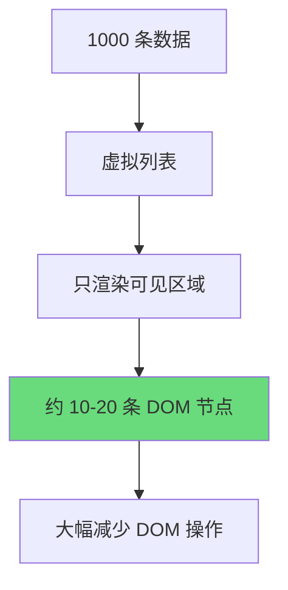
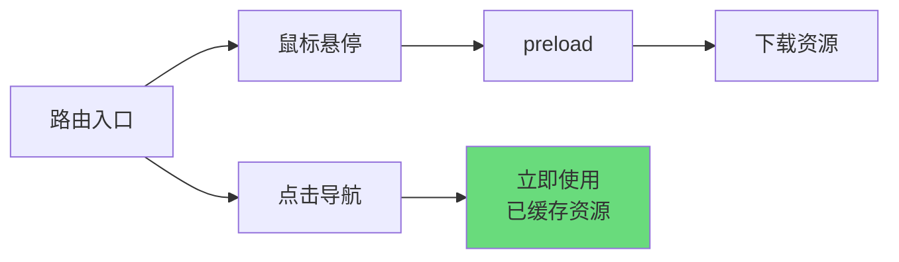
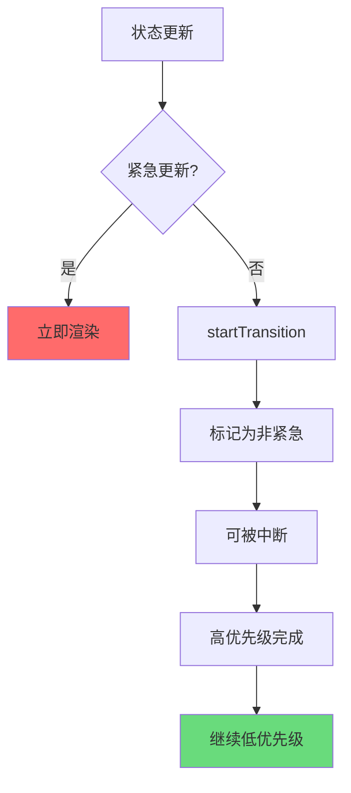
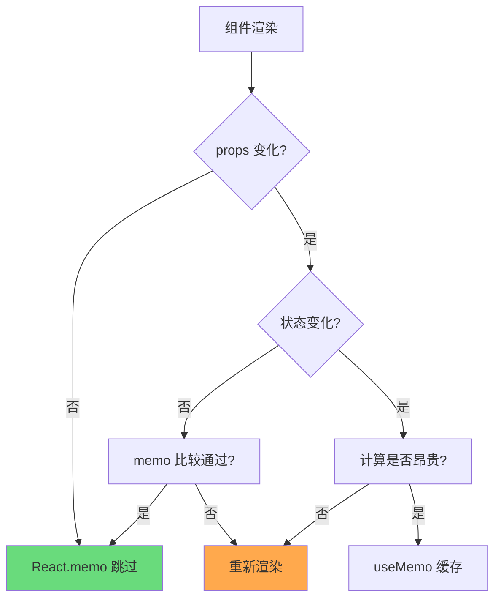

# React 性能优化实战

本文档深入探讨 React 应用性能优化的核心策略，从渲染机制到并发模式，帮助开发者构建高性能的 React 应用。

---

## 1. 渲染优化基础

### React.memo 与 Props 比较

`React.memo` 是高阶组件，用于缓存组件渲染结果。当 props 未发生变化时，避免不必要的重新渲染。

```tsx
import { memo } from 'react';

// 基本用法
const MemoizedComponent = memo(function MyComponent({ title, count }) {
  return (
    <div>
      <h1>{title}</h1>
      <span>{count}</span>
    </div>
  );
});
```

**自定义比较函数**：

```tsx
const areEqual = (prevProps, nextProps) => {
  return prevProps.id === nextProps.id &&
         prevProps.name === nextProps.name;
};

const MemoizedListItem = memo(ListItem, areEqual);
```

### 避免内联对象/函数/数组

内联定义会在每次渲染时创建新引用，导致 `React.memo` 失效。

```tsx
// ❌ 问题代码 - 每次渲染创建新对象
function BadExample() {
  return <ChildComponent
    style={{ color: 'red' }}
    onClick={() => handleClick()}
    items={[1, 2, 3]}
  />;
}

// ✅ 解决方案 - 使用稳定的引用
const containerStyle = { color: 'red' };
const fixedItems = [1, 2, 3];

function GoodExample() {
  const handleClick = useCallback(() => handleClick(), []);
  return <ChildComponent
    style={containerStyle}
    onClick={handleClick}
    items={fixedItems}
  />;
}
```

### 稳定组件结构

组件结构的稳定性直接影响 diff 算法效率。

```tsx
// ❌ 不稳定的结构导致更多 DOM 操作
function UnstableList({ items }) {
  return (
    <ul>
      {items.map(item => (
        <li key={item.id}>
          <span>{item.name}</span>
          {item.showDetail && <DetailView />}
        </li>
      ))}
    </ul>
  );
}

// ✅ 稳定结构 - 使用稳定的条件包装器
import { Show } from './utils';

function StableList({ items }) {
  return (
    <ul>
      {items.map(item => (
        <li key={item.id}>
          <span>{item.name}</span>
          <Show when={item.showDetail}>
            <DetailView />
          </Show>
        </li>
      ))}
    </ul>
  );
}
```

---

## 2. 状态设计原则

### 最小状态原则

只存储计算所需的最少数据，让组件从 props 和派生状态中计算其他值。

```tsx
// ❌ 冗余状态 - 需要同步维护多份数据
const [firstName, setFirstName] = useState('');
const [lastName, setLastName] = useState('');
const [fullName, setFullName] = useState('');

// ✅ 最小状态 - 只存储原始数据
const [firstName, setFirstName] = useState('');
const [lastName, setLastName] = useState('');

// 派生值通过计算获得
const fullName = `${firstName} ${lastName}`;
```

### 派生状态 vs 原始状态

判断是否需要状态时，问自己：**这个值能否从现有状态计算出来？**

```tsx
function PriceCalculator({ items, discount }) {
  // ✅ 派生状态 - 不需要 useState
  const subtotal = items.reduce((sum, item) => sum + item.price, 0);
  const discountAmount = subtotal * (discount / 100);
  const total = subtotal - discountAmount;

  return <div>总计: ¥{total.toFixed(2)}</div>;
}
```

### 状态归类与拆分

将相关状态归类，不相关的状态拆分，避免不必要的重渲染。

```tsx
// ❌ 混合状态导致联动问题
const [formData, setFormData] = useState({
  name: '',
  email: '',
  theme: 'light',
  sidebarOpen: false,
});

// ✅ 按职责拆分状态
const [userData, setUserData] = useState({ name: '', email: '' });
const [uiSettings, setUiSettings] = useState({ theme: 'light', sidebarOpen: false });
```

---

## 3. 列表渲染优化

### Keys 的重要性

Keys 帮助 React 识别哪些元素发生了变化，减少不必要的 DOM 操作。

```tsx
// ✅ 正确使用稳定唯一 ID
const TodoList = ({ todos }) => (
  <ul>
    {todos.map(todo => (
      <li key={todo.id}>{todo.text}</li>
    ))}
  </ul>
);
```

### 避免使用索引作为 Key

当列表顺序可能变化时，索引作为 key 会导致渲染错误和性能问题。

```tsx
// ❌ 问题场景 - 列表项顺序会变化
const SortableList = ({ items }) => (
  <ul>
    {items.map((item, index) => (
      <li key={index}>{item.name}</li>  // ❌ 顺序变化时 key 不稳定
    ))}
  </ul>
);

// ✅ 解决方案 - 使用唯一 ID
const StableList = ({ items }) => (
  <ul>
    {items.map(item => (
      <li key={item.id}>{item.name}</li>  // ✅ 即使顺序变化，key 仍正确
    ))}
  </ul>
);
```

### 虚拟列表技术

对于长列表，使用虚拟化技术只渲染可见区域的 DOM 节点。

```tsx
import { useVirtualizer } from '@tanstack/react-virtual';

function VirtualList({ items }) {
  const parentRef = useRef(null);

  const virtualizer = useVirtualizer({
    count: items.length,
    getScrollElement: () => parentRef.current,
    estimateSize: () => 50,
  });

  return (
    <div ref={parentRef} style={{ height: '400px', overflow: 'auto' }}>
      <div style={{
        height: `${virtualizer.getTotalSize()}px`,
        position: 'relative',
      }}>
        {virtualizer.getVirtualItems().map((virtualItem) => (
          <div
            key={virtualItem.key}
            style={{
              position: 'absolute',
              top: virtualItem.start,
              height: `${virtualItem.size}px`,
            }}
          >
            {items[virtualItem.index].name}
          </div>
        ))}
      </div>
    </div>
  );
}
```

**虚拟化效果示意图**：



---

## 4. Code Splitting

### React.lazy + Suspense

按需加载组件，减少初始包体积。

```tsx
import { lazy, Suspense } from 'react';

// ✅ 路由级代码分割
const Dashboard = lazy(() => import('./pages/Dashboard'));
const Settings = lazy(() => import('./pages/Settings'));

function App() {
  return (
    <Routes>
      <Route path="/dashboard" element={
        <Suspense fallback={<LoadingSpinner />}>
          <Dashboard />
        </Suspense>
      } />
    </Routes>
  );
}
```

### 组件级分割

对于大型组件中的次要功能，按需加载。

```tsx
// ✅ 只在需要时加载富文本编辑器
const RichEditor = lazy(() => import('./components/RichEditor'));

function CommentForm() {
  const [showEditor, setShowEditor] = useState(false);

  return (
    <div>
      <BasicInput />
      {showEditor && (
        <Suspense fallback={<EditorSkeleton />}>
          <RichEditor onSave={handleSave} />
        </Suspense>
      )}
    </div>
  );
}
```

### Preload 和 Prefetch

预加载即将需要的资源，提升用户体验。

```tsx
// ✅ 组件预加载
const PrefetchDashboard = () => {
  const loadDashboard = useCallback(() => import('./pages/Dashboard'), []);

  return (
    <button onMouseEnter={loadDashboard}>
      进入控制台
    </button>
  );
};
```

**资源加载策略**：



---

## 5. 事件处理优化

### 事件委托机制

React 17+ 将事件绑定到根容器而非 document，减少内存占用。

```tsx
// React 17+ 事件委托结构
function EventDelegation() {
  // ✅ 原生事件可在根元素处理
  const handleClick = (e) => {
    console.log('Target:', e.target);
    console.log('CurrentTarget:', e.currentTarget);
  };

  return (
    <div onClick={handleClick}>
      <button>按钮 1</button>
      <button>按钮 2</button>
      <button>按钮 3</button>
    </div>
  );
}
```

### 避免箭头函数绑定

每次渲染时创建新函数，导致子组件不必要的重渲染。

```tsx
// ❌ 问题代码
function BadComponent({ items, onItemClick }) {
  return (
    <ul>
      {items.map(item => (
        <li key={item.id} onClick={() => onItemClick(item)}>
          {item.name}
        </li>
      ))}
    </ul>
  );
}

// ✅ 解决方案 - 使用数据属性
function GoodComponent({ items, onItemClick }) {
  return (
    <ul>
      {items.map(item => (
        <li
          key={item.id}
          onClick={onItemClick}
          data-item-id={item.id}
        >
          {item.name}
        </li>
      ))}
    </ul>
  );
}
```

### Debounce 和 Throttle

对高频事件进行节流，减少计算负担。

```tsx
import { useCallback, useRef } from 'react';
import { debounce } from 'lodash-es';

function SearchInput() {
  const [query, setQuery] = useState('');
  const [results, setResults] = useState([]);

  // ✅ 防抖 - 等待用户停止输入后搜索
  const debouncedSearch = useCallback(
    debounce(async (searchTerm) => {
      const data = await fetchResults(searchTerm);
      setResults(data);
    }, 300),
    []
  );

  const handleChange = (e) => {
    const value = e.target.value;
    setQuery(value);
    debouncedSearch(value);
  };

  return (
    <div>
      <input value={query} onChange={handleChange} />
      <SearchResults results={results} />
    </div>
  );
}
```

---

## 6. useMemo 与 useCallback 策略

### 何时使用

这两个 Hook 不是万能药，需要在合适的场景使用。

```tsx
function ExpensiveList({ items, filter }) {
  // ✅ 适合场景：昂贵计算
  const filteredItems = useMemo(() => {
    return items.filter(item => item.category === filter);
  }, [items, filter]);

  // ✅ 适合场景：稳定引用传递给 memoized 子组件
  const handleItemClick = useCallback((itemId) => {
    console.log('Clicked:', itemId);
  }, []);

  return (
    <ul>
      {filteredItems.map(item => (
        <MemoizedItem
          key={item.id}
          item={item}
          onClick={handleItemClick}
        />
      ))}
    </ul>
  );
}
```

### 过度使用的代价

滥用 useMemo 和 useCallback 会增加代码复杂度并可能降低性能。

```tsx
// ❌ 过度使用 - 每个简单值都 memo
function OverUsedComponent({ name, age }) {
  const memoizedName = useMemo(() => name, [name]);      // 不值得
  const memoizedAge = useMemo(() => age, [age]);        // 不值得
  const memoizedCallback = useCallback(() => {}, []);    // 不值得

  return <div>{memoizedName} - {memoizedAge}</div>;
}

// ✅ 适度使用 - 只对复杂计算和稳定引用使用
function BalancedComponent({ items, config }) {
  // 复杂计算需要 memo
  const processed = useMemo(() => {
    return items.map(item => expensiveTransform(item, config));
  }, [items, config]);

  // 传递给 memoized 组件的回调需要 useCallback
  const handleClick = useCallback((id) => {
    updateItem(id);
  }, []);

  return <List items={processed} onItemClick={handleClick} />;
}
```

### 依赖数组优化

正确的依赖数组能避免不必要的重新计算。

```tsx
// ❌ 问题：遗漏依赖导致闭包陷阱
function BuggyComponent({ userId }) {
  const fetchUser = useCallback(() => {
    // userId 是陈旧的
    api.getUser(userId).then(setUser);
  }, []); // ❌ 缺少 userId

  // ✅ 正确：包含所有使用的值
  function FixedComponent({ userId }) {
    const fetchUser = useCallback(() => {
      api.getUser(userId).then(setUser);
    }, [userId]); // ✅ 包含依赖

    return <button onClick={fetchUser}>获取用户</button>;
  }
}
```

---

## 7. 并发模式优化

### useTransition 优化非紧急更新

标记非紧急更新，允许紧急更新先完成。

```tsx
import { useTransition } from 'react';

function SearchResults({ query }) {
  const [isPending, startTransition] = useTransition();
  const [results, setResults] = useState([]);
  const [displayResults, setDisplayResults] = useState([]);

  const updateResults = (newResults) => {
    startTransition(() => {
      setDisplayResults(newResults); // 非紧急，可中断
    });
    setResults(newResults); // 紧急，立即更新
  };

  return (
    <div>
      {isPending ? <Spinner /> : <ResultsList data={displayResults} />}
    </div>
  );
}
```

### useDeferredValue 延迟渲染

延迟非关键 UI 的更新。

```tsx
import { useDeferredValue } from 'react';

function SearchPage() {
  const [query, setQuery] = useState('');
  const deferredQuery = useDeferredValue(query);

  return (
    <div>
      <input
        value={query}
        onChange={(e) => setQuery(e.target.value)}
        placeholder="搜索..."
      />
      <Suspense fallback={<Loading />}>
        <SearchResults query={deferredQuery} />
      </Suspense>
    </div>
  );
}
```

### useSyncExternalStore 稳定订阅

在并发模式下安全地订阅外部数据源。

```tsx
import { useSyncExternalStore } from 'react';

// ✅ 状态管理器订阅
function useStore(store) {
  const state = useSyncExternalStore(
    store.subscribe,    // 订阅函数
    store.getSnapshot,  // 获取当前快照
    getServerSnapshot   // 服务端渲染时的快照
  );

  return state;
}

// 使用
const { count, increment } = useStore(counterStore);
```

**并发模式渲染流程**：



---

## 8. Profiling 工具使用

### React DevTools Profiler

React 官方提供的性能分析工具。

```tsx
// 使用 Profiler 测量组件性能
import { Profiler } from 'react';

function measureRenderCallback(
  id,       // 组件标识
  phase,    // mount 或 update
  actualDuration  // 本次渲染耗时
) {
  if (actualDuration > 16.67) {
    console.warn(`${id} 渲染过慢: ${actualDuration.toFixed(2)}ms`);
  }
}

function App() {
  return (
    <Profiler id="ProductList" onRender={measureRenderCallback}>
      <ProductList products={products} />
    </Profiler>
  );
}
```

### Performance API

浏览器原生性能监控 API。

```tsx
function PerformanceMonitor() {
  const measureRef = useRef();

  useEffect(() => {
    // 创建性能标记
    performance.mark('component-mount');

    // 测量两个标记之间的时间
    performance.measure(
      'mount-duration',
      'component-mount',
      'component-paint'
    );

    // 获取测量结果
    const entries = performance.getEntriesByName('mount-duration');
    console.log('Mount time:', entries[0].duration);
  }, []);

  return <div ref={measureRef}>内容</div>;
}
```

### Lighthouse 分析

自动化性能审计工具。

```bash
# 使用 Lighthouse CLI 分析
npx lighthouse http://localhost:3000 \
  --output html \
  --output-path ./reports/lighthouse.html \
  --preset desktop
```

**性能指标解读**：

| 指标 | 含义 | 目标值 |
|------|------|--------|
| FCP | 首次内容绘制 | < 1.8s |
| LCP | 最大内容绘制 | < 2.5s |
| FID | 首次输入延迟 | < 100ms |
| CLS | 累积布局偏移 | < 0.1 |
| TTI | 可交互时间 | < 3.8s |

---

## 9. 常见性能问题与解决

| 问题 | 原因 | 解决方案 |
|------|------|----------|
| 不必要重渲染 | Props 引用变化 | 使用 `React.memo`，稳定 props 引用 |
| 列表卡顿 | 大量 DOM 渲染 | 使用虚拟列表技术 |
| 状态更新慢 | 不必要的计算 | 使用 `useMemo` 缓存计算结果 |
| 频繁触发回调 | 事件未节流 | 使用 `debounce` / `throttle` |
| 大组件渲染慢 | 单组件职责过多 | 拆分为小组件，按需加载 |
| 状态同步延迟 | 状态分散 | 使用状态管理库集中管理 |
| 内存泄漏 | 订阅未清理 | 在 `useEffect` 中返回清理函数 |
| 图片加载慢 | 图片未优化 | 使用懒加载、WebP 格式 |

### 渲染优化决策树



### 性能优化检查清单

- [ ] 使用 `React.memo` 包装纯展示组件
- [ ] 避免内联函数/对象/数组作为 props
- [ ] 合理使用 `useMemo` 和 `useCallback`
- [ ] 长列表使用虚拟化技术
- [ ] 非关键更新使用 `useTransition`
- [ ] 及时清理副作用订阅
- [ ] 使用代码分割减少初始加载
- [ ] 图片和媒体资源懒加载
- [ ] 定期使用 Profiler 分析性能
- [ ] 监控 Core Web Vitals 指标

---

## 总结

React 性能优化是一个系统性工程，需要从多个维度入手：

1. **渲染层** - 减少不必要的重新渲染
2. **状态层** - 优化状态设计和更新策略
3. **加载层** - 合理拆分代码，按需加载
4. **工具层** - 善用 Profiling 工具定位瓶颈

遵循本文档的策略和模式，可以显著提升 React 应用的性能表现，为用户提供更流畅的体验。