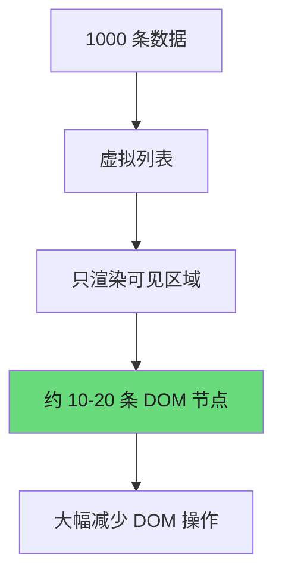
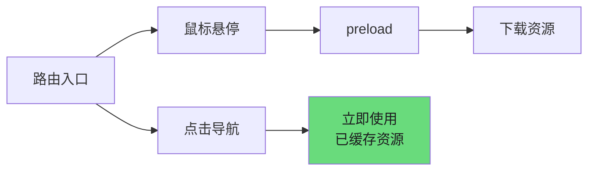
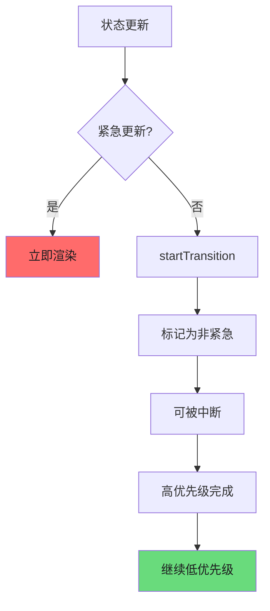
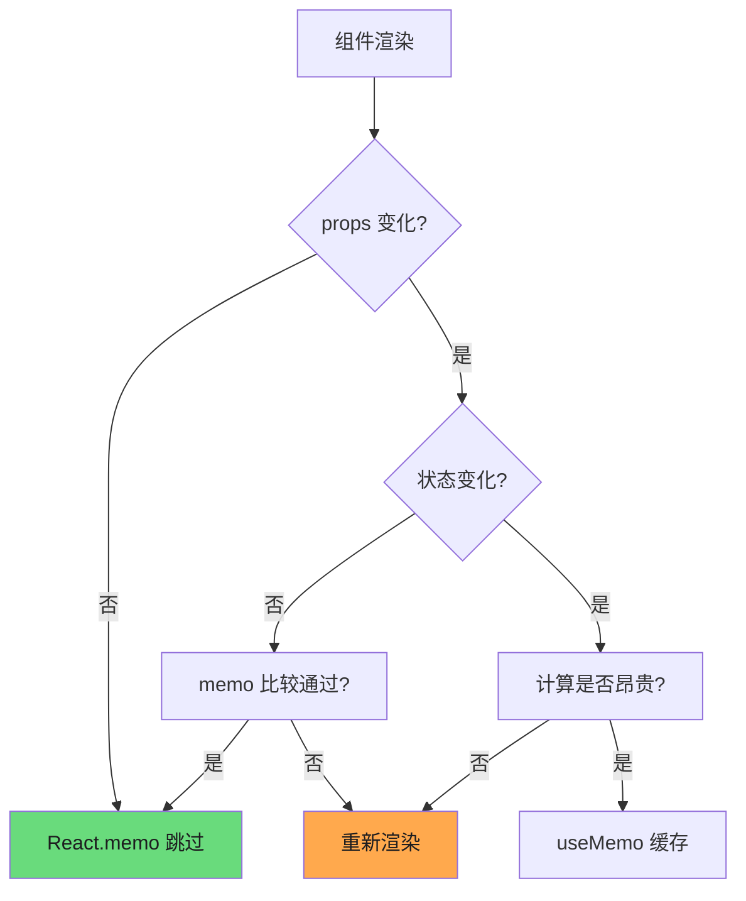

# 性能优化实战

本文档深入探讨 React 应用性能优化的核心策略，从渲染机制到并发模式，帮助开发者构建高性能的 React 应用。

---

## 1. 渲染优化基础

### 1.1 React.memo 与 Props 比较

`React.memo` 是高阶组件，用于缓存组件渲染结果。当 props 未发生变化时，避免不必要的重新渲染。

```tsx
import { memo } from 'react';

// 基本用法
const MemoizedComponent = memo(function MyComponent({ title, count }) {
  return (
    <div>
      <h1>{title}</h1>
      <span>{count}</span>
    </div>
  );
});
```

**自定义比较函数**：

```tsx
const areEqual = (prevProps, nextProps) => {
  return prevProps.id === nextProps.id &&
         prevProps.name === nextProps.name;
};

const MemoizedListItem = memo(ListItem, areEqual);
```

### 1.2 避免内联对象/函数/数组

内联定义会在每次渲染时创建新引用，导致 `React.memo` 失效。

```tsx
// 问题代码 - 每次渲染创建新对象
function BadExample() {
  return <ChildComponent
    style={{ color: 'red' }}
    onClick={() => handleClick()}
    items={[1, 2, 3]}
  />;
}

// 解决方案 - 使用稳定的引用
const containerStyle = { color: 'red' };
const fixedItems = [1, 2, 3];

function GoodExample() {
  const handleClick = useCallback(() => handleClick(), []);
  return <ChildComponent
    style={containerStyle}
    onClick={handleClick}
    items={fixedItems}
  />;
}
```

### 1.3 稳定组件结构

组件结构的稳定性直接影响 diff 算法效率。

```tsx
// 不稳定的结构导致更多 DOM 操作
function UnstableList({ items }) {
  return (
    <ul>
      {items.map(item => (
        <li key={item.id}>
          <span>{item.name}</span>
          {item.showDetail && <DetailView />}
        </li>
      ))}
    </ul>
  );
}

// 稳定结构 - 使用稳定的条件包装器
import { Show } from './utils';

function StableList({ items }) {
  return (
    <ul>
      {items.map(item => (
        <li key={item.id}>
          <span>{item.name}</span>
          <Show when={item.showDetail}>
            <DetailView />
          </Show>
        </li>
      ))}
    </ul>
  );
}
```

---

## 2. 状态设计原则

### 2.1 最小状态原则

只存储计算所需的最少数据，让组件从 props 和派生状态中计算其他值。

```tsx
// 冗余状态 - 需要同步维护多份数据
const [firstName, setFirstName] = useState('');
const [lastName, setLastName] = useState('');
const [fullName, setFullName] = useState('');

// 最小状态 - 只存储原始数据
const [firstName, setFirstName] = useState('');
const [lastName, setLastName] = useState('');

// 派生值通过计算获得
const fullName = `${firstName} ${lastName}`;
```

### 2.2 派生状态 vs 原始状态

判断是否需要状态时，问自己：**这个值能否从现有状态计算出来？**

```tsx
function PriceCalculator({ items, discount }) {
  // 派生状态 - 不需要 useState
  const subtotal = items.reduce((sum, item) => sum + item.price, 0);
  const discountAmount = subtotal * (discount / 100);
  const total = subtotal - discountAmount;

  return <div>总计: ¥{total.toFixed(2)}</div>;
}
```

### 2.3 状态归类与拆分

将相关状态归类，不相关的状态拆分，避免不必要的重渲染。

```tsx
// 混合状态导致联动问题
const [formData, setFormData] = useState({
  name: '',
  email: '',
  theme: 'light',
  sidebarOpen: false,
});

// 按职责拆分状态
const [userData, setUserData] = useState({ name: '', email: '' });
const [uiSettings, setUiSettings] = useState({ theme: 'light', sidebarOpen: false });
```

---

## 3. 列表渲染优化

### 3.1 Keys 的重要性

Keys 帮助 React 识别哪些元素发生了变化，减少不必要的 DOM 操作。

```tsx
// 正确使用稳定唯一 ID
const TodoList = ({ todos }) => (
  <ul>
    {todos.map(todo => (
      <li key={todo.id}>{todo.text}</li>
    ))}
  </ul>
);
```

### 3.2 避免使用索引作为 Key

当列表顺序可能变化时，索引作为 key 会导致渲染错误和性能问题。

```tsx
// 问题场景 - 列表项顺序会变化
const SortableList = ({ items }) => (
  <ul>
    {items.map((item, index) => (
      <li key={index}>{item.name}</li>  // 顺序变化时 key 不稳定
    ))}
  </ul>
);

// 解决方案 - 使用唯一 ID
const StableList = ({ items }) => (
  <ul>
    {items.map(item => (
      <li key={item.id}>{item.name}</li>  // 即使顺序变化，key 仍正确
    ))}
  </ul>
);
```

### 3.3 虚拟列表技术

对于长列表，使用虚拟化技术只渲染可见区域的 DOM 节点。

```tsx
import { useVirtualizer } from '@tanstack/react-virtual';

function VirtualList({ items }) {
  const parentRef = useRef(null);

  const virtualizer = useVirtualizer({
    count: items.length,
    getScrollElement: () => parentRef.current,
    estimateSize: () => 50,
  });

  return (
    <div ref={parentRef} style={{ height: '400px', overflow: 'auto' }}>
      <div style={{
        height: `${virtualizer.getTotalSize()}px`,
        position: 'relative',
      }}>
        {virtualizer.getVirtualItems().map((virtualItem) => (
          <div
            key={virtualItem.key}
            style={{
              position: 'absolute',
              top: virtualItem.start,
              height: `${virtualItem.size}px`,
            }}
          >
            {items[virtualItem.index].name}
          </div>
        ))}
      </div>
    </div>
  );
}
```

**虚拟化效果示意图**：



---

## 4. Code Splitting

### 4.1 React.lazy + Suspense

按需加载组件，减少初始包体积。

```tsx
// 第 1 段：引入按需加载的两种能力——lazy 决定"何时加载"，Suspense 决定"加载期间显示什么"
// 二者必须配对：懒加载组件在最近的 Suspense 边界处挂起，找不到边界时 React 会直接抛错。
// 易错点：本文件只取了 react 的这两个导出，JSX 里的 <Routes>/<Route>（react-router-dom）和
// <LoadingSpinner /> 都没有导入，照抄运行会在渲染前就因未定义标识符失败。
import { lazy, Suspense } from 'react';

// 第 2 段：路由级代码分割——用 lazy 把每个页面标记成独立 chunk 的分包点
// 参数必须是"返回 import() Promise 的函数"：写成 lazy(import('./x')) 会让请求在模块求值时立刻发出，
// 且每次渲染产生新 Promise 令 React 抛错；正确写法下 React 只调用一次并缓存 resolve 后的组件。
// 收益是首屏主包变小，代价是切到该路由时多一次网络往返（可用 modulepreload/prefetch 抹平瀑布）。
const Dashboard = lazy(() => import('./pages/Dashboard'));
const Settings = lazy(() => import('./pages/Settings')); // 未挂到任何 Route：chunk 仍会被产出但永不下载，属可清理的死代码

// 第 3 段：App 只描述路由表，把"页面代码还没到"的等待状态委托给 Suspense 边界
function App() {
  return (
    <Routes>
      <Route path="/dashboard" element={
        // 第 4 段：把边界钉在单个路由的 element 内部，而不是包住整个 <Routes>
        // 边界范围即 fallback 的爆炸半径：只包 Dashboard，切换到其他已加载页面时旧内容不会被卸载，
        // 不会整屏闪成 spinner；若提到 Routes 外层，每次进入未加载路由都会有一次全屏占位抖动。
        // fallback 仅在该 chunk 首次请求未完成期间出现，加载完成后边界恢复常态、不会残留旧占位。
        <Suspense fallback={<LoadingSpinner />}>
          <Dashboard />
        </Suspense>
      } />
    </Routes>
  );
}
```
### 4.2 组件级分割

对于大型组件中的次要功能，按需加载。

```tsx
// 只在需要时加载富文本编辑器
const RichEditor = lazy(() => import('./components/RichEditor'));

function CommentForm() {
  const [showEditor, setShowEditor] = useState(false);

  return (
    <div>
      <BasicInput />
      {showEditor && (
        <Suspense fallback={<EditorSkeleton />}>
          <RichEditor onSave={handleSave} />
        </Suspense>
      )}
    </div>
  );
}
```

### 4.3 Preload 和 Prefetch

预加载即将需要的资源，提升用户体验。

```tsx
// 组件预加载
const PrefetchDashboard = () => {
  const loadDashboard = useCallback(() => import('./pages/Dashboard'), []);

  return (
    <button onMouseEnter={loadDashboard}>
      进入控制台
    </button>
  );
};
```

**资源加载策略**：



---

## 5. 事件处理优化

### 5.1 事件委托机制

React 17+ 将事件绑定到根容器而非 document，减少内存占用。

```tsx
// React 17+ 事件委托结构
function EventDelegation() {
  // 原生事件可在根元素处理
  const handleClick = (e) => {
    console.log('Target:', e.target);
    console.log('CurrentTarget:', e.currentTarget);
  };

  return (
    <div onClick={handleClick}>
      <button>按钮 1</button>
      <button>按钮 2</button>
      <button>按钮 3</button>
    </div>
  );
}
```

### 5.2 避免箭头函数绑定

每次渲染时创建新函数，导致子组件不必要的重渲染。

```tsx
// 问题代码
function BadComponent({ items, onItemClick }) {
  return (
    <ul>
      {items.map(item => (
        <li key={item.id} onClick={() => onItemClick(item)}>
          {item.name}
        </li>
      ))}
    </ul>
  );
}

// 解决方案 - 使用数据属性
function GoodComponent({ items, onItemClick }) {
  return (
    <ul>
      {items.map(item => (
        <li
          key={item.id}
          onClick={onItemClick}
          data-item-id={item.id}
        >
          {item.name}
        </li>
      ))}
    </ul>
  );
}
```

### 5.3 Debounce 和 Throttle

对高频事件进行节流，减少计算负担。

```tsx
import { useCallback, useRef } from 'react';
import { debounce } from 'lodash-es';

// 第 1 段：依赖引入——这里已经埋下两处教学伏笔
// 1) 只导入了 useCallback / useRef，但下面用到了 useState（真实运行时会在首屏抛 ReferenceError）；
// 2) useRef 导入后并未使用，通常它才是保存「可取消的防抖/AbortController」的容器。
// 之所以不改代码，是因为本例要演示「注释如何指出问题」而非替读者修 bug。

function SearchInput() {
  // 第 2 段：两类状态，职责分离
  // query 是「输入框的即时值」，results 是「已确认的搜索产物」。把二者拆开是刻意设计：
  // 输入必须同步回显（不能卡顿），而结果只能异步落地，混成一个 state 会导致输入框被请求延迟拖住。
  const [query, setQuery] = useState('');
  const [results, setResults] = useState([]);

  // 第 3 段：防抖搜索闭包——性能优化的核心，也是边界条件最集中的地方
  // 防抖 - 等待用户停止输入后搜索
  const debouncedSearch = useCallback(
    // debounce(fn, 300) 返回一个「持有时钟的包装函数」：连续调用只会重置计时器，
    // 因此每 300ms 静默期最多触发一次真实请求，把 O(每次按键) 的网络开销压到 O(停顿次数)。
    // 易错点：内部 fn 若读取 props/state，会闭包捕获首次渲染的值（stale closure），
    // 这里的 async 函数只依赖入参 searchTerm，恰好绕开了该问题。
    // 另需注意：组件卸载时没有 cancel()/flush()，迟到的 setResults 会对已卸载组件执行更新；
    // 且多个请求并发返回时顺序不保证，先发的慢请求可能覆盖后发的快请求（竞态），
    // 生产实现通常再叠加 requestId 比对或 AbortController。
    debounce(async (searchTerm) => {
      const data = await fetchResults(searchTerm);
      setResults(data);
    }, 300),
    // 依赖数组为空：debounce 实例终身只创建一次，不会因重渲染而重置计时器。
    // 风险是回调被永久固化，一旦需要在其中使用最新 props，就必须改用 ref 转发。
    []
  );

  // 第 4 段：输入事件处理——同步更新受控值，异步触发请求
  const handleChange = (e) => {
    const value = e.target.value;
    // 先 setQuery 再调用防抖：受控 input 必须每击键都回填，否则输入会「吞字符」；
    // 防抖只推迟网络请求，绝不推迟 UI 回显。
    setQuery(value);
    debouncedSearch(value);
  };

  // 第 5 段：渲染——纯展示，无副作用
  // results 由异步 setResults 驱动重渲染；组件本身不感知防抖细节，保持了「容器管逻辑、子组件管展示」的分层。
  return (
    <div>
      <input value={query} onChange={handleChange} />
      <SearchResults results={results} />
    </div>
  );
}
```
---

## 6. useMemo 与 useCallback 策略

### 6.1 何时使用

这两个 Hook 不是万能药，需要在合适的场景使用。

```tsx
function ExpensiveList({ items, filter }) {
  // 适合场景：昂贵计算
  const filteredItems = useMemo(() => {
    return items.filter(item => item.category === filter);
  }, [items, filter]);

  // 适合场景：稳定引用传递给 memoized 子组件
  const handleItemClick = useCallback((itemId) => {
    console.log('Clicked:', itemId);
  }, []);

  return (
    <ul>
      {filteredItems.map(item => (
        <MemoizedItem
          key={item.id}
          item={item}
          onClick={handleItemClick}
        />
      ))}
    </ul>
  );
}
```

### 6.2 过度使用的代价

滥用 useMemo 和 useCallback 会增加代码复杂度并可能降低性能。

```tsx
// 过度使用 - 每个简单值都 memo
function OverUsedComponent({ name, age }) {
  const memoizedName = useMemo(() => name, [name]);      // 不值得
  const memoizedAge = useMemo(() => age, [age]);        // 不值得
  const memoizedCallback = useCallback(() => {}, []);    // 不值得

  return <div>{memoizedName} - {memoizedAge}</div>;
}

// 适度使用 - 只对复杂计算和稳定引用使用
function BalancedComponent({ items, config }) {
  // 复杂计算需要 memo
  const processed = useMemo(() => {
    return items.map(item => expensiveTransform(item, config));
  }, [items, config]);

  // 传递给 memoized 组件的回调需要 useCallback
  const handleClick = useCallback((id) => {
    updateItem(id);
  }, []);

  return <List items={processed} onItemClick={handleClick} />;
}
```

### 6.3 依赖数组优化

正确的依赖数组能避免不必要的重新计算。

```tsx
// 问题：遗漏依赖导致闭包陷阱
function BuggyComponent({ userId }) {
  const fetchUser = useCallback(() => {
    // userId 是陈旧的
    api.getUser(userId).then(setUser);
  }, []); // 缺少 userId

  // 正确：包含所有使用的值
  function FixedComponent({ userId }) {
    const fetchUser = useCallback(() => {
      api.getUser(userId).then(setUser);
    }, [userId]); // 包含依赖

    return <button onClick={fetchUser}>获取用户</button>;
  }
}
```

---

## 7. 并发模式优化

### 7.1 useTransition 优化非紧急更新

标记非紧急更新，允许紧急更新先完成。

```tsx
import { useTransition } from 'react';

function SearchResults({ query }) {
  const [isPending, startTransition] = useTransition();
  const [results, setResults] = useState([]);
  const [displayResults, setDisplayResults] = useState([]);

  const updateResults = (newResults) => {
    startTransition(() => {
      setDisplayResults(newResults); // 非紧急，可中断
    });
    setResults(newResults); // 紧急，立即更新
  };

  return (
    <div>
      {isPending ? <Spinner /> : <ResultsList data={displayResults} />}
    </div>
  );
}
```

### 7.2 useDeferredValue 延迟渲染

延迟非关键 UI 的更新。

```tsx
import { useDeferredValue } from 'react';
// 说明：本片段只显式导入 useDeferredValue，useState 与 Suspense 的导入从略，聚焦"延迟值"这一教学点。

// 第 1 段：组件入口（SearchPage 是整个搜索交互的状态所有者）
// React 并发特性（useDeferredValue / Suspense）必须在组件函数体内调用，因为它们依赖 Fiber 上的状态与调度；
// SearchPage 负责持有"用户输入"这份唯一数据源，子组件 SearchResults 只消费派生出来的值，形成单向数据流。
function SearchPage() {

  // 第 2 段：双状态（query 立即更新，deferredQuery 滞后的副本）
  // query 是输入框的真实值，必须每次按键都立刻更新，否则光标/输入会卡顿；
  // deferredQuery 是 React 给出的"低优先级快照"：它会在后台重渲染期间暂时落后于 query，
  // 从而把昂贵的结果渲染降级为可打断的 transition，保证输入法/键盘输入始终跟手。
  // 易错点：首次渲染时 deferredQuery === query；若 query 频繁变化，deferred 值可能连续跳变，
  // 不要把它当"防抖"用（它没有固定延迟），也禁止把它写回 state（会造成额外一轮渲染）。
  const [query, setQuery] = useState('');
  const deferredQuery = useDeferredValue(query);

  // 第 3 段：视图外壳与受控输入框（高频、必须同步的那条数据通道）
  // value + onChange 构成受控组件：state 是唯一真源，输入框永远渲染 query，杜绝两者不同步。
  // 这里刻意用 query 而非 deferredQuery——输入框属于"用户直接操作"的高优先级更新，不能被延迟。
  return (
    <div>
      <input
        value={query}
        onChange={(e) => setQuery(e.target.value)}
        placeholder="搜索..."
      />

      // 第 4 段：Suspense 边界（把挂起成本隔离在结果区）
      // 只有 SearchResults 会因读取远程数据而抛 Promise 挂起，Suspense 把它兜住并展示 Loading，
      // 因此输入框不会被整页的 fallback 替换掉。
      // 关键配合：传入 deferredQuery 让新结果的重算落在低优先级更新里，旧结果可继续展示，
      // 天然形成"输入即时、结果稍后"的体验；若这里直接传 query，输入仍可用，
      // 但每次按键都会以同步优先级触发挂起路径，容易在慢数据源上出现闪烁。
      // 边界：deferredQuery 落后期间 UI 会短暂显示"上一次查询的结果"，属于预期行为，
      // 需要的话可再用 isStale（query !== deferredQuery）做透明度/加载态提示。
      <Suspense fallback={<Loading />}>
        <SearchResults query={deferredQuery} />
      </Suspense>
    </div>
  );
}
```
### 7.3 useSyncExternalStore 稳定订阅

在并发模式下安全地订阅外部数据源。

```tsx
import { useSyncExternalStore } from 'react';

// 状态管理器订阅
function useStore(store) {
  const state = useSyncExternalStore(
    store.subscribe,    // 订阅函数
    store.getSnapshot,  // 获取当前快照
    getServerSnapshot   // 服务端渲染时的快照
  );

  return state;
}

// 使用
const { count, increment } = useStore(counterStore);
```

**并发模式渲染流程**：



---

## 8. Profiling 工具使用

### 8.1 React DevTools Profiler

React 官方提供的性能分析工具。

```tsx
// 使用 Profiler 测量组件性能
import { Profiler } from 'react';

function measureRenderCallback(
  id,       // 组件标识
  phase,    // mount 或 update
  actualDuration  // 本次渲染耗时
) {
  if (actualDuration > 16.67) {
    console.warn(`${id} 渲染过慢: ${actualDuration.toFixed(2)}ms`);
  }
}

function App() {
  return (
    <Profiler id="ProductList" onRender={measureRenderCallback}>
      <ProductList products={products} />
    </Profiler>
  );
}
```

### 8.2 Performance API

浏览器原生性能监控 API。

```tsx
function PerformanceMonitor() {
  const measureRef = useRef();

  useEffect(() => {
    // 创建性能标记
    performance.mark('component-mount');

    // 测量两个标记之间的时间
    performance.measure(
      'mount-duration',
      'component-mount',
      'component-paint'
    );

    // 获取测量结果
    const entries = performance.getEntriesByName('mount-duration');
    console.log('Mount time:', entries[0].duration);
  }, []);

  return <div ref={measureRef}>内容</div>;
}
```

### 8.3 Lighthouse 分析

自动化性能审计工具。

```bash
# 使用 Lighthouse CLI 分析
npx lighthouse http://localhost:3000 \
  --output html \
  --output-path ./reports/lighthouse.html \
  --preset desktop
```

**性能指标解读**：

| 指标 | 含义 | 目标值 |
|------|------|--------|
| FCP | 首次内容绘制 | < 1.8s |
| LCP | 最大内容绘制 | < 2.5s |
| FID | 首次输入延迟 | < 100ms |
| CLS | 累积布局偏移 | < 0.1 |
| TTI | 可交互时间 | < 3.8s |

---

## 9. 常见性能问题与解决

| 问题 | 原因 | 解决方案 |
|------|------|----------|
| 不必要重渲染 | Props 引用变化 | 使用 `React.memo`，稳定 props 引用 |
| 列表卡顿 | 大量 DOM 渲染 | 使用虚拟列表技术 |
| 状态更新慢 | 不必要的计算 | 使用 `useMemo` 缓存计算结果 |
| 频繁触发回调 | 事件未节流 | 使用 `debounce` / `throttle` |
| 大组件渲染慢 | 单组件职责过多 | 拆分为小组件，按需加载 |
| 状态同步延迟 | 状态分散 | 使用状态管理库集中管理 |
| 内存泄漏 | 订阅未清理 | 在 `useEffect` 中返回清理函数 |
| 图片加载慢 | 图片未优化 | 使用懒加载、WebP 格式 |

### 9.1 渲染优化决策树



### 9.2 性能优化检查清单

- [ ] 使用 `React.memo` 包装纯展示组件
- [ ] 避免内联函数/对象/数组作为 props
- [ ] 合理使用 `useMemo` 和 `useCallback`
- [ ] 长列表使用虚拟化技术
- [ ] 非关键更新使用 `useTransition`
- [ ] 及时清理副作用订阅
- [ ] 使用代码分割减少初始加载
- [ ] 图片和媒体资源懒加载
- [ ] 定期使用 Profiler 分析性能
- [ ] 监控 Core Web Vitals 指标

---

## 10. 总结

React 性能优化是一个系统性工程，需要从多个维度入手：

1. **渲染层** - 减少不必要的重新渲染
2. **状态层** - 优化状态设计和更新策略
3. **加载层** - 合理拆分代码，按需加载
4. **工具层** - 善用 Profiling 工具定位瓶颈

遵循本文档的策略和模式，可以显著提升 React 应用的性能表现，为用户提供更流畅的体验。

## 深入阅读与参考

!!! tip "怎么用这些资料"
    先读「官方文档与规范」建立准确的概念，再读「源码与示例」核对细节，最后用「教程、书籍与视频」换一种讲法加深理解。每条都写明了读哪一节、带着什么问题读。

### 官方文档与规范

| 资源 | 为什么读 | 怎么读 |
|---|---|---|
| [Automatic Code Splitting](https://rolldown.rs/in-depth/automatic-code-splitting) | 讲清自动分包的触发条件，避免与手动配置冲突。 | 读触发条件与配置一节，对照自己项目产物，确认哪些路由已被自动拆分。 |
| [Manual Code Splitting](https://rolldown.rs/in-depth/manual-code-splitting) | 手动 import() 拆分的官方做法，直接控制首屏体积。 | 读动态 import 与 Suspense 示例，给最大的页面做一次手动拆分并对比体积。 |
| [useCallback](https://react.dev/reference/react/useCallback) | 明确 useCallback 的适用场景与依赖数组规则。 | 读用法与陷阱一节，检查项目里依赖数组写错或本就多余的 useCallback。 |
| [useMemo](https://react.dev/reference/react/useMemo) | 官方说明缓存的成本与收益，是决策 useMemo 的依据。 | 读注意事项与性能小节，列出项目中真正值得缓存的昂贵计算。 |
| [Source Code Transformations](https://rolldown.rs/apis/plugin-api/transformations) | 了解编译期代码转换如何影响最终产物与性能。 | 读转换钩子与示例，思考哪些优化可放到构建期而非运行时。 |
| [Dead Code Elimination](https://rolldown.rs/in-depth/dead-code-elimination) | 死代码消除与摇树是减小包体的关键一环。 | 读导出分析与副作用标记部分，检查自己的包能否被正确摇树。 |
| [CPU profiling](https://docs.deno.com/runtime/fundamentals/cpu_profiling/) | CPU profiling 概念通用，帮助真正读懂火焰图。 | 读采样与火焰图小节，用同样思路采集一次前端或 Node 的 profile。 |

### 源码与示例

| 资源 | 为什么读 | 怎么读 |
|---|---|---|
| [30 Seconds of Code](https://www.30secondsofcode.org/) | 短小代码片段便于反复练习，练出手写实现的直觉。 | 每天选一个片段，先自己实现再对照，重点看边界处理与性能写法。 |

### 教程、书籍与视频

| 资源 | 为什么读 | 怎么读 |
|---|---|---|
| [Kent：useMemo 与 useCallback](https://kentcdodds.com/blog/usememo-and-usecallback) | 用 Profiler 实测缓存收益，纠正无脑 useMemo 的惯性。 | 先读结论再看案例，用 React DevTools Profiler 复现，判断自己组件是否需要缓存。 |
| [Node.js 性能分析](https://nodejs.org/en/learn/getting-started/profiling) | 理解采样、火焰图与自顶向下分析的通用方法。 | 用 --prof 跑一个脚本，读生成的 profile，找出耗时最长的函数并记录结论。 |
| [Oxc 博客](https://oxc.rs/blog/) | 了解 Rust 工具链如何做编译期性能优化。 | 挑性能与架构文章各一篇，关注增量与并行策略，再对照自己的构建耗时。 |

## 应用与行业实践

### 应用场景地图

| 场景 | 用到本页哪个知识点 | 典型技术选型 | 注意事项 |
| --- | --- | --- | --- |
| 后台管理系统的万行订单表格（筛选＋分页） | 列表渲染优化、useMemo 与 useCallback 策略 | 窗口化渲染（react-window、TanStack Virtual）、React.memo 行组件 | 行高先固定再虚拟化，行高随内容变化时测量开销会抵消收益 |
| 低端安卓机打开运营活动首屏 | Code Splitting、并发模式优化 | React.lazy＋Suspense、路由级分包、Vite manualChunks | 分包后要测弱网下的往返次数，别让首屏多等一轮请求 |
| 多人协作白板的远端光标与图形同步 | 状态设计原则、事件处理优化、useSyncExternalStore | 外部 store（Zustand、Valtio）＋useSyncExternalStore | 远端高频更新要与本地绘制解耦，别让每帧都走 React 渲染 |
| 即时通讯消息流（历史消息＋实时新消息） | 列表渲染优化、useMemo 与 useCallback 策略 | 反向虚拟列表、消息分页、图片懒加载 | 插入新消息要保持滚动位置，别整列表重渲染 |
| 数据大屏多图表定时刷新 | useMemo 与 useCallback 策略、Profiling 工具使用 | ECharts 实例用 ref 持有、图表容器 memo 化、降低采样频率 | 实例只更新数据不重建，重建会触发整块画布重绘 |
| 审批流程页的密集表单（一页 50 个字段） | 状态设计原则、事件处理优化 | 非受控组件、字段级局部状态、校验 debounce | 输入状态收在字段层，父级 state 一变全表单都跟着渲染 |
| 视频剪辑时间轴拖拽素材 | 事件处理优化、并发模式优化 | 指针事件＋requestAnimationFrame 节流、CSS transform 位移、useTransition | 拖拽过程只改 transform，松手后再提交到 React 状态 |
| 电商大促页秒杀倒计时 | 渲染优化基础、Profiling 工具使用 | 倒计时状态下沉到叶子组件、独立组件隔离 | 倒计时每秒触发，放在页面根组件会让整页按秒重渲染 |

### 三个场景拆解

#### 场景 1：后台管理系统的万行订单表格

**业务背景**：列表一次加载上万行，运营需要在顶部输入框里筛选订单号。痛点是每敲一个字符页面就停顿，输入框回显跟不上手指。

规模量级用可复现方式描述：用脚本生成 1 万行假数据，在 Chrome DevTools Performance 里录制输入 3 个字符的过程，看长任务数量和 Scripting 时间。

**怎么用本页知识解决**：思路是减少同时挂载的 DOM 行数，只渲染可视区加缓冲行；再把行组件 memo 化，让滚动时未变化的行不重渲染。

```jsx
// 只挂载可视区内的行，滚动时用 scrollTop 换算起止下标
function VirtualTable({ rows, rowHeight = 36, viewport = 480 }) {
  const [scrollTop, setScrollTop] = useState(0);
  // 可视行数 = 视口高度 / 行高，多渲染 2 行做滚动缓冲
  const visibleCount = Math.ceil(viewport / rowHeight) + 2;
  const start = Math.floor(scrollTop / rowHeight);
  const slice = rows.slice(start, start + visibleCount);
  return (
    <div
      style={{ height: viewport, overflowY: 'auto' }}
      onScroll={(e) => setScrollTop(e.currentTarget.scrollTop)} // 只更新滚动位置
    >
      {/* 空 div 撑起总高度，保证滚动条比例正确 */}
      <div style={{ height: rows.length * rowHeight, position: 'relative' }}>
        <div style={{ transform: `translateY(${start * rowHeight}px)` }}>
          {slice.map((row) => <Row key={row.id} row={row} />)} {/* 行组件用 memo 包裹 */}
        </div>
      </div>
    </div>
  );
}
```

- `slice` 决定本次渲染的数组长度，长度与总行数无关，只与视口高度有关。
- `translateY` 把可视区内容推到正确位置，比逐行设置 `top` 少改样式。
- 撑高用的空 div 不渲染内容，只负责滚动条长度。
- `Row` 用 `React.memo` 包裹，滚动时只有新进入视口的行需要渲染。
- 筛选输入框的值不要和 `scrollTop` 放在同一个 state，避免打字时重算可视区。

**怎么度量收益**：用 React DevTools Profiler 录制一次筛选输入，看 commit 耗时和 "rendered components" 数量。用 Chrome DevTools Performance 录制 3 秒滚动，看 Frames 轨道是否掉帧、有没有超过 50ms 的长任务。用 web-vitals 库采集 INP，观察交互响应分位。

**什么时候不该用**：
- 行数在 200 以内，虚拟化的换算和缓冲逻辑带来的维护成本超过收益。
- 表格需要浏览器原生 Ctrl+F 查全表，或者需要一次性打印、导出全部行，未挂载的行搜不到也导不出。

#### 场景 2：低端安卓机打开运营活动首屏

**业务背景**：活动页打包成一个 bundle，低端安卓机上首屏要等整包下载和解析完才出现内容。痛点是把报表、排行榜这些低频页面的代码也算进了首屏。

规模量级用可复现方式描述：用 Chrome DevTools Network 面板按 4G 慢速＋CPU 4 倍降速，记录首屏实际请求的 JS 字节数和主线程长任务。

**怎么用本页知识解决**：思路是按路由拆包，首屏只加载首页需要的那部分；空闲时再预取用户下一步可能进入的页面。

```jsx
// 首屏只加载首页，报表页体积大单独拆出去
const Home = lazy(() => import('./pages/Home'));
const Report = lazy(() => import('./pages/Report'));

function App() {
  return (
    <Suspense fallback={<Skeleton />}> {/* 加载期间先显示骨架屏 */}
      <Routes>
        <Route path="/" element={<Home />} />
        <Route path="/report" element={<Report />} />
      </Routes>
    </Suspense>
  );
}

// 首屏渲染完成后，浏览器空闲时预取报表页
useEffect(() => {
  const id = requestIdleCallback(() => import('./pages/Report'));
  return () => cancelIdleCallback(id); // 卸载时取消，避免无效下载
}, []);
```

- `lazy` 让 import 变成动态加载，打包工具会为它生成独立 chunk。
- `Suspense` 的 fallback 决定等待期间用户看到什么，用骨架屏而不是空白。
- `requestIdleCallback` 在 Safari 上支持不完整，需要按官方文档核对兼容方案。
- 预取放在首屏渲染之后，避免和首屏资源抢带宽。
- 公共依赖放进 vendor chunk，避免每个路由 chunk 重复打包。

**怎么度量收益**：用 Lighthouse 移动端预设（含 CPU 降速）看 FCP、LCP、TBT、TTI。用 Chrome DevTools Network 面板确认首屏路由实际下载的 JS 字节数。用 web-vitals 采集线上 LCP 和 INP 的 P75 分位。

**什么时候不该用**：
- 应用只有一个页面且整包体积在预算内，拆包只会多一次网络往返。
- 内网系统带宽充足且用户长期停留在同一页，骨架屏闪烁造成的等待感比下载时间更明显。

#### 场景 3：多人协作白板的远端光标与图形同步

**业务背景**：多人同时拖动图形时，远端光标位置每秒到达几十次。痛点是每次远端更新都走 React state，导致本地拖动跟着掉帧。

规模量级用可复现方式描述：用两个浏览器窗口连同一个房间，在 Performance 面板录制 5 秒拖动，看 Frames 轨道和每秒重渲染次数。

**怎么用本页知识解决**：思路是把高频的远端数据放到 React 之外的 store，用 `useSyncExternalStore` 订阅；每个光标是独立组件，只有位置变化的那一个重渲染。

```jsx
const store = {
  cursors: new Map(),
  listeners: new Set(),
  setCursor(id, pos) {
    this.cursors = new Map(this.cursors).set(id, pos); // 生成新引用，快照比较才生效
    this.listeners.forEach((l) => l()); // 只通知订阅者，不触发整棵树
  },
  subscribe(l) {
    this.listeners.add(l);
    return () => this.listeners.delete(l); // 返回取消订阅函数
  },
  getSnapshot() { return this.cursors; }, // 引用不变即视为没有变化
};

function CursorLayer() {
  const cursors = useSyncExternalStore(store.subscribe, store.getSnapshot);
  // 每个光标独立组件，只有位置变了的那个重渲染
  return [...cursors].map(([id, p]) => <Cursor key={id} x={p.x} y={p.y} />);
}
```

- `getSnapshot` 必须在数据没变时返回同一个引用，否则会触发无限重渲染。
- `setCursor` 每次生成新 Map，让引用比较能识别出变化。
- `subscribe` 返回取消订阅函数，组件卸载时移除监听。
- 本地拖拽期间直接改 `transform`，松手后再把最终坐标写进 store。
- store 通知次数与 React 渲染次数要分开统计，便于定位瓶颈在哪一层。

**怎么度量收益**：用 Chrome DevTools Performance 录制拖动过程，看 Frames 轨道和长任务。用 React DevTools Profiler 看 commit 次数和每次提交的组件数。在 store 的通知函数里打点，统计每秒通知次数与每秒渲染次数。

**什么时候不该用**：
- 协作频率低（例如评论批注每十几秒同步一次），外置 store 增加的心智成本没有对应收益。
- 团队依赖 React DevTools 直接检查 state，状态移出 React 后在面板里看不到，排障成本上升。

### 行业先进实践

**路由级 Code Splitting 配合 lazy 与 Suspense（出处：React 官方文档 Code-Splitting / lazy）**
官方文档给出的做法是把动态 `import()` 交给 `lazy`，用 `Suspense` 兜住加载态。它的作用是让打包工具按边界切分 chunk，首屏不必下载全部路由代码。借鉴方式：先给低频的大页面加 `lazy`，再按 Network 面板的实际请求体积决定要不要继续拆。

**用 useTransition 与 useDeferredValue 区分紧急与非紧急更新（出处：React 官方文档 useTransition、useDeferredValue）**
官方文档把输入回显这类需要即时反馈的更新标为紧急，把列表过滤结果标为非紧急。做法是让紧急更新先提交，非紧急更新在后台重算。借鉴方式：只在筛选、搜索这类"输入框＋大列表"结构里用，其他场景先确认瓶颈是否真在渲染优先级。

**用 Core Web Vitals 与 web-vitals 库做现场度量（出处：web.dev Core Web Vitals、开源库 web-vitals）**
web.dev 定义了 LCP、INP、CLS 三个指标及阈值，web-vitals 库负责在真实用户浏览器里采集并上报。它的作用是把优化目标从实验室数字换成线上分位数据。借鉴方式：先在项目里接入上报，拿到 P75 基线后再改代码，每次改动用同一指标对比。

**规范化状态结构，扁平化存储实体（出处：Redux 官方文档 Normalizing State Shape）**
官方文档建议把嵌套数据拆成按 id 索引的对象表加 id 数组两张表。这样做的好处是更新单条记录时，依赖它的选择器不必跟随整棵子树变化。借鉴方式：列表数据里出现嵌套对象或数组时，先按这个结构整理，再决定要不要引入 memo。

**PRPL 模式：推送关键资源、尽早渲染、预取剩余路由（出处：web.dev PRPL 模式）**
该模式把首屏加载拆成 Push、Render、Pre-cache、Lazy-load 四步，强调先交付首屏所需的最小资源。它的作用是让首次可见时间不依赖后续路由代码。借鉴方式：把首屏关键 chunk 用 preload 提示，其余路由用空闲时间预取，并用 Network 面板确认没有重复下载。

### 从学到用：落地路线

1. **选一个页面做试点**：挑一个已经有明确性能抱怨、且能独立测量的页面，比如后台的订单列表页。验收标准：写出该页面的当前指标基线与测量命令。
2. **用工具确认瓶颈位置**：用 React DevTools Profiler 和 Performance 面板录制一次典型操作，确认耗时落在渲染、数据还是网络。验收标准：产出一份记录，写明瓶颈归属和对应的本页知识点。
3. **按场景推广**：把验证过的做法整理成检查清单，在其他页面按清单逐项对照。验收标准：每个接入页面都有改造前后的同口径指标对比。
4. **防止回退**：把关键指标接入持续集成，设置体积与长任务数量的告警阈值。验收标准：超出阈值的合并请求会被拦下，且有负责人跟进。

### 动手作业

**目标**：把一份 5000 行的订单表格从不做优化的版本改到可流畅输入筛选，并给出前后两组可复现的测量数据。

**步骤**：
1. 用 Vite 创建 React 项目，写一个脚本生成 5000 条订单假数据，字段包含 id、金额、状态。
2. 先写全量渲染版本，不做任何优化，作为对照。
3. 用 React DevTools Profiler 录制一次筛选输入，记录 commit 耗时与渲染组件数。
4. 拆出 `Row` 组件并用 `React.memo` 包裹，保证 props 是基本类型。
5. 改成可视区渲染，固定行高 36px，用撑高的空 div 保持滚动条比例。
6. 用 `useDeferredValue` 把筛选结果的更新降级，输入框保持即时回显。
7. 重复第 3 步，把前后两次的记录整理成一张表。

**验收标准**：
- Elements 面板里同时挂载的表格行数不超过 20。
- 输入筛选关键词时，Profiler 记录的 commit 耗时低于 50ms。
- Performance 面板录制 3 秒操作，没有超过 50ms 的长任务。
- 滚动到列表底部时滚动条比例正确，不出现空白区域。
- 筛选结果的行数与按条件过滤数据源得到的行数一致。

