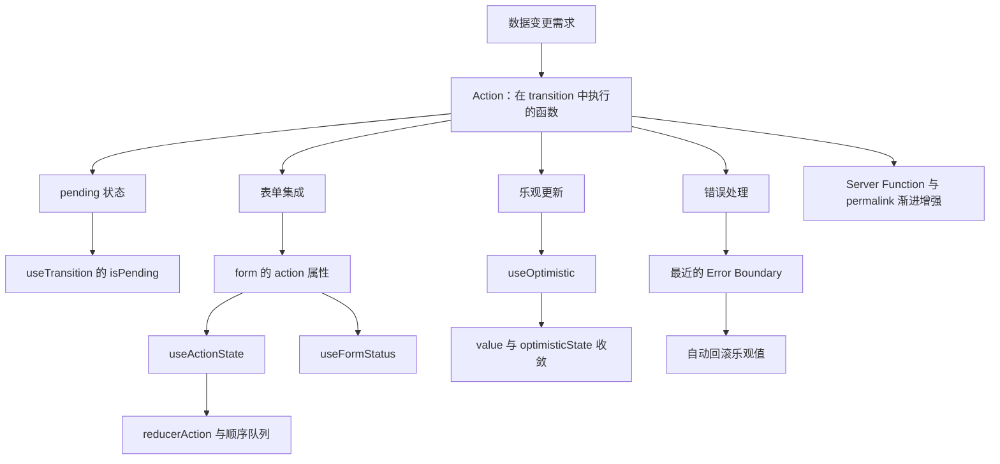
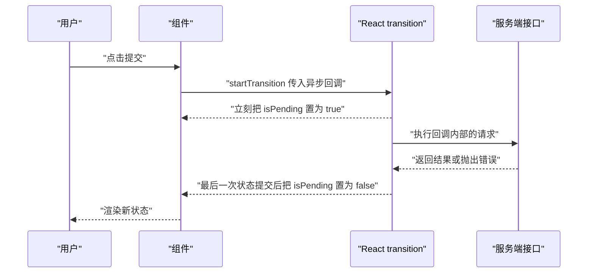
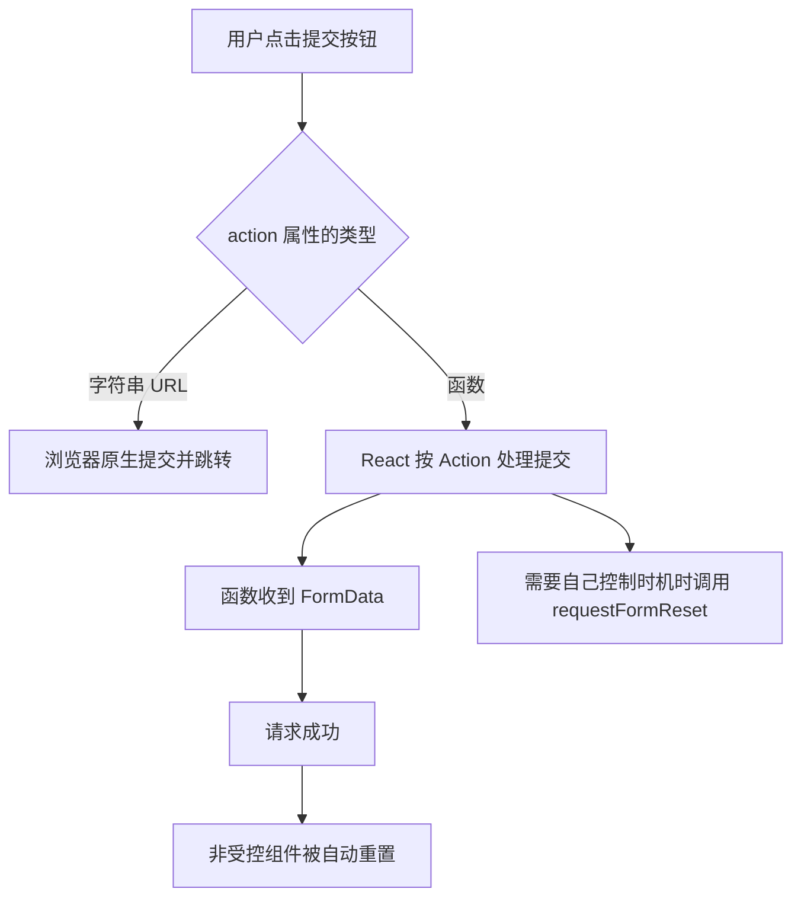
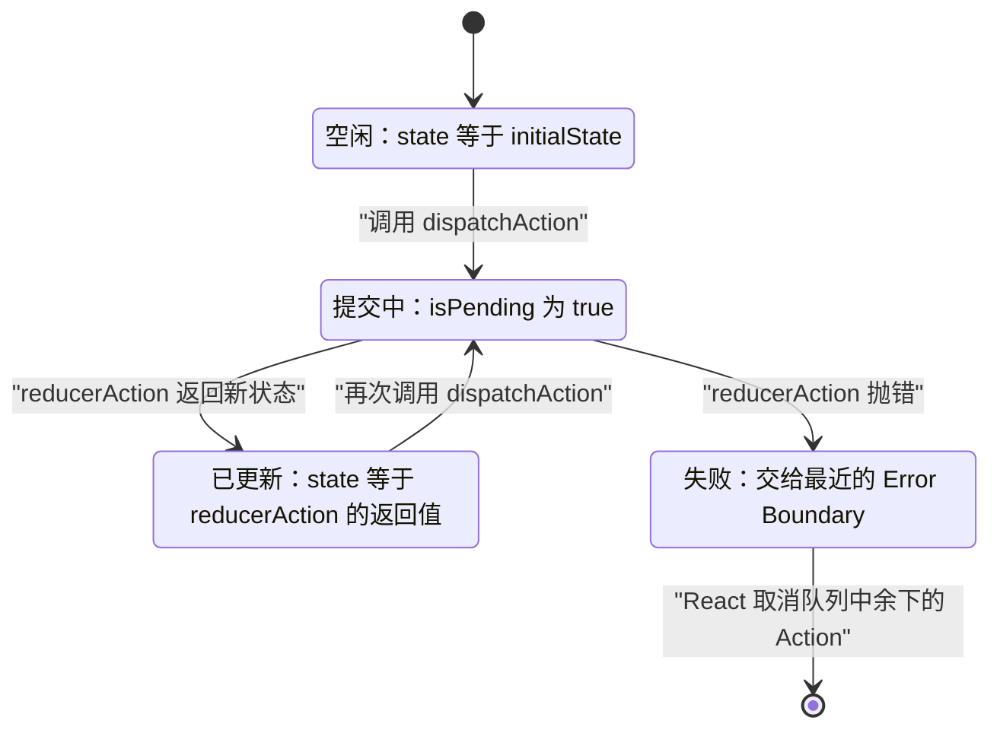
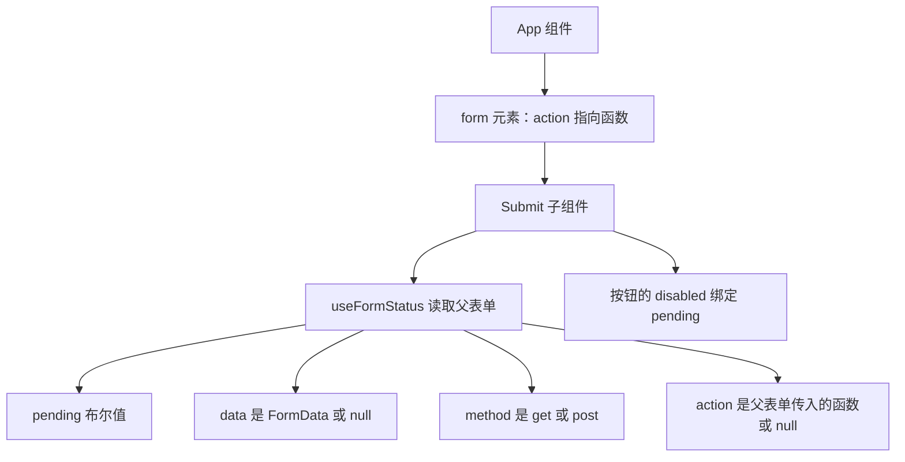
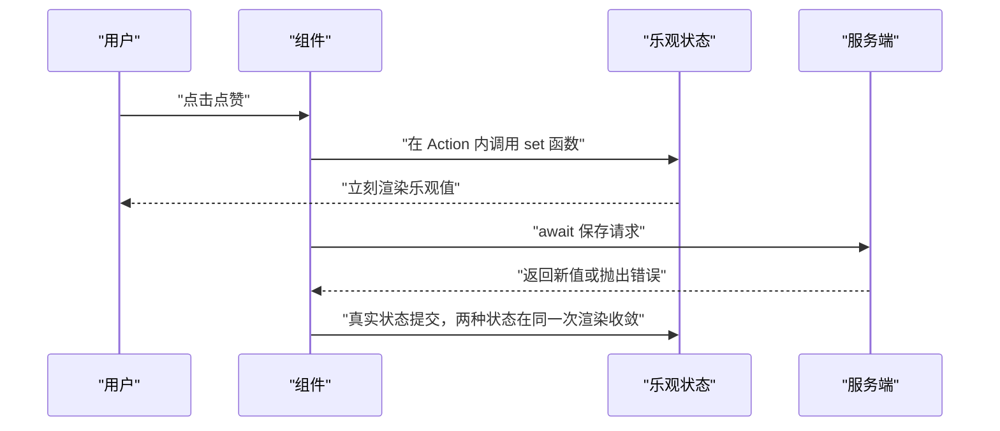
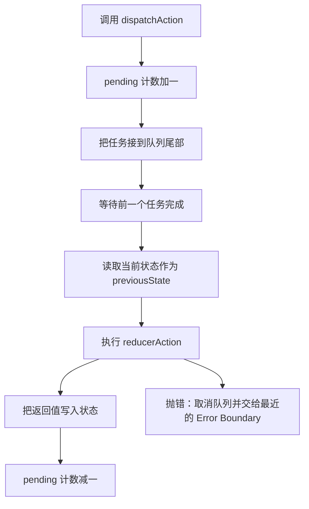
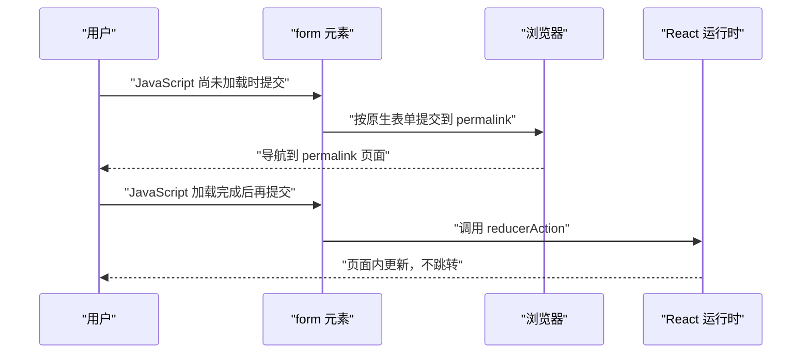

# Actions 与表单：useActionState、useFormStatus、useOptimistic

!!! abstract "学完这一页你能"

    - 说出 Action 自动接管的四件事，并指出手工维护 pending、错误、乐观更新时的重复代码位置。
    - 用 useActionState 写一个带 pending 与错误状态的表单提交，解释 reducerAction 的两个参数与顺序队列。
    - 用 useFormStatus 在子组件读取父表单状态，并说明它为什么读不到同一组件里渲染的表单。
    - 用 useOptimistic 完成乐观展示与失败回滚，并手写一个简化版 useActionState 说明内部原理。

## 0. 知识地图



建议按编号顺序读：第 1 节先建立 Action 与 transition 的关系，第 2 到第 5 节是一次完整表单的四个零件。

第 6 节是原理课，读完能回答“它内部怎么排队”；第 7 节把前面内容接到服务端与弱网场景。任何一节读不动，先跳过，回头再补。

## 1. Action 与 transition：为什么需要 Action

**先想一个问题**

用户点“保存昵称”，你要发请求、显示加载中、失败提示、成功后跳转。只用 useState，你得同时维护 name、error、isPending 三个变量。

表单多起来，这段提交逻辑会在每个组件里重复一遍，出错的地方也集中在“忘了关 loading”。

**心智模型**

!!! tip "心智模型"

    一句话模型：Action 是放进 transition 里执行的函数，React 替你照顾它的开始与结束。

    日常类比：把包裹交给前台代收，你只填单子，签收与异常由前台盯着。

    类比不成立的地方：前台会漏掉包裹，Action 不会；Action 抛出的错误会交给最近的 Error Boundary。

!!! note "术语：Action"

    按 React 官方约定，在 transition 中执行的函数叫 Action。它可以是同步函数，也可以是异步函数。

**图解**



1. 用户点击触发组件里的提交函数。
2. 提交函数用 `startTransition` 包住异步回调，这个回调就是 Action。
3. transition 一开始就把 `isPending` 置为 true，界面仍可交互。
4. Action 内部发请求，请求期间界面保持响应。
5. 所有 transition 结束后，`isPending` 自动置回 false，界面渲染最终状态。

**一步一步来**

第 1 步：先看手工维护 pending 与错误的写法。

```js
function UpdateName() {
  const [name, setName] = useState("");
  const [error, setError] = useState(null);
  const [isPending, setIsPending] = useState(false);

  const handleSubmit = async () => {
    setIsPending(true);                     // 手工打开加载状态
    const error = await updateName(name);   // 发请求
    setIsPending(false);                    // 手工关闭加载状态
    if (error) {
      setError(error);                      // 手工记录错误
      return;
    }
    redirect("/path");                      // 成功后的跳转也要自己写
  };
  // ...
}
```

**这段代码在做什么**

- `isPending` 由你自己打开与关闭，任何一条提前返回都会漏掉关闭。
- 错误信息存在组件状态里，组件卸载后错误就丢了。
- 成功后跳转写在提交函数里，逻辑与界面耦合在一起。

第 2 步：改成用 async transition，让 React 接管 pending。

```js
function UpdateName() {
  const [name, setName] = useState("");
  const [error, setError] = useState(null);
  const [isPending, startTransition] = useTransition();  // pending 由 React 维护

  const handleSubmit = () => {
    startTransition(async () => {          // 这个异步回调就是 Action
      const message = await updateName(name);
      if (message) {
        setError(message);
        return;
      }
      redirect("/path");
    });
  };
  // ...
}
```

**这段代码在做什么**

- `startTransition` 收到异步回调后立刻进入 pending 状态。
- 请求结束后，等最后一次状态提交完成，pending 才结束。
- 组件里不再出现手工的 `setIsPending`，少了一处会忘记的收尾。
- 请求期间界面保持可交互，不会被提交动作锁住。

运行结果：请求发出时按钮立刻进入禁用状态，请求结束并提交新状态后按钮恢复可用。

**动手验证**

把 transition 的 pending 语义写成可以直接运行的单文件脚本。

```js
// 依赖：无，Node 20+ 内置 node:assert
const assert = require('node:assert/strict');

// 极简调度器：只保留 pending 的开始与结束
function createTransition() {
  let pendingCount = 0;                       // 进行中的任务数
  const listeners = new Set();
  const emit = () => listeners.forEach((fn) => fn(pendingCount > 0));

  async function startTransition(action) {
    pendingCount += 1;                        // 开始就进入 pending
    emit();
    try {
      await action();                         // Action 里的异步调用被包含在内
    } finally {
      pendingCount -= 1;                      // 结束后退出 pending
      emit();
    }
  }
  return { startTransition, subscribe: (fn) => listeners.add(fn) };
}

async function main() {
  const { startTransition, subscribe } = createTransition();
  const seen = [];
  subscribe((p) => seen.push(p));

  await startTransition(async () => {
    await new Promise((r) => setTimeout(r, 10));  // 模拟一次请求
  });

  assert.deepEqual(seen, [true, false], 'pending 应先为 true 再为 false');
  console.log('pending 序列:', seen.join(' -> '));
}

main().catch((e) => { console.error(e); process.exit(1); });
```

预期输出：

```
pending 序列: true -> false
```

**常见坑**

| 现象 | 原因 | 怎么修 |
|---|---|---|
| await 之后设置状态没有进入 transition | 官方文档写明 await 之后的状态更新目前需要再包一层 startTransition | 在 await 之后再调用一次 `startTransition` |
| 输入框文字被刷新覆盖 | transition 更新会被其他更新打断，且不能用来控制文本输入 | 输入框的值用 useState 直接控制 |
| pending 一直不结束 | 状态更新写在 setTimeout 里，不会被标记为 transition | 把更新放回 Action 的同步执行部分 |

**用在哪里**

- 后台管理的批量导入：业务背景是粘贴一列 ID 后统一入库；用 `startTransition` 包住导入 Action，导入期间允许用户切走查看别的页面；指标可以看导入期间界面长任务数量与用户取消次数；不该用在需要逐行即时校验并阻止提交的场景。
- 电商下单按钮：业务背景是重复点击导致重复下单；用 Action 的 pending 驱动按钮禁用；指标看重复提交拦截率与提交失败重试次数；不该用在对延迟敏感的本地搜索上，本地过滤不需要提交状态。

**行业实践**

- React 官方文档 `useTransition` 参考页用 Note 写明“Functions called in startTransition are called Actions”，并给出命名约定：回调名用 `action` 或带 Action 后缀。
- React 19 发布博客的 Actions 一节列出 Action 自动接管的四件事：pending 状态、乐观更新、错误处理、表单。
- 借鉴方式：在团队里统一提交函数的命名后缀，并把“await 之后要再包一次”写进代码规范。

**小结**

- Action 的值来自 transition：函数被 transition 包住才算 Action。
- pending 由 React 维护，开始于请求发出，结束于最后一次状态提交。
- await 之后的状态更新目前要再包一层 startTransition。

## 2. form action 属性：把提交交给函数

**先想一个问题**

注册页有 6 个输入框，提交后要清空。写成受控组件，你得写 6 个 state 加一个清空函数。改成把函数交给 form 的 action 属性，清空这一步由 React 处理。

**心智模型**

!!! tip "心智模型"

    一句话模型：action 属性收到函数时，表单提交就走 Action。

    日常类比：把纸质表格投进指定窗口，窗口知道该走哪条流程。

    类比不成立的地方：窗口只有一条流程，action 既能收 URL 字符串，也能收函数，两种行为不同。

!!! note "术语：FormData"

    FormData 是浏览器提供的键值集合接口，用来装载表单字段。`formData.get("name")` 取出名为 name 的字段值。

**图解**



1. 点击提交按钮，触发表单的提交事件。
2. React 先检查 action 属性拿到的是字符串还是函数。
3. 字符串按浏览器原生行为提交并跳转页面。
4. 函数按 Action 处理，函数参数是本次提交的 FormData。
5. Action 成功后，非受控组件被自动重置；需要手动时用 `requestFormReset`。

**一步一步来**

第 1 步：把函数交给 form 的 action 属性。

```jsx
function ChangeName() {
  async function submitAction(formData) {   // 参数就是本次提交的 FormData
    const newName = formData.get("name");   // 取出输入框的值
    await updateName(newName);              // 发请求
  }

  return (
    <form action={submitAction}>            {/* 传函数即走 Action */}
      <input type="text" name="name" />     {/* 有 name 才会进 FormData */}
      <button type="submit">Update</button>
    </form>
  );
}
```

**这段代码在做什么**

- `action={submitAction}` 把提交交给函数，React 按 Action 处理这次提交。
- 输入框的 `name` 决定 FormData 的键，没有 name 就取不到值。
- 提交按钮不需要 onClick，浏览器提交事件由 React 接管。
- `<input>` 与 `<button>` 也支持 `formAction`，用来覆盖所属表单的 action。

第 2 步：处理成功后自动重置与手动重置。

```jsx
import { requestFormReset } from "react-dom";

function CommentForm({ postComment }) {
  const formRef = useRef(null);

  async function submitAction(formData) {
    await postComment(formData.get("text"));
    // Action 成功后，非受控字段由 React 自动重置
  }

  function handleReset() {
    requestFormReset(formRef.current);   // 需要自己控制时机时手动重置
  }

  return (
    <form action={submitAction} ref={formRef}>
      <textarea name="text" />
      <button type="submit">发送</button>
      <button type="button" onClick={handleReset}>重置</button>
    </form>
  );
}
```

**这段代码在做什么**

- 自动重置发生在 Action 成功之后，作用对象是非受控组件。
- 需要自己做重置时调用 `requestFormReset`。
- 资料未覆盖，需核对官方文档：`requestFormReset` 的参数与返回值。
- 资料未覆盖，需核对官方文档：受控字段在 Action 成功后的重置行为。

**动手验证**

用 Node 自带的 FormData 模拟“收集字段、执行 Action、成功后重置”这条链路。

```js
// 依赖：无，Node 20+ 自带全局 FormData
const assert = require('node:assert/strict');

function submitForm(formEl, action) {
  const fd = new FormData();
  for (const [name, value] of Object.entries(formEl.fields)) {
    fd.append(name, value);                 // 有 name 的字段才进 FormData
  }
  return action(fd).then(() => {
    for (const key of Object.keys(formEl.fields)) {
      formEl.fields[key] = '';              // 模拟成功后的自动重置
    }
  });
}

async function main() {
  const formEl = { fields: { name: 'Ada', bio: '' } };
  let received = null;

  await submitForm(formEl, async (fd) => {
    received = fd.get('name');              // Action 里读字段
  });

  assert.equal(received, 'Ada');
  assert.equal(formEl.fields.name, '', '成功后字段被重置');
  console.log('收到字段:', received);
  console.log('重置后字段:', JSON.stringify(formEl.fields));
}

main().catch((e) => { console.error(e); process.exit(1); });
```

预期输出：

```
收到字段: Ada
重置后字段: {"name":"","bio":""}
```

**常见坑**

| 现象 | 原因 | 怎么修 |
|---|---|---|
| Action 函数收到的是字符串地址 | 你给 action 传了 URL 字符串 | 传函数才会走 Action，两种语义不同 |
| 提交后字段没被清空 | 自动重置针对非受控组件，受控字段的值来自 state | 受控字段在 Action 成功后自行更新 state |
| 字段取不到值 | 输入框没有 name 属性 | 给需要读取的输入框加上 name |

**用在哪里**

- 后台管理的批量导入：业务背景是粘贴一列 ID 后统一导入；用 form action 收 FormData，一次拿到全部字段；指标看导入失败后用户是否需要重新填写；不该用在需要逐字段即时校验并立刻反馈的复杂表单。
- 站内评论框：业务背景是提交后清空输入；用非受控字段加 form action，成功后自动重置；指标看清空逻辑的代码行数是否减少；不该用在需要保留草稿的场景，自动重置会把内容清掉。

**行业实践**

- React 19 发布博客的“React DOM: form Actions”一节说明 action 与 formAction 可以传函数，并说明成功后自动重置非受控表单。
- React DOM 官方文档 `<form>`、`<input>`、`<button>` 组件的 action 属性章节列出了这三个位置都支持传函数。
- 借鉴方式：把提交按钮抽成组件放进设计系统，业务表单只负责字段与 action。

**小结**

- action 传函数时提交走 Action，函数参数是 FormData。
- 成功后 React 重置非受控表单，需要自己控制时机时用 `requestFormReset`。
- input 与 button 的 `formAction` 可以覆盖所属表单的 action。

## 3. useActionState：一个状态机

**先想一个问题**

同一个表单连续提交两次，第二次要不要带上第一次的结果？错误提示显示在哪里？pending 谁来维护？手工写的话，你得自己维护排队与状态。

**心智模型**

!!! tip "心智模型"

    一句话模型：useActionState 把一个 reducerAction 包成带状态与 pending 的新 Action。

    日常类比：把散装零件装成一台带仪表盘的机器，你按按钮就行。

    类比不成立的地方：仪表盘的读数只反映这个 hook 派发的 Action，其他 Action 的进度它不知道。

!!! note "术语：reducerAction"

    传给 useActionState 的函数叫 reducerAction。它把上一次的状态归约成新状态，同时允许执行副作用。

**图解**



1. 初始渲染时 state 等于传入的 `initialState`。
2. 调用 `dispatchAction` 后进入 Pending，`isPending` 为 true。
3. reducerAction 返回新状态并触发一次 transition 重新渲染，进入 Settled。
4. 再次调用 `dispatchAction`，队列按顺序继续执行，前一次的返回值成为下一次的 previousState。
5. reducerAction 抛错时，React 取消队列中余下的 Action 并显示最近的 Error Boundary。

**一步一步来**

第 1 步：写最小可用的表单提交。

```jsx
import { useActionState } from "react";

function ChangeName() {
  // 第一个参数是 reducerAction，第二个是初始状态
  const [error, submitAction, isPending] = useActionState(
    async (previousState, formData) => {    // previousState 是上一次的返回值
      const message = await updateName(formData.get("name"));
      if (message) {
        return message;                     // 返回值成为下一次的 previousState
      }
      return null;                          // 成功时把状态清空
    },
    null,
  );

  return (
    <form action={submitAction}>
      <input type="text" name="name" />
      <button type="submit" disabled={isPending}>Update</button>
      {error && <p>{error}</p>}
    </form>
  );
}
```

**这段代码在做什么**

- 返回数组正好三项：当前状态、包装后的 Action、pending 标志。
- reducerAction 的第一个参数是上一次的状态，首次为 initialState。
- 第二个参数是 `dispatchAction` 收到的内容，通过 form 提交时是 FormData。
- 返回值的类型要与 initialState 一致，TypeScript 推断不出来时需要显式标注。

第 2 步：理解顺序队列。

```js
const [state, dispatchAction, isPending] = useActionState(
  async (previousState, payload) => {       // 队列保证顺序
    const next = await save(payload, previousState);
    return next;                            // 返回值继续传给下一次调用
  },
  { saved: [] },
);

dispatchAction({ id: 1 });                   // 立即排队
dispatchAction({ id: 2 });                   // 等第一条执行完再执行
```

**这段代码在做什么**

- React 把多次 `dispatchAction` 排队并顺序执行，不并发。
- 第二次调用收到的 previousState 是第一次的返回值。
- `dispatchAction` 的身份稳定，可以放进 Effect 依赖数组而不触发额外执行。
- `dispatchAction` 必须在 Action 中调用，可以用 `startTransition` 包住，或者作为 action 属性传下去。

运行结果：两条日志按 id 为 1、2 的顺序打印，第二条日志里的 previousState 含第一条的结果。

**动手验证**

用纯 JavaScript 复现“顺序队列加 pending 计数”这套语义。

```js
// 依赖：无，Node 20+ 内置 node:assert
const assert = require('node:assert/strict');

function createActionState(reducerAction, initialState) {
  let state = initialState;                 // 当前状态
  let pendingCount = 0;                     // 进行中的任务数
  let chain = Promise.resolve();            // 串行队列
  const log = [];

  function dispatch(payload) {
    pendingCount += 1;                      // 立刻进入 pending
    chain = chain
      .then(async () => {
        state = await reducerAction(state, payload);  // 串行执行
        log.push({ payload, state });
      })
      .finally(() => { pendingCount -= 1; });
    return chain;
  }
  return { dispatch, getState: () => state, isPending: () => pendingCount > 0, log };
}

async function main() {
  const store = createActionState(async (prev, n) => prev + n, 0);

  const p1 = store.dispatch(1);
  const p2 = store.dispatch(2);
  assert.equal(store.isPending(), true, '派发后进入 pending');

  await Promise.all([p1, p2]);
  assert.equal(store.isPending(), false);
  assert.equal(store.getState(), 3, '两次调用按顺序累加');
  console.log('执行顺序:', JSON.stringify(store.log));
  console.log('最终状态:', store.getState());
}

main().catch((e) => { console.error(e); process.exit(1); });
```

预期输出：

```
执行顺序: [{"payload":1,"state":1},{"payload":2,"state":3}]
最终状态: 3
```

**常见坑**

| 现象 | 原因 | 怎么修 |
|---|---|---|
| 开发模式提示 dispatchAction 不在 Action 内 | 这个函数必须在 Action 中调用 | 用 startTransition 包住，或作为 action 属性传下去 |
| state 类型与 initialState 对不上 | reducerAction 的返回类型必须与 initialState 一致 | 显式标注状态类型 |
| 一个 Action 抛错后，排队中的调用都没执行 | React 会取消所有排队的 Action 并显示最近的 Error Boundary | 把可预期的失败在 Action 内转成返回值 |

**用在哪里**

- 后台管理的批量导入弹窗：业务背景是上传后逐行入库并返回失败行号；用 reducerAction 返回失败列表，用 isPending 控制按钮；指标看失败行能否一键重试；不该用在纯本地校验的搜索框，那里没有数据变更。
- 电商地址簿的地址编辑：业务背景是改地址失败要保留旧值；把错误信息作为 state 返回并渲染在表单下方；指标看失败后的重试次数；不该把 useActionState 当作全局状态管理方案。

**行业实践**

- React 官方文档 `useActionState` 参考页的 Returns 与 Caveats 列出了顺序执行、取消队列、稳定的 dispatchAction 身份这三条规则。
- 同一参考页的 Parameters 说明 permalink 用于渐进增强，并且一旦页面可交互这个参数就不再生效。
- 借鉴方式：把队列语义写进团队文档，明确“连续提交是串行的，不是并行的”。

**小结**

- useActionState 返回状态、包装后的 Action、pending 三项。
- 多次派发按顺序执行，前一次返回值就是后一次的 previousState。
- Action 抛错会取消排队中的调用，交给最近的 Error Boundary。

## 4. useFormStatus：读取父表单

**先想一个问题**

设计系统里的提交按钮需要知道自己在一个正在提交的表单里。用 props 一层层传 pending，组件层级一深，中间的组件都要跟着改签名。

**心智模型**

!!! tip "心智模型"

    一句话模型：把父表单看成 Context 提供者，按钮直接读它的状态。

    日常类比：屋里挂着一盏状态灯，谁抬头都能看到。

    类比不成立的地方：灯只照直系父表单，同一组件里渲染的表单它照不到。

!!! note "术语：pending"

    pending 是 useFormStatus 返回的布尔值。父表单正在提交时为 true，其余情况为 false。

**图解**



1. App 渲染一个 form，action 属性收到函数。
2. 按钮组件作为 form 的子节点被渲染。
3. 按钮组件调用 `useFormStatus`，读到的是父表单的状态。
4. 状态对象里有 pending、data、method、action 四个字段。
5. 按钮把自己的 disabled 绑定到 pending 上，不做 props 透传。

**一步一步来**

第 1 步：在子组件里读出 pending。

```jsx
import { useFormStatus } from "react-dom";

function SubmitButton() {
  const { pending } = useFormStatus();     // 读取父表单的状态
  return (
    <button type="submit" disabled={pending}>
      {pending ? "Submitting..." : "Submit"}
    </button>
  );
}

function App({ action }) {
  return (
    <form action={action}>
      <SubmitButton />
    </form>
  );
}
```

**这段代码在做什么**

- `useFormStatus` 不带参数，返回一个状态对象。
- 组件必须渲染在 form 内部，才能读到那个表单的状态。
- pending 为 true 时按钮禁用，同时文案变成提交中。
- 按钮组件不需要接收任何 props，设计系统可以独立分发。

第 2 步：读取 data、method、action，并注意同组件陷阱。

```jsx
function StatusProbe() {
  const status = useFormStatus();
  // data 是 FormData，没有进行中的提交或没有父表单时为 null
  const name = status.data ? status.data.get("name") : null;
  return (
    <p>
      {status.pending ? "提交中" : "空闲"}
      {name ? ` 字段值 ${name}` : ""}
      {status.method}
    </p>
  );
}

function Wrap() {
  const { pending } = useFormStatus();     // 读不到下面这个 form 的状态
  return (
    <form action={someAction}>
      <button disabled={pending}>提交</button>
    </form>
  );
}
```

**这段代码在做什么**

- `data` 是本次提交的 FormData，没有进行中的提交或没有父表单时为 null。
- `method` 取值是 `get` 或 `post`，表单默认使用 `get`。
- `action` 是父表单 action 属性传入的函数，没有父表单时为 null。
- 如果 action 是 URL 字符串或没有写 action，`action` 字段是 null。
- 在渲染该 form 的同一个组件里调用 `useFormStatus`，读不到这个 form 的状态。

**动手验证**

用简单对象模拟“父表单状态被谁读到”这条规则。

```js
// 依赖：无，Node 20+ 自带全局 FormData
const assert = require('node:assert/strict');

const formStatus = { pending: true, data: new FormData(), method: 'post', action: () => {} };
formStatus.data.append('name', 'Ada');

// depth 表示组件相对 form 的层级；sameComponent 表示 form 是否由该组件自己渲染
function readStatus(depth, sameComponent) {
  if (sameComponent && depth === 0) {
    return null;                            // 同组件渲染的表单读不到状态
  }
  return formStatus;
}

const fromChild = readStatus(2, false);
assert.equal(fromChild.pending, true);
assert.equal(fromChild.data.get('name'), 'Ada');
assert.equal(fromChild.method, 'post');
assert.equal(readStatus(0, true), null, '同组件渲染的表单读不到状态');
console.log('子组件读到 pending:', fromChild.pending);
console.log('同组件读到:', readStatus(0, true));
```

预期输出：

```
子组件读到 pending: true
同组件读到: null
```

**常见坑**

| 现象 | 原因 | 怎么修 |
|---|---|---|
| pending 永远是 false | 组件没有渲染在 form 内部 | 把按钮拆成子组件，放进 form 里 |
| 表单提交时读不到状态 | form 由当前组件自己渲染 | 把 form 与读取状态的组件拆成两个组件 |
| action 字段是 null | 父表单传的是 URL 字符串或没写 action | 传函数才能读到 action 引用 |

**用在哪里**

- 设计系统的提交按钮：业务背景是几十个表单共用同一个按钮组件；按钮内部用 `useFormStatus` 读 pending；指标看按钮组件的 props 数量与重复代码行数；不该用在按钮需要读取表单字段值的场景，值应从父组件传入。
- 多步表单的步骤条：业务背景是最后一步提交时禁用“上一步”；步骤条组件渲染在 form 内，读 pending 控制禁用；指标看提交期间的误操作次数；不该用在同一组件里同时渲染 form 与步骤条，那样读不到状态。

**行业实践**

- React DOM 官方文档 `useFormStatus` 参考页的 Pitfall 一节写明它不会返回同一组件内渲染的表单状态。
- React 19 发布博客的“React DOM: New hook: useFormStatus”一节说明它按父表单读取状态，设计系统用它替代 Context 与 props 透传。
- 借鉴方式：把提交按钮做成“渲染在 form 内即可工作”的组件，业务侧不再传 pending。

**小结**

- useFormStatus 读的是父表单状态，组件必须渲染在 form 内部。
- 返回对象含 pending、data、method、action 四个字段。
- 同一组件里渲染的 form，它读不到状态。

## 5. useOptimistic：乐观值与回滚

**先想一个问题**

点赞按钮点下去后要等请求返回才变色，用户会以为没点上。你希望先变色，失败时再变回来，而且不要自己写一套回滚逻辑。

**心智模型**

!!! tip "心智模型"

    一句话模型：useOptimistic 给你一个只在 Action 进行期间出现的临时值。

    日常类比：先按下电梯按钮，灯立刻亮，电梯到不到是后面的事。

    类比不成立的地方：灯亮着不代表电梯一定到；乐观值也不保证成功，Action 结束后显示的是 value 传入的内容。

!!! note "术语：乐观更新"

    乐观更新指在请求返回之前，先把结果渲染给用户看。它展示的是预期结果，不是服务端确认的结果。

**图解**



1. 用户点击，组件在一个 Action 内调用 set 函数。
2. React 立刻用乐观值重新渲染。
3. Action 内部 await 请求，请求期间继续显示乐观值。
4. 真实状态更新被安排为一次 transition。
5. 如果真实值触发 Suspense，继续显示乐观值；最终在同一次渲染里提交真实值，乐观值与真实值收敛。

**一步一步来**

第 1 步：用 useOptimistic 包一个值，在 Action 内先设置。

```jsx
import { useState, useOptimistic, startTransition } from "react";

function LikeButton({ isLiked }) {
  const [liked, setLiked] = useState(isLiked);
  const [optimisticLiked, setOptimisticLiked] = useOptimistic(liked);

  function handleClick() {
    startTransition(async () => {           // 必须在 Action 内调用 set 函数
      setOptimisticLiked(!liked);           // 立刻渲染，请求还在路上
      const next = await saveLike(!liked);  // 请求失败时 Action 结束
      setLiked(next);                       // 真实状态提交，两者收敛
    });
  }

  return (
    <button onClick={handleClick} disabled={liked !== optimisticLiked}>
      {optimisticLiked ? "已赞" : "点赞"}
    </button>
  );
}
```

**这段代码在做什么**

- `useOptimistic(liked)` 的参数是“没有进行中 Action 时显示的值”。
- set 函数必须在 Action 内调用，否则 React 会给出警告。
- 请求进行期间渲染的是乐观值，Action 结束后渲染 value。
- 请求失败时真实值没有变化，界面自动回到原来的值。
- 按钮用两个值是否相等来判断“正在提交”，从而禁用点击。

第 2 步：用 reducer 形式处理列表。

```jsx
const [optimisticTodos, addOptimisticTodo] = useOptimistic(
  todos,                                              // 没有 Action 时显示它
  (currentTodos, newTodo) => [...currentTodos, newTodo],  // 必须是纯函数
);

startTransition(async () => {
  addOptimisticTodo({ id: "tmp", text });             // 经 reducer 算出乐观值
  await saveTodo(text);                               // 请求完成后真实值更新
});
```

**这段代码在做什么**

- reducer 接收当前状态与 set 函数传入的值，返回下一个乐观状态。
- reducer 必须是纯函数，不能在里面发请求。
- value 是 props 或 state 时，Action 期间父级更新了它，结束后显示新值。
- 用 reducer 形式时，value 在 Action 进行期间变化，React 会用新 value 重新执行 reducer。

运行结果：列表项在点击后立刻出现，请求失败后这一项消失。

**动手验证**

用纯 JavaScript 复现“乐观值只在 Action 期间出现、失败回到原值”这条规则。

```js
// 依赖：无，Node 20+ 内置 node:assert
const assert = require('node:assert/strict');

function createOptimisticStore(value) {
  let real = value;                         // 真实值，来自 state 或 props
  let pending = null;                       // 进行中的乐观值
  return {
    read: () => (pending === null ? real : pending),
    setOptimistic: (next) => { pending = next; },
    commit: (next) => { real = next; pending = null; },  // 同一次渲染收敛
    fail: () => { pending = null; },                     // 失败回到原值
  };
}

const store = createOptimisticStore(false);
assert.equal(store.read(), false);

store.setOptimistic(true);
assert.equal(store.read(), true, 'Action 进行期间显示乐观值');

store.commit(true);
assert.equal(store.read(), true, '成功后真实值与乐观值一致');

store.setOptimistic(false);
store.fail();
assert.equal(store.read(), true, '失败后回到原始值');

console.log('乐观值演示通过');
```

预期输出：

```
乐观值演示通过
```

**常见坑**

| 现象 | 原因 | 怎么修 |
|---|---|---|
| 控制台警告乐观更新发生在 Action 之外 | set 函数必须在 Action 内调用 | 用 startTransition 包住，或放进 form action |
| 乐观值一直显示旧值 | Action 已经结束，乐观状态不再渲染 | 结束后显示的是 value，需要更新真实状态 |
| 请求成功后界面闪回旧值 | 真实状态没有更新，value 仍是旧值 | 在 Action 成功后更新真实状态 |

**用在哪里**

- 社交产品的点赞与收藏：业务背景是点击后要即时反馈；用 useOptimistic 包住当前值，在 Action 内 set；指标看点击到视觉反馈之间的操作延迟感受与失败回滚次数；不该用在支付确认这类不能出现错误预期的动作。
- 聊天发送消息：业务背景是发送后消息要立刻出现在列表；用 reducer 形式把临时消息插到列表末尾；指标看发送失败后消息是否被正确移除；不该用在需要严格顺序且不可回滚的审计日志。

**行业实践**

- React 官方文档 `useOptimistic` 参考页的“How optimistic state works”一节列出 5 步更新流，并说明没有额外渲染去清除乐观状态。
- 同一节说明最终显示什么由 value 参数决定：硬编码值、props 或 state、reducer 三种模式行为不同。
- 借鉴方式：把乐观值限定为视觉反馈，业务判断一律使用真实状态。

**小结**

- useOptimistic 返回一个乐观状态与一个 set 函数，set 必须在 Action 内调用。
- 乐观值只在 Action 进行期间渲染，结束后显示 value。
- 请求失败时真实值不变，界面自动回到原来的值。

## 6. 手写简化版 useActionState

**先想一个问题**

面试官问“useActionState 内部怎么做的”，你答不上来。把它的核心拆开，只有三件事：存状态、排队、标 pending。

**心智模型**

!!! tip "心智模型"

    一句话模型：它像只开一个窗口的收银台，顾客排成一队，前一位结完下一位才动。

    日常类比：银行叫号机，号码按顺序走，前一个没办完不会叫下一个。

    类比不成立的地方：收银台可以开多个窗口并行，而 dispatchAction 是串行的；抛错时整条队列会被取消。

**图解**



1. 调用 dispatchAction，pending 计数先加一，界面立刻进入提交中。
2. 任务被接到队列尾部，不会与前面的任务并行。
3. 前一个任务完成后，读取当前状态作为 previousState。
4. 执行 reducerAction，把返回值写入状态并触发一次 transition 渲染。
5. 任务结束 pending 计数减一；reducerAction 抛错则取消队列中的其余任务。

**一步一步来**

第 1 步：用纯 JavaScript 写出核心结构。

```js
function createActionState(reducerAction, initialState) {
  let state = initialState;                 // 当前状态
  let pendingCount = 0;                     // 进行中的任务数
  let chain = Promise.resolve();            // 串行队列

  function dispatch(payload) {
    pendingCount += 1;                      // 立刻进入 pending
    chain = chain
      .then(() => reducerAction(state, payload))  // 当前状态作为 previousState
      .then((next) => { state = next; })          // 写入新状态
      .finally(() => { pendingCount -= 1; });     // 结束退出 pending
    return chain;
  }
  return { dispatch, getState: () => state, isPending: () => pendingCount > 0 };
}
```

**这段代码在做什么**

- `state` 对应 hook 返回的第一项，初始值是 initialState。
- `chain` 保证多次派发按顺序执行，不并发。
- `pendingCount` 大于 0 就是 isPending 为 true，对应返回的第三项。
- `dispatch` 就是返回的 dispatchAction，调用后立刻把界面切到提交中。

第 2 步：把它映射回 React hook 的写法。

```js
function useActionStateMini(reducerAction, initialState) {
  const [state, setState] = useState(initialState);   // 对应 state
  const [isPending, setPending] = useState(false);    // 对应 pendingCount 大于 0
  const chainRef = useRef(Promise.resolve());         // 对应串行队列
  const stateRef = useRef(initialState);              // 让队列读到最新状态

  const dispatchAction = useCallback((payload) => {
    setPending(true);
    chainRef.current = chainRef.current
      .then(() => reducerAction(stateRef.current, payload))  // previousState
      .then((next) => {
        stateRef.current = next;                       // 供下一次调用读取
        setState(next);                                // 触发重新渲染
      })
      .finally(() => setPending(false));
  }, [reducerAction]);

  return [state, dispatchAction, isPending];
}
```

**这段代码在做什么**

- `useState` 与 `useRef` 一起承担 createActionState 里 state 的角色。
- `useRef` 存队列，保证多次调用之间共享同一条链。
- 这个简化版没有实现抛错取消整个队列的行为。
- 这个简化版没有实现“多个进行中的 Action 被批处理”这一限制。
- 资料未覆盖，需核对官方文档：React 内部实现中队列与取消的具体代码位置。

**动手验证**

在简化版基础上补上“抛错就取消后续任务”，并用断言验证。

```js
// 依赖：无，Node 20+ 内置 node:assert
const assert = require('node:assert/strict');

function createActionState(reducerAction, initialState) {
  let state = initialState;
  let pendingCount = 0;
  let chain = Promise.resolve();
  let aborted = false;

  function dispatch(payload) {
    pendingCount += 1;
    chain = chain
      .then(async () => {
        if (aborted) return;                // 队列已被取消，直接跳过
        state = await reducerAction(state, payload);
      })
      .catch(() => { aborted = true; })     // 抛错就取消后续任务
      .finally(() => { pendingCount -= 1; });
    return chain;
  }
  return { dispatch, getState: () => state, isPending: () => pendingCount > 0, aborted: () => aborted };
}

async function main() {
  const ok = createActionState(async (prev, n) => prev + n, 0);
  await ok.dispatch(1);
  await ok.dispatch(2);
  assert.equal(ok.getState(), 3);
  assert.equal(ok.isPending(), false);

  const bad = createActionState(async (prev, n) => {
    if (n === 2) throw new Error('boom');   // 模拟一次失败的 Action
    return prev + n;
  }, 0);

  const tasks = [bad.dispatch(1), bad.dispatch(2), bad.dispatch(3)];
  await Promise.allSettled(tasks);

  assert.equal(bad.aborted(), true, '抛错后队列被取消');
  assert.equal(bad.getState(), 1, '取消之后不再写入新状态');
  console.log('串行累加结果:', ok.getState());
  console.log('抛错后状态:', bad.getState());
}

main().catch((e) => { console.error(e); process.exit(1); });
```

预期输出：

```
串行累加结果: 3
抛错后状态: 1
```

**常见坑**

| 现象 | 原因 | 怎么修 |
|---|---|---|
| 自写的版本并发执行了多个任务 | 直接把任务放进 Promise.all | 用一条 Promise 链串起来 |
| previousState 读到旧值 | 闭包里的 state 没有随渲染更新 | 用 ref 保存最新状态 |
| 抛错后 pending 一直为 true | 没有用 finally 收尾 | 把计数减一放进 finally |

**用在哪里**

- 团队内自研请求 hook：业务背景是多个组件共用一套提交逻辑；把队列与 pending 语义封装进内部 hook；指标看重复提交导致的服务端错误数量；不该用在需要真并发的批量请求上。
- 面试准备与代码评审：业务背景是评审时解释为什么两个提交会串行；用这套模型说明串行与取消；指标看评审中同类问题的讨论次数；不该把简化实现直接搬进生产代码。

**行业实践**

- React 官方文档 `useActionState` 参考页的 DeepDive 说明名字里 reducer 与 Action 的由来：既归约状态，又允许副作用。
- 同一参考页的 Caveats 写明 StrictMode 下不会重复调用 reducerAction，因为它被设计为允许副作用。
- 借鉴方式：自研 hook 时保留这条约定，不要对提交函数做双重调用。

**小结**

- 核心是三件事：一个状态、一条串行队列、一个 pending 计数。
- previousState 来自上一次的返回值，需要 ref 保存最新状态。
- React 还会取消队列并批处理多个进行中的 Action，简化版没有覆盖。

## 7. 与 Server Functions、渐进增强的关系

**先想一个问题**

用户在弱网下点了保存，JavaScript 还没加载完。表单要么毫无反应，要么跳到一个意料之外的地址。这类场景需要表单在增强能力到位之前也能工作。

**心智模型**

!!! tip "心智模型"

    一句话模型：permalink 是给“JavaScript 还没到”这种情况准备的固定落点。

    日常类比：快递柜停电时，先按门牌号把包裹放到约定位置。

    类比不成立的地方：这个落点只在特定条件下生效，页面一旦可交互，permalink 不再起作用。

!!! note "术语：渐进增强"

    渐进增强指先保证基础功能可用，再由增强能力接管。React 文档用它描述表单在 JavaScript 加载前也能提交的行为。

!!! note "术语：Server Function"

    React 文档把可以在服务端执行、并被客户端引用的函数称为 Server Function。它作为 reducerAction 时，参数与初始状态需要可序列化。

**图解**



1. 用户提交表单时，JavaScript 还没有加载完成。
2. 浏览器按原生表单行为提交，导航到 permalink 指定的地址。
3. 用户看到的是 permalink 页面，而不是当前页地址。
4. JavaScript 加载完成后再提交，走的是 reducerAction。
5. 此时页面内更新，permalink 不再参与，也不会发生跳转。

**一步一步来**

第 1 步：给 useActionState 加上第三个参数。

```jsx
const [state, submitAction, isPending] = useActionState(
  async (previousState, formData) => {
    const next = await saveNote(formData.get("note"));
    return next;                              // 返回新状态
  },
  { note: "" },                               // 初始状态
  "/notes/new",                               // permalink：JS 未加载时提交到这里
);
```

**这段代码在做什么**

- 第三个参数是 permalink，字符串内容是这张表单要修改的页面地址。
- 只有 reducerAction 是 Server Function 且 JavaScript 尚未加载时才用到它。
- 使用 Server Functions 时，initialState 需要可序列化，普通对象、数组、字符串、数字都可以。
- actionPayload 同样需要可序列化。

第 2 步：保证目标页渲染同一个表单组件。

```jsx
// 目标页必须渲染同一个表单组件，
// 并保持 reducerAction 与 permalink 一致，React 才知道怎么把状态传过去
function NotesPage() {
  return <NoteForm initialNote="" />;         // 与来源页是同一个组件
}

const initialState = { note: "" };            // 可序列化的初始状态
```

**这段代码在做什么**

- 目标页渲染的表单组件要与来源页一致，包括同一个 reducerAction 与同一个 permalink。
- 页面变成可交互之后，permalink 参数不再产生效果。
- 资料未覆盖，需核对官方文档：声明 Server Function 所需的指令与构建配置。

运行结果：JavaScript 未加载时提交会导航到 `/notes/new`；加载完成后提交不跳转，页面内更新。

**动手验证**

用分支模拟“JavaScript 是否加载完成”带来的两种提交路径。

```js
// 依赖：无，Node 20+ 内置 node:assert
const assert = require('node:assert/strict');

function submitForm({ jsLoaded, permalink, currentUrl, action }) {
  if (!jsLoaded) {
    return { navigatedTo: permalink, ranAction: false };   // 原生提交路径
  }
  action();                                                // 走 Action
  return { navigatedTo: currentUrl, ranAction: true };
}

let ran = 0;
const action = () => { ran += 1; };

const before = submitForm({ jsLoaded: false, permalink: '/notes/new', currentUrl: '/notes', action });
assert.deepEqual(before, { navigatedTo: '/notes/new', ranAction: false });
assert.equal(ran, 0, 'JS 未加载时不执行 Action');

const after = submitForm({ jsLoaded: true, permalink: '/notes/new', currentUrl: '/notes', action });
assert.deepEqual(after, { navigatedTo: '/notes', ranAction: true });
assert.equal(ran, 1, 'JS 加载后执行一次 Action');

console.log('JS 未加载时导航到:', before.navigatedTo);
console.log('JS 加载后执行 Action 次数:', ran);
```

预期输出：

```
JS 未加载时导航到: /notes/new
JS 加载后执行 Action 次数: 1
```

**常见坑**

| 现象 | 原因 | 怎么修 |
|---|---|---|
| 提交后跳到了当前页地址 | permalink 没配或配成了当前地址 | 传入表单真正要修改的目标页地址 |
| 目标页拿不到状态 | 目标页渲染的表单组件与来源页不同 | 保证同一组件、同一 reducerAction、同一 permalink |
| 服务端报参数不可序列化 | initialState 或 actionPayload 含不可序列化的值 | 只传普通对象、数组、字符串与数字 |

**用在哪里**

- 电商后台的库存修改：业务背景是仓库网络不稳定，首屏未完成时也要能提交；用 Server Function 作为 reducerAction 并配 permalink；指标看首屏未完成时的提交成功率；不该用在本地立刻拦截明显错误就能避免的字段上。
- 内容平台的投稿表单：业务背景是长文编辑后提交，跳转丢内容代价高；JavaScript 加载后走 Action 不跳转；指标看提交过程中的内容丢失次数；不该用在必须保持单页交互的复杂多步流程。

**行业实践**

- React 官方文档 `useActionState` 参考页的 Parameters 一节说明 permalink 用于 React Server Components 下的渐进增强。
- 同一参考页的 Caveats 说明使用 permalink 时要保证目标页渲染同一表单组件，并说明页面可交互后该参数不再生效。
- 借鉴方式：需要弱网可用性的表单才引入 permalink，其余表单保持简单。

**小结**

- permalink 是 JavaScript 未加载时的提交目标地址。
- 目标页要渲染同一表单组件，并保持 reducerAction 与 permalink 一致。
- 使用 Server Function 时，初始状态与 actionPayload 都要可序列化。

## 应用地图

| 场景 | 用到本页哪个知识点 | 典型技术选型 | 注意事项 |
|---|---|---|---|
| 后台管理的批量导入表单 | form 的 action 属性、useActionState | React 19 与 react-dom 的 form action | 失败时要保留用户已填字段 |
| 设计系统里的提交按钮 | useFormStatus | react-dom 的 useFormStatus | 按钮必须渲染在 form 内部 |
| 点赞与收藏按钮 | useOptimistic | React 的 useOptimistic 与 startTransition | 乐观值只做视觉反馈 |
| 多步表单的步骤切换 | Action 与 transition 的 pending | React 的 useTransition | await 之后的状态更新要再包一次 startTransition |
| 弱网下的表单提交 | permalink 与渐进增强 | React Server Components 与 Server Function | 目标页要渲染同一表单组件 |
| 评论发布后清空输入框 | form action 成功后的自动重置 | react-dom 的 form action | 自动重置只针对非受控字段 |
| 连续提交的排队处理 | useActionState 的顺序队列 | React 的 useActionState | 多个进行中的 Action 会被批处理 |

## 动手作业

目标：做一个“待办事项提交卡片”，包含表单、提交按钮、乐观列表三部分，并让提交按钮自己读取 pending。

步骤：

1. 用 `useState` 保存待办数组，用一个受控输入框保存当前输入。
2. 用 `useOptimistic` 基于待办数组建立乐观列表，reducer 把新待办追加到末尾。
3. 用 `useActionState` 包装提交逻辑，reducerAction 里先调用乐观 set，再模拟一次 500 毫秒的保存，最后返回新的待办数组。
4. 把 `dispatchAction` 传给 `<form action>`，输入框用 `name` 属性让 FormData 带上内容。
5. 把提交按钮抽成子组件，内部用 `useFormStatus` 读 pending 并控制禁用。
6. 模拟一次保存失败，让 reducerAction 返回错误信息而不是新数组，观察列表是否回到原状。

验收标准：

- 提交后新待办立刻出现在列表末尾，输入框随 Action 成功被清空。
- 提交期间提交按钮处于禁用状态，且按钮组件没有接收任何 props。
- 保存失败时列表回到提交前的状态，页面显示错误信息。
- 连续点击两次提交时，两条记录按顺序写入，第二条的 previousState 包含第一条的结果。
- 把提交按钮挪到 form 外部时，按钮不再禁用，说明 `useFormStatus` 读的是父表单。

## 综合对比

| 维度 | useActionState | useFormStatus | useOptimistic |
|---|---|---|---|
| 来自哪个包 | react | react-dom | react |
| 解决的问题 | 把 Action 包成带状态与 pending | 读取父表单的提交状态 | 提供只在 Action 期间出现的临时值 |
| 输入 | reducerAction、initialState、可选 permalink | 无参数 | value、可选 reducer |
| 返回 | state、dispatchAction、isPending | pending、data、method、action | optimisticState、set 函数 |
| 调用位置 | 组件顶层，dispatchAction 要在 Action 中调用 | 必须渲染在 form 内部 | 组件顶层，set 要在 Action 中调用 |
| 失败时的行为 | 取消排队的 Action，交给最近的 Error Boundary | pending 回到 false | 回到 value 传入的值 |
| 与表单的关系 | 常作为 form 的 action | 依赖父表单 | 与表单无关，由 Action 驱动 |
| 已知限制 | 多个进行中的 Action 会被批处理 | 读不到同一组件渲染的表单 | 乐观值只在 Action 进行期间渲染 |

## 深入阅读与参考

!!! tip "怎么用这些资料"
    先读「官方文档与规范」建立准确的概念，再读「源码与示例」核对细节，最后用「教程、书籍与视频」换一种讲法加深理解。每条都写明了读哪一节、带着什么问题读。

### 官方文档与规范

| 资源 | 为什么读 | 怎么读 |
|---|---|---|
| [useActionState](https://react.dev/reference/react/useActionState) | 官方 API 参考，讲清 action 返回值、pending 与错误状态的完整契约。 | 读 Parameters 与 Caveats 两节，跑通示例；再写一个含校验失败与成功两态的提交表单。 |
| [useOptimistic](https://react.dev/reference/react/useOptimistic) | 官方乐观更新参考，含与 action 配合及失败回滚的完整写法。 | 读 Caveats 与示例，给列表加一个乐观删除，故意让 action 抛错观察回滚。 |
| [React Working Group 与 RFC](https://github.com/reactjs/rfcs) | RFC 的 Motivation 披露 Actions 与相关 Hook 的设计取舍与约束。 | 挑 Hooks 与 Server Components 相关 RFC，只读 Motivation 与 Alternatives 并写摘要。 |

### 源码与示例

| 资源 | 为什么读 | 怎么读 |
|---|---|---|
| [React 19 发布博客](https://react.dev/blog/2024/12/05/react-19) | 官方示例集中演示表单 action、useActionState 与 useOptimistic 的搭配。 | 逐个运行 Actions 相关示例，整理一份与 18 在表单处理上的差异对照表。 |
| [Next.js 文档](https://nextjs.org/docs) | 展示 Server Actions 在真实框架中的用法与渐进增强配置。 | 读 App Router 中 Server Actions 与表单章节，照示例写一个带校验的提交页。 |

### 教程、书籍与视频

| 资源 | 为什么读 | 怎么读 |
|---|---|---|
| [Josh Comeau：Server Components](https://www.joshwcomeau.com/react/server-components/) | 面向实践的长文教程，把服务端与客户端组件的边界讲得很透。 | 读完画一张边界图，标出表单与 action 落在哪一侧，再对照项目代码验证。 |
| [React Router 文档](https://reactrouter.com/home) | 另一套成熟的 loader/action 模型，适合横向对照本页的表单 action。 | 读 data loading 与 actions 两节，实现一个带 loader 的路由，记录与 useActionState 的差异。 |

## 自测题

??? question "为什么 React 19 要引入 Action？它能省掉哪些手工代码？"

    需要把手动维护的 pending、错误、乐观更新、表单重置接过来。

    以更新昵称为例，手工写法要维护 name、error、isPending 三个状态。

    Action 的 pending 开始于请求发出，结束于最后一次状态提交。

    错误交给最近的 Error Boundary，乐观更新在出错时回到原值。

??? question "startTransition 里的函数为什么叫 Action？它和普通异步函数有什么区别？"

    React 官方约定：在 transition 中执行的函数叫 Action。

    区别在于 React 会为它维护 pending 状态，并把它的状态更新标记为非阻塞。

    请求期间界面保持可交互，transition 更新可以被其他更新打断。

    await 之后的状态更新目前需要再包一层 startTransition。

??? question "dispatchAction 连续调用两次，会发生什么？"

    React 把多次调用排队并顺序执行，不并发。

    第二次调用收到的 previousState 是第一次 reducerAction 的返回值。

    dispatchAction 身份稳定，可以放进 Effect 依赖数组。

    多个进行中的 Action 会被 React 批处理，这是文档中写明的限制。

??? question "useActionState 的 permalink 参数解决什么问题？"

    它用于 React Server Components 下配合渐进增强。

    reducerAction 是 Server Function 时，JavaScript 未加载完成的提交会导航到 permalink。

    目标页要渲染同一表单组件，并保持同一 reducerAction 与 permalink。

    页面一旦可交互，这个参数不再生效。

??? question "useFormStatus 为什么读不到同一组件里渲染的表单？"

    它读取的是父表单的状态，按父表单作为提供者来理解。

    文档的 Pitfall 写明：同一组件里渲染的 form，它不会返回状态信息。

    修法是把 form 与读取状态的组件拆成两个组件。

    组件没有渲染在任何 form 内时，pending 为 false，data 与 action 为 null。

??? question "useOptimistic 的乐观值什么时候消失？"

    乐观值只在 Action 进行期间渲染，其余时间渲染 value。

    没有额外渲染去清除它，真实值与乐观值在同一次渲染收敛。

    请求失败时真实值没有变化，界面回到原值。

    如果请求返回的值与乐观值不同，最终显示的是真实值。

??? question "为什么 useOptimistic 的 set 函数必须在 Action 内调用？"

    文档写明它必须在 Action 内调用，用来更新 Action 期间的乐观状态。

    在 Action 外调用时 React 会给出警告，乐观状态只短暂渲染。

    修法是用 startTransition 包住，或者放进 form action。

    使用 reducer 形式时，reducer 必须是纯函数。

??? question "手写简化版 useActionState 时，最容易被忽略的三点是什么？"

    队列要用一条 Promise 链串起来，否则多次派发会并发执行。

    previousState 要用 ref 读取最新状态，否则闭包会读到旧值。

    pending 计数要在 finally 里减一，否则抛错后一直停在提交中。

    简化版没有覆盖抛错取消整个队列与批处理这两条官方行为。

## 延伸阅读

- React 官方文档 `useActionState` 参考页：Parameters、Returns、Caveats、reducerAction、Usage。
- React 官方文档 `useOptimistic` 参考页：Parameters、Returns、set 函数、How optimistic state works。
- React DOM 官方文档 `useFormStatus` 参考页：Returns、Caveats、Pitfall、Usage。
- React 官方文档 `useTransition` 参考页：Functions called in startTransition are called Actions、Parameters、Caveats、Troubleshooting。
- React 19 发布博客：Actions、New hook useActionState、React DOM form Actions、useFormStatus、useOptimistic。
- React DOM 官方文档 `<form>`、`<input>`、`<button>` 组件章节：action 与 formAction 属性、requestFormReset。
