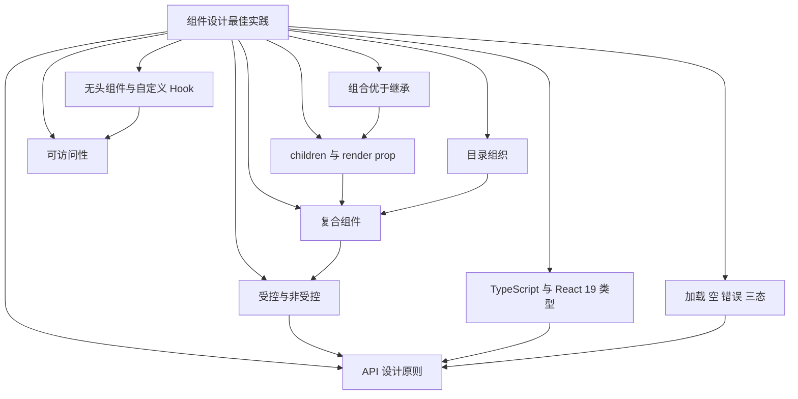
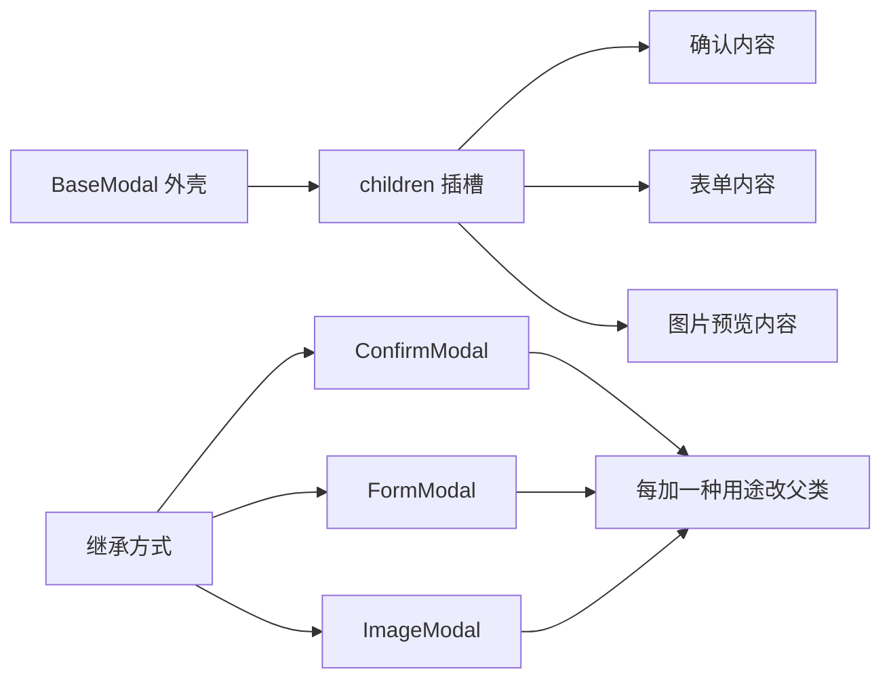
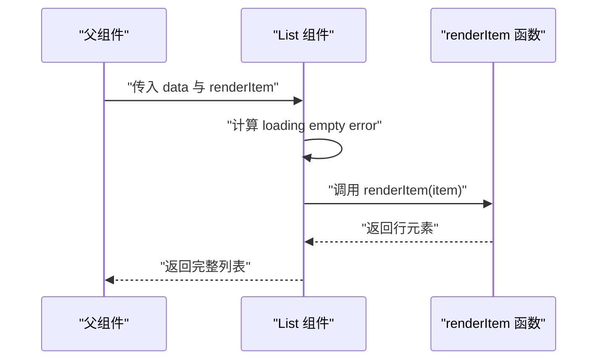
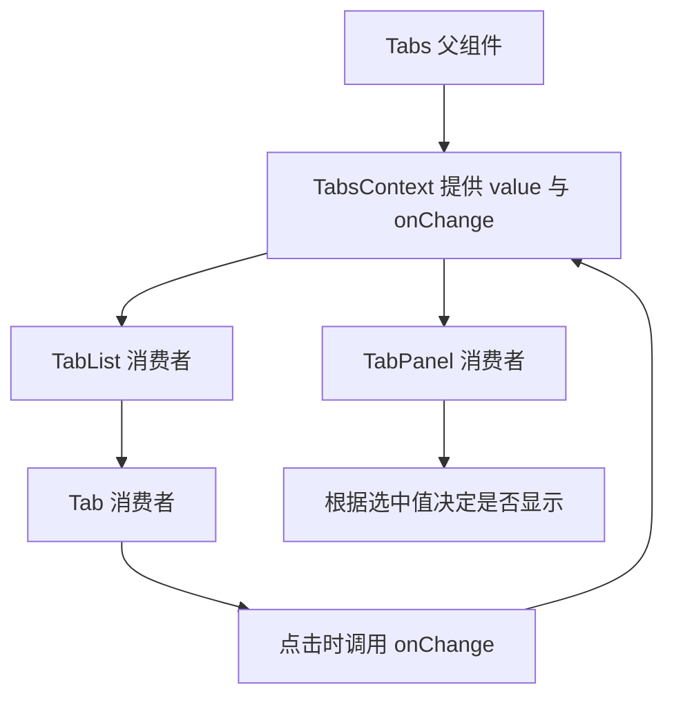
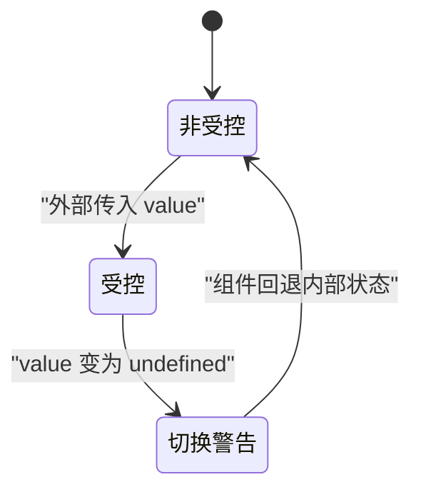
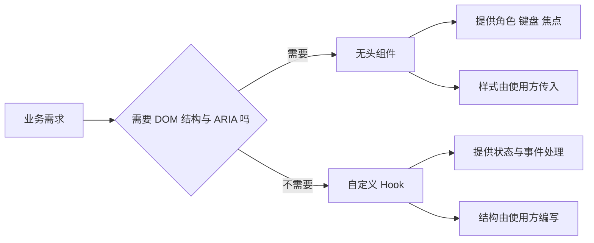
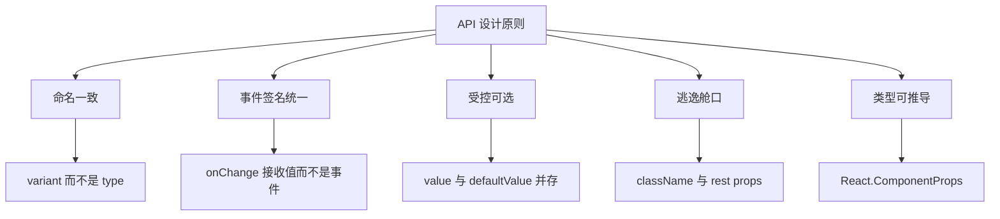
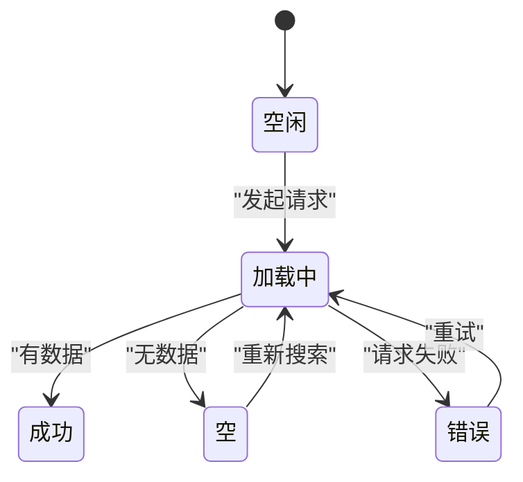
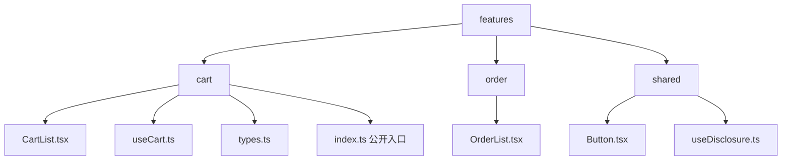

# 组件设计最佳实践：组合优先

!!! abstract "学完这一页你能"
    - 能写出 children、render prop 与复合组件三种组合方案，并说明各自的适用边界。
    - 能判断受控与非受控 API 的选择，并写出同时支持两种用法的组件。
    - 能区分无头组件与自定义 Hook 的职责，按可访问性要求做取舍。
    - 能按 TypeScript 与 React 19 类型写 props，并组织目录与加载、空、错误三态。

## 0. 知识地图



建议先读第 1 节，把组合的基本动作建立起来。然后按顺序读第 2 到第 5 节，它们分别处理渲染权、隐式状态、状态归属与逻辑复用。第 6 到第 10 节是工程化收口，放到真实项目里逐条对照。

!!! note "术语：组合"
    组合是把多个组件通过嵌套、插槽或函数参数拼装成新组件的方式。例子：`<Card><Title /></Card>`。

## 1. 组合优于继承：把 children 当作第一等 API

**先想一个问题**

项目里有一个 `BaseModal`，现在要加确认框、表单和图片预览。做法 A 是继承 `BaseModal`，写 `ConfirmModal`、`FormModal`、`ImageModal`。做法 B 是 `BaseModal` 只提供外壳与关闭逻辑，内容通过 `children` 传入。需求继续增加时，哪种改动面小？

!!! tip "心智模型"
    一句话模型：组件像插座，children 像插头，外壳只负责供电与安全。
    日常类比：收纳盒与分隔板。盒子固定，分隔板按物品自由摆放。
    类比不成立处：children 在父组件重新渲染时可能产生新引用，需要关注渲染边界与状态提升。

!!! note "术语：children"
    children 是 React 元素的一个特殊 prop，表示写在组件标签内部的内容。例子：`<Card>你好</Card>` 中的 `你好`。

**图解**



1. `BaseModal` 只保留遮罩、关闭按钮、焦点管理。
2. `children` 是插槽，调用方决定内部内容。
3. 新增用途时写新内容组件，不改 `BaseModal`。
4. 继承方式把变化压到父类，新增用途要改父类分支。

**一步一步来**

第 1 步：重构前，用 type 分支模拟继承。

```jsx
function BaseModal({ type, children, onClose }) {
  // 父组件承担所有用途的分支
  const title = type === 'confirm' ? '确认操作' : type === 'form' ? '填写表单' : '预览';
  return (
    <div className="mask">
      <h2>{title}</h2>
      {children}
      {/* 关闭按钮由父组件统一提供 */}
      <button onClick={onClose}>关闭</button>
      {/* 确认按钮只对 confirm 出现 */}
      {type === 'confirm' && <button>确定</button>}
    </div>
  );
}
```

**这段代码在做什么**
- `type` 是字符串开关，父组件知道所有用途。
- 每加一种用途，`title` 分支和按钮分支都要改。
- `children` 只承担一部分内容，外壳仍在替调用方做决定。
- 关闭按钮由父组件提供，调用方无法替换位置与样式。

运行结果：传入 `type="confirm"` 时渲染标题、关闭按钮和确定按钮。

第 2 步：重构后，children 作为插槽。

```jsx
function BaseModal({ children, onClose }) {
  // 外壳只负责遮罩与关闭入口
  return (
    <div className="mask">
      {/* 内容全部由调用方决定 */}
      {children}
      {/* 关闭按钮保留为默认能力 */}
      <button onClick={onClose}>关闭</button>
    </div>
  );
}
function ConfirmModal({ onOk }) {
  // 调用方组合标题、正文与操作按钮
  return (
    <BaseModal onClose={onOk}>
      <h2>确认操作</h2>
      <p>删除后无法恢复</p>
      <button onClick={onOk}>确定</button>
    </BaseModal>
  );
}
```

**这段代码在做什么**
- `BaseModal` 不再知道 confirm、form、preview 这些词。
- `ConfirmModal` 通过嵌套把标题、正文、按钮放进 `children`。
- 新增表单弹窗时只写新内容组件，不改 `BaseModal`。
- 关闭按钮仍是默认能力，调用方可以覆盖整个 `children` 来替换布局。

运行结果：`ConfirmModal` 渲染标题、正文、确定按钮和关闭按钮。

**动手验证**

```js
// 文件名：compose-check.mjs
// 依赖：无，Node 20+ 直接运行
// 运行：node compose-check.mjs
import assert from 'node:assert/strict';

// 用对象树模拟 React 元素
function h(type, props, ...children) {
  return { type, props: { ...props, children } };
}

// 继承式：父组件知道所有用途
function baseModalInherit(type) {
  const knownTypes = ['confirm', 'form', 'preview'];
  // 新增用途必须改这里
  assert.ok(knownTypes.includes(type), '父组件必须认识每一种用途');
  return { type: 'modal', variant: type };
}

// 组合式：外壳只认 children
function baseModalCompose(children) {
  return { type: 'modal', children };
}

const inheritResult = baseModalInherit('confirm');
assert.equal(inheritResult.variant, 'confirm');

const composeResult = baseModalCompose([{ type: 'confirmBody' }]);
assert.equal(composeResult.children[0].type, 'confirmBody');

// 组合式新增用途不需要改外壳
const newResult = baseModalCompose([{ type: 'newBody' }]);
assert.equal(newResult.children[0].type, 'newBody');

console.log('继承断言通过：父组件认识 confirm');
console.log('组合断言通过：外壳不关心里面是什么');
console.log('预期输出：两行断言信息，退出码 0');
```

**常见坑**

| 现象 | 原因 | 怎么修 |
| --- | --- | --- |
| 父组件 props 越来越多 | 外壳承担了内容决策 | 把内容决策移回调用方，用 children 传入 |
| 子组件重新渲染导致内容闪烁 | children 引用每次新建 | 把稳定内容提到组件外，或拆分状态边界 |
| 关闭按钮位置无法调整 | 外壳写死了按钮顺序 | 提供 `footer` 插槽或允许覆盖 children |

**用在哪里**

1. 后台管理弹窗系统。
   - 业务背景：权限、表单、确认三类弹窗共用遮罩与关闭逻辑。
   - 知识怎么用：`BaseModal` 只做外壳，三类内容分别组合。
   - 指标衡量：新增弹窗类型时改动的文件数量。
   - 不该用：弹窗只有一种固定内容且不会扩展时。

2. 电商商品卡片。
   - 业务背景：列表、收藏页、搜索结果共用卡片边框与点击区域。
   - 知识怎么用：卡片外壳接收 `children`，价格、标签、按钮由页面传入。
   - 指标衡量：不同页面复用同一外壳的比例。
   - 不该用：卡片布局在每个页面完全不同，且没有共享行为时。

3. 邮件模板编辑器。
   - 业务背景：模板区块需要拖拽排序，每个区块内容不同。
   - 知识怎么用：区块外壳负责拖拽手柄，内容用 children 传入。
   - 指标衡量：新增区块类型时是否只新增一个文件。
   - 不该用：区块之间需要共享大量内部状态且无法通过 props 表达时。

**行业实践**

- React 官方文档 `Passing Props to a Component`：把 JSX 作为 children 传递，调用方决定内部内容。
- Radix Primitives 文档 `Composition`：通过 `asChild` 把行为合并到子元素，减少额外包裹层。
- W3C WAI-ARIA Authoring Practices `Dialog Modal Pattern`：外壳负责焦点与 ARIA，内容由调用方提供。

怎么借鉴到你的项目：先列出现有组件的所有 `type` 或 `variant` 分支，把纯内容分支改成 children。

**小结**
- 外壳管行为，children 管内容。
- 继承把变化压到父类，组合把变化放到调用方。
- 每加一种用途只新增文件、不改外壳，是组合是否到位的检验标准。

## 2. children 与 render prop：把渲染权交回调用方

**先想一个问题**

列表组件需要渲染用户、商品、订单三种数据。每行结构不同，但滚动、空状态、加载状态相同。把三种行结构都写进列表组件，还是让调用方传入一个渲染函数？

!!! tip "心智模型"
    一句话模型：render prop 是调用方递给组件的渲染函数，组件负责何时调用、传什么参数。
    日常类比：餐厅提供餐盘，顾客决定装什么菜。
    类比不成立处：render prop 每次渲染会创建新函数，可能影响依赖引用的优化。

!!! note "术语：render prop"
    render prop 是一个值为函数的 prop，组件在渲染时调用它并传入内部状态。例子：`<List renderItem={(item) => <Row item={item} />} />`。

**图解**



1. 父组件把数据和渲染函数一起传给列表。
2. 列表内部处理滚动、加载、空、错误这些共用逻辑。
3. 列表对每条数据调用 `renderItem`。
4. `renderItem` 返回行元素，列表负责排列。

**一步一步来**

第 1 步：重构前，用 type 分支决定行结构。

```jsx
function List({ type, data }) {
  // 列表组件认识所有业务类型
  return (
    <ul>
      {data.map((item) => {
        if (type === 'user') return <li>{item.name}</li>;
        if (type === 'product') return <li>{item.title} {item.price}</li>;
        if (type === 'order') return <li>{item.id} {item.status}</li>;
        return null;
      })}
    </ul>
  );
}
```

**这段代码在做什么**
- `type` 把行结构写进列表组件。
- 新增业务类型要改列表组件。
- 列表组件同时承担排列与行内容两个职责。
- 行内容无法在调用方复用。

运行结果：传入 `type="user"` 时每行只显示姓名。

第 2 步：重构后，用 render prop 交回渲染权。

```jsx
function List({ data, renderItem, empty }) {
  // 列表只负责排列与空状态
  if (data.length === 0) return empty;
  return (
    <ul>
      {data.map((item, index) => (
        // key 由调用方数据决定，这里用 index 仅作示例
        <li key={index}>{renderItem(item)}</li>
      ))}
    </ul>
  );
}
function UserList({ users }) {
  // 调用方决定一行长什么样
  return <List data={users} empty={<p>暂无用户</p>} renderItem={(u) => <span>{u.name}</span>} />;
}
```

**这段代码在做什么**
- `renderItem` 是函数 prop，列表在 map 中调用它。
- `empty` 是元素 prop，列表在空数据时返回它。
- 新增业务类型只写新的调用方组件。
- `key` 仍由列表负责，调用方只返回行内容。

运行结果：`UserList` 渲染姓名列表；数据为空时渲染“暂无用户”。

**动手验证**

```js
// 文件名：render-prop-check.mjs
// 依赖：无，Node 20+ 直接运行
// 运行：node render-prop-check.mjs
import assert from 'node:assert/strict';

// 模拟列表组件调用 renderItem
function List({ data, renderItem }) {
  return data.map((item, index) => renderItem(item, index));
}

// 调用方决定渲染结果
const users = [{ name: 'Ann' }, { name: 'Ben' }];
const result = List({
  data: users,
  renderItem: (user, index) => `${index}:${user.name}`,
});

assert.deepEqual(result, ['0:Ann', '1:Ben']);

// 空状态由调用方传入
function ListWithEmpty({ data, renderItem, empty }) {
  return data.length === 0 ? empty : data.map(renderItem);
}
assert.equal(ListWithEmpty({ data: [], renderItem: (x) => x, empty: 'EMPTY' }), 'EMPTY');

console.log('render prop 断言通过：', result.join(' | '));
console.log('空状态断言通过：EMPTY');
console.log('预期输出：render prop 断言通过：0:Ann | 1:Ben');
```

**常见坑**

| 现象 | 原因 | 怎么修 |
| --- | --- | --- |
| 内联函数导致子组件重渲染 | 每次渲染创建新函数 | 用 useCallback 包裹，或把函数提到组件外 |
| render prop 嵌套层级过深 | 多个函数 prop 套在一起 | 改成 children 函数或拆成复合组件 |
| 行内容无法拿到 key | 列表把 key 交给调用方 | 提供 `getKey` prop，或让调用方返回带 key 的元素 |

**用在哪里**

1. 电商商品列表的虚拟滚动。
   - 业务背景：商品行结构在不同频道不同，滚动与回收逻辑相同。
   - 知识怎么用：虚拟列表处理滚动，`renderItem` 决定每行内容。
   - 指标衡量：虚拟列表组件被复用的页面数量。
   - 不该用：行结构固定且只有一个频道时。

2. 后台管理的批量导入结果表。
   - 业务背景：成功、失败、警告三类行的操作按钮不同。
   - 知识怎么用：表格负责排序与分页，`renderActions` 决定操作列。
   - 指标衡量：新增行类型时改动的表格代码行数。
   - 不该用：操作列逻辑与表格内部状态强耦合且无法拆开时。

3. 消息中心的通知列表。
   - 业务背景：通知类型多，每类图标与摘要不同。
   - 知识怎么用：列表负责已读未读与分组，`renderItem` 决定展示。
   - 指标衡量：新增通知类型时是否只改调用方。
   - 不该用：通知渲染需要访问列表内部不可暴露的状态时。

**行业实践**

- React 官方文档 `Render Props`：通过值为函数的 prop 共享逻辑。
- TanStack Table 文档 `Headless UI`：表格只提供状态与 API，单元格渲染交给调用方。
- Headless UI 文档 `Render Props`：组件把内部状态通过函数 prop 暴露给调用方。

怎么借鉴到你的项目：找出列表、表格、下拉框中按类型分支的代码，把分支改成 render prop。

**小结**
- render prop 把“怎么渲染”交给调用方。
- 组件保留“何时渲染、传什么参数”的控制权。
- 内联函数要关注引用稳定性，必要时用 useCallback。

## 3. 复合组件：用 Context 共享隐式状态

**先想一个问题**

`Tabs` 需要 `TabList`、`Tab`、`TabPanel` 三个子组件。父组件知道当前选中项，子组件需要读写它。用 props 一层层传，还是用 Context 共享？

!!! tip "心智模型"
    一句话模型：复合组件是同一家族里的组件通过隐式上下文通信，调用方只负责摆放。
    日常类比：遥控器与电视在同一房间内用红外信号通信，不需要每按一次键都接线。
    类比不成立处：Context 的变化会让所有消费者重新渲染，需要拆分状态或加 memo。

!!! note "术语：复合组件"
    复合组件是一组通过父组件 Context 共享状态的组件。例子：`<Tabs><TabList><Tab /></TabList></Tabs>`。

**图解**



1. `Tabs` 创建 Context，保存当前值和修改函数。
2. `TabList` 从 Context 读取值，负责键盘与 ARIA。
3. `Tab` 从 Context 读取自己是否选中，点击时调用修改函数。
4. `TabPanel` 从 Context 读取当前值，决定显示或隐藏。

**一步一步来**

第 1 步：重构前，用 props 层层传递。

```jsx
function Tabs({ value, onChange, tabs, panels }) {
  // 父组件必须知道所有子结构
  return (
    <div>
      <div role="tablist">
        {tabs.map((tab) => (
          <button key={tab.id} onClick={() => onChange(tab.id)}>{tab.label}</button>
        ))}
      </div>
      {panels[value]}
    </div>
  );
}
```

**这段代码在做什么**
- `tabs` 与 `panels` 是数组，结构被父组件写死。
- 调用方无法在 Tab 之间插入自定义元素。
- 新增一个带图标的 Tab 要改 `tabs` 数据格式。
- 键盘与 ARIA 只能在父组件里集中补。

运行结果：点击按钮切换 `panels[value]`。

第 2 步：重构后，用 Context 共享隐式状态。

```jsx
const TabsContext = createContext(null);

function Tabs({ value, onChange, children }) {
  // 父组件只提供状态与修改函数
  return <TabsContext.Provider value={{ value, onChange }}>{children}</TabsContext.Provider>;
}
function Tab({ id, children }) {
  // 子组件从上下文读取选中状态
  const { value, onChange } = useContext(TabsContext);
  const selected = value === id;
  return (
    <button role="tab" aria-selected={selected} onClick={() => onChange(id)}>
      {children}
    </button>
  );
}
function TabPanel({ id, children }) {
  // 面板根据当前值决定是否渲染
  const { value } = useContext(TabsContext);
  return value === id ? <div role="tabpanel">{children}</div> : null;
}
```

**这段代码在做什么**
- `Tabs` 不再知道 Tab 数量与标签内容。
- `Tab` 通过 Context 读取 `value` 与 `onChange`。
- `TabPanel` 通过 Context 判断自己是否显示。
- 调用方可以自由排列 Tab 与 TabPanel 的顺序。

运行结果：点击某个 Tab 后，对应 TabPanel 显示。

**动手验证**

```js
// 文件名：compound-check.mjs
// 依赖：无，Node 20+ 直接运行
// 运行：node compound-check.mjs
import assert from 'node:assert/strict';

// 模拟 Context 容器
function createTabs(initial) {
  let value = initial;
  const listeners = new Set();
  return {
    getValue: () => value,
    setValue: (next) => {
      value = next;
      listeners.forEach((fn) => fn(value));
    },
    subscribe: (fn) => {
      listeners.add(fn);
      return () => listeners.delete(fn);
    },
  };
}

const tabs = createTabs('a');
let panelVisible = null;
// 面板订阅选中值
tabs.subscribe((next) => {
  panelVisible = next === 'a';
});

assert.equal(panelVisible, true);
// 点击 b 后，a 面板应隐藏
tabs.setValue('b');
assert.equal(panelVisible, false);

assert.equal(tabs.getValue(), 'b');
console.log('复合组件状态断言通过：选中值 b');
console.log('面板可见性断言通过：false');
console.log('预期输出：两行断言信息，退出码 0');
```

**常见坑**

| 现象 | 原因 | 怎么修 |
| --- | --- | --- |
| 子组件在父组件外使用时崩溃 | Context 默认值为 null | 提供默认值并在子组件里检查，或抛出明确错误 |
| 任意 Tab 变化导致所有面板重渲染 | Context 值包含大对象 | 拆分 Context，把稳定函数与变化值分开 |
| 调用方无法自定义 Tab 内容 | 子组件写死标签结构 | 让 Tab 接收 children，只保留行为与 ARIA |

**用在哪里**

1. SaaS 后台的标签页工作区。
   - 业务背景：每个标签页包含不同表单，标签可关闭与拖拽。
   - 知识怎么用：Tabs 提供选中状态，Tab 与 Panel 由业务方组合。
   - 指标衡量：新增标签类型时是否新增文件而不改 Tabs。
   - 不该用：标签页只有固定两个且不会扩展时。

2. 设计系统的 Select 组件。
   - 业务背景：Select 需要 Trigger、Listbox、Option 三层结构。
   - 知识怎么用：Select 用 Context 共享展开状态与选中值。
   - 指标衡量：Select 被不同产品复用时改动的代码行数。
   - 不该用：原生 select 能满足需求且不需要自定义样式时。

3. 数据看板的筛选器组。
   - 业务背景：日期、地区、渠道多个筛选器共享“应用筛选”状态。
   - 知识怎么用：FilterGroup 用 Context 收集子筛选器的值。
   - 指标衡量：新增筛选器时是否只新增一个子组件。
   - 不该用：筛选器之间需要独立请求且互不影响时。

**行业实践**

- React 官方文档 `Passing Data Deeply with Context`：用 Context 避免逐层传递 props。
- Radix Primitives 文档 `Tabs`：Tabs、TabsList、TabsTrigger、TabsContent 通过上下文共享状态。
- W3C WAI-ARIA Authoring Practices `Tabs Pattern`：标签页需要角色、选中状态与键盘支持。

怎么借鉴到你的项目：先找一组总是一起出现的组件，把共享状态收进父组件 Context。

**小结**
- 复合组件把“结构摆放”交给调用方。
- Context 适合共享同一家族内的隐式状态。
- Context 值要拆小，避免无关子组件重渲染。

## 4. 受控与非受控：value 与 defaultValue 的边界

**先想一个问题**

输入框组件需要支持两种用法。表单库希望完全控制输入值，简单页面希望组件自己管理输入值。只提供 `value` 会报错，只提供 `defaultValue` 又无法同步。怎么同时支持？

!!! tip "心智模型"
    一句话模型：受控是外部拿方向盘，非受控是组件自己拿方向盘，但可以给一个初始方向。
    日常类比：空调遥控器与空调面板。遥控器控制时面板显示同步；面板控制时遥控器只做初始设置。
    类比不成立处：React 中受控与非受控切换会触发警告，需要明确区分两种模式。

!!! note "术语：受控组件"
    受控组件的值由 React 状态驱动，并通过回调把变化交回外部。例子：`<input value={name} onChange={(e) => setName(e.target.value)} />`。

**图解**



1. 初始只传 `defaultValue` 时，组件进入非受控模式。
2. 外部开始传 `value` 时，组件进入受控模式。
3. 如果 `value` 从具体值变成 `undefined`，React 会警告。
4. 修复方式是始终传值，或明确用 `defaultValue` 保持非受控。

**一步一步来**

第 1 步：重构前，只支持一种模式。

```jsx
function NameInput({ value, onChange }) {
  // 只支持受控，外部不传 value 就无法输入
  return <input value={value} onChange={(e) => onChange(e.target.value)} />;
}
```

**这段代码在做什么**
- `value` 由外部提供，组件自己不保存状态。
- 外部不传 `value` 时输入框显示为空且无法输入。
- 简单页面必须写 `useState` 才能使用。
- 无法支持表单库之外的快速接入。

运行结果：外部传 `value` 时可输入；不传时输入无效。

第 2 步：重构后，同时支持受控与非受控。

```jsx
function NameInput({ value, defaultValue = '', onChange }) {
  // 用内部状态接住非受控场景
  const [inner, setInner] = useState(defaultValue);
  // 判断是否受控：value 不是 undefined
  const controlled = value !== undefined;
  const current = controlled ? value : inner;
  function handleChange(e) {
    const next = e.target.value;
    // 非受控时更新内部状态
    if (!controlled) setInner(next);
    // 两种模式都把变化交给外部
    onChange?.(next);
  }
  return <input value={current} onChange={handleChange} />;
}
```

**这段代码在做什么**
- `controlled` 用 `value !== undefined` 判断模式。
- `current` 在受控时用外部值，非受控时用内部值。
- `handleChange` 在非受控时先更新内部状态。
- `onChange` 始终被调用，外部可以只监听不控制。
- `defaultValue` 只在非受控模式作为初始值。

运行结果：只传 `defaultValue` 时可输入；传 `value` 时由外部控制。

**动手验证**

```js
// 文件名：controlled-check.mjs
// 依赖：无，Node 20+ 直接运行
// 运行：node controlled-check.mjs
import assert from 'node:assert/strict';

// 模拟受控与非受控共存的输入状态机
function createInput({ value, defaultValue = '' }) {
  let inner = defaultValue;
  let controlled = value !== undefined;
  return {
    get current() {
      return controlled ? value : inner;
    },
    change(next) {
      // 非受控时更新内部状态
      if (!controlled) inner = next;
      return this.current;
    },
    setControlled(next) {
      controlled = next !== undefined;
      value = next;
    },
  };
}

const uncontrolled = createInput({ defaultValue: 'a' });
assert.equal(uncontrolled.change('b'), 'b');
assert.equal(uncontrolled.current, 'b');

const controlled = createInput({ value: 'x' });
assert.equal(controlled.change('y'), 'x');

// 从受控切到非受控会保留内部值
controlled.setControlled(undefined);
assert.equal(controlled.current, '');

console.log('非受控断言通过：b');
console.log('受控断言通过：x');
console.log('预期输出：两行断言信息，退出码 0');
```

**常见坑**

| 现象 | 原因 | 怎么修 |
| --- | --- | --- |
| 控制台警告 value 为 undefined | 受控与非受控来回切换 | 始终传 value，或始终用 defaultValue |
| 非受控模式初始值变化无效 | defaultValue 只在首次生效 | 需要同步时改成受控模式 |
| 输入延迟 | 每次输入都触发上层重渲染 | 用非受控加 ref 读取，或在提交时同步 |

**用在哪里**

1. 设计系统的表单输入组件。
   - 业务背景：表单库需要受控，简单搜索框需要非受控。
   - 知识怎么用：同一组件同时支持 value 与 defaultValue。
   - 指标衡量：接入表单库与非表单库时是否需要包装组件。
   - 不该用：组件只在一个受控表单内使用且不需要复用。

2. 后台管理的筛选面板。
   - 业务背景：有些筛选项需要“应用”按钮统一提交，有些即时生效。
   - 知识怎么用：即时生效用受控，应用提交用非受控加 ref。
   - 指标衡量：筛选面板的输入事件触发次数。
   - 不该用：输入值需要参与复杂联动且必须实时同步时。

3. 富文本编辑器的工具栏。
   - 业务背景：加粗状态由编辑器控制，字号选择由用户控制。
   - 知识怎么用：加粗按钮用受控，字号下拉用非受控。
   - 指标衡量：工具栏与编辑器状态不同步的缺陷数量。
   - 不该用：工具栏状态完全由编辑器派生且不需要用户独立输入时。

**行业实践**

- React 官方文档 `Controlled and Uncontrolled Components`：区分受控与非受控，并给出切换警告说明。
- React Hook Form 文档 `register`：通过非受控方式减少输入重渲染。
- Radix Primitives 文档 `Controlled`：组件同时提供 `value` 与 `defaultValue`，并支持回调。

怎么借鉴到你的项目：先统计组件在表单库与普通页面中的用法，决定是否同时支持两种模式。

**小结**
- 受控由外部驱动，非受控由内部状态驱动。
- 同时支持两种模式时，用 `value !== undefined` 判断。
- 模式切换要避免，否则会出现警告与状态丢失。

## 5. 无头组件与自定义 Hook：结构、行为、样式的分工

**先想一个问题**

下拉菜单需要键盘导航、ARIA 与点击外部关闭。团队既想复用逻辑，又想完全控制样式。把逻辑放进组件，还是抽成 Hook？

!!! tip "心智模型"
    一句话模型：无头组件给结构与可访问性，自定义 Hook 给状态与行为，样式留给使用方。
    日常类比：汽车底盘与发动机。底盘决定座椅与安全结构，发动机提供动力，车壳由厂商设计。
    类比不成立处：Hook 不提供 DOM 结构与 ARIA，需要可访问性时必须用无头组件或自己补齐。

!!! note "术语：无头组件"
    无头组件是不提供默认样式的组件，它负责 DOM 结构、状态与可访问性。例子：Radix Primitives 的 DropdownMenu。

**图解**



1. 先判断需求是否包含 DOM 结构与可访问性。
2. 需要结构与 ARIA 时选无头组件。
3. 只需要状态与行为时选自定义 Hook。
4. 无头组件把样式留给使用方，Hook 把结构留给使用方。

**一步一步来**

第 1 步：重构前，逻辑与结构绑死。

```jsx
function Dropdown({ items }) {
  const [open, setOpen] = useState(false);
  // 结构、状态、样式都写在一个组件里
  return (
    <div style={{ border: '1px solid #ccc' }}>
      <button onClick={() => setOpen(!open)}>菜单</button>
      {open && items.map((item) => <div key={item}>{item}</div>)}
    </div>
  );
}
```

**这段代码在做什么**
- 展开状态与 DOM 结构写在同一个组件。
- 样式写死在组件内部，使用方无法替换。
- 没有键盘导航与 ARIA 角色。
- 其他组件想复用展开逻辑只能复制代码。

运行结果：点击“菜单”显示或隐藏项目。

第 2 步：重构后，用 Hook 共享逻辑，用无头组件提供结构。

```jsx
function useDisclosure(initial = false) {
  // 只管理展开状态与切换函数
  const [open, setOpen] = useState(initial);
  const toggle = useCallback(() => setOpen((v) => !v), []);
  const close = useCallback(() => setOpen(false), []);
  return { open, toggle, close };
}
function Menu({ items, renderTrigger }) {
  // 使用 Hook 得到状态，结构由使用方决定
  const { open, toggle, close } = useDisclosure();
  return (
    <div>
      {renderTrigger({ open, toggle })}
      {open && (
        <ul role="menu">
          {items.map((item) => (
            <li key={item} role="menuitem" onClick={close}>{item}</li>
          ))}
        </ul>
      )}
    </div>
  );
}
```

**这段代码在做什么**
- `useDisclosure` 只返回状态与操作函数。
- `Menu` 提供 `role="menu"` 与 `role="menuitem"`。
- `renderTrigger` 让使用方决定按钮外观。
- `close` 在点击菜单项后关闭菜单。
- 样式完全由使用方通过 className 或样式方案传入。

运行结果：点击自定义触发器切换菜单；点击菜单项后关闭。

**动手验证**

```js
// 文件名：headless-check.mjs
// 依赖：无，Node 20+ 直接运行
// 运行：node headless-check.mjs
import assert from 'node:assert/strict';

// 自定义 Hook 的纯逻辑版本
function createDisclosure(initial = false) {
  let open = initial;
  return {
    get open() {
      return open;
    },
    toggle() {
      open = !open;
    },
    close() {
      open = false;
    },
  };
}

const d = createDisclosure();
assert.equal(d.open, false);
d.toggle();
assert.equal(d.open, true);
d.close();
assert.equal(d.open, false);

// 无头组件只关心结构和 ARIA，样式由外部传入
function renderMenu(state, className) {
  return { role: 'menu', className, hidden: !state.open };
}
const node = renderMenu(d, 'my-menu');
assert.equal(node.role, 'menu');
assert.equal(node.className, 'my-menu');
assert.equal(node.hidden, true);

console.log('Hook 状态断言通过：false');
console.log('无头结构断言通过：role=menu className=my-menu');
console.log('预期输出：两行断言信息，退出码 0');
```

**常见坑**

| 现象 | 原因 | 怎么修 |
| --- | --- | --- |
| Hook 返回大对象导致重渲染 | 每次返回新对象 | 拆分返回值，或用 useMemo 稳定引用 |
| 无头组件缺少键盘支持 | 只复制了结构没有行为 | 采用带键盘与 ARIA 的无头库，或自行补齐 |
| 样式覆盖困难 | 组件内部写死 className | 暴露 className 与 data 属性，使用方通过选择器覆盖 |

**用在哪里**

1. 设计系统的下拉菜单。
   - 业务背景：多个产品需要不同外观，但键盘与 ARIA 行为一致。
   - 知识怎么用：无头组件提供菜单结构与键盘，样式由产品传入。
   - 指标衡量：键盘操作缺陷数量与样式定制改动的组件数量。
   - 不该用：只需要一个简单原生 select 时。

2. 视频站点的播放器控制条。
   - 业务背景：播放状态、进度、音量逻辑需要复用，UI 在移动端与桌面端不同。
   - 知识怎么用：自定义 Hook 提供播放状态，UI 组件各自实现。
   - 指标衡量：不同端复用逻辑的代码行数。
   - 不该用：播放器 UI 与浏览器原生控件绑定时。

3. 数据表格的列宽拖拽。
   - 业务背景：拖拽逻辑需要复用到多个表格，表头样式不同。
   - 知识怎么用：Hook 提供拖拽状态与事件，表头由使用方渲染。
   - 指标衡量：新增表格时复用的拖拽代码比例。
   - 不该用：表格库已经提供列宽拖拽且不需要自定义行为时。

**行业实践**

- React 官方文档 `Reusing Logic with Custom Hooks`：自定义 Hook 共享状态逻辑，不共享 UI。
- Radix Primitives 文档 `Accessibility`：无头组件提供 ARIA、键盘与焦点管理。
- TanStack Table 文档 `Headless UI`：表格核心只提供状态与 API，渲染交给使用方。

怎么借鉴到你的项目：先分辨“逻辑复用”与“界面复用”，逻辑抽 Hook，结构加 ARIA 用无头组件。

**小结**
- 无头组件负责结构、状态与可访问性，不负责样式。
- 自定义 Hook 负责状态与行为，不负责结构。
- 可访问性是选择无头组件的主要理由。

## 6. API 设计原则与 TypeScript 类型：命名、事件签名、ref 与泛型

**先想一个问题**

组件库里的 `Button` 有 `onPress`、`onClick`、`handleClick` 三种回调命名。使用方每次都要查文档。怎样让 API 可预测，并用类型提前发现错误？

!!! tip "心智模型"
    一句话模型：API 是组件与使用方之间的合同，命名、签名与类型是合同条款。
    日常类比：电源插头的形状统一后，不同电器可以直接插入。
    类比不成立处：组件 API 需要版本演进，旧合同可能在一段时间内继续生效。

!!! note "术语：API"
    API 是 Application Programming Interface 的缩写，这里指组件的 props、事件与公开方法。例子：`<Button variant="primary" onClick={fn} />`。

**图解**



1. 命名一致让使用方不用查文档。
2. 事件签名统一让回调可以互换。
3. 受控可选让组件适配表单库与普通页面。
4. 逃逸舱口让使用方在遇到边界时仍能定制。
5. 类型可推导让编辑器提前发现错误。

**一步一步来**

第 1 步：重构前，API 混乱且类型宽泛。

```tsx
type ButtonProps = {
  type?: string; // 与 HTML type 冲突
  handleClick?: any; // 回调类型丢失
  rest?: any; // 无法提示其余属性
};
function Button({ type, handleClick, rest }: ButtonProps) {
  // 使用方无法从类型知道有哪些合法值
  return <button className={type} onClick={handleClick} {...rest} />;
}
```

**这段代码在做什么**
- `type` 与原生 button 的 `type` 属性冲突。
- `handleClick` 用 any，编辑器无法提示参数。
- `rest` 作为一个 prop 传递，无法展开原生属性。
- 使用方不知道 `type` 有哪些合法值。

运行结果：传错值时没有类型错误提示。

第 2 步：重构后，命名一致、类型可推导、支持 ref。

```tsx
import type { ComponentProps } from 'react';

// 从原生 button 继承属性，并覆盖 variant
type ButtonProps = ComponentProps<'button'> & {
  variant?: 'primary' | 'ghost';
};

function Button({ variant = 'primary', className, ...rest }: ButtonProps) {
  // rest 包含原生属性与事件
  return <button data-variant={variant} className={className} {...rest} />;
}

// React 19 中 ref 可以作为普通 prop 传入
function Input({ className, ...rest }: ComponentProps<'input'>) {
  return <input className={className} {...rest} />;
}
```

**这段代码在做什么**
- `ComponentProps<'button'>` 带来自 `onClick`、`disabled`、`type` 等原生属性。
- `variant` 是联合类型，传错值会有类型错误。
- `...rest` 把剩余属性交给原生 button。
- React 19 中 `ref` 作为普通 prop 处理，需核对官方文档的升级说明。
- `className` 单独取出，方便与组件内部样式合并。

运行结果：传 `variant="danger"` 时 TypeScript 报错。

**动手验证**

```ts
// 文件名：api-check.mjs
// 依赖：无，Node 20+ 直接运行
// 运行：node api-check.mjs
import assert from 'node:assert/strict';

// 模拟运行时 props 校验
const allowedVariants = new Set(['primary', 'ghost']);
function createButtonProps(input) {
  const { variant = 'primary', ...rest } = input;
  assert.ok(allowedVariants.has(variant), 'variant 必须是 primary 或 ghost');
  // rest 保留原生属性
  return { variant, rest };
}

const ok = createButtonProps({ variant: 'ghost', disabled: true });
assert.equal(ok.variant, 'ghost');
assert.equal(ok.rest.disabled, true);

// 错误值触发断言
assert.throws(() => createButtonProps({ variant: 'danger' }), /variant/);

// 默认值生效
assert.equal(createButtonProps({}).variant, 'primary');

console.log('合法 variant 断言通过：ghost');
console.log('非法 variant 断言通过：抛出错误');
console.log('预期输出：两行断言信息，退出码 0');
```

**常见坑**

| 现象 | 原因 | 怎么修 |
| --- | --- | --- |
| 使用方传 onClick 无效 | 组件内部没有展开 rest | 把剩余属性展开到根元素 |
| 类型提示不出现 | props 类型用了 any | 用 ComponentProps 继承原生元素类型 |
| ref 指向错误 | React 18 需要 forwardRef | 核对 React 19 文档，ref 可作为 prop |

**用在哪里**

1. 设计系统的按钮与输入框。
   - 业务背景：多个产品线共用组件，命名与类型需要统一。
   - 知识怎么用：用 ComponentProps 继承原生属性，variant 用联合类型。
   - 指标衡量：使用方因 props 命名问题提交的缺陷数量。
   - 不该用：组件只在一个页面内使用且不会跨团队复用时。

2. 后台管理的表格操作列。
   - 业务背景：操作按钮需要透传 disabled、title、aria-label。
   - 知识怎么用：展开 rest 属性，保留原生可访问性属性。
   - 指标衡量：操作按钮的可访问性检查通过率。
   - 不该用：操作按钮是纯图标且不需要透传属性时。

3. 多端复用表单组件。
   - 业务背景：Web 与移动端 Web 共用输入组件，事件签名一致。
   - 知识怎么用：onChange 统一接收值，类型用泛型约束。
   - 指标衡量：跨端替换组件时需要改动的调用点数量。
   - 不该用：两端原生事件差异无法用同一签名表达时。

**行业实践**

- React 官方文档 `TypeScript`：使用 `ComponentProps` 继承原生元素属性。
- React 19 升级指南：关于 ref 作为 prop 的说明，需核对官方文档中“ref as a prop”的具体类型。
- Radix Primitives 文档 `Composition`：通过 asChild 与 rest props 把行为与属性交给子元素。

怎么借鉴到你的项目：先统一事件命名，再用 `ComponentProps` 替换手写 props 类型。

**小结**
- 命名一致、事件签名统一、类型可推导是 API 的三条底线。
- `ComponentProps` 让组件继承原生属性并保留类型提示。
- React 19 的 ref 用法需核对官方升级文档。

## 7. 可访问性与三态渲染：键盘、焦点、ARIA、加载空错误

**先想一个问题**

一个异步搜索框有加载中、无结果、请求失败三种状态。只写 `data.length === 0` 会把加载中误判成空。键盘用户还需要知道当前状态。怎样把状态与可访问性一起设计？

!!! tip "心智模型"
    一句话模型：三态是一个显式状态机，可访问性是状态机对外播报的语音。
    日常类比：电梯显示屏显示上行、下行、故障，乘客不看电梯内部也知道状态。
    类比不成立处：屏幕阅读器需要显式 ARIA 属性，不会自动读取所有视觉变化。

!!! note "术语：ARIA"
    ARIA 是 Accessible Rich Internet Applications 的缩写，是一组给辅助技术描述界面角色与状态的属性。例子：`aria-expanded="true"`。

**图解**



1. 初始为空闲，等待用户操作。
2. 发起请求进入加载中。
3. 有数据进入成功，无数据进入空，失败进入错误。
4. 错误与空状态都可以回到加载中重试或重新搜索。

**一步一步来**

第 1 步：重构前，用布尔值判断状态。

```jsx
function SearchList({ data, loading }) {
  // 只判断 loading 与长度，错误没有位置
  if (loading) return <p>加载中</p>;
  if (data.length === 0) return <p>暂无数据</p>;
  return <ul>{data.map((item) => <li key={item.id}>{item.name}</li>)}</ul>;
}
```

**这段代码在做什么**
- 只有加载与空两个分支。
- 请求失败时 `data` 可能仍是空数组，显示“暂无数据”。
- 没有向辅助技术播报状态变化。
- 重试入口不存在。

运行结果：加载中显示“加载中”；空数据显示“暂无数据”；失败也显示“暂无数据”。

第 2 步：重构后，用联合类型表达三态并补齐 ARIA。

```tsx
type Status =
  | { type: 'loading' }
  | { type: 'empty' }
  | { type: 'error'; message: string }
  | { type: 'success'; items: { id: string; name: string }[] };

function SearchList({ status, onRetry }: { status: Status; onRetry: () => void }) {
  // 用 role status 播报加载与空状态
  if (status.type === 'loading') return <p role="status">加载中</p>;
  if (status.type === 'empty') return <p role="status">暂无结果</p>;
  if (status.type === 'error') {
    // 错误状态提供重试按钮
    return (
      <div role="alert">
        <p>{status.message}</p>
        <button onClick={onRetry}>重试</button>
      </div>
    );
  }
  return (
    <ul aria-label="搜索结果">
      {status.items.map((item) => <li key={item.id}>{item.name}</li>)}
    </ul>
  );
}
```

**这段代码在做什么**
- `Status` 是判别联合，每个分支携带自己的数据。
- 加载与空状态用 `role="status"` 播报。
- 错误状态用 `role="alert"` 并附带重试按钮。
- 成功状态渲染列表并提供 `aria-label`。
- 新增状态时 TypeScript 会提示未覆盖的分支。

运行结果：加载、空、错误、成功四种界面按状态渲染。

**动手验证**

```js
// 文件名：states-check.mjs
// 依赖：无，Node 20+ 直接运行
// 运行：node states-check.mjs
import assert from 'node:assert/strict';

// 用判别联合模拟状态机
function render(status) {
  if (status.type === 'loading') return { role: 'status', text: '加载中' };
  if (status.type === 'empty') return { role: 'status', text: '暂无结果' };
  if (status.type === 'error') return { role: 'alert', text: status.message };
  return { role: 'list', count: status.items.length };
}

assert.equal(render({ type: 'loading' }).role, 'status');
assert.equal(render({ type: 'empty' }).text, '暂无结果');
assert.equal(render({ type: 'error', message: '超时' }).role, 'alert');
assert.equal(render({ type: 'success', items: [1, 2] }).count, 2);

// 确保空状态不会被误判为成功
const empty = render({ type: 'empty' });
assert.notEqual(empty.role, 'list');

console.log('加载状态断言通过：status');
console.log('错误状态断言通过：alert');
console.log('预期输出：两行断言信息，退出码 0');
```

**常见坑**

| 现象 | 原因 | 怎么修 |
| --- | --- | --- |
| 加载中被显示成暂无数据 | 用长度判断状态 | 用显式状态字段区分 loading 与 empty |
| 屏幕阅读器不播报错误 | 缺少 role alert | 错误提示加 `role="alert"` |
| 键盘无法关闭弹窗 | 没有处理 Escape | 监听键盘事件并把焦点还给触发元素 |

**用在哪里**

1. 电商搜索页。
   - 业务背景：搜索有加载、无结果、网络失败、成功四态。
   - 知识怎么用：用联合类型驱动渲染，错误提供重试。
   - 指标衡量：失败后用户重试率与空状态误报缺陷数量。
   - 不该用：数据同步返回且没有失败可能时。

2. 后台管理的批量导入。
   - 业务背景：上传、解析、校验、完成都有不同状态。
   - 知识怎么用：每个阶段用独立状态分支并播报进度。
   - 指标衡量：导入失败时用户可恢复操作的比例。
   - 不该用：导入是一次性本地文件解析且不会失败时。

3. 数据看板的图表加载。
   - 业务背景：图表需要骨架屏、空数据、错误占位。
   - 知识怎么用：状态机统一驱动骨架、空、错误组件。
   - 指标衡量：页面布局在状态切换时的偏移量。
   - 不该用：图表数据已经由服务端渲染完成且无加载过程时。

**行业实践**

- W3C WAI-ARIA Authoring Practices：状态消息使用 `role="status"`，错误提示使用 `role="alert"`。
- React 官方文档 `Accessibility`：推荐使用语义化 HTML，再补 ARIA。
- Radix Primitives 文档 `Accessibility`：无头组件内置键盘与焦点管理，减少手动补齐。

怎么借鉴到你的项目：把所有异步区域的状态从布尔值改成判别联合，并补上对应 role。

**小结**
- 三态要用显式状态机表达，避免用长度推断。
- 可访问性需要语义化 HTML 与 ARIA 属性配合。
- 错误状态必须提供可恢复操作，例如重试。

## 8. 目录组织与演进：功能共置、公开入口、重构前后对照

**先想一个问题**

项目从 20 个组件增长到 200 个。所有组件放在 `components/`，所有 Hook 放在 `hooks/`。改一个购物车功能要跨三个目录找文件。怎样组织目录，让改动集中在一处？

!!! tip "心智模型"
    一句话模型：目录按功能切片，每个切片内部共置组件、Hook、类型与测试，对外只暴露入口。
    日常类比：医院按科室划分，患者在一个科室完成检查与治疗，不需要跑遍全楼。
    类比不成立处：跨功能的通用组件需要单独放在共享层，并明确依赖方向。

!!! note "术语：共置"
    共置是把经常一起修改的文件放在同一目录。例子：`features/cart/` 下放 `CartList.tsx`、`useCart.ts`、`types.ts`。

**图解**



1. 按业务功能建 `features` 目录。
2. 每个功能内部共置组件、Hook、类型与测试。
3. `index.ts` 只导出外部需要的成员。
4. 跨功能复用的组件放入 `shared`，依赖方向从功能指向共享。

**一步一步来**

第 1 步：重构前，按文件类型分目录。

```text
src/
  components/
    CartList.tsx
    OrderList.tsx
    Button.tsx
  hooks/
    useCart.ts
    useOrder.ts
  types/
    cart.ts
    order.ts
```

**这段代码在做什么**
- 一个购物车功能分散在三个目录。
- 改购物车要同时打开组件、Hook、类型目录。
- 删除购物车功能需要跨目录清理。
- 公开边界不清晰，外部可以引用内部文件。

运行结果：搜索文件时需要在多个目录之间切换。

第 2 步：重构后，按功能共置并暴露入口。

```text
src/
  features/
    cart/
      CartList.tsx
      CartItem.tsx
      useCart.ts
      types.ts
      index.ts
    order/
      OrderList.tsx
      useOrder.ts
      index.ts
  shared/
    Button.tsx
    useDisclosure.ts
```

```ts
// features/cart/index.ts
// 只导出外部需要的成员
export { CartList } from './CartList';
export type { CartItem } from './types';
// 内部实现 useCart 不导出
```

**这段代码在做什么**
- 购物车相关文件放在 `features/cart`。
- `index.ts` 控制公开边界，外部只从入口导入。
- `shared` 存放跨功能组件，依赖方向清晰。
- 删除功能时直接删除整个目录。
- 测试文件与实现放在同一目录，移动功能时一起移动。

运行结果：修改购物车只在一个目录内进行。

**动手验证**

```js
// 文件名：structure-check.mjs
// 依赖：无，Node 20+ 直接运行
// 运行：node structure-check.mjs
import assert from 'node:assert/strict';

// 模拟目录树与公开入口
const project = {
  'features/cart/CartList.tsx': 'component',
  'features/cart/useCart.ts': 'hook',
  'features/cart/index.ts': 'entry',
  'features/order/OrderList.tsx': 'component',
  'shared/Button.tsx': 'shared',
};

// 检查每个功能都有入口文件
const features = ['cart', 'order'];
for (const name of features) {
  assert.ok(project[`features/${name}/index.ts`], `${name} 缺少公开入口`);
}

// 检查共享层不反向依赖功能层
const sharedFiles = Object.keys(project).filter((p) => p.startsWith('shared/'));
assert.equal(sharedFiles.length, 1);
assert.ok(!sharedFiles.some((p) => p.includes('features')), 'shared 不能依赖 features');

console.log('入口文件断言通过：cart 与 order');
console.log('依赖方向断言通过：shared 不依赖 features');
console.log('预期输出：两行断言信息，退出码 0');
```

**常见坑**

| 现象 | 原因 | 怎么修 |
| --- | --- | --- |
| 循环依赖 | 功能之间互相导入内部文件 | 只从 index 导入，必要时把共享逻辑下沉 |
| 删除功能后残留文件 | 文件按类型分散 | 按功能共置，删除目录即可 |
| 入口导出过多 | index 导出内部实现 | 只导出外部需要的组件与类型 |

**用在哪里**

1. 中后台系统的权限模块。
   - 业务背景：权限包含角色、菜单、按钮权限与请求封装。
   - 知识怎么用：全部放在 `features/permission`，入口导出校验函数与组件。
   - 指标衡量：新增权限类型时改动的目录数量。
   - 不该用：权限逻辑只有几行且被全局使用时，可放在 shared。

2. 电商购物车与结算。
   - 业务背景：购物车、优惠券、结算流程相互关联但边界清晰。
   - 知识怎么用：每个功能独立目录，通过入口暴露必要的 Hook。
   - 指标衡量：结算流程改动时涉及的目录数量。
   - 不该用：结算与购物车共享大量状态且无法拆分时，可先保持一个功能目录。

3. 多产品共用组件库。
   - 业务背景：基础组件被多个产品依赖，业务组件只在一个产品内。
   - 知识怎么用：基础组件放 shared，业务组件放各自 features。
   - 指标衡量：基础组件被跨产品引用的次数。
   - 不该用：组件尚未稳定且只有单个产品使用时，先留在功能目录。

**行业实践**

- React 官方文档 `Thinking in React`：按 UI 层级与状态归属拆分组件。
- Feature-Sliced Design 文档：按功能切片组织代码，并规定层级依赖方向。
- Storybook 文档 `Component-Driven Development`：组件与故事共置，便于独立开发与测试。

怎么借鉴到你的项目：先把一个高频改动的功能移入独立目录，并补上 index 入口。

**小结**
- 按功能共置，修改集中在一个目录。
- 公开入口控制依赖方向，避免循环依赖。
- 共享层只放跨功能复用的内容。

## 应用地图

| 场景 | 用到本页哪个知识点 | 典型技术选型 | 注意事项 |
| --- | --- | --- | --- |
| 弹窗系统 | 组合优于继承、children | React Portal、焦点管理库 | 关闭按钮与焦点归还由外壳负责 |
| 列表与表格 | render prop、无头组件 | TanStack Table、虚拟滚动库 | key 与行渲染稳定引用 |
| 标签页工作区 | 复合组件、Context | Radix Tabs、React Context | Context 值拆小，避免无关重渲染 |
| 表单输入 | 受控与非受控、TS 类型 | React Hook Form、ComponentProps | 模式切换会产生警告 |
| 下拉菜单 | 无头组件、可访问性 | Radix DropdownMenu、WAI-ARIA | 键盘与 ARIA 由组件库提供 |
| 异步搜索 | 三态渲染、可访问性 | 状态机、role status 与 alert | 加载与空状态必须分开 |
| 组件库目录 | 功能共置、公开入口 | Feature-Sliced Design、monorepo | 共享层不能反向依赖功能层 |
| 设计系统按钮 | API 设计原则、TS 类型 | ComponentProps、variant 联合类型 | 透传 rest 属性保留原生能力 |

## 动手作业

目标：把一个 `type` 分支驱动的列表组件重构成组合优先的组件，并补齐三态与可访问性。

步骤：
1. 找一个现有列表组件，记录它支持的所有 `type` 或 `variant` 分支。
2. 新建 `features/demo` 目录，放入 `List.tsx`、`useList.ts`、`types.ts`、`index.ts`。
3. 把行内容改成 `renderItem`，把空状态改成 `empty` 元素 prop，把错误状态改成 `error` 元素 prop。
4. 用判别联合定义 `Status`，覆盖加载、空、错误、成功四种状态。
5. 给加载与空状态加 `role="status"`，给错误加 `role="alert"` 和重试按钮。
6. 写一个 Node 脚本，用 `node:assert` 检查四种状态渲染结果与公开入口导出。

验收标准：
- 新增一种行类型时只新增调用方文件，不改 `List.tsx`。
- `Status` 联合类型在 TypeScript 中能提示未覆盖分支。
- 加载中不会被显示为“暂无数据”。
- 错误状态有可聚焦的重试按钮。
- `index.ts` 只导出 `List` 与 `Status` 类型。
- Node 脚本运行退出码为 0，并打印四种状态断言通过信息。

## 综合对比

| 维度 | children | render prop | 复合组件 | 无头组件 | 自定义 Hook |
| --- | --- | --- | --- | --- | --- |
| 控制权 | 调用方控制内容 | 调用方控制渲染函数 | 调用方控制结构，父组件控制状态 | 使用方控制样式 | 使用方控制结构 |
| 是否提供 DOM 结构 | 由调用方提供 | 由调用方提供 | 组件提供结构 | 组件提供结构与 ARIA | 不提供 |
| 是否提供可访问性 | 不提供 | 不提供 | 部分提供 | 提供 | 不提供 |
| 适用场景 | 外壳与插槽 | 列表行渲染 | Tabs、Select、Menu | 设计系统基础组件 | 状态复用 |
| 主要风险 | 引用变化导致重渲染 | 内联函数引用变化 | Context 范围过大 | 样式覆盖成本 | 返回值不稳定 |
| 类型复杂度 | 低 | 中 | 中 | 中到高 | 中 |
| 与受控 API 的关系 | 无关 | 无关 | 常配合受控 | 常同时提供 value 与 defaultValue | 可返回受控状态机 |

## 深入阅读与参考

!!! tip "怎么用这些资料"
    先读「官方文档与规范」建立准确的概念，再读「源码与示例」核对细节，最后用「教程、书籍与视频」换一种讲法加深理解。每条都写明了读哪一节、带着什么问题读。

### 官方文档与规范

| 资源 | 为什么读 | 怎么读 |
|---|---|---|
| [Children](https://react.dev/reference/react/Children) | 讲清 children 的操作方式与边界，是组合优先的官方依据。 | 读 Children 各方法与示例，想清哪些场景其实不该用 Children，再重构一处嵌套传参。 |
| [Passing Data Deeply with Context](https://react.dev/learn/passing-data-deeply-with-context) | 复合组件共享隐式状态的官方入门，含 Context 取舍建议。 | 重点读“Before you use Context”与示例，改造成一个 Tab/Accordion 复合组件。 |
| [Scaling Up with Reducer and Context](https://react.dev/learn/scaling-up-with-reducer-and-context) | 展示 Context 与 reducer 协作，适合复合组件的状态下沉。 | 读 Context 与 reducer 组合的一节，把组件内 useState 拆分到 Provider 与 Hook。 |
| [Render and Commit](https://react.dev/learn/render-and-commit) | 理解渲染时机，才能判断 children 与 render prop 的求值差异。 | 读渲染触发与提交两节，带着“props 何时求值”复看自己的 render prop 写法。 |
| [Using TypeScript](https://react.dev/learn/typescript) | 官方 TS 用法，覆盖泛型组件、事件与 ref 类型等本页重点。 | 读组件 props、Hooks 与常用类型小节，给一个复合组件补上完整类型。 |
| [React 19 发布博客](https://react.dev/blog/2024/12/05/react-19) | ref 作为 prop、use 等新特性直接影响组件 API 设计。 | 跑通 ref 作 prop 的示例，整理与 18 的差异表，重写一个 forwardRef 组件。 |
| [React API 参考](https://react.dev/reference/react) | 无头组件依赖 Hooks 细节，遇到疑问先查 Caveats。 | 写自定义 Hook 时对照 Caveats 与 Troubleshooting，逐条检查依赖与清理逻辑。 |

### 源码与示例

| 资源 | 为什么读 | 怎么读 |
|---|---|---|
| [Solid](https://github.com/solidjs/solid) | 细粒度响应式源码，帮助理解行为与结构分离的另一种可能。 | 读 README 与 packages/solid，追问状态与视图如何解耦，再对照自己的 Hook 设计。 |

### 教程、书籍与视频

| 资源 | 为什么读 | 怎么读 |
|---|---|---|
| [React TypeScript Cheatsheet](https://react-typescript-cheatsheet.netlify.app/) | 组件、Hooks、事件的 TS 写法速查，落地快。 | 按组件与 Hooks 章节逐项对照项目代码，统一事件签名与 ref 转发类型。 |
| [Effective TypeScript（第 2 版）](https://effectivetypescript.com/) | 每条建议对应一次小重构，改善公开 API 的类型表达。 | 挑联合类型、可选 props 相关条目，在自己组件里各做一处重构并跑类型检查。 |

## 自测题

??? question "组合优于继承在 React 中主要解决什么问题"
    - 继承把变化压到父类，新增用途要改父类。
    - 组合把内容决策交给调用方，新增用途只写新组件。
    - children 是常用插槽，外壳只保留行为与结构。
    - 检验标准是新增用途时是否不改外壳。

??? question "children 与 render prop 的区别是什么"
    - children 是元素或元素数组，调用方直接写 JSX。
    - render prop 是函数，组件在渲染时调用并传入内部状态。
    - 需要把内部状态交给使用方时用 render prop。
    - 只是内容插槽时用 children，代码更短。

??? question "复合组件为什么常用 Context"
    - 子组件需要读取父组件的选中值或展开状态。
    - 逐层传 props 会让中间组件承担无关参数。
    - Context 让同一家族组件隐式通信。
    - Context 值要拆小，避免无关消费者重渲染。

??? question "受控与非受控如何同时支持"
    - 用 `value !== undefined` 判断是否受控。
    - 非受控用内部状态，初始值来自 defaultValue。
    - 变化时受控调用 onChange，非受控先更新内部状态。
    - 避免在受控与非受控之间来回切换。

??? question "无头组件与自定义 Hook 如何取舍"
    - 需要 DOM 结构、键盘与 ARIA 时选无头组件。
    - 只需要状态与行为时选自定义 Hook。
    - 无头组件把样式交给使用方。
    - Hook 把结构交给使用方，不提供可访问性。

??? question "组件 API 设计的三条底线是什么"
    - 命名一致，例如统一用 variant 而不是多个近义词。
    - 事件签名统一，例如 onChange 接收值而不是事件。
    - 类型可推导，用 ComponentProps 继承原生元素属性。
    - 提供逃逸舱口，例如 className 与 rest props。

??? question "加载、空、错误三态为什么不能用长度判断"
    - 加载中数据长度也是 0，会被误判为空。
    - 请求失败时数据可能仍是空数组。
    - 用判别联合显式表达状态，渲染分支清晰。
    - 错误状态要提供重试，并用 role alert 播报。

??? question "目录组织为什么推荐按功能共置"
    - 一个功能的组件、Hook、类型、测试放在同一目录。
    - 修改与删除集中在一个目录，减少跨目录搜索。
    - index 入口控制公开边界，避免外部引用内部文件。
    - 共享层只放跨功能内容，依赖方向从功能指向共享。

## 延伸阅读

- React 官方文档：`Passing Props to a Component`
- React 官方文档：`Render Props`
- React 官方文档：`Passing Data Deeply with Context`
- React 官方文档：`Reusing Logic with Custom Hooks`
- React 官方文档：`Controlled and Uncontrolled Components`
- React 官方文档：`Accessibility`
- React 官方文档：`TypeScript`
- React 官方文档：`React 19 Upgrade Guide`
- W3C WAI-ARIA Authoring Practices：`Tabs Pattern`
- W3C WAI-ARIA Authoring Practices：`Dialog Modal Pattern`
- Radix Primitives 文档：`Composition`
- Radix Primitives 文档：`Accessibility`
- TanStack Table 文档：`Headless UI`
- Headless UI 文档：`Render Props`
- Feature-Sliced Design 文档：`Layers`
