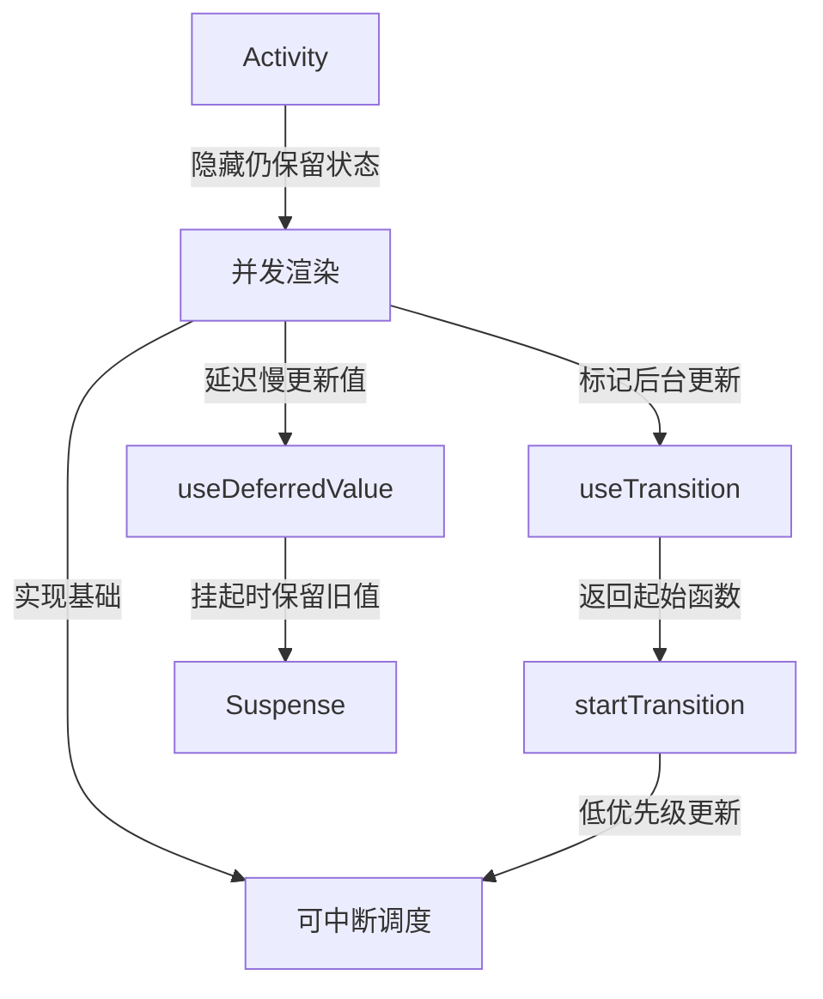
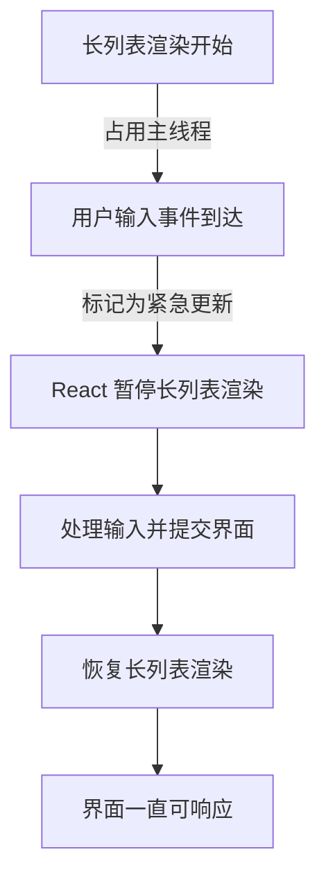
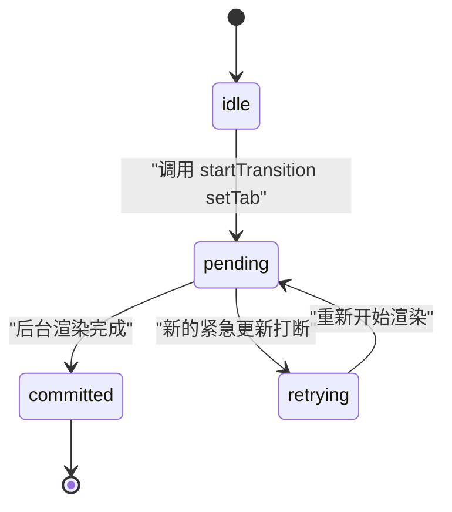
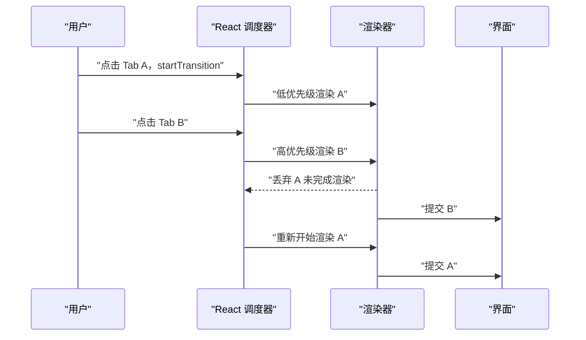
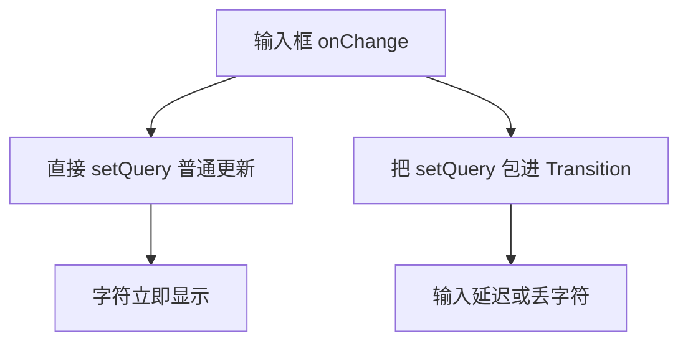
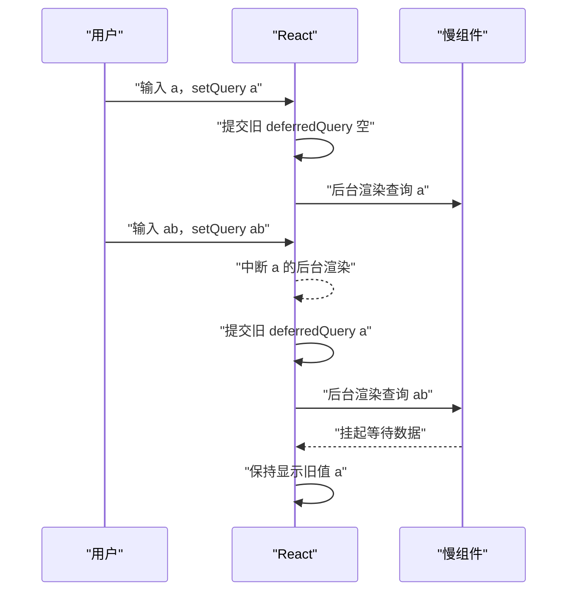
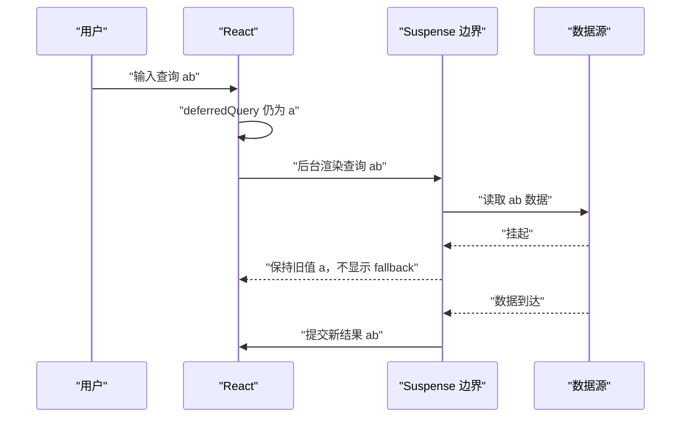
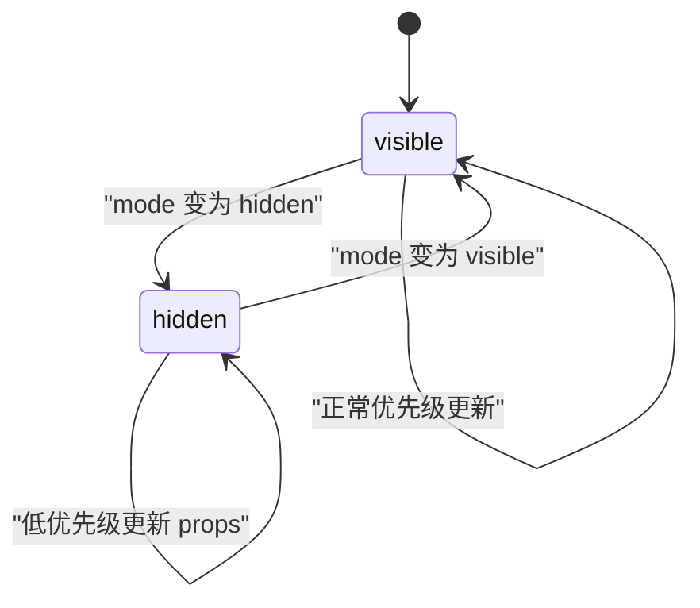
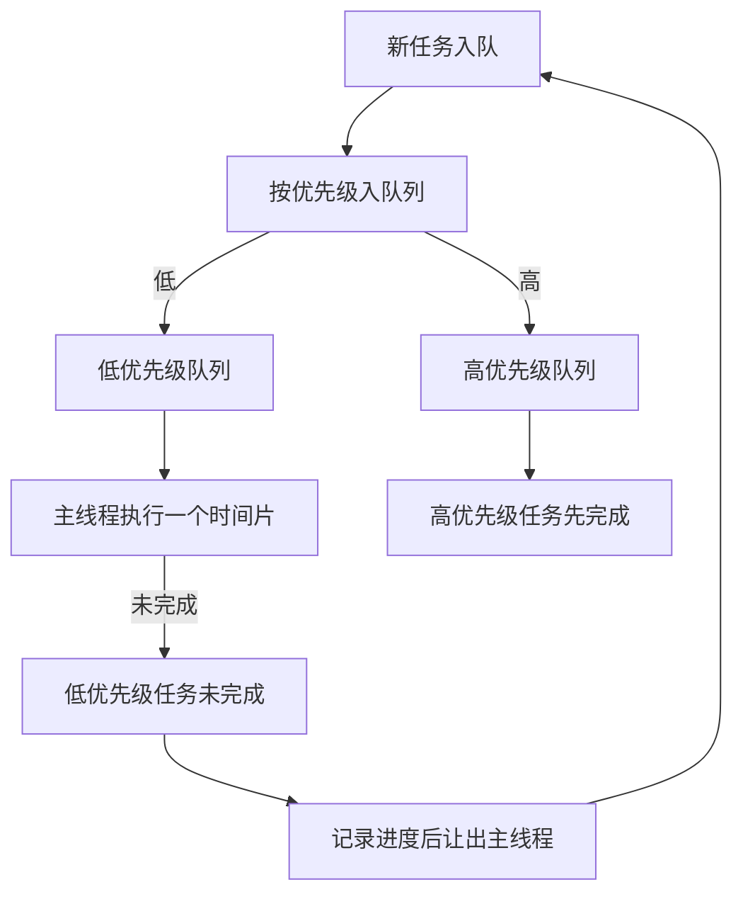

# 并发特性：Transition、useDeferredValue、Suspense 与 Activity

!!! abstract "学完这一页你能"
    - 能解释并发渲染是主线程上的可中断渲染，并能说出它与多线程的区别。
    - 能在组件中正确使用 `useTransition` 与 `startTransition`，并用 `isPending` 给出界面反馈。
    - 能使用 `useDeferredValue` 延迟慢组件更新，并说明 React 19 `initialValue` 参数的作用。
    - 能使用 `Activity` 隐藏组件并保留状态，能说明 `visible` 与 `hidden` 对 effects、更新优先级的影响。

## 0. 知识地图



建议先读第 1 节，理解“可中断的渲染”到底指什么。再读第 2 到第 5 节，掌握 `useTransition` 与 `useDeferredValue` 的语义。最后读第 6、7 节，把 Suspense 与 Activity 作为两个应用场景串起来；第 8 节可以穿插到中间，帮助理解调度器的简化原理。

## 1. 并发渲染不是多线程

**先想一个问题**：用户在搜索框输入时，如果同一个页面正在渲染一个包含 5000 行的表格，输入每个字符都可能卡住。为什么 React 不能一边渲染表格、一边处理输入？

**心智模型**

!!! tip "心智模型"
    一句话模型：并发渲染是“可以被中途暂停、稍后继续或丢弃重来的渲染”，不是“多个 CPU 同时渲染”。
    日常类比：你正在写一份长报告，接到紧急电话时先暂停报告，挂断电话后再继续写。
    类比在哪里不成立：React 没有两个同时运行的线程；它始终使用一个主线程，只是在任务之间切换优先级。

**图解**



1. 长列表渲染先进入主线程，但它的优先级是后台级。
2. 用户输入事件到达，React 把它标记为紧急更新。
3. React 暂停尚未提交的长列表渲染，先处理输入。
4. 输入提交到界面后，如果仍有时间，再恢复长列表渲染。
5. 整个过程只有一个主线程，所以界面响应来自优先级切换，不是并行执行。

**一步一步来**

这一步用 Node 展示一个简化模型：不可中断的长任务会阻塞后续任务，可中断版本会先释放主线程。

```javascript
// 目录：concurrent-basic/blocking-vs-yielding.js
function blockingLoop(times) {
  const start = Date.now()
  let count = 0
  for (let i = 0; i < times; i++) count += i // 不可中断长循环
  return Date.now() - start
}

function yieldingLoop(times, slice) {
  return new Promise((resolve) => {
    let i = 0
    function step() {
      const end = i + slice
      while (i < times && i < end) i++ // 每次只做一小片
      if (i < times) setImmediate(step) // 让出主线程再继续
      else resolve()
    }
    step()
  })
}

blockingLoop(5_000_000)
console.log('阻塞版本执行完，后续任务才运行')
await yieldingLoop(5_000_000, 1_000_000)
console.log('让出版本每片之间允许其他任务先运行')
```

**这段代码在做什么**

- `blockingLoop` 用一个从 0 加到 500 万的循环占用主线程，后面的代码无法提前运行。
- `yieldingLoop` 把同样规模的任务拆成 5 片，每片之间调用 `setImmediate` 让出主线程。
- 让出主线程的动作模拟 React 在并发渲染中暂停低优先级任务的能力。
- 需要注意：这不是 React 源码实现，只是教学用简化模型。

**运行结果**

- 先输出“阻塞版本执行完，后续任务才运行”。
- 再输出“让出版本每片之间允许其他任务先运行”。

**动手验证**

```javascript
// 目录：concurrent-basic/verify.js
import assert from 'node:assert'
import { setImmediate as setImmediatePromise } from 'node:timers/promises'

let urgentRan = false
let backgroundRan = false

async function scheduleWork() {
  setImmediate(() => {
    backgroundRan = true
  })
  await setImmediatePromise()
  urgentRan = true
}

await scheduleWork()
assert.strictEqual(urgentRan, true)
assert.strictEqual(backgroundRan, false)
console.log('预期输出：urgentRan=true，backgroundRan=false，证明主线程先处理紧急任务')
```

**这个验证脚本在做什么**

- 第一个 `setImmediate` 模拟后台任务，第二个 `await setImmediatePromise()` 模拟紧急任务。
- 运行顺序保证最后设置的紧急任务先完成。
- 断言验证：`urgentRan` 为 `true`，`backgroundRan` 仍为 `false`。
- 这个顺序验证了优先级调度在单线程上的核心行为：紧急任务可以插队。

**常见坑**

| 现象 | 原因 | 怎么修 |
|---|---|---|
| 把并发渲染理解成两个线程同时更新 DOM | React 19 仍是单线程调度，只是可中断 | 用“可中断”而不是“并行”描述并发渲染 |
| 长任务依然卡住界面 | 没有把长任务标记为可中断的后台更新 | 对慢更新使用 `startTransition` 或 `useDeferredValue` |
| 在手写模型里忘记让出主线程 | 循环中没有 `setImmediate` 或类似机制 | 每个时间片结束调用让出函数 |

**用在哪里**

- 电商商品列表的虚拟滚动
  - 业务背景：商品列表一次渲染大量 DOM，搜索或滚动时要保持输入和滚动顺畅。
  - 这一节的知识怎么用：把列表更新视为可中断渲染，让输入事件优先提交。
  - 用什么指标衡量收益：输入到界面响应的延迟、滚动帧率、长任务数量。
  - 什么时候不该用：如果列表只有几十行，不需要引入优先级调度，直接同步渲染即可。
- 后台管理的批量导入
  - 业务背景：导入大量数据时，进度条和取消按钮不能卡住。
  - 这一节的知识怎么用：导入状态更新可以拆片或标记为后台更新，取消操作保持紧急。
  - 用什么指标衡量收益：取消按钮点击到生效的时间、导入期间主线程阻塞时长。
  - 什么时候不该用：数据量小且导入在 100 毫秒内完成时，不必拆片。

**行业实践**

- React 官方文档 `useTransition` Reference 中说明 Transition 更新可被其他状态更新打断，用户输入不会被阻塞。
- React 官方文档 React Performance Tracks 中新增 Scheduler track，展示 `blocking` 与 `transition` 两类优先级的工作顺序。
- 怎么借鉴到你的项目：先用 Chrome DevTools 的性能面板或 React Performance Tracks 找出长任务，再决定把哪类更新标成 Transition。

**小结**

1. 并发渲染发生在单个主线程上，通过优先级切换实现界面响应。
2. 可中断的渲染允许紧急事件插队，未完成的低优先级渲染可以被丢弃。
3. 阻塞与小任务拆片是理解 React 并发特性的基础模型。

## 2. useTransition：把更新标成后台任务

**先想一个问题**：切换 Tab 时，默认 Tab 内容很重，点击后页面卡住，用户想立刻切换到另一个 Tab 也点不动。

**心智模型**

!!! tip "心智模型"
    一句话模型：`useTransition` 返回一个 `isPending` 标志和一个 `startTransition` 函数，用 `startTransition` 包住的状态更新会变成后台任务。
    日常类比：前台收银继续接待客户，后台仓库按普通优先级配货，不阻塞前台。
    类比在哪里不成立：后台更新不是真的在另一个线程上工作，只是优先级更低，遇到紧急更新会被打断。

!!! note "术语：Transition"
    Transition 是一类被标记为低优先级的 React 状态更新；例如 `startTransition(() => setTab(nextTab))` 中的 `setTab` 就是一次 Transition 更新。

**图解**



1. 初始状态是 `idle`，没有进行中的 Transition。
2. 调用 `startTransition` 后进入 `pending`，`isPending` 变为 `true`。
3. 后台渲染完成后进入 `committed`，界面展示新 Tab。
4. 如果渲染中来了紧急更新，进入 `retrying`，放弃未完成结果后重新开始。
5. 这个状态图解释 `isPending` 为什么可以在多个连续 Transition 中保持为 `true`。

**一步一步来**

第一步，直接使用普通 `setTab` 的反例。

```jsx
// 目的：展示直接 setTab 会导致慢 Tab 阻塞点击
import { useState } from 'react'

function TabContainer() {
  const [tab, setTab] = useState('about')
  const [content, setContent] = useState('')

  function selectTab(nextTab) {
    setTab(nextTab) // 普通紧急更新，可能阻塞按钮
    setContent(renderHeavyTab(nextTab)) // 同步渲染重内容
  }

  return (
    <div>
      <button onClick={() => selectTab('home')}>Home</button>
      <button onClick={() => selectTab('about')}>About</button>
      <p>{content}</p>
    </div>
  )
}
```

**这段代码在做什么**

- `selectTab` 里两次 `set` 都是普通更新。
- React 会同步渲染新的 `content`，重 Tab 的渲染可能阻塞后续点击。
- 这是“点击 Tab 后界面冻结”的一个直接原因。
- 代码中没有给用户任何“正在切换”的反馈。

第二步，改成 `useTransition` 标记为后台更新。

```jsx
// 目的：用 useTransition 让 Tab 切换不阻塞按钮
import { useState, useTransition } from 'react'

function TabContainer() {
  const [isPending, startTransition] = useTransition()
  const [tab, setTab] = useState('about')
  const [content, setContent] = useState('')

  function selectTab(nextTab) {
    startTransition(() => {
      setTab(nextTab)
      setContent(renderHeavyTab(nextTab))
    })
  }

  return (
    <div>
      <button disabled={isPending} onClick={() => selectTab('home')}>
        Home
      </button>
      <button disabled={isPending} onClick={() => selectTab('about')}>
        About
      </button>
      {isPending && <span>切换中</span>}
      <p>{content}</p>
    </div>
  )
}
```

**这段代码在做什么**

- `useTransition` 返回 `isPending` 与 `startTransition`。
- `startTransition` 同步调用回调，并把回调里的 `setTab`、`setContent` 标记为 Transition。
- 按钮在 `isPending` 为 `true` 时禁用，给用户明确反馈。
- 其他紧急点击可以在 Transition 渲染完成前被处理。

**动手验证**

```javascript
// 目录：use-transition/verify-transition.js
import assert from 'node:assert'

function createTransition() {
  let isPending = false
  const tasks = []
  function startTransition(action) {
    isPending = true
    tasks.push(action)
    // 模拟 React 稍后执行后台更新
    queueMicrotask(() => {
      action()
      isPending = tasks.length > 1
    })
  }
  return { isPending, startTransition, tasks }
}

const { isPending, startTransition, tasks } = createTransition()
let result = ''
startTransition(() => {
  result += 'A'
})
await new Promise((resolve) => setTimeout(resolve, 0))
assert.strictEqual(result, 'A')
assert.strictEqual(isPending, false)
console.log('预期输出：result=A，isPending=false')
```

**这个验证脚本在做什么**

- `createTransition` 模拟 `useTransition` 的核心行为：把回调放入微任务，稍后执行。
- `isPending` 在 `startTransition` 调用后变为 `true`，回调执行后恢复 `false`。
- 断言验证 `result` 为 `A` 且 `isPending` 为 `false`。
- 这帮助理解 `startTransition` 不是异步等待一个固定时间，而是立即调用回调、稍后提交。

**常见坑**

| 现象 | 原因 | 怎么修 |
|---|---|---|
| `isPending` 不回到 `false` | 有多个同时进行的 Transition 被批处理 | 等所有 Transition 完成后 `isPending` 会统一变回 `false` |
| 按钮禁用后用户无法取消切换 | 把按钮禁用范围铺得太大 | 只禁用当前正在切换的 Tab，给其他区域保留操作能力 |
| 回调里的 `set` 仍然阻塞 | 把 `set` 写在 `startTransition` 之外 | 确认 `set` 位于 `startTransition` 回调内 |

**用在哪里**

- 文档站点的章节切换
  - 业务背景：章节内容包含大量代码块，切换时渲染开销大。
  - 这一节的知识怎么用：用 `startTransition` 包住章节 `set`，按钮立即响应。
  - 用什么指标衡量收益：点击到按钮状态变化的延迟、切换期间是否出现长任务。
  - 什么时候不该用：章节内容很小，渲染少于 50 毫秒时可以直接普通更新。
- 后台管理的表格筛选
  - 业务背景：筛选条件改变后，整个表格同步重算会影响下拉框操作。
  - 这一节的知识怎么用：把筛选后的数据更新标记为 Transition，下拉选择保持紧急。
  - 用什么指标衡量收益：筛选器交互到界面更新的延迟、表格渲染期间输入是否掉帧。
  - 什么时候不该用：数据规模小或筛选结果同步可返回时，不需要 Transition。

**行业实践**

- React 官方文档 `useTransition` Usage 中建议在 Action 内执行耗时的状态更新，并在调用期间使用 `isPending` 给出反馈。
- React 官方文档 `startTransition` Caveats 中指出多个进行中的 Transition 当前会被批处理，这是已知限制。
- 怎么借鉴到你的项目：把“更新较重但不需要立即看到结果”的交互都交给 `startTransition`，只把输入、点击选中保留为紧急更新。

**小结**

1. `useTransition` 用来标记后台更新，让界面在重渲染期间保持可操作。
2. `isPending` 用于给用户展示后台更新正在进行。
3. `startTransition` 回调会立即同步执行，其中的 `set` 会被标为 Transition。

## 3. startTransition 的优先级语义：事件更新优先

**先想一个问题**：用户快速点击 Tab A 再点击 Tab B，如果 A 的渲染先开始，会不会出现 A 的内容覆盖 B 的内容？

**心智模型**

!!! tip "心智模型"
    一句话模型：`startTransition` 内触发的更新优先级低于用户输入、选中、点击等紧急事件触发的更新。
    日常类比：普通顾客排队结账，持优先卡的顾客可以插队先结账。
    类比在哪里不成立：React 不是按排队顺序线性执行，而是会丢弃未提交的低优先级渲染结果，从最新状态重新开始。

!!! note "术语：优先级语义"
    优先级语义指 React 根据更新来源给更新划分执行顺序和被打断后的行为；例如输入触发的更新优先于 `startTransition` 触发的更新。

**图解**



1. 用户点击 Tab A，调度器开始低优先级渲染 A。
2. A 还没渲染完，用户点击 Tab B，这是一个紧急更新。
3. 调度器让渲染器丢弃 A 的未完成工作，先渲染 B。
4. B 提交到界面，显示 B 的内容。
5. 在没有其他紧急更新后，调度器再重新渲染 A，确保最终状态一致。

**一步一步来**

这一步写一个简化调度器，模拟高优先级任务打断低优先级任务。

```javascript
// 目录：priority-basic/scheduler.js
const taskQueue = []
function schedule(priority, id, work) {
  taskQueue.push({ priority, id, work })
}
function flush() {
  taskQueue.sort((a, b) => b.priority - a.priority)
  while (taskQueue.length > 0) {
    const task = taskQueue.shift()
    task.work()
  }
}
schedule(2, 'render-A', () => console.log('渲染 A'))
schedule(10, 'input-B', () => console.log('先处理 B 输入'))
flush()
```

**这段代码在做什么**

- `schedule` 按 `priority` 数字入队，数字越大优先级越高。
- `flush` 先按优先级从高到低排序，再依次执行任务。
- `render-A` 的优先级是 2，`input-B` 的优先级是 10。
- 最终输出先 `B` 后 `A`，模拟紧急事件更新优先。

**运行结果**

- `先处理 B 输入`
- `渲染 A`

**动手验证**

```javascript
// 目录：priority-basic/verify-priority.js
import assert from 'node:assert'

const order = []
function schedule(priority, id) {
  order.push({ priority, id })
}
schedule(2, 'A')
schedule(10, 'B')
order.sort((a, b) => b.priority - a.priority)

assert.deepStrictEqual(order.map((x) => x.id), ['B', 'A'])
console.log('预期输出：执行顺序为 B、A')
```

**这个验证脚本在做什么**

- 用数组保存任务，按 `priority` 排序。
- 断言排序后的任务顺序是 `B` 在 `A` 前面。
- 说明高优先级任务会先执行，低优先级任务延后。
- 这是 `startTransition` 优先级语义的教学简化版。

**常见坑**

| 现象 | 原因 | 怎么修 |
|---|---|---|
| 快速点击后界面闪现旧内容 | 旧 Transition 渲染先提交 | 确保最后点击的更新是普通更新或更晚提交 |
| 低优先级任务永远不执行 | 持续有紧急更新，调度器一直让路 | 降低紧急更新频率或让后台任务分片执行 |
| 误以为优先级高就是多线程 | 优先级在单线程内决定执行顺序 | 用“插队”而不是“并行”理解优先级 |

**用在哪里**

- 聊天应用的消息列表与草稿输入
  - 业务背景：用户边输入草稿边渲染消息列表，草稿必须立即显示。
  - 这一节的知识怎么用：把消息列表更新放入 Transition，把草稿 `set` 保持普通更新。
  - 用什么指标衡量收益：输入字符到出现在草稿框的时间、消息列表渲染期间草稿是否卡顿。
  - 什么时候不该用：消息列表只有几条，渲染开销可忽略时不需要 Transition。
- 代码编辑器的文件树与编辑区
  - 业务背景：展开大文件树时，编辑区输入要保持流畅。
  - 这一节的知识怎么用：文件树展开状态用 `startTransition` 更新，编辑区输入保持紧急。
  - 用什么指标衡量收益：输入延迟、文件树展开到显示的时间。
  - 什么时候不该用：文件树节点少且渲染耗时低于一帧时，不必分层。

**行业实践**

- React 官方文档 `useTransition` Reference 说明 Transition 更新会被其他状态更新打断，例如图表组件在 Transition 中渲染时，输入会优先处理。
- React 官方文档 React Performance Tracks 中 Scheduler track 用 `blocking` 与 `transition` 区分优先级来源。
- 怎么借鉴到你的项目：在性能面板里观察哪些更新处于 `blocking`，优先把非即时反馈的更新移到 `transition` 轨道。

**小结**

1. `startTransition` 触发的更新优先级低于输入、选中、点击等紧急事件。
2. 发生紧急更新时，未提交的低优先级渲染会被丢弃，再从最新状态渲染。
3. 高优先级任务先完成是单线程调度器的排队结果，不是多线程并行。

## 4. useTransition 反例：输入框卡顿与异步 set

**先想一个问题**：为什么把输入框的受控 `set` 放进 `startTransition` 后，输入会延迟或丢失字符？

**心智模型**

!!! tip "心智模型"
    一句话模型：Transition 更新不能用来控制文本输入，因为文本输入需要同步反馈；异步 Action 中 `await` 后的 `set` 也必须再包一次 `startTransition`。
    日常类比：写邮件时，每敲一个字符都应立刻显示；协议更新则可以在后台慢慢同步。
    类比在哪里不成立：React 不会自动记住你“曾经想用 Transition 更新”，`await` 之后的调用已经脱离了原始回调的同步范围。

!!! note "术语：Action"
    Action 是传给 `startTransition` 的函数；它可以包含同步或异步操作，例如 `startTransition(async () => await save())`。

**图解**



1. 左边路径：输入框 `onChange` 直接调用 `setQuery`，属于紧急更新，字符立即显示。
2. 右边路径：如果把 `setQuery` 放入 `startTransition`，它变成低优先级更新。
3. 下一个字符事件到来时，前一个 Transition 可能尚未提交，导致输入延迟甚至丢失。
4. 因此受控输入的值更新必须保持普通更新。

**一步一步来**

第一步，错误地把输入值更新放进 Transition。

```jsx
// 目的：展示输入框用 Transition 的反例
import { useTransition, useState } from 'react'

function SearchBox() {
  const [isPending, startTransition] = useTransition()
  const [query, setQuery] = useState('')

  function handleChange(e) {
    startTransition(() => {
      setQuery(e.target.value) // 错误：输入值变成后台更新
    })
  }

  return (
    <>
      <input value={query} onChange={handleChange} />
      {isPending && <span>输入待处理</span>}
    </>
  )
}
```

**这段代码在做什么**

- `setQuery` 被包在 `startTransition` 里，变成了低优先级 Transition。
- 用户连续输入时，新的输入事件会打断前一个 Transition。
- 结果是输入框显示值可能慢于实际输入，文字体验不跟手。
- 官方资料明确：Transition updates cannot be used to control text inputs.

第二步，修复输入框：输入保持普通更新，慢结果延迟更新。

```jsx
// 目的：修复输入框，输入保持同步，结果列表延迟
import { useState, useDeferredValue } from 'react'

function SearchPage() {
  const [query, setQuery] = useState('')
  const deferredQuery = useDeferredValue(query)

  function handleChange(e) {
    setQuery(e.target.value) // 普通更新，字符立即显示
  }

  return (
    <>
      <input value={query} onChange={handleChange} />
      <SlowResults query={deferredQuery} />
    </>
  )
}
```

**这段代码在做什么**

- `setQuery` 不包裹 Transition，输入保持紧急。
- `deferredQuery` 延迟慢结果组件的输入值，避免每个字符都同步重渲染慢列表。
- 输入框的字符不会丢失，结果列表可以稍微滞后。
- 这符合“输入必须同步，慢结果可以延迟”的分层原则。

第三步，异步提交后再次标记 Transition。

```jsx
// 目的：展示 async Action 中 await 后 set 需要再包 startTransition
import { useTransition, useState } from 'react'
import { updateQuantity } from './api'

function CheckoutForm() {
  const [isPending, startTransition] = useTransition()
  const [quantity, setQuantity] = useState(1)

  function onSubmit(newQuantity) {
    startTransition(async function () {
      const savedQuantity = await updateQuantity(newQuantity)
      startTransition(() => {
        setQuantity(savedQuantity)
      })
    })
  }

  return <button disabled={isPending} onClick={() => onSubmit(2)}>提交</button>
}
```

**这段代码在做什么**

- 官方资料指出：`await` 后的 `set` 必须再包一层 `startTransition`。
- 如果直接写 `setQuantity(savedQuantity)`，它会成为普通更新，不是 Transition。
- 第二次 `startTransition` 确保异步结束后保存的数据更新仍为后台更新。
- 官方文档注明这是当前已知限制，未来版本可能修复。

**动手验证**

```javascript
// 目录：transition-pitfalls/verify-async-transition.js
import assert from 'node:assert'

let savedQuantity = null
let updateMarkedTransition = false

function markTransition(fn) {
  updateMarkedTransition = true
  fn()
}

async function submit() {
  const serverQuantity = await Promise.resolve(2)
  markTransition(() => {
    savedQuantity = serverQuantity
  })
}

await submit()
assert.strictEqual(savedQuantity, 2)
assert.strictEqual(updateMarkedTransition, true)
console.log('预期输出：savedQuantity=2，updateMarkedTransition=true')
```

**这个验证脚本在做什么**

- 模拟 `await` 之后必须再次调用 `markTransition` 才能把更新标记为 Transition。
- 断言 `savedQuantity` 最终为 `2`。
- 断言 `updateMarkedTransition` 为 `true`，说明更新确实走了再标记路径。
- 这验证了异步 Action 中二次包裹的必要性。

**常见坑**

| 现象 | 原因 | 怎么修 |
|---|---|---|
| 输入框字符显示慢一拍 | 输入 `set` 被包进 `startTransition` | 输入值保持普通更新，慢结果用 `useDeferredValue` |
| `await` 后的 `set` 不起 Transition 作用 | React 只标记同步执行阶段调度出的 `set` | 在 `await` 后再包一层 `startTransition` |
| `setTimeout` 里的 `set` 没变成 Transition | 定时器回调不在 `startTransition` 同步执行期内 | 把定时器里的更新也包进 `startTransition` |

**用在哪里**

- 电商搜索结果输入框
  - 业务背景：用户边输入搜索词，边展示候选商品列表。
  - 这一节的知识怎么用：输入词用普通 `set`，商品列表用 `useDeferredValue(query)` 延迟。
  - 用什么指标衡量收益：输入延迟、请求不再每个字符都同步触发。
  - 什么时候不该用：搜索接口响应极快且结果列表很小，直接同步更新即可。
- 表单异步保存
  - 业务背景：提交表单后需要调用接口，保存成功再更新本地状态。
  - 这一节的知识怎么用：使用 `async function` 作为 Action，`await` 后再次包 `startTransition`。
  - 用什么指标衡量收益：保存过程中表单是否可继续编辑、保存状态提示是否准确。
  - 什么时候不该用：保存操作不涉及重状态更新时，普通 `set` 已足够。

**行业实践**

- React 官方文档 `startTransition` Parameters 中明确：异步 `await` 后需要额外的 `startTransition` 才能标记更新，这是已知限制。
- React 官方文档 `startTransition` Caveats 中指出 `setTimeout` 里的更新不会被原 `startTransition` 自动标记。
- 怎么借鉴到你的项目：把输入控制和后台更新分离开，异步流程中在每个阶段显式重新标记 Transition。

**小结**

1. 文本输入等需要立即反馈的更新不能使用 Transition。
2. `await` 后的更新必须再次包 `startTransition`，否则会回到普通优先级。
3. 输入层用普通 `set`，结果层用 `useDeferredValue` 或 `startTransition` 是常用分层方式。

## 5. useDeferredValue：让慢组件慢半拍

**先想一个问题**：用户在搜索框连续输入时，每个字符都让一个昂贵的结果列表同步重新渲染，界面掉帧。怎么让列表“慢半拍”而不阻塞输入？

**心智模型**

!!! tip "心智模型"
    一句话模型：`useDeferredValue(value, initialValue?)` 返回一个旧值；React 先用旧值快速渲染，再在后台用新值渲染。
    日常类比：地图重新规划路线时，你先看到旧路线，新路线算好后再替换。
    类比在哪里不成立：`useDeferredValue` 自己不会减少网络请求次数，请求仍由传入的值触发。

!!! note "术语：useDeferredValue"
    `useDeferredValue` 是 React Hook，用来给某一部分 UI 获取一个延迟版本值；例如 `const deferredQuery = useDeferredValue(query, '')`。

**图解**



1. 用户输入 `a`，`query` 立即更新，但 `deferredQuery` 仍然是旧值空。
2. React 先提交旧值界面，再后台开始渲染查询 `a`。
3. 用户继续输入 `ab`，新的 `query` 更新打断 `a` 的后台渲染。
4. React 先用当前已提交的旧值 `a` 显示，再后台渲染 `ab`。
5. 如果 `ab` 的渲染挂起，旧值 `a` 仍然显示，直到新数据准备好。

**一步一步来**

第一步，使用反例：直接传 `query` 给慢组件。

```jsx
// 目的：展示直接传 query 导致每次输入都同步渲染慢组件
import { useState } from 'react'

function SearchPage() {
  const [query, setQuery] = useState('')
  return (
    <>
      <input value={query} onChange={(e) => setQuery(e.target.value)} />
      <SlowResults query={query} />
    </>
  )
}
```

**这段代码在做什么**

- 每个字符输入都立即触发 `SlowResults` 使用新的 `query` 渲染。
- `SlowResults` 内部可能读取异步数据并挂起，导致输入期间界面卡顿。
- 官方资料中的反例还会显示每次查询都出现 `Loading...` fallback。
- 这个直接传值路径会让昂贵渲染与输入竞争主线程。

第二步，用 `useDeferredValue` 延迟慢组件的值。

```jsx
// 目的：用 useDeferredValue 让慢组件使用延迟后的 query
import { useState, useDeferredValue } from 'react'

function SearchPage() {
  const [query, setQuery] = useState('')
  const deferredQuery = useDeferredValue(query, '')
  return (
    <>
      <input value={query} onChange={(e) => setQuery(e.target.value)} />
      <SlowResults query={deferredQuery} />
    </>
  )
}
```

**这段代码在做什么**

- `query` 是输入框同步更新的紧急值。
- `useDeferredValue(query, '')` 在首次渲染使用 `initialValue` 空字符串。
- 后续更新中，`deferredQuery` 先保持旧值，后台再更新为新值。
- 输入框不会等待 `SlowResults` 同步渲染，界面保持响应。

第三步，结合 Suspense 避免 fallback 闪烁。

```jsx
// 目的：展示 Suspense 下 deferredQuery 保留旧结果
import { Suspense, useState, useDeferredValue } from 'react'
import SearchResults from './SearchResults.js'

function SearchPage() {
  const [query, setQuery] = useState('')
  const deferredQuery = useDeferredValue(query)
  return (
    <>
      <input value={query} onChange={(e) => setQuery(e.target.value)} />
      <Suspense fallback={<h2>Loading...</h2>}>
        <SearchResults query={deferredQuery} />
      </Suspense>
    </>
  )
}
```

**这段代码在做什么**

- `SearchResults` 使用 Suspense 数据源，数据加载时可能挂起。
- `deferredQuery` 的后台更新挂起时，Suspense 不显示 fallback。
- 用户仍看到旧查询结果，直到新查询数据加载完成。
- 这正是官方资料描述的 `useDeferredValue` 与 Suspense 集成行为。

**动手验证**

```javascript
// 目录：use-deferred-value/verify-deferred.js
import assert from 'node:assert'

function createDeferred(initialValue) {
  let committedValue = initialValue
  return {
    get value() {
      return committedValue
    },
    update(nextValue) {
      committedValue = nextValue
    },
  }
}

const deferred = createDeferred('')
assert.strictEqual(deferred.value, '')
deferred.update('ab')
assert.strictEqual(deferred.value, 'ab')
console.log('预期输出：旧值为空，更新后为 ab')
```

**这个验证脚本在做什么**

- `createDeferred` 模拟 `useDeferredValue` 的“先旧值后新值”状态保存。
- 首次取值返回 `initialValue` 空字符串。
- 调用 `update('ab')` 后提交新值 `ab`。
- 断言确认旧值先可用，新值随后提交。

**常见坑**

| 现象 | 原因 | 怎么修 |
|---|---|---|
| 输入很快时慢组件每次都重新渲染 | 没有用 `useDeferredValue`，`query` 直接触发同步渲染 | 给慢组件传入 `deferredQuery` |
| `useDeferredValue` 不减少网络请求次数 | 它只延迟值，不阻止数据获取 | 需要配合缓存或请求防抖处理请求数 |
| 对象字面量导致每渲染都产生新值 | 在渲染期间创建新对象并立即传入 `useDeferredValue` | 确保传入值来自状态或渲染外创建的对象 |

**用在哪里**

- 电商搜索框与搜索结果列表
  - 业务背景：搜索框每个字符触发结果请求，结果渲染昂贵。
  - 这一节的知识怎么用：把 `deferredQuery` 传给结果列表，避免每个字符同步重渲染。
  - 用什么指标衡量收益：输入到字符显示的延迟、结果列表更新前的旧界面保持时间。
  - 什么时候不该用：结果列表简单且渲染在一帧内完成时，不需要延迟。
- 数据可视化看板的筛选输入
  - 业务背景：输入关键词后图表重新计算，计算量大。
  - 这一节的知识怎么用：把图表绑定的值设为 `deferredValue`，输入保持流畅。
  - 用什么指标衡量收益：输入帧率、图表最终更新耗时。
  - 什么时候不该用：图表更新单纯消耗网络而非计算时，请求策略要另外优化。

**行业实践**

- React 官方文档 `useDeferredValue` Caveats 中说明它与 Suspense 集成，后台更新挂起时用户不会看到 fallback。
- React 官方文档 `useDeferredValue` Reference 指出 `initialValue` 用于首次渲染，避免首次就延迟。
- 怎么借鉴到你的项目：把需要后台更新的慢组件值统一改为 `useDeferredValue`，但要在数据层独立处理请求防抖。

**小结**

1. `useDeferredValue` 让慢组件先使用旧值，再后台更新新值。
2. React 19 的 `initialValue` 参数控制首次渲染是否立即延迟。
3. 延迟值不产生固定等待时长，后台渲染会被输入等紧急更新打断。

## 6. Suspense 与 transition/useDeferredValue 配合

**先想一个问题**：搜索结果切换时，每次请求都出现 `Loading...`，用户看到内容闪烁。怎么保留旧内容直到新结果准备好？

**心智模型**

!!! tip "心智模型"
    一句话模型：当 `useDeferredValue` 产生的后台更新挂起时，Suspense 不显示 fallback，而是保留旧值；Transition 也属于后台更新路径。
    日常类比：餐厅更新菜单时，旧菜单仍放在桌上，新菜单印好后才替换。
    类比在哪里不成立：并非所有挂起更新都不显示 fallback；只有来自 deferred value 或 Transition 的后台更新才会有这种保留行为。

!!! note "术语：Suspense"
    Suspense 是 React 提供的边界组件，用于在子组件尚未准备好时显示 fallback；例如 `<Suspense fallback={<h2>Loading...</h2>}>`。

**图解**



1. 用户输入 `ab`，`query` 更新为 `ab`，但 `deferredQuery` 暂时仍是 `a`。
2. React 在后台用新值 `ab` 渲染 Suspense 子组件。
3. 子组件读取数据源时挂起，Suspense 进入等待。
4. 因为更新来自 `useDeferredValue`，Suspense 不切换到 fallback。
5. 用户继续看到旧结果 `a`，直到新数据到达后才提交 `ab`。

**一步一步来**

第一步，直接传 `query`，Suspense 每次显示 fallback。

```jsx
// 目的：展示直接传 query 让 Suspense 显示 fallback
import { Suspense, useState } from 'react'
import SearchResults from './SearchResults.js'

function SearchPage() {
  const [query, setQuery] = useState('')
  return (
    <>
      <input value={query} onChange={(e) => setQuery(e.target.value)} />
      <Suspense fallback={<h2>Loading...</h2>}>
        <SearchResults query={query} />
      </Suspense>
    </>
  )
}
```

**这段代码在做什么**

- `SearchResults` 读取的数据源会挂起，触发 Suspense。
- 每次输入改变 `query`，旧内容都会立刻被替换为 fallback。
- 用户看到内容闪烁，无法对比旧结果。
- 这是官方资料中展示 “loading fallback 反复出现” 的反例路径。

第二步，改为 `useDeferredValue` 保留旧内容。

```jsx
// 目的：用 deferredQuery 避免 fallback 闪烁
import { Suspense, useState, useDeferredValue } from 'react'
import SearchResults from './SearchResults.js'

function SearchPage() {
  const [query, setQuery] = useState('')
  const deferredQuery = useDeferredValue(query)
  return (
    <>
      <input value={query} onChange={(e) => setQuery(e.target.value)} />
      <Suspense fallback={<h2>Loading...</h2>}>
        <SearchResults query={deferredQuery} />
      </Suspense>
    </>
  )
}
```

**这段代码在做什么**

- `deferredQuery` 在每次输入后先保持旧值，后台再尝试新值。
- 后台渲染新值时如果挂起，Suspense 不显示 fallback。
- 用户看到旧结果直到新数据到达。
- 这符合官方文档 `useDeferredValue` 与 Suspense 集成的规则。

**动手验证**

```javascript
// 目录：suspense-transition/verify-hold-old-ui.js
import assert from 'node:assert'

let visibleValue = 'a'
let fallbackShown = false

function attemptBackgroundUpdate(newValue) {
  if (newValue === 'ab') {
    // 模拟数据未准备好，不切换到 fallback
    fallbackShown = false
    return
  }
  visibleValue = newValue
}

attemptBackgroundUpdate('ab')
assert.strictEqual(visibleValue, 'a')
assert.strictEqual(fallbackShown, false)
console.log('预期输出：visibleValue=a，fallbackShown=false')
```

**这个验证脚本在做什么**

- 模拟后台更新 `ab` 因数据未准备好而挂起。
- 验证可见值仍为旧值 `a`。
- 验证 fallback 没有显示。
- 说明 `useDeferredValue` 与 Suspense 集成的保留旧值效果。

**常见坑**

| 现象 | 原因 | 怎么修 |
|---|---|---|
| 新请求出现 fallback 闪烁 | 直接传 `query` 给 Suspense 子组件 | 改为 `useDeferredValue` 或把更新标为 Transition |
| 旧值一直不更新 | 数据源挂起，后台更新无法提交 | 等数据源就绪，或提供失败重试边界 |
| 误以为所有 Suspense 都不显示 fallback | 只有后台更新才保留旧值 | 普通紧急叠起仍会显示 fallback |

**用在哪里**

- 搜索结果分页或筛选
  - 业务背景：用户切换筛选条件时，不希望旧结果被 loading 覆盖。
  - 这一节的知识怎么用：将筛选值延迟或标记为 Transition，让 Suspense 保留旧结果。
  - 用什么指标衡量收益：旧内容保持时间、fallback 出现次数、用户感知的闪烁频率。
  - 什么时候不该用：结果请求很快且旧内容不再有价值时，显示 fallback 也可接受。
- 文档站的 API 参考页
  - 业务背景：切换 API 版本时，旧文档内容仍有参考价值。
  - 这一节的知识怎么用：版本切换包在 Transition 中，Suspense 保留旧版本文档。
  - 用什么指标衡量收益：切换期间页面内容保持率、新内容加载完成时长。
  - 什么时候不该用：版本间差异大且旧内容可能误导用户时，应明确显示 fallback 或提示。

**行业实践**

- React 官方文档 `useDeferredValue` Caveats 中说明后台更新挂起时用户不会看到 fallback，而是看到旧 deferred value。
- React 官方文档 `useTransition` Usage 中说明 Transition 可以避免不必要的 loading 指示器。
- 怎么借鉴到你的项目：把“旧内容仍可读”的异步切换交给 Transition 或 deferred value，并保留一个 Suspense 边界作为真正首次加载时的 fallback。

**小结**

1. `useDeferredValue` 与 Suspense 集成后，旧值在后台更新挂起时保留。
2. Transition 也避免不必要的 loading 指示器；Suspense 与 startTransition 的完整细则需核对官方文档 useTransition 的 Suspense 示例。
3. 直接传紧急值会触发 fallback 闪烁，这是需要修复的反例。

## 7. Activity：隐藏但保留状态

**先想一个问题**：侧边栏展开子菜单后，用户切换到主内容再回来，子菜单又折叠了。条件渲染会卸载组件，状态丢失怎么办？

**心智模型**

!!! tip "心智模型"
    一句话模型：`<Activity mode="hidden">` 用 `display: none` 隐藏子组件，保留其 state 与 DOM；hidden 时销毁 effects，更新降为低优先级。
    日常类比：合上笔记本电脑盖子，应用没有退出，打开盖子后窗口状态还在。
    类比在哪里不成立：Activity 不是冻结组件，隐藏后子组件仍可能以低优先级重新渲染。

!!! note "术语：Activity"
    Activity 是 React 19.2 提供的组件，用来隐藏和恢复子组件的 UI 与内部状态；它接收 `mode` 属性，取值为 `'visible'` 或 `'hidden'`。

**图解**



1. 首次渲染，Activity 默认 `mode` 为 `visible`。
2. `mode` 切换为 `hidden` 时，React 隐藏子组件并销毁 effects。
3. `hidden` 状态中，子组件仍接受新 props，但更新优先级低于可见内容。
4. `mode` 切回 `visible` 时，React 恢复之前的 state 和 DOM，重新创建 effects。
5. 这样状态不会因卸载而丢失。

**一步一步来**

第一步，使用条件渲染的反例。

```jsx
// 目的：展示条件渲染导致 Sidebar 状态丢失
import { useState } from 'react'
import Sidebar from './Sidebar.js'

function App() {
  const [isShowingSidebar, setIsShowingSidebar] = useState(true)
  return (
    <>
      {isShowingSidebar && <Sidebar />}
      <button onClick={() => setIsShowingSidebar(!isShowingSidebar)}>
        切换侧边栏
      </button>
    </>
  )
}
```

**这段代码在做什么**

- `isShowingSidebar` 为 `false` 时，React 卸载 `Sidebar`。
- `Sidebar` 内部的 `isExpanded` 状态被销毁。
- 再次显示时，子菜单回到折叠状态。
- 这是状态丢失的直接原因。

第二步，替换为 Activity。

```jsx
// 目的：用 Activity 隐藏但保留 Sidebar 状态
import { Activity, useState } from 'react'
import Sidebar from './Sidebar.js'

function App() {
  const [isShowingSidebar, setIsShowingSidebar] = useState(true)
  return (
    <>
      <Activity mode={isShowingSidebar ? 'visible' : 'hidden'}>
        <Sidebar />
      </Activity>
      <button onClick={() => setIsShowingSidebar(!isShowingSidebar)}>
        切换侧边栏
      </button>
    </>
  )
}
```

**这段代码在做什么**

- `Activity` 的 `mode` 根据布尔值切换 `visible` 与 `hidden`。
- `hidden` 时，React 使用 `display: none` 隐藏内容，不卸载组件。
- `Sidebar` 的内部状态仍保留。
- 切回 `visible` 后，`isExpanded` 还是展开状态。

第三步，注意 effects 的销毁与重建。

```jsx
// 目的：说明 hidden 时 effects 被销毁，visible 时重建
import { Activity, useEffect, useState } from 'react'

function TrackingSidebar() {
  useEffect(() => {
    console.log('effect mounted')
    return () => console.log('effect cleaned up')
  }, [])
  return <div>侧边栏内容</div>
}

function App() {
  const [isShowing, setIsShowing] = useState(true)
  return (
    <>
      <Activity mode={isShowing ? 'visible' : 'hidden'}>
        <TrackingSidebar />
      </Activity>
      <button onClick={() => setIsShowing(!isShowing)}>切换</button>
    </>
  )
}
```

**这段代码在做什么**

- 切到 `hidden` 时，`TrackingSidebar` 的清理函数执行，effect 被销毁。
- 切回 `visible` 时，effect 重新执行，挂载逻辑恢复。
- 组件的 state 和 DOM 仍保留，只是 effect 生命周期被重置。
- 官方资料明确：hidden 会销毁 effects，visible 会重新创建 effects。

**动手验证**

```javascript
// 目录：activity/verify-activity.js
import assert from 'node:assert'

function createActivity(initialMode) {
  let mode = initialMode
  let state = { expanded: true }
  let effectMounted = mode === 'visible'
  return {
    get mode() {
      return mode
    },
    get state() {
      return state
    },
    get effectMounted() {
      return effectMounted
    },
    setMode(nextMode) {
      mode = nextMode
      effectMounted = mode === 'visible'
    },
  }
}

const activity = createActivity('visible')
assert.strictEqual(activity.effectMounted, true)
activity.setMode('hidden')
assert.strictEqual(activity.effectMounted, false)
assert.deepStrictEqual(activity.state, { expanded: true })
activity.setMode('visible')
assert.strictEqual(activity.effectMounted, true)
console.log('预期输出：隐藏后 effectMounted=false，state 保留，恢复后 effectMounted=true')
```

**这个验证脚本在做什么**

- 用对象模拟 Activity 的隐藏与恢复行为。
- `setMode('hidden')` 后 `effectMounted` 变为 `false`，但 `state` 保持不变。
- `setMode('visible')` 后 `effectMounted` 恢复为 `true`。
- 这验证了隐藏保留状态与 effects 销毁重建两个规则。

**常见坑**

| 现象 | 原因 | 怎么修 |
|---|---|---|
| 隐藏后订阅仍触发回调 | 误以为 Activity 只隐藏 DOM 不销毁 effects | 隐藏状态下的 effect 已被销毁，清理函数会执行 |
| 纯文本子组件隐藏后不可见 | `hidden` Activity 对没有对应 DOM 元素的文本不产生输出 | 确保隐藏内容有 DOM 容器或接受该行为 |
| 隐藏内容仍抢占主线程 | 隐藏子组件更新优先级低，但大量更新仍可能耗时 | 对隐藏内容限制不必要的 props 更新 |

**用在哪里**

- 后台管理的侧边栏导航
  - 业务背景：侧边栏展开多级菜单后，用户暂时收起来浏览主内容。
  - 这一节的知识怎么用：用 `Activity` 控制侧边栏显示与隐藏，不用条件卸载。
  - 用什么指标衡量收益：用户重新打开侧边栏时展开状态保持数量、切换耗时。
  - 什么时候不该用：侧边栏没有内部状态，或者隐藏后不需要恢复 DOM 时，条件渲染也行。
- 移动端的多标签浏览会话
  - 业务背景：用户切换标签页，回来后要看到之前打开的会话和输入内容。
  - 这一节的知识怎么用：每个标签页包在 `Activity` 中，切走时 `hidden`，切回时 `visible`。
  - 用什么指标衡量收益：输入内容保留率、会话恢复耗时。
  - 什么时候不该用：标签页内容很少且重新加载成本低时，不需要 Activity 保活。

**行业实践**

- React 官方文档 `Activity` Reference 中说明隐藏时使用 `display: none`，销毁 effects，恢复时重新创建 effects。
- React 官方博客 React 19.2 中说明 Activity 可以用来预渲染用户可能访问的下一个页面，或保存离开页面的状态。
- 怎么借鉴到你的项目：把较重的导航目标页面包在 Activity 中提前渲染，但要控制隐藏内容的更新频率。

**小结**

1. Activity 用 `visible` 与 `hidden` 两种模式控制子组件显示。
2. 隐藏不卸载 DOM 和 state，但会销毁并重建 effects。
3. 隐藏内容更新优先于可见内容，适合预渲染但需要控制更新成本。

## 8. 手写优先级调度的简化模型

**先想一个问题**：如果让你自己写一个比 `setTimeout` 更接近 React 行为的迷你调度器，怎么做到高优先级任务插队、低优先级任务分段让出？

**心智模型**

!!! tip "心智模型"
    一句话模型：调度器维护不同优先级队列，高优先级任务插队执行，低优先级任务每次只执行一个时间片后让出主线程。
    日常类比：餐厅后厨先处理顾客催单，再继续准备普通外卖订单。
    类比在哪里不成立：React 实际使用 lanes、更新机制、提交阶段和浏览器调度 API，比这个模型复杂多；这里只有“优先插队”和“分片让出”两个核心点。

**图解**



1. 新任务入队后，按优先级进入高或低队列。
2. 高优先级队列先执行，直到队列清空。
3. 低优先级任务每次执行一个时间片。
4. 时间片结束仍未完成时，记录进度并让出主线程。
5. 让出后重新检查是否有新的高优先级任务插队。

**一步一步来**

第一步，定义任务和队列。

```javascript
// 目的：创建两个优先级队列和一个任务结构
const highQueue = []
const lowQueue = []
const logs = []

function createTask(id, priority, steps) {
  return { id, priority, steps, done: 0 }
}
function schedule(task) {
  if (task.priority > 5) highQueue.push(task)
  else lowQueue.push(task)
}
```

**这段代码在做什么**

- `highQueue` 与 `lowQueue` 分别保存高、低优先级任务。
- `createTask` 用 `steps` 表示任务总工作量，`done` 记录已完成步数。
- `schedule` 按 `priority` 是否大于 5 来分流任务。
- 这里用数字 5 作教学阈值，不是 React 的真实阈值。

第二步，实现一个时间片执行函数。

```javascript
// 目的：高优先级任务一次性完成，低优先级任务每次执行 2 步
function flushOneSlice() {
  if (highQueue.length > 0) {
    const task = highQueue.shift()
    for (let i = 0; i < task.steps; i++) logs.push(task.id)
    return
  }
  const task = lowQueue[0]
  for (let i = 0; i < 2 && task.done < task.steps; i++) {
    task.done++
    logs.push(task.id)
  }
  if (task.done >= task.steps) lowQueue.shift()
}
```

**这段代码在做什么**

- `flushOneSlice` 每次处理一个时间片。
- 高优先级任务如果存在，会一次性执行完。
- 低优先级任务每次最多执行 2 步，然后让出。
- 这个模型解释了低优先级任务为什么可以被高优先级任务多次插队。

第三步，模拟插队并断言顺序。

```javascript
// 目的：模拟紧急更新打断低优先级任务
schedule(createTask('A', 2, 6)) // 低优先级，总 6 步
schedule(createTask('B', 10, 3)) // 高优先级，总 3 步

flushOneSlice() // 先看到 B
flushOneSlice() // 低优先级 A 执行 2 步
flushOneSlice() // 低优先级 A 执行 2 步
flushOneSlice() // 低优先级 A 执行 2 步
console.log(logs.join(','))
```

**这段代码在做什么**

- 先调度低优先级 A，再调度高优先级 B。
- 第一次 `flushOneSlice` 发现高优先级队列有 B，先执行 B。
- 接下来三次切片执行 A，每次 2 步，最终完成。
- 日志展示执行顺序：B 插队在 A 前面，A 被分成 3 个时间片。

**运行结果**

- `B,B,B,A,A,A,A,A,A`

**动手验证**

```javascript
// 目录：handwritten-scheduler/verify-scheduler.js
import assert from 'node:assert'

const highQueue = []
const lowQueue = []
const logs = []

function createTask(id, priority, steps) {
  return { id, priority, steps, done: 0 }
}
function schedule(task) {
  if (task.priority > 5) highQueue.push(task)
  else lowQueue.push(task)
}
function flushOneSlice() {
  if (highQueue.length > 0) {
    const task = highQueue.shift()
    for (let i = 0; i < task.steps; i++) logs.push(task.id)
    return
  }
  const task = lowQueue[0]
  for (let i = 0; i < 2 && task.done < task.steps; i++) {
    task.done++
    logs.push(task.id)
  }
  if (task.done >= task.steps) lowQueue.shift()
}

schedule(createTask('low', 1, 5))
schedule(createTask('urgent', 9, 2))
flushOneSlice()
assert.deepStrictEqual(logs.slice(0, 2), ['urgent', 'urgent'])
for (let i = 0; i < 3; i++) flushOneSlice()
assert.deepStrictEqual(logs, ['urgent', 'urgent', 'low', 'low', 'low', 'low', 'low'])
console.log('预期输出：日志顺序为 urgent,urgent,low,low,low,low,low')
```

**这个验证脚本在做什么**

- 调度低优先级任务 `low` 共 5 步，高优先级任务 `urgent` 共 2 步。
- 第一次 `flushOneSlice` 先执行高优先级 `urgent`。
- 后续三次切片完成低优先级 `low` 的 5 步。
- 断言确认插队顺序和分片执行结果与预期一致。

**常见坑**

| 现象 | 原因 | 怎么修 |
|---|---|---|
| 低优先级任务被饿死 | 高优先级任务持续产生，低优先级一直让路 | 给低优先级任务设置超时升级或限制高优任务产生频率 |
| 每次切片的步数设定随意 | 没有根据任务复杂度调整时间片大小 | 通过简单基准测量单个步长的耗时，再确定切片步数 |
| 误以为这是 React 完整调度器 | React 还有 lanes、提交阶段、并发渲染细节 | 把本模型当作教学入口，不当作生产调度器 |

**用在哪里**

- 前端埋点批量上报
  - 业务背景：页面交互产生大量埋点数据，上报不应该阻塞渲染。
  - 这一节的知识怎么用：把批量处理上报作为低优先级任务，每个时间片处理固定数量事件。
  - 用什么指标衡量收益：主线程长任务数量、交互到上报完成的平均延迟。
  - 什么时候不该用：上报量很小且不影响交互时，直接同步处理或微任务即可。
- 长列表分片渲染
  - 业务背景：大列表一次性渲染卡顿，需要分片渐进显示。
  - 这一节的知识怎么用：用时间片调度器每次渲染固定行数，并在空闲时继续。
  - 用什么指标衡量收益：首屏渲染时间、输入响应延迟、掉帧帧数。
  - 什么时候不该用：列表行数少或已有虚拟滚动时，不需要自己写调度器。

**行业实践**

- React 官方文档 React Performance Tracks 中 Scheduler track 展示不同 priority 的工作调度顺序。
- React 官方源码中调度器使用优先级队列和时间片让出的设计，开发者可从中了解可中断渲染的基础。
- 怎么借鉴到你的项目：不要在生产中自研调度器替换 React；用这个模型理解优先级，再用 `startTransition` 或 `useDeferredValue` 落地。

**小结**

1. 简化调度器的核心是优先级队列加时间片让出。
2. 高优先级任务插队，低优先级任务分段执行，是单线程可中断渲染的基础。
3. 这个模型只教原理，实际项目应使用 React 提供的并发 API。

## 应用地图

| 场景 | 用到本页哪个知识点 | 典型技术选型 | 注意事项 |
|---|---|---|---|
| 电商搜索结果输入 | `useDeferredValue`、Suspense | `useDeferredValue(query)` 加 Suspense 数据源 | 请求数由数据层控制，延迟值不减少请求 |
| 后台表格筛选 | `useTransition`、`startTransition` | 用 Action 包筛选状态更新 | 输入框本身不能包在 Transition 中 |
| 多标签会话保持 | `Activity` | `<Activity mode>` 包住每个标签页 | hidden 会销毁 effects，需要重新订阅 |
| 搜索输入同步显示 | 紧急更新与 Transition 分层 | 输入 `set` 普通更新，结果 `deferred` | 输入值绝不能标为 Transition |
| 文档站版本切换 | Transition 与 Suspense 配合 | `startTransition` 包版本切换 | startTransition 与 Suspense 完整细则需核对官方文档 |
| 长列表分片渲染 | 可中断渲染、简化调度模型 | 时间片循环加虚拟滚动 | 生产环境优先用现成虚拟滚动库 |

## 动手作业

**目标**：写一个迷你 React 风格更新队列，支持普通更新与 Transition 更新，并用 `Activity` 模型保留隐藏任务状态。

**步骤**

1. 用纯 Node 创建 `normalQueue` 和 `transitionQueue` 两个队列。
2. 实现 `setStateNormal(id, value)` 和 `setStateTransition(id, value)`，分别进入两个队列。
3. 实现 `flushWork()`：先清空 `normalQueue`，再执行 `transitionQueue` 的一个时间片。
4. 实现 `activity` 状态容器，`hidden` 时销毁 effect 标志但保留 `state`，`visible` 时重建 effect 标志。
5. 在脚本中用 `node:assert` 断言：普通更新先执行，Activity 隐藏后状态保留、effect 销毁。

**验收标准**

- 运行 `node activity-queue.js` 无报错。
- 断言输出一行预期结果。
- 脚本中至少包含一个普通更新、一个 Transition 更新、一次 Activity 隐藏与恢复。
- 所有代码行数不超过 100 行，且每段代码块内有中文注释。

## 综合对比

| 维度 | useTransition | useDeferredValue | Activity |
|---|---|---|---|
| 控制对象 | 一组状态更新 | 一个派生值 | 子组件显示与状态 |
| 优先级 | 低，可被紧急更新打断 | 后台更新，可被输入打断 | hidden 更新低，visible 正常 |
| 是否保留 state | 不涉及卸载，state 一直存在 | 不涉及卸载，state 一直存在 | hidden 不卸载，state 保留 |
| 是否销毁 effects | 不销毁 | 不销毁 | hidden 销毁，visible 重建 |
| 典型输入 | 用户触发的重更新 | 快速变化的 prop | 页面或区域的显隐 |
| 主要配合 | 与 `isPending` 配合 | 与 Suspense 配合 | 可与 ViewTransition 配合 |
| React 版本 | React 18 起提供 | React 18 起提供，19 增加 `initialValue` | React 19.2 提供 |

## 深入阅读与参考

!!! tip "怎么用这些资料"
    先读「官方文档与规范」建立准确的概念，再读「源码与示例」核对细节，最后用「教程、书籍与视频」换一种讲法加深理解。每条都写明了读哪一节、带着什么问题读。

### 官方文档与规范

| 资源 | 为什么读 | 怎么读 |
|---|---|---|
| [useTransition](https://react.dev/reference/react/useTransition) | 官方参考，讲清 useTransition 与 isPending 的用法边界 | 读参数与 isPending 示例，把示例改造成带 tab 切换的大列表过滤 |
| [startTransition](https://react.dev/reference/react/startTransition) | 定义 transition 的优先级语义，说明哪些更新不该包 | 重点读 Caveats，理解为何不能包住输入框的受控更新 |
| [useDeferredValue](https://react.dev/reference/react/useDeferredValue) | 官方说明延迟值与 transition 的区别及适用场景 | 读 deferring content 一节，给慢列表接上 deferred 查询值 |
| [<Suspense>](https://react.dev/reference/react/Suspense) | 并发渲染中 Suspense 与 transition 的配合机制 | 读 revealing content 与 transitions 小节，观察慢组件是否回退 |
| [React Labs: View Transitions, Activity, and more](https://react.dev/blog/2025/04/23/react-labs-view-transitions-activity-and-more) | 官方博客串起 Activity、View Transitions 的设计动机 | 通读 Activity 与 view transition 两节，梳理与 startTransition 的关系 |

### 源码与示例

| 资源 | 为什么读 | 怎么读 |
|---|---|---|
| [Using the View Transition API](https://developer.mozilla.org/en-US/docs/Web/API/View_Transition_API/Using) | 看清 CSS 视过渡与 React transition 并非同一概念 | 读示例代码，对比命名差异，写下两者适用场景的区别 |

### 教程、书籍与视频

| 资源 | 为什么读 | 怎么读 |
|---|---|---|
| [`<Transition/>`](https://book.leptos.dev/async/12_transition.html) | 另一框架的 Transition 原语，便于横向对比优先级模型 | 读 API 与示例，比较何时需要显式包裹过渡更新 |
| [`<Suspense/>`](https://book.leptos.dev/async/11_suspense.html) | 跨框架看 Suspense 的数据加载与回退差异 | 读 suspense 与 transition 组合示例，回来记录三点差异 |

## 自测题

??? question "1. 并发渲染是多线程吗？为什么？"
    - 不是多线程。并发渲染发生在单线程主线程上。
    - React 通过优先级调度让紧急更新插队。
    - 低优先级渲染可以被暂停或丢弃，所以界面保持响应。
    - 这与两个线程同时执行 DOM 操作不同。

??? question "2. `useTransition` 返回什么？`startTransition` 回调里的更新有什么特征？"
    - 返回 `isPending` 和 `startTransition`。
    - `startTransition` 回调同步执行，里面调度出的 `set` 会被标记为 Transition。
    - Transition 更新优先级低，可被其他状态更新打断。
    - `isPending` 在进行中的 Transition 期间为 `true`。

??? question "3. 为什么输入框的 `set` 不能放进 `startTransition`？"
    - 输入需要同步反馈，Transition 是低优先级更新。
    - 新输入事件可能打断前一个 Transition，导致字符延迟或丢失。
    - 官方资料明确：Transition updates cannot be used to control text inputs。
    - 正确做法是输入保持普通更新，慢结果用 `useDeferredValue` 或 Transition。

??? question "4. `await` 之后的 `set` 需要怎么处理才能保持 Transition 语义？"
    - 需要再次把 `set` 包进 `startTransition`。
    - 原因是原始 `startTransition` 只标记同步执行阶段调度出的更新。
    - 资料指出这是已知限制，未来可能修复。
    - 也可以在异步 Action 完成后的回调里再包一次。

??? question "5. `useDeferredValue(value, initialValue?)` 的 `initialValue` 作用是什么？"
    - `initialValue` 用于首次渲染。
    - 如果省略，首次渲染时不延迟，直接返回 `value`。
    - 传入 `initialValue` 后，首次渲染就使用这个初始值。
    - 后续更新中，React 先渲染旧值，再后台渲染新值。

??? question "6. `useDeferredValue` 与 Suspense 集成时，后台更新挂起会发生什么？"
    - 用户不会看到 Suspense fallback。
    - 用户继续看到旧的 deferred value。
    - 数据加载完成后，后台更新提交，旧值被新值替换。
    - 这避免结果列表被 loading 闪烁打断。

??? question "7. `Activity` 的 `hidden` 模式会做什么？"
    - 用 `display: none` 隐藏子组件。
    - 保留子组件的 state 和 DOM。
    - 销毁 effects，清理订阅。
    - 子组件仍响应新 props，但更新优先级低于可见内容。

??? question "8. 手写调度器时，低优先级任务如何避免一直占用主线程？"
    - 把任务拆成时间片。
    - 每个时间片完成后让出主线程。
    - 让出后重新检查是否有高优先级任务。
    - 这样高优先级任务可以插队，低优先级任务分步完成。

## 延伸阅读

- React 官方文档 `useTransition`
  - Reference：`useTransition()`、`startTransition(action)`
  - Usage：Perform non-blocking updates with Actions
- React 官方文档 `useDeferredValue`
  - Reference：`useDeferredValue(value, initialValue?)`
  - Usage：Showing stale content while fresh content is loading
- React 官方文档 `Activity`
  - Reference：`<Activity>`
  - Usage：Restoring the state of hidden components
- React 官方博客 React 19.2
  - New React Features：`<Activity />`
- 需核对官方文档：`startTransition` 与 Suspense 配合的具体示例与边界说明，在官方 `useTransition` 文档中查看 Suspense 相关 Usage 部分。
