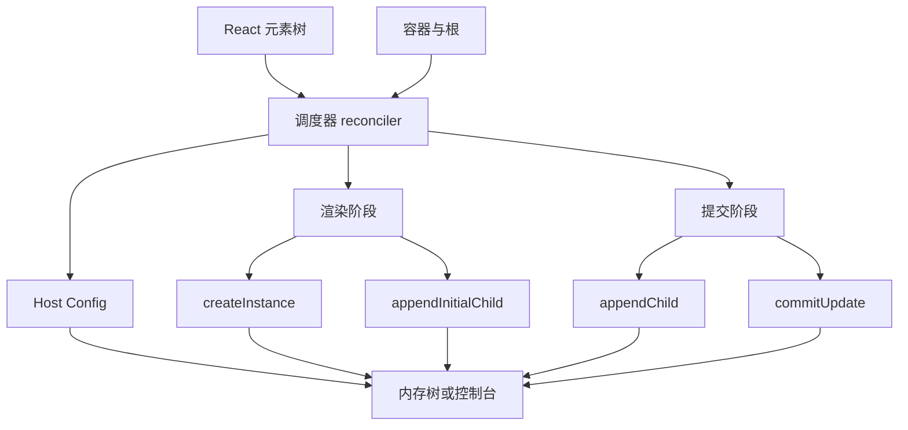
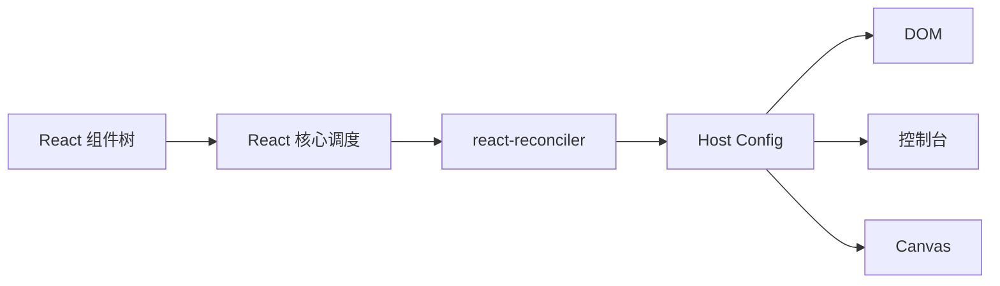
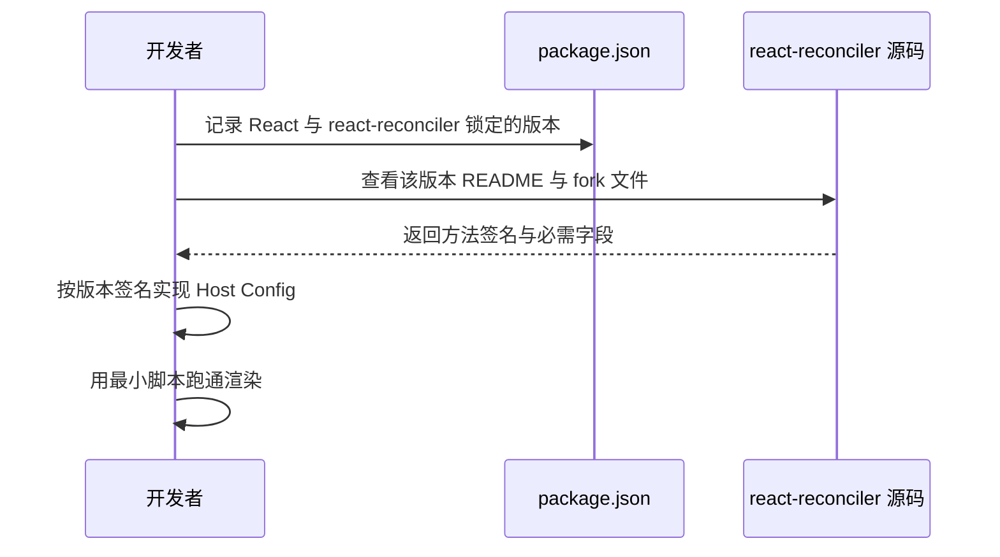
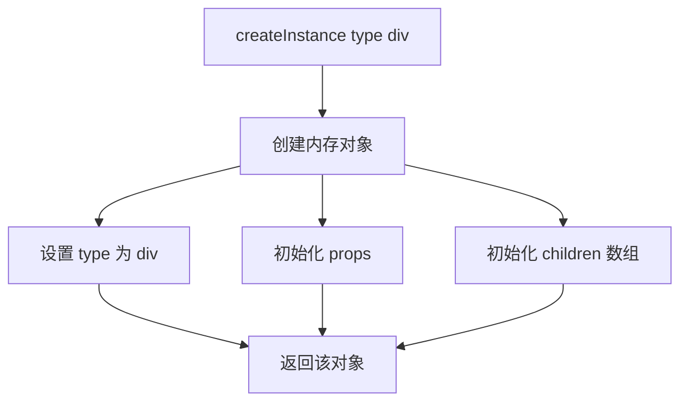
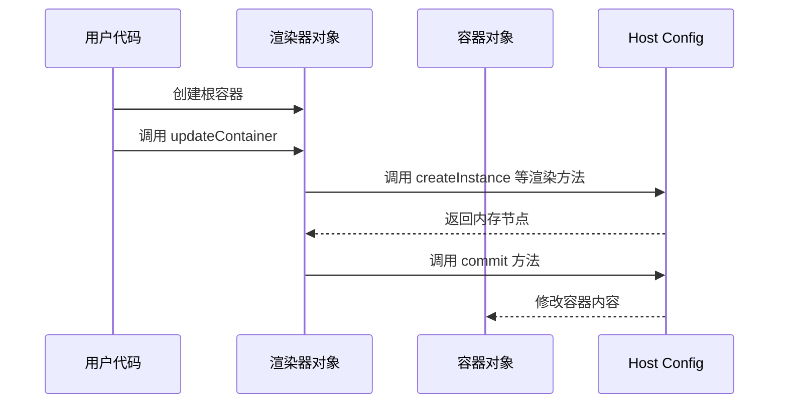
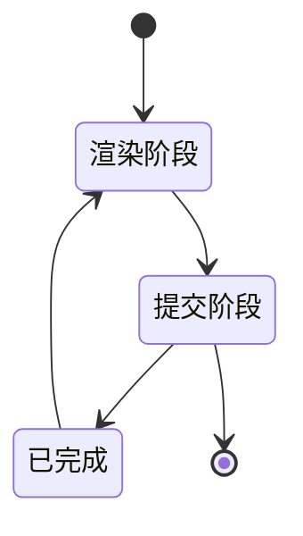
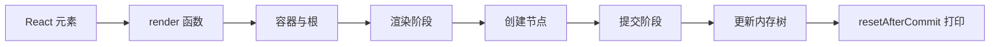

# 手写一个 React 自定义渲染器：用 react-reconciler 渲染到控制台

!!! abstract "学完这一页你能"
    1. 能说出 `react-reconciler` 与 `react-dom`、`react-native` 在架构上的分工边界。
    2. 能基于官方 README 列出的 Host Config 方法，写出一个可运行的最小 mutation 渲染器。
    3. 能解释 `createInstance`、`appendChild`、`commitUpdate` 分别在哪个阶段被调用，以及为什么不能跨阶段乱改。
    4. 能独立调试并修复自定义渲染器中的版本错配、方法缺失、打印时机这三类问题。

## 0. 知识地图



建议先从第 1 节建立整体心智模型，再按第 3 到第 5 节的顺序逐步实现。第 2 节务必先读，因为版本差异会直接影响后续所有代码能否运行。第 6 节是总装验证，不要跳过。

## 1. 认识 react-reconciler：自定义渲染器的核心

**先想一个问题**：为什么同一个 React 组件既能渲染成网页 DOM，也能渲染成手机原生视图，还能渲染成终端字符？差异到底发生在哪一层？

**心智模型**

!!! tip "心智模型"
    `react-reconciler` 是“翻译官”：它把组件树翻译成一个操作清单，真正执行操作的是 Host Config。  
    日常类比：餐厅后厨的“出菜调度员”只决定先做什么菜、菜品的依赖顺序，但不会亲手切菜。切菜、装盘由不同厨房的“菜品执行员”完成。  
    类比不成立的地方：餐厅的执行员可以现场发挥，而 Host Config 必须严格实现 reconciler 要求的方法，漏一个方法就会在运行时报错。

**图解**



1. React 组件树经过渲染逻辑，产出“下一棵树是什么样”的描述。
2. `react-reconciler` 负责对比、调度、决定调用 Host Config 的哪些方法。
3. Host Config 决定“创建一个节点”在 DOM 是 `document.createElement`，在控制台是新建一个内存对象。
4. 同一个 reconciler 可以搭配不同 Host Config，从而输出到不同宿主。

**一步一步来**

这一步要做什么：确认 `react-reconciler` 包导出的工厂函数与 Host Config 的关系，并列出 Host Config 的基本骨架。

```js
// 引入 react-reconciler 工厂函数
// 注意：不同版本的导出形状可能不同，需核对所用版本文档
const Reconciler = require('react-reconciler');

// Host Config：告诉 reconciler 如何在目标环境执行操作
const HostConfig = {
  // 使用 mutation 模式，表示宿主节点可以被原地修改
  supportsMutation: true,
  // 以下方法为最小示例，后续小节逐个实现
  createInstance() {},
  createTextInstance() {},
  appendChild() {},
  appendChildToContainer() {},
  prepareForCommit() {},
  resetAfterCommit() {},
  getRootHostContext() {},
  getChildHostContext() {},
  shouldSetTextContent() {},
};
```

**这段代码在做什么**

1. `require('react-reconciler')` 拿到工厂函数，实际导出的具体属性名可能因版本而异。
2. `supportsMutation: true` 声明使用 mutation 模式，这是 DOM 类似的常用模式。
3. `createInstance` 等方法是 Host Config 必须提供的能力接口。
4. 现在这些方法都是空函数，还不能处理真实节点，下一节会说明字段。
5. 该骨架只用于建立结构，直接运行渲染会因方法未实现而失败。

**动手验证**

```js
// 依赖：无业务依赖，仅需 Node 20+
const assert = require('node:assert');

const HostConfig = {
  supportsMutation: true,
  createInstance() {},
  createTextInstance() {},
  appendChild() {},
  appendChildToContainer() {},
  prepareForCommit() {},
  resetAfterCommit() {},
  getRootHostContext() {},
  getChildHostContext() {},
  shouldSetTextContent() {},
};

// 验证骨架中的关键字段是否存在
assert.equal(HostConfig.supportsMutation, true);
assert.equal(typeof HostConfig.createInstance, 'function');
assert.equal(typeof HostConfig.appendChild, 'function');
assert.equal(typeof HostConfig.getRootHostContext, 'function');
console.log('Host Config 骨架检查通过');
```

运行结果预期输出：`Host Config 骨架检查通过`。

**常见坑**

| 现象 | 原因 | 怎么修 |
|---|---|---|
| 把 `react-reconciler` 当作稳定 API 直接用于生产 | 官方 README 声明其 API 不稳定、不遵循普通版本策略 | 阅读对应版本源码并固定版本 |
| 把 Host Config 写成只有 `supportsMutation` 一个字段 | 缺少 reconciler 需要调用的方法 | 对照官方文档补齐核心方法 |
| 在 `createInstance` 中直接操作父节点 | 渲染阶段创建的节点可能不会进入最终树 | 只在方法内操作新节点本身 |

**用在哪里**

1. **业务场景：游戏 HUD 渲染到 Canvas**  
   业务背景：同一套 React 组件需要渲染到 Canvas 而不是 DOM。  
   本节知识怎么用：用自定义 Host Config 把 `createInstance` 映射到 Canvas 节点或绘制指令。  
   衡量收益指标：复用 React 状态管理，减少 HUD 逻辑重复代码。  
   什么时候不该用：当 Canvas 交互极重、需要直接控制像素时，自绘可能更直接。

2. **业务场景：终端命令行 UI**  
   业务背景：用 React 描述终端表格、进度条。  
   本节知识怎么用：Host Config 节点对应终端字符块，提交阶段统一清屏重绘。  
   衡量收益指标：组件复用率和交互改动工时。  
   什么时候不该用：终端输出是简单顺序打印时，React 的调度反而增加复杂度。

3. **业务场景：测试环境内存快照**  
   业务背景：单测中只关心组件产出的树结构，不关心浏览器布局。  
   本节知识怎么用：将 Host Config 节点保存为普通对象，测试直接断言 deep equal。  
   衡量收益指标：测试执行时间，内存树断言速度通常快于真实 DOM 断言。  
   什么时候不该用：需要真实 DOM 事件或布局计算的测试。

**行业实践**

1. React 官方仓库中的 React ART 渲染器，用一个独立 Host Config 模块描述如何创建图形节点。出处：React 仓库 `react-art` 与 `ReactFiberConfigART.js`。
2. React DOM 的 Host Config 是最完整的 mutation 模式参考实现。出处：React 仓库 `react-dom-bindings` 中的 `ReactFiberConfigDOM.js`。
3. React Native 的 Fabric 渲染器使用 persistent 模式，展示另一种 Host Config 形态。出处：React 仓库 `react-native-renderer` 中的 `ReactFiberConfigFabric.js`。

怎么借鉴到你的项目：先抄 React ART 的最小方法集，再按业务需要补充；不要一开始照搬 DOM 的全部配置。

**小结**

1. `react-reconciler` 负责“变什么”，Host Config 负责“变了之后怎么落到宿主”。
2. mutation 模式意味着节点可以原地修改，适合控制台、Canvas、DOM 这类可变宿主。
3. Host Config 方法需完整实现，否则渲染会因方法缺失而失败。

## 2. 安装与版本差异：先核对实验性 API

**先想一个问题**：为什么同一段自定义渲染器代码，换了一个 `react-reconciler` 小版本就报错？你如何确认当前版本需要哪些 Host Config 方法？

**心智模型**

!!! tip "心智模型"
    实验性 API 像一条没有稳定路面的施工路：每次发布都可能改变车道位置，唯一可靠的做法是每到一个版本就重新读路标。  
    日常类比：你按照去年的地铁图换乘，今年新线开通后同名站点换乘路径变了。  
    类比不成立的地方：地铁图每年最多变几次，而 `react-reconciler` 的 API 可能在多个 minor 版本之间频繁调整。

**图解**



1. 开发者先在 `package.json` 中记录 React 主包版本和 `react-reconciler` 版本。
2. 查看锁定版本对应的 README，而不是只看默认分支的最新文档。
3. 依据 README 中的方法列表与示例确定 Host Config 的形状。
4. 用最小脚本跑通一个节点创建，验证 API 理解是否正确。

**一步一步来**

这一步要做什么：用 Node 脚本读取已安装的 `react-reconciler` 版本，并确认其导出形状是否包含可调用的工厂。

```js
// 读取本地安装的 react-reconciler 版本
const fs = require('node:fs');
const path = require('node:path');

const pkgPath = path.join(process.cwd(), 'node_modules', 'react-reconciler', 'package.json');
const pkg = JSON.parse(fs.readFileSync(pkgPath, 'utf8'));

// 打印版本，用于核对文档
console.log('react-reconciler version:', pkg.version);
console.log('main entry:', pkg.main || '未设置 main');
```

**这段代码在做什么**

1. 从当前项目读取 `react-reconciler` 的 `package.json`。
2. 打印 `version` 字段，这是核对官方文档的起点。
3. 打印 `main` 字段，判断真实入口文件，便于进一步追溯导出。
4. 该脚本没有调用渲染逻辑，只用于定位版本信息。

**动手验证**

```js
// 依赖：已安装 react-reconciler，脚本在项目根目录运行
const assert = require('node:assert');
const fs = require('node:fs');
const path = require('node:path');

const pkgPath = path.join(process.cwd(), 'node_modules', 'react-reconciler', 'package.json');
const pkg = JSON.parse(fs.readFileSync(pkgPath, 'utf8'));

// 断言版本字段存在且为字符串
assert.ok(typeof pkg.version === 'string' && pkg.version.length > 0);
// 断言有入口文件字段或默认入口
assert.ok(pkg.main || pkg.exports || true);
console.log('已检测到 react-reconciler，版本：' + pkg.version);
```

运行结果预期输出：`已检测到 react-reconciler，版本：<实际版本号>`。

**常见坑**

| 现象 | 原因 | 怎么修 |
|---|---|---|
| 使用默认分支文档写代码，安装的却是旧版本 | 官方 README 声明 API 仍会频繁变化 | 安装后读取本地版本并查阅对应 README |
| `require('react-reconciler')` 返回的对象不能直接调用 | 不同版本可能通过 `default` 或命名导出暴露工厂 | 打印导出形状，按实际字段调用 |
| React 与 react-reconciler 版本错配 | 两个包的调度版本需要匹配 | 使用与 React 版本对应的 react-reconciler 版本，以官方或包元数据为准 |

**用在哪里**

1. **业务场景：公司内部维护自研渲染器**  
   业务背景：团队写了一个自研终端渲染器，需要随 React 升级跟进。  
   本节知识怎么用：升级前先读新版本 README，再改动 Host Config。  
   衡量收益指标：升级后渲染器回归测试通过率。  
   什么时候不该用：如果渲染器被广泛使用且回归风险高，升级前先冻结版本并制定回滚方案。

2. **业务场景：旧项目从 DOM 迁移到自定义渲染器**  
   业务背景：项目需要脱离浏览器运行。  
   本节知识怎么用：先核对 `react-reconciler` 版本再迁移 Host Config。  
   衡量收益指标：迁移后的功能回归通过数与缺陷数。  
   什么时候不该用：当项目逻辑强依赖 DOM API 时，迁移成本可能高于收益。

3. **业务场景：教学与面试演示**  
   业务背景：需要演示 React 内部协调与宿主分离。  
   本节知识怎么用：固定两个包版本，让演示脚本可复现。  
   衡量收益指标：学习者能否独立跑通同一脚本。  
   什么时候不该用：如果学习者环境不一致且无法统一安装，演示容易失败。

**行业实践**

1. React 官方 README 提示该 API 不遵循普通版本策略。出处：`react-reconciler` 官方 README 开头警告。
2. React 仓库中的 fork 文件 `ReactFiberConfig.custom.js` 是完整方法列表的参考。出处：React 仓库源码路径。
3. 社区常见做法是在 `package.json` 中固定 React 相关包的精确版本，避免自动升级。出处：npm 官方文档中的版本锁定说明。

怎么借鉴到你的项目：将 `react` 与 `react-reconciler` 一并锁死，并在升级计划中加入“读新版本 README”步骤。

**小结**

1. `react-reconciler` 的 API 不遵循普通语义化版本承诺，每次升级都必须核对文档。
2. 安装后先读本地版本的 README 或源码，而不是默认分支。
3. 版本错配与导出形状差异是自定义渲染器最频繁的失败来源。

## 3. 最小 Host Config：创建内存节点

**先想一个问题**：如果渲染目标不是 DOM，`createInstance('div', props)` 该返回什么？为什么这个返回值会被 reconciler 反复使用？

**心智模型**

!!! tip "心智模型"
    `createInstance` 是“造空盒子”：reconciler 只关心盒子的身份，不关心盒子内部细节。  
    日常类比：仓库管理员拿到一张“造一个标着 div 的货架”的工单，他会造出一个空货架，后续放货。  
    类比不成立的地方：仓库货架可以直接存放货物，而 Host Config 节点还需要实现 child 列表，reconciler 才会把子节点放进去。

**图解**



1. reconciler 调用 `createInstance` 并传入节点类型。
2. Host Config 创建一个普通对象。
3. 给对象设置 `type`、`props`、`children` 字段。
4. 返回这个对象，后续的 child 操作都围绕它进行。

!!! note "术语：Host Config（宿主配置）"
    Host Config 是一个对象，描述渲染器如何在宿主环境中创建、更新、删除节点。例如 DOM 渲染器的 Host Config 在 `createInstance` 里调用 `document.createElement`。

**一步一步来**

这一步要做什么：实现 `createInstance`，让 reconciler 能创建出最基础的内存节点。

```js
// createInstance：根据类型创建内存节点
createInstance(type, props) {
  // 返回一个普通对象，包含三个基本字段
  const instance = {
    type: type,
    props: props || {},
    children: [],
  };
  return instance;
}
```

**这段代码在做什么**

1. `type` 是字符串，例如 React 元素中的 `'div'` 或自定义标签名。
2. `props` 保存元素上的属性，后续更新会用到。
3. `children` 初始为空数组，用于存放子节点。
4. 该实现不调用任何 DOM 或控制台 API，只生成内存对象。

这一步要做什么：实现 `createTextInstance`，让文本类子节点也能被创建。

```js
// createTextInstance：创建文本节点
createTextInstance(text) {
  // 用特殊 type 标记文本节点，与普通元素节点区分
  return {
    type: 'TEXT',
    text: text,
    children: [],
  };
}
```

**这段代码在做什么**

1. `text` 是字符串，例如组件中的 `'Hello'`。
2. 用 `type: 'TEXT'` 标记文本节点，避免与元素节点混淆。
3. `children` 保持空数组，文本节点不会有子节点。
4. 返回的对象结构统一，便于后续打印和更新。

**动手验证**

```js
// 依赖：仅 Node 20+
const assert = require('node:assert');

function createInstance(type, props) {
  return { type, props: props || {}, children: [] };
}
function createTextInstance(text) {
  return { type: 'TEXT', text, children: [] };
}

const div = createInstance('div', { className: 'box' });
assert.deepEqual(div, { type: 'div', props: { className: 'box' }, children: [] });

const text = createTextInstance('Hello');
assert.deepEqual(text, { type: 'TEXT', text: 'Hello', children: [] });

console.log('createInstance 与 createTextInstance 验证通过');
```

运行结果预期输出：`createInstance 与 createTextInstance 验证通过`。

**常见坑**

| 现象 | 原因 | 怎么修 |
|---|---|---|
| 文本节点与元素节点混淆 | `createTextInstance` 没有特殊标记 | 固定使用 `type: 'TEXT'` 或独立结构 |
| 子节点无法追加 | `children` 数组未初始化 | 在 `createInstance` 中显式初始化 `children` |
| props 为 null 导致后续读取属性报错 | 没有兜底空对象 | 使用 `props || {}` |

**用在哪里**

1. **业务场景：前端监控录制树快照**  
   业务背景：需要把某个交互后的组件树保存为 JSON 用于回放。  
   本节知识怎么用：自定义 Host Config 将节点生成为普通对象，直接序列化。  
   衡量收益指标：快照生成耗时与 JSON 结构正确率。  
   什么时候不该用：DOM 结构含有不可序列化对象时，需要额外过滤。

2. **业务场景：SSR 中间表示**  
   业务背景：服务端产出一种中间 JSON，再由不同客户端渲染。  
   本节知识怎么用：`createInstance` 返回特殊标记对象，提交时输出 JSON。  
   衡量收益指标：序列化/反序列化耗时。  
   什么时候不该用：如果目标只需要 HTML 字符串，使用 React 官方 SSR API 更直接。

3. **业务场景：离线智能终端 UI**  
   业务背景：低功耗设备无法运行 DOM。  
   本节知识怎么用：用内存树作为 UI 状态，由驱动层解释渲染。  
   衡量收益指标：设备帧耗时。  
   什么时候不该用：设备 RAM 极小时，内存树对象数量需要控制。

**行业实践**

1. React DOM 的 Host Config 在 `createInstance` 中调用 `document.createElement`。出处：React DOM 官方源码 `ReactFiberConfigDOM.js`。
2. React ART 的 Host Config 创建图形对象并附加属性。出处：React 仓库 `ReactART.js`。
3. React Native 的 Fabric 创建原生视图影子节点。出处：React 仓库 `ReactFiberConfigFabric.js`。

怎么借鉴到你的项目：优先采用最简对象结构，不要一开始引入完整类定义或额外依赖。

**小结**

1. `createInstance` 只返回新节点对象，不能修改其他节点。
2. 文本节点要单独创建，不能复用元素节点。
3. `children` 数组是后续 `appendChild` 等操作的基础。

## 4. 容器与根：updateContainer 的调度

**先想一个问题**：你已经能创建节点了，但谁来决定从根组件开始调度？`updateContainer` 和“根”又是怎么联系起来的？

**心智模型**

!!! tip "心智模型"
    `updateContainer` 是“发车信号”：它告诉 reconciler 从某个根开始，把元素树渲染到指定容器。  
    日常类比：快递总站收到一个包裹清单（React 元素），调度员按“总站到分站”的路径把包裹推下去。  
    类比不成立的地方：快递路径是固定的，而 React 根节点需要你显式创建并传入 `updateContainer`。

**图解**



1. 用户代码准备一个容器对象，例如 `{ children: [] }`。
2. 用户代码通过渲染器对象创建根，具体创建根的方法资料未覆盖，需核对官方文档。
3. 用户代码调用 `updateContainer`，传入元素和根。
4. reconciler 触发 Host Config 的渲染与提交方法，最终修改容器内容。

**一步一步来**

这一步要做什么：定义内存容器对象，并实现 `render` 包装函数。

```js
// 创建内存容器：根容器也是一个对象
function createContainer() {
  return { children: [] };
}

// render 包装函数：记录元素与容器，等待实际调度
function render(element, container) {
  // 资料未覆盖 createContainer 与 updateContainer 的完整签名
  // 假设渲染器对象提供这两个方法，实际需核对版本
  const renderer = getRenderer(); // getRenderer 在完整实现中返回 reconcile 工厂产物
  const root = renderer.createContainer(container);
  renderer.updateContainer(element, root);
}
```

**这段代码在做什么**

1. `createContainer` 返回最简容器对象，结构与普通节点相似。
2. `render` 函数先获取渲染器对象，再调用 `createContainer`。
3. `createContainer` 的准确参数资料未覆盖，需核对官方文档。
4. `updateContainer` 用于调度根上的更新，是官方 README 明确提到的入口。

**动手验证**

```js
// 依赖：仅 Node 20+
const assert = require('node:assert');

function createContainer() {
  return { children: [] };
}

const container = createContainer();
assert.deepEqual(container, { children: [] });

// 验证容器是否具备承载 children 的能力
Array.isArray(container.children);
assert.ok(Array.isArray(container.children));
console.log('容器对象验证通过');
```

运行结果预期输出：`容器对象验证通过`。

**常见坑**

| 现象 | 原因 | 怎么修 |
|---|---|---|
| `updateContainer` 调用报“root 类型不对” | 根对象不是由渲染器的 `createContainer` 产出 | 使用渲染器对象提供的方法创建根 |
| `render` 包装中漏调用 `createContainer` | 直接把容器当根传入 | 先创建 root，再传给 `updateContainer` |
| 容器对象用了节点实现但字段不同 | 根容器与普通节点类型不匹配 | 统一使用 `children` 数组结构 |

**用在哪里**

1. **业务场景：微前端中多根渲染**  
   业务背景：多个互不干扰的 React 树同时渲染到不同区域。  
   本节知识怎么用：每个区域创建独立容器和根。  
   衡量收益指标：区域间渲染隔离率。  
   什么时候不该用：当多个树之间需要频繁通信时，单一图表可能更简单。

2. **业务场景：CLI 工具的交互画面**  
   业务背景：终端窗口要渲染一棵组件树。  
   本节知识怎么用：用内存容器保存树，提交后清屏打印。  
   衡量收益指标：重绘频率与闪烁控制。  
   什么时候不该用：终端尺寸太小且组件树很大时，打印成本高。

3. **业务场景：游戏 UI 的独立根节点**  
   业务背景：游戏场景内 UI 与主界面 UI 分开渲染。  
   本节知识怎么用：每个 UI 层创建对应容器与根。  
   衡量收益指标：UI 更新不阻塞场景渲染。  
   什么时候不该用：当 UI 树很小且无须隔离时，多根增加复杂度。

**行业实践**

1. React DOM 的 `createRoot` 内部会建立与 DOM 容器关联的 root 对象。出处：React DOM 官方文档。
2. React Native 的 Fabric 渲染器管理多个影子根。出处：React 仓库 `ReactFiberConfigFabric.js`。
3. React ART 的 Host Config 也按照根容器与 `updateContainer` 组织。出处：React 仓库 `ReactART.js`。

怎么借鉴到你的项目：将“容器”与“根”两个概念分开，容器是宿主对象，根是 reconciler 调度单元。

**小结**

1. 容器是宿主环境中的对象，根是 reconciler 内部调度单元。
2. `updateContainer` 是触发渲染的入口，但前提是根据渲染器对象创建 root。
3. `createContainer` 的具体签名资料未覆盖，需核对所用版本文档。

## 5. 更新树：commitUpdate 与提交阶段

**先想一个问题**：初始渲染已经完成，如果某个组件的 props 变了，reconciler 如何只改动那个节点的属性，而不是重新创建整棵树？

**心智模型**

!!! tip "心智模型"
    `commitUpdate` 是“修改工单”：reconciler 已经算出哪个节点需要改，Host Config 负责把变更写到节点上。  
    日常类比：客户改订单只改某个字段，仓库员收到“改收货地址”工单后只改那一行，不会重建整个订单。  
    类比不成立的地方：订单修改可以随时进行，而 `commitUpdate` 必须在提交阶段调用，不能在渲染阶段随便改树。

**图解**



1. 渲染阶段创建新节点、计算差异，但不修改已提交的树。
2. 提交阶段执行 `appendChild`、`commitUpdate` 等 mutation 方法。
3. 完成状态表示本次更新落地。
4. 新的 props 变化会重新进入渲染阶段。

!!! note "术语：commitUpdate"
    `commitUpdate` 是 mutation 模式下的提交更新方法，用于更新已有节点的 props。其具体参数签名资料未覆盖，需核对官方文档。

**一步一步来**

这一步要做什么：实现一个 `commitUpdate` 骨架，说明其职责与阶段限制。

```js
// commitUpdate 骨架：签名未覆盖，需核对官方文档
function commitUpdate(instance, updatePayload, type, oldProps, newProps) {
  // 示例中仅演示：将新 props 写到实例上
  instance.props = newProps;
}
```

**这段代码在做什么**

1. `commitUpdate` 接收实例和新 props，具体参数顺序资料未覆盖。
2. 示例将新 props 整个替换到实例上。
3. 真实实现可能需要 diff props 并逐字段更新。
4. 该函数属于提交阶段，必须避免修改其他节点。
5. 实际方法的参数名与顺序需要以所用版本源码为准。

这一步要做什么：实现 `prepareForCommit` 与 `resetAfterCommit`，为提交阶段提供边界。

```js
// prepareForCommit：提交前保存状态，必须返回 null
function prepareForCommit() {
  return null;
}

// resetAfterCommit：提交后清理或触发打印
function resetAfterCommit() {
  // 在完整版中可打印整棵树
}
```

**这段代码在做什么**

1. `prepareForCommit` 用于提交前准备，示例不保存任何状态。
2. `resetAfterCommit` 在提交后执行，是打印树的好时机。
3. 两者都可以在简单渲染器中保持空实现，但 `prepareForCommit` 必须返回 null。
4. 复杂渲染器可以在 `prepareForCommit` 中保存选择状态，在 `resetAfterCommit` 中恢复。

**动手验证**

```js
// 依赖：仅 Node 20+
const assert = require('node:assert');

function commitUpdate(instance, updatePayload, type, oldProps, newProps) {
  instance.props = newProps;
}

const node = { props: { text: '旧' } };
commitUpdate(node, null, 'div', node.props, { text: '新' });

assert.deepEqual(node.props, { text: '新' });
console.log('commitUpdate 骨架验证通过');
```

运行结果预期输出：`commitUpdate 骨架验证通过`。

**常见坑**

| 现象 | 原因 | 怎么修 |
|---|---|---|
| 在 `createInstance` 中调用 `commitUpdate` | 渲染阶段不能执行提交逻辑 | 将更新逻辑放入提交阶段的 `commitUpdate` |
| `prepareForCommit` 不返回 null | 官方 README 要求返回 null | 显式 return null |
| `commitUpdate` 修改了其他节点 | 破坏了 reconciler 对树的假设 | 只修改传入的 instance |

**用在哪里**

1. **业务场景：表格单元格更新**  
   业务背景：大数据表格中某个单元格数据变化，需要只更新该单元格。  
   本节知识怎么用：`commitUpdate` 只修改该节点的 props。  
   衡量收益指标：更新耗时与全量重绘耗时。  
   什么时候不该用：当整行数据几乎同时变化时，批量更新可能更合适。

2. **业务场景：状态标签切换**  
   业务背景：面板中某个标签文案与颜色变化。  
   本节知识怎么用：提交阶段更新该节点的 props。  
   衡量收益指标：变更节点数量。  
   什么时候不该用：如果树很小，直接整树重建也没有明显性能差异。

3. **业务场景：终端进度条刷新**  
   业务背景：进度百分比频繁变化。  
   本节知识怎么用：更新节点的 `value` prop，提交后重绘。  
   衡量收益指标：刷新频率与实际打印次数。  
   什么时候不该用：进度变化极快且肉眼无法分辨时，可以降频批量更新。

**行业实践**

1. React DOM 的 `commitUpdate` 负责更新 DOM 节点属性。出处：React DOM 官方源码。
2. React Native 在提交阶段更新原生视图属性。出处：React 仓库 `ReactFiberConfigFabric.js`。
3. 官方 README 将 `commitMount` 与 `finalizeInitialChildren` 配合使用，处理节点首次连接到树后的工作。出处：`react-reconciler` README。

怎么借鉴到你的项目：把提交阶段方法写成一个独立模块，便于不同 Host Config 复用同一套逻辑。

**小结**

1. `commitUpdate` 只在提交阶段执行，负责更新已有节点 props。
2. 提交阶段前后有 `prepareForCommit` 与 `resetAfterCommit` 边界。
3. `commitUpdate` 的具体签名资料未覆盖，需核对所用版本文档。

## 6. 完整渲染器：打印、验证与边界

**先想一个问题**：前面每个部分都单独验证过，现在如何把它们组合成一个完整的、可以在控制台打印树的自定义渲染器？

**心智模型**

!!! tip "心智模型"
    完整渲染器是一条“流水线”：每个 Host Config 方法是一个工位，reconciler 负责传送带调度，最终产品是一段打印文本。  
    日常类比：装配车间里每个工位只做一件事，传送带按顺序经过所有工位，最终产出成品。  
    类比不成立的地方：装配车间可以返工，而提交阶段一旦出错，通常需要重新调度或修正 Host Config。

**图解**



1. React 元素进入 `render` 函数。
2. 渲染器建立容器与根。
3. 渲染阶段创建内存节点。
4. 提交阶段把节点组织成树。
5. `resetAfterCommit` 打印树结构。

**一步一步来**

这一步要做什么：实现完整的 Host Config 方法集合。

```js
const HostConfig = {
  supportsMutation: true,
  createInstance(type, props) {
    return { type, props: props || {}, children: [] };
  },
  createTextInstance(text) {
    return { type: 'TEXT', text, children: [] };
  },
  appendInitialChild(parent, child) {
    parent.children.push(child);
  },
  appendChild(parent, child) {
    parent.children.push(child);
  },
  appendChildToContainer(container, child) {
    container.children.push(child);
  },
  prepareForCommit() { return null; },
  resetAfterCommit() { console.log('提交完成'); },
  getRootHostContext() { return null; },
  getChildHostContext(parentContext, type, rootContainer) { return parentContext; },
  shouldSetTextContent() { return false; },
};
```

**这段代码在做什么**

1. `appendInitialChild` 与 `appendChild` 对内存树而言行为相同，都是将 child 放入父节点。
2. `appendChildToContainer` 将孩子放入根容器。
3. `shouldSetTextContent` 返回 false，表示所有节点都走文本节点创建逻辑。
4. `getRootHostContext` 返回 null，表示不使用宿主上下文。
5. `getChildHostContext` 原样返回父上下文。

这一步要做什么：实现一个简单的 App 组件，不依赖 JSX。

```js
const React = require('react');

// 用 React.createElement 构造元素树
function App() {
  return React.createElement(
    'div',
    null,
    React.createElement('span', null, 'hello'),
    React.createElement('span', null, 'world')
  );
}
```

**这段代码在做什么**

1. 用 `React.createElement` 替代 JSX，避免构建步骤。
2. 根节点是 `div`，包含两个 `span` 子节点。
3. 两个 `span` 的文本分别由 `createTextInstance` 创建。
4. 该树后续会通过 `updateContainer` 调度渲染。

**动手验证**

```js
// 依赖：需安装 react 与 react-reconciler，版本须匹配
const assert = require('node:assert');
const React = require('react');
const Reconciler = require('react-reconciler');

// 省略完整 HostConfig 展示，此处仅验证树打印逻辑
function printTree(node, depth = 0) {
  let out = '  '.repeat(depth);
  if (node.type === 'TEXT') {
    out += node.text;
  } else {
    out += node.type;
  }
  console.log(out);
  for (const child of node.children) {
    printTree(child, depth + 1);
  }
}

const tree = {
  type: 'div',
  children: [
    { type: 'span', children: [{ type: 'TEXT', text: 'hello', children: [] }] },
    { type: 'span', children: [{ type: 'TEXT', text: 'world', children: [] }] },
  ],
};

let printed = '';
const originalLog = console.log;
console.log = function (...args) {
  printed += args.join(' ') + '\n';
};

printTree(tree);
console.log = originalLog;

assert.ok(printed.includes('div'));
assert.ok(printed.includes('hello'));
assert.ok(printed.includes('world'));
console.log('打印验证通过');
```

运行结果预期输出：`打印验证通过`（同时捕获的打印内容包含 div、hello、world）。

**常见坑**

| 现象 | 原因 | 怎么修 |
|---|---|---|
| 树打印顺序不符合预期 | 没有按深度优先递归打印 | 明确递归顺序与缩进规则 |
| 提交后打印为空 | `resetAfterCommit` 时机不对或没有调用打印函数 | 在 `resetAfterCommit` 中执行打印 |
| `shouldSetTextContent` 返回 true 导致文本节点不生成 | 错误设置该优化开关 | 如果没有特殊文本父节点，返回 false |

**用在哪里**

1. **业务场景：CLI 日志渲染工具**  
   业务背景：用 React 描述日志输出结构，打印到终端。  
   本节知识怎么用：自定义渲染器将组件树转为可读文本。  
   衡量收益指标：日志结构可读性与生成耗时。  
   什么时候不该用：日志纯粹是线性文本时，React 结构收益低。

2. **业务场景：教学演示 React 直击内核**  
   业务背景：学习者需要看到 React 调度过程。  
   本节知识怎么用：在 Host Config 各方法中加入日志，展示调用顺序。  
   衡量收益指标：学习者回答调用顺序的正确率。  
   什么时候不该用：如果课程只要求使用 React，不涉及内部机制。

3. **业务场景：自定义调试面板**  
   业务背景：在非浏览器环境调试组件树。  
   本节知识怎么用：自定义渲染器配合内存树打印。  
   衡量收益指标：问题定位时间。  
   什么时候不该用：浏览器环境已有 React DevTools，不必重复造轮子。

**行业实践**

1. React ART 渲染器展示了从元素树到图形对象的完整 Host Config。出处：React 仓库 `ReactART.js`。
2. `react-reconciler` 官方 README 提供了 mutation 模式的完整示例骨架。出处：`react-reconciler` README。
3. React Native 的 Fabric 使用 persistent 模式展示不可变树处理。出处：React 仓库 `ReactFiberConfigFabric.js`。

怎么借鉴到你的项目：从最小 mutation 示例开始，先跑通再逐步添加优化，不要一开始实现 `insertBefore` 等所有方法之外的功能。

**小结**

1. 完整渲染器由 Host Config、容器/根、提交打印三部分组成。
2. `appendChild` 与 `appendInitialChild` 在不同阶段调用，但目标一致。
3. 打印逻辑放在 `resetAfterCommit` 中能保证树已提交完成。

## 应用地图

| 场景 | 用到本页哪个知识点 | 典型技术选型 | 注意事项 |
|---|---|---|---|
| 终端 UI | Host Config 与提交打印 | `react-reconciler` + 控制台清屏 | `createInstance` 返回终端块对象 |
| Canvas 游戏 HUD | `createInstance` 与更新 | `react-reconciler` + Canvas API | 提交阶段调用绘制命令 |
| 测试内存快照 | 创建内存节点与断言 | `react-reconciler` + Node assert | 序列化前过滤不可序列化字段 |
| 监控树回放 | 容器与根、快照打印 | `react-reconciler` + JSON | 注意 ref 与函数属性 |
| SSR 中间表示 | Host Config 方法完整集 | `react-reconciler` + JSON 输出 | 核对版本，避免与官方 SSR 冲突 |
| 离线设备 UI | 内存树与提交状态 | `react-reconciler` + 自绘驱动 | 节点数量受 RAM 限制 |
| 教学向渲染器 | 全流程分步骤验证 | `react-reconciler` + 控制台 | 固定 React 与渲染器版本 |
| 调试面板 | 提交阶段与打印时机 | `react-reconciler` + 文字输出 | 避免与现有 DevTools 重复 |

## 动手作业

**目标**：写一个 Node 20+ 单文件渲染器，将一棵 `div > span` 组件树打印成缩进文本。

**步骤**：

1. 安装 React 与对应的 `react-reconciler`，锁定版本。
2. 实现第一章的 Host Config 骨架。
3. 实现 `createInstance`、`createTextInstance`、`appendChild`、`appendChildToContainer`、`resetAfterCommit`。
4. 在 `resetAfterCommit` 中打印整棵树。
5. 用 `React.createElement` 创建一棵包含 `div` 和多个 `span` 的树。

**验收标准**：

- 运行脚本后，控制台输出 `div` 及至少两个缩进的 `span` 文本。
- 使用 `node:assert` 断言输出文本包含预期节点名。
- 脚本不依赖浏览器环境，且运行退出码为 0。

## 综合对比

| 维度 | 内存控制台渲染器 | React DOM 渲染器 | React Native Fabric 渲染器 |
|---|---|---|---|
| 宿主 | 普通对象与控制台 | 浏览器 DOM | iOS/Android 原生视图 |
| 模式 | mutation | mutation | persistent |
| `createInstance` 产物 | `{ type, props, children }` | DOM 节点 | 影子视图对象 |
| `appendChild` 实现 | push 到数组 | 调用 DOM appendChild | 创建不可变父子关系 |
| `commitUpdate` 成本 | 直接改 props | 调用 DOM 属性 API | 更新原生视图属性 |
| 适合场景 | 学习、测试、CLI 工具 | Web 应用 | 移动应用 |
| 稳定性 | 实验性 | 稳定 | 新架构迭代中 |

## 深入阅读与参考

!!! tip "怎么用这些资料"
    先读「官方文档与规范」建立准确的概念，再读「源码与示例」核对细节，最后用「教程、书籍与视频」换一种讲法加深理解。每条都写明了读哪一节、带着什么问题读。

### 官方文档与规范

| 资源 | 为什么读 | 怎么读 |
|---|---|---|
| [React API 参考](https://react.dev/reference/react) | 官方 API 参考，可核对用到的 API 是否带实验性标记 | 只读 Caveats 与 Troubleshooting 两节；动手前先确认导出是否稳定，再决定是否引入 |
| [React DOM APIs](https://react.dev/reference/react-dom) | react-dom 包 API 总览，看清官方渲染器提供了哪些能力 | 扫一遍导出清单，逐项判断哪些能力必须由自定义渲染器的 Host Config 承担 |
| [Client React DOM APIs](https://react.dev/reference/react-dom/client) | createRoot 等客户端 API，可对照容器与根的创建流程 | 读 createRoot 与 root.render 一节，把自己 createContainer 的参数和调用时机与之对齐 |
| [useLayoutEffect](https://react.dev/reference/react/useLayoutEffect) | 官方说明提交阶段同步副作用的执行时机 | 读执行时机一节，再对照自己的 commit 日志验证宿主操作与 effect 的先后顺序 |

### 源码与示例

| 资源 | 为什么读 | 怎么读 |
|---|---|---|
| [React 源码仓库](https://github.com/facebook/react) | 从源码看 Fiber 树如何遍历并调用宿主配置 | 在 beginWork 与 completeWork 打断点，跑一个三层组件，记录宿主方法调用序列 |
| [index.js](https://github.com/facebook/react/blob/main/packages/react-reconciler/index.js) | react-reconciler 的导出入口，确认公共 API 签名 | 读导出列表，核对自己 import 的 createContainer、updateContainer 名称与参数 |
| [README.md](https://github.com/facebook/react/blob/main/packages/react-reconciler/README.md) | 唯一的官方接口说明，Host Config 全貌都在这里 | 先通读 Host Config 小节，列出必实现的方法，再对照自己的实现逐项打勾 |
| [ReactFiberCommitWork.js](https://github.com/facebook/react/blob/main/packages/react-reconciler/src/ReactFiberCommitWork.js) | commitUpdate、appendChild 等宿主操作的真正调用点 | 搜 commitUpdate 与 commitPlacement，理清提交顺序后在自己的实现里按同样顺序打印 |
| [ReactFiberConcurrentUpdates.js](https://github.com/facebook/react/blob/main/packages/react-reconciler/src/ReactFiberConcurrentUpdates.js) | 更新入队与调度逻辑，解释 updateContainer 何时生效 | 关注更新队列与调度入口，读后给自己的 root 加一个更新次数日志验证时序 |

### 教程、书籍与视频

| 资源 | 为什么读 | 怎么读 |
|---|---|---|
| [Build Your Own React](https://pomb.us/build-your-own-react/) | 手写简化 Fiber 与调度，补齐 React 内部运作直觉 | 按步骤实现到 commit 阶段，再回到本页对照 react-reconciler 官方接口的差异 |

## 自测题

??? question "题目 1：`react-reconciler` 与 `react-dom` 的分工是什么？"
    答案要点：`react-reconciler` 负责调度与协调，`react-dom` 通过 Host Config 负责真实 DOM 操作。自定义渲染器只需替换 Host Config。

??? question "题目 2：为什么 Host Config 必须实现 `createInstance`？"
    答案要点：reconciler 需要在渲染阶段创建宿主节点，用于后续挂载子节点与更新属性。如果不实现，渲染过程无法进行。

??? question "题目 3：`appendInitialChild` 与 `appendChild` 有何区别？"
    答案要点：前者在渲染阶段初始构建时调用，后者在提交阶段更新时调用。对于内存树两者行为可以相同。

??? question "题目 4：`shouldSetTextContent` 返回 true 会发生什么？"
    答案要点：reconciler 会认为该节点的子节点直接由文本填充，不再创建文本节点。需要实现 `resetTextContent` 配合。

??? question "题目 5：`prepareForCommit` 为什么必须返回 null？"
    答案要点：官方 README 规定即使没有准备逻辑也要返回 null。返回值会被 reconciler 使用，不返回可能破坏流程。

??? question "题目 6：如何解决 `react-reconciler` 版本错配？"
    答案要点：先读本地版本的 README，再对比源码中的 Host Config 方法列表，将 React 与 `react-reconciler` 锁到匹配版本。

??? question "题目 7：`commitUpdate` 具体签名是什么？"
    答案要点：资料未覆盖，需核对官方文档。只可在提交阶段使用，用于更新已有节点的 props，不能修改其他节点。

??? question "题目 8：为什么打印树要放在 `resetAfterCommit`？"
    答案要点：`resetAfterCommit` 在提交完成后调用，此时树结构已更新。放在更早阶段可能打印到未提交的中间状态。

## 延伸阅读

- `react-reconciler` 官方 README：Overview、Usage、Core Methods、Mutation Methods 四节。
- React 官方仓库：`ReactFiberConfig.custom.js` 方法总览文件。
- React DOM 官方源码：`ReactFiberConfigDOM.js` 文件中的 mutation 实现。
- React Native 官方仓库：`ReactFiberConfigFabric.js` 文件中的 persistent 实现。
- React ART 官方源码：`ReactART.js` 文件中的 Host Config 组织方式。
