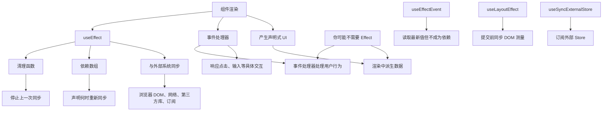
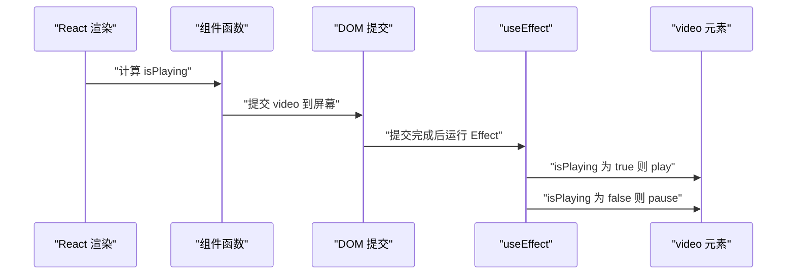
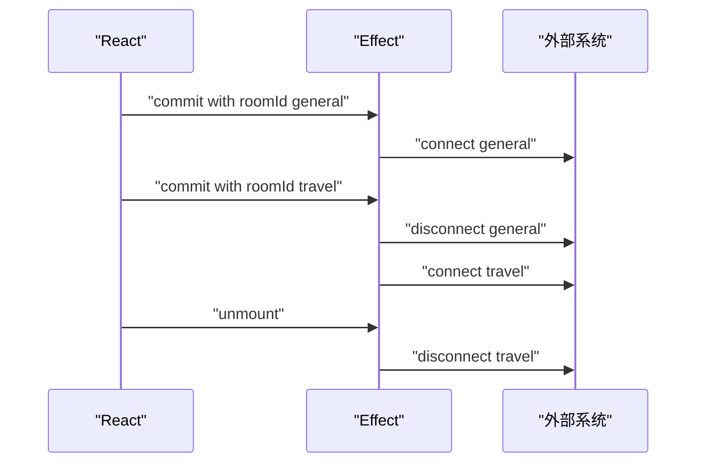
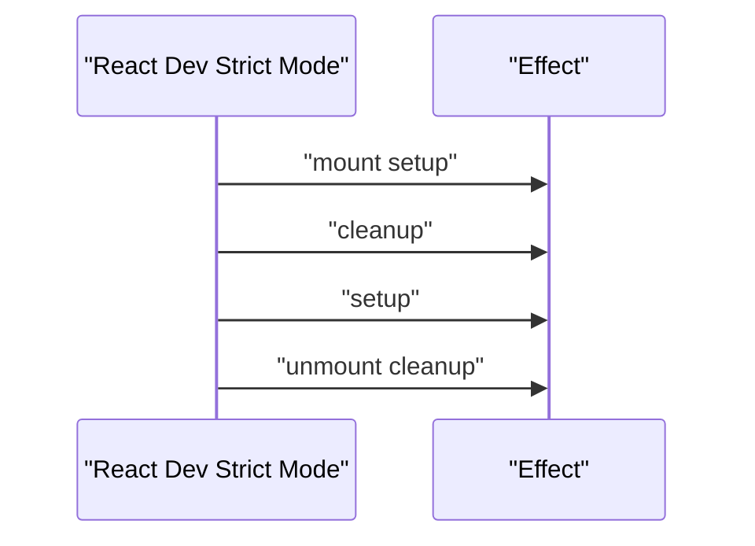
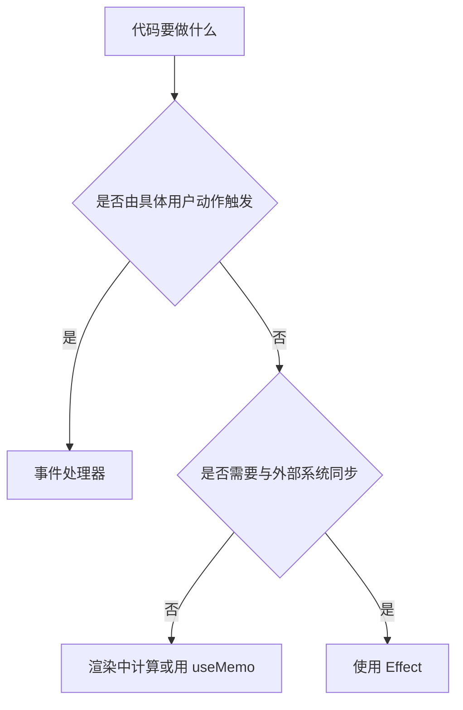
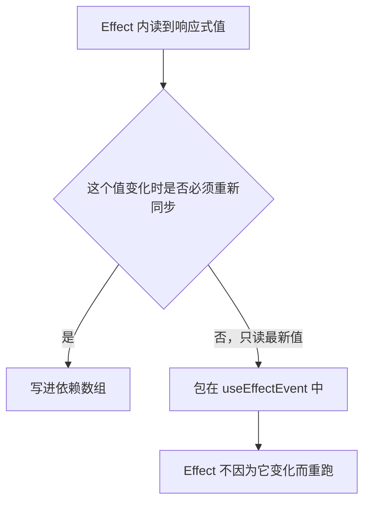
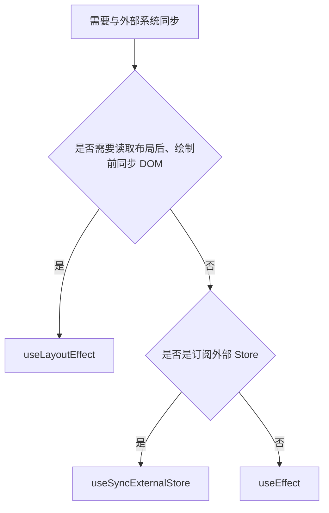

# useEffect 的正确心智模型：同步而不是生命周期

!!! abstract "学完这一页你能"

- 说出 Effect 与事件处理器的区别，并能判断一个副作用属于 Effect 还是事件处理器。
- 用依赖数组声明“何时重新同步”，并能解释依赖数组不是性能开关。
- 写出带清理函数的 Effect，避免连接泄漏、重复订阅与过期请求覆盖。
- 重写三类常见“不需要 Effect”的代码，并用断言验证行为。

## 0. 知识地图



建议先读第 1 节建立同步模型，再读第 2、3 节掌握依赖与清理。
第 4 节解释开发环境双调用。
第 5 到 7 节分别处理误用、Effect Event 与另外两类同步 Hook。

## 1. Effect 是什么：渲染触发的外部同步

**先想一个问题**

你的 `VideoPlayer` 收到 `isPlaying`，但浏览器 `<video>` 只有 `play()` 和 `pause()`。
如果直接在渲染里调用 `ref.current.play()`，首次渲染时 DOM 节点还不存在，会崩溃。
这个副作用应该放在哪里？

**心智模型**

!!! tip "心智模型"

一句话模型：Effect 不是“组件挂载后要做一件事”，而是“渲染提交后，把外部系统同步成当前 props 和 state 的样子”。
日常类比：进入房间后，把空调调到遥控器上的数字；遥控器数字变了，就再调一次。
类比不成立：React 在开发环境可能先清理再重新同步，空调不会为了校验先关再开。

!!! note "术语：Effect"

Effect 是 React 专属概念，指出渲染本身引起的副作用；它运行在提交之后，用来同步 React 外部系统。
例如“连接聊天服务器”是 Effect，因为组件显示时就应该连接，而不取决于用户点了哪个按钮。

**图解**



解读：

1. React 先执行组件函数，计算本次要显示的 JSX。
2. React 把 JSX 对应的 DOM 变更提交到屏幕。
3. 提交完成后，Effect 才运行；此时 DOM 节点已经存在。
4. Effect 用当前 props 或 state 操作外部系统，让外部状态追上 UI。

**一步一步来**

第 1 步：用 ref 拿到 `video` DOM 节点。

```js
import { useRef } from 'react';

function VideoPlayer({ src, isPlaying }) {
  const videoRef = useRef(null); // 保存 video DOM 节点的容器
  return <video ref={videoRef} src={src} loop playsInline />;
}
```

**这段代码在做什么**

- `useRef(null)` 创建一个可变容器，初始值为 `null`。
- `ref={videoRef}` 让 React 在提交后把真实 DOM 节点写进 `videoRef.current`。
- 渲染期间还不能读 `videoRef.current`，因为 DOM 还没创建。

第 2 步：把 `play()` 与 `pause()` 放进 `useEffect`。

```js
import { useEffect, useRef } from 'react';

function VideoPlayer({ src, isPlaying }) {
  const videoRef = useRef(null);

  useEffect(() => {
    if (isPlaying) {
      videoRef.current.play(); // 当前渲染说应该播放
    } else {
      videoRef.current.pause(); // 当前渲染说应该暂停
    }
  }); // 每次提交后都同步一次

  return <video ref={videoRef} src={src} loop playsInline />;
}
```

**这段代码在做什么**

- `useEffect` 把副作用从渲染计算中移出去。
- Effect 运行时，`videoRef.current` 已经指向真实 `<video>`。
- `isPlaying` 来自当前渲染，Effect 用它决定调用 `play()` 还是 `pause()`。
- 这里没有依赖数组，表示每次提交后都执行一次同步。
- 对这个组件而言，每次提交都调用是安全的，但第 2 节会说明如何按需执行。

**动手验证**

下面脚本用一个简化模型验证：渲染期间不能操作 DOM，提交后可以。

```js
// 文件名：video-effect.test.mjs
// 依赖：无；Node 20+
import assert from 'node:assert/strict';

let domReady = false; // 模拟 React 提交后的 DOM 状态
const calls = []; // 记录同步调用

function runEffect(isPlaying) {
  domReady = true; // 提交后 video 节点已存在
  if (isPlaying) {
    calls.push('play'); // 同步为播放
  } else {
    calls.push('pause'); // 同步为暂停
  }
}

domReady = false; // 渲染中还没有真实节点
assert.equal(domReady, false);

runEffect(true);
runEffect(false);

assert.deepEqual(calls, ['play', 'pause']);
console.log('预期输出：');
console.log('play');
console.log('pause');
console.log('实际输出：');
console.log(calls.join('\n'));
```

运行结果会输出 `play` 与 `pause`，断言通过。
这验证了 Effect 的入口条件是“提交后”，而不是“渲染中”。

**常见坑**

| 现象 | 原因 | 怎么修 |
|---|---|---|
| 在渲染路径调用 `ref.current.play()` 直接崩溃 | 渲染期间 DOM 节点可能不存在 | 把 DOM 操作放进 `useEffect` |
| 首次渲染时 `video` 不播放 | 代码写得太早，节点还是 `null` | 用 `useEffect` 等待提交完成 |
| 每次渲染都重复调用 `play()` | 没有依赖数组，Effect 每次提交都执行 | 先确认这是否可接受，再决定是否加依赖 |

**用在哪里**

- 视频课程播放器：React 的播放状态同步到原生 `<video>`。
  - 业务背景：课程播放页需要根据用户点击暂停或播放。
  - 用法：在 `useEffect` 中读取 `isPlaying` 并调用原生方法。
  - 收益指标：播放状态与控制按钮一致，无首次渲染崩溃。
  - 不该用：如果浏览器组件本身就接受 `isPlaying` prop，就不需要手动同步。

- 富文本编辑器：把 React 的文档内容同步到第三方编辑器实例。
  - 业务背景：后台编辑页需要加载 ProseMirror 等外部编辑器。
  - 用法：Effect 中执行 `editor.update(content)`。
  - 收益指标：外部编辑器内容与 React state 保持一致。
  - 不该用：纯受控的 React 输入框不要用 Effect 同步。

- 图表组件：把 React 数据同步到 ECharts 或 D3 实例。
  - 业务背景：数据看板需要把接口数据渲染为图表。
  - 用法：Effect 中调用 `chart.setOption(option)`。
  - 收益指标：数据更新后图表刷新，不产生孤立的旧实例。
  - 不该用：如果图表库提供 React 组件，直接使用组件 API。

**行业实践**

- React 官方文档《Synchronizing with Effects》建议用 Effect 延迟副作用到提交之后。
  怎么借鉴到你的项目：所有依赖 DOM 节点的操作都先放到 Effect 中，避免渲染期操作。
- React 官方文档《Render and Commit》区分渲染与提交两个阶段。
  怎么借鉴到你的项目：做代码评审时，先判断副作用发生在哪个阶段。
- React 官方文档《You Might Not Need an Effect》提醒，没有外部系统就不要急着加 Effect。
  怎么借鉴到你的项目：新增 Effect 前先问“外部系统是哪一个”，答不上就先不写。

**小结**

- Effect 处理“渲染引起的副作用”，事件处理器处理“用户动作引起的副作用”。
- `useEffect` 运行在 DOM 提交之后，因此可以安全访问 ref 节点。
- 判断要不要用 Effect，先找有没有需要同步的外部系统。

## 2. 依赖数组：声明同步的触发条件

**先想一个问题**

`ChatRoom` 一开始连接 `"general"` 房间。
用户在下拉框切到 `"travel"` 后，旧连接还在。
React 怎么知道要断旧房间、连新房间？

**心智模型**

!!! tip "心智模型"

一句话模型：依赖数组声明“这次同步依赖哪些响应式值”，而不是“我希望这段代码何时运行”。
日常类比：导航路线依赖终点；终点变了，路线就重新计算。
类比不成立：React 用 `Object.is` 判断依赖是否变化，不是深度比较对象内容。

!!! note "术语：响应式值"

响应式值是 props、state 以及组件函数体内声明的变量。
它们参与渲染数据流，可能因重渲染而改变。
例如 `roomId` 是响应式值，组件外的 `serverUrl` 不是。

**图解**

```mermaid
stateDiagram-v2
  [*] --> "空闲"
  "空闲" --> "已连接到 general 房间": "roomId 为 general 时提交"
  "已连接到 general 房间" --> "清理 general 房间连接": "roomId 变为 travel"
  "清理 general 房间连接" --> "已连接到 travel 房间": "运行下一次 Effect"
  "已连接到 travel 房间" --> [*]: "组件卸载时清理"
```

解读：

1. 首次提交后，Effect 进入开始同步阶段。
2. `roomId` 改变后，React 先运行上一次的清理函数。
3. 清理完成后，React 拿着新的 `roomId` 运行新的 Effect。
4. 组件卸载时，React 运行最后一次清理函数。

**一步一步来**

第 1 步：把服务端地址放到组件外，因为它不是响应式值。

```js
const serverUrl = 'https://localhost:1234'; // 组件外的常量，不需要写进依赖
```

**这段代码在做什么**

- `serverUrl` 不参与渲染数据流，每次渲染都一样。
- 把不变的常量放到组件外，避免它干扰依赖判断。
- Effect 仍然可以读取它，因为它不随渲染变化。

第 2 步：用依赖数组声明 `roomId` 变化时重新同步。

```js
import { useEffect } from 'react';

const serverUrl = 'https://localhost:1234'; // 组件外的常量

function ChatRoom({ roomId }) {
  useEffect(() => {
    const connection = createConnection(serverUrl, roomId); // 本次同步的连接对象
    connection.connect(); // 开始同步到当前房间
    return () => {
      connection.disconnect(); // 停止上一次同步
    };
  }, [roomId]); // 声明：roomId 改变时重新同步

  return <h1>Welcome to the {roomId} room!</h1>;
}
```

**这段代码在做什么**

- 依赖数组 `[roomId]` 表示该 Effect 的同步行为依赖 `roomId`。
- 首次提交后，它连接 `"general"` 房间。
- `roomId` 变为 `"travel"` 后，React 先调用旧清理函数断开 `"general"`。
- 然后它连接 `"travel"` 房间。
- 如果 `roomId` 不变，Effect 不会重跑。

**动手验证**

下面脚本模拟 React 的重同步顺序。

```js
// 文件名：effect-lifecycle.test.mjs
// 依赖：无；Node 20+
import assert from 'node:assert/strict';

const log = []; // 记录连接与断开顺序

function createConnection(serverUrl, roomId) {
  return {
    connect() {
      log.push(`connect ${roomId}`); // 建立连接
    },
    disconnect() {
      log.push(`disconnect ${roomId}`); // 断开连接
    },
  };
}

function runSync(oldRoomId, newRoomId) {
  if (oldRoomId) {
    log.push(`disconnect ${oldRoomId}`); // 先停止旧同步
  }
  const connection = createConnection('https://localhost:1234', newRoomId);
  connection.connect(); // 再开始新同步
}

runSync(null, 'general');
runSync('general', 'travel');
runSync('travel', 'music');

assert.deepEqual(log, [
  'connect general',
  'disconnect general',
  'connect travel',
  'disconnect travel',
  'connect music',
]);
console.log('预期输出：');
console.log('connect general');
console.log('disconnect general');
console.log('connect travel');
console.log('disconnect travel');
console.log('connect music');
console.log('实际输出：');
console.log(log.join('\n'));
```

运行结果会先连接，再在每次切换时先断旧再连新。
该顺序是理解 Effect 生命周期的关键。

**常见坑**

| 现象 | 原因 | 怎么修 |
|---|---|---|
| 切房间后连的是旧房间 | 依赖数组遗漏 `roomId` | 把 Effect 读取的响应式值写进依赖数组 |
| 对象或数组依赖导致每次渲染都重跑 | 每次创建了新引用 | 传稳定引用，或只依赖具体原始值 |
| 试图用依赖数组“做性能优化” | 把依赖数组当成开关，而不是声明 | 先写清依赖，再考虑是否真的需要跳过 |

**用在哪里**

- 在线客服聊天室：按会话 ID 连接不同 WebSocket 房间。
  - 业务背景：客服同时处理多个客户会话，切换会话要切换连接。
  - 用法：Effect 依赖 `conversationId`，建立对应连接。
  - 收益指标：当前连接始终匹配选中会话，不串线。
  - 不该用：如果消息发送由按钮点击触发，发送逻辑应放在事件处理器。

- 协同编辑器：按文档 ID 连接协作服务器。
  - 业务背景：用户打开不同文档要订阅不同协同流。
  - 用法：Effect 依赖 `documentId`，连接并订阅实时变更。
  - 收益指标：切换文档后旧订阅被清理，内存不再增长。
  - 不该用：文档内容纯粹由本地编辑派生时，不需要 Effect。

- 实时监控大盘：按业务线订阅不同指标频道。
  - 业务背景：大屏切换业务线需要订阅不同数据频道。
  - 用法：Effect 依赖 `channelId`，切换订阅。
  - 收益指标：没有历史频道的残留推送。
  - 不该用：一次性拉取的静态指标用事件处理器更合适。

**行业实践**

- React 官方文档《Lifecycle of Reactive Effects》说明 Effect 生命周期是“开始同步、停止同步”的循环。
  怎么借鉴到你的项目：不要把 Effect 看成 mount、update、unmount。
- ESLint 官方插件 `eslint-plugin-react-hooks` 的 `exhaustive-deps` 规则会检查遗漏依赖。
  怎么借鉴到你的项目：在 CI 中开启该规则，警告未声明依赖。
- React 官方文档《Synchronizing with Effects》建议“大多数 Effect 应该按需重跑”。
  怎么借鉴到你的项目：先写成 `[roomId]` 这类显式依赖，而不是无脑写空数组。

**小结**

- 依赖数组是声明，不是性能开关。
- 响应式值变化时，React 先清理旧同步，再开始新同步。
- 组件外的常量不需要写进依赖数组。

## 3. 清理函数：每次同步的停止动作

**先想一个问题**

`ChatRoom` 连接了 `"general"` 房间，用户切到 `"travel"` 后没有断开旧连接。
旧连接继续接收消息，既浪费内存，又可能把旧房间消息写进新页面。
如何让 React 先停掉旧同步？

**心智模型**

!!! tip "心智模型"

一句话模型：清理函数不是卸载钩子，而是“本次同步停止时要做什么”。
日常类比：住酒店换房，先退掉旧房卡，再领新房卡；退房卡就是清理。
类比不成立：React 在同一组件仍挂载时，也可能因为依赖变化先退房再进房。

**图解**



解读：

1. React 提交 `roomId` 为 `general` 的 UI 后，Effect 连接 `general`。
2. React 提交 `roomId` 为 `travel` 的 UI 后，先运行旧清理函数。
3. 清理函数断开 `general`，随后 Effect 连接 `travel`。
4. 组件卸载时，再运行最后一次清理，断开 `travel`。

**一步一步来**

第 1 步：连接类 Effect 已返回清理函数。

```js
useEffect(() => {
  const connection = createConnection(serverUrl, roomId);
  connection.connect(); // 开始同步
  return () => {
    connection.disconnect(); // 停止同步
  };
}, [roomId]);
```

**这段代码在做什么**

- Effect 主体执行开始同步的动作。
- 返回值是一个函数，它执行停止同步的动作。
- React 会在下次重同步前或卸载前调用它。
- 这个模型不要求开发者手动判断旧连接。

第 2 步：请求类 Effect 用 `ignore` 标记丢弃过期结果。

```js
import { useEffect, useState } from 'react';

function SearchResults({ query }) {
  const [results, setResults] = useState([]);

  useEffect(() => {
    let ignore = false; // 本轮同步的丢弃标记

    async function startFetch() {
      const json = await fetch(`/api/search?q=${query}`); // 拉取当前 query 的结果
      if (!ignore) {
        setResults(json); // 只有未被清理时才写状态
      }
    }

    startFetch();

    return () => {
      ignore = true; // 下一次同步前，让上一轮结果失效
    };
  }, [query]);

  return <ul>{results.map((item) => <li key={item.id}>{item.title}</li>)}</ul>;
}
```

**这段代码在做什么**

- 每次 `query` 变化，Effect 都会启动一个新的 `fetch`。
- 旧 Effect 的清理函数把旧 `ignore` 设为 `true`。
- 旧请求即使晚返回，也会跳过 `setResults`。
- 这避免用户看到旧搜索结果覆盖新结果。
- 真实项目中还可以使用 `AbortController` 取消网络请求。

**动手验证**

下面脚本验证订阅清理后，监听器集合归零。

```js
// 文件名：cleanup-subscribe.test.mjs
// 依赖：无；Node 20+
import assert from 'node:assert/strict';

const listeners = new Set(); // 模拟外部订阅中心

function subscribe(listener) {
  listeners.add(listener); // 开始同步
  return () => listeners.delete(listener); // 停止同步
}

let cleanup = () => {}; // 当前停留的清理函数

function runEffect() {
  cleanup(); // 运行上一次清理
  cleanup = subscribe(() => {}); // 保存这一次清理
}

runEffect();
runEffect();
cleanup(); // 最终卸载清理

assert.equal(listeners.size, 0);
console.log('预期输出：listeners.size = 0');
console.log('实际输出：listeners.size =', listeners.size);
```

运行结果中 `listeners.size` 为 0，证明每次重同步都先清理了上一次订阅。

**常见坑**

| 现象 | 原因 | 怎么修 |
|---|---|---|
| 切房间后旧 WebSocket 仍推送消息 | Effect 没有返回断开函数 | 返回 `connection.disconnect()` |
| 搜索时旧结果覆盖新结果 | 旧请求返回后仍写入 state | 用 `ignore` 标记或在清理中取消请求 |
| 监听器重复触发一次点击 | 重同步前没有先移除旧监听器 | 在清理函数中 `removeEventListener` |

**用在哪里**

- 仪表盘指标订阅：WebSocket 订阅股票或服务器指标。
  - 业务背景：切换指标频道会产生多个订阅。
  - 用法：Effect 返回 `unsubscribe()`。
  - 收益指标：内存和网络连接数不随切换线性增长。
  - 不该用：如果数据由服务端推送但切换频道极罕见，也要清理，不能省略。

- 编辑器快捷键：应用级快捷键绑定。
  - 业务背景：编辑器页面需要监听 `keydown`。
  - 用法：Effect 注册监听，清理时移除。
  - 收益指标：离开编辑器后快捷键不再拦截其他页面。
  - 不该用：如果是组件内部的受控 `onKeyDown`，用 JSX 属性即可。

- 表单自动保存轮询：定时器在编辑期间运行。
  - 业务背景：长文档需要定时保存草稿。
  - 用法：Effect 开启 `setInterval`，清理时 `clearInterval`。
  - 收益指标：离开页面后没有继续运行的无用定时器。
  - 不该用：用户主动点击“保存”应放在事件处理器中。

**行业实践**

- React 官方文档《Synchronizing with Effects》明确“connect 需要 disconnect，subscribe 需要 unsubscribe”。
  怎么借鉴到你的项目：写 Effect 时先写出成对的开始与停止动作。
- React 官方文档《Lifecycle of Reactive Effects》说明清理可能发生多次。
  怎么借鉴到你的项目：清理函数要按旧依赖值清理，而不是假设组件即将卸载。
- MDN 的 `AbortController` 文档提供了取消请求的标准做法。
  怎么借鉴到你的项目：请求类 Effect 可以在清理中调用 `abort()`。

**小结**

- Effect 的主体定义“开始同步”，返回函数定义“停止同步”。
- 清理函数不是卸载时才会运行，依赖变化时也会先运行。
- 请求类 Effect 至少要标记过期结果，能取消就更稳。

## 4. Strict Mode 为何双调用

**先想一个问题**

开发环境中，控制台出现“连接、断开、连接”。
线上构建只出现一次“连接”。
这是不是代码写错了？

**心智模型**

!!! tip "心智模型"

一句话模型：Strict Mode 在开发环境故意重复挂载，以暴露缺失清理函数的 Effect。
日常类比：消防演习让你“进入、退出、再进入”，检查疏散动作是否可逆。
类比不成立：生产环境不会做这个重复动作，只有开发模式如此。

**图解**



解读：

1. 开发模式首次挂载时，React 先运行一次 setup。
2. 然后立即运行 cleanup，模拟卸载。
3. 再运行一次 setup，模拟重新挂载。
4. 真实卸载时，再运行最后一次 cleanup。

**一步一步来**

第 1 步：在入口中启用 StrictMode。

```js
import { StrictMode } from 'react';
import { createRoot } from 'react-dom/client';

const root = createRoot(document.getElementById('root'));
root.render(
  <StrictMode>
    <App />
  </StrictMode>
);
```

**这段代码在做什么**

- `StrictMode` 只在开发构建中启用额外检查。
- 它不会改变 UI 渲染结果。
- 它会让 Effect 额外经历一次 setup、cleanup、setup。

第 2 步：确保 Effect 的 setup 与 cleanup 对称。

```js
useEffect(() => {
  const connection = createConnection(serverUrl, roomId);
  connection.connect(); // setup：开始同步
  return () => connection.disconnect(); // cleanup：停止同步
}, [roomId]);
```

**这段代码在做什么**

- 每次 setup 都有同等的 cleanup 对应。
- Strict Mode 连续调用时，不会出现连接累积。
- 开发环境日志会看到 `connect -> disconnect -> connect`，这是预期行为。
- 缺失清理时，开发环境会直接暴露重复连接问题。

**动手验证**

下面脚本模拟 Strict Mode 的 setup、cleanup 循环。

```js
// 文件名：strict-mode.test.mjs
// 依赖：无；Node 20+
import assert from 'node:assert/strict';

const log = []; // 记录 setup 与 cleanup 顺序

function setup() {
  log.push('connect'); // 开始同步
  return () => log.push('disconnect'); // 停止同步
}

let cleanup = setup(); // 第一次 setup
cleanup(); // Strict Mode 第一次 cleanup
cleanup = setup(); // 第二次 setup
cleanup(); // 卸载 cleanup

assert.deepEqual(log, ['connect', 'disconnect', 'connect', 'disconnect']);
console.log('预期输出：');
console.log('connect');
console.log('disconnect');
console.log('connect');
console.log('disconnect');
console.log('实际输出：');
console.log(log.join('\n'));
```

运行结果会输出两次 `connect` 和两次 `disconnect`。
这验证了 Strict Mode 需要可重复的 setup 与 cleanup。

**常见坑**

| 现象 | 原因 | 怎么修 |
|---|---|---|
| 开发环境出现双请求 | Effect 无清理，Strict Mode 执行两次 setup | 让请求可取消或用 ignore 标记 |
| 开发环境连接数持续上升 | 只 connect 不 disconnect | 返回 cleanup 断开连接 |
| 生产没问题但开发报错 | Strict Mode 暴露了隐藏的时序问题 | 按重复调用要求修复 Effect |

**用在哪里**

- 视频会议 SDK 初始化：同一页面在开发环境会出现两次房间加入。
  - 业务背景：进入会议页面需要初始化 SDK 并加入房间。
  - 用法：Effect 返回离开房间与销毁 SDK 实例的清理函数。
  - 收益指标：Strict Mode 下不会创建两个活跃房间连接。
  - 不该用：如果 SDK 明确不能重复初始化，需要结合模块级缓存或正确清理。

- 第三方支付 SDK 监听：页面加载时注册支付回调。
  - 业务背景：收银台需要等待支付结果通知。
  - 用法：Effect 注册回调，cleanup 移除回调。
  - 收益指标：回调不会因双调用触发两次扣款。
  - 不该用：支付发起是用户点击事件，不要放在 Effect 中。

- 性能埋点：页面曝光上报要求只报一次。
  - 业务背景：详情页曝光需要上报一次。
  - 用法：用清理或单次标记抵消 Strict Mode 多运行。
  - 收益指标：开发环境与生产埋点逻辑一致。
  - 不该用：点击类埋点放事件处理器，避免 Strict Mode 影响。

**行业实践**

- React 官方文档《StrictMode》说明开发环境会额外重复挂载组件。
  怎么借鉴到你的项目：所有 Effect 都按“可重复执行”来写。
- React 官方文档《Synchronizing with Effects》章节“How to handle the Effect firing twice in development”建议提供清理。
  怎么借鉴到你的项目：代码评审时确认每个外部系统同步都有停止动作。
- React 官方文档《Keeping Components Pure》提醒渲染与 Effect 都要满足约束。
  怎么借鉴到你的项目：不要依赖“只运行一次”的假设来保证业务正确。

**小结**

- Strict Mode 只影响开发构建，不影响生产行为。
- 双调用是一种检查手段，不是 bug。
- 正确的 Effect 应当 setup 与 cleanup 对称，能安全重复执行。

## 5. 你可能不需要 Effect：移出派生状态和用户事件

**先想一个问题**

表单里有 `firstName` 和 `lastName`，你想展示 `fullName`。
产品页有一个购买按钮，点击后发请求。
列表页有昂贵的过滤计算。
这三处都要写 Effect 吗？

**心智模型**

!!! tip "心智模型"

一句话模型：Effect 是 React 范式的逃生舱；没有外部系统需要同步时，就不要用它。
日常类比：结账是收银员在柜台完成的，不需要每次商品清单变化都自动跑一趟售后。
类比不成立：有些前端代码确实需要外部同步，不能把所有副作用都改成事件处理器。

**图解**



解读：

1. 如果是按钮点击、输入提交等明确交互，放事件处理器。
2. 如果只是根据 props 或 state 计算 UI 数据，放渲染中。
3. 只有需要同步浏览器、网络、第三方库等外部系统时，才用 Effect。
4. 不是所有副作用都叫 React Effect。

**一步一步来**

第 1 步：派生 `fullName` 时，不要用 state 加 Effect。

重写前：

```js
import { useState, useEffect } from 'react';

function Form() {
  const [firstName, setFirstName] = useState('Taylor'); // 名
  const [lastName, setLastName] = useState('Swift'); // 姓
  const [fullName, setFullName] = useState(''); // 冗余派生状态

  useEffect(() => {
    setFullName(firstName + ' ' + lastName); // 用 Effect 同步派生数据
  }, [firstName, lastName]);

  // ...
}
```

重写后：

```js
import { useState } from 'react';

function Form() {
  const [firstName, setFirstName] = useState('Taylor'); // 名
  const [lastName, setLastName] = useState('Swift'); // 姓
  const fullName = firstName + ' ' + lastName; // 渲染中直接派生

  // ...
}
```

**这段代码在做什么**

- 重写前，`fullName` 保存在 state 中，需要额外一次渲染才能更新。
- 重写后，`fullName` 是每次渲染直接算出来的值。
- 少一个 state，就少一类不同步 bug。
- React 渲染本身就会重算，不需要 Effect 通知 React 更新。

第 2 步：昂贵过滤计算用 `useMemo`，而不是 state 加 Effect。

重写前：

```js
import { useState, useEffect } from 'react';

function TodoList({ todos, filter }) {
  const [newTodo, setNewTodo] = useState('');
  const [visibleTodos, setVisibleTodos] = useState([]); // 冗余列表状态

  useEffect(() => {
    setVisibleTodos(getFilteredTodos(todos, filter)); // 依赖变化再更新 state
  }, [todos, filter]);

  // ...
}
```

重写后：

```js
import { useMemo, useState } from 'react';

function TodoList({ todos, filter }) {
  const [newTodo, setNewTodo] = useState('');
  const visibleTodos = useMemo(
    () => getFilteredTodos(todos, filter), // 只有 todos 或 filter 变化才重算
    [todos, filter]
  );

  // ...
}
```

**这段代码在做什么**

- 原来的写法会先用旧列表渲染一次，再运行 Effect 触发第二次渲染。
- `useMemo` 在渲染阶段直接返回上次缓存或重新计算。
- 它只适用于纯计算，不能包含副作用。
- 如果计算不慢，先直接算；有测量数据后再决定是否加 `useMemo`。

第 3 步：购买请求由用户点击触发，放事件处理器。

重写前：

```js
import { useState, useEffect } from 'react';

function BuyButton({ productId }) {
  const [shouldBuy, setShouldBuy] = useState(false);

  useEffect(() => {
    if (shouldBuy) {
      fetch('/api/buy', { method: 'POST', body: JSON.stringify({ productId }) });
    }
  }, [shouldBuy, productId]);

  return <button onClick={() => setShouldBuy(true)}>Buy</button>;
}
```

重写后：

```js
import { useState } from 'react';

function BuyButton({ productId }) {
  const [isPending, setIsPending] = useState(false);

  function handleBuyClick() {
    setIsPending(true); // 进入提交中状态
    fetch('/api/buy', { method: 'POST', body: JSON.stringify({ productId }) });
  }

  return <button onClick={handleBuyClick} disabled={isPending}>Buy</button>;
}
```

**这段代码在做什么**

- 点击按钮是明确事件，事件处理器知道用户刚刚做了什么。
- 重写前多引入一个 `shouldBuy` state，还会造成点击后先渲染一次再发请求。
- 重写后点击立即发请求，代码路径更短。
- 判断标准不是“有没有副作用”，而是“副作用由什么触发”。

**动手验证**

下面脚本验证派生计算只渲染一次，没有级联更新。

```js
// 文件名：derived-state.test.mjs
// 依赖：无；Node 20+
import assert from 'node:assert/strict';

let renderCount = 0; // 模拟渲染次数

function Form({ firstName, lastName }) {
  renderCount += 1;
  return { fullName: firstName + ' ' + lastName }; // 渲染中直接派生
}

const result = Form({ firstName: 'Taylor', lastName: 'Swift' });

assert.equal(result.fullName, 'Taylor Swift');
assert.equal(renderCount, 1); // 没有额外的 Effect 触发第二轮渲染
console.log('预期输出：Taylor Swift');
console.log('实际输出：', result.fullName);
console.log('渲染次数：', renderCount);
```

运行结果中渲染次数为 1，说明派生计算不需要第二轮 Effect 更新。

**常见坑**

| 现象 | 原因 | 怎么修 |
|---|---|---|
| 输入后全名延迟一个渲染帧出现 | 用 Effect 把派生值写回 state | 渲染中直接计算 |
| 过滤列表出现旧数据闪一下 | 先用旧 state 渲染，再靠 Effect 更新 | 用直接计算或 `useMemo` |
| 点击购买后请求不止一次 | 用 Effect 监听标志位 | 把请求放进点击事件处理器 |

**用在哪里**

- 商品列表筛选：搜索关键字和分类来自多个筛选器。
  - 业务背景：电商列表页需要根据价格、品牌、类目过滤商品。
  - 用法：在渲染中直接 `filter()`，昂贵时结合 `useMemo`。
  - 收益指标：筛选条件变化后一轮渲染完成，无旧列表闪烁。
  - 不该用：如果筛选结果来自服务端搜索，才需要请求类 Effect。

- 后台管理批量导入：根据已选文件派生可导入数量。
  - 业务背景：用户选择 CSV 文件后显示行数。
  - 用法：在渲染中读取文件对象计算行数。
  - 收益指标：文件变化即时反映，无多余状态。
  - 不该用：真正解析大文件是异步任务，需要在事件处理器或 Worker 中做。

- 订单确认页：根据商品列表计算总价。
  - 业务背景：确认页展示商品数量、优惠与合计。
  - 用法：渲染中直接累加商品价格。
  - 收益指标：总额与明细始终一致。
  - 不该用：服务端价格与优惠可能是服务端数据，取决于项目架构。

**行业实践**

- React 官方文档《You Might Not Need an Effect》列出“不需要 Effect 来转换渲染数据”。
  怎么借鉴到你的项目：遇到 state 派生 state，先改成渲染中计算。
- React 官方文档《Choosing the State Structure》建议避免冗余状态。
  怎么借鉴到你的项目：新增 state 前问“这个值能否由现有 state 算出来”。
- React 官方文档《React Compiler》说明编译器可以自动缓存昂贵计算。
  怎么借鉴到你的项目：先保持代码简单，必要时再手动加 `useMemo`。

**小结**

- 派生数据直接在渲染中算，不应该用 Effect 写回 state。
- 昂贵纯计算用 `useMemo`，但先测量再决定是否必要。
- 用户主动触发的副作用放事件处理器。

## 6. useEffectEvent：从 Effect 中分离非响应式逻辑

**先想一个问题**

`ProductPage` 的 Effect 定时上报一次浏览。
上报函数还需要读到当前 `count`。
如果把 `count` 写进依赖，用户每点一次，定时器都会重来，上报永远不发。
怎么读最新值，又不因为它重跑 Effect？

**心智模型**

!!! tip "心智模型"

一句话模型：`useEffectEvent` 是 Effect 内的非响应式容器，让 Effect 读取最新值而不把该值变成依赖。
日常类比：巡检人员每隔两小时检查一次，检查时读当前温度计；温度计变化不会导致额外巡检。
类比不成立：`useEffectEvent` 只能在 Effect 内调用，不能像普通函数那样到处使用。

!!! note "术语：useEffectEvent"

`useEffectEvent` 是 React 提供的 Hook，返回一个只能在 Effect 内调用的事件函数。
它读取最新 props 和 state，但不参与依赖匹配。
例如 `onVisit` 可以读取最新 `count`，但 Effect 只依赖 `productId`。

**图解**



解读：

1. 先区分响应式值是否真的影响同步目标。
2. 影响同步目标的值必须写进依赖。
3. 只想读取最新值、不触发重跑的值，包进 Effect Event。
4. 这避免了把事件逻辑误写成响应式逻辑。

**一步一步来**

第 1 步：先看依赖错误造成的重跑问题。

```js
import { useEffect } from 'react';

function ProductPage({ productId, count }) {
  useEffect(() => {
    const id = setTimeout(() => {
      reportView(productId, count); // 想读最新 count
    }, 2000);

    return () => clearTimeout(id);
  }, [productId, count]); // count 每次变化都重新安排超时

  // ...
}
```

**这段代码在做什么**

- `count` 变化会清理旧定时器，再启动新定时器。
- 如果用户连续点击，定时器一直无法到两秒。
- 这说明 `count` 不属于同步条件，只是被读取。

第 2 步：用 `useEffectEvent` 把读取最新值的行为包起来。

```js
import { useEffect, useEffectEvent } from 'react';

function ProductPage({ productId, count }) {
  const handleReport = useEffectEvent(() => {
    reportView(productId, count); // 读取最新 count，但不成为依赖
  });

  useEffect(() => {
    const id = setTimeout(() => {
      handleReport(); // 超时回调里读取最新值
    }, 2000);

    return () => clearTimeout(id);
  }, [productId]); // productId 改变才重新安排超时

  // ...
}
```

**这段代码在做什么**

- `handleReport` 能读取渲染产生的最新 `count`。
- Effect 只依赖 `productId`，`count` 变化不会重置超时。
- `useEffectEvent` 不能作为依赖数组成员。
- 事件函数只能在 Effect 内部调用。

**动手验证**

下面脚本验证“最新值可读，但不触发重跑”。

```js
// 文件名：effect-event.test.mjs
// 依赖：无；Node 20+
import assert from 'node:assert/strict';

let latestCount = 0; // 模拟最新 state
const reported = []; // 模拟上报数据

function makeEffectEvent(readLatest) {
  return () => reported.push(readLatest()); // 调用时读最新值
}

let effectEvent = makeEffectEvent(() => latestCount);

let runs = 0; // 记录 Effect 重跑次数

function effectBody() {
  runs += 1;
  setTimeout(() => effectEvent(), 0); // 超时才调用事件函数
}

effectBody(); // productId 固定时只运行一次
latestCount = 5; // 用户改变 count，但不触发 Effect 重跑

setTimeout(() => {
  assert.equal(runs, 1); // count 变化没有触发 Effect 重跑
  assert.ok(reported.includes(5)); // 但事件函数读到了最新值
  console.log('预期输出：runs 为 1，reported 包含 5');
  console.log('实际输出：runs =', runs, 'reported =', reported);
}, 10);
```

运行结果中 `runs` 为 1，且 `reported` 包含 5。
这验证了 Effect Event 的核心行为。

**常见坑**

| 现象 | 原因 | 怎么修 |
|---|---|---|
| 定时器反复被重置 | 只用于读值的变量写进了依赖数组 | 用 `useEffectEvent` 包住读取逻辑 |
| 把 Effect Event 写进依赖数组 | 它不是稳定的依赖值 | 不要写进依赖数组 |
| 在 Effect 外调用 Effect Event | 违反 Hook 使用规则 | 只在 Effect 内部调用 |

**用在哪里**

- 在线客服会话页面：连接成功后上报当前队列长度。
  - 业务背景：客服每次进入会话页需要记录进入时刻的状态。
  - 用法：Effect Event 读取最新排队人数，但连接只依赖会话 ID。
  - 收益指标：排队人数变化不会引发重新连接。
  - 不该用：如果排队人数决定要连接哪个队列，则必须写进依赖。

- 编辑器自动保存：保存时读最新草稿，但定时器不因草稿重启。
  - 业务背景：长文档每 30 秒自动保存草稿。
  - 用法：Effect Event 读取最新草稿内容，Effect 依赖空数组。
  - 收益指标：输入过程不会让保存定时器忽快忽慢。
  - 不该用：如果用户主动点击保存，应放事件处理器。

- 商品详情曝光上报：页面展示两秒后上报。
  - 业务背景：详情页需要上报曝光埋点。
  - 用法：Effect Event 读取最新已选规格，Effect 依赖商品 ID。
  - 收益指标：切换规格不会取消曝光。
  - 不该用：如果曝光事件本身就是用户点击触发，应放事件处理器。

**行业实践**

- React 官方文档《Separating Events from Effects》说明 Effect Event 用于混合响应式与非响应式行为。
  怎么借鉴到你的项目：先画出“哪些值必须重新同步”，再决定能否用 Effect Event。
- React 官方文档 `useEffectEvent` 参考页说明该函数只能在 Effect 内调用。
  怎么借鉴到你的项目：在 ESLint 规则下使用，避免将 Effect Event 交给外部普通函数。
- React 官方文档《Synchronizing with Effects》提醒事件处理器天然非响应式。
  怎么借鉴到你的项目：能用事件处理器就不要用 Effect Event。

**小结**

- `useEffectEvent` 解决“读最新值但不想重跑”的问题。
- 它是 Effect 内的非响应式逻辑容器。
- 依赖数组只放真正决定同步条件的响应式值。

## 7. useLayoutEffect 与 useSyncExternalStore

**先想一个问题**

Tooltip 需要先测量自己的宽度，再决定向左还是向右展开。
如果测量放在普通 `useEffect`，用户会先看到位置错的 Tooltip，再看到它跳一下。
在线状态需要实时订阅 `online`、`offline` 事件。
这两类同步能用同一个 Hook 解决吗？

**心智模型**

!!! tip "心智模型"

一句话模型：`useLayoutEffect` 在浏览器绘制前同步 DOM 测量；`useSyncExternalStore` 专门同步外部可订阅 Store。
日常类比：裁缝先量布再画线，不能先画线再量；邮件订阅有专用的订阅渠道。
类比不成立：`useLayoutEffect` 阻塞绘制只适合小量 DOM 工作，不能当普通 Effect 用。

**图解**



解读：

1. 默认选择 `useEffect`。
2. 如果测量 DOM 或同步 DOM 样式，且在绘制前必须完成，选择 `useLayoutEffect`。
3. 如果外部系统是可变 Store，并且需要订阅，选择 `useSyncExternalStore`。
4. 两个 Hook 都还遵循“同步外部系统”的心智模型。

**一步一步来**

第 1 步：用 `useLayoutEffect` 测量 DOM 宽度。

```js
import { useLayoutEffect, useRef, useState } from 'react';

function Tooltip({ label }) {
  const ref = useRef(null); // 保存 tooltip 节点
  const [left, setLeft] = useState(0);

  useLayoutEffect(() => {
    const width = ref.current.getBoundingClientRect().width; // 绘制前读取布局
    setLeft(width / 2); // 用测量结果触发一次同步渲染
  }, [label]);

  return <span ref={ref}>{label}</span>;
}
```

**这段代码在做什么**

- `useLayoutEffect` 在 DOM 提交后、浏览器绘制前运行。
- 它读取布局信息并把结果写回 state。
- React 会带着新 state 再渲染，用户通常看不到错误的第一帧。
- 如果改用 `useEffect`，第一帧可能已经绘制。

第 2 步：用 `useSyncExternalStore` 订阅浏览器在线状态。

```js
import { useSyncExternalStore } from 'react';

function subscribe(callback) {
  window.addEventListener('online', callback); // 订阅上线事件
  window.addEventListener('offline', callback); // 订阅下线事件
  return () => {
    window.removeEventListener('online', callback);
    window.removeEventListener('offline', callback);
  };
}

function getSnapshot() {
  return navigator.onLine; // 读取瞬时快照
}

function getServerSnapshot() {
  return true; // 服务端渲染时的初始快照
}

function useOnlineStatus() {
  return useSyncExternalStore(subscribe, getSnapshot, getServerSnapshot);
}
```

**这段代码在做什么**

- `subscribe` 注册外部事件，并在 cleanup 中注销。
- `getSnapshot` 返回当前在线状态。
- `useSyncExternalStore` 比较快照变化，必要时触发重渲染。
- `getServerSnapshot` 用于服务端渲染，避免客户端与服务器输出不一致。
- `getSnapshot` 必须返回缓存值，不能每次返回新对象。

**动手验证**

下面脚本验证外部 Store 订阅后能读取最新快照。

```js
// 文件名：external-store.test.mjs
// 依赖：无；Node 20+
import assert from 'node:assert/strict';

let snapshot = true; // 外部 store 的瞬时快照
const listeners = new Set(); // 订阅者集合

function subscribe(listener) {
  listeners.add(listener); // 开始订阅
  return () => listeners.delete(listener); // 停止订阅
}

function getSnapshot() {
  return snapshot; // 返回快照
}

let current = getSnapshot();
subscribe(() => {
  current = getSnapshot(); // 收到变更通知后读取快照
});

assert.equal(current, true);

snapshot = false; // 外部状态改变
listeners.forEach((listener) => listener()); // 通知所有订阅者
assert.equal(current, false);

console.log('预期输出：true 后 false');
console.log('实际输出：true 后', current);
```

运行结果显示当前值从 `true` 变为 `false`。
这验证了订阅、快照与通知的配合。

**常见坑**

| 现象 | 原因 | 怎么修 |
|---|---|---|
| `useLayoutEffect` 页面卡顿 | 在绘制前做了大型计算或大量 DOM 写入 | 小量测量保留，重型工作放 `useEffect` |
| 服务端渲染报 `layout effect` 警告 | `useLayoutEffect` 在服务端没有布局可读 | 用 `useEffect` 或做环境判断 |
| `useSyncExternalStore` 无限重渲染 | `getSnapshot` 每次返回新对象 | 返回缓存引用，或用 `useMemo` 保证稳定 |

**用在哪里**

- Tooltip 或 Popover 定位：根据自身尺寸决定左右展开。
  - 业务背景：靠近屏幕边缘的漂浮层需要避免超出视口。
  - 用法：用 `useLayoutEffect` 测量宽高并设置位置。
  - 收益指标：用户看不到定位跳变。
  - 不该用：纯 CSS 能解决的定位就不要用 JS 测量。

- 新手引导遮罩：高亮目标元素的坐标与尺寸。
  - 业务背景：引导步骤需要根据按钮位置画遮罩。
  - 用法：用 `useLayoutEffect` 读取 `getBoundingClientRect`。
  - 收益指标：遮罩与目标对齐，无首帧偏移。
  - 不该用：窗口缩放时持续监听可交给 ResizeObserver，不过度使用 layout effect。

- 在线状态通知条：顶部提示“你已离线”。
  - 业务背景：表单页在断网时需要阻止提交。
  - 用法：用 `useSyncExternalStore` 订阅 `online` 与 `offline`。
  - 收益指标：网络状态变化即时更新。
  - 不该用：服务器业务状态不能用浏览器在线状态直接代替。

- 多标签页购物车同步：监听 `storage` 事件。
  - 业务背景：用户在多个标签页登录同一购物车。
  - 用法：用 `useSyncExternalStore` 订阅 `storage` 变化。
  - 收益指标：一个标签页加购，其他标签页可同步。
  - 不该用：跨设备同步需要服务端推送，不是浏览器 Storage 能完成。

**行业实践**

- React 官方文档 `useLayoutEffect` 参考页说明它用于读取布局并同步重渲染。
  怎么借鉴到你的项目：只在视觉跳变不可接受时使用。
- React 官方文档 `useSyncExternalStore` 参考页说明 `getSnapshot` 需返回缓存快照。
  怎么借鉴到你的项目：封装外部 Store 时先保证快照引用稳定。
- React 官方文档《Synchronizing with Effects》建议优先使用 `useEffect`。
  怎么借鉴到你的项目：需要特殊时序时再换 Hook，不要默认用更“重”的工具。

**小结**

- `useLayoutEffect` 与 `useEffect` 只是运行时序不同，模型仍是同步。
- `useSyncExternalStore` 是订阅外部 Store 的专用 Hook。
- 默认用 `useEffect`，必要时才升级为另外两个 Hook。

## 应用地图

| 场景 | 用到本页哪个知识点 | 典型技术选型 | 注意事项 |
|---|---|---|---|
| 原生视频播放控制 | `useEffect` 与 ref 同步 DOM | React + 原生 `<video>` | DOM 操作必须在提交后 |
| 聊天室切换房间 | 依赖数组与清理函数 | WebSocket + `useEffect` | 依赖变化时先断旧再连新 |
| 搜索防过期结果 | 请求类 Effect 的 ignore 或 abort | React + `fetch` + `AbortController` | 清理旧请求或旧状态 |
| 表单全名展示 | 渲染中派生，不用 Effect | React state 直接派生 | 不要新增冗余 state |
| 大量商品过滤 | `useMemo` 缓存纯计算 | React + `useMemo` | 先测量计算耗时，再决定是否加 |
| 在线状态提示 | `useSyncExternalStore` | React + browser online/offline | `getSnapshot` 返回缓存值 |
| Tooltip 定位 | `useLayoutEffect` 测量 DOM | React + `getBoundingClientRect` | 只做小量同步工作 |
| 定时上报最新状态 | `useEffectEvent` 读取最新值 | React + `setTimeout` | Effect 只依赖真正的同步条件 |

## 动手作业

目标：实现一个可切房聊天室连接同步器，并验证清理、依赖与在线状态。

步骤：

1. 用 React 创建一个 `ChatRoom` 组件，接受 `roomId`。
2. 用 `useEffect` 建立连接，并返回 `disconnect` 清理函数。
3. 依赖数组只写 `roomId`。
4. 增加 `useEffectEvent`，记录连接成功时最新的输入内容，但不把输入内容写进依赖。
5. 增加 `useSyncExternalStore` 显示在线状态。
6. 用 StrictMode 包裹根组件。

验收标准：

- 切换到新房间时，控制台顺序出现旧房间断开、新房间连接。
- 输入消息不会触发重连。
- 开发环境 StrictMode 下能看到连接、断开、连接。
- 在线状态变化时组件刷新，且没有遗留订阅。
- 代码通过 ESLint 的 `exhaustive-deps` 检查。

## 综合对比

| 维度 | useEffect | useLayoutEffect | useSyncExternalStore | 事件处理器 |
|---|---|---|---|---|
| 触发原因 | 渲染提交后同步外部系统 | 绘制前需要做 DOM 测量 | 外部 Store 快照变化 | 用户明确交互 |
| 运行时机 | DOM 提交后、绘制后 | DOM 提交后、绘制前 | 订阅通知与重渲染流程中 | 交互发生时 |
| 是否响应式 | 是 | 是 | 是 | 否 |
| 是否有清理 | 常见 | 常见 | `subscribe` 返回清理 | 不需要 |
| 适合场景 | 网络、第三方库、订阅 | 定位、尺寸测量 | 外部可变状态订阅 | 点击、输入、提交 |
| 不适合场景 | 渲染中可算的数据 | 大型计算或长时间写入 | 一次性请求 | 渲染引起的同步 |
| 依赖数组语义 | 声明同步条件 | 声明同步条件 | 不直接写依赖 | 无依赖数组 |
| Strict Mode 影响 | 开发环境双调用 | 开发环境双调用 | 重新订阅 | 不受影响 |

## 深入阅读与参考

!!! tip "怎么用这些资料"
    先读「官方文档与规范」建立准确的概念，再读「源码与示例」核对细节，最后用「教程、书籍与视频」换一种讲法加深理解。每条都写明了读哪一节、带着什么问题读。

### 官方文档与规范

| 资源 | 为什么读 | 怎么读 |
|---|---|---|
| [useEffect](https://react.dev/reference/react/useEffect) | 官方 API 参考，理清依赖、清理与执行时机的语义边界 | 通读 API 与陷阱小节，对照依赖数组章节；读后给自己的一个 Effect 补上清理函数。 |
| ['Removing Effect Dependencies'](https://react.dev/learn/removing-effect-dependencies) | 讲透依赖数组是声明同步条件，而非抑制 lint 的开关 | 读依赖数组与移除依赖两节，回答为何不能删依赖；重写一个依赖过多的 Effect。 |
| [useEffectEvent](https://react.dev/reference/react/useEffectEvent) | 把非响应式逻辑从 Effect 中抽离的官方方案 | 读用法与限制，划出哪些逻辑不该进依赖；把一处用 ref 绕过的写法改成 EffectEvent。 |
| [useLayoutEffect](https://react.dev/reference/react/useLayoutEffect) | 明确布局副作用与普通 Effect 的执行时机差异 | 读用法与陷阱，注意 SSR 警告；判断项目里哪些测量逻辑应换用它。 |
| [useSyncExternalStore](https://react.dev/reference/react/useSyncExternalStore) | 订阅外部数据源的标准接口，替代手写订阅 Effect | 读 API 与 subscribe 示例，把订阅外部 store 的标准解法记入应用地图。 |
| [SolidJS 文档](https://docs.solidjs.com/) | signal 与 effect 模型可对照理解 Effect 是同步而非生命周期 | 读 Concepts 响应式部分，比较 createEffect 与 useEffect 的触发条件差异。 |

### 源码与示例

| 资源 | 为什么读 | 怎么读 |
|---|---|---|
| [Solid](https://github.com/solidjs/solid) | 细粒度响应式源码，直观看同步触发与依赖声明的关系 | 读 README 与 packages/solid 目录，追问为何无需依赖数组。 |

### 教程、书籍与视频

| 资源 | 为什么读 | 怎么读 |
|---|---|---|
| [You Might Not Need an Effect](https://react.dev/learn/you-might-not-need-an-effect) | 八类场景逐一给出 Effect 的替代写法，最实用 | 对照本文各章节，挑出自己项目里一个 Effect 按文中方式重构。 |
| [中文版：你可能不需要 Effect](https://zh-hans.react.dev/learn/you-might-not-need-an-effect) | 中文快速通读，降低理解门槛，把握八类场景全貌 | 先读中文版八类场景，再回英文版核对被翻译模糊的细节。 |
| [Overreacted：useEffect 完整指南](https://overreacted.io/a-complete-guide-to-useeffect/) | 讲透闭包过期与依赖，是 Effect 心智模型的关键一篇 | 照 count 与 setInterval 示例复现闭包过期，体会每次渲染的独立闭包。 |
| [Vue 响应式深入](https://cn.vuejs.org/guide/extras/reactivity-in-depth.html) | 深入响应式依赖收集，提供另一种同步实现视角 | 读完手写 reactive、effect、computed，对比 React 依赖数组的取舍。 |

## 自测题

??? question "1. Effect 和事件处理器最核心的区别是什么？"

- Effect 由渲染触发，用来同步外部系统。
- 事件处理器由用户具体交互触发。
- 判断标准是“为什么运行”，而不是“有没有副作用”。
- 发送聊天消息是事件，连接到聊天服务器是 Effect。

??? question "2. 依赖数组填写的是什么？"

- 是本次同步依赖的响应式值。
- 不是“我希望什么时候运行”的命令式开关。
- React 用 `Object.is` 比较依赖。
- 组件外常量不需要写进依赖。

??? question "3. 为什么依赖变化时会先运行清理函数？"

- 因为旧同步已经不符合新 UI。
- 必须先停止旧同步，再开始新同步。
- 这样能避免旧连接与新连接同时存在。
- 清理函数还负责递归、订阅和定时器的停止。

??? question "4. StrictMode 双调用的目的是什么？"

- 在开发环境暴露缺失清理的 Effect。
- 它让 setup、cleanup、setup 重复一次。
- 这不会影响生产构建行为。
- 正确清理的 Effect 能安全双调用。

??? question "5. 看到“用 Effect 把 `firstName + lastName` 写回 state”应该怎么改？"

- 去掉 `fullName` state。
- 在渲染中直接计算 `const fullName = firstName + ' ' + lastName`。
- 这样少一轮级联更新。
- 可以用一个简化脚本断言渲染次数为 1。

??? question "6. 何时用 `useMemo` 而不是 Effect 存计算结果？"

- 当计算是纯计算且成本高。
- 先测量，达到毫秒级别再考虑。
- `useMemo` 在渲染阶段运行，不能有副作用。
- Effect 会先提交旧 UI 再更新，时序不同。

??? question "7. `useEffectEvent` 解决什么问题？"

- 让 Effect 读取最新值，但不把该值变成依赖。
- 适用于“只在某些同步发生时才读取”的值。
- 它只能在 Effect 内调用。
- 真正决定同步条件的值仍要写进依赖数组。

??? question "8. `useLayoutEffect` 和 `useEffect` 的运行时机差在哪里？"

- `useEffect` 在浏览器绘制后运行。
- `useLayoutEffect` 在 DOM 提交后、浏览器绘制前运行。
- 需要测量 DOM 并避免视觉跳变时用后者。
- 重型 DOM 工作仍应放 `useEffect`，避免阻塞绘制。

## 延伸阅读

- React 官方文档《Synchronizing with Effects》章节“What are Effects and how are they different from events”。
- React 官方文档《You Might Not Need an Effect》章节“How to remove unnecessary Effects”。
- React 官方文档《Lifecycle of Reactive Effects》章节“The lifecycle of an Effect”。
- React 官方文档《Separating Events from Effects》章节“Reactive values and reactive logic”。
- React 官方文档 `useEffectEvent` 参考页的“Pitfalls”部分。
- React 官方文档 `useLayoutEffect` 参考页的“Usage”部分。
- React 官方文档 `useSyncExternalStore` 参考页的“Usage”与“Troubleshooting”部分。
