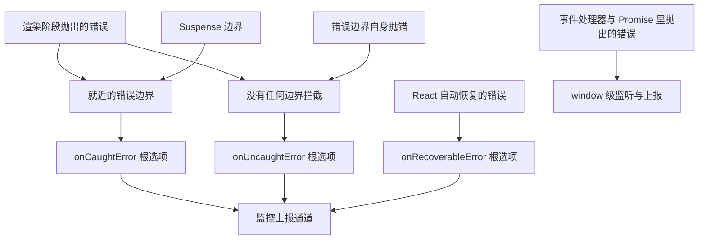
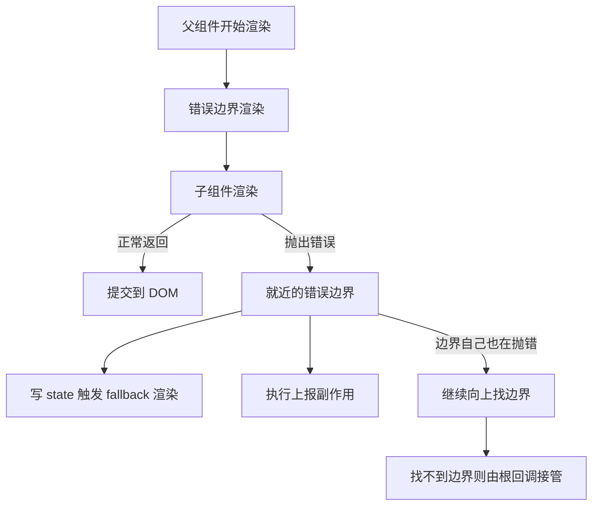
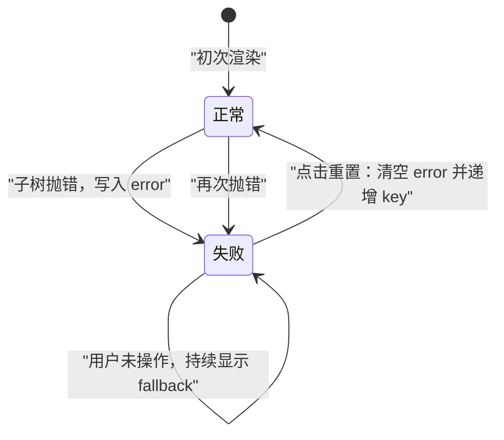
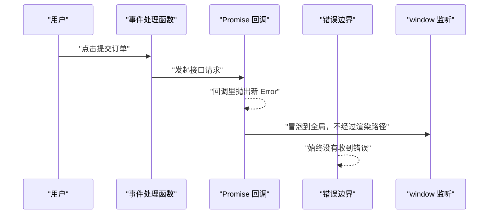
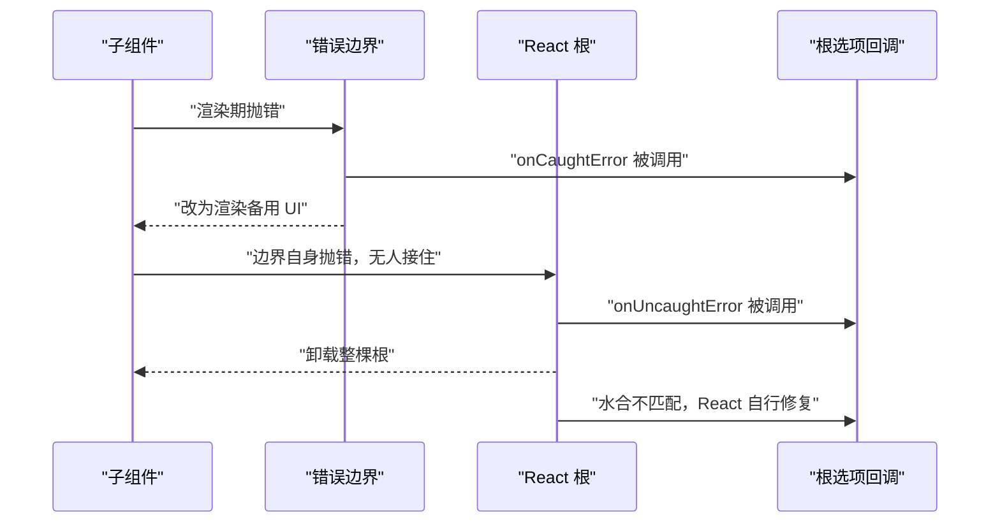
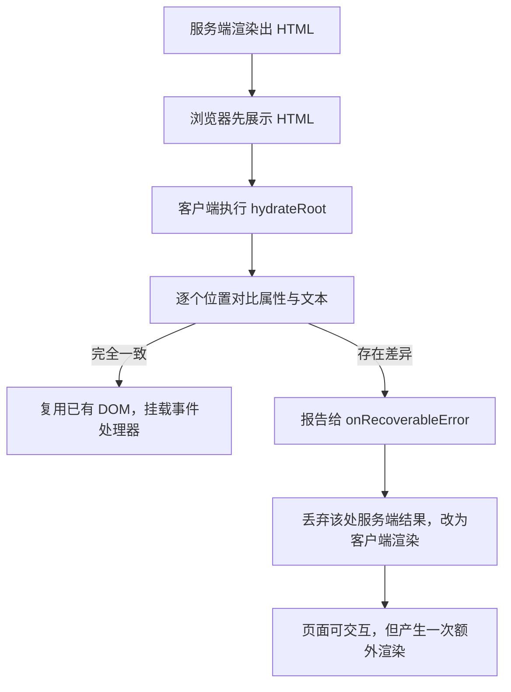
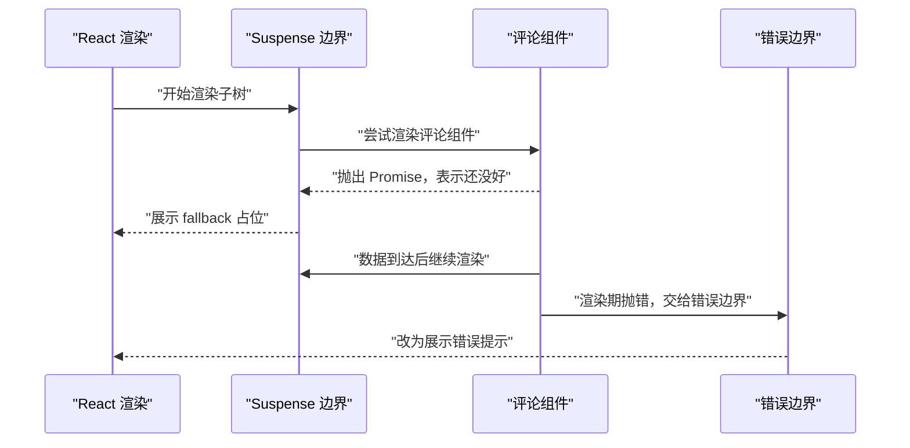
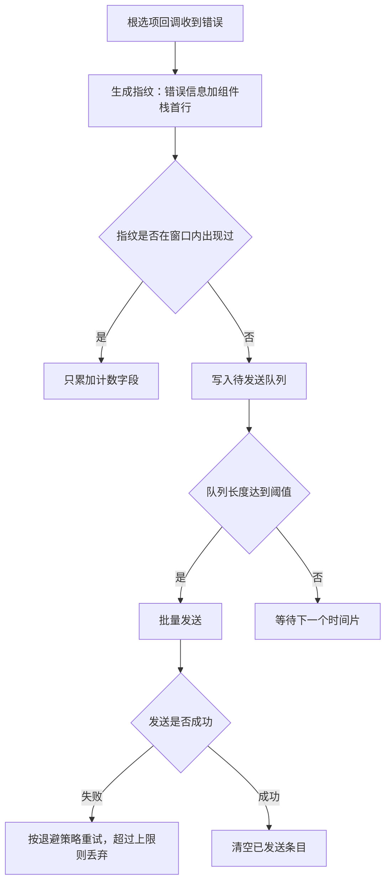
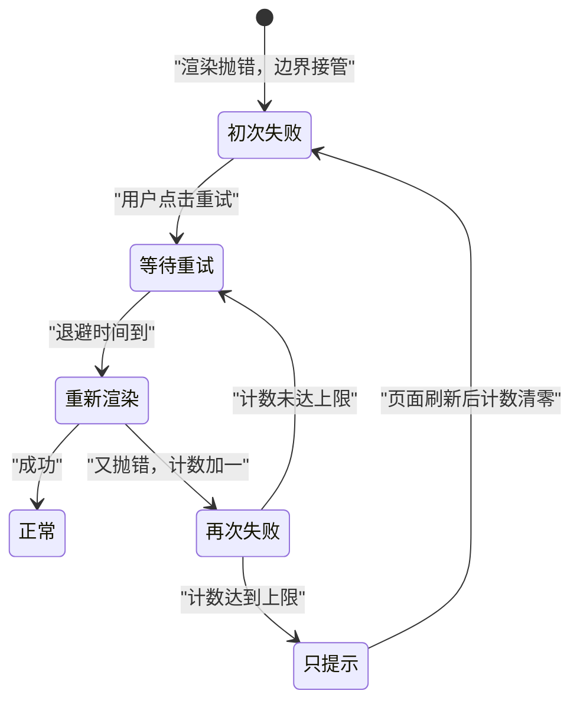

# React 19 的错误处理：错误边界与根级回调

!!! abstract "学完这一页你能"
    - 判断一段抛错代码会被哪个错误边界接住，并说出判断依据。
    - 手写一个带重置能力的错误边界类组件，并说明它什么时候能恢复、什么时候不能。
    - 在 `createRoot` 的三个根选项回调里分流错误，把每类错误送到对应通道。
    - 解释水合不匹配为什么走 `onRecoverableError`，并写脚本复现它。

!!! note "术语：错误边界（Error Boundary）"
    定义：一个实现了错误捕获生命周期方法的类组件。它的子树在渲染期抛错时，它会改为渲染备用 UI。
    例子：`<ErrorBoundary fallback={<p>图表加载失败</p>}><Chart /></ErrorBoundary>`，`Chart` 抛错时只显示那行文字。

## 0. 知识地图



建议先读第 1 节和第 2 节，把"边界接住谁"这件事弄准。
再读第 4 节和第 5 节，把 React 19 的三个根选项落到你的启动代码里。
最后读第 7 节和第 8 节，把上报与恢复策略串成一条链路。

!!! note "术语：根（root）"
    定义：`createRoot` 返回的对象，它接管某个 DOM 节点内部的全部渲染工作。
    例子：`const root = createRoot(document.getElementById('root'), options)`，第二参数放本页要讲的三个错误回调。

## 1. 错误边界接住什么，接不住什么

**先想一个问题**

商品详情页里有个图表组件，接口返回的字段缺失，组件渲染时读了 `undefined.length`。
整页白屏，连"加入购物车"按钮都点不了。你希望只有图表区域变成一块提示，其余部分照常用。

!!! tip "心智模型"
    一句话模型：错误边界是"渲染阶段的局部 try/catch"，它写在树里的位置决定了它能接住谁。
    日常类比：一栋楼每层各装一个配电箱，某层短路只跳那层的闸，其他楼层灯还亮。
    类比不成立的地方：楼里的配电箱保护整层所有用电，而错误边界只覆盖"渲染子树"这一条路径。事件处理函数和 Promise 回调不在这一条路径上，边界管不到。
    !!!

**图解**



1. 渲染从父组件往下走，遇到错误边界时先渲染边界组件本身。
2. 边界继续渲染它的 `children`，也就是被保护的子树。
3. 子树正常返回，React 把结果提交到 DOM，此时没有错误发生。
4. 子树在渲染期抛出错误，React 停止这条分支，向上找最近的错误边界。
5. 边界被激活，写入错误状态，下次渲染输出备用 UI。
6. 如果边界组件自身也抛错，React 跳过它，继续向上找下一个边界。

**一步一步来**

第 1 步：把边界放在"你愿意一起降级"的范围外面。

```jsx
<Layout>
  <Header /> {/* 不在边界内，图表出错时它照常渲染 */}
  <ErrorBoundary fallback={<p>图表加载失败</p>}>
    <Chart />
    <ChartLegend /> {/* 与 Chart 一起降级 */}
  </ErrorBoundary>
</Layout>
```

**这段代码在做什么**

- `ErrorBoundary` 的 `children` 是它保护的整棵子树。
- `Header` 写在边界外面，图表出错不会影响它的渲染。
- `ChartLegend` 与 `Chart` 一起降级，因为它们同属一个业务块。
- 放边界的位置就是"可接受的降级颗粒度"，这是设计决策而不是技术限制。
- 边界越靠下，保住的页面越多，需要写的边界数量也越多。

第 2 步：用类组件实现捕获逻辑。

```jsx
class ErrorBoundary extends React.Component {
  state = { error: null };

  // 渲染阶段调用，只做一件事：把错误记进 state
  static getDerivedStateFromError(error) {
    return { error };
  }

  // 提交阶段调用，可以在这里做副作用，比如上报
  componentDidCatch(error, errorInfo) {
    reportToServer(error, errorInfo.componentStack);
  }

  render() {
    if (this.state.error) {
      return this.props.fallback; // 出错后渲染备用 UI
    }
    return this.props.children; // 正常时渲染子树
  }
}
```

**这段代码在做什么**

- `getDerivedStateFromError` 是静态方法，它只返回新的 state 片段，不做副作用。
- `componentDidCatch` 在提交阶段执行，适合发网络请求上报。
- `errorInfo.componentStack` 是出错位置对应的组件栈字符串。
- `render` 用 `state.error` 决定输出备用 UI 还是子树。
- 这两个方法都属于类组件能力，函数组件目前没有等价的捕获写法，需核对官方文档：React 官方文档中错误边界章节列出的可用写法。

运行结果：把上面的组件包住一个必然抛错的子组件，页面显示 `fallback` 的内容，控制台不再白屏。

**动手验证**

依赖：`react@19`、`react-dom@19`（小版本号需核对官方文档）。
脚本用 `createElement` 代替 JSX，这样不需要构建工具。

```js
// check-boundary.mjs
import assert from 'node:assert/strict';
import { createElement as h, Component } from 'react';
import { renderToString } from 'react-dom/server';

class Boundary extends Component {
  constructor(props) {
    super(props);
    this.state = { failed: false };
  }
  static getDerivedStateFromError() {
    return { failed: true }; // 渲染阶段标记失败
  }
  render() {
    return this.state.failed ? h('p', null, 'fallback') : this.props.children;
  }
}

function Boom() {
  throw new Error('boom'); // 渲染阶段抛出
}

const withBoundary = renderToString(h(Boundary, null, h(Boom)));
assert.ok(withBoundary.includes('fallback'));
console.log('有边界输出:', withBoundary);

assert.throws(() => renderToString(h(Boom)), /boom/);
console.log('无边界：渲染函数直接抛出 boom');
```

预期输出：

```text
有边界输出: <p>fallback</p>
无边界：渲染函数直接抛出 boom
```

控制台可能额外打印 React 的警告信息，这属于预期。若输出与断言不一致，需核对官方文档：错误边界在服务端渲染中的行为。

**常见坑**

| 现象 | 原因 | 怎么修 |
| --- | --- | --- |
| 边界包住了组件，错误还是冒到根 | 抛错发生在事件处理函数里 | 在事件处理函数内部用 try/catch，见第 3 节 |
| 整个子树消失，fallback 不显示 | 写的是函数组件，没有捕获方法 | 改成类组件，或用官方推荐的库组件 |
| 上报拿不到出错位置 | 只传了 error，没传 componentStack | 在 `componentDidCatch` 里读取第二个参数的 `componentStack` |
| 刷新后错误消失，无法复现 | 错误来自一次性脏数据 | 在上报里带上触发条件，例如路由与接口参数 |

**用在哪里**

场景一：电商商品列表的虚拟滚动。
业务背景：列表里每行商品卡片依赖后端字段，个别卡片字段缺失会让整页白屏。
这一节的知识怎么用：把虚拟列表的每一行包一层边界，单行渲染失败时那一行显示"商品信息加载失败"。
用什么指标衡量收益：白屏页面的占比，以及用户在该页的下单转化。
什么时候不该用：整行数据来自同一个接口且同一次请求时，为每行加边界只会增加代码量，改为整列表一个边界。

场景二：后台管理的仪表盘。
业务背景：一个页面并排放 6 个图表卡片，各自调用不同接口。
这一节的知识怎么用：每个卡片一个边界，某个图表的数据格式异常只影响它自己。
用什么指标衡量收益：仪表盘可交互时长，以及错误发生后用户继续操作的比例。
什么时候不该用：卡片之间共享同一份状态时，单独降级会出现数据互相矛盾，改为整块降级。

**行业实践**

- React 官方文档在 `createRoot` 的 `options` 一节里，把错误回调集中定义在根上。可借鉴的做法是：不要在业务组件里散落 `console.error`，把错误统一交给根回调分流。
- React 19 发布博文提到，Actions 在请求失败时会显示错误边界，并自动把乐观更新回滚到原值。可借鉴的做法是：把表单提交这类异步写入改成 Action 形式，让失败态自动进入你已经写好的边界。
- React 官方文档在错误边界章节列出了它不捕获的场景。可借鉴的做法是：照着那份清单逐条对照你的项目，把缺口交给全局监听补上。

**小结**

- 错误边界是渲染期的局部 try/catch，位置决定捕获范围。
- 它需要类组件的两个方法配合，一个写 state，一个做副作用。
- 它管不到事件处理函数和 Promise 回调，这是设计边界，不是缺陷。

## 2. 手写一个可重置的错误边界

**先想一个问题**

接口偶发超时导致图表崩了，用户点了一下"重试"，你希望图表重新渲染。
但错误边界记住的是 `state.error`，不清掉它就永远显示 fallback。怎么把这次的错误状态清干净？

!!! tip "心智模型"
    一句话模型：可重置的错误边界 = 错误状态 + 子树身份标识，两者一起清空才算真正重置。
    日常类比：跳闸后重新合闸，同时要把那一路的故障设备换掉，否则合闸再跳。
    类比不成立的地方：合闸是物理动作，一定会重新通电；而 React 只有在子树身份变化时才会重新挂载组件，所以你必须显式改 key。
    !!!

!!! note "术语：key"
    定义：写在元素上的字符串或数字，React 用它判断两次渲染中同一个位置的组件是不是同一个实例。
    例子：`<Chart key={retryCount} />`，`retryCount` 增加时 React 卸载旧 Chart 并挂载新的 Chart。

**图解**



1. 初次渲染进入"正常"状态，输出子树。
2. 子树抛错，边界写入 error，进入"失败"状态并显示 fallback。
3. 在失败状态里用户没有操作，边界保持 fallback，不会自己恢复。
4. 用户点击重置，边界清空 error，同时把 key 加一，进入"正常"状态。
5. 回到正常状态后如果又抛错，流程重来一遍，回到失败状态。

**一步一步来**

第 1 步：把 fallback 做成一个接收重置函数的渲染函数。

```jsx
// fallback 不再是固定的 JSX，而是一个函数，React 会把 reset 传进来
<ErrorBoundary
  fallback={(reset) => (
    <div>
      <p>图表加载失败</p>
      <button onClick={reset}>重试</button>
    </div>
  )}
>
  <Chart />
</ErrorBoundary>
```

**这段代码在做什么**

- `fallback` 改成函数后，边界可以把重置能力交给 UI 层。
- `reset` 由边界提供，业务组件不需要知道边界内部怎么实现。
- 点击"重试"时调用 `reset`，触发边界自身的状态更新。
- 用渲染函数而不是固定 JSX，是为了让降级 UI 里能放交互控件。

第 2 步：实现重置逻辑，同时换掉子树身份。

```jsx
class ResettableBoundary extends React.Component {
  state = { error: null };
  retryCount = 0; // 子树身份标识

  static getDerivedStateFromError(error) {
    return { error };
  }

  reset = () => {
    this.retryCount += 1;     // 换身份，强制重新挂载子树
    this.setState({ error: null }); // 清错误，回到正常渲染
  };

  render() {
    if (this.state.error) {
      return this.props.fallback(this.reset);
    }
    // 用 key 把 retryCount 传给子树，值变化时 React 重新挂载
    return React.cloneElement(this.props.children, {
      key: this.retryCount,
    });
  }
}
```

**这段代码在做什么**

- `retryCount` 存在实例上，重置时加一，作为子树的新身份。
- `setState({ error: null })` 让下一次渲染回到子树分支。
- `cloneElement` 把新 key 注入 `children` 的顶层元素。
- 加 key 是必需的：不加的话 React 会复用旧实例，组件内部残留的错误 state 还在。
- 重置不会自动重发请求，重发要由子组件的挂载副作用承担。

运行结果：点击"重试"后 fallback 消失，`Chart` 重新挂载，它的 `useEffect` 重新执行一次。

**动手验证**

这个脚本不经过 React 调度器，只验证状态迁移规则：捕获后进入失败态，重置后回到正常态并换身份。

```js
// check-reset.mjs
import assert from 'node:assert/strict';
import { Component } from 'react';

class ResettableBoundary extends Component {
  constructor(props) {
    super(props);
    this.state = { error: null };
    this.retryCount = 0;
  }
  static getDerivedStateFromError(error) {
    return { error }; // 只返回 state 片段
  }
  reset() {
    this.retryCount += 1;
    this.setState({ error: null });
  }
  render() {
    return this.state.error ? 'fallback' : 'children';
  }
}

const boundary = new ResettableBoundary({ children: null });
assert.equal(boundary.render(), 'children');

const patch = ResettableBoundary.getDerivedStateFromError(new Error('图表数据缺失'));
boundary.state = { ...boundary.state, ...patch };
assert.equal(boundary.state.error.message, '图表数据缺失');
assert.equal(boundary.render(), 'fallback');

boundary.state = { error: null }; // 模拟重置中的 setState 结果
boundary.retryCount += 1;
assert.equal(boundary.render(), 'children');
assert.equal(boundary.retryCount, 1);
console.log('失败态:', 'fallback', '| 重置后:', boundary.render(), '| 身份:', boundary.retryCount);
```

预期输出：

```text
失败态: fallback | 重置后: children | 身份: 1
```

**常见坑**

| 现象 | 原因 | 怎么修 |
| --- | --- | --- |
| 点了重试还是显示 fallback | 只清了 error，没换 key | 重置时同时递增 key |
| 重试后旧数据仍显示 | React 复用了子组件实例 | 递增 key 让子组件重新挂载 |
| 重试按钮点一次触发多次请求 | 子组件挂载副作用没有做清理 | 在副作用里返回清理函数，用 AbortController 取消请求 |
| 深层组件里还有一份错误 state | 重置只清了边界自己的 state | 用 key 换身份，让整棵子树重新初始化 |

**用在哪里**

场景一：数据分析看板的单卡片重试。
业务背景：查询接口偶发 502，用户希望不刷新页面就能重试单个图表。
这一节的知识怎么用：给每个卡片包可重置边界，fallback 里放"重试"，重置时换 key 让卡片重新请求。
用什么指标衡量收益：错误发生后用户留在页面的比例，以及重试成功率。
什么时候不该用：接口连续失败属于故障而非波动，此时重试按钮只会让用户反复点击，应显示故障公告。

场景二：在线文档的代码预览块。
业务背景：部分文档内嵌第三方组件的预览，组件初始化失败会带崩整篇文档。
这一节的知识怎么用：预览块外层包边界，提供"重新加载预览"入口，重置只影响这一块。
用什么指标衡量收益：文档页的可阅读时长，以及预览块的加载成功率。
什么时候不该用：预览块依赖同一个全局初始化脚本时，单独重置不会成功，应改为整页提示。

**行业实践**

- React 官方文档在 `createRoot` 的 `caveats` 一节指出，对同一个根重复调用 `render` 时 React 会尽量复用已有 DOM。可借鉴的做法是：重置场景不要依赖重复 `render`，而是用 key 表达"这是一棵新子树"。
- React 19 发布博文说明 `useOptimistic` 会在更新完成或出错时自动切回原值。可借鉴的做法是：把乐观更新的回滚交给 React，边界只负责显示降级 UI。
- React 官方文档在 `root.unmount` 一节说明卸载会移除树上的事件处理器与状态。可借鉴的做法是：整块功能下线时调用 `unmount`，而不是把边界重置当作卸载用。

**小结**

- 重置要同时做两件事：清错误状态、换子树身份。
- 只清状态不换 key，旧实例残留的内部状态会让问题复现。
- 重置不等于重发请求，重发交给子组件的挂载副作用。

## 3. 边界接不住的三类错误

**先想一个问题**

你在"提交订单"按钮的 `onClick` 里调用了接口，接口 500 时你在 `then` 里抛了一个 Error。
你期待页面显示错误提示，结果什么也没发生，用户看到的是按钮一直转圈。为什么边界没有反应？

!!! tip "心智模型"
    一句话模型：错误边界挂在 React 的渲染路径上，只有沿这条路径冒出的错误才会经过它。
    日常类比：小区门口的快递柜只处理送到柜子的包裹，你在自己车里拆快递出问题，柜子不知道。
    类比不成立的地方：快递柜至少能看到你取件记录，而错误边界连"事件处理函数抛错了"这件事都感知不到，二者没有联系。
    !!!

**图解**



1. 用户点击按钮，进入事件处理函数，这一段是普通 JavaScript 执行。
2. 事件处理函数发起请求并返回，渲染路径上的工作已经结束。
3. 请求失败后回调在另一个时间点执行，此时已离开渲染路径。
4. 回调里抛出的错误向上冒泡到全局，React 的边界收不到它。
5. 边界保持原样，所以页面上没有 fallback 出现。

**一步一步来**

第 1 步：确认 `try/catch` 只能拦住同步调用。

```js
let caught = null;
try {
  // 同步调用：错误在 try 块内抛出，可以被接住
  JSON.parse('{bad json}');
} catch (error) {
  caught = error;
}
console.log('同步错误被接住:', caught instanceof SyntaxError);
```

**这段代码在做什么**

- `JSON.parse` 在同一个执行栈里抛错，`try` 块能接住它。
- 这是"同步错误"的典型形态，边界在渲染期遇到的也是这种。
- 结论：凡是与渲染处于同一执行栈的错误，都可以被捕获机制处理。

运行结果：

```text
同步错误被接住: true
```

第 2 步：把同样的错误挪到异步回调里。

```js
let caught = null;
try {
  // 异步回调在未来某个时间点执行，try 块早已退出
  setTimeout(() => {
    throw new Error('定时器里抛出');
  }, 0);
} catch (error) {
  caught = error;
}
console.log('同步 try 是否接住异步错误:', caught !== null);
```

**这段代码在做什么**

- `setTimeout` 立刻返回，`try` 块随即结束。
- 回调在下一个时间片执行，抛出错误时已经没有 `catch` 在等它。
- 这就是事件处理函数与 Promise 回调的处境，边界同样接不到。
- 想接住它，需要在全局层面监听，或者在回调内部自己写 `try/catch`。

运行结果：

```text
同步 try 是否接住异步错误: false
```

第 3 步：分清三类漏网错误，分别安排去处。

| 错误来源 | 边界能否接住 | 建议的去处 |
| --- | --- | --- |
| 事件处理函数里同步抛错 | 不能 | 在函数内部用 try/catch，转成状态后展示 |
| Promise 拒绝与 async 函数抛错 | 不能 | 在调用处 catch，或走 `unhandledRejection` |
| 边界组件自身渲染抛错 | 不能 | 在它外层再包一层边界，或交给根回调 |

**这段代码在做什么**

- 表格按"错误出现的执行栈"分类，而不是按业务模块分类。
- 每一行给出一个确定的处理位置，避免出现无人负责的错误。
- 把它当成检查清单：上线前逐条确认你的项目里有对应的处理代码。

**动手验证**

依赖：Node 20+ 内置模块，无需安装任何包。

```js
// check-async-error.mjs
import assert from 'node:assert/strict';

// 第一段：同步 try/catch 拿不到 Promise 拒绝
let syncCaught = null;
try {
  Promise.reject(new Error('接口 500'));
} catch (error) {
  syncCaught = error;
}
assert.equal(syncCaught, null); // 确认拿不到

// 第二段：拒绝事件只在全局层面可见
const seen = [];
process.on('unhandledRejection', (reason) => {
  seen.push(reason.message);
  assert.equal(seen.length, 1);
  console.log('全局收到拒绝:', seen[0]);
});

// 第三段：await 恢复执行，等拒绝事件派发完
await new Promise((resolve) => setTimeout(resolve, 20));
console.log('同步 try 捕获结果:', syncCaught);
```

预期输出：

```text
全局收到拒绝: 接口 500
同步 try 捕获结果: null
```

**常见坑**

| 现象 | 原因 | 怎么修 |
| --- | --- | --- |
| 请求失败后页面无任何提示 | 错误在 Promise 回调里抛出，边界收不到 | 在调用处 catch，把结果写进 state |
| 加了 `process.on` 但浏览器里无效 | 该事件属于 Node，浏览器没有 | 浏览器用 `window.addEventListener` 监听对应事件 |
| async 函数里 throw 无人处理 | 返回的 Promise 被拒绝，没有 await | 给调用处加 try/catch，或显式 `.catch` |
| 边界内组件抛错但 fallback 不出现 | 抛错发生在事件回调而非渲染期 | 把错误转成 state，下一次渲染时抛出，但这样会放大影响范围，需谨慎 |

**用在哪里**

场景一：后台管理的批量导入。
业务背景：用户上传 500 行 CSV，逐行校验，个别行失败需要报给用户。
这一节的知识怎么用：把逐行校验放在异步任务里，用 try/catch 收集每行失败原因，汇总成结果表格。
用什么指标衡量收益：导入任务的成功率，以及用户重传文件的次数。
什么时候不该用：文件解析失败属于整体性问题时，逐行捕获只会产生 500 条重复原因，改为整体报错。

场景二：聊天应用的发送消息。
业务背景：发送失败时用户需要看到重发入口，而不是整页降级。
这一节的知识怎么用：在发送函数里 catch 错误，把消息标记为"发送失败"并提供重发按钮。
用什么指标衡量收益：消息发送成功率与重发成功率。
什么时候不该用：消息是本地缓存同步产生的，没有用户操作时，失败应静默重试而非提示。

**行业实践**

- React 官方文档在错误边界章节列明它不捕获的错误类型。可借鉴的做法是：把这份清单抄进团队的代码评审清单，评审时逐条对照。
- React 19 发布博文说明 Actions 提供了错误处理能力，请求失败时会显示错误边界。可借鉴的做法是：把关键的异步写入改成 Action 形式，让它们进入边界的保护范围。
- React 官方文档在 `createRoot` 的 `options` 一节说明 `onUncaughtError` 会在错误没有被边界捕获时调用。可借鉴的做法是：把这个回调当作最后一道告警通道，而不是日常错误提示通道。

**小结**

- 边界只覆盖渲染路径，事件处理函数与 Promise 回调都不在其中。
- 判断标准是"错误抛出的那一刻，渲染路径是否还在执行"。
- 漏网错误要么在调用处就地处理，要么交给全局监听。

## 4. React 19 的三个根选项回调

**先想一个问题**

团队要在监控平台区分两种事件：用户看到了降级 UI、用户看到了白屏。
不区分的话，告警会把所有情况混在一起，值班同事无法判断严重程度。React 19 提供了什么手段来分流？

!!! tip "心智模型"
    一句话模型：三个根选项按"错误最后落到哪里"分流，落到边界是 caught，落到根是 uncaught，被 React 自动修好是 recoverable。
    日常类比：医院分诊台按病情轻重把病人分到普通门诊、急诊和观察室。
    类比不成立的地方：分诊靠人的判断，而 React 的分流是确定性的，同一类错误每次都会进入同一个回调，不会因参数不同而换通道。
    !!!

!!! note "术语：componentStack"
    定义：出错位置对应的组件层级字符串，形如若干行 `at 组件名`。
    例子：错误发生在图表组件内时，这段字符串会从页面根组件一路列到出错的组件。

**图解**



1. 子组件在渲染期抛错，最近边界先收到它。
2. 边界告诉根"我接住了"，根调用 `onCaughtError`。
3. 边界渲染备用 UI，用户看到的是降级界面。
4. 边界自身抛错且没有外层边界，错误到达根。
5. 根调用 `onUncaughtError`，随后卸载根下的整棵树。
6. React 自己修复的问题（例如水合不匹配）进入 `onRecoverableError`。

**一步一步来**

第 1 步：在创建根时注册三个回调。

```js
import { createRoot } from 'react-dom/client';

const root = createRoot(document.getElementById('root'), {
  // 边界接住了错误，用户看到降级 UI
  onCaughtError(error, errorInfo) {
    log('caught', error, errorInfo.componentStack);
  },
  // 没有任何边界接住，整棵树被卸载
  onUncaughtError(error, errorInfo) {
    log('uncaught', error, errorInfo.componentStack);
  },
  // React 自动恢复，通常会重试渲染
  onRecoverableError(error, errorInfo) {
    log('recoverable', error, errorInfo.componentStack);
  },
});
```

**这段代码在做什么**

- 三个回调都挂在 `createRoot` 的第二个参数上，全局只需注册一次。
- 每个回调收到两个参数：错误对象和包含 `componentStack` 的信息对象。
- `onCaughtError` 适合记录"用户看到降级"这类可容忍事件。
- `onUncaughtError` 适合触发高优先级告警，它意味着页面主体已经不可用。
- `onRecoverableError` 适合做趋势统计，它的错误通常不打断用户。
- 部分可恢复错误会把原始原因挂在 `error.cause` 上，上报时可以一起带上。

运行结果：控制台按错误类别打印不同的日志前缀，监控平台按前缀分桶。

第 2 步：把三个回调接到不同的处理通道。

```js
const handlers = {
  // 可容忍：采样上报，用于统计降级率
  caught: (error, info) => monitor.sample('error.caught', error, info),
  // 严重：立即上报并触发告警
  uncaught: (error, info) => monitor.alert('error.uncaught', error, info),
  // 趋势：只计数量，不告警
  recoverable: (error, info) => monitor.count('error.recoverable', error, info),
};

function createAppRoot(domNode) {
  return createRoot(domNode, {
    onCaughtError: handlers.caught,
    onUncaughtError: handlers.uncaught,
    onRecoverableError: handlers.recoverable,
  });
}
```

**这段代码在做什么**

- 把三个回调抽成对象，测试时可以替换实现而不改创建根的代码。
- `caught` 通道做采样，避免同一个降级点反复上报。
- `uncaught` 通道直接告警，因为此时页面主体已经不可用。
- `recoverable` 通道只计数，用来观察水合问题的发生频率。
- 分流的意义在于：值班同事能一眼看出这是"部分降级"还是"整页不可用"。

第 3 步：确认回调只在浏览器端注册，服务端渲染项目用另一个入口。

```js
// 纯客户端应用使用 createRoot
import { createRoot } from 'react-dom/client';

// 服务端渲染过的页面必须改用 hydrateRoot，两者入口不同
import { hydrateRoot } from 'react-dom/client';
```

**这段代码在做什么**

- React 官方文档在 `createRoot` 的注意事项里写明：服务端渲染的应用不支持 `createRoot`。
- 服务端渲染过的页面要用 `hydrateRoot`，它为已经存在的 HTML 附加事件处理。
- 根选项回调在 `hydrateRoot` 上同样存在，具体参数名称需核对官方文档：`hydrateRoot` 的 options 一节。
- 选错入口的典型症状是页面内容被整体清空后重新渲染。

**动手验证**

依赖：`react@19`、`react-dom@19`、`jsdom`。
脚本在 Node 里构造 DOM 环境，再调用真实的 `createRoot`。

```js
// check-root-options.mjs
import assert from 'node:assert/strict';
import { JSDOM } from 'jsdom';

const dom = new JSDOM('<div id="root"></div>', { url: 'http://localhost' });
globalThis.window = dom.window;
globalThis.document = dom.window.document;
globalThis.navigator = dom.window.navigator;

const { createElement: h, Component } = await import('react');
const { createRoot } = await import('react-dom/client');

const seen = [];
class Boundary extends Component {
  constructor(props) { super(props); this.state = { failed: false }; }
  static getDerivedStateFromError() { return { failed: true }; }
  render() { return this.state.failed ? h('p', null, 'fallback') : this.props.children; }
}
function Boom() { throw new Error('渲染出错'); }

const root = createRoot(document.getElementById('root'), {
  onCaughtError: (error, info) => seen.push(['caught', error.message, typeof info.componentStack]),
  onUncaughtError: (error, info) => seen.push(['uncaught', error.message, typeof info.componentStack]),
});

root.render(h(Boundary, null, h(Boom)));
await new Promise((resolve) => setTimeout(resolve, 50));

console.log('回调记录:', seen);
assert.ok(seen.some(([kind]) => kind === 'caught'));
```

预期输出：

```text
回调记录: [ [ 'caught', '渲染出错', 'string' ] ]
```

若本地运行时序不同导致记录为空，需核对官方文档：根选项回调的触发时机。

**常见坑**

| 现象 | 原因 | 怎么修 |
| --- | --- | --- |
| 三个回调都没被调用 | 注册在了 `hydrateRoot` 场景却用了 `createRoot` | 服务端渲染页面改用 `hydrateRoot` |
| `onUncaughtError` 被频繁触发 | 页面缺少边界，任何渲染错误都直达根 | 在业务区块外层补边界 |
| 上报的日志定位不到组件 | 只上报了 message，丢掉了 `componentStack` | 把 `errorInfo.componentStack` 一起上报 |
| 告警风暴 | `onRecoverableError` 也走了告警通道 | 该通道只计数，不触发告警 |

**用在哪里**

场景一：面向 C 端的营销活动页。
业务背景：活动页嵌入多个运营配置模块，配置错误会让页面出现空白区域。
这一节的知识怎么用：`onCaughtError` 统计各模块降级次数，配置团队按次数修复数据。
用什么指标衡量收益：模块降级率，以及修复后的复现次数。
什么时候不该用：活动页只有单一模块时，单独区分 caught 与 uncaught 没有收益。

场景二：企业内部的低代码平台。
业务背景：用户自己拼装的页面组件质量参差，错误来源分散。
这一节的知识怎么用：`onUncaughtError` 作为平台级告警，`onCaughtError` 用于给用户展示"哪个组件出错了"。
用什么指标衡量收益：用户搭建页面的保存成功率与错误自愈率。
什么时候不该用：平台已经给每个组件生成了单独的 iframe 隔离时，错误不会进入主根的回调。

**行业实践**

- React 官方文档 `createRoot` 的 `options` 一节定义了三个回调的调用条件与参数。可借鉴的做法是：把这份定义写成团队的上报字段规范，三个通道使用三套字段。
- React 19 发布博文说明 Actions 会自动管理提交中的数据、错误与乐观更新。可借鉴的做法是：把根回调的 caught 通道与 Action 失败态对齐，便于统计表单类错误。
- React 官方文档 `root.unmount` 一节说明卸载会移除树上的事件处理器与状态。可借鉴的做法是：微前端场景在子应用卸载时调用它，避免残留的根继续上报。

**小结**

- 三个根选项按错误的去向分流，不是按错误类型分流。
- `onUncaughtError` 意味着根下整棵树被卸载，适合直接告警。
- 注册位置只有一处，服务端渲染项目要换成 `hydrateRoot`。

## 5. 水合错误的差异输出

**先想一个问题**

服务端渲染的商品价格是 99 元，客户端用本地时间重新计算后渲染成 89 元。
页面没有白屏，价格却会在加载后跳一下。这类问题在 React 19 里由哪个回调报告？

!!! tip "心智模型"
    一句话模型：水合是"客户端给服务端 HTML 补上交互能力"的过程，两边对不上时 React 会丢掉服务端结果重新渲染客户端版本。
    日常类比：两个人对同一份清单，先按甲的清单装好箱，开箱时发现乙的清单不一样，于是按乙的清单重装。
    类比不成立的地方：重装需要时间，而 React 的重新渲染在多数情况下快到用户察觉不到，代价体现在交互响应和资源消耗上，不体现在视觉停顿上。
    !!!

!!! note "术语：水合（hydration）"
    定义：客户端读取服务端生成的 HTML，为其挂载组件实例和事件处理器，使页面变成可交互状态。
    例子：`hydrateRoot(document.getElementById('root'), <App />)` 会把已有 HTML 接管过来，而不是清空重建。

**图解**



1. 服务端先把组件渲染成 HTML 字符串，浏览器在网络返回后立即展示。
2. 客户端脚本下载完成后调用 `hydrateRoot`，开始接管这份 HTML。
3. React 从上到下对比服务端结果与客户端渲染结果。
4. 两边一致的位置直接复用 DOM，只补上事件处理器。
5. 存在差异的位置报告给 `onRecoverableError`，并改为以客户端结果为准。
6. 页面最终可交互，代价是多了一次渲染和一份额外的错误记录。

**一步一步来**

第 1 步：制造一处必然不匹配的文本。

```jsx
// 服务端与客户端使用不同的时间源，输出必然不同
function Price({ serverPrice }) {
  // 服务端传入 99，客户端首次渲染用本地计算得到 89
  const clientPrice = serverPrice - 10;
  return <p>{clientPrice}</p>;
}
```

**这段代码在做什么**

- 组件在服务端和客户端都执行一次，输入不同就会输出不同文本。
- 这类差异不会抛错，所以不进 `onCaughtError`，也不进 `onUncaughtError`。
- 它属于 React 能够自行处理的问题，因此进入可恢复通道。
- 避免它的做法是把计算结果固定在服务端，客户端只读不重算。

第 2 步：观察这类错误进入哪个回调。

```js
import { hydrateRoot } from 'react-dom/client';

const root = hydrateRoot(document.getElementById('root'), <App />, {
  onRecoverableError(error, errorInfo) {
    // 水合不匹配会走到这里，而不是 caught 或 uncaught
    report('hydration', error, errorInfo.componentStack);
  },
});
```

**这段代码在做什么**

- `hydrateRoot` 是服务端渲染页面的唯一入口，`createRoot` 在这里不受支持。
- 水合阶段的问题由 `onRecoverableError` 承接，这个回调的名字就说明了它的定位。
- 上报时建议单独打一个类别，避免和运行期崩溃混在同一个看板。
- React 19 对水合错误信息的差异描述有改进，具体格式需核对官方文档：React 19 发布博文中关于错误信息改进的章节。

第 3 步：把水合错误与运行期错误分开统计。

```js
const buckets = { hydration: 0, runtime: 0 };

function reportHydration(error, info) {
  buckets.hydration += 1;             // 水合问题单独计数
  send('hydration_mismatch', error, info);
}

function reportRuntime(error, info) {
  buckets.runtime += 1;               // 运行期崩溃单独计数
  send('runtime_crash', error, info);
}
```

**这段代码在做什么**

- 两个计数器放在不同桶里，看板上就能回答"这周问题主要来自水合还是运行期"。
- 水合问题通常成批出现，与版本发布强相关，适合按版本号聚合。
- 运行期崩溃更随机，适合按页面路由聚合。
- 分开统计的前提是回调本身分开注册，不要用一个函数接所有错误。

**动手验证**

依赖：`react@19`、`react-dom@19`、`jsdom`。
脚本让服务端 HTML 与客户端渲染结果刻意不一致，观察回调是否被调用。

```js
// check-hydration.mjs
import assert from 'node:assert/strict';
import { JSDOM } from 'jsdom';

const dom = new JSDOM('<div id="root"><p>服务端文字</p></div>', { url: 'http://localhost' });
globalThis.window = dom.window;
globalThis.document = dom.window.document;
globalThis.navigator = dom.window.navigator;

const { createElement: h } = await import('react');
const { hydrateRoot } = await import('react-dom/client');

const seen = [];
hydrateRoot(document.getElementById('root'), h('p', null, '客户端文字'), {
  onRecoverableError: (error, info) => seen.push([error.message, typeof info.componentStack]),
});

await new Promise((resolve) => setTimeout(resolve, 50));
console.log('onRecoverableError 收到条数:', seen.length);
assert.ok(seen.length >= 1); // 不匹配必须被报告
```

预期输出：

```text
onRecoverableError 收到条数: 1
```

若条数为 0，说明对比没有触发，需核对官方文档：水合不匹配的判定条件。

**常见坑**

| 现象 | 原因 | 怎么修 |
| --- | --- | --- |
| 页面加载后文字闪一下 | 客户端重算导致水合不匹配 | 把结果在服务端算好并透传 |
| 回调完全没被调用 | 用的是 `createRoot` 而非 `hydrateRoot` | 服务端渲染页面改用 `hydrateRoot` |
| 时间相关组件每次都报 | 服务端与客户端时间源不同 | 首屏渲染使用固定时间，挂载后再更新 |
| 上报量突增但页面无异常 | 水合不匹配被当成崩溃统计 | 按回调类别分开计数与告警 |

**用在哪里**

场景一：新闻站的文章详情页。
业务背景：正文由服务端渲染，首屏直出，客户端只补交互。
这一节的知识怎么用：给文章页注册水合专用的上报通道，发现不匹配时按文章模板定位。
用什么指标衡量收益：水合不匹配的页面占比，以及首屏可交互时间。
什么时候不该用：页面本身是纯客户端渲染时，这个通道不会有数据，不需要配置。

场景二：跨时区的电商促销页。
业务背景：倒计时与价格随用户时区变化，服务端与客户端计算结果容易不同。
这一节的知识怎么用：倒计时首屏用服务端时间渲染占位，挂载后再切换到本地时间，避免不匹配。
用什么指标衡量收益：水合不匹配次数与首屏价格跳变次数。
什么时候不该用：页面本来就是动态渲染且不预渲染时，不存在水合对比。

**行业实践**

- React 官方文档 `createRoot` 的注意事项写明：服务端渲染的应用要用 `hydrateRoot`。可借鉴的做法是：把入口选择写进项目的启动模板，避免两套入口混用。
- React 官方文档在 `onRecoverableError` 的说明中提到，部分可恢复错误会把原始原因放在 `error.cause`。可借鉴的做法是：上报时把 `cause` 一并序列化，便于定位被包装的底层错误。
- React 19 发布博文列出 Actions 会自动回滚乐观更新。可借鉴的做法是：把服务端与客户端不一致的展示逻辑改由 Action 结果驱动，从源头减少不匹配。

**小结**

- 水合不匹配不抛错，进入的是可恢复通道。
- 它适合单独计数，不适合触发高优先级告警。
- 从源头避免的办法是让首屏结果在服务端确定下来。

## 6. Suspense 与错误边界的组合

**先想一个问题**

页面里有一个懒加载的评论列表，外面包着 `Suspense`，再外面包着错误边界。
评论接口返回 500 时，用户看到的是加载占位图一直转，还是错误提示？

!!! tip "心智模型"
    一句话模型：Suspense 负责"还没好"，错误边界负责"坏了"，两者处理的是不同状态。
    日常类比：餐厅里叫号屏显示"正在出餐"，是等待状态；后厨着火要停业，是故障状态。
    类比不成立的地方：叫号和停业由同一个店员宣布，而 Suspense 与错误边界是两个组件，各自只认自己那一种信号。
    !!!

!!! note "术语：Suspense"
    定义：React 的组件，在子树还没有准备好渲染内容时，先展示 `fallback` 属性指定的占位内容。
    例子：`<Suspense fallback={<Spinner />}><Comments /></Suspense>`，`Comments` 等待数据期间显示 `Spinner`。

**图解**



1. React 渲染到 `Suspense` 边界，继续向下渲染评论组件。
2. 评论组件抛出一个 Promise，表示数据还未就绪。
3. `Suspense` 接住这个信号，改为展示占位内容。
4. 数据到达后 React 重新渲染评论组件，这一次可能成功。
5. 如果这次渲染抛出的是 Error 而不是 Promise，信号交给错误边界。
6. 错误边界渲染错误提示，占位内容被替换掉。

**一步一步来**

第 1 步：把两个边界按正确顺序嵌套。

```jsx
// 错误边界在外，Suspense 在内
<ErrorBoundary fallback={<p>评论加载失败</p>}>
  <Suspense fallback={<p>评论加载中</p>}>
    <Comments /> {/* 加载中抛 Promise，失败时抛 Error */}
  </Suspense>
</ErrorBoundary>
```

**这段代码在做什么**

- 错误边界在外层，这样它能接住 `Comments` 的渲染错误。
- `Suspense` 在内层，它只处理"未就绪"信号。
- 如果顺序写反，`Suspense` 无法接住错误，错误会越过它继续向上。
- 两层各司其职：一层表达等待，一层表达故障。

第 2 步：让组件区分"未就绪"和"已失败"两种信号。

```jsx
function Comments({ commentsPromise }) {
  // use 会读到缓存过的 Promise，未就绪时抛出 Promise 触发挂起
  const comments = use(commentsPromise);
  if (comments.length === 0) {
    throw new Error('评论数据为空'); // 抛 Error，交给错误边界
  }
  return comments.map((item) => <p key={item.id}>{item.text}</p>);
}
```

**这段代码在做什么**

- `use` 读取 Promise 时，未就绪会抛出 Promise 让最近的 `Suspense` 介入。
- 数据已就绪但内容不符合预期时，抛出的 Error 交给错误边界。
- 两种信号类型不同，React 据此选择不同的边界。
- React 官方文档提示 `use` 不支持在渲染中创建的 Promise，官方给出的原文是组件被未缓存的 Promise 挂起。需要交给支持缓存的库或框架提供 Promise。

第 3 步：确认 Action 失败时的行为差异。

```jsx
function ChangeName({ name }) {
  // Action 提交失败时，React 会把错误交给错误边界显示
  const [error, submitAction, isPending] = useActionState(
    async (previousState, formData) => {
      const result = await updateName(formData.get('name'));
      if (result) return result; // 返回错误，交给表单展示
      return null;
    },
    null,
  );

  return (
    <form action={submitAction}>
      <input type="text" name="name" />
      <button type="submit" disabled={isPending}>更新</button>
      {error && <p>{error}</p>}
    </form>
  );
}
```

**这段代码在做什么**

- React 19 发布博文说明 Actions 提供了错误处理，请求失败时可以显示错误边界。
- `useActionState` 返回的第一个值是上一次 Action 的结果，这里用来承载错误。
- `isPending` 由 React 自动维护，从请求开始到状态提交完成。
- `useOptimistic` 配合使用时，失败会回滚到原值，这部分不需要你手写回滚逻辑。
- 这只覆盖通过 Action 发起的写入；裸调用 Promise 的失败仍然不进边界。

**动手验证**

依赖：Node 20+ 内置模块。
下面验证分流规则本身：同一棵子树先后抛出 Promise 与 Error，只有 Error 会被交给故障分支。

```js
// check-suspense-routing.mjs
import assert from 'node:assert/strict';

function route(signal) {
  if (signal instanceof Promise) return 'suspense';   // 未就绪
  if (signal instanceof Error) return 'error-boundary'; // 故障
  return 'render';
}

assert.equal(route(Promise.resolve()), 'suspense');
assert.equal(route(new Error('接口 500')), 'error-boundary');
assert.equal(route(null), 'render');

// 模拟一次渲染：先挂起，后失败
const timeline = [];
timeline.push(['第一次渲染', route(Promise.resolve())]);
timeline.push(['数据到达后再次渲染', route(new Error('评论数据为空'))]);
console.log(timeline.map(([stage, target]) => stage + ' -> ' + target).join('\n'));
```

预期输出：

```text
第一次渲染 -> suspense
数据到达后再次渲染 -> error-boundary
```

这个脚本验证的是分类规则，不经过 React 运行时。

**常见坑**

| 现象 | 原因 | 怎么修 |
| --- | --- | --- |
| 接口 500 时占位图一直转 | 组件把失败也当成挂起处理 | 数据就绪后校验内容，异常时抛 Error |
| 错误提示被占位图盖住 | `Suspense` 包在错误边界外层 | 调整嵌套顺序，错误边界放外层 |
| `use` 报未缓存 Promise 的警告 | 在渲染过程中创建了 Promise | 由支持缓存的库或框架提供 Promise |
| Action 失败后表单值被清空 | 未受控表单在提交成功后自动重置 | 需要保留时改用受控组件，或核对官方文档中 `requestFormReset` 的用途 |

**用在哪里**

场景一：社交产品的动态流。
业务背景：动态流分页加载，首屏之外的内容按需拉取。
这一节的知识怎么用：外层错误边界负责"这一屏加载失败"，内层 `Suspense` 负责"正在加载下一屏"。
用什么指标衡量收益：动态流加载失败后的重试率与停留时长。
什么时候不该用：动态流内容由同一次请求返回时，拆两层只会增加状态分支。

场景二：SaaS 的报表导出页。
业务背景：报表数据量大，加载耗时明显，需要明确的等待反馈。
这一节的知识怎么用：`Suspense` 提供等待反馈，错误边界提供失败反馈与重试入口。
用什么指标衡量收益：导出任务成功率与失败后的重试成功率。
什么时候不该用：导出在服务端异步完成时，前端没有挂起状态，不需要 `Suspense`。

**行业实践**

- React 19 发布博文说明 `use` 会挂起直到 Promise 解析完成，并且不支持在渲染中创建的 Promise。可借鉴的做法是：把数据获取集中在支持缓存的框架层，组件只消费 Promise。
- React 19 发布博文说明 `useActionState` 返回上一次 Action 的结果与 pending 状态。可借鉴的做法是：表单类失败用返回结果就地展示，不要让它冒泡成整页降级。
- React 官方文档 `useOptimistic` 一节说明更新完成或出错时 React 会切回原值。可借鉴的做法是：把乐观 UI 与错误边界分工，回滚交给 React，降级交给边界。

**小结**

- `Suspense` 处理未就绪，错误边界处理已失败，信号类型不同。
- 嵌套顺序是错误边界在外、`Suspense` 在内。
- Action 失败会进入边界，裸 Promise 失败不会。

## 7. 把三类回调接进监控上报方案

**先想一个问题**

上线第一天你就在 `onCaughtError` 里直接发了一条请求，结果某个高频降级点每分钟触发 3000 次上报。
后端接口被你自己打挂了。上报通道应该怎么设计才算稳？

!!! tip "心智模型"
    一句话模型：上报通道要做三件事，去重、限流、分级，先保通道活着，再保信息完整。
    日常类比：消防喷淋不是每个烟头都喷一次水，而是先由探测器判断，再决定是否启动。
    类比不成立的地方：喷淋只有开与关两种状态，而上报通道要同时处理采样率、批量大小和重试次数三个旋钮。
    !!!

**图解**



1. 回调收到错误后，先用错误信息和组件栈首行拼出一个指纹。
2. 指纹在去重窗口内出现过，就只把计数加一，不新增队列条目。
3. 指纹是新的，就把条目写进待发送队列。
4. 队列达到阈值时批量发送，没达到就等下一个时间片。
5. 发送失败按退避策略重试，超过上限直接丢弃，避免拖垮页面。
6. 发送成功后清空已发送条目，队列回到初始状态。

!!! note "术语：指纹（fingerprint）"
    定义：把错误特征映射成稳定字符串的函数，同一种错误每次得到同一个值。
    例子：用错误信息拼接组件栈第一行，`图表数据缺失|at Chart` 就是一个指纹。

**一步一步来**

第 1 步：写一个稳定的指纹函数。

```js
function fingerprint(error, componentStack) {
  // 只取组件栈的第一行，避免行号变化导致指纹跳动
  const firstFrame = (componentStack || '').split('\n').map((s) => s.trim()).filter(Boolean)[0] || 'unknown';
  // 用固定分隔符拼接，便于拆解与统计
  return [error.name, error.message, firstFrame].join('|');
}
```

**这段代码在做什么**

- 指纹由错误名称、错误信息、组件栈首行三部分组成。
- 只取栈首行，是为了让同一处错误在不同构建下得到同一个指纹。
- 固定的分隔符让后续统计可以按字段拆分。
- 指纹的稳定性直接决定去重是否有效。

第 2 步：加一层去重窗口。

```js
const seenAt = new Map(); // 指纹到最近一次出现时间
const WINDOW_MS = 60000;  // 60 秒内相同指纹只记一次

function shouldSend(fp, now) {
  const last = seenAt.get(fp);
  if (last !== undefined && now - last < WINDOW_MS) {
    return false; // 窗口内重复，只累加计数
  }
  seenAt.set(fp, now);
  return true;
}
```

**这段代码在做什么**

- `seenAt` 记录每个指纹最近一次出现的时间戳。
- 60 秒内再次出现的相同指纹不新增条目，只累加计数。
- 时间窗口让上报量有上界，上界等于不同指纹的数量。
- 窗口长度需要按业务量调整，具体数值应由你的错误量决定。

第 3 步：分级与批量发送。

```js
const queue = [];

function enqueue(kind, error, componentStack) {
  const fp = fingerprint(error, componentStack);
  if (!shouldSend(fp, Date.now())) return;  // 重复的直接丢掉
  queue.push({ kind, fp, componentStack });
  if (queue.length >= 10) flush();          // 攒够 10 条发一次
}

function flush() {
  if (queue.length === 0) return;
  const payload = queue.splice(0, queue.length); // 先取走再发送
  transport.send(JSON.stringify(payload)).catch(() => {
    // 发送失败不重新入队，避免阻塞页面
  });
}
```

**这段代码在做什么**

- `enqueue` 是三个根回调的统一入口，`kind` 区分 caught、uncaught、recoverable。
- 攒够 10 条才发送，减少请求次数。
- 发送前先 `splice` 取走内容，避免发送期间队列被继续写入导致重复。
- 发送失败不再入队，宁可丢一条日志也不让页面卡住。
- `uncaught` 类型的条目建议立即发送，不参与批量攒批。

**动手验证**

依赖：Node 20+ 内置模块。

```js
// check-reporter.mjs
import assert from 'node:assert/strict';

function makeReporter() {
  const seenAt = new Map();
  const sent = [];
  const WINDOW_MS = 60000;

  function report(fp, now) {
    const last = seenAt.get(fp);
    if (last !== undefined && now - last < WINDOW_MS) return false;
    seenAt.set(fp, now);
    sent.push(fp);
    return true;
  }
  return { report, sent };
}

const reporter = makeReporter();
assert.equal(reporter.report('E|图表数据缺失|at Chart', 0), true);
assert.equal(reporter.report('E|图表数据缺失|at Chart', 1000), false); // 窗口内重复
assert.equal(reporter.report('E|图表数据缺失|at Chart', 61000), true); // 窗口外放行
assert.equal(reporter.report('E|接口 500|at Comments', 61001), true); // 不同指纹

console.log('上报条数:', reporter.sent.length);
console.log('上报内容:', reporter.sent.slice(1).join(' ; '));
```

预期输出：

```text
上报条数: 3
上报内容: E|图表数据缺失|at Chart ; E|接口 500|at Comments
```

**常见坑**

| 现象 | 原因 | 怎么修 |
| --- | --- | --- |
| 上报接口被自己打挂 | 每次都立即发送，没有去重 | 加指纹与时间窗口 |
| 同一个错误在平台里变成几十条 | 指纹里带了行号或随机值 | 指纹只用稳定的字段 |
| 大量丢日志但排查不到原因 | 队列满了直接丢，没有统计 | 增加丢弃计数字段一并上报 |
| 上报请求阻塞页面卸载 | 在 `unload` 时用同步请求 | 使用支持在页面隐藏时发送的方式，具体 API 需核对官方文档 |

**用在哪里**

场景一：面向海量用户的工具类产品。
业务背景：页面 PV 高，任何未去重的上报都会产生大量请求。
这一节的知识怎么用：在根回调入口做指纹去重与批量发送，把上报量控制在与错误种类数同阶。
用什么指标衡量收益：上报请求数与页面错误数的比值。
什么时候不该用：内部管理系统 PV 低，去重带来的收益不明显，直接上报更容易排查。

场景二：多租户的 SaaS 平台。
业务背景：需要按租户聚合错误，同时避免单个租户的异常刷满看板。
这一节的知识怎么用：指纹里带上租户标识，同时按租户限流。
用什么指标衡量收益：单个租户的上报量占比与看板可用性。
什么时候不该用：租户数量只有个位数时，人工筛选比自动限流省事。

**行业实践**

- React 官方文档 `createRoot` 的 `options` 一节区分了 caught、uncaught、recoverable 三种回调。可借鉴的做法是：上报字段里保留 `kind`，让后端能按类别分桶。
- React 19 发布博文说明可恢复错误可能带有原始原因。可借鉴的做法是：上报时把 `error.cause` 一起序列化，避免底层原因被吞掉。
- React 官方文档在错误边界章节列出它不捕获的场景。可借鉴的做法是：把这份清单与你的全局监听清单做一次对照，避免出现无人负责的错误。

**小结**

- 上报通道先做去重与限流，再谈信息完整。
- 指纹必须稳定，否则去重会失效。
- 发送失败时丢弃优于重试到卡住页面，除非是最高级别的告警。

## 8. 恢复策略：重置、重试与降级

**先想一个问题**

同一个图表在 10 秒内连续失败 3 次，你还让用户点"重试"吗？
如果每次都重试，用户会陷入"点击、失败、再点击"的循环，最终投诉的是产品体验而不是接口。

!!! tip "心智模型"
    一句话模型：恢复要设上限与间隔，超过上限就从"可重试"降级为"只提示"。
    日常类比：手机输错密码，前几次允许直接重输，之后要求等待一段时间。
    类比不成立的地方：等待时间由设备强制执行，而前端的退避只是一个约定，用户刷新页面就能绕过它。
    !!!

**图解**



1. 初次失败时边界接管，显示带重试按钮的降级 UI。
2. 用户点击重试，进入等待状态，等待时间随失败次数增加。
3. 等待结束后重新渲染子树，成功则回到正常状态。
4. 又失败时计数加一，未达上限则回到等待状态。
5. 计数达到上限后只显示提示文字，不再提供重试入口。
6. 用户刷新页面后计数重置，流程从头开始。

**一步一步来**

第 1 步：用指数退避计算等待时间。

```js
function delayFor(attempt, baseMs = 800, maxMs = 8000) {
  // 第 1 次失败等 baseMs，之后每次翻倍，超过上限则取上限
  const raw = baseMs * Math.pow(2, attempt - 1);
  return Math.min(raw, maxMs);
}

console.log([1, 2, 3, 4, 5].map((n) => delayFor(n)).join(','));
```

**这段代码在做什么**

- `attempt` 从 1 开始，表示这是第几次失败。
- 每次等待时间是上一次的两倍，用 `Math.pow` 计算。
- `maxMs` 给等待时间封顶，避免用户等待过久。
- 返回的毫秒数用于决定重试按钮何时可点击。

运行结果：

```text
800,1600,3200,6400,8000
```

第 2 步：把尝试次数与上限写进可重置边界。

```jsx
const MAX_ATTEMPTS = 3;

class RetryableBoundary extends React.Component {
  state = { error: null };

  static getDerivedStateFromError(error) {
    return { error };
  }

  reset = () => {
    // 失败次数达到上限后不再提供重试
    if (this.attempts >= MAX_ATTEMPTS) return;
    this.attempts += 1;
    this.setState({ error: null });
  };

  render() {
    if (this.state.error) {
      const exhausted = this.attempts >= MAX_ATTEMPTS;
      return exhausted
        ? <p>该模块暂时不可用，请稍后再试</p> // 只提示
        : this.props.fallback(this.reset);      // 提供重试
    }
    return React.cloneElement(this.props.children, { key: this.attempts });
  }
}
```

**这段代码在做什么**

- `attempts` 记录已经重试过的次数，上限为 3。
- 达到上限后 `reset` 直接返回，重试按钮也不再渲染。
- `key` 使用 `attempts`，每次重试都让子树重新挂载。
- 上限的具体数值应结合你的接口恢复时间与用户耐心决定。
- 刷新页面会重置实例，计数归零，这是可以接受的。

第 3 步：在成功渲染后把计数清零。

```jsx
componentDidUpdate(prevProps) {
  // 这次成功渲染出子树，说明恢复了，计数归零
  if (prevProps.resetToken !== this.props.resetToken && !this.state.error) {
    this.attempts = 0;
  }
}
```

**这段代码在做什么**

- 组件更新完成后判断是否处于正常状态。
- 正常状态下把重试计数归零，让下一次失败重新获得 3 次机会。
- `resetToken` 用来区分"用户主动切换了内容"这类正常更新。
- 具体清零时机需要按业务定义，需核对官方文档：类组件生命周期方法的调用时机。

**动手验证**

依赖：Node 20+ 内置模块。

```js
// check-backoff.mjs
import assert from 'node:assert/strict';

function delayFor(attempt, baseMs = 800, maxMs = 8000) {
  return Math.min(baseMs * Math.pow(2, attempt - 1), maxMs);
}

const MAX_ATTEMPTS = 3;
const attempts = [];

function canRetry(used) {
  return used < MAX_ATTEMPTS; // 达到上限后不再允许
}

assert.deepEqual([1, 2, 3, 4, 5].map((n) => delayFor(n)), [800, 1600, 3200, 6400, 8000]);
assert.equal(canRetry(0), true);
assert.equal(canRetry(2), true);
assert.equal(canRetry(3), false);

for (let used = 0; used < 5; used += 1) {
  attempts.push({ used, allowed: canRetry(used), wait: delayFor(used + 1) });
}
console.log(attempts.map((a) => `第${a.used + 1}次: 允许=${a.allowed} 等待=${a.wait}ms`).join('\n'));
```

预期输出：

```text
第1次: 允许=true 等待=800ms
第2次: 允许=true 等待=1600ms
第3次: 允许=true 等待=3200ms
第4次: 允许=false 等待=6400ms
第5次: 允许=false 等待=8000ms
```

**常见坑**

| 现象 | 原因 | 怎么修 |
| --- | --- | --- |
| 用户反复点击重试 | 没有次数上限与等待间隔 | 加尝试计数与退避等待 |
| 恢复后再次失败却无法重试 | 计数没有在成功时清零 | 在正常渲染分支里重置计数 |
| 重试后仍显示旧数据 | 子树被复用，内部状态残留 | 用 key 换子树身份 |
| 上限设得太低，用户失去恢复机会 | 上限值与接口恢复时间不匹配 | 按接口的实际恢复时间设定上限 |

**用在哪里**

场景一：移动端弱网环境下的内容流。
业务背景：用户在地铁里浏览，网络时断时续，失败是常态。
这一节的知识怎么用：给内容块加带退避的重试，达到上限后改为"网络不稳定"提示。
用什么指标衡量收益：弱网下的会话完成率与重试成功率。
什么时候不该用：检测到设备完全离线时，重试没有意义，应直接提示离线状态。

场景二：企业后台的实时数据看板。
业务背景：看板长期打开，偶发接口抖动，用户不会主动刷新页面。
这一节的知识怎么用：失败后自动按退避重试，不打扰用户；连续失败超过上限时提示手动刷新。
用什么指标衡量收益：看板自动恢复比例与人工刷新次数。
什么时候不该用：数据本身变化频率低时，自动重试的频率应随之降低。

**行业实践**

- React 官方文档在 `createRoot` 的 `caveats` 一节说明对同一个根重复调用 `render` 时 React 会尽量复用。可借鉴的做法是：重试时不要依赖重复 `render`，改用 key 表达新的子树。
- React 19 发布博文说明 `useOptimistic` 在更新出错时会自动切回原值。可借鉴的做法是：乐观 UI 的失败回滚交给 React，重试策略只管请求本身。
- React 官方文档在 `root.unmount` 一节说明卸载后不能再对同一个根调用 `render`。可借鉴的做法是：整块功能永久下线的场景，卸载后重新创建根，而不是在旧根上重试。

**小结**

- 恢复策略必须带次数上限与等待间隔，否则会把失败变成循环。
- 成功的渲染要把计数清零，否则用户失去后续恢复机会。
- 达到上限后从"可重试"切换到"只提示"，避免无意义的点击。

## 应用地图

| 场景 | 用到本页哪个知识点 | 典型技术选型 | 注意事项 |
| --- | --- | --- | --- |
| 商品详情页的图表与推荐位 | 错误边界的粒度、可重置边界 | React 类组件边界、路由级错误组件 | 边界放得太靠下会让每块都写一遍降级 UI |
| 表单提交失败提示 | `useActionState` 的返回值、Action 与边界的关系 | `useActionState`、`<form action>` | 返回的错误结果就地展示，不要让它冒泡成整页降级 |
| 服务端渲染的营销页 | `hydrateRoot` 与 `onRecoverableError` | 框架的水合入口、水合专用上报 | 客户端不要重算服务端已经算好的值 |
| 后台管理的仪表盘 | 三个根选项回调的分流 | `createRoot` 的 options | 可恢复通道只计数，不触发告警 |
| 动态流的懒加载模块 | `Suspense` 与错误边界的嵌套顺序 | `Suspense`、`use` | 错误边界必须在外层 |
| 全局错误的兜底 | 事件与 Promise 的漏网处理 | 全局错误监听与上报 | 与根回调的分工要写清楚，避免重复上报 |
| 多租户平台的上报 | 指纹、去重窗口与批量发送 | 指纹函数、上报队列 | 指纹必须稳定，字段里带上租户标识 |
| 弱网下的内容重试 | 指数退避与次数上限 | 边界重置加退避定时器 | 达到上限后切换为只提示 |

## 动手作业

目标：做一个"局部降级演示页"，把本页的错误边界、根选项回调、缓存上报三部分连起来。

步骤：

1. 搭建一个只有 3 个区块的页面：顶部导航、中间图表、底部列表。导航直接渲染，图表与列表各自包一层错误边界。
2. 给图表组件加一个"制造错误"的开关，打开时在渲染期抛出 Error，用来触发边界。
3. 在入口用 `createRoot` 注册三个根选项回调，把事件写入一个本地数组并打印到页面上。
4. 给图表的降级 UI 加"重试"按钮，重试时清空错误并换 key，重试超过 3 次后按钮消失，只留提示文字。
5. 在页面底部加一个按钮，在事件处理函数里抛一个 Error，观察根回调有没有收到。
6. 加一个指纹去重函数，同一个错误在 60 秒内只记录一次，页面上显示被去重掉多少次。

验收标准：

- 打开图表错误开关后，导航与列表照常渲染，只有图表区域变成降级 UI。
- 点击重试 3 次后按钮消失，页面显示"暂时不可用"的文字。
- 页面上的回调记录里，图表错误对应 caught 类别，组件栈字段是字符串。
- 按钮里抛出的错误没有出现在 caught 类别里，说明你确认了它的去向。
- 连续触发同一个图表错误 5 次，页面显示去重丢弃 4 次。
- 控制台没有出现未处理的 Promise 拒绝警告。

## 综合对比

| 维度 | 渲染期错误 | 事件处理函数错误 | Promise 拒绝 | 水合不匹配 | 边界自身错误 |
| --- | --- | --- | --- | --- | --- |
| 触发时机 | 渲染子树过程中 | 用户交互时 | 异步回调执行时 | 客户端接管 HTML 时 | 渲染边界组件本身时 |
| 是否被就近边界捕获 | 是 | 否 | 否 | 否 | 否，继续向上找 |
| 进入哪个根回调 | onCaughtError | 无（需全局监听） | 无（需全局监听） | onRecoverableError | onUncaughtError |
| 用户看到的界面 | 降级 UI | 取决于你的处理代码 | 取决于你的处理代码 | 通常无感知 | 整棵根卸载 |
| 能否自动恢复 | 否，需重置 | 否，需重试 | 否，需重试 | 是，React 自行修复 | 否 |
| 上报优先级 | 中，统计降级率 | 中 | 中 | 低，只计数 | 高，立即告警 |
| 典型修复动作 | 修组件的数据校验 | 在函数内 catch | 在调用处 catch 或加全局监听 | 让首屏结果在服务端确定 | 补外层边界或改组件实现 |

## 深入阅读与参考

!!! tip "怎么用这些资料"
    先读「官方文档与规范」建立准确的概念，再读「源码与示例」核对细节，最后用「教程、书籍与视频」换一种讲法加深理解。每条都写明了读哪一节、带着什么问题读。

### 官方文档与规范

| 资源 | 为什么读 | 怎么读 |
|---|---|---|
| [React 19 发布博客](https://react.dev/blog/2024/12/05/react-19) | React 19 第一手说明，含根选项回调与水合差异输出。 | 读 Actions 与水合相关小节，列出三个根回调的触发条件，再对照本页示例。 |
| [Client React DOM APIs](https://react.dev/reference/react-dom/client) | createRoot 与 hydrateRoot 的选项在此有权威定义。 | 查 createRoot、hydrateRoot 的 options 小节，抄下三个错误回调的签名再回正文。 |
| [Server React DOM APIs](https://react.dev/reference/react-dom/server) | 服务端渲染 API 参考，界定了水合失败与服务端错误的边界。 | 读 renderToPipeableStream 的 onError、onShellError 部分，想清楚错误在哪一端被接住。 |
| [<Suspense>](https://react.dev/reference/react/Suspense) | Suspense 官方参考，讲清它与错误边界的职责分工。 | 读 fallback 与错误处理说明，回答“Suspense 抛错谁来接”，再改写本页组合示例。 |
| [captureOwnerStack](https://react.dev/reference/react/captureOwnerStack) | 开发期获取 owner stack，定位错误来自哪条组件链。 | 在自定义错误边界里调用一次 captureOwnerStack，对比 console 里的组件栈输出。 |

### 源码与示例

| 资源 | 为什么读 | 怎么读 |
|---|---|---|
| [CHANGELOG.md](https://github.com/facebook/react/blob/main/CHANGELOG.md) | 官方变更记录，可核对 19 版错误处理与根选项的确切改动。 | 在 19.0.0 条目里搜 error、hydration、root 关键词，整理一份行为变更清单。 |
| [Build Your Own React](https://pomb.us/build-your-own-react/) | 手写简化版 React，理解组件树与渲染阶段，判断边界的覆盖范围。 | 跟着实现到 Fiber 协调一节，画出自己的组件树并标注错误边界的位置。 |

### 教程、书籍与视频

| 资源 | 为什么读 | 怎么读 |
|---|---|---|
| [Sentry React 指南](https://docs.sentry.io/platforms/javascript/guides/react/) | 演示错误边界接入监控上报的完整配置与组件栈验证。 | 跟着配置一次 ErrorBoundary 加 Sentry，确认上报带组件栈，再换成本页回调。 |
| [Josh Comeau：The Perils of Rehydration](https://www.joshwcomeau.com/react/the-perils-of-rehydration/) | 专讲水合不匹配的成因与修法，正对本页水合差异一节。 | 在自己的 SSR 项目复现一次 mismatch，按文中方案修好，记录控制台差异提示。 |
| [Overreacted：React as a UI Runtime](https://overreacted.io/react-as-a-ui-runtime/) | 从运行时视角解释渲染与协调，帮你判断错误传播路径。 | 分段读完，每节用一句话复述渲染流程，再回头定位边界能拦住的层级。 |
| [React Router 文档](https://reactrouter.com/home) | 路由层错误边界的实战做法，可与组件级边界对照分工。 | 读 loader、action 的错误处理小节，实现一个 loader 抛错的路由并观察降级 UI。 |

## 自测题

??? question "错误边界能不能捕获子组件在 useEffect 里抛出的错误？"
    不能。`useEffect` 的回调在提交阶段之后执行，已经离开渲染路径。
    它属于异步执行的回调，错误会冒泡到全局，边界收不到。
    想处理它，需要在副作用内部自己写 try/catch。
    判断依据是：错误抛出的那一刻，渲染路径是否还在执行。

??? question "createRoot 的三个根选项回调分别对应什么场景？"
    `onCaughtError`：错误被某个错误边界接住，用户看到降级 UI。
    `onUncaughtError`：没有任何边界接住，整棵根被卸载。
    `onRecoverableError`：React 自动恢复，水合不匹配属于这一类。
    三个回调都收到错误对象和包含组件栈的信息对象。
    部分可恢复错误会把原始原因放在 `error.cause` 上。

??? question "为什么可重置的错误边界一定要换 key？"
    因为 React 会按位置复用组件实例，只清错误状态时子树内部的状态还在。
    换 key 等于告诉 React 这是一棵新子树，旧实例被卸载，新的被挂载。
    挂载会重新执行副作用，请求因此重新发出。
    不换 key 的典型症状是：点了重试，界面恢复了，但数据还是旧的。

??? question "水合不匹配为什么不进 onCaughtError？"
    因为水合不匹配不会抛出错误，它只是两份结果不一致。
    React 能自行处理：丢弃不一致处的服务端结果，改为按客户端结果渲染。
    既然没人需要接住它，就不进 caught；页面也没崩，就不进 uncaught。
    它落在可恢复通道，适合用来统计趋势。

??? question "Suspense 和错误边界应该谁在外层？"
    错误边界在外层，Suspense 在内层。
    Suspense 只处理组件抛出的 Promise，也就是未就绪信号。
    Error 信号交给错误边界，如果 Suspense 在外层，它接不住 Error 会继续向上冒。
    顺序写反的典型症状是：接口失败时占位图一直转。

??? question "Actions 的失败与裸 Promise 的失败，处理上有什么差别？"
    React 19 发布博文说明 Actions 提供了错误处理，请求失败时可以显示错误边界。
    裸调用的 Promise 失败不在渲染路径上，边界收不到它。
    所以表单这类写入建议改成 Action 形式，让它进入边界的保护范围。
    `useOptimistic` 配合 Action 使用时，失败会自动回滚到原值。

??? question "上报通道为什么必须先做指纹去重？"
    因为同一个降级点会在每次渲染时重复触发回调。
    不去重的话，上报量取决于页面访问量而不是错误种类数。
    指纹用错误名称、错误信息、组件栈首行拼成，稳定且可聚合。
    配合时间窗口后，上报量的上界等于不同指纹的数量。

??? question "重试达到上限后应该做什么？"
    停止提供重试入口，改为只提示，避免用户陷入点击与失败的循环。
    界面上给出明确的文字，例如"该模块暂时不可用"。
    同时把这次耗尽重试的事件上报出去，它比单次失败更值得关注。
    用户刷新页面后计数归零，获得新的重试机会。

## 延伸阅读

- React 官方文档：`createRoot`，参考章节中的 `options` 参数与注意事项。
- React 官方文档：`hydrateRoot`，参考章节中的参数与错误回调说明。
- React 官方文档：错误边界，类组件章节中关于错误处理的部分。
- React 官方文档：`useActionState`，参考章节中的返回值与用法。
- React 官方文档：`useOptimistic`，参考章节中的回滚行为说明。
- React 官方文档：`use`，参考章节中关于 Promise 挂起与缓存的说明。
- React 官方博客：React 19 发布博文，关于 Actions 错误处理与乐观更新的章节。
- React 官方博客：React 19 升级指南，关于升级步骤与行为变化的章节。
