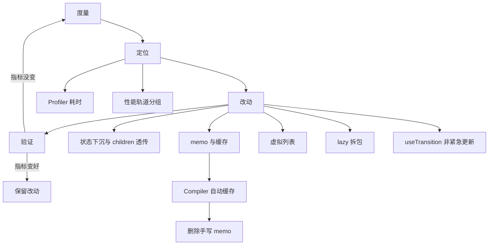
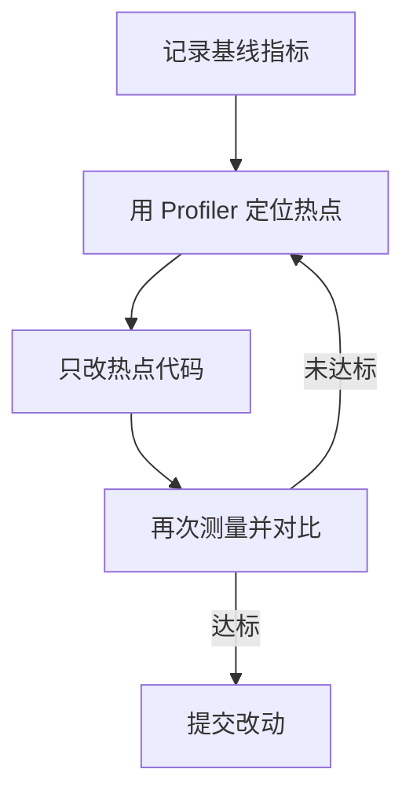
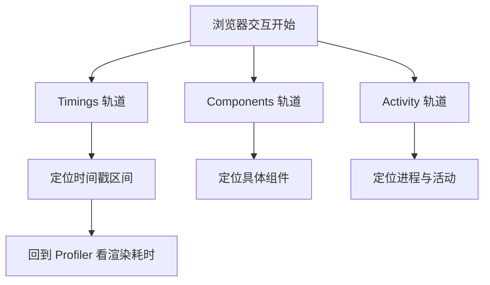
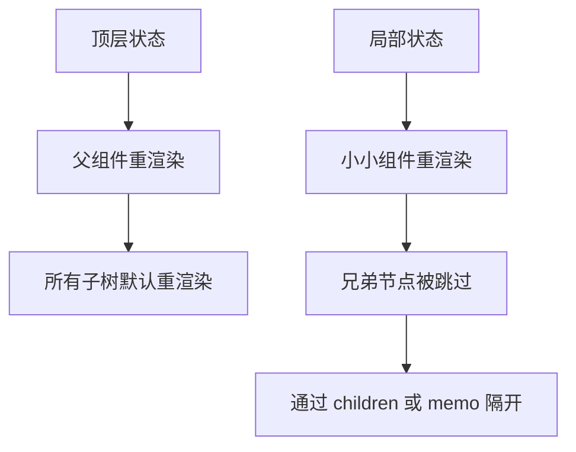
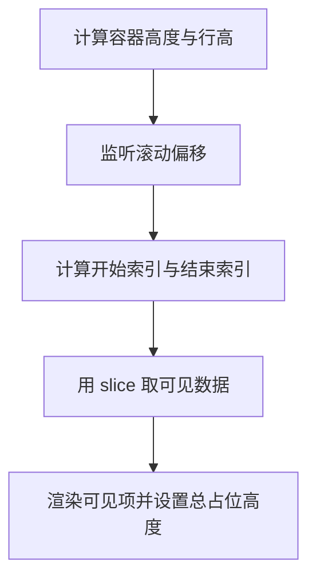
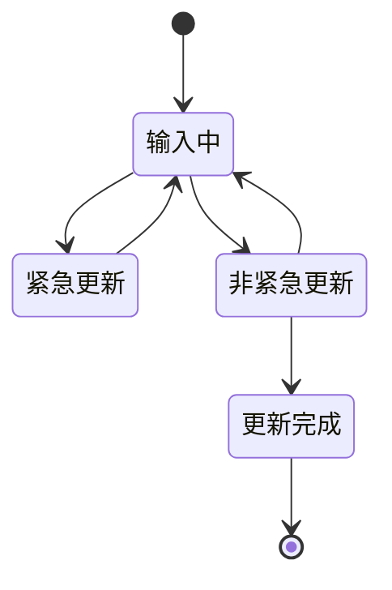
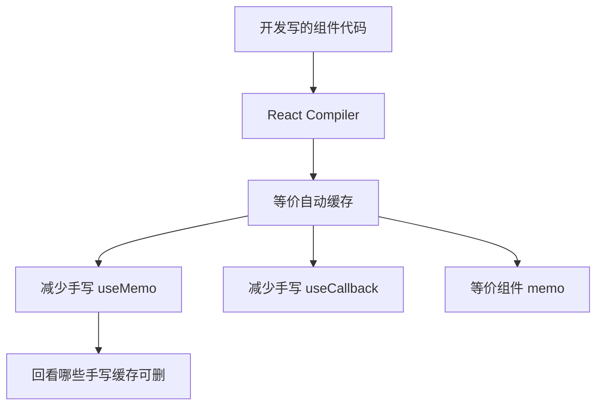

# React 性能优化最佳实践：先度量，再优化

!!! abstract "学完这一页你能"
    - 按“度量、定位、改动、验证”四步处理一次 React 渲染性能问题。
    - 用 React DevTools Profiler 和 19.2 性能轨道读取组件耗时并定位热点。
    - 用状态下沉、children 透传、memo 三招修复不必要渲染。
    - 用虚拟列表、lazy 拆包、useTransition 分别治理长列表、首屏包体和输入阻塞。

## 0. 知识地图



建议怎么读：先读第 1 节建立四步流程，再用第 2、3 节学会看工具，然后按第 4 到第 8 节逐类处理问题。第 9 节放在有 React Compiler 的项目里回看，能减少一部分手写优化。

## 1. 优化流程：先度量，再定位，再动手

**先想一个问题**：用户说“列表页卡”，你第一反应是加 memo，还是先确认卡在哪？没有测量就改动，可能改完指标没变，代码却变复杂了。

**心智模型**

!!! tip "心智模型"
    一句话模型：性能优化是“抓热点”而不是“撒优化”。日常类比：看病先量体温、查血常规，再决定是吃药还是手术。类比不成立点：前端性能的“体温计”可以有多个指标，且热点会随数据与交互变化，每次改动后要重新测量。

**图解**



1. 先记录基线：交互耗时、渲染耗时、包体大小的当前值。
2. 用 Profiler 或性能轨道定位热点：找到实际耗时的组件或阶段。
3. 只改热点代码：不做全项目无差别 memo 化。
4. 再测量对比：确认指标变好，才保留改动。

**一步一步来**

这一步要做什么：在改动前先写一个可复现的度量脚本，避免凭感觉下结论。

```js
// measure.mjs
// 依赖：Node 20+，无需第三方包
import { performance } from 'node:perf_hooks';

function renderTable(rows, normalize) {
  // 模拟一个列表渲染过程：先规范化数据，再生成展示对象
  return rows.filter(normalize).map((row) => ({ id: row.id, label: row.label }));
}

const rows = Array.from({ length: 10000 }, (_, i) => ({ id: i, label: `row-${i}` }));

const start = performance.now();
const view = renderTable(rows, (row) => row.id % 2 === 0);
const end = performance.now();

console.log(`渲染 ${view.length} 行耗时 ${(end - start).toFixed(2)}ms`);
```

**这段代码在做什么**
- 用 `node:perf_hooks` 记录一段纯计算的前后时间。
- 模拟 1 万行数据的过滤与映射，得到 5000 行展示对象。
- 得到基线耗时，供后续改动对比。

运行结果：`渲染 5000 行耗时 约 1 到 10ms`，具体数值取决于机器，重点在于有可复现基线。

**动手验证**

```js
// measure-assert.mjs
// 依赖：Node 20+，无第三方包
import { strict as assert } from 'node:assert';
import { performance } from 'node:perf_hooks';

function renderTable(rows) {
  return rows.map((row) => ({ id: row.id, label: `row-${row.id}` }));
}

const rows = Array.from({ length: 1000 }, (_, i) => ({ id: i }));
const start = performance.now();
const view = renderTable(rows);
const end = performance.now();

assert.equal(view.length, 1000);
assert.equal(view[0].label, 'row-0');
assert.ok(end - start >= 0);
console.log(`断言通过：长度=${view.length}，耗时=${(end - start).toFixed(2)}ms`);
```

预期输出：`断言通过：长度=1000，耗时=…ms`。

**常见坑**

| 现象 | 原因 | 怎么修 |
| --- | --- | --- |
| 只优化一次就收工 | 交互变化后新热点出现 | 每次改动后都回到度量步骤 |
| 用生产构建对比开发构建 | 开发模式有额外开销 | 对比同一个构建环境 |
| 只看单次耗时 | 单次抖动会误导结论 | 多次测量并看中位数或均值 |

**用在哪里**

- 场景一：后台管理页面的表格筛选变慢。业务背景：客服在工单列表里不断切换筛选条件。知识用法：先记录切换后列表渲染耗时，再用 Profiler 定位是表格列还是筛选逻辑。收益指标：输入到表格出现的时间从基线值下降的比例。不该用：流量很低、数据量固定且已经低于目标耗时，不必建立度量流水线。
- 场景二：活动页首屏优化。业务背景：运营活动页首屏元素多，用户跳出率高。知识用法：先量首屏脚本与渲染阶段，再决定拆包还是懒加载。收益指标：首屏可交互时间减少的毫秒数。不该用：页面简单且包体小于目标值，优化收益接近零。

**行业实践**

- React 官方文档《React Developer Tools》章节强调 Profiler 用于交互式定位渲染热点，并提供火焰图与排序视图。怎么借鉴：把每个性能任务先落到 Profiler 快照，再进入代码修改。
- React 官方文档《React Performance》介绍通过生产构建和 Profiler 测量优化效果。怎么借鉴：提交优化前，固定基线环境并记录对比数字。
- React 官方文档《useMemo》提示用 console.time 测量计算是否昂贵。怎么借鉴：不确定是否值得缓存时，先测该计算单次耗时。

**小结**
- 先度量再改动，避免无效优化。
- 用 Profiler 和生产构建控制对比环境。
- 每次改动后回到度量步骤验证结果。

## 2. React DevTools Profiler：找到慢在哪

**先想一个问题**：一个页面有 30 个组件，其中某个组件每次输入都会重渲染。你如何知道是哪一个在拖慢整体？

**心智模型**

!!! tip "心智模型"
    一句话模型：Profiler 把一次更新切成“每个组件用了多久”，像火焰图一样定位热点。日常类比：体检不是只量全身体温，而是逐项查每个器官的指标。类比不成立点：真实渲染开销包含协调、提交和浏览器绘制，Profiler 主要覆盖 React 渲染阶段。

**图解**

```mermaid
sequenceDiagram
  participant U as "用户操作"
  participant R as "React"
  participant P as "Profiler"
  participant T as "浏览器"
  U->>R "触发更新"
  R->>P "记录开始时间"
  R->>R "渲染各组件"
  P->>P "累计每个组件耗时"
  R->>T "提交 DOM"
  R->>P "回调 onRender"
```

1. 用户操作触发一次更新。
2. React 开始渲染，Profiler 记录开始时间。
3. React 逐个渲染子树，Profiler 累计组件耗时。
4. React 提交 DOM 后调用 onRender 回调，给出 actualDuration 与 baseDuration。

**一步一步来**

这一步要做什么：插入一个 Profiler 组件，用 onRender 拿到整棵子树的渲染耗时。

```js
// App.jsx
import { Profiler, useState } from 'react';

function onRender(id, phase, actualDuration, baseDuration) {
  console.log(id, phase, actualDuration, baseDuration);
}

export default function App() {
  const [text, setText] = useState('');
  return (
    <Profiler id="SearchPage" onRender={onRender}>
      <SearchInput value={text} onChange={setText} />
    </Profiler>
  );
}
```

**这段代码在做什么**
- Profiler 包裹 SearchPage 子树。
- 每次该子树提交更新，onRender 收到四个参数。
- id 标识哪棵子树。
- phase 标识 mount、update 或 nested-update。
- actualDuration 是本次更新中该子树实际渲染耗时。
- baseDuration 是无优化时估算的整棵子树重渲染耗时。

运行结果：输入文字时控制台打印更新阶段与耗时，用于判断热点。

**动手验证**

```js
// profiler-aggregate.mjs
// 依赖：Node 20+，无第三方包
import { strict as assert } from 'node:assert';

// 模拟 Profiler 回调产生的记录，并计算平均值
const records = [
  { id: 'SearchPage', phase: 'update', actualDuration: 8 },
  { id: 'SearchPage', phase: 'update', actualDuration: 12 },
  { id: 'SearchPage', phase: 'update', actualDuration: 10 },
];

function averageDuration(list) {
  return list.reduce((sum, item) => sum + item.actualDuration, 0) / list.length;
}

assert.equal(averageDuration(records), 10);
console.log(`断言通过：SearchPage 平均更新耗时=${averageDuration(records)}ms`);
```

预期输出：`断言通过：SearchPage 平均更新耗时=10ms`。

**常见坑**

| 现象 | 原因 | 怎么修 |
| --- | --- | --- |
| actualDuration 一直接近 baseDuration | 子树没有命中 memo | 检查 props 是否每次都变化，或组件是否本来就该重渲染 |
| 开发模式时间比生产长 | 开发构建有额外检查 | 用 profiling 生产构建对比 |
| 只看第一个快照 | 可能包含初始挂载 | 筛选 update 阶段的提交记录 |

**用在哪里**

- 场景一：搜索输入页的联想列表很慢。业务背景：用户每输入一个字符都触发列表重渲染。知识用法：用 Profiler 查看每个字符输入后哪些组件实际渲染最久。收益指标：单次更新 actualDuration 下降的毫秒数。不该用：页面没有可感知卡顿，且渲染耗时低于一帧预算。
- 场景二：仪表盘图表刷新频繁。业务背景：实时仪表盘多个图表随数据更新。知识用法：给不同图表区域分别加 Profiler，找到最耗时子树的 id。收益指标：整页刷新时间缩短的百分比。不该用：图表库内部渲染不受 React Profiler 完整覆盖，只能看 React 层开销。

**行业实践**

- React 官方文档《Profiler》说明 onRender 参数含义，并指出 profiling 需特殊生产构建。怎么借鉴：把 Profiler 用在怀疑为热点的子树，而不是包裹整棵应用树。
- React 官方文档《React Developer Tools》说明 Profiler 标签页能以火焰图和排序视图交互查看。怎么借鉴：开发排查优先用开发工具图形界面，自动化度量再用 Profiler 组件。

**小结**
- Profiler 通过 actualDuration 与 baseDuration 揭示渲染热点与 memo 命中情况。
- 要区分开发构建与 profiling 生产构建的耗时差异。
- 优先缩小测量范围到可疑子树。

## 3. React 19.2 性能轨道：按组件分组看时间线

**先想一个问题**：你只知道“这个交互慢”，但无法区分是 React 渲染慢，还是某个 Effect、浏览器绘制慢。怎样按阶段归因？

**心智模型**

!!! tip "心智模型"
    一句话模型：性能轨道把一次浏览器交互切成多个并行轨道，按组件或活动类型分组显示，解决“散在时间线里看不出来源”的问题。日常类比：地铁线路图把不同线路分成多条并排轨道，故障在哪条线一眼可见。类比不成立点：性能轨道中的时长不是简单相加，轨道之间存在因果与并行的关系。

**图解**



1. 一次交互展开出多个性能轨道。
2. Timings 轨道给出时间戳区间。
3. Components 轨道标记各组件在开发构建中的活动。
4. Activity 轨道用于按进程或活动类型分组。
5. 从组件轨道回看 Profiler，把时间段关联到具体组件。

!!! note "术语：React Performance tracks"
    React 性能轨道是 React DevTools 中按 Timings、Components、Activity 等分组展示浏览器性能记录的界面，用于把性能标记和 React 渲染活动关联起来。例子：选中某次交互后，在 Components 轨道看到该时间段内哪些组件参与渲染。

**一步一步来**

这一步要做什么：在生产 profiling 构建中用 Profiler 让组件出现在性能轨道的 Components 分组中。

```js
// App.jsx
import { Profiler } from 'react';

function onRender(...args) {
  console.log(args[0], args[2]); // 只打印 id 与 actualDuration
}

export default function App() {
  return (
    <Profiler id="Checkout" onRender={onRender}>
      <CheckoutFlow />
    </Profiler>
  );
}
```

**这段代码在做什么**
- 用 Profiler 包裹 Checkout 子树并指定 id。
- 生产 profiling 构建下，Checkout 会出现在 Components 性能轨道。
- 开发构建下，所有组件都会出现在 Components 轨道。
- 这样可以把性能时间线上的区间和具体组件对起来。

运行结果：在 React DevTools 性能面板中看到 Checkout 组件的活动区间。

**动手验证**

```js
// track-label.mjs
// 依赖：Node 20+，无第三方包
import { strict as assert } from 'node:assert';

// 模拟把组件活动记录映射到轨道分组
const events = [
  { type: 'render', component: 'Checkout' },
  { type: 'paint', component: 'browser' },
  { type: 'render', component: 'CartLine' },
];

function groupByType(list) {
  return Object.groupBy(list, (item) => item.type);
}

const grouped = groupByType(events);
assert.equal(grouped.render.length, 2);
assert.equal(grouped.paint.length, 1);
console.log('断言通过：render 轨道 2 条，paint 轨道 1 条');
```

预期输出：`断言通过：render 轨道 2 条，paint 轨道 1 条`。

**常见坑**

| 现象 | 原因 | 怎么修 |
| --- | --- | --- |
| 生产构建看不到组件标记 | 未启用 profiling 生产构建 | 按官方说明启用 profiling 构建 |
| 组件轨道只有极短区间 | 该阶段主要是浏览器绘制 | 结合 Timings 轨道区分阶段 |
| 轨道数据过载 | 整页组件过多 | 只包裹关键子树或按时间区间筛选 |

**用在哪里**

- 场景一：诊断活动页点击按钮到弹窗出现之间的长间隔。业务背景：运营活动页有埋点、动画和弹窗逻辑。知识用法：在性能面板选中该交互，逐条看 Timings、Components 和 Activity 轨道。收益指标：从点击到弹窗可见的时间缩短毫秒数。不该用：无法区分浏览器扩展或网络耗时，需排除外部因素后再看组件轨道。
- 场景二：确认某次优化是否减少了 React 渲染阶段耗时。业务背景：团队做了一轮 memo 优化，想验证。知识用法：对比优化前后同一次交互的 Components 轨道总时长。收益指标：React 渲染阶段时长下降比例。不该用：生产性能轨道中分析粒度受构建与浏览器限制。

**行业实践**

- React 官方文档《React Performance》说明 profiling 构建可用性，并解释开发构建与生产 profiling 构建的区别。怎么借鉴：建立专门的 profiling 构建任务，不要在普通生产包上做轨道分析。
- React 官方文档《Profiler》提到组件被包裹后也会出现在性能轨道。怎么借鉴：为关键交互包裹具名 Profiler。

**小结**
- 性能轨道解决时间线无法按组件归因的问题。
- 需要 profiling 生产构建才能看到生产环境的组件标记。
- 先找轨道区间，再回看 Profiler 火焰图确认组件级热点。

## 4. 不必要渲染：状态下沉与 children 透传

**先想一个问题**：输入框每次敲字，整棵页面树都跟着渲染一次，但只有输入框自己的状态变了。为什么其他组件也在重渲染？

**心智模型**

!!! tip "心智模型"
    一句话模型：React 默认父组件更新会递归渲染子组件，除非子组件通过状态位置、children 或 memo 被“隔开”。日常类比：楼上装修敲墙，连着整栋楼都能听见；如果把隔音层做在正确位置，只有那一个房间受影响。类比不成立点：React 的“隔音”不一定需要 memo，先把状态放到小房间，有时比加隔音层更便宜。

**图解**



1. 顶层状态改变会使整棵树默认参与渲染。
2. 把状态放到使用它的组件里，影响范围变小。
3. 兄弟节点通过 children 透传或 memo 可跳过重渲染。
4. 目标不是绝对不渲染，而是减少与当前交互无关的渲染。

!!! note "术语：children 透传"
    children 透传指父组件把 JSX 作为 children 属性传下去，而不是在父组件内部直接创建子 JSX。例子：`<Layout><Main /></Layout>` 里 Main 已作为 children 存在，Layout 更新自身状态时 React 能知道 Main 无需重渲染。

**一步一步来**

这一步要做什么：把 hover 状态下沉到一个小组件，避免它触发大表单整树更新。

```jsx
// 改造前
function Page() {
  const [hovered, setHovered] = useState(false);
  return (
    <div onMouseEnter={() => setHovered(true)} onMouseLeave={() => setHovered(false)}>
      <BigForm />
    </div>
  );
}
```

**这段代码在做什么**
- Page 持有 hovered 状态。
- 每次 hover 变化，Page 重渲染。
- BigForm 作为 Page 的子组件也会默认重渲染。

接下来，把 hover 状态下沉：

```jsx
// 改造后
function HoverBox() {
  const [hovered, setHovered] = useState(false);
  return (
    <div onMouseEnter={() => setHovered(true)} onMouseLeave={() => setHovered(false)}>
      <BigForm />
    </div>
  );
}
function Page() {
  return <HoverBox />;
}
```

**这段代码在做什么**
- HoverBox 自持 hovered 状态，Page 不再持有。
- hover 变化时只有 HoverBox 重渲染。
- BigForm 仍可能重渲染，但不再因 Page 的 hover 状态触发。

第三步，如果 BigForm 初始化昂贵，再用 children 隔开：

```jsx
// 进一步改造
function HoverBox({ children }) {
  const [hovered, setHovered] = useState(false);
  return (
    <div onMouseEnter={() => setHovered(true)} onMouseLeave={() => setHovered(false)}>
      {children}
    </div>
  );
}
function Page() {
  return (
    <HoverBox>
      <BigForm />
    </HoverBox>
  );
}
```

**这段代码在做什么**
- Page 创建 BigForm 并通过 children 传入 HoverBox。
- HoverBox 更新 hovered 时，不会重新创建 BigForm。
- 这样 BigForm 默认不会被 hover 状态影响。

**动手验证**

```js
// state-down.mjs
// 依赖：Node 20+，无第三方包
import { strict as assert } from 'node:assert';

// 模拟两个设计：顶层 hover 状态 vs 下沉 hover 状态
function renderWithTopState() {
  const touched = [];
  touched.push('Page');
  touched.push('BigForm');
  return touched;
}

function renderWithLocalState() {
  const touched = [];
  touched.push('HoverBox');
  return touched;
}

const topTouched = renderWithTopState();
const localTouched = renderWithLocalState();
assert.ok(topTouched.includes('BigForm'));
assert.ok(!localTouched.includes('BigForm'));
console.log('断言通过：下沉状态后 BigForm 不再进入重渲染列表');
```

预期输出：`断言通过：下沉状态后 BigForm 不再进入重渲染列表`。

**常见坑**

| 现象 | 原因 | 怎么修 |
| --- | --- | --- |
| 状态下沉后子组件仍重渲染 | 子组件放在父组件内部被直接创建 | 用 children 传入或拆分组件 |
| 为了不渲染而滥用全局状态 | 状态被抬得太高 | 把临时状态放回离用它的组件最近处 |
| 用 memo 挡住动态 props 变化 | 传入每次新建的对象或函数 | 先调整状态位置，再考虑 useMemo 与 useCallback |

**用在哪里**

- 场景一：表单页的 hover 高亮。业务背景：长表单中每一行 hover 都要高亮。知识用法：把 hover 状态放进 Row 组件，而不是 Form 容器。收益指标：单次 hover 触发重渲染的组件数量。不该用：表单本来很小且渲染开销低。
- 场景二：聊天应用的输入与消息列表。业务背景：输入框状态高频变化，消息列表历史重。知识用法：把输入框状态留在输入组件内，消息列表通过 children 或独立状态隔开。收益指标：输入时消息列表是否进入渲染列表。不该用：消息列表需要响应输入框内容联动，不能简单隔开。

**行业实践**

- React 官方文档《memo》建议优先让组件接受 JSX 作为 children，可减少很多 memo 化。怎么借鉴：先改 children 结构，再评估是否还要 memo。
- React 官方文档《memo》建议不要让表单、hover 等临时状态抬到树顶或全局状态库。怎么借鉴：状态评审时标记“这个状态到底属于哪个组件”。

**小结**
- 不必要渲染的第一原因常常是状态放得太高。
- children 透传能在父组件更新时天然隔开子组件。
- 先做结构下沉，再考虑 memo 与缓存。

## 5. memo：只在 props 不变时跳过渲染

**先想一个问题**：一个纯展示列表项接收 id 和 label，父组件每次更新都重传相同的两个值。如何让这个组件只在 props 真正变化时重渲染？

**心智模型**

!!! tip "心智模型"
    一句话模型：memo 让组件变成“props 没变就返回上一次结果”的缓存版本。日常类比：复印店按原件编号归档，同编号直接取复印件，不再重新复印。类比不成立点：缓存复印件也可能因店里改规则而失效，memo 只是优化提示，不是渲染保证。

**图解**

```mermaid
sequenceDiagram
  participant P as "父组件"
  participant M as "memo 组件"
  participant R as "React"
  P->>M "传入新 props"
  M->>R "比较旧 props 与新 props"
  alt "props 不一致"
    R-->>M "执行渲染"
  else "props 一致"
    R-->>M "跳过渲染"
  end
```

1. 父组件重渲染并传入 props。
2. memo 组件让 React 比较新旧 props。
3. props 不一致才执行渲染。
4. props 一致则跳过该组件。

!!! note "术语：object identity"
    对象身份指引用是否相同，用 Object.is 判断。例子：两次渲染中 `{ id: 1 }` 与另一个 `{ id: 1 }` 内容相同但引用不同，Object.is 返回 false，memo 会认为 props 变了。

**一步一步来**

这一步要做什么：制作一个 memo 化展示组件，并用父组件不同更新观察渲染次数。

```jsx
import { memo, useState } from 'react';

const Greeting = memo(function Greeting({ name }) {
  console.log('Greeting rendered');
  return <h3>Hello {name}</h3>;
});

export default function App() {
  const [name, setName] = useState('Anna');
  const [count, setCount] = useState(0);

  function changeCount() {
    setCount((c) => c + 1);
  }

  return (
    <>
      <button onClick={changeCount}>计数 {count}</button>
      <Greeting name={name} />
    </>
  );
}
```

**这段代码在做什么**
- Greeting 被 memo 包裹，name 是唯一 props。
- 每次点击只改 count，name 保持 `'Anna'`。
- React 比较前后 props，Object.is('Anna', 'Anna') 返回 true，跳过渲染。

运行结果：点击计数按钮时控制台不会打印新的 `Greeting rendered`。

**动手验证**

```js
// memo-compare.mjs
// 依赖：Node 20+，无第三方包
import { strict as assert } from 'node:assert';

function arePropsEqual(oldProps, newProps) {
  return Object.is(oldProps.name, newProps.name);
}

assert.equal(arePropsEqual({ name: 'Anna' }, { name: 'Anna' }), true);
assert.equal(arePropsEqual({ name: 'Anna' }, { name: 'Bill' }), false);
assert.equal(arePropsEqual({ name: 'Anna' }, { name: 'Anna' }), true);
console.log('断言通过：props 相同才跳过渲染');
```

预期输出：`断言通过：props 相同才跳过渲染`。

**常见坑**

| 现象 | 原因 | 怎么修 |
| --- | --- | --- |
| memo 失效 | 传入了每次新建的对象或函数 | 用 useMemo 或 useCallback 稳定依赖 |
| memo 完全不生效 | props 本来每次都不一样 | 先改变状态结构，不硬套 memo |
| memo 到处加 | 组件渲染本身很快 | 仅对高频同 props 且渲染重的组件使用 |

**用在哪里**

- 场景一：数据表格的单元格。业务背景：大盘表格单元格纯展示，字段变化少。知识用法：对单元格组件用 memo，父表格更新时跳过未变化的格子。收益指标：表格更新时触发渲染的组件数。不该用：单元格依赖全局主题且主题频繁变化，memo 开销超过收益。
- 场景二：图形编辑器的形状组件。业务背景：画布移动一个形状时，其余形状不应重画。知识用法：形状组件用 memo，并在传入对象时保持引用稳定。收益指标：拖动一次时重渲染形状个数。不该用：形状数量少且渲染成本低。

**行业实践**

- React 官方文档《memo》说明 memo 只是性能优化，不是保证，并指出只有高频同 props 且渲染昂贵才值得用。怎么借鉴：代码评审中要求注明“为什么这个组件需要 memo”。
- React 官方文档《memo》说明单个“总是新”的值足以破坏整棵组件的 memo。怎么借鉴：检查 memo 子组件是否接收每次渲染新建的函数或对象。

**小结**
- memo 在 props 不变时跳过渲染，默认用 Object.is 逐项比较。
- 对象和函数引用不稳定时 memo 会失效。
- 仅对高频同 props 且重渲染开销大的组件使用。

## 6. 列表虚拟化：只渲染视口内的行

**先想一个问题**：一个表格有 10 万行数据，一次渲染 10 万个 DOM 节点会卡住首屏。怎样让 DOM 数量保持常数级？

**心智模型**

!!! tip "心智模型"
    一句话模型：虚拟列表只渲染可见区域内的条目，用占位高度模拟总滚动长度。日常类比：图书馆大书架只摆出一排书，其他书在库房里，按找书位置临时调取。类比不成立点：占位高度与实际行高不完全一致时，滚动条位置会跳，需要修正偏移。

**图解**



1. 根据高度与行高算出可见行数。
2. 监听滚动位置计算当前偏移。
3. 用滚动偏移换算开始和结束索引。
4. 只对 slice 后的可见数据渲染 DOM。
5. 设置一个总高度占位使滚动条长度正确。

**一步一步来**

这一步要做什么：在纯 Node 环境验证“按滚动偏移计算可见行范围”的核心算法。

```js
// virtual-range.mjs
// 依赖：Node 20+，无第三方包
function getVisibleRange({ scrollTop, rowHeight, viewportHeight, total }) {
  const start = Math.floor(scrollTop / rowHeight);
  const visibleCount = Math.ceil(viewportHeight / rowHeight);
  const end = Math.min(total, start + visibleCount);
  return { start, end };
}

const range = getVisibleRange({
  scrollTop: 450,
  rowHeight: 30,
  viewportHeight: 600,
  total: 10000,
});

console.log(range);
```

**这段代码在做什么**
- scrollTop 除以 rowHeight 得到开始行号。
- viewportHeight 除以 rowHeight 得到可见行数。
- end 用总数拦截避免越界。
- 这就是虚拟列表最核心的切片范围计算。

运行结果：`{ start: 15, end: 35 }`，即 1 万行中只渲染第 15 到 35 行。

**动手验证**

```js
// virtual-range-assert.mjs
// 依赖：Node 20+，无第三方包
import { strict as assert } from 'node:assert';

function getVisibleRange({ scrollTop, rowHeight, viewportHeight, total }) {
  const start = Math.floor(scrollTop / rowHeight);
  const visibleCount = Math.ceil(viewportHeight / rowHeight);
  const end = Math.min(total, start + visibleCount);
  return { start, end };
}

const range = getVisibleRange({
  scrollTop: 450,
  rowHeight: 30,
  viewportHeight: 600,
  total: 10000,
});

assert.equal(range.start, 15);
assert.equal(range.end, 35);
assert.ok(range.end - range.start <= 21);
console.log('断言通过：可见范围', range);
```

预期输出：`断言通过：可见范围 { start: 15, end: 35 }`。

**常见坑**

| 现象 | 原因 | 怎么修 |
| --- | --- | --- |
| 滚动条跳动 | 实际行高与设定行高不一致 | 改为动态测量并维护行高缓存 |
| 快速滚动出现空白 | 渲染跟不上滚动速度 | 增加 overscan 预渲染额外行数 |
| 键盘导航焦点丢失 | 焦点节点不在当前可见 DOM 中 | 处理终态补齐或聚焦前先渲染目标行 |

**用在哪里**

- 场景一：电商搜索结果列表。业务背景：搜索结果可达数万条，每个条目结构复杂。知识用法：只渲染视口和 overscan 区域，保持 DOM 数量恒定。收益指标：长列表首屏 DOM 节点数、滚动帧率。不该用：每个条目高度差异极大且无法稳定测量。
- 场景二：后台日志查看器。业务背景：实时日志滚入，总行数持续增长。知识用法：虚拟列表配合自动跟随滚动。收益指标：内存占用和滚动帧率。不该用：需要用户在连续文本中大量选择复制。

**行业实践**

- React 官方文档在 useMemo 的资料中提及未来可能为虚拟化列表优化缓存。怎么借鉴：现在用虚拟列表时，配合 useMemo 缓存可见行数据。
- 资料未覆盖，需核对官方文档：React 官方未内置虚拟列表组件，工程中接入第三方虚拟列表库时需核对选型库的 API 与滚动容器要求。

**小结**
- 虚拟列表用 range 计算让 DOM 数量与数据总量解耦。
- 固定行高实现简单，动态行高需要测量机制。
- overscan 可减少快速滚动的空白区。

## 7. 懒加载与拆包：lazy 与 Suspense

**先想一个问题**：首屏只显示表格，但打包文件里包含了编辑器的全部代码，导致首屏下载与解析变慢。怎样把后用到的代码拆出去？

**心智模型**

!!! tip "心智模型"
    一句话模型：lazy 延迟组件代码到第一次渲染时才加载，Suspense 在加载期间显示占位内容。日常类比：餐馆把甜点菜单放到用完主菜再上，不占用前厨资源。类比不成立点：动态 import 受打包器支持影响，加载失败还需要错误边界处理。

**图解**

```mermaid
sequenceDiagram
  participant U as "用户"
  participant A as "App"
  participant L as "lazy 组件"
  participant S as "Suspense"
  participant N as "网络"
  U->>A "进入页面"
  A->>L "首次尝试渲染"
  L->>N "动态 import 模块"
  S-->>A "显示 fallback"
  N->>L "模块到达"
  L->>A "渲染组件内容"
```

1. 用户进入页面，App 尝试渲染 lazy 组件。
2. lazy 发起动态 import 请求。
3. Suspense 在加载完成前显示 fallback。
4. 模块到达后，lazy 组件渲染真实内容。

!!! note "术语：code splitting"
    代码拆分指把打包产物按模块边界拆成多个文件，减少首屏需要下载的 JavaScript。例子：编辑器的代码单独成块，等到用户进入编辑页才请求。

**一步一步来**

这一步要做什么：声明一个惰性加载组件，并用 Suspense 提供加载占位。

```jsx
import { lazy, Suspense, useState } from 'react';

const MarkdownPreview = lazy(() => import('./MarkdownPreview.js'));

export default function Editor() {
  const [showPreview, setShowPreview] = useState(false);

  function togglePreview() {
    setShowPreview((v) => !v);
  }

  return (
    <div>
      <button onClick={togglePreview}>
        {showPreview ? '隐藏预览' : '显示预览'}
      </button>
      {showPreview && (
        <Suspense fallback={<p>加载预览组件中…</p>}>
          <h2>预览</h2>
          <MarkdownPreview />
        </Suspense>
      )}
    </div>
  );
}
```

**这段代码在做什么**
- lazy 包裹动态 import，模块代码不会进首包。
- 首次勾选显示预览时才发请求。
- Suspense 在请求完成前渲染 fallback。
- 模块到达后替换为 MarkdownPreview 内容。

运行结果：首屏不下载 MarkdownPreview 文件，点击后才请求并渲染。

**动手验证**

```js
// lazy-cache.mjs
// 依赖：Node 20+，无第三方包
import { strict as assert } from 'node:assert';

function createLazyLoader(load) {
  let promise = null;

  function ensure() {
    if (!promise) {
      promise = load();
    }
    return promise;
  }

  return { ensure, loadCount: () => (promise ? 1 : 0) };
}

let calls = 0;
const loader = createLazyLoader(() => {
  calls += 1;
  return Promise.resolve({ default: function Preview() {} });
});

assert.equal(loader.loadCount(), 0);
await loader.ensure();
await loader.ensure();
assert.equal(calls, 1);
console.log('断言通过：load 只被调用一次，Promise 被缓存');
```

预期输出：`断言通过：load 只被调用一次，Promise 被缓存`。

**常见坑**

| 现象 | 原因 | 怎么修 |
| --- | --- | --- |
| 动态 import 报错 | 打包器不支持或配置未启用 | 核对打包器对动态 import 的支持 |
| 加载失败白屏 | Promise 被拒绝且无错误边界 | 在 Suspense 外层加错误边界 |
| fallback 闪一下 | 模块下载太快或太慢 | 目标明确的模块不必加复杂加载态 |

**用在哪里**

- 场景一：内容平台的文章编辑器。业务背景：阅读用户占多数，编辑器仅作者使用。知识用法：编辑器组件用 lazy 从主包拆出。收益指标：首屏 JavaScript 下载字节数、首次可交互时间。不该用：组件几乎每个用户都会立即用到，拆包反而多一轮请求。
- 场景二：营销活动的配置面板。业务背景：活动页首屏是活动页面，配置面板只有运营打开。知识用法：配置面板按路由拆包。收益指标：首屏包体减少比例。不该用：拆包后请求延迟高于首屏收益，且无法预取。

**行业实践**

- React 官方文档《lazy》说明 lazy 会缓存 Promise 与解析结果，不会重复请求。怎么借鉴：同一组件多次进入不需要担心重复 import。
- React 官方文档《lazy》说明 Promise 拒绝时交由最近的 Error Boundary 处理。怎么借鉴：懒加载模块必须配错误边界。

**小结**
- lazy 延迟组件代码下载到首次渲染时。
- Suspense 提供加载期间的回退 UI。
- 拆包要按使用频率切分，并用错误边界兜底。

## 8. useTransition：把慢更新标记为非紧急

**先想一个问题**：搜索框输入一个字符，既要立即显示输入框字符，又要过滤大列表。过滤太耗时导致输入框卡顿，怎样让输入保持流畅？

**心智模型**

!!! tip "心智模型"
    一句话模型：useTransition 把状态更新分成紧急与可中断两类，非紧急更新可被更新输入打断。日常类比：前台先接待新顾客，后台慢慢处理填表。类比不成立点：系统仍需处理完非紧急任务，只是不阻塞紧急输入。

**图解**



1. 用户输入一个字符，触发紧急更新。
2. 同时过滤大列表，进入非紧急更新。
3. 再次输入时，非紧急更新可被打断，回到输入中。
4. 没有新输入后，非紧急更新执行完成。

!!! note "术语：startTransition"
    startTransition 是 React 的 API，用于把某次状态更新标记为非紧急，允许它被后续的紧急更新打断。例子：搜索框文字更新是紧急的，搜索结果列表更新可放进 startTransition。

**一步一步来**

这一步要做什么：在搜索场景里把输入更新保留为紧急，把结果过滤放进 transition。

```jsx
// 资料未覆盖，需核对官方文档：以下 useTransition 与 startTransition 的具体 API 形式以 React 官方文档为准
import { useState, useTransition } from 'react';

export default function Search({ items }) {
  const [query, setQuery] = useState('');
  const [isPending, startTransition] = useTransition();

  function handleChange(event) {
    const nextQuery = event.target.value;
    setQuery(nextQuery);
    startTransition(() => {
      // 此块内的更新可被后续输入打断
      setFilteredItems(filterItems(items, nextQuery));
    });
  }

  const [filteredItems, setFilteredItems] = useState(items);

  return (
    <>
      <input value={query} onChange={handleChange} />
      {isPending ? <p>筛选中…</p> : <ResultList items={filteredItems} />}
    </>
  );
}
```

**这段代码在做什么**
- `setQuery` 直接执行，保证输入实时显示。
- 结果过滤通过 `startTransition` 包住，属于非紧急更新。
- `isPending` 表示后台过滤尚未完成。
- 后续输入可打断过滤，先处理新字符。

**动手验证**

```js
// transition-queue.mjs
// 依赖：Node 20+，无第三方包
import { strict as assert } from 'node:assert';

// 模拟紧急更新能打断非紧急任务的调度
function run(urgent, background) {
  const queue = [];
  queue.push({ type: 'urgent', task: urgent });
  queue.push({ type: 'background', task: background });
  // 紧急任务先执行，后台任务后执行但仍保留
  const result = queue.sort((a, b) => (a.type === 'urgent' ? -1 : 1));
  return result.map((item) => item.type);
}

const order = run(() => {}, () => {});
assert.deepEqual(order, ['urgent', 'background']);
console.log('断言通过：紧急输入先于后台过滤');
```

预期输出：`断言通过：紧急输入先于后台过滤`。

**常见坑**

| 现象 | 原因 | 怎么修 |
| --- | --- | --- |
| 输入仍然卡顿 | 重计算仍占用主线程过长 | 把计算切片或移到 worker，不能只靠 transition |
| isPending 频繁闪烁 | 后台任务过短或过长 | 设置视觉上的过渡文案，避免整块替换 |
| transition 包住输入本身 | 紧急更新被降级 | 只把结果更新放进 startTransition |

**用在哪里**

- 场景一：应用内搜索。业务背景：输入框在顶部，下方按关键字过滤内容。知识用法：输入框更新保持紧急，结果列表更新用 transition 包裹。收益指标：每次按键到输入框显示字符的延迟。不该用：过滤逻辑本身极快，transition 没有收益。
- 场景二：切换数据视图。业务背景：看板切换年度视图时计算量大，但用户可能快速多次切换。知识用法：把图表的年度计算标记为非紧急更新。收益指标：切换按钮的响应延迟。不该用：必须同步完成结果才能进行下一步的关键路径。

**行业实践**

- 资料未覆盖，需核对官方文档：useTransition 与 startTransition 的依赖数组和并发行为请核对 React 官方文档相关章节。
- React 官方文档在 memo 的内容中指出 Effect 更新状态是常见性能问题，应减少不必要的状态链。怎么借鉴：transition 只能缓解计算阻塞，不能替代对状态更新链的治理。

**小结**
- transition 区分紧急与非紧急更新，保证输入不被慢计算阻塞。
- 只把可延迟的结果更新放进 startTransition。
- 纯计算过重时仍需拆分任务或移动 worker。

## 9. Compiler 时代与常见反模式：哪些手写 memo 可删除

**先想一个问题**：代码里几十处 useMemo 和 useCallback，每次重构都要同步依赖数组。React Compiler 能自动缓存后，哪些可以删掉？

**心智模型**

!!! tip "心智模型"
    一句话模型：Compiler 在构建期分析组件代码，等价地插入 memo、useMemo、useCallback，手写缓存从代码里消失。日常类比：自动变速箱不用司机手动挂挡，但司机仍需理解何时需要动力。类比不成立点：编译器有分析边界，违反 React 规则或依赖构建配置时可能不生效。

**图解**



1. 源代码交给 React Compiler 分析。
2. 编译器生成等价缓存。
3. 手写 useMemo 与 useCallback 多数可移除。
4. 需要回看可删列表，验证构建产物和运行时行为。

!!! note "术语：React Compiler"
    React Compiler 是 React 提供的构建期工具，能自动对组件、值、函数做等价缓存，目标是减少手写 memo 化。例子：一个未写 memo 的组件在编译后可能获得等价的跳过渲染能力。

**一步一步来**

这一步要做什么：识别一个纯展示组件，在 Compiler 覆盖前先用手写 memo，再用规则判断是否可删。

```jsx
// 手写版
const Row = memo(function Row({ item }) {
  return <li>{item.label}</li>;
});

function List({ rows }) {
  const visible = useMemo(() => rows.filter((r) => r.active), [rows]);
  return <ul>{visible.map((r) => <Row key={r.id} item={r} />)}</ul>;
}
```

**这段代码在做什么**
- Row 用 memo 跳过未变 props 的渲染。
- List 用 useMemo 缓存过滤结果。
- 手写缓存让数据变化不频繁时不重复计算。

编译器开启后，可以尝试删除手写缓存版：

```jsx
// Compiler 后可尝试版本
function Row({ item }) {
  return <li>{item.label}</li>;
}

function List({ rows }) {
  const visible = rows.filter((r) => r.active);
  return <ul>{visible.map((r) => <Row key={r.id} item={r} />)}</ul>;
}
```

**这段代码在做什么**
- 直接写组件逻辑，不再出现 memo、useMemo。
- 等价缓存交给编译器生成。
- 代码可读性提高，依赖数组消失。

**动手验证**

```js
// compiler-rule.mjs
// 依赖：Node 20+，无第三方包
import { strict as assert } from 'node:assert';

// 模拟判断：纯 props、无副作用、依赖稳定时，手写 memo 可删
function canRemoveManualMemo({ isPure, hasUnstableDeps, isInCompilerBuild }) {
  return isPure && !hasUnstableDeps && isInCompilerBuild;
}

assert.equal(canRemoveManualMemo({ isPure: true, hasUnstableDeps: false, isInCompilerBuild: true }), true);
assert.equal(canRemoveManualMemo({ isPure: false, hasUnstableDeps: false, isInCompilerBuild: true }), false);
console.log('断言通过：仅纯函数且无不稳定依赖的手写缓存可删');
```

预期输出：`断言通过：仅纯函数且无不稳定依赖的手写缓存可删`。

**常见坑**

| 现象 | 原因 | 怎么修 |
| --- | --- | --- |
| 开了 Compiler 仍保留全部手写 memo | 不知道哪些多余 | 回看构建产物并逐步删除，再跑测试与基线 |
| Compiler 不生效 | 组件违反 React 规则或构建配置缺失 | 核对编译器启用条件和 ESLint 规则 |
| 代码不工作才加 memo | 把 memo 当成语义依赖 | 先修复底层 bug，再启用编译器 |

**用在哪里**

- 场景一：大型老项目引入 Compiler。业务背景：代码库有大量手写 useMemo 与 useCallback。知识用法：开启 Compiler 后，分批删除手写缓存并跑测试与 Profiler。收益指标：手写 memo API 数量、代码审查耗时。不该用：项目构建链不支持，或组件违反规则过多。
- 场景二：新项目直接使用 Compiler。业务背景：团队想降低性能优化心智负担。知识用法：默认不写 useMemo、useCallback、memo，先度量再让编译器兜底。收益指标：工程代码行数、新人上手速度。不该用：需要精确控制缓存边界的场景，应保留少量手写并核对行为。

**行业实践**

- React 官方文档《useMemo》指出 React Compiler 能自动缓存值，减少手写 useMemo。怎么借鉴：开启 Compiler 后，先删除无不稳定依赖的 useMemo，再观察基线。
- React 官方文档《useCallback》指出 React Compiler 能自动缓存函数，减少手写 useCallback。怎么借鉴：事件回调类 useCallback 可优先让编译器处理。
- React 官方文档《memo》指出 React Compiler 能自动应用等价 memo。怎么借鉴：组件级 memo 也在可删列表，但需结合 Profiler 复核跳过效果。

**小结**
- React Compiler 自动生成等价缓存，减少手写 memo 化。
- 可删除的前提是纯渲染逻辑与稳定依赖。
- 删除后仍需用 Profiler 和测试基线复核，不因开启 Compiler 就跳过度量。

## 应用地图

| 场景 | 用到本页哪个知识点 | 典型技术选型 | 注意事项 |
| --- | --- | --- | --- |
| 电商商品列表 10 万条 | 虚拟列表 | 第三方虚拟列表库，需核对库文档 | 动态行高要测量并缓存 |
| 搜索框边输边查 | useTransition＋状态下沉 | 输入本地状态＋非紧急结果更新 | 重计算过大仍需拆分或 worker |
| 首屏含富文本编辑器 | lazy 拆包＋Suspense | 路由级拆包或组件级 lazy | 需要错误边界与加载 fallback |
| 后台表格列很多 | Profiler 定位＋memo 单元格 | Profiler＋memo＋稳定 props | 单元格 props 必须引用稳定 |
| 长表单 hover 高亮 | 状态下沉＋children 透传 | Row 组件自持 hover 状态 | 不要把所有状态放进 Form 容器 |
| 实时仪表盘多图表 | Profiler 分区域度量 | 按图表模块拆 Profiler id | Profiler 消耗小但需控制数量 |
| 大表格筛选循环 1 万次 | useMemo 缓存计算 | useMemo 包裹 filter | 先测计算是否真的昂贵 |
| 老项目手写缓存过多 | Compiler 删除手写 memo | React Compiler 构建接入 | 分批删除并跑测试与 Profiler |

## 动手作业

**目标**：做一个 10 万行虚拟日志查看器，输入过滤后不卡输入，并对结果列表做可验证的优化。

**步骤**
1. 用固定行高实现可见行范围计算函数，并写 4 条 node:assert 断言。
2. 在 React 页面里只渲染可见行，设置总占位高度。
3. 输入过滤放入 startTransition，观察输入框不被过滤阻塞。
4. 用 Profiler 比较开启过滤时渲染耗时，记录基线。

**验收标准**
- 10 万行数据下首屏只渲染不超过 30 行，DOM 节点数量可数。
- 输入过滤时输入框字符实时出现，无肉眼可见卡顿。
- 提交 Profiler 基线、优化后 actualDuration 对比和全部断言的输出。

## 综合对比

| 维度 | 结构中下沉 | children 透传 | memo | useTransition | 虚拟列表 | lazy 拆包 |
| --- | --- | --- | --- | --- | --- | --- |
| 解决什么 | 不必要渲染 | 父更新波及子节点 | 同 props 重渲染 | 输入被后台计算阻塞 | DOM 节点过多 | 首包过重 |
| 成本 | 重构状态位置 | 重构 JSX 结构 | 比较 props 开销 | 多一层调度 | 需处理行高与滚动 | 需错误边界 |
| 适用数据规模 | 小型表单 | 容器与内容分离 | 中大型列表项 | 大计算量过滤 | 上万行 | 大型页面模块 |
| 不适用 | 状态被多个远亲使用 | children 动态变化 | props 总变或渲染很轻 | 计算极快 | 行高不稳定且无法测量 | 首屏必用模块 |
| 验证方法 | 统计渲染次数 | 统计子组件渲染次数 | Profiler actualDuration | 输入响应延迟 | DOM 节点数与滚动帧率 | 首屏包体大小 |

## 深入阅读与参考

!!! tip "怎么用这些资料"
    先读「官方文档与规范」建立准确的概念，再读「源码与示例」核对细节，最后用「教程、书籍与视频」换一种讲法加深理解。每条都写明了读哪一节、带着什么问题读。

### 官方文档与规范

| 资源 | 为什么读 | 怎么读 |
|---|---|---|
| [<Profiler>](https://react.dev/reference/react/Profiler) | 官方 Profiler API 说明，是度量阶段最直接的依据。 | 读 onRender 回调参数与阶段说明，给关键组件包一层 Profiler，记录每次提交耗时。 |
| [memo](https://react.dev/reference/react/memo) | 讲清 memo 的比较语义与误用代价，避免无脑包裹组件。 | 读注意事项与自定义比较函数一节，回答何时不该用 memo，再回头审视自己的组件树。 |
| [useTransition](https://react.dev/reference/react/useTransition) | useTransition 与 isPending 的权威定义，非紧急更新必读。 | 读用法与陷阱章节，把一次搜索过滤改成 transition，用 Profiler 对比输入响应速度。 |
| [lazy](https://react.dev/reference/react/lazy) | lazy 的加载时机与边界条件，做拆包前先弄清语义。 | 读参数说明与注意事项，把路由级页面组件改为 lazy，并确认默认导出等限制。 |
| [<Suspense>](https://react.dev/reference/react/Suspense) | Suspense 的边界与回退行为，需与 lazy 配合理解。 | 读 fallback 与嵌套边界一节，为懒加载组件设计骨架屏，避免整页闪烁。 |
| [React Compiler v1.0](https://react.dev/blog/2025/10/07/react-compiler-1) | 编译器 v1.0 官方说明，据此判断哪些手写 memo 可删。 | 读编译器覆盖范围与迁移建议，开启后对比 Profiler 中的重渲染次数。 |
| [use memo](https://react.dev/reference/react-compiler/directives/use-memo) | use memo 指令的官方定义，精准控制编译器优化开关。 | 读指令语义与示例，给确实需要手写缓存的组件加上标注并验证效果。 |
| [Lazy loading](https://developer.mozilla.org/en-US/docs/Web/Performance/Guides/Lazy_loading) | 浏览器侧懒加载指南，区分图片懒加载与代码拆包两件事。 | 读图片与 iframe 小节，给首屏外资源加 loading=lazy，首屏图不要加。 |

### 源码与示例

| 资源 | 为什么读 | 怎么读 |
|---|---|---|
| [Build Your Own React](https://pomb.us/build-your-own-react/) | 手写简化版 React 含 Fiber，理解渲染与调度的真实开销。 | 跟做 render 与 commit 两阶段，画出 work loop，再回看 Profiler 时间线对照。 |
| [React Fiber 架构笔记](https://github.com/acdlite/react-fiber-architecture) | Fiber 架构笔记，解释时间线中各阶段对应哪段代码。 | 重点读协调与优先级一节，对照 Profiler 火焰图标注每个阶段。 |

### 教程、书籍与视频

| 资源 | 为什么读 | 怎么读 |
|---|---|---|
| [Overreacted：Before You memo()](https://overreacted.io/before-you-memo/) | 不用 memo 也能提速的重构思路，能纠正优化直觉。 | 照文中状态下移与内容提升两种手法，改写一个慢组件并复测渲染次数。 |
| [Thinking in React](https://react.dev/learn/thinking-in-react) | 组件划分与 state 归属的经典五步，是状态下沉的起点。 | 按五步拆一个列表加筛选的需求，标出哪些 state 可以下沉到子组件。 |
| [DevTools Performance 面板](https://developer.chrome.com/docs/devtools/performance) | 浏览器层性能面板，把 React 慢与主线程长任务区分开。 | 录制一次交互，找长任务与脚本耗时，先判断瓶颈是否真在 React 渲染。 |

## 自测题

??? question "React 性能优化应该从哪一步开始？"
    答案要点：
    1. 先度量建立基线。
    2. 用 Profiler 或性能轨道定位热点。
    3. 只改热点，再对比验证。

??? question "Profiler 的 actualDuration 和 baseDuration 代表什么？"
    答案要点：
    1. actualDuration 是本次更新该子树实际渲染耗时。
    2. baseDuration 是估算无优化时整棵子树重渲染耗时。
    3. 两者对比可判断 memo 是否命中。

??? question "为什么单个总是新的 props 会破坏 memo？"
    答案要点：
    1. memo 默认用 Object.is 逐项比较 props。
    2. 每次渲染新建的对象或函数引用不同。
    3. 所有接收该值的 memo 组件都会进入渲染。

??? question "状态下沉为什么能减少不必要渲染？"
    答案要点：
    1. React 默认父组件更新会递归渲染子组件。
    2. 状态放在顶层会让整棵子树参与更新。
    3. 下沉到使用它的组件可缩小影响范围。

??? question "children 透传与 memo 的区别是什么？"
    答案要点：
    1. children 透传利用 JSX 结构让 React 知道子节点不需要重渲染。
    2. memo 比较 props 决定子组件是否重新渲染。
    3. children 透传是结构手段，memo 是组件级缓存手段。

??? question "虚拟列表如何保持 DOM 数量恒定？"
    答案要点：
    1. 用滚动偏移和行高算可见范围。
    2. 只渲染范围内的数据。
    3. 用总占位高度模拟滚动长度。
    4. overscan 防止快速滚动空白。

??? question "lazy 组件在什么情况下会 suspend？"
    答案要点：
    1. 首次尝试渲染时，模块还没加载完成会 suspend。
    2. Promise 被拒绝时扔给最近的错误边界。
    3. Suspense 在加载期间显示 fallback。

??? question "开启 React Compiler 后手写 memo 可以全删吗？"
    答案要点：
    1. 不能无条件全删。
    2. 纯渲染、无不稳定依赖的手写缓存可删。
    3. 删除后要跑测试、Profiler 和基线复核。
    4. 违反规则或构建配置不支持时编译器可能不生效。

## 延伸阅读

- React 官方文档：《memo》章节，重点读“Should you add memo everywhere?”。
- React 官方文档：《useMemo》章节，重点读“Skipping expensive recalculations”与“How to tell if a calculation is expensive?”。
- React 官方文档：《useCallback》章节，重点读“Skipping re-rendering of components”。
- React 官方文档：《Profiler》章节，重点读“onRender callback”参数说明。
- React 官方文档：《lazy》章节，重点读“Lazy-loading components with Suspense”。
- React 官方文档：《React Performance》相关章节，核对 React 19.2 性能轨道与 profiling 构建说明。
