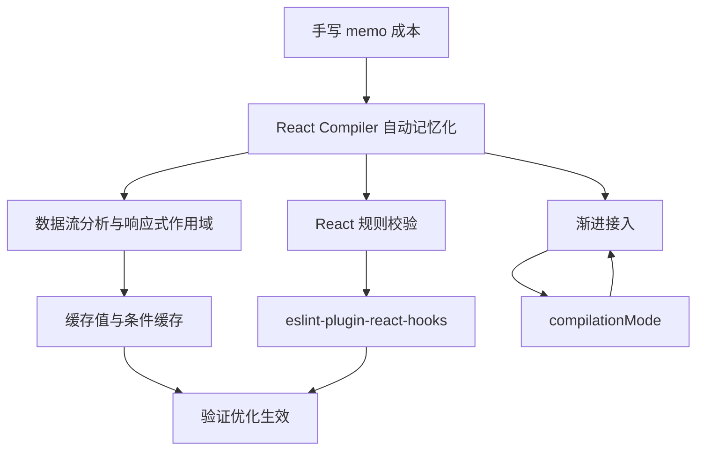
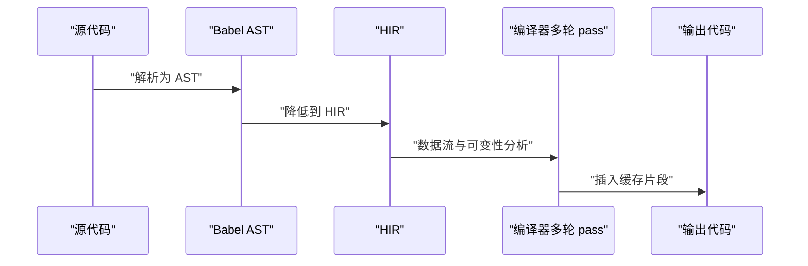
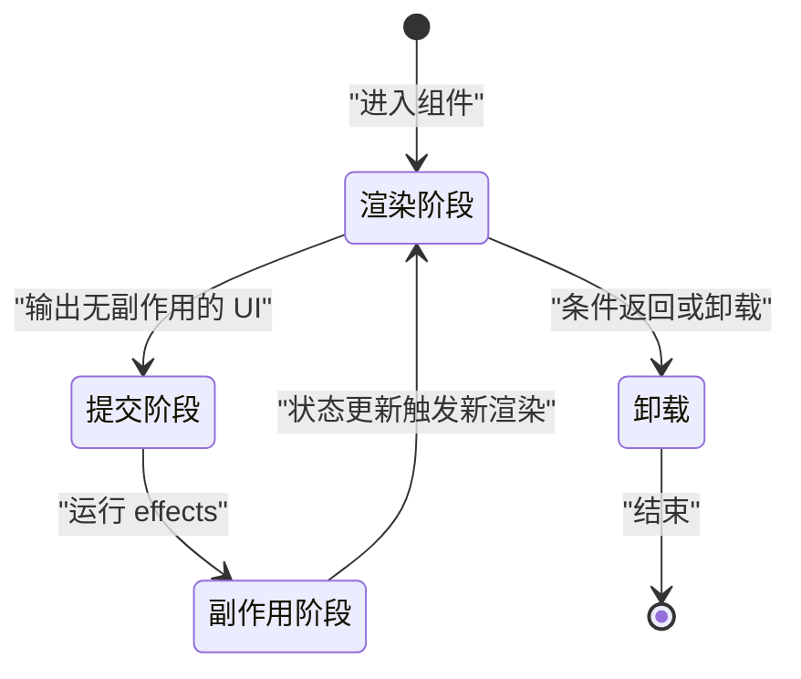
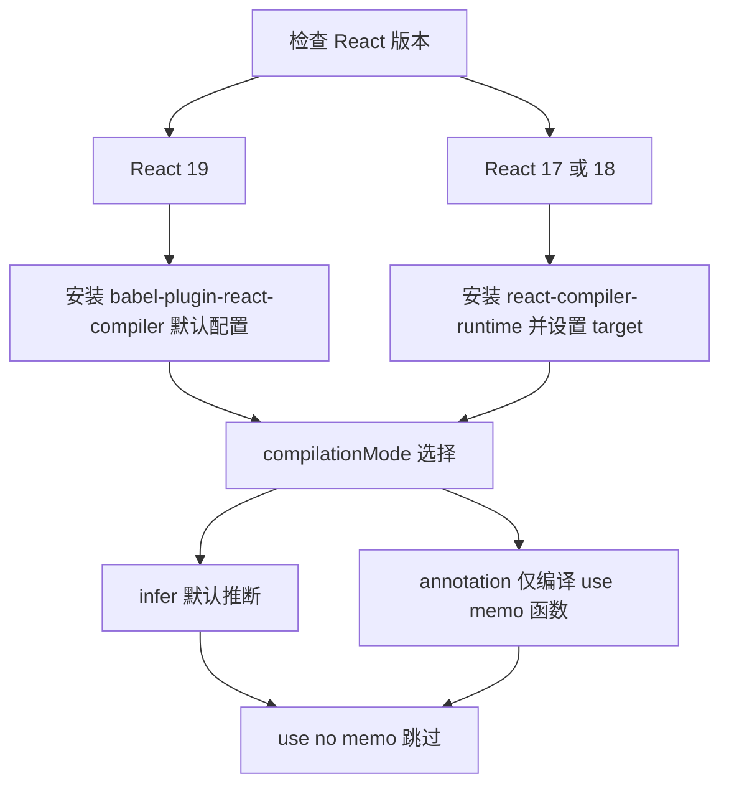
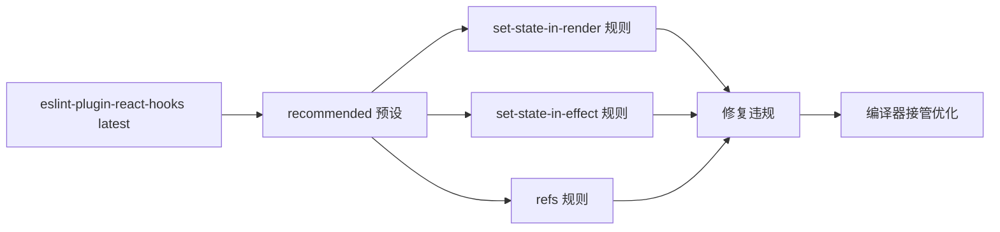
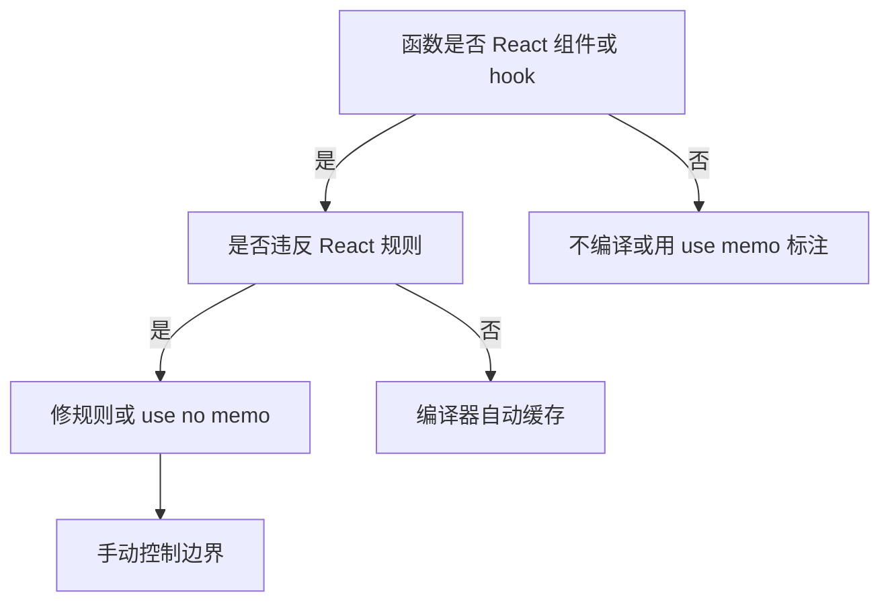

# React Compiler：自动记忆化如何工作

!!! abstract "学完这一页你能"

- 说出 React Compiler 在构建期做什么，以及它为什么能替代大部分手写 useMemo 与 useCallback。
- 按 React 19 或 React 17/18 选择最小接入配置，并解释 compilationMode 的默认推断与标注模式。
- 用 eslint-plugin-react-hooks 的 compiler-powered 规则发现渲染期 setState、effect 中昂贵操作等违规。
- 判断一个函数该不该编译、何时用 use no memo，并规划库发布前编译产物的流程。

## 0. 知识地图



建议先读第 1 节，建立手写 memo 为什么容易出错的判断。再读第 2、3 节，理解编译器自动记忆化依赖的数据流与 React 规则。最后按第 4 到第 8 节做接入、验证与库发布。

## 1. 手写 memo 的成本与出错点

**先想一个问题**：商品列表页每次筛选都会重建筛选条件对象和回调函数，子组件因此全部重渲染。你不得不手动加 useMemo、useCallback、React.memo，还要持续维护依赖数组。

**心智模型**

!!! tip "心智模型"

一句话模型：手写 memo 是一套必须人工维护的引用相等协议。
日常类比：给每件包裹手动贴“内容变了才重送”的标签，每次打包都要自己判断内容是否变化。
类比在哪里不成立：React 的 memo 比较引用相等，不是内容相等；两个内容相同的新对象仍会触发重渲染。

**图解**


1. 父组件渲染时创建新的对象或函数。
2. 子组件浅比较发现 props 引用变了。
3. 子组件重渲染，即使内容与上次相同。
4. useMemo 或 useCallback 稳定部分引用。
5. React.memo 包住子组件后，稳定引用可跳过重渲染。
6. 依赖数组漏写或写宽，缓存又会失效或读到旧值。

**一步一步来**

① 第一步：用 useMemo 稳定筛选条件对象。

```js
import { useMemo, useState } from "react";

function ProductList() {
  const [keyword, setKeyword] = useState("");
  const [status, setStatus] = useState("all");

  const filter = useMemo(() => {
    return { keyword, status }; // 依赖变化时才新建对象
  }, [keyword, status]);

  return <ProductTable filter={filter} />;
}
```

**这段代码在做什么**

- 只有 keyword 或 status 变化，filter 才重新创建。
- 父组件因其他状态重渲染时，filter 引用保持稳定。
- 子组件 ProductTable 若用 React.memo 包裹，可跳过重渲染。
- 依赖数组漏写 keyword，会读到旧 keyword。

无运行输出，这是渲染行为。

② 第二步：用 useCallback 稳定选中回调。

```js
import { useCallback } from "react";

function ProductList() {
  const handleSelect = useCallback((id) => {
    console.log("选中商品", id); // 回调体不依赖变化值时可留空依赖
  }, []);

  return <ProductTable onSelect={handleSelect} />;
}
```

**这段代码在做什么**

- 依赖数组为空，表示 handleSelect 只创建一次。
- 如果回调内部要读最新状态，空依赖会读到闭包旧值。
- 这是手动 useCallback 的典型出错点：闭包旧值与依赖漏写。
- 后续需要新状态时，必须把状态加入依赖数组。

无运行输出。

③ 第三步：用 React.memo 包裹子组件。

```js
import { memo } from "react";

const ProductTable = memo(function ProductTable({ filter, onSelect }) {
  // 仅当 filter 或 onSelect 引用变化时重新渲染
  return <table>{/* 表格渲染细节省略 */}</table>;
});
```

**这段代码在做什么**

- memo 对传入 props 做浅比较。
- filter 是新对象时，即使内容相同也会重渲染。
- filter 和 onSelect 都稳定后，memo 才真正起作用。
- 手动 memo 需要三个部分配合，缺一个就不完整。

**动手验证**

```js
// run-memo-check.mjs，Node 20+ 单文件，无第三方依赖
import assert from "node:assert";

let cache = null;
let lastDeps = null;

function useMemoLike(factory, deps) {
  const sameDeps = lastDeps !== null && deps.every((d, i) => d === lastDeps[i]);
  if (!sameDeps) {
    cache = factory();
    lastDeps = [...deps];
  }
  return cache;
}

let keyword = "";
let status = "all";
const first = useMemoLike(() => ({ keyword, status }), [keyword, status]);
const second = useMemoLike(() => ({ keyword, status }), [keyword, status]);
assert.strictEqual(first, second, "依赖不变，应返回同一引用");

keyword = "phone";
const third = useMemoLike(() => ({ keyword, status }), [keyword, status]);
assert.notStrictEqual(first, third, "依赖变化，应返回新对象");
console.log("手动 memo 验证通过：依赖不变复用引用，依赖变化新建对象");
```

预期输出：

```text
手动 memo 验证通过：依赖不变复用引用，依赖变化新建对象
```

**常见坑**

| 现象 | 原因 | 怎么修 |
| --- | --- | --- |
| 漏写依赖但页面看起来正常 | 该依赖值在当前路径未变化 | 用 eslint-plugin-react-hooks 的依赖规则检查 |
| 依赖写宽导致每次新建 | 依赖里有内联对象或函数 | 先稳定内联对象或函数，再写窄依赖 |
| React.memo 不生效 | 某个 props 引用未稳定 | 逐项检查 props 引用，去掉错误的自定义比较函数 |

**用在哪里**

1. 电商商品列表筛选器
   - 业务背景：筛选关键词、状态、类目变化频繁。
   - 这一节的知识怎么用：用 useMemo 稳定 filter 对象，useCallback 稳定选中回调，React.memo 包裹表格行。
   - 指标：React DevTools Profiler 的重渲染次数与单次渲染耗时。
   - 不该用：筛选器只有 2 到 3 个字段且表格行很轻，手写 memo 成本高于收益。
2. 后台管理批量导入向导
   - 业务背景：多步骤表单，步骤切换时上一步数据不应重算。
   - 这一节的知识怎么用：稳定步骤回调与步骤数据。
   - 指标：切换步骤时的渲染耗时。
   - 不该用：步骤少且数据量小，稳定引用不会带来可感知收益。
3. 实时看板订阅卡片
   - 业务背景：推送数据高频，但只有部分卡片关心新数据。
   - 这一节的知识怎么用：稳定卡片 props 与订阅回调。
   - 指标：每秒重渲染卡片数。
   - 不该用：所有卡片都需响应同一推送，稳定引用反而增加理解成本。

**行业实践**

- React 官方 2024/10/21 beta 发布说明：在 Meta 分析发现，约 8% 的 React 拉取请求使用手动 memo，且这些请求作者耗时增加 31% 至 46%。
- React Compiler 的目标是默认缓存所有代码，而不仅是这 8%。
- 怎么借鉴：把 lint 规则先接入 CI，减少手动依赖数组错误，再评估自动缓存。

**小结**

1. 手写 memo 的成本在依赖数组维护与心智负担。
2. memo 比较引用相等，必须配合稳定 props。
3. 自动记忆化的必要性来自手写 memo 出错率高与覆盖不全。

## 2. React Compiler 到底做什么

**先想一个问题**：不写 useMemo，编译器如何知道哪里该缓存、缓存依赖是什么？

**心智模型**

!!! tip "心智模型"

一句话模型：React Compiler 是构建期工具，通过数据流与可变性分析把组件拆成响应式作用域。
日常类比：编译器给代码自动安插“只有布料变色才重新裁剪该块”的裁剪线。
类比在哪里不成立：类比是运行期观察，编译器是静态分析，不会执行代码，也无法知道所有运行期值。

!!! note "术语：HIR"

HIR 是 High-Level Intermediate Representation，即高层中间表示。
例子：编译器把 Babel 给出的 AST 降低到自己的 HIR，再做多轮分析。

**图解**



1. 源代码先由 Babel 解析为 AST。
2. 编译器把 AST 降低到自己的 HIR。
3. 多轮 pass 分析数据流与可变性。
4. 最终输出插入缓存逻辑的 JavaScript。
5. 这个流程发生在构建期，不在运行时。

**一步一步来**

① 第一步：观察编译器能处理条件返回后的代码。

```js
import { use } from "react";

export default function ThemeProvider(props) {
  if (!props.children) {
    return null;
  }
  // 编译器仍能在条件返回后缓存这段计算
  const theme = mergeTheme(props.theme, use(ThemeContext));
  return (
    <ThemeContext value={theme}>
      {props.children}
    </ThemeContext>
  );
}
```

**这段代码在做什么**

- 该示例来自 React Compiler 1.0 官方发布说明。
- props.children 为空时提前返回 null。
- 编译器不会因为提前返回就放弃后续分析。
- theme 的计算依赖 props.theme 与 ThemeContext。
- 这种条件返回后的缓存常被称为条件记忆化，手写 memo 很难做到。

② 第二步：看一个概念性的缓存边界示意。

```js
// 概念示意：编译器可能拆出的响应式作用域边界，不是真实输出
function ThemeProviderConcept(props) {
  if (!props.children) return null;
  // 编译器分析出 theme 依赖 props.theme 与 ThemeContext
  // 当这两个依赖不变时，theme 可复用上一次结果
  const theme = mergeTheme(props.theme, use(ThemeContext));
  return (
    <ThemeContext value={theme}>
      {props.children}
    </ThemeContext>
  );
}
```

**这段代码在做什么**

- 真实输出由编译器生成，需用 React Compiler Playground 查看。
- 关键是拆出 theme 这一段，只让它随自身依赖变化。
- 依赖不变时，这段计算与返回的 JSX 可复用。
- 业务代码不需要写这些缓存判断，由构件输出完成。

③ 第三步：看可选链与数组索引作为依赖的写法。

```js
function SelectedLabel({ items, index }) {
  // 编译器 1.0 支持把可选链与数组索引识别为依赖
  const label = items?.[index]?.label;
  return <span>{label ?? "空"}</span>;
}
```

**这段代码在做什么**

- 官方 1.0 发布说明写明：编译器支持可选链与数组索引作为依赖。
- label 依赖 items 与 index。
- index 变化时，label 可缓存失效并重算。
- 具体生成代码以 Playground 与官方文档输出为准。

**动手验证**

```js
// run-dep-check.mjs，Node 20+ 单文件，无第三方依赖
import assert from "node:assert";

function collectDepsOfOptionalIndex(itemsPath, indexPath) {
  // 简化演示：可选链与数组索引两者都进入依赖列表
  return [itemsPath, indexPath];
}

const deps = collectDepsOfOptionalIndex("items", "index");
assert.deepStrictEqual(deps, ["items", "index"]);
console.log("依赖收集验证通过：可选链与数组索引进入依赖列表");
```

预期输出：

```text
依赖收集验证通过：可选链与数组索引进入依赖列表
```

**常见坑**

| 现象 | 原因 | 怎么修 |
| --- | --- | --- |
| 以为编译器会运行期缓存所有值 | 编译器的分析发生在构建期 | 用官方 Playground 查看真实输出 |
| 以为编译器修改业务逻辑 | 编译器只插入缓存，不改变语义 | 读编译产物并跑原有测试 |
| 以为条件返回后无法优化 | 编译器基于 HIR 分析可跨条件返回 | 用 ThemeProvider 示例验证 |

**用在哪里**

1. 大型 SPA 商品详情页的多条件渲染区块
   - 业务背景：详情页有库存、物流、推荐等多个区块，部分区块有提前返回。
   - 这一节的知识怎么用：让编译器在条件返回后仍缓存后续区块。
   - 指标：详情页交互区块的重渲染次数。
   - 不该用：区块本身极少渲染，缓存收益低。
2. React Native 信息流卡片
   - 业务背景：长列表卡片有可选字段，用户快速滚动时重渲染代价高。
   - 这一节的知识怎么用：可选链字段依赖被自动识别，减少卡片重渲染。
   - 指标：滚动帧率与卡片重渲染次数。
   - 不该用：卡片数据完全扁平，依赖识别带来的收益有限。
3. 聊天消息列表
   - 业务背景：消息按数组索引渲染，索引变化频繁。
   - 这一节的知识怎么用：数组索引作为依赖自动缓存。
   - 指标：输入新消息时的重渲染耗时。
   - 不该用：消息列表每次都整体更新，缓存命中率低。

**行业实践**

- React Compiler Playground 是官方查看编译产物的入口。
- 官方 1.0 发布说明给出 ThemeProvider 示例，用于展示条件记忆化。
- 怎么借鉴：把可疑的重渲染组件复制到 Playground，对照输入与产出。

**小结**

1. 编译器在构建期通过 HIR 分析数据流与可变性。
2. 自动记忆化可缓存条件返回后的值。
3. 可选链与数组索引依赖是 1.0 新增能力。

## 3. 它依赖的 React 规则：纯渲染与不可变

**先想一个问题**：为什么组件必须在渲染阶段保持纯净，编译器才敢自动缓存？

**心智模型**

!!! tip "心智模型"

一句话模型：纯渲染是同一输入必须输出同一 UI，不可变是不修改已存在的 state 与 props。
日常类比：自动售货机投币选同款一定掉同款，不会随机多掉一罐。
类比在哪里不成立：React 组件允许内部状态与 hooks，纯渲染只限制渲染阶段副作用，不是完全无状态。

!!! note "术语：Rules of React"

Rules of React 是 React 官方对组件与 hook 的一组约束规则。
例子：渲染期间不得直接调用 setState；不得在渲染中读取会被 refs 修改的值。

**图解**



1. 渲染阶段只能计算 UI，不能有副作用。
2. 提交阶段把 UI 更新到页面。
3. 副作用阶段运行 effects 与事件。
4. 状态更新再次回到渲染阶段。
5. 纯渲染保证编译器可以安全复用渲染结果。

**一步一步来**

① 第一步：写一个纯渲染组件。

```js
function PriceTag({ price, currency }) {
  // 纯渲染：同样的 price 与 currency 一定返回同样 UI
  return <span>{currency}{price}</span>;
}
```

**这段代码在做什么**

- 只读取 props，不修改外部变量。
- 不调用 setState，不读 refs。
- 同样的 price 与 currency 会得到同样输出。
- 这是编译器能分析的最小单元。

② 第二步：识别渲染期 setState 违规。

```js
function BadCounter({ count, setCount }) {
  // 违反 React 规则：渲染期间调用 setState
  setCount(count + 1);
  return <div>{count}</div>;
}
```

**这段代码在做什么**

- 渲染期间 setCount 会触发新一轮渲染。
- 如果 setCount 无条件执行，可能形成渲染循环。
- 编译器 powered lint 的 set-state-in-render 规则可识别它。
- 这是官方 1.0 发布说明列出的示例规则之一。

③ 第三步：用不可变方式更新数组。

```js
function addItem(list, item) {
  // 不可变更新：返回新数组，不修改原数组
  return [...list, item];
}
```

**这段代码在做什么**

- 直接 list.push(item) 会修改原数组。
- 不可变更新返回新数组，旧的数组引用仍可复用。
- 编译器依赖不可变数据做缓存判断。
- 原数组内容变了，编译器无法稳定旧缓存。

**动手验证**

```js
// run-rules-check.mjs，Node 20+ 单文件，无第三方依赖
import assert from "node:assert";

function pureRender(price, currency) {
  return `${currency}${price}`;
}

function addItem(list, item) {
  return [...list, item];
}

const original = ["a", "b"];
const next = addItem(original, "c");
assert.strictEqual(pureRender(10, "¥"), "¥10");
assert.deepStrictEqual(original, ["a", "b"], "原数组不应被修改");
assert.deepStrictEqual(next, ["a", "b", "c"]);
console.log("规则验证通过：纯渲染稳定，不可变更新不修改原数组");
```

预期输出：

```text
规则验证通过：纯渲染稳定，不可变更新不修改原数组
```

**常见坑**

| 现象 | 原因 | 怎么修 |
| --- | --- | --- |
| 渲染循环 | 渲染期间无条件 setState | 把 setState 移到事件或 effect 中 |
| state 数组内容变了但组件不更新 | 直接 push 修改原数组，引用不变 | 用展开或 map 返回新数组 |
| 依赖比对失效 | 可变数据让编译器无法稳定旧引用 | 遵守不可变更更新 |

**用在哪里**

1. 表单校验状态提升
   - 业务背景：多个表单字段共享校验结果，字段输入触发校验。
   - 这一节的知识怎么用：渲染只算校验输出，setState 放事件处理。
   - 指标：表单输入时的重渲染次数。
   - 不该用：校验逻辑本来就要求渲染期读 DOM 时，用 ref 加 effect 处理。
2. 购物车数量更新
   - 业务背景：数量加减需要更新数组中的商品。
   - 这一节的知识怎么用：用 map 返回新数组，不修改原购物车数组。
   - 指标：更新后商品行重渲染数量。
   - 不该用：购物车每次全量替换，不可变更新收益不明显。
3. 虚拟滚动列表项数据更新
   - 业务背景：滚动中的列表项可能高频更新。
   - 这一节的知识怎么用：数组项更新时返回新引用，编译器可缓存未变项。
   - 指标：滚动帧率与列表项重渲染数。
   - 不该用：列表项极少变动，保持不可变会增加复制成本。

**行业实践**

- eslint-plugin-react-hooks 的 compiler-powered 规则编码 Rules of React。
- 官方 1.0 发布说明列出 set-state-in-render、set-state-in-effect、refs 规则。
- 怎么借鉴：在接入编译器前，先让 lint 规则通过，减少后续编译跳过。

**小结**

1. 纯渲染保证编译器安全复用渲染结果。
2. 不可变数据保证旧引用可继续复用。
3. 规则违规会被编译器驱动 lint 暴露，而不是等到构建后出错。

## 4. 接入方式与渐进采用

**先想一个问题**：一个旧项目不想一次性全量编译，也不想升级 React 19，还能用编译器吗？

**心智模型**

!!! tip "心智模型"

一句话模型：渐进采用像给大楼逐层换管线，每层单独施工，不必整楼停水。
类比：一栋大楼分区停水换管，其他楼层照常用水。
类比在哪里不成立：编译器是静态转换，某个函数不编译不会“漏水”影响其他函数运行，但规则违规可能让编译跳过。

**图解**



1. React 19 项目用默认插件配置。
2. React 17/18 项目加 runtime 依赖与 target 配置。
3. 渐进采用用 annotation 模式，只编译标注函数。
4. infer 模式编译 PascalCase 组件与 use 开头 hook。
5. 任何模式下 use no memo 都跳过编译。

!!! note "术语：compilationMode"

compilationMode 控制编译器选择哪些函数优化。
例子：设为 annotation 时，只有带 "use memo" 指令的函数会被编译。

**一步一步来**

① 第一步：安装指定版本的 babel 插件。

```bash
npm install --save-dev --save-exact babel-plugin-react-compiler@latest
```

**这段代码在做什么**

- 官方 1.0 发布说明给出的安装命令。
- --save-exact 锁定准确版本，避免范围版本漂移。
- 插件目前是 Babel 插件形式，但编译器本身与 Babel 解耦。
- pnpm 和 yarn 有对应的官方安装命令。

无运行输出，安装阶段结果见 package.json。

② 第二步：React 19 默认 Babel 配置。

```js
// babel.config.js
module.exports = {
  plugins: [
    'babel-plugin-react-compiler'
  ]
};
```

**这段代码在做什么**

- 仅加入插件，使用默认 compilationMode: infer。
- infer 会编译 PascalCase 组件与 use 开头 hook，条件是创建 JSX 或调用 hook。
- 小写开头 function button 返回 JSX 不会在 infer 下编译。
- fn useData 不创建 JSX 也不调用 hook，也不会编译。

③ 第三步：annotation 模式渐进迁移。

```js
// babel.config.js：只编译标注过的函数
module.exports = {
  plugins: [
    ['babel-plugin-react-compiler', { compilationMode: 'annotation' }]
  ]
};
```

**这段代码在做什么**

- annotation 只编译明确写 "use memo" 的函数。
- 适合旧项目一个目录一个目录地迁移。
- 未标注函数保持原逻辑，不插入缓存。
- 迁移后可从 annotation 切换回 infer。

④ 第四步：React 17 或 18 指定 target。

```js
// babel.config.js：面向 React 17 或 18
module.exports = {
  plugins: [
    ['babel-plugin-react-compiler', { target: '17' }]
  ]
};
```

**这段代码在做什么**

- React 19 不需要 target 与 runtime。
- React 17 或 18 需先安装 react-compiler-runtime 依赖。
- target 设 17 或 18，告诉编译器生成兼容代码。
- runtime 会按应用实际版本选择或 polyfill 所需 API。

**动手验证**

```js
// run-adoption-check.mjs，Node 20+ 单文件，无第三方依赖
import assert from "node:assert";

function getConfig(reactVersion, mode = "infer") {
  const config = { plugin: "babel-plugin-react-compiler", compilationMode: mode };
  if (reactVersion < 19) {
    config.target = String(reactVersion);
    config.needsRuntime = true;
  }
  return config;
}

assert.deepStrictEqual(getConfig(19), {
  plugin: "babel-plugin-react-compiler",
  compilationMode: "infer",
});
assert.strictEqual(getConfig(18).needsRuntime, true);
assert.strictEqual(getConfig(17, "annotation").compilationMode, "annotation");
console.log("配置决策验证通过：React 17/18 需要 runtime 与 target");
```

预期输出：

```text
配置决策验证通过：React 17/18 需要 runtime 与 target
```

**常见坑**

| 现象 | 原因 | 怎么修 |
| --- | --- | --- |
| 用 all 模式编译了工具函数 | all 会编译所有顶层函数 | 改用 infer 或 annotation |
| React 17 下编译产物报错 | 未加 react-compiler-runtime | 加入依赖并设 target |
| Babel 插件冲突 | 插件顺序或别的优化插件干扰 | 把 babel-plugin-react-compiler 放在插件列表靠前位置 |

**用在哪里**

1. 旧后台管理系统渐进迁移
   - 业务背景：系统组件多、React 版本可能是 17 或 18。
   - 这一节的知识怎么用：annotation 模式只编译标记组件，逐步扩大范围。
   - 指标：每次迁移后功能回归通过率与构建产物差异。
   - 不该用：团队没有意愿维护逐步迁移清单，一次全量更简单。
2. 新项目创建时直接启用
   - 业务背景：新应用用 Expo、Vite 或 Next.js 创建。
   - 这一节的知识怎么用：这些工具已与官方合作，新应用默认或少量配置即可启用。
   - 指标：首次交互耗时与后续优化工时。
   - 不该用：项目必须固定在非常旧的构建链且不能升级。
3. 需要 A/B 灰度时用 gating
   - 业务背景：编译器优化要在部分用户中先行。
   - 这一节的知识怎么用：配置 gating 的 source 与 importSpecifierName。
   - 指标：同一路径的加载与交互耗时差异。
   - 不该用：功能没有可用的 feature flag 系统。

**行业实践**

- React 官方 1.0 发布说明：已与 Expo、Vite、Next.js 合作，新应用可从编译器启用开始。
- 官方配置文档写明 compilationMode 与 target 选项。
- 怎么借鉴：先读官方 quickstart，再在测试项目验证 annotation 模式。

**小结**

1. React 19 用默认插件配置，React 17/18 加 runtime 与 target。
2. annotation 模式支持渐进只编译 use memo 标注函数。
3. use no memo 可在任何模式下跳过特定函数。

## 5. ESLint 规则：编译器驱动的诊断

**先想一个问题**：没装编译器，能提前发现渲染期 setState、effect 中昂贵操作吗？

**心智模型**

!!! tip "心智模型"

一句话模型：lint 规则是编译器的静态体检单，不治病但能标出需要处理的项目。
类比：入职体检不治病，但能标出哪些项目要处理后才能上生产线。
类比在哪里不成立：体检只报告，编译器还能自动优化；但 lint 自身不修改任何运行逻辑。

**图解**



1. 安装最新 eslint-plugin-react-hooks。
2. recommended 预设启用 compiler-powered 规则。
3. 三个官方示例规则覆盖常见违规。
4. 修复违规后再让编译器优化。
5. lint 不要求已安装编译器，升级无风险。

**一步一步来**

① 第一步：安装最新 lint 插件。

```bash
npm install --save-dev eslint-plugin-react-hooks@latest
```

**这段代码在做什么**

- 官方 1.0 发布说明推荐升级到最新版。
- 新版在 recommended 与 recommended-latest 预设中带上编译器 powered 规则。
- 已安装 eslint-plugin-react-compiler 的可以移除。
- lint 不依赖编译器本体，所以升级不会带入构建风险。

② 第二步：Flat Config 启用 recommended。

```js
// eslint.config.js (Flat Config)
import reactHooks from 'eslint-plugin-react-hooks';
import { defineConfig } from 'eslint/config';

export default defineConfig([
  reactHooks.configs.flat.recommended,
]);
```

**这段代码在做什么**

- 使用 ESLint Flat Config 格式。
- 直接启用插件提供的 recommended 预设。
- 预设内含官方发布说明提到的编译器 powered 规则。
- 更多细则需参考 eslint-plugin-react-hooks 的 README。

③ 第三步：Legacy Config 启用 recommended。

```json
{
  "extends": ["plugin:react-hooks/recommended"],
  "// 说明": "更多配置见 eslint-plugin-react-hooks README"
}
```

**这段代码在做什么**

- 这是 eslintrc.json 的 Legacy Config 写法。
- extends 数组加入 plugin:react-hooks/recommended。
- 与 Flat Config 二选一，按项目 ESLint 版本选择。
- 规则检查结果用于修正 Rules of React 违规。

**动手验证**

```js
// run-lint-simulate.mjs，Node 20+ 单文件，无第三方依赖
import assert from "node:assert";

function checkSetStateInRender(bodyStatements) {
  // 简化规则：渲染函数体内出现 set 开头调用就报出
  return bodyStatements
    .filter((s) => typeof s === "string" && s.startsWith("set"))
    .map((s) => s);
}

const bad = [
  "const [count, setCount] = useState(0)",
  "setCount(count + 1)",
  "return <div>{count}</div>",
];
assert.deepStrictEqual(checkSetStateInRender(bad), ["setCount(count + 1)"]);
console.log("lint 模拟通过：渲染期 setState 被识别");
```

预期输出：

```text
lint 模拟通过：渲染期 setState 被识别
```

**常见坑**

| 现象 | 原因 | 怎么修 |
| --- | --- | --- |
| 仍用旧 eslint-plugin-react-compiler | 1.0 后规则并入 react-hooks 插件 | 卸载旧插件，升级 react-hooks latest |
| 只开编译器不跑 lint | 规则违规让编译跳过或行为异常 | 在 CI 同时启用 lint |
| 报错被忽略不修 | 团队认为 lint 只影响风格 | 把 lint 失败设为合并阻塞 |

**用在哪里**

1. CI 流水线预提交
   - 业务背景：团队需要提前发现规则违规。
   - 这一节的知识怎么用：把 lint 集成到 CI，失败即阻塞合并。
   - 指标：规则违规数从合并前到合并后的下降量。
   - 不该用：没有 ESLint 基础设施时先补齐基础，再上 compiler-powered 规则。
2. 旧项目编译器启用前清扫
   - 业务背景：公司要逐步启用编译器，需先清空规则违规。
   - 这一节的知识怎么用：先跑 recommended 预设，修完违规再启用编译器。
   - 指标：规则违规清零用时与启用编译器后编译跳过数。
   - 不该用：项目依赖的第三方库本身违规，先隔离第三方代码再清扫。
3. 新团队规则教育
   - 业务背景：新同学不知道渲染期 setState 的风险。
   - 这一节的知识怎么用：用 lint 报错作为教学反馈。
   - 指标：同类违规在 30 天内的重复率。
   - 不该用：把 lint 报错当唯一教学材料，还需配合文档讲解。

**行业实践**

- eslint-plugin-react-hooks 官方 README 提供 Flat Config 与 Legacy Config 启用说明。
- 官方 1.0 发布说明列出 set-state-in-render、set-state-in-effect、refs 示例。
- 怎么借鉴：先在本地跑一次，按文件统计违规分布，优先修复组件目录。

**小结**

1. 新版 lint 在 recommended 预设中携带编译器 powered 规则。
2. lint 不依赖编译器本体，可以独立提前使用。
3. 规则违规属于运行问题，不是风格问题。

## 6. 何时仍需手写与何时不该编译

**先想一个问题**：编译器是否完全替代 useMemo、useCallback 与 React.memo？

**心智模型**

!!! tip "心智模型"

一句话模型：编译器负责默认的渲染缓存，手写负责编译器跳过的边界。
类比：自动驾驶承担常规路况，复杂施工路段仍需人工接管。
类比在哪里不成立：编译器不会在运行期突然失灵，不编译是由静态配置决定，不是动态路况变化。

**图解**



1. 是组件或 hook 且不违规，编译器自动缓存。
2. 违反规则时，要么修规则，要么用 use no memo 跳过。
3. 非 React 函数在 infer 下不编译，可用 use memo 标注。
4. 有副作用的组件用 use no memo 跳过编译。
5. 手写 memo 仍用于编译器不处理的边界。

**一步一步来**

① 第一步：对有副作用的组件用 use no memo。

```js
function ComponentWithSideEffects() {
  "use no memo"; // 跳过编译

  // 该组件有副作用，不应被记忆化
  logToAnalytics('component_rendered');

  return <div>Content</div>;
}
```

**这段代码在做什么**

- "use no memo" 让编译器跳过该函数。
- 无论 compilationMode 是哪种模式，该指令都生效。
- 有副作用时跳过编译，避免副作用被缓存抑制。
- 这是官方 compilationMode 文档给出的示例。

② 第二步：对非 React 的昂贵计算用 use memo。

```js
function expensiveCalculation(data) {
  "use memo"; // 显式要求编译该函数
  return data.reduce(/* 昂贵计算细节省略 */);
}
```

**这段代码在做什么**

- 该函数不是组件也不是 hook，但用 use memo 显式标注。
- 在 infer 模式下，没有该标注就不会被编译。
- 在 annotation 模式下，只有这类标注函数会被编译。
- 返回值的缓存由编译器插入。

③ 第三步：识别 infer 模式下不会编译的函数。

```js
// 小写函数返回 JSX，不符合 PascalCase 组件约定
function button(props) {
  return <button>{props.label}</button>;
}

// 名为 useData 但不调用 hook，不符合 hook 推断条件
function useData() {
  return window.localStorage.getItem('data');
}
```

**这段代码在做什么**

- 小写 button 不会在 infer 下编译。
- useData 不创建 JSX 也不调用 hook，不会在 infer 下编译。
- 解决方式：改成 PascalCase 组件，或加 use memo 标注。
- 官方 compilationMode 文档列出这些反例。

**动手验证**

```js
// run-infer-check.mjs，Node 20+ 单文件，无第三方依赖
import assert from "node:assert";

function inferDecision(name, returnsJSX, callsHook, hasUseMemo) {
  if (hasUseMemo) return "compile";
  if (name.startsWith("use") && callsHook) return "compile";
  if (name[0] === name[0].toUpperCase() && returnsJSX) return "compile";
  return "skip";
}

assert.strictEqual(inferDecision("Button", true, false, false), "compile");
assert.strictEqual(inferDecision("button", true, false, false), "skip");
assert.strictEqual(inferDecision("useData", false, false, false), "skip");
assert.strictEqual(inferDecision("useData", false, true, false), "compile");
assert.strictEqual(inferDecision("calcTotal", false, false, true), "compile");
console.log("infer 决策验证通过：命名与 hook 调用决定默认编译范围");
```

预期输出：

```text
infer 决策验证通过：命名与 hook 调用决定默认编译范围
```

**常见坑**

| 现象 | 原因 | 怎么修 |
| --- | --- | --- |
| 认为 useMemo 可以全部删除 | 编译器默认不覆盖有副作用的边界 | 保留手写 memo 直到边界确认 |
| 副作用组件被误编译 | 忘记 use no memo | 给副作用组件加 use no memo |
| 使用 all 模式编译非 React 函数 | all 会编译所有顶层函数 | 改用 infer 或 annotation |

**用在哪里**

1. 含埋点上报的展示组件
   - 业务背景：组件每次渲染都要上报展示事件。
   - 这一节的知识怎么用：加 use no memo，避免缓存抑制上报。
   - 指标：上报请求数与重渲染数的关系。
   - 不该用：上报已抽到外部 effect，可以正常编译。
2. 动画组件调用浏览器 API
   - 业务背景：渲染期间需要读瞬时 DOM 状态。
   - 这一节的知识怎么用：明确跳过编译，手写更新逻辑。
   - 指标：动画帧率与 API 调用时序。
   - 不该用：DOM 读取已隔离到 effect 或 ref。
3. 面向 React 17/18 的 SDK
   - 业务背景：SDK 要兼容旧版本 React。
   - 这一节的知识怎么用：编译产物加 runtime 依赖，target 设最小版本。
   - 指标：SDK 在目标版本的回归通过率。
   - 不该用：内部项目只跑 React 19，不需要旧版兼容层。

**行业实践**

- 官方 compilationMode 文档写明 "use no memo" 在任何模式下都跳过。
- 官方 compiling-libraries 指南建议库作者先编译再发布。
- 怎么借鉴：列一份组件清单，标出副作用组件后再全量启用编译器。

**小结**

1. 编译器不替代所有手写 memo，跳过边界仍需手写。
2. use no memo 是稳定的跳过开关。
3. 非 React 函数可在 infer 下用 use memo 明确要求编译。

## 7. 如何验证优化生效

**先想一个问题**：上线编译器后，怎么证明不是“感觉快了”，而是构建产物真的减少了重渲染？

**心智模型**

!!! tip "心智模型"

一句话模型：验证是对比同一路径编译前后差异，而不是看单次体验。
类比：测跑步训练效果，要同一条跑道、同一双鞋、同一段计时。
类比在哪里不成立：前端性能受设备网络影响，不能只靠一次秒表，要多次采样或 A/B。

**图解**


1. 构建两个产物，仅编译器开关不同。
2. 用 React DevTools Profiler 在同一路径采集。
3. 记录交互耗时与渲染次数。
4. 对比差值，而不是只看编译后单次数字。
5. 线上可用 gating 做 A/B 测试。

**一步一步来**

① 第一步：用 logger 记录编译成功事件。

```js
// babel.config.js：记录编译器事件
module.exports = {
  plugins: [
    ['babel-plugin-react-compiler', {
      logger: {
        logEvent(filename, event) {
          if (event.kind === 'CompileSuccess') {
            console.log('Compiled:', filename);
          }
        }
      }
    }]
  ]
};
```

**这段代码在做什么**

- logger 是官方配置文档列出的调试选项。
- event.kind 为 CompileSuccess 时记录文件名。
- 运行构建后，日志能告诉你哪些文件被编译。
- 这用于确认编译器确实处理了目标组件。

运行结果示例：

```text
Compiled: src/components/ProductList.jsx
Compiled: src/components/ProductTable.jsx
```

② 第二步：用精简模型对比渲染次数。

```js
// 概念模型：同一 props 下，有缓存跳过更多渲染
function renderComponent(timesWithCache, timesWithoutCache) {
  return timesWithoutCache - timesWithCache;
}

const saved = renderComponent(3, 10);
```

**这段代码在做什么**

- 这是一个验证思路的示意，不是真实 Profiler 输出。
- timesWithCache 表示缓存后重渲染次数。
- timesWithoutCache 表示缓存前重渲染次数。
- 真实数据需从 React DevTools Profiler 多次采样获得。

③ 第三步：用 gating 做线上 A/B 测试。

```js
// babel.config.js：运行时特性开关
module.exports = {
  plugins: [
    ['babel-plugin-react-compiler', {
      gating: {
        source: 'my-feature-flags',
        importSpecifierName: 'isCompilerEnabled'
      }
    }]
  ]
};
```

**这段代码在做什么**

- gating 是官方配置文档列出的 feature flag 选项。
- source 指定 feature flag 模块来源。
- importSpecifierName 指定要导入的判断函数名。
- 运行时按开关决定是否走编译优化分支。

**动手验证**

```js
// run-verify-check.mjs，Node 20+ 单文件，无第三方依赖
import assert from "node:assert";

function countRenders(propsHistory, isEqual) {
  let renders = 0;
  let prev = null;
  for (const props of propsHistory) {
    if (prev === null || !isEqual(prev, props)) {
      renders += 1;
    }
    prev = props;
  }
  return renders;
}

const history = [
  { id: 1, filter: "all" },
  { id: 1, filter: "all" },
  { id: 1, filter: "phone" },
];
const renders = countRenders(history, (a, b) => a.id === b.id && a.filter === b.filter);
assert.strictEqual(renders, 2, "引用变化但内容相同只算一次有效渲染");
console.log("验证模型通过：内容相等时有效渲染次数从引用次数中降下来");
```

预期输出：

```text
验证模型通过：内容相等时有效渲染次数从引用次数中降下来
```

**常见坑**

| 现象 | 原因 | 怎么修 |
| --- | --- | --- |
| 拿开发模式耗时当生产指标 | 开发模式有额外检查 | 用生产构建测 |
| Profiler 看未压缩代码 | 压缩与未压缩产物执行路径不同 | 用上线构建产物测试 |
| A/B 不限用户路径 | 不同路径本身耗时差异大 | 固定同一入口和同一序列 |

**用在哪里**

1. Meta Quest Store 的加载与导航
   - 业务背景：官方 1.0 发布说明公布该应用已启用编译器。
   - 这一节的知识怎么用：用加载与跨页导航耗时作为指标。
   - 指标：官方说明初始加载与跨页导航改善最高 12%，部分交互超过 2.5 倍。
   - 不该用：小流量页面样本不足，数据波动会覆盖差异。
2. 电商大促页 A/B
   - 业务背景：大促页交互频繁，需灰度验证。
   - 这一节的知识怎么用：gating 打开或关闭编译优化。
   - 指标：同一落点的交互耗时与点击转化。
   - 不该用：没有 feature flag 平台时，暂不做线上 A/B。
3. 组件库发布前回归
   - 业务背景：库作者要让用户无感获得优化。
   - 这一节的知识怎么用：编译前后各跑一遍测试套件与渲染计数。
   - 指标：回归通过率与关键组件重渲染次数。
   - 不该用：库没有稳定基准测试，无法做有意义的对比。

**行业实践**

- 官方 1.0 发布说明公布 Meta Quest Store 的改善数字。
- 官方配置文档提供 logger 与 gating 选项。
- 怎么借鉴：先固定一个重渲染明显的页面，再对比编译前后 Profiler 数据。

**小结**

1. 验证必须对比编译前后，不能只看编译后单次数字。
2. logger 确认编译文件范围，Profiler 采集渲染次数。
3. gating 适合线上 A/B，但需要稳定路径与样本。

## 8. 库作者如何发布编译产物

**先想一个问题**：组件库用户没有装编译器，怎么获得自动记忆化收益？

**心智模型**

!!! tip "心智模型"

一句话模型：库作者像把做好的菜封装成预制菜，用户加热即食。
类比：预制菜厂负责切配调味，消费者不需要知道配方。
类比在哪里不成立：前端库的编译产物还与 React 版本兼容、源码映射有关，不是一次性食品。

**图解**


1. 库作者在本地构建时编译源码。
2. 发布到 npm 的是已编译产物。
3. 应用用户不需要自行启用编译器。
4. 目标 React 17/18 时，runtime 作为依赖随库安装。
5. 用户安装库后即获得优化。

**一步一步来**

① 第一步：给库的构建装编译器。

```bash
npm install -D babel-plugin-react-compiler@latest
```

**这段代码在做什么**

- 使用官方 compiling-libraries 指南的安装命令。
- 作为 devDependency 安装，构建时使用。
- 库发布的是编译产物，编译器不进用户项目。
- 库源码需要在任何代码转换之前被编译。

② 第二步：在 Babel 配置中加入插件。

```js
// babel.config.js
module.exports = {
  plugins: [
    'babel-plugin-react-compiler',
  ],
  // 其他配置省略
};
```

**这段代码在做什么**

- 让库构建流程运行编译器。
- 发布前编译原始源码，保证所有组件都经过缓存插入。
- 如果与其他 Babel 插件冲突，把本插件放在靠前位置。
- 官方指南建议在编译后跑库的既有测试套件。

③ 第三步：目标 React 17/18 时把 runtime 放进 dependencies。

```json
{
  "dependencies": {
    "react-compiler-runtime": "^1.0.0"
  },
  "peerDependencies": {
    "react": "^17.0.0 || ^18.0.0 || ^19.0.0"
  }
}
```

**这段代码在做什么**

- react-compiler-runtime 必须放 dependencies，不是 devDependencies。
- 发布到 npm 后，用户安装库时一并获得 runtime。
- React 19 用户可以不用 runtime，但这条范围保持兼容。
- target 配置要与最低支持版本一致。

**动手验证**

```js
// run-library-check.mjs，Node 20+ 单文件，无第三方依赖
import assert from "node:assert";

function validatePackage({ dependencies, devDependencies, peerDependencies, target }) {
  const runtimeInDeps = dependencies["react-compiler-runtime"];
  const runtimeInDev = devDependencies["react-compiler-runtime"];
  return {
    runtimeReady: Boolean(runtimeInDeps),
    runtimeNotInDev: !runtimeInDev,
    peerOk: peerDependencies.react.includes("17") && peerDependencies.react.includes("18"),
    targetOk: target === "17" || target === "18" || target === "19",
  };
}

const pkg = {
  dependencies: { "react-compiler-runtime": "^1.0.0" },
  devDependencies: {},
  peerDependencies: { react: "^17.0.0 || ^18.0.0 || ^19.0.0" },
  target: "17",
};
assert.deepStrictEqual(validatePackage(pkg), {
  runtimeReady: true,
  runtimeNotInDev: true,
  peerOk: true,
  targetOk: true,
});
console.log("库配置验证通过：runtime 在 dependencies 且 target 与最低版本一致");
```

预期输出：

```text
库配置验证通过：runtime 在 dependencies 且 target 与最低版本一致
```

**常见坑**

| 现象 | 原因 | 怎么修 |
| --- | --- | --- |
| 用户报 Cannot find module react-compiler-runtime | runtime 放进了 devDependencies | 移到 dependencies |
| React 17 下库抛错 | target 未设为 17 | 设 target 与最低版本一致 |
| 编译产物被应用构建再次转换 | 库发布的产物不透明 | 让应用不要二次转换已编译产物，或用 source map 排查 |

**用在哪里**

1. 开源组件库发布
   - 业务背景：组件库用户来自不同 React 版本。
   - 这一节的知识怎么用：发布前编译，peerDependencies 标明 React 范围。
   - 指标：用户侧安装后组件重渲染次数。
   - 不该用：库的源码大量违反 React 规则，先修规则再编译。
2. 公司内部设计系统
   - 业务背景：多个业务线共享同一组件包。
   - 这一节的知识怎么用：构建阶段统一编译，各业务线不用分别配置。
   - 指标：各业务线上线后的交互耗时回归。
   - 不该用：设计系统仍频繁修改，每次编译产物差异难追踪。
3. React Native 组件包
   - 业务背景：移动端对重渲染帧率敏感。
   - 这一节的知识怎么用：RN 组件包发布编译产物，目标旧版本加 runtime。
   - 指标：列表滚动帧率与重渲染次数。
   - 不该用：包只面向 React 19，不需要旧版兼容。

**行业实践**

- 官方 compiling-libraries 指南建议库作者独立编译并测试，发布编译产物到 npm。
- 官方 1.0 发布说明提到与 Expo、Vite、Next.js 合作，新应用可先启用。
- 怎么借鉴：先在一个内部小组件包上尝试编译发布，之后再推广到主库。

**小结**

1. 库发布前编译，用户无需装编译器即可受益。
2. React 17/18 目标必须加 runtime 依赖与 target 配置。
3. 编译产物要在目标版本与未编译版本上各跑测试。

## 应用地图

| 场景 | 用到本页哪个知识点 | 典型技术选型 | 注意事项 |
| --- | --- | --- | --- |
| 电商商品列表筛选 | 自动记忆化替代手写 useMemo | babel-plugin-react-compiler + React 19 | 确认子组件无副作用 |
| 旧后台渐进迁移 | compilationMode annotation | Babel 配置 annotation 模式 | 迁移清单要维护 |
| 规则违规清扫 | eslint-plugin-react-hooks 编译器 powered 规则 | ESLint recommended 预设 | lint 失败应阻塞合并 |
| 条件返回后的缓存 | 数据流与响应式作用域 | ThemeProvider 示例 | 用 Playground 查看产物 |
| 有埋点上报的组件 | use no memo 跳过编译 | 指令跳过 | 先确认上报是否可在 effect 中完成 |
| 组件库发布 | 发布前编译与 runtime 依赖 | react-compiler-runtime + target | runtime 放 dependencies |
| 线上灰度验证 | gating feature flag | gating 配置 | 固定 A/B 路径与样本 |
| 构建产物验证 | logger 记录 CompileSuccess | logger 配置 | 只用于确认范围，不代替 Profiler |

## 动手作业

目标：给一个手写 memo 的商品列表组件接入 React Compiler，并验证优化生效。

步骤：

1. 准备一个 React 19 或 React 18 的小型列表项目。
2. 按官方安装命令安装 babel-plugin-react-compiler 与最新 eslint-plugin-react-hooks。
3. 用 annotation 模式先编译一个标记组件，跑通 lint。
4. 摘掉该组件内的 useMemo、useCallback 与 React.memo。
5. 用 logger 确认该文件出现 CompileSuccess，再跑测试。
6. 用 React DevTools Profiler 在该列表同一交互路径上采集编译前后数据。

验收标准：

1. 代码中已移除该列表组件的手写 memo 三个部分。
2. lint 无 compiler-powered 规则报错。
3. 编译后同一路径的重渲染次数不高于手写 memo 版本。
4. 若使用 React 17/18，缺少 react-compiler-runtime 时安装报错能按文档修复。

## 综合对比

| 维度 | 手写 useMemo/useCallback/memo | React Compiler | eslint-plugin-react-hooks 规则 |
| --- | --- | --- | --- |
| 工作阶段 | 运行期 | 构建期 | 静态检查期 |
| 优化方式 | 手动稳定引用并比较 | 自动插入缓存片段 | 只诊断，不优化 |
| 覆盖范围 | 仅开发者标注的 8% 左右 | 符合条件的全部组件与 hook | 所有被检查文件 |
| 条件记忆化 | 难手写 | 官方示例支持 | 不涉及 |
| React 17/18 兼容 | 无需额外 runtime | 需要 target 与 runtime | 无需版本目标 |
| 出错风险 | 依赖漏写、闭包旧值 | 违规代码可能跳过 | 漏配或忽略报错 |
| 接入成本 | 逐组件维护 | 构建配置加插件 | 升级插件并改 ESLint 配置 |
| 适用边界 | 副作用组件或非组件函数 | 规则合规的组件与 hook | 所有希望提前发现违规的项目 |

## 深入阅读与参考

!!! tip "怎么用这些资料"
    先读「官方文档与规范」建立准确的概念，再读「源码与示例」核对细节，最后用「教程、书籍与视频」换一种讲法加深理解。每条都写明了读哪一节、带着什么问题读。

### 官方文档与规范

| 资源 | 为什么读 | 怎么读 |
|---|---|---|
| [React Compiler v1.0](https://react.dev/blog/2025/10/07/react-compiler-1) | Compiler v1.0 官方发布说明，交代定位、兼容性与迁移前提。 | 读 What's in v1.0 与升级两节，记下逃生口用法，读完列出自己项目的接入前提。 |
| [React Compiler Beta Release](https://react.dev/blog/2024/10/21/react-compiler-beta-release) | 最早系统解释编译器如何做自动记忆化的官方文章。 | 读原理与规则两节，重点看它对纯渲染与不可变的要求，读完写一页笔记。 |
| [memo](https://react.dev/reference/react/memo) | 手写 memo 的成本与陷阱的官方对照基准。 | 读参考部分与 Caveats，列出 memo 失效的常见原因，再对照编译器覆盖了哪些。 |
| [use memo](https://react.dev/reference/react-compiler/directives/use-memo) | 逐文件启用编译器的开关，是渐进采用的官方依据。 | 读用法与注意事项，在一个文件上加该指令，观察产物与运行行为的变化。 |
| [use no memo](https://react.dev/reference/react-compiler/directives/use-no-memo) | 出错时定位问题的官方逃生口，配合排查流程使用。 | 读何时使用一节，给报错组件加上该指令验证假设，记录结论再决定是否保留。 |
| [ESLint 文档](https://eslint.org/docs/latest/) | 配置编译器驱动的 ESLint 规则前，先熟悉规则体系。 | 读配置规则与行内注释两节，再把 react-hooks 相关规则按报错等级梳理一遍。 |

### 源码与示例

| 资源 | 为什么读 | 怎么读 |
|---|---|---|
| [babel.config-react-compiler.js](https://github.com/facebook/react/blob/main/babel.config-react-compiler.js) | 仓库里编译器接入 Babel 构建链的真实配置示例。 | 对照自家 babel 或 vite 配置读，注意插件顺序与选项，再照抄一份最小可用配置。 |

### 教程、书籍与视频

| 资源 | 为什么读 | 怎么读 |
|---|---|---|
| [React Compiler 介绍](https://react.dev/learn/react-compiler/introduction) | 最短路径体验开启编译器前后的重渲染差异。 | 按文档在 Vite 中接入，用 Profiler 对比开关前后的重渲染次数，整理成表。 |
| [Josh Comeau：React 专题](https://www.joshwcomeau.com/react/) | 把重渲染与手写 memo 的直觉讲得最透的教程之一。 | 先读重渲染与 memo 那几篇，动手改演示参数，再用编译器产物验证同一结论。 |
| [Solid 交互式教程](https://www.solidjs.com/tutorial/introduction_basics) | 用细粒度响应式对照，理解自动记忆化的能力边界。 | 做完 Reactivity 小节，比较 Solid 信号与 React 的 state 更新，思考编译器为何仍需不可变。 |
| [ESLint 自定义规则教程](https://eslint.org/docs/latest/extend/custom-rule-tutorial) | 理解编译器诊断背后的规则如何编写与测试。 | 跟着写一条简单规则并配测试用例，再回看 react-hooks 规则的实现思路。 |

## 自测题

??? question "1. React Compiler 在哪个阶段运行，它主要做什么？"

- 构建期运行，当前实现为 Babel 插件。
- 主要做自动记忆化，优化组件与 hook。
- 它把 AST 降低到 HIR，分析数据流与可变性。
- 不要求开发者改写组件。

??? question "2. 手写 memo 的三个常见部分是什么，缺一个会怎样？"

- useMemo 稳定对象，useCallback 稳定函数，React.memo 跳过子组件重渲染。
- 缺 useMemo 或 useCallback，props 引用仍变。
- 缺 React.memo，子组件不会比较 props。
- 三者配合才形成完整缓存链路。

??? question "3. 官方 1.0 示例里的 ThemeProvider 为什么特殊？"

- 它在条件返回后还有计算。
- 编译器可以缓存条件返回后的 theme 计算。
- 这种条件记忆化是手写 memo 难实现的。
- 示例见 React Compiler 1.0 官方发布说明。

??? question "4. compilationMode 默认值是什么，infer 会编译哪些函数？"

- 默认值是 infer。
- 编译 PascalCase 组件，条件是创建 JSX。
- 编译 use 前缀 hook，条件是调用其他 hook。
- 也编译带 use memo 指令的函数。

??? question "5. React 17 或 18 项目接入编译器需要什么额外条件？"

- 需要设置 target 为 17 或 18。
- 需要安装 react-compiler-runtime 作为依赖。
- React 19 项目不需要这两个步骤。
- runtime 会按实际版本选择或 polyfill 所需 API。

??? question "6. 新版 eslint-plugin-react-hooks 的 compiler-powered 规则能查什么？"

- 渲染期 setState，官方示例规则 set-state-in-render。
- effect 中昂贵 setState，官方示例规则 set-state-in-effect。
- 渲染期不安全 ref 访问，官方示例规则 refs。
- lint 不要求已安装编译器。

??? question "7. use no memo 和 use memo 分别什么时候用？"

- use no memo 用于有副作用、不应被记忆化的组件。
- use memo 用于要求编译非组件函数。
- use no memo 在任何 compilationMode 下都跳过。
- 两者是静态指令，需要在函数体内写。

??? question "8. 库作者发布编译产物的三个关键点是什么？"

- 在库构建阶段用 babel-plugin-react-compiler 编译源码。
- 发布到 npm 的产物已编译，用户无需装编译器。
- 目标 React 17/18 时，react-compiler-runtime 必须放 dependencies。
- 编译前后分别跑库的测试套件。

## 延伸阅读

- React 官方博客《React Compiler 1》（2025/10/07）：使用方式、生产数据、向后兼容、lint 规则。
- React 官方博客《React Compiler Beta Release》(2024/10/21)：手写 memo 的 Meta 统计、库编译、Working Group。
- react.dev《React Compiler》quickstart：安装与最简配置。
- react.dev《Reference / React Compiler / compilationMode》：infer、annotation、syntax、all 与 use no memo。
- react.dev《Reference / React Compiler / configuration》：target、panicThreshold、logger、gating。
- react.dev《Reference / React Compiler / compiling-libraries》：库构建、runtime 依赖与测试策略。
- react.dev《Reference / eslint-plugin-react-hooks / lints / set-state-in-render》：渲染期 setState 诊断。
- react.dev《Reference / eslint-plugin-react-hooks / lints / set-state-in-effect》：effect 中昂贵操作诊断。
- react.dev《Reference / eslint-plugin-react-hooks / lints / refs》：渲染期 ref 访问诊断。
