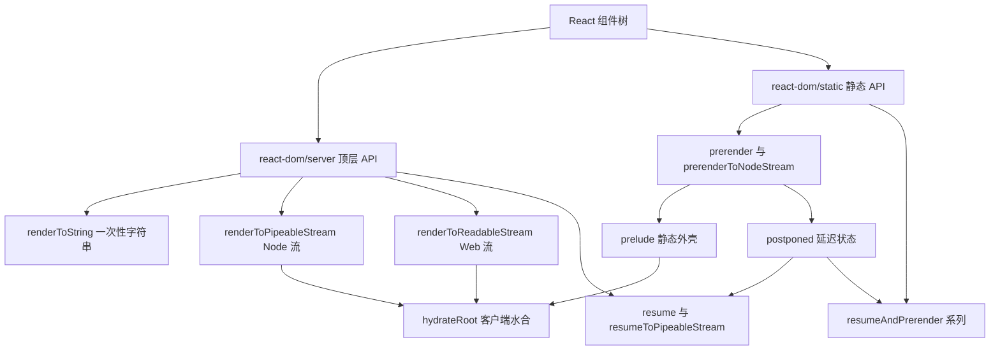
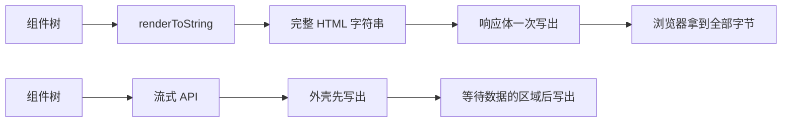
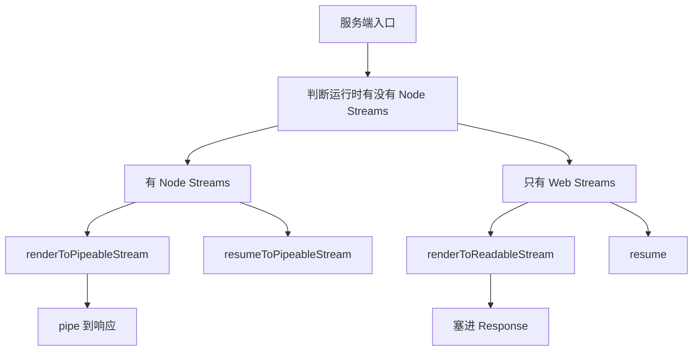
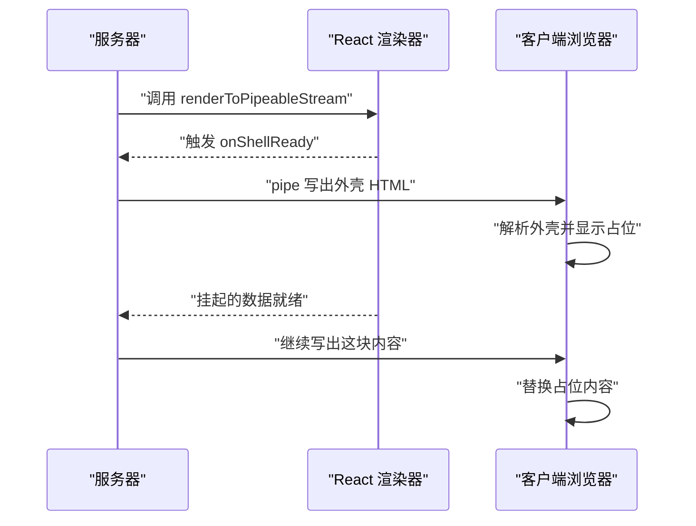
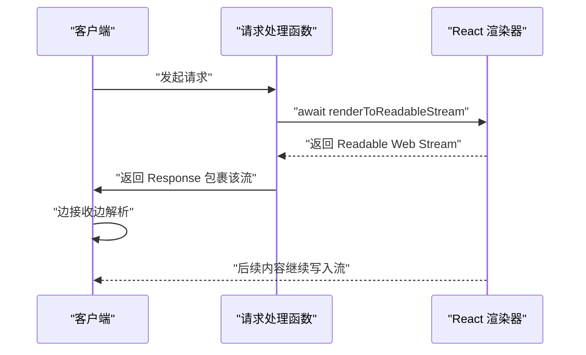
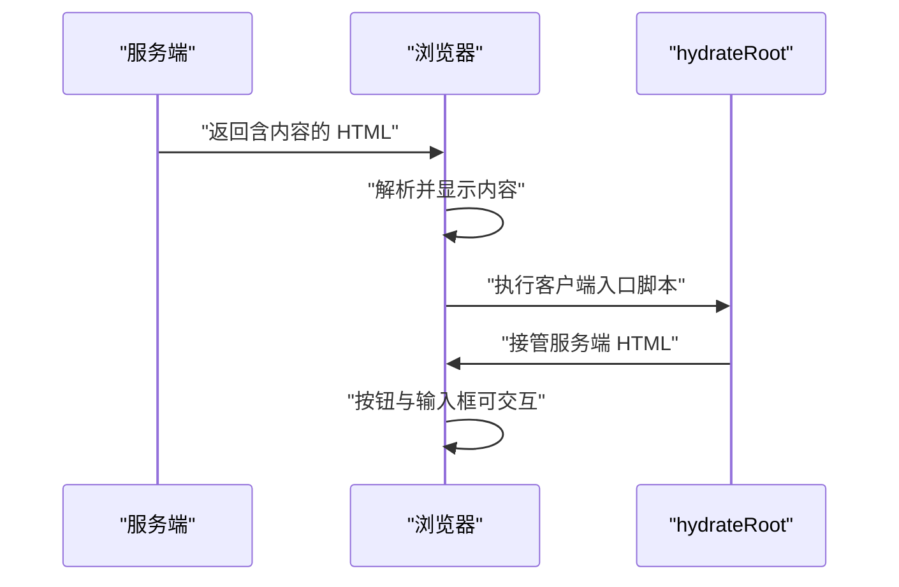
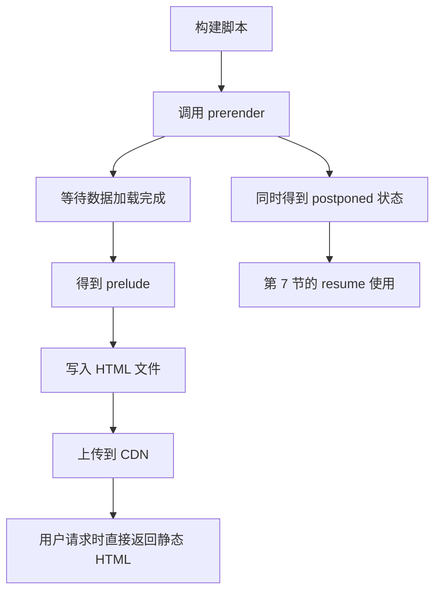
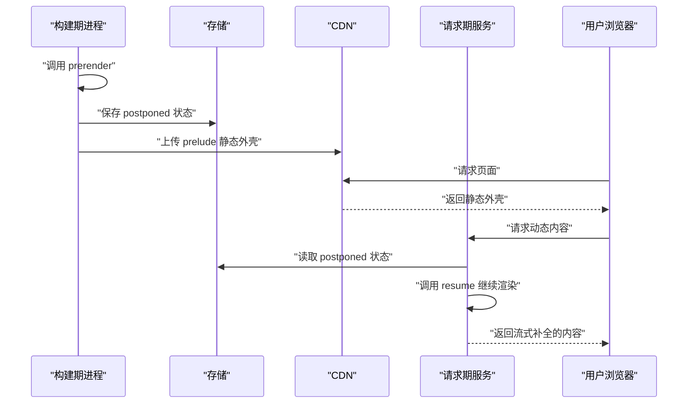
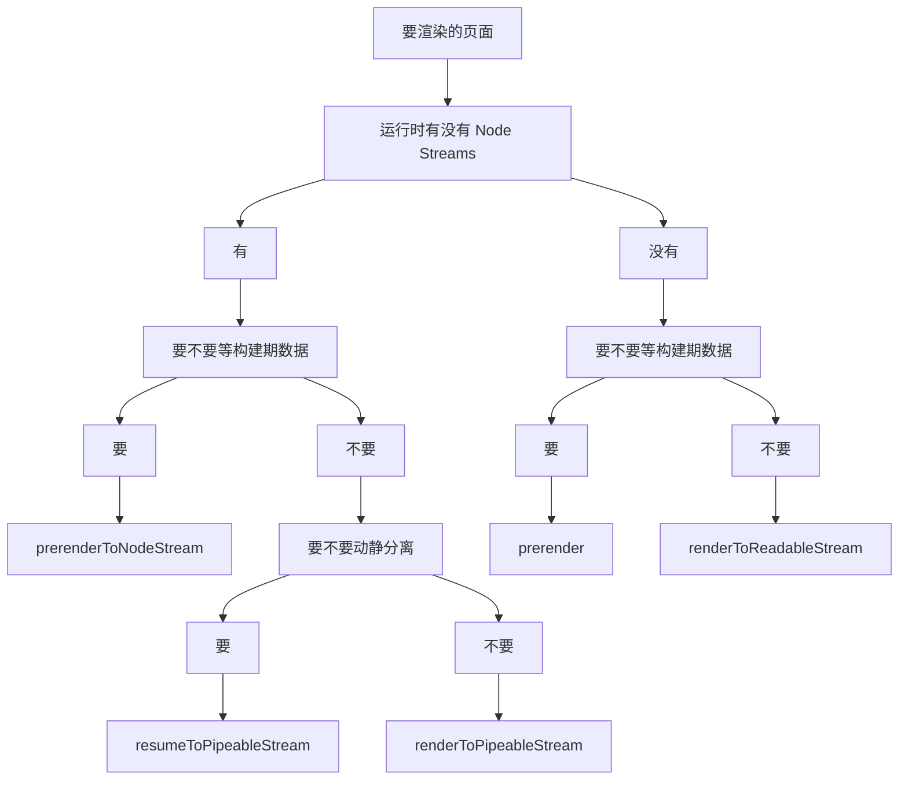

# react-dom 的服务端与静态 API：流式渲染、prerender 与 resume

!!! abstract "学完这一页你能"
    - 说出 `renderToString` 为什么被官方归入 legacy 分组，并判断自己的页面该不该继续用它。
    - 用 `renderToPipeableStream` 在 Node 服务里先发出页面外壳，再把等待数据的区域追加到同一个响应。
    - 用 `renderToReadableStream` 在支持 Web Streams 的运行时返回 `Response`，并说明它与 Node 版本的对应关系。
    - 用 `prerender`、`postponed`、`resume` 三个词讲清 partial pre-rendering 的三步流程。

## 0. 知识地图



建议的读法：先读第 1 节和第 2 节，把"字符串 API"和"流式 API"、"Node Streams"和"Web Streams"这两组边界分清。

接着读第 3、4 节，动手把流跑起来；最后读第 5 到第 8 节，把水合、prerender、resume 串成一条链路。

第 8 节是选型总结，卡住时可以直接跳过去看图。

## 1. renderToString 的局限

**先想一个问题**

后台管理系统要导出报表，把一张表格渲染成 HTML 字符串，塞进邮件正文。这里没有浏览器，也不需要点击，你会选哪个 API？

很多人条件反射写 `renderToString`。它可以跑，但官方已经把它放进了 legacy 分组。

!!! note "术语：SSR（Server-Side Rendering，服务端渲染）"
    在服务端把 React 组件渲染成 HTML，再把 HTML 交给浏览器的做法称为服务端渲染。
    例子：打开商品页时，浏览器收到的第一份 HTML 里已经有商品标题和价格。

**心智模型**

!!! tip "心智模型"
    一句话模型：`renderToString` 是"整锅端上桌"，函数返回时整份 HTML 已经在手上。
    日常类比：像把一锅汤全部盛进碗里再端给客人，客人必须等碗装满才能喝第一口。
    类比不成立的地方：React 组件在渲染中可以挂起等待数据，盛汤的比喻里没有"挂起"这一步。

**图解**



1. 左侧是 `renderToString` 的路径：输入组件树，输出一个完整的 HTML 字符串。
2. 这个字符串只有全部渲染完成后才交给下一步，中间没有可以提前发出的部分。
3. 右侧是流式 API 的路径：外壳先写出，等待数据的区域在渲染完成后追加。
4. 两条路径的终点一样，都是交给浏览器解析的 HTML，差别在中间能不能提前发。
5. 官方文档把 `renderToString` 和 `renderToStaticMarkup` 归入"不支持流式的环境"这一分组。

**一步一步来**

**第 1 步：把组件树渲染成字符串。**

下面这段代码不涉及数据和流，只用来看 `renderToString` 的返回值形状。

```js
const React = require('react');
// 从 react-dom/server 顶层导入 legacy 字符串 API
const { renderToString } = require('react-dom/server');

// 一个不等待任何数据的组件
function Price({ value }) {
  // React.createElement 的第三个参数是子节点
  return React.createElement('p', null, '价格为 ' + value + ' 元');
}

function Page() {
  // 把 Price 嵌进 div 里
  return React.createElement('div', null, React.createElement(Price, { value: 9 }));
}

const html = renderToString(React.createElement(Page));
console.log(html);
```

**这段代码在做什么**

- `require('react-dom/server')` 拿到的是服务端 API 的入口，它同时导出字符串 API 与流式 API。
- `React.createElement` 代替 JSX，避免为本页引入构建工具。
- `renderToString` 的入参是一个 React 节点，这里由 `React.createElement(Page)` 生成。
- 返回值是字符串，不是流，也不含 `pipe` 或 `abort` 这类句柄。
- 组件里没有任何异步逻辑，所以渲染一步完成。

运行结果：

```
<div><p>价格为 9 元</p></div>
```

**第 2 步：确认返回值的形状与用途边界。**

上面的输出是字符串。下面用一次类型检查把这个事实固定下来。

```js
const React = require('react');
const { renderToString, renderToStaticMarkup } = require('react-dom/server');

const tree = React.createElement('div', null, React.createElement('span', null, 'ok'));

// 两个 legacy API 的返回值都是字符串
console.log('renderToString 的返回类型：', typeof renderToString(tree));
console.log('renderToStaticMarkup 的返回类型：', typeof renderToStaticMarkup(tree));
```

**这段代码在做什么**

- `renderToString` 产出的是可以水合的字符串，客户端要配合 `hydrateRoot` 使用。
- `renderToStaticMarkup` 产出的是"非交互"的字符串，官方描述它渲染的是非交互的 React 树。
- 两者都返回字符串，所以调用方拿不到"先发一部分"的能力。
- 需要交互的页面不要用 `renderToStaticMarkup`，因为它的产物不是给水合准备的。
- 官方文档把这两个 API 描述为"功能少于流式 API"。

运行结果：

```
renderToString 的返回类型： string
renderToStaticMarkup 的返回类型： string
```

**动手验证**

```js
// 依赖：react@19、react-dom@19（npm i react react-dom）
// 运行：node legacy-ssr.cjs
const assert = require('node:assert');
const React = require('react');
const { renderToString, renderToStaticMarkup } = require('react-dom/server');

function Price({ value }) {
  return React.createElement('p', null, '价格为 ' + value + ' 元');
}

function Page() {
  return React.createElement('div', null, React.createElement(Price, { value: 9 }));
}

const tree = React.createElement(Page);
const html = renderToString(tree);
const staticHtml = renderToStaticMarkup(tree);

// 断言一：renderToString 的返回值是字符串
assert.strictEqual(typeof html, 'string', 'renderToString 应返回字符串');
// 断言二：字符串里包含目标文本
assert.ok(html.includes('<p>价格为 9 元</p>'), '字符串里应含目标文本');
// 断言三：renderToStaticMarkup 的返回值也是字符串
assert.strictEqual(typeof staticHtml, 'string', 'renderToStaticMarkup 应返回字符串');
// 断言四：字符串产物上没有流句柄
assert.strictEqual(html.pipe, undefined, '字符串产物不应带 pipe 方法');

console.log('renderToString 输出：', html);
console.log('renderToStaticMarkup 输出：', staticHtml);
console.log('断言通过：两个 legacy API 都只产出字符串');
```

预期输出：

```
renderToString 输出： <div><p>价格为 9 元</p></div>
renderToStaticMarkup 输出： <div><p>价格为 9 元</p></div>
断言通过：两个 legacy API 都只产出字符串
```

**常见坑**

| 现象 | 原因 | 怎么修 |
| --- | --- | --- |
| 首页首字节很晚才到 | 用的是字符串 API，全部渲染完才写出 | 换成 `renderToPipeableStream` 或 `renderToReadableStream` |
| 渲染结果里没有等待数据的区域 | 官方博客把"等待数据加载"写成静态 API 相对 `renderToString` 的改进点 | 需要等数据时改用 `prerender` 系列，并核对官方文档确认触发条件 |
| 页面在浏览器里点不动 | 用了 `renderToStaticMarkup`，它的产物不是给水合准备的 | 交互页面用 `renderToString` 或流式 API，并在客户端调用 `hydrateRoot` |

**用在哪里**

场景一：后台管理的报表邮件导出。

- 业务背景：运营在后台点"导出"，系统把报表渲染成 HTML，再塞进邮件模板发送。
- 这一节的知识怎么用：用 `renderToString` 得到字符串，直接拼进邮件 HTML。
- 用什么指标衡量收益：导出接口的失败率、单次导出的响应时间。
- 什么时候不该用：报表里需要用户点击展开、需要前端事件时，不要走这条路。

场景二：老运行时的兼容层。

- 业务背景：运行环境不支持流，或者上游框架只接受一个字符串。
- 这一节的知识怎么用：把 `renderToString` 当作兜底，把流式 API 当作目标。
- 用什么指标衡量收益：迁移后首字节时间的下降幅度，用同一个页面前后对比。
- 什么时候不该用：新项目直接上流式 API，不要先写字符串版本再改。

场景三：组件库的单元测试。

- 业务背景：测试里要断言某个组件渲染出的 HTML 结构。
- 这一节的知识怎么用：用 `renderToString` 把组件转成字符串，再用字符串断言。
- 用什么指标衡量收益：测试执行的稳定性，断言失败的次数。
- 什么时候不该用：要测交互行为时，用浏览器环境的测试方案，而不是字符串断言。

**行业实践**

- React 官方文档 `react-dom/server` 索引页把服务端 API 分成三组：Web Streams、Node.js Streams、不支持流式的 legacy。借鉴方法：在自己的项目文档里也按"运行环境"给 API 分组，减少选错的机会。
- React 19 官方博客的 "New React DOM Static APIs" 一节明确写出新静态 API 相对 `renderToString` 的改进点是等待数据加载。借鉴方法：把"要不要等数据"写成选型的第一个判断问题。
- React 官方文档提到，框架可能替你调用这些 API，业务组件不需要导入它们。借鉴方法：先查你所用框架的文档，确认它已经调用了哪个 API，再决定是否手写。

**小结**

- `renderToString` 与 `renderToStaticMarkup` 属于 legacy 分组，产物都是字符串。
- 官方把"等待数据加载"写成静态 API 的改进点，这是选型时要先问的问题。
- 字符串 API 不是错的，只是它的能力边界就在这里：没有提前写出的能力。

## 2. 两套流：Node Streams 与 Web Streams

**先想一个问题**

同一份组件代码，本地部署在 Node 服务里，线上跑在支持 Web Streams 的运行时里。你写一份服务端入口，能同时跑通两边吗？

官方文档给出了答案：两套环境对应两组 API，名字不同，返回值也不同。

!!! note "术语：Node Streams 与 Web Streams"
    Node Streams 是 Node.js 自带的流接口，例如 `stream.Readable` 与 `stream.Writable`。
    Web Streams 是标准化的流接口，例如 `ReadableStream`，浏览器、Deno 和部分边缘运行时都有。

**心智模型**

!!! tip "心智模型"
    一句话模型：同一根水管，两种接头，接口形状不同但都要把字节送到浏览器。
    日常类比：家里的插座有国标和欧标，电器功能一样，插头形状不一样。
    类比不成立的地方：两套流的读取方式差别不止接口，Node 用 `pipe` 推给可写流，Web Streams 用 `getReader` 拉取。

**图解**



1. 入口处先判断运行时的流能力，判断依据是 `node:stream` 是否可用、全局 `ReadableStream` 是否存在。
2. 有 Node Streams 时选 `renderToPipeableStream`，它的返回值里有 `pipe`，直接推给响应对象。
3. 只有 Web Streams 时选 `renderToReadableStream`，它返回一个 `Readable Web Stream`，可以放进 `Response`。
4. 第 7 节要讲的 `resume` 也遵守同样的分法：Node 侧是 `resumeToPipeableStream`，Web 侧是 `resume`。
5. 官方文档有一条容易漏掉的信息：Node.js 也提供 Web Streams 版本的 API 用于兼容，但官方不推荐，原因是性能表现更差。

**一步一步来**

**第 1 步：判断当前运行时有没有 Web Streams。**

下面的代码只做环境探测，不渲染任何组件。

```js
// Node 20 的全局作用域里可以直接拿到 ReadableStream
console.log('全局 ReadableStream：', typeof ReadableStream);
// TextDecoder 是读取 Web Streams 时分块解码要用的
console.log('全局 TextDecoder：', typeof TextDecoder);
```

**这段代码在做什么**

- `typeof ReadableStream` 返回 `function` 说明当前运行时具备 Web Streams 的构造能力。
- `TextDecoder` 用来把流里读到的 `Uint8Array` 转成字符串。
- 这两个探测都不需要导入模块，属于运行时自带能力。
- 探测结果决定你选 Web Streams 组的 API 还是 Node Streams 组的 API。

运行结果：

```
全局 ReadableStream： function
全局 TextDecoder： function
```

**第 2 步：判断有没有 Node Streams。**

```js
// node:stream 提供 Readable 与 Writable
const { Readable, Writable } = require('node:stream');
console.log('Readable：', typeof Readable);
console.log('Writable：', typeof Writable);
// 这两个构造函数存在，就可以用 pipe 把 HTML 推给响应对象
```

**这段代码在做什么**

- `require('node:stream')` 只在 Node 里可用，边缘运行时通常拿不到。
- `Readable` 与 `Writable` 是 Node 流的两端，`pipe` 把它们接起来。
- 在 Node 里两者同时存在，所以你可以选 Node 组的 API。
- 在只有 Web Streams 的运行时里，这一步会直接抛错，判断就此结束。

运行结果：

```
Readable： function
Writable： function
```

**第 3 步：按环境选入口。**

```js
const React = require('react');
// 两个入口分别对应 Web Streams 与 Node Streams
const webApi = require('react-dom/server');
const staticApi = require('react-dom/static');

console.log('renderToReadableStream：', typeof webApi.renderToReadableStream);
console.log('renderToPipeableStream：', typeof webApi.renderToPipeableStream);
console.log('prerender：', typeof staticApi.prerender);
```

**这段代码在做什么**

- `react-dom/server` 提供顶层渲染 API，两组流式 API 都在这里。
- `react-dom/static` 是 React 19 新增的静态 API 入口，官方博客把它归为 "New React DOM Static APIs"。
- 打印类型是为了在启动阶段就发现入口选错，而不是等到请求进来才报错。
- 在 Node 里两个流式函数都存在，因为官方为兼容提供了 Web Streams 版本。

运行结果（Node 20 环境下）：

```
renderToReadableStream： function
renderToPipeableStream： function
prerender： function
```

若某个导出在你的版本里是 `undefined`，需核对官方文档：`react-dom/server` 与 `react-dom/static` 的导出映射与兼容层说明。

**动手验证**

```js
// 依赖：react@19、react-dom@19（npm i react react-dom）
// 运行：node env-check.cjs
const assert = require('node:assert');
const { Readable, Writable } = require('node:stream');
const serverApi = require('react-dom/server');
const staticApi = require('react-dom/static');

// 断言一：Node Streams 的两个构造函数存在
assert.strictEqual(typeof Readable, 'function', 'Readable 应存在');
assert.strictEqual(typeof Writable, 'function', 'Writable 应存在');
// 断言二：Node 20 的全局作用域里有 Web Streams
assert.strictEqual(typeof ReadableStream, 'function', '全局 ReadableStream 应存在');
assert.strictEqual(typeof TextDecoder, 'function', '全局 TextDecoder 应存在');
// 断言三：服务端入口暴露 Node 组 API
assert.strictEqual(typeof serverApi.renderToPipeableStream, 'function', '缺少 Node 流式 API');
// 断言四：静态入口暴露 prerender
assert.strictEqual(typeof staticApi.prerender, 'function', '缺少 prerender');

console.log('Node Streams：可用');
console.log('Web Streams：可用');
console.log('react-dom/server 的 Node 流式 API：可用');
console.log('react-dom/static 的 prerender：可用');
console.log('断言通过：两组环境的能力都已探测');
```

预期输出：

```
Node Streams：可用
Web Streams：可用
react-dom/server 的 Node 流式 API：可用
react-dom/static 的 prerender：可用
断言通过：两组环境的能力都已探测
```

**常见坑**

| 现象 | 原因 | 怎么修 |
| --- | --- | --- |
| 在边缘运行时里 `require` 报错 | 用的是 Node 组的 API，运行时没有 `node:stream` | 换成 `renderToReadableStream` 或 `resume` |
| Node 项目里用了 Web Streams 版本 | 官方文档写明 Node 也提供这些方法用于兼容，但不推荐，原因是性能表现更差 | 在 Node 里改用 `renderToPipeableStream` 与 `resumeToPipeableStream` |
| 拿到流以后读不出来 | 读法搞混了：Node 流用 `pipe`，Web Streams 用 `getReader` | 先确认 API 属于哪一组，再用对应的读法 |

**用在哪里**

场景一：同一份代码部署到两个运行时。

- 业务背景：开发环境跑 Node 服务，生产环境跑边缘函数。
- 这一节的知识怎么用：在入口处做能力探测，按结果选 `renderToPipeableStream` 或 `renderToReadableStream`。
- 用什么指标衡量收益：两套环境的构建失败次数、启动阶段的报错次数。
- 什么时候不该用：只部署一种运行时的时候，直接写死一种 API，减少判断分支。

场景二：渐进式迁移的兼容层。

- 业务背景：老服务用的是 Node 组 API，新服务迁到 Web Streams 运行时。
- 这一节的知识怎么用：用适配函数把两组的返回值包装成同一个接口，业务层只依赖包装后的接口。
- 用什么指标衡量收益：迁移过程中线上报错的次数、回滚次数。
- 什么时候不该用：迁移目标已经明确时，不要长期维护双份实现。

场景三：自建渲染服务的技术评审。

- 业务背景：团队要决定渲染服务跑在什么运行时上。
- 这一节的知识怎么用：把"该运行时是否原生支持 Web Streams"写进评审清单，并列出对应 API。
- 用什么指标衡量收益：评审通过后返工改动的文件数量。
- 什么时候不该用：运行时已经由平台团队固定时，这一步只做记录。

**行业实践**

- React 官方文档 `react-dom/server` 索引页按运行环境把 API 分成三组，并给出"Node.js 也包含这些方法用于兼容，但不推荐"的说明。借鉴方法：在 README 里为每个 API 标注适用环境，评审时按标注验收。
- `renderToReadableStream` 的官方 Reference 页写明该 API 依赖 Web Streams，并提示 Node.js 应改用 `renderToPipeableStream`。借鉴方法：把这条提示写进代码注释，避免后来的人选错。
- React 19 官方博客把静态 API 的定位写成"与 Node.js Streams 和 Web Streams 这类流式环境配合"。借鉴方法：选型时先确定流环境，再选 API，顺序不要颠倒。

**小结**

- 两组 API 不是新旧关系，是运行环境不同。
- Node 里优先用 Node 组，官方明确不推荐在 Node 里走 Web Streams 兼容版本。
- 入口处做一次能力探测，可以把运行环境不一致的问题提前暴露。

## 3. renderToPipeableStream：外壳先发，内容后补

**先想一个问题**

商品详情页要查数据库拿价格，查询耗时不稳定。用户点进来时，导航栏和页面骨架本来立刻就能画出来，能不能先发这部分？

可以。`renderToPipeableStream` 就是为这件事准备的。

!!! note "术语：外壳（shell）"
    在流式渲染里，不等待任何挂起数据就能渲染出的那部分 HTML 称为外壳。
    例子：页面顶部的导航栏、标题、以及等待区域的占位内容。

!!! note "术语：流式渲染"
    服务端把 HTML 分成多块依次写出，浏览器收到第一块就开始解析。
    例子：导航先到并显示，等待数据的区域稍后追加到同一个响应里。

**心智模型**

!!! tip "心智模型"
    一句话模型：`renderToPipeableStream` 返回两个句柄，`pipe` 负责把 HTML 写进可写流，`abort` 负责放弃这次渲染。
    日常类比：像上菜，凉菜先上桌，热菜做好再补上，客人不用干等。
    类比不成立的地方：菜上桌后撤不回来，而流式渲染可以调用 `abort` 中止，已写出的字节无法收回。

**图解**



1. 服务器调用 `renderToPipeableStream`，此时还没有字节发出去。
2. 外壳渲染完成，React 触发 `onShellReady` 回调。
3. 在回调里设置响应头并调用 `pipe(response)`，外壳 HTML 开始写出。
4. 客户端收到外壳，可以先解析并显示占位内容。
5. 挂起的数据就绪后，React 继续把这块内容写进同一个流。
6. 想在中途放弃时调用 `abort`，本次渲染停止。

**一步一步来**

**第 1 步：调用 API，拿到 pipe 与 abort。**

```js
const React = require('react');
const { renderToPipeableStream } = require('react-dom/server');

// 调用后返回两个句柄，此时还没有任何 HTML 发出
const { pipe, abort } = renderToPipeableStream(React.createElement('div', null, '外壳'), {
  // 外壳就绪时触发
  onShellReady() {
    console.log('外壳已就绪，可以开始写出');
  },
  // 出错时触发，参数是错误对象
  onError(error) {
    console.error('渲染出错：', error.message);
  },
});

console.log('pipe 是函数：', typeof pipe === 'function');
console.log('abort 是函数：', typeof abort === 'function');
```

**这段代码在做什么**

- 第一个参数是 React 节点，官方文档说明它应该代表整个文档，所以 `App` 组件要渲染出 `<html>` 标签。
- 第二个参数是可选配置对象，示例里只用了 `onShellReady` 与 `onError` 两个回调。
- 返回值解构出的 `pipe` 用来把 HTML 写入 Node.js 可写流。
- `abort` 用来中止这次渲染。
- 回调是异步触发的，所以 `console.log` 的顺序是"先打印两个类型，再打印外壳就绪"。

运行结果：

```
pipe 是函数： true
abort 是函数： true
外壳已就绪，可以开始写出
```

**第 2 步：在 onShellReady 里 pipe 到响应对象。**

```js
const http = require('node:http');
const React = require('react');
const { renderToPipeableStream } = require('react-dom/server');

const server = http.createServer((request, response) => {
  const { pipe } = renderToPipeableStream(React.createElement('h1', null, '外壳标题'), {
    onShellReady() {
      // 先声明内容类型，再开始写字节
      response.setHeader('content-type', 'text/html');
      // pipe 把 HTML 写进响应这个可写流
      pipe(response);
    },
  });
});

// 端口传 0 表示由系统分配一个空闲端口
server.listen(0, () => console.log('已监听端口', server.address().port));
```

**这段代码在做什么**

- 服务端 API 只在服务端的顶层使用一次，用来生成初始 HTML。
- 设置 `content-type` 必须在写出字节之前，所以放在 `onShellReady` 的第一行。
- `pipe(response)` 把 React 产出的 HTML 推给 HTTP 响应对象。
- `bootstrapScripts` 这个选项用于在页面里插入 `<script>` 标签，通常放调用 `hydrateRoot` 的脚本。
- 如果不需要在客户端运行 React，就省略 `bootstrapScripts`。

运行结果：

```
已监听端口 41235
```

端口号由系统分配，每次运行可能不同。

**第 3 步：需要爬虫或静态生成时改用 onAllReady。**

```js
const React = require('react');
const { renderToPipeableStream } = require('react-dom/server');

const { pipe } = renderToPipeableStream(React.createElement('div', null, '全部内容'), {
  // 全部渲染完成时才触发，包含外壳和后续追加的内容
  onAllReady() {
    // 从这里开始写出，流里只有最终 HTML，没有渐进加载
    console.log('全部内容已就绪');
  },
});
```

**这段代码在做什么**

- `onAllReady` 在外壳与全部追加内容都渲染完成时触发。
- 官方文档写明了从 `onAllReady` 开始写出的后果：拿不到渐进加载，流里是最终 HTML。
- 面向爬虫或静态生成时，最终 HTML 比渐进加载重要，所以这里选 `onAllReady`。
- 面向真实用户的首屏时选 `onShellReady`，让外壳先到。
- 两个回调不要同时用来写同一份响应，否则会写两次。

运行结果：

```
全部内容已就绪
```

**动手验证**

```js
// 依赖：react@19、react-dom@19（npm i react react-dom）
// 运行：node pipeable-stream.cjs
const assert = require('node:assert');
const { Writable } = require('node:stream');
const React = require('react');
const { renderToPipeableStream } = require('react-dom/server');

// 用一个延迟解析的组件模拟"等待数据"
const Lazy = React.lazy(
  () =>
    new Promise((resolve) => {
      setTimeout(() => resolve({ default: () => React.createElement('p', null, '延迟内容') }), 50);
    })
);

function App() {
  return React.createElement(
    'div',
    null,
    React.createElement('h1', null, '外壳标题'),
    React.createElement(
      React.Suspense,
      { fallback: React.createElement('p', null, '加载中') },
      React.createElement(Lazy)
    )
  );
}

const chunks = [];
const sink = new Writable({
  write(chunk, encoding, callback) {
    // 按到达顺序记录每一块
    chunks.push(chunk.toString());
    callback();
  },
});

const { pipe } = renderToPipeableStream(React.createElement(App), {
  onShellReady() {
    // 外壳就绪后开始写入自定义可写流
    pipe(sink);
  },
});

sink.on('finish', () => {
  const first = chunks[0];
  const all = chunks.join('');

  // 断言一：至少分成了两块写出
  assert.ok(chunks.length >= 2, '应该分多块写出');
  // 断言二：第一块里是外壳，含占位内容
  assert.ok(first.includes('外壳标题'), '第一块应含外壳标题');
  assert.ok(first.includes('加载中'), '第一块应含占位内容');
  // 断言三：第一块里还没有延迟内容
  assert.ok(!first.includes('延迟内容'), '第一块不应含延迟内容');
  // 断言四：最终 HTML 里有延迟内容
  assert.ok(all.includes('延迟内容'), '最终 HTML 应含延迟内容');
  // 断言五：延迟内容出现在第一块之后
  const index = chunks.findIndex((item) => item.includes('延迟内容'));
  assert.ok(index > 0, '延迟内容应在第一块之后到达');

  console.log('写出块数：', chunks.length);
  console.log('第一块含外壳标题与占位内容：是');
  console.log('断言通过：外壳先写出，延迟内容后追加');
});
```

预期输出：

```
写出块数： 2
第一块含外壳标题与占位内容：是
断言通过：外壳先写出，延迟内容后追加
```

块数由渲染器决定，断言只要求不小于 2，所以块数打印成 3 或 4 也算通过。

**常见坑**

| 现象 | 原因 | 怎么修 |
| --- | --- | --- |
| 响应头设置报错 | 在 `pipe` 之后才调用 `setHeader` | 把 `setHeader` 放在 `onShellReady` 的第一行 |
| 爬虫抓不到等待数据的区域 | 用的是 `onShellReady`，抓取时后续内容还没写 | 面向爬虫或静态生成时改用 `onAllReady` |
| 客户端页面报 ID 不匹配 | 服务端与客户端的 `identifierPrefix` 不一致 | 两端传同一个前缀，官方文档要求保持一致 |

**用在哪里**

场景一：电商商品详情页。

- 业务背景：价格和库存要走接口，导航与商品图片可以立刻渲染。
- 这一节的知识怎么用：把价格区域包进 Suspense，用 `onShellReady` 先发导航和骨架。
- 用什么指标衡量收益：首字节时间、导航区域可见的时间。
- 什么时候不该用：页面所有区域都依赖同一个慢接口时，外壳里几乎没有内容，收益接近零。

场景二：后台管理的大表格首屏。

- 业务背景：表格数据要查多个源，页面头部和筛选器是静态的。
- 这一节的知识怎么用：筛选器进外壳，表格包进 Suspense 后写出。
- 用什么指标衡量收益：筛选器可交互的时间、白屏时长。
- 什么时候不该用：页面本身很简单时，直接一次性渲染，不用引入 Suspense 边界。

场景三：面向爬虫的内容页。

- 业务背景：内容页需要被搜索引擎抓到完整正文。
- 这一节的知识怎么用：用 `onAllReady` 写出最终 HTML，保证流里是完整内容。
- 用什么指标衡量收益：选定关键词下被正确抓取的页面数量。
- 什么时候不该用：面向真实用户的主路径，不要为了爬虫放弃渐进加载。

**行业实践**

- `renderToPipeableStream` 的官方 Reference 页列出了 `onShellReady`、`onAllReady`、`bootstrapScripts`、`identifierPrefix`、`namespaceURI`、`nonce`、`maxHeadersLength` 等选项。借鉴方法：把 `bootstrapScripts` 与 `identifierPrefix` 写进服务端模板的注释，避免漏传。
- React 19 官方博客在升级说明里提到 "Pre-warming for suspended trees" 与 "Improvements to Suspense"。借鉴方法：升级 React 版本后，重新测一遍挂起区域的写出顺序。
- 官方文档说明这些 API 只在服务端顶层使用，业务组件不需要导入。借鉴方法：在代码规范里限制导入位置，只允许服务端入口文件导入。

**小结**

- `renderToPipeableStream` 的返回值是 `pipe` 与 `abort`，写入时机由你决定。
- `onShellReady` 面向用户首屏，`onAllReady` 面向爬虫与静态生成。
- 任何在写出之后才做的响应头设置都会失败，顺序要记牢。

## 4. renderToReadableStream：Web Streams 环境的对应实现

**先想一个问题**

你把渲染服务部署到支持 Web Streams 的运行时，那里没有 `node:stream`。上一节的代码一行都跑不起来，怎么办？

用 `renderToReadableStream`，它返回的是 `Readable Web Stream`。

**心智模型**

!!! tip "心智模型"
    一句话模型：`renderToReadableStream` 产出的是可以直接塞进 `Response` 的 Web 流。
    日常类比：上一节的 `pipe` 是主动把水推到桶里，这一节是你拿着杯子去接水。
    类比不成立的地方：Web Streams 也支持被 `Response` 直接消费，调用方不一定要手动接水。

**图解**



1. 请求进来后，处理函数调用 `renderToReadableStream`，这是一个 `await` 调用。
2. 返回的 `Readable Web Stream` 可以直接放进 `Response` 的构造参数。
3. 响应带着 `content-type` 头返回给客户端，客户端开始逐块接收。
4. 挂起内容就绪后，继续写入同一个流，客户端继续收到后续字节。
5. 整个链路里没有 `node:stream`，所以可以在只支持 Web Streams 的运行时里跑。

**一步一步来**

**第 1 步：await 调用拿到流。**

```js
import { renderToReadableStream } from 'react-dom/server';

async function handler(request) {
  // 这是一个 await 调用，返回 Readable Web Stream
  const stream = await renderToReadableStream(<App />, {
    // 在页面里插入脚本标签，通常放调用 hydrateRoot 的脚本
    bootstrapScripts: ['/main.js'],
  });
  return stream;
}
```

**这段代码在做什么**

- `renderToReadableStream` 是异步函数，必须 `await`，这一点与上一节的同步调用不同。
- 返回值是 `Readable Web Stream`，官方文档在介绍页就写明了这一点。
- `bootstrapScripts` 是字符串数组，React 会为每一项生成一个 `<script>` 标签。
- 它的入参也是一个代表整个文档的 React 节点。
- `bootstrapModules` 与它作用相同，但生成的是 `<script type="module">`。

**第 2 步：把流包进 Response 返回。**

```js
import { renderToReadableStream } from 'react-dom/server';

export default async function handler(request) {
  const stream = await renderToReadableStream(<App />, {
    bootstrapScripts: ['/main.js'],
  });
  // 用 Response 包裹流，并声明内容类型
  return new Response(stream, {
    headers: { 'content-type': 'text/html' },
  });
}
```

**这段代码在做什么**

- `Response` 的构造参数接受一个 `ReadableStream`，所以上一步的返回值可以直接传进去。
- `headers` 里声明 `content-type`，让客户端按 HTML 解析。
- 官方文档给出的示例就是这种写法，处理函数的返回值就是响应。
- 这套写法不依赖 Node.js，可以在浏览器、Deno 与部分边缘运行时中使用。
- 在 Node 里也能调用它，官方说明是为了兼容，但不推荐，原因是性能表现更差。

**第 3 步：客户端用水合接管。**

```js
import { hydrateRoot } from 'react-dom/client';
import App from './App.js';

// 服务端生成的 HTML 已经存在，hydrateRoot 让它变得可交互
hydrateRoot(document, <App />);
```

**这段代码在做什么**

- `hydrateRoot` 的第二个参数是客户端要渲染的组件树，需要与服务端那一棵树一致。
- 这个文件就是 `bootstrapScripts` 指向的脚本，由服务端在 HTML 里插入 `<script>` 标签。
- 官方文档在两处流式 API 的说明里都写了这一点：客户端调用 `hydrateRoot` 让 HTML 变得可交互。
- 服务端如果用 `identifierPrefix`，客户端要传同一个值。

运行结果：这一步没有控制台输出，效果体现在页面上。

**动手验证**

```js
// 依赖：react@19、react-dom@19（npm i react react-dom）
// 运行：node readable-stream.mjs
import assert from 'node:assert';
import React from 'react';
import { renderToReadableStream } from 'react-dom/server';

// 用延迟解析的组件模拟等待数据
const Lazy = React.lazy(
  () =>
    new Promise((resolve) => {
      setTimeout(() => resolve({ default: () => React.createElement('p', null, '延迟内容') }), 50);
    })
);

function App() {
  return React.createElement(
    'div',
    null,
    React.createElement('h1', null, '外壳标题'),
    React.createElement(
      React.Suspense,
      { fallback: React.createElement('p', null, '加载中') },
      React.createElement(Lazy)
    )
  );
}

const stream = await renderToReadableStream(React.createElement(App));
// 断言一：返回值具备 Web Streams 的读取接口
assert.strictEqual(typeof stream.getReader, 'function', '应返回 Web Stream');

// 用 Response 包裹，再用 text 读出全部内容
const response = new Response(stream, { headers: { 'content-type': 'text/html' } });
// 断言二：Response 的构造没有抛错
assert.ok(response instanceof Response, '应能包进 Response');
const html = await response.text();

// 断言三：最终 HTML 含外壳与延迟内容
assert.ok(html.includes('外壳标题'), '应含外壳标题');
assert.ok(html.includes('延迟内容'), '应含延迟内容');

console.log('流具备 getReader：是');
console.log('包进 Response：成功');
console.log('最终 HTML 长度：', html.length);
console.log('断言通过：Web Streams 链路可用');
```

预期输出（长度会因版本不同而不同）：

```
流具备 getReader：是
包进 Response：成功
最终 HTML 长度： 320
断言通过：Web Streams 链路可用
```

**常见坑**

| 现象 | 原因 | 怎么修 |
| --- | --- | --- |
| 拿到的是 Promise 不是流 | 漏写了 `await`，这个 API 是异步的 | 在调用前加 `await`，并把所在函数声明为 async |
| 在 Node 生产环境里用了它 | 官方文档说明 Node 提供该方法是用于兼容，不推荐 | 在 Node 里改用 `renderToPipeableStream` |
| 页面显示正常但按钮无效 | 没有插入调用 `hydrateRoot` 的脚本 | 在 `bootstrapScripts` 里带上客户端入口脚本 |

**用在哪里**

场景一：边缘函数渲染营销页。

- 业务背景：营销页部署在支持 Web Streams 的边缘运行时，希望离用户更近。
- 这一节的知识怎么用：处理函数里 `await renderToReadableStream`，直接返回 `Response`。
- 用什么指标衡量收益：边缘节点的响应时间、源站回源次数。
- 什么时候不该用：需要 Node 专有模块时，边缘运行时拿不到这些模块。

场景二：多运行时共存的渲染服务。

- 业务背景：团队同时维护 Node 服务和边缘函数两份部署。
- 这一节的知识怎么用：两处入口分别用 `renderToPipeableStream` 与 `renderToReadableStream`，共享同一份组件代码。
- 用什么指标衡量收益：两套部署的构建失败次数、上线后的报错率。
- 什么时候不该用：只有一套运行时时，不要为了统一而多写一份入口。

场景三：用 Deno 写内部工具的服务端渲染。

- 业务背景：内部工具用 Deno 部署，需要把页面直出。
- 这一节的知识怎么用：用 `renderToReadableStream` 拿到流，用平台自带的响应对象返回。
- 用什么指标衡量收益：冷启动时间、首次渲染的完成时间。
- 什么时候不该用：工具只在浏览器里跑时，不需要服务端渲染。

**行业实践**

- `renderToReadableStream` 的官方 Reference 页写明该 API 依赖 Web Streams，并指向 Node.js 的替代方案。借鉴方法：在代码里用运行环境判断包一层，避免同一份逻辑写两遍。
- 官方文档说明这套 API 可以在浏览器、Deno 与部分现代边缘运行时中使用。借鉴方法：把目标运行时写进技术方案文档，评审时逐项确认。
- 两个流式 API 的 Reference 页都把 `hydrateRoot` 写在"客户端要做什么"的位置。借鉴方法：把服务端入口与客户端入口放在同一个目录，改动时一起改。

**小结**

- `renderToReadableStream` 是异步 API，返回值是 `Readable Web Stream`。
- 它的典型用法是包进 `Response` 直接返回。
- Node 里也能调用它，但官方不推荐，原因是性能表现更差。

## 5. 水合与选择性水合：已知的事实与待核对的部分

**先想一个问题**

服务端返回的 HTML 已经能看到内容了，为什么按钮点了没反应？

因为 HTML 只是"静态的标记"，还没有把事件和状态接上去。这件事由水合完成。

!!! note "术语：水合（hydration）"
    在客户端把服务端生成的 HTML 接管过来，让它变得可交互的过程称为水合。
    例子：页面上的"加入购物车"按钮在服务端 HTML 里已经存在，水合后点击才有响应。

**心智模型**

!!! tip "心智模型"
    一句话模型：水合是给已经画好的线稿补上"能按的开关"。
    日常类比：像给一张纸质菜单配上服务员，客人点了才有人应答。
    类比不成立的地方：服务员可以随时换人，而水合的具体接管细节与顺序，资料未覆盖，需核对官方文档。

**图解**



1. 服务端返回的 HTML 已经包含可见内容，浏览器可以立刻显示。
2. 此时页面上的按钮还不会响应点击，因为事件还没有接上去。
3. 浏览器执行 `bootstrapScripts` 指向的脚本，脚本里调用 `hydrateRoot`。
4. `hydrateRoot` 的第二个参数是客户端组件树，需要与服务端渲染的树一致。
5. 接管完成后，页面上的交互才开始生效。

**一步一步来**

**第 1 步：服务端把客户端脚本插入页面。**

```js
const React = require('react');
const { renderToPipeableStream } = require('react-dom/server');

renderToPipeableStream(React.createElement('h1', null, '标题'), {
  // 数组里每一项都会生成一个 script 标签
  bootstrapScripts: ['/main.js'],
  // 用模块脚本时改用 bootstrapModules
  onShellReady() {
    console.log('外壳就绪，页面里会带上 /main.js 的脚本标签');
  },
});
```

**这段代码在做什么**

- `bootstrapScripts` 是字符串数组，用来声明要在页面里插入的脚本地址。
- 官方文档建议把调用 `hydrateRoot` 的脚本放进这个数组。
- 如果不想在客户端运行 React，就省略这个选项。
- `bootstrapModules` 的作用相同，生成的是 `<script type="module">`。
- 这两种写法都只影响页面里的脚本标签，不影响 HTML 内容本身。

运行结果：

```
外壳就绪，页面里会带上 /main.js 的脚本标签
```

**第 2 步：客户端调用 hydrateRoot。**

```js
import { hydrateRoot } from 'react-dom/client';
import App from './App.js';

// 第一个参数是文档对象，第二个参数是组件树
hydrateRoot(document, <App />);
// 同一份组件代码在服务端与客户端各渲染一次
```

**这段代码在做什么**

- `hydrateRoot` 来自 `react-dom/client`，与 `renderToPipeableStream` 所在的入口不同。
- 第一个参数是挂载目标，服务端渲染整份文档时传 `document`。
- 第二个参数是要接管的组件树。
- 官方文档在两组流式 API 的说明里都提示：客户端调用 `hydrateRoot` 让服务端 HTML 变得可交互。
- 服务端与客户端如果用了 `identifierPrefix`，两边必须传同一个值，否则 ID 对不上。

**第 3 步：把 ID 前缀对齐。**

```js
const React = require('react');
const { renderToPipeableStream } = require('react-dom/server');

// 服务端指定前缀，客户端 hydrateRoot 要传同一个前缀
renderToPipeableStream(React.createElement('div', null, '内容'), {
  identifierPrefix: 'app-',
  onShellReady() {},
});
```

**这段代码在做什么**

- `identifierPrefix` 是 React 为 `useId` 生成 ID 时使用的前缀。
- 官方文档说明它用于同一页面存在多个根时避免冲突。
- 官方文档同时要求它与传给 `hydrateRoot` 的前缀一致。
- 前缀只影响生成的 ID，不影响组件的渲染结果。
- ID 的具体拼装格式，需核对官方文档：`useId` 的 Reference 页。

**第 4 步：选择性水合要核对的部分。**

选择性水合的分批顺序、触发条件与优先级规则，本页资料未覆盖，需核对官方文档。

- 要核对的内容一：`hydrateRoot` 与 Suspense 边界在流式 HTML 到达时的水合顺序。
- 要核对的内容二：哪些操作会打断正在进行的水合。
- 要核对的内容三：选择性水合是否需要额外配置才能开启。
- 查证位置建议：`react-dom/client` 索引页、`hydrateRoot` 的 Reference 页、Suspense 的教学章节。

**动手验证**

```js
// 依赖：react@19、react-dom@19（npm i react react-dom）
// 运行：node hydration-scripts.cjs
const assert = require('node:assert');
const { Writable } = require('node:stream');
const React = require('react');
const { renderToPipeableStream } = require('react-dom/server');

const chunks = [];
const sink = new Writable({
  write(chunk, encoding, callback) {
    chunks.push(chunk.toString());
    callback();
  },
});

renderToPipeableStream(React.createElement('h1', null, '标题'), {
  // 声明客户端入口脚本
  bootstrapScripts: ['/main.js'],
  onShellReady() {
    pipe();
  },
});

function pipe() {
  // 复用上面声明的 sink，把 HTML 收集起来
  const { pipe: write } = renderToPipeableStream(React.createElement('h1', null, '标题'), {
    bootstrapScripts: ['/main.js'],
    onShellReady() {
      write(sink);
    },
  });
}

sink.on('finish', () => {
  const html = chunks.join('');
  // 断言一：页面里插入了脚本标签
  assert.ok(html.includes('<script'), '应插入 script 标签');
  // 断言二：脚本地址是配置里声明的地址
  assert.ok(html.includes('/main.js'), '应包含配置的脚本地址');
  // 断言三：服务端 HTML 里已经有标题文本
  assert.ok(html.includes('标题'), '服务端 HTML 应含标题');

  console.log('含 script 标签：是');
  console.log('含配置的脚本地址：是');
  console.log('断言通过：服务端 HTML 已包含水合所需的脚本标签');
});
```

预期输出：

```
含 script 标签：是
含配置的脚本地址：是
断言通过：服务端 HTML 已包含水合所需的脚本标签
```

**常见坑**

| 现象 | 原因 | 怎么修 |
| --- | --- | --- |
| 页面上 ID 与客户端不匹配 | 两端 `identifierPrefix` 不一致 | 在服务端与客户端传同一个前缀 |
| 内容显示了但交互无效 | 没有插入并执行调用 `hydrateRoot` 的脚本 | 在 `bootstrapScripts` 里带上客户端入口脚本 |
| 客户端报错说树不一致 | 服务端与客户端渲染的组件树不同 | 让两端使用同一份组件代码与同一份数据来源 |

**用在哪里**

场景一：内容站点的首屏。

- 业务背景：文章页需要被搜索引擎抓取，也希望用户能点赞和收藏。
- 这一节的知识怎么用：服务端出 HTML，客户端在页面底部脚本里调用 `hydrateRoot` 接管交互部分。
- 用什么指标衡量收益：可交互时间、点赞按钮的首次点击成功率。
- 什么时候不该用：页面没有交互时，不需要引入客户端脚本。

场景二：后台表单页面。

- 业务背景：表单要尽快可见，输入框需要立刻能打字。
- 这一节的知识怎么用：服务端渲染表单结构，客户端水合后接管输入框。
- 用什么指标衡量收益：表单可输入的时间、首屏输入丢失的次数。
- 什么时候不该用：表单需要本地存储的草稿时，先确认 hydration 与草稿恢复的执行顺序，需核对官方文档。

场景三：同一页面存在多个 React 根。

- 业务背景：老页面里嵌入多个独立的小组件。
- 这一节的知识怎么用：为每个根指定不同的 `identifierPrefix`，避免 ID 冲突。
- 用什么指标衡量收益：ID 冲突导致的报错数量。
- 什么时候不该用：页面只有一个根时，不要额外加前缀。

**行业实践**

- `renderToPipeableStream` 与 `renderToReadableStream` 的官方 Reference 页都写明：客户端调用 `hydrateRoot` 让服务端生成的 HTML 变得可交互。借鉴方法：把这句话抄进项目的前端架构说明，作为服务端渲染链路的收尾步骤。
- 官方文档在 `identifierPrefix` 选项里写明"必须与传给 `hydrateRoot` 的前缀相同"。借鉴方法：把前缀抽成一个共享常量，服务端与客户端从同一个模块导入。
- React 19 官方博客的升级说明提到 Suspense 相关的改进项。借鉴方法：升级后回归测试水合路径，重点看挂起区域。

**小结**

- 水合把服务端 HTML 从"能看"变成"能点"，入口是 `hydrateRoot`。
- 服务端负责插入客户端脚本，`bootstrapScripts` 与 `bootstrapModules` 是两种写法。
- 选择性水合的顺序与触发条件，本页资料未覆盖，需要按上面列出的三点去核对官方文档。

## 6. react-dom/static 的 prerender

**先想一个问题**

静态站点生成时，页面数据要在构建期拿到，然后写成一个 HTML 文件。用 `renderToString` 会怎样？

官方博客把"等待数据加载"写成新静态 API 相对 `renderToString` 的改进点，这就是答案的方向。

!!! note "术语：prerender"
    `react-dom/static` 提供的静态渲染 API，用于在构建期生成静态 HTML。
    例子：构建商品列表页时，先把列表数据取回来，再把渲染结果写成 HTML 文件。

**心智模型**

!!! tip "心智模型"
    一句话模型：`prerender` 是一次"等数据到齐再拍照"的静态生成。
    日常类比：像拍集体照，必须等所有人站好再按快门，而不是先拍半张。
    类比不成立的地方：`prerender` 还可能在 19.2 里产出 `postponed` 状态，相机的比喻里没有"欠条"这个东西。

**图解**



1. 构建脚本引入 `react-dom/static` 的 `prerender`，传入要渲染的组件树。
2. 这个 API 会等到数据加载完成，再产出静态 HTML，这点与字符串 API 不同。
3. 产物解构出的 `prelude` 是静态 HTML，可以写文件或直接返回。
4. 写出的文件上传到 CDN，用户请求时不需要再跑一次渲染。
5. 解构出的 `postponed` 是延迟状态，第 7 节会用它把动态部分补齐。

**一步一步来**

**第 1 步：调用 prerender 并解构产物。**

```js
const React = require('react');
// 静态 API 从 react-dom/static 导入
const { prerender } = require('react-dom/static');

async function build() {
  // 返回值里有 prelude 与 postponed 两个字段
  const { prelude, postponed } = await prerender(React.createElement('div', null, '静态内容'), {
    // 19.2 的示例里传入了 AbortController 的 signal
    signal: new AbortController().signal,
  });
  console.log('prelude 存在：', prelude !== undefined);
  console.log('postponed 字段存在：', 'postponed' in { prelude, postponed });
}
```

**这段代码在做什么**

- `prerender` 与 `prerenderToNodeStream` 是 React 19 新增的两个静态 API。
- 官方博客说明它们与 Node.js Streams、Web Streams 这类流式环境配合。
- React 19.2 的示例里，调用 `prerender` 时传入了 `AbortController` 的 `signal`。
- 返回值里可以解构出 `prelude` 与 `postponed` 两个字段。
- `signal` 与 `postponed` 的产生条件之间的具体关系，资料未覆盖，需核对官方文档。

**第 2 步：把 prelude 读成字符串。**

```js
// 把 Web 流读成字符串
async function readAll(stream) {
  const reader = stream.getReader();
  const decoder = new TextDecoder();
  let text = '';
  for (;;) {
    const { done, value } = await reader.read();
    if (done) break;
    // stream 为 true 表示后面还有字节，允许跨块解码
    text += decoder.decode(value, { stream: true });
  }
  return text;
}

const html = await readAll(prelude);
// 这段 HTML 就是要写进文件的内容
console.log('HTML 长度：', html.length);
```

**这段代码在做什么**

- `prelude` 是从 Web Streams 环境拿到的产物，用 `getReader` 读取。
- `TextDecoder` 负责把字节转成字符串。
- `decode` 的 `stream: true` 参数允许跨块解码，避免多字节字符被切断。
- 读出的字符串就是静态 HTML，可以直接写文件。
- 若你的版本里 `prelude` 不是 Web Stream，需核对官方文档：`react-dom/static/prerender` 的返回值说明。

**第 3 步：Node 环境改用 prerenderToNodeStream。**

```js
const React = require('react');
// Node 环境使用专门的静态 API
const { prerenderToNodeStream } = require('react-dom/static');

async function build() {
  // 该 API 面向 Node.js Streams
  const result = await prerenderToNodeStream(React.createElement('div', null, '静态内容'));
  console.log('返回值字段：', Object.keys(result).join(', '));
}
```

**这段代码在做什么**

- 官方文档把 `prerenderToNodeStream` 列在 Node.js Streams 分组下，与 `renderToPipeableStream` 同组。
- 选择依据与第 2 节一致：先看运行时的流能力，再选 API。
- 返回值的具体字段形状，资料未覆盖，需核对官方文档：`react-dom/static/prerenderToNodeStream` 的 Reference 页。
- 这一节保留 `Object.keys` 的打印，是为了在本地确认字段名后再写业务代码。

**动手验证**

```js
// 依赖：react@19、react-dom@19（npm i react react-dom）
// 运行：node prerender-demo.cjs
const assert = require('node:assert');
const React = require('react');
const { prerender } = require('react-dom/static');

// 延迟解析的组件，模拟构建期需要等待的数据
const Lazy = React.lazy(
  () =>
    new Promise((resolve) => {
      setTimeout(() => resolve({ default: () => React.createElement('p', null, '构建期数据') }), 30);
    })
);

function App() {
  return React.createElement(
    'div',
    null,
    React.createElement('h1', null, '静态标题'),
    React.createElement(React.Suspense, { fallback: React.createElement('p', null, '占位') }, React.createElement(Lazy))
  );
}

async function readAll(stream) {
  const reader = stream.getReader();
  const decoder = new TextDecoder();
  let text = '';
  for (;;) {
    const { done, value } = await reader.read();
    if (done) break;
    text += decoder.decode(value, { stream: true });
  }
  return text;
}

(async () => {
  const result = await prerender(React.createElement(App), {
    signal: new AbortController().signal,
  });

  // 断言一：返回值里有 prelude
  assert.ok(result.prelude, '应返回 prelude');
  // 断言二：返回值里包含 postponed 字段
  assert.ok('postponed' in result, '应包含 postponed 字段');

  const html = await readAll(result.prelude);
  // 断言三：静态产物里含外壳标题
  assert.ok(html.includes('静态标题'), '应含静态标题');
  // 断言四：静态产物里含构建期数据
  assert.ok(html.includes('构建期数据'), '应含构建期加载的数据');

  console.log('prelude 已读出，长度：', html.length);
  console.log('含静态标题：是');
  console.log('含构建期数据：是');
  console.log('断言通过：prerender 会等待数据后产出静态 HTML');
})();
```

预期输出：

```
prelude 已读出，长度： 340
含静态标题：是
含构建期数据：是
断言通过：prerender 会等待数据后产出静态 HTML
```

若断言二失败，说明你所用版本的返回字段名不同，需核对官方文档：`react-dom/static/prerender` 的返回值说明。

**常见坑**

| 现象 | 原因 | 怎么修 |
| --- | --- | --- |
| 构建期产出的 HTML 里没有数据 | 误用了 `renderToString` | 改用 `prerender` 或 `prerenderToNodeStream` |
| 在 Node 里读 `prelude` 读不出来 | 用 Node 的流读法读 Web 流 | 用 `getReader` 读取，或改选 Node 组的静态 API |
| 多字节字符被截断 | 分块解码时没有传 `stream: true` | 在 `TextDecoder.decode` 里补上这个参数 |

**用在哪里**

场景一：内容站点的构建期生成。

- 业务背景：博客文章在构建期取数据，产出静态 HTML 上传 CDN。
- 这一节的知识怎么用：构建脚本里调用 `prerender`，把 `prelude` 写成文件。
- 用什么指标衡量收益：构建耗时、构建失败的次数。
- 什么时候不该用：内容每次请求都不同时，走流式渲染，不走静态生成。

场景二：文档站的离线包。

- 业务背景：文档站需要生成一份可以离线打开的 HTML 集合。
- 这一节的知识怎么用：对每个页面调用静态 API，产出独立 HTML 文件。
- 用什么指标衡量收益：离线包体积、构建产物的文件数量。
- 什么时候不该用：文档里有实时搜索时，搜索功能单独走客户端请求。

场景三：电商列表页的预生成。

- 业务背景：分类页的列表在构建期可取，价格每次请求都不同。
- 这一节的知识怎么用：先用静态 API 生成外壳，动态部分留给第 7 节处理。
- 用什么指标衡量收益：CDN 命中率、源站渲染次数。
- 什么时候不该用：列表数据变动频繁时，构建期产物会很快过期。

**行业实践**

- React 19 官方博客的 "New React DOM Static APIs" 一节列出 `prerender` 与 `prerenderToNodeStream` 两个 API，并说明设计目标是配合流式环境。借鉴方法：把这两个名字写进构建脚本的依赖清单，评审时确认没有混用字符串 API。
- React 19.2 官方博客的 "Partial Pre-rendering" 一节展示了解构 `prelude` 与 `postponed` 的写法。借鉴方法：照这个字段名写类型定义，减少字段猜错。
- `react-dom/server` 索引页把 `prerender` 归到静态 API 入口，而不是服务端入口。借鉴方法：在项目里为 `react-dom/static` 单独设置构建期专用目录，避免被运行时误引用。

**小结**

- 静态 API 的定位是构建期生成，官方把"等待数据加载"写成它的改进点。
- `prelude` 是静态产物，可以直接写文件或上传 CDN。
- Node 环境选 `prerenderToNodeStream`，Web Streams 环境选 `prerender`。

## 7. Partial Pre-rendering：postponed 与 resume

**先想一个问题**

首页的导航和商品外壳每天都不变，价格每次请求都要重算。能不能把不变的部分提前生成，把会变的部分留到请求时再补？

React 19.2 给出的答案叫 "Partial Pre-rendering"。

!!! note "术语：postponed（延迟状态）"
    `prerender` 在产出静态外壳的同时返回的一份状态，用来在之后继续完成渲染。
    例子：构建期先把导航写成 HTML，把"价格区域还没渲染"这件事记在 `postponed` 里。

**心智模型**

!!! tip "心智模型"
    一句话模型：先做半成品并留下欠条，请求到来时凭欠条把剩下的做完。
    日常类比：像餐厅提前备好底料，客人点单时再下锅炒最后一步。
    类比不成立的地方：欠条的内容与序列化方式由 React 内部决定，本页资料未给出具体格式。

**图解**



1. 构建期调用 `prerender`，得到 `prelude` 与 `postponed` 两份产物。
2. `postponed` 状态被保存到存储里，官方示例的写法是 `savePostponedState(postponed)`。
3. `prelude` 是静态外壳，上传到 CDN，用户请求时可以直接返回。
4. 请求期读取 `postponed`，官方示例的写法是 `getPostponedState(request)`。
5. 调用 `resume` 得到一个流，把动态部分渲染出来。
6. 也可以调用 `resumeAndPrerender`，把结果再变成一份完整的静态 HTML。

**一步一步来**

**第 1 步：构建期生成 prelude 与 postponed。**

```js
// 官方 19.2 博客给出的写法
const controller = new AbortController();

// 调用 prerender 时传入 signal
const { prelude, postponed } = await prerender(<App />, {
  signal: controller.signal,
});

// 把 postponed 存起来，后面请求期要用
await savePostponedState(postponed);

// prelude 是静态外壳，可以发给客户端或 CDN
```

**这段代码在做什么**

- 官方博客的说明是：要预渲染一个可以之后再恢复的应用，先带上 `AbortController` 调用 `prerender`。
- 解构出的 `prelude` 是静态外壳，适合放到 CDN。
- 解构出的 `postponed` 要保存下来，官方示例里用的是一个名为 `savePostponedState` 的函数。
- `savePostponedState` 的具体实现由你自己的存储决定，官方示例只给出了调用位置。
- `postponed` 的序列化格式与存储要求，资料未覆盖，需核对官方文档：`prerender` 的 Reference 页。

**第 2 步：请求期用 resume 恢复到流。**

```js
// 官方 19.2 博客给出的写法
const postponed = await getPostponedState(request);
// resume 的第二个参数就是构建期保存的 postponed 状态
const resumeStream = await resume(<App />, postponed);

// 把流发给客户端
```

**这段代码在做什么**

- `getPostponedState` 从存储里读回状态，参数是当前请求。
- `resume` 的第一个参数是组件树，第二个参数是 `postponed` 状态。
- 返回值是一个流，官方示例里把它命名为 `resumeStream`，然后发回客户端。
- Web Streams 环境用 `resume`，Node Streams 环境用 `resumeToPipeableStream`。
- 两个函数都在 `react-dom/server` 入口下。

**第 3 步：也可以用 resumeAndPrerender 产出完整静态 HTML。**

```js
// 官方 19.2 博客给出的写法
const postponedState = await getPostponedState(request);
// 这一步把结果再做回静态 HTML
const { prelude } = await resumeAndPrerender(<App />, postponedState);

// 把完整的 HTML 交给 CDN
```

**这段代码在做什么**

- `resumeAndPrerender` 属于 `react-dom/static` 入口，用于把恢复后的结果做成静态 HTML。
- 返回值里同样有 `prelude` 字段，官方注释说明这是完整的 HTML。
- Web Streams 环境用 `resumeAndPrerender`，Node Streams 环境用 `resumeAndPrerenderToNodeStream`。
- 这条路径适合内容变化频率低、可以再次缓存的页面。
- 具体在什么条件下会产出完整的 `prelude`，需核对官方文档：`resumeAndPrerender` 的 Reference 页。

**动手验证**

```js
// 依赖：react@19.2、react-dom@19.2（npm i react react-dom）
// 运行：node resume-surface.cjs
const assert = require('node:assert');
const serverApi = require('react-dom/server');
const staticApi = require('react-dom/static');

// 断言一：Web Streams 侧的恢复 API 存在
assert.strictEqual(typeof serverApi.resume, 'function', '应导出 resume');
// 断言二：Node Streams 侧的恢复 API 存在
assert.strictEqual(typeof serverApi.resumeToPipeableStream, 'function', '应导出 resumeToPipeableStream');
// 断言三：静态侧的恢复 API 存在
assert.strictEqual(typeof staticApi.resumeAndPrerender, 'function', '应导出 resumeAndPrerender');

const names = ['resume', 'resumeToPipeableStream', 'resumeAndPrerender'];
for (const name of names) {
  console.log('可用 API：', name);
}
console.log('断言通过：恢复系列 API 均在当前版本可用');
```

预期输出：

```
可用 API： resume
可用 API： resumeToPipeableStream
可用 API： resumeAndPrerender
断言通过：恢复系列 API 均在当前版本可用
```

若某个断言失败，说明你所用版本的导出位置不同，需核对官方文档：`react-dom/server` 与 `react-dom/static` 的索引页。

**常见坑**

| 现象 | 原因 | 怎么修 |
| --- | --- | --- |
| 请求期拿不到 postponed 状态 | 构建期的 `postponed` 没有保存 | 在构建期调用保存函数，把状态写入你的存储 |
| 恢复后页面内容与构建期对不上 | 两次渲染用了不同的组件树或数据来源 | 保证 `resume` 的入参与 `prerender` 一致 |
| 在 Node 里用了 Web Streams 版恢复 API | `resume` 面向 Web Streams | 在 Node 里改用 `resumeToPipeableStream` |

**用在哪里**

场景一：内容电商的首页。

- 业务背景：首页的导航与楼层布局每天更新一次，价格与库存每次请求都变。
- 这一节的知识怎么用：构建期 `prerender` 出外壳并保存 `postponed`，请求期 `resume` 补价格。
- 用什么指标衡量收益：CDN 命中率、源站每秒渲染次数、首字节时间。
- 什么时候不该用：整页内容都随请求变化时，静态外壳没有意义。

场景二：多地区站点的公共外壳。

- 业务背景：不同地区共用同一份导航与页脚，只有商品区域不同。
- 这一节的知识怎么用：公共外壳做一次 `prerender`，各地区请求时 `resume` 补自己的内容。
- 用什么指标衡量收益：构建轮次数量、跨地区重复构建的次数。
- 什么时候不该用：各地区外壳本身不同时，先按地区分开预渲染。

场景三：活动页的二次缓存。

- 业务背景：活动页恢复后一段时间内内容固定，可以再缓存。
- 这一节的知识怎么用：用 `resumeAndPrerender` 产出完整静态 HTML，交给 CDN。
- 用什么指标衡量收益：缓存命中率、回源请求数量。
- 什么时候不该用：内容需要按用户身份变化时，不要缓存完整产物。

**行业实践**

- React 19.2 官方博客的 "Partial Pre-rendering" 一节给出了完整的三段示例：`prerender` 带 `signal`、保存 `postponed`、用 `resume` 或 `resumeAndPrerender` 恢复。借鉴方法：先把这三段代码在本地跑通，再接入自己的存储与 CDN。
- 该节列出了四个 API 的归属：`react-dom/server` 下有 `resume` 与 `resumeToPipeableStream`，`react-dom/static` 下有 `resumeAndPrerender` 与 `resumeAndPrerenderToNodeStream`。借鉴方法：按入口把 API 写进代码规范的允许导入清单。
- React 19 官方博客把 "Pre-warming for suspended trees" 写在稳定版新增项里。借鉴方法：升级到 19 以后，重新测一遍挂起区域的恢复行为。

**小结**

- Partial Pre-rendering 分三步：`prerender` 出产物、保存 `postponed`、请求期 `resume`。
- `resume` 面向 Web Streams，`resumeToPipeableStream` 面向 Node Streams。
- `resumeAndPrerender` 把恢复结果再做回静态 HTML，适合可以二次缓存的页面。

## 8. 怎么选：四个判断问题

**先想一个问题**

新项目要上线，团队问你："我们该用哪个 API？"你能不能用四个问题把答案收敛到一个函数名？

这一节把前七节的内容压成一张判断流程。

**心智模型**

!!! tip "心智模型"
    一句话模型：先问运行环境，再问要不要等数据，最后问要不要把静态与动态分开。
    日常类比：出门前先看天气再选鞋子，顺序反了就要来回换。
    类比不成立的地方：这里的判断顺序可以回溯，选错一次后随时可以换，但线上流量会感知到切换。

**图解**



1. 第一个问题问运行环境：能不能用 `node:stream`，决定走左半边还是右半边。
2. 第二个问题问时间点：内容在构建期就确定，还是每次请求都要重新算。
3. 构建期确定的场景走静态 API，请求期确定的场景走流式 API。
4. 第三个问题问拆分：静态外壳与动态内容是否需要分开处理。
5. 需要分开处理时用 `resumeToPipeableStream` 或 `resume`，不需要时用一次性的流式 API。
6. 整棵树都随请求变化、又不需要动静分离时，最右边那条路就够了。

**一步一步来**

**第 1 步：构建期确定内容、运行时是 Node。**

```js
const React = require('react');
// 静态 API 入口
const { prerenderToNodeStream } = require('react-dom/static');

async function build() {
  // 构建脚本里执行一次，产出静态 HTML
  const result = await prerenderToNodeStream(React.createElement('div', null, '构建期内容'));
  console.log('产物字段：', Object.keys(result).join(', '));
}
```

**这段代码在做什么**

- 内容在构建期确定，所以用 `react-dom/static` 的 API，而不是 `react-dom/server` 的。
- 运行时有 Node Streams，所以在静态入口里选 `prerenderToNodeStream`。
- 这段代码应当放在构建脚本里，不要放进请求处理函数。
- 产物的具体字段，需核对官方文档：`prerenderToNodeStream` 的 Reference 页。

**第 2 步：请求期确定内容、运行时是 Node。**

```js
const http = require('node:http');
const React = require('react');
const { renderToPipeableStream } = require('react-dom/server');

const server = http.createServer((request, response) => {
  const { pipe } = renderToPipeableStream(React.createElement('h1', null, '请求期内容'), {
    onShellReady() {
      // 请求期渲染，每个请求都要跑一次
      response.setHeader('content-type', 'text/html');
      pipe(response);
    },
  });
});

server.listen(3000, () => console.log('监听 3000'));
```

**这段代码在做什么**

- 内容随请求变化，所以选流式 API，让外壳先到。
- 运行时有 Node Streams，所以选 `renderToPipeableStream`。
- 这段代码放在请求处理函数里，每次请求都执行一次。
- 如果内容不随请求变化，把它移回构建脚本，可以减少请求期的计算。

**第 3 步：需要动静分离。**

```js
// 构建期：拿到外壳与 postponed
const { prelude, postponed } = await prerender(<App />, { signal: controller.signal });
await savePostponedState(postponed);

// 请求期：凭 postponed 继续渲染
const state = await getPostponedState(request);
const resumeStream = await resume(<App />, state);
```

**这段代码在做什么**

- 需要把不变的外壳与变化的内容分开时，用 `prerender` 加 `resume` 的组合。
- 构建期与请求期两段代码一定要成对出现，缺一段流程就跑不通。
- 运行时是 Node 时，请求期改用 `resumeToPipeableStream`。
- 需要把恢复结果再做回静态 HTML 时，改用 `resumeAndPrerender`。

**动手验证**

```js
// 依赖：react@19.2、react-dom@19.2（npm i react react-dom）
// 运行：node choose-api.cjs
const assert = require('node:assert');
const { Writable } = require('node:stream');
const React = require('react');
const { renderToPipeableStream } = require('react-dom/server');

// 用三个判断结果模拟选型函数
function chooseApi({ hasNodeStream, needsBuildData, splitStatic }) {
  if (needsBuildData) return hasNodeStream ? 'prerenderToNodeStream' : 'prerender';
  if (splitStatic) return 'resumeToPipeableStream';
  return hasNodeStream ? 'renderToPipeableStream' : 'renderToReadableStream';
}

// 断言一：构建期数据加 Node 环境
assert.strictEqual(
  chooseApi({ hasNodeStream: true, needsBuildData: true, splitStatic: false }),
  'prerenderToNodeStream'
);
// 断言二：请求期内容加 Node 环境
assert.strictEqual(
  chooseApi({ hasNodeStream: true, needsBuildData: false, splitStatic: false }),
  'renderToPipeableStream'
);
// 断言三：请求期内容加 Web Streams 环境
assert.strictEqual(
  chooseApi({ hasNodeStream: false, needsBuildData: false, splitStatic: false }),
  'renderToReadableStream'
);
// 断言四：被选中的 API 确实存在
assert.strictEqual(typeof renderToPipeableStream, 'function', '所选 API 应存在');

// 用被选中的 API 真跑一次，确认链路可用
const chunks = [];
const sink = new Writable({
  write(chunk, encoding, callback) {
    chunks.push(chunk.toString());
    callback();
  },
});

const { pipe } = renderToPipeableStream(React.createElement('h1', null, '选型验证'), {
  onShellReady() {
    pipe(sink);
  },
});

sink.on('finish', () => {
  assert.ok(chunks.join('').includes('选型验证'), 'HTML 应含标题文本');
  console.log('选型结果：', chooseApi({ hasNodeStream: true, needsBuildData: false, splitStatic: false }));
  console.log('断言通过：选型函数与真实 API 一致');
});
```

预期输出：

```
选型结果： renderToPipeableStream
断言通过：选型函数与真实 API 一致
```

**常见坑**

| 现象 | 原因 | 怎么修 |
| --- | --- | --- |
| 构建脚本里用了流式 API | 混淆了构建期与请求期的判断 | 构建期走 `react-dom/static`，请求期走 `react-dom/server` |
| 动静分离只做了一半 | 只调用了 `prerender`，没有保存 `postponed` | 构建期保存状态，请求期读取状态 |
| 换了运行时后代码跑不通 | API 与运行时的流能力不匹配 | 按第 2 节的探测结果换 API |

**用在哪里**

场景一：新项目的技术选型评审。

- 业务背景：团队要在评审会上定下渲染方案。
- 这一节的知识怎么用：用四个判断问题逐项过一遍，把结论写成一行函数名。
- 用什么指标衡量收益：评审后返工次数、方案文档的修改次数。
- 什么时候不该用：平台已经锁定方案时，这一步只做记录。

场景二：老项目的渲染链路改造。

- 业务背景：老项目用 `renderToString`，要迁到流式。
- 这一节的知识怎么用：先判断运行环境与数据时间点，再决定迁移目标。
- 用什么指标衡量收益：迁移涉及的页面数量、改造后首字节时间。
- 什么时候不该用：页面很简单时，改造收益有限，可以放到后面。

场景三：多团队共用的渲染脚手架。

- 业务背景：多个业务线共用一份渲染入口。
- 这一节的知识怎么用：把四个判断问题做成配置项，脚手架按配置选择 API。
- 用什么指标衡量收益：接入新业务线所需的配置改动数量。
- 什么时候不该用：只有一条业务线时，直接写死，减少配置层次。

**行业实践**

- React 官方文档 `react-dom/server` 索引页按环境分组 API，并单独列出 legacy 分组。借鉴方法：把这张分组表贴进项目文档，位置放在入口文件的注释上方。
- React 19.2 官方博客把 Partial Pre-rendering 描述为"预渲染一部分，之后再恢复"。借鉴方法：在方案评审时先确认页面里哪些区域在构建期确定，再决定是否引入这套机制。
- React 19 官方博客提到 `react-dom/static` 的两个 API 与流式环境配合。借鉴方法：让构建脚本与请求期代码分目录存放，避免互相引用。

**小结**

- 选型可以拆成三个问题：运行环境、数据时间点、是否需要动静分离。
- 构建期走 `react-dom/static`，请求期走 `react-dom/server`。
- 任何需要 `postponed` 的方案，构建期与请求期两段代码都要写全。

## 应用地图

| 场景 | 用到本页哪个知识点 | 典型技术选型 | 注意事项 |
| --- | --- | --- | --- |
| 后台报表导出 HTML | 第 1 节 `renderToString` | `react-dom/server` 的字符串 API | 产物是字符串，没有提前写出的能力 |
| Node 服务渲染商品详情页 | 第 3 节 `renderToPipeableStream` | Node 服务加 Suspense 边界 | 响应头要在 `pipe` 之前设置 |
| 边缘函数渲染营销页 | 第 4 节 `renderToReadableStream` | 支持 Web Streams 的运行时 | 该 API 是异步的，必须 `await` |
| 静态站点构建期生成 | 第 6 节 `prerender` 与 `prerenderToNodeStream` | `react-dom/static` 加 CDN | 数据必须能在构建期取到 |
| 首页外壳缓存加动态补全 | 第 7 节 `prerender` 与 `resume` | 对象存储保存 `postponed` | 构建期与请求期代码要成对 |
| 恢复结果再次缓存 | 第 7 节 `resumeAndPrerender` | `react-dom/static` 加 CDN | 内容需要按用户身份变化时不能缓存 |
| 客户端接管服务端 HTML | 第 5 节 `hydrateRoot` | `react-dom/client` 加水合入口脚本 | 两端组件树与 ID 前缀要一致 |
| 多运行时共用组件代码 | 第 2 节环境探测 | 入口处做能力判断 | 选错分组会在启动阶段就报错 |

## 动手作业

目标：做一个"半个静态、半个动态"的页面，验证本页的整条链路。

步骤一：写一个 `App` 组件，包含一个静态标题区域和一个延迟解析的区域，延迟区域用 `React.lazy` 加 `setTimeout` 模拟。

步骤二：写一个构建脚本，用 `prerender` 生成 `prelude`，把读出的 HTML 写到 `out/shell.html`，同时把 `postponed` 用 `JSON` 或你的存储方式记录下来。

步骤三：写一个请求处理脚本，用 `renderToPipeableStream` 渲染同一棵树，用自定义 `Writable` 收集输出，打印块数。

步骤四：写一个检查脚本，用 `node:assert` 断言三个事实：`shell.html` 里含静态标题；请求期输出里含延迟内容；请求期输出被分成了两块以上。

验收标准：

- 三个脚本都能用 `node 文件名` 直接运行，不需要构建工具。
- 检查脚本全部断言通过，并把"块数"打印出来。
- 把延迟时间从 30 毫秒改成 300 毫秒后，检查脚本仍然通过。
- 在提交说明里写清：哪些区域进了外壳，哪些区域在请求期补上。

## 综合对比

| 维度 | renderToString | renderToPipeableStream | renderToReadableStream | prerender | resume 系列 |
| --- | --- | --- | --- | --- | --- |
| 所属入口 | `react-dom/server` | `react-dom/server` | `react-dom/server` | `react-dom/static` | 两个入口各有一半 |
| 官方分组 | legacy，非流式环境 | Node.js Streams | Web Streams | 静态 API | 恢复 API |
| 返回值形状 | 字符串 | 含 `pipe` 与 `abort` 的对象 | `Readable Web Stream` | 含 `prelude` 与 `postponed` | 流或含 `prelude` 的对象 |
| 是否分块写出 | 否 | 是 | 是 | 由实现决定，需核对官方文档 | 是 |
| 何时使用 | 不支持流的环境、字符串场景 | 请求期的 Node 服务 | 请求期的 Web Streams 运行时 | 构建期生成静态 HTML | 把静态外壳与动态内容接起来 |
| 客户端配合 | `hydrateRoot` | `hydrateRoot` | `hydrateRoot` | `hydrateRoot` | `hydrateRoot` |
| 官方给出的一条限制 | 功能少于流式 API | Node 专有 | Node 里不推荐使用 | 需要能在构建期取到数据 | Node 侧要用对应的 Node 版本 |

## 深入阅读与参考

!!! tip "怎么用这些资料"
    先读「官方文档与规范」建立准确的概念，再读「源码与示例」核对细节，最后用「教程、书籍与视频」换一种讲法加深理解。每条都写明了读哪一节、带着什么问题读。

### 官方文档与规范

| 资源 | 为什么读 | 怎么读 |
|---|---|---|
| [Server React DOM APIs](https://react.dev/reference/react-dom/server) | 服务端 API 总览，先厘清各函数与运行时环境的对应关系。 | 通读函数列表与环境标注，画一张 Node/Web/Edge 对照表，再进入具体 API 章节。 |
| [Static React DOM APIs](https://react.dev/reference/react-dom/static) | 静态 API 总览，区分 prerender 与流式渲染的适用边界。 | 读开头与函数清单，标出与 server 章节的重叠和差异，读后整理选择标准。 |
| [renderToString](https://react.dev/reference/react-dom/server/renderToString) | 理解传统同步 API 的局限，作为流式与静态方案的对照。 | 读“限制”与“为什么不推荐”，列出它不能处理 Suspense 边界的具体表现。 |
| [renderToPipeableStream](https://react.dev/reference/react-dom/server/renderToPipeableStream) | Node 流式渲染核心，理解外壳先发与内容后补的机制。 | 读 API 签名、shell 与 Suspense 示例，跑通示例并观察 chunk 时序。 |
| [renderToReadableStream](https://react.dev/reference/react-dom/server/renderToReadableStream) | Web Streams 环境的流式渲染入口，对应边缘运行时。 | 对照 renderToPipeableStream 读差异，重点看 ReadableStream 返回与错误处理。 |
| [resume](https://react.dev/reference/react-dom/server/resume) | resume 是 Partial Pre-rendering 的关键，搞清 postponed 恢复流程。 | 读参数与返回值，结合 prerender 示例理解 resume 的时机与数据要求。 |
| [prerender](https://react.dev/reference/react-dom/static/prerender) | 静态 prerender 的官方入口，理解构建时生成与 postponed 占位。 | 读 API 与示例，重点看 postponed 状态和如何导出静态 HTML。 |
| [resumeAndPrerender](https://react.dev/reference/react-dom/static/resumeAndPrerender) | 恢复并同时预渲染，理解静态构建与动态恢复的组合。 | 读签名与示例，梳理它与 resume、prerender 的调用顺序。 |

### 源码与示例

| 资源 | 为什么读 | 怎么读 |
|---|---|---|
| [server.js](https://github.com/facebook/react/blob/main/packages/react-dom/server.js) | Node 服务端入口，确认 renderToPipeableStream 等导出位置。 | 浏览导出语句，找到 Node 与 browser 条件分支，理解打包入口差异。 |
| [server.edge.js](https://github.com/facebook/react/blob/main/packages/react-dom/server.edge.js) | Edge 入口导出，看 Web Streams 服务端 API 的真实导出。 | 打开文件看 export 列表与条件导出，对照 renderToReadableStream 的引用。 |
| [static.node.js](https://github.com/facebook/react/blob/main/packages/react-dom/static.node.js) | 静态 API 的 Node 入口，看 prerenderToNodeStream 如何暴露。 | 读导出与 require 关系，配合 static/index 文档理解模块边界。 |
| [client.js](https://github.com/facebook/react/blob/main/packages/react-dom/client.js) | 水合发生在客户端，看 hydrateRoot 等入口的导出。 | 搜索 hydrateRoot 与 createRoot，理解服务端 HTML 与客户端水合的衔接。 |

### 教程、书籍与视频

| 资源 | 为什么读 | 怎么读 |
|---|---|---|
| [Streams API concepts](https://developer.mozilla.org/en-US/docs/Web/API/Streams_API/Concepts) | Web Streams 概念基础，理解背压与 ReadableStream 模型。 | 读概念图与背压部分，带着“React 如何写入流”的问题回顾 renderToReadableStream。 |
| [Using readable streams](https://developer.mozilla.org/en-US/docs/Web/API/Streams_API/Using_readable_streams) | 可读流用法教程，帮助读懂 renderToReadableStream 的消费方式。 | 跟读分块读取示例，自己写一个 reader.read() 循环消费 React 返回的流。 |

## 自测题

??? question "题目一：为什么官方把 renderToString 放进 legacy 分组？"
    - 官方文档把它和 `renderToStaticMarkup` 一起归入"不支持流式的环境"这一分组。
    - 官方文档写明它们的功能少于流式 API。
    - 它们的产物是字符串，不能提前写出。
    - 需要提前写出时改用流式 API，需要等数据时改用静态 API。

??? question "题目二：renderToPipeableStream 的返回值里有什么，分别做什么？"
    - 返回一个对象，可以解构出 `pipe` 与 `abort`。
    - `pipe` 把 HTML 写进 Node.js 的可写流，例如 HTTP 响应对象。
    - `abort` 用来中止本次渲染。
    - 调用时还没有字节发出，写出时机由 `onShellReady` 或 `onAllReady` 决定。

??? question "题目三：onShellReady 与 onAllReady 该在什么场景用？"
    - `onShellReady` 在外壳就绪时触发，从这里写出可以得到渐进加载。
    - `onAllReady` 在外壳与追加内容全部就绪时触发。
    - 官方文档写明从 `onAllReady` 开始写出就没有渐进加载，流里是最终 HTML。
    - 面向前端用户首屏用前者，面向爬虫或静态生成用后者。

??? question "题目四：Node 里能不能用 renderToReadableStream？"
    - 可以，官方文档说明 Node.js 也包含这些方法，目的是兼容。
    - 官方文档同时写明不推荐在 Node 里使用，原因是性能表现更差。
    - Node 里应改用 `renderToPipeableStream`。
    - 选择依据是运行时的流能力，先探测再选 API。

??? question "题目五：水合在整条链路里的位置是哪里？"
    - 服务端把 HTML 写出去以后，客户端执行入口脚本时进行水合。
    - 入口通过 `bootstrapScripts` 或 `bootstrapModules` 声明，由服务端插入脚本标签。
    - 客户端调用 `hydrateRoot`，第一个参数是挂载目标，第二个参数是组件树。
    - 服务端与客户端如果用了 `identifierPrefix`，两边必须一致。

??? question "题目六：选择性水合在本页的资料里覆盖到什么程度？"
    - 本页资料覆盖了 `hydrateRoot` 让服务端 HTML 变得可交互这一事实。
    - 分批顺序、触发条件与优先级规则，本页资料未覆盖。
    - 需要核对官方文档：`react-dom/client` 索引页、`hydrateRoot` 的 Reference 页、Suspense 教学章节。
    - 核对前不要在项目里假设任何水合顺序。

??? question "题目七：prerender 与 renderToString 的关键差别是什么？"
    - 官方博客把"等待数据加载"写成静态 API 相对 `renderToString` 的改进点。
    - `prerender` 属于 `react-dom/static`，用于静态站点生成。
    - 两个静态 API 分别面向 Web Streams 与 Node.js Streams。
    - `prerender` 的返回值里可以拿到 `prelude` 与 `postponed`。

??? question "题目八：Partial Pre-rendering 的三步流程是什么？"
    - 构建期调用 `prerender`，传入 `AbortController` 的 `signal`，拿到 `prelude` 与 `postponed`。
    - 保存 `postponed` 状态，并把 `prelude` 交给 CDN 或客户端。
    - 请求期读取 `postponed`，调用 `resume` 得到流。
    - 想让结果再变成静态 HTML 时，改调 `resumeAndPrerender`。

## 延伸阅读

- React 官方文档：`react-dom/server` 索引页，Server APIs for Web Streams、Server APIs for Node.js Streams、Legacy Server APIs for non-streaming environments 三节。
- React 官方文档：`renderToPipeableStream` 的 Reference 页，Parameters 与 Usage 章节。
- React 官方文档：`renderToReadableStream` 的 Reference 页，Parameters 与 Usage 章节。
- React 官方文档：`renderToString` 的 Reference 页与 `renderToStaticMarkup` 的 Reference 页。
- React 官方文档：`react-dom/static` 索引页，`prerender`、`prerenderToNodeStream`、`resumeAndPrerender`、`resumeAndPrerenderToNodeStream` 的 Reference 页。
- React 官方文档：`react-dom/client` 索引页与 `hydrateRoot` 的 Reference 页，Parameters 章节。
- React 官方博客：React 19 发布文，New React DOM Static APIs 一节。
- React 官方博客：React 19.2 发布文，Partial Pre-rendering 一节。
- React 官方博客：React 19 Upgrade Guide，Improvements to Suspense 一节。
