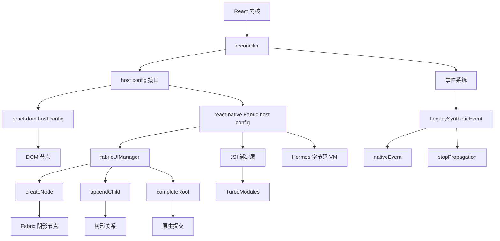
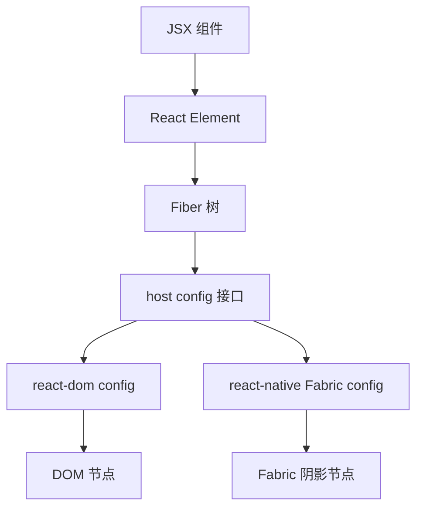
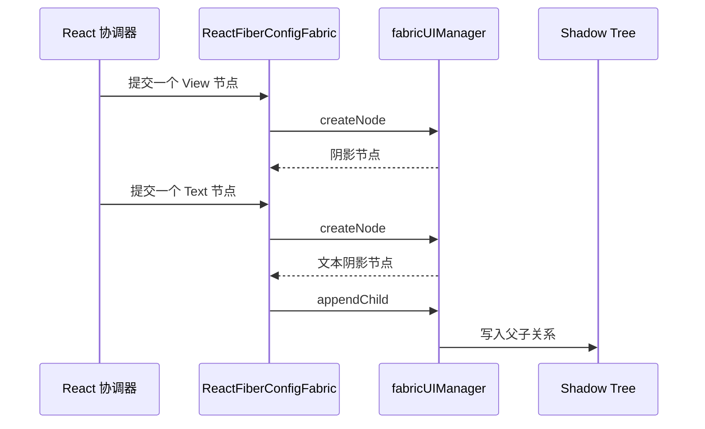
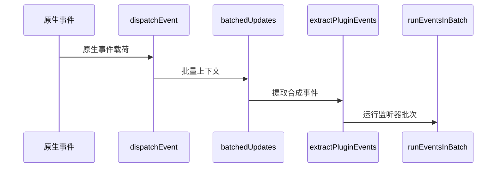
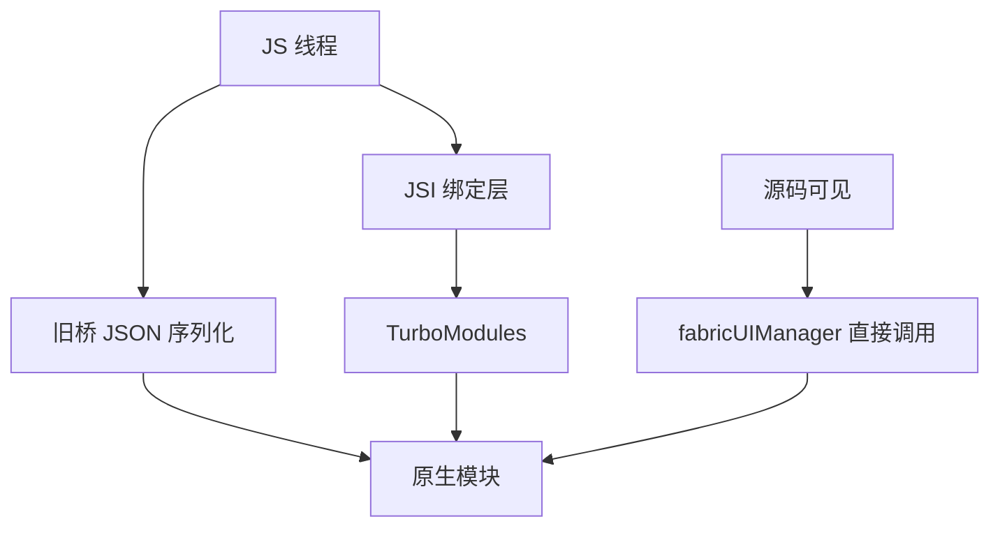
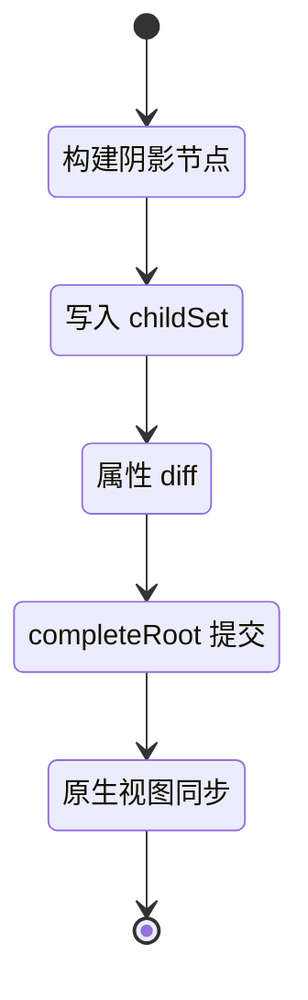
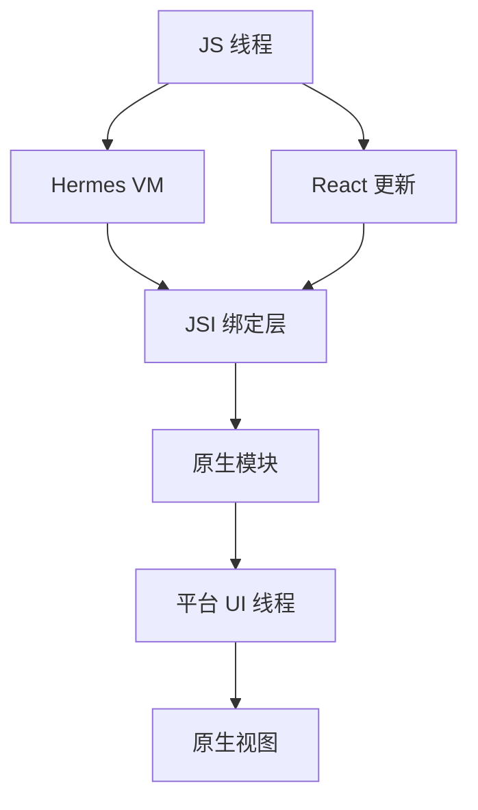
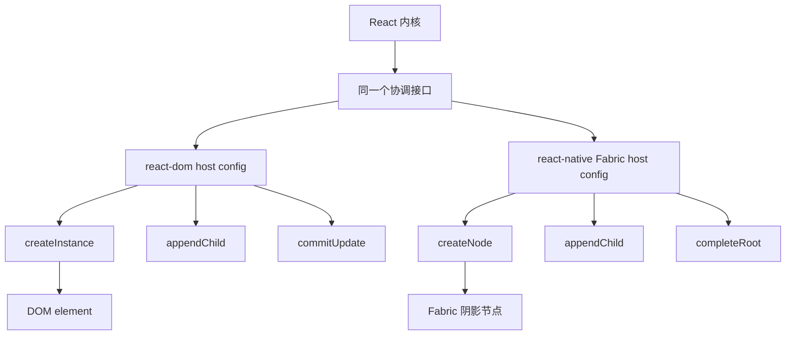

# React Native 新架构：为什么 react-native 与 react-dom 是两个世界

!!! abstract "学完这一页你能"
    - 说出 React 内核、reconciler、host config 三层的边界，并指出 react-dom 与 react-native 在 host config 上的分叉点。
    - 依据 ReactFabric 源码，解释 Fabric 如何用 createNode、appendChild、completeRoot 驱动原生视图。
    - 写一个最小 host config 模拟器，用 node:assert 验证树形提交与事件批量更新。
    - 识别 LegacySyntheticEvent 中 persist 为什么是空操作，以及 stopPropagation 如何同步内部状态。

## 0. 知识地图



建议先读第 1 节，把 React 内核、reconciler、host config 三层边界建立起来。  
再读第 2 到第 5 节，沿着 Fabric 渲染、事件、旧桥与 JSI、Shadow Tree 的顺序理解通信链路。  
最后读第 6、第 7 节，把 Hermes、线程模型和 react-dom 对照表放在一起看。

## 1. 一个 React 内核，两个 host config

**先想一个问题**：你在浏览器里用 `ReactDOM.createRoot`，在 React Native 里用 `AppRegistry.registerComponent`。为什么同一套 `useState` 代码在两边都能工作？

**心智模型**

!!! tip "心智模型"

一句话模型：React 内核只负责状态、协调和 Fiber 树，最终如何创建平台节点由 host config 决定。  
日常类比：同一台发动机可以装进轿车，也可以装进货车，只是车身接口不同。  
类比不成立的地方：DOM 节点操作通常是同步的；react-native 的 Fabric 渲染要经过阴影树与原生提交，步骤比 DOM 多一层。

!!! note "术语：reconciler"

reconciler 是 React 里协调 Fiber 更新、计算变更的部分。  
例子：状态更新后，reconciler 会决定哪些组件需要重新渲染。

!!! note "术语：host config"

host config 是渲染器提供给 reconciler 的平台原语集合。  
例子：react-dom 的 host config 里有 `document.createElement`；react-native Fabric 的 host config 里有 `fabricUIManager.createNode`。

**图解**



1. JSX 先被编译成 React Element。
2. React Element 进入 reconciler，生成 Fiber 树。
3. reconciler 不直接碰平台，而是调用 host config 提供的方法。
4. 同一条 Fiber 更新，在浏览器里落到 DOM，在 RN 里落到 Fabric 阴影节点。

**一步一步来**

**这一步要做什么**：先定义一个极小的 host config 接口，只包含创建节点、挂载子节点、提交更新三个原语。

```js
// host config 只暴露平台相关的最小原语
const hostConfig = {
  createInstance(type) {
    // 创建平台节点：DOM 可能是 element，Fabric 可能是阴影节点
  },
  appendChild(parent, child) {
    // 建立父子关系
  },
  commitUpdate(instance, payload) {
    // 提交属性更新
  },
};
```

**这段代码在做什么**

- `createInstance` 是“创建一个平台节点”的原语。
- `appendChild` 只负责父子挂载，不负责 diff。
- `commitUpdate` 接收更新载荷，平台自己决定如何落到原生。
- 真实渲染器会在这个接口上实现更多方法，但核心边界相同。

**这一步要做什么**：实现两个不同平台的最小配置，一个模拟 DOM，一个模拟 Fabric。

```js
function makeDomConfig() {
  return {
    createInstance(type) {
      return { kind: "dom", type, children: [] };
    },
    appendChild(parent, child) {
      parent.children.push(child);
    },
    commitUpdate(instance) {
      instance.committed = true;
    },
  };
}

function makeFabricConfig() {
  return {
    createInstance(type) {
      return { kind: "fabric", type, children: [] };
    },
    appendChild(parent, child) {
      parent.children.push(child);
    },
    commitUpdate(instance) {
      instance.committed = true;
    },
  };
}
```

**这段代码在做什么**

- 两个配置的接口完全一致。
- `kind` 字段区分节点属于哪一个平台。
- 真实 react-dom 的节点是 DOM 对象；真实 Fabric 的节点是阴影节点对象。
- 这一层差异被 host config 关在同一个方法名后面。

**这一步要做什么**：写一个使用配置的提交函数，证明同一段逻辑可以跑在两个配置上。

```js
function commitText(config) {
  const root = config.createInstance("RootView");
  const text = config.createInstance("Text");
  config.appendChild(root, text);
  config.commitUpdate(text, { color: "red" });
  return { root, text };
}

const domResult = commitText(makeDomConfig());
const fabricResult = commitText(makeFabricConfig());
console.log(domResult.root.kind, fabricResult.root.kind);
```

**这段代码在做什么**

- `commitText` 不关心平台，只调用传入的 config。
- `domResult` 返回 `kind: "dom"`。
- `fabricResult` 返回 `kind: "fabric"`。
- 这就是 React 内核能复用同一套协调逻辑的原因。

**运行结果**

```text
dom fabric
```

**动手验证**

把上面的逻辑合到一个 Node 20+ 脚本里，并用 `node:assert` 校验。

```js
import assert from "node:assert";

function makeDomConfig() {
  return {
    createInstance(type) {
      return { kind: "dom", type, children: [] };
    },
    appendChild(parent, child) {
      parent.children.push(child);
    },
    commitUpdate(instance) {
      instance.committed = true;
    },
  };
}

function makeFabricConfig() {
  return {
    createInstance(type) {
      return { kind: "fabric", type, children: [] };
    },
    appendChild(parent, child) {
      parent.children.push(child);
    },
    commitUpdate(instance) {
      instance.committed = true;
    },
  };
}

function commitText(config) {
  const root = config.createInstance("RootView");
  const text = config.createInstance("Text");
  config.appendChild(root, text);
  config.commitUpdate(text, { color: "red" });
  return { root, text };
}

const domResult = commitText(makeDomConfig());
const fabricResult = commitText(makeFabricConfig());

assert.equal(domResult.root.kind, "dom");
assert.equal(fabricResult.root.kind, "fabric");
assert.equal(domResult.root.children.length, 1);
assert.equal(fabricResult.root.children[0].type, "Text");
assert.equal(domResult.text.committed, true);
console.log("验证通过：同一份提交逻辑运行在不同 host config 上");
```

**运行结果**

```text
验证通过：同一份提交逻辑运行在不同 host config 上
```

**常见坑**

| 现象 | 原因 | 怎么修 |
| --- | --- | --- |
| 在共享业务组件里直接使用 `document.createElement` | 业务代码越过了 host config 边界 | 把 DOM 操作抽成平台适配层 |
| 在 RN 里写了 `window` 或 `document` | RN 环境没有 DOM 全局对象 | 统一走 props 或注入平台能力 |
| 同构代码里平台分支越写越多 | 平台差异没有收敛到 host config | 用依赖注入或小模块隔离平台代码 |

**用在哪里**

- 跨端组件库
  - 业务背景：同一套按钮、输入框要同时发布到 Web 与 RN。
  - 这一节的知识怎么用：组件层只写 React，平台操作交给 host config。
  - 用什么指标衡量收益：共享代码比例、平台缺陷修复的重复次数。
  - 什么时候不该用：平台交互差异极大，硬抽象反而拖慢项目时不要强行统一。

- React Native Web 同构
  - 业务背景：已有 RN App，需要低成本生成 Web 版本。
  - 这一节的知识怎么用：用 react-dom 的 host config 承接 RN 组件树。
  - 用什么指标衡量收益：Web 端开发时间、可复用组件数量。
  - 什么时候不该用：强依赖原生控件、手势或系统能力的页面不要同构。

**行业实践**

- React 官方源码 `ReactFabric.js`：入口文件通过 reconciler 创建容器，并处理渲染错误回调。  
  怎么借鉴到你的项目：渲染器入口不要直接写平台 UI，只做容器与错误边界。
- React Native 官方文档 host components 章节：说明了 JSX 视图如何对应原生视图。  
  怎么借鉴到你的项目：维护一个受控的 host component 清单，不要让业务任意创造平台节点。

**小结**

- React 内核通过 host config 隔离平台差异。
- react-dom 提供 DOM 原语，react-native Fabric 提供阴影节点与原生生原语。
- 业务代码越过这个边界时，跨端复用会迅速变差。

## 2. 从 host component 到原生视图：Fabric 的 createNode 与 appendChild

**先想一个问题**：你写 `<View><Text>hello</Text></View>`，React 怎么把 View 变成原生 UIView 或 Android View？

**心智模型**

!!! tip "心智模型"

一句话模型：JSX 标签先映射成 host component，再通过 Fabric 的 `createNode`、`appendChild` 构树，最后提交到原生。  
日常类比：图纸上的组件编号对应仓库零件，装配台按编号组装。  
类比不成立的地方：原生视图创建可能受阴影树约束，不是每一步同步拼装。

!!! note "术语：host component"

host component 是 React 元素与平台原生控件之间的映射单元。  
例子：RN 里的 `<View>` 对应原生视图，`<Text>` 对应原生文本。

!!! note "术语：Fabric"

Fabric 是 React Native 新架构下的渲染器，通过 `fabricUIManager` 与原生通信。  
例子：`ReactFiberConfigFabric.js` 从 `fabricUIManager` 解构出 `createNode`、`appendChild`、`completeRoot`。

**图解**



1. React 协调器先要求创建 View 节点。
2. `ReactFiberConfigFabric` 调用 `fabricUIManager.createNode`。
3. 返回的是一个阴影节点，不是最终原生对象。
4. 再创建 Text 节点并调用 `appendChild`。
5. Shadow Tree 记录父子关系。

**一步一步来**

**这一步要做什么**：模拟 `fabricUIManager` 暴露出的三个核心方法。

```js
// 模拟 Fabric 渲染器的原生管理器
const fabricUIManager = {
  createNode(type) {
    return { type, children: [] };
  },
  appendChild(parent, child) {
    parent.children.push(child);
  },
  completeRoot(root, childSet) {
    return { root, childSet };
  },
};
```

**这段代码在做什么**

- `createNode` 只创建阴影节点，不立即创建原生视图。
- `appendChild` 在阴影树里建立父子关系。
- `completeRoot` 用来提交整棵根节点树。
- 这三个方法名来自 `ReactFiberConfigFabric.js` 解构 `fabricUIManager` 的片段。

**这一步要做什么**：用 `createNode` 和 `appendChild` 构建 View 与 Text 的树。

```js
const root = fabricUIManager.createNode("RootView");
const view = fabricUIManager.createNode("View");
const text = fabricUIManager.createNode("Text");

fabricUIManager.appendChild(root, view);
fabricUIManager.appendChild(view, text);
```

**这段代码在做什么**

- 根节点、View、Text 都先被创建成阴影节点。
- `appendChild` 只在 JS 对象上建立父子关系。
- 当前还没有任何原生控件被直接操作。
- 这样的两层结构对应 `<View><Text/></View>`。

**这一步要做什么**：调用 `completeRoot`，模拟一次根节点提交。

```js
const committed = fabricUIManager.completeRoot(root, new Set([root]));
console.log(committed.root.children[0].children[0].type);
```

**这段代码在做什么**

- `childSet` 接收根节点集合，来源是真实 Fabric 提交阶段。
- 返回对象可以表示“已提交的树”。
- 输出 `Text`，说明树结构已经可以读取。
- 真实提交还会通知原生端执行实际视图创建。

**运行结果**

```text
Text
```

**动手验证**

把一个最小版本放在一个 Node 20+ 脚本中。

```js
import assert from "node:assert";

const fabricUIManager = {
  createNode(type) {
    return { type, children: [] };
  },
  appendChild(parent, child) {
    parent.children.push(child);
  },
  completeRoot(root, childSet) {
    return { root, childSet };
  },
};

const root = fabricUIManager.createNode("RootView");
const view = fabricUIManager.createNode("View");
const text = fabricUIManager.createNode("Text");

fabricUIManager.appendChild(root, view);
fabricUIManager.appendChild(view, text);

const committed = fabricUIManager.completeRoot(root, new Set([root]));

assert.equal(committed.root.type, "RootView");
assert.equal(committed.root.children[0].type, "View");
assert.equal(committed.root.children[0].children[0].type, "Text");
assert.equal(committed.childSet.size, 1);
console.log("验证通过：Fabric 阴影树按 createNode 与 appendChild 构建");
```

**运行结果**

```text
验证通过：Fabric 阴影树按 createNode 与 appendChild 构建
```

**常见坑**

| 现象 | 原因 | 怎么修 |
| --- | --- | --- |
| 渲染早期用 `ref` 拿不到原生尺寸 | 阴影节点已建，但原生可能尚未完成提交 | 在 `onLayout` 或提交后的回调里读取尺寸 |
| 更新属性后原生视图没有立刻变化 | 可能只是更新了阴影节点，未完成提交 | 确保 commit 流程执行完成 |
| 手动操作阴影树对象但没有同步原生 | 阴影树与原生视图需要提交来同步 | 不要直接改内部对象，走渲染器入口 |

**用在哪里**

- 商品卡片原生视图树
  - 业务背景：电商列表里每个卡片由多个原生视图组成。
  - 这一节的知识怎么用：理解卡片不会一步直接变原生，先构建 Shadow Tree。
  - 用什么指标衡量收益：首屏提交成功率、帧率。
  - 什么时候不该用：不需要原生指令、用普通 Web 列表就能覆盖时不要追原生树。

- 复杂动画节点复用
  - 业务背景：动画节点需要频繁增删和复用到不同父节点。
  - 这一节的知识怎么用：监控 `createNode`、`appendChild` 路径，减少不必要节点创建。
  - 用什么指标衡量收益：每秒节点创建次数、动画掉帧数。
  - 什么时候不该用：动画简单且 React 状态驱动已经能满足时不要手动优化。

**行业实践**

- React 官方源码 `ReactFiberConfigFabric.js`：从 `fabricUIManager` 解构出 `createNode`、`appendChild`、`completeRoot`。  
  怎么借鉴到你的项目：把原生操作集中在类似 `fabricUIManager` 的薄层，不要散落在业务里。
- React Native 官方文档 Fabric 渲染器章节：解释新渲染器如何提交影子树。  
  怎么借鉴到你的项目：做性能埋点时，重点打点 shadow 构建和原生提交两段，不要只打总时间。

**小结**

- Fabric 用 `createNode` 创建阴影节点，再用 `appendChild` 建立树关系。
- `completeRoot` 表示根节点集合的提交边界。
- 原生视图的最终创建发生在提交之后的原生阶段。

## 3. 事件系统：LegacySyntheticEvent 与批量分发

**先想一个问题**：RN 点击事件触发时，原生事件如何进入 React 的合成事件系统？

**心智模型**

!!! tip "心智模型"

一句话模型：原生事件被包装成 `LegacySyntheticEvent`，携带 `nativeEvent` 并进入 React 批量更新。  
日常类比：快递包裹外壳是 React 事件对象，里面货物是 `nativeEvent`。  
类比不成立的地方：`stopPropagation` 要同时处理原生 Event 和内部标记，不是只改一个布尔值。

!!! note "术语：LegacySyntheticEvent"

`LegacySyntheticEvent` 是 React Native 在迁移到 EventTarget 期间使用的兼容事件类。  
例子：构造函数接收原生事件载荷，并暴露 `nativeEvent` 属性。

**图解**



1. 原生事件先到达 `dispatchEvent`。
2. `dispatchEvent` 把事件处理放进 `batchedUpdates`。
3. 插件系统从原生事件提取合成事件。
4. 监听器在批次中统一执行。

**一步一步来**

**这一步要做什么**：模拟 `LegacySyntheticEvent` 的构造函数与 `nativeEvent` 暴露。

```js
// 模拟 React Native 的 LegacySyntheticEvent
class LegacySyntheticEvent extends Event {
  constructor(type, options, nativeEvent) {
    super(type, options);
    this.nativeEvent = nativeEvent;
    this._propagationStopped = false;
  }

  stopPropagation() {
    super.stopPropagation();
    this._propagationStopped = true;
  }
}
```

**这段代码在做什么**

- 构造函数先调用原生 `Event` 构造器。
- `nativeEvent` 保存原生事件载荷。
- `_propagationStopped` 记录 React 侧是否停止传播。
- `stopPropagation` 同时调用原生 Event 方法和更新内部标记。

**这一步要做什么**：给 `persist` 一个空实现，体现兼容层语义。

```js
// 旧合成事件有池化时代的 persist，现在保留为空操作
persist() {
  // 新的事件分发不再池化，这个方法保留兼容
}
```

**这段代码在做什么**

- `persist` 在旧系统里用来保留事件对象。
- 新系统 EventTarget 分发不再池化，所以不需要复制字段。
- 保留空方法是为了避免调用方报错。
- 这来自 `LegacySyntheticEvent.js` 源码注释。

**这一步要做什么**：模拟批量更新包装器，让多个监听器只进一个批量上下文。

```js
let batchDepth = 0;

function batchedUpdates(fn) {
  batchDepth += 1;
  try {
    fn();
  } finally {
    batchDepth -= 1;
  }
}

function onPress(e) {
  console.log("handled:", e.nativeEvent.id, "batchDepth:", batchDepth);
}

const e = new LegacySyntheticEvent("press", {}, { id: 1 });
batchedUpdates(() => onPress(e));
```

**这段代码在做什么**

- `batchedUpdates` 用计数器表示批量上下文。
- 监听器执行时能读到当前批量层级。
- React 会在批量结束时统一刷新，而不是每次 setState 立即刷新。
- 这个例子只模拟入口结构。

**运行结果**

```text
handled: 1 batchDepth: 1
```

**动手验证**

合并到一个可运行脚本，并断言 `stopPropagation` 与 `persist` 行为。

```js
import assert from "node:assert";

class LegacySyntheticEvent extends Event {
  constructor(type, options, nativeEvent) {
    super(type, options);
    this.nativeEvent = nativeEvent;
    this._propagationStopped = false;
  }

  stopPropagation() {
    super.stopPropagation();
    this._propagationStopped = true;
  }

  persist() {
    // 兼容层空操作
  }
}

let batchDepth = 0;
function batchedUpdates(fn) {
  batchDepth += 1;
  try {
    fn();
  } finally {
    batchDepth -= 1;
  }
}

const e = new LegacySyntheticEvent("press", {}, { id: 1 });
assert.equal(e.nativeEvent.id, 1);
assert.equal(e._propagationStopped, false);

batchedUpdates(() => {
  e.stopPropagation();
  e.persist();
});

assert.equal(e._propagationStopped, true);
assert.equal(e.defaultPrevented, false);
assert.equal(batchDepth, 0);
console.log("验证通过：LegacySyntheticEvent 兼容与批量入口行为正确");
```

**运行结果**

```text
验证通过：LegacySyntheticEvent 兼容与批量入口行为正确
```

**常见坑**

| 现象 | 原因 | 怎么修 |
| --- | --- | --- |
| 异步回调里读 `nativeEvent` 拿到空对象 | 事件载荷可能已经不在当前上下文 | 同步读取需要字段 |
| 调用 `e.persist()` 后仍然得到同一对象 | 新系统不再池化，`persist` 是空操作 | 不要依赖旧池化语义 |
| 连续点击只触发一次渲染 | 事件在批量更新上下文中统一处理 | 检查是否在下一次批次里读取最新状态 |

**用在哪里**

- 电商商品列表点击性能监控
  - 业务背景：用户在长列表里快速点击多个商品。
  - 这一节的知识怎么用：用 `batchedUpdates` 入口埋点，观察 React 事件是否批量处理。
  - 用什么指标衡量收益：事件处理耗时、批量刷新次数。
  - 什么时候不该用：只有单击按钮且交互简单，不需要做事件链路追踪。

- 表单交互的连续更新
  - 业务背景：输入框、选择器会产生连续事件。
  - 这一节的知识怎么用：理解事件在批量上下文中运行，避免在单个事件里做重复提交。
  - 用什么指标衡量收益：状态更新次数、输入延迟。
  - 什么时候不该用：第三方原生控件完全接管输入时，不应套用 React 合成事件流程。

**行业实践**

- React 官方源码 `LegacySyntheticEvent.js`：注释说明这是迁移到 EventTarget 分发的兼容层，不再池化。  
  怎么借鉴到你的项目：兼容层也要明确标记“空操作”原因，避免后人误解。
- React 官方源码 `ReactFabricEventEmitter.js`：使用 `batchedUpdates` 处理原生事件分发。  
  怎么借鉴到你的项目：事件入口先包批量上下文，再进入业务监听器。

**小结**

- `LegacySyntheticEvent` 是兼容旧合成事件系统的事件类。
- 新分发不池化，所以 `persist` 保留为空操作。
- 事件监听器在 `batchedUpdates` 上下文中统一运行。

## 4. 旧桥、JSI 与 TurboModules：源码里看到什么、看不到什么

**先想一个问题**：为什么有些人说 RN 原生通信曾经很慢，而 Fabric 代码里没有直接出现 `JSON.stringify`？

**心智模型**

!!! tip "心智模型"

一句话模型：旧桥像把每张订单用传真来回发，JSI 像直接调用仓库操作系统里的函数。  
日常类比：传真需要编码、发送、解码；直接函数调用有参数类型和宿主接口约束。  
类比不成立的地方：JSI 与旧桥的具体性能差异依赖原生运行时、线程和模块设计，本页源码摘录未提供具体数字。

!!! note "术语：JSI"

JSI 是 JavaScript Interface 的缩写，资料未覆盖本页源码摘录中的具体实现。  
例子：JSI 概念上用于让 JS 更直接地调用原生方法，但实现细节需核对官方文档。

!!! note "术语：TurboModules"

TurboModules 是 React Native 新架构下的原生模块系统。  
例子：资料未覆盖本页源码摘录中 TurboModules 的注册与加载流程，需核对官方文档。

**图解**



1. 旧桥路径从 JS 线程进入 JSON 序列化。
2. 序列化结果再进入原生模块。
3. JSI 路径从 JS 线程直接进入绑定层。
4. TurboModules 走绑定层调用原生模块。
5. 本页源码可见的 `fabricUIManager` 是直接调用入口，不展示 JSON 序列化步骤。

**一步一步来**

**这一步要做什么**：用教学模拟对比异步 JSON 桥和直接函数映射。

```js
// 教学模拟：异步桥每次调用都构造一条 JSON 消息
const asyncBridge = {
  counter: 0,
  call(name, args) {
    const message = JSON.stringify({ name, args });
    this.counter += 1;
    return message;
  },
};
```

**这段代码在做什么**

- `asyncBridge` 只是模拟旧桥的“消息化”路径。
- `JSON.stringify` 表示通信需要序列化。
- `counter` 帮助验证调用次数。
- 这不是 RN 源码，只用于展示差异。

**这一步要做什么**：实现直接函数映射的同步入口。

```js
// 教学模拟：JSI 直接映射到原生函数
const nativeModules = {
  getBatteryLevel(offset) {
    return 0.8 + offset;
  },
};

const jsiLikeBridge = {
  call(name, args) {
    return nativeModules[name](...args);
  },
};
```

**这段代码在做什么**

- `nativeModules` 模拟原生暴露的函数。
- `jsiLikeBridge.call` 不经过 JSON 字符串。
- 返回值可以直接拿到。
- 实际 JSI 还需要处理类型转换和宿主对象生命周期，资料未覆盖。

**这一步要做什么**：比较两条路径的返回值。

```js
const oldBridgeResult = asyncBridge.call("getBatteryLevel", [0.1]);
const jsiResult = jsiLikeBridge.call("getBatteryLevel", [0.1]);

console.log(oldBridgeResult);
console.log(jsiResult);
```

**这段代码在做什么**

- 旧桥路径返回 JSON 字符串。
- JSI 模拟返回数值 `0.9`。
- 客户端需要分别处理“消息文本”和“直接结果”。
- 这个差异解释了为什么通信模型会影响业务代码写法。

**运行结果**

```text
{"name":"getBatteryLevel","args":[0.1]}
0.9
```

**动手验证**

用 Node 20+ 脚本对比并断言两条路径的结果。

```js
import assert from "node:assert";

const asyncBridge = {
  counter: 0,
  call(name, args) {
    const message = JSON.stringify({ name, args });
    this.counter += 1;
    return message;
  },
};

const nativeModules = {
  getBatteryLevel(offset) {
    return 0.8 + offset;
  },
};

const jsiLikeBridge = {
  call(name, args) {
    return nativeModules[name](...args);
  },
};

const oldBridgeResult = asyncBridge.call("getBatteryLevel", [0.1]);
const jsiResult = jsiLikeBridge.call("getBatteryLevel", [0.1]);

assert.equal(typeof oldBridgeResult, "string");
assert.equal(jsiResult, 0.9);
assert.equal(asyncBridge.counter, 1);
console.log("验证通过：旧桥模拟返回消息，JSI 模拟返回直接结果");
```

**运行结果**

```text
验证通过：旧桥模拟返回消息，JSI 模拟返回直接结果
```

**常见坑**

| 现象 | 原因 | 怎么修 |
| --- | --- | --- |
| 高频调用原生模块时出现明显延迟 | 每次通信有序列化与排队成本，资料未覆盖具体数据 | 减少调用次数，或迁移 TurboModules/JSI，需核对官方文档 |
| 把 JSI 想象成普通 JS 函数，忽略类型约束 | JSI 绑定层有宿主类型与生命周期约束，资料未覆盖 | 核对官方文档中的类型转换与对象生命周期 |
| 旧代码仍依赖桥的异步返回顺序 | 旧桥与 JSI 的时序模型不同，资料未覆盖 | 不要在业务里假设跨模块调用顺序，核对文档 |

**用在哪里**

- 传感器高频数据采集
  - 业务背景：加速度计或陀螺仪每帧产生多个数据点。
  - 这一节的知识怎么用：减少旧桥消息次数，或使用新模块系统直接调用。
  - 用什么指标衡量收益：每秒原生调用次数、丢帧率。
  - 什么时候不该用：传感器采样频率很低，业务上没有降低通信次数的需要。

- 相机帧元数据处理
  - 业务背景：相机 SDK 需要把每一帧的元数据传回 JS。
  - 这一节的知识怎么用：将批量数据一次传回，而不是逐帧多次过旧桥。
  - 用什么指标衡量收益：单帧处理延迟、CPU 占用。
  - 什么时候不该用：如果帧率很低且数据量小，过度优化会提高复杂度。

**行业实践**

- React Native 官方文档 TurboModules 章节：介绍新模块系统。  
  怎么借鉴到你的项目：原生模块改造时，先梳理调用频率与数据量，优先迁移高频模块。
- React Native 官方文档 JSI 相关说明：资料未覆盖本页源码摘录的内容，需核对版本与接口。  
  怎么借鉴到你的项目：不要把 JSI 直接暴露给业务层，封装成小模块再内部调用。

**小结**

- 旧桥路径在概念上需要消息序列化，本页源码摘录未提供具体格式与性能数据。
- JSI 与 TurboModules 用于让 JS 更直接地调用原生模块。
- 实际迁移前必须核对官方文档中的模块注册、类型转换和线程约束。

## 5. Fabric 渲染器、Shadow Tree 与提交事务

**先想一个问题**：为什么 React Native 的布局和显示，看起来并不像每一步 `setState` 都立刻改原生视图？

**心智模型**

!!! tip "心智模型"

一句话模型：JS 先提交 Fiber 到 Shadow Tree，Fabric 再通过一次提交事务把阴影树同步给原生视图树。  
日常类比：先改设计图的图层树，再让印刷机一次性出胶片。  
类比不成立的地方：Shadow Tree 不是纯图纸，它在 Fabric 中可能关联原生节点。

!!! note "术语：Shadow Tree"

Shadow Tree 是 Fabric 在 JS 侧表达的树形结构，用来描述视图层级。  
例子：`ReactFiberConfigFabric.js` 中的 `node` 引用阴影节点。

**图解**



1. 状态更新后，先构建或复用阴影节点。
2. 把节点放入当前提交的 childSet。
3. 比较属性变化，更新节点 props。
4. `completeRoot` 提交根节点集合。
5. 原生侧同步 Shadow Tree 到真实视图。

**一步一步来**

**这一步要做什么**：模拟阴影节点创建与 childSet 构建。

```js
const shadowTree = {
  nodeCounter: 0,
  makeNode(type) {
    this.nodeCounter += 1;
    return { id: this.nodeCounter, type, children: [] };
  },
  appendChildToSet(set, parent, child) {
    parent.children.push(child);
    set.add(parent);
  },
};
```

**这段代码在做什么**

- `makeNode` 给每个阴影节点分配 id。
- `appendChildToSet` 建立父子关系。
- `set` 保存参与当前提交的节点。
- 真实 `ReactFiberConfigFabric.js` 解构出了 `createChildSet` 与 `appendChildToSet`。

**这一步要做什么**：当 props 更新时，模拟生成新的属性载荷并 diff。

```js
const oldProps = { color: "red", fontSize: 12 };
const newProps = { color: "blue", fontSize: 12 };

function diffAttributePayloads(prev, next) {
  return Object.keys(next).filter((key) => prev[key] !== next[key]);
}

const changedKeys = diffAttributePayloads(oldProps, newProps);
console.log(changedKeys);
```

**这段代码在做什么**

- 只看前后 props 中不同的键。
- `changedKeys` 返回 `["color"]`。
- 这样 Fabric 只需要更新变化字段。
- 真实文件里也有 `diffAttributePayloads` 被解构。

**运行结果**

```text
[ 'color' ]
```

**这一步要做什么**：调用 `completeRoot`，把变更作为一个事务提交。

```js
function completeRoot(rootNode, childSet) {
  return {
    rootNode,
    childSetSize: childSet.size,
    changedNodes: [...childSet],
  };
}

const root = shadowTree.makeNode("RootView");
const view = shadowTree.makeNode("View");
const set = new Set();
shadowTree.appendChildToSet(set, root, view);
const commitResult = completeRoot(root, set);
console.log(commitResult.childSetSize);
```

**这段代码在做什么**

- `completeRoot` 返回一个提交结果。
- 提交结果包含根节点与变化节点集合大小。
- 原生侧可以一次性消费这个结果。
- 这样避免每次属性变化都直接改原生视图。

**运行结果**

```text
1
```

**动手验证**

合并到 Node 20+ 脚本并断言提交事务。

```js
import assert from "node:assert";

const shadowTree = {
  nodeCounter: 0,
  makeNode(type) {
    this.nodeCounter += 1;
    return { id: this.nodeCounter, type, children: [] };
  },
  appendChildToSet(set, parent, child) {
    parent.children.push(child);
    set.add(parent);
  },
};

const oldProps = { color: "red", fontSize: 12 };
const newProps = { color: "blue", fontSize: 12 };

function diffAttributePayloads(prev, next) {
  return Object.keys(next).filter((key) => prev[key] !== next[key]);
}

function completeRoot(rootNode, childSet) {
  return {
    rootNode,
    childSetSize: childSet.size,
    changedNodes: [...childSet],
  };
}

const root = shadowTree.makeNode("RootView");
const view = shadowTree.makeNode("View");
const set = new Set();
shadowTree.appendChildToSet(set, root, view);

const changedKeys = diffAttributePayloads(oldProps, newProps);
const commitResult = completeRoot(root, set);

assert.deepEqual(changedKeys, ["color"]);
assert.equal(commitResult.childSetSize, 1);
assert.equal(root.children[0].type, "View");
console.log("验证通过：Fabric 提交事务模型成立");
```

**运行结果**

```text
验证通过：Fabric 提交事务模型成立
```

**常见坑**

| 现象 | 原因 | 怎么修 |
| --- | --- | --- |
| 更新 props 后原生视图没有立刻刷新 | 变更只进入 Shadow Tree，未完成提交 | 检查是否在提交后读取 |
| 手动修改阴影节点但 UI 无变化 | 阴影节点修改不等于原生同步 | 不要直接改内部对象 |
| 布局计算与显示不同步 | 阴影树布局与原生显示分阶段 | 在 `onLayout` 回调后读取布局结果 |

**用在哪里**

- 长列表 diff 优化
  - 业务背景：长列表里大量卡片频繁增删。
  - 这一节的知识怎么用：减少每次提交的 childSet 规模，合并连续更新。
  - 用什么指标衡量收益：单次提交节点数、列表滚动帧率。
  - 什么时候不该用：列表很短且改动很少，合并提交收益有限。

- 动画节点复用
  - 业务背景：动画过程中节点需要在多个父视图之间移动。
  - 这一节的知识怎么用：观察提交事务中的节点移动，尽量复用阴影节点。
  - 用什么指标衡量收益：节点再创建次数、动画期间掉帧。
  - 什么时候不该用：动画由原生驱动且不经过 React 状态时不需要关心。

**行业实践**

- React 官方源码 `ReactFiberConfigFabric.js`：解构了 `cloneNodeWithNewChildren`、`cloneNodeWithNewProps`、`completeRoot` 等提交相关方法。  
  怎么借鉴到你的项目：在提交前先设计一个不变的树变更集合，再一次性执行。
- React Native 官方文档 Fabric 渲染器章节：介绍 Shadow Tree 与提交。  
  怎么借鉴到你的项目：性能排查时，把“构建阴影树”和“原生提交”拆开统计。

**小结**

- Fabric 使用 Shadow Tree 描述布局层级。
- 更新先进入 childSet 与 diff，再通过 `completeRoot` 提交。
- 原生视图同步发生在提交之后的平台阶段。

## 6. Hermes 与线程模型

**先想一个问题**：为什么同一份 RN 代码在低端安卓机器上启动表现可能不同？

**心智模型**

!!! tip "心智模型"

一句话模型：JS 运行在 Hermes 这类 JavaScript VM 上，原生 UI 运行在平台线程上，二者通过 JSI/Fabric 协作。  
日常类比：厨房负责做菜，服务员负责传菜，点菜系统负责同步信息。  
类比不成立的地方：线程间数据共享不能假设为同步，平台间的调度策略也不同。

!!! note "术语：Hermes"

Hermes 是面向 React Native 的 JavaScript VM。  
例子：资料未覆盖本页源码摘录里 Hermes 的字节码与启动细节，需核对官方文档。

**图解**



1. JS 线程运行 Hermes VM 里的应用代码。
2. React 更新通过 JSI 绑定层发往原生模块。
3. 平台 UI 线程负责最终原生视图。
4. 两个线程之间不直接共享 UI 对象。

**一步一步来**

**这一步要做什么**：用 Node 的 worker 模拟 JS 线程与主线程之间的任务传递。

```js
import { Worker } from "node:worker_threads";

const workerCode = `
  import { parentPort } from "node:worker_threads";
  parentPort.on("message", (msg) => {
    const value = msg.value * 2;
    parentPort.postMessage({ value });
  });
`;

const worker = new Worker(new URL(`data:text/javascript,${encodeURIComponent(workerCode)}`), { type: "module" });
```

**这段代码在做什么**

- `Worker` 创建一个独立线程。
- worker 收到消息后计算 `value * 2`。
- `parentPort.postMessage` 把结果发回主线程。
- 这只用于模拟线程分工，不是 RN 内部线程结构。

**这一步要做什么**：主线程发消息并接收结果，验证异步线程链路。

```js
let received = null;

worker.on("message", (msg) => {
  received = msg.value;
  console.log("主线程收到:", received);
});

worker.postMessage({ value: 21 });
```

**这段代码在做什么**

- 主线程发送 `{ value: 21 }`。
- worker 线程独立运行。
- 主线程通过监听 `message` 获取结果。
- 展示了 UI 线程与 JS 线程之间的异步信息传递形式。

**运行结果**

```text
主线程收到: 42
```

**动手验证**

将 worker 模拟放入一个完整脚本，并加入断言与退出处理。

```js
import assert from "node:assert";
import { Worker } from "node:worker_threads";

const workerCode = `
  import { parentPort } from "node:worker_threads";
  parentPort.on("message", (msg) => {
    const value = msg.value * 2;
    parentPort.postMessage({ value });
  });
`;

const worker = new Worker(
  new URL(`data:text/javascript,${encodeURIComponent(workerCode)}`),
  { type: "module" }
);

let received = null;

worker.on("message", (msg) => {
  received = msg.value;
  assert.equal(received, 42);
  worker.terminate();
  console.log("验证通过：主线程与 worker 线程通过消息协作");
});

worker.on("error", (err) => {
  throw err;
});

worker.postMessage({ value: 21 });
```

**运行结果**

```text
验证通过：主线程与 worker 线程通过消息协作
```

**常见坑**

| 现象 | 原因 | 怎么修 |
| --- | --- | --- |
| JS 线程卡住导致 UI 无响应 | 长计算占用了同一线程上的 React 更新 | 把长计算拆开或用原生能力，核对官方文档调度策略 |
| 在 JS 层直接操作原生视图对象 | RN 不提供跨线程直接对象引用 | 通过 host config 与提交接口操作 |
| 把 worker 消息当成同步返回 | 线程消息是异步的 | 用回调或 Promise 等待结果 |

**用在哪里**

- 低端机首屏优化
  - 业务背景：低端安卓机器上 JS 初始化较慢。
  - 这一节的知识怎么用：把不可见模块延迟初始化，或减少首屏 JS 线程工作量。
  - 用什么指标衡量收益：首屏可交互时间、JS 线程阻塞时间。
  - 什么时候不该用：启动耗时主要在网络或原生侧时，单纯优化 JS 线程无效。

- 动画与手势联动
  - 业务背景：手势事件会触发 JS 状态更新，又可能影响原生动画。
  - 这一节的知识怎么用：明确哪些逻辑在 JS 线程、哪些在原生 UI 线程。
  - 用什么指标衡量收益：手势响应延迟、丢帧率。
  - 什么时候不该用：手势完全由原生驱动且不经过 React 时，不需要额外拆线程。

**行业实践**

- React Native 官方文档 Hermes 章节：说明 Hermes 与 JS 字节码。  
  怎么借鉴到你的项目：在低端设备做启动优化时，先核对 Hermes 版本与字节码预热能力。
- React Native 官方文档性能章节：资料未覆盖本页源码摘录，需核对线程模型与优化建议。  
  怎么借鉴到你的项目：性能优化前先做线程分阶段采样，不盲目把计算移到 worker。

**小结**

- Hermes 运行 JS 代码，平台 UI 线程负责原生视图。
- JS 线程与原生侧通过 JSI/Fabric 协作，不直接共享对象。
- 线程模型的调度与优化建议需以官方文档为准，本页源码摘录未覆盖细节。

## 7. 与 react-dom 的 host config 对照

**先想一个问题**：为什么 `ReactDOM` 里有 `document.createElement`，React Native 里却没有 `document`？

**心智模型**

!!! tip "心智模型"

一句话模型：host config 是一组由平台实现的原语，React 内核只调用接口，不关心实现。  
日常类比：电源插头标准不同，电器内部电路相同。  
类比不成立的地方：react-dom 的 DOM 原语普遍同步，Fabric 原语可能要经过提交事务。

**图解**



1. React 内核只面对同一个协调接口。
2. 两个渲染器提供不同方法名与节点类型。
3. react-dom 产出 DOM element。
4. react-native Fabric 产出 Fabric 阴影节点。

**一步一步来**

**这一步要做什么**：列出两种渲染器常见的 host config 对照项。

```js
const rendererContract = [
  { action: "创建节点", dom: "createInstance", fabric: "createNode" },
  { action: "挂载子节点", dom: "appendChild", fabric: "appendChild" },
  { action: "更新属性", dom: "commitUpdate", fabric: "cloneNodeWithNewProps" },
  { action: "提交根", dom: "commitMount", fabric: "completeRoot" },
];
```

**这段代码在做什么**

- 对照表按“动作”对齐两个渲染器。
- 方法名来自官方源码与渲染器常见接口。
- 真实接口会更多，这里只保留本页重点。
- 这张表帮助你看到平台差异如何被命名隔离。

**这一步要做什么**：写一个用配置名打印渲染器行为的函数。

```js
function showPlatform(renderer, map) {
  return map.map((item) => `${item.action}: ${item[renderer]}`).join("\n");
}

console.log(showPlatform("dom", rendererContract));
console.log("---");
console.log(showPlatform("fabric", rendererContract));
```

**这段代码在做什么**

- `showPlatform` 根据渲染器名称取对应方法名。
- 第一段输出 react-dom 侧接口名。
- 第二段输出 Fabric 侧接口名。
- 中间用文本 `---` 分隔，不参与断言。

**运行结果**

```text
创建节点: createInstance
挂载子节点: appendChild
更新属性: commitUpdate
提交根: commitMount

创建节点: createNode
挂载子节点: appendChild
更新属性: cloneNodeWithNewProps
提交根: completeRoot
```

**动手验证**

用 `node:assert` 检查对照表包含关键条目。

```js
import assert from "node:assert";

const rendererContract = [
  { action: "创建节点", dom: "createInstance", fabric: "createNode" },
  { action: "挂载子节点", dom: "appendChild", fabric: "appendChild" },
  { action: "更新属性", dom: "commitUpdate", fabric: "cloneNodeWithNewProps" },
  { action: "提交根", dom: "commitMount", fabric: "completeRoot" },
];

const domEntries = rendererContract.filter((item) => item.dom === "createInstance");
const fabricEntries = rendererContract.filter((item) => item.fabric === "createNode");

assert.equal(domEntries.length, 1);
assert.equal(fabricEntries.length, 1);
assert.equal(rendererContract[0].dom, "createInstance");
assert.equal(rendererContract[0].fabric, "createNode");
console.log("验证通过：react-dom 与 react-native Fabric host config 关键对照成立");
```

**运行结果**

```text
验证通过：react-dom 与 react-native Fabric host config 关键对照成立
```

**常见坑**

| 现象 | 原因 | 怎么修 |
| --- | --- | --- |
| 在统一渲染层里复用了 DOM 配置名 | 平台原语不同 | 根据渲染器选择对应配置 |
| 以为 DOM 方法能直接给 RN 用 | 两者宿主对象不同 | 通过接口抽象隔离 |
| 只看方法名相同就认为语义一致 | `appendChild` 在两侧语法相近，平台语义仍有差异 | 阅读具体 host config 实现 |

**用在哪里**

- React Native Web 适配层
  - 业务背景：把 RN 的 View、Text 映射到 Web 的 div、span。
  - 这一节的知识怎么用：在 Web 端提供 react-dom host config 需要的节点操作。
  - 用什么指标衡量收益：Web 版本可用组件数、样式兼容率。
  - 什么时候不该用：需要大量原生能力且 Web 无对应时不要硬做同构。

- 自研渲染器
  - 业务背景：团队需要为特殊终端实现一个 React 渲染器。
  - 这一节的知识怎么用：先定义 host config 接口，再实现平台原语。
  - 用什么指标衡量收益：渲染器开发时间、跨平台复用比例。
  - 什么时候不该用：终端差异小且用现有渲染器即可。

**行业实践**

- React 官方源码 `react-native-renderer` 与 `react-dom` 包结构：两者共享 reconciler，但提供不同 host config。  
  怎么借鉴到你的项目：把业务渲染代码放到共享层，平台原语单独成包。
- React Native 官方文档自定义渲染相关章节：资料未覆盖本页源码摘录，需核对具体章节名。  
  怎么借鉴到你的项目：做自定义渲染器前，先列出需要覆盖的原语清单。

**小结**

- react-dom 通过 DOM 原语操作浏览器节点。
- react-native Fabric 通过 `fabricUIManager` 操作阴影节点。
- 两者共享协调逻辑，但平台接口必须分开实现。

## 应用地图

| 场景 | 用到本页哪个知识点 | 典型技术选型 | 注意事项 |
| --- | --- | --- | --- |
| 跨端组件库 | host config 边界 | React + react-dom + react-native | 平台代码要收敛，不能散落业务层 |
| React Native Web 同构 | react-dom 与 Fabric host config 对照 | React Native Web | 核对样式与原生控件差异 |
| 原生视频播放器封装 | TurboModules 与 JSI | TurboModules | 高频方法优先迁移，核对官方文档 |
| 长列表商品卡片 | Fabric Shadow Tree 与提交事务 | FlatList + Fabric | 关注提交规模与节点复用 |
| 表单连续输入 | 事件系统与 `batchedUpdates` | TextInput + React 状态 | 避免在单个事件里做重复提交 |
| 传感器面板 | 旧桥与 JSI 通信 | TurboModules + JSI | 先测量调用频率，再决定迁移 |
| 低端机启动优化 | Hermes 与线程模型 | Hermes + 延迟初始化 | 核对 Hermes 版本与字节码预热 |
| 自研渲染器 | host config 接口 | React Reconciler | 先列出平台原语清单再实现 |

## 动手作业

**目标**：写一个最小跨平台渲染模拟器，包含 react-dom 与 Fabric 两套 host config，并用事件系统验证批量更新。

**步骤**

1. 定义统一 host config 接口：创建节点、追加子节点、提交属性更新。
2. 实现 `makeDomConfig` 与 `makeFabricConfig` 两个平台实现。
3. 实现 `LegacySyntheticEvent` 兼容类，包含 `nativeEvent`、`stopPropagation`、`persist`。
4. 实现 `batchedUpdates` 包装器。
5. 用 `node:assert` 写出可检查的断言。

**验收标准**

- `makeDomConfig` 和 `makeFabricConfig` 返回相同方法名。
- 构建两层节点树后，根节点能取到第二层子节点。
- 事件对象在 `stopPropagation` 后内部标记为 `true`。
- `persist` 调用不抛错。
- 总脚本在 Node 20+ 运行后输出一条验证通过信息。

## 综合对比

| 维度 | react-dom | react-native Fabric |
| --- | --- | --- |
| 目标平台 | 浏览器 DOM | iOS、Android 原生视图 |
| 节点类型 | DOM element | Fabric 阴影节点 |
| 创建节点 | `createInstance` | `createNode` |
| 建立父子关系 | `appendChild` | `appendChild` |
| 属性更新 | `commitUpdate` | `cloneNodeWithNewProps` 或 `diffAttributePayloads` |
| 提交边界 | `commitMount` | `completeRoot` |
| 事件对象 | 浏览器 Event 与合成事件 | `LegacySyntheticEvent` 携带 `nativeEvent` |
| JS 运行环境 | 浏览器 JS 引擎 | Hermes 或其他 JS VM |
| 同步性 | DOM 操作普遍同步 | 需要 Shadow Tree 与提交事务 |
| 原生模块通信 | 不经过桥 | 资料未覆盖，需核对官方文档 |

## 深入阅读与参考

!!! tip "怎么用这些资料"
    先读「官方文档与规范」建立准确的概念，再读「源码与示例」核对细节，最后用「教程、书籍与视频」换一种讲法加深理解。每条都写明了读哪一节、带着什么问题读。

### 官方文档与规范

| 资源 | 为什么读 | 怎么读 |
|---|---|---|
| [React DOM Components](https://react.dev/reference/react-dom/components) | 官方定义 react-dom 内置 host component 的属性与行为，是两端对照的基准。 | 读 Common components 一节，列出 div 与 View 的属性差异，再回看 RN 的 ViewConfigRegistry 写法。 |
| [flushSync](https://react.dev/reference/react-dom/flushSync) | 讲清绕过批量更新、强制同步提交的语义，对应事件分发与提交事务。 | 带着“何时必须同步刷新”的问题读注意事项，再对照 Fabric 提交阶段与事件批处理时机。 |
| [createPortal](https://react.dev/reference/react-dom/createPortal) | Portal 是 react-dom 独有的 host 能力，最能凸显两个渲染器 host config 的差异。 | 读参数与限制一节，思考 RN 为何没有对应实现，再找 RN 中替代的模态与绝对定位方案。 |

### 源码与示例

| 资源 | 为什么读 | 怎么读 |
|---|---|---|
| [React Scheduler](https://github.com/facebook/react/tree/main/packages/scheduler) | 调度器源码入口，理解 React 如何跨渲染器分配时间片与优先级。 | 从 unstable_scheduleCallback 读起，记录优先级如何映射到 RN 帧回调，画一张调度时序图。 |
| [React 源码仓库](https://github.com/facebook/react) | 官方仓库，可直接对照 reconciler 与 react-native-renderer 的 host config  | 读 beginWork 与 completeWork，边读边在 RN 仓库找对应 host config 方法，标注调用链。 |
| [getNativeTagFromPublicInstance.js](https://github.com/facebook/react/blob/main/packages/react-native-renderer/src/__mocks__/react-native/Libraries/ReactPrivate/getNativeTagFromPublicInstance.js) | 展示 public instance 如何映射到原生 tag，是 host component 到原生视图的关键一步。 | 带着“ref 拿到的到底是什么”读函数体，在其调用点打断点，观察返回的原生节点。 |
| [diffAttributePayloads.js](https://github.com/facebook/react/blob/main/packages/react-native-renderer/src/__mocks__/react-native/Libraries/ReactPrivate/diffAttributePayloads.js) | props 差异如何转成原生可执行的更新载荷，正是 host config 的核心工作。 | 先看 diffProperties 产出的 payload 结构，再看 RN 端如何消费它生成 setNativeProps 调用。 |
| [InitializeNativeFabricUIManager.js](https://github.com/facebook/react/blob/main/packages/react-native-renderer/src/__mocks__/react-native/Libraries/ReactPrivate/InitializeNativeFabricUIManager.js) | Fabric UIManager 的初始化与全局句柄，串起 renderer 与原生渲染器。 | 读它如何注入全局对象与方法名，再去 Fabric 侧找同名 C++ 实现，验证两端接口约定。 |
| [RawEventEmitter.js](https://github.com/facebook/react/blob/main/packages/react-native-renderer/src/__mocks__/react-native/Libraries/ReactPrivate/RawEventEmitter.js) | 事件从原生冒泡到 JS 的入口，可对照 LegacySyntheticEvent 的批量分发。 | 顺着 emit 调用链看事件对象形态，再回 ReactNativeEventEmitter 看合成事件如何被包装。 |
| [ReactNativeViewConfigRegistry.js](https://github.com/facebook/react/blob/main/packages/react-native-renderer/src/__mocks__/react-native/Libraries/ReactPrivate/ReactNativeViewConfigRegistry.js) | view config 是 RN host component 的类型声明，相当于 react-dom 的内置组件表。 | 列出 register 的调用方与字段含义，和 React DOM 的组件定义做一张对照表。 |

### 教程、书籍与视频

| 资源 | 为什么读 | 怎么读 |
|---|---|---|
| [React Fiber 架构笔记](https://github.com/acdlite/react-fiber-architecture) | 把 work loop 与提交阶段讲清楚，是看懂 host config 调用时机的前提。 | 读完画 work loop 流程图，标注 beginWork、completeWork 中调用 host config 的位置。 |
| [Overreacted：React as a UI Runtime](https://overreacted.io/react-as-a-ui-runtime/) | 把 React 解释成通用 UI 运行时，正好回答为什么会有多个 host config。 | 分段读，每节用一句话复述 React 交给渲染器的职责，再映射到 Fabric 的对应实现。 |

## 自测题

??? question "React 内核与 host config 的分界在哪里？"
    - React 内核负责调和 Fiber 树，不负责创建平台节点。  
    - host config 提供创建、追加、更新、提交等平台原语。  
    - react-dom 和 react-native Fabric 各自实现这些原语。

??? question "Fabric 渲染器里 `createNode` 创建的是什么？"
    - 创建的是阴影节点，不是原生视图本身。  
    - 阴影节点会进入 Shadow Tree。  
    - 原生视图同步发生在提交之后的平台阶段。

??? question "为什么 `LegacySyntheticEvent.persist` 是空操作？"
    - 旧合成事件系统使用池化，需要 `persist` 保留对象。  
    - 迁移到 EventTarget 分发后不再池化。  
    - 保留空方法是为了兼容历史调用。

??? question "`batchedUpdates` 的作用是什么？"
    - 把事件处理或更新放进批量上下文。  
    - 监听器执行结束后再统一处理刷新。  
    - 它隔离的是批处理边界，不是单次函数返回值。

??? question "旧桥、JSI、TurboModules 之间的关系是什么？"
    - 旧桥在概念上需要序列化消息，本页源码摘录未提供具体细节。  
    - JSI 用于 JS 与原生之间建立更直接的绑定。  
    - TurboModules 是新架构下的原生模块系统，需核对官方文档。

??? question "Shadow Tree 和原生视图树有什么不同？"
    - Shadow Tree 是渲染器在 JS 侧表达的结构。  
    - 原生视图树由平台 UI 线程维护。  
    - `completeRoot` 提交后再进行原生同步。

??? question "为什么 react-dom 与 react-native 存在两套 host config？"
    - 宿主对象不同：DOM element 与 Fabric 阴影节点。  
    - 平台原语同步性不同：DOM 普遍同步，Fabric 有提交事务。  
    - 两者可以共享同一套协调逻辑。

??? question "Hermes 与线程模型需要核对哪些官方文档内容？"
    - Hermes 版本、字节码生成与启动流程。  
    - 线程模型里的 JS 线程、UI 线程、渲染线程关系。  
    - TurboModules 与 JSI 的注册、类型转换、生命周期约束。

## 延伸阅读

- React 官方文档：Reconciler 与 Renderer 架构章节。
- React 官方文档：`react-native-renderer` 包结构与 host config 章节。
- React Native 官方文档：Fabric 渲染器章节。
- React Native 官方文档：TurboModules 章节。
- React Native 官方文档：Hermes 与性能章节。
- React 官方源码：`ReactFiberConfigFabric.js`。
- React 官方源码：`ReactFabricEventEmitter.js`。
- React 官方源码：`LegacySyntheticEvent.js`。
