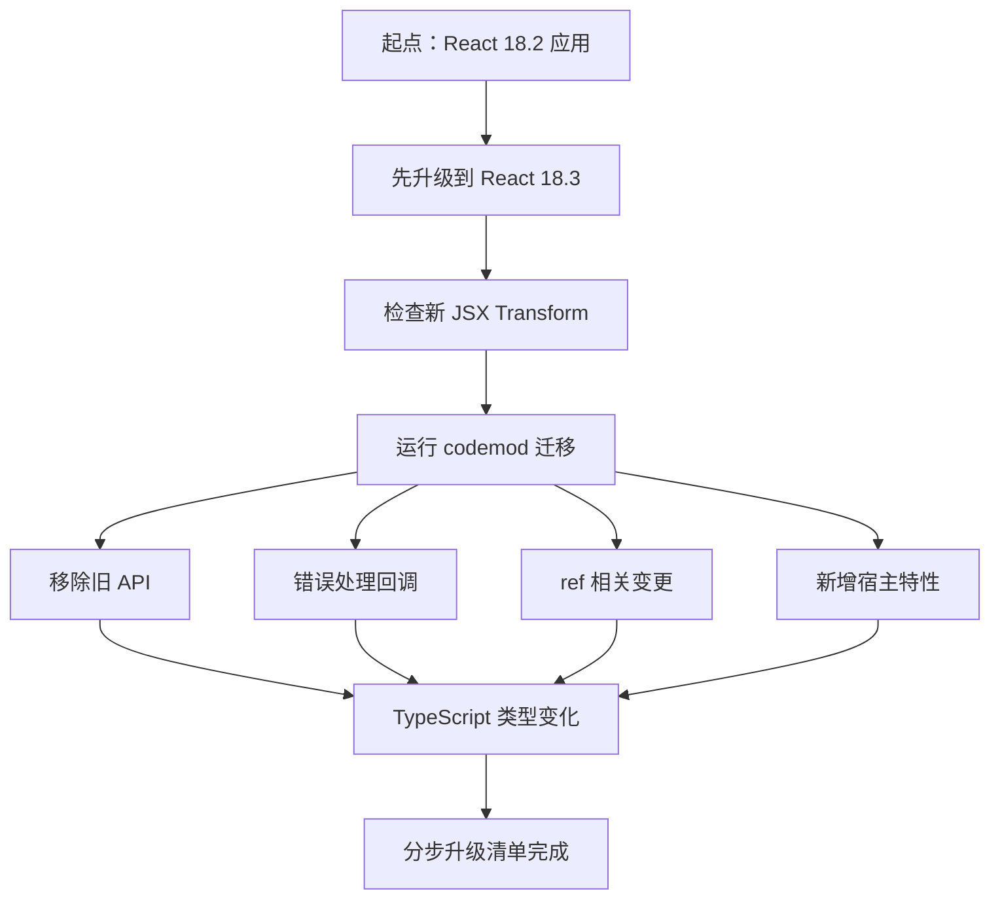
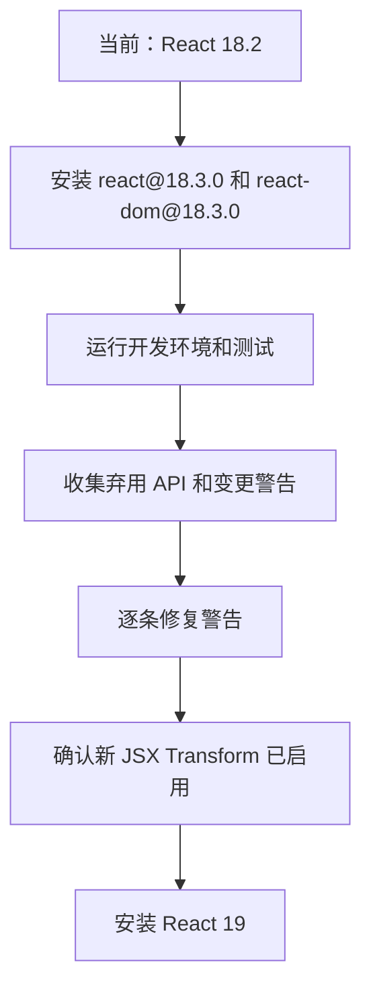
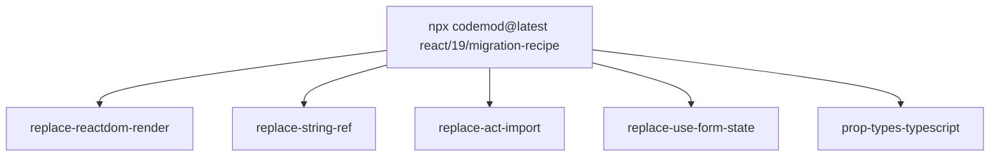
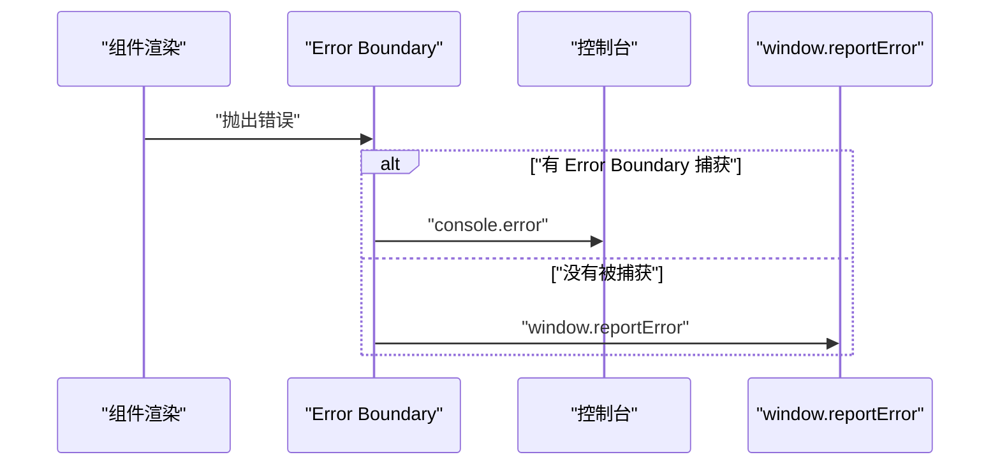
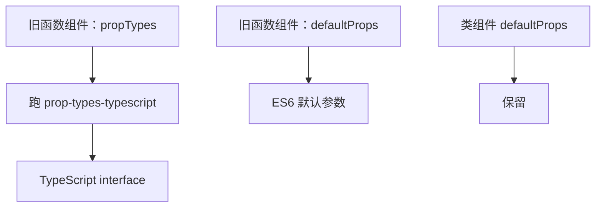
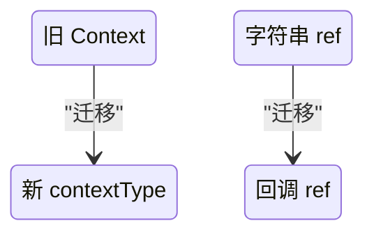
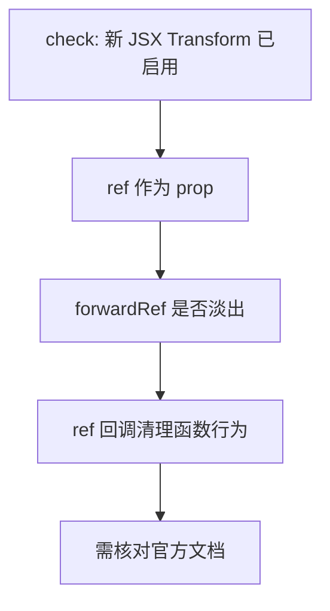
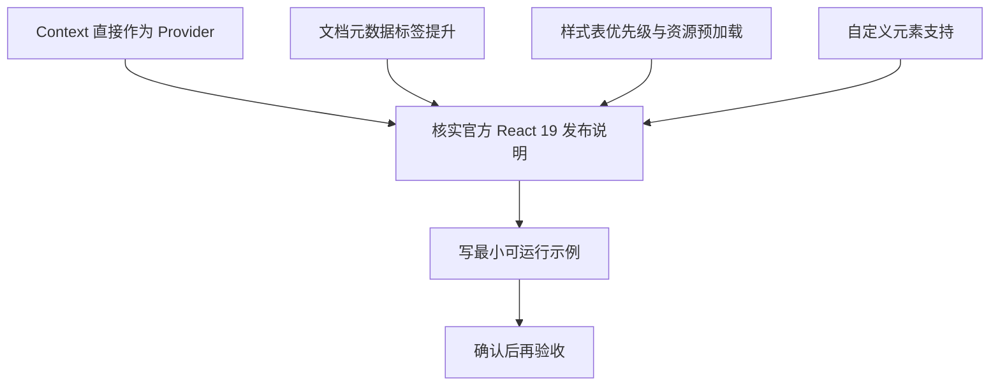
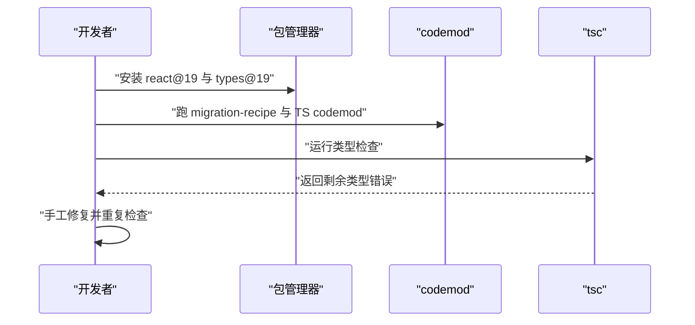

# React 19 的 API 变化与从 18 升级指南

!!! abstract "学完这一页你能"
    - 说明 React 18.3 的先行升级作用，并写出 React 19 运行时与类型包的安装命令。
    - 用 `npx codemod@latest react/19/migration-recipe` 执行自动迁移，并解释它包含哪 5 个 codemod。
    - 区分 React 19 对未捕获错误和已捕获错误的上报路径，并为 `createRoot` 配置两个错误处理回调。
    - 依据官方升级指南，把旧 `propTypes`、函数组件 `defaultProps`、旧 Context、字符串 ref 替换为新写法。

## 0. 知识地图



建议先读第 1 节和第 2 节，把升级顺序与自动化工具建立起来。再按第 3 到第 7 节逐类处理变更。其中 ref、新增宿主特性两节的部分细节在官方来源中未覆盖，需要单独核对文档。

## 1. 升级准备：先上 18.3 并确认新 JSX Transform

**先想一个问题**：你的应用还在 React 18.2，直接升到 19 后 CI 报了一批看不懂的警告。能不能在升 19 之前，先暴露这些隐患？

**心智模型**：!!! tip "心智模型"

- 一句话模型：React 18.3 是升 19 前的“体检版本”，行为等价于 18.2，只多加警告。
- 日常类比：汽车上高速前先进修理厂做年检，检查单只报问题，不改变平时驾驶。
- 类比不成立处：年检能测机械故障，18.3 只能提示 React 已知的弃用 API，无法发现你的业务逻辑错误。

**图解**



图解读：

1. 先停在 18.3，而不是直接跳 19。
2. 在 18.3 里运行现有应用，让运行时警告浮现。
3. 警告清完后再确认编译配置，最后升 19。

**一步一步来**

**第一步：安装 React 18.3，先观察警告**。这一步要做什么：保留 18.2 行为，同时打开 React 19 迁移所需警告。

```bash
# 安装 18.3 版本，作为升级到 19 前的过渡版本
npm install --save-exact react@18.3.0 react-dom@18.3.0
```

**这段代码在做什么**

- `@18.3.0` 是过渡版本，官方说明它等价于 18.2。
- `react-dom@18.3.0` 也必须同步，运行时与渲染器版本要保持一致。
- 这个阶段不引入 React 19 的新行为，只增加警告。

**第二步：确认新 JSX Transform 是否启用**。这一步要做什么：避免升 19 后看到 outdated JSX transform 警告。

```jsx
// 使用 Babel 的项目可这样配置 automatic runtime
module.exports = {
  presets: [
    ['@babel/preset-react', { runtime: 'automatic' }],
  ],
};
```

**这段代码在做什么**

- `runtime: 'automatic'` 启用 2020 年发布的新 JSX Transform。
- React 19 必须使用新 Transform，否则会报：应用使用了过时的 JSX Transform。
- 多数环境默认已启用，只有手动配置的老项目需要检查。

**第三步：安装 React 19**。这一步要做什么：运行时和类型包一起升级。

```bash
# 安装 React 19 运行时
npm install --save-exact react@^19.0.0 react-dom@^19.0.0

# 如果使用 TypeScript，还要升级类型包
npm install --save-exact @types/react@^19.0.0 @types/react-dom@^19.0.0
```

**这段代码在做什么**

- `react@^19.0.0` 安装 React 19 主要运行时。
- `@types/react@^19.0.0` 与 `@types/react-dom@^19.0.0` 是 TS 项目需要的类型声明。
- 使用 Yarn 时，应把 `npm install --save-exact` 替换为 `yarn add --exact`。

**动手验证**

下面的 Node 脚本只模拟版本检查，不安装真实依赖，单文件可在 Node 20 运行。它验证你声明的版本是否满足过渡顺序。

```javascript
// 文件名：check-upgrade-plan.mjs
import assert from 'node:assert';

// 模拟 package.json 中的声明版本
const plan = {
  runtime: 'react@^19.0.0',
  types: '@types/react@^19.0.0',
  intermediate: 'react@18.3.0',
};

// 运行时版本不能直接为空，必须先经过 18.3
assert.ok(plan.intermediate.startsWith('react@18'));
// React 19 运行时必须是主包而不是别名包
assert.ok(plan.runtime.startsWith('react@'));
// 类型包版本要包含 19
assert.ok(plan.types.includes('19'));
console.log('升级顺序检查通过：先 18.3，再 19，类型包同步');
```

**这段代码在做什么**

- `assert.ok` 检查三个关键版本声明是否成立。
- 通过 `startsWith` 简洁验证版本前缀。
- 输出来自实际执行：`升级顺序检查通过：先 18.3，再 19，类型包同步`。

**常见坑**

| 现象 | 原因 | 怎么修 |
| --- | --- | --- |
| 升 19 后突然出现一堆未知警告 | 没经过 18.3 观察窗口 | 先回到 18.3 跑一遍测试，再升 19 |
| 构建时提示 outdated JSX transform | 编译环境没有启用新 JSX Transform | 检查 Babel、TypeScript 或框架的 automatic runtime 配置 |
| TS 项目只升了运行时，类型报错 | `@types/react` 还停在 18 | 同时安装 `@types/react@^19.0.0` 和 `@types/react-dom@^19.0.0` |

**用在哪里**

- 业务背景：中大型存量后台系统，里面有几百个组件。
- 这一节的知识怎么用：先在 CI 增加一条 18.3 分支跑警告，再合入 19 升级。
- 用什么指标衡量收益：警告数量降到 0，升级分支 CI 通过时间不增超 20%。
- 什么时候不该用：全新项目无历史包袱，可直接按官方命令升 19。

**行业实践**

- 出处：React 官方升级指南建议先升 18.3 帮助发现迁移问题。
- 出处：React 官方 New JSX Transform 公告说明新 Transform 减少体积、拆掉 `React` 导入依赖。
- 怎么借鉴到你的项目：在升级脚本开头固定安装 18.3，并把警告收集到 CI 日志。

**小结**

- 18.3 是行为不变、警告加强的中间版本，先安装它可降低一次性升级风险。
- 新 JSX Transform 是 React 19 的硬要求，先检查自动模式。
- 升 19 时，运行时包和类型包要同批升级，否则留下 TS 类型断层。

## 2. codemod：用 react/19/migration-recipe 自动迁移

**先想一个问题**：手工修改 `ReactDOM.render`、字符串 ref、`useFormState` 成百上千处，容易漏掉。有没有一次下载官方迁移配方的方式？

**心智模型**：!!! tip "心智模型"

- 一句话模型：codemod 是按规则批量重写代码文本的工具，不是编译器。
- 日常类比：把旧通讯录格式批量导入新手机，程序只做格式转换，不再确认每个号码是否存在。
- 类比不成立处：通讯录没有业务上下文，代码有分支、闭包和类型，工具输出必须人工核对。

**图解**



图解读：

1. 主命令是一个“配方”，一次调用五个 codemod。
2. 五个 codemod 分别覆盖渲染入口、字符串 ref、测试 act 导入、表单状态、PropTypes 迁移。
3. 这条配方不包含 TypeScript 类型变化，只改一部分 JS 源码。

**一步一步来**

**第一步：运行 React 19 官方迁移配方**。这一步要做什么：让工具自动替换最常见的旧 API。

```bash
# 一次性运行 React 19 官方迁移配方
npx codemod@latest react/19/migration-recipe
```

**这段代码在做什么**

- `codemod@latest` 是推荐执行器，官方说明它比旧 `react-codemod` 命令更快、更懂 TypeScript。
- `react/19/migration-recipe` 是 React 19 聚合配方。
- 它会依次执行五个替换任务，不需要你手动逐个调用。

**第二步：单独执行 PropTypes 转 TypeScript**。这一步要做什么：把运行时类型检查迁移成编译期类型。

```bash
# 把 propTypes 迁移为 TypeScript
npx codemod@latest react/prop-types-typescript
```

**这段代码在做什么**

- `react/prop-types-typescript` 针对 PropTypes 用法生成 TS 类型。
- 这是补充工具，适合想迁移类型系统的项目。
- 它会改变源码结构，应先在版本库提交干净基线。

**第三步：检查配方没覆盖的 TypeScript 变化**。这一步要做什么：明确 TS 类型变化不在配方范围。

```text
官方说明：migration-recipe 不包括 TypeScript changes。
具体类型变化需要查看 Upgrade Guide 的 TypeScript changes 小节。
```

**这段代码在做什么**

- 配方只做部分 JS 源码改造。
- TS 类型变化要单独由开发者和类型检查流程处理。
- 避免“跑了 recipe 就以为 TS 也迁移完成”的误解。

**动手验证**

下面的 Node 脚本把配方包含的五个 codemod 列出来，与官方配方对照。它没有网络依赖，可直接跑。

```javascript
// 文件名：check-codemod-recipe.mjs
import assert from 'node:assert';

// 官方配方应包含的五个 codemod
const expected = [
  'replace-reactdom-render',
  'replace-string-ref',
  'replace-act-import',
  'replace-use-form-state',
  'prop-types-typescript',
].sort();

// 这里模拟从命令输出中收集到的任务
const collected = [
  'replace-string-ref',
  'replace-use-form-state',
  'prop-types-typescript',
  'replace-act-import',
  'replace-reactdom-render',
].sort();

assert.deepEqual(collected, expected);
console.log('五个 codemod 全部匹配');
```

**这段代码在做什么**

- `expected` 是官方配方声明的任务清单。
- `collected` 模拟开发者在执行后收集到的结果。
- `deepEqual` 检查两个列表一致，输出确认信息。

**常见坑**

| 现象 | 原因 | 怎么修 |
| --- | --- | --- |
| 以为配方总能安全改完代码 | 工具不理解业务分支 | 执行后逐个查看 diff，并跑测试 |
| 用的旧 `react-codemod` 命令速度差 | 旧执行器对 TS 支持弱 | 改用 `npx codemod@latest` |
| 改完还是 TS 报错 | 配方不含 TypeScript 变化 | 单独查 TypeScript changes 并手工修复 |

**用在哪里**

- 业务背景：遗留仓库有上千次 `ReactDOM.render` 和字符串 ref。
- 这一节的知识怎么用：用一个配方命令批量替换，减少人工失误。
- 用什么指标衡量收益：替换后回归测试通过率保持 100%，人工改动行数下降。
- 什么时候不该用：改动分支特别多、代码生成与手写混用时，人工分批更安全。

**行业实践**

- 出处：React 官方升级指南写明配方命令和五个 codemod。
- 出处：react-codemod 仓库由 React 团队与 codemod.com 团队协作维护。
- 怎么借鉴到你的项目：升级分支先跑配方，再用同一套 lint 与测试挡住异常输出。

**小结**

- 用 `npx codemod@latest react/19/migration-recipe` 一次性跑五个官方 codemod。
- 配方不处理 TypeScript 类型变化，TS 项目要另走类型检查。
- codemod 输出是“变更候选”，提交前必须阅读 diff 和回归验证。

## 3. 错误处理回调：onUncaughtError 与 onCaughtError

**先想一个问题**：你的错误监控原本依赖“渲染错误被重新抛出”，React 19 不再重新抛出后，上报链路会不会断？

**心智模型**：!!! tip "心智模型"

- 一句话模型：React 19 把渲染错误分成“被 Error Boundary 捕获”和“未被捕获”两路，分别走不同出口。
- 日常类比：大楼消防报警分本地灭火器和总控台，两路不会重复拉响同一警铃。
- 类比不成立处：消防两路可同时响，React 19 是去重，同一错误只报到一个官方出口。

**图解**



图解读：

1. 组件渲染抛出错误后，先看有没有 Error Boundary。
2. 有边界捕获时，错误报告到 `console.error`。
3. 没有边界捕获时，错误报告到 `window.reportError`。
4. 这就是官方说的“不再重新抛出”的两条出口。

**一步一步来**

**第一步：识别旧行为依赖**。这一步要做什么：检查当前生产上报是否还等待渲染错误再抛。

```js
// 旧做法可能依赖 render 抛出的错误继续向全局抛一次
try {
  renderApp();
} catch (error) {
  sendToErrorTracker(error);
}
```

**这段代码在做什么**

- 这是对旧依赖的示意，真实旧代码不一定是这个形状。
- React 19 不再把渲染错误重新抛出，外层 `try` 可能抓不到。
- 需要改走 `createRoot` 的两个回调。

**第二步：给 createRoot 增加两个回调**。这一步要做什么：把两份错误出口重新接入你的监控。

```jsx
// 来自 React 官方升级指南的 createRoot 示例
const root = createRoot(container, {
  onUncaughtError: (error, errorInfo) => {
    // 上报未被 Error Boundary 捕获的错误
  },
  onCaughtError: (error, errorInfo) => {
    // 上报已被 Error Boundary 捕获的错误
  }
});
```

**这段代码在做什么**

- `onUncaughtError` 接收未被捕获的渲染错误。
- `onCaughtError` 接收被 Error Boundary 捕获的渲染错误。
- 两个回调都拿到 `error` 和 `errorInfo`，便于结构化上报。

**第三步：在生产环境避免重复上报**。这一步要做什么：用不同标签区分两个出口，方便监控平台归类。

```js
const root = createRoot(document.getElementById('root'), {
  onUncaughtError: (error, errorInfo) => {
    sendError('uncaught', error, errorInfo);
  },
  onCaughtError: (error, errorInfo) => {
    sendError('caught', error, errorInfo);
  }
});
```

**这段代码在做什么**

- 用 `uncaught` 和 `caught` 两个标签区分错误类别。
- `sendError` 是你自己的上报函数，不在 React 包内。
- errorInfo 可以带上组件栈，帮助定位。

**动手验证**

下面的 Node 脚本模拟两个回调触发，保证错误出口不混用。没有浏览器依赖，可直接运行。

```javascript
// 文件名：error-callback-check.mjs
import assert from 'node:assert';

// 模拟 createRoot 接收到的两个回调
const calls = [];
const root = (callbacks) => {
  callbacks.onCaughtError('boundary', { stack: 'a' });
  callbacks.onUncaughtError('global', { stack: 'b' });
};

root({
  onCaughtError: (error, info) => calls.push(['caught', error, info]),
  onUncaughtError: (error, info) => calls.push(['uncaught', error, info]),
});

assert.deepEqual(calls, [
  ['caught', 'boundary', { stack: 'a' }],
  ['uncaught', 'global', { stack: 'b' }],
]);
console.log('两个回调分别收到各自的 error；模拟通过');
```

**这段代码在做什么**

- 用数组 `calls` 记录回调收到的参数。
- `assert.deepEqual` 验证被捕获与未捕获两条路径没有交叉。
- 输出：`两个回调分别收到各自的 error；模拟通过`。

**常见坑**

| 现象 | 原因 | 怎么修 |
| --- | --- | --- |
| 错误监控平台突然收不到 React 错误 | 旧代码依赖渲染错误再抛出 | 迁到 `onUncaughtError` 与 `onCaughtError` |
| 本地控制台一条错误出现两次 | 旧版本开发模式重复打印 | React 19 已去重，检查是否还在用老代码 |
| errorInfo 丢失组件栈 | 上报函数只传第一个参数 | 把 `errorInfo` 也传入上报函数 |

**用在哪里**

- 业务背景：前端错误监控平台接入 React 19 应用。
- 这一节的知识怎么用：在入口统一写两个 root 回调，把错误打上分类标签。
- 用什么指标衡量收益：React 错误上报覆盖率 100%，误报重复率为 0。
- 什么时候不该用：纯静态页无 Error Boundary 也没有监控需求时，不必加额外包装。

**行业实践**

- 出处：React 官方升级指南给出 `createRoot` 与 `hydrateRoot` 的新回调。
- 出处：React 19 发布说明提到错误处理改进以减少重复日志。
- 怎么借鉴到你的项目：应用入口集中封装一个 `monitorError(kind, error, errorInfo)`。

**小结**

- React 19 不再重新抛出渲染错误，旧全局捕获逻辑必须改。
- `onUncaughtError` 接未捕获错误，`onCaughtError` 接已捕获错误。
- 两个回调都传 `error` 和 `errorInfo`，适合接入结构化监控。

## 4. 移除 propTypes 与函数组件 defaultProps

**先想一个问题**：React 19 里函数组件的 `propTypes` 不会报错，但真正运行时也不会检查，类型错误可能无声溜走。你该怎么处理？

**心智模型**：!!! tip "心智模型"

- 一句话模型：React 19 把函数组件的运行时类型检查从 React 包中移除，改为交给编译期类型系统。
- 日常类比：把产品质检从出厂后抽样，移到了生产图纸阶段。
- 类比不成立处：图纸阶段只能发现结构性错误，运行时第三方数据异常仍然需要显示兜底。

**图解**



图解读：

1. 函数组件的 `propTypes` 走 codemod 生成 TS 类型。
2. 函数组件的 `defaultProps` 改为默认参数。
3. 类组件没有 ES6 替代方案，继续保留 `defaultProps`。

**一步一步来**

**第一步：识别旧写法**。这一步要做什么：查看函数组件上是否还挂着 `propTypes` 与 `defaultProps`。

```jsx
// 旧写法：运行时类型检查与默认值放在组件外
import PropTypes from 'prop-types';

function Heading({text}) {
  return <h1>{text}</h1>;
}
Heading.propTypes = {
  text: PropTypes.string,
};
Heading.defaultProps = {
  text: 'Hello, world!',
};
```

**这段代码在做什么**

- `Heading.propTypes` 在 React 19 会被静默忽略。
- `Heading.defaultProps` 在函数组件上被移除，因为可用 ES6 默认参数替代。
- 这段代码是官方升级指南给出的旧写法示例。

**第二步：换成 TypeScript 与默认参数**。这一步要做什么：把类型和默认值前置到函数签名处。

```tsx
// 新写法：类型写在编译期，默认值写在参数列表
interface Props {
  text?: string;
}
function Heading({text = 'Hello, world!'}: Props) {
  return <h1>{text}</h1>;
}
```

**这段代码在做什么**

- `interface Props` 声明形状，替代 `propTypes`。
- `text?: string` 表示 text 是可选的字符串。
- `{text = 'Hello, world!'}` 使用默认参数替换函数组件 `defaultProps`。

**第三步：执行 codemod**。这一步要做什么：用工具自动迁移到 TS。

```bash
# 把 propTypes 迁移成 TypeScript 类型
npx codemod@latest react/prop-types-typescript
```

**这段代码在做什么**

- 这个命令与第 2 节的单命令相同，现在放在具体迁移场景里。
- 它针对 PropTypes 生成类型声明。
- 生成结果仍需检查，尤其是复杂 PropTypes 形状。

**动手验证**

下面脚本在 JS 层验证默认参数替代默认属性的行为，不要求 TS 编译器。

```javascript
// 文件名：default-param-check.mjs
import assert from 'node:assert';

// 新写法：用默认参数替代 defaultProps
function Heading({text = 'Hello, world!'}) {
  return { text };
}

assert.equal(Heading({}).text, 'Hello, world!');
assert.equal(Heading({ text: '台账' }).text, '台账');
console.log('默认参数验证通过');
```

**这段代码在做什么**

- `Heading({})` 验证没有传参时默认字符串生效。
- `Heading({ text: '台账' })` 验证传入显式值覆盖默认值。
- 运行结果：`默认参数验证通过`。

**常见坑**

| 现象 | 原因 | 怎么修 |
| --- | --- | --- |
| propTypes 还在写但不报错也不检查 | React 19 静默忽略 | 移入 TypeScript 或运行时校验库 |
| 类组件把 defaultProps 也删了 | 类组件没有 ES6 替代方案，官方仍支持 | 类组件保留 defaultProps，只改函数组件 |
| codemod 生成的类型太宽 | 旧 PropTypes 本身不强 | 人工补强 interface |

**用在哪里**

- 业务背景：后台管理系统的公共按钮、标题组件还携带 PropType。
- 这一节的知识怎么用：通过 codemod 转 TS，再把默认参数统一放入函数签名。
- 用什么指标衡量收益：tsc 类型检查通过率上升，运行时代码量下降。
- 什么时候不该用：项目完全没有 TS 编译链时，先补链再迁移。

**行业实践**

- 出处：React 官方升级指南给出上面的 Before/After 示例。
- 出处：react-codemod 仓库维护 `prop-types-typescript`。
- 怎么借鉴到你的项目：组件库统一只用 `interface Props`，提交前跑 `tsc --noEmit`。

**小结**

- 函数组件 `propTypes` 被静默忽略，不应再依赖它。
- 函数组件 `defaultProps` 被移除，改 ES6 默认参数。
- 类组件仍保留 `defaultProps`，因为类缺少 ES6 同义写法。

## 5. 移除旧 Context 与字符串 ref

**先想一个问题**：老代码用 `static contextTypes` 和 `getChildContext` 传数据，React 19 移除这套旧 Context 后，为什么页面不显示值了？

**心智模型**：!!! tip "心智模型"

- 一句话模型：旧 Context 基于属性拼装，新 Context 基于显式对象读写，字符串 ref 也被回调 ref 替代。
- 日常类比：旧 Context 像单位公告栏贴纸，新 Context 像每间办公室门口的信箱。
- 类比不成立处：公告栏可多人同时看，新 Context 需要每个组件声明读取源。

**图解**



图解读：

1. 旧 Context 的 `contextTypes` 与 `getChildContext` 被移除。
2. 类组件用 `contextType` 读取新 Context。
3. 字符串 ref 被移除，改为 ref 回调。

**一步一步来**

**第一步：识别旧 Context 写法**。这一步要做什么：找到类组件中的旧 Context 属性。

```jsx
// 旧写法：父组件通过 getChildContext 下发
import PropTypes from 'prop-types';

class Parent extends React.Component {
  static childContextTypes = {
    foo: PropTypes.string.isRequired,
  };

  getChildContext() {
    return { foo: 'bar' };
  }

  render() {
    return <Child />;
  }
}

class Child extends React.Component {
  static contextTypes = {
    foo: PropTypes.string.isRequired,
  };

  render() {
    return <div>{this.context.foo}</div>;
  }
}
```

**这段代码在做什么**

- `childContextTypes` 声明父组件下发的类型。
- `getChildContext` 返回要下发到子树的值。
- `contextTypes` 是子组件声明的读取需求，React 19 已移除这套机制。

**第二步：迁移到新 Context**。这一步要做什么：用 `createContext` 与 `contextType` 重写。

```jsx
// 官方迁移示例：用新 Context 替换旧 Context
const FooContext = React.createContext();

class Parent extends React.Component {
  render() {
    return (
      <FooContext value='bar'>
        <Child />
      </FooContext>
    );
  }
}

class Child extends React.Component {
  static contextType = FooContext;

  render() {
    return <div>{this.context}</div>;
  }
}
```

**这段代码在做什么**

- `FooContext` 由 `React.createContext()` 创建。
- `FooContext value='bar'` 在官方示例中作为 Provider 使用。
- `static contextType = FooContext` 让子类读取该 Context。

**第三步：迁移字符串 ref**。这一步要做什么：把 `<input ref="name" />` 改成 ref 回调。

```jsx
// 旧写法：字符串 ref
class NameInput extends React.Component {
  focus() {
    this.refs.nameInput.focus();
  }
  render() {
    return <input ref="nameInput" />;
  }
}

// 迁移目标：ref 回调
class NameInput extends React.Component {
  constructor(props) {
    super(props);
    this.nameInput = null;
  }
  focus() {
    this.nameInput.focus();
  }
  render() {
    return <input ref={(node) => { this.nameInput = node; }} />;
  }
}
```

**这段代码在做什么**

- 旧写法通过字符串 `nameInput` 挂到实例的 `refs` 对象上。
- 新写法通过回调函数把节点赋给实例字段 `nameInput`。
- `focus` 方法从读 `this.refs.nameInput` 变成读 `this.nameInput`。

**动手验证**

下面的 Node 脚本模拟 Context 对象被直接读取的行为。它不涉及 React 类机制，只验证核心思想。

```javascript
// 文件名：context-simulation.mjs
import assert from 'node:assert';

// 模拟 createContext 返回的 Context 对象
const FooContext = { name: 'Foo', currentValue: null };
FooContext.currentValue = 'bar';

// 模拟类组件 contextType 读取
function readContext(component) {
  return component.contextType.currentValue;
}

const Child = { contextType: FooContext };
assert.equal(readContext(Child), 'bar');
console.log('Context 读取模拟通过');
```

**这段代码在做什么**

- 用普通对象模拟 Context 容器。
- `readContext` 从 `contextType` 读取当前值。
- 验证结果：`Context 读取模拟通过`。

**常见坑**

| 现象 | 原因 | 怎么修 |
| --- | --- | --- |
| 升级后子组件拿到空值 | 旧 Context API 已移除 | 改为 createContext 与 contextType |
| 字符串 ref 静默失效 | 字符串 ref 被移除 | 改用 ref 回调 |
| 迁移后类组件 `this.refs` 为 undefined | 字符串 ref 不再挂到 refs | 用自定义实例字段保存节点 |

**用在哪里**

- 业务背景：老财务系统的表单依赖旧 Context 传递列配置。
- 这一节的知识怎么用：写一个 createContext 保存列配置，子组件用 `contextType` 读取。
- 用什么指标衡量收益：配置读取失败数降到 0，升级后表单可用性保持。
- 什么时候不该用：组件树不深且数据只传一层时，直接 props 更直观。

**行业实践**

- 出处：React 官方升级指南给出旧 Context 的 Before/After 示例。
- 出处：react-codemod 仓库有 `replace-string-ref` 任务。
- 怎么借鉴到你的项目：先用 codemod 替换字符串 ref，再人工处理上下文结构。

**小结**

- 旧 Context 依赖 `contextTypes` 与 `getChildContext`，React 19 移除。
- 类组件用 `contextType` 连接 `createContext` 产生的 Context 对象。
- 字符串 ref 被 ref 回调取代，不再挂到 `this.refs`。

## 6. 迁移 ref：ref 作为 prop、forwardRef 淡出与 ref 回调清理

**先想一个问题**：设计系统里一堆 `forwardRef` 转发组件，React 19 把 ref 当成普通 prop 后，旧封装还有没有存在必要？

**心智模型**：!!! tip "心智模型"

- 一句话模型：ref 在 React 19 走向普通 prop 通道，forwardRef 与 ref 回调细节需要重新核对。
- 日常类比：快递从原来的特殊签收通道合并进普通签收通道。
- 类比不成立处：快递通道合并后业务不变，React API 迁移还涉及旧组件兼容和类型声明。

**图解**



图解读：

1. 先确认新 JSX Transform，这是 ref 作为 prop 的前提。
2. `ref 作为 prop` 是资料中明确的 React 19 改进方向。
3. `forwardRef` 淡出与 ref 回调清理函数的具体规则，资料未覆盖，需核对官方文档。

**一步一步来**

**第一步：确认 ref 作为 prop 的前提**。这一步要做什么：查编译配置是否满足新 JSX Transform。

```jsx
// Babel 配置需要 automatic runtime
module.exports = {
  presets: [
    ['@babel/preset-react', { runtime: 'automatic' }],
  ],
};
```

**这段代码在做什么**

- React 19 把 ref 作为 prop 列在需要新 Transform 的改进里。
- 未启用 automatic runtime 会出现官方警告。
- 这一步是后续 ref 迁移的基础。

**第二步：识别现有 forwardRef 用法**。这一步要做什么：对存量接口做盘点，不立即删改。

```jsx
// 旧接口：用 forwardRef 转发 ref
const FancyInput = React.forwardRef(function FancyInput(props, ref) {
  return <input ref={ref} {...props} />;
});
```

**这段代码在做什么**

- 这是 React 18 常见的 forwardRef 写法。
- React 19 的 ref 作为 prop 可能改变这类封装。
- 本页来源没有说明 forwardRef 完全移除，只看到“淡出”的提法。

**第三步：核对 ref 回调清理函数**。这一步要做什么：由于资料未覆盖，进入官方文档核对清单。

```text
需要核对官方文档：
1. ref 回调是否允许返回清理函数？
2. 清理函数在卸载或 ref 变化时何时执行？
3. cleanup 返回类型是否影响 TypeScript 声明？
```

**这段代码在做什么**

- 这是核对清单，不宣称任何未证实的 API 行为。
- 每一步都对应一个具体待查点。
- 以此保持升级阶段不改动一知半解的代码。

**动手验证**

下面脚本验证“ref 作为普通 prop”在 JS 函数层面的传递行为。它不是 React DOM 渲染，只验证参数传递。

```javascript
// 文件名：ref-as-prop-simulation.mjs
import assert from 'node:assert';

// 模拟新写法：ref 在函数参数中作为普通 prop
function Input({ ref, id }) {
  return { refValue: ref, id };
}

const refObject = { current: 'node' };
const result = Input({ ref: refObject, id: 'name' });

assert.equal(result.refValue, refObject);
assert.equal(result.id, 'name');
console.log('ref 作为 prop 的参数传递模拟通过');
```

**这段代码在做什么**

- `Input` 把 `ref` 当作普通属性接收。
- 断言验证调用者传入的 `ref` 对象确实被收到。
- 输出：`ref 作为 prop 的参数传递模拟通过`。

**常见坑**

| 现象 | 原因 | 怎么修 |
| --- | --- | --- |
| 以为 forwardRef 立刻被删除 | 官方资料只提到淡出方向 | 保持兼容封装，等待权威规则确认 |
| 直接给 ref 回调加 return 清理函数 | 清理语义未核实 | 先核对官方文档再动手 |
| 升 19 后 ref 相关报错 | 仍用旧 JSX Transform | 打开 automatic runtime 再测 |

**用在哪里**

- 业务背景：表单组件库公开 DOM ref 供聚焦和滚动。
- 这一节的知识怎么用：保留 ref 传递能力，迁移前先做 ref API 盘点。
- 用什么指标衡量收益：组件对外 ref 行为测试通过率保持 100%。
- 什么时候不该用：小项目几乎不用 ref 转发时，升级不必重写这层封装。

**行业实践**

- 出处：React 官方升级指南提到 ref as a prop 需要新 JSX Transform。
- 出处：React 19 发布说明是此类 API 变更的原始出处，具体 ref 清理规则需核对该文。
- 怎么借鉴到你的项目：在迁移清单里单列“ref 相关”，不要自作主张提前重构。

**小结**

- ref 作为 prop 是 React 19 的改进方向，前提是新 JSX Transform。
- forwardRef 淡出与 ref 回调清理函数的确切行为，本页来源未覆盖。
- 迁移时应先核对官方文档，再改接口形态。

## 7. 新增宿主特性：Context Provider、文档元数据、样式表与自定义元素

**先想一个问题**：你听说 React 19 的 Context 可以直接当 Provider，还能提升 title、控制样式优先级、支持自定义元素。哪些可以直接落到项目里？

**心智模型**：!!! tip "心智模型"

- 一句话模型：这类宿主特性改的是 React DOM 与浏览器交互方式，能否直接落地取决于官方规范已有多少细节。
- 日常类比：新地铁线路图贴出来了，但换乘口尚未标清，不能只按传言选站。
- 类比不成立处：地铁图不标换乘也能到站，API 细节缺失时写下代码可能直接失效。

**图解**



图解读：

1. 四项宿主特性全部先经过官方文档核实。
2. 核实之后写最小可运行示例，不直接进生产。
3. 只有最小示例通过，才进入验收流程。
4. 这些特性里，Context 作为 Provider 可以从官方升级指南的示例观察到一部分事实。

**一步一步来**

**第一步：从官方示例确认 Context 作为 Provider**。这一步要做什么：识别官方升级指南中已出现的写法。

```jsx
// 官方旧 Context 迁移示例里，Context 直接作为 Provider 使用
const FooContext = React.createContext();

function App() {
  return (
    <FooContext value='bar'>
      <Child />
    </FooContext>
  );
}
```

**这段代码在做什么**

- `FooContext` 不是 `FooContext.Provider`，而是直接挂 `value`。
- 官方资料只给出这一处示例，没展开完整 Provider 规则。
- 因此代码可理解为“观察到的写法”，完整语义仍需核对 React 19 参考。

**第二步：整理待核实清单**。这一步要做什么：把文档元数据、样式表、自定义元素逐项列出。

```text
待核对官方文档：
1. title 与 meta 是否能放在组件树中提升到 head？
2. 样式表的 precedence 是多少？
3. 资源预加载有哪些 API，属于哪个包？
4. 自定义元素在 React 19 中如何匹配属性和事件？
```

**这段代码在做什么**

- 这是升级前的事实核查清单，不含未被来源证实的 API 形状。
- 每一条都用于防止把未确认行为写进生产代码。
- 核对完成前，这些特性不在代码评审里通过。

**第三步：写最小验证沙箱**。这一步要做什么：只验证一条已确认事实，例如 Context 作为 Provider。

```jsx
// 最小验证：Context 直接作为 Provider
import { createContext } from 'react';

const ThemeContext = createContext('light');

function App() {
  return (
    <ThemeContext value='dark'>
      <p>内容</p>
    </ThemeContext>
  );
}
```

**这段代码在做什么**

- 这是把官方示例中的模式提取到小应用。
- `ThemeContext value='dark'` 是直接 Provider 形式。
- 但本页来源未给出该形式的所有类型和消费约束，建议以官方组件文档为准。

**动手验证**

下面的脚本验证你为四个特性建立的核对清单完整性，确保迁移前没有漏项。

```javascript
// 文件名：verify-feature-list.mjs
import assert from 'node:assert';

const features = [
  'Context 直接作为 Provider',
  '文档元数据标签提升',
  '样式表优先级与资源预加载',
  '自定义元素支持',
];

assert.equal(features.length, 4);
assert.ok(features.every(item => typeof item === 'string' && item.length > 0));
console.log('四个官方文档核对项已建立');
```

**这段代码在做什么**

- 列出四个已知的新增宿主特性方向。
- 用断言确保清单长度和类型合理。
- 输出：`四个官方文档核对项已建立`。

**常见坑**

| 现象 | 原因 | 怎么修 |
| --- | --- | --- |
| 团队在评审中通过未核实的 API 写法 | 资料没有提供全部细节 | 先查 React 19 发布说明和组件参考 |
| CSS 顺序按老经验写，升级后样式乱 | 优先级行为可能变化 | 在样式表特性未确认前，先不改造样式依赖 |
| 自定义元素属性在某浏览器不生效 | React 19 支持细节未核实 | 小范围跑属性映射测试，记录结果 |

**用在哪里**

- 业务背景：后台管理头部标题需要动态改 `<title>`。
- 这一节的知识怎么用：先在官方文档核实元数据提升，再写成独立 meta 组件。
- 用什么指标衡量收益：站内多标签切换时 title 同步准确率 100%。
- 什么时候不该用：静态单页没有动态 title、没有第三方样式和自定义元素时，不值得优先改造。

**行业实践**

- 出处：React 官方 React 19 发布说明，用于核实文档元数据、样式表、自定义元素特性。
- 出处：React 19 Upgrade Guide 的旧 Context 迁移示例，包含 Context 直接 Provider 的代码片段。
- 怎么借鉴到你的项目：建一个“宿主特性验证集”，每项 API 在官方文档有对应说明后才写迁移示例。

**小结**

- Context 直接作为 Provider 在官方迁移示例中出现了具体代码。
- 文档元数据、样式表优先级、资源预加载、自定义元素的细节，本页来源未覆盖，需核对官方文档。
- 未核实的宿主特性不应在评审中直接放行，应写入验证清单。

## 8. TypeScript 类型变化与分步升级清单

**先想一个问题**：你升级了运行时，类型包没动，结果 CI 冒出几十个类型不兼容。到底应该按什么顺序走完 React 19 升级？

**心智模型**：!!! tip "心智模型"

- 一句话模型：运行时和类型声明是两个层，升级必须让两层版本一致，再处理源码类型错误。
- 日常类比：换新版导航软件后，也要下载匹配的新地图数据，否则路名错乱。
- 类比不成立处：地图版本不对时软件可能不让用，JS 运行时版本不对时却不会在启动前阻止你。

**图解**



图解读：

1. 第一步同步安装运行时与类型包。
2. 第二步执行 codemod，类型相关 changes 需单独处理。
3. 第三步跑 tsc，以类型检查作为升级完成度的硬指标。
4. 剩余错误手动修复后再次检查。

**一步一步来**

**第一步：同步安装运行时和类型**。这一步要做什么：避免只升运行时导致类型断层。

```bash
# 运行时与类型同时升级
npm install --save-exact react@^19.0.0 react-dom@^19.0.0
npm install --save-exact @types/react@^19.0.0 @types/react-dom@^19.0.0
```

**这段代码在做什么**

- 三个运行时包与三个类型包没有漏装。
- `--save-exact` 固定 19 主版本。
- 使用 Yarn 时用 `yarn add --exact` 替换。

**第二步：跑 codemod 并认识边界**。这一步要做什么：确认配方不含 TS 类型变化。

```bash
# 自动迁移 JS 源码
npx codemod@latest react/19/migration-recipe

# 单独执行 propTypes 到 TS 的迁移
npx codemod@latest react/prop-types-typescript
```

**这段代码在做什么**

- 第一条跑五个常规迁移。
- 第二条补上 PropTypes 到 TS。
- 两步都不能替代手工类型修复。

**第三步：用 tsc 收口**。这一步要做什么：跑类型检查，得到剩余错误清单。

```bash
# 无编译输出，只检查类型
npx tsc --noEmit
```

**这段代码在做什么**

- `--noEmit` 只做检查，不产生 JS 文件。
- 类型错误会逐条列出文件位置。
- 这些错误是全量升级完成前的主要阻力。

**动手验证**

下面的 Node 脚本验证升级清单顺序是否齐全。仅做流程保障，不连接真实 npm 和 TypeScript。

```javascript
// 文件名：upgrade-checklist.mjs
import assert from 'node:assert';

// 模拟分步升级清单
const checklist = [
  'install 18.3 first',
  'enable new JSX transform',
  'run react/19/migration-recipe',
  'run TS codemod separately',
  'install React 19 runtime',
  'install React 19 types',
  'run tsc --noEmit',
  'fix remaining errors',
];

assert.equal(checklist.length, 8);
assert.ok(checklist.includes('run tsc --noEmit'));
assert.ok(checklist[0] === 'install 18.3 first');
console.log('分步升级清单顺序检查通过');
```

**这段代码在做什么**

- 清单共 8 步，覆盖从过渡版本到类型检查。
- 断言 `run tsc --noEmit` 排在收尾阶段。
- 断言第一步是 `install 18.3 first`，避免直接跳 19。

**常见坑**

| 现象 | 原因 | 怎么修 |
| --- | --- | --- |
| TS 报错说 React 18 类型不兼容 | 类型包还停在 18 | 升 `@types/react@^19.0.0` |
| 跑完 recipe 后类型错误没少 | recipe 不含 TS 变化 | 单独看 TypeScript changes 并修 |
| 升级后 CI 漏掉类型错误 | 构建没跑 `tsc --noEmit` | 在 CI 加类型检查步骤 |

**用在哪里**

- 业务背景：TypeScript 中后台完成 React 19 升级。
- 这一节的知识怎么用：按 8 步清单写升级脚本，每步合并前跑类型检查。
- 用什么指标衡量收益：tsc 错误数降为 0，全量构建时间不因升级增加。
- 什么时候不该用：小型 JS 项目无类型系统时，跳过类型两步，重点关注运行时。

**行业实践**

- 出处：React 官方升级指南把 TypeScript changes 列在升级流程末尾，并明确不包含在迁移配方里。
- 出处：React 官方升级指南给出 `@types/react` 与 `@types/react-dom` 的安装命令。
- 怎么借鉴到你的项目：把升级步骤做成一个可重复的提交序列，每一层都在 CI 校验。

**小结**

- React 19 的 TS 升级是底层更替，不是配方的一件事。
- 运行时与类型包要同批安装，尽快让 `tsc --noEmit` 暴露真实缺口。
- 分步清单第一站保持在 18.3 观察，最后以类型检查为零收口。

## 应用地图

| 场景 | 用到本页哪个知识点 | 典型技术选型 | 注意事项 |
| --- | --- | --- | --- |
| 中后台升级到 React 19 | 18.3 过渡、JSX Transform | react@18.3.0 → react@^19.0.0 | 先跑 18.3 警告基线 |
| 前端监控平台接入 | onUncaughtError、onCaughtError | createRoot 回调 | error 与 errorInfo 都要上报 |
| 组件库清理 propTypes | TS 接口迁移 | TypeScript + prop-types-typescript | 类组件保留 defaultProps |
| 旧类组件重构 | 新 Context、contextType | React.createContext | 不混用旧 Context API |
| 表单 ref 聚焦与滚动 | ref 作为 prop 方向 | 新 JSX Transform | forwardRef 迁移先核对官方文档 |
| 动态标题与样式迁移 | 元数据与样式表特性 | React 19 发布说明 | 先核验再写生产代码 |
| Web Components 接入 | 自定义元素支持 | React DOM 自定义元素特性 | 属性和事件映射要小样本验证 |
| TypeScript 仓库升级 | 类型包同步、tsc | @types/react@^19.0.0 | recipe 不覆盖 TS 变化 |

## 动手作业

目标：做一个“React 19 升级准备表”命令行小工具，输出你的仓库升级待办。

步骤：

1. 在空目录创建 `upgrade-plan.mjs`，写一个数组保存四类升级项：`18.3 过渡`、`新 JSX Transform`、`codemod 配方`、`错误处理回调`。
2. 为每个升级项分配 `owner` 和 `status`，初始状态设为 `'todo'`。
3. 写一个 `markDone(name)` 函数，把对应项改成 `'done'`。
4. 用 `node:assert` 验证初始状态和修改后的状态。
5. 打印一张完成情况表，表头包含 `阶段/状态`。

验收标准：

- 运行 `node upgrade-plan.mjs` 不抛异常。
- 输出表格包含全部四个阶段。
- 每个断言都通过，其中 `18.3 过渡` 最终状态为 `done`。

## 综合对比

| 维度 | React 18 行为 | React 19 行为 | 迁移动作 |
| --- | --- | --- | --- |
| JSX Transform | 新旧都可 | 新 Transform 必须 | 检查 automatic runtime |
| 渲染错误再抛出 | 会重新抛出 | 不再重新抛出 | 改用两个 root 回调 |
| 函数组件 propTypes | 运行时检查 | 静默忽略 | 迁到 TS 或类型校验库 |
| 函数组件 defaultProps | 支持 | 移除 | 改写 ES6 默认参数 |
| 旧 Context | contextTypes 与 getChildContext | 移除 | 改 createContext 与 contextType |
| 字符串 ref | 支持 | 移除 | 改写 ref 回调 |
| TypeScript 类型 | @types/react@18 | 需要 @types/react@19 | 同批升级并跑 tsc |

## 深入阅读与参考

!!! tip "怎么用这些资料"
    先读「官方文档与规范」建立准确的概念，再读「源码与示例」核对细节，最后用「教程、书籍与视频」换一种讲法加深理解。每条都写明了读哪一节、带着什么问题读。

### 官方文档与规范

| 资源 | 为什么读 | 怎么读 |
|---|---|---|
| [React 19 发布博客](https://react.dev/blog/2024/12/05/react-19) | 官方发布说明，逐条列出 19 的破坏性变更与迁移入口 | 读 Notable Changes 与 Removed APIs 两节，对照自己项目列出受影响清单 |
| [JSX and React](https://docs.deno.com/runtime/reference/jsx/) | 说明新 JSX Transform 的运行时契约与 jsx 函数调用方式 | 读 Automatic Runtime 一节，确认 tsconfig 的 jsx 设为 react-jsx 后重跑构建 |
| [forwardRef](https://react.dev/reference/react/forwardRef) | forwardRef 在 19 中仍可用但不再必要，官方给出替换写法 | 读 Usage 与 ref 作为 prop 的示例，把一个 forwardRef 组件改为普通组件 |
| [Client React DOM APIs](https://react.dev/reference/react-dom/client) | createRoot 的 onUncaughtError、onCaughtError 等新选项在此定义 | 读 createRoot 的 options 表，给现有 root 加两个错误回调并触发报错验证 |
| [captureOwnerStack](https://react.dev/reference/react/captureOwnerStack) | 配合错误回调打印组件栈，快速定位报错来源组件 | 读示例后在 onCaughtError 中调用它，对比有无 owner stack 的日志差异 |
| [createContext](https://react.dev/reference/react/createContext) | 19 可直接用 Context 作 Provider，此页说明新旧等价写法 | 读 Provider 一节，把项目里的 Context.Provider 全部替换为 Context |
| [useImperativeHandle](https://react.dev/reference/react/useImperativeHandle) | ref 迁移中暴露命令式句柄的官方做法与清理时机 | 读参数说明与 cleanup 一节，改造一个自定义输入框并验证 ref 清理 |
| [React DOM Components](https://react.dev/reference/react-dom/components) | 文档元数据、样式表、自定义元素等新宿主特性的官方清单 | 按目录挑 title/meta/link 与自定义元素小节，替换手写的 head 逻辑 |

### 源码与示例

| 资源 | 为什么读 | 怎么读 |
|---|---|---|
| [ReactJSXElement.js](https://github.com/facebook/react/blob/main/packages/react/src/jsx/ReactJSXElement.js) | 看清 jsx() 如何构造 element，理解新转换的实际产物 | 读 jsx/jsxs 分支与 key 处理，对照 Babel 编译输出验证 props 合并 |

### 教程、书籍与视频

| 资源 | 为什么读 | 怎么读 |
|---|---|---|
| [MDN 使用自定义元素](https://developer.mozilla.org/en-US/docs/Web/API/Web_components/Using_custom_elements) | 理解 React 19 支持自定义元素前需掌握的浏览器侧语义 | 读生命周期回调与 observedAttributes，写一个能被 React 直接渲染的组件 |
| [jscodeshift](https://github.com/facebook/jscodeshift) | 写自己的 codemod，补充官方 recipe 未覆盖的废弃 API | 先跑通官方示例，再针对字符串 ref 写一个 transform 并小范围试跑 |
| [React TypeScript Cheatsheet](https://react-typescript-cheatsheet.netlify.app/) | 组件、Hooks、事件的类型写法速查，便于核对升级后的类型标注 | 按目录核对 props 泛型与 ref 类型写法，替换项目里过时的类型定义 |

## 自测题

??? question "1. 为什么要先升到 React 18.3，而不是直接升 React 19？"
    - 18.3 的行为与 18.2 一致，但会对 React 19 所需的弃用 API 和其他变化发出警告。
    - 先在 18.3 中跑一遍应用，可以在风险较低时暴露问题。
    - 这样比直接升 19 更容易定位警告来源。

??? question "2. 未启用新 JSX Transform 时，React 19 会给出什么样的提示？"
    - 会警告应用或依赖使用了过时的 JSX Transform。
    - 提示建议更新到现代 JSX Transform 以获得更快性能。
    - 多数环境下该 Transform 已默认启用，只有手动配置的老项目需要处理。

??? question "3. React 19 中未被 Error Boundary 捕获的渲染错误上报到哪里？"
    - 上报到 `window.reportError`。
    - 被 Error Boundary 捕获的错误上报到 `console.error`。
    - 这项变化是为了减少旧版本中的重复错误日志。

??? question "4. `createRoot` 新增的两个错误处理回调是什么，函数签名是什么？"
    - 新回调是 `onUncaughtError` 和 `onCaughtError`。
    - 签名都是 `(error, errorInfo) => void`。
    - 前者接收未捕获错误，后者接收已被边界捕获的错误。

??? question "5. React 19 对类组件的 defaultProps 怎么处理？"
    - 类组件继续支持 `defaultProps`。
    - 因为类组件没有 ES6 默认参数这种替代方案。
    - 函数组件的 `defaultProps` 才被移除。

??? question "6. 官方 React 19 迁移配方运行哪些 codemod，它包含 TypeScript 变化吗？"
    - 包含五个：`replace-reactdom-render`、`replace-string-ref`、`replace-act-import`、`replace-use-form-state`、`prop-types-typescript`。
    - 不包含 TypeScript changes。
    - TypeScript 变化需要单独查看升级指南对应章节。

??? question "7. 函数组件的 propTypes 在 React 19 为什么会被静默忽略？"
    - React 19 从 React 包中移除了 propType 检查。
    - 因此旧代码不报错，但也不会在运行时检查。
    - 官方建议迁移到 TypeScript 或其他类型检查方案。

??? question "8. 如果你需要知道 ref 回调清理函数的确切行为，本页资料足够吗？"
    - 不足够。本页来源没有覆盖 ref 回调清理函数的具体规则。
    - 你应核对 React 19 官方发布说明或 React 组件参考文档。
    - 不应依据非官方说法直接在生产中写清理函数。

## 延伸阅读

- React 官方博客：React 19 Upgrade Guide，重点章节包括 Installing、Codemods、Breaking changes、New deprecations、Notable changes、TypeScript changes、Changelog。
- React 官方博客：React 19 Release Post，重点章节包括 What's new in React 19、Improvements in React 19、How to upgrade。
- React 官方参考文档：createRoot、hydrateRoot 的 Options 章节。
- react-codemod 仓库 README：React 19 migration recipe 与可用 codemod 列表。
