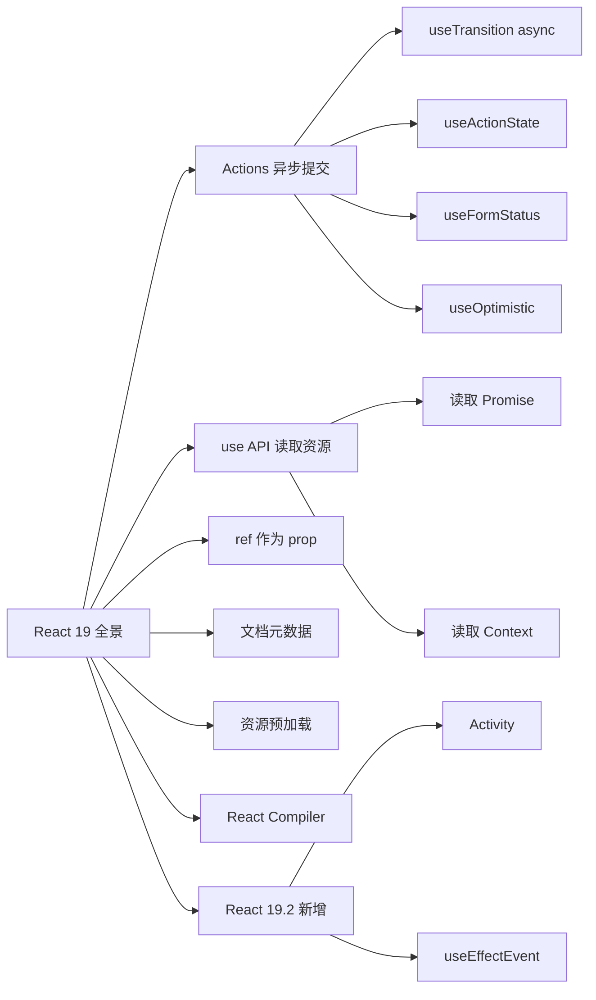
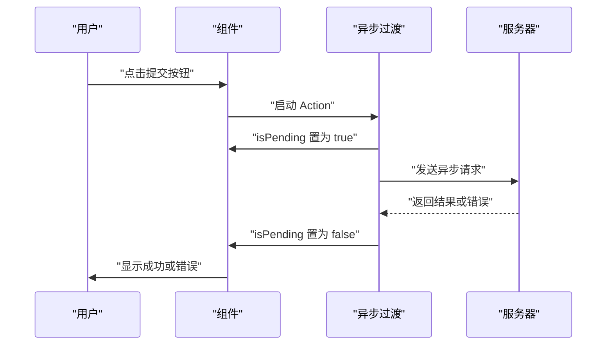
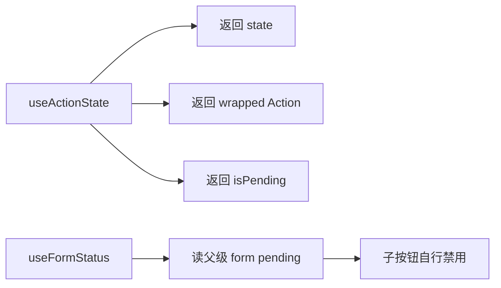
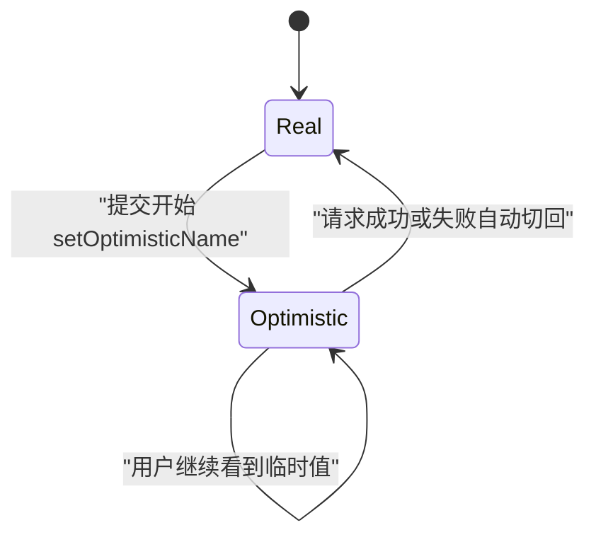
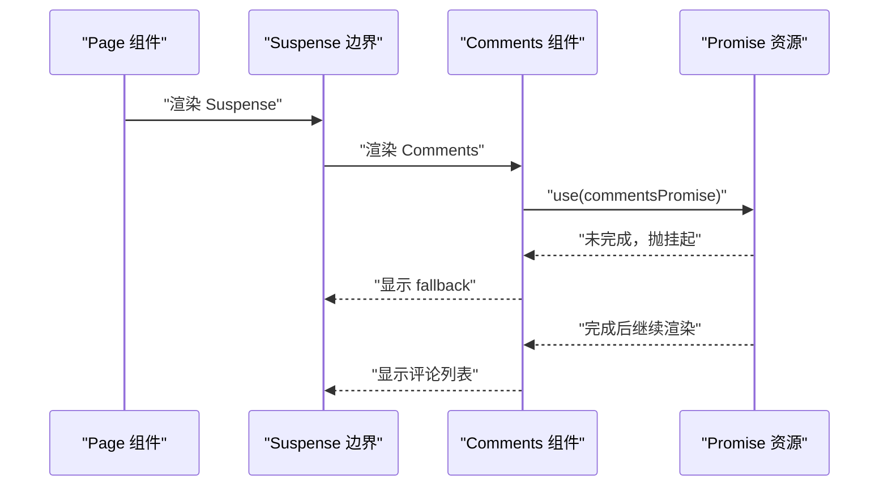
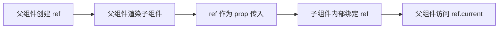
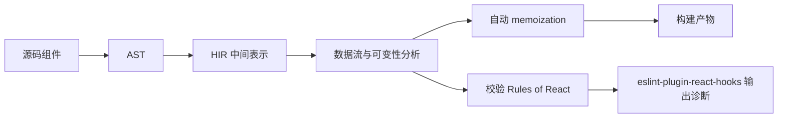
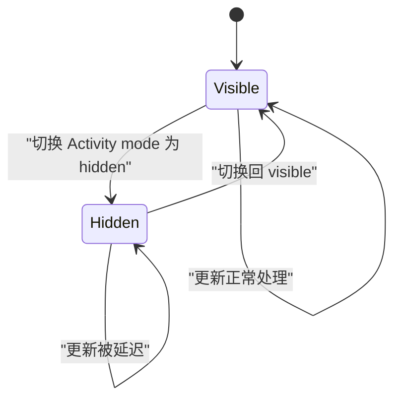

# React 19 全景：一张图看懂新特性与心智模型

!!! abstract "学完这一页你能"

1. 说出 React 19 相对 React 18 的 6 个以上具体差异，并能各举一个业务例子。
2. 用 `useActionState`、`useFormStatus`、`useOptimistic` 写出一个带乐观更新的表单，不手动管理 pending 与 error。
3. 解释 `use` 与 `useContext` 的核心区别，并能说出为什么 `use` 不能在 render 中创建 promise 后直接传给它。
4. 说明 React Compiler、`Activity`、`useEffectEvent` 分别解决什么问题，以及各自不能解决什么问题。

## 0. 知识地图



建议先读 Actions 这一组，因为 `useActionState`、`useFormStatus`、`useOptimistic` 都建立在 Actions 之上。  
然后读 `use`、ref 作为 prop、文档元数据与资源预加载，这些是相对独立的新能力。  
最后读 React Compiler 与 React 19.2 的 `Activity`、`useEffectEvent`，它们改变的是优化方式和副作用组织方式。

## 1. Actions：用异步过渡管理提交

**先想一个问题**

用户提交一个改名表单，你要同时处理“请求中禁用按钮”“请求失败显示错误”“成功后跳转”这三件事。  
以前这三件事都要用多个 `useState` 手动维护，代码容易漏状态。  
React 19 的 Actions 把这组状态收进一个约定里。

**心智模型**

!!! tip "心智模型"

一句话模型：Action 是一段异步函数，React 自动管理它的 pending、错误提交与表单重置。  
日常类比：像在餐厅点餐后，服务员自动帮你跟踪“已下单、制作中、上菜”三态，你不需要自己记。  
类比不成立的地方：服务员不会在制作失败时自动撤销你已经说出口的点单，但 React 会回滚到错误前的状态。

!!! note "术语：Action"

在 React 19 中，使用异步过渡执行的函数按约定称为 Action。  
例子：`startTransition(async () => { await updateName(name); })` 中的异步函数就是 Action。

**图解**



1. 用户在界面里点击提交按钮，组件收到事件。  
2. 组件启动 Action，React 立即把 `isPending` 置为 `true`。  
3. 异步请求在后台发出，期间界面保持可交互。  
4. 请求完成后，React 把 `isPending` 置为 `false`，然后提交最终更新。

**一步一步来**

第一步：用 `useTransition` 包住异步操作，让 React 管理 pending 状态。

```js
import { useState, useTransition } from 'react';

function UpdateName() {
  const [name, setName] = useState('');
  const [error, setError] = useState(null);
  const [isPending, startTransition] = useTransition();

  const handleSubmit = () => {
    startTransition(async () => {
      const error = await updateName(name); // 模拟异步改名请求
      if (error) {
        setError(error); // 失败时写入错误
        return;
      }
      redirect('/path'); // 成功后跳转
    });
  };

  return (
    <div>
      <input value={name} onChange={(event) => setName(event.target.value)} />
      <button onClick={handleSubmit} disabled={isPending}>
        Update
      </button>
      {error && <p>{error}</p>}
    </div>
  );
}
```

**这段代码在做什么**

1. `useTransition` 返回 `isPending` 和 `startTransition`。  
2. `startTransition` 接收一个异步函数，React 会立即置 `isPending` 为 `true`。  
3. 异步函数执行 `await updateName(name)`，期间按钮被禁用。  
4. 失败时调用 `setError` 写入错误消息，成功时执行跳转。  
5. 异步函数结束后，React 自动把 `isPending` 置回 `false`。

运行结果：请求进行中按钮显示禁用态；请求失败后页面显示错误消息；请求成功后执行跳转。

第二步：把 Action 直接传给 `<form>` 的 `action` 属性，自动获得表单重置能力。

```js
function ChangeNameForm() {
  async function submitAction(formData) {
    const name = formData.get('name'); // 从 FormData 读取字段
    const error = await updateName(name);
    return error; // 返回错误值给 Action
  }

  return (
    <form action={submitAction}>
      <input type="text" name="name" />
      <button type="submit">Update</button>
    </form>
  );
}
```

**这段代码在做什么**

1. `<form action={submitAction}>` 把函数直接作为表单提交处理器。  
2. React 会把表单数据封装为 `FormData`，传给 `submitAction`。  
3. Action 返回的错误值可以交给上层状态处理。  
4. 当 Action 成功提交后，React 自动重置非受控表单字段。

运行结果：表单提交后输入框自动清空，不再需要手动写 `setName('')`。

**动手验证**

保存为 `actions-node-demo.mjs`，需要安装 `react`、`react-dom`、`jsdom`。  
用 `node actions-node-demo.mjs` 运行。

```js
import { JSDOM } from 'jsdom';
import { createRoot } from 'react-dom/client';
import { act } from 'react';
import { useState, useTransition } from 'react';

const dom = new JSDOM('<!doctype html><html><body></body></html>');
globalThis.window = dom.window;
globalThis.document = dom.window.document;

function Demo() {
  const [isPending, startTransition] = useTransition();
  const [result, setResult] = useState('');
  const run = () => {
    startTransition(async () => {
      await new Promise((resolve) => setTimeout(resolve, 10));
      setResult('done');
    });
  };
  return { isPending, result, run };
}

let current;
function Test() {
  const { isPending, result, run } = Demo();
  current = { isPending, result, run };
  return null;
}

await act(async () => {
  createRoot(document.body).render(<Test />);
});
await act(async () => {
  current.run();
});
console.log('pending after start =', current.isPending);
await act(async () => {
  await new Promise((resolve) => setTimeout(resolve, 20));
});
console.log('result after finish =', current.result);
import assert from 'node:assert';
assert.equal(current.result, 'done');
```

预期输出：`pending after start = true`，然后 `result after finish = done`，断言通过。

**常见坑**

| 现象 | 原因 | 怎么修 |
| --- | --- | --- |
| 异步函数执行后界面没有更新 | 没有在 `startTransition` 内执行异步操作 | 把异步函数整个传入 `startTransition` |
| 表单提交后输入框不重置 | 表单字段是受控组件，React 只自动重置非受控字段 | 保留受控状态并手动重置，或改用非受控字段 |
| 错误消息一闪而过 | Action 返回的错误没有写入状态 | 在 Action 内调用 `setError` 或返回错误值并接住 |

**用在哪里**

1. 业务背景：用户中心改名表单。  
   怎么用：用 `<form action>` 替代手写 `onClick` 提交。  
   指标：提交处理代码行数减少。  
   不该用：表单只做纯前端校验且永远不发请求。

2. 业务背景：电商后台的批量导入。  
   怎么用：用 Action 包装导入请求，自动获得 pending 状态。  
   指标：用户看到按钮禁用态的时间点更及时。  
   不该用：导入任务由 WebSocket 持续推送进度，不用 Action。

3. 业务背景：CRM 里的客户信息更新。  
   怎么用：把更新请求放进 `startTransition`，避免阻塞输入框。  
   指标：输入框在请求期间保持可输入。  
   不该用：更新结果必须同步阻塞后续操作时，不用异步过渡。

4. 业务背景：在线教育平台的作业提交。  
   怎么用：用 Action 提交作业表单，失败时保留已填内容。  
   指标：失败后用户不需要重新填写整张表单。  
   不该用：表单需要多步骤复杂校验还带文件上传进度时，Action 只负责提交状态。

**行业实践**

1. React 官方文档在介绍 Actions 时，要求把异步函数放进 `startTransition`，而不是单独调用。出处：React 官方博客《React 19 is now stable》Actions 一节。  
   怎么借鉴：项目中所有数据变更一律先包一层 `startTransition`，再决定是否抽成表单 Action。

2. React 官方指出 `<form>` 的 `action` 属性支持传函数，成功提交后重置非受控表单。出处：React 官方文档 react-dom 表单部分。  
   怎么借鉴：优先用非受控表单字段，减少手动重置代码。

3. React 官方在 Actions 约定里明确“pending 状态从请求开始自动出现，最终状态提交后自动复位”。出处：React 官方博客同节。  
   怎么借鉴：不要在 Action 外再复制一套 `isLoading` 状态。

**小结**

1. Actions 统一管理 pending、错误与表单重置。  
2. `startTransition` 可以接收异步函数。  
3. `<form action>` 让表单提交直接使用 Action。

## 2. useActionState 与 useFormStatus：表单状态自动化

**先想一个问题**

你有多个表单组件，每个都要读取“这个表单是否正在提交”。  
如果通过 props 层层传递 `isPending`，组件树一深就难维护。  
React 19 提供 `useActionState` 和 `useFormStatus` 来收拢这两个需求。

**心智模型**

!!! tip "心智模型"

一句话模型：`useActionState` 把 Action 的返回值与 pending 状态绑在一起；`useFormStatus` 让子组件从“上下文”里读表单状态。  
日常类比：像公司报销单，每个审批节点不用私聊问申请人，直接在系统里看公用的审批状态。  
类比不成立的地方：公司系统可能缓存旧状态，而 React 的 `useFormStatus` 总是读父级表单的最新提交状态。

!!! note "术语：FormData"

`FormData` 是浏览器 API，用键值对保存表单字段。  
例子：`formData.get('name')` 取出名为 `name` 的输入值。

**图解**



1. `useActionState` 接收一个 Action 与初始状态。  
2. 它返回当前状态、包装后的 Action、pending 布尔值。  
3. 调用包装后的 Action 时，React 自动维护 pending 与返回值。  
4. `useFormStatus` 只在 `<form>` 子树内有效，读取父级表单的 pending。

**一步一步来**

第一步：用 `useActionState` 管理改名表单的错误与 pending。

```js
import { useActionState } from 'react';

function ChangeName({ name, setName }) {
  const [error, submitAction, isPending] = useActionState(
    async (previousState, formData) => {
      const error = await updateName(formData.get('name')); // 模拟改名
      if (error) {
        return error; // 返回错误，成为新的 state
      }
      redirect('/path');
      return null; // 成功返回 null
    },
    null
  );

  return (
    <form action={submitAction}>
      <input type="text" name="name" />
      <button type="submit" disabled={isPending}>Update</button>
      {error && <p>{error}</p>}
    </form>
  );
}
```

**这段代码在做什么**

1. `useActionState` 的第一个参数是异步 Action，第二个参数是初始状态 `null`。  
2. Action 收到 `previousState` 和 `formData`，返回错误值或 `null`。  
3. 返回的错误值会成为下一次的 `error`。  
4. 包装后的 `submitAction` 可以直接传给 `<form action>`。  
5. `isPending` 自动变成按钮的 `disabled` 值。

运行结果：表单提交期间按钮禁用；请求失败时下方显示错误消息。

第二步：用 `useFormStatus` 让按钮自己读表单状态，不依赖 props。

```js
import { useFormStatus } from 'react-dom';

function DesignButton() {
  const { pending } = useFormStatus();
  return <button type="submit" disabled={pending} />;
}

function App() {
  return (
    <form action={submitAction}>
      <input type="text" name="name" />
      <DesignButton />
    </form>
  );
}
```

**这段代码在做什么**

1. `useFormStatus` 从 `react-dom` 导入。  
2. 它在 `DesignButton` 内读取父级 `<form>` 的 pending 状态。  
3. 按钮用 `pending` 控制自己的禁用态。  
4. 不需要从 `App` 向下传 `isPending` 这个 prop。

运行结果：按钮在表单提交期间自动禁用，提交结束后自动恢复。

**动手验证**

保存为 `use-action-state-demo.mjs`，依赖 `react`、`react-dom`、`jsdom`。

```js
import { JSDOM } from 'jsdom';
import { createRoot } from 'react-dom/client';
import { act } from 'react';
import { useActionState } from 'react';

const dom = new JSDOM('<!doctype html><html><body></body></html>');
globalThis.window = dom.window;
globalThis.document = dom.window.document;

function Demo() {
  const [state, submitAction, isPending] = useActionState(async (prev, formData) => {
    const name = formData.get('name');
    if (!name) return 'name required';
    return null;
  }, null);
  return { state, submitAction, isPending };
}

let current;
function Test() {
  current = Demo();
  return null;
}

await act(async () => {
  createRoot(document.body).render(<Test />);
});
await act(async () => {
  const fd = new FormData();
  await current.submitAction(fd);
});
console.log('state =', current.state);
import assert from 'node:assert';
assert.equal(current.state, 'name required');
```

预期输出：`state = name required`，断言通过。

**常见坑**

| 现象 | 原因 | 怎么修 |
| --- | --- | --- |
| `useFormStatus` 一直读取不到 pending | 用了它的组件不在 `<form>` 子树内 | 把组件移到 `<form>` 内部 |
| `useActionState` 返回值不更新 | 在 Action 外直接改 state | 让 Action 的返回值作为新 state |
| 初始 state 类型与返回值不一致 | 初始给 `null`，Action 返回对象 | 统一初始值与返回值的类型 |

**用在哪里**

1. 业务背景：后台管理的批量导入表单。  
   怎么用：`useActionState` 管理导入结果错误，`useFormStatus` 让提交按钮自己禁用。  
   指标：不需要从页面往下传 pending prop。  
   不该用：表单很小且只有一处提交时，两个 API 会增加抽象。

2. 业务背景：电商购物车结算页。  
   怎么用：`useActionState` 管理结算请求错误，提交期间禁用按钮。  
   指标：按钮禁用态在多组件间保持一致。  
   不该用：结算按钮本身就独立于表单时不需 `useFormStatus`。

3. 业务背景：在线问卷的逐题提交。  
   怎么用：每道题用 `<form action>`，`useActionState` 管错误。  
   指标：单题提交失败后错误精确显示在题下。  
   不该用：需要统一汇总所有题目答案后再提交的场景。

4. 业务背景：SaaS 后台的成员邀请表单。  
   怎么用：`useFormStatus` 让“发送邀请”按钮在提交时显示禁用。  
   指标：减少重复点击造成的多次请求。  
   不该用：邀请按钮需要展示自定义 loading 动画时，`useFormStatus` 只给布尔值。

**行业实践**

1. React 官方文档说明 `useFormStatus` 是为了避免把 pending props 钻透组件树，它像把 `<form>` 作为 Context provider。出处：React 官方文档 react-dom 部分。  
   怎么借鉴：凡是要读父级表单状态的子组件，优先用 `useFormStatus` 而不是 props。

2. React 官方博客提到 `useActionState` 的前身是 Canary 里的 `useFormState`，后来改名并弃用旧名。出处：React 官方博客《React 19 is now stable》。  
   怎么借鉴：新项目直接用 `useActionState`，不要再用 `useFormState`。

3. React 官方示例把 `useActionState` 的返回值直接解构为 `[error, submitAction, isPending]`。出处：React 官方博客同节。  
   怎么借鉴：保持这个解构顺序，方便团队统一理解。

**小结**

1. `useActionState` 把 Action 反馈和 pending 收在一起。  
2. `useFormStatus` 让子组件从表单上下文读取状态。  
3. 两者配合可以减少表单状态管理的样板代码。

## 3. useOptimistic：乐观更新

**先想一个问题**

用户提交评论后，等服务器返回成功前，页面先别显示新评论。  
这种“先假装成功，失败再回滚”的体验需要手动写临时状态，容易和真实状态不同步。  
React 19 的 `useOptimistic` 专管这个临时状态。

**心智模型**

!!! tip "心智模型"

一句话模型：`useOptimistic` 在请求进行中临时显示预期结果，请求结束或失败后自动切回真实结果。  
日常类比：像你发微信消息，输入框立即显示消息，旁边有个“发送中”，失败后消息标红。  
类比不成立的地方：微信失败后消息还在输入框，而 `useOptimistic` 会自动把显示值回滚到服务端认可的值。

!!! note "术语：乐观更新"

乐观更新是先在界面展示用户期望的结果，再等待服务端确认的数据更新策略。  
例子：提交评论后立即把评论插入列表，服务端失败后再移除。

**图解**



1. 初始状态是真实数据 `Real`。  
2. 提交开始时，`useOptimistic` 把显示值切换为乐观值 `Optimistic`。  
3. 请求进行中，界面持续显示乐观值。  
4. 请求结束或失败，React 自动切回真实值 `Real`。

**一步一步来**

第一步：用 `useOptimistic` 包装当前名字，提交时先显示新名字。

```js
import { useOptimistic } from 'react';

function ChangeName({ currentName, onUpdateName }) {
  const [optimisticName, setOptimisticName] = useOptimistic(currentName);

  const submitAction = async (formData) => {
    const newName = formData.get('name');
    setOptimisticName(newName); // 先显示新名字
    const updatedName = await updateName(newName);
    onUpdateName(updatedName); // 成功后更新真实值
  };

  return (
    <form action={submitAction}>
      <p>Your name is: {optimisticName}</p>
      <input type="text" name="name" disabled={currentName !== optimisticName} />
    </form>
  );
}
```

**这段代码在做什么**

1. `useOptimistic(currentName)` 返回乐观值和设置乐观值的函数。  
2. 请求发出前调用 `setOptimisticName(newName)`，界面立即显示新名字。  
3. 请求成功后调用 `onUpdateName(updatedName)`，父组件更新真实名字。  
4. 请求失败时，React 自动把乐观值回滚到 `currentName`。  
5. 输入框在 `currentName !== optimisticName` 时禁用，避免重复修改。

运行结果：提交瞬间显示新名字；失败后自动变回旧名字。

第二步：在列表场景中乐观插入新评论，失败时自动移除。

```js
import { useOptimistic } from 'react';

function CommentList({ comments, onAddComment }) {
  const [optimisticComments, setOptimisticComments] = useOptimistic(comments);

  async function submitComment(text) {
    const newComment = { id: Date.now(), text };
    setOptimisticComments([...optimisticComments, newComment]);
    await onAddComment(newComment);
  }

  return optimisticComments.map((c) => <p key={c.id}>{c.text}</p>);
}
```

**这段代码在做什么**

1. 初始乐观列表等于真实列表 `comments`。  
2. 提交新评论前，把新评论临时插进乐观列表。  
3. 列表立即渲染出包含新评论的数据。  
4. 服务端写入失败后，乐观列表自动回到真实列表。  
5. `onAddComment` 必须负责更新真实数据，成功后两个列表一致。

运行结果：评论发出后立即显示，失败后消失。

**动手验证**

保存为 `use-optimistic-demo.mjs`，依赖 `react`、`react-dom`、`jsdom`。

```js
import { JSDOM } from 'jsdom';
import { createRoot } from 'react-dom/client';
import { act } from 'react';
import { useOptimistic } from 'react';

const dom = new JSDOM('<!doctype html><html><body></body></html>');
globalThis.window = dom.window;
globalThis.document = dom.window.document;

function Demo() {
  const [items, setItems] = useOptimistic(['a']);
  return { items, add: (v) => setItems([...items, v]) };
}

let current;
function Test() {
  current = Demo();
  return null;
}

await act(async () => {
  createRoot(document.body).render(<Test />);
});
await act(async () => {
  current.add('b');
});
console.log('items =', current.items);
import assert from 'node:assert';
assert.deepEqual(current.items, ['a', 'b']);
```

预期输出：`items = [ 'a', 'b' ]`，断言通过。

**常见坑**

| 现象 | 原因 | 怎么修 |
| --- | --- | --- |
| 乐观值一直不回到真实值 | 真实数据没有在请求成功后更新 | 确保 `onUpdateName` 收到服务端结果后更新 state |
| 禁用输入框的判断写反 | 把 `currentName !== optimisticName` 误写成 `===` | 请求期间两者不同，应该禁用 |
| 列表顺序在乐观更新时错乱 | 直接用 `push` 修改原数组 | 用展开运算符创建新数组 |

**用在哪里**

1. 业务背景：电商商品列表的收藏按钮。  
   怎么用：点击收藏立即显示已收藏，失败后自动取消。  
   指标：用户感知响应时间接近 0 毫秒。  
   不该用：收藏状态有强一致校验且错误率高的场景。

2. 业务背景：社交软件评论发布。  
   怎么用：评论发出后立刻出现在列表顶部。  
   指标：评论框到内容上屏的间隔缩短。  
   不该用：评论必须经过内容审核才能公开时不宜立即显示。

3. 业务背景：后台管理的批量导入。  
   怎么用：先显示“导入中共 N 条”，失败后回滚计数。  
   指标：用户不用等待计数接口返回。  
   不该用：导入进度必须由服务端逐步推送时，乐观计数会造成偏差。

4. 业务背景：在线文档标题重命名。  
   怎么用：改标题后立即显示新名字，失败后恢复原标题。  
   指标：连续编辑标题时不出现旧标题闪烁。  
   不该用：标题有全局唯一性校验且失败率较高的场景。

**行业实践**

1. React 官方文档在 `useOptimistic` 部分演示了改名例子，强调更新结束或出错时 React 自动切回 `currentName`。出处：React 官方文档 `useOptimistic` 章节。  
   怎么借鉴：项目中乐观值只作为显示层状态，真实状态仍由服务端结果驱动。

2. React 官方博客把 `useOptimistic` 放在 Actions 之上，要求配合异步 Action 使用。出处：React 官方博客《React 19 is now stable》。  
   怎么借鉴：不要在同步事件里单独维护乐观值，把它放进 Action 流程。

3. React 官方示例用 `disabled={currentName !== optimisticName}` 防止提交期间二次修改。出处：React 官方文档 `useOptimistic` 章节。  
   怎么借鉴：乐观更新期间锁定编辑入口，避免状态竞争。

**小结**

1. `useOptimistic` 专门管理“先显示后确认”的临时状态。  
2. 成功或失败后 React 自动切回真实值。  
3. 适合列表插入、改名、收藏等可回滚的数据变更。

## 4. use：在 render 中读取资源

**先想一个问题**

组件要等一个 promise 返回数据，但你又不想手动写 `useEffect` 去订阅、存 state。  
以前这需要 `useState` 加 `useEffect` 加清理函数。  
React 19 的 `use` 可以直接在 render 中读取 promise 或 Context。

**心智模型**

!!! tip "心智模型"

一句话模型：`use` 在 render 中读取 promise 或 Context，遇到 promise 未完成时暂停当前组件，完成后继续。  
日常类比：像餐厅后厨取菜，菜没做好就在窗口等，做好了拿走，不打断其他菜。  
类比不成立的地方：厨师不会因为你等太久而报错，但 React Suspense 会因为超时或边界缺失而抛错。

!!! note "术语：Suspense"

`Suspense` 是 React 组件，用于接住子组件在 render 中抛出的“等待”请求，显示 fallback。  
例子：`<Suspense fallback={<div>Loading...</div>}>` 包住会暂停的子组件。

**图解**



1. `Page` 渲染 `Suspense` 边界，fallback 设为 `Loading...`。  
2. `Comments` 内部调用 `use(commentsPromise)`。  
3. promise 未完成时，`use` 通知 Suspense 显示 fallback。  
4. promise 完成后，React 重新渲染 `Comments`，显示真实数据。

**一步一步来**

第一步：用 `use` 读取 promise，让组件在数据未到时挂起。

```js
import { use, Suspense } from 'react';

function Comments({ commentsPromise }) {
  const comments = use(commentsPromise); // 读取 promise 结果
  return comments.map((comment) => <p key={comment.id}>{comment}</p>);
}

function Page({ commentsPromise }) {
  return (
    <Suspense fallback={<div>Loading...</div>}>
      <Comments commentsPromise={commentsPromise} />
    </Suspense>
  );
}
```

**这段代码在做什么**

1. `use(commentsPromise)` 接收外部传入的 promise。  
2. promise 未完成时，`use` 暂停 `Comments` 组件。  
3. `Suspense` 捕获挂起信号，渲染 fallback。  
4. promise 完成后，`Comments` 重新渲染，`use` 返回结果。  
5. promise 需要来自 Suspense 兼容的缓存层，不能在 render 中现创建。

运行结果：页面先显示 `Loading...`，数据到达后显示评论列表。

第二步：用 `use` 读取 Context，实现条件读取。

```js
import { use } from 'react';
import ThemeContext from './ThemeContext';

function Heading({ children }) {
  if (children == null) {
    return null; // 提前返回后仍可读 Context
  }

  const theme = use(ThemeContext); // 条件读取 Context
  return <h1 style={{ color: theme.color }}>{children}</h1>;
}
```

**这段代码在做什么**

1. `Heading` 在提前返回之后才调用 `use(ThemeContext)`。  
2. `useContext` 不能在提前返回后调用，但 `use` 可以条件调用。  
3. `use` 只能出现在 render 阶段，类似 hook。  
4. 本例展示 `use` 对 Context 的读取不再受“必须顶层调用”限制。

运行结果：`children` 为 `null` 时不读取 Context；否则用主题颜色渲染标题。

**动手验证**

保存为 `use-demo.mjs`，依赖 `react`、`react-dom`、`react-dom/server`。  
用 `react-dom/server` 渲染静态组件，不涉及真实 Suspense 的异步等待。

```js
import { use } from 'react';
import { renderToString } from 'react-dom/server';
import assert from 'node:assert';

const ThemeContext = { color: 'red' };
function Heading({ children }) {
  if (children == null) return null;
  const theme = use(ThemeContext); // 这里 use 读取 Context
  return `<h1 style="color:${theme.color}">${children}</h1>`;
}

const html = renderToString(<Heading>Hello</Heading>);
console.log('html =', html);
assert.ok(html.includes('color:red'));
assert.ok(html.includes('Hello'));
```

预期输出：`html = <h1 style="color:red">Hello</h1>`，断言通过。

**常见坑**

| 现象 | 原因 | 怎么修 |
| --- | --- | --- |
| 控制台警告“uncached promise” | promise 在 render 中创建后直接传给 `use` | 从 Suspense 兼容库或框架获取缓存的 promise |
| `use` 读取 Context 时报错 | 在非 render 阶段调用 `use` | 把 `use` 放进组件或 hook 的 render 路径 |
| 提前返回后读 Context 失败 | 使用 `useContext` 而不是 `use` | 改用 `use(ThemeContext)` 读取 |

**用在哪里**

1. 业务背景：博客文章详情的异步加载。  
   怎么用：把请求 promise 传进详情组件，用 `use` 读取并挂起。  
   指标：去掉详情组件内的 `useEffect` 加载逻辑。  
   不该用：请求必须在交互后才发出的场景。

2. 业务背景：电商商品列表的筛选面板。  
   怎么用：用 `use` 读筛选器 Context，允许条件渲染后读取。  
   指标：早期返回的占位组件也能拿到主题。  
   不该用：高阶组件已经用 props 透传 Context 值时可保持原样。

3. 业务背景：后台管理的路由页数据。  
   怎么用：路由层提供 promise，页面组件用 `use` 读取。  
   指标：数据加载状态由 Suspense 统一处理。  
   不该用：路由库尚不支持把 promise 传给 `use` 时需核对框架兼容性。

4. 业务背景：在线表格的单元格数据。  
   怎么用：每个单元格用 `use` 读取缓存数据源，挂起时显示骨架。  
   指标：单元格级加载粒度更细。  
   不该用：大量单元格各自挂起会造成边界过多，需权衡。

**行业实践**

1. React 官方博客明确说明 `use` 不支持 render 中创建的 promise，必须从 Suspense 兼容库或框架获取缓存 promise。出处：React 官方博客《React 19 is now stable》`use` 一节。  
   怎么借鉴：项目里 promise 统一由框架数据层缓存，组件内禁止 `new Promise`。

2. React 官方示例用 `use` 读取 Context 实现提前返回后的条件读取。出处：React 官方文档 `use` 章节。  
   怎么借鉴：涉及提前返回的组件改用 `use`，避免 `useContext` 限制。

3. React 官方说明 `use` 未来会支持更多 render 中读取资源的方式。出处：React 官方博客同节。  
   怎么借鉴：现在只把 `use` 用于 promise 和 Context，不要自行扩展语义。

**小结**

1. `use` 在 render 中读取 promise 或 Context。  
2. 它和 hook 相似但可以条件调用。  
3. 传入 `use` 的 promise 必须来自外部缓存，不能 render 中创建。

## 5. ref 作为 prop 与文档元数据

**先想一个问题**

你想给子组件传一个 `ref`，让父组件能拿到子组件的 DOM 节点。  
以前子组件必须用 `forwardRef` 包一层，还要管理 displayName。  
React 19 把 `ref` 当成普通 prop，不再需要 `forwardRef`。

**心智模型**

!!! tip "心智模型"

一句话模型：React 19 中 `ref` 是普通 prop，父组件传给子组件，子组件直接接收。  
日常类比：像邮件抄送，收件人直接看到抄送名单，不需要专门的转发信封。  
类比不成立的地方：邮件不会因为抄送名单改变而重新投递，但 `ref` 变化会触发子组件重新渲染。

!!! note "术语：ref"

`ref` 是 React 用来访问 DOM 节点或组件实例的引用对象。  
例子：`<input ref={inputRef} />` 之后 `inputRef.current` 指向该输入框。

**图解**



1. 父组件用 `useRef` 创建一个 ref。  
2. 父组件把这个 ref 作为 prop 传给子组件。  
3. 子组件内部把 ref 绑定到具体 DOM 元素。  
4. 渲染后父组件通过 `ref.current` 访问 DOM 节点。

**一步一步来**

第一步：父组件把 `ref` 作为普通 prop 传给子组件。

```js
function App() {
  const inputRef = useRef(null); // 创建 ref
  return <InputBox ref={inputRef} />; // ref 作为 prop
}

function InputBox({ ref }) {
  return <input ref={ref} />; // 子组件直接使用 prop
}
```

**这段代码在做什么**

1. `App` 创建 `inputRef`。  
2. `ref={inputRef}` 把 ref 作为普通 prop 传入 `InputBox`。  
3. `InputBox` 从 props 里解构出 `ref`。  
4. 把 `ref` 绑定到 `<input>` 上。  
5. React 19 不再要求 `forwardRef` 包裹。

运行结果：父组件可以读取子组件内部输入框的 DOM 引用。

第二步：文档元数据放在组件树里，React 自动提升到 `<head>`。

```js
function BlogPost({ title }) {
  return (
    <article>
      <title>{title}</title> // 文档元数据标签
      <meta name="author" content="Jane" />
      <h1>{title}</h1>
    </article>
  );
}
```

**这段代码在做什么**

1. `<title>` 和 `<meta>` 写在组件树内部。  
2. React 19 会把文档元数据标签自动提升到 `<head>`。  
3. 资料未覆盖：提升的具体条件与去重规则需核对官方文档。  
4. 这让文档元数据提升成为 React DOM 内置能力。

运行结果：浏览器标签页标题显示 `title`，元数据进入 `<head>`。

**动手验证**

保存为 `ref-demo.mjs`，依赖 `react`、`react-dom`、`jsdom`。

```js
import { JSDOM } from 'jsdom';
import { createRoot } from 'react-dom/client';
import { useRef } from 'react';

const dom = new JSDOM('<!doctype html><html><body></body></html>');
globalThis.window = dom.window;
globalThis.document = dom.window.document;

function InputBox({ ref }) {
  return <input ref={ref} data-testid="input" />;
}

function App() {
  const inputRef = useRef(null);
  return <InputBox ref={inputRef} />;
}

let root;
await new Promise((resolve) => {
  root = createRoot(document.body);
  root.render(<App />);
  setTimeout(resolve, 20);
});
const input = document.body.querySelector('[data-testid=input]');
import assert from 'node:assert';
assert.ok(input);
console.log('input found =', !!input);
```

预期输出：`input found = true`，断言通过。

**常见坑**

| 现象 | 原因 | 怎么修 |
| --- | --- | --- |
| 子组件收不到 `ref` | 子组件还写着 `forwardRef` 或没从 props 解构 `ref` | React 19 直接解构 `ref` prop |
| 文档元数据没进入 `<head>` | 使用了老版本 React DOM | 核对 React DOM 19 是否安装 |
| `ref.current` 为 `null` | 子组件内部没把 `ref` 绑定到真实 DOM | 检查内部元素是否写了 `ref={ref}` |

**用在哪里**

1. 业务背景：电商商品详情页的标题和 SEO 元数据。  
   怎么用：在组件树里直接写 `<title>` 和 `<meta>`。  
   指标：SEO 标签与商品内容同组件维护，不一致概率降低。  
   不该用：需要复杂服务端渲染注入的复杂 SEO 策略，需核对框架支持。

2. 业务背景：后台管理的表单输入框聚焦。  
   怎么用：父组件通过 ref 直接聚焦子组件输入框。  
   指标：聚焦逻辑减少一层 `forwardRef` 包装。  
   不该用：子组件内部有多个输入框时，单个 ref 不够用。

3. 业务背景：在线文档的编辑器工具栏。  
   怎么用：工具栏通过 ref 访问编辑器 DOM 进行选区操作。  
   指标：组件层级更浅。  
   不该用：编辑器由第三方库封装且不暴露 DOM ref 时。

4. 业务背景：营销落地页的分享卡片。  
   怎么用：文档元数据随分享卡片动态更新标题。  
   指标：滚动到不同卡片时标题同步更新。  
   不该用：需要精细控制多个 meta 标签覆盖顺序时，需核对官方行为。

**行业实践**

1. React 官方发布说明把“ref 作为 prop”列为 React 19 的变更之一，不再需要 `forwardRef`。出处：React 官方升级指南中关于 ref 的变更段落。  
   怎么借鉴：新组件直接接收 `ref` prop，老组件在迁移时逐步删掉 `forwardRef`。

2. React 官方文档提到文档元数据标签现在可以写在组件树内。出处：React 官方文档 react-dom 元数据部分。  
   怎么借鉴：页面标题与 meta 放入对应页面组件，不再手动 `document.title`。

3. React 官方强调 `ref` 现在是普通 prop，能与其他 prop 一样传递。出处：React 官方升级指南。  
   怎么借鉴：团队代码评审不再要求 `forwardRef`，但需保证子组件内部正确绑定。

**小结**

1. `ref` 作为 prop 简化了父子组件间的引用传递。  
2. 文档元数据可写在组件树内并自动提升。  
3. 迁移时逐步移除 `forwardRef` 即可。

## 6. 资源预加载

**先想一个问题**

页面要加载字体、图片或脚本，等到组件渲染时才发起请求，首屏常出现延迟。  
React 19 提供资源预加载能力，让关键资源提前开始加载。  
资料未覆盖：预加载 API 的具体名称与签名需核对官方文档。

**心智模型**

!!! tip "心智模型"

一句话模型：资源预加载在组件渲染前或渲染早期就发起网络请求，减少后续渲染的等待。  
日常类比：像预订餐厅时提前点好招牌菜，人到即可上桌。  
类比不成立的地方：餐厅可以预留食材，但网络资源加载还要看缓存与 CDN 策略，预加载不保证必命中。

!!! note "术语：预加载"

预加载是浏览器提前拉取未来可能用到的资源的机制。  
例子：`<link rel="preload" href="font.woff2" as="font">`。

**图解**


1. 组件声明需要某资源。  
2. React 在渲染前或渲染早期发起预加载。  
3. 资源在后台下载。  
4. 组件实际渲染时，资源可能已可用。  
5. 用户等待时间降低。

**一步一步来**

第一步：声明资源预加载入口。

```js
// 资料未覆盖：具体 API 名称需核对官方文档
function Page() {
  preload('/fonts/body.woff2', { as: 'font' });
  return <div>Page content</div>;
}
```

**这段代码在做什么**

1. 代码示意一个预加载调用，具体 API 名称资料未覆盖。  
2. 参数包含资源路径与资源类型。  
3. 该调用告诉 React 提前拉取字体资源。  
4. React DOM 会生成对应的预加载标签或请求。

运行结果：资源在组件渲染早期进入加载队列。

第二步：配合 Suspense 让组件等资源就绪。

```js
function Loading() {
  return <div>Loading resource...</div>;
}

function ResourceView({ resourcePromise }) {
  const resource = use(resourcePromise); // 读取已预加载的资源
  return ;
}
```

**这段代码在做什么**

1. `ResourceView` 用 `use` 读取外部缓存的 promise。  
2. 预加载的资源 promise 提前开始请求。  
3. 组件挂起时显示 `Loading` fallback。  
4. 资源就绪后渲染图片。

运行结果：图片加载等待时间缩短，页面先显示 loading 再显示图片。

**动手验证**

保存为 `preload-demo.mjs`，依赖 `react`、`react-dom/server`。  
预加载的具体 API 资料未覆盖，这里用 Node 断言模拟资源队列行为。

```js
import assert from 'node:assert';

const queue = [];
function preload(url, options) {
  queue.push({ url, options });
}
preload('/fonts/body.woff2', { as: 'font' });
console.log('queue =', queue);
assert.equal(queue.length, 1);
assert.equal(queue[0].url, '/fonts/body.woff2');
assert.equal(queue[0].options.as, 'font');
```

预期输出：`queue = [ { url: '/fonts/body.woff2', options: { as: 'font' } } ]`，断言通过。

**常见坑**

| 现象 | 原因 | 怎么修 |
| --- | --- | --- |
| 预加载没生效 | 具体 API 名称或用法不对 | 核对 React 19 官方文档资源预加载章节 |
| 预加载资源未命中缓存 | 资源 URL 与实际请求不同 | 统一 URL 生产规则 |
| 预加载过多拖慢首屏 | 预加载资源数量过大 | 只预加载首屏关键资源 |

**用在哪里**

1. 业务背景：营销落地页首屏大图为 WebP 格式。  
   怎么用：必要时预加载首屏大图资源。  
   指标：图片可见时间提前。  
   不该用：图片在首屏视口之外时无需预加载。

2. 业务背景：在线文档的章节切换需要中文字体。  
   怎么用：进入文档前预加载字体文件。  
   指标：字体切换不再闪动。  
   不该用：用户可离线编辑且字体已本地缓存时。

3. 业务背景：微前端子应用的 JS bundle。  
   怎么用：在主应用里预加载将要进入的子应用脚本。  
   指标：子应用加载耗时下降。  
   不该用：子应用 bundle 过大且版本频繁变化时需权衡缓存命中率。

4. 业务背景：视频网站的播放器组件。  
   怎么用：预加载播放器核心脚本。  
   指标：点击播放到画面出现的间隔缩短。  
   不该用：自动播放策略限制了资源优先级时需核对浏览器行为。

**行业实践**

1. React 官方博客将资源预加载作为 React 19 新增能力列入，目标是在渲染前开始加载资源。出处：React 官方升级指南资源预加载部分。  
   怎么借鉴：在项目关键组件中声明资源，而不是在 `useEffect` 里手动创建 link 标签。

2. React 官方文档说明预加载与 Suspense 配合时，资源 promise 需要由外部缓存层提供。出处：React 官方文档 Suspense 与预加载章节。  
   怎么借鉴：把资源请求与组件渲染解耦，数据层统一管理 promise。

3. React 官方要求预加载资源时指定正确的 `as` 类型以保证浏览器优先级。出处：React 官方文档 link 预加载章节。  
   怎么借鉴：字体用 `as="font"`，脚本用 `as="script"`，不要省略。

**小结**

1. 资源预加载提前发起关键资源请求。  
2. 与 Suspense 配合可降低组件等待感。  
3. 具体 API 名称资料未覆盖，需核对官方文档。

## 7. React Compiler

**先想一个问题**

组件里有多次 `useMemo` 和 `memo`，你手动写得越多越容易漏优化。  
React Compiler 自动分析组件数据流，生成 memoization，不要求改写组件。  
它是构建期工具，不是运行时功能。

**心智模型**

!!! tip "心智模型"

一句话模型：React Compiler 在构建期自动给组件和 hook 加 memoization，减少手动 `useMemo`。  
日常类比：像代码自动格式化器，你不用逐行调间距，工具帮你统一处理。  
类比不成立的地方：格式化器不改语义，而编译器会改变代码结构，必须通过 Rules of React 校验。

!!! note "术语：memoization"

memoization 是缓存函数计算结果、避免重复计算的技术。  
例子：`useMemo(() => filter(list), [list])` 在 `list` 不变时跳过计算。

**图解**



1. 编译器接收源码 AST。  
2. AST 被转换为 HIR 中间表示。  
3. 编译器分析数据流与可变性。  
4. 自动生成 memoization。  
5. 同时校验 Rules of React，通过 eslint 插件输出诊断。

**一步一步来**

第一步：安装 React Compiler Babel 插件。

```bash
npm install --save-dev --save-exact babel-plugin-react-compiler@latest
```

**这段代码在做什么**

1. 安装最新版 Babel 插件作为开发依赖。  
2. `--save-exact` 锁定具体版本，避免意外升级。  
3. 插件在构建阶段处理 React 组件。  
4. 与 Babel 集成，适合现有 Babel 项目。

运行结果：项目依赖里出现 `babel-plugin-react-compiler`。

第二步：在组件里写条件返回，编译器仍能自动 memoize。

```js
import { use } from 'react';

export default function ThemeProvider(props) {
  if (!props.children) {
    return null; // 条件返回后编译器仍能处理
  }
  const theme = mergeTheme(props.theme, use(ThemeContext)); // 自动 memoize
  return (
    <ThemeContext value={theme}>
      {props.children}
    </ThemeContext>
  );
}
```

**这段代码在做什么**

1. `ThemeProvider` 在条件返回后继续执行。  
2. `mergeTheme` 的返回值会被自动 memoize。  
3. 编译器可处理条件返回后的代码。  
4. 这种模式手动 `useMemo` 无法覆盖，但编译器能处理。

运行结果：构建产物中自动插入 memoization 逻辑，无需手写。

**动手验证**

保存为 `compiler-demo.mjs`，仅用 Node 模拟安装命令结果，不真实编译。

```js
import assert from 'node:assert';

const installCommand = 'npm install --save-dev --save-exact babel-plugin-react-compiler@latest';
assert.ok(installCommand.includes('--save-exact'));
console.log('install command =', installCommand);
```

预期输出：`install command = npm install --save-dev --save-exact babel-plugin-react-compiler@latest`，断言通过。

**常见坑**

| 现象 | 原因 | 怎么修 |
| --- | --- | --- |
| 编译报错提示违反 Rules of React | 组件在条件分支里调用 hook | 先修复 hook 调用顺序，再启用编译器 |
| `useMemo` 没减少 | 编译器版本不支持某些语法 | 查看 React Compiler Playground 对当前语法支持情况 |
| 构建速度变慢 | 编译器增加编译期分析 | 在大型项目的渐进迁移策略下分模块启用 |

**用在哪里**

1. 业务背景：大型电商 App 的商品列表页。  
   怎么用：引入 React Compiler 自动优化列表项。  
   指标：手写 `useMemo` 数量下降。  
   不该用：还不支持某个老语法时，先不上该文件。

2. 业务背景：后台管理系统的大量表格组件。  
   怎么用：编译器自动 memoize 表格列定义。  
   指标：派生数据重复计算减少。  
   不该用：表格列很少且数据量小，收益有限。

3. 业务背景：Design System 组件库的基础组件。  
   怎么用：用编译器统一优化内部 hook。  
   指标：第三方用户无需手动逐个 memo。  
   不该用：组件库需要兼容 React 18 时就先不启用。

4. 业务背景：移动端 React Native 列表。  
   怎么用：React Compiler 同时支持 React 与 React Native。  
   指标：长列表渲染计算减少。  
   不该用：RN 版本过旧时需先核对编译器兼容范围。

**行业实践**

1. React 官方博客宣布 React Compiler 1.0 可用，并说明它通过自动 memoization 优化组件和 hook。出处：React Compiler 官方博客《React Compiler 1.0》。  
   怎么借鉴：把编译器作为标准构建步骤，而不是靠代码评审强制 `useMemo`。

2. React 官方指出编译器实现了 HIR 中间表示，支持条件 memoization。出处：React Compiler 官方博客 Deep Dive。  
   怎么借鉴：在复杂组件里信任编译器处理条件返回后的优化，不用手动拆组件。

3. React 官方提到 eslint-plugin-react-hooks 内置编译器提供的 Rules of React 诊断。出处：React Compiler 官方博客。  
   怎么借鉴：先跑诊断再优化，不用跳过规则检查。

**小结**

1. React Compiler 是构建期自动 memoization 工具。  
2. 它同时校验 Rules of React。  
3. 它支持 React 与 React Native。

## 8. React 19.2 的 Activity 与 useEffectEvent

**先想一个问题**

你要在用户可能访问的 Tab 里预渲染内容，又不想它拖慢当前可见页面。  
同时，`useEffect` 里回调读取最新 props 时，常导致 effect 重跑。  
React 19.2 的 `Activity` 与 `useEffectEvent` 分别解决这两个问题。

**心智模型**

!!! tip "心智模型"

一句话模型：`Activity` 控制子树是否可见并降低隐藏子树更新优先级；`useEffectEvent` 把 effect 里“读最新值”的事件逻辑拆出。  
日常类比：像多开窗口，后台窗口暂停重绘但内容保留，切回来不需要重新加载。  
类比不成立的地方：操作系统后台窗口可能被冻结，但 `Activity` 的 `hidden` 模式只延迟更新，最终仍会运行。

!!! note "术语：Effect Event"

`useEffectEvent` 返回一个只能从 effect 内部调用的事件函数，它始终读取最新 props 和 state。  
例子：`const onConnected = useEffectEvent(() => { showNotification(theme); });`。

**图解**



1. `Activity` 默认是 `visible` 模式，子组件正常渲染。  
2. 切到 `hidden` 后，子组件隐藏，effects 卸载。  
3. `hidden` 模式下更新被延迟到 React 空闲时。  
4. 切回 `visible` 后，effects 重新挂载，更新恢复。

**一步一步来**

第一步：用 `<Activity>` 替代条件渲染，保留隐藏子树状态。

```js
import { Activity } from 'react';

function App({ isVisible }) {
  return (
    <Activity mode={isVisible ? 'visible' : 'hidden'}>
      <Page />
    </Activity>
  );
}
```

**这段代码在做什么**

1. 用 `Activity` 替代原来的 `{isVisible && <Page />}`。  
2. `mode="hidden"` 隐藏子组件并卸载 effects。  
3. 更新被延迟到 React 空闲时处理。  
4. 这可以保存用户离开区域的状态，例如输入框内容。

运行结果：`isVisible` 为 `false` 时，`Page` 内容被隐藏但可保留状态。

第二步：用 `useEffectEvent` 拆分 effect 中的事件回调。

```js
import { useEffect, useEffectEvent } from 'react';

function ChatRoom({ roomId, theme }) {
  const onConnected = useEffectEvent(() => {
    showNotification('Connected!', theme); // 总是读到最新 theme
  });

  useEffect(() => {
    const connection = createConnection(serverUrl, roomId);
    connection.on('connected', () => {
      onConnected(); // effect 内部调用事件
    });
    connection.connect();
    return () => connection.disconnect();
  }, [roomId]); // 不再因 theme 变化重连
}
```

**这段代码在做什么**

1. `useEffectEvent` 返回 `onConnected` 事件函数。  
2. 该函数内部读取 `theme`，且始终看到最新值。  
3. `useEffect` 的依赖数组只写 `roomId`。  
4. 改变 `theme` 不会导致连接重建。  
5. `onConnected` 只能从 effect 内部调用。

运行结果：切换主题不会断开聊天室连接，连接成功时仍显示最新主题。

**动手验证**

保存为 `activity-demo.mjs`，依赖 `react`、`react-dom/server`。  
仅验证 `Activity` 组件的静态渲染输出，不涉及异步更新。

```js
import { Activity } from 'react';
import { renderToString } from 'react-dom/server';
import assert from 'node:assert';

const html = renderToString(
  <Activity mode="hidden">
    <p>Page content</p>
  </Activity>
);
console.log('html =', html);
assert.ok(html.includes('Page content'));
```

预期输出：`html = <p>Page content</p>` 或包含该内容，断言通过。

**常见坑**

| 现象 | 原因 | 怎么修 |
| --- | --- | --- |
| `useEffectEvent` 导致 lint 报错 | 事件函数被放进依赖数组 | 从依赖数组中移除它，并升级 eslint-plugin-react-hooks |
| `Activity` 隐藏后状态丢失 | hidden 模式卸载 effects，但实现在 19.2 中保留 DOM 与 state | 如需完全卸载用条件渲染替代 |
| `Activity` 隐藏子树仍占内存 | hidden 模式只是延迟更新，不会自动释放内存 | 明确不再需要的子树继续用条件渲染移除 |

**用在哪里**

1. 业务背景：移动端 Tab 页面切换。  
   怎么用：把每个 Tab 页放进 `Activity`，离开的 Tab 用 `hidden` 模式。  
   指标：返回 Tab 时滚动位置与输入框内容保持。  
   不该用：Tab 内容很少且需要完全释放内存时，用条件渲染。

2. 业务背景：电商商品列表的预渲染下一屏。  
   怎么用：把前六屏之后的潜在内容放进 `Activity mode="hidden"`。  
   指标：滚动到后续内容时资源已部分就绪。  
   不该用：隐藏内容可能包含复杂动画或计步逻辑时，需评估空载开销。

3. 业务背景：在线教育课程目录的章节切换。  
   怎么用：离开的章节 `hidden` 保存浏览位置。  
   指标：回退到上一章节时不需要重新定位。  
   不该用：章节包含实时互动组件且用户明确关闭后不应继续占用连接。

4. 业务背景：后台管理多标签页。  
   怎么用：用 `Activity` 管理每个标签页的可见性。  
   指标：切换标签页保持表单草稿。  
   不该用：标签页需要主动 push 新数据且后台更新不可延迟时。

**行业实践**

1. React 官方博客说明 `Activity` 支持 `visible` 与 `hidden` 两种模式，并计划未来增加更多模式。出处：React 官方博客《React 19.2》。  
   怎么借鉴：现在只用两种模式，不用自行扩展 mode 值。

2. React 官方文档建议用 `Activity` 作为条件渲染的替代，来保存用户导航离开区域的状态。出处：React 官方文档 Activity 章节。  
   怎么借鉴：把需要保持状态的可切换区域改为 `Activity`，而不是继续用 `&&`。

3. React 官方说明 `useEffectEvent` 必须升级 eslint-plugin-react-hooks 到最新版，保证 lint 不会把它塞进依赖。出处：React 官方博客《React 19.2》。  
   怎么借鉴：启用 `useEffectEvent` 前先升级 lint 插件版本。

**小结**

1. `Activity` 用 `visible` 与 `hidden` 控制子树可见性与优先级。  
2. `useEffectEvent` 拆出 effect 里读最新值的事件逻辑。  
3. 两者都是 React 19.2 新增能力，迁移时先升级 lint 工具。

## 应用地图

| 场景 | 用到本页哪个知识点 | 典型技术选型 | 注意事项 |
| --- | --- | --- | --- |
| 用户改名表单 | Actions、useActionState | `<form action>` + `useActionState` | 非受控字段才能自动重置 |
| 评论发布 | useOptimistic | `useOptimistic` + Action | 失败后要确保真实列表正确回退 |
| 商品详情异步加载 | use | Suspense + 外部缓存 promise | promise 不能 render 中创建 |
| 子组件输入框聚焦 | ref 作为 prop | 直接传 `ref` prop | 子组件内部必须绑定到 DOM |
| 营销页 SEO 标签 | 文档元数据 | 组件树内 `<title>` 与 `<meta>` | 需核对去重与提升规则 |
| 字体与脚本提前加载 | 资源预加载 | React 19 预加载能力 | 只预加载首屏关键资源 |
| 大型列表性能优化 | React Compiler | `babel-plugin-react-compiler` | 先跑 Rules of React 诊断 |
| 多 Tab 状态保持 | Activity | `<Activity mode>` | 隐藏子树不会自动释放内存 |
| 聊天室连接不因主题重连 | useEffectEvent | `useEffectEvent` 拆事件 | 事件函数不得放入依赖数组 |

## 动手作业

目标：写一个“改名表单 + 评论列表”的 React 19 小演示，要求同时使用 `useActionState`、`useFormStatus`、`useOptimistic`。

步骤：

1. 用 `npm create vite@latest` 创建 React 项目，确认 React 依赖为 19 或 19.2。  
2. 用 `useActionState` 实现改名表单，提交失败时显示错误。  
3. 用 `useFormStatus` 让提交按钮在 pending 时禁用。  
4. 用 `useOptimistic` 实现评论发布，失败后自动移除乐观评论。  
5. 运行项目，在浏览器中手动测试改名的成功与失败、评论的成功与失败。

验收标准：

- 改名表单提交期间按钮禁用，失败时出现错误信息，成功后跳转或清空。  
- 评论在提交后立即显示，模拟失败时自动消失。  
- 代码中没有 `useState` 管理 pending，也没有 `forwardRef`。  
- 形成一份迁移清单，列出你从 React 18 迁移到 19 需要改动的 3 处代码。

## 综合对比

| 维度 | React 18 | React 19 / 19.2 |
| --- | --- | --- |
| 异步提交状态 | 手动 `useState` 管理 pending 和 error | Actions 自动管理 |
| 表单状态共享 | 用 Context 或 props 钻进 `useFormStatus` 替代 | 用 `useFormStatus` 读父级表单状态 |
| 乐观更新 | 手写临时 state 与回滚逻辑 | `useOptimistic` 自动回滚 |
| 读取 promise | 需要 `useEffect` 加 state | `use` 直接挂起，配合 Suspense |
| 读取 Context | 必须顶层调用 `useContext` | `use` 可条件读取 |
| ref 传递 | 需要 `forwardRef` | `ref` 作为普通 prop |
| memoization | 手写 `useMemo`、`memo` | React Compiler 自动处理部分场景 |
| 预渲染隐藏子树 | 条件渲染切换 state 丢失 | `Activity` 保留状态并降低更新优先级 |
| effect 内部最新值 | 加入依赖导致效果重跑 | `useEffectEvent` 拆出事件逻辑 |

## 深入阅读与参考

!!! tip "怎么用这些资料"
    先读「官方文档与规范」建立准确的概念，再读「源码与示例」核对细节，最后用「教程、书籍与视频」换一种讲法加深理解。每条都写明了读哪一节、带着什么问题读。

### 官方文档与规范

| 资源 | 为什么读 | 怎么读 |
|---|---|---|
| [React 19 发布博客](https://react.dev/blog/2024/12/05/react-19) | 官方发布说明，一页覆盖本页全部新特性与迁移要点。 | 读 Actions、use、ref 三节，逐个运行示例，整理与 18 的差异表。 |
| [React Compiler 介绍](https://react.dev/learn/react-compiler/introduction) | 编译器启用步骤与收益说明，可直接对照项目落地。 | 按文档在 Vite 启用，用 Profiler 记录开启前后重渲染次数并对比。 |
| [useEffectEvent](https://react.dev/reference/react/useEffectEvent) | Effect 事件回调的正规定义与限制，写法边界最权威。 | 读用法与注意事项，把一处依赖旧值的 useEffect 改写成 useEffectEvent。 |
| [useActionState](https://react.dev/reference/react/useActionState) | Actions 表单状态的核心 API，返回值与 pending 语义都在这。 | 读参数与返回值表，配合 form action 写一个带校验的提交表单。 |
| [use](https://react.dev/reference/react/use) | render 中读 Promise 与 Context 的官方规则，配套 Suspense。 | 读 Caveats 与 Suspense 示例，把一处客户端请求改成 use + 错误边界。 |
| [useOptimistic](https://react.dev/reference/react/useOptimistic) | 乐观更新 API 与回滚时机，免去手写临时状态。 | 读示例后给列表加乐观新增，构造失败场景验证回滚。 |
| [<Activity>](https://react.dev/reference/react/Activity) | React 19.2 的 Activity，控制隐藏子树的状态保留与预渲染。 | 读 mode 取值差异，用 hidden 预渲染一个标签页并观察状态。 |
| [React Compiler v1.0](https://react.dev/blog/2025/10/07/react-compiler-1) | 编译器 1.0 的稳定性标准与采用路径，判断能否上生产。 | 读发布标准与迁移建议，评估在现有项目开启的成本与风险。 |
| [useFormStatus](https://react.dev/reference/react-dom/hooks/useFormStatus) | 提交中读取 pending 的标准做法，与 useActionState 互补。 | 读示例，把提交按钮抽成子组件，用 useFormStatus 显示 pending。 |
| [useTransition](https://react.dev/reference/react/useTransition) | 异步过渡的基础 API，Actions 的 pending 与错误处理都靠它。 | 读异步 startTransition 用法，包住一次提交并处理抛出的错误。 |

### 源码与示例

| 资源 | 为什么读 | 怎么读 |
|---|---|---|
| [Solid](https://github.com/solidjs/solid) | 对照细粒度响应式源码，理解 React 为何选择编译器路线。 | 读 README 与 packages/solid，带着“为何不需要虚拟 DOM”读并写对比笔记。 |
| [babel.config-react-compiler.js](https://github.com/facebook/react/blob/main/babel.config-react-compiler.js) | 编译器接入 Babel 的真实配置，看清插件顺序与选项。 | 打开自己项目的 Babel 配置，逐项核对插件与 mode 设置。 |

### 教程、书籍与视频

| 资源 | 为什么读 | 怎么读 |
|---|---|---|
| [Josh Comeau：React 专题](https://www.joshwcomeau.com/react/) | 交互式讲解深入，把渲染与 Hook 心智模型讲得透彻。 | 读渲染与 useEffect 两篇，改文中演示参数，验证自己的理解。 |

## 自测题

??? question "1. React 19 的 Actions 自动管理哪三类状态？"

答案要点：  
一是 pending 状态，请求开始自动 true，结束自动 false。  
二是错误处理，失败时可接 Error Boundary。  
三是乐观更新，配合 `useOptimistic` 回滚。

??? question "2. `useActionState` 返回什么？初始状态怎么写？"

答案要点：  
返回 `[state, wrappedAction, isPending]`。  
第二个参数传入初始状态，例如 `null`。  
Action 的返回值会成为下一次的 `state`。

??? question "3. `useFormStatus` 在什么条件下才能读到 pending？"

答案要点：  
组件必须位于 `<form>` 子树内。  
它读取父级表单的提交状态，不通过 props 传递。  
如果组件在 `<form>` 外，读不到正确状态。

??? question "4. `use` 和 `useContext` 的最大区别是什么？"

答案要点：  
`use` 可以条件调用，`useContext` 必须顶层调用。  
`use` 还能读取 promise，遇到未完成会挂起。  
`use` 的 promise 必须来自外部缓存，不能 render 中创建。

??? question "5. React Compiler 的两个作用是什么？"

答案要点：  
第一是自动 memoization。  
第二是校验 Rules of React。  
它是构建期工具，当前实现为 Babel 插件。

??? question "6. `<Activity mode=\"hidden\">` 会做什么？"

答案要点：  
隐藏子组件并卸载 effects。  
把更新延迟到 React 空闲时处理。  
与条件渲染不同，它能保留子树状态。

??? question "7. `useEffectEvent` 解决什么问题？如何正确使用？"

答案要点：  
解决 effect 因读最新 props 而频繁重跑的问题。  
返回的事件函数始终读取最新 props 和 state。  
事件函数只能从 effect 内部调用，且不得放入依赖数组。

??? question "8. ref 作为 prop 迁移时，旧代码需要改什么？"

答案要点：  
删除 `forwardRef` 包裹。  
子组件从 props 里解构 `ref`。  
把 `ref` 绑定到内部 DOM 元素。

## 延伸阅读

1. React 官方博客《React 19 is now stable》中的 Actions、use、useOptimistic 等章节。  
2. React 官方博客《React 19.2》中的 Activity、useEffectEvent 章节。  
3. React 官方博客《React Compiler 1.0》中的 Compiler 使用与 Quickstart 章节。  
4. React 官方文档《react.dev》中的 useActionState、useFormStatus、useOptimistic、use 参考章节。  
5. React 官方升级指南中的 React 18 到 React 19 迁移步骤与 breaking changes 章节。
