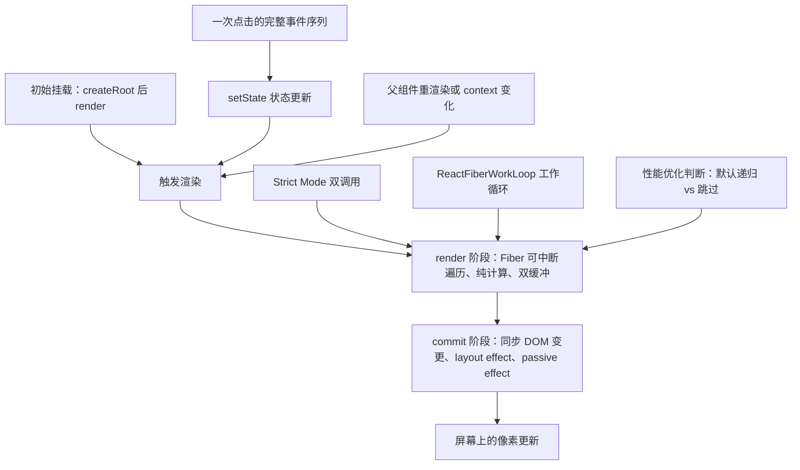
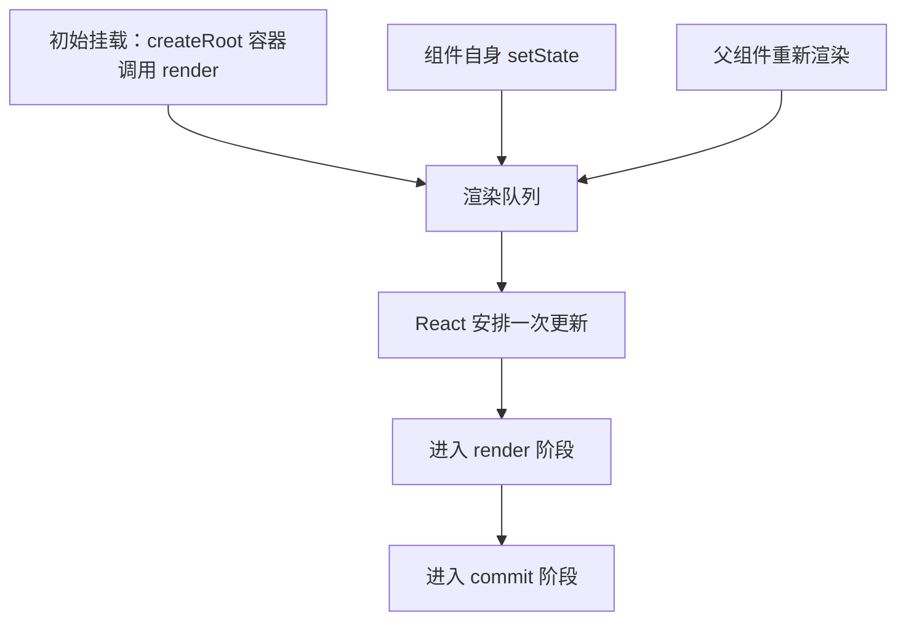
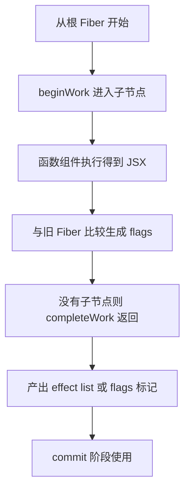
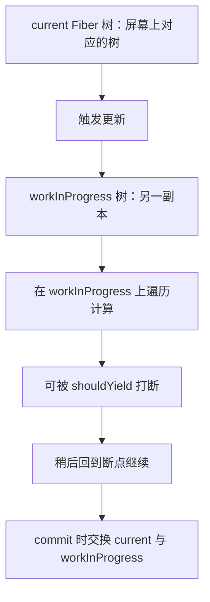
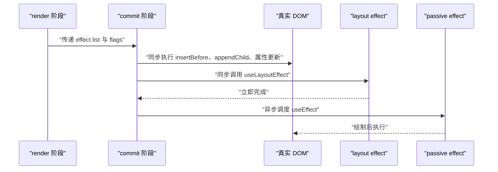
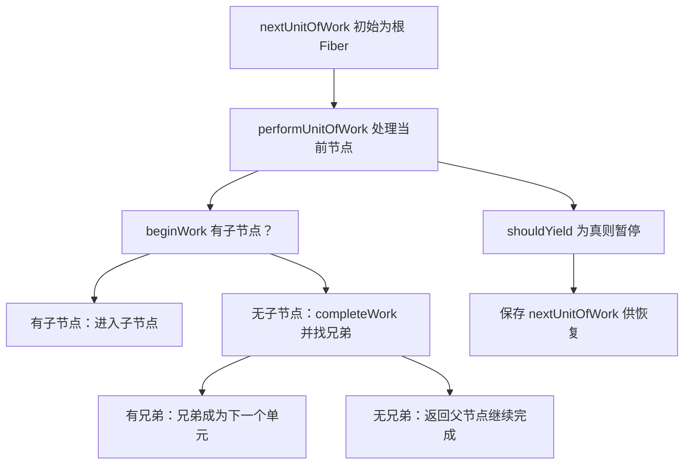
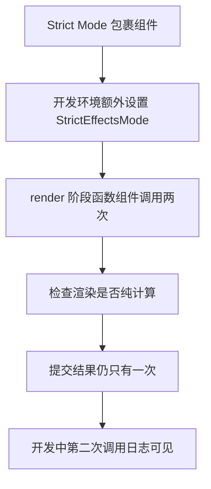
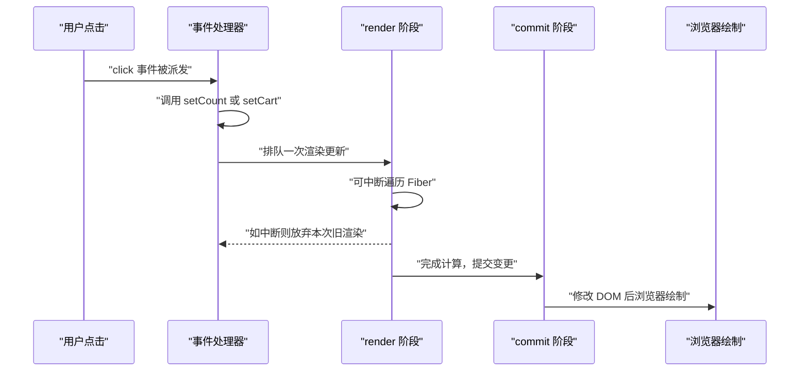
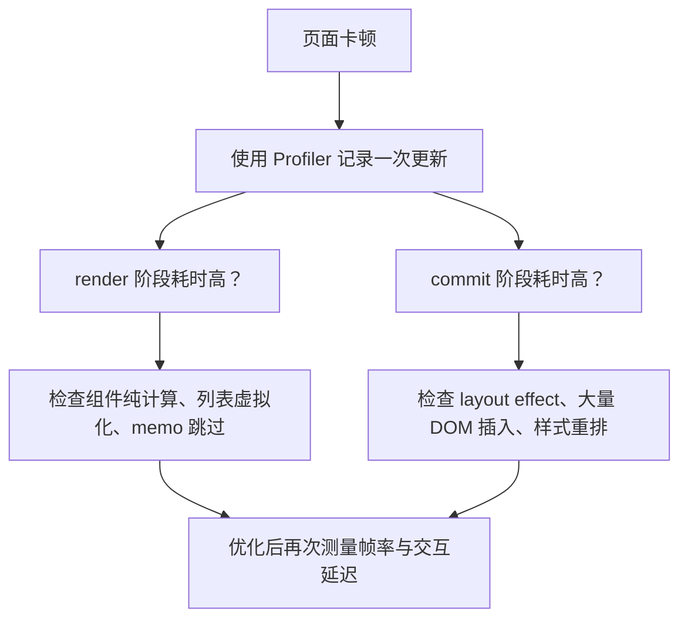

# React 渲染全流程：从 setState 到屏幕上的像素

!!! abstract "学完这一页你能"
    - 说出触发 React 渲染的三种入口，并解释每次触发的调用来源。
    - 画出 render 阶段与 commit 阶段的工作顺序，标明哪个阶段可中断、哪个阶段同步。
    - 结合 ReactFiberWorkLoop 源码摘录，解释 WorkLoop 如何推进 Fiber 单元。
    - 说出 Strict Mode 双调用发生在哪一阶段、为什么能暴露副作用问题。

## 0. 知识地图



建议先读第 1 节理解触发来源，再读第 2、3 节看 render 阶段内部机制。  
第 4、5 节进入 commit 与源码工作循环，第 6 节用 Strict Mode 把前面串起来。  
最后用第 7 节的完整点击序列和第 8 节的性能含义做检验。

## 1. 触发渲染：三种入口

**先想一个问题**  
一个商品列表页里有购物车按钮、库存徽标、推荐位。  
点击“加入购物车”后，哪些组件函数会重新执行？为什么不是整个页面都重跑？

**心智模型**  
!!! tip "心智模型"
    一句话模型：渲染请求进入队列，React 根据请求来源决定重新调用哪些组件。  
    日常类比：餐厅里客户加菜，服务员只通知负责该菜的厨师，不是每个厨师都重做。  
    类比不成立的地方：React 默认会递归渲染触发组件下的所有子组件，而餐厅通常不会让厨师把已经做好的菜全部重做。

**图解**  

1. 初始挂载来自 `createRoot` 与首次 `render` 调用。  
2. 自身 `setState` 直接把一次更新排入队列。  
3. 父组件因状态更新重新渲染时，其子树组件也会被遍历。  
4. 三种入口最终都进入同一个 render 到 commit 流程。

**一步一步来**

① 这一步要做什么：展示初始挂载入口。

```js
import { createRoot } from "react-dom/client"; // 客户端入口
import App from "./App.js";                    // 根组件

const root = createRoot(document.getElementById("root")); // 创建根
root.render(<App />); // 触发初始渲染
```

**这段代码在做什么**  
- `createRoot` 绑定挂载点 DOM 节点。  
- `root.render` 是初始渲染触发器。  
- 首次调用会让 React 从根组件开始递归渲染。  
- 如果没有 `root.render`，界面不会出现任何 React DOM。

运行结果：控制台无输出，但页面上出现 `<App />` 渲染后的 DOM。

② 这一步要做什么：展示自身 `setState` 触发重渲染。

```js
import { useState } from "react";

const [count, setCount] = useState(0);
setCount(1); // 排队一次更新
```

**这段代码在做什么**  
- `setCount` 不会直接修改当前 `count` 变量。  
- 它会告诉 React：这个组件需要重新渲染。  
- React 会在后续渲染时使用新的状态值。  
- 状态更新是异步排队，不能立即读取到变化。

运行结果：组件函数会在下一次渲染中重新执行，`count` 变为 1。

③ 这一步要做什么：展示父组件状态更新导致子组件重渲染。

```js
function Parent() {
  const [filter, setFilter] = useState("all");
  return <Child filter={filter} />;
}

function Child({ filter }) {
  return <p>{filter}</p>; // Child 会随 Parent 重渲染
}
```

**这段代码在做什么**  
- `Parent` 中 `setFilter` 触发 `Parent` 自身重渲染。  
- React 在渲染 `Parent` 时遇到 `Child` 组件。  
- `Child` 默认也会重新调用。  
- 子组件是否跳过由后续优化决定，默认不跳过。

运行结果：`Parent` 与 `Child` 的函数体都会再次执行。

**动手验证**  
下面脚本模拟三种触发源，验证它们是否都能让渲染计数加一。  
依赖：无外部包，Node 20+ 直接运行。

```js
// trigger_render.mjs
import assert from "node:assert/strict";

let renderCount = 0;
function requestRender(source) {
  renderCount += 1; // 每次触发都排队一次渲染
  return source;
}

assert.equal(requestRender("initial mount"), "initial mount");
assert.equal(requestRender("setState"), "setState");
assert.equal(requestRender("parent rerender"), "parent rerender");
assert.equal(renderCount, 3);
console.log("预期输出：3 次触发，实际：", renderCount);
```

预期输出：`预期输出：3 次触发，实际： 3`。

**常见坑**  
| 现象 | 原因 | 怎么修 |
| --- | --- | --- |
| 点击按钮后页面没变化 | 没有调用 `setState`，只改了普通变量 | 使用 `setState` 或 `useReducer` 触发渲染 |
| 在 `setState` 后立刻读取状态是旧值 | 状态更新异步排队 | 使用新值计算或 `useEffect` 依赖 |
| 子组件函数每次父组件更新都执行 | 默认递归渲染，没有跳过策略 | 确认性能问题后再加 `memo` 或 `useMemo` |

**用在哪里**  
场景一：电商商品列表的筛选条件变化。  
- 业务背景：用户切换类目、价格区间时，列表组件和筛选栏都要响应。  
- 知识怎么用：区分触发源是筛选栏自身的 `setState`，并把更新向下传递给列表。  
- 收益指标：交互到列表刷新之间的用户感知延迟低于 100 毫秒。  
- 什么时候不该用：如果筛选状态只影响一个小组件，不要为了统一把状态提到顶层造成全页重渲染。

场景二：后台管理系统的表格批量导入。  
- 业务背景：上传文件后需要展示进度、成功行数、失败行数。  
- 知识怎么用：识别三个不同触发源分别更新进度条、结果表格、状态文本。  
- 收益指标：每次状态更新只让相关小组件重渲染，减少主线程占用。  
- 什么时候不该用：导入数据量小时，不需要拆分触发源，直接一个状态对象足够。

场景三：聊天应用的消息列表与输入框。  
- 业务背景：输入中、发送中、新消息到达会频繁更新界面。  
- 知识怎么用：把输入框局部状态和消息列表状态分离，避免每次按键都触发消息列表重渲染。  
- 收益指标：按键到字符上屏延迟低于 30 毫秒，列表滚动帧率稳定。  
- 什么时候不该用：如果消息列表很小，每次输入重渲染整个列表也不会有明显卡顿，不要提前拆分。

场景四：多标签页仪表盘。  
- 业务背景：切换标签时，每个标签内部有独立的数据请求与加载态。  
- 知识怎么用：让当前标签的状态更新只触发当前标签的渲染，不重新渲染未激活标签。  
- 收益指标：切换标签的响应时间低于 50 毫秒，未激活标签不产生额外渲染。  
- 什么时候不该用：如果所有标签共享同一份数据且切换时都要刷新，合并触发源反而更简单。

**行业实践**  
- React 官方文档《render-and-commit》明确区分 Trigger、Render、Commit 三步，强调触发来源是初始渲染与状态更新。  
  怎么借鉴：在项目文档里先画出每个页面的触发源，再讨论组件拆分。  
- React 源码 `ReactFiberRoot` 中 `markRootUpdated` 会把更新标记到根上，确保后续调度能找到待处理工作。  
  怎么借鉴：调试时通过断点观察更新是否到达根节点，判断是触发问题还是渲染问题。  
- React DevTools 的 Profiler 面板可以按触发来源筛选更新，帮助定位哪次更新来自哪个 `setState`。  
  怎么借鉴：性能排查时先筛选触发源，再看组件火焰图，不要一上来就加 `memo`。

**小结**  
- 三种触发入口是初始挂载、自身 `setState`、父组件重渲染或 context 变化。  
- `setState` 不直接改状态，而是排队一次渲染。  
- 默认递归渲染意味着父组件更新往往带动子组件更新。

## 2. render 阶段：Fiber 树遍历与纯计算

**先想一个问题**  
React 在真正改 DOM 之前，怎么知道一个树里哪些节点要新增、哪些要改属性？  
如果一边计算一边改 DOM，会不会出现界面闪烁？

**心智模型**  
!!! tip "心智模型"
    一句话模型：render 阶段是计算阶段，产出“需要改什么”的清单，不改真实 DOM。  
    日常类比：建筑师先在图纸上标出墙体改动，不直接砸墙。  
    类比不成立的地方：React 的图纸是 Fiber 树，计算过程可以被拆成多个时间片，而画图纸通常一次画完。

**图解**  

1. render 阶段从根 Fiber 进入工作循环。  
2. 函数组件在这里被调用，得到新 JSX。  
3. React 把新结果与旧 Fiber 比较，生成变更标记。  
4. 计算完成后才进入 commit 阶段，DOM 修改被推迟。

**一步一步来**

① 这一步要做什么：展示组件渲染就是函数调用。

```js
function Item({ name }) {
  return <li>{name}</li>; // render 阶段会执行这个函数
}

// React 内部类似这样调用
const newElement = Item({ name: "手机" });
```

**这段代码在做什么**  
- 函数组件本质上就是一个返回 JSX 的 JavaScript 函数。  
- render 阶段会按 Fiber 节点调用对应的组件函数。  
- 返回值是描述 UI 的对象，不是真实 DOM。  
- 如果组件内读取了外部变量并作修改，就是不纯渲染。

运行结果：`newElement` 是一个 React 元素对象，不是 `<li>` DOM 节点。

② 这一步要做什么：展示纯渲染约定。

```js
function Pure({ count }) {
  const next = count * 2; // 只根据 props 计算
  return <span>{next}</span>; // 返回值只取决于入参
}
```

**这段代码在做什么**  
- `Pure` 没有修改外部变量。  
- 它没有写 DOM、没有发网络请求。  
- 相同 `count` 会得到相同输出。  
- 纯渲染是 React 可中断、双缓冲等机制的前提。

运行结果：相同 `count` 多次调用，返回结构一致。

**动手验证**  
下面脚本验证渲染计算只依赖输入、不产生副作用。  
依赖：无外部包，Node 20+ 直接运行。

```js
// render_pure.mjs
import assert from "node:assert/strict";

function pureRender(count) {
  return { text: String(count * 2) }; // 模拟纯组件返回值
}

const a = pureRender(1);
const b = pureRender(1);
const c = pureRender(2);

assert.deepEqual(a, b); // 相同输入返回相同输出
assert.notEqual(a.text, c.text);
assert.equal(a.text, "2");
console.log("预期输出：a 与 b 相等，a.text 为 2");
```

预期输出：`预期输出：a 与 b 相等，a.text 为 2`。

**常见坑**  
| 现象 | 原因 | 怎么修 |
| --- | --- | --- |
| 渲染过程中写了 `localStorage` | 违反纯计算原则 | 把副作用移到 `useEffect` 或事件处理器 |
| 相同 props 有时渲染结果不同 | 组件依赖了日期、随机数等外部变量 | 把随机值或时间作为 props 传入 |
| 渲染奇数次数时数据错乱 | 可中断渲染重放导致外部变量被多次修改 | 保证渲染无副作用，依赖函数式更新 |

**用在哪里**  
场景一：电商商品详情的价格计算。  
- 业务背景：价格需要根据原价、会员折扣、优惠券计算。  
- 知识怎么用：把计算函数写成纯函数，渲染时只根据 props 计算最终价。  
- 收益指标：相同输入多次渲染结果一致，可预测性强，测试通过率高。  
- 什么时候不该用：如果计算需要实时汇率或库存数据，应先把数据传入组件，不要直接读全局。

场景二：后台报表的汇总单元格。  
- 业务背景：表格每一行的合计、平均值、环比需要实时展示。  
- 知识怎么用：汇总组件只根据传入的原始数据计算，不在渲染中修改数据。  
- 收益指标：渲染函数不引入外部可变状态，避免排序后合计串行。  
- 什么时候不该用：汇总逻辑已经提前在数据层算好时，不要重复在组件里再算。

场景三：社交信息流的可见范围判断。  
- 业务背景：根据用户权限和帖子状态决定是否显示给当前用户。  
- 知识怎么用：可见性计算作为纯函数，输入是帖子数据和权限对象。  
- 收益指标：渲染结果可重复验证，权限边界错误率下降。  
- 什么时候不该用：权限判断依赖服务端实时校验时，不应只依赖客户端渲染计算。

场景四：金融工具的风险评级展示。  
- 业务背景：根据用户资产、投资期限、风险偏好计算等级。  
- 知识怎么用：评级展示组件保持纯渲染，将计算封装成纯函数模块。  
- 收益指标：渲染重复执行不会导致评级在不同调用间变化。  
- 什么时候不该用：评级需要调用外部风控 API 时，渲染期间不能发起请求。

**行业实践**  
- React 官方文档《keeping-components-pure》要求组件渲染必须保持纯计算。  
  怎么借鉴：代码审查时把“渲染中有没有副作用”作为硬性检查项。  
- React 源码 `ReactFiberWorkLoop` 中的 `beginWork` 与 `completeWork` 分别负责进入和完成节点，依赖可重放的纯计算。  
  怎么借鉴：调试时在 `beginWork` 处设置日志，观察某个组件是否被重复调用。  
- React DevTools Profiler 可以记录渲染提交次数，帮助发现非纯组件导致的不一致。  
  怎么借鉴：如果发现相同输入提交了不同输出，优先检查组件纯度。

**小结**  
- render 阶段是纯计算阶段，只生成变更标记。  
- 函数组件在此阶段被调用，返回值是描述 UI 的对象。  
- 保持渲染纯计算是 React 可中断与双缓冲机制的前提。

## 3. render 阶段的双缓冲与可中断

**先想一个问题**  
React 在渲染一棵很深很慢的树时，如果中途用户又点了另一个按钮，界面会不会卡住？  
它凭什么可以先放下当前计算，稍后再继续？

**心智模型**  
!!! tip "心智模型"
    一句话模型：双缓冲像双页草稿，React 在另一棵树副本上计算，旧树继续展示。  
    日常类比：做表格时先在草稿纸上改，确认无误再覆盖正式表。  
    类比不成立的地方：草稿纸只有一张，React 通过 Fiber 链表可以在副本上分多次计算。

**图解**  

1. 当前展示的树叫 `current`。  
2. 每次更新创建或复用 `workInProgress` 树作为副本。  
3. 计算都发生在 `workInProgress` 上，旧树保持不变。  
4. commit 成功后交换两棵树指针。

**一步一步来**

① 这一步要做什么：展示 Fiber 树的双缓冲指针交换模拟。

```js
let current = { type: "root", child: "old child" };
let workInProgress = { ...current, child: "new child" }; // 副本

const finished = workInProgress;
current = finished; // commit 后交换
```

**这段代码在做什么**  
- `current` 是提交前稳定展示的树。  
- `workInProgress` 是用于计算的副本。  
- 计算期间不会修改 `current` 的可见内容。  
- 提交完成后才把 `current` 指向新树。

运行结果：`current.child` 变为 `"new child"`。

② 这一步要做什么：展示可中断循环的简化逻辑。

```js
function workLoop(deadline) {
  while (nextUnitOfWork && !shouldYield()) { // 有工作且时间片未到
    nextUnitOfWork = performUnitOfWork(nextUnitOfWork);
  }
}
```

**这段代码在做什么**  
- `nextUnitOfWork` 指向下一个待处理 Fiber。  
- `shouldYield` 表示当前时间片是否用尽。  
- 每次循环只处理一个 Fiber 单元。  
- 中断后保存 `nextUnitOfWork` 指针，下次继续。

运行结果：长时间渲染被切成多个宏任务或时间片，不会长时间阻塞主线程。

**动手验证**  
下面脚本模拟双缓冲交换与可中断工作循环，验证副本不会被提前替换。  
依赖：无外部包，Node 20+ 直接运行。

```js
// double_buffer.mjs
import assert from "node:assert/strict";

let current = { value: "old" };
const workInProgress = { ...current, value: "new" };
let nextUnitOfWork = { done: false };
let interrupted = false;

function shouldYield() {
  return false; // 简化：真实调度器会根据时间片返回 true
}
function performUnitOfWork(unit) {
  unit.done = true;
  return null;
}

while (nextUnitOfWork && !shouldYield()) {
  nextUnitOfWork = performUnitOfWork(nextUnitOfWork);
}
interrupted = true; // 标记被调用了工作循环调度
current = workInProgress;

assert.equal(current.value, "new");
assert.equal(interrupted, true);
assert.equal(workInProgress.value, "new");
console.log("预期输出：current.value 已替换为 new");
```

预期输出：`预期输出：current.value 已替换为 new`。

**常见坑**  
| 现象 | 原因 | 怎么修 |
| --- | --- | --- |
| 渲染多次看到一半新一半旧 | 在计算过程中读取外部可变对象 | 渲染期间不要读取会在别处修改的全局对象 |
| 长时间遍历卡住页面 | 没有正确 `shouldYield`，循环没有被拆片 | 使用 startTransition 或检查调度器优先级 |
| 直接在渲染里修改旧树属性 | 双缓冲失效，旧树被污染 | 只通过 React 状态更新触发新计算 |

**用在哪里**  
场景一：大型数据表格的虚拟滚动。  
- 业务背景：一万行表格同时只渲染可见区，滚动时频繁更新行数据。  
- 知识怎么用：把滚动造成的高频更新放入 transition，让 render 可中断，优先响应滚动位置。  
- 收益指标：滚动帧率稳定在 55 帧以上，无明显掉帧。  
- 什么时候不该用：数据量只有几十行时，可中断带来的复杂度大于收益。

场景二：电商列表筛选和排序。  
- 业务背景：用户快速切换排序条件，旧排序计算可能还没完成。  
- 知识怎么用：排序筛选触发 transition，React 可以在新输入到来时丢弃旧 render。  
- 收益指标：最后一次点击到列表刷新的感知延迟低于 100 毫秒。  
- 什么时候不该用：如果需求要求每次点击都触发同步动画，不能用可中断过渡代替。

场景三：协同文档的多人实时编辑。  
- 业务背景：远端操作持续到达，本地重新计算树可能频繁被打断。  
- 知识怎么用：远端更新使用并发特性，让 render 可以中断并合并最新状态。  
- 收益指标：输入延迟低于 50 毫秒，光标准确率稳定。  
- 什么时候不该用：离线单人编辑时，不需要处理并发中断，保持普通渲染即可。

场景四：仪表盘图表全量重绘。  
- 业务背景：多图表面板数据刷新时，一次 rendering 可能处理几百个 SVG 节点。  
- 知识怎么用：把非紧急图表更新标为 transition，让紧急交互优先。  
- 收益指标：面板切换或缩放操作响应时间低于 60 毫秒。  
- 什么时候不该用：如果图表更新必须严格跟随用户拖拽，不能延迟。

**行业实践**  
- React 官方文档《render-and-commit》说明渲染可以发生在提交之前，并且提交才会改 DOM。  
  怎么借鉴：复盘 UI 卡顿时，先定位卡在 render 计算还是 commit 操作。  
- React 源码 `ReactFiberWorkLoop` 中 `workLoopConcurrent` 使用 `shouldYield` 每次循环检查是否该让出主线程。  
  怎么借鉴：在自己的长任务里模仿这个模式，用 `requestIdleCallback` 拆片。  
- React 团队在公开博客中说明双缓冲是 Fiber 架构的关键：`current` 与 `workInProgress` 交替指向。  
  怎么借鉴：调试时在 DevTools 中观察 Fiber 树的 alternate 指针，理解当前展示对应哪个树。

**小结**  
- 双缓冲让计算在 `workInProgress` 树上进行，旧树稳定展示。  
- 可中断依赖工作循环检查 `shouldYield`，中断后保存指针下次继续。  
- commit 完成后交换 `current` 与 `workInProgress` 引用。

## 4. commit 阶段：同步改 DOM 与 effect 时机

**先想一个问题**  
render 阶段算好了“要改什么”，但什么时候真正改 DOM？  
`useLayoutEffect` 和 `useEffect` 为何一个同步、一个异步？这跟画面对用户有何关系？

**心智模型**  
!!! tip "心智模型"
    一句话模型：commit 阶段把 render 的计算结果一次性落地到 DOM，并分阶段执行 effect。  
    日常类比：图纸确认后，施工队一次性完成敲墙、装门、通电。  
    类比不成立的地方：施工过程不可逆，但 React 的 commit 是同步执行，DOM 修改一旦发生不能再在本次 commit 内撤销。

**图解**  

1. render 阶段完成计算，把变更标记传入 commit。  
2. commit 先同步改真实 DOM。  
3. DOM 修改后同步触发 `useLayoutEffect`。  
4. `useEffect` 在浏览器绘制后异步执行。

**一步一步来**

① 这一步要做什么：展示 commit 阶段 DOM 插入。

```js
const parent = document.createElement("div"); // 父 DOM
const child = document.createElement("span"); // 子 DOM
parent.appendChild(child); // 同步插入
```

**这段代码在做什么**  
- `appendChild` 是 React DOM 渲染器在 commit 阶段调用的 host API。  
- 这个操作同步发生，不能被中断。  
- 初始挂载时，React 会把创建好的整棵 DOM 一次性插入。  
- 重渲染时只执行必要的最小 DOM 操作。

运行结果：`child` 出现在 `parent` DOM 树中。

② 这一步要做什么：展示 layout effect 与 passive effect 时机差异。

```js
useLayoutEffect(() => { console.log("layout"); }, []);
useEffect(() => { console.log("passive"); }, []);
```

**这段代码在做什么**  
- `useLayoutEffect` 在 DOM 变更后、浏览器绘制前同步运行。  
- `useEffect` 在绘制后由调度器异步运行。  
- 如果 layout effect 阻塞时间过长，会推迟绘制。  
- passive effect 适合可以晚一点执行的副作用。

运行结果：`layout` 先打印，`passive` 后打印。

**动手验证**  
下面脚本模拟 commit 阶段顺序：先 DOM 变更，再 layout effect，最后 passive effect 异步排队。  
依赖：无外部包，Node 20+ 直接运行。

```js
// commit_order.mjs
import assert from "node:assert/strict";

const order = [];
function commitToDOM() { order.push("DOM"); }
function runLayoutEffect() { order.push("layout"); }
function schedulePassiveEffect() { order.push("passive"); }

commitToDOM();
runLayoutEffect();
schedulePassiveEffect();

assert.deepEqual(order, ["DOM", "layout", "passive"]);
console.log("预期输出：DOM、layout、passive，实际：", order.join("、"));
```

预期输出：`预期输出：DOM、layout、passive，实际： DOM、layout、passive`。

**常见坑**  
| 现象 | 原因 | 怎么修 |
| --- | --- | --- |
| 页面闪烁又恢复 | layout effect 中又触发一次同步更新 | 避免在 layout effect 中同步 `setState` 造成循环 |
| effect 中读取 DOM 尺寸拿到旧值 | passive effect 可能延迟到下一帧 | 需要同步读取用 `useLayoutEffect` |
| 首次渲染后 effect 没执行 | 依赖数组变化或组件未被提交 | 检查 Fibber 是否被丢弃或依赖是否为空数组 |

**用在哪里**  
场景一：电商详情页的吸顶导航栏。  
- 业务背景：滚动时导航栏需要根据内容高度切换固定定位。  
- 知识怎么用：用 `useLayoutEffect` 在 DOM 变更后立即读取高度并设置样式。  
- 收益指标：导航栏状态切换无可见闪烁，布局稳定。  
- 什么时候不该用：如果高度读取不依赖本次 DOM 变化，用 `useEffect` 足够，不必阻塞绘制。

场景二：后台管理系统的表格列拖拽。  
- 业务背景：拖拽结束时需要根据新列宽更新表头并记录配置。  
- 知识怎么用：DOM 位置更新用 layout effect 同步处理，配置持久化用 passive effect 异步发送。  
- 收益指标：拖拽松手到列宽稳定显示延迟低于 30 毫秒。  
- 什么时候不该用：如果拖拽过程本身是高频动画，避免在 layout effect 里做复杂计算。

场景三：社交应用的消息自动滚动到底部。  
- 业务背景：新消息插入后希望列表自动滚到最新位置。  
- 知识怎么用：在 `useLayoutEffect` 里读取列表高度并滚动，确保绘制前完成位置调整。  
- 收益指标：新消息出现后用户无需手动滚动即可看到。  
- 什么时候不该用：如果列表内容变化频繁且滚动动画要平滑，频繁同步滚动会卡顿。

场景四：金融看板的指标卡片动画。  
- 业务背景：数字变化时希望卡片高度动画过渡，不跳变。  
- 知识怎么用：用 `useLayoutEffect` 读取旧高度和新高度，设置动画起始值。  
- 收益指标：动画过程无闪跳，视觉连续。  
- 什么时候不该用：如果指标更新不频繁且对动画要求不高，不必花额外同步任务。

**行业实践**  
- React 官方文档《useLayoutEffect》说明它会在 DOM 更新后、浏览器绘制前同步执行。  
  怎么借鉴：所有需要同步测量 DOM 的逻辑统一放 layout effect。  
- React 源码 `ReactFiberCommitWork` 中 `commitMutationEffects` 负责执行 DOM 变更，阶段划分清晰。  
  怎么借鉴：调试提交崩溃时，检查 mutation 阶段 flags 是否被错误标记。  
- React 团队在公开源码注释中明确 passive effect 使用调度器异步安排，避免阻塞绘制。  
  怎么借鉴：业务中非紧急副作用用 `useEffect`，紧急同步测量用 `useLayoutEffect`。

**小结**  
- commit 阶段同步执行真实 DOM 修改。  
- `useLayoutEffect` 在绘制前同步触发，`useEffect` 在绘制后异步触发。  
- 不要在 layout effect 中做会再次同步更新的重计算。

## 5. ReactFiberWorkLoop 源码摘录：工作循环

**先想一个问题**  
一个 Fiber 节点处理完后，React 怎么知道下一个要处理哪个节点？  
源码里的 while 循环凭什么知道什么时候该停下？

**心智模型**  
!!! tip "心智模型"
    一句话模型：工作循环每次处理一个 Fiber 单元，处理完返回下一个单元指针。  
    日常类比：流水线工人每次拿起一个零件加工，完成后看下一个传送带上的零件。  
    类比不成立的地方：传送带顺序固定，Fiber 工作循环会根据节点是否有子节点、兄弟节点而分叉跳转。

**图解**  

1. 工作循环从 `nextUnitOfWork` 开始。  
2. 每次调用 `performUnitOfWork` 处理一个 Fiber。  
3. 节点有子节点时深度优先进入子节点。  
4. 没有子节点时完成当前节点并尝试找兄弟或回父级。

**一步一步来**

① 这一步要做什么：展示工作循环的外层判断。

```js
function workLoopConcurrent() {
  while (nextUnitOfWork !== null && !shouldYield()) {
    nextUnitOfWork = performUnitOfWork(nextUnitOfWork);
  }
}
```

**这段代码在做什么**  
- `nextUnitOfWork` 是全局变量，保存下一个待处理 Fiber。  
- `shouldYield` 来自调度器，时间片用尽时返回真。  
- 条件不满足时循环退出，当前指针保留。  
- 下次恢复时继续从 `nextUnitOfWork` 开始。

运行结果：可以分多次处理完一棵深度很大的 Fiber 树。

② 这一步要做什么：展示 `performUnitOfWork` 的简化返回逻辑。

```js
function performUnitOfWork(unit) {
  const next = beginWork(unit); // 进入当前节点
  if (next === null) {
    completeUnitOfWork(unit); // 没有子节点就完成当前单元
    return nextSiblingOrParent(unit); // 返回兄弟或父节点
  }
  return next; // 返回子节点
}
```

**这段代码在做什么**  
- `beginWork` 处理当前节点，可能返回子节点。  
- 如果返回 `null`，说明当前节点没有未处理的子节点。  
- `completeUnitOfWork` 完成当前节点并收集 effect 标记。  
- 最终返回下一个兄弟或父节点，形成 DFS 遍历。

运行结果：遍历顺序与深度优先先序遍历一致。

**动手验证**  
下面脚本模拟一个简单 Fiber 树的工作循环遍历顺序。  
依赖：无外部包，Node 20+ 直接运行。

```js
// work_loop.mjs
import assert from "node:assert/strict";

const tree = {
  name: "root",
  child: {
    name: "child",
    sibling: { name: "child2" }
  }
};
const order = [];
function performUnitOfWork(unit) {
  order.push(unit.name);
  if (unit.child) return unit.child;
  return unit.sibling || null;
}

let nextUnitOfWork = tree;
while (nextUnitOfWork) {
  nextUnitOfWork = performUnitOfWork(nextUnitOfWork);
}

assert.deepEqual(order, ["root", "child", "child2"]);
console.log("预期输出：root、child、child2，实际：", order.join("、"));
```

预期输出：`预期输出：root、child、child2，实际： root、child、child2`。

**常见坑**  
| 现象 | 原因 | 怎么修 |
| --- | --- | --- |
| 遍历顺序与预期不一致 | 插入或删除节点后 sibling 指针未更新 | 调试时检查 Fiber 的 `child` 和 `sibling` 指针 |
| 工作循环无限运行 | `shouldYield` 始终假且工作不停新增 | 确保调度器正确判断时间片，避免恶意更新循环 |
| 中断后指针丢失 | `nextUnitOfWork` 被重置 | 保留全局变量，提交完成前不要主动置空 |

**用在哪里**  
场景一：电商商品树的递归评论组件。  
- 业务背景：商品评论支持回复嵌套，可能达到几百层。  
- 知识怎么用：理解 React 用深度优先遍历处理嵌套 Fiber，节点顺序与评论显示顺序一致。  
- 收益指标：万级嵌套节点渲染时主线程不产生超过 200 毫秒的连续阻塞。  
- 什么时候不该用：如果评论层数固定很浅，不需要关心遍历顺序细节。

场景二：后台权限路由表渲染。  
- 业务背景：菜单和路由树复杂度高，不同角色看到不同子树。  
- 知识怎么用：用 Fiber 遍历顺序来推断哪些菜单节点会被渲染，提前标记权限过滤点。  
- 收益指标：路由切换时只渲染可见子树，首屏路由切换时间低于 80 毫秒。  
- 什么时候不该用：权限树整体很小或所有节点必须渲染时，优化遍历价值低。

场景三：在线 DIY 设计器的图层树。  
- 业务背景：图层可以无限嵌套，拖拽和锁定操作会触发局部更新。  
- 知识怎么用：把图层树建模为类似 Fiber 的节点链，便于增量更新只处理变动子树。  
- 收益指标：拖拽图层时重渲染节点数比全量重渲染下降 80% 以上。  
- 什么时候不该用：图层数量很少时，增量更新逻辑会带来额外复杂度。

场景四：文档编辑器的目录大纲。  
- 业务背景：标题层级嵌套深，编辑时大纲需要实时更新。  
- 知识怎么用：利用深度优先遍历顺序匹配标题层级，更新对应片段。  
- 收益指标：输入到大纲更新延迟低于 40 毫秒。  
- 什么时候不该用：如果大纲只是静态展示，不需要投入遍历机制优化。

**行业实践**  
- React 源码 `ReactFiberWorkLoop.js` 中 `workLoopConcurrent` 的实际结构为 `while (workInProgress !== null && !shouldYield())`。  
  怎么借鉴：写中断友好循环时，把判断条件放在循环顶部，避免空转。  
- React 源码 `performUnitOfWork` 内部调用 `beginWork`，完整逻辑涉及大量 `switch` 分支。  
  怎么借鉴：处理复杂数据结构时，按节点类型分派处理函数。  
- React 官方源码注释明确工作循环可被调度器暂停并恢复，这是并发渲染的基础。  
  怎么借鉴：长任务拆片可以沿用“每次一个单元 + 检查 yield”模式。

**小结**  
- 工作循环每次处理一个 Fiber 单元，通过指针返回下一个节点。  
- `performUnitOfWork` 内部实现深度优先遍历。  
- `shouldYield` 是中断与恢复的关键闸门。

## 6. Strict Mode 双调用：为什么 render 会执行两次

**先想一个问题**  
开发服务器里组件函数有时执行两次，生产环境却只执行一次。  
这个双重调用是 bug 吗？它在检查和保护什么？

**心智模型**  
!!! tip "心智模型"
    一句话模型：Strict Mode 在开发环境通过双调用放大副作用，让不纯函数暴露。  
    日常类比：质检时把同一批次抽两件，重复测试更容易发现偶发问题。  
    类比不成立的地方：质检会浪费一件样品，而 React 的第二次 render 不会改变最终提交结果。

**图解**  

1. Strict Mode 只影响开发构建。  
2. 它让 render 阶段的组件函数调用两次。  
3. 第二次调用用于暴露非法副作用。  
4. 最终提交时使用第一次的结果，不产生双 DOM。

**一步一步来**

① 这一步要做什么：展示 Strict Mode 包裹。

```js
import { StrictMode } from "react";
import { createRoot } from "react-dom/client";

const root = createRoot(document.getElementById("root"));
root.render(
  <StrictMode>
    <App />
  </StrictMode>
);
```

**这段代码在做什么**  
- `StrictMode` 打开开发模式检查。  
- 被包裹的 `App` 子树都会受到双调用影响。  
- 生产构建里 `StrictMode` 不产生额外调用。  
- 它不会改变最终 DOM 结构。

运行结果：开发模式控制台能看到 `App` 渲染两次的日志，生产模式不出现。

② 这一步要做什么：展示不纯函数被双调用暴露。

```js
let counter = 0;
function Impure() {
  counter += 1; // 渲染副作用
  return <span>{counter}</span>;
}
```

**这段代码在做什么**  
- 每次渲染都会修改外部 `counter`。  
- 在 Strict Mode 下 render 调用两次，`counter` 会多加一次。  
- 如果组件依赖 `counter` 展示，开发模式结果与预期不符。  
- 这说明渲染不是纯计算，应当修改。

运行结果：开发模式第二次调用后 `counter` 值比实际提交值多 1。

**动手验证**  
下面脚本模拟 Strict Mode 双调用检查不纯渲染。  
依赖：无外部包，Node 20+ 直接运行。

```js
// strict_mode.mjs
import assert from "node:assert/strict";

let external = 0;
function impureRender() {
  external += 1; // 渲染中修改外部变量
  return external;
}

const firstResult = impureRender();
const secondResult = impureRender(); // Strict Mode 模拟第二次调用

assert.equal(secondResult - firstResult, 1);
assert.equal(external, 2);
console.log("预期输出：外部变量被加了两次，external 为 2");
```

预期输出：`预期输出：外部变量被加了两次，external 为 2`。

**常见坑**  
| 现象 | 原因 | 怎么修 |
| --- | --- | --- |
| 开发环境计数明显偏大 | 渲染函数里有自增副作用 | 把计数移到事件处理或 effect 中 |
| 开发环境请求发送两次 | 渲染期间调用接口 | 将请求移入 `useEffect`，并处理依赖 |
| 生产正常开发不正常 | 依赖 Strict Mode 双调用暴露问题 | 保持渲染纯计算，避免依赖调用次数 |

**用在哪里**  
场景一：电商详情页的埋点上报。  
- 业务背景：页面加载后需要上报一次曝光埋点。  
- 知识怎么用：不要在 render 中发埋点，移到 `useEffect`，Strict Mode 双调用会显示重复上报。  
- 收益指标：开发环境埋点重复率降低到零，生产数据准确。  
- 什么时候不该用：如果埋点逻辑本就幂等且允许重放，可以用更宽容的处理。

场景二：后台管理的导出任务初始化。  
- 业务背景：进入页面时自动创建导出任务。  
- 知识怎么用：把创建任务放 `useEffect` 并加幂等判断，防止 Strict Mode 双调用创建多个任务。  
- 收益指标：开发环境重复任务创建数为零。  
- 什么时候不该用：创建任务接口本身有去重机制时，双调用不会造成业务问题。

场景三：社交应用的好友列表请求。  
- 业务背景：组件挂载时请求好友数据。  
- 知识怎么用：请求放在 `useEffect` 中，使用 AbortController 取消第一次未完成请求。  
- 收益指标：开发控制台不再出现重复网络请求警告。  
- 什么时候不该用：如果请求接口返缓存且成本低，重复请求可接受。

场景四：金融工具的支付风控初始化。  
- 业务背景：组件挂载时拉起风控 SDK。  
- 知识怎么用：SDK 初始化放在 `useEffect` 并调用幂等 init 方法。  
- 收益指标：严格模式下 SDK 只初始化一次，无重复加载。  
- 什么时候不该用：如果 SDK 支持多次 init 且无副作用，可以不处理。

**行业实践**  
- React 官方文档《Strict Mode》说明开发模式双调用只影响 render 和部分生命周期。  
  怎么借鉴：新项目默认启用 Strict Mode，把报警当错误处理。  
- React 源码 `ReactStrictModeWarnings` 相关逻辑会在双调用时收集警告。  
  怎么借鉴：CI 中把 Strict Mode 开发构建的警告视为回归信号。  
- React 源码 `ReactFiberWorkLoop` 中 `StrictEffectsMode` 会在开发环境重复执行 effect 的创建与销毁。  
  怎么借鉴：写 effect 时加入清理函数，验证挂载与卸载两次能正常工作。

**小结**  
- Strict Mode 双调用只在开发环境强制预热。  
- 双调用目的是暴露不纯渲染与副作用缺失。  
- 生产环境行为不变，不要为了开发日志改变业务逻辑。

## 7. 一次点击的完整事件序列

**先想一个问题**  
用户点击购物车按钮，从手指抬起到页面上的购物车角标加一，中间经过了 React 的哪些阶段？  
哪一步可以被更高优先级事件打断？

**心智模型**  
!!! tip "心智模型"
    一句话模型：点击先触发事件处理器，处理器调用 `setState`，然后依次进入 render 与 commit。  
    日常类比：客人在点菜单上写下加菜，服务员拿到单子交给厨房，做好后端上桌。  
    类比不成立的地方：餐厅中加菜下单不会因为后点的菜更紧急而废弃前菜，React 可以丢弃未完成的 render。

**图解**  

1. 浏览器把 click 事件交给 React 合成事件系统。  
2. 事件处理器中执行 `setState`，只是排队更新。  
3. 事件结束后 React 安排一次同步或并发渲染。  
4. render 完成后 commit 同步改 DOM，接着浏览器绘制。

**一步一步来**

① 这一步要做什么：展示 click 事件触发状态更新。

```js
function CartButton() {
  const [count, setCount] = useState(0);
  return (
    <button onClick={() => setCount(count + 1)}>
      加入购物车 {count}
    </button>
  );
}
```

**这段代码在做什么**  
- 点击按钮执行事件处理器中的箭头函数。  
- `setCount(count + 1)` 设置下一次渲染的状态。  
- 这里不会立即更新 `count` 变量。  
- React 在事件处理器结束后开始调度渲染。

运行结果：点击后按钮文本中的数字在下一次渲染后加一。

② 这一步要做什么：展示离散事件优先级更高。

```js
onClick={() => setCount(count + 1)} // 离散事件更新
onChange={(e) => setText(e.target.value)} // 输入事件更新
```

**这段代码在做什么**  
- 点击属于离散事件，React 赋予较高优先级。  
- 输入事件同样较高，但可能被标记为同步更新。  
- render 阶段如果正在处理低优先级 transition，新离散更新会打断它。  
- 打断后旧 render 被丢弃，使用新状态重新渲染。

运行结果：快速点击时旧渲染结果被取消，最终状态符合最后一次点击。

**动手验证**  
下面脚本模拟一次点击后的阶段顺序：事件处理、排队、render、commit。  
依赖：无外部包，Node 20+ 直接运行。

```js
// click_sequence.mjs
import assert from "node:assert/strict";

const sequence = [];
let state = 0;

function handleClick() {
  state += 1; // 模拟 setState 更新状态
  sequence.push("event handler");
  sequence.push("queued render");
}
function renderPhase() { sequence.push("render phase"); }
function commitPhase() { sequence.push("commit phase"); }

handleClick();
renderPhase();
commitPhase();

assert.equal(sequence[0], "event handler");
assert.equal(sequence[1], "queued render");
assert.deepEqual(sequence.slice(2), ["render phase", "commit phase"]);
console.log("预期输出：event handler、queued render、render phase、commit phase");
console.log("实际：", sequence.join("、"));
```

预期输出：`实际： event handler、queued render、render phase、commit phase`。

**常见坑**  
| 现象 | 原因 | 怎么修 |
| --- | --- | --- |
| 点击后立刻读状态是旧值 | 状态更新在事件处理器结束后才处理 | 用新值计算，不要读旧值做分支 |
| 快速点击丢更新 | 多次 `setState` 使用同一旧值 | 使用函数式更新 `setState(prev => prev + 1)` |
| 点击触发长时间渲染导致点击滞后 | 高成本渲染没有被拆片或降低优先级 | 把非紧急更新放入 `startTransition` |

**用在哪里**  
场景一：电商购物车角标。  
- 业务背景：商品详情页点击加入购物车，顶部角标实时加一。  
- 知识怎么用：点击事件只更新小角标状态，带动独立组件渲染。  
- 收益指标：点击到角标加一的视觉延迟低于 50 毫秒。  
- 什么时候不该用：如果角标数量依赖服务端返回，不能在点击后立即本地加一。

场景二：后台管理批量删除按钮。  
- 业务背景：用户勾选多行后点击删除，表格和分页组件需要更新。  
- 知识怎么用：一次点击触发一次状态更新，更新操作放事件处理器，后续请求放 effect。  
- 收益指标：点击到列表刷新的可感知时间低于 150 毫秒。  
- 什么时候不该用：批量操作可能误删时，点击后需要二次确认对话框，不要直接执行状态更新。

场景三：聊天应用的发送按钮。  
- 业务背景：点击发送后，输入框清空、消息列表追加新消息。  
- 知识怎么用：一次点击更新两个相关状态，React 会在同一次渲染中处理。  
- 收益指标：点击到消息出现在屏幕低于 80 毫秒。  
- 什么时候不该用：如果消息需要先经过服务端确认，不能先本地插入再撤销。

场景四：金融工具的提交订单按钮。  
- 业务背景：点击提交后，按钮变为加载态，成功后跳转。  
- 知识怎么用：点击事件先设置 loading 状态触发渲染，请求完成后再设置结果状态。  
- 收益指标：点击到按钮变为不可重复点击的延迟低于 30 毫秒。  
- 什么时候不该用：如果网络请求可能长时间挂起，需要超时与取消策略，不能只设置 loading。

**行业实践**  
- React 官方文档《state-as-a-snapshot》说明 `setState` 设置后触发渲染，要在下一次渲染中看到新值。  
  怎么借鉴：代码审查时检查事件处理器中的状态读取，避免用旧值更新。  
- React 合成事件系统中，离散事件使用 `DiscreteEventPriority` 确保点击更新优先处理。  
  怎么借鉴：高优交互走事件处理，低优负载走 transition，保持界面响应。  
- React 源码 `ReactFiberWorkLoop` 在中断时调用 `logInterruptedRenderPhase` 记录，便于调度追踪。  
  怎么借鉴：调试时开启调度日志，确认哪次点击导致旧渲染被丢弃。

**小结**  
- 点击发生在事件处理器，`setState` 只是排队更新。  
- 事件结束后进入 render，可被更高优先级事件打断。  
- 最后 commit 同步改 DOM，浏览器绘制后用户看到结果。

## 8. 性能含义：什么该优化、什么不该优化

**先想一个问题**  
页面列表有 5000 行，React 默认递归渲染会卡吗？  
如果卡，是 render 阶段卡还是 commit 阶段卡？优化应该从哪一层动手？

**心智模型**  
!!! tip "心智模型"
    一句话模型：先定位卡在计算还是 DOM 更新，再用对应优化手段，不提前优化。  
    日常类比：先测体温再开药，而不是所有病人都用同一种退烧药。  
    类比不成立的地方：React 的性能瓶颈往往不在组件数量，而在副作用、布局抖动或错误的状态设计。

**图解**  

1. 性能排查先记录一次更新。  
2. render 高通常需要减少计算或跳过子树。  
3. commit 高通常要减少 DOM 节点或避免同步 layout 抖动。  
4. 优化必须用可复现指标验证，否则可能更糟。

**一步一步来**

① 这一步要做什么：展示为什么纯计算与跳过子树相互依赖。

```js
const MemoChild = memo(function Child({ item }) {
  return <li>{item.name}</li>;
});
```

**这段代码在做什么**  
- `memo` 对 `Child` 做浅比较 props。  
- 只有当 `item` 引用变化时才会重新渲染 `Child`。  
- 这依赖渲染是纯计算，否则跳过可能导致旧结果。  
- 默认不做跳过，遇到性能问题再考虑。

运行结果：`Parent` 更新但 `item` 引用不变时，`Child` 不执行。

② 这一步要做什么：展示列表虚拟化减少 commit DOM 节点。

```js
function VirtualList({ items, rowHeight, height }) {
  const visibleCount = Math.ceil(height / rowHeight); // 可视行数
  return <div style={{ height }}>{/* 只渲染可见行 */}</div>;
}
```

**这段代码在做什么**  
- 虚拟列表只渲染可视区域附近的节点。  
- 大量数据不会产生大量 DOM 节点。  
- commit 阶段需要插入的节点数大幅减少。  
- render 阶段仍需对部分数据做计算，但规模受控。

运行结果：5000 行数据只渲染约 20 个可见行 DOM。

**动手验证**  
下面脚本验证遇到性能问题先测量，再决定优化方向。  
依赖：无外部包，Node 20+ 直接运行。

```js
// measure_first.mjs
import assert from "node:assert/strict";

function measureRender(component) {
  const start = performance.now();
  for (let i = 0; i < 1000; i++) component(); // 1000 次调用放大耗时
  return performance.now() - start;
}

function listItem() { return { name: "A" }; }
const time = measureRender(listItem);

assert.equal(typeof time, "number");
assert.ok(time >= 0);
console.log("预期输出：返回一个非负耗时数字，单位毫秒，实际：", time);
```

预期输出：`预期输出：返回一个非负耗时数字，单位毫秒，实际： 0.x`。

**常见坑**  
| 现象 | 原因 | 怎么修 |
| --- | --- | --- |
| 加了 `memo` 反而更慢 | 比较 props 的开销大于重新渲染 | 只在组件重渲染成本高时使用 `memo` |
| 虚拟列表后 scroll 跳动 | 行高不固定或回收节点时机不对 | 使用固定行高库或动态测量并缓存 |
| Profiler 显示 render 很快但交互慢 | 瓶颈在 commit 或浏览器绘制与重排 | 用 Performance 面板看主线程和布局耗时 |

**用在哪里**  
场景一：电商商品瀑布流。  
- 业务背景：几千个商品卡片要无限滚动加载。  
- 知识怎么用：先测量卡片渲染成本，再决定用虚拟列表还是分页加载。  
- 收益指标：滚动帧率稳定在 55 帧以上，首屏 DOM 节点数低于 500。  
- 什么时候不该用：商品数量小于 200 且单卡简单时，不用引入虚拟滚动复杂度。

场景二：后台管理系统的大表格。  
- 业务背景：一万行、几十列的数据表格需要筛选排序。  
- 知识怎么用：用 Profiler 确认排序后 render 是否成为瓶颈，再用虚拟列表降低 commit 节点。  
- 收益指标：排序操作完成到表格更新显示低于 200 毫秒。  
- 什么时候不该用：表格列数少、行数不超过 500 时，普通表格足够。

场景三：社交信息流的动态卡片。  
- 业务背景：消息卡片包含图片、视频、交互按钮，滚动流会持续渲染。  
- 知识怎么用：先用 `memo` 跳过未变化卡片，再用虚拟列表回收远端 DOM。  
- 收益指标：内存占用下降 50% 以上，滚动溢出不出明显白屏。  
- 什么时候不该用：信息流只有少数几张高交互卡片时，过度优化会引入回收副作用。

场景四：仪表盘的图表与指标卡。  
- 业务背景：20 个图表同时展示，数据每 5 秒刷新一次。  
- 知识怎么用：测量每个图表渲染耗时，把非紧急图表更新放入 transition。  
- 收益指标：刷新时用户交互不被打断，交互响应低于 50 毫秒。  
- 什么时候不该用：如果只有两三个图表且数据结构简单，不必拆片。

**行业实践**  
- React 官方文档《render-and-commit》明确指出“Don't optimize prematurely”。  
  怎么借鉴：新功能先按默认行为实现，用 Profiler 数据后再优化。  
- React 官方文档《optimizing-performance》章节介绍了 `memo`、列表虚拟化等可选方案。  
  怎么借鉴：把性能优化做成清单，定期用 Profiler 复查。  
- React 源码 `ReactFiberWorkLoop` 中的 `shouldYield` 与调度优先级机制是并发可中断的基础。  
  怎么借鉴：长计算任务使用 `scheduler` 拆片，而不是全量同步执行。

**小结**  
- 性能优化要先用 Profiler 定位阶段，是 render 还是 commit 开销。  
- `memo`、虚拟列表等是可选工具，不应默认加上。  
- 副作用、同步 layout effect、大量 DOM 节点往往是真实瓶颈。

## 应用地图

| 场景 | 用到本页哪个知识点 | 典型技术选型 | 注意事项 |
| --- | --- | --- | --- |
| 电商商品列表筛选排序 | 触发渲染、render 纯计算 | React 状态管理 + transition | 筛选条件不要全部放顶层 |
| 后台批量导入进度条 | 触发源拆分、commit 更新 | useState + useEffect | 请求与副作用放 effect |
| 聊天消息自动滚动 | commit layout effect 时机 | useLayoutEffect 读取高度 | 避免频繁同步滚动阻塞 |
| 大型数据表格虚拟滚动 | commit DOM 节点减少 | react-window 或自研 | 行高需固定或测量缓存 |
| 多标签仪表盘 | 触发源隔离、memo 跳过 | React.memo + 局部状态 | 不要过早 memo 每个组件 |
| 一次点击加入购物车 | 完整事件序列、setState 排队 | 合成事件 onClick | 不要在事件里读旧值做分支 |
| Strict Mode 开发排查 | 双调用暴露副作用 | React.StrictMode | 生产模式不会有双调用 |
| 高频输入搜索联想 | render 可中断与 transition | startTransition + useDeferredValue | 输入响应必须保持同步 |

## 动手作业

**目标**  
实现一个简单的购物车计数器，用一条事件链路演示从点击 `setState` 到重新渲染。  

**步骤**  
1. 用 `createRoot` 挂载一个 `App` 组件。  
2. `App` 包含 `CartButton` 组件，内部维护 `count` 状态。  
3. 点击按钮时调用 `setCount(prev => prev + 1)`。  
4. 给 `App` 加一个无状态子组件 `Hint`，不传变化 props。  
5. 在 `Hint` 中打印渲染次数，观察点击后是否被默认重渲染。  
6. 加一个无副作用的纯函数计算显示价格。  

**验收标准**  
- 点击按钮后，按钮文本中的数字从 0 变为 1。  
- 控制台能看到 `Hint` 渲染次数随点击增加，证明父组件更新带动子组件。  
- 价格显示始终等于 `count * 10`，相同 `count` 下多次渲染结果一致。  
- 没有在渲染函数内修改外部变量或发起请求。

## 综合对比

| 维度 | render 阶段 | commit 阶段 | 事件处理器 |
| --- | --- | --- | --- |
| 是否可中断 | 是，并发模式中可中断 | 否，同步执行 | 否，通常同步持续到返回 |
| 是否修改真实 DOM | 否 | 是 | 可以，但推荐通过状态间接修改 |
| 调用组件函数 | 是 | 否 | 否 |
| 触发 layout effect | 否 | 是，DOM 修改后同步 | 否 |
| 触发 passive effect | 否 | 是，异步调度 | 否 |
| 性能定位工具 | Profiler render 耗时 | Performance 主线程 | 事件分析或断点 |

## 深入阅读与参考

!!! tip "怎么用这些资料"
    先读「官方文档与规范」建立准确的概念，再读「源码与示例」核对细节，最后用「教程、书籍与视频」换一种讲法加深理解。每条都写明了读哪一节、带着什么问题读。

### 官方文档与规范

| 资源 | 为什么读 | 怎么读 |
|---|---|---|
| [Render and Commit](https://react.dev/learn/render-and-commit) | 官方唯一系统划分 render 与 commit 两阶段的页面，是全页骨架。 | 先读 Render 与 Commit 两节，带着「哪一步会产生副作用」读，读完默画两阶段流程图。 |
| [useState](https://react.dev/reference/react/useState) | setState/useState 更新如何入队并触发一次渲染，是流程起点。 | 重点读触发渲染与批处理相关段落，回到本页对照「三种入口」逐一归类。 |
| [Client React DOM APIs](https://react.dev/reference/react-dom/client) | createRoot 与 hydrateRoot 是渲染流程真正的入口 API。 | 读 createRoot 一节，关注 root.render 首次挂载与后续更新走的是否同一条路径。 |
| [useLayoutEffect](https://react.dev/reference/react/useLayoutEffect) | useLayoutEffect 的执行位置正好卡在 commit 改完 DOM 之后、绘制之前。 | 读执行时机与 useEffect 对比表，回答「为什么这里能同步读到布局」。 |
| [useTransition](https://react.dev/reference/react/useTransition) | 理解 render 可中断、低优先级更新如何被让出，配合双缓冲章节。 | 读 isPending 与「将状态更新标记为 transition」一节，观察可中断渲染的边界。 |
| [MDN DOM 概述](https://developer.mozilla.org/en-US/docs/Web/API/Document_Object_Model) | commit 阶段最终落到真实 DOM 操作，需要先弄清 DOM 节点与文档接口。 | 读概述与 Node、Element、Document 三接口，在控制台手动建树验证 commit 结果。 |

### 源码与示例

| 资源 | 为什么读 | 怎么读 |
|---|---|---|
| [Build Your Own React](https://pomb.us/build-your-own-react/) | 手写简化 Fiber 与 work loop，把可中断遍历变成能跑通的代码。 | 跟着实现 performUnitOfWork 与 commitRoot，写完再回读本页源码摘录对照差异。 |
| [React 源码仓库](https://github.com/facebook/react) | 可直接读到 ReactFiberWorkLoop 与 beginWork/completeWork 的真实实现。 | 从 beginWork、completeWork、workLoopSync 三处读起，在断点里观察一次 setState 的调用栈。 |

### 教程、书籍与视频

| 资源 | 为什么读 | 怎么读 |
|---|---|---|
| [React Fiber 架构笔记](https://github.com/acdlite/react-fiber-architecture) | 用中文笔记串起 Fiber 节点字段与工作循环的关系，适合先建立直觉。 | 读完画出 work loop 流程图，再对照 Build Your Own React 的 Fiber 章节核对。 |
| [Overreacted：React as a UI Runtime](https://overreacted.io/react-as-a-ui-runtime/) | 把 React 解释成 UI 运行时，从抽象层解释为什么需要两阶段提交。 | 分段读，每读完一节用一句话复述 React 做了什么，重点是「渲染即纯计算」部分。 |
| [MDN 事件循环](https://developer.mozilla.org/en-US/docs/Web/JavaScript/Event_loop) | 一次点击的事件分发与微任务时序，是「点击到 setState」的前半段。 | 读任务与微任务一节，动手画出点击后事件处理、setState、更新的完整时序。 |
| [You Might Not Need an Effect](https://react.dev/learn/you-might-not-need-an-effect) | 直接对应性能含义章节：哪些 effect 是多余的、哪些渲染不该优化。 | 逐条对照文中示例，把自己项目里一个多余 useEffect 改成事件处理或派生值。 |
| [React Learn 教程入口](https://react.dev/learn) | 官方教程入口，可补齐状态管理与渲染模型的上下文，避免只读源码迷路。 | 按左侧目录顺序挑状态管理与 Effect 两章读，每章做完 Challenges 再回到本页。 |

## 自测题

??? question "1. React 渲染的三个触发来源是什么？"
    - 初始挂载：`createRoot` 后首次 `render`。  
    - 自身状态更新：`setState` 或 `useReducer` 触发。  
    - 父组件重渲染或 context 变化导致子树重新遍历。

??? question "2. `useLayoutEffect` 和 `useEffect` 的执行先后顺序是什么？"
    - commit 阶段先同步修改 DOM。  
    - `useLayoutEffect` 在 DOM 修改后、绘制前同步执行。  
    - `useEffect` 在绘制后由调度器异步执行。

??? question "3. 双缓冲中两棵树的名称和指针变化是什么？"
    - 当前展示树叫 `current`。  
    - 计算树叫 `workInProgress`。  
    - commit 成功后交换两个指针，`workInProgress` 变为新的 `current`。

??? question "4. 为什么 render 阶段必须是纯计算？"
    - 可中断并发渲染可能多次调用同一组件。  
    - 非纯函数会导致相同输入产生不同 DOM。  
    - Strict Mode 双调用会放大副作用，破坏可预测性。

??? question "5. `setState` 调用后会立即重新渲染吗？"
    - 不会，`setState` 只排队一次更新。  
    - React 会在事件处理器结束后安排渲染。  
    - 状态在本次渲染中仍是旧值，下次渲染才更新。

??? question "6. Strict Mode 双调用发生在哪些阶段？"
    - 开发模式下 render 阶段组件函数调用两次。  
    - 部分 effect 创建与销毁会两次执行。  
    - 生产构建不产生双调用。

??? question "7. 一次点击导致卡顿，如何用本页知识定位？"
    - 先看事件处理器是否做了高耗时同步操作。  
    - 用 Profiler 看 render 耗时，区分计算瓶颈。  
    - 用 Performance 看 commit 与绘制耗时，区分 DOM 与布局瓶颈。

??? question "8. 为什么默认递归渲染不总是性能问题？"
    - 大多数组件很小，重渲染成本低。  
    - 优化本身有比较和跳过的开销。  
    - 只有 Profiler 显示明显卡顿才应该加跳过策略。

## 延伸阅读

- React 官方文档《render-and-commit》：渲染与提交的三个步骤。  
- React 官方文档《state-as-a-snapshot》：状态快照与渲染时机。  
- React 官方文档《keeping-components-pure》：保持组件纯计算。  
- React 官方文档《Strict Mode》：开发模式双调用行为。  
- React 官方文档《useLayoutEffect》与《useEffect》：effect 时机与清理。  
- React 源码《ReactFiberWorkLoop.js》：工作循环与调度实现。  
- React 源码《ReactFiberCommitWork.js》：提交阶段与 effect 执行。
