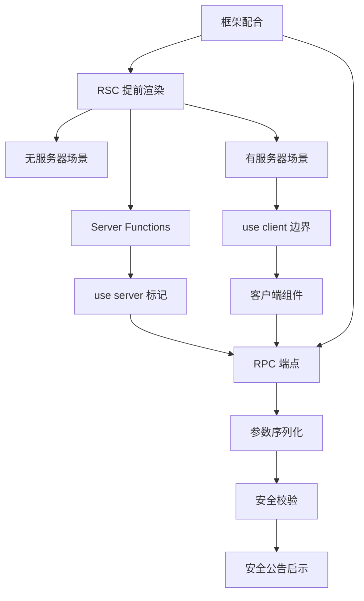
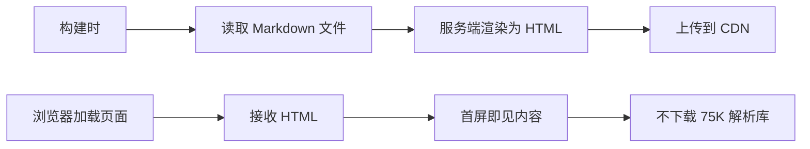
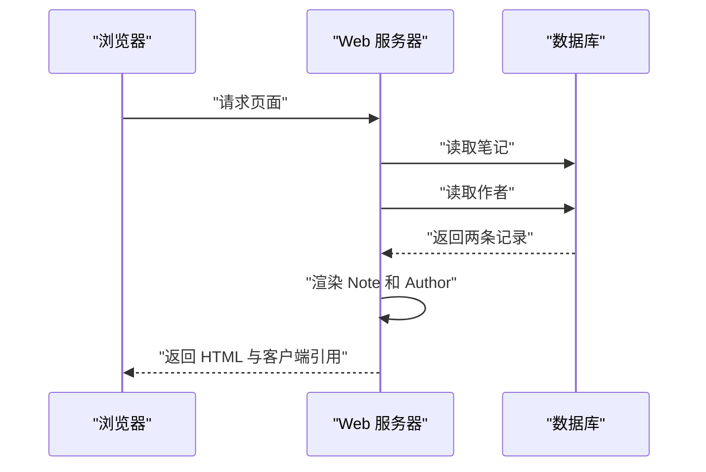
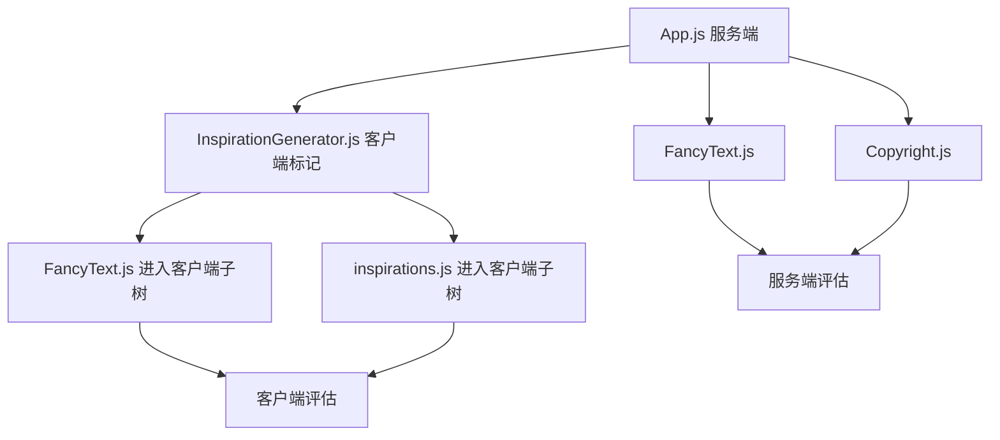
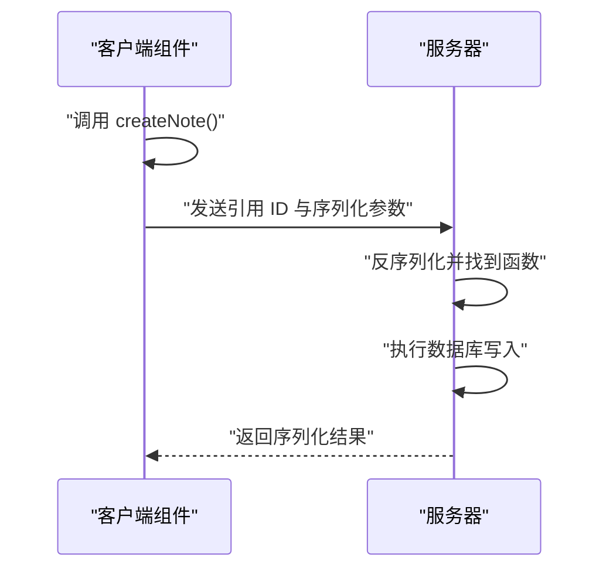
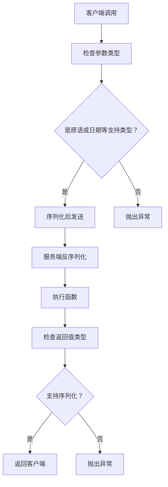
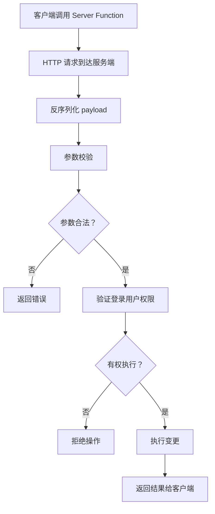
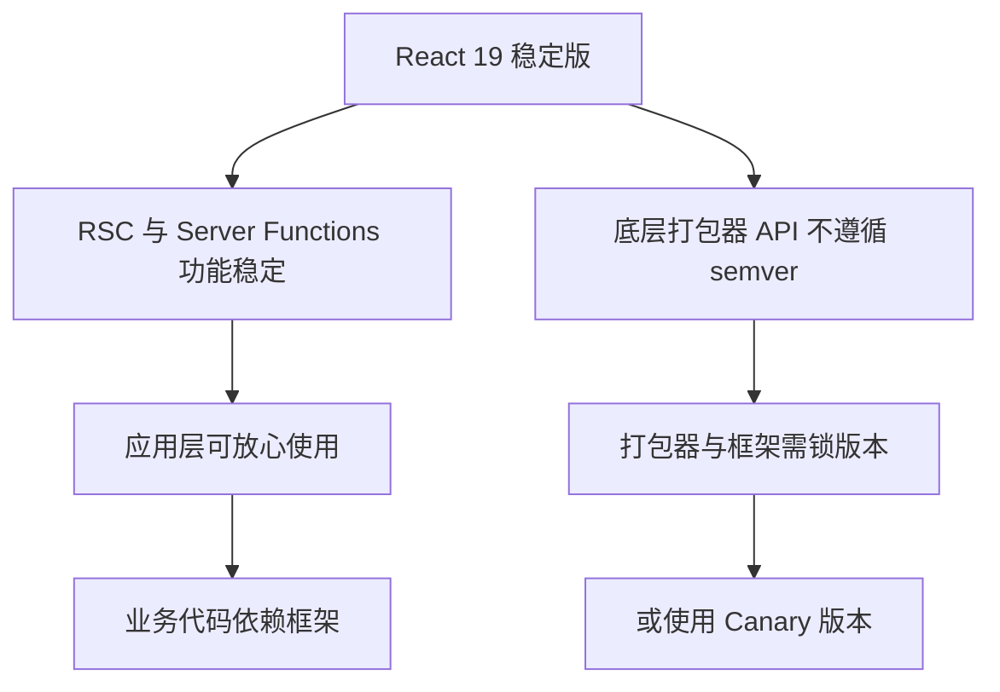
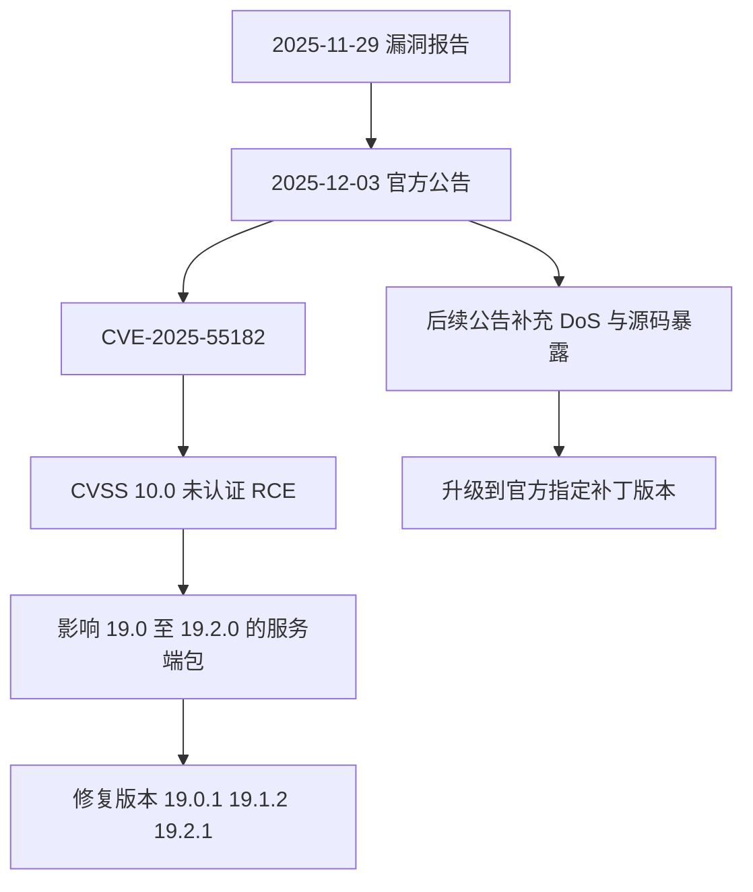

# Server Components 与 Server Actions：边界、序列化与安全

!!! abstract "学完这一页你能"
    - 准确说出 `'use client'` 与 `'use server'` 各自标记的对象，以及它们在模块依赖树中产生的边界。
    - 写出一个可在服务端读取数据并渲染的 Server Component，并说明客户端为什么拿不到它的源码。
    - 写出一个带参数校验与服务端授权检查的 Server Action，并解释为什么参数必须当不可信输入处理。
    - 根据官方安全公告，判断一个 React 版本是否受 CVE-2025-55182 影响，并给出升级动作。

## 0. 知识地图



建议先读第 1、2 节，把两种 Server Components 场景跑通。
再读第 3、4 节，理解两个指令是怎么切出边界的。
最后读第 5 到第 8 节，把序列化、安全、框架版本策略连起来看。

## 1. 为什么需要 Server Components

**先想一个问题**：你的页面要渲染 Markdown 内容。客户端需要下载 `marked` 和 `sanitize-html`，两个库 gzip 后共约 75K，还要等页面加载后再发第二次请求取数据。如果内容在构建时就能确定，为什么要让浏览器承担这些成本？

**心智模型**

!!! tip "心智模型"
    一句话模型：Server Components 在打包之前、在一个与客户端和 SSR 服务器都分离的环境里提前渲染。
    日常类比：去餐厅吃饭，后厨把菜做好端上来，你只需要吃，不需要把灶台和菜刀搬回家。
    类比不成立的地方：不是所有菜都能提前做。需要本地交互、状态、事件处理的组件仍然要在浏览器里运行。

!!! note "术语：React Server Components（RSC）"
    一种新的组件类型，它在打包之前渲染，运行环境与客户端应用或 SSR 服务器分离。这种分离环境就是 RSC 里的"服务器"。它可以在 CI 服务器上构建时跑一次，也可以在 Web 服务器上每个请求跑一次。

**图解**



1. 构建阶段读取 `page.md` 文件。
2. 服务端组件在渲染期间完成读取、Markdown 解析、HTML 清理。
3. 渲染结果被输出为 HTML，可以上传到 CDN。
4. 浏览器只收到渲染后的 `div`，看不到原始 `Page` 组件，也不下载那 75K 的库。

**一步一步来**

第 1 步：先看不用 RSC 的客户端方案，理解成本从哪来。

```js
// bundle.js 客户端代码
import marked from 'marked'; // 35.9K，gzip 后 11.2K
import sanitizeHtml from 'sanitize-html'; // 206K，gzip 后 63.3K
import { useState, useEffect } from 'react';

function Page({ page }) {
  const [content, setContent] = useState('');
  useEffect(() => {
    // 页面首次渲染之后才发请求
    fetch(`/api/content/${page}`).then((data) => {
      setContent(data.content);
    });
  }, [page]);
  return <div>{sanitizeHtml(marked(content))}</div>;
}
```

**这段代码在做什么**

- 两个大型库被打进客户端 bundle，gzip 后约 75K。
- 组件渲染之后，`useEffect` 才触发数据请求。
- 用户首屏看到的是空内容，要等第二次请求返回。
- 渲染静态内容却付出了库下载和额外请求双重成本。

运行结果：首屏先渲染空 `div`，请求返回后才有内容。浏览器下载并解析了约 75K 的库。

第 2 步：改用 Server Components，在构建时完成渲染。

```js
// Page.js 服务端组件
import marked from 'marked'; // 不打进客户端 bundle
import sanitizeHtml from 'sanitize-html'; // 不打进客户端 bundle

async function Page({ page }) {
  // 在构建时、渲染期间读取文件
  const content = await file.readFile(`${page}.md`);
  return <div>{sanitizeHtml(marked(content))}</div>;
}
```

**这段代码在做什么**

- `Page` 是 async 函数，Server Components 支持在渲染中 `await`。
- 文件读取发生在构建时，不是浏览器运行时。
- `marked` 和 `sanitizeHtml` 不进入客户端 bundle。
- 客户端只收到渲染后的 HTML 输出。

运行结果：客户端看到的内容是 `<div><!-- html for markdown --></div>`，首屏可见，bundle 不包含昂贵的解析库。

**动手验证**

下面是一个模拟构建时读取与渲染的 Node 20+ 脚本，验证服务端渲染不把大库传给客户端。

```js
// 依赖：无
// 运行：node rsc-build-sim.js
import assert from 'node:assert/strict';
import { readFileSync } from 'node:fs';

// 模拟一个极小的 Markdown 渲染函数，用它代表 marked
function markedSim(input) {
  return `<p>${input.trim()}</p>`;
}

// 模拟服务端构建时渲染
function renderPage(pagePath) {
  // 构建时读取文件
  const raw = readFileSync(pagePath, 'utf8');
  const html = markedSim(raw);
  // 客户端 bundle 里不含 marked 源码，只拿到输出
  return { clientPayload: `<div>${html}</div>`, clientBundleSize: 0 };
}

const result = renderPage('./note.md');
assert.deepEqual(result.clientPayload, '<div><p>你好，RSC</p></div>');
assert.equal(result.clientBundleSize, 0);
console.log('验证通过：客户端只收到渲染输出，不下载渲染库');
```

**常见坑**

| 现象 | 原因 | 怎么修 |
|------|------|--------|
| 在 Server Component 里用了 `useState` | 服务端组件无客户端状态 | 把交互部分抽到 `'use client'` 组件中 |
| 构建时读的文件改了，页面没更新 | 静态内容只在构建时渲染一次 | 改成每请求渲染，或触发重新构建 |
| 代码里写了 `window` 或 `document` | 服务端环境没有浏览器对象 | 把这些访问移到客户端组件或事件处理里 |

**用在哪里**

- 业务背景：企业官网的产品文档站，内容来自 Markdown 文件，发布后很少变化。
  这一节的知识怎么用：用 Server Components 在构建时读取并渲染，输出静态 HTML 进 CDN。
  用什么指标衡量收益：首屏 LCP 降低、客户端 JS 体积减少约 75K、无二次数据请求。
  什么时候不该用：内容每次请求都不同、需要按用户身份定制时，不应只用构建时渲染。

- 业务背景：电商商品详情页的富文本描述，商品信息存储在 CMS 中。
  这一节的知识怎么用：每请求在服务端读取 CMS 数据并渲染，客户端不下载富文本渲染器。
  用什么指标衡量收益：客户端 bundle 减少、商品描述首屏可见时间缩短。
  什么时候不该用：带实时价格刷新、用户评论区的区域，应保留为客户端组件。

- 业务背景：后台管理的报表导出页面，汇总数据在服务端计算。
  这一节的知识怎么用：在服务端组件内完成统计查询与表格渲染，客户端只拿结果。
  用什么指标衡量收益：接口请求数减少、大数据量不落到浏览器内存。
  什么时候不该用：需要用户本地筛选、排序、编辑的表格，交互部分应单独做客户端组件。

**行业实践**

- React 官方文档《Server Components》章节展示：构建时读取文件系统或 CMS 静态内容，不需要 Web 服务器。
  怎么借鉴到你的项目：把发布后不变的内容类页面改成构建时服务端渲染，输出静态 HTML。
- React 官方文档《Server Components》章节展示：每请求读取数据层，不再为每个数据单独写 API。
  怎么借鉴到你的项目：把服务端组件直接连数据库读数据，替代客户端 `useEffect` 瀑布请求。
- React 官方文档《Server Components》章节提醒：异步组件是 Server Components 的新能力，允许在渲染中 `await`。
  怎么借鉴到你的项目：数据获取写在组件渲染中，而不是写在 `useEffect` 里。

**小结**

- Server Components 把数据读取与渲染前移到服务端，客户端只拿输出。
- 构建时场景适合静态内容，每请求场景适合动态数据。
- 服务端组件不参与客户端交互，交互部分要单独标记。

## 2. 有服务器的 Server Components：请求时读数据

**先想一个问题**：页面要显示笔记和作者，不用 RSC 时客户端先请求笔记，等笔记返回再请求作者，形成一次客户端到服务器的瀑布。如果服务端本来就离数据库更近，为什么不直接在服务端读完两块数据？

**心智模型**

!!! tip "心智模型"
    一句话模型：Server Components 可以在 Web 服务器上每个请求运行，直接访问数据层，不需要你手动写一组 API。
    日常类比：点菜时服务员可以同时向后厨报两样菜，而不是端上一盘后再跑回后厨做下一盘。
    类比不成立的地方：服务端组件读取数据后仍然要经过序列化边界，才能把数据传给客户端组件。

!!! note "术语：数据层（Data Layer）"
    指应用访问数据库、缓存、对象存储等持久化数据的代码层。Server Components 可以绕过手写 HTTP API，直接调用数据层。

**图解**



1. 浏览器只发一个页面请求给服务器。
2. 服务器在组件渲染期间读取笔记数据。
3. 同一渲染阶段继续读取作者数据，不再经过客户端往返。
4. 服务器把渲染输出与客户端组件引用一起返回。
5. 浏览器看到渲染结果，不看到原始服务端组件代码。

**一步一步来**

第 1 步：先看不用 RSC 的动态数据读取，理解瀑布是怎么形成的。

```js
// 客户端代码：Note 和 Author 各自发请求
function Note({ id }) {
  const [note, setNote] = useState('');
  useEffect(() => {
    fetch(`/api/notes/${id}`).then((data) => setNote(data.note));
  }, [id]);

  return (
    <div>
      <Author id={note.authorId} />
      <p>{note}</p>
    </div>
  );
}
```

**这段代码在做什么**

- `Note` 先渲染，然后 `useEffect` 发起笔记请求。
- 笔记返回后才得到 `authorId`，再触发 `Author` 的请求。
- 两次请求串行发生，形成客户端到服务器的瀑布。
- 每个数据都对应一个手写 API 端点。

运行结果：浏览器至少发两次请求，且第二次依赖第一次的返回。

第 2 步：改成服务端组件，直接在渲染期间读数据。

```js
import db from './database';

async function Note({ id }) {
  // 渲染期间读取笔记
  const note = await db.notes.get(id);
  return (
    <div>
      <Author id={note.authorId} />
      <p>{note}</p>
    </div>
  );
}

async function Author({ id }) {
  // 渲染期间读取作者
  const author = await db.authors.get(id);
  return <span>By: {author.name}</span>;
}
```

**这段代码在做什么**

- `Note` 是 async 服务端组件，直接调用数据层。
- `Author` 在服务端渲染阶段读取作者数据。
- 浏览器不发起第二次数据请求。
- 捆绑器把数据、服务端渲染结果与动态客户端组件合成一个 bundle。

运行结果：浏览器最终收到 `<span>By: The React Team</span><p>React 19 is...</p>`，看不到原始 `Note` 与 `Author` 组件。

**动手验证**

下面脚本用 Node 20+ 的 `node:assert` 验证：服务端渲染只产生一个输出，客户端串行请求被消除。

```js
// 依赖：无
// 运行：node rsc-server-sim.js
import assert from 'node:assert/strict';

const db = {
  notes: { get: async (id) => ({ id, note: 'React 19 is...', authorId: 'a1' }) },
  authors: { get: async (id) => ({ id, name: 'The React Team' }) },
};

let clientFetchCount = 0; // 模拟旧方案里的客户端请求数

async function renderPageOld(id) {
  const note = await fetchNoteOld(id);
  const author = await fetchAuthorOld(note.authorId);
  return { note, author };
}

async function fetchNoteOld(id) { clientFetchCount++; return db.notes.get(id); }
async function fetchAuthorOld(id) { clientFetchCount++; return db.authors.get(id); }

// 服务端组件方案：直接在服务器读，客户端请求数为 0
async function renderPageNew(id) {
  const note = await db.notes.get(id);
  const author = await db.authors.get(note.authorId);
  return `<div><span>By: ${author.name}</span><p>${note.note}</p></div>`;
}

const oldResult = await renderPageOld('n1');
assert.equal(clientFetchCount, 2);
const newHtml = await renderPageNew('n1');
assert.equal(newHtml, '<div><span>By: The React Team</span><p>React 19 is...</p></div>');
console.log('验证通过：服务端读取消除了客户端串行请求');
```

**常见坑**

| 现象 | 原因 | 怎么修 |
|------|------|--------|
| 服务端组件里直接 `import` 了浏览器 API 库 | 该库会进入服务端运行环境却不可用 | 检查导入链，把浏览器专属依赖放到客户端组件 |
| 每次请求都慢 | 服务端组件里的数据查询有依赖且未合并 | 在数据层做联合查询或按渲染顺序分析耗时 |
| 客户端想把服务端组件当普通组件导入 | 服务端组件不能直接被客户端导入使用 | 只通过 props 传可序列化数据或传服务端函数引用 |

**用在哪里**

- 业务背景：社交信息流的动态卡片，服务端按用户关注列表生成内容。
  这一节的知识怎么用：在服务端组件读取关注列表和帖子数据，直接渲染。
  用什么指标衡量收益：客户端请求数从多次降到一次，首屏数据合并返回。
  什么时候不该用：用户需要在下拉刷新时客户端增量追加，这时仍然需要客户端数据请求。

- 业务背景：企业内部系统的报表页面，数据来自多个库表。
  这一节的知识怎么用：服务端组件内做多表读取与汇总，渲染后只给浏览器看结果。
  用什么指标衡量收益：减少手写 API，减少浏览器与服务器之间的往返次数。
  什么时候不该用：需要用户本地动态筛选、排序的交互报表。

- 业务背景：内容平台的作者主页，页面上有作者资料和文章列表。
  这一节的知识怎么用：服务端组件同时读取作者与文章，渲染为同一响应返回。
  用什么指标衡量收益：减少串行请求，避免用户先看到文章再等作者信息。
  什么时候不该用：文章列表需要无限滚动增量加载时，加载更多部分应单独处理。

**行业实践**

- React 官方文档《Server Components with a Server》展示：服务端组件可动态化，通过从服务器重新获取来再次访问数据并渲染。
  怎么借鉴到你的项目：对按请求变化的数据页面，采用每请求服务端渲染，保留客户端组件的交互层。
- React 官方文档《Server Components with a Server》展示：数据与渲染在组件中共同出现，不再为每份数据独立写 API。
  怎么借鉴到你的项目：数据访问代码直接放服务端组件，减少手写路由层。
- React 官方文档《Server Functions》章节指出：Server Functions 设计用于变更服务端状态，不推荐用于数据获取。
  怎么借鉴到你的项目：读数据用服务端组件，写数据用 Server Functions，不要混用。

**小结**

- 每请求渲染的 Server Component 直接访问数据层，去掉客户端瀑布。
- 浏览器只看到渲染结果，服务端组件源码不会发送到客户端。
- 动态化需要服务器支持重新获取组件并重新渲染。

## 3. `'use client'` 指令：客户端边界如何产生

**先想一个问题**：一个页面的某部分需要点击按钮切换状态，但页面整体是服务端渲染的。你怎么告诉打包器"这一个模块及其依赖必须在浏览器里运行"？

**心智模型**

!!! tip "心智模型"
    一句话模型：`'use client'` 标记一个模块及其传递依赖为客户端代码，在模块依赖树里切出一个客户端子树。
    日常类比：在部队里指定某个班长"你带这一个班的人去东边"，班长和他手下所有人都去东边，不管他们原来属于哪个排。
    类比不成立的地方：一个模块可能在服务端和客户端都被评估，取决于它被谁导入。

!!! note "术语：模块依赖树（Module Dependency Tree）"
    由模块间的 import 关系构成的图。`'use client'` 在树中标记节点，使该节点及其传递依赖形成客户端子树。

**图解**



1. `App.js` 是服务端模块，导入三个子模块。
2. `InspirationGenerator.js` 文件顶部有 `'use client'`，自身进入客户端子树。
3. 它的依赖 `FancyText.js` 和 `inspirations.js` 也进入客户端子树，不管这些文件有没有指令。
4. `App.js` 直接导入的 `FancyText.js` 仍可被服务端评估。
5. 同一个模块可能同时出现在服务端和客户端子树中，要看被谁导入。

**一步一步来**

第 1 步：写一个带 `'use client'` 的组件文件。

```js
'use client';

import { useState } from 'react';
import { formatDate } from './formatters';
import Button from './button';

export default function RichTextEditor({ timestamp, text }) {
  // 使用客户端状态
  const [draft, setDraft] = useState(text);
  const date = formatDate(timestamp);
  return (
    <div>
      <time>{date}</time>
      <textarea value={draft} onChange={(e) => setDraft(e.target.value)} />
      <Button>保存</Button>
    </div>
  );
}
```

**这段代码在做什么**

- 文件顶部第一行就是 `'use client'`，任何 import 或其他代码都排在其后。
- `useState` 只能在客户端运行，这是需要指令的原因之一。
- `formatDate` 和 `Button` 没有指令，但作为传递依赖也会在客户端评估。
- 从服务端组件导入该模块时，这里就是服务端与客户端之间的边界。

第 2 步：理解指令的传播规则。

```js
// 这行注释可以出现在指令上方
'use client';
// 指令必须位于文件最顶部，且只能使用单引号或双引号

// 以下导入的模块都进入客户端子树
import { formatDate } from './formatters';
import Button from './button';
```

**这段代码在做什么**

- 指令必须在文件最开始处，注释可以出现在指令上方。
- 指令不能用反引号书写。
- 被 `'use client'` 模块导入的模块，无论自身有无指令，都会被客户端评估。
- 一个模块可能被服务端代码导入时在服务端评估，被客户端代码导入时在客户端评估。

**动手验证**

下面脚本模拟模块依赖树中 `'use client'` 的传播规则。

```js
// 依赖：无
// 运行：node use-client-sim.js
import assert from 'node:assert/strict';

// 模块图：key 是模块，value 是它的直接依赖
const modules = {
  'App.js': ['FancyText.js', 'InspirationGenerator.js', 'Copyright.js'],
  'InspirationGenerator.js': ['FancyText.js', 'inspirations.js'],
};

// 模拟有 'use client' 的模块
const clientMarked = new Set(['InspirationGenerator.js']);

function computeClientModules(graph, marked) {
  const result = new Set(marked);
  // 传递闭包：标记模块的所有依赖都进入客户端子树
  for (const mod of result) {
    for (const dep of graph[mod] ?? []) {
      result.add(dep);
    }
  }
  return result;
}

const clientSet = computeClientModules(modules, clientMarked);
assert.ok(clientSet.has('InspirationGenerator.js'));
assert.ok(clientSet.has('inspirations.js'));
assert.ok(clientSet.has('FancyText.js'));
assert.ok(!clientSet.has('App.js'));
assert.ok(!clientSet.has('Copyright.js'));
console.log('验证通过：use client 指令及其传递依赖形成客户端子树');
```

**常见坑**

| 现象 | 原因 | 怎么修 |
|------|------|--------|
| 指令写在 import 之后 | `'use client'` 必须在文件最顶部 | 移到文件第一行，注释上方允许 |
| 客户端组件被服务端组件导入时传了函数 prop | 函数不是可序列化 prop 值 | 只传可序列化数据，或改传 Server Function 引用 |
| 以为有指令的才是客户端组件 | 传递依赖也会被客户端评估 | 检查整个客户端子树，而不是单个文件 |

**用在哪里**

- 业务背景：内容发布后台的富文本编辑器，需要本地草稿状态和光标处理。
  这一节的知识怎么用：把编辑器做成 `'use client'` 组件，从服务端组件传入初始文本。
  用什么指标衡量收益：服务端组件仍负责数据读取，客户端只承担交互逻辑。
  什么时候不该用：只展示静态格式化文本的部分，不应标记为客户端。

- 业务背景：电商商品详情页的加购按钮，需要用户点击反馈。
  这一节的知识怎么用：把按钮做成客户端组件，从服务端组件接收商品 ID 参数。
  用什么指标衡量收益：页面其他静态描述保持服务端渲染，仅交互部分进客户端。
  什么时候不该用：纯展示的价格标签不需要客户端指令。

- 业务背景：客服对话页面，需要实时消息状态和输入框。
  这一节的知识怎么用：输入框和消息列表作为客户端子树，服务端组件负责初始消息渲染。
  用什么指标衡量收益：减少首屏 JS 体积，交互模块按边界加载。
  什么时候不该用：历史消息只读展示部分可以不进客户端子树。

**行业实践**

- React 官方文档《`'use client'`》章节说明：当 `'use client'` 模块被另一个客户端模块导入时，指令没有效果。
  怎么借鉴到你的项目：客户端模块互相导入时不用重复加指令，只在边界文件加一次。
- React 官方文档《`'use client'`》章节说明：服务端模块从 `'use client'` 模块导入值，其值必须是 React 组件或可序列化 prop 值。
  怎么借鉴到你的项目：跨边界传递函数前，先确认它是否作为 Server Function 引用传递。
- React 官方文档《`'use client'`》章节说明：标记为客户端评估的代码不限于组件，客户端模块子树中的任何代码都会发送给客户端。
  怎么借鉴到你的项目：审查客户端子树时，不要把注意力只放在组件文件上，依赖文件同样会显示在浏览器里。

**小结**

- `'use client'` 标记模块及其传递依赖为客户端代码。
- 指令位于文件最顶部，单引号或双引号均可，不能用反引号。
- 服务端到客户端的边界由 import 关系决定，不是由文件扩展名决定。

## 4. `'use server'` 指令与 Server Functions

**先想一个问题**：客户端按钮点击后要往数据库写一条数据。你不想手写 REST 端点，也不想把数据库连接暴露给浏览器。怎么让客户端调用一个运行在服务端的函数？

**心智模型**

!!! tip "心智模型"
    一句话模型：`'use server'` 标记服务端函数，让框架自动生成一个引用传给客户端，客户端调用引用时框架发网络请求到服务端执行。
    日常类比：办公室前台的按钮连着一根内线电话，你按下按钮，接电话的人在后台仓库执行操作，你不直接进仓库。
    类比不成立的地方：内线电话不会把你的参数序列化成网络请求，也没有反序列化攻击面。

!!! note "术语：Server Functions 与 Server Actions"
    直到 2024 年 9 月，React 将所有 Server Functions 都称为 Server Actions。现在定义是：如果 Server Function 被传给 action prop 或从 action 内调用，它就是 Server Action，但不是所有 Server Function 都是 Server Action。

**图解**



1. 客户端拿到的是函数引用，不是真实函数实现。
2. 点击时 React 携带引用 ID 和参数发请求。
3. 服务端根据引用找到注册的函数。
4. 服务端执行函数体，访问数据库。
5. 返回值被序列化后送回客户端。

**一步一步来**

第 1 步：在 Server Component 内定义 Server Function 并传给客户端组件。

```js
// Server Component
import Button from './Button';

function EmptyNote() {
  async function createNoteAction() {
    // 函数体第一行是 use server
    'use server';
    await db.notes.create();
  }
  return <Button onClick={createNoteAction} />;
}
```

**这段代码在做什么**

- `createNoteAction` 是 async 函数，函数体第一行写 `'use server'`。
- React 渲染 `EmptyNote` 时创建该函数的引用。
- 引用作为 `onClick` 传给 `Button` 客户端组件。
- 客户端点击时，React 发请求到服务端执行函数。

运行结果：客户端 `console.log(onClick)` 显示 `{$$typeof: Symbol.for("react.server.reference"), $$id: 'createNoteAction'}`。

第 2 步：从客户端组件导入模块级 `'use server'` 的函数。

```js
// actions.js 文件顶部有模块级 use server
'use server';

export async function createNote() {
  await db.notes.create();
}
```

```js
// 客户端组件
'use client';
import { createNote } from './actions';

function EmptyNote() {
  // createNote 在客户端是引用对象
  return <button onClick={() => createNote()}>Create Empty Note</button>;
}
```

**这段代码在做什么**

- 模块顶部写 `'use server'`，该文件所有导出都成为 Server Functions。
- 客户端组件可以直接 import 并使用这些函数。
- 打包器在 bundle 中生成函数的引用，而不是函数实现。
- 调用时发送包含引用 ID 的请求到服务端。

**动手验证**

下面脚本验证 Server Function 引用结构与异步执行模拟。

```js
// 依赖：无
// 运行：node use-server-sim.js
import assert from 'node:assert/strict';

const serverRegistry = new Map();

// 框架自动生成的引用
function createServerReference(id) {
  const ref = {
    $$typeof: Symbol.for('react.server.reference'),
    $$id: id,
  };
  serverRegistry.set(id, async (args) => `执行 ${id}，参数：${JSON.stringify(args)}`);
  return ref;
}

async function callServerReference(ref, args) {
  const fn = serverRegistry.get(ref.$$id);
  return fn(args);
}

const createNoteRef = createServerReference('createNoteAction');
assert.equal(createNoteRef.$$typeof, Symbol.for('react.server.reference'));
assert.equal(createNoteRef.$$id, 'createNoteAction');

const result = await callServerReference(createNoteRef, { title: '新笔记' });
assert.equal(result, '执行 createNoteAction，参数：{"title":"新笔记"}');
console.log('验证通过：客户端拿到引用，服务端执行函数');
```

**常见坑**

| 现象 | 原因 | 怎么修 |
|------|------|--------|
| 在同步函数里写 `'use server'` | 底层网络调用始终是异步的 | 把函数改为 async 函数 |
| 从客户端代码导入函数体级的 Server Function | 函数体级指令不支持从客户端导入 | 改用模块级 `'use server'` 文件导出 |
| 把 Server Function 用于数据获取 | 框架通常一次处理一个 action，不缓存返回值 | 数据读取用服务端组件，Server Function 专注于变更 |

**用在哪里**

- 业务背景：电商下单按钮，用户点击后创建订单。
  这一节的知识怎么用：把创建订单逻辑写为 Server Function，按钮通过 `formAction` 调用。
  用什么指标衡量收益：减少手写接口层，变更逻辑与组件同文件或同模块管理。
  什么时候不该用：需要客户端乐观更新且对成功失败有复杂本地状态时，需要额外处理。

- 业务背景：后台管理的批量导入，用户上传文件后服务端处理。
  这一节的知识怎么用：Server Function 接收 `FormData`，在服务端解析文件并写入数据库。
  用什么指标衡量收益：文件不必进入客户端状态，导入逻辑不暴露在浏览器。
  什么时候不该用：文件需要本地预处理、预览时，预处理留在客户端做。

- 业务背景：用户资料更新表单，提交后更新昵称。
  这一节的知识怎么用：Server Function 接收表单 `FormData`，校验后写数据库。
  用什么指标衡量收益：表单默认保持原生提交能力，服务端函数统一处理校验与写库。
  什么时候不该用：需要实时代理到本地存储或离线优先场景。

**行业实践**

- React 官方文档《Server Functions》章节说明：Server Functions 可以用 `useTransition` 获知 pending 状态。
  怎么借鉴到你的项目：在按钮提交时用 `useTransition` 禁用按钮并显示提交中状态。
- React 官方文档《Server Functions with Form Actions》展示：React 19 的表单可直接把 Server Function 传给 `action`。
  怎么借鉴到你的项目：更新表单用 `<form action={updateName}>` 简化提交流程。
- React 官方文档《Server Functions》章节说明：Server Functions 用于变更服务端状态，不推荐用于数据获取。
  怎么借鉴到你的项目：把查询逻辑放入服务端组件渲染路径，而不是通过 Server Function 拉取。

**小结**

- `'use server'` 可写在 async 函数体内，也可写在文件顶部让所有导出成为 Server Functions。
- 客户端拿到的是引用对象，包含 `$$typeof` 与 `$$id`。
- 调用引用会触发网络请求并在服务端执行函数。

## 5. 组件树序列化：参数与返回值怎么过边界

**先想一个问题**：客户端调用 Server Function 时传了一个 `Date` 对象和一个 React 元素，为什么一个能通过、一个要报错？边界上的序列化规则到底怎么定？

**心智模型**

!!! tip "心智模型"
    一句话模型：跨服务端与客户端边界传递的值必须符合 React 定义的序列化类型列表，函数除了 Server Function 引用之外都不能传。
    日常类比：国际航班行李有允许托运清单，也有禁止清单。清单上的能过去，不在清单上的会被安检拦下。
    类比不成立的地方：飞机行李不会在过安检后变成一个引用对象，但函数传过去会变成服务端引用。

!!! note "术语：序列化（Serialization）"
    把内存中的值转换为可通过网络传输的格式，再在另一端恢复。Server Function 的调用通过网络传参，参数和返回值都必须可序列化。

**图解**



1. 调用 Server Function 时先检查每个参数。
2. 受支持的类型被序列化后发往服务端。
3. 不支持的参数直接抛异常，请求不发出。
4. 服务端执行函数后检查返回值。
5. 返回值也要满足序列化清单才能送回客户端。

**一步一步来**

第 1 步：看官方文档支持的参数类型清单。

```js
// 这些类型可以作为 Server Function 参数
// 注意这是文档规定，不是 JavaScript 自动支持
const supported = {
  str: 'hello',            // string
  num: 42,                 // number
  big: 10n,                // bigint
  bool: true,              // boolean
  undef: undefined,        // undefined
  nul: null,               // null
  sym: Symbol.for('x'),    // 仅全局符号注册表中的 symbol
  arr: [1, 2],             // Array
  map: new Map(),          // Map
  set: new Set(),          // Set
  typed: new Uint8Array(), // TypedArray 与 ArrayBuffer
  date: new Date(),        // Date
  form: new FormData(),    // FormData
  plain: { a: 1 },         // 普通对象，属性可序列化
};
```

**这段代码在做什么**

- 列出了 Server Function 参数的受支持类型。
- `Symbol` 只有通过 `Symbol.for` 注册的才被允许。
- `Map`、`Set`、`TypedArray`、`ArrayBuffer`、`Date`、`FormData` 都受支持。
- 普通对象指用对象字面量创建、属性可序列化的对象。

第 2 步：确认哪些类型不支持。

```js
// 这些类型不能作为 Server Function 参数
function BadComponent() { return <div />; }
const bad = {
  reactElement: <div />,        // React 元素或 JSX
  componentFn: BadComponent,    // 组件函数或任意非 Server Function 函数
  classInstance: new SomeClass(), // 类实例，内置类之外
  nullProto: Object.create(null), // null 原型对象
  localSymbol: Symbol('local'),   // 非全局注册的 symbol
  event: new Event('click'),      // 事件处理器中的事件
};
```

**这段代码在做什么**

- React 元素和 JSX 不能跨边界传递。
- 组件函数和非 Server Function 的函数不能传。
- 内置类之外的类实例不能传。
- 非全局注册的 `Symbol` 不能传。
- 事件对象不能传。

**动手验证**

下面脚本用 `node:assert` 检查参数序列化清单。

```js
// 依赖：无
// 运行：node serializable-sim.js
import assert from 'node:assert/strict';

function isSerializable(value) {
  if (value === null || value === undefined) return true;
  const t = typeof value;
  if (t === 'string' || t === 'number' || t === 'boolean' || t === 'bigint') return true;
  if (t === 'symbol') return value === Symbol.for(value.description);
  if (value instanceof Date) return true;
  if (value instanceof FormData) return true;
  if (Array.isArray(value)) return value.every(isSerializable);
  if (value instanceof Map || value instanceof Set) return true;
  if (value instanceof ArrayBuffer || ArrayBuffer.isView(value)) return true;
  if (t === 'object') {
    const proto = Object.getPrototypeOf(value);
    return proto === Object.prototype || proto === null;
  }
  if (t === 'function') {
    return value.$$typeof === Symbol.for('react.server.reference');
  }
  return false;
}

assert.equal(isSerializable('hello'), true);
assert.equal(isSerializable(new Date()), true);
assert.equal(isSerializable(Symbol.for('shared')), true);
assert.equal(isSerializable(Symbol('local')), false);
assert.equal(Object.is(isSerializable(<div />), false));
assert.equal(isSerializable({ a: 1 }), true);
console.log('验证通过：序列化清单按官方规则工作');
```

**常见坑**

| 现象 | 原因 | 怎么修 |
|------|------|--------|
| 传了一个箭头函数给客户端组件 | 非 Server Function 的函数不可序列化 | 改成 Server Function 引用或可序列化数据 |
| 传了 `Object.create(null)` 的对象 | null 原型对象不被支持 | 改用普通对象字面量 |
| 返回了包含 `Date` 的嵌套普通对象 | `Date` 本身受支持，但嵌套位置需按规则检查 | 提前在服务端把它转成字符串或时间戳 |

**用在哪里**

- 业务背景：后台管理的批量导入，提交 `FormData` 包含文件。
  这一节的知识怎么用：Server Function 参数接受 `FormData`，服务端读取文件内容。
  用什么指标衡量收益：文件直接到服务端，避免在客户端文本序列化。
  什么时候不该用：大文件上传需要断点续传或流式进度，需其他上传通道。

- 业务背景：商品列表页把筛选条件作为 Server Action 参数。
  这一节的知识怎么用：筛选条件用普通对象传，字段仅保留 string、number、boolean。
  用什么指标衡量收益：序列化行为可预测，边界错误在开发期暴露。
  什么时候不该用：筛选条件含复杂本地组件树时，应拆分边界。

- 业务背景：用户资料表单上有日期字段。
  这一节的知识怎么用：日期用 `Date` 或 ISO 字符串传给 Server Function。
  用什么指标衡量收益：避免时区歧义，序列化前后行为一致。
  什么时候不该用：需要根据用户本地时区动态展示时，建议传时间戳并本地格式化。

**行业实践**

- React 官方文档《Serializable arguments and return values》给出受支持类型完整清单。
  怎么借鉴到你的项目：在设计跨边界 prop 时逐项对照清单，不凭直觉决定。
- React 官方文档《How to build support for Server Functions》提醒底层 API 不遵循 semver。
  怎么借鉴到你的项目：做框架升级时锁定 React 版本，避免底层变化破坏序列化实现。
- React 官方文档《Security considerations》提醒参数完全由客户端控制。
  怎么借鉴到你的项目：序列化完成后进入的第一步就是校验，不要默认参数可信。

**小结**

- 跨边界参数与返回值都有明确序列化清单。
- React 元素、组件函数、任意非 Server Function 函数、类实例都不支持。
- 校验参数前，先把所有输入当不可信数据。

## 6. Server Actions 的安全模型：参数校验与服务端授权

**先想一个问题**：攻击者不点你的 UI，直接用 curl 构造一个请求打到 Server Function 端点。你写在客户端代码里的参数检查，能挡住这个请求吗？

**心智模型**

!!! tip "心智模型"
    一句话模型：Server Function 的参数完全由客户端控制，安全校验必须发生在服务端函数体内，不能假设客户端已经检查过。
    日常类比：银行柜台不会因为客户说"我在手机上算过余额了"就相信，柜台必须再核对一次。
    类比不成立的地方：银行柜台有物理身份验证，而 HTTP 请求可能来自任何人，必须先做登录态与授权检查。

!!! note "术语：RPC 端点（Remote Procedure Call Endpoint）"
    允许远程调用方通过网络触发本地函数执行的入口。Server Functions 就是一类 RPC 端点，攻击面是 HTTP 请求的 payload 反序列化。

**图解**



1. 请求先经过反序列化。
2. 紧接着校验参数格式与内容。
3. 参数合法后才验证登录用户的权限。
4. 权限通过才执行数据库变更。
5. 错误结果也要作为序列化返回值送回客户端。

**一步一步来**

第 1 步：写一个带参数校验的 Server Function。

```js
// actions.js
'use server';

export async function updateName(name) {
  // 第一步：参数校验
  if (!name) {
    return { error: 'Name is required' };
  }
  await db.users.updateName(name);
}
```

**这段代码在做什么**

- `name` 来自客户端，不假设它非空。
- 空值时函数返回错误对象，不执行数据库变更。
- 校验写在实际变更之前。
- 错误通过返回值序列化回客户端。

第 2 步：客户端处理错误与 pending 状态。

```js
'use client';

import { updateName } from './actions';
import { useState, useTransition } from 'react';

function UpdateName() {
  const [name, setName] = useState('');
  const [error, setError] = useState(null);
  const [isPending, startTransition] = useTransition();

  const submitAction = async () => {
    startTransition(async () => {
      const { error } = await updateName(name);
      startTransition(() => {
        if (error) {
          setError(error);
        } else {
          setName('');
        }
      });
    });
  };

  return (
    <form action={submitAction}>
      <input type="text" name="name" disabled={isPending} />
      {error && <span>Failed: {error}</span>}
    </form>
  );
}
```

**这段代码在做什么**

- `isPending` 来自 `useTransition`，用于禁用输入框。
- 调用 `updateName` 后在客户端处理返回的错误。
- 成功时清空输入，失败时显示错误。
- 客户端在处理返回值，但校验本身在服务端已经完成。

**动手验证**

下面脚本模拟客户端绕过校验，验证服务端拦截。

```js
// 依赖：无
// 运行：node rpc-security-sim.js
import assert from 'node:assert/strict';

const db = {
  users: {
    updateName: async (name) => {
      if (!name || typeof name !== 'string') throw new Error('Invalid name');
      // 模拟数据库更新
      return { ok: true };
    },
  },
};

async function updateName(name, session) {
  // 服务端参数校验：不过滤，直接拦截
  if (!name || typeof name !== 'string') {
    return { error: 'Name is required' };
  }
  // 服务端授权：验证 session
  if (!session?.userId) {
    return { error: 'Unauthorized' };
  }
  await db.users.updateName(name);
  return { ok: true };
}

// 攻击者直接调用端点，传空值且无 session
const attackResult = await updateName('', {});
assert.deepEqual(attackResult, { error: 'Name is required' });

// 正常用户携带 session
const okResult = await updateName('新名字', { userId: 'u1' });
assert.deepEqual(okResult, { ok: true });

console.log('验证通过：参数校验与授权都在服务端执行');
```

**常见坑**

| 现象 | 原因 | 怎么修 |
|------|------|--------|
| 只在客户端禁用了按钮 | 攻击者不经过 UI 直接发送请求 | 服务端必须独立校验 |
| 登录态存在客户端且不验证 | cookie 可被伪造或重放 | 服务端读会话并验证用户身份 |
| 错误信息返回堆栈 | 异常未捕获，细节泄露给攻击者 | 捕获异常，返回通用错误消息 |

**用在哪里**

- 业务背景：银行转账表单，用户在页面填写金额与收款人。
  这一节的知识怎么用：Server Function 内先校验金额、收款人格式，再验证登录用户有权转账。
  用什么指标衡量收益：拦截非法请求，避免未授权资金变更。
  什么时候不该用：需要双因子验证或硬件密钥时，单靠 Server Function 授权不够。

- 业务背景：团队协作软件中用户删除文档。
  这一节的知识怎么用：Server Function 内校验文档 ID，并查询该用户是否是该文档所有者。
  用什么指标衡量收益：越权删除被服务端拒绝，审计日志可记录操作人。
  什么时候不该用：需要多级审批流时，应把审批逻辑放在独立业务层。

- 业务背景：管理系统批量修改用户角色。
  这一节的知识怎么用：Server Function 内校验角色枚举值，并确认操作者是管理员。
  用什么指标衡量收益：普通用户无法通过伪造请求提升角色。
  什么时候不该用：角色变更需要事后通知或补偿流程时，需与消息系统配合。

**行业实践**

- React 官方文档《Security considerations》写明：Server Functions 的参数完全由客户端控制，始终当不可信输入处理，并做校验与转义。
  怎么借鉴到你的项目：在函数体内第一段写参数规则，再写授权查询，再写业务逻辑。
- React 官方文档《Security considerations》写明：在任何一个 Server Function 中，都要验证登录用户是否被允许执行该操作。
  怎么借鉴到你的项目：每个变更函数都读取会话并判断权限，不只在页面入口判断。
- React 官方文档《Server Functions》的 Forms 用法展示：`<form action={updateName}>` 自动在 transition 中调用，便于改进式增强。
  怎么借鉴到你的项目：表单直接绑定 Server Function，保持原生表单可提交，减少手写 `onSubmit`。

**小结**

- Server Function 参数就是 HTTP 请求数据，必须假设来自攻击者。
- 参数校验与授权必须在服务端函数体内完成。
- 客户端校验只能改善体验，不能作为安全边界。

## 7. 为什么必须依赖框架

**先想一个问题**：你说服团队直接用 React 19 的 RSC，不引入 Next.js 或 Vite 插件。你准备自己写序列化、打包器集成、服务端路由。这可行吗？

**心智模型**

!!! tip "心智模型"
    一句话模型：React 19 的 RSC 与 Server Functions 在功能层面稳定，但实现它们的底层打包器 API 不遵循 semver，可能在小版本间破坏，必须由框架锁定和管理。
    日常类比：汽车厂商发布了一款稳定车型，但发动机内部零件规格还在调整，普通车主不该直接打开引擎盖改装。
    类比不成立的地方：汽车零件不对车主可见，但底层 API 对打包器开发者可见，需要专门团队跟踪。

!!! note "术语：semver（语义化版本）
    用主版本.次版本.修订号表示软件版本。小版本内只应增加向后兼容功能。官方文档指出 RSC 底层 API 不遵循这一规则。

**图解**



1. React 19 对使用者提供了稳定的 RSC 功能。
2. 实现 RSC 的底层 API 不保证小版本兼容。
3. 打包器和框架要精确锁定 React 版本。
4. 框架为应用层隔离了底层版本变化。
5. 业务代码通过框架使用 RSC，不直接触碰不稳定的底层。

**一步一步来**

第 1 步：理解官方文档的版本策略建议。

```js
// 这是官方文档说明，并不是可运行的 React 代码
// React 19 的 RSC 与 Server Functions 稳定，小版本间不破坏
// 但底层打包器 API 不遵循 semver，可能在 19.x 小版本间变化
// 建议打包器或框架锁定特定 React 版本，或使用 Canary 版本
const versionPolicy = {
  stable: ['RSC features', 'Server Functions'],
  unstable: ['underlying bundler APIs'],
  recommendation: ['pin specific React version', 'or use Canary release'],
};
```

**这段代码在做什么**

- 用对象表达官方文档中的版本策略。
- RSC 与 Server Functions 列为稳定部分。
- 底层打包器 API 列为不稳定部分。
- 建议指锁定版本或使用 Canary。

第 2 步：明确框架在这一层做的事。

```js
// 伪代码：框架层做的事
function frameworkBuild() {
  // 框架锁定 React 版本
  const reactVersion = '19.x.pinned';
  // 框架处理 RSC 与 Server Functions 的打包协议
  const bundler = createRscBundler({ reactVersion });
  // 业务代码只看到组件与函数，不触碰底层 API
  return bundler.build();
}
```

**这段代码在做什么**

- 框架锁定 React 版本，不是应用代码负责。
- 打包器集成由框架提供，应用层只写组件。
- 业务代码依赖框架 API，而不是直接依赖底层打包器 API。
- 升级路径跟随框架的补丁更新。

**动手验证**

下面脚本模拟依赖版本约束，验证稳定与不稳定两套规则。

```js
// 依赖：无
// 运行：node framework-sim.js
import assert from 'node:assert/strict';

const semver = {
  isStableRscInReact19: true, // 官方文档确认 19.x 小版本间不破坏
  underlyingBundlerApiFollowsSemver: false, // 官方文档确认不遵循 semver
};

function recommendFor(role) {
  if (role === 'bundler') return '锁定特定 React 版本或使用 Canary';
  if (role === 'app') return '通过框架使用 RSC，不自行实现底层 API';
  return '未定义角色';
}

assert.equal(semver.isStableRscInReact19, true);
assert.equal(semver.underlyingBundlerApiFollowsSemver, false);
assert.equal(recommendFor('bundler'), '锁定特定 React 版本或使用 Canary');
assert.equal(recommendFor('app'), '通过框架使用 RSC，不自行实现底层 API');
console.log('验证通过：稳定面与底层 API 分开制定版本策略');
```

**常见坑**

| 现象 | 原因 | 怎么修 |
|------|------|--------|
| 在小版本升级 React 后 RSC 打包失败 | 底层打包器 API 不遵循 semver | 按框架要求锁定版本或升级完整工具链 |
| 直接用 `react-server-dom-*` 包做自制集成 | 底层 API 可能在小版本间变化 | 由框架集成，业务代码不直接对接 |
| 把 Canary 版本当稳定版用于生产 | Canary 用于跟踪底层 API 变化 | 生产环境用框架推荐的稳定 React 版本 |

**用在哪里**

- 业务背景：团队自研构建工具，希望直接支持 RSC。
  这一节的知识怎么用：评估是否真的需要自研，官方文档建议基于 Canary 或锁定版本跟踪底层 API。
  用什么指标衡量收益：避免小版本升级隐藏的协议破坏。
  什么时候不该用：业务团队不该自研，应选择成熟框架。

- 业务背景：公司内部多个前端项目，需要统一 React 版本策略。
  这一节的知识怎么用：由平台团队锁定 React 版本与框架版本，业务项目跟随平台。
  用什么指标衡量收益：升级路径可控，RSC 协议变化可测试。
  什么时候不该用：项目没有 RSC 场景时，不需要这套绑定。

- 业务背景：评估从传统 CSR 迁移到 RSC 框架。
  这一节的知识怎么用：评估框架对 RSC 的封装是否符合官方版本建议。
  用什么指标衡量收益：降低底层 API 变化带来的维护成本。
  什么时候不该用：小规模静态页面可能不需要 RSC 复杂度。

**行业实践**

- React 官方文档《How do I build support for Server Components》写明：底层 API 不遵循 semver，建议打包器或框架锁定 React 版本或使用 Canary。
  怎么借鉴到你的项目：平台团队锁定版本，业务团队不直接锁 React 小版本。
- React 官方文档《How do I build support for Server Functions》同样写明：Server Functions 稳定，但底层 API 可能在小版本间变化。
  怎么借鉴到你的项目：框架升级时同时验证 RSC 与 Server Functions 两条链路。
- React 官方文档展示：Server Functions 的框架实现自动创建函数引用并传递给客户端。
  怎么借鉴到你的项目：业务代码依赖框架生成的引用，不自行封装 RPC 协议。

**小结**

- React 19 的 RSC 与 Server Functions 功能稳定，但底层打包器 API 不稳定。
- 框架负责锁定版本并封装底层协议。
- 业务代码应通过框架使用 RSC，而不是直接实现底层集成。

## 8. 2025 年底安全公告的工程启示

**先想一个问题**：你的应用没有显式实现 Server Function 端点，但用了支持 RSC 的框架。官方公告说你在某些版本下仍可能受影响。你该怎么确认？

**心智模型**

!!! tip "心智模型"
    一句话模型：这次漏洞在 React 解码 Server Function 端点 payload 的反序列化环节，只要应用包使用含漏洞的 React 服务端包，即使没写任何 Server Function 端点也可能受影响。
    日常类比：楼里公共水管有裂缝，你家水龙头没坏也可能被渗水波及，因为同一套管网供水。
    类比不成立的地方：水管漏水不会执行远程代码，而反序列化漏洞可能让攻击者在服务器上运行任意命令。

!!! note "术语：CVE（Common Vulnerabilities and Exposures）"
    公开披露的安全漏洞编号，例如 CVE-2025-55182。它由 CVE 组织分配，便于跟踪、修复与影响面评估。

**图解**



1. 漏洞由 Lachlan Davidson 于 2025 年 11 月 29 日报告。
2. React Team 于 2025 年 12 月 3 日发布公告。
3. 分配编号 CVE-2025-55182，评级 CVSS 10.0。
4. 影响 `react-server-dom-webpack`、`react-server-dom-parcel`、`react-server-dom-turbopack` 的特定版本。
5. 修复版本为 19.0.1、19.1.2、19.2.1。
6. 公告后续还列出 DoS 与源码暴露相关的其他 CVE。

**一步一步来**

第 1 步：识别受影响包与版本范围。

```js
// 依据官方公告的内容
const affected = {
  reactServerDomWebpack: ['19.0', '19.1.0', '19.1.1', '19.2.0'],
  reactServerDomParcel: ['19.0', '19.1.0', '19.1.1', '19.2.0'],
  reactServerDomTurbopack: ['19.0', '19.1.0', '19.1.1', '19.2.0'],
};
const fixed = {
  reactServerDomWebpack: ['19.0.1', '19.1.2', '19.2.1'],
  reactServerDomParcel: ['19.0.1', '19.1.2', '19.2.1'],
  reactServerDomTurbopack: ['19.0.1', '19.1.2', '19.2.1'],
};
```

**这段代码在做什么**

- 受影响版本是三个 RSC 相关 npm 包的 19.0、19.1.0、19.1.1、19.2.0。
- 修复版本分别对应 19.0.1、19.1.2、19.2.1。
- 即使应用没写 Server Function 端点，只要用了这些包且支持 RSC 就可能受影响。
- 具体影响与框架版本对应关系在官方公告有更新说明。

第 2 步：确认框架级升级操作。

```bash
# Next.js 示例，版本号来自官方公告，需按公告更新核对
npm install next@15.5.10   # 用于 15.5.x
npm install next@16.0.11   # 用于 16.0.x
npm install next@16.1.5    # 用于 16.1.x
```

**这段代码在做什么**

- 官方公告列出了 Next.js 各版本线的补丁版本。
- 不同版本线对应不同补丁包，必须按当前版本选择。
- 这些版本号来自公告中的 Update Instructions，具体以官方最新公告为准。
- 其他框架如 React Router、Waku、Vite 插件也有对应升级命令。

**动手验证**

下面脚本检查一个项目包版本是否落在受影响范围。

```js
// 依赖：无
// 运行：node cve-check-sim.js
import assert from 'node:assert/strict';

const affectedVersions = new Set(['19.0', '19.1.0', '19.1.1', '19.2.0']);

function isAffected(pkgVersion) {
  return affectedVersions.has(pkgVersion);
}

assert.equal(isAffected('19.2.0'), true);
assert.equal(isAffected('19.2.1'), false);
assert.equal(isAffected('18.3.1'), false);
console.log('验证通过：按官方公告版本范围正确识别受影响版本');
```

**常见坑**

| 现象 | 原因 | 怎么修 |
|------|------|--------|
| 以为没写 Server Function 端点就不受影响 | 公告写明只要支持 RSC 就可能受影响 | 检查服务端包是否存在受影响版本 |
| 只升级了 `next`，没检查底层 `react-server-dom-*` | 底层包可能被锁定在旧版本 | 按公告同时核对底层包版本 |
| 依赖托管提供商的缓解措施 | 托管商缓解不是长期修复 | 立即升级到官方补丁版本 |

**用在哪里**

- 业务背景：生产环境使用 Next.js 15.5 且启用了 App Router。
  这一节的知识怎么用：按公告把 `next` 升级到对应补丁版本，并在部署后检查底层包。
  用什么指标衡量收益：消除 CVSS 10.0 的未认证 RCE 攻击面。
  什么时候不该用：应用未使用任何 RSC 相关包时，不在受影响范围。

- 业务背景：公司维护多个前端项目，部分使用 React Router 的 RSC 能力。
  这一节的知识怎么用：逐个项目核对 `react-server-dom-parcel` 与 `@vitejs/plugin-rsc` 版本并升级。
  用什么指标衡量收益：阻断通过 RSC 端点进入的攻击路径。
  什么时候不该用：纯 Vite CSR 项目不使用 RSC 包。

- 业务背景：安全团队要求对所有 RSC 应用做应急响应。
  这一节的知识怎么用：把官方公告的 CVE 列表转换为项目依赖扫描规则。
  用什么指标衡量收益：自动化发现受影响包，缩短修复时间。
  什么时候不该用：没有服务端渲染能力的纯静态站点。

**行业实践**

- React 官方博客《Critical Security Vulnerability in React Server Components》写明：即使应用没有实现 Server Function 端点，只要支持 RSC 也可能受影响。
  怎么借鉴到你的项目：把 RSC 依赖扫描纳入安全基线，不按"是否写了端点"缩小范围。
- React 官方博客列出每个受影响框架的具体升级版本，并持续更新后续 CVE。
  怎么借鉴到你的项目：订阅官方公告更新，修复时引用公告内具体版本号，不自行估算。
- React 官方博客说明漏洞发生在 React 解码 Server Function 端点 payload 的反序列化环节。
  怎么借鉴到你的项目：把 Server Function 端点视为高攻击面入口，在网关层增加请求监控与审计。

**小结**

- CVE-2025-55182 是 CVSS 10.0 的未认证 RCE，影响特定 RSC 服务端包版本。
- 修复动作以官方公告版本号为准，不同框架升级路径不同。
- 安全实践底线：参数不可信、端点在服务端授权、依赖版本持续跟踪。

## 应用地图

| 场景 | 用到本页哪个知识点 | 典型技术选型 | 注意事项 |
|------|------|------|------|
| 内容站 Markdown 页 | 构建时 Server Components | RSC 框架静态渲染 + CDN | 内容更新需重新构建 |
| 电商商品详情 | 每请求服务端读取 | Next.js App Router 或同类框架 | 客户端交互部分单独拆组件 |
| 用户资料更新表单 | Server Function + Form Actions | React 19 form action | 服务端必须校验与授权 |
| 后台批量导入 | Server Function 接收 FormData | RSC 框架 + 文件解析 | 注意序列化类型与大文件路径 |
| 社交信息流 | 服务端组件读数据层 | 每请求渲染 + 客户端增量拉取 | 服务端渲染首屏，增量走客户端 |
| 团队协作删除操作 | Server Action 安全模型 | RPC 端点 + 会话验证 | 越权检查必须在服务端 |
| 自研构建工具 | 底层 API 版本策略 | 框架集成或 Canary 跟踪 | 不遵循 semver，需锁版本 |
| 安全应急响应 | CVE-2025-55182 公告 | 依赖扫描 + 官方补丁 | 不写端点也可能受影响 |

## 动手作业

**目标**：做一个极小的"留言板写入器"模型，在 Node 20+ 中模拟 Server Function 的引用传递、参数校验、服务端授权与序列化返回。

**步骤**

1. 在单文件里实现一个 `serverRegistry`，存放服务端函数及其校验逻辑。
2. 实现 `createServerReference(id)`，返回带 `$$typeof` 与 `$$id` 的引用对象。
3. 实现 `callServerReference(ref, args, session)`，模拟客户端到服务端的调用。
4. 写两个服务端函数：`addMessage(message)` 和 `deleteMessage(id)`。
5. 每个函数先校验参数，再验证 `session.userId` 是否存在。
6. 用 `node:assert` 写 4 个断言：正常写入、参数非法、未授权、返回值序列化。
7. 运行脚本并确认所有断言通过，打印预期输出。

**验收标准**

- 脚本为单文件，用 `node 文件名.js` 可直接运行。
- 包含至少 6 条 `node:assert` 断言。
- 打印内容说明哪些断言通过。
- 所有代码块已闭合，无 emoji。

## 综合对比

| 维度 | Server Component | Client Component | Server Function |
|------|------|------|------|
| 运行环境 | 服务端，构建时或每请求 | 浏览器 | 服务端，被客户端远程调用 |
| 能否访问数据库 | 可以 | 不可以，除非经授权 API | 可以 |
| 能否使用 useState | 不可以 | 可以 | 不直接涉及 |
| 能否处理浏览器事件 | 不可以 | 可以 | 不直接涉及 |
| 跨边界角色 | 向客户端传渲染结果 | 向服务端传事件参数 | 接收不可信参数执行变更 |
| 主要安全风险 | 数据泄露 | XSS 与本地状态 | 未认证 RCE、越权、反序列化 |

## 深入阅读与参考

!!! tip "怎么用这些资料"
    先读「官方文档与规范」建立准确的概念，再读「源码与示例」核对细节，最后用「教程、书籍与视频」换一种讲法加深理解。每条都写明了读哪一节、带着什么问题读。

### 官方文档与规范

| 资源 | 为什么读 | 怎么读 |
|---|---|---|
| [React Server Components 参考](https://react.dev/reference/rsc/server-components) | 官方对 Server Components 能力与限制的总览，是判断边界的准绳。 | 通读 Server Components 与限制小节，带着“哪些 API 不能用”读，再在项目里验证。 |
| ['use client'](https://react.dev/reference/rsc/use-client) | 精确定义客户端边界在哪落地，以及重复指令等常见陷阱。 | 读用法与注意事项，问“边界落在组件树哪一层”，读完给自家组件树标注边界。 |
| ['use server'](https://react.dev/reference/rsc/use-server) | 定义 Server Functions 的指令语义与可导出位置约束。 | 读语法、可放置位置与 caveats，再改造一个 action 文件验证约束。 |
| [Server Functions](https://react.dev/reference/rsc/server-functions) | 讲清 Server Functions 与 Actions 的关系及调用约定。 | 重点读参数与返回值一节，列出可传类型清单，逐项核对自己的 action。 |
| [Next.js 文档](https://nextjs.org/docs) | 完整实现 RSC 与 Server Actions 的框架文档，最贴近工程实践。 | 读 App Router 的 Server Actions、缓存与再验证章节，边读边跑最小示例。 |
| [Critical Security Vulnerability in React Server Components](https://react.dev/blog/2025/12/03/critical-security-vulnerability-in-react-server-components) | 反序列化漏洞的一手公告，直观说明边界就是攻击面。 | 读漏洞成因与修复版本，问“哪一步处理了不可信输入”，随后升级依赖。 |
| [Denial of Service and Source Code Exposure in React Server Components](https://react.dev/blog/2025/12/11/denial-of-service-and-source-code-exposure-in-react-server-components) | 补充 DoS 与源码泄露视角，说明服务端组件输出的额外风险。 | 读影响范围与缓解措施，对照检查自身框架版本与部署配置。 |
| [React Working Group 与 RFC](https://github.com/reactjs/rfcs) | 设计动机的一手材料，解释边界为何这样划分。 | 挑 Server Components RFC 读 Motivation 一节，写三句话摘要说明理由。 |
| [resume](https://react.dev/reference/react-dom/server/resume) | 与跨边界状态序列化与恢复直接相关，体现流式传输契约。 | 读签名与限制，问“哪些状态必须序列化”，再对照 renderToReadableStream。 |

### 源码与示例

| 资源 | 为什么读 | 怎么读 |
|---|---|---|
| [Server Functions](https://book.leptos.dev/server/25_server_functions.html) | 源码目录下的实现说明，揭示指令背后的编译与运行时处理。 | 重点读指令转换与序列化段落，与官方 reference 对照，验证理解是否有偏差。 |
| [React 19 发布博客](https://react.dev/blog/2024/12/05/react-19) | 含可直接运行的 Actions 与 use 示例，上手新 API 最快。 | 逐个运行 Actions 示例，观察表单提交时参数如何跨边界传递并记录结果。 |

### 教程、书籍与视频

| 资源 | 为什么读 | 怎么读 |
|---|---|---|
| [Josh Comeau：Server Components](https://www.joshwcomeau.com/react/server-components/) | 图文并茂讲清服务端与客户端组件的边界，适合建立直觉模型。 | 读完画一张边界图，再对照自己的项目代码找出边界错配的位置。 |
| [Overreacted：The Two Reacts](https://overreacted.io/the-two-reacts/) | 用“两个 React”的心智模型解释 RSC 由来，入门友好。 | 读完后用一句话概括两侧职责，再回到本页重读边界与序列化章节。 |

## 自测题

??? question "`'use client'` 指令标记的是什么范围？"
    要点：它标记一个模块及其传递依赖为客户端代码，在模块依赖树中创建客户端子树。该子树中的任何代码都会发送到浏览器并执行。一个模块可能既被服务端评估也被客户端评估，取决于导入方。

??? question "`'use server'` 写在函数体内和写在文件顶部有什么区别？"
    要点：函数体内写 `'use server'` 标记单个 async 函数为 Server Function。文件顶部写 `'use server'` 会让该文件所有导出都成为 Server Functions，可直接从客户端导入。函数体级指令不能从客户端导入函数。

??? question "为什么说 Server Function 参数必须当不可信输入？"
    要点：客户端调用 Server Function 本质是发送网络请求，参数经过序列化后被服务端反序列化。攻击者可以不经过 UI 直接构造 HTTP 请求。官方文档明确要求校验和转义参数，并验证登录用户权限。

??? question "Server Function 的参数支持哪些主要类型？"
    要点：string、number、bigint、boolean、undefined、null、全局注册的 Symbol、可序列化 Iterable、Date、FormData、普通对象、Server Functions、Promises。不支持 React 元素、组件函数、非 Server Function 函数、类实例、null 原型对象、非全局注册 Symbol、事件对象。

??? question "为什么 React 19 的 RSC 功能稳定，但官方仍建议通过框架使用？"
    要点：RSC 与 Server Functions 的功能在 19.x 小版本间稳定。但实现 RSC 的底层打包器 API 不遵循 semver，可能在小版本间破坏。框架封装并锁定这些底层变化，应用代码不应直接对接。

??? question "CVE-2025-55182 的漏洞发生在哪个环节？"
    要点：官方公告写明漏洞发生在 React 解码 Server Function 端点 payload 的反序列化环节。攻击者可构造恶意 HTTP 请求，反序列化时在服务器上实现远程代码执行。这是未认证 RCE，CVSS 10.0。

??? question "应用没有写 Server Function 端点，是否不受 CVE-2025-55182 影响？"
    要点：官方公告明确写明，即使应用没有实现任何 React Server Function 端点，只要应用支持 React Server Components 且使用了受影响版本的 RSC 服务端包，仍可能受影响。需要检查底层 react-server-dom-* 包版本。

??? question "Server Function 为什么不推荐用于数据获取？"
    要点：官方文档说明 Server Functions 设计用于变更服务端状态，不推荐用于数据获取。实现 Server Functions 的框架通常一次处理一个 action，并且没有缓存返回值的能力。数据读取应使用服务端组件的渲染路径。

## 延伸阅读

- React 官方文档《Server Components》：Server Components without a Server 与 Server Components with a Server。
- React 官方文档《`'use client'`》：Caveats 部分。
- React 官方文档《`'use server'`》：Security considerations 与 Serializable arguments and return values。
- React 官方文档《Server Functions》：Usage、Creating a Server Function from a Server Component、Server Functions with Actions、Server Functions with Form Actions。
- React 官方博客《Critical Security Vulnerability in React Server Components》：Immediate Action Required 与 Update Instructions。
