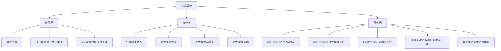
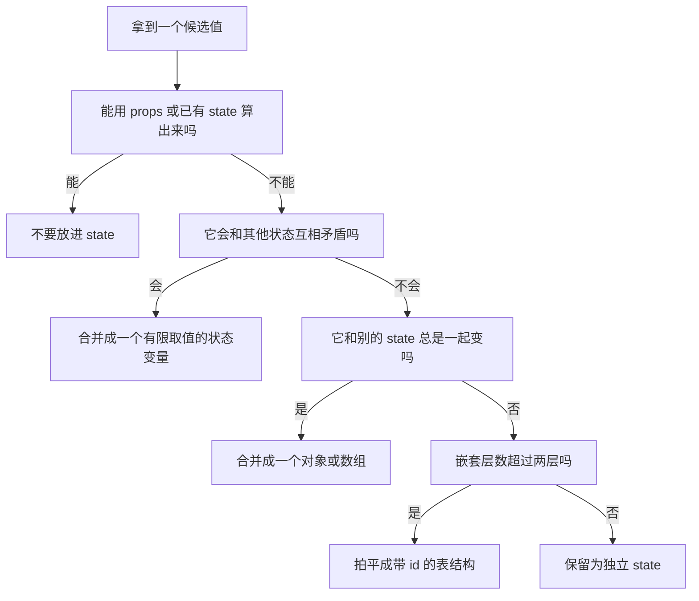
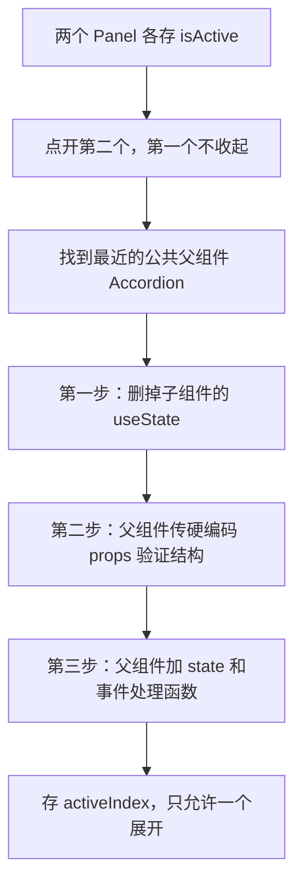
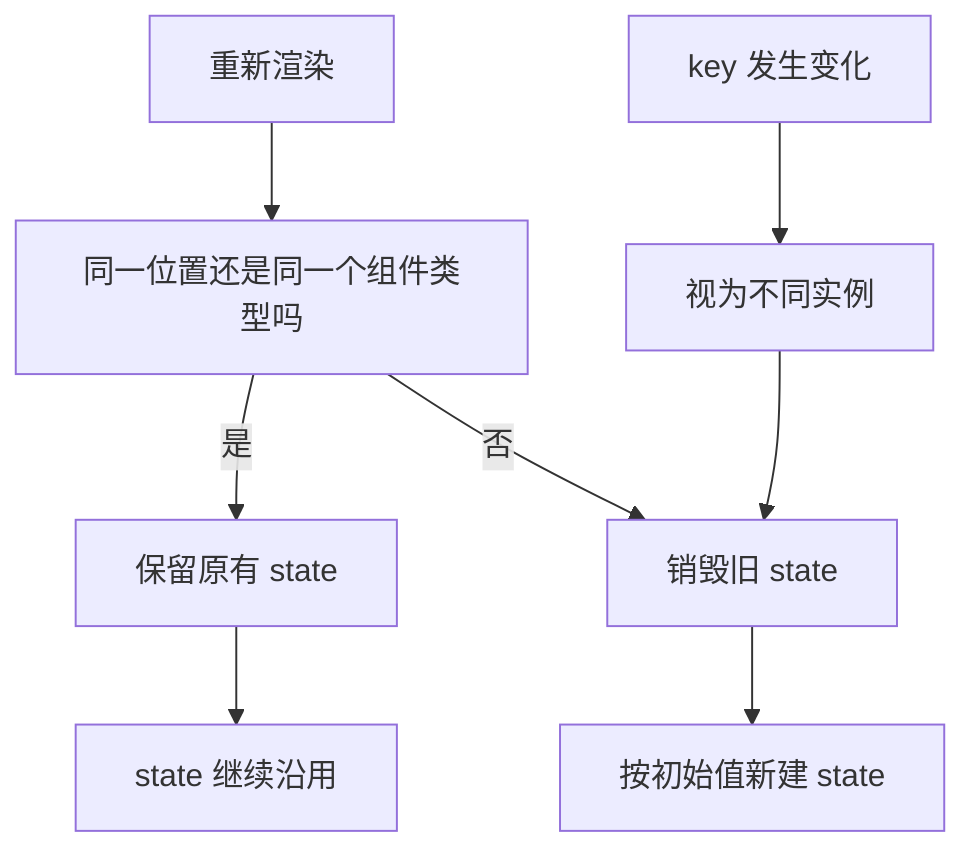
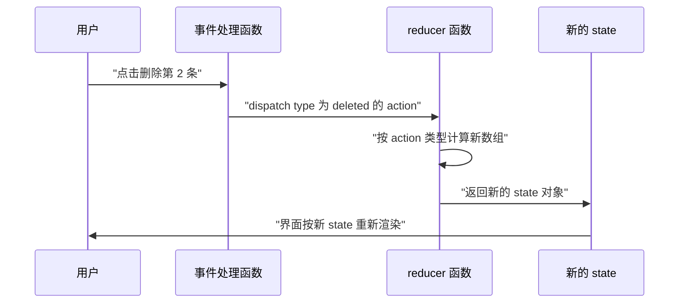
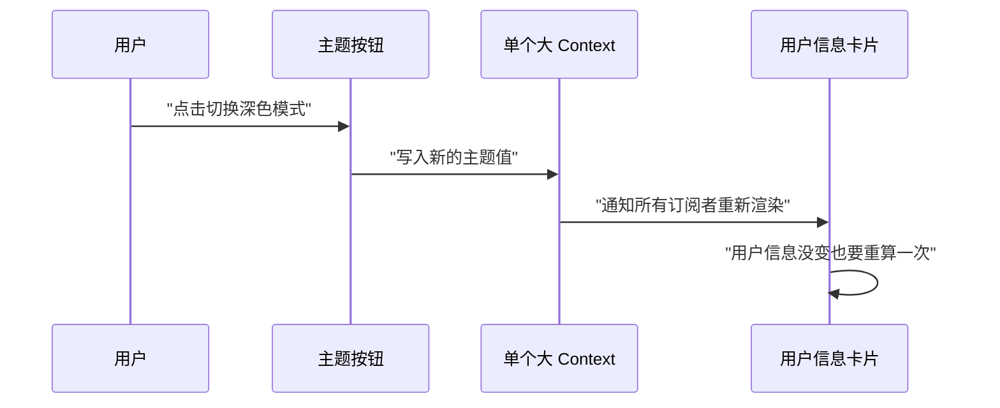
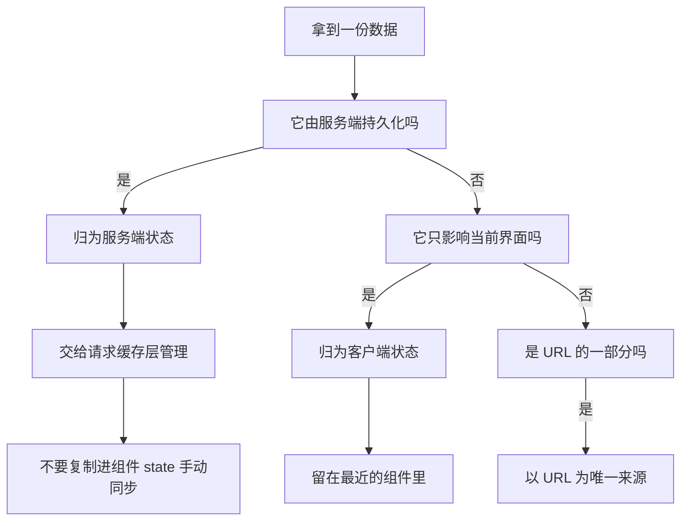
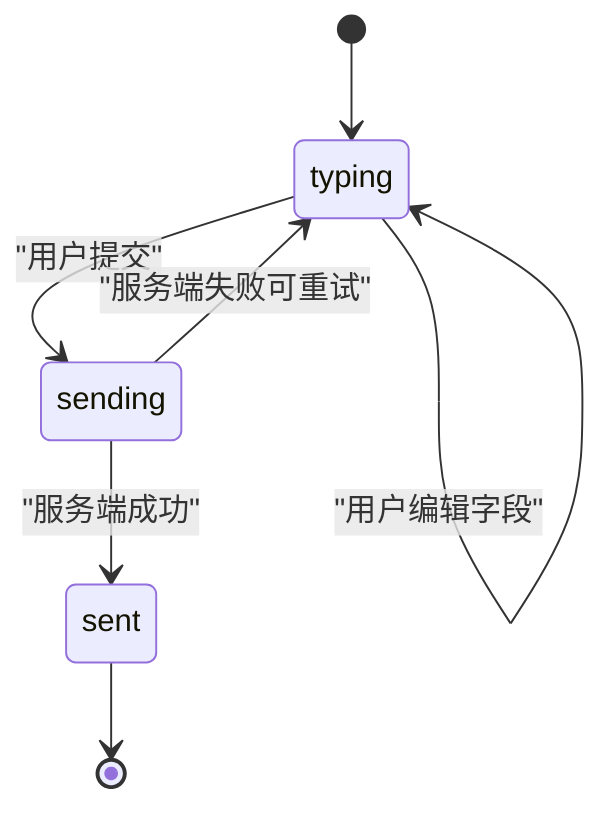

# 状态设计最佳实践：放哪里、存什么、怎么拆

!!! abstract "学完这一页你能"
    - 用四条检查规则判断一个值该不该进 state，并写出删掉冗余 state 后的代码。
    - 把两个子组件的 state 提升到最近的公共父组件，写出受控子组件。
    - 在数据源切换时用 key 重置组件 state，避免上一份数据的状态留下来。
    - 在 useState 与 useReducer 之间做出选择，把散落的 setXxx 改写成 dispatch 加 reducer。

## 0. 知识地图



建议怎么读：第 1 节是全页的判据，先读它，后面每一节都在复用它。

第 2、3 节回答"放哪里"，第 4、5 节回答"怎么拆"，第 6、7 节是两个高频场景。

每节结构一致，遇到已经懂的部分可以跳读，但**常见坑**表格建议都看一遍。

## 1. 先决定存什么：四条状态结构原则

**先想一个问题**

一个登记表单有 `firstName`、`lastName`、`fullName` 三个 state。

改姓的时候忘了同步 `fullName`，页面上就显示出错误的收件人姓名。

这个 bug 的根源不在事件处理函数，而在状态结构本身。

!!! note "术语：派生状态（derived state）"
    定义：能由 props 或已有 state 在渲染时计算出来的值。

    例子：`fullName` 可以由 `firstName` 和 `lastName` 拼接得到，它就不该单独存一份。

**心智模型**

!!! tip "心智模型"
    一句话模型：state 里只留"算不出来的最小事实"，其余全部在渲染时现算。

    日常类比：账本只记每一笔流水，不记余额；余额每次现算，算错了只是显示问题，流水永远是准的。

    类比在哪里不成立：余额是高频读取的数字，每次都累加有计算成本。真实系统会加缓存，而缓存一旦引入，就要接受"缓存可能过期"这个新麻烦。

**图解**



逐步解读这张图：

1. 起点是任意一个候选值，先问它是不是派生值。
2. 派生值一律不进 state，只在渲染时计算。
3. 剩下的值继续检查：它会不会和别的状态组成不可能的组合。
4. 会矛盾的值合并成一个状态机式的变量。
5. 总是同时更新的值合并成一个对象或数组。
6. 嵌套过深的结构拍平，用 id 建立关联关系。

**一步一步来**

第 1 步：删掉能算出来的 state。

```jsx
// 反例：fullName 是多余 state，改姓时漏同步就会显示错
import { useState } from 'react';

export default function Form() {
  const [firstName, setFirstName] = useState('');
  const [lastName, setLastName] = useState('');
  const [fullName, setFullName] = useState(''); // 冗余 state

  function handleFirstNameChange(e) {
    setFirstName(e.target.value);
    setFullName(e.target.value + ' ' + lastName); // 手动同步，容易漏
  }

  return <p>签发给：{fullName}</p>;
}
```

重构后：

```jsx
import { useState } from 'react';

export default function Form() {
  const [firstName, setFirstName] = useState('');
  const [lastName, setLastName] = useState('');
  const fullName = firstName + ' ' + lastName; // 渲染时现算，不可能不同步

  return <p>签发给：{fullName}</p>;
}
```

**这段代码在做什么**

- `fullName` 从 state 变成普通常量，不再占用一个 state 槽位。
- 每次渲染都会重新拼接一次，结果永远等于两个输入框的当前值。
- 删掉的还有两处手动同步代码，漏写的机会随之消失。
- 读取 `fullName` 的地方完全不用改，因为它仍然是同一个名字。

运行结果：改名字输入框，页面上的全名跟着变，不需要额外事件处理。

第 2 步：把会互相矛盾的状态合并成一个状态机。

```jsx
// 反例：两个布尔可以同时为 true，出现不可能状态
const [isSending, setIsSending] = useState(false);
const [isSent, setIsSent] = useState(false);

// 重构：一个 status 变量，只有三种合法取值
const [status, setStatus] = useState('typing'); // typing | sending | sent

// 下面两个是派生值，不是 state，不需要同步
const isSending = status === 'sending';
const isSent = status === 'sent';
```

**这段代码在做什么**

- 反例里 `isSending` 和 `isSent` 是两个独立布尔，四个组合里有三种是非法或重复的。
- 重构后只有一个变量，取值只有三个，非法组合在类型层面就不存在。
- 提交逻辑只需要 `setStatus('sending')` 和 `setStatus('sent')` 两次调用。
- `isSending`、`isSent` 保留下来，是为了让 JSX 里的判断语句仍然好读。

运行结果：永远不可能出现"既在发送又已发送"的界面。

第 3 步：把总是同时更新的值分组合并。

```jsx
// 反例：x 和 y 总是一起变，任何一处只改一个就错位
const [x, setX] = useState(0);
const [y, setY] = useState(0);

// 重构：合并成一个对象
const [position, setPosition] = useState({ x: 0, y: 0 });

// 注意：合并后不能只写一个字段，另一个字段会消失
setPosition({ ...position, x: 100 }); // 先展开旧值，再覆盖 x
```

**这段代码在做什么**

- 反例里移动一个点要调用两次 setState，漏一次坐标就不对。
- 合并成对象后，一次 `setPosition` 同时带上两个坐标。
- `{ ...position, x: 100 }` 里的展开运算符负责把 `y` 保留下来。
- 官方文档把这个陷阱单独写成了 Pitfall：对象 state 不能只写一个字段。

运行结果：一次更新即可让点移动到新位置，两个坐标始终配套。

第 4 步：深层嵌套拍平成 id 关联的平表。

```js
// 反例：改一个酒店名要展开三层，每加一层就更难写
const trip = {
  cities: [{ id: 1, name: 'Almaty', hotels: [{ id: 9, name: 'Pony' }] }],
};

// 重构：拍平成两张表，用 cityId 关联
const cities = [{ id: 1, name: 'Almaty' }];
const hotels = [{ id: 9, cityId: 1, name: 'Pony' }];
```

**这段代码在做什么**

- 反例里更新酒店要写三层展开，层数越深，出错概率越高。
- 拍平后每张表只有一层，更新酒店只动 `hotels` 数组。
- `cityId` 承担关联职责，相当于数据库里的外键。
- React 官方文档把这个做法类比为数据库工程师做的规范化（normalization）。

运行结果：更新一行数据不再需要沿路径复制整棵树。

**动手验证**

把四条原则合成一个 Node 脚本：状态机管提交状态，函数算派生值，平表存数据。

```js
// 依赖：无。Node 20+ 直接运行：node state-principles.mjs
import assert from 'node:assert/strict';

// 原则二：不可能状态用单一状态机表示
function feedbackReducer(state, action) {
  switch (action.type) {
    case 'edit':
      return { ...state, text: action.text, status: 'typing' };
    case 'submit':
      return { ...state, status: 'sending' };
    case 'resolve':
      return { ...state, status: 'sent' };
    case 'reset':
      return { text: '', status: 'typing' };
    default:
      return state;
  }
}

// 原则一：派生值用函数算，不存进 state
function flagsOf(status) {
  return { isSending: status === 'sending', isSent: status === 'sent' };
}

// 原则四：嵌套数据拍平成按 id 索引的表
function flattenCities(cities) {
  const hotelIndex = new Map();
  for (const city of cities) {
    for (const hotel of city.hotels) {
      hotelIndex.set(hotel.id, { id: hotel.id, cityId: city.id, name: hotel.name });
    }
  }
  return hotelIndex;
}

let state = { text: '', status: 'typing' };
state = feedbackReducer(state, { type: 'edit', text: '住得不错' });
assert.equal(state.status, 'typing');

state = feedbackReducer(state, { type: 'submit' });
assert.equal(flagsOf(state.status).isSending, true);

state = feedbackReducer(state, { type: 'resolve' });
assert.equal(flagsOf(state.status).isSent, true);

// 原则二的核心断言：两个标记永远不会同时为真
const flags = flagsOf(state.status);
assert.equal(flags.isSending && flags.isSent, false);

// 空 action 必须原样返回旧 state，避免意外清空
assert.deepEqual(feedbackReducer(state, { type: 'unknown' }), state);

const index = flattenCities([
  { id: 1, name: 'Almaty', hotels: [{ id: 9, name: 'Pony' }] },
]);
assert.equal(index.get(9).cityId, 1);

console.log('状态原则校验通过', JSON.stringify(state));
```

预期输出：

```
状态原则校验通过 {"text":"住得不错","status":"sent"}
```

如果 `flagsOf` 改成两个独立布尔，第 22 行的断言就会失败，这正是本节要防的 bug。

**常见坑**

| 现象 | 原因 | 怎么修 |
| --- | --- | --- |
| 页面显示的名字和输入框不一致 | `fullName` 被存成 state，靠事件手动同步 | 删掉这个 state，改成渲染时拼接 |
| 界面同时显示"发送中"和"已发送" | 两个布尔分别更新，出现了非法组合 | 合并成一个 `status`，只允许三种取值 |
| 移动点时只有一个坐标生效 | 分开的 `x`、`y` 只更新了其中一个 | 合并成 `position` 对象，一次更新两个坐标 |
| 改深层数据时把别的字段弄丢 | 逐层展开时漏了某一层的其他字段 | 拍平成 id 关联的表结构，更新范围缩小到一行 |
| 对象 state 更新后某个字段消失 | 写成 `setPosition({ x: 100 })`，没带 `y` | 先展开 `...position` 再覆盖目标字段 |

**用在哪里**

场景一：电商商品列表的多选与筛选。

- 业务背景：列表支持勾选商品、按类目筛选、按价格排序。
- 这一节的知识怎么用：选中集合和筛选条件都是"算不出来"的事实，留在 state；"已选中数量"和"全选状态"由它们现算。
- 用什么指标衡量收益：统计因"数量与集合不同步"产生的缺陷单数量，重构后应降为零。
- 什么时候不该用：选中集合需要跨页面持久化时，应放到 URL 或服务端，而不是组件 state。

场景二：后台管理的批量导入向导。

- 业务背景：上传文件、预校验、提交三屏，需要共享同一份任务状态。
- 这一节的知识怎么用：把 `uploading`、`validating`、`submitting` 合并成一个 `phase` 状态机。
- 用什么指标衡量收益：统计"按钮禁用状态与真实阶段不一致"的回归问题数量。
- 什么时候不该用：如果三个阶段之间允许并行，就不该强行做成单向状态机。

场景三：可视化看板的图表配置。

- 业务背景：每张卡片有坐标、尺寸、数据源地址。
- 这一节的知识怎么用：把 `x`、`y`、`w`、`h` 合并成一个 `layout` 对象。
- 用什么指标衡量收益：拖拽后位置错乱的复现率。
- 什么时候不该用：如果尺寸由坐标和约束算出来，尺寸就不该进 state。

**行业实践**

- React 官方文档《Choosing the State Structure》的 Principles for structuring state 一节，列出了合并相关状态、避免矛盾、避免冗余、避免重复、避免深层嵌套这五条原则。怎么借鉴：把这五条写成代码评审清单，每一步改动都过一遍。
- 同一篇文档把状态结构类比为数据库规范化，并链接到微软的 database normalization 说明页。怎么借鉴：列表类数据统一建 id 索引表，替代数组里套数组。
- 文档在 Group related state 一节用 Pitfall 标注了对象 state 的坑：不能只写一个字段，否则其他字段会丢失。怎么借鉴：把所有 `setX({ ... })` 写法集中到 reducer 或更新函数里，不散落在 JSX 中。

**小结**

- state 里只留算不出来的最小事实，能算的一律现算。
- 会互相矛盾的标记合并成一个状态机变量。
- 总是同时更新的值合并，嵌套过深的结构拍平。

## 2. 放哪里：状态提升与就近放置

**先想一个问题**

手风琴组件里有两个 Panel，各自有 `isActive`，点开第二个时第一个不会收起。

要让它们联动，就得把状态从子组件搬到父组件。

搬到哪里、搬完之后存什么，是这一节要解决的问题。

!!! note "术语：状态提升（lifting state up）"
    定义：把子组件里的 state 移到它们最近的公共父组件，再用 props 传下来。

    例子：两个 Panel 的展开状态交给 Accordion 保存，Accordion 只记当前展开的是第几个。

**心智模型**

!!! tip "心智模型"
    一句话模型：要让两个组件一起变，就把状态放到它们最近的公共父组件，再往下传。

    日常类比：两个人共用一块白板，白板挂在两人都走得到的地方；各写各的小本子就永远对不上。

    类比在哪里不成立：props 传递会让父组件在状态变化时重新渲染，父组件下面那些和状态无关的子树也会跟着走一遍。提升范围越大，这个代价越明显。

**图解**



逐步解读：

1. 现状是两个独立状态，互不知情。
2. 要联动，就必须有一个共同的上层来协调。
3. 第一步先卸掉子组件的状态所有权，改成接收 props。
4. 第二步用硬编码值先跑通结构，确认 props 链路正确。
5. 第三步才把真正的 state 加到父组件。
6. 提升之后存储内容会变：从"是否展开"变成"当前展开的是第几个"。

**一步一步来**

第 1 步：从子组件删掉 state，改成接收 props。

```jsx
// 之前：Panel 自己持有 isActive
function Panel({ title, children }) {
  const [isActive, setIsActive] = useState(false); // 这一行要删掉
  return <section>{isActive ? <p>{children}</p> : <button>Show</button>}</section>;
}

// 之后：isActive 由父组件说了算
function Panel({ title, children, isActive }) {
  return <section>{isActive ? <p>{children}</p> : <button>Show</button>}</section>;
}
```

**这段代码在做什么**

- 删掉 `useState` 后，Panel 不再拥有展开状态，它变成受控组件。
- `isActive` 从内部变量变成 props，由外部决定真假。
- 组件本身仍然只负责渲染，职责反而更单一。
- 注意此时 `setIsActive` 已经不存在，按钮的点击逻辑必须由父组件提供。

运行结果：Panel 显示什么，完全取决于父组件传进来的值。

第 2 步：父组件传硬编码值，先验证结构。

```jsx
export default function Accordion() {
  return (
    <>
      {/* 先写死 true，确认 props 链路通了再换成真状态 */}
      <Panel title="About" isActive={true}>城市简介</Panel>
      <Panel title="Etymology" isActive={true}>地名来源</Panel>
    </>
  );
}
```

**这段代码在做什么**

- 硬编码值的作用是隔离变量：先确认"传下去的 props 能控制显示"。
- 把两个 `true` 改成 `false`，两个面板应当同时收起。
- 此时还没有交互，所以不存在状态同步问题。
- 这一步看起来多余，但它能把"结构问题"和"状态问题"分开排查。

运行结果：改一个布尔值，对应面板的展开状态立即变化。

第 3 步：父组件加 state 和事件处理函数。

```jsx
import { useState } from 'react';

export default function Accordion() {
  // 存的是"当前展开第几个"，不再存布尔
  const [activeIndex, setActiveIndex] = useState(0);
  return (
    <>
      <Panel title="About" isActive={activeIndex === 0} onShow={() => setActiveIndex(0)}>
        城市简介
      </Panel>
      <Panel title="Etymology" isActive={activeIndex === 1} onShow={() => setActiveIndex(1)}>
        地名来源
      </Panel>
    </>
  );
}

function Panel({ title, children, isActive, onShow }) {
  return <section>{isActive ? <p>{children}</p> : <button onClick={onShow}>Show</button>}</section>;
}
```

**这段代码在做什么**

- 状态从布尔变成了索引，因为约束是"同时只有一个展开"。
- 每个 Panel 通过 `onShow` 回调请求父组件把自己设为当前项。
- Panel 无法直接改 `activeIndex`，它只能发出请求，这正是受控的含义。
- 点第二个面板时，`activeIndex` 变成 1，第一个面板自动收起。
- 官方文档指出：提升状态后，存储的内容本身常常需要重新设计。

运行结果：任意时刻只展开一个面板。

**动手验证**

用纯函数模拟提升前后的行为差异，断言两次点击的结果。

```js
// 依赖：无。Node 20+ 直接运行：node lift-state.mjs
import assert from 'node:assert/strict';

// 提升前：每个面板各自持有布尔状态，互不影响
function clickIndependent(states, index) {
  const next = [...states];
  next[index] = !next[index];
  return next;
}

// 提升后：父组件只保存当前展开的索引
function clickLifted(activeIndex, index) {
  return index; // 点谁，谁就是当前项
}

// 提升前：点开第二个，第一个仍然是 true
const independentAfter = clickIndependent([false, false], 1);
assert.deepEqual(independentAfter, [false, true]);

// 提升后：点开第二个，第一个自动收起
const active = clickLifted(0, 1);
assert.equal(active, 1);
assert.equal(active === 0, false); // 第一个面板的 isActive 变成 false

// 再点第一个，当前项切回去
assert.equal(clickLifted(active, 0), 0);

console.log('状态提升行为校验通过', JSON.stringify({ independentAfter, active }));
```

预期输出：

```
状态提升行为校验通过 {"independentAfter":[false,true],"active":0}
```

**常见坑**

| 现象 | 原因 | 怎么修 |
| --- | --- | --- |
| 输入框打字没反应 | 提升后只传了 `value` 没传 `onChange` | 同时把值和处理函数传下去 |
| 点击按钮报未定义 | 子组件里残留 `setIsActive` 调用 | 删掉子组件状态后，把回调改成父组件传下来的 props |
| 页面整体卡顿 | 状态提升到了很靠上的组件，无关子树也重新渲染 | 把状态放回最近的公共父组件，不要放到应用根节点 |
| 展开多个面板 | 父组件存的是布尔而不是索引 | 改成保存"当前展开项的标识" |

**用在哪里**

场景一：后台管理列表页的筛选与分页。

- 业务背景：筛选条件面板和表格是兄弟组件，改动筛选要重置页码。
- 这一节的知识怎么用：把筛选条件和页码提升到列表页父组件，筛选变化时同时把页码设回第一页。
- 用什么指标衡量收益：统计"改筛选后仍停在旧页码导致空列表"的问题数量。
- 什么时候不该用：筛选条件要分享给其他页面时，应放进 URL 查询参数，而不是组件 state。

场景二：多步表单向导。

- 业务背景：三个步骤页需要共享一份已填数据，最后一步统一提交。
- 这一节的知识怎么用：把表单数据提升到向导父组件，各步骤只负责渲染和回调。
- 用什么指标衡量收益：统计提交时报"缺少上一步字段"的错误次数。
- 什么时候不该用：步骤之间完全独立、各自提交时，提升只会增加耦合。

场景三：可视化编辑器的属性面板。

- 业务背景：画布上选中的图元与右侧属性面板要保持一致。
- 这一节的知识怎么用：选中图元的 id 提升到编辑器父组件，画布和面板都从它派生。
- 用什么指标衡量收益：统计"面板显示旧图元属性"的缺陷数量。
- 什么时候不该用：图元数据来自服务端缓存时，选中 id 之外的值交给请求缓存层管理。

**行业实践**

- React 官方文档《Sharing State Between Components》的 Lifting state up by example 一节，把提升拆成"删掉子状态、父传硬编码、父加状态"三步。怎么借鉴：重构时严格按这三步走，先结构后状态，便于逐步验证。
- 同一节指出，提升之后 state 的性质会变化，示例里从布尔改成了索引。怎么借鉴：提升之前先写出约束条件（同时只能有一个），再决定存什么。
- React 官方文档《Passing Props to a Component》说明了父组件通过 props 控制子组件的机制。怎么借鉴：把受控子组件写成纯渲染组件，事件一律通过 props 回调上报。

**小结**

- 联动需求出现时，先找最近的公共父组件。
- 提升顺序是先删子状态、再传硬编码、最后加真状态。
- 提升后要重新想存什么，约束往往能简化数据结构。

## 3. 用 key 重置状态

**先想一个问题**

聊天应用左侧切换联系人，右侧输入框里上一位联系人的草稿还留着。

原因是同一个位置渲染了同一个组件，React 保留了它的 state。

要让草稿随联系人清空，就得让 React 认为"这已经是另一个组件了"。

!!! note "术语：key"
    定义：React 用来区分同一层级中各个元素的标识，决定哪个组件实例与上一次渲染配对。

    例子：`<Chat key={contactId} />`，联系人变了 key 也变，React 会重建 Chat 并丢掉旧 state。

**心智模型**

!!! tip "心智模型"
    一句话模型：state 跟着"位置"走，位置不变就保留，位置变了就重建。

    日常类比：酒店按房间号分配房间，换房号就是换房间，前一间房里的东西不会跟过来。

    类比在哪里不成立：key 只影响 React 内部的组件配对，管不到你自己存在模块级变量、localStorage 或外部缓存里的数据。

**图解**



逐步解读：

1. 每次渲染，React 都会把新树和上一次的树按位置配对。
2. 位置相同、类型相同，就复用同一个组件实例，state 保留。
3. 位置或类型变化，旧实例被销毁，state 一并消失。
4. 组件被移除出树时，它的 state 立刻销毁，再加回来时从初始值重建。
5. 显式改了 key，即使位置没变，也按不同实例处理，效果等同于销毁加新建。

**一步一步来**

第 1 步：确认两个独立位置的同类组件互不干扰。

```jsx
export default function App() {
  return (
    <div>
      <Counter /> {/* 位置 1 */}
      <Counter /> {/* 位置 2 */}
    </div>
  );
}
// 两个 Counter 各有自己的 score，点一个不影响另一个
```

**这段代码在做什么**

- 两个 `<Counter />` 写在同一层级的不同位置，各自拿到独立的 state。
- 组件函数的代码是同一份，但 state 由 React 按位置分配。
- 这条规则解释了为什么"把 JSX 存到变量里渲染两次"也互不影响。

运行结果：两个计数器的数字互相独立。

第 2 步：观察组件被移除后 state 消失。

```jsx
export default function App() {
  const [showB, setShowB] = useState(true);
  return (
    <div>
      <Counter /> {/* 位置 1 始终在，state 保留 */}
      {showB && <Counter />} {/* 取消勾选即从树中移除 */}
      <label>
        <input type="checkbox" checked={showB} onChange={e => setShowB(e.target.checked)} />
        渲染第二个计数器
      </label>
    </div>
  );
}
```

**这段代码在做什么**

- 取消勾选时第二个 Counter 从渲染树中被删除，它的 state 被销毁。
- 重新勾选时会创建一个全新的 Counter，分数从初始值开始。
- 第一个 Counter 因为位置没变，分数一直被保留。
- 官方文档把这称为"state 与渲染树中的位置绑定"。

运行结果：第二个计数器加减后取消再勾选，分数回到初始值。

第 3 步：用 key 主动触发重置。

```jsx
// 父组件持有当前联系人 id
function ChatApp({ contactId, contacts }) {
  return (
    <>
      <ContactList contacts={contacts} />
      {/* key 变了，React 丢弃旧的 Chat 状态，草稿随之清空 */}
      <Chat key={contactId} contactId={contactId} />
    </>
  );
}

function Chat({ contactId }) {
  const [draft, setDraft] = useState(''); // 每位联系人一份全新草稿
  return <textarea value={draft} onChange={e => setDraft(e.target.value)} />;
}
```

**这段代码在做什么**

- key 使用 `contactId`，切换联系人时 Chat 被当作新组件处理。
- 旧实例连同 `draft` 一起被丢弃，新实例的 `draft` 从空字符串开始。
- 如果想让草稿按联系人保存，就需要把草稿提升或存到外部，不能靠 key 重置。
- key 必须加在需要重置的那个组件上，加在它外面的包装元素上没有效果。

运行结果：切换联系人后输入框清空。

**动手验证**

用一张 Map 模拟"位置标识决定 state 归属"的规则。

```js
// 依赖：无。Node 20+ 直接运行：node key-reset.mjs
import assert from 'node:assert/strict';

// 用 Map 模拟 React 内部按位置保存的 state
function createStateStore() {
  const store = new Map();
  return {
    // 位置标识相同就复用旧值，否则按初始值新建
    read(instanceKey, initialValue) {
      if (!store.has(instanceKey)) {
        store.set(instanceKey, initialValue);
      }
      return store.get(instanceKey);
    },
    write(instanceKey, value) {
      store.set(instanceKey, value);
    },
    remove(instanceKey) {
      store.delete(instanceKey);
    },
    size() {
      return store.size;
    },
  };
}

const store = createStateStore();

// 第一次渲染位置 A，草稿从空开始，然后用户输入
store.write('A', 'hello');
assert.equal(store.read('A', ''), 'hello');

// 同一位置重新渲染，state 保留
assert.equal(store.read('A', ''), 'hello');

// key 变化等价于换位置：读位置 B 得到初始值
assert.equal(store.read('B', ''), '');

// 组件被移除：state 被销毁，再加回来是初始值
store.remove('A');
assert.equal(store.read('A', ''), '');
assert.equal(store.size(), 2); // B 仍在，A 是新写入的

console.log('key 重置规则校验通过', JSON.stringify([...store.keys()]));
```

预期输出：

```
key 重置规则校验通过 ["B","A"]
```

**常见坑**

| 现象 | 原因 | 怎么修 |
| --- | --- | --- |
| 列表重排后输入框内容串到别的行 | key 用了数组下标，排序后下标与数据不再对应 | 用数据自身的稳定 id 作为 key |
| 加了 key 但状态没重置 | key 加在了外层容器上，目标组件的位置没变 | 把 key 直接加在需要重置的组件元素上 |
| 切换标签页后草稿被意外清空 | 用 key 重置，但业务其实希望保留草稿 | 把草稿提升到父组件或存到外部，不要用 key |
| 输入框光标跳位 | 用 key 强行重建了每次渲染都在变的组件 | 只在数据源切换这种低频时机更换 key |

**用在哪里**

场景一：客服工作台切换会话。

- 业务背景：座席在左侧会话列表切换，右侧是回复输入框。
- 这一节的知识怎么用：给回复组件加 `key={conversationId}`，切换即清空草稿；需要保留草稿时把草稿按会话 id 存到上层 Map。
- 用什么指标衡量收益：统计"把 A 会话的回复发给 B 客户"的事故数量。
- 什么时候不该用：如果产品要求保留每位客户的草稿，就不该用 key 清空，而应做草稿存储。

场景二：后台管理的多标签编辑。

- 业务背景：同一路由根据记录 id 渲染编辑表单。
- 这一节的知识怎么用：给表单组件加 `key={recordId}`，避免上一条记录的校验错误残留。
- 用什么指标衡量收益：统计"新建记录时看到上一条错误提示"的问题数量。
- 什么时候不该用：表单本身要从服务端拉取初始值并缓存时，重置和缓存策略需要一起考虑。

场景三：媒体播放器重试。

- 业务背景：播放失败后提供"重试"按钮。
- 这一节的知识怎么用：重试时更换 `key`，让播放器组件回到初始状态重新加载。
- 用什么指标衡量收益：统计"重试后仍停留在错误态"的缺陷数量。
- 什么时候不该用：播放进度需要保留时，重试应只重置错误标记，不能重置组件。

**行业实践**

- React 官方文档《Preserving and Resetting State》的 State is tied to a position in the render tree 一节，说明了 state 按渲染树位置保存、组件被删除时 state 一并销毁。怎么借鉴：把"位置"当成资源归属单位来设计组件树。
- 同一篇文档说明可以用不同的 key 强制重置组件 state。怎么借鉴：把 key 重置用于"数据源切换"这类低频、明确的场景，不用于高频交互。
- React 官方文档在渲染列表的章节中要求为列表项提供稳定标识。怎么借鉴：所有列表统一使用业务 id 作为 key，禁止用数组下标。

**小结**

- state 与渲染树位置绑定，位置不变就保留。
- 组件被移除时 state 销毁，重新挂载时从初始值开始。
- key 变化相当于换了位置，可实现有意的重置。

## 4. 什么时候用 useReducer 代替 useState

**先想一个问题**

一个任务列表组件用三个事件处理函数分别增、改、删任务。

每个处理函数里都有一段 `setTasks(...)` 逻辑，散落在组件各处。

新同事想知道"任务状态到底会被改成什么样"，必须把所有处理函数读一遍。

!!! note "术语：reducer"
    定义：把状态更新逻辑集中到一个纯函数里，函数接收当前 state 和一个 action，返回新的 state。

    例子：任务列表的 reducer 接收"新增任务"这个 action，返回追加后的新数组。

!!! note "术语：action"
    定义：描述"用户刚刚做了什么"的普通对象，通常带一个 `type` 字段。

    例子：`{ type: 'added', id: 3, text: '看展' }`。

**心智模型**

!!! tip "心智模型"
    一句话模型：useState 是直接说出结果，useReducer 是登记用户干了什么，由 reducer 算结果。

    日常类比：银行柜台你只说"我要存 500 元"，具体账目怎么改由柜员按规则操作；你不能自己钻进账本改数字。

    类比在哪里不成立：reducer 是纯函数，相同输入必须得到相同输出；它不能发请求、写日志、读随机数，这些副作用要留在组件或外部。

**图解**



逐步解读：

1. 用户在界面上做动作，触发事件处理函数。
2. 处理函数不再直接算新状态，而是 `dispatch` 一个描述行为的 action。
3. reducer 函数根据 action 的 `type` 分支，计算新的 state。
4. reducer 返回的新 state 被 React 接管，用于下一次渲染。
5. 处理函数里只剩下"这里发生了什么"，读代码时一眼能看全。

**一步一步来**

第 1 步：把 `setTasks` 换成 `dispatch`。

```js
// 之前：处理函数里直接算新数组
function handleAddTask(text) {
  setTasks([...tasks, { id: nextId++, text, done: false }]);
}

// 之后：只说明用户做了什么
function handleAddTask(text) {
  dispatch({ type: 'added', id: nextId++, text });
}

function handleDeleteTask(taskId) {
  dispatch({ type: 'deleted', id: taskId });
}
```

**这段代码在做什么**

- 处理函数不再引用 `tasks`，也就不会写出基于旧数组的更新。
- action 的 `type` 用的是描述行为的词，例如 added、changed、deleted。
- `id` 跟 action 一起传出去，reducer 不需要自己生成 id。
- 处理函数变短后，组件里剩下的代码主要是渲染逻辑。

运行结果：点击删除按钮时，组件发出一个 `deleted` action。

第 2 步：写 reducer 函数，把所有更新逻辑放进去。

```js
function tasksReducer(tasks, action) {
  switch (action.type) {
    case 'added':
      // 用展开创建新数组，不修改原数组
      return [...tasks, { id: action.id, text: action.text, done: false }];
    case 'changed':
      // 匹配 id 的那一项替换成新对象，其余原样保留
      return tasks.map(t => (t.id === action.task.id ? action.task : t));
    case 'deleted':
      return tasks.filter(t => t.id !== action.id);
    default:
      // 遇到没处理的 action 必须原样返回，避免状态被清空
      return tasks;
  }
}
```

**这段代码在做什么**

- reducer 是纯函数：不修改传入的 `tasks`，每次返回新数组。
- 三种 action 类型对应增、改、删三种用户行为，全部逻辑集中在一处。
- `default` 分支返回原 state，这是防止误清空的关键防线。
- `changed` 分支用的是 `map`，只有匹配到的那一项被替换。

运行结果：依次 dispatch 三个 action，任务数组按预期变化。

第 3 步：在组件里接上 reducer。

```jsx
// 用 useReducer 把 reducer 和初始值接进来，返回当前 state 和 dispatch
const [tasks, dispatch] = useReducer(tasksReducer, initialTasks);

// 需要核对官方文档：useReducer 的参数顺序、初始值的惰性初始化写法
```

**这段代码在做什么**

- 数组解构的第一项是当前 state，第二项是 dispatch 函数。
- `initialTasks` 只在首次渲染时用到。
- 组件里不再出现 `setTasks`，所有更新都走 dispatch。
- 具体参数签名与惰性初始化形式需核对官方文档《Extracting State Logic into a Reducer》。

运行结果：组件行为与原来一致，但更新逻辑集中到了组件外部。

**动手验证**

把任务 reducer 抽成纯函数，在 Node 里跑一串 action 并断言结果。

```js
// 依赖：无。Node 20+ 直接运行：node task-reducer.mjs
import assert from 'node:assert/strict';

let nextId = 3;
const initialTasks = [
  { id: 0, text: '看展', done: true },
  { id: 1, text: '听讲座', done: false },
];

// reducer 必须是纯函数：不改参数，返回新数组
function tasksReducer(tasks, action) {
  switch (action.type) {
    case 'added':
      return [...tasks, { id: action.id, text: action.text, done: false }];
    case 'changed':
      return tasks.map(t => (t.id === action.task.id ? action.task : t));
    case 'deleted':
      return tasks.filter(t => t.id !== action.id);
    default:
      return tasks;
  }
}

let state = initialTasks;

state = tasksReducer(state, { type: 'added', id: nextId++, text: '写周报' });
assert.equal(state.length, 3);
assert.equal(state[0].id, 0); // 原数组顺序未被破坏
assert.equal(initialTasks.length, 2); // 原数组没有被改动

state = tasksReducer(state, { type: 'changed', task: { id: 1, text: '听讲座', done: true } });
assert.equal(state.find(t => t.id === 1).done, true);

state = tasksReducer(state, { type: 'deleted', id: 0 });
assert.equal(state.some(t => t.id === 0), false);

// 未识别的 action 必须返回原 state
const unchanged = tasksReducer(state, { type: 'unknown' });
assert.deepEqual(unchanged, state);

console.log('任务 reducer 校验通过', JSON.stringify(state));
```

预期输出：

```
任务 reducer 校验通过 [{"id":1,"text":"听讲座","done":true},{"id":2,"text":"写周报","done":false}]
```

**常见坑**

| 现象 | 原因 | 怎么修 |
| --- | --- | --- |
| reducer 越写越长，跟 useState 没区别 | action 里直接塞了完整的新 state | action 只描述行为，例如 type 加必要参数 |
| 界面偶尔整体空白 | reducer 遇到未知 action 没返回 state | 补上 `default: return state` |
| 相同操作出现两种结果 | reducer 里调了 `Date.now()` 或发请求 | 把副作用移到组件的事件处理函数或 effect 中 |
| 列表项更新后原数据被改 | reducer 里直接改了数组元素 | 用 `map`、`filter`、展开运算符生成新对象 |
| 组件里仍然出现大量 setXxx | 只改了一个处理函数 | 把同一份数据的所有更新都搬进同一个 reducer |

**用在哪里**

场景一：购物车增删改。

- 业务背景：加入购物车、修改数量、删除单项、清空购物车。
- 这一节的知识怎么用：四种操作写成四种 action，reducer 集中处理数量校验与总价重算。
- 用什么指标衡量收益：统计购物车相关的线上缺陷数量。
- 什么时候不该用：只有"加入购物车"一个操作时，useState 足够。

场景二：富文本或画布编辑器的撤销重做。

- 业务背景：每一步用户操作都要能撤销。
- 这一节的知识怎么用：所有操作走 action，历史栈记录 action 序列，撤销就是重放。
- 用什么指标衡量收益：统计撤销后状态错乱的复现率。
- 什么时候不该用：操作频率极高且不要求撤销时，逐条 action 会增加开销。

场景三：多人协作白板的图元操作。

- 业务背景：创建、移动、删除图元，操作需要广播给其他人。
- 这一节的知识怎么用：action 本身就是可广播的消息格式，本地和远端走同一个 reducer。
- 用什么指标衡量收益：统计本地与远端状态不一致的会话比例。
- 什么时候不该用：接入成熟的协作框架后，不要另造一套 action 协议。

**行业实践**

- React 官方文档《Extracting State Logic into a Reducer》的 Consolidate state logic with a reducer 一节，把迁移拆成"改成 dispatch、写 reducer、在组件里使用"三步。怎么借鉴：迁移时逐步进行，先改一个处理函数，验证通过再改下一个。
- 同一节指出，dispatch 让代码更贴近"用户刚刚做了什么"，可读性提升。怎么借鉴：给 action 类型起描述行为的名字，而不是 setXxx 式的名字。
- 需要核对官方文档：reducer 的纯函数要求与编写规范，具体要核对是否允许在 reducer 内做副作用、是否必须返回新对象。

**小结**

- 更新逻辑散落在多个处理函数时，考虑换成 reducer。
- action 描述用户行为，reducer 负责计算新状态。
- reducer 是纯函数，副作用留在组件里。

## 5. Context 的重渲染陷阱与拆分

**先想一个问题**

应用把主题色、当前用户、通知设置全放进同一个 Context。

用户切换深浅色主题时，所有读取这个 Context 的组件都会重新渲染。

登录用户信息明明没变，用户卡片也跟着重算了一遍。

资料未覆盖，需核对官方文档：react.dev 的 Passing Data Deeply with Context 与 Scaling Up with Reducer and Context 章节，重点是 Provider 的 value 引用与订阅粒度。

!!! note "术语：重渲染（re-render）"
    定义：组件函数被再次调用以产出新的 JSX。

    例子：Context 的值变化时，所有读取该 Context 的组件都会重新执行一次组件函数。

**心智模型**

!!! tip "心智模型"
    一句话模型：Context 是广播频道，订阅者都会收到通知，它不是按字段精确订阅的系统。

    日常类比：小区广播一响，所有开着的收音机都会出声，哪怕这条通知只跟其中一栋楼有关。

    类比在哪里不成立：React 可以通过拆分频道、稳定 value 引用等手段减少无效通知，广播系统做不到这种按内容的筛选。

**图解**



逐步解读：

1. 用户点击切换主题，只有主题值发生了变化。
2. 大 Context 的值变了，它下面的所有读取者都收到通知。
3. 用户信息卡片并没有用到主题值，但它在同一个频道里，同样被通知。
4. 卡片重新执行组件函数，产出的 JSX 与上一次相同。
5. 拆分频道后，主题变化只会通知主题订阅者。

**一步一步来**

第 1 步：先问这个值到底要不要进 Context。

```jsx
// 只有父子两层传值，用 props 就够了，不要引入 Context
function Page() {
  const [filters, setFilters] = useState({});
  return <FilterBar filters={filters} onChange={setFilters} />;
}

// 需要跨越多层、且中间层完全不关心这个值时，才考虑 Context
```

**这段代码在做什么**

- props 只穿过一到两层时，引入 Context 会增加一层间接，不解决问题。
- Context 解决的是"中间层被迫透传 props"的场景。
- 判断标准是中间组件的数量以及它们是否需要知道这个值。

运行结果：两层传值场景下，代码没有多余抽象。

第 2 步：按更新频率拆成多个 Context。

```jsx
// 拆之前：主题和用户塞在一个 value 里，任一变化都会惊动全部订阅者
// 拆之后：两个频道各自更新，互不干扰
const ThemeContext = createContext('light');
const UserContext = createContext(null);
const DispatchContext = createContext(null); // 只放稳定不变的函数

function App() {
  const [theme, setTheme] = useState('light');
  const [user, setUser] = useState(null);
  return (
    <ThemeContext value={theme}>
      <UserContext value={user}>
        <DispatchContext value={setTheme}>{/* 函数引用稳定 */}</DispatchContext>
      </UserContext>
    </ThemeContext>
  );
}
```

**这段代码在做什么**

- 拆分的依据是更新频率：主题一年变几次，用户信息变几次，dispatch 几乎不变。
- 主题变化只通知 `ThemeContext` 的订阅者。
- 把 dispatch 单独放一个 Context，是为了让只想发事件的组件不去订阅会变的数据。
- Provider 的具体写法与是否需要 `useMemo` 稳定 value，需核对官方文档版本说明。

运行结果：切换主题时，只读取用户信息的组件不再收到通知。

第 3 步：把高频变化的值排除在 Context 之外。

```jsx
// 反例：鼠标位置每帧都可能变，放进 Context 会让全部订阅者频繁重渲染
// 重构方向一：交给专门的订阅方案，让只有需要它的组件订阅
// 重构方向二：把变化限制在最小的组件内部，不向全局广播
```

**这段代码在做什么**

- 高频值的判断标准是每秒更新次数与订阅者数量的乘积。
- 鼠标位置、滚动位置、输入法中间态都属于高频值。
- 处理方式是把订阅范围压缩到真正需要它的组件。
- 具体可用的订阅方案与 API 需核对官方文档，本节不给出未经验证的写法。

运行结果：高频值不再触发全局重渲染。

**动手验证**

用最小的发布订阅模型，对比拆分前后收到通知的订阅者数量。

```js
// 依赖：无。Node 20+ 直接运行：node context-split.mjs
import assert from 'node:assert/strict';

function createChannel() {
  const listeners = new Set();
  return {
    subscribe(fn) {
      listeners.add(fn);
      return () => listeners.delete(fn);
    },
    publish(value) {
      for (const fn of listeners) fn(value);
    },
    count() {
      return listeners.size;
    },
  };
}

// 拆分前：一个频道装主题和用户
const merged = createChannel();
let mergedCalls = 0;
merged.subscribe(() => mergedCalls++); // 相当于既关心主题又关心用户的组件

// 拆分后：主题一个频道，用户一个频道
const themeChannel = createChannel();
const userChannel = createChannel();
let cardCalls = 0; // 用户卡片只订阅用户频道
userChannel.subscribe(() => cardCalls++);

merged.publish({ theme: 'dark', user: 'ada' });
assert.equal(mergedCalls, 1); // 大频道收到一次通知

themeChannel.subscribe(() => {}); // 主题订阅者
themeChannel.publish('dark'); // 切主题
assert.equal(cardCalls, 0); // 用户卡片完全没被打扰
assert.equal(userChannel.count(), 1);

console.log('Context 拆分校验通过', JSON.stringify({ mergedCalls, cardCalls }));
```

预期输出：

```
Context 拆分校验通过 {"mergedCalls":1,"cardCalls":0}
```

**常见坑**

| 现象 | 原因 | 怎么修 |
| --- | --- | --- |
| 改主题时列表也重渲染 | 主题和列表数据在同一个 Context 里 | 按更新频率拆成多个 Context |
| 每次渲染所有订阅者都更新 | Provider 的 value 每次渲染新建对象 | 稳定 value 引用，具体写法核对官方文档 |
| 组件只想发事件却被通知 | 数据和 dispatch 放在同一个 value 里 | 把 dispatch 拆到独立 Context |
| 页面滚动时整体卡住 | 鼠标或滚动位置放进了全局 Context | 把高频值限制在最小组件内，或改用专门订阅方案 |

**用在哪里**

场景一：国际化与主题。

- 业务背景：文案语言切换频率低，主题切换频率也低，但两者独立。
- 这一节的知识怎么用：语言和主题各用一个 Context。
- 用什么指标衡量收益：统计切换语言时的渲染组件数量变化。
- 什么时候不该用：只有一层组件需要语言时，用 props 更快。

场景二：登录用户与权限。

- 业务背景：用户信息变动少，权限点被大量按钮读取。
- 这一节的知识怎么用：用户对象与权限集合分成两个频道，避免权限更新牵动用户信息展示。
- 用什么指标衡量收益：统计登录后首屏渲染的组件次数。
- 什么时候不该用：权限需要服务端逐次校验时，前端 Context 只作为展示提示。

场景三：表格筛选条件与操作函数。

- 业务背景：工具栏只负责触发筛选，表格负责读取筛选值。
- 这一节的知识怎么用：筛选值放一个 Context，更新函数放另一个 Context。
- 用什么指标衡量收益：统计工具栏输入时的表格重渲染次数。
- 什么时候不该用：筛选值需要写进 URL 时，URL 就是唯一来源，不必再建 Context。

**行业实践**

- React 官方文档《Passing Data Deeply with Context》说明了 Context 的适用场景与用法。怎么借鉴：把 Context 当作跨越中间层的传递手段，不作为全局状态容器。
- React 官方文档《Scaling Up with Reducer and Context》讲的是用 reducer 加 Context 组合管理复杂状态。怎么借鉴：把更新逻辑放 reducer，把 dispatch 通过 Context 下发，数据按需分频道。
- 需要核对官方文档：Provider 的 value 是否需要用 `useMemo` 稳定，以及当前版本的 Context 写法差异，具体要核对 react.dev 的 Context 章节与版本升级说明。

**小结**

- Context 是广播，订阅者都会收到通知，拆分是减少无效通知的主要手段。
- 拆分依据是更新频率，不是业务模块。
- 高频变化的值不进 Context。

## 6. 服务端状态与客户端状态分离

**先想一个问题**

商品列表从接口拿到数据后，代码把它复制进 `useState`。

用户在详情页改价成功后，列表页那份副本还是旧价格。

一个数据在应用里存在两份，就一定会有同步 bug。

资料未覆盖，需核对官方文档：TanStack Query 官方文档 Overview 章节中关于 server state 与 client state 的区分，以及 react.dev 中数据获取相关章节。

!!! note "术语：服务端状态（server state）"
    定义：真实数据存在服务端，前端只是持有一份可能过期的副本。

    例子：商品详情、订单列表、库存数量，都属于服务端状态。

!!! note "术语：客户端状态（client state）"
    定义：只存在于当前浏览器会话、由前端自己拥有的状态。

    例子：侧边栏是否展开、当前选中的标签页、未提交的表单草稿。

**心智模型**

!!! tip "心智模型"
    一句话模型：服务端数据是别人家的账本，你手上只是复印件；客户端状态是你自己桌上的便签。

    日常类比：复印件会过期，过期了要重新去取；便签只有你自己看，撕掉就没了。

    类比在哪里不成立：复印件也有缓存价值。合理做法是让缓存层统一负责什么时候重新取，而不是每次都去取。

**图解**



逐步解读：

1. 先判断这份数据的真实来源在哪里。
2. 由服务端持久化的，统归服务端状态。
3. 服务端状态交给专门的请求缓存层管理，包含加载中、失败、重新获取。
4. 不要把接口返回值再复制进组件 state，否则又回到冗余状态的问题。
5. 只影响界面的，归为客户端状态，放在使用它的组件附近。
6. 需要分享或刷新后保留的客户端状态，放进 URL。

**一步一步来**

第 1 步：给每个数据打标签。

```js
// 服务端状态：商品列表、库存、订单详情
// 客户端状态：面板展开、选中行、输入框草稿
// URL 状态：页码、排序、关键字
```

**这段代码在做什么**

- 打标签的目的是决定这份数据由谁负责更新。
- 标签写错时，最常见的结果就是"复制进 state 再手动同步"。
- URL 状态可以看作客户端状态的特例，只是它还有一个天然好处：刷新后还在。

运行结果：每一份数据都有明确归属，不出现两份副本。

第 2 步：服务端数据交给缓存层，组件只读。

```js
// 思路：缓存层负责 data、loading、error、重新获取时机
// 组件只从缓存层读取，不再自己 setState 一份
// 具体 API 与参数名需核对官方文档：TanStack Query 或同类工具的官方文档
```

**这段代码在做什么**

- 加载中、失败、成功三种状态由缓存层统一表达。
- 组件不再同时维护 `loading` 和 `error` 两个布尔，避免了矛盾状态。
- 重新获取的时机（窗口聚焦、重新连接）由缓存层统一决定。
- 具体工具的 API 名称与版本要核对官方文档。

运行结果：详情页改价后，列表数据由缓存层统一失效并重新获取。

第 3 步：客户端状态留在组件树，按第 1、2 节的方法放置。

```jsx
function ProductPage() {
  // 选中行是客户端状态，放这里就够
  const [selectedId, setSelectedId] = useState(null);
  // 商品数据由缓存层提供，不进 state
  return <ProductTable selectedId={selectedId} onSelect={setSelectedId} />;
}
```

**这段代码在做什么**

- 选中行只影响当前界面，放在使用它的组件里。
- 表格数据由上层缓存层提供，组件不持有副本。
- 两者职责分开后，改价的同步问题从源头消失。

运行结果：数据更新只发生在缓存层，界面按最新数据渲染。

**动手验证**

用一个最小的缓存对象模拟服务端状态的三种状态转移。

```js
// 依赖：无。Node 20+ 直接运行：node server-state.mjs
import assert from 'node:assert/strict';

// 用有限状态表示一次请求的生命周期
function requestReducer(state, action) {
  switch (action.type) {
    case 'fetch':
      return { ...state, status: 'loading' };
    case 'success':
      return { status: 'success', data: action.data, updatedAt: action.now };
    case 'error':
      return { status: 'error', data: null, updatedAt: state.updatedAt };
    case 'invalidate':
      // 只标记过期，数据先留着，避免界面闪空
      return { ...state, status: 'stale' };
    default:
      return state;
  }
}

let cache = { status: 'idle', data: null, updatedAt: 0 };

cache = requestReducer(cache, { type: 'fetch' });
assert.equal(cache.status, 'loading');

cache = requestReducer(cache, { type: 'success', data: [{ id: 1, price: 19 }], now: 1000 });
assert.equal(cache.status, 'success');
assert.equal(cache.data[0].price, 19);

cache = requestReducer(cache, { type: 'invalidate' });
assert.equal(cache.status, 'stale');
assert.equal(cache.data[0].price, 19); // 过期状态仍保留数据用于渲染

cache = requestReducer(cache, { type: 'error' });
assert.equal(cache.status, 'error');
assert.equal(cache.updatedAt, 1000); // 失败不清掉上次成功时间

console.log('服务端状态流转校验通过', JSON.stringify(cache));
```

预期输出：

```
服务端状态流转校验通过 {"status":"error","data":null,"updatedAt":1000}
```

**常见坑**

| 现象 | 原因 | 怎么修 |
| --- | --- | --- |
| 详情页更新后列表还是旧数据 | 接口数据被复制进组件 state，两份副本 | 数据只由缓存层持有，组件直接读取 |
| 界面同时显示加载中和错误 | loading 与 error 是两个独立布尔 | 合并成一个 status 状态机 |
| 刷新页面后筛选条件丢失 | 筛选条件只存在组件 state | 把筛选条件写进 URL 查询参数 |
| 两个页面各自请求同一份数据 | 没有统一的缓存层 | 引入请求缓存层统一管理键与失效 |

**用在哪里**

场景一：电商商品列表的无限滚动。

- 业务背景：列表分页加载，商品价格可能被后台改动。
- 这一节的知识怎么用：分页数据交给缓存层按页键管理，价格变更后按失效规则重新获取。
- 用什么指标衡量收益：统计"价格显示过期"的客诉数量。
- 什么时候不该用：数据实时性要求极高且不允许过期展示时，需要额外设计推送或强制刷新。

场景二：后台管理的批量导入任务。

- 业务背景：导入是长任务，需要轮询进度。
- 这一节的知识怎么用：任务进度是服务端状态，交给缓存层按固定间隔刷新；页面上的"是否展开日志"是客户端状态。
- 用什么指标衡量收益：统计轮询相关接口的重复请求数量。
- 什么时候不该用：任务结果很小且一次性返回时，直接请求即可。

场景三：聊天消息历史与草稿。

- 业务背景：消息来自服务端，输入框草稿是本地数据。
- 这一节的知识怎么用：消息交给缓存层，草稿留在客户端并按会话 id 存储。
- 用什么指标衡量收益：统计"草稿误发或丢失"的问题数量。
- 什么时候不该用：需要端到端加密且草稿不得落盘时，草稿只保留在内存中。

**行业实践**

- TanStack Query 官方文档 Overview 章节明确区分 server state 与 client state，指出服务端状态具有异步、可能过期、需要重新获取等特征。怎么借鉴：先给数据分类，再决定由谁管理，具体表述需核对官方文档。
- react.dev 中数据获取相关章节说明了在组件中获取数据的常见做法与注意点。怎么借鉴：把加载、失败、成功三种情况在结构上就区分开，不并排使用多个布尔。
- 需要核对官方文档：请求缓存层的失效与重试策略，具体要核对缓存键设计、过期时间与重试次数这几个参数的官方说明。

**小结**

- 先给数据分类，再决定放哪里。
- 服务端状态由缓存层统一管理，不复制进组件 state。
- 加载、失败、成功用单一状态表达。

## 7. 表单状态

**先想一个问题**

一个注册表单用 `useState` 给每个字段建了一个 state，一共十个。

后来又加了提交中、提交成功、字段错误三类状态，组件顶部排了十三行 useState。

想加"重置"功能时，发现要逐个调用十几个 set 函数。

资料未覆盖，需核对官方文档：react.dev 中表单相关参考章节与 `useFormStatus`，具体 API 名称与用法要核对官方文档。

!!! note "术语：受控组件（controlled component）"
    定义：表单元素的显示值由 React state 提供，用户输入通过事件回传。

    例子：`<input value={text} onChange={e => setText(e.target.value)} />`。

**心智模型**

!!! tip "心智模型"
    一句话模型：表单是"编辑缓冲加一个单向状态机"。

    日常类比：草稿纸上随便写，按下提交键后草稿纸就锁住，直到收到回执才解锁。

    类比在哪里不成立：真实表单允许提交失败后恢复编辑，所以状态机会从失败态回到编辑态，不是单向结束。

**图解**



逐步解读：

1. 初始状态是 `typing`，用户可以自由编辑。
2. 提交后进入 `sending`，此时输入框与按钮应当禁用。
3. 成功进入 `sent`，界面切换为结果提示，不再回到编辑态。
4. 失败时回到 `typing`，用户看到错误信息并可以修改后重试。
5. 编辑字段只在 `typing` 状态内部发生，不产生新状态。

**一步一步来**

第 1 步：先列出表单的所有状态，再决定去留。

```js
// 字段值：必须保留
// 错误信息：必须保留
// 提交阶段：合并成一个 phase
// 是否可以提交：由 phase 和错误是否为空算出来
const canSubmit = phase === 'typing' && Object.keys(errors).length === 0;
```

**这段代码在做什么**

- 先穷举，再用第 1 节的规则删除派生值。
- `canSubmit` 是派生值，不该存成 state。
- 错误信息与字段值都属于"算不出来"的事实，必须保留。

运行结果：state 数量从十几个降到三类。

第 2 步：字段值分组合并成一个对象。

```jsx
// 反例：字段一多，组件顶部全是 useState
const [email, setEmail] = useState('');
const [phone, setPhone] = useState('');
const [city, setCity] = useState('');

// 重构：一个对象装字段值，用字段名更新
const [values, setValues] = useState({ email: '', phone: '', city: '' });
const setField = (name, value) => setValues(v => ({ ...v, [name]: value }));
```

**这段代码在做什么**

- 合并后重置表单只需要一句 `setValues(初始值)`。
- `setField` 用计算属性名 `[name]` 定位要改的字段。
- 更新函数写成 `v => ({ ...v, [name]: value })`，基于最新值更新，不依赖闭包里的旧值。
- 字段非常多且结构复杂时，可以把这个逻辑搬进 reducer。

运行结果：表单重置只需一次状态更新。

第 3 步：把提交阶段做成状态机并驱动界面。

```jsx
const [phase, setPhase] = useState('typing');

async function handleSubmit(e) {
  e.preventDefault();
  setPhase('sending'); // 进入发送中，界面禁用输入
  try {
    await sendForm(values);
    setPhase('sent'); // 成功，切换到结果页
  } catch {
    setPhase('typing'); // 失败，回到可编辑状态
  }
}

const isSending = phase === 'sending'; // 派生值，不用单独存
```

**这段代码在做什么**

- `phase` 的取值只有三个，非法组合在结构上就不存在。
- 失败回到 `typing`，用户可以修改后重试。
- `isSending` 由 `phase` 算出，界面禁用逻辑读它即可。
- 具体表单提交 API 与状态钩子需核对官方文档。

运行结果：提交期间按钮禁用，失败后恢复可编辑。

**动手验证**

用 reducer 实现表单状态，断言提交失败后能回到可编辑状态。

```js
// 依赖：无。Node 20+ 直接运行：node form-state.mjs
import assert from 'node:assert/strict';

const initial = { values: { email: '', city: '' }, phase: 'typing', errors: {} };

function formReducer(state, action) {
  switch (action.type) {
    case 'field':
      return { ...state, values: { ...state.values, [action.name]: action.value } };
    case 'submit':
      return { ...state, phase: 'sending' };
    case 'success':
      return { ...state, phase: 'sent' };
    case 'failure':
      return { ...state, phase: 'typing', errors: action.errors };
    case 'reset':
      return initial;
    default:
      return state;
  }
}

// 派生值：能否提交由阶段和错误一起决定
function canSubmit(state) {
  return state.phase === 'typing' && Object.keys(state.errors).length === 0;
}

let state = initial;
state = formReducer(state, { type: 'field', name: 'email', value: 'a@b.com' });
assert.equal(state.values.email, 'a@b.com');
assert.equal(canSubmit(state), true);

state = formReducer(state, { type: 'submit' });
assert.equal(state.phase, 'sending');
assert.equal(canSubmit(state), false); // 发送中不允许再次提交

state = formReducer(state, { type: 'failure', errors: { email: '该邮箱已被注册' } });
assert.equal(state.phase, 'typing');
assert.equal(canSubmit(state), false); // 有错误就不允许提交

state = formReducer(state, { type: 'field', name: 'email', value: 'c@d.com' });
state = formReducer(state, { type: 'reset' });
assert.deepEqual(state, initial);

console.log('表单状态校验通过', JSON.stringify(initial));
```

预期输出：

```
表单状态校验通过 {"values":{"email":"","city":""},"phase":"typing","errors":{}}
```

**常见坑**

| 现象 | 原因 | 怎么修 |
| --- | --- | --- |
| 字段增加到二十个后代码难以维护 | 每个字段一个 useState | 合并成一个 values 对象或改用 reducer |
| 提交中还能再次点击提交 | 按钮禁用条件由单独的布尔控制 | 用 `phase` 派生禁用状态 |
| 提交失败后输入框被锁住 | 失败分支没有把阶段改回可编辑 | 失败时回到 `typing` 并写入错误信息 |
| 重置表单要写十几行 | 状态分散，没有统一初始值 | 抽出一个 initial 常量，重置就是恢复它 |
| 改一个字段导致其他字段丢失 | 更新时没有展开旧对象 | 用 `{ ...values, [name]: value }` |

**用在哪里**

场景一：注册登录表单。

- 业务背景：字段校验反馈频繁，提交后需要防重复点击。
- 这一节的知识怎么用：字段值合并成对象，阶段用状态机，错误信息与字段名一一对应。
- 用什么指标衡量收益：统计"重复提交产生的重复账号"数量。
- 什么时候不该用：只有一个搜索框时，直接 useState 更直接。

场景二：后台管理的批量导入字段映射。

- 业务背景：用户为源文件列与目标字段建立映射关系。
- 这一节的知识怎么用：映射关系是对象 state，校验错误按源列名索引。
- 用什么指标衡量收益：统计导入因映射缺失而失败的比例。
- 什么时候不该用：映射规则由服务端下发且不可编辑时，不需要本地表单状态。

场景三：多步表单的中间保存。

- 业务背景：用户可能在第二步离开，回来要恢复进度。
- 这一节的知识怎么用：每个步骤的数据是客户端状态，按第 6 节的建议决定是否落盘，阶段由状态机控制。
- 用什么指标衡量收益：统计中途放弃率的变化。
- 什么时候不该用：数据敏感不允许本地留存时，只保留在内存并在离开时清空。

**行业实践**

- React 官方文档《Extracting State Logic into a Reducer》提出的三步迁移方法，同样适用于字段众多的表单。怎么借鉴：把字段更新也写成 action，`reset` 成为一个动作而不是一堆 set 调用。
- React 官方文档《Choosing the State Structure》中提到的分组原则，用于把同表单的字段合并成对象。怎么借鉴：把字段名当作稳定的键，更新时用计算属性名。
- 需要核对官方文档：表单提交与状态钩子的具体名称与签名，例如 `useFormStatus` 的返回字段，具体要核对 react.dev 的表单相关参考章节。

**小结**

- 表单状态分三类：字段值、错误信息、提交阶段。
- 能算出来的（能否提交、是否禁用）不要存成 state。
- 字段值合并成对象，提交阶段用状态机。

## 应用地图

| 场景 | 用到本页哪个知识点 | 典型技术选型 | 注意事项 |
| --- | --- | --- | --- |
| 手风琴只允许一项展开 | 状态提升、状态结构原则 | 父组件 useState 存索引 | 存索引而不是布尔，避免多项同时展开 |
| 聊天切换联系人清空草稿 | 用 key 重置状态 | `key` 加在消息面板组件上 | key 必须加在目标组件上，不是外层容器 |
| 购物车增删改 | useReducer 优于 useState | useReducer 加纯函数 reducer | action 描述行为，别塞完整新状态 |
| 全局主题与用户信息 | Context 拆分 | 多个独立 Context 加稳定 value | 高频变化的值不要进 Context |
| 商品列表分页与价格更新 | 服务端状态与客户端状态分离 | 请求缓存层加 URL 查询参数 | 接口数据不复制进组件 state |
| 注册表单字段与校验 | 表单状态、避免矛盾状态 | 字段对象加提交阶段状态机 | 能否提交由阶段和错误算出 |
| 后台筛选条件分享 | 状态提升与 URL 状态 | URL 查询参数作为唯一来源 | 刷新后要保持的客户端状态优先进 URL |
| 画布选中图元与属性面板 | 状态提升、就近放置 | 选中 id 提升到编辑器父组件 | 图元数据不要双份持有 |

## 动手作业

目标是写一个 Node 20+ 单文件脚本 `todo-state.mjs`，用纯函数实现任务列表的状态模型。

这个脚本不依赖 React，但结构要能直接映射到组件里。

步骤：

1. 定义 `initialState`，只包含 `tasks` 数组与 `filter` 字符串，不包含 `doneCount`。
2. 写纯函数 `visibleTasks(state)`，根据 `filter` 返回过滤后的数组。
3. 写纯函数 `statsOf(tasks)`，返回 `{ total, done }`，其中 `done` 为已完成数量。
4. 写 `tasksReducer(state, action)`，支持 `added`、`changed`、`deleted`、`filtered` 四种 action。
5. 用 `node:assert/strict` 写断言，覆盖下面每一条验收标准。
6. 在脚本最后 `console.log` 一行汇总结果，便于人工核对。

验收标准（全部可检验）：

- 连续执行三次 `added` 后，`tasks` 长度为 3，且 `initialState.tasks` 仍为原值。
- 执行 `changed` 把第 2 条标记为完成，`statsOf` 返回的 `done` 为 1。
- 执行 `deleted` 删掉第 1 条后，剩余任务顺序与添加顺序一致。
- `filter` 为 `done` 时，`visibleTasks` 只返回已完成项，数量与 `statsOf` 的 `done` 相等。
- 传入未知 action 时，reducer 返回的 state 与传入的 state 深度相等。
- 整个脚本不修改任何传入的数组或对象，用冻结对象 `Object.freeze` 验证不抛错。
- 运行 `node todo-state.mjs` 退出码为 0，并打印一行以"任务状态校验通过"开头的输出。

## 综合对比

| 维度 | 多个独立 useState | 分组合并的对象 state | useReducer | Context 拆分 | key 重置 |
| --- | --- | --- | --- | --- | --- |
| 解决的痛点 | 值之间毫无关联 | 多个值总是一起更新 | 更新逻辑散落在多个处理函数 | 跨多层传值且中间层不关心 | 数据源切换后旧状态残留 |
| 适用规模 | 一到三个互不相关的值 | 同一实体的几个字段 | 同一份数据的三种以上操作 | 读取者分散在组件树多处 | 组件本身不需要改代码 |
| 更新写法 | 各自调用 set | 展开旧对象再覆盖字段 | dispatch 一个 action | 消费方读取 Context | 换一个 key 值 |
| 主要风险 | 忘记同步相关值 | 漏写字段导致字段消失 | action 里塞完整新状态 | value 引用不稳定导致全量通知 | key 用下标导致状态串台 |
| 是否能撤销 | 需要自己记录历史 | 需要自己记录历史 | 记录 action 序列即可重放 | 与撤销无关 | 重置即丢弃，无法撤回 |
| 调试方式 | 看每个 set 调用点 | 看对象更新点 | 打印 action 序列 | 统计订阅者数量 | 看 key 的变化来源 |
| 适合的典型场景 | 展开开关、选中 id | 坐标、表单字段 | 购物车、任务列表、画布 | 主题、用户、dispatch | 切换会话、切换编辑对象 |
| 不适合的场景 | 值需要联动 | 字段之间完全独立 | 只有一个更新操作 | 只隔一层传值 | 需要保留草稿 |

## 深入阅读与参考

!!! tip "怎么用这些资料"
    先读「官方文档与规范」建立准确的概念，再读「源码与示例」核对细节，最后用「教程、书籍与视频」换一种讲法加深理解。每条都写明了读哪一节、带着什么问题读。

### 官方文档与规范

| 资源 | 为什么读 | 怎么读 |
|---|---|---|
| [useState](https://react.dev/reference/react/useState) | useState 是状态设计的最小单位，先弄清它的适用边界再谈其他方案。 | 读「Updating state based on previous state」与「Avoiding recreating the initial state」两节，回到项目把冗 |
| [useReducer](https://react.dev/reference/react/useReducer) | 官方给出了 useState 与 useReducer 的取舍标准，是本章判断依据的出处。 | 读「Writing a reducer」与「Comparing useState and useReducer」，挑一个多字段联动组件试着改写。 |
| [Passing Data Deeply with Context](https://react.dev/learn/passing-data-deeply-with-context) | 讲透 Context 的适用场景与误用代价，对应「放哪里」这一节。 | 读「Before you use context」与「Use cases」，先自问能否用状态提升或组件组合替代，再决定是否建 Context。 |
| [Scaling Up with Reducer and Context](https://react.dev/learn/scaling-up-with-reducer-and-context) | 示范 reducer 与 Context 组合的官方写法，是拆分状态的标准范式。 | 读「Combining a reducer with context」一节，把层层传递的回调 props 换成 dispatch，观察重渲染变化。 |
| [React Server Components 参考](https://react.dev/reference/rsc/server-components) | 界定服务端组件与客户端组件的职责，决定状态该不该进浏览器。 | 读 Server Components 与 Client Components 两节，判断项目里哪些数据源根本不必变成客户端状态。 |
| [TanStack Query 文档](https://tanstack.com/query/latest) | 服务端状态与客户端状态分离的落地工具，缓存与失效模型讲得清楚。 | 读 Caching 与 Query Invalidation 章节，把用 useState+useEffect 手写的请求数据迁移成查询。 |

### 源码与示例

| 资源 | 为什么读 | 怎么读 |
|---|---|---|
| [ts-rest](https://ts-rest.com/) | 用共享 contract 示例展示服务端与客户端的数据边界如何定义。 | 看文档里的共享类型定义示例，为自己的接口补一份 contract，明确哪些字段属于服务端状态。 |

### 教程、书籍与视频

| 资源 | 为什么读 | 怎么读 |
|---|---|---|
| [Overreacted：The Two Reacts](https://overreacted.io/the-two-reacts/) | 用两棵组件树的比喻讲清服务端与客户端各自的职责与状态归属。 | 读完用自己的话说明两棵树分别负责什么，再据此给当前项目里的状态分类。 |
| [Josh Comeau：Server Components](https://www.joshwcomeau.com/react/server-components/) | 图文并茂地解释组件边界，比官方文档更适合建立直觉。 | 读边界划分部分并画一张服务端/客户端组件边界图，对照项目代码找出越界的状态。 |

## 自测题

??? question "1. 一个值是派生值，为什么不应该放进 state？"
    - 派生值可以随时由 props 或已有 state 算出来，存一份就产生两个数据源。
    - 两个数据源需要手动同步，漏一次就出现界面与数据不一致。
    - 官方文档的判据是：渲染时能算出来的信息，就不该放进 state。
    - 例：`fullName` 由 `firstName` 和 `lastName` 拼接，删掉它只需在渲染时拼一次。

??? question "2. 如何判断几个状态该不该合并成一个变量？"
    - 看它们是否总是同时更新，总是同时更新就考虑合并。
    - 看它们是否可能组成不可能的组合，会组成就合并成有限取值的状态机。
    - 例：`x` 与 `y` 合并成 `position`，`isSending` 与 `isSent` 合并成 `status`。
    - 合并后注意对象 state 的更新陷阱：只写一个字段会让其他字段丢失。

??? question "3. 状态提升的三个步骤是什么？提升之后通常要改什么？"
    - 第一步：从子组件删掉 useState，改成接收 props。
    - 第二步：父组件先用硬编码值传下去，验证 props 链路。
    - 第三步：父组件加 state 和事件处理函数，把回调传下去。
    - 提升后存储内容常常要重新设计，官方示例里从布尔改成了索引。

??? question "4. 什么情况下应该用 key 重置组件状态？"
    - 数据源切换，例如切换会话、切换编辑对象，旧状态不应残留。
    - 需要把组件彻底恢复到初始状态，例如失败后重试播放器。
    - 关键限制：key 要加在目标组件上，加在外层容器上没有效果。
    - 如果业务需要保留草稿，就不该用 key，而应把草稿提升或存到外部。

??? question "5. useState 换成 useReducer 的判断依据有哪些？"
    - 同一份数据的更新逻辑散落在多个事件处理函数里。
    - 状态更新需要集中查看，希望一眼看全部可能的变更。
    - 需要按操作序列重放，例如撤销重做或协作广播。
    - 只有一两个简单更新时，useState 更省事。

??? question "6. reducer 有哪些硬性约束？"
    - 必须是纯函数：相同输入得到相同输出，不能有副作用。
    - 必须返回新对象或新数组，不能原地修改传入的 state。
    - 必须有兜底分支，遇到未识别的 action 返回原 state。
    - action 只描述用户行为，不要把完整的新 state 塞进去。

??? question "7. Context 重渲染的来源通常有哪些？"
    - 订阅者太多：不相关的组件也因为同处一个频道而收到通知。
    - value 每次渲染新建对象，引用变化让所有订阅者都更新。
    - 高频值进入了 Context，例如鼠标位置与滚动位置。
    - 缓解方向：按更新频率拆分频道、把 dispatch 单独拆分、稳定 value 引用。

??? question "8. 为什么接口数据不要复制进组件 state？"
    - 复制后应用里就有两份数据，更新一处不会自动影响另一处。
    - 加载中、失败、成功三种情况容易写成多个布尔，出现矛盾组合。
    - 正确做法是交给请求缓存层统一管理获取、失效与重试。
    - 组件只读缓存层结果，客户端自己的界面状态才留在组件里。

## 延伸阅读

- React 官方文档《Choosing the State Structure》：Principles for structuring state、Group related state、Avoid contradictions in state、Avoid redundant state。
- React 官方文档《Sharing State Between Components》：Lifting state up by example、Step 1 到 Step 3 三小节。
- React 官方文档《Preserving and Resetting State》：State is tied to a position in the render tree。
- React 官方文档《Extracting State Logic into a Reducer》：Consolidate state logic with a reducer、Step 1 到 Step 3 三小节。
- React 官方文档《Updating Objects in State》，用于核对对象 state 只能整体替换、不能只改一个字段的说明。
- React 官方文档《Passing Data Deeply with Context》与《Scaling Up with Reducer and Context》，用于核对 Context 的适用范围与拆分方式。
- 需核对官方文档：react.dev 中表单相关参考章节与 `useFormStatus` 的返回字段与用法。
- 需核对官方文档：TanStack Query 官方文档 Overview 章节中关于 server state 与 client state 的区分表述。
- 需核对官方文档：Redux 官方文档 Style Guide 中关于 state 结构规范化的条目名称与具体要求。
