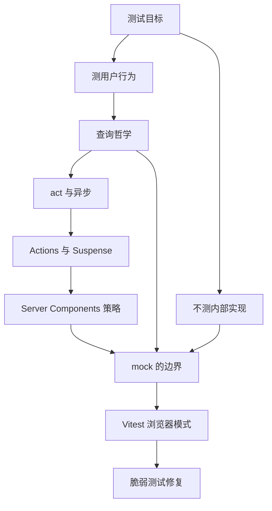
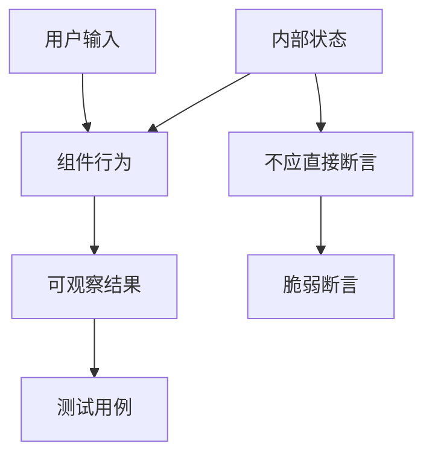
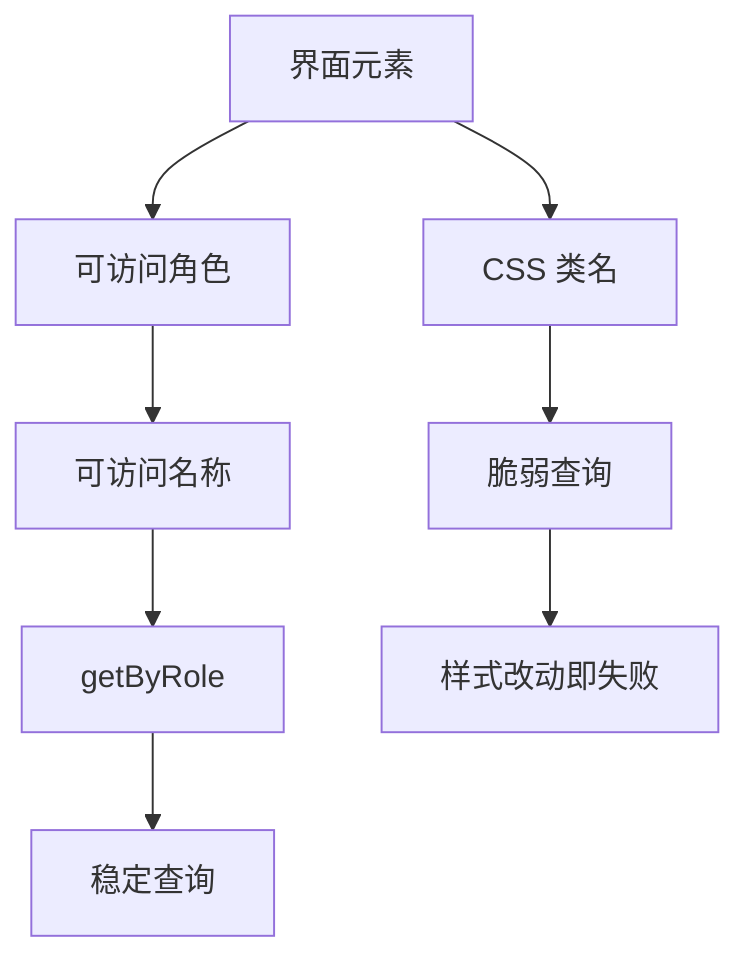
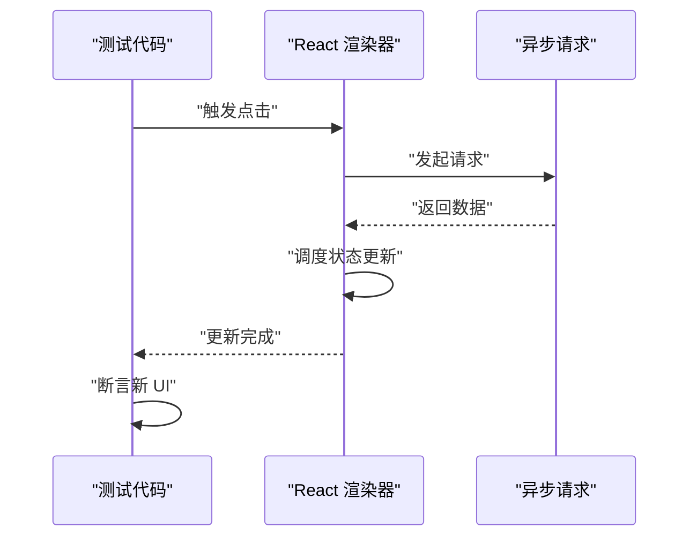
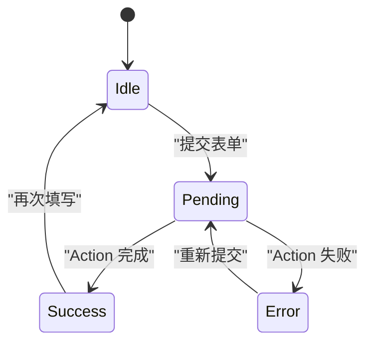
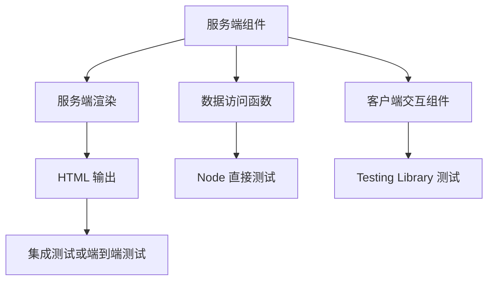
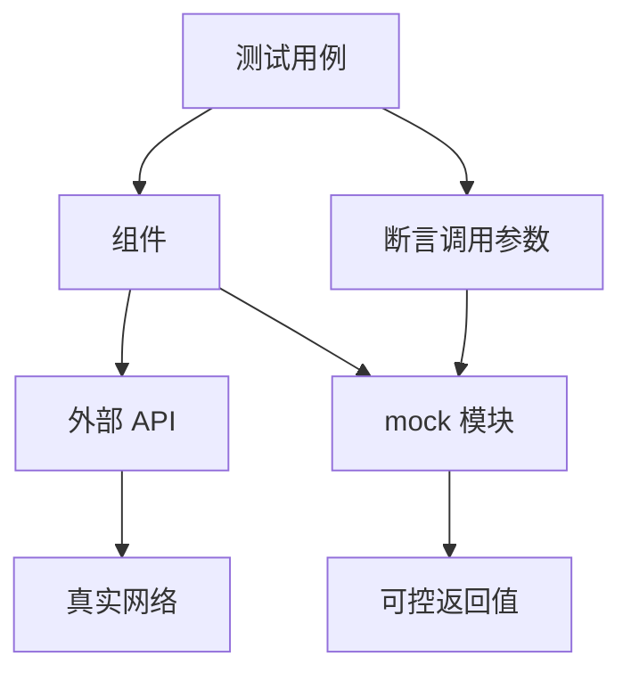
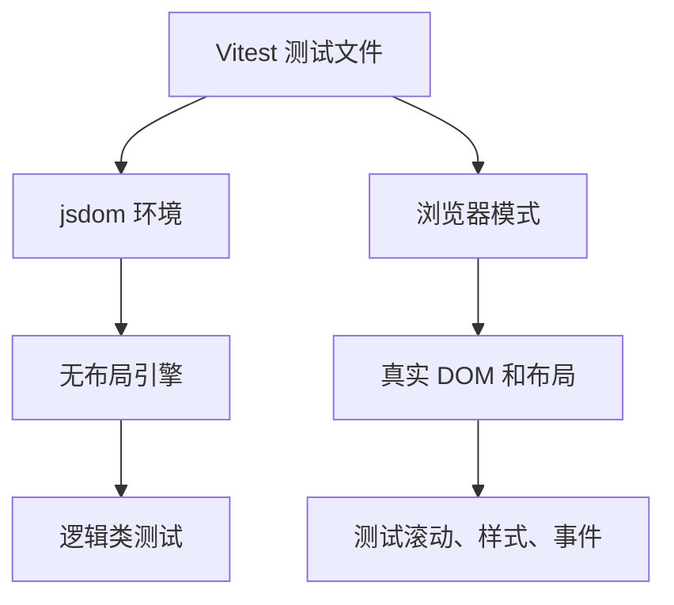
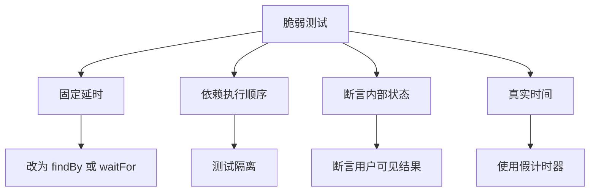

# 测试 React 19 应用：act、异步与 Server Components

!!! abstract "学完这一页你能"

- 能说出哪些组件行为值得测试，哪些内部实现不值得测试。
- 能用 Testing Library 的语义查询写出稳定的组件测试。
- 能处理 act、异步状态更新、Suspense 与 Actions 的测试时序。
- 能为 Server Components 与客户端交互组件选择对应的测试策略。

## 0. 知识地图



建议先读第 1 节建立测试目标，再沿查询、异步、新特性、服务端组件、mock、浏览器模式、脆弱修复的顺序阅读。
Server Components 的测试策略依赖前面对客户端测试与 mock 边界的理解。
如果时间有限，先读第 1、2、3、8 节，能覆盖大多数日常业务测试。

## 1. 测什么、不测什么

**先想一个问题**

你给一个商品列表组件写测试，组件内部用 useState 管理筛选条件，还有一个 handleFilter 函数。
如果测试只检查筛选后的列表渲染结果，运行稳定；如果测试去检查 useState 里的状态值，就因为内部重构频繁失败。

**心智模型**

!!! tip "心智模型"

一句话模型：测试用户能观察到的行为，不测试组件怎么实现。
日常类比：验收房子时检查水龙头出不出水，不要求知道墙内水管怎么接。
类比不成立的地方：前端某些纯逻辑函数没有界面行为，测试它们的输入输出仍然合理，这不属于“观察内部实现”。

!!! note "术语：测试目标"

测试目标指你希望验证的组件行为，例如“点击筛选后只显示对应商品”。
例子：断言页面出现“手机”而不是断言组件内部变量 `filteredItems` 的值。

**图解**



1. 用户输入驱动组件行为。
2. 组件行为产生可观察结果，例如渲染文本、触发回调。
3. 测试用例只应断言可观察结果。
4. 内部状态是实现细节，直接断言会让测试脆弱。

**一步一步来**

**第 1 步：创建一个待测试的商品筛选组件**

这一步要做什么：定义一个简单组件，输入商品列表，点击按钮后只显示某个分类。

```javascript
// ProductFilter.jsx
import { useState } from "react";

export default function ProductFilter({ products }) {
  const [category, setCategory] = useState("all"); // 筛选分类状态
  const visible = category === "all"
    ? products
    : products.filter((p) => p.category === category); // 计算展示商品

  return (
    <div>
      <button onClick={() => setCategory("phone")}>只看手机</button>
      <button onClick={() => setCategory("book")}>只看图书</button>
      <ul>
        {visible.map((p) => (
          <li key={p.name}>{p.name}</li>
        ))}
      </ul>
    </div>
  );
}
```

**这段代码在做什么**

- `category` 保存当前筛选分类。
- `visible` 根据分类计算要展示的商品。
- 两个按钮改变分类。
- 列表渲染 `visible`，这是用户能看到的最终结果。

运行结果：初始渲染所有商品；点击“只看手机”后只显示手机类商品。

**第 2 步：写一个只断言可观察结果的测试**

这一步要做什么：用 React Testing Library 渲染组件，点击按钮，断言列表内容。

```javascript
// ProductFilter.test.jsx
import { render, screen } from "@testing-library/react";
import userEvent from "@testing-library/user-event";
import ProductFilter from "./ProductFilter.jsx";

test("筛选手机后只显示手机商品", async () => {
  const products = [
    { name: "手机 A", category: "phone" },
    { name: "图书 B", category: "book" },
  ];
  render(<ProductFilter products={products} />);
  await userEvent.click(screen.getByRole("button", { name: "只看手机" }));
  expect(screen.getByRole("listitem", { name: "手机 A" })).toBeInTheDocument();
  expect(screen.queryByRole("listitem", { name: "图书 B" })).not.toBeInTheDocument();
});
```

**这段代码在做什么**

- `render` 挂载组件到测试 DOM。
- `getByRole` 通过按钮的可访问名称找到元素。
- `userEvent.click` 模拟真实点击。
- `getByRole("listitem", ...)` 断言用户能看到手机商品。
- `queryByRole` 配合 `not.toBeInTheDocument` 断言图书商品不可见。

运行结果：测试通过，因为断言的是界面内容而不是 `category` 状态值。

**动手验证**

将下面脚本保存为 `product-filter.test.jsx`，依赖为 `react`、`react-dom`、`@testing-library/react`、`@testing-library/jest-dom`、`@testing-library/user-event`、`vitest`、`jsdom`。
配置 `vitest.config.js` 中启用 jsdom 环境。

```javascript
// product-filter.test.jsx
import { describe, it, expect } from "vitest";
import { render, screen } from "@testing-library/react";
import userEvent from "@testing-library/user-event";
import "@testing-library/jest-dom/vitest";
import ProductFilter from "./ProductFilter.jsx";

describe("ProductFilter", () => {
  it("只断言可观察列表", async () => {
    const products = [
      { name: "手机 A", category: "phone" },
      { name: "图书 B", category: "book" },
    ];
    render(<ProductFilter products={products} />);
    await userEvent.click(screen.getByRole("button", { name: "只看手机" }));
    expect(screen.getByRole("listitem", { name: "手机 A" })).toBeInTheDocument();
    expect(screen.queryByRole("listitem", { name: "图书 B" })).not.toBeInTheDocument();
  });
});
```

预期输出：Vitest 显示 1 个测试通过。

**常见坑**

| 现象 | 原因 | 怎么修 |
|------|------|--------|
| 修改组件内部状态名后测试失败 | 测试直接断言状态变量 | 改为断言界面文本或元素 |
| 测试覆盖率高但重构频繁失败 | 测试绑定实现结构 | 用角色、文本查询，而不是类名或结构选择器 |
| 测试没有验证真实用户操作 | 直接调用组件内部函数 | 用 userEvent 或 fireEvent 模拟交互 |

**用在哪里**

- 业务背景：电商商品列表的筛选、排序、分页交互频繁改动。
- 这一节的知识怎么用：测试点击筛选后列表变化，断言可见商品文本。
- 用什么指标衡量收益：组件重构后测试存活率，界面行为缺陷数。
- 什么时候不该用：纯工具函数、纯样式调整不涉及行为时不必写组件测试。

- 业务背景：后台管理的批量导入流程有多个步骤按钮。
- 这一节的知识怎么用：测试点击“下一步”后出现第二步标题，不检查步骤内部状态。
- 用什么指标衡量收益：交互流程回归测试时间减少，步骤变更不破坏测试。
- 什么时候不该用：当测试目标只是样式快照时。

**行业实践**

- React 官方文档“Testing”章节建议组件测试关注用户行为，不测试实现细节。
- Testing Library 官方文档“Guiding Principles”明确优先查询可访问角色和文本。
- 怎么借鉴到你的项目：建立测试用例评审清单，每次评审时移除对内部 state、props、类名的直接断言。

**小结**

- 组件测试应验证用户能感知的结果。
- 内部状态、类名、组件结构属于实现细节。
- 用真实交互操作代替直接调用内部函数。

## 2. Testing Library 的查询哲学

**先想一个问题**

你写了一个登录表单测试，需要找到输入框。用 `document.querySelector(".input")` 能找到，但改样式类名后测试立即失败。
有没有一种查询方式，组件重构也不容易破坏？

**心智模型**

!!! tip "心智模型"

一句话模型：像用户一样查找元素，而不是像开发者一样查找 DOM。
日常类比：用户找“登录”按钮靠看到文字，而不是靠知道它的 CSS 类名。
类比不成立的地方：用户也依赖视觉位置，但测试查询无法判断视觉位置，通常用可访问名称或角色替代。

!!! note "术语：Testing Library"

Testing Library 是一组用于测试用户界面的工具库，核心包包括 DOM Testing Library 和 React Testing Library。
例子：`screen.getByRole("button", { name: "登录" })` 通过按钮角色和可访问名称查找元素。

**图解**



1. 每个元素都有可访问角色，例如按钮、输入框、列表项。
2. 可访问名称来自文本、标签或 ARIA 属性。
3. `getByRole` 优先使用角色和名称查询元素。
4. CSS 类名是视觉实现，不应作为测试查询依据。

**一步一步来**

**第 1 步：写一个带标签的登录表单组件**

这一步要做什么：组件包含用户名输入框、密码输入框和登录按钮。

```javascript
// LoginForm.jsx
export default function LoginForm({ onSubmit }) {
  return (
    <form onSubmit={onSubmit}>
      <label htmlFor="username">用户名</label>
      <input id="username" name="username" />
      <label htmlFor="password">密码</label>
      <input id="password" type="password" name="password" />
      <button type="submit">登录</button>
    </form>
  );
}
```

**这段代码在做什么**

- `label` 的 `htmlFor` 关联输入框。
- 输入框有稳定 id，但测试优先级仍应使用角色。
- `button` 文本“登录”是可访问名称。

运行结果：渲染一个可访问的登录表单。

**第 2 步：用角色查询编写测试**

这一步要做什么：测试输入用户名后，提交时获得该值。

```javascript
// LoginForm.test.jsx
import { render, screen } from "@testing-library/react";
import userEvent from "@testing-library/user-event";
import LoginForm from "./LoginForm.jsx";

test("提交时返回输入的用户名", async () => {
  const user = userEvent.setup();
  const onSubmit = vi.fn();
  render(<LoginForm onSubmit={onSubmit} />);
  await user.type(screen.getByRole("textbox", { name: "用户名" }), "alice");
  await user.click(screen.getByRole("button", { name: "登录" }));
  expect(onSubmit).toHaveBeenCalled();
});
```

**这段代码在做什么**

- `getByRole("textbox", { name: "用户名" })` 用角色和标签文本找到输入框。
- `user.type` 输入文本。
- `getByRole("button", { name: "登录" })` 找到登录按钮。
- 断言提交函数被调用。

运行结果：测试通过，且修改类名不会影响查询。

**动手验证**

完整脚本依赖 `vitest`、`jsdom`、`@testing-library/react`、`@testing-library/jest-dom`、`@testing-library/user-event`。
在项目根目录创建 `vitest.config.js` 后运行 `npx vitest run`。

```javascript
// login-form.test.jsx
import { describe, it, expect, vi } from "vitest";
import { render, screen } from "@testing-library/react";
import userEvent from "@testing-library/user-event";
import "@testing-library/jest-dom/vitest";
import LoginForm from "./LoginForm.jsx";

describe("LoginForm", () => {
  it("通过角色找到输入框和按钮", async () => {
    const user = userEvent.setup();
    const onSubmit = vi.fn();
    render(<LoginForm onSubmit={onSubmit} />);
    await user.type(screen.getByRole("textbox", { name: "用户名" }), "alice");
    await user.click(screen.getByRole("button", { name: "登录" }));
    expect(onSubmit).toHaveBeenCalled();
  });
});
```

预期输出：Vitest 显示 1 个测试通过。

**常见坑**

| 现象 | 原因 | 怎么修 |
|------|------|--------|
| 查询不到输入框 | 标签未用 `htmlFor` 关联 | 使用 `label` 关联输入框 |
| 多个元素查询失败 | 页面有相同角色和名称 | 使用 `getAllByRole` 或加 `within` 限定范围 |
| 修改样式类名后测试失败 | 测试用了 CSS 选择器 | 改用角色或文本查询 |

**用在哪里**

- 业务背景：登录、注册、搜索等表单在多个项目中复用。
- 这一节的知识怎么用：查询输入框和按钮时用 `getByRole`，避免依赖类名。
- 用什么指标衡量收益：样式重构后测试失败数量减少。
- 什么时候不该用：需要断言虚拟滚动列表的 DOM 结构时，可结合测试 id，但应作为最后手段。

- 业务背景：中后台的表格行操作按钮，例如编辑、删除。
- 这一节的知识怎么用：通过行文本配合 `within` 查找对应按钮。
- 用什么指标衡量收益：表格结构变更后测试仍然通过。
- 什么时候不该用：按钮图标没有可访问名称时，需要先补上 `aria-label`。

**行业实践**

- Testing Library 官方文档“Queries”章节给出查询优先级：`getByRole`、`getByLabelText`、`getByText`。
- React 官方文档“Testing”章节建议测试应用行为而不是实现。
- 怎么借鉴到你的项目：在 ESLint 中启用 Testing Library 插件，限制使用 `getByTestId` 的场景。

**小结**

- 优先使用角色和可访问名称查询元素。
- 查询方式应模拟用户找元素的方式。
- CSS 类名和 DOM 结构是脆弱选择器。

## 3. act 与异步更新

**先想一个问题**

你的组件在点击后请求数据，数据返回后更新列表。测试如果点击后立即断言，列表还是空的。
如果直接等待一秒钟，测试又慢又不稳定。React 19 中怎样正确处理异步状态更新？

**心智模型**

!!! tip "心智模型"

一句话模型：测试必须等待 React 处理完所有由事件触发的状态更新和副作用。
日常类比：点完外卖后要等送达才能确认餐品，不能下单后立刻检查餐桌。
类比不成立的地方：React 的异步更新有明确调度机制，不是等待真实时间，而是等待任务队列清空。

!!! note "术语：act"

`act` 是 React 提供的一个函数，用于包裹会触发状态更新的代码，确保更新被同步处理。
例子：测试中 `await act(async () => { ... })` 可以等待组件更新完成后再断言。

**图解**



1. 测试触发点击。
2. React 渲染器发起异步请求。
3. 请求返回数据，React 调度状态更新。
4. 测试等待更新完成后再断言。

**一步一步来**

**第 1 步：创建一个异步加载用户列表的组件**

这一步要做什么：组件挂载后请求数据，成功后渲染用户列表。

```javascript
// UserList.jsx
import { useEffect, useState } from "react";

export default function UserList({ fetchUsers }) {
  const [users, setUsers] = useState([]); // 用户列表
  const [status, setStatus] = useState("loading"); // 加载状态

  useEffect(() => {
    let ignore = false;
    fetchUsers().then((data) => {
      if (!ignore) {
        setUsers(data); // 异步更新用户列表
        setStatus("done");
      }
    });
    return () => { ignore = true; }; // 防止卸载后更新
  }, [fetchUsers]);

  if (status === "loading") return <p>加载中</p>;
  return <ul>{users.map((u) => <li key={u.id}>{u.name}</li>)}</ul>;
}
```

**这段代码在做什么**

- `fetchUsers` 是一个异步函数，由测试传入。
- `status` 初始为 `loading`。
- 请求成功后同时设置 `users` 和 `status`。
- `ignore` 防止组件卸载后继续更新状态。

运行结果：挂载后先显示“加载中”，请求成功后显示用户列表。

**第 2 步：用 findBy 查询处理异步 UI**

这一步要做什么：测试传入一个可控的异步请求，等待列表出现。

```javascript
// UserList.test.jsx
import { render, screen } from "@testing-library/react";
import UserList from "./UserList.jsx";

test("异步加载用户列表", async () => {
  const fetchUsers = vi.fn().mockResolvedValue([{ id: 1, name: "alice" }]);
  render(<UserList fetchUsers={fetchUsers} />);
  expect(screen.getByText("加载中")).toBeInTheDocument();
  const item = await screen.findByRole("listitem", { name: "alice" });
  expect(item).toBeInTheDocument();
});
```

**这段代码在做什么**

- `mockResolvedValue` 让 `fetchUsers` 返回 Promise。
- 首先断言加载状态可见。
- `findByRole` 返回 Promise，自动等待异步更新。
- 断言列表项出现。

运行结果：测试通过，且不需要手动等待固定时间。

**动手验证**

完整脚本依赖 `vitest`、`jsdom`、`@testing-library/react`、`@testing-library/jest-dom`。

```javascript
// user-list.test.jsx
import { describe, it, expect, vi } from "vitest";
import { render, screen } from "@testing-library/react";
import "@testing-library/jest-dom/vitest";
import UserList from "./UserList.jsx";

describe("UserList", () => {
  it("等待异步列表", async () => {
    const fetchUsers = vi.fn().mockResolvedValue([{ id: 1, name: "alice" }]);
    render(<UserList fetchUsers={fetchUsers} />);
    expect(screen.getByText("加载中")).toBeInTheDocument();
    expect(await screen.findByRole("listitem", { name: "alice" })).toBeInTheDocument();
  });
});
```

预期输出：1 个测试通过。

**常见坑**

| 现象 | 原因 | 怎么修 |
|------|------|--------|
| 点击后立即断言失败 | 异步状态尚未更新 | 使用 `findBy*` 或 `waitFor` |
| 测试超时 | Promise 一直挂起 | 给 mock 返回 resolved 或 rejected |
| 出现“not wrapped in act”警告 | 异步更新发生在测试未包裹的代码中 | 使用 `findBy*`、`waitFor` 或 `await act` |

**用在哪里**

- 业务背景：商品详情页异步请求详情、推荐、评价。
- 这一节的知识怎么用：使用 `findByRole` 等待每个异步区块出现。
- 用什么指标衡量收益：异步进度类缺陷减少，测试运行时间稳定。
- 什么时候不该用：纯同步渲染时不需要等待查询。

- 业务背景：后台仪表盘加载多个统计数据。
- 这一节的知识怎么用：用 `waitFor` 等待多个指标同时出现。
- 用什么指标衡量收益：数据加载回归测试更稳定。
- 什么时候不该用：统计卡片只是静态 props 渲染时不需异步等待。

**行业实践**

- React 官方文档“Testing”章节说明 `act` 的作用和异步测试推荐。
- Testing Library 官方文档“Async Methods”章节推荐 `findBy` 和 `waitFor`。
- 怎么借鉴到你的项目：统一使用 `findBy*` 处理异步查询，不用 `setTimeout` 或固定延时。

**小结**

- 异步更新需要让测试等待任务队列。
- `findBy*` 和 `waitFor` 是异步查询的主要工具。
- 避免固定时间等待，使用真实 Promise 控制异步流程。

## 4. 测试 Actions 与 Suspense

**先想一个问题**

你使用 React 19 的表单 Action 提交数据，提交过程中按钮要禁用，提交后显示成功提示。
如果组件内部有并发过渡和 Suspense，测试怎样才能覆盖异步提交和回退 UI？

**心智模型**

!!! tip "心智模型"

一句话模型：Actions 让表单提交成为 React 管理的异步任务，测试时要等待状态从 pending 到完成。
日常类比：提交审批后，系统先显示“处理中”，通过后显示“已提交”。
类比不成立的地方：React 的过渡和 Suspense 可能延迟渲染而不是真正阻塞网络。

!!! note "术语：Actions"

Actions 是 React 19 中处理表单提交和异步操作的机制，使用 `useActionState`、`useFormStatus`、`useOptimistic` 等 Hook。
例子：`const [state, formAction] = useActionState(serverAction, initialState)` 返回状态和提交函数。

**图解**



1. 初始状态是 Idle。
2. 提交表单进入 Pending。
3. Action 成功后进入 Success，失败进入 Error。
4. 测试需覆盖 Pending、Success、Error 三种可观察状态。

**一步一步来**

**第 1 步：创建一个使用 useActionState 的提交表单**

这一步要做什么：组件接收一个异步 action，模拟提交并返回结果。

```javascript
// SubmitForm.jsx
import { useActionState } from "react";

export default function SubmitForm({ action }) {
  const [state, formAction, isPending] = useActionState(action, null);

  return (
    <form action={formAction}>
      <input name="title" placeholder="标题" />
      <button type="submit" disabled={isPending}>
        {isPending ? "提交中" : "提交"}
      </button>
      {state && <p>{state.message}</p>}
    </form>
  );
}
```

**这段代码在做什么**

- `useActionState` 绑定 action 和初始状态。
- `isPending` 表示提交是否进行中。
- 按钮在 pending 时禁用并显示“提交中”。
- 提交完成后 `state.message` 显示结果。

运行结果：提交时按钮禁用，完成后显示消息。

**第 2 步：写测试覆盖 pending 和成功状态**

这一步要做什么：测试点击提交后按钮先禁用，最终显示成功消息。

```javascript
// SubmitForm.test.jsx
import { render, screen } from "@testing-library/react";
import userEvent from "@testing-library/user-event";
import SubmitForm from "./SubmitForm.jsx";

test("提交中禁用按钮，完成后显示消息", async () => {
  const user = userEvent.setup();
  const action = vi.fn(async () => ({ message: "已保存" }));
  render(<SubmitForm action={action} />);
  await user.type(screen.getByPlaceholderText("标题"), "新文章");
  await user.click(screen.getByRole("button", { name: "提交" }));
  expect(await screen.findByRole("button", { name: "提交中" })).toBeDisabled();
  expect(await screen.findByText("已保存")).toBeInTheDocument();
});
```

**这段代码在做什么**

- `action` 是一个异步函数，返回成功消息。
- 输入标题并点击提交按钮。
- `findByRole` 等待 pending 状态出现。
- `findByText` 等待成功消息出现。

运行结果：测试通过，覆盖提交中和完成两个状态。

**动手验证**

完整脚本依赖 `vitest`、`jsdom`、`@testing-library/react`、`@testing-library/jest-dom`、`@testing-library/user-event`，需要 React 19。

```javascript
// submit-form.test.jsx
import { describe, it, expect, vi } from "vitest";
import { render, screen } from "@testing-library/react";
import userEvent from "@testing-library/user-event";
import "@testing-library/jest-dom/vitest";
import SubmitForm from "./SubmitForm.jsx";

describe("SubmitForm", () => {
  it("覆盖 pending 和完成状态", async () => {
    const user = userEvent.setup();
    const action = vi.fn(async () => ({ message: "已保存" }));
    render(<SubmitForm action={action} />);
    await user.type(screen.getByPlaceholderText("标题"), "新文章");
    await user.click(screen.getByRole("button", { name: "提交" }));
    expect(await screen.findByRole("button", { name: "提交中" })).toBeDisabled();
    expect(await screen.findByText("已保存")).toBeInTheDocument();
  });
});
```

预期输出：1 个测试通过。

**常见坑**

| 现象 | 原因 | 怎么修 |
|------|------|--------|
| 找不到“提交中”状态 | 异步 Action 太快完成 | 让 mock 返回可控的延迟 Promise |
| Suspense 回退不显示 | 测试未等待 Suspense 边界 | 用 `findByText` 等待回退内容 |
| 按钮禁用断言失败 | pending 状态已结束 | 将 pending 和完成状态分别写两个测试 |

**用在哪里**

- 业务背景：内容发布系统的提交按钮，需要防重复提交。
- 这一节的知识怎么用：用 `useFormStatus` 或 `useActionState` 的 pending 控制按钮状态，测试覆盖 pending。
- 用什么指标衡量收益：重复提交缺陷减少，提交体验可回归。
- 什么时候不该用：表单提交没有异步行为时，不必测试 pending。

- 业务背景：商品搜索页使用 Suspense 懒加载结果。
- 这一节的知识怎么用：测试搜索时先显示 fallback，之后显示结果。
- 用什么指标衡量收益：加载态缺陷减少，用户体验稳定。
- 什么时候不该用：静态渲染没有 Suspense 时不需测试回退。

**行业实践**

- React 官方文档“useActionState”章节提供 Actions 的使用与测试示例。
- React 官方文档“Suspense”章节说明回退 UI 与异步渲染边界。
- 怎么借鉴到你的项目：把 pending、成功、失败拆成独立测试，避免一个用例时间线过长。

**小结**

- Actions 测试需要等待 pending 到完成的状态变化。
- Suspense 测试用 `findBy*` 等待回退和最终内容。
- 不同异步阶段拆开测试更稳定。

## 5. Server Components 的测试策略

**先想一个问题**

你在 Next.js 或 React Server Components 环境中写了一个服务端组件，它直接查数据库。
如果把它当普通客户端组件用 jsdom 渲染，测试会失败，因为它依赖服务端环境。

**心智模型**

!!! tip "心智模型"

一句话模型：Server Components 在服务端运行，客户端测试环境无法渲染它们，应把逻辑拆成可测试的纯函数或服务端集成测试。
日常类比：测试厨房的烤箱温控逻辑，不必把整个厨房搬进实验室，可以测试温控器或整机运行。
类比不成立的地方：服务端组件和客户端组件之间还有 RSC 序列化边界，需要端到端测试才能验证完整链路。

!!! note "术语：Server Components"

Server Components 是 React 服务端组件，在服务器上渲染，不会把组件代码发送到客户端。
例子：一个直接读取数据库并返回 JSX 的组件需要在 Node 环境运行。

**图解**



1. 服务端组件在服务端渲染，输出 HTML。
2. 数据访问函数可以在 Node 中直接测试。
3. 完整服务端输出用集成测试或端到端测试验证。
4. 客户端交互组件仍用 Testing Library 测试。

**一步一步来**

**第 1 步：拆分服务端组件的数据访问逻辑**

这一步要做什么：把数据库查询拆成独立函数，服务端组件只负责渲染。

```javascript
// getProducts.server.js
export async function getProducts(db) {
  const rows = await db.query("SELECT name, price FROM products"); // 查询商品
  return rows.map((row) => ({ name: row.name, price: row.price }));
}
```

**这段代码在做什么**

- `getProducts` 是纯数据访问函数，依赖注入 `db`。
- 查询数据库返回原始行。
- 映射成组件需要的商品对象。

运行结果：传入假 db 可得到商品数组。

**第 2 步：在 Node 中测试数据访问函数**

这一步要做什么：使用 Node 内置断言测试 `getProducts`。

```javascript
// getProducts.test.js
import { test } from "node:test";
import assert from "node:assert";
import { getProducts } from "./getProducts.server.js";

test("返回映射后的商品数组", async () => {
  const fakeDb = {
    query: async () => [{ name: "手机", price: 2999 }],
  };
  const products = await getProducts(fakeDb);
  assert.deepEqual(products, [{ name: "手机", price: 2999 }]);
});
```

**这段代码在做什么**

- `fakeDb` 模拟数据库对象。
- `getProducts` 不依赖真实服务端组件环境。
- `assert.deepEqual` 验证返回结构。

运行结果：测试通过。

**动手验证**

将下面两个文件放在同一目录，运行 `node --test get-products.test.js`。

```javascript
// get-products.server.js
export async function getProducts(db) {
  const rows = await db.query("SELECT name, price FROM products");
  return rows.map((row) => ({ name: row.name, price: row.price }));
}
```

```javascript
// get-products.test.js
import { test } from "node:test";
import assert from "node:assert";
import { getProducts } from "./get-products.server.js";

test("数据访问函数可独立测试", async () => {
  const fakeDb = {
    query: async () => [{ name: "手机", price: 2999 }],
  };
  assert.deepEqual(await getProducts(fakeDb), [{ name: "手机", price: 2999 }]);
});
```

预期输出：Node test runner 显示 1 个测试通过。

**常见坑**

| 现象 | 原因 | 怎么修 |
|------|------|--------|
| 在 jsdom 中渲染服务端组件失败 | 服务端组件依赖 Node API | 拆出数据函数单独测试 |
| 集成测试忽略 RSC 序列化 | 只用单元测试无法覆盖跨端协议 | 增加端到端或集成测试 |
| 数据函数和组件耦合 | 修改组件结构影响测试 | 保持数据访问函数无 UI 依赖 |

**用在哪里**

- 业务背景：电商商品列表由 Server Components 从数据库读取并渲染。
- 这一节的知识怎么用：测试 `getProducts` 数据函数，客户端交互部分单独测试。
- 用什么指标衡量收益：数据库逻辑缺陷减少，测试环境启动更快。
- 什么时候不该用：纯粹展示静态内容的服务端组件不需要复杂测试。

- 业务背景：内容平台的详情页服务端渲染 SEO 内容。
- 这一节的知识怎么用：测试内容聚合函数的输出，端到端测试完整页面快照。
- 用什么指标衡量收益：SEO 内容错误率下降。
- 什么时候不该用：客户端渲染占比高的页面不必强调服务端组件测试。

**行业实践**

- React 官方文档“Server Components”章节说明组件在服务端运行，数据函数可服务端测试。
- Next.js 官方文档“Testing”章节推荐将服务端逻辑拆成可测试单元。
- 怎么借鉴到你的项目：服务端组件只声明数据依赖，具体查询放入独立模块。

**小结**

- Server Components 不能在 jsdom 中直接渲染。
- 数据访问函数可在 Node 中直接测试。
- 完整 RSC 链路需要集成或端到端测试。

## 6. mock 的边界

**先想一个问题**

你的组件依赖一个上传文件的 API。测试时如果真实上传，测试慢且产生垃圾数据。
但如果把整个 API 模块都 mock 掉，又可能测不出调用参数错误。

**心智模型**

!!! tip "心智模型"

一句话模型：mock 只替代测试不可控或慢的外部边界，不替代组件自身的逻辑。
日常类比：演戏时替身只代替危险动作，不代替演员说台词。
类比不成立的地方：测试中 mock 的模块边界需要手工维护，与真实实现的差异可能掩盖缺陷。

!!! note "术语：mock"

mock 是用假实现替代真实函数或模块的技术，用于隔离外部依赖。
例子：`vi.fn().mockResolvedValue({ ok: true })` 模拟成功响应。

**图解**



1. 组件依赖外部 API。
2. 真实网络不可控，测试慢。
3. mock 模块返回可控值。
4. 测试断言 mock 被调用的参数。

**一步一步来**

**第 1 步：创建一个依赖上传 API 的组件**

这一步要做什么：组件接收 `uploadFile` 函数，上传后显示结果。

```javascript
// UploadBox.jsx
export default function UploadBox({ uploadFile }) {
  async function handleUpload(file) {
    const result = await uploadFile(file); // 调用上传函数
    setStatus(result.ok ? "上传成功" : "上传失败");
  }
  // 为节省篇幅，状态声明省略：需在完整代码中补全
}
```

**这段代码在做什么**

- `uploadFile` 由父级传入，不关心内部实现。
- `handleUpload` 调用上传函数并设置状态。
- 组件只处理界面状态。

运行结果：上传成功后显示“上传成功”。

**第 2 步：用可控 mock 测试调用参数和结果**

这一步要做什么：测试传入了 mock 函数，断言调用参数和界面状态。

```javascript
// UploadBox.test.jsx
import { render, screen } from "@testing-library/react";
import userEvent from "@testing-library/user-event";
import UploadBox from "./UploadBox.jsx";

test("上传后显示成功并传入文件", async () => {
  const user = userEvent.setup();
  const uploadFile = vi.fn().mockResolvedValue({ ok: true });
  render(<UploadBox uploadFile={uploadFile} />);
  await user.upload(screen.getByLabelText("选择文件"), new File(["hello"], "a.txt"));
  expect(await screen.findByText("上传成功")).toBeInTheDocument();
  expect(uploadFile).toHaveBeenCalledWith(expect.any(File));
});
```

**这段代码在做什么**

- `uploadFile` mock 返回成功。
- `user.upload` 上传文件。
- 断言界面显示成功。
- 断言 mock 被调用且参数是 File。

运行结果：测试通过，没有真实上传。

**动手验证**

完整脚本依赖 `vitest`、`jsdom`、`@testing-library/react`、`@testing-library/jest-dom`、`@testing-library/user-event`。
注意：完整组件需补全状态逻辑。

```javascript
// upload-box.test.jsx
import { describe, it, expect, vi } from "vitest";
import { render, screen } from "@testing-library/react";
import userEvent from "@testing-library/user-event";
import "@testing-library/jest-dom/vitest";
import UploadBox from "./UploadBox.jsx";

describe("UploadBox", () => {
  it("mock 上传函数并断言参数", async () => {
    const user = userEvent.setup();
    const uploadFile = vi.fn().mockResolvedValue({ ok: true });
    render(<UploadBox uploadFile={uploadFile} />);
    await user.upload(screen.getByLabelText("选择文件"), new File(["hello"], "a.txt"));
    expect(await screen.findByText("上传成功")).toBeInTheDocument();
    expect(uploadFile).toHaveBeenCalledWith(expect.any(File));
  });
});
```

预期输出：1 个测试通过。

**常见坑**

| 现象 | 原因 | 怎么修 |
|------|------|--------|
| 测试慢或依赖网络 | 未 mock 外部 API | 仅 mock 网络边界 |
| 测试通过但生产出错 | 过度 mock 组件内部函数 | 只 mock 外部依赖，不 mock 组件逻辑 |
| mock 返回值与真实不同步 | API 变更后未更新 mock | 从真实类型或 OpenAPI 生成 mock 数据 |

**用在哪里**

- 业务背景：文件上传、支付、短信等第三方服务集成。
- 这一节的知识怎么用：mock 外部服务函数，断言传入参数和成功失败分支。
- 用什么指标衡量收益：测试运行时间减少，外部服务依赖解耦。
- 什么时候不该用：测试真实集成协议时需要少量端到端测试，不应全部 mock。

- 业务背景：前端调用后端 BFF 接口获取数据。
- 这一节的知识怎么用：用 mock server 或 vi.mock 替换 fetch 模块。
- 用什么指标衡量收益：前端测试不再等待后端环境。
- 什么时候不该用：接口契约变化频繁时，需要契约测试补充。

**行业实践**

- Vitest 官方文档“Mocking”章节提供 `vi.fn`、`vi.mock` 的推荐用法。
- Testing Library 官方文档“Guiding Principles”建议只 mock 会拖慢或不可控的部分。
- 怎么借鉴到你的项目：建立 `mocks` 目录，按真实 API 类型维护 mock 数据。

**小结**

- mock 应只用于外部边界。
- 断言 mock 参数能发现调用错误。
- 过度 mock 会掩盖组件缺陷。

## 7. Vitest 浏览器模式简介

**先想一个问题**

你在 jsdom 中测试一个依赖真实 CSS 布局的虚拟滚动组件，结果高度计算失败。
因为 jsdom 不实现布局引擎，测不出滚动行为。

**心智模型**

!!! tip "心智模型"

一句话模型：浏览器模式在真实浏览器内核中运行测试，能验证 jsdom 无法模拟的布局、滚动和 DOM 行为。
日常类比：汽车测试既要在实验台测发动机，也要上路测底盘。
类比不成立的地方：浏览器模式仍不是真实用户环境，缺少真实网络、扩展和部分设备特性。

!!! note "术语：Vitest 浏览器模式"

Vitest 浏览器模式是指在真实浏览器中运行测试，通过 WebSocket 与测试运行器通信。
例子：`npx vitest --browser` 会启动浏览器执行测试文件。

**图解**



1. 默认 jsdom 适合逻辑类渲染测试。
2. 浏览器模式提供真实 DOM 和布局。
3. 布局相关测试应使用浏览器模式。
4. 两者可共存于同一项目。

**一步一步来**

**第 1 步：识别需要浏览器模式的场景**

这一步要做什么：编写一个依赖 `offsetHeight` 的虚拟滚动测试，说明 jsdom 的限制。

```javascript
// VirtualList.test.jsx
import { render } from "@testing-library/react";
import VirtualList from "./VirtualList.jsx";

test("jsdom 中 offsetHeight 为 0", () => {
  const { container } = render(<VirtualList items={[{ name: "a" }]} />);
  expect(container.querySelector("[data-list]").offsetHeight).toBe(0); // jsdom 不计算布局
});
```

**这段代码在做什么**

- 渲染虚拟滚动组件。
- 获取容器元素。
- 断言 `offsetHeight` 为 0，说明 jsdom 无布局引擎。

运行结果：测试通过，但无法验证真实布局。

**第 2 步：配置浏览器模式测试同一场景**

这一步要做什么：在 Vitest 配置中启用浏览器模式，并用同一断言验证真实高度。

```javascript
// vitest.config.js
export default {
  test: {
    browser: {
      enabled: true,
      name: "chromium",
    },
  },
};
```

**这段代码在做什么**

- `browser.enabled` 开启浏览器模式。
- `name` 指定浏览器内核。
- 测试运行在真实浏览器中。

运行结果：相同测试在浏览器中 `offsetHeight` 大于 0。

**动手验证**

安装 `vitest`、`@vitest/browser`、`playwright`，在项目中创建测试文件和配置。
运行 `npx vitest --browser`。

```javascript
// virtual-list.browser.test.jsx
import { describe, it, expect } from "vitest";
import { render } from "@testing-library/react";
import VirtualList from "./VirtualList.jsx";

describe("VirtualList browser mode", () => {
  it("在真实浏览器中计算高度", () => {
    const { container } = render(<VirtualList items={[{ name: "a" }]} />);
    expect(container.querySelector("[data-list]").offsetHeight).toBeGreaterThan(0);
  });
});
```

预期输出：测试在 Chromium 中通过，高度大于 0。

**常见坑**

| 现象 | 原因 | 怎么修 |
|------|------|--------|
| 浏览器模式启动失败 | 未安装对应浏览器驱动 | 安装 playwright 或 selenium 驱动 |
| 测试比 jsdom 慢 | 浏览器启动和页面加载开销 | 只将布局相关测试放入浏览器模式 |
| CI 环境缺少浏览器 | 无头浏览器未配置 | 配置无头模式运行 |

**用在哪里**

- 业务背景：电商商品列表虚拟滚动的可见项计算。
- 这一节的知识怎么用：用浏览器模式测试滚动后可见项变化。
- 用什么指标衡量收益：虚拟滚动布局缺陷减少，真实 DOM 行为覆盖提升。
- 什么时候不该用：纯逻辑和文本断言测试用 jsdom 更快。

- 业务背景：富文本编辑器依赖真实选区与焦点行为。
- 这一节的知识怎么用：浏览器模式下测试输入、选择、粘贴。
- 用什么指标衡量收益：编辑器交互缺陷减少。
- 什么时候不该用：只测试按钮文案时不需要浏览器模式。

**行业实践**

- Vitest 官方文档“Browser Mode”章节说明配置方法和适用场景。
- Playwright 官方文档“Test runner”章节展示真实浏览器测试能力。
- 怎么借鉴到你的项目：按测试目的拆分文件，给浏览器模式测试加 `.browser` 后缀。

**小结**

- jsdom 不模拟布局引擎。
- 浏览器模式适合布局、滚动、焦点等真实 DOM 测试。
- 按需启用浏览器模式，避免整体测试变慢。

## 8. 常见脆弱测试及修复

**先想一个问题**

你的测试套件有时失败、有时通过；有时改一个不相关功能，测试突然红了。
这些脆弱测试往往不是业务逻辑错误，而是测试写法依赖了不稳定因素。

**心智模型**

!!! tip "心智模型"

一句话模型：脆弱测试的根因通常是依赖了非确定性顺序、固定时间、实现细节或共享状态。
日常类比：用影子长度判断时间，阴天就会出错，不如用时钟。
类比不成立的地方：测试中的“时钟”也需要正确设置，例如可控计时器或固定快照。

**图解**



1. 固定延时会因为机器性能变化而不稳定。
2. 依赖测试执行顺序会让单测相互影响。
3. 断言内部状态让重构失败。
4. 真实时间让时间相关测试不可控。
5. 修复方法分别是用异步查询、隔离、行为断言、假计时器。

**一步一步来**

**第 1 步：识别一个依赖固定时间的脆弱测试**

这一步要做什么：展示一个使用 `setTimeout(1000)` 等待的测试。

```javascript
test("脆弱：固定等待一秒", async () => {
  render(<AsyncList fetchList={slowFetch} />);
  await new Promise((resolve) => setTimeout(resolve, 1000)); // 固定等待
  expect(screen.getByText("alice")).toBeInTheDocument();
});
```

**这段代码在做什么**

- 固定等待 1000 毫秒。
- 等待异步列表渲染。
- 如果请求超过 1000 毫秒测试就失败。

运行结果：在慢速 CI 机器上可能间歇失败。

**第 2 步：重写为稳定的异步查询**

这一步要做什么：用 `findByText` 等待元素出现，移除固定时间。

```javascript
test("稳定：用 findBy 等待", async () => {
  render(<AsyncList fetchList={slowFetch} />);
  expect(await screen.findByText("alice")).toBeInTheDocument(); // 自动等待
});
```

**这段代码在做什么**

- `findByText` 自动重试直到元素出现。
- 不依赖固定时间。
- 测试运行更快且稳定。

运行结果：测试通过，不受机器性能影响。

**动手验证**

完整脚本依赖 `vitest`、`jsdom`、`@testing-library/react`、`@testing-library/jest-dom`。
下面脚本包含两个测试，其中脆弱测试超时短，稳定测试通过。

```javascript
// async-list.test.jsx
import { describe, it, expect, vi } from "vitest";
import { render, screen } from "@testing-library/react";
import "@testing-library/jest-dom/vitest";
import AsyncList from "./AsyncList.jsx";

describe("AsyncList", () => {
  it("用 findBy 等待列表项", async () => {
    const fetchList = vi.fn().mockResolvedValue([{ name: "alice" }]);
    render(<AsyncList fetchList={fetchList} />);
    expect(await screen.findByText("alice")).toBeInTheDocument();
  });
});
```

预期输出：1 个测试通过，无需固定等待。

**常见坑**

| 现象 | 原因 | 怎么修 |
|------|------|--------|
| 测试偶发红 | 固定延时小于真实请求时间 | 用 `findBy*` 或 `waitFor` |
| 单测一起跑失败 | 测试间共享状态或模块 mock | 用 `beforeEach` 清理和 `vi.resetModules` |
| 时间相关测试不稳定 | 使用真实时间 | 使用假计时器 `vi.useFakeTimers` |
| 改了文案测试失败 | 使用长文本选择器 | 查询角色或部分可访问名称 |

**用在哪里**

- 业务背景：前端代码库有大量历史测试，维护成本高。
- 这一节的知识怎么用：识别脆弱测试模式，按优先级迁移到异步查询和行为断言。
- 用什么指标衡量收益：重构测试存活率和 CI 稳定性提升。
- 什么时候不该用：对于已经稳定的测试不要大规模重写。

- 业务背景：多人协作开发的组件库，测试常常互相影响。
- 这一节的知识怎么用：每个测试文件用 `beforeEach` 清理 DOM，避免共享模块状态。
- 用什么指标衡量收益：单测并发通过率提高。
- 什么时候不该用：端到端测试中共享浏览器上下文不在此讨论范围。

**行业实践**

- React 官方文档“Testing”章节指出避免依赖内部实现和固定时间。
- Testing Library 官方文档“Async Methods”章节推荐 `findBy` 和 `waitFor`。
- 怎么借鉴到你的项目：将脆弱测试修复纳入代码评审清单，逐步替换 `setTimeout` 等待。

**小结**

- 脆弱主要来自固定时间、共享状态、内部实现断言。
- 用异步查询和测试隔离修复大部分问题。
- 时间相关测试使用假计时器。

## 应用地图

| 场景 | 用到本页哪个知识点 | 典型技术选型 | 注意事项 |
|------|---------------------|--------------|----------|
| 商品列表筛选 | 测什么、不测什么 | React Testing Library + Vitest | 断言可见文本，不检查内部 state |
| 登录表单 | 查询哲学 | getByRole + userEvent | 输入框需有 label |
| 异步数据列表 | act 与异步更新 | findByRole + mock fetch | 避免固定时间 |
| 表单提交与防重复 | Actions 与 Suspense | useActionState + Testing Library | 拆分 pending 和成功测试 |
| 服务端商品列表 | Server Components 测试策略 | Node 测试数据函数 + 端到端测试 | 不在 jsdom 渲染服务端组件 |
| 文件上传 | mock 的边界 | vi.fn 模拟上传函数 | 断言调用参数和状态 |
| 虚拟滚动 | Vitest 浏览器模式 | Vitest browser + Playwright | 只测布局相关逻辑 |
| 历史脆弱测试修复 | 常见脆弱测试及修复 | findBy + waitFor + 假计时器 | 按优先级渐进迁移 |

## 动手作业

**目标**

写一个“购物车数量修改器”组件及其测试。组件包含一个数量输入框、一个“增加”按钮和一个“更新中”状态。
提交修改时调用异步 `updateQuantity` 函数，成功后显示“已更新”。

**步骤**

1. 创建 `CartItem.jsx`，使用 React 19，接口为 `{ initialQuantity, updateQuantity }`。
2. 组件内部用 `useState` 管理数量和状态，异步提交时显示“更新中”。
3. 创建 `CartItem.test.jsx`，用 Vitest 和 Testing Library。
4. 测试三个行为：初始数量显示、点击增加后调用 `updateQuantity`、异步成功后显示“已更新”。
5. 运行 `npx vitest run` 确认全部通过。

**验收标准**

- 全部测试通过，无 act 警告。
- 使用角色查询和 `findByText` 异步等待。
- 测试不检查组件内部 state，只断言界面内容。
- 每个测试独立运行也通过。

## 综合对比

| 维度 | jsdom 测试 | Vitest 浏览器模式 | 端到端测试 |
|------|------------|-------------------|------------|
| 运行速度 | 快 | 中 | 慢 |
| 布局能力 | 无 | 有 | 有 |
| 网络环境 | 需 mock | 需 mock | 真实 |
| 适合测试 | 组件逻辑与文本 | 滚动、焦点、样式 | 完整用户流程 |
| 维护成本 | 低 | 中 | 高 |
| 典型工具 | Vitest + jsdom | Vitest + Playwright | Playwright、Cypress |
| 反馈时机 | 本地即时 | 本地即时 | CI 或预发布 |

## 深入阅读与参考

!!! tip "怎么用这些资料"
    先读「官方文档与规范」建立准确的概念，再读「源码与示例」核对细节，最后用「教程、书籍与视频」换一种讲法加深理解。每条都写明了读哪一节、带着什么问题读。

### 官方文档与规范

| 资源 | 为什么读 | 怎么读 |
|---|---|---|
| [Testing Your Components](https://book.leptos.dev/testing.html) | 官方测试总览，串联渲染、act、异步与断言工具。 | 先通读 Setup 一节配置 Vitest，再按示例给现有组件补第一个测试。 |
| [act](https://react.dev/reference/react/act) | act 的官方定义与使用时机，理解异步更新绕不开。 | 读 caveats 与 async act 示例，回头解释测试里的 act 警告。 |
| [<Suspense>](https://react.dev/reference/react/Suspense) | fallback 与揭示顺序决定异步断言的正确写法。 | 读流式揭示一节，写一个只断言加载态与最终态的测试。 |
| [Server React DOM APIs](https://react.dev/reference/react-dom/server) | 服务端渲染 API 清单，决定 RSC 测试断言什么。 | 查 renderToReadableStream 签名，写测试断言输出的 HTML 片段。 |
| [Testing Library 指导原则](https://testing-library.com/docs/guiding-principles) | 解释为何只测用户可见行为，避免实现耦合。 | 读 Guiding Principles，检查现有测试是否断言了内部状态。 |
| [Testing Library 查询优先级](https://testing-library.com/docs/queries/about#priority) | 给出 role 到 testid 的取舍标准，减少脆弱测试。 | 读优先级表，把测试里的 getByTestId 逐个换成 getByRole。 |
| [Vitest 浏览器模式](https://vitest.dev/guide/browser/) | 在真实浏览器跑组件测试，暴露 jsdom 掩盖的问题。 | 读 Browser Mode 配置，同一组件在两种环境各跑一次做对比。 |
| [Vitest Mock](https://vitest.dev/guide/mocking) | 模块、定时器、请求三类 mock 的官方用法与陷阱。 | 读 vi.mock 与假定时器两节，给异步 Action 测试加可控时钟。 |

### 源码与示例

| 资源 | 为什么读 | 怎么读 |
|---|---|---|
| [React Testing Library 简介](https://testing-library.com/docs/react-testing-library/intro/) | 最短的渲染、交互、断言三段示例，可直接当模板。 | 照示例写第一个测试跑通，再替换成自己的待测组件。 |
| [React 19 发布博客](https://react.dev/blog/2024/12/05/react-19) | Actions、use、ref 作为 prop 的一手可运行示例。 | 逐个运行 Actions 与 use 示例，整理与 18 的差异表。 |
| [Mock Service Worker](https://mswjs.io/) | 在网络层拦截请求，测试不依赖后端也不 mock 内部模块。 | 读 quick start，把现有 fetch mock 换成 MSW handler 并复跑。 |

### 教程、书籍与视频

| 资源 | 为什么读 | 怎么读 |
|---|---|---|
| [Josh Comeau：Server Components](https://www.joshwcomeau.com/react/server-components/) | 图解服务端与客户端组件边界，比规范更好读。 | 读完画一张边界图，标出哪些代码不能进客户端组件。 |
| [Testing JavaScript Applications（Manning）](https://www.manning.com/books/testing-javascript-applications) | 成体系地讲测试分层与取舍，补足零散文档。 | 读组件测试与端到端两章，为当前项目定一份测试金字塔。 |

## 自测题

??? question "1. 为什么组件测试不建议直接断言 useState 的值？"

答案要点：
- useState 是组件内部实现。
- 重构状态变量名或类型时测试会失败。
- 用户无法看见 state，只能看见渲染结果。
- 应该断言界面文本、角色或可访问名称。

??? question "2. Testing Library 的查询优先级中，哪种查询应该最先使用？"

答案要点：
- 最先使用 `getByRole`。
- 它根据可访问角色和名称查询。
- 其次可用 `getByLabelText` 和 `getByText`。
- 测试 id 应作为最后手段。

??? question "3. `findByRole` 和 `getByRole` 有什么区别？"

答案要点：
- `getByRole` 立即查询，找不到会抛错。
- `findByRole` 返回 Promise，会重试直到超时。
- 异步更新后的元素应使用 `findByRole`。
- `findBy` 内部基于 `waitFor`。

??? question "4. 如何测试 React 19 的 Actions 提交中状态？"

答案要点：
- 使用可控的异步 action mock。
- 点击提交后立即查找“提交中”按钮。
- 用 `findByRole` 等待 pending 状态。
- 再等待完成后的成功消息。
- 建议拆成不同测试用例。

??? question "5. Server Components 能在 jsdom 中直接渲染吗？"

答案要点：
- 通常不能。
- Server Components 依赖服务端环境。
- 应拆出数据访问函数在 Node 中测试。
- 完整 RSC 链路使用集成或端到端测试。
- 可核对 React 官方文档 Server Components 章节。

??? question "6. mock 应该用于哪些依赖？"

答案要点：
- 数据库、网络 API、第三方服务等外部边界。
- 运行慢或不可控的模块。
- 不应该 mock 组件自身逻辑。
- 过度 mock 会掩盖真实缺陷。

??? question "7. Vitest 浏览器模式解决了 jsdom 的什么限制？"

答案要点：
- jsdom 不实现布局引擎。
- `offsetHeight` 等属性在 jsdom 中为 0。
- 浏览器模式运行真实内核。
- 适合滚动、焦点、样式相关测试。
- 需确认官方文档对浏览器驱动的配置要求。

??? question "8. 列出两个常见脆弱测试模式及其修复方式。"

答案要点：
- 固定时间等待，改为 `findBy*` 或 `waitFor`。
- 依赖测试执行顺序，增加测试隔离和清理。
- 断言内部状态，改为断言可见内容。
- 真实时间测试，使用假计时器。
- 需核对 React 官方文档 Testing 章节的推荐。

## 延伸阅读

- React 官方文档：Testing 章节
- React 官方文档：useActionState 章节
- React 官方文档：Suspense 章节
- React 官方文档：Server Components 章节
- Testing Library 官方文档：Queries 章节
- Testing Library 官方文档：Async Methods 章节
- Vitest 官方文档：Browser Mode 章节
- Vitest 官方文档：Mocking 章节
