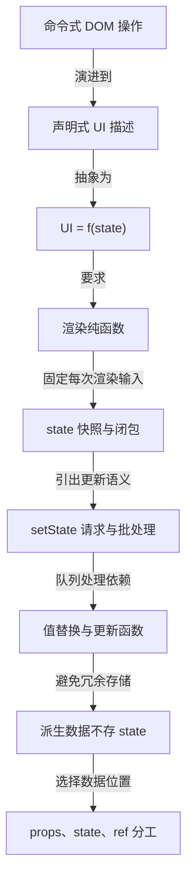
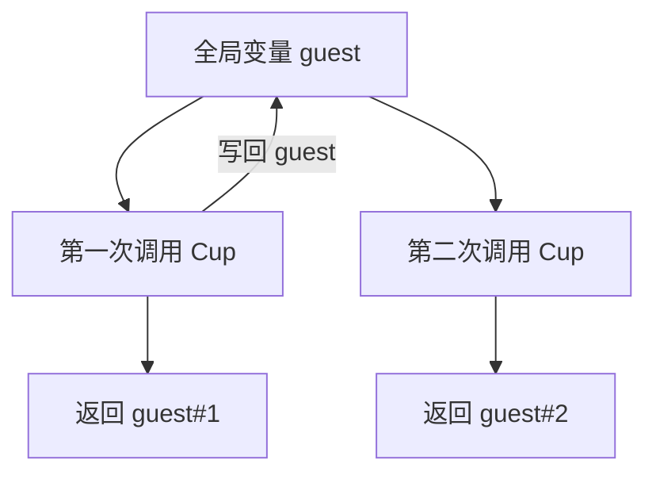
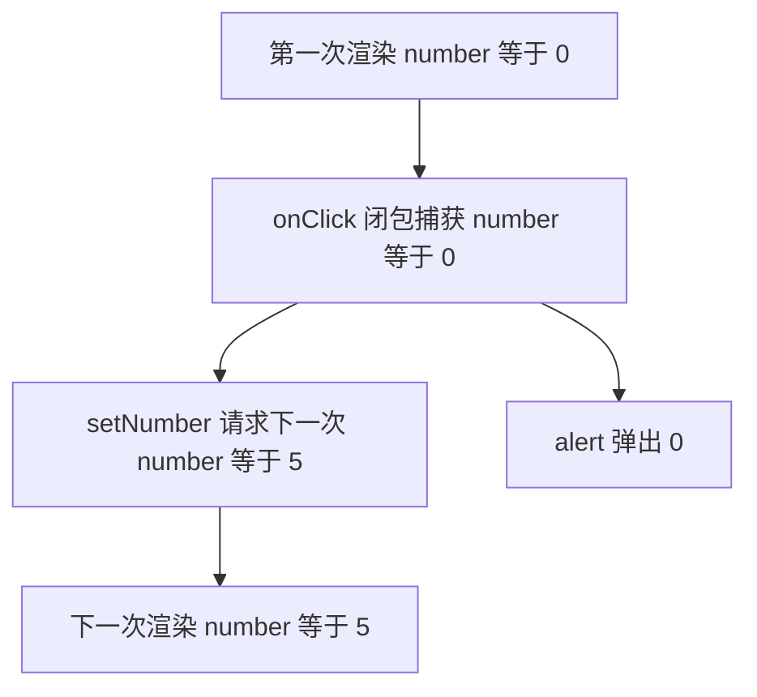
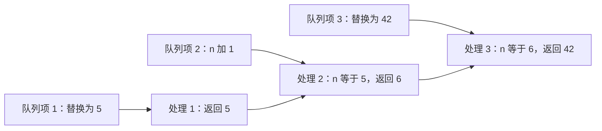
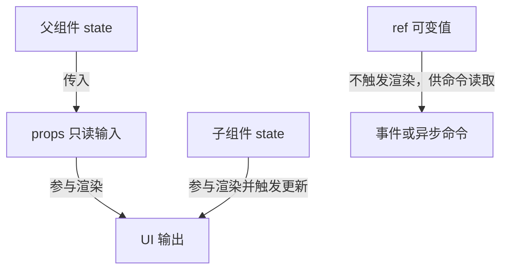

# 数据驱动视图的心智模型：UI = f(state)

!!! abstract "学完这一页你能"
    - 说出命令式 DOM 操作与声明式渲染的控制权差异，并举出各自主导的代码特征。
    - 用 UI = f(state) 解释一次交互后的界面变化，并判断组件渲染是否保持了纯函数约束。
    - 写出连续三次 setState 的两种结果，并解释值替换与更新函数在队列中的不同行为。
    - 识别 state 中的派生数据，并说明 props、state、ref 在选择数据位置时的作用。

## 0. 知识地图



建议先读第 1、2 节，建立从命令式到声明式的整体视角。再读第 3、4 节，理解渲染纯函数与 state 快照。第 5、6 节放入动手实验，最后用第 7 节检查真实项目里的数据边界。

## 1. 命令式 UI：为什么直接操作 DOM 会失控

**先想一个问题**：一个提交表单成功后要隐藏表单、显示成功卡；失败时要恢复按钮、显示错误。用 jQuery 风格代码，同一批 DOM 节点要在多条分支里反复开和关。

**心智模型**

!!! tip "心智模型"
    - 一句话模型：命令式 UI 是我们逐条命令浏览器去改变指定 DOM 节点。
    - 日常类比：副驾驶逐句告诉司机在哪个路口转弯、哪条车道加速。
    - 类比在哪里不成立：司机不知道你的最终目的地，只会执行命令；DOM 也一样，它不知道你心里的目标界面。

**图解**

```mermaid
sequenceDiagram
  participant U["用户"]
  participant H["提交处理函数"]
  participant D["DOM"]
  U->>H["点击提交"]
  H->>D["禁用提交按钮"]
  H->>D["显示加载中"]
  H->>D["隐藏错误信息"]
  H->>D["显示成功或错误信息"]
```

1. 用户点击提交，触发一个事件处理函数。
2. 函数先禁用按钮，再显示加载，再隐藏旧错误。
3. 请求结束后，函数继续按成功路径或失败路径分别操作 DOM。
4. 页面最终长什么样，取决于函数是否记得把每个节点都改对。

**一步一步来**

1. 写一个命令式提交处理函数，手动切换每个元素。

```js
function handleSubmit(e) {
  e.preventDefault()
  document.getElementById('submitBtn').disabled = true // 先禁用按钮
  document.getElementById('loading').style.display = 'block' // 显示加载
  document.getElementById('error').style.display = 'none' // 隐藏旧错误
  submitAnswer()
    .then(() => {
      document.getElementById('success').style.display = 'block' // 成功显示
      document.getElementById('form').style.display = 'none' // 隐藏表单
    })
    .catch((err) => {
      document.getElementById('error').textContent = err.message // 写错误
      document.getElementById('error').style.display = 'block' // 显示错误
    })
    .finally(() => {
      document.getElementById('loading').style.display = 'none' // 隐藏加载
      document.getElementById('submitBtn').disabled = false // 恢复按钮
    })
}
```

**这段代码在做什么**

- 每个 UI 变化都是一条 DOM 命令。
- 成功和失败两条分支都必须记得隐藏加载、恢复按钮。
- 页面状态分散在多个元素自身的样式和属性里。
- 新加入一个元素时，需要检查所有分支是否都处理了它。
- 没有单一地方能一眼看到表单当前到底处于哪个界面状态。
- 运行结果：请求成功时表单隐藏、成功卡显示，请求失败时错误卡显示，两条路径都依赖 finally 恢复按钮。

2. 输入变化时再补一段命令，控制按钮是否可点。

```js
function handleTextareaChange() {
  if (document.getElementById('textarea').value.length === 0) {
    document.getElementById('submitBtn').disabled = true // 无输入时禁用
  } else {
    document.getElementById('submitBtn').disabled = false // 有输入时启用
  }
}
```

**这段代码在做什么**

- 输入区的每一次变化都要单独写命令。
- 按钮状态由输入长度决定，但这个关系只存在于这条函数里。
- 如果提交分支也改按钮禁用状态，两个逻辑点会互相覆盖。
- 运行结果：输入为空时按钮禁用，输入非空时按钮启用，但提交后的恢复逻辑分布在另一处。

**动手验证**

独立运行，无外部依赖，Node 20+。用对象模拟 DOM 节点，验证成功路径结束时页面关键状态正确。

```js
const assert = require('node:assert')

function createDom() {
  return {
    button: { disabled: false },
    loading: { display: 'none' },
    success: { display: 'none' },
    form: { display: 'block' },
  }
}

function runSuccessPath(dom) {
  dom.button.disabled = true // 模拟提交开始
  dom.loading.display = 'block' // 模拟进入加载
  dom.success.display = 'block' // 模拟成功
  dom.form.display = 'none' // 模拟隐藏表单
  dom.loading.display = 'none' // 模拟结束加载
  dom.button.disabled = false // 模拟恢复按钮
  return dom
}

const dom = createDom()
runSuccessPath(dom)
assert.strictEqual(dom.button.disabled, false) // 按钮恢复
assert.strictEqual(dom.loading.display, 'none') // 加载隐藏
assert.strictEqual(dom.success.display, 'block') // 成功卡显示
console.log('成功路径断言通过：按钮恢复，加载隐藏')
```

运行结果：

```
成功路径断言通过：按钮恢复，加载隐藏
```

**常见坑**

| 现象 | 原因 | 怎么修 |
| 请求失败后按钮还是禁用 | 失败分支漏写启用 | 把提交界面的所有可见状态集中到一个渲染入口 |
| 新错误提示泄露上一次文本 | 成功分支只隐藏表单，没有清空错误 | 在渲染入口按状态统一覆盖或清理 |
| 某个输入事件突然启用了已提交按钮 | 多个 handler 修改同一属性，顺序互相覆盖 | 不再在事件里直接改节点，改为更新状态后统一渲染 |

**用在哪里**

1. 电商营销落地页的老项目表单
- 业务背景：旧 jQuery 落地页有多个弹窗、按钮和校验提示，分支已经互相缠绕。
- 这一节的知识怎么用：识别出命令式写法造成的分支爆炸，先不继续添加显隐命令。
- 用什么指标衡量收益：表单提交失败率、交互 bug 回归数量。
- 什么时候不该用：只剩一段静态文案或一个按钮，不需要引入声明式渲染。

2. 后台管理的批量导入弹窗
- 业务背景：导入弹窗有选择文件、上传中、部分失败、全部成功四种界面。
- 这一节的知识怎么用：把四个界面命名成枚举，不在每个按钮回调里散落显示隐藏。
- 用什么指标衡量收益：自动化测试能覆盖的界面状态数量、新增交互的修改文件数。
- 什么时候不该用：只有上传中与完成两态，且没有失败分支，命令式代码也不复杂。

**行业实践**

- React 官方文档《Reacting to Input with State》对比了命令式 UI 与声明式 UI，并给出先识别视觉状态的步骤。怎么借鉴到你的项目：实现复杂表单前，先列出所有可见状态，不直接从事件里操作节点。
- MDN Web Docs 的 DOM 操作部分展示了命令式驱动的 API；具体章节名需核对官方文档。怎么借鉴到你的项目：新项目有节点级操作需求时，把这类操作封在命名清楚的函数里。
- Vue 官方文档将响应式渲染描述为声明式核心；本资料未覆盖其内部机制，需核对官方文档。怎么借鉴到你的项目：如果团队已有 Vue 模块，理解模板如何从状态生成，而不是继续按步骤改节点。

**小结**

- 命令式 UI 的控制点在事件处理函数，每个节点变化都要显式写出。
- 界面状态越多，命令式分支越容易漏改节点。
- 声明式思路的控制点转移到 state，页面由状态推导出来。

## 2. UI = f(state)：把界面看成状态的输出

**先想一个问题**：搜索结果页同时有输入框、空态、加载态、错误态、结果列表。若用五个布尔值组合，会出现“既在加载又显示错误空态”的组合吗？

**心智模型**

!!! tip "心智模型"
    - 一句话模型：界面是 state 经过一个函数计算出的结果。
    - 日常类比：导航地图接收起点和终点，输出一条路线。
    - 类比在哪里不成立：地图还可能根据实时路况改变，而 UI = f(state) 只描述当前输入到界面的映射。

**图解**


1. state 是这轮输入的当前值。
2. 渲染函数读取 state，返回界面对象或 JSX。
3. UI 输出是本次渲染的固定产物。
4. state 变了，就再用同一个函数产生下一轮 UI。

**一步一步来**

1. 定义搜索页面的状态对象，只用一个 `status` 表示当前阶段。

```js
const state = {
  query: '',          // 当前搜索词
  status: 'idle',     // 可取值：idle、loading、success、error
  results: [],        // 成功后的结果列表
  error: null,        // 失败时的错误信息
}
```

**这段代码在做什么**

- `query` 保存用户输入。
- `status` 用单个枚举描述页面阶段。
- `results` 只在成功状态有意义。
- `error` 只在错误状态有意义。
- 运行结果：这个对象只有数据，没有 DOM 操作。

2. 编写 `renderSearchPage`，把状态映射成界面对象。

```js
function renderSearchPage(state) {
  if (state.status === 'loading') {
    return { type: 'spinner', text: '加载中' } // 加载态
  }
  if (state.status === 'error') {
    return { type: 'error', text: state.error } // 错误态
  }
  if (state.status === 'success') {
    return { type: 'list', items: state.results } // 结果态
  }
  return { type: 'form', query: state.query } // 默认输入态
}
```

**这段代码在做什么**

- 一个输入状态只进入一个分支。
- 加载中不会同时输出错误态或结果态。
- 新增状态时只在这个函数里加分支。
- 运行结果：`status: 'error'` 时只返回错误视图，不会额外出现加载条。

**动手验证**

独立运行，无外部依赖，Node 20+。断言同一状态对象只输出一个界面分支。

```js
const assert = require('node:assert')

function renderSearchPage(state) {
  if (state.status === 'loading') return { type: 'spinner' }
  if (state.status === 'error') return { type: 'error', text: state.error }
  if (state.status === 'success') return { type: 'list', items: state.results }
  return { type: 'form', query: state.query }
}

const page = renderSearchPage({ status: 'error', error: 'Network down', results: [] })
assert.strictEqual(page.type, 'error') // 错误状态输出错误页
assert.strictEqual(page.text, 'Network down') // 错误页带上错误文本
console.log('断言通过：同一状态变量输出一个界面分支')
```

运行结果：

```
断言通过：同一状态变量输出一个界面分支
```

**常见坑**

| 现象 | 原因 | 怎么修 |
| 界面上同时出现加载和错误 | 多个布尔值组合出非法状态 | 使用单个 `status` 枚举 |
| 结果列表为空时误显示空态而其实在加载 | 用 `results.length` 推导状态，而不是用 `status` | 用显式状态变量 |
| 后续新增状态要在所有条件里打补丁 | 条件分支散落在多个事件和组件之外 | 让渲染函数成为状态到 UI 的唯一出口 |

**用在哪里**

1. 电商商品列表的虚拟滚动
- 业务背景：长列表按滚动位置计算可见行，同时还要显示加载与空数据。
- 这一节的知识怎么用：把滚动偏移、容器尺寸、列表数据放进 state 或派生输入，渲染函数只输出当前切片。
- 用什么指标衡量收益：首屏渲染的 DOM 节点数量、滚动掉帧次数。
- 什么时候不该用：列表只有 20 条以内时，虚拟滚动会增加计算。

2. 后台管理的批量导入
- 业务背景：导入过程有上传、解析、导入中、导入完成几种界面。
- 这一节的知识怎么用：用一个 `status` 控制阶段，不用多个按钮禁用和提示开关。
- 用什么指标衡量收益：状态组合测试覆盖率、同一个弹窗的 UI 缺陷数。
- 什么时候不该用：只有一种成功提示且没有多阶段时，不必引入状态机。

**行业实践**

- React 官方文档《Reacting to Input with State》提出先识别视觉状态，再决定哪些触发状态变化。怎么借鉴到你的项目：用枚举值描述页面阶段，不写多个布尔值。
- React 官方文档《Keeping Components Pure》说明组件应当像公式一样，同输入同输出。怎么借鉴到你的项目：同一 state 输入必须能得到同一 UI。
- React 官方文档《Render and Commit》把渲染描述为调用组件、返回快照、更新 DOM 的过程；章节名需核对官方文档目录。怎么借鉴到你的项目：把渲染函数和 DOM 更新阶段分开理解。

**小结**

- UI = f(state) 把界面变化问题变成状态到视图的计算问题。
- 用单个状态枚举能避免非法组合。
- 渲染函数应当是从 state 到 UI 的唯一映射。

## 3. 渲染必须是纯函数：同输入同输出

**先想一个问题**：一个小组件每次渲染都读取外部变量 guest 并加 1，同一组件渲染三次输出三位不同客人。为什么这会让测试和后续维护不可预测？

**心智模型**

!!! tip "心智模型"
    - 一句话模型：渲染函数必须只返回视图，不修改渲染前已存在的变量。
    - 日常类比：配方按固定克数做蛋糕，不在烘烤过程中往冰箱加新配料。
    - 类比在哪里不成立：配方不会因为其他厨师先用了冰箱而发生内容改变，但共享变量可能被其他模块改写。

**图解**



1. 第一次调用读取 guest 并写回。
2. 第二次调用读到已经变化的值。
3. 同一个组件、同一份调用参数，输出不同。
4. 渲染顺序一旦变化，页面内容也会变化。

**一步一步来**

1. 写一个不纯的杯子组件，渲染时修改外部变量。

```js
let guest = 0 // 模块级外部变量

function ImpureCup() {
  guest = guest + 1 // 渲染时修改外部变量
  return { tag: 'h2', text: `Tea cup for guest #${guest}` }
}
```

**这段代码在做什么**

- 每次调用都写 `guest`。
- 第一次输出 guest#1，第二次输出 guest#2。
- 输出不只由调用参数决定，还由调用次数决定。
- 运行结果：三个 `ImpureCup()` 会得到 guest#1、guest#2、guest#3。

2. 改成纯函数，把 guest 作为参数传入。

```js
function PureCup({ guest }) {
  return { tag: 'h2', text: `Tea cup for guest #${guest}` } // 只读输入
}
```

**这段代码在做什么**

- `guest` 来自参数，不来自外部变量。
- 函数内部没有任何写操作。
- 同样传 `{ guest: 1 }`，返回对象总是相同。
- 运行结果：`PureCup({ guest: 1 })` 永远输出 guest#1。

**动手验证**

独立运行，无外部依赖，Node 20+。用断言验证纯函数同输入同输出。

```js
const assert = require('node:assert')

function PureCup({ guest }) {
  return { tag: 'h2', text: `Tea cup for guest #${guest}` } // 只读 props
}

assert.deepStrictEqual(
  PureCup({ guest: 1 }),
  { tag: 'h2', text: 'Tea cup for guest #1' }
)
console.log('断言通过：同 props 同输出')
```

运行结果：

```
断言通过：同 props 同输出
```

**常见坑**

| 现象 | 原因 | 怎么修 |
| 测试时页面内容忽对忽错 | 组件读取全局变量，渲染次数不同结果不同 | 需要变化的数据用 props 或 state 传入 |
| 多个相同组件显示同一递增数字 | 每个组件共享一个外部变量 | 给每个组件传入自己的 guest |
| 并发渲染时出现串位 | 渲染期间写共享数据，顺序交错 | 严格移除渲染期间的写操作 |

**用在哪里**

1. 服务端渲染的营销页
- 业务背景：同一页面在服务器输出 HTML，并发访问会共享 Node 进程内存。
- 这一节的知识怎么用：把请求数据作为 props 传入组件，不在渲染函数里写全局临时变量。
- 用什么指标衡量收益：响应输出一致性、并发压测错误率。
- 什么时候不该用：纯客户端单实例且没有共享数据的静态演示。

2. 公共弹窗组件
- 业务背景：弹窗被多个页面复用，不同页面传入的 props 不同。
- 这一节的知识怎么用：弹窗内容只依赖 visibility、data 等 props，不在模块顶层保存上一次打开的数据。
- 用什么指标衡量收益：复用组件的缺陷数、回归测试通过率。
- 什么时候不该用：弹窗自身需要保存草稿时，草稿属于局部状态，由使用者显式维护。

**行业实践**

- React 官方文档《Keeping Components Pure》直接给出同输入同输出和不写外部变量规则。怎么借鉴到你的项目：代码评审时检查组件顶层和模块顶层是否有写操作。
- React 官方文档《Render and Commit》说明渲染期间组件被调用并计算快照；章节名需核对官方文档目录。怎么借鉴到你的项目：在渲染输入处做数据加工，不在渲染返回值里塞副作用。
- React 官方文档 Strict Mode 会重复调用组件以暴露不纯逻辑；具体标题需核对官方文档目录。怎么借鉴到你的项目：开发环境开启 Strict Mode，用两次渲染结果手工核对是否一致。

**小结**

- 渲染函数必须只返回值，不修改外部世界。
- 同 props 同 state 必须给出同 UI。
- 副作用应放到事件或专门机制，不在渲染期间执行。

## 4. state 是每次渲染的快照：闭包捕获了那个值

**先想一个问题**：点击 +5 按钮，随后立即 alert(number) 输出 0；setTimeout 3 秒后再 alert(number) 仍输出 0。为什么页面上的数字已经变成 5，alert 却拿到旧值？

**心智模型**

!!! tip "心智模型"
    - 一句话模型：每次渲染的 state 值固定，事件处理函数捕获本次渲染的值。
    - 日常类比：照片拍下瞬间的人的位置，之后人离开，照片不会更新。
    - 类比在哪里不成立：React 的 UI 快照不是纯静物，它还把事件处理逻辑与本次 state 一起绑定。

**图解**



1. 第一次渲染给组件传入 number 等于 0。
2. 点击处理函数闭包捕获这个 0。
3. setNumber 只影响下一次渲染。
4. 闭包里的 alert 仍读 0，即使未来渲染已经变成 5。

**一步一步来**

1. 写一个点击后立即 alert 的计数器。

```jsx
import { useState } from 'react'

export default function Counter() {
  const [number, setNumber] = useState(0) // 每次渲染有自己的 number

  return (
    <>
      <h1>{number}</h1>
      <button onClick={() => {
        setNumber(number + 5) // 本次渲染 number 为 0
        alert(number) // 闭包仍读 0
      }}>+5</button>
    </>
  )
}
```

**这段代码在做什么**

- `number` 在本次渲染是 0。
- `setNumber(number + 5)` 请求下一次渲染为 5。
- `alert(number)` 仍然读到闭包里的 0。
- 运行结果：页面数字最终变为 5，alert 弹出 0。

2. 把 alert 放进 setTimeout，仍会看到旧值。

```jsx
import { useState } from 'react'

export default function Counter() {
  const [number, setNumber] = useState(0)

  return (
    <>
      <h1>{number}</h1>
      <button onClick={() => {
        setNumber(number + 5) // 请求下一次渲染为 5
        setTimeout(() => {
          alert(number) // 回调捕获本渲染的 number
        }, 3000)
      }}>+5</button>
    </>
  )
}
```

**这段代码在做什么**

- `setTimeout` 回调在本次渲染中创建。
- 回调闭包捕获本次 `number` 值 0。
- 3 秒后页面可能已经是 5，但 alert 仍读 0。
- 运行结果：页面显示 5 后，定时 alert 仍弹出 0。

**动手验证**

独立运行，无外部依赖，Node 20+。用闭包模拟一次渲染内 state 值固定。

```js
const assert = require('node:assert')

function simulateRender() {
  const number = 0 // 本次渲染快照
  function handleClick() {
    const snapshot = number // 闭包捕获当前快照
    simulateSetNumber(snapshot + 5) // 请求下一次渲染
    setTimeout(() => {
      assert.strictEqual(snapshot, 0) // 闭包里的快照没变
      console.log('定时器读到的快照：0')
    }, 0)
  }
  return { handleClick }
}

function simulateSetNumber(nextNumber) {
  console.log('React 准备下一次渲染值：', nextNumber)
}

const { handleClick } = simulateRender()
handleClick()
```

运行结果：

```
React 准备下一次渲染值： 5
定时器读到的快照：0
```

**常见坑**

| 现象 | 原因 | 怎么修 |
| 异步回调读旧 state | 回调闭包捕获创建它的渲染 | 需要最新值时用更新函数，或重新创建回调 |
| 连续点击同一按钮都只加同一数值 | 同一渲染内 state 固定 | 改为更新函数 `n => n + delta` |
| 事件处理函数中对 state 的 alert 与页面不一致 | setState 不更新当前闭包变量 | 若需要立即展示，先保存本次计算结果再 alert |

**用在哪里**

1. 消息发送前延迟确认弹窗
- 业务背景：点击发送后 5 秒内可撤销，页面倒计时结束再发出。
- 这一节的知识怎么用：点击 handler 捕获那个时刻的消息内容快照，延时后不再读最新 state。
- 用什么指标衡量收益：误发率、用户撤销成功率。
- 什么时候不该用：确实需要读取 5 秒后用户又编辑过的新草稿时，不能使用旧闭包快照。

2. 轮询结果的对比展示
- 业务背景：每 3 秒拉取一次网站状态，图表要显示本轮与上轮的差值。
- 这一节的知识怎么用：在本轮读取时保留上一轮快照值，不在定时器中假设 state 是新的。
- 用什么指标衡量收益：状态对比准确率、告警误报次数。
- 什么时候不该用：需要跨渲染读取最新值做命令式操作时，应使用 ref 或专门机制，需核对官方文档。

**行业实践**

- React 官方文档《State as a Snapshot》明确提出 state 值在一次渲染内不变。怎么借鉴到你的项目：审查 handleClick 时用替代法把本次 state 值代入每一行。
- React 官方文档《Queueing a Series of State Updates》继续用替代法分析队列。怎么借鉴到你的项目：在按钮点击处理函数里，先把 state 值写在注释，再计算下一个请求。
- React 官方文档《Render and Commit》说明组件是函数，返回值是 UI 快照；章节名需核对官方文档目录。怎么借鉴到你的项目：把渲染与事件分开理解，不在渲染期间假设 state 已更新。

**小结**

- state 在一次渲染中像固定快照。
- 事件和定时器捕获的是创建它们的渲染快照。
- setState 只影响下一次渲染，不改变当前作用域里的变量。

## 5. setState 是请求，不是同步赋值

**先想一个问题**：`setNumber(number + 1)` 连写三次，为什么第一次请求后，第二次和第三次仍都使用 0，而不是依次使用 1、2？

**心智模型**

!!! tip "心智模型"
    - 一句话模型：setState 是向 React 请求一次新渲染，不是同步修改当前变量。
    - 日常类比：餐厅服务员先记完一桌菜再进厨房，不会你点一个菜就跑一次。
    - 类比在哪里不成立：React 还会把同一事件内的多次请求合并处理，而餐厅可能按顺序把菜下单给后厨。

**图解**

```mermaid
sequenceDiagram
  participant C["组件渲染"]
  participant H["onClick 处理函数"]
  participant R["React 队列"]
  C->>H["传入 number 等于 0 的快照"]
  H->>R["setNumber(0+1) 第一次请求"]
  H->>R["setNumber(0+1) 第二次请求"]
  H->>R["setNumber(0+1) 第三次请求"]
  R->>C["事件结束后用 number 等于 1 重新渲染"]
```

1. 组件把本次渲染快照 `number = 0` 交给 onClick。
2. 三次 setState 都在同一个快照上计算。
3. React 队列把多个请求合并到事件结束。
4. 下一次渲染使用最终值 1。

**一步一步来**

1. 写一个连写三次的计数器，先按值替换方式调用。

```jsx
import { useState } from 'react'

export default function Counter() {
  const [number, setNumber] = useState(0) // 每次渲染的 number 固定

  return (
    <>
      <h1>{number}</h1>
      <button onClick={() => {
        setNumber(number + 1) // 本次 number 等于 0
        setNumber(number + 1) // 仍然使用 0
        setNumber(number + 1) // 仍然使用 0
      }}>+3</button>
    </>
  )
}
```

**这段代码在做什么**

- 三次调用都基于本次渲染的 `number`。
- 每次调用都请求下一次渲染为 1。
- React 等整个事件处理函数运行完再处理状态更新。
- 运行结果：点击一次，页面数字从 0 变为 1。

2. 用替代法把本次快照值写进每个调用。

```js
setNumber(0 + 1) // 准备下一次渲染为 1
setNumber(0 + 1) // 仍准备为 1
setNumber(0 + 1) // 仍准备为 1
```

**这段代码在做什么**

- `number` 在本次渲染固定为 0。
- 每行都相当于请求同一个新值 1。
- 第三次请求没有在第二次基础上累加。
- 运行结果：`+3` 按钮实际只加一次。

**动手验证**

独立运行，无外部依赖，Node 20+。模拟值替换队列，验证最终结果。

```js
const assert = require('node:assert')

function processValueReplacements(initial, queuedValues) {
  let next = initial
  for (const value of queuedValues) {
    next = value // 后写的替换值覆盖前一次准备值
  }
  return next
}

const queued = [0 + 1, 0 + 1, 0 + 1] // 三次 setNumber(number + 1)
assert.strictEqual(processValueReplacements(0, queued), 1)
console.log('断言通过：点击三次 setNumber(number+1)，下一次渲染值为', processValueReplacements(0, queued))
```

运行结果：

```
断言通过：点击三次 setNumber(number+1)，下一次渲染值为 1
```

**常见坑**

| 现象 | 原因 | 怎么修 |
| 点击 +3 只加一次 | 三次请求都基于同一快照 0 | 用更新函数 `n => n + 1` |
| 请求后立即读 state 是旧值 | setState 是请求，不是赋值 | 需要本事件内就用新值，先自己算出来再用 |
| 多个 setState 被误认为会刷新多次 | 同一事件内的 setState 被批量处理 | 围绕最终 state 思考，不依赖逐次中间值 |

**用在哪里**

1. 购物车数量加减
- 业务背景：点击加号一次只加一，但页面还有营销规则可能再次调整数量。
- 这一节的知识怎么用：把 setQuantity 看成排队请求，不以当前 quantity 累计，除非使用更新函数。
- 用什么指标衡量收益：数量计算错误率、新增活动带来的回归 bug 数。
- 什么时候不该用：服务端每次只允许固定增量时，值替换足够。

2. 表单多个字段提交
- 业务背景：提交按钮触发多个 setState 请求，但只希望触发一次提交后跳转。
- 这一节的知识怎么用：事件处理完成后 React 会批量处理，不在每个 setState 后手动刷新。
- 用什么指标衡量收益：重复渲染次数、提交按钮重复触发数。
- 什么时候不该用：多个独立用户事件之间的状态变化不应合并，React 不跨点击批量。

**行业实践**

- React 官方文档《Queueing a Series of State Updates》将批处理解释为服务员下订单模型。怎么借鉴到你的项目：写事件处理函数时，把多个 setState 当成一个批次。
- React 官方文档《Render and Commit》说明事件触发渲染、渲染、提交三阶段；章节名需核对官方文档目录。怎么借鉴到你的项目：排查界面不更新时，先确认是否真的发生了事件和 setState 请求。
- React 官方文档《State as a Snapshot》解释事件处理函数中 state 固定。怎么借鉴到你的项目：代码评审时把每次渲染的 state 值写进注释，避免误以为 setState 会即时赋值。

**小结**

- setState 是排队请求下一次渲染。
- 同一事件内多次 setState 会被 React 批量处理。
- 值替换基于本次渲染快照，不会在队列中自动叠加。

## 6. 排队更新：什么时候用更新函数，什么时候用值

**先想一个问题**：`setNumber(number + 5); setNumber(n => n + 1); setNumber(42);` 最终结果是 42 还是 6？队列处理顺序决定答案。

**心智模型**

!!! tip "心智模型"
    - 一句话模型：更新队列按写出顺序处理，值替换覆盖前一个准备值，更新函数基于前一个处理结果计算。
    - 日常类比：收银员按订单顺序改账单，后一个总价覆盖前面的，优惠券按当前金额计算。
    - 类比在哪里不成立：React 在事件结束后统一处理队列，用户不会在半路看到中间账单。

**图解**



1. 第一项把准备值替换为 5。
2. 第二项基于当前准备值 5 计算为 6。
3. 第三项把准备值替换为 42。
4. 最终 state 是 42，中间结果 6 不会出现在 UI 上。

**一步一步来**

1. 写一个队列处理器，区分函数项和普通值。

```js
function processQueue(initial, queue) {
  return queue.reduce((current, update) => {
    return typeof update === 'function' ? update(current) : update
  }, initial)
}
```

**这段代码在做什么**

- 初始值作为 `reduce` 的第一个 current。
- 如果队列项是函数，就调用该函数，传入当前累计值。
- 如果队列项是不是函数，就把累计值直接替换成它。
- 返回最终累计值。
- 运行结果：这段代码本身不打印，只返回计算结果。

2. 构造一个混合队列，观察替换与更新函数混合后的结果。

```js
const queue = [
  5,          // setNumber(number + 5)：number 为 0 时是替换值 5
  n => n + 1, // 后一个更新函数基于 5 计算
  42,         // 最后替换为 42
]

console.log(processQueue(0, queue)) // 42
```

**这段代码在做什么**

- 第一项 5 被直接作为累计值。
- 第二项 `n => n + 1` 得到 6。
- 第三项 42 覆盖 6。
- 运行结果：打印 42。

**动手验证**

独立运行，无外部依赖，Node 20+。验证值替换覆盖、更新函数叠加。

```js
const assert = require('node:assert')

function processQueue(initial, queue) {
  return queue.reduce((current, update) => {
    return typeof update === 'function' ? update(current) : update
  }, initial)
}

const onlyReplace = [0 + 1, 0 + 1, 0 + 1]
assert.strictEqual(processQueue(0, onlyReplace), 1) // 三次值替换不叠加

const mixed = [5, n => n + 1, 42]
assert.strictEqual(processQueue(0, mixed), 42) // 最后替换覆盖前面的更新函数结果

const addThree = [n => n + 1, n => n + 1, n => n + 1]
assert.strictEqual(processQueue(0, addThree), 3) // 三个更新函数依次叠加
console.log('断言通过：值替换覆盖，更新函数叠加')
```

运行结果：

```
断言通过：值替换覆盖，更新函数叠加
```

**常见坑**

| 现象 | 原因 | 怎么修 |
| 更新函数里写 `n++` | 更新函数必须返回下一次 state，`n++` 返回旧值 | 返回 `n + 1` |
| 先更新函数后替换值，结果不是预想 | 替换值会覆盖前面的更新函数结果 | 根据业务顺序写队列，避免无意义的先加后覆盖 |
| 不使用更新函数导致连点丢更新 | 每次点击快照固定 | 需要基于前一次结果的累加，写成更新函数 |

**用在哪里**

1. 电商促销优惠按顺序计算
- 业务背景：商品先满减再折扣，最后可能有保价，顺序会影响结果。
- 这一节的知识怎么用：把每段优惠写成队列，价格替换操作和按当前价计算的更新函数分开。
- 用什么指标衡量收益：优惠结果与人工核算一致率。
- 什么时候不该用：优惠规则由后端计算，前端只展示时，不需要用更新函数队列。

2. 数据大盘的分段聚合
- 业务背景：异步批次返回不同分段的合计，最终要合并成总数。
- 这一节的知识怎么用：每次收到新分段都用更新函数 `total => total + delta` 追加。
- 用什么指标衡量收益：异步乱序返回后的合计错误率。
- 什么时候不该用：每次返回本身就是全量结果，直接用替换值。

**行业实践**

- React 官方文档《Queueing a Series of State Updates》提供多张队列表，说明替换与更新函数如何按序处理。怎么借鉴到你的项目：提交前先在纸上排好队列，再写代码。
- React 官方文档 `useState` 部分说明更新函数基于前一个队列值计算；具体标题需核对官方文档目录。怎么借鉴到你的项目：接口文档里把 setState 的两种调用形态建成示例。
- React 官方文档 `useState` 的 updater function 命名要求更新函数返回新值，不修改参数；具体标题需核对官方文档目录。怎么借鉴到你的项目：代码评审中检查更新函数是否返回新状态，不修改入参。

**小结**

- 更新队列按书写顺序处理。
- 值替换覆盖前面的准备值，更新函数按前一个值计算。
- 三次 `n => n + 1` 能从 0 叠加到 3。

## 7. 派生数据不存 state，props、state、ref 怎么选

**先想一个问题**：购物车存了 items，又存了 total。修改 items 后页面总价没变，因为忘记更新 total。这个 total 是否应该存进 state？

**心智模型**

!!! tip "心智模型"
    - 一句话模型：state 只保存最小原始数据，能推导出来的数据在渲染时计算。
    - 日常类比：发票总价由明细加总生成，不单独另抄一张总价单。
    - 类比在哪里不成立：会计可能出于审计需要存档一张总价单，而派生 state 只会增加同步成本。

**图解**



1. props 从父组件 state 派生，用于本次渲染输入。
2. 子组件自己的 state 变化会触发新一次渲染。
3. ref 保存可变值，但不直接驱动 UI 输出。
4. 派生计算应发生在进入 UI 输出之前，而不是另存 state；ref 细节资料未覆盖，需核对官方文档。

**一步一步来**

1. 只存 items，不另存 total。

```js
const cart = {
  items: [
    { price: 10, count: 2 }, // 第一条明细
    { price: 5, count: 1 },  // 第二条明细
  ],
}

function getTotal(cart) {
  return cart.items.reduce((sum, item) => sum + item.price * item.count, 0)
}

console.log(getTotal(cart)) // 25
```

**这段代码在做什么**

- `cart` 保存原始明细 items。
- `getTotal` 在渲染时从明细推导总价。
- 没有第二个 `total` 数据源需要同步。
- 运行结果：打印 25。

2. 修改 items 后重新调用，验证派生值自动正确。

```js
cart.items.push({ price: 20, count: 2 }) // 追加一条明细
console.log(getTotal(cart)) // 65
```

**这段代码在做什么**

- 只改变 items 数据源。
- 再次调用 `getTotal` 得到新总价。
- 没有遗漏同步的 total state。
- 运行结果：打印 65。

**动手验证**

独立运行，无外部依赖，Node 20+。断言 total 始终由明细计算。

```js
const assert = require('node:assert')

function getTotal(items) {
  return items.reduce((sum, item) => sum + item.price * item.count, 0)
}

const items = [
  { price: 10, count: 2 }, // 第一条明细
  { price: 5, count: 1 },  // 第二条明细
]
assert.strictEqual(getTotal(items), 25) // 原始两项总价
items.push({ price: 20, count: 2 }) // 追加明细
assert.strictEqual(getTotal(items), 65) // 追加后重新计算
console.log('断言通过：只存 items，总价始终由明细计算')
```

运行结果：

```
断言通过：只存 items，总价始终由明细计算
```

**常见坑**

| 现象 | 原因 | 怎么修 |
| 总价与明细不一致 | 总价是另一份 state，修改明细后没同步 | 移除 total state，渲染时调用 `getTotal(items)` |
| 用 ref 更新界面数字但界面不动 | ref 改变不触发渲染 | 需要显示在 UI 的数据用 state |
| 用 props 初始化 state 后父组件更新，子组件不响应 | state 只在首次渲染初始化 | 渲染时直接用 props，不复制进 state；确需本地状态时资料未覆盖 key 重置，需核对官方文档 |

**用在哪里**

1. 电商购物车
- 业务背景：购物车明细来自接口，总价、优惠、税费都需要展示。
- 这一节的知识怎么用：只存 items 和优惠规则状态，渲染时计算总价，不另存计算结果。
- 用什么指标衡量收益：结算页价格 bug 数、改规则时的同步修改文件数。
- 什么时候不该用：后端要求下单前以固定价格快照提交，展示可计算，但提交值需要单独来源。

2. 后台数据大盘
- 业务背景：筛选项、列表数据、分页信息同时决定表格。
- 这一节的知识怎么用：过滤结果作为派生数据，不另存一份 filterResults state。
- 用什么指标衡量收益：筛选器变更后的结果准确性、状态数量。
- 什么时候不该用：过滤计算在高频输入下开销大时，需要缓存方案；本资料未覆盖 useMemo，需核对官方文档。

**行业实践**

- React 官方文档《Reacting to Input with State》给出的五步法强调移除非必要 state。怎么借鉴到你的项目：新增 state 前先问能否由现有 props 或 state 计算。
- React 官方文档《Keeping Components Pure》说明渲染期间不改变既有对象。怎么借鉴到你的项目：把派生计算放在渲染返回前，不写入模块级变量。
- React 官方文档 `useRef` 提到 ref 适合保存不触发渲染的可变值；本资料未覆盖具体 API，需核对官方文档。怎么借鉴到你的项目：明确区分需要显示和只需要保存的数据。

**小结**

- 能推导的数据不要另存 state。
- props 是父组件传入，state 是组件自己的可变状态。
- ref 用于不驱动 UI 的可变值，细节需核对官方文档。

## 应用地图

| 场景 | 用到本页哪个知识点 | 典型技术选型 | 注意事项 |
| 电商购物车结算 | 派生数据不存 state，更新函数队列 | React useState 加渲染时计算 total | 明确优惠顺序，避免 total state |
| 后台批量导入弹窗 | UI=f(state)，单个 status 枚举 | React 函数组件加 useState | 先列举所有阶段，不在事件里命令式显隐 |
| 搜索列表加载、空、错误态 | state 快照与批处理 | React 或 Vue 数据绑定 | 不用多个布尔组合 |
| 聊天消息未读计数 | setState 批处理与更新函数 | React useState 更新函数 | 异步回调不读旧快照 |
| 实时协作表格 | 渲染纯函数 | React 函数组件加 props | 渲染时不改写共享缓存 |
| 可视化大屏图层显隐 | 声明式 UI 统一映射 | React state 加 selector 或 Vue computed | 图层配置由数据推导 |
| 轮询监控告警 | state 快照与闭包 | React state 加自定义 Hook，需核对官方文档 | 定时器里注意闭包旧值 |
| 表单提交按钮状态 | 命令式到声明式 | React 受控组件 | 输入变化和提交流程只改 state |

## 动手作业

目标：写一个 Node 20+ 单文件模拟器，用本页的队列和快照模型实现叫号面板：号码 state、多个更新请求、派生显示。

步骤：

1. 定义组件渲染函数 `renderBoard(state)`，输入 `current` 和 `status`，输出界面对象。
2. 实现 `processQueue(initial, queue)`，支持普通值和更新函数两种队列项。
3. 给“叫号 +1”按钮生成三次排队更新，分别演示值替换与更新函数。
4. 用 `node:assert` 验证最终号码和渲染输出。

验收标准：

- 运行 `node board.js` 后打印通过信息，断言不少于 3 条。
- 使用 `n => n + 1` 时，三次更新使号码从 0 变到 3。
- 使用 `setNumber(number + 1)` 时，三次更新只从 0 变到 1。
- `renderBoard` 不写入外部变量，同 state 同输出。

## 综合对比

| 对比维度 | 方案 A | 方案 B | 选择依据 |
| UI 更新控制权 | 命令式直接改 DOM | 声明式由 state 推导 UI | 多状态交互用声明式 |
| 渲染期间修改外部 | 不纯组件写全局变量 | 纯组件只返回 UI | 同输入同输出选纯组件 |
| 同事件连续更新 | 值替换使用快照 | 更新函数基于前一个队列值 | 累加时用更新函数 |
| 父子组件数据 | props 只读传入 | state 组件内部可变 | 父传子用 props，内部变化用 state |
| 不触发渲染的引用 | state 驱动 UI | ref 不驱动 UI | 需显示用 state，可变但不显示用 ref |
| 派生总价 | 另存 total state | 渲染时计算 | 避免同步 bug |

## 深入阅读与参考

!!! tip "怎么用这些资料"
    先读「官方文档与规范」建立准确的概念，再读「源码与示例」核对细节，最后用「教程、书籍与视频」换一种讲法加深理解。每条都写明了读哪一节、带着什么问题读。

### 官方文档与规范

| 资源 | 为什么读 | 怎么读 |
|---|---|---|
| [State as a Snapshot](https://react.dev/learn/state-as-a-snapshot) | 官方正典解释 state 快照语义与闭包捕获，直击本页核心概念 | 读快照与闭包两节，带着「异步回调里为何读到旧值」的疑问，读后写一个 setTimeout 改 state 的反例 |
| [Queueing a Series of State Updates](https://react.dev/learn/queueing-a-series-of-state-updates) | 讲清 setState 是请求、批量排队与更新函数的使用时机 | 重点读替换值与更新函数、批处理两节，带着「连续加一为何只加一次」的问题，读后写累加计数器验证 |
| [Choosing the State Structure](https://react.dev/learn/choosing-the-state-structure) | 给出派生数据不存 state 的判据与 state 结构选择原则 | 读「避免冗余 state」一节，对照自己项目找出可派生的 state 并删掉，观察渲染是否仍正确 |
| ['Manipulating the DOM with Refs'](https://react.dev/learn/manipulating-the-dom-with-refs) | 说明何时该用 ref 触碰 DOM，补全 props、state、ref 的选择 | 读「何时使用 ref」一节，想清楚焦点与动画为何不该进 state，再改写项目里一处 DOM 操作 |
| [State: A Component's Memory](https://react.dev/learn/state-a-components-memory) | 从组件记忆的角度解释 state 为何存在，奠定数据驱动基础 | 读第一节与「state 是隔离的、私有的」，想清楚每次渲染拿到的究竟是哪一份值 |
| [MDN DOM 概述](https://developer.mozilla.org/en-US/docs/Web/API/Document_Object_Model) | 先看清命令式 DOM 的节点模型，才能体会直接操作为何失控 | 读概述与 Node、Element、Document 三个接口，在控制台手动创建、插入、删除一棵 DOM 树 |

### 源码与示例

| 资源 | 为什么读 | 怎么读 |
|---|---|---|
| [petite-vue](https://github.com/vuejs/petite-vue) | 不到千行的响应式实现，看清状态驱动视图的最小机制 | 读 src/index.ts 中 effect 与响应式绑定的部分，画出一次状态变更到视图更新的调用链 |
| [Vue 核心源码仓库](https://github.com/vuejs/core) | 从源码理解依赖收集与触发，对照 state 变化如何驱动更新 | 先读 packages/reactivity 里的 ref 与 effect，再读 computed，理解派生值为何不单独存状态 |

### 教程、书籍与视频

| 资源 | 为什么读 | 怎么读 |
|---|---|---|
| [Dan Abramov：Overreacted](https://overreacted.io/) | 用「渲染即计算」的视角拆解心智模型，文章由浅入深 | 按发布时间从旧到新读渲染相关几篇，读完用自己的话写一段 UI = f(state) 的解释 |
| [Thinking in React](https://react.dev/learn/thinking-in-react) | 官方经典教程，五步法示范如何从需求拆出最小 state | 照五步做一遍待办清单，重点记录哪些数据被判断为可派生因而没放进 state |
| [Solid 交互式教程](https://www.solidjs.com/tutorial/introduction_basics) | 交互式对比响应式更新，帮助理解赋值与请求的差别 | 做完 Reactivity 小节，把 Solid 的直接赋值改写成 React 的更新函数形式，比较差异 |
| [Kent：State colocation](https://kentcdodds.com/blog/state-colocation-will-make-your-react-app-faster) | 讲 state 该放在离使用处多近，减少无谓的重渲染 | 读完后把项目里一个全局 state 下沉到使用处，用 DevTools 记录重渲染次数的变化 |

## 自测题

??? question "1. 命令式 UI 和声明式 UI 的控制权分别在哪里？"
    - 命令式：控制权在事件处理函数，代码直接修改 DOM 节点。
    - 声明式：控制权在 state，组件描述各状态下的界面。
    - 命令式容易出现分支漏改，声明式适合多状态交互。

??? question "2. UI = f(state) 中的 f 要满足什么要求？"
    - f 是渲染函数，输入 state 和 props，输出 UI。
    - 同一输入必须产生同一输出。
    - 渲染期间不能写外部变量，否则输出不可预测。

??? question "3. 为什么点击 +3 的 setNumber(number + 1) 三次只加一次？"
    - 本次渲染 number 固定为 0。
    - 三次调用都请求下一次 number 为 1。
    - React 等事件处理结束后批量处理，最终只加一次。

??? question "4. 为什么 setTimeout 3 秒后 alert(number) 仍输出 0？"
    - 回调在本次渲染创建，闭包捕获本次渲染的 number。
    - setState 不改变当前作用域变量。
    - 3 秒后页面可能已经渲染为 5，但回调仍在旧闭包中执行。

??? question "5. 更新函数与值替换在队列中如何处理？"
    - 队列按书写顺序处理。
    - 值替换覆盖前一个准备值。
    - 更新函数基于前一个处理结果计算并返回新值。

??? question "6. setNumber(number + 5); setNumber(n => n + 1); setNumber(42) 最终 number 是多少？"
    - 初始 0，第一个队列项替换为 5。
    - 第二个更新函数计算为 6。
    - 第三个替换为 42，最终为 42。

??? question "7. 购物车 total 是否应该存 state？"
    - 不应该，total 由 items 明细计算。
    - 另存 state 会产生两份数据，修改 items 后可能不一致。
    - 渲染时执行派生计算，保持单一数据源。

??? question "8. props、state、ref 如何选择？"
    - props 是父组件传入的只读输入，用于展示和受控行为。
    - state 是组件自己的可变数据，变化后触发渲染。
    - ref 保存不触发渲染的可变值，用于事件或命令读取；资料未覆盖 ref 细节，需核对官方文档。

## 延伸阅读

- React 官方文档《State as a Snapshot》：阅读 Rendering takes a snapshot in time 与 State over time。
- React 官方文档《Queueing a Series of State Updates》：阅读 React batches state updates 与 Updating the same state multiple times before the next render。
- React 官方文档《Reacting to Input with State》：阅读 How declarative UI compares to imperative 与 Thinking about UI declaratively。
- React 官方文档《Keeping Components Pure》：阅读 Purity: Components as formulas 与 Side Effects: unintended consequences。
