# use() 与 Suspense：数据读取的新范式

!!! abstract "学完这一页你能"

    1. 说清 `use` 与 Hooks 在调用位置上的差别，并写出一个在 `if` 里读 Context 的组件。
    2. 用 `use(promise)` 让组件挂起，并解释挂起期间 React 依次做了哪几件事。
    3. 手写一个最小 `use`，用抛 Promise 的方式复现挂起与重试渲染。
    4. 判断一段数据读取代码会不会产生请求瀑布，并给出缓存与并发改造方案。

## 0. 知识地图

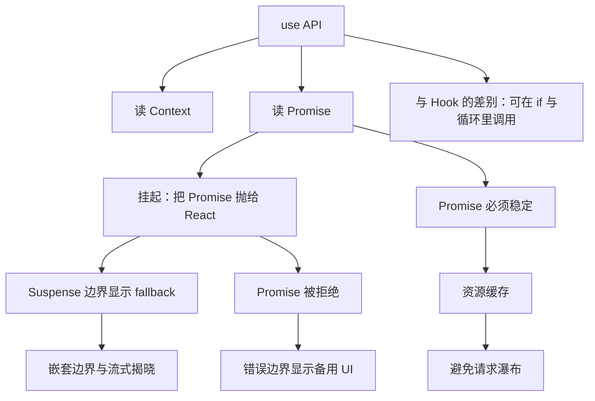

建议从第 1 节顺序读到第 8 节，每一节都建立在上一节之上。如果你只想先跑通一次挂起，可以跳到第 2 节和第 7 节，跑完再回头补 Suspense 边界与缓存。第 5 节和第 6 节属于工程实践，读完后建议直接拿自己项目的接口列表对照检查一遍。

## 1. use 是什么：能写进 if 的读取 API

**先想一个问题**

一个标题组件在 `children` 为空时提前 `return null`，之后再想读主题色。用 `useContext` 写在提前返回之后，lint 会直接报错。为什么 `use` 写在同样的位置就没事？

**心智模型**

!!! tip "心智模型"

    一句话模型：`use` 是渲染期的读取器，只能在组件或 Hook 里调用，但不受调用顺序约束。

    日常类比：图书馆的取书窗口，你什么时候走过去都能取到那本书，不需要记住自己是第几个到窗口的人。

    类比不成立的地方：`use` 仍然只能在渲染期间调用，放到事件回调或 `setTimeout` 里调用会报错，这一点资料明确写了 must be called inside a Component or a Hook。

!!! note "术语：Hook 调用顺序约束"

    定义：React 通过调用顺序给 `useState`、`useEffect` 这类 Hook 配对内部状态，所以它们必须每次渲染都调用相同的次数。例子：第一次渲染调用了 3 个 Hook，第二次渲染只调用了 2 个，第三个 Hook 的状态就会错位。

**图解**

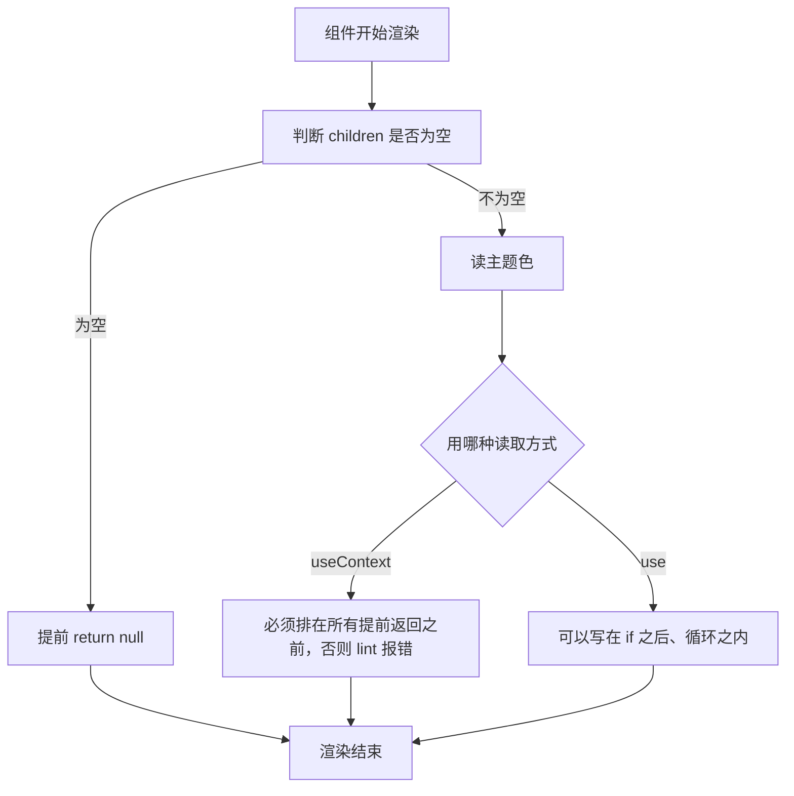

1. 组件开始渲染，第一步先做条件判断。
2. 如果条件成立就提前 `return null`，后面的代码不执行。
3. 条件不成立时进入读取分支，这里才决定用哪种 API。
4. `useContext` 必须写在所有提前返回之前，因为它的调用次数要固定。
5. `use` 可以写在提前返回之后，因为它不按顺序配对内部状态。
6. 两条路径最终都结束这次渲染。

**一步一步来**

**第 1 步：看清 useContext 的限制**

这一步要做什么：写一个提前返回之后调用 `useContext` 的组件，看它为什么过不了 lint。

```jsx
import { useContext } from 'react';
import ThemeContext from './ThemeContext';

function Heading({ children }) {
  if (children == null) {
    return null;                       // 提前返回，后面的 Hook 调用次数变成可变的
  }
  // react-hooks/rules-of-hooks 会在这里报错
  const theme = useContext(ThemeContext);
  return <h1 style={{ color: theme.color }}>{children}</h1>;
}
```

**这段代码在做什么**

- `if (children == null)` 让组件在某些渲染里提前结束。
- 提前返回之后调用 `useContext`，调用次数就和渲染时的 props 绑定了。
- React 要求 Hook 调用次数在每次渲染中保持一致，所以这种写法被规则拦下。
- 规则来自 eslint-plugin-react-hooks 的 `react-hooks/rules-of-hooks`，具体规则名需核对官方文档。

运行结果：

```text
ESLint: React Hook "useContext" is called conditionally.
Hooks must be called in the exact same order in every component render.
```

**第 2 步：换成 use**

这一步要做什么：把同一个组件改用 `use` 读 Context，让提前返回不再影响读取。

```jsx
import { use } from 'react';
import ThemeContext from './ThemeContext';

function Heading({ children }) {
  if (children == null) {
    return null;                       // 提前返回不必挪走
  }
  // use 允许写在 if 之后，React 不靠调用顺序给它配对内部状态
  const theme = use(ThemeContext);
  return <h1 style={{ color: theme.color }}>{children}</h1>;
}
```

**这段代码在做什么**

- `use` 读到的值来自调用组件上方最近的 Context Provider。
- 没有 Provider 时返回 `createContext` 传入的 `defaultValue`。
- `use` 写在 `if` 之后，渲染次数少了一次也不会让别的状态错位。
- 同理，`use` 也可以写在 `for` 循环里反复读取。
- `use` 读 Context 在服务端组件里不被支持，资料明确写了 not supported in Server Components。

**第 3 步：同一个 API 也能读 Promise**

这一步要做什么：先看一眼读 Promise 的形态，为下一节做铺垫。

```jsx
import { use } from 'react';

function Albums({ albumsPromise }) {
  // 组件在这里挂起，直到 Promise 完成
  const albums = use(albumsPromise);
  return (
    <ul>
      {albums.map(album => <li key={album.id}>{album.title}</li>)}
    </ul>
  );
}
```

**这段代码在做什么**

- `albumsPromise` 由父组件或数据层提供，本组件不创建 Promise。
- `use(albumsPromise)` 在 Promise 未完成时让组件挂起。
- 挂起本身不返回任何值，React 会改用最近的 Suspense 边界的 fallback。
- Promise 完成后 React 重试渲染这棵子树，`use` 返回解析后的数组。
- 这个组件不关心等待过程，等待由边界统一呈现。

**动手验证**

下面用两个小模型对照 Hook 的顺序约束与 `use` 的位置无关读取。依赖：无，Node 20+ 直接运行。

```js
// 依赖：无。保存为 use-vs-hooks.mjs，运行：node use-vs-hooks.mjs
import assert from 'node:assert/strict';

// 模型 A：像 Hook 一样，按调用顺序从槽位里取状态
function createHookRuntime() {
  const slots = [];
  let cursor = 0;
  return {
    begin() { cursor = 0; },                  // 每次渲染前把游标归零
    useState(init) {
      const i = cursor++;                      // 第几次调用决定用哪个槽位
      if (slots.length <= i) slots[i] = init;
      return slots[i];
    },
  };
}

const hooks = createHookRuntime();
hooks.begin();
const a = hooks.useState('A');                 // 第 1 次调用，落在槽位 0
const b = hooks.useState('B');                 // 第 2 次调用，落在槽位 1
assert.equal(a, 'A');
assert.equal(b, 'B');

hooks.begin();
const onlyFirst = hooks.useState('A');         // 这次少调用一个，槽位 1 不再被访问
assert.equal(onlyFirst, 'A');                  // 本次结果看起来正常

hooks.begin();
hooks.useState('A');
const shifted = hooks.useState('B');           // 又恢复两次调用，槽位重新对齐
assert.equal(shifted, 'B');

// 模型 B：use 读 Context，按 context 对象的身份取值，与调用顺序无关
const ThemeContext = { id: 'theme' };
const store = new Map([[ThemeContext, 'dark']]);

function readContext(ctx) {
  if (!store.has(ctx)) throw new Error('没有 Provider 时返回 defaultValue');
  return store.get(ctx);
}

function renderHeading(children) {
  if (children == null) return null;           // 提前返回
  return readContext(ThemeContext);             // 条件之后仍然可以读
}

assert.equal(renderHeading(null), null);
assert.equal(renderHeading('hi'), 'dark');
console.log('Hook 模型按顺序配对状态；use 模型按身份取值，条件调用不影响结果');
```

预期输出：

```text
Hook 模型按顺序配对状态；use 模型按身份取值，条件调用不影响结果
```

**常见坑**

| 现象 | 原因 | 怎么修 |
| --- | --- | --- |
| 组件里调用 `use` 报错 must be called inside a Component or a Hook | 调用点写在了普通函数或事件回调里 | 把读取移到组件函数体内，或抽成一个自定义 Hook |
| 在服务端组件里用 `use` 读 Context 报错 | 资料写明该用法在服务端组件里不被支持 | 把读取逻辑放进客户端组件，用 `use client` 标注 |
| 提前返回之后读 Context 拿到 `null` | 组件上方没有对应的 Provider | 在更上层补上 Provider，或给 `createContext` 设置合理的 defaultValue |

**用在哪里**

1. 多语言站点里的条件式文案渲染
    - 业务背景：页面部分区块只在有内容时渲染，文案颜色来自全局主题 Context。
    - 这一节的知识怎么用：在提前返回之后用 `use` 读主题 Context，组件逻辑保持线性。
    - 用什么指标衡量收益：统计该组件的 lint 报错条数，以及移除的重排代码行数。
    - 什么时候不该用：主题只在顶层用一次时，直接在顶层读完往下传更省事，不值得引入 Context。

2. 后台管理里的权限门控
    - 业务背景：按钮根据当前用户权限决定是否渲染，权限值放在 Context 里。
    - 这一节的知识怎么用：用 `use` 在 `if (show)` 分支里读权限 Context。
    - 用什么指标衡量收益：统计权限判断散落在组件里的处数，改造后集中到一次读取。
    - 什么时候不该用：权限需要覆盖整个路由时，用路由守卫统一处理比逐个组件读更可控。

**行业实践**

- React 官方文档《use》参考章节：明确写了 `use` 可以在循环和条件语句中调用，而 `useContext` 必须在组件顶层调用。怎么借鉴到你的项目：把因为提前返回而被迫上移的 Context 读取改回就近位置，缩短变量作用域。
- React 官方文档《use》Caveats 章节：列出 `use` 必须在组件或 Hook 内调用、读 Context 不支持服务端组件。怎么借鉴到你的项目：在代码评审清单里加一条，检查 `use` 的调用点是否在组件函数体或自定义 Hook 内。
- React 19 发布博客《New API: use》章节：说明 `use` 只能在渲染期调用，与 Hook 一样，但与 Hook 不同的是可以条件调用。怎么借鉴到你的项目：团队规范里区分"渲染期读取"与"带状态的 Hook"，避免把两者混在一段逻辑里。

**小结**

1. `use` 是渲染期读取 API，约束是"必须在组件或 Hook 内"，没有调用顺序约束。
2. 读 Context 时它的行为和 `useContext` 一致，取上方最近的 Provider 的值。
3. 读 Promise 时它会挂起组件，这是后面所有 Suspense 行为的前提。

## 2. 读 Promise 会挂起：throw promise 机制

**先想一个问题**

组件拿到一个 Promise，希望像读普通变量一样拿到结果。渲染函数是同步的，不能 `await`，那 React 靠什么知道"还没好"？

**心智模型**

!!! tip "心智模型"

    一句话模型：组件把 Promise 抛给 React，React 收到后暂停这棵子树，等 Promise 完成再从头重试渲染。

    日常类比：餐厅取号机给你一张号牌，你不用站在出餐口等，牌子一响回来取餐就行。

    类比不成立的地方：号牌丢了可以补办，但 Promise 如果每次渲染都新建，React 会认为等待一直没有结束，官方报错文案把它叫做 uncached promise。

!!! note "术语：挂起（suspend）"

    定义：组件在渲染过程中抛出 Promise，React 捕获后不渲染这棵子树，改用最近 Suspense 边界的 fallback，等 Promise 完成再重试。例子：`const albums = use(albumsPromise)` 在 Promise 未完成时挂起。

**图解**

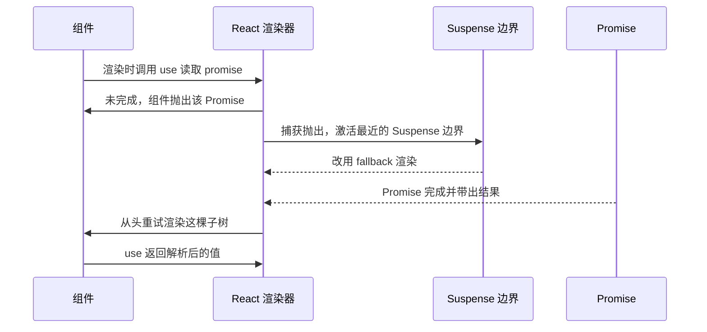

1. 组件在渲染中调用 `use` 读取 Promise。
2. Promise 处于 pending 状态，组件抛出这个 Promise。
3. React 捕获抛出，找到上方最近的 Suspense 边界。
4. 边界切换到 fallback，加载占位显示出来。
5. Promise 完成后带出结果值。
6. React 从头重试渲染被挂起的子树。
7. 这次 `use` 直接返回结果，组件正常渲染。

!!! note "术语：uncached promise"

    定义：在渲染过程中新建、每次渲染都是新实例的 Promise。例子：在组件函数体里直接写 `use(fetch('/api/albums'))`，每次渲染都会创建新的 Promise 对象。

资料覆盖范围说明：React 官方文档《use》给出了挂起行为与 uncached promise 的报错文案。渲染器内部如何捕获抛出、如何重试，资料未覆盖，需核对官方文档与 React 源码仓库。

**一步一步来**

**第 1 步：让组件挂起**

这一步要做什么：写一个读取 Promise 的组件，让它在数据到达前挂起。

```jsx
import { use } from 'react';

function MessageComponent({ messagePromise }) {
  // Promise 未完成时，这一行会让组件挂起
  const message = use(messagePromise);
  return <p>{message}</p>;
}

export default function App({ messagePromise }) {
  return (
    <Suspense fallback={<p>Loading...</p>}>
      <MessageComponent messagePromise={messagePromise} />
    </Suspense>
  );
}
```

**这段代码在做什么**

- `use(messagePromise)` 在 Promise 未完成时不返回，直接触发挂起。
- 挂起后由外层 Suspense 边界接管，渲染 `fallback`。
- Promise 完成后边界撤掉 fallback，渲染读取到数据的组件。
- Promise 被拒绝时，换由最近的错误边界渲染备用 UI。
- `messagePromise` 由外层传入，组件本身不创建它。

**第 2 步：看清抛出的是什么**

这一步要做什么：用一个最小运行时观察"抛出 Promise 之后谁来接住"。

```js
// 依赖：无。保存为 minimal-throw.mjs，运行：node minimal-throw.mjs
import assert from 'node:assert/strict';

function render(readFn) {
  try {
    return { ok: true, value: readFn() };     // 正常路径：读取成功
  } catch (thrown) {
    if (thrown instanceof Promise) {
      return { ok: false, pending: thrown };  // 抛出的是 Promise，判定为挂起
    }
    throw thrown;                              // 其它抛出继续向上冒泡
  }
}

const pending = Promise.resolve('done');
const result = render(() => { throw pending; });

assert.equal(result.ok, false);
assert.equal(result.pending, pending);         // 挂起凭证就是同一个 Promise 实例
console.log('抛出 Promise 被识别为挂起，而不是错误');
```

**这段代码在做什么**

- `render` 把读取包装在 `try` 里，负责区分挂起与错误。
- `thrown instanceof Promise` 为真时返回挂起状态，而不是抛错。
- 其它类型的抛出继续向上传递，交给错误边界处理。
- 断言验证挂起凭证就是原始 Promise 实例，React 靠它判断是否完成。
- 真实 React 的捕获与重试细节资料未覆盖，需核对官方文档。

运行结果：

```text
抛出 Promise 被识别为挂起，而不是错误
```

**第 3 步：重试渲染**

这一步要做什么：Promise 完成后重新跑一次读取，拿到结果。

```js
// 依赖：无。保存为 retry-render.mjs，运行：node retry-render.mjs
import assert from 'node:assert/strict';

function createResource(loader) {
  let status = 'pending';
  let value;
  const promise = loader().then(v => { value = v; status = 'done'; });
  return {
    read() {
      if (status === 'pending') throw promise; // 挂起：把同一个 Promise 抛出去
      return value;                            // 完成：直接返回结果
    },
  };
}

const user = createResource(() => Promise.resolve({ id: 7, name: 'Ada' }));
assert.throws(() => user.read(), Promise);     // 第一次读取挂起
await Promise.resolve();                       // 等 Promise 的回调执行完
assert.equal(user.read().name, 'Ada');         // 重试读取拿到结果
console.log('第二次读取返回最终值');
```

**这段代码在做什么**

- `createResource` 内部保存 Promise 实例，保证每次抛出的是同一个对象。
- `read` 在 pending 时抛 Promise，在 done 时返回值。
- 第一次调用 `read` 会抛，断言用 `assert.throws` 捕获。
- `await Promise.resolve()` 让微任务队列跑完，状态切换为 done。
- 第二次调用 `read` 正常返回对象，读取完成。

运行结果：

```text
第二次读取返回最终值
```

**动手验证**

下面的脚本把挂起、等待、重试三步串成一个可直接运行的程序。依赖：无，Node 20+ 直接运行。

```js
// 依赖：无。保存为 throw-promise.mjs，运行：node throw-promise.mjs
import assert from 'node:assert/strict';

// 极简资源：第一次读取抛 Promise，完成后返回值
function createResource(loader) {
  let status = 'pending';
  let value;
  const promise = loader().then(v => { value = v; status = 'done'; });
  return {
    read() {
      if (status === 'pending') throw promise; // 挂起协议：抛出同一个 Promise
      return value;
    },
  };
}

function render(readFn) {
  try {
    return { ok: true, value: readFn() };
  } catch (thrown) {
    if (thrown instanceof Promise) {
      return { ok: false, pending: thrown };   // 挂起分支
    }
    throw thrown;                               // 真错误继续抛出
  }
}

const user = createResource(() => Promise.resolve({ id: 7, name: 'Ada' }));

const first = render(() => user.read());
assert.equal(first.ok, false);
assert.ok(first.pending instanceof Promise);    // 第一次渲染挂起

await first.pending;                            // 等 Promise 完成

const second = render(() => user.read());
assert.equal(second.ok, true);
assert.equal(second.value.name, 'Ada');         // 重试渲染拿到数据
console.log('第一次挂起，第二次渲染读到 name =', second.value.name);
```

预期输出：

```text
第一次挂起，第二次渲染读到 name = Ada
```

**常见坑**

| 现象 | 原因 | 怎么修 |
| --- | --- | --- |
| 控制台报 A component was suspended by an uncached promise | 在渲染过程中新建了 Promise，每次渲染都是新实例 | 把 Promise 创建移到渲染之外，或用缓存让同一实例复用 |
| 把 `use` 包进 `try-catch` 后行为异常 | 官方 Caveats 写明 `use` 不能在 `try-catch` 里调用 | 去掉 `try-catch`，改用错误边界呈现失败状态 |
| 组件一直显示 loading 不结束 | Promise 被反复重建，React 认为等待没有终点 | 检查 Promise 的创建位置与缓存键 |

**用在哪里**

1. 电商商品详情页的评价区
    - 业务背景：主图与价格先出，评价列表依赖慢接口，不能阻塞首屏渲染。
    - 这一节的知识怎么用：把评价 Promise 从数据层传入，评价组件用 `use` 读取并挂起。
    - 用什么指标衡量收益：统计首屏可见时间，以及首屏渲染是否包含评价接口的等待。
    - 什么时候不该用：评价数据是首屏关键内容时，挂起会让用户看不到主信息，应改为先取数据再渲染。

2. 数据分析看板的图表区块
    - 业务背景：页面有四块图表，其中一块接口耗时明显高于其它三块。
    - 这一节的知识怎么用：把慢接口的 Promise 交给图表组件读取，让另外三块独立渲染。
    - 用什么指标衡量收益：统计每个图表区块的首次可见时间，观察是否只有慢块显示 loading。
    - 什么时候不该用：四块图表需要一起做联动计算时，分成独立挂起会让用户看到中间态。

**行业实践**

- React 官方文档《use》Caveats 章节：写明传给 `use` 的 Promise 必须缓存，使同一实例在多次渲染间复用。怎么借鉴到你的项目：把接口封装成数据层函数，缓存键取请求参数，组件只接收结果 Promise。
- React 19 发布博客《New API: use》章节：给出 uncached promise 的官方报错文案，并说明未来会提供在渲染中缓存 Promise 的能力。怎么借鉴到你的项目：在渲染函数里搜索 `use(fetch` 这类写法，统一改成从数据层取。
- React 官方文档《Suspense》What activates a Suspense boundary 章节：列出激活边界的条件，包括用 `use` 读取 Promise。怎么借鉴到你的项目：把"会不会激活边界"作为数据读取方式的选择依据，避免在 Effect 里请求却期待出现 loading 边界。

**小结**

1. 挂起不是 `await`，而是把 Promise 抛给 React，由 React 决定何时重试。
2. 抛出与重试都要求 Promise 实例稳定，否则等待永远不会结束。
3. 挂起只影响最近的 Suspense 边界，边界之外的 UI 照常渲染。

## 3. Suspense 边界：回退 UI 与流式揭晓

**先想一个问题**

页面顶部的导航和搜索框一直显示着，只有下方的商品列表在加载。如果整页变成一个 loading 图标，用户会觉得页面卡住了。这个"局部加载"由谁负责？

**心智模型**

!!! tip "心智模型"

    一句话模型：Suspense 边界是一条分包线，边界内的子树没准备好时，只替换这条线以内的 UI。

    日常类比：家里的分路配电箱，厨房跳闸不会让卧室的灯灭掉。

    类比不成立的地方：React 不会一准备好就立刻揭晓，官方文档写明它最快每 300 毫秒揭晓一次，从上次揭晓时刻开始计算。

!!! note "术语：Suspense 边界"

    定义：由 `<Suspense fallback={...}>` 包起来的一段子树，子树的 `children` 挂起时改用 `fallback` 渲染。例子：`<Suspense fallback={<Spinner />}><Albums /></Suspense>`。

**图解**

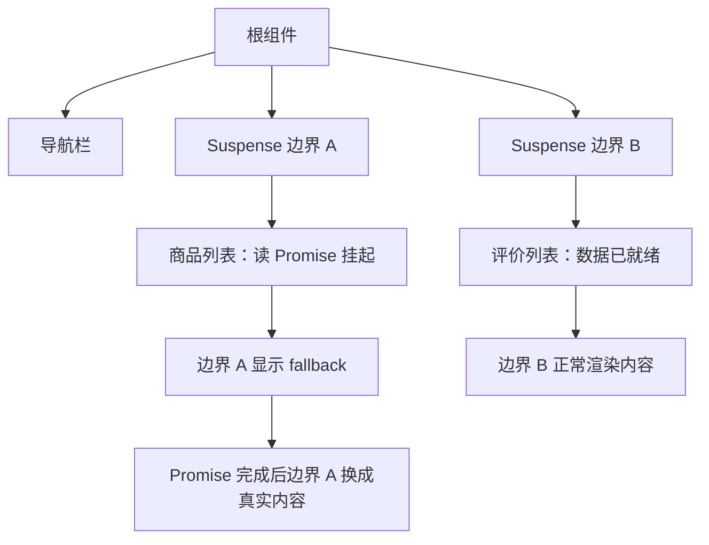

1. 根组件同时渲染导航栏、边界 A、边界 B。
2. 边界 A 里的商品列表读取 Promise，触发挂起。
3. 只有边界 A 切换到 fallback，导航栏与边界 B 不受影响。
4. 边界 B 里的评价列表数据已经就绪，直接渲染内容。
5. 边界 A 的 Promise 完成后，React 把 fallback 换成真实内容。

流式场景下，服务端 HTML 分块送达的过程可以这样看：

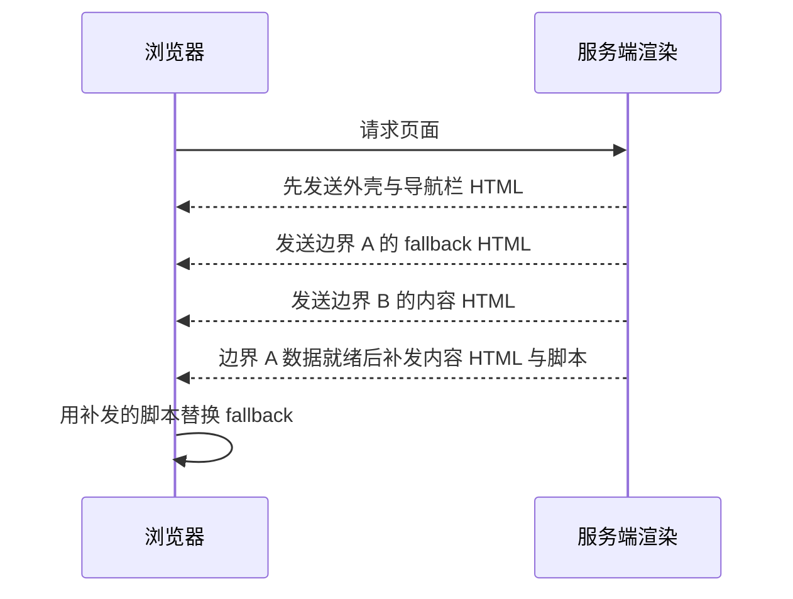

1. 浏览器发出页面请求。
2. 服务端先返回外壳与导航栏的 HTML，用户可以立刻看到框架。
3. 边界 A 数据未就绪，先发送 fallback 的 HTML。
4. 边界 B 数据就绪，直接发送内容 HTML。
5. 边界 A 数据就绪后，服务端补发内容 HTML 与内联脚本。
6. 浏览器执行脚本，把 fallback 替换成真实内容。

**一步一步来**

**第 1 步：包一层边界**

这一步要做什么：给列表组件加上 Suspense 边界，让加载占位只覆盖列表。

```jsx
import { Suspense } from 'react';
import Albums from './Albums.js';

export default function ArtistPage({ artist }) {
  return (
    <>
      <h1>{artist.name}</h1>
      {/* 边界以内的子树挂起时，只替换这块区域 */}
      <Suspense fallback={<h2>Loading...</h2>}>
        <Albums artistId={artist.id} />
      </Suspense>
    </>
  );
}
```

**这段代码在做什么**

- `<h1>` 不在边界内，列表加载时它照常显示。
- `fallback` 接受任意 React 节点，实际项目里通常用骨架屏。
- 边界内的子树全部就绪后，React 才把 fallback 换成真实内容。
- 如果 `fallback` 自己挂起，会激活更外层的父边界。
- `Suspense` 只在文档列出的情况激活，包含 `lazy`、`use` 读 Promise、样式表加载等。

**第 2 步：嵌套边界**

这一步要做什么：让页面骨架先出现，再让列表局部加载。

```jsx
import { Suspense } from 'react';

export default function Page() {
  return (
    <Suspense fallback={<PageSkeleton />}>   {/* 外层：整页骨架 */}
      <Header />
      <Suspense fallback={<ListSkeleton />}> {/* 内层：只覆盖列表 */}
        <ProductList />
      </Suspense>
      <Footer />
    </Suspense>
  );
}
```

**这段代码在做什么**

- 外层边界负责整页骨架，内层边界负责列表占位。
- 列表挂起时只有内层 fallback 出现，`Header` 与 `Footer` 正常渲染。
- 内层 `fallback` 若也挂起，则交给外层边界处理。
- 边界数量影响用户看到的闪烁次数，需要和揭晓节奏一起考虑。
- 官方文档写明 React 最快每 300 毫秒揭晓一次挂起内容。

**第 3 步：知道边界什么时候会重新显示 fallback**

这一步要做什么：弄清已经显示内容的边界再次挂起时会怎样。

```jsx
import { Suspense, useState, startTransition } from 'react';

function SearchResults({ query }) {
  const results = use(fetchResults(query)); // query 变化时重新读取
  return <List items={results} />;
}

export default function SearchPage() {
  const [query, setQuery] = useState('react');
  return (
    <Suspense fallback={<Spinner />}>
      {/* 非过渡更新：边界会重新显示 fallback */}
      <SearchResults query={query} />
      <button onClick={() => startTransition(() => setQuery('suspense'))}>
        Switch
      </button>
    </Suspense>
  );
}
```

**这段代码在做什么**

- 边界已经显示过内容后再次挂起，默认会重新显示 fallback。
- 用 `startTransition` 触发的更新属于例外，官方文档明确列出这一条。
- `useDeferredValue` 触发的更新同样属于例外。
- 边界重新挂起时 React 会清理内容树里的布局 Effect，内容回归时再重新触发。
- 这样安排是为了让测量 DOM 布局的 Effect 不会在内容隐藏时执行。

**动手验证**

下面实现一个极简边界渲染器，观察 fallback 与内容的切换。依赖：无，Node 20+ 直接运行。

```js
// 依赖：无。保存为 suspense-boundary.mjs，运行：node suspense-boundary.mjs
import assert from 'node:assert/strict';

const sleep = ms => new Promise(resolve => setTimeout(resolve, ms));

function createResource(ms, value) {           // 模拟一个耗时的数据来源
  let done = false;
  let data;
  const promise = sleep(ms).then(() => { done = true; data = value; });
  return { read() { if (!done) throw promise; return data; } };
}

function renderBoundary({ fallback, children, read }) {
  try {
    return { status: 'ready', output: children(read()) };
  } catch (thrown) {
    if (thrown instanceof Promise) {            // 捕获到挂起凭证
      return { status: 'fallback', output: fallback(), pending: thrown };
    }
    throw thrown;                               // 真错误向上抛给错误边界
  }
}

const listResource = createResource(30, ['A', 'B']);
const read = () => listResource.read();

const firstPass = renderBoundary({
  fallback: () => '显示骨架屏',
  children: value => '显示列表 ' + value.join(','),
  read,
});
assert.equal(firstPass.status, 'fallback');     // 第一次渲染显示 fallback

await firstPass.pending;                        // 等数据就绪

const secondPass = renderBoundary({
  fallback: () => '显示骨架屏',
  children: value => '显示列表 ' + value.join(','),
  read,
});
assert.equal(secondPass.status, 'ready');
assert.equal(secondPass.output, '显示列表 A,B');
console.log(firstPass.output, '->', secondPass.output);
```

预期输出：

```text
显示骨架屏 -> 显示列表 A,B
```

**常见坑**

| 现象 | 原因 | 怎么修复 |
| --- | --- | --- |
| 数据在 Effect 里请求，边界一直不显示 fallback | 官方文档写明 Suspense 不检测 Effect 或事件处理器里的请求 | 改用 `use` 读取 Promise，或使用支持 Suspense 的框架的数据层 |
| 多个边界依次闪烁，页面反复跳动 | React 最快每 300 毫秒揭晓一次，边界就绪时间不同 | 合并就绪时间接近的边界，或调整数据加载顺序 |
| 切换筛选条件时整块内容消失再出现 | 非过渡更新触发的再次挂起会显示 fallback | 用 `startTransition` 或 `useDeferredValue` 包装这次更新 |
| 挂起过的组件里输入框内容丢失 | 官方文档写明首次挂起前的渲染状态不会被保留 | 把有状态的输入移到边界之外，或先取数据再挂载表单 |

**用在哪里**

1. 社交信息流的分层加载
    - 业务背景：帖子正文、图片列表、评论区三块数据来源不同，耗时差别明显。
    - 这一节的知识怎么用：给评论区单独包一层边界，正文先渲染出来。
    - 用什么指标衡量收益：统计正文可交互时间，以及同时显示的 fallback 数量。
    - 什么时候不该用：评论区是内容的一部分且有字数统计联动时，拆开会让用户看到不一致的计数。

2. 电商搜索结果的筛选联动
    - 业务背景：用户切换价格区间时结果列表重新请求，期间不希望整页空白。
    - 这一节的知识怎么用：用 `startTransition` 包装筛选状态更新，让旧结果保持可见。
    - 用什么指标衡量收益：统计切换过程中列表区域的空白帧数。
    - 什么时候不该用：筛选条件变化需要立刻反馈的强一致场景，保持旧结果会误导用户。

**行业实践**

- React 官方文档《Suspense》What activates a Suspense boundary 章节：列出激活边界的条件，包括 `lazy` 加载代码、`use` 读取 Promise、带 `precedence` 的样式表加载等。怎么借鉴到你的项目：把边界放在数据与代码都可能延迟的位置，而不是按视觉分区随意放。
- React 官方文档《Suspense》Reference 章节：写明 React 每 300 毫秒至多揭晓一次挂起内容，窗口内就绪的边界一起揭晓。怎么借鉴到你的项目：把同一屏内数据耗时接近的区块放进同一个边界，减少分批出现的次数。
- React 官方文档《Suspense》Reference 章节提到 `defer` 参数（实验特性）以及流式服务端渲染、选择性水合等配套优化。怎么借鉴到你的项目：实验特性在生产使用前需核对官方文档中的稳定性说明。

**小结**

1. 边界决定加载占位的范围，位置选在数据边界上比选在视觉边界上更稳。
2. 嵌套边界让页面骨架先出现，局部内容随后补充。
3. 已渲染内容的边界再次挂起时，默认重新显示 fallback，过渡更新是例外。

## 4. 错误边界：Promise 被拒绝时怎么办

**先想一个问题**

接口返回 500，组件读取的 Promise 被拒绝。此时页面既不该一直显示 loading，也不该整页白屏。谁来接住这个拒绝？

**心智模型**

!!! tip "心智模型"

    一句话模型：错误边界是渲染路径上的保险丝，捕获子树渲染时抛出的错误并显示备用 UI。

    日常类比：配电箱里的分路开关，某一路短路时只跳那一路。

    类比不成立的地方：错误边界抓不到事件处理器和异步回调里的错误，那类错误需要在调用点自己处理。

!!! note "术语：错误边界（Error Boundary）"

    定义：一个实现了 `static getDerivedStateFromError` 或 `componentDidCatch` 的类组件，捕获其子树渲染期间抛出的错误并显示备用 UI。例子：把 `<Suspense>` 与错误边界叠在一起，加载失败时显示重试按钮。

**图解**

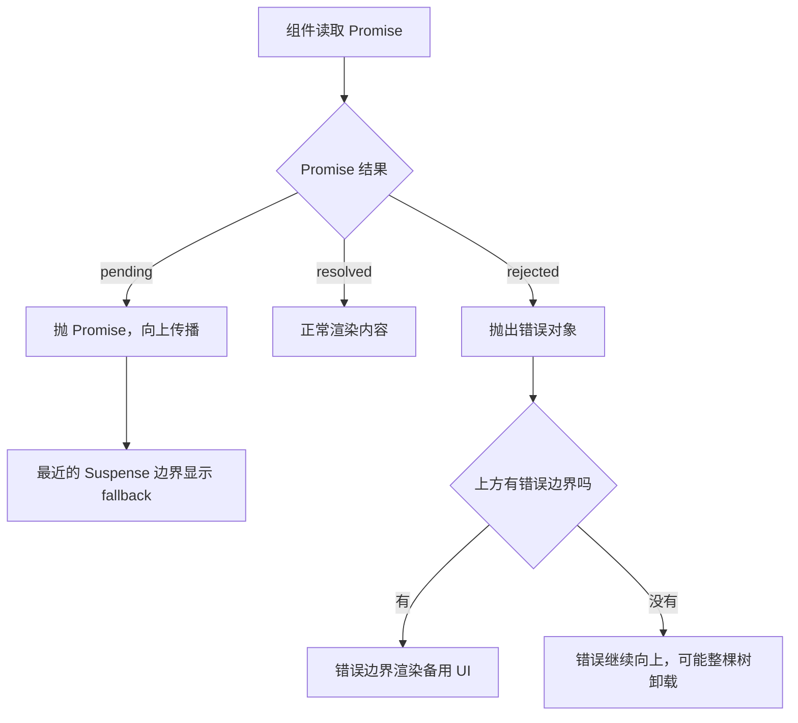

1. 组件读取 Promise，等待结果。
2. 结果未定时抛出 Promise，交给 Suspense 边界处理。
3. 结果成功时直接渲染内容。
4. 结果被拒绝时抛出错误对象，不再由 Suspense 边界接管。
5. 上方有错误边界时，由它渲染备用 UI。
6. 上方没有错误边界时，错误继续向上传播。

**一步一步来**

**第 1 步：写一个错误边界**

这一步要做什么：用一个类组件捕获子树里的渲染错误。

```jsx
import { Component } from 'react';

class ErrorBoundary extends Component {
  state = { hasError: false };

  static getDerivedStateFromError(error) {
    return { hasError: true };                 // 渲染期出错就切换状态
  }

  componentDidCatch(error, info) {
    // 这里适合上报日志，参数含义需核对官方文档
  }

  render() {
    if (this.state.hasError) {
      return <p>加载失败，请重试</p>;          // 备用 UI
    }
    return this.props.children;                 // 正常时渲染子树
  }
}
```

**这段代码在做什么**

- `getDerivedStateFromError` 在渲染期捕获错误后返回新的 state。
- `componentDidCatch` 适合做错误上报，具体参数含义需核对官方文档。
- `render` 根据 state 决定显示备用 UI 还是子树。
- 错误边界是类组件写法，函数组件本身不能直接充当错误边界。
- 这类组件的官方说明位于 React 文档 Component 参考页的捕获渲染错误章节。

**第 2 步：和 Suspense 叠起来用**

这一步要做什么：让加载中显示 fallback，加载失败显示错误 UI。

```jsx
import { Suspense } from 'react';

export default function Panel({ dataPromise }) {
  return (
    <ErrorBoundary>                          {/* 外层：负责失败 */}
      <Suspense fallback={<p>Loading...</p>}> {/* 内层：负责等待 */}
        <Content dataPromise={dataPromise} />
      </Suspense>
    </ErrorBoundary>
  );
}

function Content({ dataPromise }) {
  const data = use(dataPromise);             // 失败时错误冒泡到外层边界
  return <pre>{JSON.stringify(data)}</pre>;
}
```

**这段代码在做什么**

- 错误边界放外层，Suspense 放内层，两种状态各由一层负责。
- Promise 未完成时组件挂起，内层边界显示 `Loading...`。
- Promise 被拒绝时错误向上冒泡，外层边界显示失败 UI。
- 顺序写反时，错误边界自己可能被挂起影响，需要核对官方文档确认行为。
- `use` 不能写在 `try-catch` 里，这是官方文档明确列出的限制。

**第 3 步：把失败状态做成可操作**

这一步要做什么：给备用 UI 加一个重新请求的入口。

```jsx
class RetryBoundary extends Component {
  state = { hasError: false, attempt: 0 };

  static getDerivedStateFromError() {
    return { hasError: true };
  }

  retry = () => {
    // 重新挂载子树，让组件重新读取新的 Promise
    this.setState(s => ({ hasError: false, attempt: s.attempt + 1 }));
  };

  render() {
    if (this.state.hasError) {
      return <button onClick={this.retry}>重新加载</button>;
    }
    // key 变化会重建子树，触发一次新的读取
    return <div key={this.state.attempt}>{this.props.children}</div>;
  }
}
```

**这段代码在做什么**

- `attempt` 作为 `key`，变化时 React 重建子树。
- 重建子树会触发一次新的数据读取，需要数据层返回新的 Promise。
- 备用 UI 提供明确的用户动作，而不是让用户手动刷新页面。
- 重试次数建议加上上限，避免接口持续失败时反复请求。
- 是否自动重试由业务决定，本页不给出具体重试策略。

**动手验证**

下面实现一个同时处理挂起与失败的极简渲染器。依赖：无，Node 20+ 直接运行。

```js
// 依赖：无。保存为 error-boundary.mjs，运行：node error-boundary.mjs
import assert from 'node:assert/strict';

let failingResource;                                     // 失败资源跨渲染复用，失败状态才能被后续读取看到

function createFailingResource() {
  if (failingResource) return failingResource;           // 同一个资源：第一次读取挂起，失败后再读抛真错误
  let settled = false;                                   // 底层 Promise 是否已经拒绝
  let error;                                             // 保存真实错误
  const promise = Promise.reject(new Error('HTTP 500')).catch(err => {
    settled = true;
    error = err;
    throw err;                                           // 保留拒绝状态，交给调用方处理
  });
  promise.catch(() => {});                               // 避免未处理的拒绝告警
  failingResource = {
    read() {
      if (settled) throw error;                          // 已失败：抛真错误，交给错误边界
      throw promise;                                     // 挂起：抛 Promise 作为凭证
    },
  };
  return failingResource;
}

function createOkResource(value) {
  let done = false;
  let data;
  const promise = Promise.resolve().then(() => { done = true; data = value; });
  return { read() { if (!done) throw promise; return data; } };
}

function renderTree({ children, read, fallback, errorUI }) {
  try {
    return { status: 'ready', output: children(read()) };
  } catch (thrown) {
    if (thrown instanceof Promise) {                     // 挂起分支
      return { status: 'fallback', output: fallback(), pending: thrown };
    }
    return { status: 'error', output: errorUI(thrown) }; // 错误边界分支
  }
}

const failing = renderTree({
  read: () => createFailingResource().read(),
  children: v => v,
  fallback: () => '加载中',
  errorUI: err => '加载失败：' + err.message,
});

if (failing.status === 'fallback') {
  await failing.pending.catch(() => {});                 // 等拒绝发生
  const retry = renderTree({
    read: () => createFailingResource().read(),
    children: v => v,
    fallback: () => '加载中',
    errorUI: err => '加载失败：' + err.message,
  });
  assert.equal(retry.status, 'error');
  console.log(retry.output);
}

const ok = renderTree({
  read: () => createOkResource('ok').read(),
  children: v => v,
  fallback: () => '加载中',
  errorUI: () => '加载失败',
});
assert.equal(ok.status, 'fallback');                     // 第一次读取仍然挂起
```

预期输出：

```text
加载失败：HTTP 500
```

**常见坑**

| 现象 | 原因 | 怎么修 |
| --- | --- | --- |
| 接口失败后页面白屏 | 渲染路径上没有错误边界 | 在 Suspense 外层补一个错误边界组件 |
| 用 `try-catch` 包住 `use` 报错 | 官方 Caveats 写明 `use` 不能在 `try-catch` 中调用 | 去掉 `try-catch`，改由错误边界呈现失败 |
| 点击重试没有任何变化 | 数据层返回了已被拒绝的同一个 Promise | 重试时让数据层创建新的 Promise，或清理缓存键 |
| 错误边界里的按钮点击无效 | 备用 UI 也需要遵守渲染期约束 | 把交互逻辑写在事件处理器里，不要写在渲染路径上 |

**用在哪里**

1. 后台管理的批量导入结果页
    - 业务背景：导入任务结果通过接口轮询获取，接口偶发超时会返回失败。
    - 这一节的知识怎么用：用 `use` 读取结果 Promise，外层错误边界提供重试入口。
    - 用什么指标衡量收益：统计失败后需要手动刷新页面的次数。
    - 什么时候不该用：失败是可以预期的业务状态时，用普通状态展示提示比错误边界更合适。

2. 金融类应用的行情面板
    - 业务背景：行情接口在开盘时段压力较大，偶尔返回错误码。
    - 这一节的知识怎么用：给每个行情卡片单独包错误边界，一块失败不影响其它卡片。
    - 用什么指标衡量收益：统计单块失败导致整屏不可用的次数。
    - 什么时候不该用：数据是交易决策依据时，静默降级会掩盖真实状态，应显式提示用户。

**行业实践**

- React 官方文档《use》Caveats 章节：写明 `use` 不能被 `try-catch` 包裹，需要用错误边界捕获失败。怎么借鉴到你的项目：在代码搜索里查找包住 `use` 的 `try`，逐个替换为错误边界。
- React 官方文档《Component》Catching rendering errors with an Error Boundary 章节：给出错误边界的类组件写法与适用边界。怎么借鉴到你的项目：在数据组件外层统一加一层错误边界，日志上报放在 `componentDidCatch`。
- React 官方文档《use》的 Promise 参数说明：写明 Promise 被拒绝时由最近的错误边界显示 fallback。怎么借鉴到你的项目：设计交互时把"加载中"和"加载失败"当成两个独立 UI 状态分别设计。

**小结**

1. 挂起与失败是两条不同路径：挂起交给 Suspense，失败交给错误边界。
2. `use` 不能写在 `try-catch` 里，这是官方文档明确的限制。
3. 重试要配合新 Promise，重复使用已拒绝的 Promise 不会恢复。

## 5. Promise 必须稳定：缓存与重复请求

**先想一个问题**

组件里写 `use(fetch('/api/albums'))`，页面进入无限加载。把 `fetch` 的结果存进一个 Map 之后就正常了。这两行的差别在哪里？

**心智模型**

!!! tip "心智模型"

    一句话模型：`use` 靠 Promise 实例判断是否还在等待，实例换了就等于等待重新开始。

    日常类比：取快递要用同一个取件码，每次换码就得重新排队。

    类比不成立的地方：缓存要考虑失效与内存回收，官方文档只写明必须缓存同一实例，具体失效策略需核对官方文档。

!!! note "术语：资源缓存（resource cache）"

    定义：把请求按某个键映射到 Promise 实例的一层结构，保证同一份数据在多次渲染间复用同一个 Promise。例子：官方文档示例里的 `cache = new Map()` 与 `fetchData(url)`。

**图解**

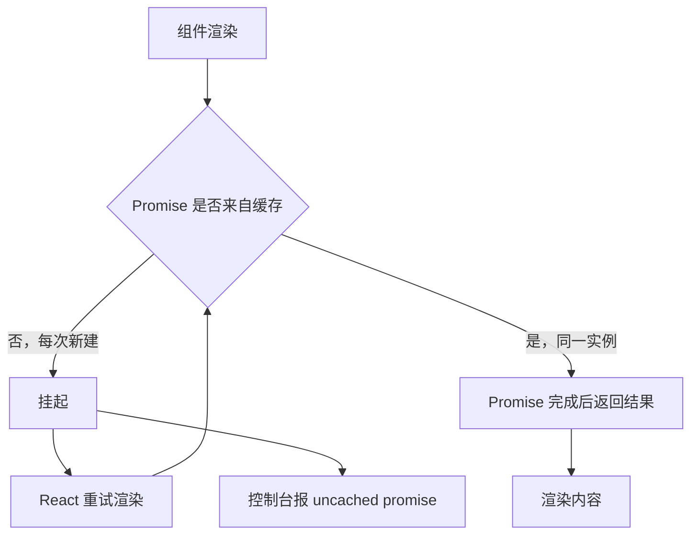

1. 组件开始渲染，检查 Promise 来源。
2. 如果每次渲染都新建 Promise，组件抛出新的实例并挂起。
3. React 重试渲染，又拿到新实例，再次挂起。
4. 这个循环不会结束，控制台出现 uncached promise 报错。
5. Promise 来自缓存时，重试渲染拿到同一实例，完成后返回值。
6. 组件渲染真实内容。

**一步一步来**

**第 1 步：看错误写法**

这一步要做什么：把 Promise 创建写在渲染过程中，观察结果。

```jsx
function Albums({ artistId }) {
  // 每次渲染都会新建 Promise，React 判定为等待永不结束
  const albums = use(fetch('/api/' + artistId + '/albums'));
  return <ul>{albums.map(a => <li key={a.id}>{a.title}</li>)}</ul>;
}
```

**这段代码在做什么**

- 渲染函数本身是同步执行的，每次执行都会调用一次 `fetch`。
- 每次调用返回新对象，React 无法把新对象和上次的等待关联起来。
- 组件反复挂起，页面停在 fallback 上。
- 官方给出的报错文案是 A component was suspended by an uncached promise。
- 修复方向是让同一份数据复用同一个 Promise 实例。

**第 2 步：用 Map 做缓存**

这一步要做什么：按请求地址缓存 Promise，让实例稳定下来。

```js
// 依赖：无。保存为 cache.mjs，运行：node cache.mjs
let cache = new Map();

export function fetchData(url) {
  if (!cache.has(url)) {                 // 只在该键第一次出现时创建 Promise
    cache.set(url, getData(url));
  }
  return cache.get(url);                 // 之后每次返回同一个实例
}

async function getData(url) {
  if (url === '/the-beatles/albums') {
    return await getAlbums();
  }
  throw Error('Not implemented');
}

async function getAlbums() {
  await new Promise(resolve => setTimeout(resolve, 300)); // 模拟网络等待
  return [{ id: 13, title: 'Let It Be', year: 1970 }];
}
```

**这段代码在做什么**

- `cache` 是模块级 Map，在多次渲染之间保持存在。
- `has` 判断决定是否创建新的 Promise，这是实例稳定的关键。
- `getData` 负责真实请求，只有首次出现该键时被调用。
- 官方文档的示例代码就是这种结构，缓存逻辑通常放在框架里。
- 缓存键建议包含全部影响结果的参数，避免不同请求互相覆盖。

**第 3 步：组件只消费缓存结果**

这一步要做什么：让组件从缓存函数拿 Promise，自身不创建。

```jsx
import { use } from 'react';
import { fetchData } from './data.js';

export default function Albums({ artistId }) {
  // fetchData 返回缓存中的同一个 Promise 实例
  const albums = use(fetchData('/' + artistId + '/albums'));
  return (
    <ul>
      {albums.map(album => (
        <li key={album.id}>{album.title} ({album.year})</li>
      ))}
    </ul>
  );
}
```

**这段代码在做什么**

- 组件负责读取，缓存逻辑放在 `data.js` 里，职责分开。
- `fetchData` 返回的实例在多次渲染间保持一致。
- Promise 完成后 `use` 返回专辑数组，组件正常渲染列表。
- 渲染期间不产生任何网络请求，请求只发生在缓存未命中时。
- 是否需要在组件卸载后清理缓存，需核对官方文档与所选框架说明。

**动手验证**

下面验证缓存带来的实例稳定性，并用计数模拟未缓存时的循环。依赖：无，Node 20+ 直接运行。

```js
// 依赖：无。保存为 promise-cache.mjs，运行：node promise-cache.mjs
import assert from 'node:assert/strict';

const cache = new Map();                   // 模块级缓存，跨渲染复用
let networkCalls = 0;

function fetchData(url) {
  if (!cache.has(url)) {                    // 未命中才创建 Promise
    networkCalls += 1;
    cache.set(url, Promise.resolve({ url, items: ['a', 'b'] }));
  }
  return cache.get(url);                    // 命中返回同一实例
}

const p1 = fetchData('/albums');
const p2 = fetchData('/albums');
assert.equal(p1, p2);                       // 同一个 Promise 实例
assert.equal(networkCalls, 1);              // 只发起一次请求

const result = await p1;
assert.deepEqual(result.items, ['a', 'b']);

// 对照：不做缓存时，每次渲染都拿到新实例
let uncachedCalls = 0;
function fetchWithoutCache(url) {
  uncachedCalls += 1;
  return Promise.resolve(url);
}
const u1 = fetchWithoutCache('/albums');
const u2 = fetchWithoutCache('/albums');
assert.notEqual(u1, u2);                    // 实例不同，React 会一直重试
assert.equal(uncachedCalls, 2);

// 模拟重试循环：未命中缓存时永远拿不到稳定的实例
let attempts = 0;
function renderOnce() {
  attempts += 1;
  const promise = fetchWithoutCache('/albums');
  if (u1 !== promise) throw promise;         // 实例不稳定，继续挂起
  return 'never';
}
for (let i = 0; i < 5; i += 1) {
  try { renderOnce(); } catch { /* 每次都以挂起结束 */ }
}
assert.equal(attempts, 5);                  // 5 次渲染都停在挂起状态
console.log('缓存命中 1 次请求；未缓存时 5 次渲染全部挂起');
```

预期输出：

```text
缓存命中 1 次请求；未缓存时 5 次渲染全部挂起
```

**常见坑**

| 现象 | 原因 | 怎么修 |
| --- | --- | --- |
| 控制台出现 uncached promise 警告 | Promise 在渲染中创建 | 把创建逻辑移到数据层，组件只做读取 |
| 参数变化后仍显示旧数据 | 缓存键没有包含参数 | 把参数拼进键，或清理对应键的缓存 |
| 内存持续增长 | Map 只增不减 | 设置清理时机，具体策略需核对官方文档 |
| 手动重试仍然失败 | 缓存里存着已拒绝的 Promise | 失败时删除该键，让下次读取重新创建 |

**用在哪里**

1. 电商商品列表的虚拟滚动
    - 业务背景：列表滚动过程中反复渲染同一批行，每行都要读商品数据。
    - 这一节的知识怎么用：按商品 id 做键缓存 Promise，滚动时命中缓存不重复请求。
    - 用什么指标衡量收益：统计单位时间内的请求条数与缓存命中率。
    - 什么时候不该用：价格库存这类强实时数据，长缓存会展示过期信息。

2. 后台管理的用户搜索面板
    - 业务背景：用户在搜索框反复输入同一关键词，历史请求结果可以复用。
    - 这一节的知识怎么用：按关键词缓存 Promise，回退输入时直接命中。
    - 用什么指标衡量收益：统计重复关键词的请求次数。
    - 什么时候不该用：搜索结果带有权限或审计要求时，复用缓存需要额外确认数据范围。

**行业实践**

- React 官方文档《use》Caching promises for client components 章节：要求传给 `use` 的 Promise 必须缓存，使同一实例在多次渲染间复用。怎么借鉴到你的项目：把缓存做成数据层的默认行为，组件层禁止直接建 Promise。
- React 官方文档《Suspense》Suspense-enabled frameworks 章节：说明支持 Suspense 的框架内部维护 Promise 缓存并调用 `use` 完成挂起。怎么借鉴到你的项目：优先接入框架提供的数据层，减少手写缓存的分支。
- React 19 发布博客《New API: use》章节：给出渲染中创建 Promise 的报错文案，并说明后续会提供更方便的缓存能力。怎么借鉴到你的项目：把这类报错加入构建期或运行期监控的关键字告警清单。

**小结**

1. Promise 实例稳定是 `use` 能结束等待的前提。
2. 缓存放在数据层比放在组件里更容易统一维护与清理。
3. 缓存键要覆盖所有影响结果的参数，失败后要能删除对应键。

## 6. 瀑布请求：串行等待的代价与并发改造

**先想一个问题**

页面先请求用户信息，拿到 `teamId` 之后再请求团队数据，最后再请求该团队的成员。三次请求依次发出，用户等待的是三段网络时间之和。能不能少等？

**心智模型**

!!! tip "心智模型"

    一句话模型：请求瀑布是一条串行链，每一级都要等上一级返回才能开始。

    日常类比：排队盖章，前一个章没盖完就不能盖下一个。

    类比不成立的地方：参数确实依赖上一个请求结果时，串行无法避免，只能改接口设计。

!!! note "术语：请求瀑布（request waterfall）"

    定义：后一个请求的开始时间依赖前一个请求的返回时间，多个请求形成串行链条。例子：先取 `userId`，再用 `userId` 取订单列表，最后用订单号取物流状态。

**图解**

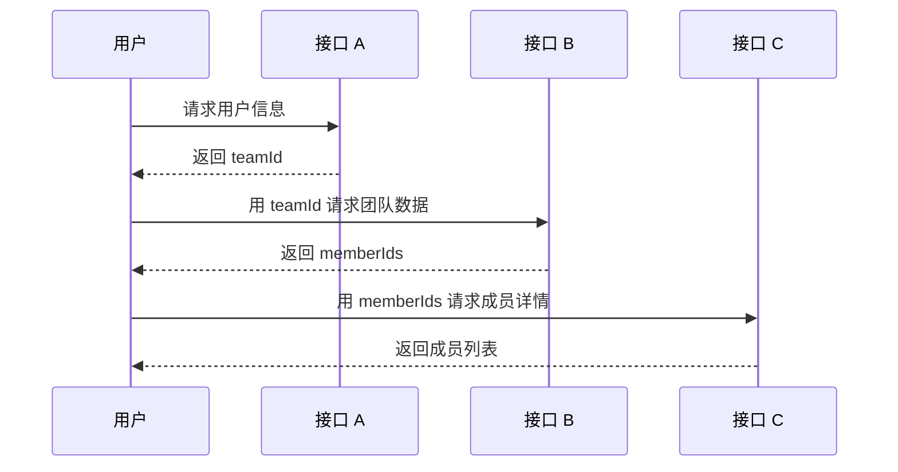

1. 用户先请求用户信息，这一步必须最先完成。
2. 拿到 `teamId` 之后才能发第二个请求。
3. 第二个请求返回 `memberIds`，第三个请求才有参数。
4. 三段等待与两次往返延迟叠加，页面在这段时间内没有内容。

改成并发之后：

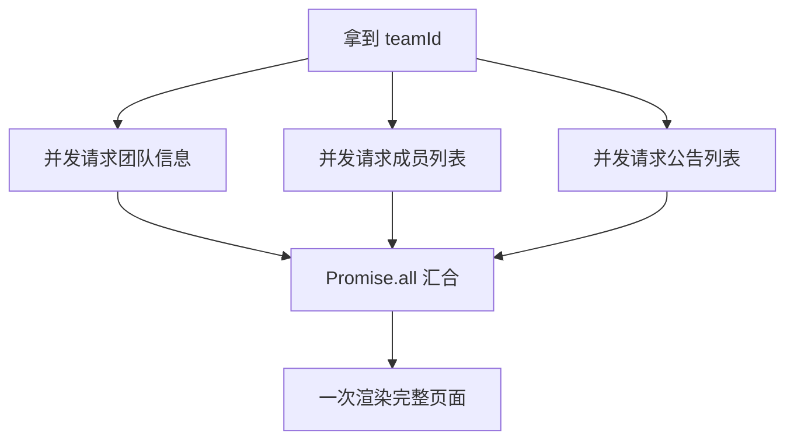

1. 先拿到后续请求共同需要的参数 `teamId`。
2. 把不互相依赖的三个请求同时发出。
3. 用 `Promise.all` 汇合三个结果。
4. 三个结果都到达后，渲染完整页面。
5. 这条路把三段等待压缩成一段等待加上并行等待。

**一步一步来**

**第 1 步：写出串行链**

这一步要做什么：用一个可测量的脚本还原串行等待的结构。

```js
// 依赖：无。保存为 serial.mjs，运行：node serial.mjs
const sleep = ms => new Promise(r => setTimeout(r, ms));

async function serialLoad() {
  const t0 = Date.now();
  const user = await sleep(100).then(() => ({ teamId: 't1' }));   // 第 1 段等待
  const team = await sleep(100).then(() => ({ id: user.teamId })); // 第 2 段等待
  const members = await sleep(100).then(() => ['m1', 'm2']);        // 第 3 段等待
  return { members, cost: Date.now() - t0 };
}

const result = await serialLoad();
console.log('串行耗时约', result.cost, '毫秒');
```

**这段代码在做什么**

- `await` 依次串起三段等待，每段都用 100 毫秒的定时器模拟网络。
- 后一段依赖前一段的结果，所以不能提前发出。
- 总耗时约等于三段之和，这个数字由脚本自己测出。
- 这里的模拟延迟是为了让等待可观察，不代表真实接口耗时。
- 真实项目的耗时需要用性能面板或接口埋点测量。

运行结果：

```text
串行耗时约 300 毫秒
```

**第 2 步：改成并发**

这一步要做什么：把互不依赖的请求同时发出，只保留必要的依赖顺序。

```js
// 依赖：无。保存为 parallel.mjs，运行：node parallel.mjs
const sleep = ms => new Promise(r => setTimeout(r, ms));

async function parallelLoad() {
  const t0 = Date.now();
  const user = await sleep(100).then(() => ({ teamId: 't1' }));    // 参数必须最先拿到
  const [team, members, notices] = await Promise.all([
    sleep(100).then(() => ({ id: user.teamId })),                   // 与下面两个同时发出
    sleep(100).then(() => ['m1', 'm2']),
    sleep(100).then(() => ['n1']),
  ]);
  return { team, members, notices, cost: Date.now() - t0 };
}

const result = await parallelLoad();
console.log('改造后耗时约', result.cost, '毫秒');
```

**这段代码在做什么**

- 三个互不依赖的请求放进 `Promise.all`，同时发出。
- 总耗时变成第一段等待加一段并行等待。
- `Promise.all` 中任意一个被拒绝，整体都会进入拒绝状态。
- 需要单独处理部分失败时，改用 `Promise.allSettled` 更合适。
- 并发数量需要控制，具体上限需核对接口与服务端限制。

运行结果：

```text
改造后耗时约 200 毫秒
```

**第 3 步：让渲染与并发配合**

这一步要做什么：把并发结果交给 Suspense 边界，让首屏外壳先出现。

```jsx
import { Suspense } from 'react';

export default function TeamPage({ userPromise }) {
  return (
    <Suspense fallback={<PageSkeleton />}>   {/* 数据未就绪时显示整页骨架 */}
      <TeamBoard userPromise={userPromise} />
    </Suspense>
  );
}

function TeamBoard({ userPromise }) {
  const user = use(userPromise);            // 第一段依赖：拿到 teamId
  const board = use(loadBoard(user.teamId)); // 内部并发请求，返回稳定 Promise
  return <BoardView data={board} />;
}
```

**这段代码在做什么**

- 外层边界负责整页骨架，`TeamBoard` 挂起时显示。
- 第一段依赖用 `use(userPromise)` 读取，父组件提前创建该 Promise。
- `loadBoard` 内部用并发请求，并把 Promise 缓存起来保证实例稳定。
- 如果 `loadBoard` 每次返回新 Promise，会退回到无限挂起的循环。
- 这段代码的并发真实写法取决于数据层，框架细节需核对官方文档。

**动手验证**

下面测量串行与并发的耗时差异，并断言并发确实更省时间。依赖：无，Node 20+ 直接运行。

```js
// 依赖：无。保存为 waterfall.mjs，运行：node waterfall.mjs
import assert from 'node:assert/strict';

const sleep = ms => new Promise(resolve => setTimeout(resolve, ms));
const STEP = 60;                            // 每一步的模拟等待时间

async function serial() {
  const t0 = Date.now();
  const a = await sleep(STEP).then(() => 'a');   // 第 1 步
  const b = await sleep(STEP).then(() => 'b');   // 第 2 步依赖第 1 步完成
  const c = await sleep(STEP).then(() => 'c');   // 第 3 步依赖第 2 步完成
  return { cost: Date.now() - t0, value: a + b + c };
}

async function parallel() {
  const t0 = Date.now();
  const a = await sleep(STEP).then(() => 'a');   // 共同依赖只取一次
  const [b, c] = await Promise.all([
    sleep(STEP).then(() => 'b'),                 // 两个请求同时发出
    sleep(STEP).then(() => 'c'),
  ]);
  return { cost: Date.now() - t0, value: a + b + c };
}

const s = await serial();
const p = await parallel();

assert.equal(s.value, 'abc');
assert.equal(p.value, 'abc');
assert.ok(s.cost >= STEP * 3 - 20);               // 串行至少叠加三段等待
assert.ok(p.cost < s.cost);                        // 并发耗时小于串行
console.log('串行约', s.cost, '毫秒；并发约', p.cost, '毫秒');
```

预期输出（数字取决于机器调度，断言部分稳定通过）：

```text
串行约 180 毫秒；并发约 120 毫秒
```

**常见坑**

| 现象 | 原因 | 怎么修 |
| --- | --- | --- |
| 页面加载时间随接口数量线性增长 | 请求串行发出，没有并发 | 找出互不依赖的请求，用 `Promise.all` 合并 |
| 并发改造后偶发报错 | 某个请求失败导致整体拒绝 | 按业务决定是否改用 `Promise.allSettled` 并单独处理失败项 |
| 并发发出大量请求被限流 | 并发数量没有控制 | 按接口能力设置并发上限，或分批发送 |
| 数据层没缓存，并发也没省时间 | 每次渲染重新发起请求 | 先做第 5 节的资源缓存，再谈并发 |

**用在哪里**

1. 电商订单详情页
    - 业务背景：先取订单号，再取订单明细、物流状态、售后记录。
    - 这一节的知识怎么用：订单号拿到后把三个请求并发发出，用 `Promise.all` 汇合。
    - 用什么指标衡量收益：统计详情页从进入到最后一块内容出现的时间。
    - 什么时候不该用：售后记录依赖订单明细中的商品类型时，这个请求必须排在后面。

2. 数据分析看板的首屏
    - 业务背景：看板需要用户权限，再按权限加载多个指标卡片。
    - 这一节的知识怎么用：权限拿到后并发加载各卡片数据，每张卡片包独立边界。
    - 用什么指标衡量收益：统计卡片从请求到可见的时间分布，观察最慢卡片占比。
    - 什么时候不该用：卡片之间存在口径计算依赖时，并发会读到不完整数据。

**行业实践**

- React 官方文档《Suspense》Usage 章节给出的专辑列表示例把缓存逻辑放在 `data.js` 的 `fetchData` 里，组件只调用一次读取。怎么借鉴到你的项目：把并发与缓存的编排集中到数据层，组件不感知请求顺序。
- React 官方文档《use》Reading a Promise from context 章节示例把 Promise 放进 Context，再两次调用 `use` 取出数据。怎么借鉴到你的项目：同一份异步数据被多处读取时，用 Context 传递 Promise 而不是反复请求。
- React 工作组的讨论贴《New Suspense SSR Architecture in React 18》（reactwg/react-18 discussions 37）：介绍流式服务端渲染与选择性水合的架构思路。怎么借鉴到你的项目：先输出可以立刻显示的页面外壳，再按边界补充需要等待的内容。

**小结**

1. 瀑布的本质是依赖关系，先分清哪些请求真的有依赖。
2. 并发改造只对互不依赖的请求有效，依赖链上的请求仍需串行。
3. 并发必须与缓存一起做，否则每次渲染重新发请求会抵消收益。

## 7. 手写一个最小 use：从零复现挂起

**先想一个问题**

不引入 React，能复现"读 Promise 就挂起、好了就重试"这套流程吗？如果不能，说明机制还没真正理解。

**心智模型**

!!! tip "心智模型"

    一句话模型：最小 `use` 就是一个函数，数据没准备好时抛 Promise，准备好时返回值。

    日常类比：自动售货机，货没到位就吐出一张取货凭条，货到位后再按一次就出货。

    类比不成立的地方：真实 React 还要处理边界切换、状态保留与批量揭晓，本节的模型只覆盖挂起与重试。

!!! note "术语：渲染重试（retry render）"

    定义：Promise 完成后 React 重新执行被挂起的组件函数，这次读取能拿到结果。例子：`use` 第一次抛 Promise，第二次调用直接返回数据。

**图解**

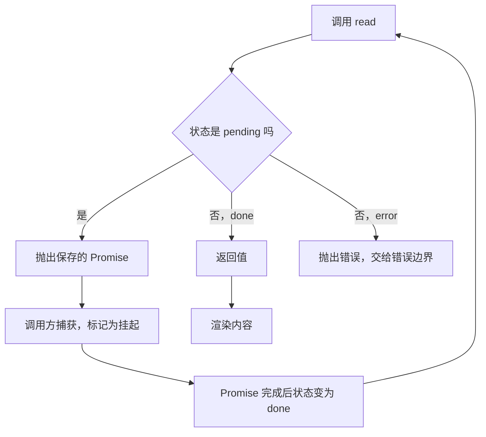

1. 调用 `read`，先看资源当前状态。
2. 状态为 pending 时抛出保存好的 Promise。
3. 调用方捕获这次抛出，标记为挂起并等待。
4. Promise 完成后状态切换为 done。
5. 再次调用 `read`，这次直接返回值并渲染内容。
6. 如果状态为 error，抛出错误交给错误边界。

**一步一步来**

**第 1 步：写资源对象**

这一步要做什么：实现一个按状态返回或抛出的资源对象。

```js
// 依赖：无。保存为 step1.mjs，运行：node step1.mjs
function createResource(loader) {
  let status = 'pending';                   // pending / done / error
  let value;
  let error;
  const promise = loader()
    .then(v => { value = v; status = 'done'; })   // 记录成功结果
    .catch(e => { error = e; status = 'error'; }); // 记录失败原因
  return {
    read() {
      if (status === 'pending') throw promise;    // 挂起：抛出同一个 Promise
      if (status === 'error') throw error;        // 失败：抛出错误对象
      return value;                               // 成功：返回值
    },
  };
}
```

**这段代码在做什么**

- `status` 用三个取值描述资源状态。
- Promise 的 `then` 与 `catch` 分别写入成功结果与失败原因。
- `read` 在 pending 时抛出 Promise，这正是挂起协议。
- `read` 在 error 时抛出错误对象，由错误边界接管。
- 抛出的 Promise 是同一个实例，保证重试时状态判断一致。

**第 2 步：写渲染循环**

这一步要做什么：用一个循环模拟 React 的"挂起、等待、重试"。

```js
// 依赖：无。保存为 step2.mjs，运行：node step2.mjs
function renderWithRetry(component, maxAttempts = 10) {
  return new Promise((resolve, reject) => {
    let attempts = 0;
    const attempt = () => {
      attempts += 1;
      if (attempts > maxAttempts) {
        reject(new Error('重试次数超过上限'));  // 防止无限循环
        return;
      }
      try {
        resolve(component());                   // 渲染成功
      } catch (thrown) {
        if (thrown instanceof Promise) {
          thrown.then(attempt, reject);         // 挂起后等 Promise 完成再试
        } else {
          reject(thrown);                       // 非挂起抛出，判定为错误
        }
      }
    };
    attempt();
  });
}
```

**这段代码在做什么**

- `renderWithRetry` 返回一个 Promise，包住整次渲染过程。
- `attempt` 每次调用组件函数，成功就 `resolve`。
- 捕获到 Promise 时注册 `then`，Promise 完成后再次调用 `attempt`。
- 捕获到其它对象时判定为错误，直接 `reject`。
- `maxAttempts` 是安全阀，避免缓存缺失时无限重试。

**第 3 步：组合起来跑一遍**

这一步要做什么：把资源与渲染循环接上，观察两次渲染的差别。

```js
// 依赖：无。保存为 step3.mjs，运行：node step3.mjs
const user = createResource(() => Promise.resolve({ name: 'Ada' }));

let renderCount = 0;
const ui = await renderWithRetry(() => {
  renderCount += 1;
  const data = user.read();                    // 第一次抛，第二次返回
  return '用户名：' + data.name;
});

console.log('渲染次数：', renderCount);
console.log('输出：', ui);
```

**这段代码在做什么**

- 组件函数内部调用 `user.read()`，与 `use` 的用法一致。
- 第一次调用抛出 Promise，`renderWithRetry` 注册等待并重试。
- 第二次调用返回数据，渲染成功并输出字符串。
- `renderCount` 预期为 2，说明发生了一次挂起与一次重试。
- 这个模型省略了边界、状态保留与批量揭晓，真实行为以 React 为准。

运行结果：

```text
渲染次数：2
输出：用户名：Ada
```

**动手验证**

下面把三个步骤合成一个完整脚本，包含失败场景。依赖：无，Node 20+ 直接运行。

```js
// 依赖：无。保存为 mini-use.mjs，运行：node mini-use.mjs
import assert from 'node:assert/strict';

function createResource(loader) {
  let status = 'pending';
  let value;
  let error;
  const promise = loader()
    .then(v => { value = v; status = 'done'; })
    .catch(e => { error = e; status = 'error'; });
  return {
    read() {
      if (status === 'pending') throw promise;
      if (status === 'error') throw error;
      return value;
    },
  };
}

function renderWithRetry(component, maxAttempts = 10) {
  return new Promise((resolve, reject) => {
    let attempts = 0;
    const attempt = () => {
      attempts += 1;
      if (attempts > maxAttempts) return reject(new Error('重试次数超过上限'));
      try {
        resolve(component());
      } catch (thrown) {
        if (thrown instanceof Promise) thrown.then(attempt, reject);
        else reject(thrown);
      }
    };
    attempt();
  });
}

// 成功场景
const okResource = createResource(() => Promise.resolve({ name: 'Ada' }));
let okRenders = 0;
const okUI = await renderWithRetry(() => {
  okRenders += 1;
  return '用户名：' + okResource.read().name;   // 第一次抛，第二次返回
});
assert.equal(okUI, '用户名：Ada');
assert.equal(okRenders, 2);                      // 一次挂起加一次重试
assert.equal(okResource.read().name, 'Ada');     // 再次读取直接命中

// 失败场景：Promise 被拒绝
const badResource = createResource(() => Promise.reject(new Error('HTTP 500')));
const badUI = await renderWithRetry(() => {
  return badResource.read();                     // 抛出的错误对象会被 reject
}).then(() => 'unexpected', err => '加载失败：' + err.message);
assert.equal(badUI, '加载失败：HTTP 500');

console.log('成功场景渲染次数：', okRenders);
console.log('失败场景输出：', badUI);
```

预期输出：

```text
成功场景渲染次数：2
失败场景输出：加载失败：HTTP 500
```

**常见坑**

| 现象 | 原因 | 怎么修 |
| --- | --- | --- |
| 手写模型里出现无限重试 | 资源每次 `read` 都新建 Promise | 在 `createResource` 里只创建一次并复用 |
| 失败场景卡住不结束 | 只处理了 Promise 抛出，没处理错误抛出 | 在捕获分支里区分 Promise 与错误对象 |
| 断言渲染次数与实际不符 | React 在严格模式下可能重复执行渲染函数 | 断言改成检查输出值，或核对官方文档关于严格模式的说明 |
| 把这个模型直接用于生产 | 模型省略了边界、状态保留与调度 | 生产使用 React 提供的 `use` 与 `Suspense` |

**用在哪里**

1. 团队内部的理解与培训
    - 业务背景：新人接手 Suspense 代码时，常把挂起理解为 `await`。
    - 这一节的知识怎么用：用这个脚本现场演示挂起与重试，把抽象概念变成可运行的代码。
    - 用什么指标衡量收益：统计代码评审中关于挂起行为的返工次数。
    - 什么时候不该用：项目已有成熟的框架数据层时，不要让业务代码去实现这套机制。

2. 自研数据层的可行性验证
    - 业务背景：团队打算在框架之外封装一层数据读取，需要先确认挂起协议。
    - 这一节的知识怎么用：用最小实现验证状态机与缓存是否够用，再决定是否自研。
    - 用什么指标衡量收益：统计原型阶段发现的边界问题数量。
    - 什么时候不该用：团队规模不足以长期维护数据层时，优先接入现成方案。

**行业实践**

- React 官方文档《use》Promise 参数说明：写明组件在 Promise 未完成时挂起，完成后由边界替换 fallback。怎么借鉴到你的项目：自研数据层的状态机必须覆盖 pending、done、error 三个分支。
- React 19 发布博客《New API: use》章节：明确 `use` 在渲染期读取 Promise 并触发挂起。怎么借鉴到你的项目：在内部文档中把挂起描述为"抛出待完成的读取凭证"，而不是"异步等待"。
- React 官方文档《Suspense》What activates a Suspense boundary 章节：把 `use` 读取 Promise 与 `lazy` 加载代码并列为激活条件。怎么借鉴到你的项目：理解挂起是一套通用协议后，可以统一处理数据与代码两种延迟。

**小结**

1. 挂起的实现基础是"抛出 Promise，由调用方接住并重试"。
2. 资源对象必须保存唯一 Promise 实例，否则重试循环无法结束。
3. 手写模型只用于理解原理，生产环境使用 React 提供的 API。

## 8. use 读 Context：条件读取与组合

**先想一个问题**

组件在提前返回之后仍然要读主题色，同时页面还要显示当前用户的名字，而用户信息来自一个 Promise。这两件事能同时做吗？

**心智模型**

!!! tip "心智模型"

    一句话模型：Context 是一路广播，`use` 是随时调台的收音机，可以在任意分支里对准频率。

    日常类比：地铁站的广播只对本站有效，走出这一站就听不到。

    类比不成立的地方：`use(context)` 只看组件上方的 Provider，不看调用组件自己内部的 Provider，这一点官方文档用 Pitfall 单独说明。

!!! note "术语：Context Provider"

    定义：把某个值向下传递的组件节点，`use` 读取时取调用组件上方最近的 Provider 的值。例子：`<ThemeContext value="dark"><Form /></ThemeContext>`。

**图解**

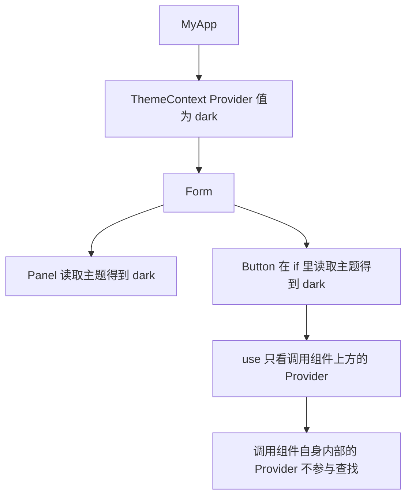

1. 顶层组件渲染一个 Provider，把主题值设为 dark。
2. 中间层 `Form` 与 `Panel` 都不读取，只负责渲染。
3. `Panel` 调用 `use(ThemeContext)`，取到 dark。
4. `Button` 在 `if` 分支里调用 `use(ThemeContext)`，同样取到 dark。
5. 查找方向朝上，调用组件自身内部的 Provider 不参与。
6. 组件层级数量不影响结果，只看上方最近的 Provider。

**一步一步来**

**第 1 步：条件读取 Context**

这一步要做什么：在 `if` 分支里读主题，验证提前返回不阻碍读取。

```jsx
import { use } from 'react';
import ThemeContext from './ThemeContext';

function HorizontalRule({ show }) {
  if (show) {
    const theme = use(ThemeContext);          // 写在 if 里，useContext 做不到
    return <hr className={theme} />;
  }
  return false;                                // 条件不成立时不读取
}
```

**这段代码在做什么**

- `use` 写在 `if` 内部，读取次数随条件变化。
- 这种写法在 `useContext` 下会触发 lint 规则报错。
- 返回的 `theme` 用于拼接类名，组件逻辑保持在一个分支里。
- 条件不成立时组件返回 `false`，React 不渲染任何内容。
- 没有 Provider 时读取结果为 `createContext` 的 `defaultValue`。

**第 2 步：Context 里放 Promise**

这一步要做什么：把 Promise 放进 Context，避免逐层传 props。

```jsx
import { use } from 'react';
import { UserContext } from './UserContext';

export default function Profile() {
  const userPromise = use(UserContext);   // 第一次 use：从 Context 取出 Promise
  const user = use(userPromise);          // 第二次 use：读取 Promise 的值
  return <h1>{user.name}</h1>;
}
```

**这段代码在做什么**

- 第一次 `use` 读 Context，拿到的是 Promise 本身，不会触发挂起。
- 第二次 `use` 读这个 Promise，此时才会挂起。
- 需要两次调用，因为 Context 的值本身不会被自动等待。
- 官方文档建议先考虑是否真的需要 Context，再决定使用。
- 读取 Promise 的组件必须包在 Suspense 边界内。

**第 3 步：给读取位置包边界**

这一步要做什么：只让头像与昵称区域挂起，页面其余部分照常显示。

```jsx
import { Suspense } from 'react';

export default function UserBar() {
  return (
    <div>
      <Logo />                                {/* 不在边界内，立刻显示 */}
      <Suspense fallback={<NameSkeleton />}>   {/* 只有这块会显示占位 */}
        <Profile />
      </Suspense>
    </div>
  );
}
```

**这段代码在做什么**

- `Logo` 位于边界之外，不受数据加载影响。
- `Profile` 内部两次 `use`，第二次触发挂起。
- 挂起期间只有 `NameSkeleton` 显示。
- 数据就绪后边界换回 `Profile` 的真实输出。
- 若 Promise 被拒绝，由更外层的错误边界处理。

**动手验证**

下面实现一个按树向上查找 Context 的模型，并验证条件读取。依赖：无，Node 20+ 直接运行。

```js
// 依赖：无。保存为 context-lookup.mjs，运行：node context-lookup.mjs
import assert from 'node:assert/strict';

function createContext(defaultValue) {
  return { defaultValue, id: Symbol('context') };
}

const ThemeContext = createContext('light');

// 用嵌套对象模拟组件树，providers 表示这一层的 Context 值
const tree = {
  providers: new Map([[ThemeContext, 'dark']]),   // 顶层提供 dark
  children: [
    {
      providers: new Map(),                        // 中间层不提供值
      children: [
        { providers: new Map(), children: [], read: true }, // 读取点
      ],
    },
  ],
};

function lookup(node, ctx, inherited) {
  const value = node.providers.has(ctx) ? node.providers.get(ctx) : inherited;
  if (node.read) return value;                     // 命中读取点，返回当前继承值
  for (const child of node.children) {
    const found = lookup(child, ctx, value);
    if (found !== undefined) return found;         // 只在读取点返回值
  }
  return undefined;
}

const found = lookup(tree, ThemeContext, ThemeContext.defaultValue);
assert.equal(found, 'dark');                       // 读取到上方最近的 Provider

// 条件读取：提前返回时完全不查找
function readThemeIfNeeded(show) {
  if (!show) return null;
  return lookup(tree, ThemeContext, ThemeContext.defaultValue);
}
assert.equal(readThemeIfNeeded(false), null);
assert.equal(readThemeIfNeeded(true), 'dark');

// 没有 Provider 时回退到 defaultValue
const emptyTree = { providers: new Map(), children: [], read: true };
assert.equal(lookup(emptyTree, ThemeContext, ThemeContext.defaultValue), 'light');

console.log('条件读取结果：', readThemeIfNeeded(true));
console.log('无 Provider 回退：', lookup(emptyTree, ThemeContext, ThemeContext.defaultValue));
```

预期输出：

```text
条件读取结果：dark
无 Provider 回退：light
```

**常见坑**

| 现象 | 原因 | 怎么修 |
| --- | --- | --- |
| 读到的主题不是期望值 | 调用组件自身内部的 Provider 不参与查找 | 把 Provider 放到需要读取的组件上方 |
| 组件读到的值是 `null` | 上方没有 Provider，返回了 `defaultValue` | 检查 Provider 层级，或把 defaultValue 设为可用的兜底值 |
| 读 Context 里的 Promise 时组件不挂起 | 只调用了一次 `use`，取到的是 Promise 对象 | 补上第二次 `use(promise)` 读取值 |
| 挂起导致整个页面变成占位 | 边界包得过大 | 把边界收窄到真正读取 Promise 的组件外层 |

**用在哪里**

1. 多主题仪表盘
    - 业务背景：用户在浅色与深色主题间切换，多个深层组件需要读取主题值。
    - 这一节的知识怎么用：主题放在 Context 里，组件在需要的分支用 `use` 读取。
    - 用什么指标衡量收益：统计主题值透传的 props 层数。
    - 什么时候不该用：只有一两个组件需要主题时，直接传 props 的链路更短。

2. 全局用户信息的共享读取
    - 业务背景：头像、昵称、权限标识在多个不相关组件里都要用。
    - 这一节的知识怎么用：把用户 Promise 放进 Context，各处用两次 `use` 读取。
    - 用什么指标衡量收益：统计同一份用户数据在页面中的请求次数。
    - 什么时候不该用：用户信息只在服务端渲染阶段需要时，用 props 传递更直接。

**行业实践**

- React 官方文档《use》Reading context with `use` 章节：说明 `use` 可以写在 `if` 与循环里，而 `useContext` 必须写在组件顶层。怎么借鉴到你的项目：把条件分支里的 Context 读取统一切换成 `use`，减少为了满足规则而做的代码上移。
- React 官方文档《use》Reading a Promise from context 章节：给出两次 `use` 的写法，并建议使用前先评估是否真的需要 Context。怎么借鉴到你的项目：在引入 Context 传递 Promise 之前，先确认是否有更直接的传递路径。
- React 官方文档《use》Pitfall 提示：`use(context)` 只查找调用组件上方的 Provider。怎么借鉴到你的项目：把 Provider 放在路由层或页面层，避免放在需要读取的组件内部。

**小结**

1. `use` 读 Context 的取值规则与 `useContext` 一致，差别在调用位置更自由。
2. Context 里传 Promise 需要两次 `use`，第一次取 Promise，第二次取值。
3. 挂起范围由边界决定，边界越靠近读取点，页面受影响的范围越小。

## 应用地图

| 场景 | 用到本页哪个知识点 | 典型技术选型 | 注意事项 |
| --- | --- | --- | --- |
| 商品详情页的评价区懒加载 | `use(promise)` 挂起、Suspense 边界 | React 19 的 `use` 加一层 `<Suspense>` | Promise 必须来自数据层缓存，边界只包评价区 |
| 后台管理的批量导入结果轮询 | 错误边界配合、重试入口 | 错误边界组件加 `use` 读取结果 Promise | 失败后要删除缓存键，重试才会创建新 Promise |
| 社交信息流的分层渲染 | 嵌套 Suspense 边界、流式揭晓 | 嵌套 `<Suspense>` 加骨架屏组件 | 就绪时间接近的区块放进同一个边界，减少分批出现 |
| 多主题站点的条件读取 | `use(context)` 可在 `if` 中调用 | Context 加 `use` | 没有 Provider 时返回 defaultValue，需要设计兜底值 |
| 全局用户信息共享 | Context 传 Promise、两次 `use` | Context 加 `use` 两次调用 | 读取组件必须包在边界内，否则挂起会向上蔓延 |
| 搜索筛选的条件切换 | `startTransition` 与边界再次挂起 | `startTransition` 加 `use` | 非过渡更新会重新显示 fallback，需要评估是否符合预期 |
| 图表看板的并发加载 | 请求瀑布改造、`Promise.all` | `Promise.all` 加 `use` 读取汇合结果 | 部分失败场景改用 `Promise.allSettled` 单独处理 |
| 服务端组件向客户端传数据 | Promise 跨边界传递 | Server Component 传 Promise 给 Client Component | 传过去的值必须可序列化，具体类型需核对官方文档 |

## 动手作业

**目标**：写一个可运行的迷你数据读取库 `mini-suspense.mjs`，支持挂起、缓存、失败三种状态，并用它渲染一个控制台版的商品列表。

**步骤**

1. 实现 `createContext` 与一个按树向上查找的读取函数，验证没有 Provider 时回退到 `defaultValue`。
2. 实现 `createResource(loader, cacheKey)`，内部维护 `pending`、`done`、`error` 三个状态，同一 `cacheKey` 返回同一个资源对象。
3. 实现 `renderWithRetry(component, maxAttempts)`，捕获 Promise 抛出时等待后重试，捕获其它抛出时进入失败分支。
4. 实现 `renderBoundary({ fallback, errorUI, children, read })`，挂起时输出 fallback 文案，失败时输出错误文案。
5. 用第三个步骤的实现渲染三个商品：一个立即成功、一个延迟成功、一个被拒绝，观察输出顺序。

**验收标准**

- 第一次渲染全部资源时，三次组件调用都进入挂起分支，输出中出现 fallback 文案。
- 延迟成功的商品在 Promise 完成后重试渲染，输出中出现商品标题。
- 被拒绝的商品不进入 fallback 分支，输出中出现错误文案，且脚本不抛出未捕获异常。
- 对同一 `cacheKey` 连续调用两次 `createResource`，用 `assert.equal` 断言返回同一个对象。
- 脚本在 Node 20+ 下用 `node mini-suspense.mjs` 直接运行，退出码为 0。

## 综合对比

| 维度 | `use(context)` | `useContext` | `use(promise)` | `useEffect` 里请求 | `lazy` 加载代码 |
| --- | --- | --- | --- | --- | --- |
| 能否写在 `if` 里 | 可以 | 不可以 | 可以 | 不适用，本身不是渲染期读取 | 不适用 |
| 是否触发 Suspense 边界 | 不触发 | 不触发 | 触发 | 官方文档写明不触发 | 触发 |
| 返回值 | 最近的 Provider 值 | 最近的 Provider 值 | Promise 解析后的值 | 由组件自行写入 state | 组件模块 |
| Promise 是否需要缓存 | 不涉及 | 不涉及 | 必须缓存同一实例 | 不需要缓存，但常见重复请求 | 不涉及 |
| 失败时的呈现方式 | 不涉及 | 不涉及 | 最近的错误边界 | 组件自行处理 | 需配合错误边界 |
| 在服务端组件中的支持 | 资料写明不支持 | 资料未覆盖，需核对官方文档 | 资料未覆盖，需核对官方文档 | 不适用 | 不适用 |
| 典型使用位置 | 分组件的条件分支 | 组件顶层 | 数据消费组件 | 需要手动管理加载状态的组件 | 路由级或重型组件 |

## 深入阅读与参考

!!! tip "怎么用这些资料"
    先读「官方文档与规范」建立准确的概念，再读「源码与示例」核对细节，最后用「教程、书籍与视频」换一种讲法加深理解。每条都写明了读哪一节、带着什么问题读。

### 官方文档与规范

| 资源 | 为什么读 | 怎么读 |
|---|---|---|
| [use](https://react.dev/reference/react/use) | use 的权威定义，含条件调用与 Suspense 数据源说明 | 重点读 Suspense-enabled data sources 与 Caveats 两节，动手在 if 分支里调用 use 读 Context 与 Promise |
| [<Suspense>](https://react.dev/reference/react/Suspense) | Suspense 官方语义：回退 UI、流式揭晓与边界行为 | 读 Props 与 Usage 两节，弄清 fallback 出现与消失的时机，写一个最小包裹示例验证 |
| [Passing Data Deeply with Context](https://react.dev/learn/passing-data-deeply-with-context) | Context 传递范式，配合 use 做条件读取更清晰 | 读“在深层传递数据”一节，留意 useContext 写法，把示例改写成 use(Context) |
| ['use client'](https://react.dev/reference/rsc/use-client) | use client 边界决定 use 与 Suspense 能写在哪一层 | 读指令作用范围与常见坑，检查自己的组件树该在哪加 'use client' 才能用 use |
| [MDN 使用 Promise](https://developer.mozilla.org/en-US/docs/Web/JavaScript/Guide/Using_promises) | Promise 状态与拒绝处理，是理解 throw promise 的基础 | 读链式调用与错误处理两节，手写一个待定 Promise，观察 then/catch 的执行时序 |
| [Scaling Up with Reducer and Context](https://react.dev/learn/scaling-up-with-reducer-and-context) | Context 与状态逻辑的扩展写法，便于组合 use(Context) | 读 reducer 与 Context 结合一节，思考异步读取结果如何通过 Context 下发 |

### 教程、书籍与视频

| 资源 | 为什么读 | 怎么读 |
|---|---|---|
| [`<Suspense/>`](https://book.leptos.dev/async/11_suspense.html) | 带示例的 Suspense 章节，讲清挂起与揭晓流程 | 顺着章节跑一遍示例，重点看挂起时组件树的状态和恢复后的渲染时机 |

## 自测题

??? question "1. `use` 和 `useState` 这类 Hook 在调用位置上最大的差别是什么？"

    `use` 可以写在 `if` 条件分支和 `for` 循环里。

    `useState`、`useEffect` 必须每次渲染都在相同位置调用相同次数。

    原因是 React 靠调用顺序给 Hook 配对内部状态，而 `use` 是按传入的对象身份取值。

    两者的共同约束是都必须写在组件或 Hook 内部。

??? question "2. 组件调用 `use(promise)` 时，React 做了哪几件事？"

    组件读取未完成的 Promise，触发挂起。

    React 找到最近的 Suspense 边界，改用 fallback 渲染。

    Promise 完成后 React 从头重试渲染这棵子树。

    Promise 被拒绝时改由最近的错误边界显示备用 UI。

    重试要求传入的 Promise 是同一实例。

??? question "3. 为什么在渲染过程中创建 Promise 会导致无限加载？"

    每次渲染都会调用一次创建逻辑，得到新的 Promise 对象。

    React 用 Promise 实例判断等待是否结束，实例换了就等于等待重新开始。

    官方文档给出的报错文案是 A component was suspended by an uncached promise。

    修复方式是把创建逻辑移到数据层，并按参数缓存 Promise。

??? question "4. Suspense 边界在什么情况下会显示 fallback？"

    官方文档列出的条件包括用 `lazy` 加载组件代码。

    用 `use` 读取 Promise 也会激活边界。

    加载带 `precedence` 的样式表、等待流式服务端渲染的 HTML 到达也会激活边界。

    `fallback` 自己挂起时，会激活更外层的父边界。

    在 Effect 或事件处理器里发请求不会激活边界。

??? question "5. 已经显示内容的边界再次挂起时，会怎样？"

    默认会重新显示 fallback。

    由 `startTransition` 或 `useDeferredValue` 触发的更新属于例外。

    边界隐藏内容时会清理内容树里的布局 Effect，内容恢复时重新触发。

    官方文档写明 React 最快每 300 毫秒揭晓一次挂起内容。

??? question "6. `use` 为什么不能写在 `try-catch` 里？"

    官方文档的 Caveats 明确列出这条限制。

    挂起依赖抛出 Promise 这一机制，`try-catch` 会把挂起凭证当成普通抛出。

    失败场景应交给错误边界处理，而不是在本组件内捕获。

    需要区分错误类型时，把逻辑拆到错误边界的备用 UI 中处理。

??? question "7. 请求瀑布什么时候无法通过并发改造解决？"

    后一个请求的参数确实来自前一个请求的返回值时，串行无法避免。

    这一类依赖只能通过改接口设计来合并，例如让接口一次返回两层数据。

    `Promise.all` 只对互不依赖的请求有效。

    并发数量还需要按接口能力控制，避免触发限流。

??? question "8. 用 `use` 读 Context 里的 Promise 为什么需要调用两次？"

    Context 的值本身不会被自动等待，第一次 `use` 取到的仍然是 Promise 对象。

    第二次 `use(promise)` 才会触发挂起并返回解析后的值。

    读取 Promise 的组件需要包在 Suspense 边界内。

    官方文档在使用建议中提示，先评估是否真的需要 Context 再采用这种写法。

## 延伸阅读

- React 官方文档《use》参考章节：`use(context)` 的参数、返回值与 Caveats。
- React 官方文档《use》参考章节：`use(promise)` 的参数、返回值与 Caveats。
- React 官方文档《use》参考章节：`use(browser())` 的用法与 Caveats。
- React 官方文档《use》使用章节：Reading context with `use`。
- React 官方文档《use》使用章节：Reading a Promise from context。
- React 官方文档《use》使用章节：Caching promises for client components。
- React 官方文档《use》使用章节：Displaying an error with an error boundary。
- React 官方文档《Suspense》参考章节：Props 与 Caveats。
- React 官方文档《Suspense》参考章节：What activates a Suspense boundary。
- React 官方文档《Suspense》使用章节：Displaying a fallback while content is loading。
- React 官方文档《Component》参考章节：Catching rendering errors with an Error Boundary。
- React 官方文档《lazy》参考章节。
- React 官方文档《startTransition》与《useDeferredValue》参考章节。
- React 官方博客《React 19》发布说明：New API: use 章节。
- React 工作组讨论贴《New Suspense SSR Architecture in React 18》（reactwg/react-18 discussions 37）。
