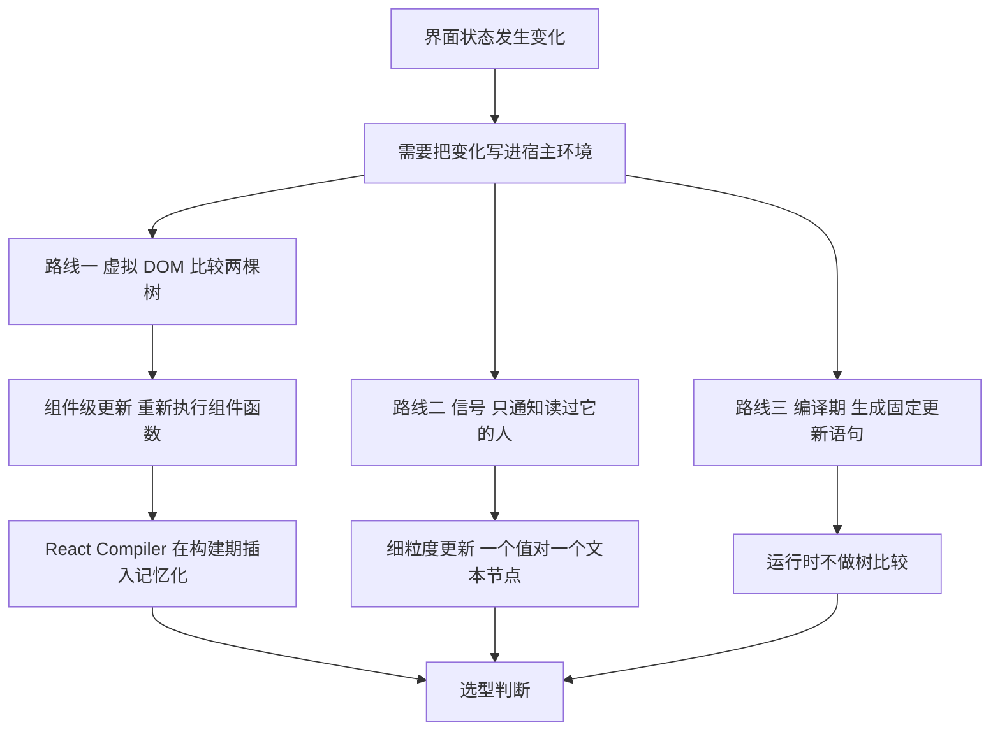
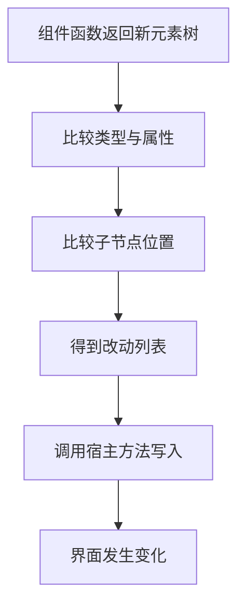
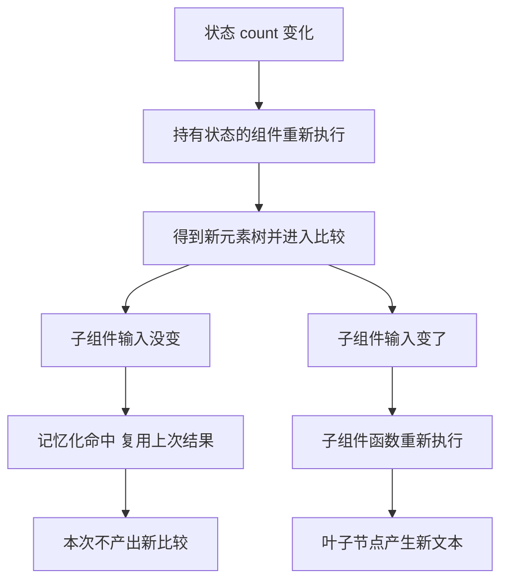
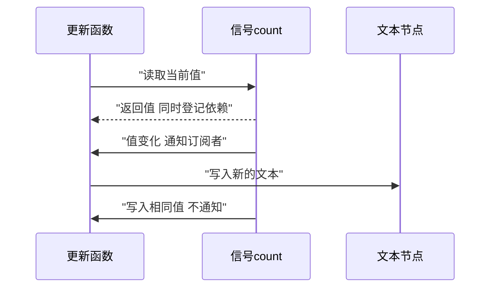
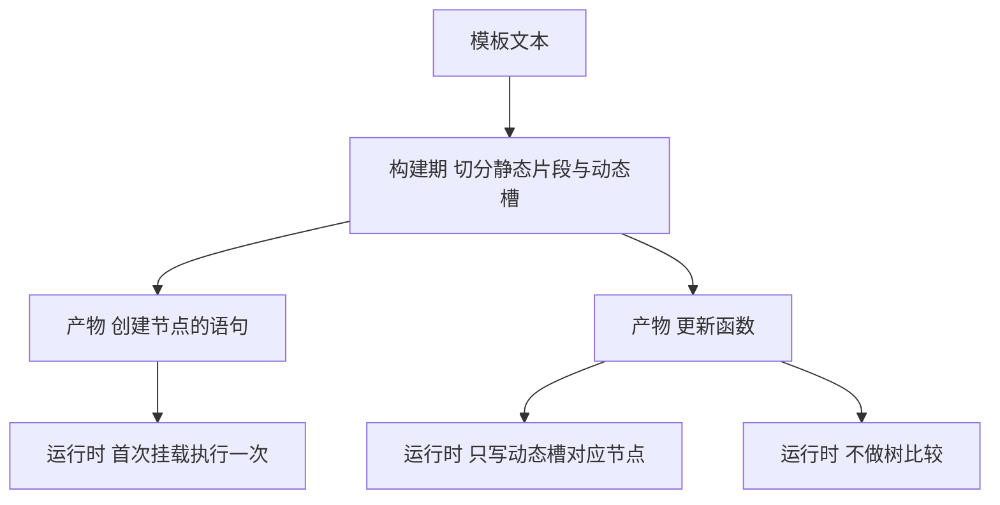
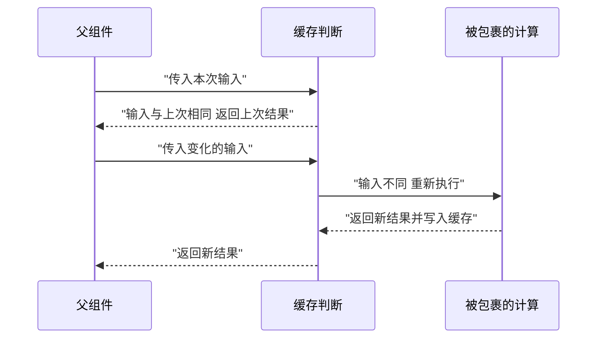
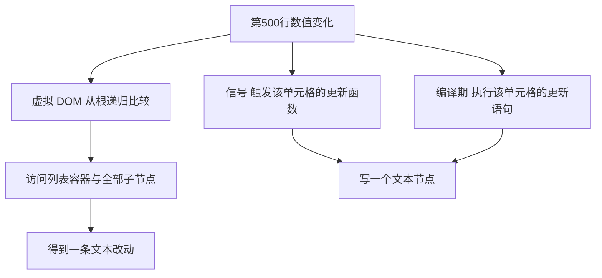
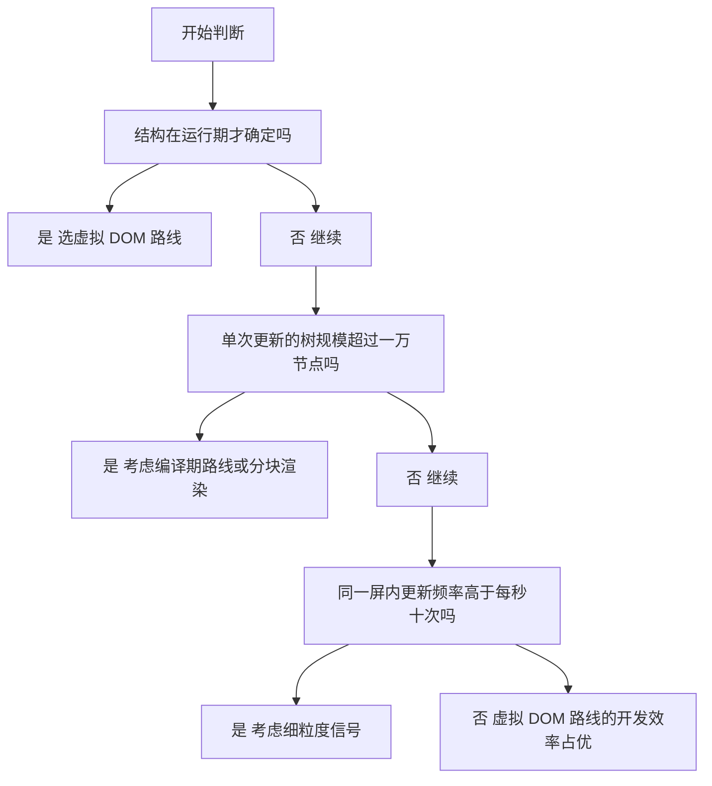

# 虚拟 DOM 有没有必要？React、Signals 与编译期框架的对比

!!! abstract "学完这一页你能"
    - 用一段可运行的代码说明虚拟 DOM 解决了什么问题、又付出了什么代价。
    - 说清组件级重渲染与细粒度信号更新在访问节点数量上的差别。
    - 写出一个二十行左右的信号实现，并指出依赖收集发生在哪一步。
    - 面对一个具体列表场景，给出选择 React、Signals 或编译期框架的判断依据。

## 0. 知识地图



建议先读 1 到 2 节，把虚拟 DOM 的成本算清楚。再读 3 到 5 节，看另外两条路线各自省掉了哪一步。
最后用 6 节的脚本自己跑出数字，回到 7 节做选择。

!!! note "术语：宿主环境，host environment"
    真正承载界面的目标环境。例：浏览器的 DOM、Canvas、终端、原生视图。

## 1. 虚拟 DOM 解决的问题与成本

**先想一个问题**

列表里第 500 行的价格从 4 变成 5。你手上没有"哪一行变了"的记录，只有"整个界面现在长什么样"的新描述。怎么把这个变化写进页面？

**心智模型**

!!! tip "心智模型"
    - 一句话模型：虚拟 DOM 是"先描述整棵树，再算出最小改动"的中间层。
    - 日常类比：改稿时先摊开两份纸稿，逐段圈出不同，再按圈出的地方改电子稿。
    - 类比在哪里不成立：纸稿比较靠人判断哪处不同；虚拟 DOM 的比较是固定算法的递归，只看对象字段，看不懂字段对界面的含义。

!!! note "术语：虚拟 DOM，virtual DOM"
    用普通 JavaScript 对象描述界面结构的树。例：`{ type: 'span', props: null, children: ['0'] }` 描述一个文本为 0 的 span。

!!! note "术语：调和，reconciliation"
    从新元素树得到"需要写进宿主的改动"的过程。React 仓库的 react-reconciler 包就是这一层的实现。

**图解**



1. 组件函数返回新元素树，这棵树此刻只是数据。
2. 比较从类型和属性开始，类型不同就替换整棵子树，不再往下比。
3. 子节点逐个位置配对新旧节点；配对规则需核对官方文档：React 文档 Rendering Lists 一节。
4. 比较结果是一份改动列表，由宿主执行。
5. 宿主执行完成后，界面才真正变化。

**一步一步来**

第一步：这一步要做什么——用一个函数把界面描述成普通对象，先不碰宿主。

```js
function h(type, props, ...children) {
  // 返回虚拟节点：只有类型、属性、子节点三样数据
  return { type, props, children };
}

const v1 = h('div', { id: 'app' }, h('span', null, '0')); // 旧描述
const v2 = h('div', { id: 'app' }, h('span', null, '1')); // 新描述

console.log(JSON.stringify(v2)); // 输出纯数据，宿主还不知道有变化
```

**这段代码在做什么**
- `h` 返回普通对象，没有创建任何宿主节点。
- `v1` 与 `v2` 只在最深一层的文本上不同。
- `JSON.stringify` 能跑通，说明这棵树是可序列化的数据。
- 此刻界面没有任何变化，变化停在数据里。

运行结果：`{"type":"div","props":{"id":"app"},"children":[{"type":"span","props":null,"children":["1"]}]}`

第二步：这一步要做什么——写一个比较函数，输入两棵树，输出改动列表。

```js
function diff(oldV, newV, path, patches) {
  if (typeof oldV === 'string' || typeof newV === 'string') {
    // 文本节点直接比字符串
    if (oldV !== newV) patches.push({ path, kind: 'text', to: newV });
    return patches;
  }
  if (oldV.type !== newV.type) {
    // 类型不同就整棵替换，不再往下比
    patches.push({ path, kind: 'replace', to: newV });
    return patches;
  }
  for (const key of Object.keys(newV.props || {})) {
    // 只检查新树有的属性键
    if ((oldV.props || {})[key] !== newV.props[key]) {
      patches.push({ path, kind: 'prop', key, to: newV.props[key] });
    }
  }
  const len = Math.max(oldV.children.length, newV.children.length);
  for (let i = 0; i < len; i++) {
    // 子节点按下标递归，路径用字符串记录位置
    diff(oldV.children[i], newV.children[i], path + '/' + i, patches);
  }
  return patches;
}
```

**这段代码在做什么**
- 文本节点是递归的终点，相等就什么都不记。
- 类型不同时提前返回，省掉整棵子树的比较。
- 这一版只检查新增和变化的属性；删除属性的处理需核对官方文档：react-reconciler 包的 HostConfig 方法列表。
- 子节点按下标递归，路径形如 `root/0/0`，方便定位。
- 函数不写宿主，是纯函数，方便用断言测试。

运行结果：`diff(v1, v2, 'root', [])` 返回一条 `kind` 为 `text` 的改动。

第三步：这一步要做什么——把改动列表写进宿主，并统计真实写入的次数。

```js
const host = {
  writes: 0,                       // 统计真实写操作次数
  createText(text) { return { text }; },
  setText(node, text) {
    this.writes++;                 // 每写一次加一
    node.text = text;
  },
};

const patches = diff(v1, v2, 'root', []);
const textNode = host.createText('0');   // 首次挂载时创建的文本节点
for (const p of patches) host.setText(textNode, p.to);
console.log('写入次数：', host.writes);
```

**这段代码在做什么**
- `host` 是宿主的最小替身，只有创建和写入两个能力。
- 改动列表里的每条记录依次执行，写入次数与改动条数对应。
- 这里只有一条改动，所以真实写入只有一次。
- 省下的写入次数，就是虚拟 DOM 换来的收益。

运行结果：`写入次数： 1`

**动手验证**

```js
// 依赖：仅 Node 20+ 内置模块 node:assert，无需安装第三方包
import assert from 'node:assert/strict';

function h(type, props, ...children) {
  return { type, props, children };
}

function diff(oldV, newV, path, patches) {
  if (typeof oldV === 'string' || typeof newV === 'string') {
    if (oldV !== newV) patches.push({ path, kind: 'text', to: newV });
    return patches;
  }
  if (oldV.type !== newV.type) {
    patches.push({ path, kind: 'replace', to: newV });
    return patches;
  }
  for (const key of Object.keys(newV.props || {})) {
    if ((oldV.props || {})[key] !== newV.props[key]) {
      patches.push({ path, kind: 'prop', key, to: newV.props[key] });
    }
  }
  const len = Math.max(oldV.children.length, newV.children.length);
  for (let i = 0; i < len; i++) {
    diff(oldV.children[i], newV.children[i], path + '/' + i, patches);
  }
  return patches;
}

const v1 = h('div', { id: 'app' }, h('span', null, '0'));
const v2 = h('div', { id: 'app' }, h('span', null, '1'));

const patches = diff(v1, v2, 'root', []);
assert.equal(patches.length, 1);
assert.equal(patches[0].kind, 'text');
assert.equal(patches[0].to, '1');
assert.equal(patches[0].path, 'root/0/0');

console.log('改动条目：', patches.length);
console.log('路径：', patches[0].path);
console.log('预期输出：改动条目： 1 与 路径： root/0/0');
```

**常见坑**

| 现象 | 原因 | 怎么修 |
| --- | --- | --- |
| 列表插入一项后，后面每项的输入框内容都串位 | 子节点按位置配对，插入让整体位移 | 给每项稳定的 key，配对规则需核对官方文档。React 文档 Rendering Lists |
| 只改一个数字，却发现整段计算逻辑重跑 | 比较只处理数据，重跑来自组件函数被重新执行 | 把纯计算与副作用分开，副作用放到框架提供的钩子里，钩子名称需核对官方文档 |
| 更新对象后界面没反应 | 比较用引用相等，引用没变就认为没变 | 更新时创建新对象，代码评审中禁止原地修改状态 |

**用在哪里**

场景一：后台管理的可编辑表格。
- 业务背景：一屏五十行，运营逐格改价，改完立刻显示新值。
- 这一节的知识怎么用：把整张表格描述成一棵树，由比较算出改动的单元格。
- 用什么指标衡量收益：单次输入后写入宿主的节点次数。
- 什么时候不该用：行数上万且滚动频繁时，改成只渲染可视区域内的行。

场景二：由配置驱动的表单渲染器。
- 业务背景：表单结构来自 JSON 配置，字段类型有十余种，会随时增删。
- 这一节的知识怎么用：把配置映射成虚拟树，字段增删交给比较处理。
- 用什么指标衡量收益：新增一种字段类型时需要改动的文件数。
- 什么时候不该用：字段固定且只有两三种时，直接写更新语句读起来清楚。

**行业实践**
- React 仓库 react-reconciler 包的 README 说明：宿主通过 HostConfig 描述"怎么创建和修改节点"，并把模式分成 mutation 与 persistent 两种，React DOM 用 mutation 模式。借鉴方式：把"界面长什么样"与"怎么写进宿主"分开，接入自定义渲染目标时只实现 HostConfig。出处：React 仓库 react-reconciler 包 README。
- React 仓库 react-reconciler 包的 README 提醒：该包 API 稳定性低于 React 与 React DOM，不遵循常规版本号规则。借鉴方式：业务代码不直接依赖它，只通过官方渲染器使用。出处：同上。
- 关于 Signals 与编译期框架在真实项目中的做法：资料未覆盖，需核对官方文档：Solid 文档 reactivity 章节、Vue 文档 reactivity 章节、Svelte 文档 compiler 与 runtime 章节。

**小结**
- 虚拟 DOM 把"怎么改"从手写变成比较得出。
- 代价是每次更新要跑一遍比较，并且要留住上一棵树。
- 当变化的位置在写入那一刻就已知时，比较这一步就是可以省掉的开销。

## 2. 组件级更新：React 的更新单位

**先想一个问题**

计数器加一，页面上只有一个数字变。为什么有时候整棵组件树上的函数都重新跑了一遍？

**心智模型**

!!! tip "心智模型"
    - 一句话模型：React 的更新单位是组件，状态变化后从持有它的组件往下重新执行组件函数。
    - 日常类比：部门发通知，逐级往下传到小组，哪怕只有一个小组受影响。
    - 类比在哪里不成立：通知传递可以人工喊停；组件函数的重复执行要靠记忆化来截断，截断条件由输入是否变化决定。

!!! note "术语：重渲染，re-render"
    组件函数被重新执行一次。它产出新的元素树，随后进入比较阶段。

**图解**



1. 状态变化只发生在持有它的那个组件上。
2. 该组件函数重新执行，得到新元素树。
3. 新元素树进入比较阶段，同时子组件带着新的 props 被调用。
4. 子组件输入没变时，记忆化外壳可以直接返回上次结果。
5. 子组件输入变化时，函数重新执行，叶子节点产出新文本。
6. 记忆化省掉的是函数执行，比较阶段本身仍然要跑。

**一步一步来**

第一步：这一步要做什么——写一个不带记忆化的组件级渲染器，统计函数执行次数。

```js
let renders = 0;                                  // 组件函数执行次数

function h(type, props, ...children) {
  return { type, props, children };
}

function Counter({ count }) {                     // 叶子组件
  renders++;
  return h('span', null, String(count));
}

function App({ count }) {                         // 父组件
  renders++;
  return h('div', null, Counter({ count }));      // 直接调用子组件
}

App({ count: 0 });
App({ count: 0 });                                // 数据完全相同
console.log('执行次数：', renders);
```

**这段代码在做什么**
- `renders` 是全局计数器，每次进入组件函数就加一。
- 父组件通过直接调用函数来"渲染"子组件，模拟组件级更新。
- 第二次调用的数据与第一次完全相同，但函数照样执行。
- 执行次数会随调用层数增加，与数据是否变化无关。

运行结果：`执行次数： 4`

第二步：这一步要做什么——加一个记忆化外壳，输入没变就复用上次结果。

```js
function memo(fn) {
  let lastArgs = null;
  let lastResult;
  return (props) => {
    if (lastArgs !== null && Object.is(lastArgs.count, props.count)) {
      return lastResult;                          // 输入没变，直接返回上次结果
    }
    lastArgs = { count: props.count };
    lastResult = fn(props);                       // 输入变了才真正执行
    return lastResult;
  };
}

const MemoCounter = memo(Counter);
```

**这段代码在做什么**
- `lastArgs` 保存上次的输入，`lastResult` 保存上次的输出。
- 比较用 `Object.is`，逐字段比较输入。
- 命中缓存时函数体不执行，`renders` 不变。
- 这一层外壳可以出现在源码里，也可以由构建工具插入。

运行结果：连续两次相同输入时，第二次不增加 `renders`。

**动手验证**

```js
// 依赖：仅 Node 20+ 内置模块 node:assert，无需安装第三方包
import assert from 'node:assert/strict';

let renders = 0;
let memoHits = 0;

function h(type, props, ...children) {
  return { type, props, children };
}

function Counter({ count }) {
  renders++;
  return h('span', null, String(count));
}

function memo(fn) {
  let lastArgs = null;
  let lastResult;
  return (props) => {
    if (lastArgs !== null && Object.is(lastArgs.count, props.count)) {
      memoHits++;
      return lastResult;
    }
    lastArgs = { count: props.count };
    lastResult = fn(props);
    return lastResult;
  };
}

const MemoCounter = memo(Counter);

function renderList(counts) {
  return counts.map((c) => MemoCounter({ count: c }));
}

renderList([1, 2]);
const firstPass = renders;
renderList([1, 2]);
renderList([1, 2, 3]);

assert.equal(firstPass, 2);
assert.equal(memoHits, 4);
assert.equal(renders, 3);

console.log('组件执行次数：', renders);
console.log('缓存命中次数：', memoHits);
console.log('预期输出：组件执行次数： 3 与 缓存命中次数： 4');
```

**常见坑**

| 现象 | 原因 | 怎么修 |
| --- | --- | --- |
| 加了记忆化，父组件重渲染时子组件还是执行 | 每次传入的是新建对象或新建函数，引用每次都不同 | 把对象与函数提到组件外部，或用框架提供的缓存钩子，名称需核对官方文档 |
| 列表项全部重新执行 | 每项都新建 props 对象，逐字段比较无法命中 | 让列表项的输入是稳定值，必要时把比较方式改成逐字段 |
| 记忆化加了但页面没变化 | 记忆化只影响执行次数，不影响比较与写入 | 想减少写入要去查比较阶段产出的改动条数 |

**用在哪里**

场景一：数据看板的多个折线图。
- 业务背景：顶部筛选器改变时，页面重新渲染，但多数图表的数据没变。
- 这一节的知识怎么用：用记忆化让数据没变的图表跳过函数执行。
- 用什么指标衡量收益：一次筛选操作后图表组件函数的执行次数。
- 什么时候不该用：图表只有两个且数据每次都变时，记忆化只会增加比较成本。

场景二：长表单的字段联动。
- 业务背景：姓名字段变化时，只有摘要区域需要更新。
- 这一节的知识怎么用：把摘要区拆成独立组件，输入没变就跳过。
- 用什么指标衡量收益：单次输入后执行的组件函数个数。
- 什么时候不该用：字段之间存在复杂联动规则时，拆分带来的状态提升会增加维护成本。

**行业实践**
- React 官方文档 Thinking in React 给出的流程是：先按界面与数据模型把 UI 拆成组件层次，再写一个不含交互的静态版本，最后加交互。文中明确说静态版本不要使用 state，state 只留给随时间变化的数据。借鉴方式：先跑通静态结构再引入状态，能减少记忆化与拆分带来的返工。出处：React 官方文档 Thinking in React。
- React 官方文档 Thinking in React 说明组件层次可以自上而下搭，也可以自下而上搭，示例规模小时自上而下顺，规模大时自下而上顺。借鉴方式：新项目先自上而下画出组件树，再按需要下沉拆分。出处：同上。
- 关于组件级记忆化在真实工程中的量化收益：资料未覆盖，需核对官方文档：React 官方文档中关于记忆化 API 的章节名称与适用条件。

**小结**
- React 的更新单位是组件，状态变化后组件函数会重新执行。
- 记忆化能截断函数执行的向下传播，截断条件是输入是否变化。
- 记忆化不影响比较阶段，改动条数要靠比较结果来判断。

## 3. 细粒度信号：把订阅关系写进状态里

**先想一个问题**

如果在写入的那一刻就知道"这个值被哪一处文本读过"，还需要整棵树比较吗？

**心智模型**

!!! tip "心智模型"
    - 一句话模型：信号是带通讯录的变量，读它的人会被记下来，写它时只通知通讯录里的人。
    - 日常类比：小区快递柜，只有登记过手机号的住户会收到取件提醒。
    - 类比在哪里不成立：通讯录在读取时自动登记，登记范围依赖执行顺序；异步回调里读值可能登记不到依赖。

!!! note "术语：信号，signal"
    一个包含内部值与订阅者集合的状态单元。读它时登记依赖，写它时通知订阅者。

!!! note "术语：副作用，effect"
    读取信号并因此需要在信号变化时重新执行的函数。例：把信号值写进文本节点的更新函数。

**图解**



1. 更新函数第一次执行，读取信号当前值。
2. 读取发生时，信号把该更新函数记进订阅者集合。
3. 有人写入新值时，信号遍历订阅者集合逐个调用。
4. 被调用的更新函数把新值写进它负责的文本节点。
5. 写入的值与当前值相等时，信号不通知任何人，这一步省掉。

**一步一步来**

第一步：这一步要做什么——实现一个信号，内部保存值与订阅者集合。

```js
function createSignal(initial) {
  let value = initial;                            // 信号内部的值
  const subscribers = new Set();                  // 读过它的更新函数
  return {
    read() {
      if (activeEffect) subscribers.add(activeEffect); // 读取时登记依赖
      return value;
    },
    write(next) {
      if (Object.is(next, value)) return;         // 值没变就什么都不做
      value = next;
      for (const fn of subscribers) fn();         // 只通知订阅者
    },
  };
}
let activeEffect = null;                          // 当前正在执行的更新函数
```

**这段代码在做什么**
- `value` 与 `subscribers` 被闭包保护，外部只能通过 `read` 与 `write` 访问。
- `read` 在返回值之前，把当前更新函数登记进集合。
- `write` 先用 `Object.is` 去重，相同值不做任何通知。
- 通知方式是同步调用，订阅者顺序取决于登记顺序。

运行结果：无输出，这是定义部分。

第二步：这一步要做什么——实现 `effect`，让更新函数第一次执行时收集依赖。

```js
function effect(fn) {
  activeEffect = fn;                              // 标记当前更新的函数
  fn();                                           // 第一次执行用于收集依赖
  activeEffect = null;                            // 执行完清空标记
}

const count = createSignal(0);
const texts = [];
effect(() => {
  texts.push(String(count.read()));               // 读值并写入本地记录
});

count.write(1);
count.write(1);                                   // 相同值被跳过
count.write(2);
console.log(texts.join(','));
```

**这段代码在做什么**
- `activeEffect` 是"当前正在执行的更新函数"的临时标记。
- 第一次执行 `fn` 时，`count.read()` 把该函数登记为订阅者。
- 第一次 `write(1)` 触发通知，记录变成三个元素。
- 第二次 `write(1)` 被 `Object.is` 拦住，记录不变。

运行结果：`0,1,2`

!!! note "术语：细粒度更新，fine-grained update"
    更新范围由一个具体值决定，而不是由组件边界决定。例：价格信号的订阅者只有一个表格单元格。

**动手验证**

```js
// 依赖：仅 Node 20+ 内置模块 node:assert，无需安装第三方包
import assert from 'node:assert/strict';

let activeEffect = null;

function createSignal(initial) {
  let value = initial;
  const subscribers = new Set();
  return {
    read() {
      if (activeEffect) subscribers.add(activeEffect);
      return value;
    },
    write(next) {
      if (Object.is(next, value)) return;
      value = next;
      for (const fn of subscribers) fn();
    },
  };
}

function effect(fn) {
  activeEffect = fn;
  fn();
  activeEffect = null;
}

let runs = 0;
const count = createSignal(0);
const texts = [];

effect(() => {
  runs++;
  texts.push(String(count.read()));
});

count.write(1);
count.write(1);
count.write(1);
count.write(2);

assert.deepEqual(texts, ['0', '1', '2']);
assert.equal(runs, 3);

console.log('更新函数执行次数：', runs);
console.log('历史值：', texts.join(','));
console.log('预期输出：更新函数执行次数： 3 与 历史值： 0,1,2');
```

**常见坑**

| 现象 | 原因 | 怎么修 |
| --- | --- | --- |
| 写入了新值但界面没变 | 读取发生在订阅者集合之外，依赖没有登记 | 保证第一次读取发生在 `effect` 内部执行期间 |
| 更新函数被调用多次 | 同一个函数被登记进多个信号的订阅者集合 | 每个更新函数只读它真正需要的信号 |
| 异步回调里读值，后续变化收不到通知 | 登记发生在 `activeEffect` 已清空之后 | 把异步读取改成显式订阅，具体写法需核对官方文档 |

**用在哪里**

场景一：金融行情表格的单元格级刷新。
- 业务背景：每秒推送多次价格，一屏数百个单元格，只有少数在变。
- 这一节的知识怎么用：每个单元格订阅自己那一路价格信号，写入只触发该单元格。
- 用什么指标衡量收益：一次推送后执行的更新函数个数。
- 什么时候不该用：推送频率低且整屏数据同步变化时，按信号拆分的收益接近零。

场景二：可视化编辑器的属性面板。
- 业务背景：拖动图形时，面板上的坐标数值要跟着走，每秒更新几十次。
- 这一节的知识怎么用：把坐标拆成两个信号，坐标文本各订阅一路。
- 用什么指标衡量收益：单次拖动事件后写入文本节点的次数。
- 什么时候不该用：面板字段之间存在求值依赖时，依赖顺序需要额外梳理。

**行业实践**
- React 官方文档 Thinking in React 明确 state 只保留给随时间变化的数据，静态版本完全不使用 state。借鉴方式：在引入信号之前，先把"结构"与"会变的数值"分离开，再决定数值放在组件内还是放在组件外。出处：React 官方文档 Thinking in React。
- 关于 Signals 的具体 API 名称、依赖收集边界与异步处理方式：资料未覆盖，需核对官方文档：Solid 文档 reactivity 章节、Vue 文档 reactivity 章节、Preact Signals 文档的 API 章节。

**小结**
- 信号把依赖关系记录在状态里，写入时只通知读过它的人。
- 更新范围由值决定，与组件边界无关。
- 依赖收集依赖执行时机，登记时机错了就会漏更新。

## 4. 编译期框架：把更新语句提前生成

**先想一个问题**

模板里的结构在构建时就已经固定，运行时还有必要重新算一遍"哪里对应哪个值"吗？

**心智模型**

!!! tip "心智模型"
    - 一句话模型：编译期把"哪个位置对应哪个值"写死在产物里，运行时只执行写好的更新语句。
    - 日常类比：构件按图纸在工厂预制，现场只做拼装，不再重新出图。
    - 类比在哪里不成立：动态列表的项数要到运行时才知道，编译器必须生成循环与键控逻辑，这部分规则需核对官方文档。

!!! note "术语：编译期，build time"
    在打包构建阶段执行的步骤。产物是运行时代码，运行时不重复做这一步。

**图解**



1. 模板文本先被切分成静态片段与动态占位槽。
2. 构建期生成创建节点的语句，结构写在代码里，不再靠数据推导。
3. 构建期同时生成更新函数，更新语句针对具体的节点引用。
4. 首次挂载时执行创建语句，得到宿主节点并保留引用。
5. 数据变化时只调用更新函数，没有树比较这一步。

**一步一步来**

第一步：这一步要做什么——把带占位符的模板切成片段数组，并标出哪些片段是动态槽。

```js
function compile(template) {
  // 按占位符切开，保留占位符本身
  const parts = template.split(/(\{\{[a-zA-Z0-9_]+\}\})/);
  const slots = parts
    .map((p, i) => (p.startsWith('{{') ? i : -1))  // 记下动态槽的下标
    .filter((i) => i !== -1);
  return { parts, slots };
}

const compiled = compile('价格 {{price}} 元');
console.log(compiled.parts);
console.log(compiled.slots);
```

**这段代码在做什么**
- `split` 里用捕获组，占位符会保留在结果数组中。
- `parts` 是静态片段与占位符交替出现的数组。
- `slots` 记录动态槽在数组中的下标。
- 这一步是教学模拟，不代表任何框架的真实编译器输出。

运行结果：`[ '价格 ', '{{price}}', ' 元' ]` 与 `[ 1 ]`

第二步：这一步要做什么——用切分结果生成创建函数与更新函数，更新时间只写动态槽。

```js
function makeTemplate(compiled, host) {
  const nodes = compiled.parts.map((p) =>
    p.startsWith('{{') ? host.createText('') : host.createText(p)  // 静态与动态各建一个文本节点
  );
  return {
    nodes,
    update(data) {
      for (const i of compiled.slots) {
        const key = compiled.parts[i].slice(2, -2);  // 去掉两层花括号，取出字段名
        host.setText(nodes[i], String(data[key]));   // 只写这一个节点
      }
    },
  };
}
```

**这段代码在做什么**
- 编译产物在运行时只做一次节点创建，节点引用保存在 `nodes` 里。
- `update` 遍历的槽位下标来自构建期，运行时不做字符串匹配。
- `slice(2, -2)` 去掉 `{{` 与 `}}` 得到字段名。
- 静态片段所在的文本节点在更新中完全不被碰。

运行结果：调用 `update({ price: 5 })` 后，只有 `nodes[1]` 的文本变成 `5`。

**动手验证**

```js
// 依赖：仅 Node 20+ 内置模块 node:assert，无需安装第三方包
import assert from 'node:assert/strict';

function compile(template) {
  const parts = template.split(/(\{\{[a-zA-Z0-9_]+\}\})/);
  const slots = parts
    .map((p, i) => (p.startsWith('{{') ? i : -1))
    .filter((i) => i !== -1);
  return { parts, slots };
}

function makeTemplate(compiled, host) {
  const nodes = compiled.parts.map((p) =>
    p.startsWith('{{') ? host.createText('') : host.createText(p)
  );
  return {
    nodes,
    update(data) {
      for (const i of compiled.slots) {
        const key = compiled.parts[i].slice(2, -2);
        host.setText(nodes[i], String(data[key]));
      }
    },
  };
}

const host = {
  writes: 0,
  created: 0,
  createText(text) {
    this.created++;
    return { text };
  },
  setText(node, text) {
    this.writes++;
    node.text = text;
  },
};

const compiled = compile('价格 {{price}} 元');
assert.deepEqual(compiled.parts, ['价格 ', '{{price}}', ' 元']);
assert.deepEqual(compiled.slots, [1]);

const view = makeTemplate(compiled, host);
assert.equal(host.created, 3);

view.update({ price: 5 });
assert.equal(host.writes, 1);
assert.equal(view.nodes[1].text, '5');
assert.equal(view.nodes[0].text, '价格 ');
assert.equal(view.nodes[2].text, ' 元');

console.log('创建节点数：', host.created);
console.log('更新写入次数：', host.writes);
console.log('预期输出：创建节点数： 3 与 更新写入次数： 1');
```

**常见坑**

| 现象 | 原因 | 怎么修 |
| --- | --- | --- |
| 静态文案也被重新赋值 | 把整段模板当成一个动态字符串拼接 | 切分静态片段与动态槽，只写动态槽 |
| 动态列表项数变化时错位 | 编译产物里只有按位置生成的语句 | 列表需要键控与复用逻辑，规则需核对官方文档：Svelte 文档 each 块相关章节 |
| 模板里写了表达式却没有更新 | 表达式不在编译器识别的结构里 | 用模板支持的语法，具体范围需核对官方文档 |

**用在哪里**

场景一：营销落地页批量生产。
- 业务背景：同一套模板配上不同文案与价格，一次活动生成上千个页面。
- 这一节的知识怎么用：把结构与变量分离，构建期生成静态节点与少量动态槽。
- 用什么指标衡量收益：首屏 HTML 中需要运行时计算的节点占比。
- 什么时候不该用：页面内容由用户拖拽实时生成时，结构在运行期才确定。

场景二：邮件模板渲染服务。
- 业务背景：服务端把模板与数据合成 HTML 字符串发出，不需要交互更新。
- 这一节的知识怎么用：只保留创建语句，连更新函数都不需要生成。
- 用什么指标衡量收益：单封邮件的渲染耗时与产物大小。
- 什么时候不该用：需要客户端持续响应输入时，字符串渲染不提供更新能力。

**行业实践**
- 关于编译期框架具体把模板编译成什么形态、列表与分支如何处理：资料未覆盖，需核对官方文档：Svelte 文档 compiler 与 runtime 章节、Vue 文档模板编译相关章节。
- 可以借用的通用做法：把"结构固定"与"数值可变"分成两层，结构层产物只生成一次，数值层产物只带引用。这条做法在本页第 4 节的脚本里可复现。

**小结**
- 编译期把"哪个节点对应哪个值"提前确定，运行时不再推导。
- 产物里的更新语句直接持有节点引用，写一次就够。
- 结构在运行期才确定的部分仍然需要额外的键控逻辑。

## 5. React Compiler：保留虚拟 DOM 的第三条路

**先想一个问题**

既然比较这一层不能去掉，那有没有办法让组件函数少跑几遍，同时不改组件写法？

**心智模型**

!!! tip "心智模型"
    - 一句话模型：保留"重新执行组件函数 + 比较树"的模型，把"这段计算要不要重算"的决定挪到构建期。
    - 日常类比：厨房照旧每单出菜，但备料工作在开门前就分包好，出单时直接取。
    - 类比在哪里不成立：备料分包靠人工判断保质期；编译器判断能否缓存要靠对代码的分析能力，分析不到的地方就不缓存。

!!! note "术语：记忆化，memoization"
    把函数的输入与输出存起来，输入相同就复用上次输出。例：输入 count 为 3 时直接返回上次算出的节点。

!!! note "术语：自动记忆化，auto memoization"
    由构建工具分析组件代码，自动插入缓存逻辑，开发者不手写缓存外壳。

**图解**



1. 父组件重新执行时，把本次输入交给缓存判断。
2. 缓存判断比较本次输入与上次输入，这里用的是构建期插入的比较逻辑。
3. 输入相同就直接返回上次结果，被包裹的计算不再执行。
4. 输入变化时调用真正的计算函数。
5. 计算完成后把新输入与新结果写进缓存，供下一次判断使用。

**一步一步来**

第一步：这一步要做什么——手写一个缓存外壳，模拟编译器插入的那一层。

```js
function withCache(fn) {
  let lastKey = null;                             // 上次输入的序列化结果
  let lastResult;                                 // 上次输出
  return (key) => {
    const text = JSON.stringify(key);             // 把输入压成一个可比较的字符串
    if (text === lastKey) return lastResult;      // 输入相同就复用
    lastKey = text;
    lastResult = fn(key);
    return lastResult;
  };
}
```

**这段代码在做什么**
- `lastKey` 与 `lastResult` 被闭包保护，外部拿不到。
- 输入先序列化再比较，能处理多字段输入。
- 命中时完全不执行 `fn`，命中次数可以单独统计。
- 序列化有成本，字段多时成本会上升。

运行结果：无输出，这是定义部分。

第二步：这一步要做什么——把计数器组件包进缓存外壳，统计命中与未命中。

```js
let computes = 0;
const renderCount = withCache(({ count }) => {
  computes++;                                     // 只有真正计算时才加一
  return h('span', null, String(count));
});

const a = renderCount({ count: 1 });
const b = renderCount({ count: 1 });              // 命中
const c = renderCount({ count: 2 });              // 未命中
console.log('计算次数：', computes, '复用：', a === b, '新结果：', c.children[0]);
```

**这段代码在做什么**
- `h` 沿用第 1 节的虚拟节点构造函数。
- 第一次调用未命中，`computes` 变成 1。
- 第二次输入相同，命中并复用同一个节点对象。
- 第三次输入变化，重新计算，`computes` 变成 2。

运行结果：`计算次数： 2 复用： true 新结果： 2`

**动手验证**

```js
// 依赖：仅 Node 20+ 内置模块 node:assert，无需安装第三方包
import assert from 'node:assert/strict';

function h(type, props, ...children) {
  return { type, props, children };
}

function withCache(fn) {
  let lastKey = null;
  let lastResult;
  return (key) => {
    const text = JSON.stringify(key);
    if (text === lastKey) return lastResult;
    lastKey = text;
    lastResult = fn(key);
    return lastResult;
  };
}

let computes = 0;
let hits = 0;

const raw = ({ count }) => {
  computes++;
  return h('span', null, String(count));
};

const cached = withCache((key) => {
  const result = raw(key);
  return result;
});

const wrapped = (key) => {
  const before = computes;
  const out = cached(key);
  if (computes === before) hits++;
  return out;
};

const first = wrapped({ count: 1 });
const second = wrapped({ count: 1 });
const third = wrapped({ count: 2 });

assert.equal(computes, 2);
assert.equal(hits, 1);
assert.equal(first, second);
assert.equal(third.children[0], '2');

console.log('计算次数：', computes);
console.log('命中次数：', hits);
console.log('预期输出：计算次数： 2 与 命中次数： 1');
```

**常见坑**

| 现象 | 原因 | 怎么修 |
| --- | --- | --- |
| 缓存从不命中 | 每次传入的输入对象是新建的，序列化后字段顺序或内容不稳定 | 让输入来自稳定的状态值，不要在渲染中新建对象 |
| 缓存命中但界面没更新 | 被缓存的结果里含可变引用，复用时被外部修改 | 缓存的结果保持不可变，更新时创建新对象 |
| 开启自动记忆化后构建时间明显变长 | 编译器要分析组件代码，分析范围与产物大小相关 | 分批开启，先在小范围验证，再查看官方文档的适用范围 |

**行业实践**
- React Compiler 的启用方式、它具体缓存哪些计算、对构建工具与代码写法有哪些要求：资料未覆盖，需核对官方文档：React 官方文档中 React Compiler 相关章节，要核对"是否需要对代码做改造""与现有记忆化 API 的关系""不适用的场景"。
- 关于自动记忆化能否减少树比较本身的开销：资料未覆盖，需核对官方文档，不要据推测在项目里做容量规划。
- 可以借用的通用做法：先把组件里的输入与输出理清楚，再谈缓存。本页第 5 节的脚本说明，缓存命中需要输入稳定这一前提。

**小结**
- React Compiler 走的是保留虚拟 DOM、把缓存提前到构建期的路线。
- 它减少的是组件函数与中间计算的重复执行。
- 它是否影响比较阶段的开销，需核对官方文档。

## 6. 同一个计数器与列表更新：三种模型的工作量

**先想一个问题**

同一个需求：一千行列表里第 500 行的数字从 4 变成 5。三种模型各自要碰多少个地方？

**心智模型**

!!! tip "心智模型"
    - 一句话模型：三种路线的差别在于"变化发生时，系统怎么找到要写的位置"。
    - 日常类比：找一本书里的错字，虚拟 DOM 是逐页翻，信号是错字自己举手，编译期是页码早就写在勘误表上。
    - 类比在哪里不成立：三种路线第一次渲染都要建出全部节点，差别只在更新阶段。

**图解**



1. 变化来自同一个位置。
2. 虚拟 DOM 路线从根节点开始递归，逐个子节点比较，访问范围与树的大小相关。
3. 递归结束后得到一条文本改动，再写进宿主。
4. 信号路线里，信号自己持有订阅者，直接调用那一个更新函数。
5. 编译期路线里，更新语句在构建期就绑定到这个文本节点。
6. 后两条路线都只写一个文本节点，差别在前者靠运行时登记，后者靠构建期产物。

**一步一步来**

第一步：这一步要做什么——写一个统计访问次数的比较函数。

```js
function countVisits(oldV, newV) {
  let visits = 0;
  (function walk(a, b) {
    visits++;                                     // 每进入一个节点对就加一
    if (typeof a === 'string' || typeof b === 'string') return; // 文本是终点
    for (let i = 0; i < a.children.length; i++) {
      walk(a.children[i], b.children[i]);         // 逐个子节点递归
    }
  })(oldV, newV);
  return visits;
}
```

**这段代码在做什么**
- `visits` 记录进入过的节点对数量。
- 文本节点是递归终点，只计数不再往下。
- 遍历范围与树的规模相关，与变化的位置无关。
- 这个计数是教学口径，真实框架内部还有额外工作。

运行结果：对两棵只有文本不同的树，`visits` 等于节点对总数。

第二步：这一步要做什么——构造一千行列表，改第 500 行，统计三种路线的写入与访问次数。

```js
const rows = Array.from({ length: 1000 }, (_, i) =>
  h('li', null, h('span', null, String(i)))       // 每行一个 li 包一个 span
);
const oldTree = h('ul', null, ...rows);           // 展开成一千个子节点
const newRows = rows.slice();
newRows[500] = h('li', null, h('span', null, '4')); // 只改第500行
const newTree = h('ul', null, ...newRows);

const visits = countVisits(oldTree, newTree);     // 虚拟 DOM 路线的访问量
console.log('访问节点对数：', visits);
```

**这段代码在做什么**
- `rows` 是一千个 `li` 节点的数组，每个里面套一个 `span`。
- `slice` 生成数组副本，只替换第 500 项。
- `countVisits` 从根开始递归，列表容器与全部子节点都会被访问。
- 访问量是 1 个 ul、1000 个 li、1000 个 span、1000 个文本节点，共 3001。

运行结果：`访问节点对数： 3001`

第三步：这一步要做什么——用信号和编译产物完成同一个更新，统计写入次数。

```js
const price = createSignal('4');                  // 第500行的价格
let signalWrites = 0;
effect(() => {
  price.read();                                   // 登记依赖
  signalWrites++;                                 // 每次通知写一个文本节点
});

price.write('5');                                 // 只通知这一个订阅者
console.log('信号写入次数：', signalWrites);
```

**这段代码在做什么**
- 只给第 500 行建立一个信号和一个更新函数。
- 写入时遍历订阅者集合，集合里只有一个函数。
- 一写一通知，写入次数是 1。
- 编译期路线的写法与第 4 节的 `update` 相同，一次写入次数也是 1。

运行结果：`信号写入次数： 1`

**动手验证**

```js
// 依赖：仅 Node 20+ 内置模块 node:assert，无需安装第三方包
import assert from 'node:assert/strict';

function h(type, props, ...children) {
  return { type, props, children };
}

function countVisits(oldV, newV) {
  let visits = 0;
  (function walk(a, b) {
    visits++;
    if (typeof a === 'string' || typeof b === 'string') return;
    for (let i = 0; i < a.children.length; i++) {
      walk(a.children[i], b.children[i]);
    }
  })(oldV, newV);
  return visits;
}

let activeEffect = null;
function createSignal(initial) {
  let value = initial;
  const subscribers = new Set();
  return {
    read() {
      if (activeEffect) subscribers.add(activeEffect);
      return value;
    },
    write(next) {
      if (Object.is(next, value)) return;
      value = next;
      for (const fn of subscribers) fn();
    },
  };
}
function effect(fn) {
  activeEffect = fn;
  fn();
  activeEffect = null;
}

const ROWS = 1000;
const rows = Array.from({ length: ROWS }, (_, i) =>
  h('li', null, h('span', null, String(i)))
);
const oldTree = h('ul', null, ...rows);
const newRows = rows.slice();
newRows[500] = h('li', null, h('span', null, '4'));
const newTree = h('ul', null, ...newRows);

const visits = countVisits(oldTree, newTree);

const price = createSignal('4');
let signalWrites = 0;
effect(() => {
  price.read();
  signalWrites++;
});
price.write('5');

let compiledWrites = 0;
const compiledUpdate = (n) => {
  compiledWrites++;                                 // 编译产物里写死的更新语句
  return String(n);
};
compiledUpdate(5);

assert.equal(visits, 1 + ROWS * 3);
assert.equal(signalWrites, 1);
assert.equal(compiledWrites, 1);

console.log('虚拟 DOM 访问节点对数：', visits);
console.log('信号写入次数：', signalWrites);
console.log('编译产物写入次数：', compiledWrites);
console.log('预期输出：3001 与 1 与 1');
```

**常见坑**

| 现象 | 原因 | 怎么修 |
| --- | --- | --- |
| 比较次数随列表长度线性上升 | 递归范围与树规模相关，与改动位置无关 | 缩小每次比较的树范围，例如把长列表拆成独立区块 |
| 信号方案改一处却通知了多处 | 多个更新函数读了同一个信号 | 拆细信号粒度，让一个值只被需要的更新函数读取 |
| 编译产物里动态项错乱 | 列表的键控逻辑没有正确生成 | 按官方文档的列表语法书写，具体规则需核对官方文档 |

**用在哪里**

场景一：实时监控大盘的指标卡。
- 业务背景：四十八张卡片，每秒有六到八张的数字在变。
- 这一节的知识怎么用：用访问量与写入次数评估两条路线的差距，再决定卡片是整体重渲染还是各自订阅。
- 用什么指标衡量收益：一次数据推送后写入宿主的节点次数。
- 什么时候不该用：四十八张卡片同时变化且频率很低时，拆成信号带来的复杂度超过收益。

场景二：在线协作文档的批注侧栏。
- 业务背景：文档正文频繁改动，侧栏批注位置需要跟着调整。
- 这一节的知识怎么用：把批注位置当成信号，正文改动只通知受影响的批注。
- 用什么指标衡量收益：一次输入事件后侧栏重算的批注条数。
- 什么时候不该用：批注之间存在前后依赖时，逐个订阅会让顺序难以维护。

**行业实践**
- 本节的三组数字来自本页脚本，可以在 Node 20 上原样复现。它们描述的是教学实现的访问次数，不代表任何框架的真实测量值。
- React 仓库 react-reconciler 包的 README 把模式分成 mutation 与 persistent 两类，并说明 React DOM 使用 mutation 模式。借鉴方式：评估渲染层时先确认宿主支持哪一类写操作，再决定更新策略。出处：React 仓库 react-reconciler 包 README 的 Modes 小节。
- 关于 Signals 与编译期框架的真实基准测试数据：资料未覆盖，需核对官方文档：Solid 与 Svelte 官方文档中关于响应式与编译器行为的章节。

**小结**
- 同一处变化，虚拟 DOM 的访问量跟树的大小相关，信号与编译产物的写入量跟受影响的位置数相关。
- 三种路线的首次渲染都要建出全部节点。
- 判断收益要固定"变化位置"与"树规模"两个变量再测量。

## 7. 何时选哪个

**先想一个问题**

团队六人，产品是数据看板，数据每秒刷新十次，表格两百行，字段结构固定。选哪条路线？

**心智模型**

!!! tip "心智模型"
    - 一句话模型：按"变化频率、树规模、结构是否在运行期确定"三个问题依次判断。
    - 日常类比：选交通工具先看路程、再看堵不堵、最后看有没有行李。
    - 类比在哪里不成立：框架选择还受团队已有代码与招聘面影响，这两个因素不在三个问题里。

!!! note "术语：决策启发式，heuristic"
    一组可执行的判断规则，输出建议而不是唯一答案。例：结构运行期确定且树规模大时，优先考虑编译期路线。

**图解**



1. 先问结构是否在运行期确定，配置驱动的界面通常属于这一类。
2. 结构不确定时，虚拟 DOM 的比较机制能直接处理增删，改动量小。
3. 结构确定后再看单次更新的树规模。
4. 规模很大时，编译期路线或把界面分块都能压住每次比较的范围。
5. 规模不大时再看更新频率，高频局部更新适合细粒度信号。
6. 频率也不高时，虚拟 DOM 路线的写法与生态能让团队少写代码。

**一步一步来**

第一步：这一步要做什么——把上面三个问题写成一个判断函数，输入可量化的参数。

```js
function pickModel({ runtimeShape, treeSize, updatesPerSecond }) {
  if (runtimeShape) return '虚拟 DOM';            // 结构在运行期才确定
  if (treeSize > 10000) return '编译期或分块';     // 树规模很大
  if (updatesPerSecond > 10) return '细粒度信号';  // 高频局部更新
  return '虚拟 DOM';                               // 默认路线
}
```

**这段代码在做什么**
- 三个参数分别对应结构、规模、频率。
- 判断顺序固定，先判断影响最大的因素。
- 一万与每秒十次是本页给出的启发式阈值，不是框架结论。
- 返回的是建议标签，供团队讨论时使用。

运行结果：`pickModel({ runtimeShape: false, treeSize: 200, updatesPerSecond: 10 })` 返回 `虚拟 DOM`。

第二步：这一步要做什么——用几个典型输入验证函数的输出与预期一致。

```js
const cases = [
  [{ runtimeShape: true, treeSize: 300, updatesPerSecond: 1 }, '虚拟 DOM'],
  [{ runtimeShape: false, treeSize: 20000, updatesPerSecond: 1 }, '编译期或分块'],
  [{ runtimeShape: false, treeSize: 500, updatesPerSecond: 30 }, '细粒度信号'],
];
for (const [input, expect] of cases) {
  const got = pickModel(input);
  console.log(JSON.stringify(input), '->', got, expect === got ? '一致' : '不一致');
}
```

**这段代码在做什么**
- `cases` 里每项是输入与预期标签的组合。
- 循环打印实际输出与预期是否一致。
- 预期来自上一步写死的规则，改动规则时要同步改预期。
- 这组用例可以直接搬进单元测试。

运行结果：三行输出，末列都是 `一致`。

**动手验证**

```js
// 依赖：仅 Node 20+ 内置模块 node:assert，无需安装第三方包
import assert from 'node:assert/strict';

function pickModel({ runtimeShape, treeSize, updatesPerSecond }) {
  if (runtimeShape) return '虚拟 DOM';
  if (treeSize > 10000) return '编译期或分块';
  if (updatesPerSecond > 10) return '细粒度信号';
  return '虚拟 DOM';
}

const cases = [
  [{ runtimeShape: true, treeSize: 300, updatesPerSecond: 1 }, '虚拟 DOM'],
  [{ runtimeShape: false, treeSize: 20000, updatesPerSecond: 1 }, '编译期或分块'],
  [{ runtimeShape: false, treeSize: 500, updatesPerSecond: 30 }, '细粒度信号'],
  [{ runtimeShape: false, treeSize: 200, updatesPerSecond: 10 }, '虚拟 DOM'],
];

for (const [input, expect] of cases) {
  assert.equal(pickModel(input), expect);
  console.log(JSON.stringify(input), '->', pickModel(input));
}

console.log('全部断言通过，预期输出四行建议结果');
```

**常见坑**

| 现象 | 原因 | 怎么修 |
| --- | --- | --- |
| 换了框架后高频更新的卡顿没有消失 | 瓶颈在数据转换或布局计算，不在更新机制 | 先用性能面板定位耗时函数，再决定是否换渲染层 |
| 阈值被当成硬标准 | 三个参数是启发式，未考虑团队与既有代码 | 把阈值写进项目文档并标注来源是本页启发式，评审时一起看 |
| 结构在运行期确定却选了编译期路线 | 运行时结构变化需要额外的键控与复用逻辑 | 把动态部分单独抽成组件，或改回虚拟 DOM 路线 |

**用在哪里**

场景一：配置驱动的低代码页面搭建器。
- 业务背景：页面结构由运营在画布上拖拽生成，运行期才知道节点数量。
- 这一节的知识怎么用：结构不确定这一项直接指向虚拟 DOM 路线。
- 用什么指标衡量收益：新增一种组件类型时需要改动的渲染代码行数。
- 什么时候不该用：搭建器只输出静态页面时，直接生成 HTML 更省运行时成本。

场景二：工业设备的实时曲线面板。
- 业务背景：十二路曲线，每路每秒更新二十次，界面结构与字段固定。
- 这一节的知识怎么用：结构与频率两个参数都指向细粒度信号或编译期路线。
- 用什么指标衡量收益：每秒写入宿主节点的次数与主线程长任务个数。
- 什么时候不该用：曲线数量只有两路时，整块重渲染的代码更容易维护。

**行业实践**
- React 官方文档 Thinking in React 强调先做不含交互的静态版本，再加交互，并提出数据模型与组件层次常常形状一致。借鉴方式：选型之前先画出静态结构，结构与数据的对应关系清楚后，三个判断参数都能估出来。出处：React 官方文档 Thinking in React。
- React 仓库 react-reconciler 包的 README 提醒该包 API 稳定性低于 React 与 React DOM，使用风险自负。借鉴方式：不要把业务押在实验性渲染层上，需要自定义渲染目标时也先做小范围验证。出处：React 仓库 react-reconciler 包 README。
- 关于 Signals 与编译期框架的选择依据：资料未覆盖，需核对官方文档：Solid、Vue、Svelte 各自文档中关于响应式模型与编译器行为的章节。

**小结**
- 判断顺序是结构、规模、频率，前一项决定后一项是否还需要看。
- 阈值只是本页给出的启发式，要结合团队与既有代码一起评估。
- 换渲染层之前先确认瓶颈是否真在更新机制上。

## 应用地图

| 场景 | 用到本页哪个知识点 | 典型技术选型 | 注意事项 |
| --- | --- | --- | --- |
| 配置驱动的表单渲染器 | 第 1 节虚拟节点与比较 | 虚拟 DOM 路线 | 字段类型注册表要与节点类型一一对应 |
| 实时行情表格 | 第 3 节信号与依赖收集 | 细粒度信号路线 | 单元格订阅要按行拆分，避免整表订阅 |
| 营销落地页批量生成 | 第 4 节静态片段与动态槽 | 编译期路线 | 动态部分越少，产物越稳定 |
| 大型数据看板 | 第 2 节组件级更新与记忆化 | 虚拟 DOM 加记忆化 | 输入对象要保持稳定，否则缓存不命中 |
| 结构运行期确定的搭建器 | 第 7 节三个判断参数 | 虚拟 DOM 路线 | 结构变化大时把动态部分单独抽组件 |
| 高频拖拽的属性面板 | 第 3 节与第 6 节写入次数 | 细粒度信号路线 | 坐标类高频值不要挂在组件状态上 |
| 组件库的渲染性能回归 | 第 6 节访问量与写入次数 | 三路线各自测量 | 固定变化位置与树规模两个变量 |

## 动手作业

目标：用本页第 6 节的脚本骨架，比较"整块重渲染"与"信号单点更新"在一千行列表上的写入落点差异。

步骤：
1. 复制第 6 节的完整脚本，先跑一次，记录三组数字。
2. 把列表改成第 250 行、第 750 行同时变化，重新统计三组数字。
3. 给虚拟 DOM 路线加一层"按区块比较"，把一千行切成十个区块，每个区块一百行，只比较包含变化行的区块。
4. 把三组数字与改动后的实现整理成一张表，写进项目 README。

验收标准：
- 脚本能在 Node 20 上直接运行，无第三方依赖。
- 断言覆盖三组数字的关系，改动前全部通过。
- 按区块比较后，访问节点对数从三千零一降到四百以内，并能用断言证明。
- README 里的表格标注每个数字的测量口径。

## 综合对比

| 对比维度 | 虚拟 DOM 路线 | 细粒度信号路线 | 编译期路线 |
| --- | --- | --- | --- |
| 更新触发单位 | 组件 | 具体值 | 构建期绑定的节点 |
| 是否保留上一棵树 | 保留 | 不保留 | 不保留 |
| 运行时是否做树比较 | 做 | 不做 | 不做 |
| 依赖如何确定 | 比较两棵树 | 读取时登记 | 构建期确定 |
| 状态存放位置 | 组件内部 | 组件外部的状态单元 | 与模板作用域绑定 |
| 结构运行期变化 | 直接支持 | 需要额外的列表逻辑 | 需核对官方文档 |
| 首次渲染 | 建立节点并保留树 | 建立节点并登记依赖 | 建立节点并保存引用 |
| 本页覆盖程度 | 有官方文档与源码节选 | 资料未覆盖 | 资料未覆盖 |
| 典型调试手段 | 查看比较产出与执行次数 | 查看订阅者集合 | 查看编译产物 |

## 深入阅读与参考

!!! tip "怎么用这些资料"
    先读「官方文档与规范」建立准确的概念，再读「源码与示例」核对细节，最后用「教程、书籍与视频」换一种讲法加深理解。每条都写明了读哪一节、带着什么问题读。

### 官方文档与规范

| 资源 | 为什么读 | 怎么读 |
|---|---|---|
| [React Compiler v1.0](https://react.dev/blog/2025/10/07/react-compiler-1) | 官方 v1.0 说明，交代编译器能力边界与采用建议。 | 读发布说明与迁移建议，判断自己的项目该不该开启、要注意什么。 |
| [useState](https://react.dev/reference/react/useState) | 官方定义组件状态与更新语义，是理解更新单位的起点。 | 读批量更新与更新队列相关段落，写例子验证同一事件里多次 setState 的合并。 |
| [useCallback](https://react.dev/reference/react/useCallback) | 官方说明手动记忆化，可对照编译器自动做同样的事。 | 读何时该用与不该用的段落，再想编译器接管后这段还需要吗。 |
| [Client React DOM APIs](https://react.dev/reference/react-dom/client) | createRoot 与 hydrate 是虚拟 DOM 树的挂载与协调入口。 | 读 createRoot 一节，带着「根之下如何整体协调」的问题对照本页内容。 |

### 源码与示例

| 资源 | 为什么读 | 怎么读 |
|---|---|---|
| [Solid](https://github.com/solidjs/solid) | 从源码看细粒度订阅如何直接绑定 DOM，无需 diff。 | 读 packages/solid 的 signal 与渲染入口，带着「更新怎么找到 DOM 节点」去读。 |
| [petite-vue](https://github.com/vuejs/petite-vue) | 极小实现，把响应式到 DOM 更新的最小闭环讲清楚。 | 读 src/index.ts 的响应式与指令处理，画出一次数据变更到 DOM 的完整路径。 |
| [babel.config-react-compiler.js](https://github.com/facebook/react/blob/main/babel.config-react-compiler.js) | 看 React Compiler 作为 Babel 插件如何接入构建流程。 | 对照官方安装文档读配置项，在自己项目里启用后跑一次构建看产物。 |

### 教程、书籍与视频

| 资源 | 为什么读 | 怎么读 |
|---|---|---|
| [Vue 渲染机制](https://cn.vuejs.org/guide/extras/rendering-mechanism.html) | 讲透虚拟 DOM 与编译期静态提升，正好对比编译派路线。 | 读编译优化与静态提升两节，在模板编译演示站对照输出，回答编译能省掉哪次 diff。 |
| [Solid 交互式教程](https://www.solidjs.com/tutorial/introduction_basics) | 亲手写信号，体会无虚拟 DOM 时的更新粒度与写法差异。 | 做完 Reactivity 小节，把同一个计数器在 React 里再写一遍，对比重渲染范围。 |
| [React Compiler 介绍](https://react.dev/learn/react-compiler/introduction) | 官方教程式说明编译器怎样自动记忆化，替代手写 memo。 | 按文档在 Vite 项目启用编译器，用 Profiler 对比开关前后的重渲染次数。 |
| [Josh Comeau：React 专题](https://www.joshwcomeau.com/react/) | 用交互演示讲清重渲染与状态更新，补足概念直觉。 | 挑重渲染与 state 两篇，边读边改演示参数，记录三条结论。 |
| [网道 Web API 教程](https://wangdoc.com/webapi/) | 先学会手写 DOM 更新，才体会虚拟 DOM 想省掉什么。 | 读 DOM 章节后手写一个无框架计数器，记录每次更新要写几行代码。 |

## 自测题

??? question "虚拟 DOM 解决了什么问题"
    它解决"手上只有新界面描述、没有变化位置记录"的问题。
    开发者只描述界面长什么样，由比较算出要写哪些地方。
    代价是每次更新跑一遍比较，并保留上一棵树。
    比较只看对象字段，看不见字段对界面的含义。

??? question "调和与重渲染是什么关系"
    重渲染是组件函数重新执行一次，产出新的元素树。
    调和是从新旧元素树得到改动列表的过程。
    重渲染会带来新的元素树，因此接着会进入调和。
    两者不是同一件事，记忆化能减少重渲染但不跳过调和。

??? question "信号为什么能只更新一个文本节点"
    信号内部保存了读过它的更新函数集合。
    读取发生时把当前更新函数登记进去。
    写入时只遍历这个集合，集合里只有一个函数就只通知一个。
    前提是登记发生在更新函数执行期间。

??? question "信号方案的依赖为什么会漏登记"
    登记依赖有一个"当前正在执行的更新函数"的临时标记。
    标记在更新函数同步执行结束后就被清空。
    异步回调里读值发生在标记清空之后。
    所以异步读取需要改成显式订阅，具体写法需核对官方文档。

??? question "编译期路线省掉了哪一步"
    省掉了运行时判断"哪个节点对应哪个值"这一步。
    模板在构建期被切成静态片段与动态槽。
    产物里的更新语句直接持有节点引用。
    结构在运行期才确定的部分仍需额外的键控逻辑。

??? question "React Compiler 与手写记忆化的关系"
    两者都是缓存组件函数的输入与输出。
    编译器在构建期分析代码并插入缓存逻辑。
    开发者不需要手写缓存外壳，但输入仍需保持稳定。
    它对比较阶段的影响需核对官方文档。

??? question "本页第 6 节的数字说明什么"
    说明同一处变化下，两条路线的落点数量差别很大。
    虚拟 DOM 的访问量随树规模上升，信号与编译产物的写入量随受影响位置数决定。
    数字来自本页教学脚本，不是框架的真实测量值。
    测量时要固定变化位置与树规模两个变量。

??? question "选型时先问哪个问题"
    先问界面结构是否在运行期才确定。
    结构不确定时，虚拟 DOM 的比较机制能直接处理增删。
    结构确定后再看单次更新的树规模，最后看更新频率。
    三个参数是启发式，还要结合团队与既有代码评估。

## 延伸阅读

- React 官方文档 Thinking in React
- React 官方文档 Rendering Lists
- React 仓库 react-reconciler 包 README 的 Modes 小节
- React 仓库 react-reconciler 包 README 的 Core Methods 小节
- React 官方文档中关于 React Compiler 的章节，需核对：启用方式、缓存范围、不适用场景
- Solid 官方文档 reactivity 章节，需核对：依赖收集边界、批量更新行为
- Vue 官方文档 reactivity 章节，需核对：响应式 API 与渲染更新的关系
- Svelte 官方文档 compiler 与 runtime 章节，需核对：模板编译产物形态、列表与分支语法
