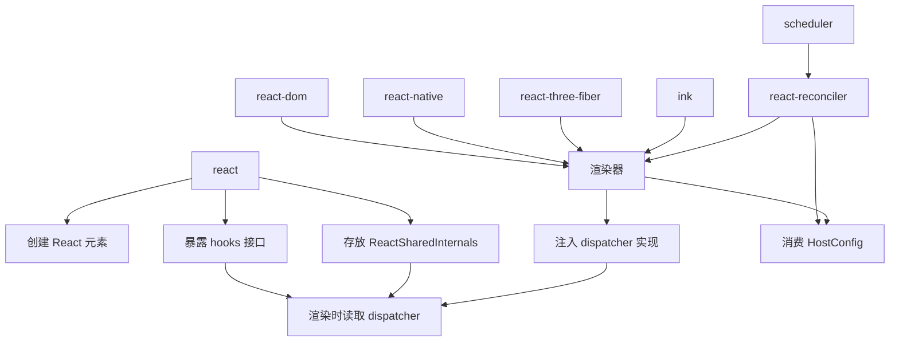
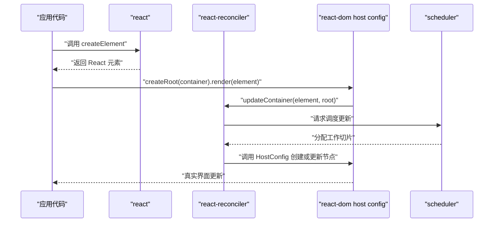
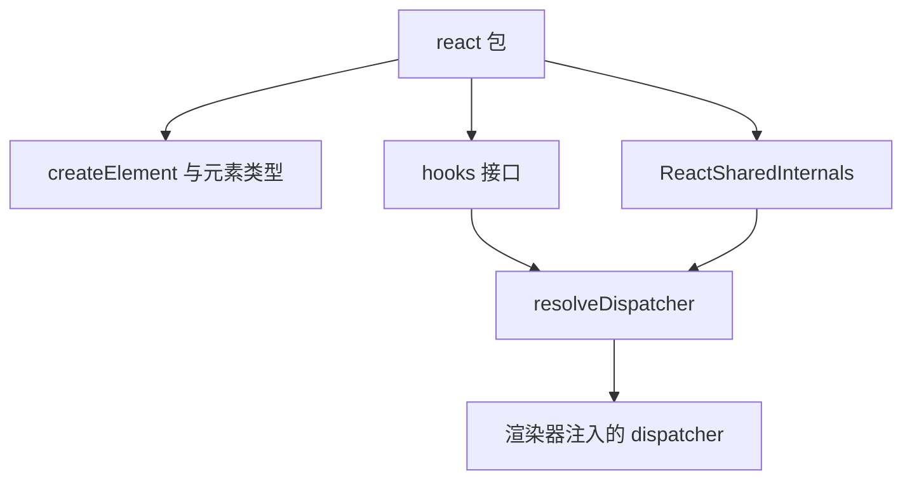
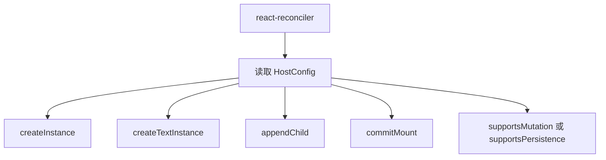
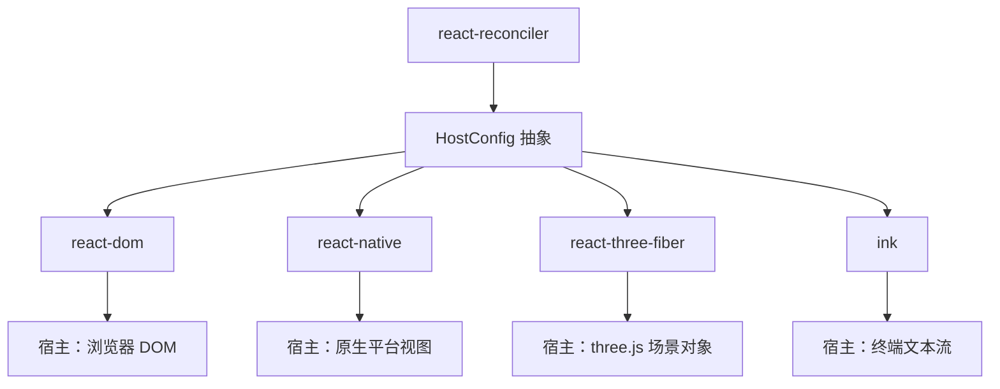
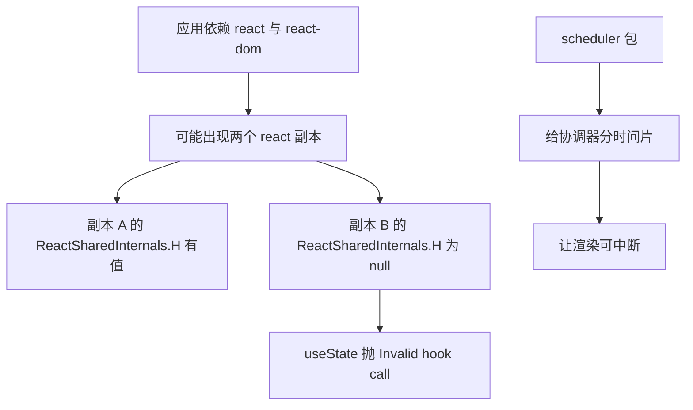

# React 为什么要拆成 react、react-dom、react-reconciler、react-native 等包

!!! abstract "学完这一页你能"

- 说清 `react`、`react-dom`、`react-reconciler`、`scheduler` 四个包各自负责什么，以及它们为什么不能合成一个包。
- 解释 `ReactSharedInternals` 是什么，以及 `useState` 为什么依赖渲染器注入的 `dispatcher`。
- 列出 `HostConfig` 至少 5 个必须由宿主实现的方法，并区分 mutation 模式与 persistent 模式。
- 对比 `react-dom`、`react-native`、`react-three-fiber`、`ink` 的宿主差异，识别多 React 副本导致的版本一致问题。

## 0. 知识地图



建议先读第 1 节，建立“调用链上有哪些包”的全局图。  
再读第 2、3 节，弄懂 `react` 包薄薄的一层如何通过共享对象接到渲染器。  
最后读第 4 到 6 节，把 `HostConfig`、四类渲染器、调度与版本成本串起来。

## 1. 一次渲染为什么需要四类包

**先想一个问题**

你在 React 里写 `<div>hello</div>`，浏览器却出现了真实 DOM。  
这段 JSX 究竟经过了几类包？为什么不是 `react` 一个包直接操作 DOM？

**心智模型**

!!! tip "心智模型"

一句话模型：`react` 下订单，`react-reconciler` 排施工计划，`react-dom` 或 `react-native` 现场施工，`scheduler` 决定先做哪一批。  
日常类比：装修时，设计图、工长、水电工、排期表是四个角色；设计图不自己刷墙。  
类比不成立的地方：装修角色通常理解需求后工作，而 React 包里没有“理解不同宿主”的代码，它只把需求写成统一结构。

!!! note "术语：reconciler"

协调器：负责比较新旧元素树、计算哪些节点要新增、修改、删除的模块。  
例如 `react-reconciler` 输出“更新这颗 Fiber 树需要执行哪些操作”，但不亲自操作 DOM。

**图解**



- 第 1 步：`react` 只把 JSX 转成 React 元素，不产生界面。
- 第 2 步：入口包 `react-dom` 接收元素和容器，把控制权交给 `react-reconciler`。
- 第 3 步：`react-reconciler` 调用 `HostConfig` 里的方法，由 `react-dom` 实现真实 DOM 操作。
- 第 4 步：调度器把长任务切成可中断的小片，避免一次执行卡住主线程。

**一步一步来**

第一步：入口渲染器只做“把元素交给协调器”，自己不写 diff。

```js
// ReactDOMRoot.js 关键行为摘录：render 方法调用 updateContainer
function(children) {
  const root = this._internalRoot;
  if (root === null) {
    throw new Error('Cannot update an unmounted root.');
  }
  updateContainer(children, root, null, null);
}
```

**这段代码在做什么**

- `children` 是用户传入的 React 元素树。
- `_internalRoot` 是协调器创建的 Fiber root，`react-dom` 不直接解析它。
- `updateContainer` 来自 `react-reconciler`，负责安排更新。
- 渲染器入口的职责是“接收参数、转发参数”，不在这里循环比较新旧树。
- 这就是拆包后调用链的第一段：`react-dom` 对上连接应用，对下连接协调器。

第二步：自定义渲染器也可以复用同一个协调器。

```js
const Reconciler = require('react-reconciler');
const HostConfig = {
  createInstance(type, props) {
    // 宿主环境创建节点
  }
};
const MyRenderer = Reconciler(HostConfig);
```

**这段代码在做什么**

- `HostConfig` 描述宿主怎么创建节点。
- `Reconciler(HostConfig)` 返回一个渲染器 API。
- `createInstance` 等方法的实现决定节点落在 DOM、原生视图还是其他目标。
- 协调器不要求宿主是 DOM，只要求宿主提供一套方法。

**动手验证**

下面脚本模拟“渲染器入口转发给协调器”的调用链，使用 Node 20+，无需第三方依赖。

```js
// 运行：node call-chain.js
// 依赖：无
import assert from 'node:assert';

let updateContainerCalls = 0;
const updateContainer = () => {
  updateContainerCalls += 1;
};

const root = {
  render(children) {
    updateContainer(children, this._internalRoot, null, null);
  },
  _internalRoot: { tag: 'FiberRoot' }
};

root.render('hello');
assert.equal(updateContainerCalls, 1, 'render 应调用一次 updateContainer');
console.log('调用链验证通过');
```

运行结果：

```text
调用链验证通过
```

**常见坑**

| 现象 | 原因 | 怎么修 |
| --- | --- | --- |
| 以为 `react-dom` 包也包含 diff 算法 | diff 在 `react-reconciler`，DOM 包只实现宿主操作和入口 | 查看 `react-dom` 导入 `react-reconciler` 的 `updateContainer` |
| 想写自定义渲染器却先去看 DOM 内部逻辑 | DOM 适配层与通用协调逻辑混在一起，容易误读 | 先读 `react-reconciler` 的 README，不进入 DOM 细节 |
| 把 `scheduler` 当成 React 特有并发 API | `scheduler` 负责任务优先级和时间切片，不是组件 API | 从 `scheduler` 与 `updateContainer` 的调用关系理解 |

**用在哪里**

- 浏览器后台管理系统的渲染入口：业务背景是大量表单和表格通过 `createRoot` 挂载；本页知识能帮你定位“更新从 `root.render` 进入协调器”。衡量指标是排障时间；不该在写普通页面时自行调用 `react-reconciler`。
- 团队内部做渲染层封装：业务背景是封装统一的 `renderToHost` 接口；本页知识用于区分哪些逻辑属于协调、哪些属于宿主。衡量指标是接入新终端的成本；宿主差异大时不该强行共用一套 HostConfig。
- 排期任务型前端框架：业务背景是需要在空闲时间执行非关键渲染；本页知识用于理解 `scheduler` 的时间切片。衡量指标是主线程长任务数量；交互极简单时引入调度没有明显收益。

**行业实践**

- 官方源码 `ReactDOMRoot.js` 的 `render` 明确一行调用 `updateContainer`，说明入口包不承载 diff 实现。  
  怎么借鉴到你的项目：入口层保持薄，只做参数校验与转发，不混入业务算法。
- `react-reconciler` README 用 `Reconciler(HostConfig)` 作为公共入口，明确“提供宿主说明书即可创建渲染器”。  
  怎么借鉴到你的项目：设计跨端模块时，把“策略”收敛到配置对象，而不是到处 if-else。
- React 官方把源码拆成 `packages/react`、`packages/react-dom`、`packages/react-reconciler` 等目录。  
  怎么借鉴到你的项目：按“平台无关内核”与“平台适配层”拆包，能让测试和发布边界更清楚。

**小结**

- `react` 不直接操作 DOM，它负责产生元素和提供组件 API。
- `react-reconciler` 是平台无关的 diff 与调度核心，通过 `HostConfig` 调用宿主。
- `react-dom`、`react-native` 等入口包负责定义真实宿主的操作，并转发更新。

## 2. react 包：只描述 UI，不接触宿主

**先想一个问题**

为什么 `import { useState } from 'react'` 能在浏览器和原生应用里都工作？  
`react` 包里到底有没有 `document.createElement` 这类代码？

**心智模型**

!!! tip "心智模型"

一句话模型：`react` 包只负责“写需求”，把界面描述成结构化元素，把 hooks 暴露成统一接口。  
日常类比：菜谱写“烤 10 分钟”，不负责买烤箱、也不负责判断烤箱品牌。  
类比不成立的地方：菜谱不会在运行中途替换厨师，而 React 的 hooks 会在渲染时动态寻找渲染器注入的实现。

!!! note "术语：JSX"

JSX 是 JavaScript 的语法扩展，编译后通常调用 `createElement`。  
例如 `<div />` 会被编译为描述 `div` 元素的函数调用，而不是立即创建 DOM。

**图解**



- `react` 包有三类核心内容：元素创建、hooks 接口、共享内部对象。
- hooks 接口本身不实现状态链表，它调用共享对象里的当前 `dispatcher`。
- 共享对象默认是 `null`，由渲染器在适当阶段写入实现。

**一步一步来**

第一步：看共享对象如何初始化。

```js
// ReactSharedInternalsClient.js 摘录
const ReactSharedInternals: SharedStateClient = {
  H: null,
  A: null,
  T: null,
  S: null,
};
```

**这段代码在做什么**

- `ReactSharedInternals` 是 react 包内存放的共享对象。
- `H` 是当前 hooks 的 `dispatcher`，初始为 `null`。
- `A`、`T`、`S` 分别供 Cache、Transition 等机制使用。
- 默认值说明 `react` 包自己不知道具体实现，只留位置。
- 渲染器需要在组件渲染前把 `H` 填进去。

第二步：看 `useState` 如何读取共享对象。

```js
// ReactHooks.js 摘录
function resolveDispatcher() {
  const dispatcher = ReactSharedInternals.H;
  return dispatcher;
}

export function useState(initialState) {
  const dispatcher = resolveDispatcher();
  return dispatcher.useState(initialState);
}
```

**这段代码在做什么**

- `resolveDispatcher` 直接返回 `ReactSharedInternals.H`。
- 如果渲染器没有注入 `H`，`useState` 会尝试读 `null.useState` 导致错误。
- 所以 hooks 不能在组件函数和渲染流程之外调用。
- `react` 包不判断现在用的是 DOM 还是原生，只转发调用。

**动手验证**

下面脚本模拟 `react` 包内 `useState` 读取共享对象的行为；无第三方依赖。

```js
// 运行：node react-package-shape.js
// 依赖：无
import assert from 'node:assert';

const ReactSharedInternals = { H: null };

function useState(initialState) {
  const dispatcher = ReactSharedInternals.H;
  return dispatcher.useState(initialState);
}

assert.throws(
  () => useState(0),
  /null/,
  '未注入 dispatcher 时，useState 应因 H 为 null 抛错'
);

ReactSharedInternals.H = {
  useState(initial) {
    return [initial, () => {}];
  }
};

const result = useState(42);
assert.equal(result[0], 42, '注入 dispatcher 后应返回初始状态');
console.log('react 包职责验证通过');
```

运行结果：

```text
react 包职责验证通过
```

**常见坑**

| 现象 | 原因 | 怎么修 |
| --- | --- | --- |
| 在事件回调外调用 `useState` 报错 | `ReactSharedInternals.H` 尚未由渲染器注入 | 将 hooks 调用放回函数组件体内 |
| 两个 `react` 副本导致一个副本的 `H` 为 `null` | `react-dom` 注入了另一个副本的对象，当前副本没被注入 | 让应用只引用一个 `react` 实例 |
| 以为 `useState` 的实现写在 react 包 | react 包只定义接口，实现由协调器或渲染器注入 | 查 `react-reconciler` 中的 dispatcher 实现 |

**用在哪里**

- 组件库开发：业务背景是同时输出给网页和原生应用使用；本页知识用于保证 hooks 只来自 `react`，不手写宿主操作。衡量指标是跨端兼容性；宿主差异过大时组件库仍需要分平台入口。
- 在线代码编辑器：业务背景是用户输入组件代码并预览；本页知识用于解释 hooks 必须在组件内执行。衡量指标是错误提示准确率；简单静态代码不必引入完整渲染器。
- 测试工具设计：业务背景是测试 hooks 时需要一个可控渲染环境；本页知识用于理解 `dispatcher` 注入。衡量指标是测试运行时长；纯函数测试不该引入 DOM。

**行业实践**

- 官方源码 `ReactSharedInternalsClient.js` 将 `ReactSharedInternals` 作为共享对象导出，字段短名如 `H`、`A`、`T`。  
  怎么借鉴到你的项目：需要跨模块扩展点时，用一个显式的共享对象，比全局变量更易追踪。
- 官方源码 `ReactHooks.js` 中所有公开 hook 都先调用 `resolveDispatcher`。  
  怎么借鉴到你的项目：插件式架构中，公开 API 保持薄转发，具体实现放到注入点。
- `createElement` 的具体返回结构资料未覆盖，需核对官方文档：`packages/react/src/ReactElement.js` 的 `$$typeof`、`props` 等字段。

**小结**

- `react` 包不携带 `document`、`View` 等宿主概念，只提供元素、hooks 与共享对象。
- hooks 接口通过 `ReactSharedInternals.H` 查找实现，实现由渲染器注入。
- 这套设计让同一个 `react` 包可以服务浏览器、原生和其他渲染目标。

## 3. ReactSharedInternals 与 dispatcher 注入

**先想一个问题**

同一个 `useState`，在组件初次渲染和后续更新时为什么能读到不同阶段的实现？  
渲染器是在哪里把具体实现放进 `ReactSharedInternals.H` 的？

**心智模型**

!!! tip "心智模型"

一句话模型：`ReactSharedInternals` 是一块小白板，渲染器在开工前写上“当前由我处理 hooks”，`useState` 每次抬头读白板。  
日常类比：医院分诊台写着“今日内科在 3 楼”，病人不直接找医生，而是看分诊台。  
类比不成立的地方：分诊牌通常整天不变，React 的 `H` 会在渲染前写入、渲染后清理，生命周期短得多。

**图解**

```mermaid
stateDiagram-v2
  [*] --> "H 为 null"
  "H 为 null" --> "H 已注入" : "渲染器进入渲染流程"
  "H 已注入" --> "组件调用 useState" : "读取 dispatcher"
  "组件调用 useState" --> "H 为 null" : "渲染结束或出错清理"
  "H 为 null" --> [*]
```

- 初始状态 `H` 是 `null`，此时调用 hooks 会失败。
- 渲染器在渲染前把 `H` 改为当前 dispatcher。
- 组件的 `useState` 等 hooks 从 `H` 取实现。
- 渲染结束或出错后，`H` 回到 `null` 或下一次更新前的状态。

**一步一步来**

第一步：`react` 包定义错误检查与取值路径。

```js
// ReactHooks.js 摘录：resolveDispatcher 的 DEV 分支
function resolveDispatcher() {
  const dispatcher = ReactSharedInternals.H;
  if (__DEV__) {
    if (dispatcher === null) {
      console.error(
        'Invalid hook call. Hooks can only be called inside of the body of a function component.'
      );
    }
  }
  return dispatcher;
}
```

**这段代码在做什么**

- 开发环境下，如果 `H` 是 `null`，先打印可读错误。
- 这段代码不修复问题，只是让开发者知道 hooks 调用位置不对。
- 错误消息提到三种可能：版本不匹配、违反 hooks 规则、存在多个 React 副本。
- 生产环境可能不保留这段开发时错误提示。

第二步：模拟渲染器注入与读取的完整顺序。

```js
// 模拟注入过程，不依赖 react 包真实实现
const ReactSharedInternals = { H: null };

function render(Component) {
  ReactSharedInternals.H = {
    useState(initial) {
      return [initial, (next) => {
        ReactSharedInternals.H = null;
      }];
    }
  };

  const result = Component();
  ReactSharedInternals.H = null;
  return result;
}
```

**这段代码在做什么**

- `render` 在调用组件前注入 dispatcher。
- dispatcher 提供 `useState` 的具体实现。
- 组件之后清理 `H`，让共享对象回到 `null`。
- 这模拟了渲染器“注入、渲染、清理”的内核顺序。

**动手验证**

下面脚本断言注入前后 `useState` 的行为变化；无第三方依赖。

```js
// 运行：node dispatcher-injection.js
// 依赖：无
import assert from 'node:assert';

const ReactSharedInternals = { H: null };
let renderActive = false;

const render = (Component) => {
  renderActive = true;
  ReactSharedInternals.H = {
    useState(initial) {
      assert.equal(renderActive, true, 'useState 应在渲染激活时读取 dispatcher');
      return [initial, () => {}];
    }
  };
  const result = Component();
  renderActive = false;
  ReactSharedInternals.H = null;
  return result;
};

function Counter() {
  const [count] = useState(1);
  return count;
}

assert.equal(render(Counter), 1, '组件应拿到初始状态 1');
assert.equal(ReactSharedInternals.H, null, '渲染结束后 H 应清理为 null');
console.log('dispatcher 注入顺序验证通过');
```

运行结果：

```text
dispatcher 注入顺序验证通过
```

**常见坑**

| 现象 | 原因 | 怎么修 |
| --- | --- | --- |
| 组件内 hooks 正常，异步回调中调用报 `Invalid hook call` | 异步回调执行时 `H` 已经清理 | 在回调中保存数据，不调用 hooks |
| 多个 React 副本时一个副本正常，另一个报错 | 渲染器注入了 A 副本的 `ReactSharedInternals`，B 副本读到 `null` | 统一包版本与实例 |
| 自定义渲染器升级后 hooks 报错 | `react-reconciler` 不是稳定 API，dispatcher 形状会变 | 按官方 README，跟进版本并核对 HostConfig |

**用在哪里**

- 微前端应用：业务背景是多个子应用可能各自依赖 React；本页知识用于排查“某个子应用 hook 失败”。衡量指标是错误页面数量；共享基础设施能运行时才适合统一 React 实例。
- 数据可视化组件库：业务背景是图表组件在浏览器和 Canvas 下复用逻辑；本页知识用于理解渲染器级别注入。衡量指标是同一 hook 在两种目标下可用；目标 API 差异大时需要单独适配平台。
- 开发者工具：业务背景是跟踪 hooks 调用栈；本页知识用于理解 `H` 的生命周期。衡量指标是错误定位时间；生产包可能缺少 DEV 信息。

**行业实践**

- React 官方源码把 dispatcher 字段命名为 `H`，并放在 `ReactSharedInternalsClient` 的类型 `SharedStateClient` 中。  
  怎么借鉴到你的项目：内部共享对象使用精简字段名，但要用类型注释补全含义。
- 官方错误消息直接列出三条排查路径：版本不匹配、违反 hooks 规则、多个 React 副本。  
  怎么借鉴到你的项目：报错信息不要只说“出错了”，列出可检查的固定原因。
- 资料未覆盖 `react-dom` 具体在哪个函数写 `ReactSharedInternals.H`，需核对官方文档：`react-dom-bindings` 或 `react-reconciler` 中的 hooks 初始化代码。

**小结**

- `ReactSharedInternals` 是 react 包与渲染器之间的接头，默认不保存实现。
- 渲染器在渲染前注入 dispatcher，组件 hooks 读取后执行，结束时清理。
- 版本不一致或多个 React 副本会导致共享对象指向错误。

## 4. react-reconciler 与 Host Config

**先想一个问题**

你想让 React 渲染到 Canvas、终端或 PDF，为什么官方还说“你只需要实现一些宿主方法”？  
diff 这套复杂逻辑，难道每个渲染器都要重写？

**心智模型**

!!! tip "心智模型"

一句话模型：`react-reconciler` 是平台无关的大脑，`HostConfig` 是告诉大脑“手和脚在哪、怎么动”的说明书。  
日常类比：通用扫地机器人内核不变，只换不同地板的轮子和刷头。  
类比不成立的地方：机器人可以自己识别地面，而 React 协调器完全依赖你提供的方法，少一个方法可能直接运行失败。

!!! note "术语：HostConfig"

宿主配置：自定义渲染器提供给 `react-reconciler` 的对象，描述如何在目标环境创建、删除、更新节点。  
例如 DOM HostConfig 的 `createInstance` 会调用 `document.createElement`。

**图解**



- 协调器只依赖 `HostConfig` 暴露的方法，不直接认识 DOM、Canvas 或终端。
- `createInstance` 创建元素节点，`createTextInstance` 创建文本节点。
- `appendChild` 把子节点挂到父节点，`commitMount` 处理真正上树后的工作。
- `supportsMutation` 与 `supportsPersistence` 二选一，决定协调器调用哪套方法。

**一步一步来**

第一步：创建渲染器的统一姿势。

```js
const Reconciler = require('react-reconciler');

const HostConfig = {
  // 这里实现宿主方法
};

const MyRenderer = Reconciler(HostConfig);
```

**这段代码在做什么**

- `react-reconciler` 导出一个函数，接收 `HostConfig`。
- 函数返回一个渲染器，供给应用侧调用更新容器等 API。
- `HostConfig` 不显式声明完整类型，协调器按需取方法。
- 官方 README 说这个 API 是实验性，不遵循常见版本号约定。

第二步：实现最基础的两个宿主方法。

```js
const HostConfig = {
  createInstance(type, props) {
    // DOM 渲染器会返回一个 DOM 节点
    return { type, children: [] };
  },
  supportsMutation: true,
  appendChild(parent, child) {
    parent.children.push(child);
  }
};
```

**这段代码在做什么**

- `createInstance` 说明“目标环境如何创建节点”。
- `supportsMutation` 说明节点以后会原地修改。
- `appendChild` 执行子节点挂载。
- 这不是 React DOM 的真实实现，只是 HostConfig 需要表达的最小形状。

**动手验证**

下面脚本模拟 `Reconciler(HostConfig)` 与节点创建；无第三方依赖。

```js
// 运行：node host-config.js
// 依赖：无
import assert from 'node:assert';

const Reconciler = (HostConfig) => {
  assert.equal(typeof HostConfig.createInstance, 'function', 'HostConfig 应提供 createInstance');
  assert.equal(typeof HostConfig.appendChild, 'function', 'HostConfig 应提供 appendChild');
  assert.equal(HostConfig.supportsMutation, true, 'HostConfig 应声明 mutation 模式');

  const node = HostConfig.createInstance('div', {});
  HostConfig.appendChild(node, { type: 'text' });
  return { render() {} };
};

const HostConfig = {
  supportsMutation: true,
  createInstance(type) {
    return { type, children: [] };
  },
  appendChild(parent, child) {
    parent.children.push(child);
  }
};

const Renderer = Reconciler(HostConfig);
assert.equal(typeof Renderer.render, 'function', '应返回包含 render 的渲染器');
console.log('HostConfig 最小接口验证通过');
```

运行结果：

```text
HostConfig 最小接口验证通过
```

**常见坑**

| 现象 | 原因 | 怎么修 |
| --- | --- | --- |
| 自定义渲染器运行时报缺方法 | `HostConfig` 未实现协调器需要的接口 | 按 `ReactFiberConfig.custom.js` 或官方 README 核验 |
| 方法写错阶段会产生副作用 | 例如在 `createInstance` 注册全局事件，节点可能未被挂载 | 把必须“上树后”的工作放到 `commitMount` |
| mutation 与 persistent 混用 | 同一 HostConfig 同时声明 `supportsMutation` 和 `supportsPersistence`，或写错 | 确认目标平台是可变节点还是不可变树，选一种模式 |

**用在哪里**

- 终端仪表盘工具：业务背景是用 React 思维渲染文字面板；本页知识用于实现终端 HostConfig。衡量指标是渲染一屏的命令次数；目标不支持原生节点时值得自定义渲染器。
- WebGL 配置器：业务背景是把组件映射到 three.js 场景；本页知识用于编写对 three.js 对象的创建与挂载。衡量指标是每帧操作对象数；CPU 场景不需要引入 GPU 宿主。
- 文档导出器：业务背景是把页面组件导出为 PDF 或静态文件；本页知识用于让协调器调用文档对象。衡量指标是导出耗时；一次性转换可以用更简单递归，不必上协调器。

**行业实践**

- React 官方 README 明确 `react-reconciler` 是实验包，API 稳定性低于 React、React Native、React DOM。  
  怎么借鉴到你的项目：自定义渲染器要锁定版本，升级前阅读变更。
- React DOM 的 HostConfig 源码位于 `packages/react-dom-bindings/src/client/ReactFiberConfigDOM.js`，官方把它单独放一个目录。  
  怎么借鉴到你的项目：宿主绑定层从入口包中分离，能减少平台代码与核心代码的耦合。
- React Native 的 Fabric HostConfig 源码路径为 `packages/react-native-renderer/src/ReactFiberConfigFabric.js`。  
  怎么借鉴到你的项目：不同原生渲染实现可以作为不同 HostConfig，而不是改协调器。

**小结**

- `react-reconciler` 不关心目标环境，通过 `HostConfig` 调用宿主方法。
- 宿主需要声明 mutation 或 persistent 模式，并实现对应方法。
- 自定义渲染器的稳定成本主要来自 `react-reconciler` API 仍可能变化。

## 5. 四种宿主渲染器：react-dom、react-native、react-three-fiber、ink

**先想一个问题**

同一段计数器组件，为什么能跑在浏览器、手机、3D 场景和命令行里？  
它们分别把 React 元素变成了什么？

**心智模型**

!!! tip "心智模型"

一句话模型：四种渲染器是同一套协调逻辑下的四种“落地材质”。  
日常类比：同一个 PDF 阅读器，输出到屏幕、打印机、投影仪，核心排版相同，设备驱动不同。  
类比不成立的地方：PDF 输出差异通常由驱动隐藏，而 React 渲染器开发者必须自己写清楚每个宿主 API。

**图解**



- `react-dom` 的宿主是浏览器 DOM，节点可以直接 `appendChild`。
- `react-native` 的宿主是原生平台视图，Fabric 渲染器使用 persistent 模式，资料如此说明。
- `react-three-fiber` 的宿主是 three.js 对象；具体 HostConfig 官方资料未覆盖，需核对项目文档。
- `ink` 的宿主是终端文本流；具体 HostConfig 官方资料未覆盖，需核对项目文档。

**一步一步来**

第一步：分类一个渲染器要看宿主节点是否可变。

```js
// 概念检查，不依赖真实渲染包
function chooseMode(hostName) {
  if (hostName === 'dom') return 'mutation';
  if (hostName === 'native-fabric') return 'persistence';
  return '需核对目标渲染器文档';
}
```

**这段代码在做什么**

- DOM 有 `appendChild`、`removeChild` 一类可变节点方法，通常选 mutation。
- 官方资料说明新 React Native 渲染器 Fabric 使用 persistent 模式。
- 第三方渲染器如果不确定，应先不写死模式。
- 目标选择取决于“节点可变”还是“树不可变、需克隆”。

第二步：用宿主节点差异解释同一组件树的不同产出。

```js
const targets = {
  dom: '真实 HTML 元素',
  native: '原生视图实例',
  threeFiber: 'three.js 对象节点',
  ink: '终端输出单元'
};

for (const [name, output] of Object.entries(targets)) {
  console.log(`${name} 产出：${output}`);
}
```

**这段代码在做什么**

- 输出四类宿主的概括性差别，不描述具体内部实现。
- 它强调“同一个组件描述可以有不同实体”。
- 实际渲染包的接口细节需要分别核对官方文档。
- 这里只做教学性分类，不当作生产 API 依据。

**动手验证**

下面脚本验证“目标名称到节点可变性”的教学分类；无第三方依赖。

```js
// 运行：node renderers-compare.js
// 依赖：无
import assert from 'node:assert';

const known = new Map([
  ['react-dom', true],
  ['react-native', false]
]);

assert.equal(known.get('react-dom'), true, 'react-dom 宿主节点可变');
assert.equal(known.get('react-native'), false, 'react-native Fabric 按资料使用 persistent 模式');
console.log('渲染器分类验证通过');
```

运行结果：

```text
渲染器分类验证通过
```

**常见坑**

| 现象 | 原因 | 怎么修 |
| --- | --- | --- |
| 把 `react-native` 渲染过程理解成直接转 DOM | 原生渲染器使用原生视图，不含 HTML 节点 | 查看 React Native 渲染器 HostConfig |
| 以为 `react-three-fiber` 是 React 官方包 | 它是第三方 React 渲染器，基于 three.js | 资料未覆盖其 HostConfig 实现，需核对项目文档 |
| 以为 `ink` 有完整 DOM 事件模型 | 终端宿主没有浏览器事件和布局 | 需核对 ink 支持的功能边界 |

**用在哪里**

- 跨端设计系统：业务背景是同一批组件对接到 H5、原生与桌面端；本页知识用于评估不同宿主差异。衡量指标是组件复用率；平台交互差异过大时，设计系统应分层而非强求一个 HostConfig。
- 开发者 CLI 工具：业务背景是构建脚手架或监控面板；本页知识用于判断是否引入 `ink` 这类终端渲染器。衡量指标是交互完成时间；纯脚本输出不需要 React 渲染。
- 3D 商品展示：业务背景是商品模型需要响应式配置；本页知识用于理解 `react-three-fiber` 的宿主是 three.js。衡量指标是场景更新帧时间；静态 3D 展示不必引入组件树。

**行业实践**

- 官方 `react-reconciler` README 提及 React DOM、React ART、React Native 各自有 HostConfig。
- 怎么借鉴到你的项目：渲染目标变化时优先考虑新增 HostConfig，而不是复制业务组件。
- 官方 README 说明 React Native Fabric 使用 persistent 模式，节点不可变、变化时克隆父树。
- 怎么借鉴到你的项目：如果目标树的写入成本很高，可评估 persistent 模式是否匹配。
- `react-three-fiber` 与 `ink` 的包内实现资料未覆盖，需核对各自官方文档：HostConfig 方法、事件系统、生产可用性。

**小结**

- 四类渲染器共享协调逻辑，差异集中在宿主节点和平台能力。
- `react-dom` 和旧类 DOM 渲染器通常用 mutation 模式。
- 第三方渲染器接入前需核对项目文档，不能假设浏览器能力。

## 6. scheduler 独立与多渲染器版本一致性

**先想一个问题**

为什么 `useState` 报错信息会同时提到“react 和渲染器版本不匹配”“有多个 React 副本”？  
`scheduler` 独立又和这套拆包有什么关系？

**心智模型**

!!! tip "心智模型"

一句话模型：`scheduler` 是独立的时间片排期器；多渲染器和多 React 副本会破坏共享对象的一一对应。  
日常类比：餐厅排号系统独立于后厨和前台；如果两家分店共用一个号码牌却不互通，就会叫错号。  
类比不成立的地方：餐厅叫错号只是慢，React 版本不一致通常会直接导致功能崩溃。

**图解**



- 如果应用里存在两个 `react` 实例，渲染器只会注入其中一个共享对象。
- 另一个实例的 hooks 读取自己那份 `ReactSharedInternals`，可能还是 `null`。
- 版本不匹配也表现为 `dispatcher` 形状对不上，调用时出错。
- `scheduler` 独立后，协调器不自己写时间片，只向调度器请求。

**一步一步来**

第一步：拆出 scheduler 是为了让调度逻辑可独立演进。

```js
// 概念示意：协调器只请求调度，不负责时间计算
let deadline = 0;

function requestWork(callback) {
  if (Date.now() < deadline) {
    callback();
  } else {
    setTimeout(callback, 0);
  }
}
```

**这段代码在做什么**

- 协调器把“现在能不能做”交给调度器决定。
- `scheduler` 可以基于时间片或优先级安排执行。
- 不同宿主可以共享同一套调度策略。
- 示例是教学简化，不是 `scheduler` 真实源码。

第二步：演示两份共享对象如何导致一个正常、一个报错。

```js
const copyA = { H: { useState: (x) => [x, () => {}] } };
const copyB = { H: null };

function useStateFrom(shared) {
  const dispatcher = shared.H;
  return dispatcher.useState(0);
}

try {
  useStateFrom(copyB);
} catch (error) {
  console.log('副本 B 读取失败，因为 H 为 null');
}
```

**这段代码在做什么**

- `copyA` 被注入了 dispatcher，能正常执行。
- `copyB` 没有被注入，调用时读到 `null`。
- 真实项目里多副本可能由不同依赖版本或多次打包产生。
- 出错信息与 `ReactHooks.js` 官方源码里 `dispatcher === null` 的检测一致。

**动手验证**

下面脚本模拟两个副本并断言错误；无第三方依赖。

```js
// 运行：node scheduler-copies.js
// 依赖：无
import assert from 'node:assert';

const copyA = { H: { useState: (x) => [x, () => {}] } };
const copyB = { H: null };

const useStateFrom = (shared) => {
  const dispatcher = shared.H;
  if (dispatcher === null) {
    throw new Error('Invalid hook call');
  }
  return dispatcher.useState(0);
};

assert.equal(useStateFrom(copyA)[0], 0, '副本 A 应正常执行');
assert.throws(() => useStateFrom(copyB), /Invalid hook call/, '副本 B 应报错');
console.log('多副本问题验证通过');
```

运行结果：

```text
多副本问题验证通过
```

**常见坑**

| 现象 | 原因 | 怎么修 |
| --- | --- | --- |
| 升级 `react-dom` 但不升级 `react` 后 hook 报错 | 两个包期待的 dispatcher 形状不同 | 让 `react` 与渲染器版本匹配 |
| 微前端里不同子应用各自的 `useState` 状态异常 | 子应用使用不同 React 实例 | 通过模块联邦或 externals 共享同一 React 实例 |
| 以为 scheduler 只服务 React DOM | `scheduler` 是可独立使用的调度包 | 查看 `scheduler` 包职责与优先级 API |

**用在哪里**

- 企业微前端平台：业务背景是多个团队、多个子应用共享页面；本页知识用于统一 `react` 与 `react-dom` 的共享策略。衡量指标是重复包体积；共享 React 后包体积上升，但能减少多副本错误。
- 长时间任务的后台分析页：业务背景是大报表渲染会卡顿；本页知识用于评估 `scheduler` 的时间切片。衡量指标是主线程长任务时长；不是所有页面都需要拆分调度。
- 自建插件市场：业务背景是第三方插件自行打包 React；本页知识用于制定 peerDependencies 与共享机制。衡量指标是插件加载后 hook 报错率；插件宿主差异大时共享可能不现实。

**行业实践**

- 官方 `ReactHooks.js` 的错误信息列出“多个 React 副本”与“版本不匹配”两个原因。  
  怎么借鉴到你的项目：向上层暴露错误时，给出可操作检查项，而不只是抛出。
- `react-reconciler` README 明确其版本号体系不同于 React 主包。  
  怎么借鉴到你的项目：依赖自定义渲染器时，写出明确的版本约束和升级测试。
- `scheduler` 独立为 React 仓库中的一个包，协调器通过请求调度和工作循环接入。  
  怎么借鉴到你的项目：把延迟、优先级逻辑拆成独立服务，便于多个执行器复用。

**小结**

- `scheduler` 独立，让时间片和优先级策略不跟协调器绑定。
- 多 React 副本会破坏 `ReactSharedInternals` 的一一对应，导致 hooks 失败。
- 版本不匹配是拆包后的真实成本，需要在工程中显式管理。

## 应用地图

| 场景 | 用到本页哪个知识点 | 典型技术选型 | 注意事项 |
| --- | --- | --- | --- |
| 自定义 Canvas 渲染器 | `react-reconciler` 与 `HostConfig` | `react-reconciler` 实验版 + Canvas HostConfig | API 版本不稳定，要锁版本 |
| 多端组件库 | `react` 包共用与渲染器差异 | `react` + `react-dom` + `react-native` | 平台能力差异不能全部抹平 |
| 微前端共享依赖 | 多 React 副本与 `ReactSharedInternals` | Webpack Module Federation 或 externals | 需要统一 React 实例 |
| 终端监控面板 | 第三方渲染器差异 | `ink` | 核对终端事件与布局边界 |
| 3D 商品配置器 | 渲染目标与 HostConfig | `react-three-fiber` | 需核对 three.js 版本与渲染循环 |
| 长列表后台报表 | `scheduler` 时间切片 | React 并发特性 + 调度优先级 | 低优先级任务可能被推迟 |
| 自建日志可视化 | 自定义宿主节点 | HostConfig mutation 模式 | 少实现任一方法都会运行失败 |

## 动手作业

目标：写一个可运行的“控制台渲染器最小演示”。  
要求不依赖真实 `react-reconciler`，复现 `HostConfig` 的节点创建和挂载流程。

步骤：

1. 新建 `console-renderer.js`。
2. 实现 `HostConfig`：`createInstance` 返回 `{type, children: []}`，`appendChild` 挂载子节点。
3. 实现 `Reconciler(HostConfig)`，返回 `{ render(element) { ... } }`。
4. 在 `render` 中创建根节点并把元素节点挂到根上。
5. 用 `node:assert` 断言根节点有一个 `div` 子节点。

验收标准：

- `node console-renderer.js` 能打印 `控制台渲染器验证通过`。
- 根节点结构里存在 `type === 'div'` 的子节点。
- 没有使用 `react`、`react-dom`、`react-reconciler` 三个包。

## 综合对比

| 维度 | react | react-reconciler | react-dom | react-native | scheduler |
| --- | --- | --- | --- | --- | --- |
| 核心职责 | 元素、hooks 接口、共享对象 | diff、组件生命周期调度、Fiber 核心 | DOM 入口与 DOM HostConfig | 原生入口与原生 HostConfig | 任务优先级与时间片 |
| 接触宿主 | 不接触 | 不接触，通过 HostConfig 调用 | 接触 DOM | 接触原生视图 | 不接触 |
| 关键输出 | React 元素、hooks 调用 | Fiber 更新计划 | DOM 节点变更 | 原生视图变更 | 调度时刻 |
| 版本稳定性 | 相对稳定 | README 声明实验性 | 相对稳定 | 相对稳定 | 相对稳定但随 React 演进 |
| 失败模式 | `H` 为 null 导致 hook 报错 | HostConfig 缺方法 | DOM 环境缺失 | 原生模块缺失 | 调度策略与预期不一致 |

## 深入阅读与参考

!!! tip "怎么用这些资料"
    先读「官方文档与规范」建立准确的概念，再读「源码与示例」核对细节，最后用「教程、书籍与视频」换一种讲法加深理解。每条都写明了读哪一节、带着什么问题读。

### 官方文档与规范

| 资源 | 为什么读 | 怎么读 |
|---|---|---|
| [React DOM APIs](https://react.dev/reference/react-dom) | 官方界定 react-dom 这层负责什么，正好对照“宿主渲染器”定位。 | 先读本页条目总览，带着“哪些 API 属于宿主而非 React 核心”去逐个扫签名。 |
| [flushSync](https://react.dev/reference/react-dom/flushSync) | flushSync 是 react-dom 暴露的调度逃生口，能看清包之间的分工。 | 读 API 说明与 Caveats，思考它为什么必须放在 react-dom 而不能在 react 里。 |
| [React 官方文档](https://react.dev/) | 权威总览，先建立 React 对外能力的整体边界再谈拆包。 | 从 Quick Start 走一遍，留意文档中 React 与 React DOM 被分开讲述的章节。 |
| [React API 参考](https://react.dev/reference/react) | react 包导出面很窄，看参考页可验证“只描述 UI”这一说法。 | 浏览各 API 归属，重点读 Caveats，列出哪些能力明显属于渲染器而非核心。 |
| [React Working Group 与 RFC](https://github.com/reactjs/rfcs) | RFC 的 Motivation 是“为什么这样拆包”的第一手设计理由。 | 挑 Hooks 与 Server Components 两份，只读 Motivation 并各写一段摘要。 |

### 源码与示例

| 资源 | 为什么读 | 怎么读 |
|---|---|---|
| [React 源码仓库](https://github.com/facebook/react) | 直接读 reconciler 主干，看它如何把更新算法与宿主渲染解耦。 | 打开 packages/react-reconciler/src，只读 beginWork 与 completeWork 的函数签名和注释，标出所有 hostConfig 调用点。 |
| [index.js](https://github.com/facebook/react/blob/main/packages/scheduler/index.js) | Scheduler 包的公开入口，一眼看清它与 React 之间只有几个接口。 | 通读导出列表，问“渲染器要调度必须传什么”，再回头对照 react-dom 里的调用。 |
| [README.md](https://github.com/facebook/react/blob/main/packages/scheduler/README.md) | 官方说明 Scheduler 为何独立成包、怎么被多渲染器共享。 | 读 README 全文，重点记优先级与时间切片的约定，画出调度器与渲染器的边界。 |
| [index.native.js](https://github.com/facebook/react/blob/main/packages/scheduler/index.native.js) | 同包不同宿主入口，直观展示“调度器也要按宿主分文件”。 | 与 index.js 逐行对比差异，问哪些能力依赖宿主、哪些是纯 JS 通用逻辑。 |
| [SchedulerPriorities.js](https://github.com/facebook/react/blob/main/packages/scheduler/src/SchedulerPriorities.js) | 优先级常量表，是理解多渲染器共用一套调度语义的关键。 | 抄下各优先级数值与含义，再到 react-reconciler 中找它被谁映射成 lane。 |

### 教程、书籍与视频

| 资源 | 为什么读 | 怎么读 |
|---|---|---|
| [Overreacted：React as a UI Runtime](https://overreacted.io/react-as-a-ui-runtime/) | 把 React 讲成一门 UI 运行时，正好解释核心与宿主的分层。 | 分段读，每读完一节用一句话复述“React 做了什么、宿主做了什么”。 |
| [React Fiber 架构笔记](https://github.com/acdlite/react-fiber-architecture) | Fiber 笔记梳理渲染阶段，能与 reconciler 源码相互印证。 | 读完画一张 render 与 commit 两阶段流程图，标出 hostConfig 介入的位置。 |

## 自测题

??? question "1. `react` 包里不包含下面哪类实现？为什么？"

答案要点：不包含宿主操作实现。`react` 包提供元素创建、hooks 接口和共享内部对象；它通过 `resolveDispatcher` 调用注入的 dispatcher，不直接处理 DOM 或原生视图。

??? question "2. `ReactSharedInternals.H` 的初始值是什么？"

答案要点：初始为 `null`。如果组件在渲染器注入 dispatcher 前调用 hooks，读取到 `null` 会导致错误。渲染结束后，共享对象通常会被清理。

??? question "3. 为什么 `useState` 能在不同渲染器中共用？"

答案要点：`useState` 只调用 `ReactSharedInternals.H.useState`。实际实现由当前渲染器注入，因此同一接口可以在 DOM、原生等不同宿主中复用。

??? question "4. 列出 HostConfig 至少五个核心方法。"

答案要点：常见方法包括 `createInstance`、`createTextInstance`、`appendChild`、`finalizeInitialChildren`、`commitMount`。还可包括 `shouldSetTextContent`、`getRootHostContext` 等。

??? question "5. mutation 模式与 persistent 模式有什么本质区别？"

答案要点：mutation 模式直接修改已有节点，对应 DOM 一类宿主；persistent 模式不修改旧节点，而是克隆父树并替换。React DOM 和旧 React Native 渲染器用 mutation，Fabric 按官方资料用 persistent。

??? question "6. `react-dom` 与 `react-native` 在 HostConfig 层有什么差异？"

答案要点：宿主的节点类型不同，DOM 节点支持 `appendChild`，原生视图遵循平台 API。React Native Fabric 按资料使用 persistent 模式，而 React DOM 使用 mutation 模式。

??? question "7. 为什么拆包会带来版本一致性问题？"

答案要点：`react` 包通过共享对象寻找渲染器注入的 dispatcher。如果两个包来自不同版本，dispatcher 形状可能不匹配。如果有多个 React 副本，渲染器只注入其中一个，其他副本读到 `null`。

??? question "8. 你如何验证一个自定义 HostConfig 是否少实现方法？"

答案要点：传入 `Reconciler(HostConfig)` 后，协调器会在运行到相关阶段调用缺失方法。可以通过最小渲染用例触发创建、文本、挂载、提交等路径，也可以对照官方 README 或源码中的方法清单检查。

## 延伸阅读

- React 官方源码 `packages/react/src/ReactSharedInternalsClient.js`：共享对象字段含义。
- React 官方源码 `packages/react/src/ReactHooks.js`：hooks 如何通过 dispatcher 工作。
- React 官方源码 `packages/react-dom/src/client/ReactDOMRoot.js`：DOM 渲染入口如何转发 `updateContainer`。
- React 官方源码 `packages/react-reconciler/README.md`：`Usage`、`Practical Examples`、`An (Incomplete!) Reference` 章节。
- React 官方源码 `packages/react-native-renderer/src/ReactFiberConfigFabric.js`：Fabric HostConfig 参考。
- React 官方文档 React 错误排查中的 Invalid Hook Call 章节：多副本与版本不一致的排查方法。
