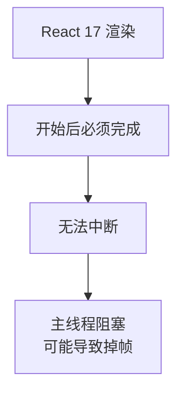
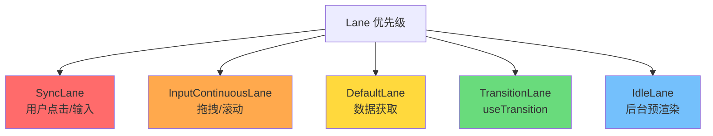
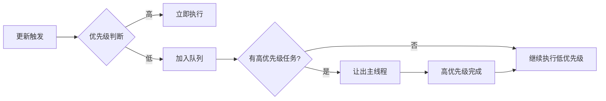
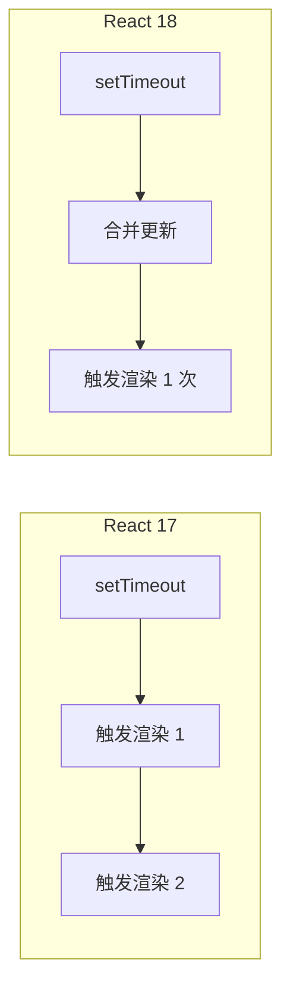
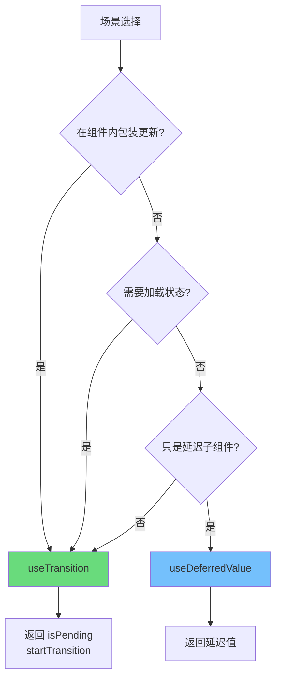
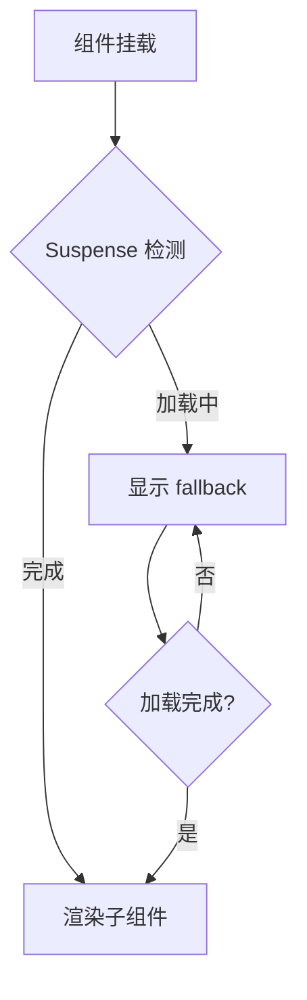
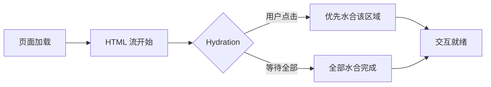
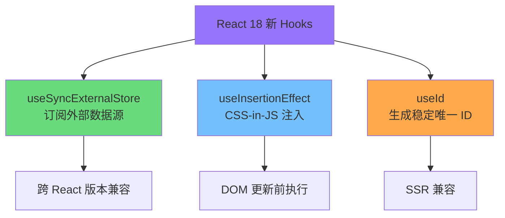

# React 18 核心概念

React 18 是 React 架构演进的重要里程碑，引入了并发渲染（Concurrent Rendering）这一核心能力，重新定义了 React 应用的工作模式。本文档深入剖析 React 18 的核心机制，帮助读者从原理层面理解这一代 React 的设计哲学。

---

## 1. 并发渲染 (Concurrent Rendering)

### 1.1 从阻塞式到可中断

在 React 18 之前，渲染过程是**阻塞式**的。一旦 React 开始处理一次更新，它必须一次性完成所有工作，中途无法让出主线程。这种模式在大型应用中会导致严重的卡顿问题。



### 1.2 React 18 之前的同步渲染问题

```javascript
// React 17 的渲染模型：一旦开始，必须完成
function render() {
  // 假设有 10000 个组件需要更新
  // 这会导致主线程阻塞 200-300ms
  // 用户点击无响应，动画卡顿
  const element = <LargeComponentTree />;
  root.render(element);
}
```

### 1.3 并发渲染的解决方案

React 18 引入了**并发模式**，允许渲染可以被中断和恢复：

```javascript
// React 18 的并发渲染
// React 可以根据优先级打断渲染，优先处理用户交互
function App() {
  const [count, setCount] = useState(0);

  return (
    <>
      <ExpensiveTree />  {/* 可以被打断 */}
      <button onClick={() => setCount(c => c + 1)}>
        Clicked {count} times
      </button>
    </>
  );
}
```

### 1.4 Lane 模型：优先级调度

React 18 使用 **Lane 模型**（也称 `lanes` 或 `fiberLanes`）来实现精确的优先级调度。Lane 是一种位掩码（Bitmask）数据结构，允许高效地表示和操作多个优先级。



**Lane 优先级映射表：**

| Lane 常量 | 用途 | 优先级 |
|-----------|------|--------|
| `SyncLane` | 用户点击、键盘输入 | 最高 |
| `InputContinuousLane` | 拖拽、滚动 | 高 |
| `DefaultLane` | 数据获取、渲染 | 中 |
| `TransitionLane` | `useTransition` 标记的更新 | 低 |
| `IdleLane` | 后台预渲染 | 最低 |

```javascript
// Lane 的位运算示例
import { SyncLane, InputContinuousLane, DefaultLane } from 'react-reconciler';

const lanes = SyncLane | DefaultLane;  // 组合多个 Lane

// 检查是否包含某个 Lane
if (lanes & SyncLane) {
  // 这是高优先级更新
}

// 移除某个 Lane
const remainingLanes = lanes & ~DefaultLane;
```

### 1.5 并发调度流程



---

## 2. Automatic Batching (自动批处理)

### 2.1 什么是 Batching？

Batching（批处理）是指 React 将多个状态更新合并为一次渲染的过程。这避免了不必要的重新渲染，提高了性能。

```javascript
// 没有 Batching：每次 setState 都触发一次渲染
setCount(1);  // 渲染 1 次
setCount(2);  // 渲染 2 次
setCount(3);  // 渲染 3 次

// 有 Batching：合并为一次渲染
setCount(1);  // 合并
setCount(2);  // 合并
setCount(3);  // 合并 → 最终只渲染 1 次
```

### 2.2 React 17 的批处理限制

React 17 只在**事件处理函数内部**自动批处理：

```javascript
// React 17：事件处理函数中自动批处理
function handleClick() {
  setCount(c => c + 1);  // 批处理
  setFlag(f => !f);      // 批处理
  // 最终只触发一次渲染 ✓
}

// React 17：setTimeout 中不批处理
setTimeout(() => {
  setCount(c => c + 1);  // 触发渲染
  setFlag(f => !f);      // 再触发一次渲染
  // 触发两次渲染 ✗
}, 0);

// React 17：Promise 中不批处理
fetch('/api').then(() => {
  setCount(c => c + 1);  // 触发渲染
  setFlag(f => !f);      // 再触发一次渲染
  // 触发两次渲染 ✗
});

// React 17：原生事件中不批处理
element.addEventListener('click', () => {
  setCount(c => c + 1);  // 触发渲染
  setFlag(f => !f);      // 再触发一次渲染
  // 触发两次渲染 ✗
});
```

### 2.3 React 18 的全面批处理

React 18 将 Automatic Batching 扩展到**所有场景**，包括 `setTimeout`、`Promise`、`原生事件处理器` 等：

```javascript
// React 18：所有场景自动批处理

// setTimeout 中也批处理
setTimeout(() => {
  setCount(c => c + 1);  // 批处理
  setFlag(f => !f);      // 批处理
  // 最终只触发一次渲染 ✓
}, 0);

// Promise 中也批处理
fetch('/api').then(() => {
  setCount(c => c + 1);  // 批处理
  setFlag(f => !f);      // 批处理
  // 最终只触发一次渲染 ✓
});

// 原生事件中也批处理
element.addEventListener('click', () => {
  setCount(c => c + 1);  // 批处理
  setFlag(f => !f);      // 批处理
  // 最终只触发一次渲染 ✓
});
```

### 2.4 批处理对比总结



### 2.5 禁用批处理 (flushSync)

如果确实需要立即执行（不批处理），可以使用 `ReactDOM.flushSync`：

```javascript
import { flushSync } from 'react-dom';

function handleClick() {
  flushSync(() => {
    setCount(c => c + 1);  // 立即触发渲染
  });

  flushSync(() => {
    setFlag(f => !f);  // 再触发一次渲染
  });
  // 触发两次渲染
}
```

> 注意：`flushSync` 应该谨慎使用，它会打断并发特性，通常是必要的 DOM 操作（如测量布局）才需要使用。

---

## 3. useTransition vs useDeferredValue

### 3.1 useTransition：标记低优先级更新

`useTransition` 是一个 Hook，用于将某些更新标记为**非阻塞的**（低优先级），使 UI 能够保持响应。

```javascript
import { useState, useTransition } from 'react';

function App() {
  const [isPending, startTransition] = useTransition();
  const [query, setQuery] = useState('');
  const [results, setResults] = useState([]);

  function handleSearch(e) {
    setQuery(e.target.value);

    // 将搜索结果更新标记为低优先级
    startTransition(() => {
      setResults(searchResults(e.target.value));
    });
  }

  return (
    <>
      <input value={query} onChange={handleSearch} />
      {isPending ? <Spinner /> : <Results data={results} />}
    </>
  );
}
```

**关键点：**
- `startTransition(callback)` 内部的更新被标记为低优先级
- `isPending` 表示过渡是否正在进行（可用于显示加载状态）
- 高优先级更新（如输入）可以打断低优先级更新（如搜索结果）

### 3.2 useDeferredValue：延迟非紧急更新

`useDeferredValue` 是另一个实现相同目标的 Hook，适用于**子组件**需要延迟更新的场景：

```javascript
import { useState, useDeferredValue } from 'react';

function App() {
  const [query, setQuery] = useState('');

  // 创建一个延迟版本的状态
  const deferredQuery = useDeferredValue(query);

  return (
    <>
      <input value={query} onChange={e => setQuery(e.target.value)} />
      <SlowResults query={deferredQuery} />
    </>
  );
}

// SlowResults 组件接收延迟的值
function SlowResults({ query }) {
  // 当 query 快速变化时，deferredQuery 会滞后
  // 这让输入框保持流畅
  return <div>{/* 渲染耗时操作 */}</div>;
}
```

### 3.3 使用场景对比



**选择指南：**

| 场景 | 推荐 Hook | 原因 |
|------|-----------|------|
| 在组件内包装状态更新 | `useTransition` | 更直接的控制 |
| 需要显示加载状态 | `useTransition` | 有 `isPending` |
| 只想让子组件延迟 | `useDeferredValue` | 不需要改父组件 |
| props 传递链过长 | `useDeferredValue` | 中间组件无需改动 |
| 多个组件需要同一延迟值 | `useDeferredValue` | 可以共享 |

### 3.4 实际应用示例：搜索输入

```javascript
import { useState, useTransition } from 'react';

function SearchApp() {
  const [inputValue, setInputValue] = useState('');
  const [query, setQuery] = useState('');
  const [results, setResults] = useState([]);
  const [isPending, startTransition] = useTransition();

  function handleInputChange(e) {
    setInputValue(e.target.value);

    // 输入框更新是高优先级，立即渲染
    // 搜索结果是低优先级，可以被打断
    startTransition(() => {
      setQuery(e.target.value);
      setResults(performSearch(e.target.value));
    });
  }

  return (
    <div>
      {/* 这个输入永远是响应的 */}
      <input
        value={inputValue}
        onChange={handleInputChange}
        placeholder="搜索..."
      />

      {/* 搜索结果区域可以被高优先级打断 */}
      {isPending ? (
        <div className="loading">搜索中...</div>
      ) : (
        <ul>
          {results.map(r => (
            <li key={r.id}>{r.name}</li>
          ))}
        </ul>
      )}
    </div>
  );
}
```

---

## 4. Suspense 与 Streaming SSR

### 4.1 Suspense 原理

`Suspense` 是 React 用于**声明式**处理异步加载的组件。当子组件正在加载时，Suspense 会显示 fallback UI；加载完成后自动切换到实际内容。

```javascript
import { Suspense } from 'react';

function App() {
  return (
    <Suspense fallback={<Loading />}>
      <Profile />
      <Settings />
      <Dashboard />
    </Suspense>
  );
}
```

**工作流程：**



### 4.2 Streaming SSR

React 18 引入了服务端渲染的流式传输能力，使用 `renderToPipeableStream`（Node.js）或 `renderToReadableStream`（Edge）：

**传统的 SSR（阻塞式）：**
```javascript
// React 17
import { renderToString } from 'react-dom/server';

const html = renderToString(<App />);
// 必须等整个 App 渲染完成才能发送
res.send(html);
```

**React 18 Streaming SSR：**
```javascript
import { renderToPipeableStream } from 'react-dom/server';

app.get('/', (req, res) => {
  const { pipe } = renderToPipeableStream(<App />, {
    bootstrapScripts: ['/main.js'],

    // 流式发送 HTML
    onShellReady() {
      res.statusCode = 200;
      res.setHeader('Content-Type', 'text/html');
      pipe(res);  // 开始流式发送
    },

    onShellError() {
      res.statusCode = 500;
      res.send('Error');
    },

    // 对于 Suspense 的内容，分块发送
    onAllReady() {
      // 所有内容准备完成
    }
  });
});
```

### 4.3 Selective Hydration

React 18 的 Selective Hydration 允许在用户交互时优先水合特定区域，而不是等待整个页面加载完成：

```javascript
// 页面中有多个 Suspense 边界
function Page() {
  return (
    <div>
      <Suspense fallback={<NavSkeleton />}>
        <Nav />
      </Suspense>

      <Suspense fallback={<ContentSkeleton />}>
        <Content />  {/* 可能加载较慢 */}
      </Suspense>

      <Suspense fallback={<CommentsSkeleton />}>
        <Comments />
      </Suspense>
    </div>
  );
}

// 用户点击评论区域时，优先水合该区域
document.getElementById('comments').addEventListener('click', () => {
  startHydration(document.getElementById('comments'));
}, { once: true });
```

**流程图：**



---

## 5. 新增 Hooks

### 5.1 useSyncExternalStore

`useSyncExternalStore` 是用于订阅外部数据源的 Hook，特别适用于**跨 React 版本兼容**的场景，以及与状态管理库（如 Redux、Zustand）集成。

**基本用法：**

```javascript
import { useSyncExternalStore } from 'react';

// 简单用法
function useTheme() {
  return useSyncExternalStore(
    (callback) => {
      // 订阅回调，返回取消订阅函数
      window.addEventListener('storage', callback);
      return () => window.removeEventListener('storage', callback);
    },
    () => getSnapshot(),      // 服务端 snapshot
    () => getServerSnapshot()  // 客户端 snapshot（可选）
  );
}
```

**完整示例：**

```javascript
import { useSyncExternalStore, useState } from 'react';

// 创建一个 useOnlineStatus Hook
function useOnlineStatus() {
  const isOnline = useSyncExternalStore(
    (callback) => {
      window.addEventListener('online', callback);
      window.addEventListener('offline', callback);

      return () => {
        window.removeEventListener('online', callback);
        window.removeEventListener('offline', callback);
      };
    },
    () => navigator.onLine,          // 客户端 snapshot
    () => true                       // 服务端 snapshot（默认 true）
  );

  return isOnline;
}

// 使用
function StatusBar() {
  const isOnline = useOnlineStatus();

  return (
    <div>
      {isOnline ? '在线' : '离线'}
    </div>
  );
}
```

### 5.2 useInsertionEffect

`useInsertionEffect` 是在 DOM 变更前同步执行的 Effect，专门用于**CSS-in-JS 库**注入样式。

**为什么需要 useInsertionEffect？**

```javascript
// 问题：useEffect 执行时样式可能还未注入
function Component() {
  useEffect(() => {
    // 此时 DOM 还没有对应的 style 标签
    // 可能导致样式闪烁
  }, []);

  return <div className="styled" />;
}

// 解决方案：useInsertionEffect
function StyledComponent() {
  useInsertionEffect(() => {
    // 在 DOM 更新前执行
    // 注入 <style> 标签
    const style = document.createElement('style');
    style.textContent = `.styled { color: blue; }`;
    document.head.appendChild(style);

    return () => {
      document.head.removeChild(style);
    };
  }, []);

  return <div className="styled">Styled Content</div>;
}
```

**执行时机对比：**

| 钩子 | 执行时机 | 用途 |
|------|---------|------|
| `useLayoutEffect` | DOM 变更前同步 | 布局测量、DOM 操作 |
| `useInsertionEffect` | DOM 变更前同步 | 动态样式注入 |
| `useEffect` | DOM 变更后异步 | 数据获取、订阅、事件监听 |

### 5.3 useId

`useId` 用于生成稳定的唯一 ID，适用于**可访问性（a11y）** 属性，如 `aria-labelledby`、`aria-describedby` 等。

**基本用法：**

```javascript
import { useId } from 'react';

function PasswordField() {
  const passwordHintId = useId();

  return (
    <div>
      <label>
        密码：
        <input type="password" aria-describedby={passwordHintId} />
      </label>
      <p id={passwordHintId}>
        密码必须包含至少 8 个字符
      </p>
    </div>
  );
}
```

**列表中的使用：**

```javascript
function ItemList({ items }) {
  return (
    <ul>
      {items.map(item => (
        <li key={item.id}>
          <ItemWithDetails item={item} />
        </li>
      ))}
    </ul>
  );
}

function ItemWithDetails({ item }) {
  const detailsId = useId();

  return (
    <>
      <input
        id={detailsId}
        type="checkbox"
        aria-describedby={`${detailsId}-desc`}
      />
      <span id={`${detailsId}-desc`}>
        {item.description}
      </span>
    </>
  );
}
```

**与 SSR 的兼容性：**

```javascript
// useId 确保 SSR 和 CSR 生成相同的 ID
// 避免水合不匹配

function Form() {
  const fieldId = useId();  // 服务端和客户端生成相同 ID

  return (
    <div>
      <label htmlFor={fieldId}>用户名</label>
      <input id={fieldId} type="text" />
    </div>
  );
}

// 服务端渲染: id="useId-0"
// 客户端水合: id="useId-0" ✓ 匹配
```

### 5.4 新增 Hooks 总览



---

## 6. 总结：React 18 核心价值

React 18 的核心升级围绕**用户体验**展开：

| 能力 |解决的问题 | 场景 |
|------|----------|------|
| **并发渲染** | 大型应用卡顿 | 复杂表单、长列表 |
| **Automatic Batching** | 过多渲染触发 | 所有状态更新 |
| **useTransition** | 输入响应慢 | 搜索、过滤、排序 |
| **Streaming SSR** | 首屏加载慢 | 内容型网站 |
| **Selective Hydration** | 水合阻塞交互 | 复杂页面 |
| **新 Hooks** | 外部状态同步 | 状态库、样式库 |

掌握这些核心概念，是深入理解 React 未来演进的基石。