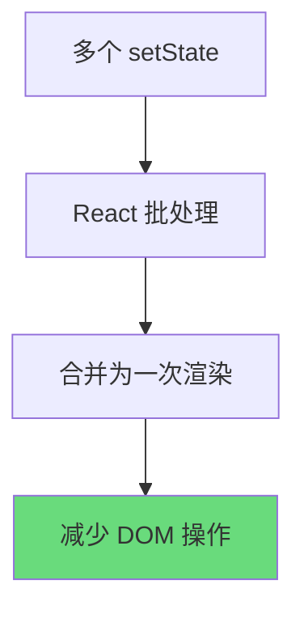
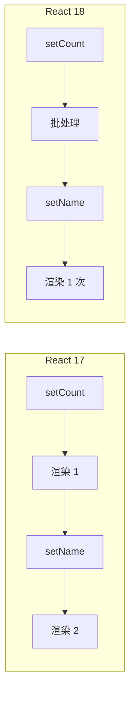
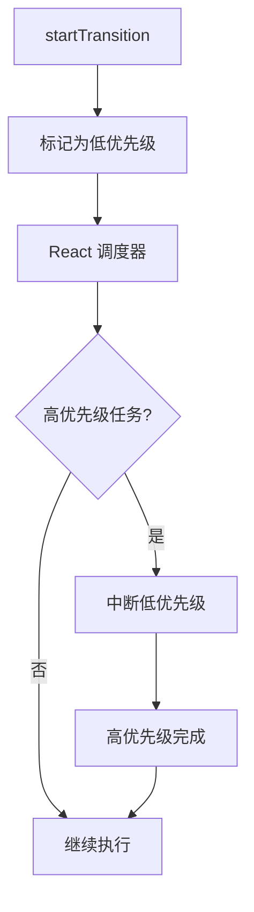
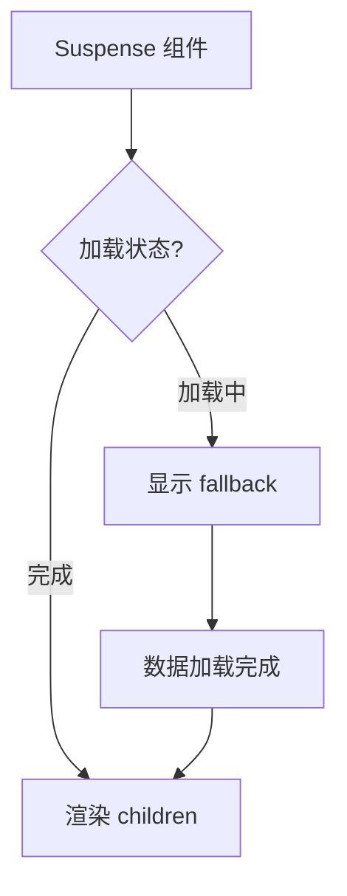
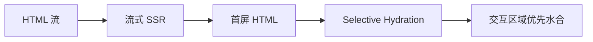
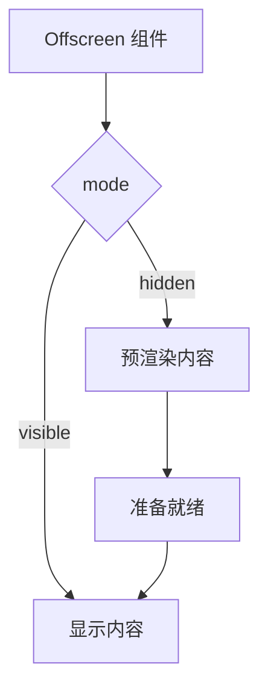

# React 18 新特性完全指南

React 18 于 2022 年 3 月正式发布，带来了革命性的并发渲染（Concurrent Rendering）能力。本文深入解析所有核心新特性。

---

## 1. Automatic Batching 详解

### 什么是批处理（batching）

批处理是 React 的一种优化机制，将多个状态更新合并为一次渲染，以减少不必要的 DOM 操作次数。



### React 17 vs React 18 批处理差异表

| 场景 | React 17 行为 | React 18 行为 |
|------|---------------|---------------|
| 事件处理函数 | 自动批处理 | 自动批处理 |
| `setTimeout` 回调 | 不批处理，分别渲染 2 次 | 自动批处理，只渲染 1 次 |
| Promise 回调 | 不批处理，分别渲染 2 次 | 自动批处理，只渲染 1 次 |
| `fetch` 回调 | 不批处理，分别渲染 2 次 | 自动批处理，只渲染 1 次 |
| 原生事件处理 | 不批处理 | 自动批处理 |
| `flushSync` 包裹 | 立即执行，退出批处理 | 立即执行，退出批处理 |

### 代码对比

```javascript
// React 17: 仅事件处理函数内批处理
setTimeout(() => {
  setCount(c => c + 1);  // 触发一次渲染
  setName('Bob');         // 触发另一次渲染
}, 1000);

// React 18: 所有场景自动批处理
setTimeout(() => {
  setCount(c => c + 1);  // 合并，不触发渲染
  setName('Bob');        // 合并，合并后触发一次渲染
}, 1000);
```

### 执行流程对比图



### 性能收益

批处理带来显著的性能提升：

```javascript
// 之前的写法（React 17）
setTimeout(() => {
  setLoading(true);
  fetchData().then(() => {
    setLoading(false);  // 额外渲染
    setData(result);
  });
}, 1000);

// React 18 优化后
setTimeout(() => {
  setLoading(true);
  fetchData().then(() => {
    setLoading(false);  // 与下一个 setData 合并
    setData(result);    // 一起渲染
  });
}, 1000);
```

---

## 2. Concurrent Features 并发特性

React 18 引入了并发渲染，允许 React 在渲染过程中中断和恢复任务，为用户体验带来质的飞跃。

### startTransition

`startTransition` 是标记非紧急更新的核心 API。

```javascript
import { startTransition } from 'react';

// 标记为非紧急更新
startTransition(() => {
  setSearchQuery(query);
  setSearchResults(results);
});
```

### useTransition vs useDeferredValue 对比表

| 特性 | `useTransition` | `useDeferredValue` |
|------|----------------|---------------------|
| 用途 | 包装状态更新逻辑 | 包装派生状态值 |
| 返回值 | `[isPending, startTransition]` | `deferredValue` |
| 适用场景 | 状态更新操作 | 输入→输出的转换 |
| 控制粒度 | 粗粒度（整个更新） | 细粒度（单个值） |
| 代码示例 | `startTransition(() => setText(input))` | `const deferredText = useDeferredValue(text)` |

### 代码示例对比

```javascript
// useTransition 用法
import { useTransition } from 'react';

function SearchComponent() {
  const [isPending, startTransition] = useTransition();
  const [query, setQuery] = useState('');
  const [results, setResults] = useState([]);

  function handleChange(e) {
    startTransition(() => {
      setQuery(e.target.value);
      setResults(computeResults(e.target.value));
    });
  }

  return (
    <div>
      <input onChange={handleChange} />
      {isPending ? <Spinner /> : <Results data={results} />}
    </div>
  );
}
```

```javascript
// useDeferredValue 用法
import { useDeferredValue } from 'react';

function SearchComponent() {
  const [query, setQuery] = useState('');
  const deferredQuery = useDeferredValue(query);
  const results = useMemo(() => {
    return computeResults(deferredQuery);
  }, [deferredQuery]);

  const isStale = query !== deferredQuery;

  return (
    <div>
      <input value={query} onChange={e => setQuery(e.target.value)} />
      <div style={{ opacity: isStale ? 0.5 : 1 }}>
        <Results data={results} />
      </div>
    </div>
  );
}
```

### 适用场景分析

| 场景 | 推荐方案 | 说明 |
|------|---------|------|
| 搜索输入，实时展示结果 | `useTransition` | 输入更新标记为非紧急 |
| 大列表渲染，数据来自 props | `useDeferredValue` | 对派生状态延迟处理 |
| 标签页切换 | `startTransition` | 整个切换作为非紧急更新 |
| 表单验证 | 不使用 | 需要立即反馈 |
| 文件上传进度 | 不使用 | 需要实时更新 |

### 并发调度流程图



---

## 3. Suspense 进阶

React 18 中的 Suspense 得到了显著增强，不再局限于代码分割。

### 配合 Data Fetching

Suspense 与 React Server Components 配合实现优雅的数据加载：

```javascript
import { Suspense } from 'react';

// 数据获取组件
function UserProfile({ id }) {
  const user = use(fetch(`/api/users/${id}`));
  return <div>{user.name}</div>;
}

// 列表组件
function UserList() {
  const users = use(fetch('/api/users'));
  return users.map(u => <UserProfile key={u.id} id={u.id} />);
}

// 页面组件
function App() {
  return (
    <Suspense fallback={<LoadingSkeleton />}>
      <UserList />
    </Suspense>
  );
}
```

### 配合 Code Splitting

```javascript
import { lazy, Suspense } from 'react';

const HeavyComponent = lazy(() => import('./HeavyComponent'));

function App() {
  return (
    <div>
      <Suspense fallback={<Spinner />}>
        <HeavyComponent />
      </Suspense>
    </div>
  );
}
```

### fallback 设计模式

#### 模式一：骨架屏

```javascript
function LoadingSkeleton() {
  return (
    <div className="skeleton">
      <div className="skeleton-avatar" />
      <div className="skeleton-text" />
      <div className="skeleton-text short" />
    </div>
  );
}

<Suspense fallback={<LoadingSkeleton />}>
  <Dashboard />
</Suspense>
```

#### 模式二：渐进式加载

```javascript
// 第一层：快速显示框架
<Suspense fallback={<BasicSkeleton />}>
  <CriticalContent />
</Suspense>

// 第二层：额外内容
<Suspense fallback={<null />}>
  <SecondaryContent />
</Suspense>
```

#### 模式三：流式加载

```javascript
function BlogPost() {
  return (
    <article>
      <Suspense fallback={<HeaderSkeleton />}>
        <Header />
      </Suspense>
      <Suspense fallback={<ContentSkeleton />}>
        <Content />
      </Suspense>
      <Suspense fallback={<CommentsSkeleton />}>
        <Comments />
      </Suspense>
    </article>
  );
}
```

### Suspense 并发状态图



---

## 4. New Root API

React 18 引入了全新的 Root API，替代了传统的 `render` 方法。

### API 对比

```javascript
// ============ React 17 ============
import { render } from 'react-dom';

const container = document.getElementById('root');
render(<App />, container);

// 卸载
unmountComponentAtNode(container);
```

```javascript
// ============ React 18 ============
import { createRoot } from 'react-dom/client';

const container = document.getElementById('root');
const root = createRoot(container);

// 渲染
root.render(<App />);

// 卸载（更清晰的 API）
root.unmount();
```

### 完整的初始化流程

```javascript
import { createRoot } from 'react-dom/client';

function main() {
  const container = document.getElementById('root');
  if (!container) {
    throw new Error('Root element not found');
  }

  // 创建 Root 实例
  const root = createRoot(container, {
    // 可选配置
    identifierPrefix: 'my-app',
    onRecoverableError: (error) => {
      console.error('Recoverable error:', error);
    },
  });

  // 渲染应用
  root.render(<App />);

  // 清理函数
  return () => root.unmount();
}

// TypeScript 类型
interface RootOptions {
  identifierPrefix?: string;
  onRecoverableError?: (error: Error) => void;
  transition?: Transition;
}
```

### hydrate 变化

```javascript
// React 17
import { hydrate } from 'react-dom';
hydrate(<App />, container);

// React 18
import { hydrateRoot } from 'react-dom/client';
hydrateRoot(container, <App />);
```

---

## 5. Strict Mode 变化

React 18 的 Strict Mode 引入了开发时的双重渲染机制，帮助发现潜在问题。

### 双重渲染行为

在开发模式下，React 会故意挂载组件两次以检测副作用问题：

```javascript
import { StrictMode } from 'react';

function App() {
  console.log('渲染');  // 会打印两次
  useEffect(() => {
    console.log('副作用');  // 也会执行两次
    return () => console.log('清理');  // 清理也会执行两次
  }, []);

  return <div>Content</div>;
}

// StrictMode 会导致:
// 渲染 → 渲染 → 副作用 → 清理 → 副作用
```

### 副作用重试验证

```javascript
function DataFetcher() {
  const [data, setData] = useState(null);

  useEffect(() => {
    let isSubscribed = true;

    fetchData().then(result => {
      if (isSubscribed) {
        setData(result);
      }
    });

    return () => {
      isSubscribed = false;
    };
  }, []);

  return <div>{data ? data.content : 'Loading...'}</div>;
}
```

### 依赖检测增强

React 18 能更准确地检测依赖数组遗漏：

```javascript
// 在 React 18 Strict Mode 下更容易发现问题
function Component({ id }) {
  const [value, setValue] = useState(null);

  // 缺少依赖 [id]，React 18 会警告
  useEffect(() => {
    fetchData(id).then(setValue);
  }, []);  // ⚠️ ESLint 会报错

  return <div>{value}</div>;
}
```

### Strict Mode 检查清单

| 检查项 | React 17 | React 18 |
|--------|----------|----------|
| 过期 setState 警告 | 有 | 有 |
| 意外副作用检测 | 无 | 有（双重渲染） |
| 过时的 Context API 警告 | 有 | 有 |
| 可恢复错误检测 | 无 | 有 |
| 检查不安全生命周期 | 有 | 有（增强） |

---

## 6. Client Rendering vs Streaming SSR

React 18 提供了更强大的服务端渲染能力，特别是流式 SSR。

### renderToReadableStream

React 18 的服务端渲染使用流式 API：

```javascript
import { renderToReadableStream } from 'react-dom/server';

async function handler(request) {
  const stream = await renderToReadableStream(
    <App />,
    {
      // SSR 配置
      bootstrapScripts: ['/main.js'],
      bootstrapModules: ['/module.js'],
      identifierPrefix: 'r18',
      namespace: 'HTML',
      prologue: ['<!DOCTYPE html>'],
      onError: (error) => {
        console.error('SSR Error:', error);
      },
    }
  );

  return new Response(stream, {
    headers: { 'content-type': 'text/html' },
  });
}
```

### Progressive Hydration 渐进式水合



### 实现示例

```javascript
// 服务端：流式 SSR
import { renderToReadableStream } from 'react-dom/server';

async function ssrHandler(request) {
  const stream = await renderToReadableStream(<App url={request.url} />, {
    bootstrapScripts: ['/client.js'],
  });

  return new Response(stream, {
    headers: {
      'content-type': 'text/html',
      'transfer-encoding': 'chunked',
    },
  });
}
```

```javascript
// 客户端：hydrateRoot
import { hydrateRoot } from 'react-dom/client';
import { startTransition } from 'react';

const root = hydrateRoot(document, <App />, {
  onRecoverableError: console.error,
});
```

---

## 7. Offscreen API (实验阶段)

Offscreen API 允许组件在不可见时进行预渲染，为未来内容做准备。

### Preparation 模式

```javascript
import { Offscreen } from 'react';

function App() {
  const [showPanel, setShowPanel] = useState(false);

  return (
    <div>
      <button onClick={() => setShowPanel(true)}>
        打开面板
      </button>

      {/* hidden 模式：预渲染内容，不显示 */}
      <Offscreen mode="hidden">
        <HeavyPanel />
      </Offscreen>

      {/* visible 模式：实际显示内容 */}
      {showPanel && (
        <Offscreen mode="visible">
          <HeavyPanel />
        </Offscreen>
      )}
    </div>
  );
}
```

### 预加载资源

```javascript
import { Offscreen } from 'react';

function preloadRoute(path) {
  return (
    <Offscreen mode="hidden">
      <LinkPreview path={path} />
      <RouteCache path={path} />
    </Offscreen>
  );
}

// 鼠标悬停时预加载
function NavLink({ to, children }) {
  const [preload, setPreload] = useState(false);

  return (
    <div onMouseEnter={() => setPreload(true)}>
      <a href={to}>{children}</a>
      {preload && <Offscreen mode="hidden">{to}</Offscreen>}
    </div>
  );
}
```

### API 参考

| 属性 | 类型 | 说明 |
|------|------|------|
| `mode` | `'visible' \| 'hidden'` | 显示或预渲染模式 |
| `children` | ReactNode | 子组件 |

### 技术原理图



---

## 总结

React 18 的核心改进：

| 特性 | 主要收益 |
|------|---------|
| Automatic Batching | 减少渲染次数，提升性能 |
| Concurrent Features | 保持 UI 响应，避免卡顿 |
| Suspense 增强 | 优雅的数据加载体验 |
| New Root API | 更清晰的架构 |
| Strict Mode 增强 | 更可靠的代码 |
| Streaming SSR | 更快的首屏加载 |
| Offscreen API | 预加载未来内容 |

### 迁移检查清单

- [ ] 更新 React 和 React DOM 到 18.x
- [ ] 将 `render()` 迁移到 `createRoot()`
- [ ] 移除 `unmountComponentAtNode`，改用 `root.unmount()`
- [ ] 检查 setTimeout/Promise 中的状态更新
- [ ] 在适当场景使用 `startTransition`
- [ ] 启用 Strict Mode 发现潜在问题
- [ ] 测试 Suspense 边界行为

---

**延伸阅读**

- [React 18 官方博客](https://react.dev/blog/2022/03/29/react-v18)
- [并发渲染文档](https://react.dev/learn/concurrent-rendering)
- [useTransition API](https://react.dev/reference/react/useTransition)