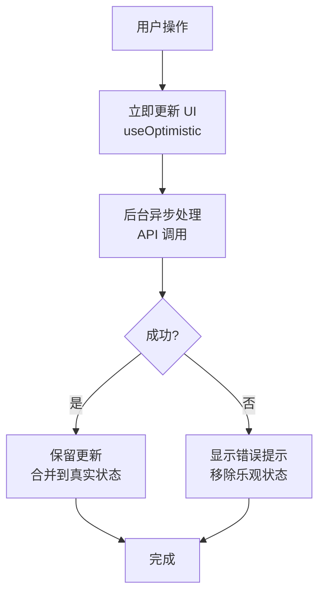
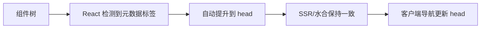
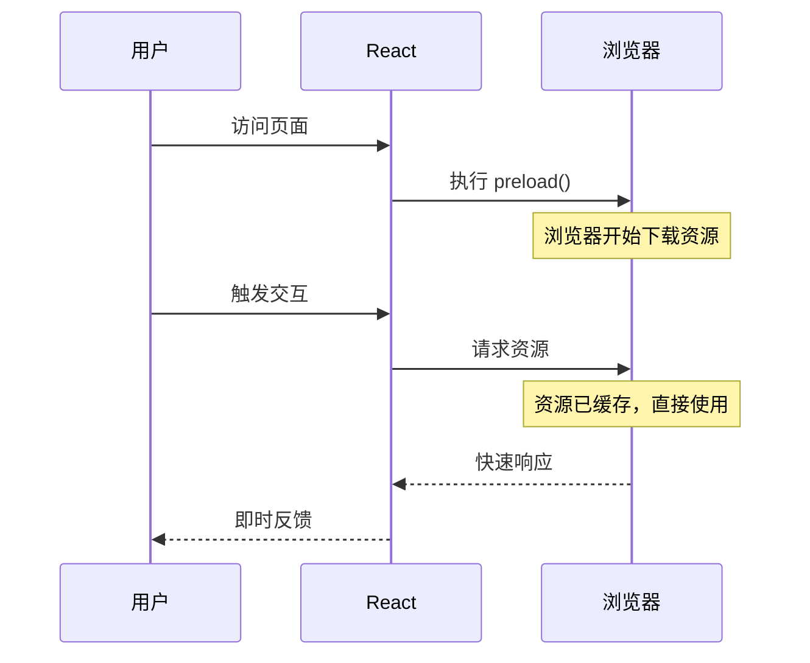
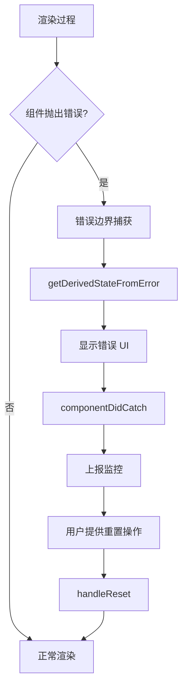
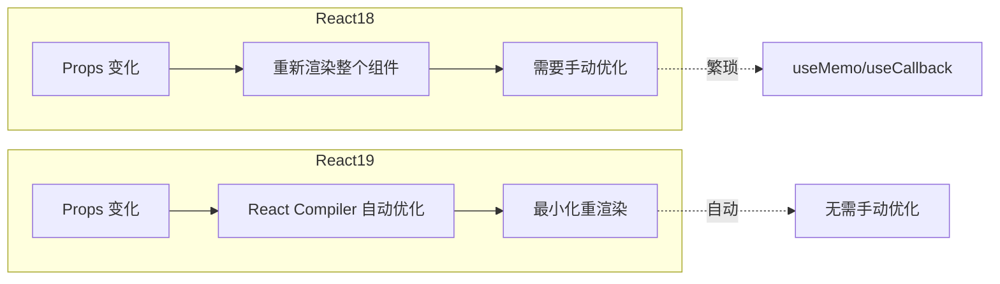
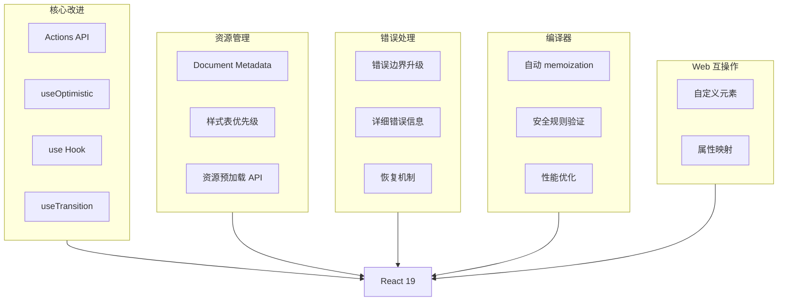
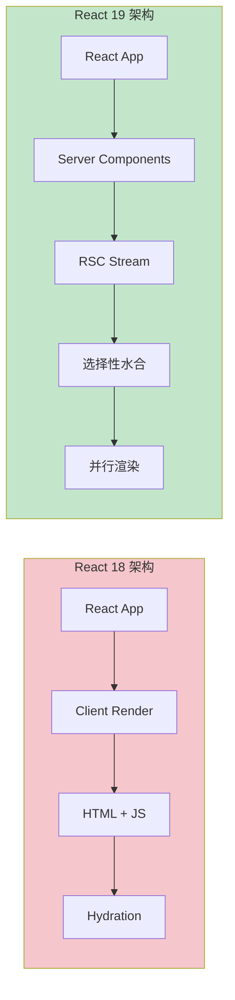
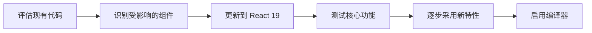

# React 19 新特性预览

> 本文档涵盖 React 19 的核心新特性，包括 Actions、新的 Hooks、资源预加载、错误边界改进等内容。
>
> **注意：** React 19 部分特性仍处于试验阶段，生产环境使用前请查阅官方文档确认稳定性。
>
> **最后更新：** 2026-05-15 | **版本：** 1.0 | **覆盖：** Actions / useOptimistic / use() / 资源预加载 / 错误边界

---

## 1. Actions 与 Pending States

### 1.1 useTransition 的新 API

React 19 增强了 `useTransition`，使其能够自动管理 pending 状态，不再需要手动维护加载状态。

```javascript
import { useTransition } from 'react';

// React 19：isPending 由 useTransition 自动管理
function Search() {
  const [isPending, startTransition] = useTransition();
  const [query, setQuery] = useState('');

  function handleSearch(e) {
    startTransition(() => {
      setQuery(e.target.value);
      // 异步操作会自动标记为过渡更新
      fetchResults(e.target.value);
    });
  }

  return (
    <div>
      <input onChange={handleSearch} />
      {isPending && <Spinner />}
      {/* 结果列表会自动在 pending 期间显示加载状态 */}
      <Results query={query} />
    </div>
  );
}
```

### 1.2 Pending 状态自动管理

传统方式需要手动管理 loading 状态，React 19 简化了这一流程：

```javascript
// 传统方式（React 18）
const [isLoading, setIsLoading] = useState(false);

async function handleSubmit(e) {
  e.preventDefault();
  setIsLoading(true);
  try {
    await submitForm(data);
  } finally {
    setIsLoading(false);
  }
}

// React 19：useActionState 自动处理 pending 状态
import { useActionState } from 'react';

function Form() {
  const [state, formAction, isPending] = useActionState(
    async (previousState, formData) => {
      const result = await submitForm(Object.fromEntries(formData));
      return result;
    },
    null  // 初始状态
  );

  return (
    <form action={formAction}>
      <input name="email" type="email" />
      <button type="submit" disabled={isPending}>
        {isPending ? '提交中...' : '提交'}
      </button>
      {state?.error && <p className="error">{state.error}</p>}
    </form>
  );
}
```

### 1.3 乐观更新模式

React 19 引入了 `useOptimistic`，支持乐观更新（Optimistic UI）模式：

```javascript
// 乐观更新：立即显示预期结果，后台异步处理
// 如果失败则回滚到实际状态
function LikeButton({ likes, onLike }) {
  const [optimisticLikes, addLike] = useOptimistic(
    likes,
    (state, newLike) => state + newLike
  );

  async function handleLike() {
    addLike(1);  // 立即更新 UI
    try {
      await submitLike();
    } catch {
      // 失败时自动回滚（由 useOptimistic 处理）
    }
  }

  return <button onClick={handleLike}>{optimisticLikes} 赞</button>;
}
```

---

## 2. useOptimistic Hook

```javascript
// React 19 新 Hook 签名
function useOptimistic<T>(
  initialState: T,
  updateFn: (state: T, ...args: any[]) => T
): [T, (...args: any[]) => void];
```

### 2.1 基本用法

```javascript
import { useOptimistic, useState } from 'react';
import { createTodo, updateTodo } from './actions';

function TodoList() {
  const [todos, setTodos] = useState([]);
  const [optimisticTodos, addOptimisticTodo] = useOptimistic(
    todos,
    (state, newTodo) => [...state, { id: Date.now(), text: newTodo, pending: true }]
  );

  async function handleAddTodo(text) {
    const optimisticTodo = { id: 'temp', text, pending: true };
    addOptimisticTodo(optimisticTodo);

    try {
      const created = await createTodo(text);
      setTodos(prev => [...prev, created]);
    } catch {
      // 乐观更新失败，回滚
    }
  }

  return (
    <ul>
      {optimisticTodos.map(todo => (
        <li key={todo.id} style={{ opacity: todo.pending ? 0.6 : 1 }}>
          {todo.text}
        </li>
      ))}
    </ul>
  );
}
```

### 2.2 乐观更新的生命周期



### 2.3 表单乐观更新

```javascript
import { useActionState, useOptimistic } from 'react';

function CommentForm({ postId, addComment }) {
  const [optimisticComment, setOptimisticComment] = useOptimistic(
    null,
    (state, formData) => ({
      id: 'pending-' + Date.now(),
      text: formData.get('text'),
      author: '当前用户',
      pending: true
    })
  );

  const [state, formAction, isPending] = useActionState(
    async (prev, formData) => {
      const text = formData.get('text');
      return await addComment(text);
    },
    null
  );

  return (
    <form action={formAction}>
      <textarea name="text" placeholder="写评论..." />
      <button type="submit" disabled={isPending}>
        {isPending ? '发送中...' : '发送'}
      </button>
      {optimisticComment && (
        <div className="optimistic-comment">
          {optimisticComment.text}
        </div>
      )}
    </form>
  );
}
```

---

## 3. use() Hook

`use()` 是 React 19 引入的新 Hook，可以在组件中读取 Promise 或 Context。

### 3.1 读取 Promise

```javascript
import { use, Suspense } from 'react';

function UserProfile({ userPromise }) {
  // use() 暂停组件直到 Promise resolve
  const user = use(userPromise);

  return <h1>{user.name}</h1>;
}

// 使用 Suspense 包裹
function App() {
  return (
    <Suspense fallback={<div>加载中...</div>}>
      <UserProfile userPromise={fetchUser()} />
    </Suspense>
  );
}
```

### 3.2 读取 Context

`use()` 也可以读取 Context，与 `useContext` 的区别在于可以在条件语句中使用：

```javascript
import { use, useContext } from 'react';

const ThemeContext = createContext('light');
const UserContext = createContext(null);

function Greeting() {
  // useContext 必须放在组件顶层
  const theme = useContext(ThemeContext);

  // use() 可以在条件语句中使用
  const user = use(UserContext);

  if (!user) {
    return <div>请登录</div>;
  }

  return <div className={theme}>你好，{user.name}</div>;
}

// 更灵活的写法
function ConditionalGreeting() {
  const theme = use(ThemeContext);

  // 可以在条件中读取不同的 Context
  if (someCondition) {
    const user = use(UserContext);
    return <div>{user?.name}</div>;
  }

  return <div>默认主题：{theme}</div>;
}
```

### 3.3 读取 Thenable

`use()` 可以读取任何 thenable 对象（具有 `.then()` 方法的对象）：

```javascript
function DataFetcher({ dataSource }) {
  // 支持 Promise、自定义 thenable、或带缓存的 DataLoader 模式
  const data = use(dataSource);

  return <div>{data}</div>;
}

// 自定义 thenable
const customThenable = {
  then(resolve) {
    setTimeout(() => resolve('数据加载完成'), 1000);
  }
};

function App() {
  return (
    <Suspense fallback={<div>加载中...</div>}>
      <DataFetcher dataSource={customThenable} />
    </Suspense>
  );
}
```

---

## 4. 文档元数据 (Document Metadata)

React 19 允许在组件中直接渲染 `<title>`、`<meta>` 等标签，React 会自动将它们提升到文档的 `<head>`。

### 4.1 基本用法

```javascript
function BlogPost({ post }) {
  return (
    <article>
      {/* React 19：这些标签会自动移动到 <head> */}
      <title>{post.title}</title>
      <meta name="description" content={post.excerpt} />
      <meta property="og:title" content={post.title} />
      <link rel="canonical" href={post.url} />

      <h1>{post.title}</h1>
      <div>{post.content}</div>
    </article>
  );
}

// 在嵌套层级中也可以使用
function Layout({ children }) {
  return (
    <div className="layout">
      <Header />
      <main>
        {/* 即使在嵌套组件中也会提升到 head */}
        {children}
      </main>
    </div>
  );
}
```

### 4.2 元数据渲染流程



### 4.3 样式表支持

React 19 改进了样式表资源的处理：

```javascript
function ThemeProvider({ children }) {
  return (
    <>
      {/* 资源预加载 API */}
      <link
        rel="stylesheet"
        href="/themes/dark.css"
        precedence="medium"
      />
      {/* 或使用专门的 API */}
      <style href="/themes/dark.css" precedence="medium" />
      {children}
    </>
  );
}

// 样式表优先级
// precedence="low" - 低优先级，可被其他样式覆盖
// precedence="medium" - 默认优先级
// precedence="high" - 高优先级
```

---

## 5. 资源预加载 API

React 19 引入了一组新的 API 来预加载各种资源，优化加载性能。

### 5.1 预加载函数

```javascript
import {
  prefetchDNS,
  preconnect,
  preload,
  preinit
} from 'react-dom';

// DNS 预解析
function ExternalWidget() {
  useEffect(() => {
    prefetchDNS('https://api.external-service.com');
  }, []);

  return <Widget />;
}

// 预连接（建立 TCP/TLS 连接）
function AnalyticsDashboard() {
  useEffect(() => {
    preconnect('https://analytics.example.com', {
      crossOrigin: 'anonymous'
    });
  }, []);

  return <Dashboard />;
}

// 预加载资源
function ProductPage({ product }) {
  useEffect(() => {
    // 预加载产品图片
    preload(product.imageUrl, { as: 'image' });

    // 预加载字体
    preload('/fonts/product-font.woff2', { as: 'font', type: 'font/woff2' });

    // 预加载 JS 模块
    preload('/js/product-detail.js', { as: 'script' });
  }, [product]);

  return <ProductView product={product} />;
}

// 预初始化模块
function InteractiveComponent() {
  useEffect(() => {
    preinit('/js/interactive.js', { as: 'script', type: 'module' });
  }, []);

  return <Interactive />;
}
```

### 5.2 资源预加载时序图



### 5.3 资源加载状态追踪

```javascript
import { useResource } from 'react-dom';

function ImageGallery({ imageUrls }) {
  // 追踪资源加载状态
  const [status, loadImage] = useResource(
    (url) => new Promise((resolve) => {
      const img = new Image();
      img.onload = () => resolve('loaded');
      img.onerror = () => resolve('error');
      img.src = url;
    })
  );

  return (
    <div>
      {imageUrls.map((url, i) => (
        
      ))}
    </div>
  );
}
```

---

## 6. 错误边界改进

React 19 增强了错误边界的能力，提供更详细的错误信息和恢复机制。

### 6.1 新的错误边界 API

```javascript
import { ErrorBoundary } from 'react';

function ErrorFallback({ error, reset }) {
  return (
    <div role="alert">
      <h2>发生错误</h2>
      <p>{error.message}</p>
      <details>
        <summary>查看详情</summary>
        <pre>{error.stack}</pre>
      </details>
      <button onClick={reset}>重试</button>
    </div>
  );
}

function App() {
  return (
    <ErrorBoundary fallback={<ErrorFallback />}>
      <UserProfile />
    </ErrorBoundary>
  );
}
```

### 6.2 带状态恢复的错误边界

```javascript
class RecoverableErrorBoundary extends Component {
  constructor(props) {
    super(props);
    this.state = { hasError: false, error: null };
  }

  static getDerivedStateFromError(error) {
    return { hasError: true, error };
  }

  componentDidCatch(error, errorInfo) {
    // 可以将错误上报到监控系统
    logError(error, errorInfo);
  }

  handleReset = () => {
    this.setState({ hasError: false, error: null });
  };

  render() {
    if (this.state.hasError) {
      return (
        <div>
          <h2>哎呀，出问题了</h2>
          <p>我们可以尝试恢复。</p>
          <button onClick={this.handleReset}>
            重置应用状态
          </button>
        </div>
      );
    }

    return this.props.children;
  }
}
```

### 6.3 错误边界架构



---

## 7. 自定义元素 (Web Components)

React 19 改进了对 Web Components 的支持。

### 7.1 基本集成

```javascript
// 定义 Web Component
class MyDialog extends HTMLElement {
  connectedCallback() {
    this.attachShadow({ mode: 'open' });
    this.shadowRoot.innerHTML = `
      <dialog>
        <slot></slot>
      </dialog>
    `;
  }
}

customElements.define('my-dialog', MyDialog);

// 在 React 中使用
function App() {
  return (
    <div>
      {/* React 19 更好地处理自定义元素 */}
      <my-dialog>
        <h2>标题</h2>
        <p>内容</p>
      </my-dialog>
    </div>
  );
}
```

### 7.2 属性映射改进

```javascript
// React 19 支持更好的属性传递
function CustomInput() {
  return (
    <input
      is="custom-text-input"  // 自定义元素
      value={value}
      onValueChange={setValue}  // React 会自动处理事件
      placeholder="输入文字..."
    />
  );
}
```

---

## 8. React 编译器优化

React 编译器（原名 React Forget）会自动插入 `useMemo`、`useCallback` 和 `React.memo`，减少手动优化代码。

### 8.1 编译前

```javascript
// 开发者写的代码
function ProductList({ products, filter }) {
  const filteredProducts = products.filter(p =>
    p.name.toLowerCase().includes(filter.toLowerCase())
  );

  const sortedProducts = [...filteredProducts].sort((a, b) =>
    a.price - b.price
  );

  return (
    <ul>
      {sortedProducts.map(p => (
        <ProductItem key={p.id} product={p} />
      ))}
    </ul>
  );
}
```

### 8.2 编译后（自动优化）

```javascript
// React 编译器自动插入的优化
function ProductList({ products, filter }) {
  const filteredProducts = useMemo(() =>
    products.filter(p =>
      p.name.toLowerCase().includes(filter.toLowerCase())
    ),
    [products, filter]
  );

  const sortedProducts = useMemo(() =>
    [...filteredProducts].sort((a, b) => a.price - b.price),
    [filteredProducts]
  );

  return (
    <ul>
      {sortedProducts.map(p => (
        <ProductItem key={p.id} product={p} />
      ))}
    </ul>
  );
}
```

### 8.3 编译器安全规则

```javascript
// React 编译器规则
// 1. 不允许 mutations outside of component
// 2. 遵守 React 的 purity rules
// 3. 避免使用非确定性操作

// 可以被优化的模式
let cache = {};
function getData(key) {
  if (cache[key]) return cache[key];  // 可能导致问题
  cache[key] = fetch(key);
  return cache[key];
}

// React 编译器会警告这类代码
```

### 8.4 React 18 vs React 19 重渲染对比



---

## 9. React 19 架构总览

### 9.1 新特性全景图



### 9.2 渲染架构变化



### 9.3 并发特性演进

| 特性 | React 18 | React 19 | 改进 |
|------|----------|----------|------|
| `useTransition` | 手动管理 pending | 自动管理 | 简化 API |
| `useDeferredValue` | 原有 | 原有 | 保持不变 |
| 乐观更新 | 第三方库 | 内置 `useOptimistic` | 零配置 |
| 错误边界 | 基本支持 | 增强恢复 | 更详细的错误信息 |
| 资源预加载 | 手动 DOM 操作 | 内置 API | 原生支持 |

---

## 10. 升级注意事项

### 10.1 新增依赖

```bash
npm install react@19 react-dom@19
```

### 10.2 API 变化

| API | 变化 | 迁移建议 |
|-----|------|----------|
| `<form>` action | 新增 FormAction | 使用 `useActionState` |
| `useTransition` | 增加 isPending | 移除手动状态 |
| `useEffect` | 行为微调 | 测试验证 |

### 10.3 废弃警告

```javascript
// React 19 中已废弃
// 旧写法
const value = useRef(initialValue).current;

// 新写法
const value = useRef(initialValue);
```

### 10.4 推荐的迁移路径



---

## 11. 使用建议

### 11.1 新项目

新项目可以直接使用 React 19，利用全部新特性：

```javascript
// 使用最新的 API
import { useActionState, useOptimistic } from 'react';
```

### 11.2 现有项目升级

建议分阶段升级：

1. **第一阶段**：升级依赖，测试基础功能
2. **第二阶段**：采用新的 Actions API
3. **第三阶段**：使用 `useOptimistic` 改进 UX
4. **第四阶段**：启用 React 编译器

### 11.3 稳定性评估

```javascript
// React 19 特性稳定性矩阵

const features = {
  stable: [
    'use() Hook',
    'useActionState',
    'useOptimistic',
    'useTransition 增强',
    'Document Metadata'
  ],
  experimental: [
    'React Compiler',
    '部分资源预加载 API'
  ],
  deprecated: [
    '旧版错误边界 API'
  ]
};
```

---

## 参考资源

| 资源 | 链接 |
|------|------|
| React 官方博客 | https://react.dev/blog |
| React 19 Alpha | https://react.dev/blog/react-19-alpha |
| React Compiler | https://react.dev/learn/compiler |
| RFC 文档 | https://github.com/reactjs/rfcs |

---

> **提示：** React 19 的部分特性可能随版本更新而调整，生产环境使用前请查阅最新的官方文档。